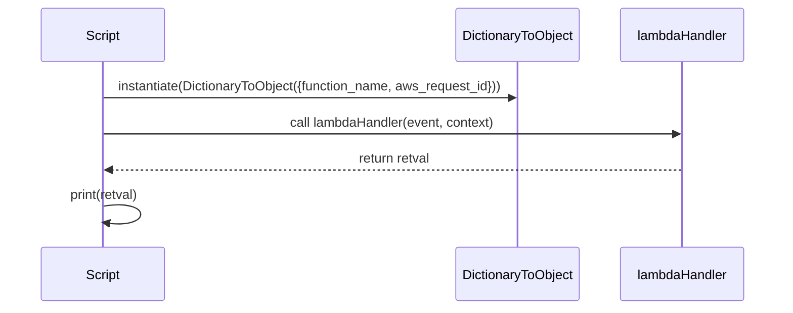
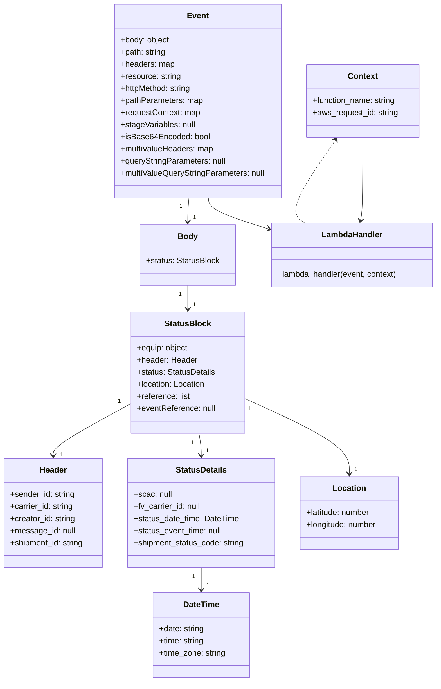

# Diagram: tools/ide_local_testing/localTest/test/byEvent/ltlUpdate.py

> Auto-generated by Obscura crawlers

## Diagram 1

### SVG

<svg id="container" width="1002" xmlns="http://www.w3.org/2000/svg" height="393" viewBox="-50 -10 1002 393" role="graphics-document document" aria-roledescription="sequence"><g><rect x="752" y="307" fill="#eaeaea" stroke="#666" width="150" height="65" name="lambda" rx="3" ry="3" class="actor actor-bottom"></rect><text x="827" y="339.5" dominant-baseline="central" alignment-baseline="central" class="actor actor-box" style="text-anchor: middle; font-size: 16px; font-weight: 400;"><tspan x="827" dy="0">lambdaHandler</tspan></text></g><g><rect x="544" y="307" fill="#eaeaea" stroke="#666" width="158" height="65" name="localTest" rx="3" ry="3" class="actor actor-bottom"></rect><text x="623" y="339.5" dominant-baseline="central" alignment-baseline="central" class="actor actor-box" style="text-anchor: middle; font-size: 16px; font-weight: 400;"><tspan x="623" dy="0">DictionaryToObject</tspan></text></g><g><rect x="0" y="307" fill="#eaeaea" stroke="#666" width="150" height="65" name="Script" rx="3" ry="3" class="actor actor-bottom"></rect><text x="75" y="339.5" dominant-baseline="central" alignment-baseline="central" class="actor actor-box" style="text-anchor: middle; font-size: 16px; font-weight: 400;"><tspan x="75" dy="0">Script</tspan></text></g><g><line id="actor2" x1="827" y1="65" x2="827" y2="307" class="actor-line 200" stroke-width="0.5px" stroke="#999" name="lambda"></line><g id="root-2"><rect x="752" y="0" fill="#eaeaea" stroke="#666" width="150" height="65" name="lambda" rx="3" ry="3" class="actor actor-top"></rect><text x="827" y="32.5" dominant-baseline="central" alignment-baseline="central" class="actor actor-box" style="text-anchor: middle; font-size: 16px; font-weight: 400;"><tspan x="827" dy="0">lambdaHandler</tspan></text></g></g><g><line id="actor1" x1="623" y1="65" x2="623" y2="307" class="actor-line 200" stroke-width="0.5px" stroke="#999" name="localTest"></line><g id="root-1"><rect x="544" y="0" fill="#eaeaea" stroke="#666" width="158" height="65" name="localTest" rx="3" ry="3" class="actor actor-top"></rect><text x="623" y="32.5" dominant-baseline="central" alignment-baseline="central" class="actor actor-box" style="text-anchor: middle; font-size: 16px; font-weight: 400;"><tspan x="623" dy="0">DictionaryToObject</tspan></text></g></g><g><line id="actor0" x1="75" y1="65" x2="75" y2="307" class="actor-line 200" stroke-width="0.5px" stroke="#999" name="Script"></line><g id="root-0"><rect x="0" y="0" fill="#eaeaea" stroke="#666" width="150" height="65" name="Script" rx="3" ry="3" class="actor actor-top"></rect><text x="75" y="32.5" dominant-baseline="central" alignment-baseline="central" class="actor actor-box" style="text-anchor: middle; font-size: 16px; font-weight: 400;"><tspan x="75" dy="0">Script</tspan></text></g></g><g></g><defs><symbol id="computer" width="24" height="24"><path transform="scale(.5)" d="M2 2v13h20v-13h-20zm18 11h-16v-9h16v9zm-10.228 6l.466-1h3.524l.467 1h-4.457zm14.228 3h-24l2-6h2.104l-1.33 4h18.45l-1.297-4h2.073l2 6zm-5-10h-14v-7h14v7z"></path></symbol></defs><defs><symbol id="database" fill-rule="evenodd" clip-rule="evenodd"><path transform="scale(.5)" d="M12.258.001l.256.004.255.005.253.008.251.01.249.012.247.015.246.016.242.019.241.02.239.023.236.024.233.027.231.028.229.031.225.032.223.034.22.036.217.038.214.04.211.041.208.043.205.045.201.046.198.048.194.05.191.051.187.053.183.054.18.056.175.057.172.059.168.06.163.061.16.063.155.064.15.066.074.033.073.033.071.034.07.034.069.035.068.035.067.035.066.035.064.036.064.036.062.036.06.036.06.037.058.037.058.037.055.038.055.038.053.038.052.038.051.039.05.039.048.039.047.039.045.04.044.04.043.04.041.04.04.041.039.041.037.041.036.041.034.041.033.042.032.042.03.042.029.042.027.042.026.043.024.043.023.043.021.043.02.043.018.044.017.043.015.044.013.044.012.044.011.045.009.044.007.045.006.045.004.045.002.045.001.045v17l-.001.045-.002.045-.004.045-.006.045-.007.045-.009.044-.011.045-.012.044-.013.044-.015.044-.017.043-.018.044-.02.043-.021.043-.023.043-.024.043-.026.043-.027.042-.029.042-.03.042-.032.042-.033.042-.034.041-.036.041-.037.041-.039.041-.04.041-.041.04-.043.04-.044.04-.045.04-.047.039-.048.039-.05.039-.051.039-.052.038-.053.038-.055.038-.055.038-.058.037-.058.037-.06.037-.06.036-.062.036-.064.036-.064.036-.066.035-.067.035-.068.035-.069.035-.07.034-.071.034-.073.033-.074.033-.15.066-.155.064-.16.063-.163.061-.168.06-.172.059-.175.057-.18.056-.183.054-.187.053-.191.051-.194.05-.198.048-.201.046-.205.045-.208.043-.211.041-.214.04-.217.038-.22.036-.223.034-.225.032-.229.031-.231.028-.233.027-.236.024-.239.023-.241.02-.242.019-.246.016-.247.015-.249.012-.251.01-.253.008-.255.005-.256.004-.258.001-.258-.001-.256-.004-.255-.005-.253-.008-.251-.01-.249-.012-.247-.015-.245-.016-.243-.019-.241-.02-.238-.023-.236-.024-.234-.027-.231-.028-.228-.031-.226-.032-.223-.034-.22-.036-.217-.038-.214-.04-.211-.041-.208-.043-.204-.045-.201-.046-.198-.048-.195-.05-.19-.051-.187-.053-.184-.054-.179-.056-.176-.057-.172-.059-.167-.06-.164-.061-.159-.063-.155-.064-.151-.066-.074-.033-.072-.033-.072-.034-.07-.034-.069-.035-.068-.035-.067-.035-.066-.035-.064-.036-.063-.036-.062-.036-.061-.036-.06-.037-.058-.037-.057-.037-.056-.038-.055-.038-.053-.038-.052-.038-.051-.039-.049-.039-.049-.039-.046-.039-.046-.04-.044-.04-.043-.04-.041-.04-.04-.041-.039-.041-.037-.041-.036-.041-.034-.041-.033-.042-.032-.042-.03-.042-.029-.042-.027-.042-.026-.043-.024-.043-.023-.043-.021-.043-.02-.043-.018-.044-.017-.043-.015-.044-.013-.044-.012-.044-.011-.045-.009-.044-.007-.045-.006-.045-.004-.045-.002-.045-.001-.045v-17l.001-.045.002-.045.004-.045.006-.045.007-.045.009-.044.011-.045.012-.044.013-.044.015-.044.017-.043.018-.044.02-.043.021-.043.023-.043.024-.043.026-.043.027-.042.029-.042.03-.042.032-.042.033-.042.034-.041.036-.041.037-.041.039-.041.04-.041.041-.04.043-.04.044-.04.046-.04.046-.039.049-.039.049-.039.051-.039.052-.038.053-.038.055-.038.056-.038.057-.037.058-.037.06-.037.061-.036.062-.036.063-.036.064-.036.066-.035.067-.035.068-.035.069-.035.07-.034.072-.034.072-.033.074-.033.151-.066.155-.064.159-.063.164-.061.167-.06.172-.059.176-.057.179-.056.184-.054.187-.053.19-.051.195-.05.198-.048.201-.046.204-.045.208-.043.211-.041.214-.04.217-.038.22-.036.223-.034.226-.032.228-.031.231-.028.234-.027.236-.024.238-.023.241-.02.243-.019.245-.016.247-.015.249-.012.251-.01.253-.008.255-.005.256-.004.258-.001.258.001zm-9.258 20.499v.01l.001.021.003.021.004.022.005.021.006.022.007.022.009.023.01.022.011.023.012.023.013.023.015.023.016.024.017.023.018.024.019.024.021.024.022.025.023.024.024.025.052.049.056.05.061.051.066.051.07.051.075.051.079.052.084.052.088.052.092.052.097.052.102.051.105.052.11.052.114.051.119.051.123.051.127.05.131.05.135.05.139.048.144.049.147.047.152.047.155.047.16.045.163.045.167.043.171.043.176.041.178.041.183.039.187.039.19.037.194.035.197.035.202.033.204.031.209.03.212.029.216.027.219.025.222.024.226.021.23.02.233.018.236.016.24.015.243.012.246.01.249.008.253.005.256.004.259.001.26-.001.257-.004.254-.005.25-.008.247-.011.244-.012.241-.014.237-.016.233-.018.231-.021.226-.021.224-.024.22-.026.216-.027.212-.028.21-.031.205-.031.202-.034.198-.034.194-.036.191-.037.187-.039.183-.04.179-.04.175-.042.172-.043.168-.044.163-.045.16-.046.155-.046.152-.047.148-.048.143-.049.139-.049.136-.05.131-.05.126-.05.123-.051.118-.052.114-.051.11-.052.106-.052.101-.052.096-.052.092-.052.088-.053.083-.051.079-.052.074-.052.07-.051.065-.051.06-.051.056-.05.051-.05.023-.024.023-.025.021-.024.02-.024.019-.024.018-.024.017-.024.015-.023.014-.024.013-.023.012-.023.01-.023.01-.022.008-.022.006-.022.006-.022.004-.022.004-.021.001-.021.001-.021v-4.127l-.077.055-.08.053-.083.054-.085.053-.087.052-.09.052-.093.051-.095.05-.097.05-.1.049-.102.049-.105.048-.106.047-.109.047-.111.046-.114.045-.115.045-.118.044-.12.043-.122.042-.124.042-.126.041-.128.04-.13.04-.132.038-.134.038-.135.037-.138.037-.139.035-.142.035-.143.034-.144.033-.147.032-.148.031-.15.03-.151.03-.153.029-.154.027-.156.027-.158.026-.159.025-.161.024-.162.023-.163.022-.165.021-.166.02-.167.019-.169.018-.169.017-.171.016-.173.015-.173.014-.175.013-.175.012-.177.011-.178.01-.179.008-.179.008-.181.006-.182.005-.182.004-.184.003-.184.002h-.37l-.184-.002-.184-.003-.182-.004-.182-.005-.181-.006-.179-.008-.179-.008-.178-.01-.176-.011-.176-.012-.175-.013-.173-.014-.172-.015-.171-.016-.17-.017-.169-.018-.167-.019-.166-.02-.165-.021-.163-.022-.162-.023-.161-.024-.159-.025-.157-.026-.156-.027-.155-.027-.153-.029-.151-.03-.15-.03-.148-.031-.146-.032-.145-.033-.143-.034-.141-.035-.14-.035-.137-.037-.136-.037-.134-.038-.132-.038-.13-.04-.128-.04-.126-.041-.124-.042-.122-.042-.12-.044-.117-.043-.116-.045-.113-.045-.112-.046-.109-.047-.106-.047-.105-.048-.102-.049-.1-.049-.097-.05-.095-.05-.093-.052-.09-.051-.087-.052-.085-.053-.083-.054-.08-.054-.077-.054v4.127zm0-5.654v.011l.001.021.003.021.004.021.005.022.006.022.007.022.009.022.01.022.011.023.012.023.013.023.015.024.016.023.017.024.018.024.019.024.021.024.022.024.023.025.024.024.052.05.056.05.061.05.066.051.07.051.075.052.079.051.084.052.088.052.092.052.097.052.102.052.105.052.11.051.114.051.119.052.123.05.127.051.131.05.135.049.139.049.144.048.147.048.152.047.155.046.16.045.163.045.167.044.171.042.176.042.178.04.183.04.187.038.19.037.194.036.197.034.202.033.204.032.209.03.212.028.216.027.219.025.222.024.226.022.23.02.233.018.236.016.24.014.243.012.246.01.249.008.253.006.256.003.259.001.26-.001.257-.003.254-.006.25-.008.247-.01.244-.012.241-.015.237-.016.233-.018.231-.02.226-.022.224-.024.22-.025.216-.027.212-.029.21-.03.205-.032.202-.033.198-.035.194-.036.191-.037.187-.039.183-.039.179-.041.175-.042.172-.043.168-.044.163-.045.16-.045.155-.047.152-.047.148-.048.143-.048.139-.05.136-.049.131-.05.126-.051.123-.051.118-.051.114-.052.11-.052.106-.052.101-.052.096-.052.092-.052.088-.052.083-.052.079-.052.074-.051.07-.052.065-.051.06-.05.056-.051.051-.049.023-.025.023-.024.021-.025.02-.024.019-.024.018-.024.017-.024.015-.023.014-.023.013-.024.012-.022.01-.023.01-.023.008-.022.006-.022.006-.022.004-.021.004-.022.001-.021.001-.021v-4.139l-.077.054-.08.054-.083.054-.085.052-.087.053-.09.051-.093.051-.095.051-.097.05-.1.049-.102.049-.105.048-.106.047-.109.047-.111.046-.114.045-.115.044-.118.044-.12.044-.122.042-.124.042-.126.041-.128.04-.13.039-.132.039-.134.038-.135.037-.138.036-.139.036-.142.035-.143.033-.144.033-.147.033-.148.031-.15.03-.151.03-.153.028-.154.028-.156.027-.158.026-.159.025-.161.024-.162.023-.163.022-.165.021-.166.02-.167.019-.169.018-.169.017-.171.016-.173.015-.173.014-.175.013-.175.012-.177.011-.178.009-.179.009-.179.007-.181.007-.182.005-.182.004-.184.003-.184.002h-.37l-.184-.002-.184-.003-.182-.004-.182-.005-.181-.007-.179-.007-.179-.009-.178-.009-.176-.011-.176-.012-.175-.013-.173-.014-.172-.015-.171-.016-.17-.017-.169-.018-.167-.019-.166-.02-.165-.021-.163-.022-.162-.023-.161-.024-.159-.025-.157-.026-.156-.027-.155-.028-.153-.028-.151-.03-.15-.03-.148-.031-.146-.033-.145-.033-.143-.033-.141-.035-.14-.036-.137-.036-.136-.037-.134-.038-.132-.039-.13-.039-.128-.04-.126-.041-.124-.042-.122-.043-.12-.043-.117-.044-.116-.044-.113-.046-.112-.046-.109-.046-.106-.047-.105-.048-.102-.049-.1-.049-.097-.05-.095-.051-.093-.051-.09-.051-.087-.053-.085-.052-.083-.054-.08-.054-.077-.054v4.139zm0-5.666v.011l.001.02.003.022.004.021.005.022.006.021.007.022.009.023.01.022.011.023.012.023.013.023.015.023.016.024.017.024.018.023.019.024.021.025.022.024.023.024.024.025.052.05.056.05.061.05.066.051.07.051.075.052.079.051.084.052.088.052.092.052.097.052.102.052.105.051.11.052.114.051.119.051.123.051.127.05.131.05.135.05.139.049.144.048.147.048.152.047.155.046.16.045.163.045.167.043.171.043.176.042.178.04.183.04.187.038.19.037.194.036.197.034.202.033.204.032.209.03.212.028.216.027.219.025.222.024.226.021.23.02.233.018.236.017.24.014.243.012.246.01.249.008.253.006.256.003.259.001.26-.001.257-.003.254-.006.25-.008.247-.01.244-.013.241-.014.237-.016.233-.018.231-.02.226-.022.224-.024.22-.025.216-.027.212-.029.21-.03.205-.032.202-.033.198-.035.194-.036.191-.037.187-.039.183-.039.179-.041.175-.042.172-.043.168-.044.163-.045.16-.045.155-.047.152-.047.148-.048.143-.049.139-.049.136-.049.131-.051.126-.05.123-.051.118-.052.114-.051.11-.052.106-.052.101-.052.096-.052.092-.052.088-.052.083-.052.079-.052.074-.052.07-.051.065-.051.06-.051.056-.05.051-.049.023-.025.023-.025.021-.024.02-.024.019-.024.018-.024.017-.024.015-.023.014-.024.013-.023.012-.023.01-.022.01-.023.008-.022.006-.022.006-.022.004-.022.004-.021.001-.021.001-.021v-4.153l-.077.054-.08.054-.083.053-.085.053-.087.053-.09.051-.093.051-.095.051-.097.05-.1.049-.102.048-.105.048-.106.048-.109.046-.111.046-.114.046-.115.044-.118.044-.12.043-.122.043-.124.042-.126.041-.128.04-.13.039-.132.039-.134.038-.135.037-.138.036-.139.036-.142.034-.143.034-.144.033-.147.032-.148.032-.15.03-.151.03-.153.028-.154.028-.156.027-.158.026-.159.024-.161.024-.162.023-.163.023-.165.021-.166.02-.167.019-.169.018-.169.017-.171.016-.173.015-.173.014-.175.013-.175.012-.177.01-.178.01-.179.009-.179.007-.181.006-.182.006-.182.004-.184.003-.184.001-.185.001-.185-.001-.184-.001-.184-.003-.182-.004-.182-.006-.181-.006-.179-.007-.179-.009-.178-.01-.176-.01-.176-.012-.175-.013-.173-.014-.172-.015-.171-.016-.17-.017-.169-.018-.167-.019-.166-.02-.165-.021-.163-.023-.162-.023-.161-.024-.159-.024-.157-.026-.156-.027-.155-.028-.153-.028-.151-.03-.15-.03-.148-.032-.146-.032-.145-.033-.143-.034-.141-.034-.14-.036-.137-.036-.136-.037-.134-.038-.132-.039-.13-.039-.128-.041-.126-.041-.124-.041-.122-.043-.12-.043-.117-.044-.116-.044-.113-.046-.112-.046-.109-.046-.106-.048-.105-.048-.102-.048-.1-.05-.097-.049-.095-.051-.093-.051-.09-.052-.087-.052-.085-.053-.083-.053-.08-.054-.077-.054v4.153zm8.74-8.179l-.257.004-.254.005-.25.008-.247.011-.244.012-.241.014-.237.016-.233.018-.231.021-.226.022-.224.023-.22.026-.216.027-.212.028-.21.031-.205.032-.202.033-.198.034-.194.036-.191.038-.187.038-.183.04-.179.041-.175.042-.172.043-.168.043-.163.045-.16.046-.155.046-.152.048-.148.048-.143.048-.139.049-.136.05-.131.05-.126.051-.123.051-.118.051-.114.052-.11.052-.106.052-.101.052-.096.052-.092.052-.088.052-.083.052-.079.052-.074.051-.07.052-.065.051-.06.05-.056.05-.051.05-.023.025-.023.024-.021.024-.02.025-.019.024-.018.024-.017.023-.015.024-.014.023-.013.023-.012.023-.01.023-.01.022-.008.022-.006.023-.006.021-.004.022-.004.021-.001.021-.001.021.001.021.001.021.004.021.004.022.006.021.006.023.008.022.01.022.01.023.012.023.013.023.014.023.015.024.017.023.018.024.019.024.02.025.021.024.023.024.023.025.051.05.056.05.06.05.065.051.07.052.074.051.079.052.083.052.088.052.092.052.096.052.101.052.106.052.11.052.114.052.118.051.123.051.126.051.131.05.136.05.139.049.143.048.148.048.152.048.155.046.16.046.163.045.168.043.172.043.175.042.179.041.183.04.187.038.191.038.194.036.198.034.202.033.205.032.21.031.212.028.216.027.22.026.224.023.226.022.231.021.233.018.237.016.241.014.244.012.247.011.25.008.254.005.257.004.26.001.26-.001.257-.004.254-.005.25-.008.247-.011.244-.012.241-.014.237-.016.233-.018.231-.021.226-.022.224-.023.22-.026.216-.027.212-.028.21-.031.205-.032.202-.033.198-.034.194-.036.191-.038.187-.038.183-.04.179-.041.175-.042.172-.043.168-.043.163-.045.16-.046.155-.046.152-.048.148-.048.143-.048.139-.049.136-.05.131-.05.126-.051.123-.051.118-.051.114-.052.11-.052.106-.052.101-.052.096-.052.092-.052.088-.052.083-.052.079-.052.074-.051.07-.052.065-.051.06-.05.056-.05.051-.05.023-.025.023-.024.021-.024.02-.025.019-.024.018-.024.017-.023.015-.024.014-.023.013-.023.012-.023.01-.023.01-.022.008-.022.006-.023.006-.021.004-.022.004-.021.001-.021.001-.021-.001-.021-.001-.021-.004-.021-.004-.022-.006-.021-.006-.023-.008-.022-.01-.022-.01-.023-.012-.023-.013-.023-.014-.023-.015-.024-.017-.023-.018-.024-.019-.024-.02-.025-.021-.024-.023-.024-.023-.025-.051-.05-.056-.05-.06-.05-.065-.051-.07-.052-.074-.051-.079-.052-.083-.052-.088-.052-.092-.052-.096-.052-.101-.052-.106-.052-.11-.052-.114-.052-.118-.051-.123-.051-.126-.051-.131-.05-.136-.05-.139-.049-.143-.048-.148-.048-.152-.048-.155-.046-.16-.046-.163-.045-.168-.043-.172-.043-.175-.042-.179-.041-.183-.04-.187-.038-.191-.038-.194-.036-.198-.034-.202-.033-.205-.032-.21-.031-.212-.028-.216-.027-.22-.026-.224-.023-.226-.022-.231-.021-.233-.018-.237-.016-.241-.014-.244-.012-.247-.011-.25-.008-.254-.005-.257-.004-.26-.001-.26.001z"></path></symbol></defs><defs><symbol id="clock" width="24" height="24"><path transform="scale(.5)" d="M12 2c5.514 0 10 4.486 10 10s-4.486 10-10 10-10-4.486-10-10 4.486-10 10-10zm0-2c-6.627 0-12 5.373-12 12s5.373 12 12 12 12-5.373 12-12-5.373-12-12-12zm5.848 12.459c.202.038.202.333.001.372-1.907.361-6.045 1.111-6.547 1.111-.719 0-1.301-.582-1.301-1.301 0-.512.77-5.447 1.125-7.445.034-.192.312-.181.343.014l.985 6.238 5.394 1.011z"></path></symbol></defs><defs><marker id="arrowhead" refX="7.9" refY="5" markerUnits="userSpaceOnUse" markerWidth="12" markerHeight="12" orient="auto-start-reverse"><path d="M -1 0 L 10 5 L 0 10 z"></path></marker></defs><defs><marker id="crosshead" markerWidth="15" markerHeight="8" orient="auto" refX="4" refY="4.5"><path fill="none" stroke="#000000" stroke-width="1pt" d="M 1,2 L 6,7 M 6,2 L 1,7" style="stroke-dasharray: 0, 0;"></path></marker></defs><defs><marker id="filled-head" refX="15.5" refY="7" markerWidth="20" markerHeight="28" orient="auto"><path d="M 18,7 L9,13 L14,7 L9,1 Z"></path></marker></defs><defs><marker id="sequencenumber" refX="15" refY="15" markerWidth="60" markerHeight="40" orient="auto"><circle cx="15" cy="15" r="6"></circle></marker></defs><text x="348" y="80" text-anchor="middle" dominant-baseline="middle" alignment-baseline="middle" class="messageText" dy="1em" style="font-size: 16px; font-weight: 400;">instantiate(DictionaryToObject({function_name, aws_request_id}))</text><line x1="76" y1="113" x2="619" y2="113" class="messageLine0" stroke-width="2" stroke="none" marker-end="url(#arrowhead)" style="fill: none;"></line><text x="450" y="128" text-anchor="middle" dominant-baseline="middle" alignment-baseline="middle" class="messageText" dy="1em" style="font-size: 16px; font-weight: 400;">call lambdaHandler(event, context)</text><line x1="76" y1="161" x2="823" y2="161" class="messageLine0" stroke-width="2" stroke="none" marker-end="url(#arrowhead)" style="fill: none;"></line><text x="453" y="176" text-anchor="middle" dominant-baseline="middle" alignment-baseline="middle" class="messageText" dy="1em" style="font-size: 16px; font-weight: 400;">return retval</text><line x1="826" y1="209" x2="79" y2="209" class="messageLine1" stroke-width="2" stroke="none" marker-end="url(#arrowhead)" style="stroke-dasharray: 3, 3; fill: none;"></line><text x="76" y="224" text-anchor="middle" dominant-baseline="middle" alignment-baseline="middle" class="messageText" dy="1em" style="font-size: 16px; font-weight: 400;">print(retval)</text><path d="M 76,257 C 136,247 136,287 76,277" class="messageLine0" stroke-width="2" stroke="none" marker-end="url(#arrowhead)" style="fill: none;"></path></svg>

## Diagram 2

### SVG

<svg id="container" width="874.185546875" xmlns="http://www.w3.org/2000/svg" class="classDiagram" height="1350" viewBox="0 0 874.185546875 1350" role="graphics-document document" aria-roledescription="class"><g><defs><marker id="container_class-aggregationStart" class="marker aggregation class" refX="18" refY="7" markerWidth="190" markerHeight="240" orient="auto"><path d="M 18,7 L9,13 L1,7 L9,1 Z"></path></marker></defs><defs><marker id="container_class-aggregationEnd" class="marker aggregation class" refX="1" refY="7" markerWidth="20" markerHeight="28" orient="auto"><path d="M 18,7 L9,13 L1,7 L9,1 Z"></path></marker></defs><defs><marker id="container_class-extensionStart" class="marker extension class" refX="18" refY="7" markerWidth="190" markerHeight="240" orient="auto"><path d="M 1,7 L18,13 V 1 Z"></path></marker></defs><defs><marker id="container_class-extensionEnd" class="marker extension class" refX="1" refY="7" markerWidth="20" markerHeight="28" orient="auto"><path d="M 1,1 V 13 L18,7 Z"></path></marker></defs><defs><marker id="container_class-compositionStart" class="marker composition class" refX="18" refY="7" markerWidth="190" markerHeight="240" orient="auto"><path d="M 18,7 L9,13 L1,7 L9,1 Z"></path></marker></defs><defs><marker id="container_class-compositionEnd" class="marker composition class" refX="1" refY="7" markerWidth="20" markerHeight="28" orient="auto"><path d="M 18,7 L9,13 L1,7 L9,1 Z"></path></marker></defs><defs><marker id="container_class-dependencyStart" class="marker dependency class" refX="6" refY="7" markerWidth="190" markerHeight="240" orient="auto"><path d="M 5,7 L9,13 L1,7 L9,1 Z"></path></marker></defs><defs><marker id="container_class-dependencyEnd" class="marker dependency class" refX="13" refY="7" markerWidth="20" markerHeight="28" orient="auto"><path d="M 18,7 L9,13 L14,7 L9,1 Z"></path></marker></defs><defs><marker id="container_class-lollipopStart" class="marker lollipop class" refX="13" refY="7" markerWidth="190" markerHeight="240" orient="auto"><circle stroke="black" fill="transparent" cx="7" cy="7" r="6"></circle></marker></defs><defs><marker id="container_class-lollipopEnd" class="marker lollipop class" refX="1" refY="7" markerWidth="190" markerHeight="240" orient="auto"><circle stroke="black" fill="transparent" cx="7" cy="7" r="6"></circle></marker></defs><g class="root"><g class="clusters"></g><g class="edgePaths"><path d="M380.564,392L380.18,396.167C379.796,400.333,379.028,408.667,378.644,416.5C378.26,424.333,378.26,431.667,378.26,435.333L378.26,439" id="id_Event_Body_1" class="edge-thickness-normal edge-pattern-solid relation" style=";;;" data-edge="true" data-et="edge" data-id="id_Event_Body_1" data-points="W3sieCI6MzgwLjU2MzkxMzA5MDQzNzgsInkiOjM5Mn0seyJ4IjozNzguMjU5NzY1NjI1LCJ5Ijo0MTd9LHsieCI6Mzc4LjI1OTc2NTYyNSwieSI6NDQ1fV0=" marker-end="url(#container_class-dependencyEnd)"></path><path d="M378.26,565L378.26,569.667C378.26,574.333,378.26,583.667,378.26,591.5C378.26,599.333,378.26,605.667,378.26,608.833L378.26,612" id="id_Body_StatusBlock_2" class="edge-thickness-normal edge-pattern-solid relation" style=";;;" data-edge="true" data-et="edge" data-id="id_Body_StatusBlock_2" data-points="W3sieCI6Mzc4LjI1OTc2NTYyNSwieSI6NTY1fSx7IngiOjM3OC4yNTk3NjU2MjUsInkiOjU5M30seyJ4IjozNzguMjU5NzY1NjI1LCJ5Ijo2MTh9XQ==" marker-end="url(#container_class-dependencyEnd)"></path><path d="M266.225,798.001L239.772,812.167C213.32,826.334,160.416,854.667,133.964,872C107.512,889.333,107.512,895.667,107.512,898.833L107.512,902" id="id_StatusBlock_Header_3" class="edge-thickness-normal edge-pattern-solid relation" style=";;;" data-edge="true" data-et="edge" data-id="id_StatusBlock_Header_3" data-points="W3sieCI6MjY2LjIyNDYwOTM3NSwieSI6Nzk4LjAwMDc5MzUxOTExM30seyJ4IjoxMDcuNTExNzE4NzUsInkiOjg4M30seyJ4IjoxMDcuNTExNzE4NzUsInkiOjkwOH1d" marker-end="url(#container_class-dependencyEnd)"></path><path d="M399.785,858L400.532,862.167C401.28,866.333,402.775,874.667,403.522,882C404.27,889.333,404.27,895.667,404.27,898.833L404.27,902" id="id_StatusBlock_StatusDetails_4" class="edge-thickness-normal edge-pattern-solid relation" style=";;;" data-edge="true" data-et="edge" data-id="id_StatusBlock_StatusDetails_4" data-points="W3sieCI6Mzk5Ljc4NTA4ODkwMDg2MjEsInkiOjg1OH0seyJ4Ijo0MDQuMjY5NTMxMjUsInkiOjg4M30seyJ4Ijo0MDQuMjY5NTMxMjUsInkiOjkwOH1d" marker-end="url(#container_class-dependencyEnd)"></path><path d="M404.27,1124L404.27,1128.167C404.27,1132.333,404.27,1140.667,404.27,1148C404.27,1155.333,404.27,1161.667,404.27,1164.833L404.27,1168" id="id_StatusDetails_DateTime_5" class="edge-thickness-normal edge-pattern-solid relation" style=";;;" data-edge="true" data-et="edge" data-id="id_StatusDetails_DateTime_5" data-points="W3sieCI6NDA0LjI2OTUzMTI1LCJ5IjoxMTI0fSx7IngiOjQwNC4yNjk1MzEyNSwieSI6MTE0OX0seyJ4Ijo0MDQuMjY5NTMxMjUsInkiOjExNzR9XQ==" marker-end="url(#container_class-dependencyEnd)"></path><path d="M490.295,788.43L525.312,804.191C560.328,819.953,630.361,851.477,665.378,876.405C700.395,901.333,700.395,919.667,700.395,928.833L700.395,938" id="id_StatusBlock_Location_6" class="edge-thickness-normal edge-pattern-solid relation" style=";;;" data-edge="true" data-et="edge" data-id="id_StatusBlock_Location_6" data-points="W3sieCI6NDkwLjI5NDkyMTg3NSwieSI6Nzg4LjQyOTUwNzczOTUwNjN9LHsieCI6NzAwLjM5NDUzMTI1LCJ5Ijo4ODN9LHsieCI6NzAwLjM5NDUzMTI1LCJ5Ijo5NDR9XQ==" marker-end="url(#container_class-dependencyEnd)"></path><path d="M671.908,276.895L655.358,300.246C638.809,323.597,605.711,370.298,595.43,397.816C585.148,425.333,597.683,433.667,603.951,437.833L610.218,442" id="id_Context_LambdaHandler_7" class="edge-thickness-normal edge-pattern-dashed relation" style=";;;" data-edge="true" data-et="edge" data-id="id_Context_LambdaHandler_7" data-points="W3sieCI6Njc1LjM3Njg2MzExOTIzOTYsInkiOjI3Mn0seyJ4Ijo1NzIuNjEzMjgxMjUsInkiOjQxN30seyJ4Ijo2MTAuMjE4MTUwNzQ1NzM4NiwieSI6NDQyfV0=" marker-start="url(#container_class-dependencyStart)"></path><path d="M417.463,392L417.879,396.167C418.296,400.333,419.129,408.667,439.227,418.91C459.324,429.153,498.685,441.306,518.366,447.382L538.046,453.458" id="id_Event_LambdaHandler_8" class="edge-thickness-normal edge-pattern-solid relation" style=";;;" data-edge="true" data-et="edge" data-id="id_Event_LambdaHandler_8" data-points="W3sieCI6NDE3LjQ2MjUzMDYwMTk1ODUsInkiOjM5Mn0seyJ4Ijo0MTkuOTYyODkwNjI1LCJ5Ijo0MTd9LHsieCI6NTQzLjc3OTI5Njg3NSwieSI6NDU1LjIyODQxMDg4MTkyOTd9XQ==" marker-end="url(#container_class-dependencyEnd)"></path><path d="M726.404,272L726.404,296.167C726.404,320.333,726.404,368.667,725.627,396.028C724.849,423.39,723.293,429.78,722.515,432.975L721.738,436.17" id="id_Context_LambdaHandler_9" class="edge-thickness-normal edge-pattern-solid relation" style=";;;" data-edge="true" data-et="edge" data-id="id_Context_LambdaHandler_9" data-points="W3sieCI6NzI2LjQwNDI5Njg3NSwieSI6MjcyfSx7IngiOjcyNi40MDQyOTY4NzUsInkiOjQxN30seyJ4Ijo3MjAuMzE4NTM2OTMxODE4MSwieSI6NDQyfV0=" marker-end="url(#container_class-dependencyEnd)"></path></g><g class="edgeLabels"><g class="edgeLabel"><g class="label" data-id="id_Event_Body_1" transform="translate(0, 0)"><foreignObject width="0" height="0">

</foreignObject></g></g><g class="edgeLabel"><g class="label" data-id="id_Body_StatusBlock_2" transform="translate(0, 0)"><foreignObject width="0" height="0">

</foreignObject></g></g><g class="edgeLabel"><g class="label" data-id="id_StatusBlock_Header_3" transform="translate(0, 0)"><foreignObject width="0" height="0">

</foreignObject></g></g><g class="edgeLabel"><g class="label" data-id="id_StatusBlock_StatusDetails_4" transform="translate(0, 0)"><foreignObject width="0" height="0">

</foreignObject></g></g><g class="edgeLabel"><g class="label" data-id="id_StatusDetails_DateTime_5" transform="translate(0, 0)"><foreignObject width="0" height="0">

</foreignObject></g></g><g class="edgeLabel"><g class="label" data-id="id_StatusBlock_Location_6" transform="translate(0, 0)"><foreignObject width="0" height="0">

</foreignObject></g></g><g class="edgeLabel"><g class="label" data-id="id_Context_LambdaHandler_7" transform="translate(0, 0)"><foreignObject width="0" height="0">

</foreignObject></g></g><g class="edgeLabel"><g class="label" data-id="id_Event_LambdaHandler_8" transform="translate(0, 0)"><foreignObject width="0" height="0">

</foreignObject></g></g><g class="edgeLabel"><g class="label" data-id="id_Context_LambdaHandler_9" transform="translate(0, 0)"><foreignObject width="0" height="0">

</foreignObject></g></g><g class="edgeTerminals" transform="translate(364.44443723949064, 408.45868384824365)"><g class="inner" transform="translate(0, 0)"><foreignObject style="width: 9px; height: 12px;">
1
</foreignObject></g></g><g class="edgeTerminals" transform="translate(363.2597678125001, 582.500001875)"><g class="inner" transform="translate(0, 0)"><foreignObject style="width: 9px; height: 12px;">
1
</foreignObject></g></g><g class="edgeTerminals" transform="translate(243.71600928361784, 793.0396503154823)"><g class="inner" transform="translate(0, 0)"><foreignObject style="width: 9px; height: 12px;">
1
</foreignObject></g></g><g class="edgeTerminals" transform="translate(387.15172410957535, 877.2284321067342)"><g class="inner" transform="translate(0, 0)"><foreignObject style="width: 9px; height: 12px;">
1
</foreignObject></g></g><g class="edgeTerminals" transform="translate(389.269530625, 1141.4999994642858)"><g class="inner" transform="translate(0, 0)"><foreignObject style="width: 9px; height: 12px;">
1
</foreignObject></g></g><g class="edgeTerminals" transform="translate(500.0959633056029, 809.290707000375)"><g class="inner" transform="translate(0, 0)"><foreignObject style="width: 9px; height: 12px;">
1
</foreignObject></g></g><g class="edgeTerminals" transform="translate(388.5784523132901, 422.7902851046146)"><g class="inner" transform="translate(0, 0)"></g><foreignObject style="width: 9px; height: 12px;">
1
</foreignObject></g><g class="edgeTerminals" transform="translate(388.2597678124999, 595.500001875)"><g class="inner" transform="translate(0, 0)"></g><foreignObject style="width: 9px; height: 12px;">
1
</foreignObject></g><g class="edgeTerminals" transform="translate(121.30018135870375, 892.4048337232487)"><g class="inner" transform="translate(0, 0)"></g><foreignObject style="width: 9px; height: 12px;">
1
</foreignObject></g><g class="edgeTerminals" transform="translate(413.36750933482614, 884.8194260001021)"><g class="inner" transform="translate(0, 0)"></g><foreignObject style="width: 9px; height: 12px;">
1
</foreignObject></g><g class="edgeTerminals" transform="translate(414.269530625, 1151.4999994642858)"><g class="inner" transform="translate(0, 0)"></g><foreignObject style="width: 9px; height: 12px;">
1
</foreignObject></g><g class="edgeTerminals" transform="translate(710.394530625, 921.4999994642857)"><g class="inner" transform="translate(0, 0)"></g><foreignObject style="width: 9px; height: 12px;">
1
</foreignObject></g></g><g class="nodes"><g class="node default" id="classId-Event-0" transform="translate(398.259765625, 200)"><g class="basic label-container"><path d="M-166.70703125 -192 L166.70703125 -192 L166.70703125 192 L-166.70703125 192" stroke="none" stroke-width="0" fill="#ECECFF" style=""></path><path d="M-166.70703125 -192 C-63.85552200020814 -192, 38.99598724958372 -192, 166.70703125 -192 M-166.70703125 -192 C-53.32809439224734 -192, 60.050842465505326 -192, 166.70703125 -192 M166.70703125 -192 C166.70703125 -70.6134670737415, 166.70703125 50.77306585251699, 166.70703125 192 M166.70703125 -192 C166.70703125 -82.72387850434856, 166.70703125 26.552242991302876, 166.70703125 192 M166.70703125 192 C43.27236745195256 192, -80.16229634609488 192, -166.70703125 192 M166.70703125 192 C40.37401878120802 192, -85.95899368758396 192, -166.70703125 192 M-166.70703125 192 C-166.70703125 40.06587036439666, -166.70703125 -111.86825927120668, -166.70703125 -192 M-166.70703125 192 C-166.70703125 60.52498678459318, -166.70703125 -70.95002643081364, -166.70703125 -192" stroke="#9370DB" stroke-width="1.3" fill="none" stroke-dasharray="0 0" style=""></path></g><g class="annotation-group text" transform="translate(0, -168)"></g><g class="label-group text" transform="translate(-20.2109375, -168)"><g class="label" style="font-weight: bolder" transform="translate(0,-12)"><foreignObject width="40.421875" height="24">

Event

</foreignObject></g></g><g class="members-group text" transform="translate(-154.70703125, -120)"><g class="label" style="" transform="translate(0,-12)"><foreignObject width="97.890625" height="24">

+body: object

</foreignObject></g><g class="label" style="" transform="translate(0,12)"><foreignObject width="90.90625" height="24">

+path: string

</foreignObject></g><g class="label" style="" transform="translate(0,36)"><foreignObject width="106.328125" height="24">

+headers: map

</foreignObject></g><g class="label" style="" transform="translate(0,60)"><foreignObject width="119.984375" height="24">

+resource: string

</foreignObject></g><g class="label" style="" transform="translate(0,84)"><foreignObject width="143.375" height="24">

+httpMethod: string

</foreignObject></g><g class="label" style="" transform="translate(0,108)"><foreignObject width="162.734375" height="24">

+pathParameters: map

</foreignObject></g><g class="label" style="" transform="translate(0,132)"><foreignObject width="158.328125" height="24">

+requestContext: map

</foreignObject></g><g class="label" style="" transform="translate(0,156)"><foreignObject width="149.25" height="24">

+stageVariables: null

</foreignObject></g><g class="label" style="" transform="translate(0,180)"><foreignObject width="174.75" height="24">

+isBase64Encoded: bool

</foreignObject></g><g class="label" style="" transform="translate(0,204)"><foreignObject width="185.359375" height="24">

+multiValueHeaders: map

</foreignObject></g><g class="label" style="" transform="translate(0,228)"><foreignObject width="210.203125" height="24">

+queryStringParameters: null

</foreignObject></g><g class="label" style="" transform="translate(0,252)"><foreignObject width="289.203125" height="24">

+multiValueQueryStringParameters: null

</foreignObject></g></g><g class="methods-group text" transform="translate(-154.70703125, 192)"></g><g class="divider" style=""><path d="M-166.70703125 -144 C-65.45679748947981 -144, 35.79343627104038 -144, 166.70703125 -144 M-166.70703125 -144 C-73.10251284847635 -144, 20.502005553047297 -144, 166.70703125 -144" stroke="#9370DB" stroke-width="1.3" fill="none" stroke-dasharray="0 0" style=""></path></g><g class="divider" style=""><path d="M-166.70703125 168 C-63.88210693458177 168, 38.94281738083646 168, 166.70703125 168 M-166.70703125 168 C-71.9127890579412 168, 22.881453134117606 168, 166.70703125 168" stroke="#9370DB" stroke-width="1.3" fill="none" stroke-dasharray="0 0" style=""></path></g></g><g class="node default" id="classId-Body-1" transform="translate(378.259765625, 505)"><g class="basic label-container"><path d="M-94.09765625 -60 L94.09765625 -60 L94.09765625 60 L-94.09765625 60" stroke="none" stroke-width="0" fill="#ECECFF" style=""></path><path d="M-94.09765625 -60 C-41.4382184122649 -60, 11.221219425470196 -60, 94.09765625 -60 M-94.09765625 -60 C-20.883038106457604 -60, 52.33158003708479 -60, 94.09765625 -60 M94.09765625 -60 C94.09765625 -16.53704280383632, 94.09765625 26.925914392327357, 94.09765625 60 M94.09765625 -60 C94.09765625 -28.908548855535606, 94.09765625 2.182902288928787, 94.09765625 60 M94.09765625 60 C49.57007944710281 60, 5.042502644205626 60, -94.09765625 60 M94.09765625 60 C40.32667538054758 60, -13.444305488904845 60, -94.09765625 60 M-94.09765625 60 C-94.09765625 24.701917567726177, -94.09765625 -10.596164864547646, -94.09765625 -60 M-94.09765625 60 C-94.09765625 16.797748114171384, -94.09765625 -26.404503771657232, -94.09765625 -60" stroke="#9370DB" stroke-width="1.3" fill="none" stroke-dasharray="0 0" style=""></path></g><g class="annotation-group text" transform="translate(0, -36)"></g><g class="label-group text" transform="translate(-18.5546875, -36)"><g class="label" style="font-weight: bolder" transform="translate(0,-12)"><foreignObject width="37.109375" height="24">

Body

</foreignObject></g></g><g class="members-group text" transform="translate(-82.09765625, 12)"><g class="label" style="" transform="translate(0,-12)"><foreignObject width="145.640625" height="24">

+status: StatusBlock

</foreignObject></g></g><g class="methods-group text" transform="translate(-82.09765625, 60)"></g><g class="divider" style=""><path d="M-94.09765625 -12 C-19.046227237644004 -12, 56.00520177471199 -12, 94.09765625 -12 M-94.09765625 -12 C-56.15371348142425 -12, -18.209770712848496 -12, 94.09765625 -12" stroke="#9370DB" stroke-width="1.3" fill="none" stroke-dasharray="0 0" style=""></path></g><g class="divider" style=""><path d="M-94.09765625 36 C-18.98362316968813 36, 56.13040991062374 36, 94.09765625 36 M-94.09765625 36 C-55.82795140504776 36, -17.558246560095526 36, 94.09765625 36" stroke="#9370DB" stroke-width="1.3" fill="none" stroke-dasharray="0 0" style=""></path></g></g><g class="node default" id="classId-StatusBlock-2" transform="translate(378.259765625, 738)"><g class="basic label-container"><path d="M-112.03515625 -120 L112.03515625 -120 L112.03515625 120 L-112.03515625 120" stroke="none" stroke-width="0" fill="#ECECFF" style=""></path><path d="M-112.03515625 -120 C-50.799576686263435 -120, 10.436002877473129 -120, 112.03515625 -120 M-112.03515625 -120 C-46.555837413826424 -120, 18.92348142234715 -120, 112.03515625 -120 M112.03515625 -120 C112.03515625 -26.796530417122966, 112.03515625 66.40693916575407, 112.03515625 120 M112.03515625 -120 C112.03515625 -65.31995167630058, 112.03515625 -10.639903352601166, 112.03515625 120 M112.03515625 120 C25.479315883971225 120, -61.07652448205755 120, -112.03515625 120 M112.03515625 120 C23.30427391741796 120, -65.42660841516408 120, -112.03515625 120 M-112.03515625 120 C-112.03515625 65.58557393770423, -112.03515625 11.171147875408451, -112.03515625 -120 M-112.03515625 120 C-112.03515625 62.36061868696795, -112.03515625 4.721237373935907, -112.03515625 -120" stroke="#9370DB" stroke-width="1.3" fill="none" stroke-dasharray="0 0" style=""></path></g><g class="annotation-group text" transform="translate(0, -96)"></g><g class="label-group text" transform="translate(-43.6796875, -96)"><g class="label" style="font-weight: bolder" transform="translate(0,-12)"><foreignObject width="87.359375" height="24">

StatusBlock

</foreignObject></g></g><g class="members-group text" transform="translate(-100.03515625, -48)"><g class="label" style="" transform="translate(0,-12)"><foreignObject width="103.15625" height="24">

+equip: object

</foreignObject></g><g class="label" style="" transform="translate(0,12)"><foreignObject width="119.9375" height="24">

+header: Header

</foreignObject></g><g class="label" style="" transform="translate(0,36)"><foreignObject width="156.1875" height="24">

+status: StatusDetails

</foreignObject></g><g class="label" style="" transform="translate(0,60)"><foreignObject width="137.34375" height="24">

+location: Location

</foreignObject></g><g class="label" style="" transform="translate(0,84)"><foreignObject width="106.703125" height="24">

+reference: list

</foreignObject></g><g class="label" style="" transform="translate(0,108)"><foreignObject width="156.390625" height="24">

+eventReference: null

</foreignObject></g></g><g class="methods-group text" transform="translate(-100.03515625, 120)"></g><g class="divider" style=""><path d="M-112.03515625 -72 C-42.77440967967429 -72, 26.486336890651415 -72, 112.03515625 -72 M-112.03515625 -72 C-43.61284558004323 -72, 24.809465089913544 -72, 112.03515625 -72" stroke="#9370DB" stroke-width="1.3" fill="none" stroke-dasharray="0 0" style=""></path></g><g class="divider" style=""><path d="M-112.03515625 96 C-52.85975003655503 96, 6.315656176889945 96, 112.03515625 96 M-112.03515625 96 C-27.845208441996817 96, 56.344739366006365 96, 112.03515625 96" stroke="#9370DB" stroke-width="1.3" fill="none" stroke-dasharray="0 0" style=""></path></g></g><g class="node default" id="classId-Header-3" transform="translate(107.51171875, 1016)"><g class="basic label-container"><path d="M-99.51171875 -108 L99.51171875 -108 L99.51171875 108 L-99.51171875 108" stroke="none" stroke-width="0" fill="#ECECFF" style=""></path><path d="M-99.51171875 -108 C-43.11859145711086 -108, 13.27453583577828 -108, 99.51171875 -108 M-99.51171875 -108 C-39.02301921039688 -108, 21.465680329206236 -108, 99.51171875 -108 M99.51171875 -108 C99.51171875 -40.279699677244935, 99.51171875 27.44060064551013, 99.51171875 108 M99.51171875 -108 C99.51171875 -28.972063300412586, 99.51171875 50.05587339917483, 99.51171875 108 M99.51171875 108 C56.97668805523487 108, 14.441657360469733 108, -99.51171875 108 M99.51171875 108 C59.543940382300846 108, 19.576162014601692 108, -99.51171875 108 M-99.51171875 108 C-99.51171875 41.06611540018736, -99.51171875 -25.867769199625286, -99.51171875 -108 M-99.51171875 108 C-99.51171875 48.52915634453015, -99.51171875 -10.941687310939699, -99.51171875 -108" stroke="#9370DB" stroke-width="1.3" fill="none" stroke-dasharray="0 0" style=""></path></g><g class="annotation-group text" transform="translate(0, -84)"></g><g class="label-group text" transform="translate(-26.4765625, -84)"><g class="label" style="font-weight: bolder" transform="translate(0,-12)"><foreignObject width="52.953125" height="24">

Header

</foreignObject></g></g><g class="members-group text" transform="translate(-87.51171875, -36)"><g class="label" style="" transform="translate(0,-12)"><foreignObject width="128.859375" height="24">

+sender_id: string

</foreignObject></g><g class="label" style="" transform="translate(0,12)"><foreignObject width="126.78125" height="24">

+carrier_id: string

</foreignObject></g><g class="label" style="" transform="translate(0,36)"><foreignObject width="130.484375" height="24">

+creator_id: string

</foreignObject></g><g class="label" style="" transform="translate(0,60)"><foreignObject width="128.59375" height="24">

+message_id: null

</foreignObject></g><g class="label" style="" transform="translate(0,84)"><foreignObject width="148.546875" height="24">

+shipment_id: string

</foreignObject></g></g><g class="methods-group text" transform="translate(-87.51171875, 108)"></g><g class="divider" style=""><path d="M-99.51171875 -60 C-42.66520711237684 -60, 14.181304525246318 -60, 99.51171875 -60 M-99.51171875 -60 C-23.058112250314352 -60, 53.395494249371296 -60, 99.51171875 -60" stroke="#9370DB" stroke-width="1.3" fill="none" stroke-dasharray="0 0" style=""></path></g><g class="divider" style=""><path d="M-99.51171875 84 C-36.96915624538485 84, 25.573406259230296 84, 99.51171875 84 M-99.51171875 84 C-30.865784518522972 84, 37.780149712954056 84, 99.51171875 84" stroke="#9370DB" stroke-width="1.3" fill="none" stroke-dasharray="0 0" style=""></path></g></g><g class="node default" id="classId-StatusDetails-4" transform="translate(404.26953125, 1016)"><g class="basic label-container"><path d="M-147.24609375 -108 L147.24609375 -108 L147.24609375 108 L-147.24609375 108" stroke="none" stroke-width="0" fill="#ECECFF" style=""></path><path d="M-147.24609375 -108 C-30.715643790736138 -108, 85.81480616852772 -108, 147.24609375 -108 M-147.24609375 -108 C-79.63660199252777 -108, -12.027110235055545 -108, 147.24609375 -108 M147.24609375 -108 C147.24609375 -53.001775118099175, 147.24609375 1.9964497638016496, 147.24609375 108 M147.24609375 -108 C147.24609375 -53.11054731472137, 147.24609375 1.7789053705572542, 147.24609375 108 M147.24609375 108 C43.16606368285444 108, -60.913966384291115 108, -147.24609375 108 M147.24609375 108 C45.06175043484592 108, -57.12259288030816 108, -147.24609375 108 M-147.24609375 108 C-147.24609375 47.292780105479075, -147.24609375 -13.41443978904185, -147.24609375 -108 M-147.24609375 108 C-147.24609375 22.72512026314473, -147.24609375 -62.54975947371054, -147.24609375 -108" stroke="#9370DB" stroke-width="1.3" fill="none" stroke-dasharray="0 0" style=""></path></g><g class="annotation-group text" transform="translate(0, -84)"></g><g class="label-group text" transform="translate(-48.9765625, -84)"><g class="label" style="font-weight: bolder" transform="translate(0,-12)"><foreignObject width="97.953125" height="24">

StatusDetails

</foreignObject></g></g><g class="members-group text" transform="translate(-135.24609375, -36)"><g class="label" style="" transform="translate(0,-12)"><foreignObject width="75.515625" height="24">

+scac: null

</foreignObject></g><g class="label" style="" transform="translate(0,12)"><foreignObject width="133.71875" height="24">

+fv_carrier_id: null

</foreignObject></g><g class="label" style="" transform="translate(0,36)"><foreignObject width="209.40625" height="24">

+status_date_time: DateTime

</foreignObject></g><g class="label" style="" transform="translate(0,60)"><foreignObject width="177.265625" height="24">

+status_event_time: null

</foreignObject></g><g class="label" style="" transform="translate(0,84)"><foreignObject width="221.515625" height="24">

+shipment_status_code: string

</foreignObject></g></g><g class="methods-group text" transform="translate(-135.24609375, 108)"></g><g class="divider" style=""><path d="M-147.24609375 -60 C-46.87117153547783 -60, 53.503750679044344 -60, 147.24609375 -60 M-147.24609375 -60 C-76.5309555290538 -60, -5.815817308107597 -60, 147.24609375 -60" stroke="#9370DB" stroke-width="1.3" fill="none" stroke-dasharray="0 0" style=""></path></g><g class="divider" style=""><path d="M-147.24609375 84 C-71.41351161716263 84, 4.419070515674747 84, 147.24609375 84 M-147.24609375 84 C-50.34238645638193 84, 46.56132083723614 84, 147.24609375 84" stroke="#9370DB" stroke-width="1.3" fill="none" stroke-dasharray="0 0" style=""></path></g></g><g class="node default" id="classId-DateTime-5" transform="translate(404.26953125, 1258)"><g class="basic label-container"><path d="M-95.6484375 -84 L95.6484375 -84 L95.6484375 84 L-95.6484375 84" stroke="none" stroke-width="0" fill="#ECECFF" style=""></path><path d="M-95.6484375 -84 C-40.73030458505548 -84, 14.187828329889044 -84, 95.6484375 -84 M-95.6484375 -84 C-56.94891498871714 -84, -18.249392477434284 -84, 95.6484375 -84 M95.6484375 -84 C95.6484375 -17.734176575098132, 95.6484375 48.531646849803735, 95.6484375 84 M95.6484375 -84 C95.6484375 -18.80955414819809, 95.6484375 46.38089170360382, 95.6484375 84 M95.6484375 84 C50.371697933214115 84, 5.09495836642823 84, -95.6484375 84 M95.6484375 84 C26.351159431802046 84, -42.94611863639591 84, -95.6484375 84 M-95.6484375 84 C-95.6484375 33.284171762722806, -95.6484375 -17.431656474554387, -95.6484375 -84 M-95.6484375 84 C-95.6484375 28.07463170397991, -95.6484375 -27.850736592040178, -95.6484375 -84" stroke="#9370DB" stroke-width="1.3" fill="none" stroke-dasharray="0 0" style=""></path></g><g class="annotation-group text" transform="translate(0, -60)"></g><g class="label-group text" transform="translate(-34.625, -60)"><g class="label" style="font-weight: bolder" transform="translate(0,-12)"><foreignObject width="69.25" height="24">

DateTime

</foreignObject></g></g><g class="members-group text" transform="translate(-83.6484375, -12)"><g class="label" style="" transform="translate(0,-12)"><foreignObject width="90.234375" height="24">

+date: string

</foreignObject></g><g class="label" style="" transform="translate(0,12)"><foreignObject width="90.34375" height="24">

+time: string

</foreignObject></g><g class="label" style="" transform="translate(0,36)"><foreignObject width="132.671875" height="24">

+time_zone: string

</foreignObject></g></g><g class="methods-group text" transform="translate(-83.6484375, 84)"></g><g class="divider" style=""><path d="M-95.6484375 -36 C-49.69118587037246 -36, -3.733934240744915 -36, 95.6484375 -36 M-95.6484375 -36 C-31.421465007353817 -36, 32.80550748529237 -36, 95.6484375 -36" stroke="#9370DB" stroke-width="1.3" fill="none" stroke-dasharray="0 0" style=""></path></g><g class="divider" style=""><path d="M-95.6484375 60 C-31.957661965565578 60, 31.733113568868845 60, 95.6484375 60 M-95.6484375 60 C-57.14182757706018 60, -18.635217654120353 60, 95.6484375 60" stroke="#9370DB" stroke-width="1.3" fill="none" stroke-dasharray="0 0" style=""></path></g></g><g class="node default" id="classId-Location-6" transform="translate(700.39453125, 1016)"><g class="basic label-container"><path d="M-98.87890625 -72 L98.87890625 -72 L98.87890625 72 L-98.87890625 72" stroke="none" stroke-width="0" fill="#ECECFF" style=""></path><path d="M-98.87890625 -72 C-44.80706431494143 -72, 9.264777620117144 -72, 98.87890625 -72 M-98.87890625 -72 C-21.70668995667991 -72, 55.46552633664018 -72, 98.87890625 -72 M98.87890625 -72 C98.87890625 -33.679066894530465, 98.87890625 4.641866210939071, 98.87890625 72 M98.87890625 -72 C98.87890625 -19.8211626075812, 98.87890625 32.3576747848376, 98.87890625 72 M98.87890625 72 C36.30951435238594 72, -26.25987754522812 72, -98.87890625 72 M98.87890625 72 C42.307158948894454 72, -14.264588352211092 72, -98.87890625 72 M-98.87890625 72 C-98.87890625 32.02871261805595, -98.87890625 -7.9425747638881035, -98.87890625 -72 M-98.87890625 72 C-98.87890625 25.048486221887252, -98.87890625 -21.903027556225496, -98.87890625 -72" stroke="#9370DB" stroke-width="1.3" fill="none" stroke-dasharray="0 0" style=""></path></g><g class="annotation-group text" transform="translate(0, -48)"></g><g class="label-group text" transform="translate(-31.3515625, -48)"><g class="label" style="font-weight: bolder" transform="translate(0,-12)"><foreignObject width="62.703125" height="24">

Location

</foreignObject></g></g><g class="members-group text" transform="translate(-86.87890625, 0)"><g class="label" style="" transform="translate(0,-12)"><foreignObject width="129.84375" height="24">

+latitude: number

</foreignObject></g><g class="label" style="" transform="translate(0,12)"><foreignObject width="142.40625" height="24">

+longitude: number

</foreignObject></g></g><g class="methods-group text" transform="translate(-86.87890625, 72)"></g><g class="divider" style=""><path d="M-98.87890625 -24 C-29.02850514740102 -24, 40.82189595519796 -24, 98.87890625 -24 M-98.87890625 -24 C-21.645113322355655 -24, 55.58867960528869 -24, 98.87890625 -24" stroke="#9370DB" stroke-width="1.3" fill="none" stroke-dasharray="0 0" style=""></path></g><g class="divider" style=""><path d="M-98.87890625 48 C-40.130176521304314 48, 18.618553207391372 48, 98.87890625 48 M-98.87890625 48 C-44.852671960466544 48, 9.173562329066911 48, 98.87890625 48" stroke="#9370DB" stroke-width="1.3" fill="none" stroke-dasharray="0 0" style=""></path></g></g><g class="node default" id="classId-Context-7" transform="translate(726.404296875, 200)"><g class="basic label-container"><path d="M-111.4375 -72 L111.4375 -72 L111.4375 72 L-111.4375 72" stroke="none" stroke-width="0" fill="#ECECFF" style=""></path><path d="M-111.4375 -72 C-45.147042632330525 -72, 21.14341473533895 -72, 111.4375 -72 M-111.4375 -72 C-56.64158720595516 -72, -1.8456744119103234 -72, 111.4375 -72 M111.4375 -72 C111.4375 -25.86033966855841, 111.4375 20.27932066288318, 111.4375 72 M111.4375 -72 C111.4375 -28.361630219362226, 111.4375 15.276739561275548, 111.4375 72 M111.4375 72 C27.874330532979414 72, -55.68883893404117 72, -111.4375 72 M111.4375 72 C26.490942517858173 72, -58.455614964283654 72, -111.4375 72 M-111.4375 72 C-111.4375 28.87832215082848, -111.4375 -14.243355698343038, -111.4375 -72 M-111.4375 72 C-111.4375 15.926401198424763, -111.4375 -40.147197603150474, -111.4375 -72" stroke="#9370DB" stroke-width="1.3" fill="none" stroke-dasharray="0 0" style=""></path></g><g class="annotation-group text" transform="translate(0, -48)"></g><g class="label-group text" transform="translate(-28.171875, -48)"><g class="label" style="font-weight: bolder" transform="translate(0,-12)"><foreignObject width="56.34375" height="24">

Context

</foreignObject></g></g><g class="members-group text" transform="translate(-99.4375, 0)"><g class="label" style="" transform="translate(0,-12)"><foreignObject width="167" height="24">

+function_name: string

</foreignObject></g><g class="label" style="" transform="translate(0,12)"><foreignObject width="170.703125" height="24">

+aws_request_id: string

</foreignObject></g></g><g class="methods-group text" transform="translate(-99.4375, 72)"></g><g class="divider" style=""><path d="M-111.4375 -24 C-36.61617036621216 -24, 38.20515926757568 -24, 111.4375 -24 M-111.4375 -24 C-31.884889994476097 -24, 47.667720011047805 -24, 111.4375 -24" stroke="#9370DB" stroke-width="1.3" fill="none" stroke-dasharray="0 0" style=""></path></g><g class="divider" style=""><path d="M-111.4375 48 C-50.90449135751972 48, 9.628517284960566 48, 111.4375 48 M-111.4375 48 C-63.25512620318088 48, -15.072752406361758 48, 111.4375 48" stroke="#9370DB" stroke-width="1.3" fill="none" stroke-dasharray="0 0" style=""></path></g></g><g class="node default" id="classId-LambdaHandler-8" transform="translate(704.982421875, 505)"><g class="basic label-container"><path d="M-161.203125 -63 L161.203125 -63 L161.203125 63 L-161.203125 63" stroke="none" stroke-width="0" fill="#ECECFF" style=""></path><path d="M-161.203125 -63 C-51.71792056086454 -63, 57.767283878270916 -63, 161.203125 -63 M-161.203125 -63 C-88.63552258087242 -63, -16.067920161744837 -63, 161.203125 -63 M161.203125 -63 C161.203125 -32.621748661954506, 161.203125 -2.2434973239090112, 161.203125 63 M161.203125 -63 C161.203125 -32.383538311577404, 161.203125 -1.7670766231548072, 161.203125 63 M161.203125 63 C68.38677521213756 63, -24.42957457572487 63, -161.203125 63 M161.203125 63 C77.83875306743656 63, -5.525618865126887 63, -161.203125 63 M-161.203125 63 C-161.203125 33.136344592422844, -161.203125 3.2726891848456816, -161.203125 -63 M-161.203125 63 C-161.203125 15.683445702517439, -161.203125 -31.633108594965123, -161.203125 -63" stroke="#9370DB" stroke-width="1.3" fill="none" stroke-dasharray="0 0" style=""></path></g><g class="annotation-group text" transform="translate(0, -39)"></g><g class="label-group text" transform="translate(-58.21875, -39)"><g class="label" style="font-weight: bolder" transform="translate(0,-12)"><foreignObject width="116.4375" height="24">

LambdaHandler

</foreignObject></g></g><g class="members-group text" transform="translate(-149.203125, 9)"></g><g class="methods-group text" transform="translate(-149.203125, 39)"><g class="label" style="" transform="translate(0,-12)"><foreignObject width="240.1875" height="24">

+lambda_handler(event, context)

</foreignObject></g></g><g class="divider" style=""><path d="M-161.203125 -15 C-60.373996825214334 -15, 40.45513134957133 -15, 161.203125 -15 M-161.203125 -15 C-52.007065875354925 -15, 57.18899324929015 -15, 161.203125 -15" stroke="#9370DB" stroke-width="1.3" fill="none" stroke-dasharray="0 0" style=""></path></g><g class="divider" style=""><path d="M-161.203125 9 C-32.71220922009917 9, 95.77870655980166 9, 161.203125 9 M-161.203125 9 C-86.85776612596203 9, -12.51240725192406 9, 161.203125 9" stroke="#9370DB" stroke-width="1.3" fill="none" stroke-dasharray="0 0" style=""></path></g></g></g></g></g></svg>
