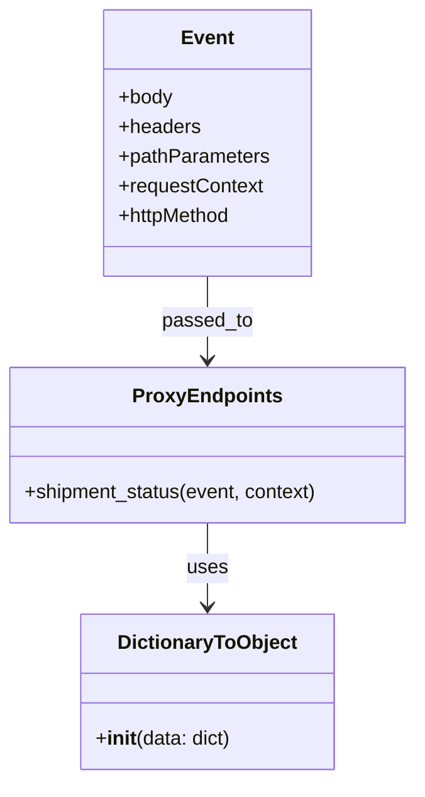
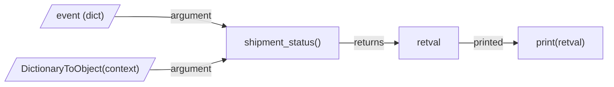

# Diagram: tools/ide_local_testing/localTest/test/byEvent/proxyShipmentStatus.py

> Auto-generated by Obscura crawlers

## Diagram 1

### SVG

<svg id="container" width="338.9375" xmlns="http://www.w3.org/2000/svg" class="classDiagram" height="632" viewBox="0 0 338.9375 632" role="graphics-document document" aria-roledescription="class"><g><defs><marker id="container_class-aggregationStart" class="marker aggregation class" refX="18" refY="7" markerWidth="190" markerHeight="240" orient="auto"><path d="M 18,7 L9,13 L1,7 L9,1 Z"></path></marker></defs><defs><marker id="container_class-aggregationEnd" class="marker aggregation class" refX="1" refY="7" markerWidth="20" markerHeight="28" orient="auto"><path d="M 18,7 L9,13 L1,7 L9,1 Z"></path></marker></defs><defs><marker id="container_class-extensionStart" class="marker extension class" refX="18" refY="7" markerWidth="190" markerHeight="240" orient="auto"><path d="M 1,7 L18,13 V 1 Z"></path></marker></defs><defs><marker id="container_class-extensionEnd" class="marker extension class" refX="1" refY="7" markerWidth="20" markerHeight="28" orient="auto"><path d="M 1,1 V 13 L18,7 Z"></path></marker></defs><defs><marker id="container_class-compositionStart" class="marker composition class" refX="18" refY="7" markerWidth="190" markerHeight="240" orient="auto"><path d="M 18,7 L9,13 L1,7 L9,1 Z"></path></marker></defs><defs><marker id="container_class-compositionEnd" class="marker composition class" refX="1" refY="7" markerWidth="20" markerHeight="28" orient="auto"><path d="M 18,7 L9,13 L1,7 L9,1 Z"></path></marker></defs><defs><marker id="container_class-dependencyStart" class="marker dependency class" refX="6" refY="7" markerWidth="190" markerHeight="240" orient="auto"><path d="M 5,7 L9,13 L1,7 L9,1 Z"></path></marker></defs><defs><marker id="container_class-dependencyEnd" class="marker dependency class" refX="13" refY="7" markerWidth="20" markerHeight="28" orient="auto"><path d="M 18,7 L9,13 L14,7 L9,1 Z"></path></marker></defs><defs><marker id="container_class-lollipopStart" class="marker lollipop class" refX="13" refY="7" markerWidth="190" markerHeight="240" orient="auto"><circle stroke="black" fill="transparent" cx="7" cy="7" r="6"></circle></marker></defs><defs><marker id="container_class-lollipopEnd" class="marker lollipop class" refX="1" refY="7" markerWidth="190" markerHeight="240" orient="auto"><circle stroke="black" fill="transparent" cx="7" cy="7" r="6"></circle></marker></defs><g class="root"><g class="clusters"></g><g class="edgePaths"><path d="M169.469,424L169.469,430.167C169.469,436.333,169.469,448.667,169.469,460C169.469,471.333,169.469,481.667,169.469,486.833L169.469,492" id="id_ProxyEndpoints_DictionaryToObject_1" class="edge-thickness-normal edge-pattern-solid relation" style=";;;" data-edge="true" data-et="edge" data-id="id_ProxyEndpoints_DictionaryToObject_1" data-points="W3sieCI6MTY5LjQ2ODc1LCJ5Ijo0MjR9LHsieCI6MTY5LjQ2ODc1LCJ5Ijo0NjF9LHsieCI6MTY5LjQ2ODc1LCJ5Ijo0OTh9XQ==" marker-end="url(#container_class-dependencyEnd)"></path><path d="M169.469,224L169.469,230.167C169.469,236.333,169.469,248.667,169.469,260C169.469,271.333,169.469,281.667,169.469,286.833L169.469,292" id="id_Event_ProxyEndpoints_2" class="edge-thickness-normal edge-pattern-solid relation" style=";;;" data-edge="true" data-et="edge" data-id="id_Event_ProxyEndpoints_2" data-points="W3sieCI6MTY5LjQ2ODc1LCJ5IjoyMjR9LHsieCI6MTY5LjQ2ODc1LCJ5IjoyNjF9LHsieCI6MTY5LjQ2ODc1LCJ5IjoyOTh9XQ==" marker-end="url(#container_class-dependencyEnd)"></path></g><g class="edgeLabels"><g class="edgeLabel" transform="translate(169.46875, 461)"><g class="label" data-id="id_ProxyEndpoints_DictionaryToObject_1" transform="translate(-16.4921875, -12)"><foreignObject width="32.984375" height="24">

uses

</foreignObject></g></g><g class="edgeLabel" transform="translate(169.46875, 261)"><g class="label" data-id="id_Event_ProxyEndpoints_2" transform="translate(-36.921875, -12)"><foreignObject width="73.84375" height="24">

passed_to

</foreignObject></g></g></g><g class="nodes"><g class="node default" id="classId-DictionaryToObject-0" transform="translate(169.46875, 561)"><g class="basic label-container"><path d="M-102.5625 -63 L102.5625 -63 L102.5625 63 L-102.5625 63" stroke="none" stroke-width="0" fill="#ECECFF" style=""></path><path d="M-102.5625 -63 C-55.17582830413052 -63, -7.789156608261038 -63, 102.5625 -63 M-102.5625 -63 C-33.90228715706719 -63, 34.757925685865615 -63, 102.5625 -63 M102.5625 -63 C102.5625 -28.81174986750367, 102.5625 5.376500264992657, 102.5625 63 M102.5625 -63 C102.5625 -13.41549030720872, 102.5625 36.16901938558256, 102.5625 63 M102.5625 63 C37.66844929318458 63, -27.22560141363084 63, -102.5625 63 M102.5625 63 C23.16772407867444 63, -56.22705184265112 63, -102.5625 63 M-102.5625 63 C-102.5625 32.600341724984006, -102.5625 2.200683449968018, -102.5625 -63 M-102.5625 63 C-102.5625 29.47752629322261, -102.5625 -4.04494741355478, -102.5625 -63" stroke="#9370DB" stroke-width="1.3" fill="none" stroke-dasharray="0 0" style=""></path></g><g class="annotation-group text" transform="translate(0, -39)"></g><g class="label-group text" transform="translate(-70.109375, -39)"><g class="label" style="font-weight: bolder" transform="translate(0,-12)"><foreignObject width="140.21875" height="24">

DictionaryToObject

</foreignObject></g></g><g class="members-group text" transform="translate(-90.5625, 9)"></g><g class="methods-group text" transform="translate(-90.5625, 39)"><g class="label" style="" transform="translate(0,-12)"><foreignObject width="111.015625" height="24">

+<strong>init</strong>(data: dict)

</foreignObject></g></g><g class="divider" style=""><path d="M-102.5625 -15 C-21.485818582435826 -15, 59.59086283512835 -15, 102.5625 -15 M-102.5625 -15 C-45.37917474549771 -15, 11.804150509004586 -15, 102.5625 -15" stroke="#9370DB" stroke-width="1.3" fill="none" stroke-dasharray="0 0" style=""></path></g><g class="divider" style=""><path d="M-102.5625 9 C-36.44973686885274 9, 29.663026262294522 9, 102.5625 9 M-102.5625 9 C-30.20550279908818 9, 42.15149440182364 9, 102.5625 9" stroke="#9370DB" stroke-width="1.3" fill="none" stroke-dasharray="0 0" style=""></path></g></g><g class="node default" id="classId-ProxyEndpoints-1" transform="translate(169.46875, 361)"><g class="basic label-container"><path d="M-161.46875 -63 L161.46875 -63 L161.46875 63 L-161.46875 63" stroke="none" stroke-width="0" fill="#ECECFF" style=""></path><path d="M-161.46875 -63 C-46.288195785320426 -63, 68.89235842935915 -63, 161.46875 -63 M-161.46875 -63 C-33.420551638140665 -63, 94.62764672371867 -63, 161.46875 -63 M161.46875 -63 C161.46875 -17.58413571093501, 161.46875 27.831728578129983, 161.46875 63 M161.46875 -63 C161.46875 -35.86900427085935, 161.46875 -8.738008541718699, 161.46875 63 M161.46875 63 C77.20837875253973 63, -7.05199249492054 63, -161.46875 63 M161.46875 63 C33.85752811170913 63, -93.75369377658174 63, -161.46875 63 M-161.46875 63 C-161.46875 19.292525203513634, -161.46875 -24.414949592972732, -161.46875 -63 M-161.46875 63 C-161.46875 15.646547071791503, -161.46875 -31.706905856416995, -161.46875 -63" stroke="#9370DB" stroke-width="1.3" fill="none" stroke-dasharray="0 0" style=""></path></g><g class="annotation-group text" transform="translate(0, -39)"></g><g class="label-group text" transform="translate(-57.234375, -39)"><g class="label" style="font-weight: bolder" transform="translate(0,-12)"><foreignObject width="114.46875" height="24">

ProxyEndpoints

</foreignObject></g></g><g class="members-group text" transform="translate(-149.46875, 9)"></g><g class="methods-group text" transform="translate(-149.46875, 39)"><g class="label" style="" transform="translate(0,-12)"><foreignObject width="241.703125" height="24">

+shipment_status(event, context)

</foreignObject></g></g><g class="divider" style=""><path d="M-161.46875 -15 C-57.68114848043447 -15, 46.106453039131054 -15, 161.46875 -15 M-161.46875 -15 C-44.713705994556506 -15, 72.04133801088699 -15, 161.46875 -15" stroke="#9370DB" stroke-width="1.3" fill="none" stroke-dasharray="0 0" style=""></path></g><g class="divider" style=""><path d="M-161.46875 9 C-92.51571754826516 9, -23.562685096530316 9, 161.46875 9 M-161.46875 9 C-47.96238491376465 9, 65.5439801724707 9, 161.46875 9" stroke="#9370DB" stroke-width="1.3" fill="none" stroke-dasharray="0 0" style=""></path></g></g><g class="node default" id="classId-Event-2" transform="translate(169.46875, 116)"><g class="basic label-container"><path d="M-83.47265625 -108 L83.47265625 -108 L83.47265625 108 L-83.47265625 108" stroke="none" stroke-width="0" fill="#ECECFF" style=""></path><path d="M-83.47265625 -108 C-30.491788777660915 -108, 22.48907869467817 -108, 83.47265625 -108 M-83.47265625 -108 C-49.50744844263818 -108, -15.542240635276357 -108, 83.47265625 -108 M83.47265625 -108 C83.47265625 -32.854422165820935, 83.47265625 42.29115566835813, 83.47265625 108 M83.47265625 -108 C83.47265625 -54.919816964856736, 83.47265625 -1.8396339297134716, 83.47265625 108 M83.47265625 108 C46.51960295388284 108, 9.566549657765677 108, -83.47265625 108 M83.47265625 108 C48.26371287785789 108, 13.054769505715782 108, -83.47265625 108 M-83.47265625 108 C-83.47265625 52.60233479623931, -83.47265625 -2.7953304075213765, -83.47265625 -108 M-83.47265625 108 C-83.47265625 34.12231602740597, -83.47265625 -39.755367945188056, -83.47265625 -108" stroke="#9370DB" stroke-width="1.3" fill="none" stroke-dasharray="0 0" style=""></path></g><g class="annotation-group text" transform="translate(0, -84)"></g><g class="label-group text" transform="translate(-20.2109375, -84)"><g class="label" style="font-weight: bolder" transform="translate(0,-12)"><foreignObject width="40.421875" height="24">

Event

</foreignObject></g></g><g class="members-group text" transform="translate(-71.47265625, -36)"><g class="label" style="" transform="translate(0,-12)"><foreignObject width="44.28125" height="24">

+body

</foreignObject></g><g class="label" style="" transform="translate(0,12)"><foreignObject width="66.328125" height="24">

+headers

</foreignObject></g><g class="label" style="" transform="translate(0,36)"><foreignObject width="122.734375" height="24">

+pathParameters

</foreignObject></g><g class="label" style="" transform="translate(0,60)"><foreignObject width="118.265625" height="24">

+requestContext

</foreignObject></g><g class="label" style="" transform="translate(0,84)"><foreignObject width="93.65625" height="24">

+httpMethod

</foreignObject></g></g><g class="methods-group text" transform="translate(-71.47265625, 108)"></g><g class="divider" style=""><path d="M-83.47265625 -60 C-20.185435744615624 -60, 43.10178476076875 -60, 83.47265625 -60 M-83.47265625 -60 C-48.261698720394456 -60, -13.050741190788912 -60, 83.47265625 -60" stroke="#9370DB" stroke-width="1.3" fill="none" stroke-dasharray="0 0" style=""></path></g><g class="divider" style=""><path d="M-83.47265625 84 C-30.20966360838453 84, 23.053329033230938 84, 83.47265625 84 M-83.47265625 84 C-38.47751433591757 84, 6.517627578164863 84, 83.47265625 84" stroke="#9370DB" stroke-width="1.3" fill="none" stroke-dasharray="0 0" style=""></path></g></g></g></g></g></svg>

## Diagram 2

### SVG

<svg id="container" width="1037.078125" xmlns="http://www.w3.org/2000/svg" class="flowchart" height="144" viewBox="0 0 1037.078125 144" role="graphics-document document" aria-roledescription="flowchart-v2"><g><marker id="container_flowchart-v2-pointEnd" class="marker flowchart-v2" viewBox="0 0 10 10" refX="5" refY="5" markerUnits="userSpaceOnUse" markerWidth="8" markerHeight="8" orient="auto"><path d="M 0 0 L 10 5 L 0 10 z" class="arrowMarkerPath" style="stroke-width: 1; stroke-dasharray: 1, 0;"></path></marker><marker id="container_flowchart-v2-pointStart" class="marker flowchart-v2" viewBox="0 0 10 10" refX="4.5" refY="5" markerUnits="userSpaceOnUse" markerWidth="8" markerHeight="8" orient="auto"><path d="M 0 5 L 10 10 L 10 0 z" class="arrowMarkerPath" style="stroke-width: 1; stroke-dasharray: 1, 0;"></path></marker><marker id="container_flowchart-v2-circleEnd" class="marker flowchart-v2" viewBox="0 0 10 10" refX="11" refY="5" markerUnits="userSpaceOnUse" markerWidth="11" markerHeight="11" orient="auto"><circle cx="5" cy="5" r="5" class="arrowMarkerPath" style="stroke-width: 1; stroke-dasharray: 1, 0;"></circle></marker><marker id="container_flowchart-v2-circleStart" class="marker flowchart-v2" viewBox="0 0 10 10" refX="-1" refY="5" markerUnits="userSpaceOnUse" markerWidth="11" markerHeight="11" orient="auto"><circle cx="5" cy="5" r="5" class="arrowMarkerPath" style="stroke-width: 1; stroke-dasharray: 1, 0;"></circle></marker><marker id="container_flowchart-v2-crossEnd" class="marker cross flowchart-v2" viewBox="0 0 11 11" refX="12" refY="5.2" markerUnits="userSpaceOnUse" markerWidth="11" markerHeight="11" orient="auto"><path d="M 1,1 l 9,9 M 10,1 l -9,9" class="arrowMarkerPath" style="stroke-width: 2; stroke-dasharray: 1, 0;"></path></marker><marker id="container_flowchart-v2-crossStart" class="marker cross flowchart-v2" viewBox="0 0 11 11" refX="-1" refY="5.2" markerUnits="userSpaceOnUse" markerWidth="11" markerHeight="11" orient="auto"><path d="M 1,1 l 9,9 M 10,1 l -9,9" class="arrowMarkerPath" style="stroke-width: 2; stroke-dasharray: 1, 0;"></path></marker><g class="root"><g class="clusters"></g><g class="edgePaths"><path d="M195.094,28L216.592,27.917C238.091,27.833,281.089,27.667,312.146,30.317C343.204,32.967,362.323,38.434,371.882,41.167L381.441,43.9" id="L_EventObj_LambdaHandler_0" class="edge-thickness-normal edge-pattern-solid edge-thickness-normal edge-pattern-solid flowchart-link" style=";" data-edge="true" data-et="edge" data-id="L_EventObj_LambdaHandler_0" data-points="W3sieCI6MTk1LjA5Mzc1LCJ5IjoyOH0seyJ4IjozMjQuMDg1OTM3NSwieSI6MjcuNX0seyJ4IjozODUuMjg2NzgwMTk2NjI5MiwieSI6NDV9XQ==" marker-end="url(#container_flowchart-v2-pointEnd)"></path><path d="M254.984,117L266.501,116.917C278.018,116.833,301.052,116.667,322.128,113.85C343.204,111.033,362.323,105.566,371.882,102.833L381.441,100.1" id="L_ContextObj_LambdaHandler_0" class="edge-thickness-normal edge-pattern-solid edge-thickness-normal edge-pattern-solid flowchart-link" style=";" data-edge="true" data-et="edge" data-id="L_ContextObj_LambdaHandler_0" data-points="W3sieCI6MjU0Ljk4NDM3NSwieSI6MTE3fSx7IngiOjMyNC4wODU5Mzc1LCJ5IjoxMTYuNX0seyJ4IjozODUuMjg2NzgwMTk2NjI5MiwieSI6OTl9XQ==" marker-end="url(#container_flowchart-v2-pointEnd)"></path><path d="M575.484,72L584.029,72C592.573,72,609.661,72,626.083,72C642.505,72,658.26,72,666.138,72L674.016,72" id="L_LambdaHandler_Retval_0" class="edge-thickness-normal edge-pattern-solid edge-thickness-normal edge-pattern-solid flowchart-link" style=";" data-edge="true" data-et="edge" data-id="L_LambdaHandler_Retval_0" data-points="W3sieCI6NTc1LjQ4NDM3NSwieSI6NzJ9LHsieCI6NjI2Ljc1LCJ5Ijo3Mn0seyJ4Ijo2NzguMDE1NjI1LCJ5Ijo3Mn1d" marker-end="url(#container_flowchart-v2-pointEnd)"></path><path d="M778.984,72L787.602,72C796.219,72,813.453,72,830.021,72C846.589,72,862.49,72,870.44,72L878.391,72" id="L_Retval_Print_0" class="edge-thickness-normal edge-pattern-solid edge-thickness-normal edge-pattern-solid flowchart-link" style=";" data-edge="true" data-et="edge" data-id="L_Retval_Print_0" data-points="W3sieCI6Nzc4Ljk4NDM3NSwieSI6NzJ9LHsieCI6ODMwLjY4NzUsInkiOjcyfSx7IngiOjg4Mi4zOTA2MjUsInkiOjcyfV0=" marker-end="url(#container_flowchart-v2-pointEnd)"></path></g><g class="edgeLabels"><g class="edgeLabel" transform="translate(324.0859375, 27.5)"><g class="label" data-id="L_EventObj_LambdaHandler_0" transform="translate(-34.8515625, -12)"><foreignObject width="69.703125" height="24">

argument

</foreignObject></g></g><g class="edgeLabel" transform="translate(324.0859375, 116.5)"><g class="label" data-id="L_ContextObj_LambdaHandler_0" transform="translate(-34.8515625, -12)"><foreignObject width="69.703125" height="24">

argument

</foreignObject></g></g><g class="edgeLabel" transform="translate(626.75, 72)"><g class="label" data-id="L_LambdaHandler_Retval_0" transform="translate(-26.265625, -12)"><foreignObject width="52.53125" height="24">

returns

</foreignObject></g></g><g class="edgeLabel" transform="translate(830.6875, 72)"><g class="label" data-id="L_Retval_Print_0" transform="translate(-26.703125, -12)"><foreignObject width="53.40625" height="24">

printed

</foreignObject></g></g></g><g class="nodes"><g class="node default" id="flowchart-EventObj-0" transform="translate(136.1171875, 27.5)"><polygon points="-19.5,0 97.453125,0 116.953125,-39 0,-39" class="label-container" transform="translate(-48.7265625,19.5)"></polygon><g class="label" style="" transform="translate(-41.2265625, -12)"><rect></rect><foreignObject width="82.453125" height="24">

event (dict)

</foreignObject></g></g><g class="node default" id="flowchart-LambdaHandler-1" transform="translate(479.7109375, 72)"><rect class="basic label-container" style="" x="-95.7734375" y="-27" width="191.546875" height="54"></rect><g class="label" style="" transform="translate(-65.7734375, -12)"><rect></rect><foreignObject width="131.546875" height="24">

shipment_status()

</foreignObject></g></g><g class="node default" id="flowchart-ContextObj-2" transform="translate(136.1171875, 116.5)"><polygon points="-19.5,0 217.234375,0 236.734375,-39 0,-39" class="label-container" transform="translate(-108.6171875,19.5)"></polygon><g class="label" style="" transform="translate(-101.1171875, -12)"><rect></rect><foreignObject width="202.234375" height="24">

DictionaryToObject(context)

</foreignObject></g></g><g class="node default" id="flowchart-Retval-5" transform="translate(728.5, 72)"><rect class="basic label-container" style="" x="-50.484375" y="-27" width="100.96875" height="54"></rect><g class="label" style="" transform="translate(-20.484375, -12)"><rect></rect><foreignObject width="40.96875" height="24">

retval

</foreignObject></g></g><g class="node default" id="flowchart-Print-7" transform="translate(955.734375, 72)"><rect class="basic label-container" style="" x="-73.34375" y="-27" width="146.6875" height="54"></rect><g class="label" style="" transform="translate(-43.34375, -12)"><rect></rect><foreignObject width="86.6875" height="24">

print(retval)

</foreignObject></g></g></g></g></g></svg>
