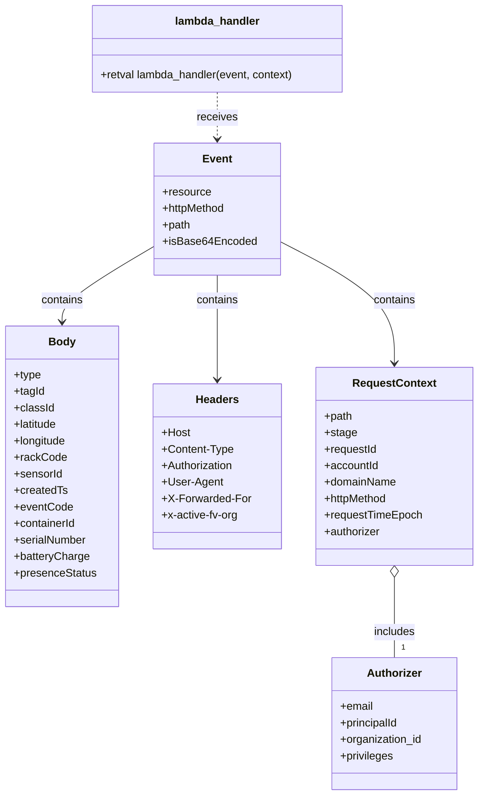

# Diagram: tools/ide_local_testing/localTest/test/byEvent/reusableContainerTrackingEvent.py

> Auto-generated by Obscura crawlers

## Mermaid

### SVG

<svg id="container" width="684.4765625" xmlns="http://www.w3.org/2000/svg" class="classDiagram" height="1156" viewBox="0 0 684.4765625 1156" role="graphics-document document" aria-roledescription="class"><g><defs><marker id="container_class-aggregationStart" class="marker aggregation class" refX="18" refY="7" markerWidth="190" markerHeight="240" orient="auto"><path d="M 18,7 L9,13 L1,7 L9,1 Z"></path></marker></defs><defs><marker id="container_class-aggregationEnd" class="marker aggregation class" refX="1" refY="7" markerWidth="20" markerHeight="28" orient="auto"><path d="M 18,7 L9,13 L1,7 L9,1 Z"></path></marker></defs><defs><marker id="container_class-extensionStart" class="marker extension class" refX="18" refY="7" markerWidth="190" markerHeight="240" orient="auto"><path d="M 1,7 L18,13 V 1 Z"></path></marker></defs><defs><marker id="container_class-extensionEnd" class="marker extension class" refX="1" refY="7" markerWidth="20" markerHeight="28" orient="auto"><path d="M 1,1 V 13 L18,7 Z"></path></marker></defs><defs><marker id="container_class-compositionStart" class="marker composition class" refX="18" refY="7" markerWidth="190" markerHeight="240" orient="auto"><path d="M 18,7 L9,13 L1,7 L9,1 Z"></path></marker></defs><defs><marker id="container_class-compositionEnd" class="marker composition class" refX="1" refY="7" markerWidth="20" markerHeight="28" orient="auto"><path d="M 18,7 L9,13 L1,7 L9,1 Z"></path></marker></defs><defs><marker id="container_class-dependencyStart" class="marker dependency class" refX="6" refY="7" markerWidth="190" markerHeight="240" orient="auto"><path d="M 5,7 L9,13 L1,7 L9,1 Z"></path></marker></defs><defs><marker id="container_class-dependencyEnd" class="marker dependency class" refX="13" refY="7" markerWidth="20" markerHeight="28" orient="auto"><path d="M 18,7 L9,13 L14,7 L9,1 Z"></path></marker></defs><defs><marker id="container_class-lollipopStart" class="marker lollipop class" refX="13" refY="7" markerWidth="190" markerHeight="240" orient="auto"><circle stroke="black" fill="transparent" cx="7" cy="7" r="6"></circle></marker></defs><defs><marker id="container_class-lollipopEnd" class="marker lollipop class" refX="1" refY="7" markerWidth="190" markerHeight="240" orient="auto"><circle stroke="black" fill="transparent" cx="7" cy="7" r="6"></circle></marker></defs><g class="root"><g class="clusters"></g><g class="edgePaths"><path d="M310.652,134L310.652,140.167C310.652,146.333,310.652,158.667,310.652,170C310.652,181.333,310.652,191.667,310.652,196.833L310.652,202" id="id_lambda_handler_Event_1" class="edge-thickness-normal edge-pattern-dashed relation" style=";;;" data-edge="true" data-et="edge" data-id="id_lambda_handler_Event_1" data-points="W3sieCI6MzEwLjY1MjM0Mzc1LCJ5IjoxMzR9LHsieCI6MzEwLjY1MjM0Mzc1LCJ5IjoxNzF9LHsieCI6MzEwLjY1MjM0Mzc1LCJ5IjoyMDh9XQ==" marker-end="url(#container_class-dependencyEnd)"></path><path d="M221.656,357.368L199.524,370.64C177.392,383.912,133.128,410.456,110.995,428.895C88.863,447.333,88.863,457.667,88.863,462.833L88.863,468" id="id_Event_Body_2" class="edge-thickness-normal edge-pattern-solid relation" style=";;;" data-edge="true" data-et="edge" data-id="id_Event_Body_2" data-points="W3sieCI6MjIxLjY1NjI1LCJ5IjozNTcuMzY4MTg4MzgyODI0M30seyJ4Ijo4OC44NjMyODEyNSwieSI6NDM3fSx7IngiOjg4Ljg2MzI4MTI1LCJ5Ijo0NzR9XQ==" marker-end="url(#container_class-dependencyEnd)"></path><path d="M310.652,400L310.652,406.167C310.652,412.333,310.652,424.667,310.652,450C310.652,475.333,310.652,513.667,310.652,532.833L310.652,552" id="id_Event_Headers_3" class="edge-thickness-normal edge-pattern-solid relation" style=";;;" data-edge="true" data-et="edge" data-id="id_Event_Headers_3" data-points="W3sieCI6MzEwLjY1MjM0Mzc1LCJ5Ijo0MDB9LHsieCI6MzEwLjY1MjM0Mzc1LCJ5Ijo0Mzd9LHsieCI6MzEwLjY1MjM0Mzc1LCJ5Ijo1NTh9XQ==" marker-end="url(#container_class-dependencyEnd)"></path><path d="M399.648,350.715L427.045,365.096C454.441,379.477,509.234,408.238,536.631,437.786C564.027,467.333,564.027,497.667,564.027,512.833L564.027,528" id="id_Event_RequestContext_4" class="edge-thickness-normal edge-pattern-solid relation" style=";;;" data-edge="true" data-et="edge" data-id="id_Event_RequestContext_4" data-points="W3sieCI6Mzk5LjY0ODQzNzUsInkiOjM1MC43MTUyNjU3ODY4NzcyfSx7IngiOjU2NC4wMjczNDM3NSwieSI6NDM3fSx7IngiOjU2NC4wMjczNDM3NSwieSI6NTM0fV0=" marker-end="url(#container_class-dependencyEnd)"></path><path d="M564.027,839.25L564.027,852.542C564.027,865.833,564.027,892.417,564.027,911.875C564.027,931.333,564.027,943.667,564.027,949.833L564.027,956" id="id_RequestContext_Authorizer_5" class="edge-thickness-normal edge-pattern-solid relation" style=";;;" data-edge="true" data-et="edge" data-id="id_RequestContext_Authorizer_5" data-points="W3sieCI6NTY0LjAyNzM0Mzc1LCJ5Ijo4MjJ9LHsieCI6NTY0LjAyNzM0Mzc1LCJ5Ijo5MTl9LHsieCI6NTY0LjAyNzM0Mzc1LCJ5Ijo5NTZ9XQ==" marker-start="url(#container_class-aggregationStart)"></path></g><g class="edgeLabels"><g class="edgeLabel" transform="translate(310.65234375, 171)"><g class="label" data-id="id_lambda_handler_Event_1" transform="translate(-29.4921875, -12)"><foreignObject width="58.984375" height="24">

receives

</foreignObject></g></g><g class="edgeLabel" transform="translate(88.86328125, 437)"><g class="label" data-id="id_Event_Body_2" transform="translate(-30.890625, -12)"><foreignObject width="61.78125" height="24">

contains

</foreignObject></g></g><g class="edgeLabel" transform="translate(310.65234375, 437)"><g class="label" data-id="id_Event_Headers_3" transform="translate(-30.890625, -12)"><foreignObject width="61.78125" height="24">

contains

</foreignObject></g></g><g class="edgeLabel" transform="translate(564.02734375, 437)"><g class="label" data-id="id_Event_RequestContext_4" transform="translate(-30.890625, -12)"><foreignObject width="61.78125" height="24">

contains

</foreignObject></g></g><g class="edgeLabel" transform="translate(564.02734375, 919)"><g class="label" data-id="id_RequestContext_Authorizer_5" transform="translate(-30.6484375, -12)"><foreignObject width="61.296875" height="24">

includes

</foreignObject></g></g><g class="edgeTerminals" transform="translate(574.0273418749999, 933.4999983928572)"><g class="inner" transform="translate(0, 0)"></g><foreignObject style="width: 9px; height: 12px;">
1
</foreignObject></g></g><g class="nodes"><g class="node default" id="classId-lambda_handler-0" transform="translate(310.65234375, 71)"><g class="basic label-container"><path d="M-184.68359375 -63 L184.68359375 -63 L184.68359375 63 L-184.68359375 63" stroke="none" stroke-width="0" fill="#ECECFF" style=""></path><path d="M-184.68359375 -63 C-79.85315911412285 -63, 24.977275521754308 -63, 184.68359375 -63 M-184.68359375 -63 C-98.33396746039584 -63, -11.98434117079168 -63, 184.68359375 -63 M184.68359375 -63 C184.68359375 -30.548294993649762, 184.68359375 1.9034100127004763, 184.68359375 63 M184.68359375 -63 C184.68359375 -28.402690554955775, 184.68359375 6.194618890088449, 184.68359375 63 M184.68359375 63 C51.27444187834206 63, -82.13470999331588 63, -184.68359375 63 M184.68359375 63 C67.19219984006254 63, -50.299194069874915 63, -184.68359375 63 M-184.68359375 63 C-184.68359375 31.479372825076165, -184.68359375 -0.0412543498476694, -184.68359375 -63 M-184.68359375 63 C-184.68359375 17.711511216769985, -184.68359375 -27.57697756646003, -184.68359375 -63" stroke="#9370DB" stroke-width="1.3" fill="none" stroke-dasharray="0 0" style=""></path></g><g class="annotation-group text" transform="translate(0, -39)"></g><g class="label-group text" transform="translate(-59.9765625, -39)"><g class="label" style="font-weight: bolder" transform="translate(0,-12)"><foreignObject width="119.953125" height="24">

lambda_handler

</foreignObject></g></g><g class="members-group text" transform="translate(-172.68359375, 9)"></g><g class="methods-group text" transform="translate(-172.68359375, 39)"><g class="label" style="" transform="translate(0,-12)"><foreignObject width="285.390625" height="24">

+retval lambda_handler(event, context)

</foreignObject></g></g><g class="divider" style=""><path d="M-184.68359375 -15 C-41.944910238259865 -15, 100.79377327348027 -15, 184.68359375 -15 M-184.68359375 -15 C-90.8944066503074 -15, 2.8947804493851947 -15, 184.68359375 -15" stroke="#9370DB" stroke-width="1.3" fill="none" stroke-dasharray="0 0" style=""></path></g><g class="divider" style=""><path d="M-184.68359375 9 C-94.7114891501401 9, -4.739384550280192 9, 184.68359375 9 M-184.68359375 9 C-46.56232141680533 9, 91.55895091638934 9, 184.68359375 9" stroke="#9370DB" stroke-width="1.3" fill="none" stroke-dasharray="0 0" style=""></path></g></g><g class="node default" id="classId-Event-1" transform="translate(310.65234375, 304)"><g class="basic label-container"><path d="M-88.99609375 -96 L88.99609375 -96 L88.99609375 96 L-88.99609375 96" stroke="none" stroke-width="0" fill="#ECECFF" style=""></path><path d="M-88.99609375 -96 C-32.092248129247984 -96, 24.81159749150403 -96, 88.99609375 -96 M-88.99609375 -96 C-21.814642237335704 -96, 45.36680927532859 -96, 88.99609375 -96 M88.99609375 -96 C88.99609375 -24.286840852281898, 88.99609375 47.426318295436204, 88.99609375 96 M88.99609375 -96 C88.99609375 -44.810073416341744, 88.99609375 6.3798531673165115, 88.99609375 96 M88.99609375 96 C37.06232563478673 96, -14.871442480426538 96, -88.99609375 96 M88.99609375 96 C49.42193120848467 96, 9.847768666969344 96, -88.99609375 96 M-88.99609375 96 C-88.99609375 21.846843646856897, -88.99609375 -52.30631270628621, -88.99609375 -96 M-88.99609375 96 C-88.99609375 28.539338954418298, -88.99609375 -38.921322091163404, -88.99609375 -96" stroke="#9370DB" stroke-width="1.3" fill="none" stroke-dasharray="0 0" style=""></path></g><g class="annotation-group text" transform="translate(0, -72)"></g><g class="label-group text" transform="translate(-20.2109375, -72)"><g class="label" style="font-weight: bolder" transform="translate(0,-12)"><foreignObject width="40.421875" height="24">

Event

</foreignObject></g></g><g class="members-group text" transform="translate(-76.99609375, -24)"><g class="label" style="" transform="translate(0,-12)"><foreignObject width="70.28125" height="24">

+resource

</foreignObject></g><g class="label" style="" transform="translate(0,12)"><foreignObject width="93.65625" height="24">

+httpMethod

</foreignObject></g><g class="label" style="" transform="translate(0,36)"><foreignObject width="41.1875" height="24">

+path

</foreignObject></g><g class="label" style="" transform="translate(0,60)"><foreignObject width="133.78125" height="24">

+isBase64Encoded

</foreignObject></g></g><g class="methods-group text" transform="translate(-76.99609375, 96)"></g><g class="divider" style=""><path d="M-88.99609375 -48 C-47.41613797272925 -48, -5.836182195458505 -48, 88.99609375 -48 M-88.99609375 -48 C-39.30683264969312 -48, 10.382428450613759 -48, 88.99609375 -48" stroke="#9370DB" stroke-width="1.3" fill="none" stroke-dasharray="0 0" style=""></path></g><g class="divider" style=""><path d="M-88.99609375 72 C-39.58360382083558 72, 9.828886108328845 72, 88.99609375 72 M-88.99609375 72 C-35.90660943444548 72, 17.182874881109043 72, 88.99609375 72" stroke="#9370DB" stroke-width="1.3" fill="none" stroke-dasharray="0 0" style=""></path></g></g><g class="node default" id="classId-Body-2" transform="translate(88.86328125, 678)"><g class="basic label-container"><path d="M-80.86328125 -204 L80.86328125 -204 L80.86328125 204 L-80.86328125 204" stroke="none" stroke-width="0" fill="#ECECFF" style=""></path><path d="M-80.86328125 -204 C-45.07362554755477 -204, -9.283969845109539 -204, 80.86328125 -204 M-80.86328125 -204 C-30.630687545824422 -204, 19.601906158351156 -204, 80.86328125 -204 M80.86328125 -204 C80.86328125 -99.08012589668074, 80.86328125 5.839748206638518, 80.86328125 204 M80.86328125 -204 C80.86328125 -107.28879072346052, 80.86328125 -10.577581446921045, 80.86328125 204 M80.86328125 204 C37.216476843378 204, -6.430327563244006 204, -80.86328125 204 M80.86328125 204 C23.476313518854717 204, -33.91065421229057 204, -80.86328125 204 M-80.86328125 204 C-80.86328125 95.81535881499224, -80.86328125 -12.369282370015526, -80.86328125 -204 M-80.86328125 204 C-80.86328125 60.988750643888864, -80.86328125 -82.02249871222227, -80.86328125 -204" stroke="#9370DB" stroke-width="1.3" fill="none" stroke-dasharray="0 0" style=""></path></g><g class="annotation-group text" transform="translate(0, -180)"></g><g class="label-group text" transform="translate(-18.5546875, -180)"><g class="label" style="font-weight: bolder" transform="translate(0,-12)"><foreignObject width="37.109375" height="24">

Body

</foreignObject></g></g><g class="members-group text" transform="translate(-68.86328125, -132)"><g class="label" style="" transform="translate(0,-12)"><foreignObject width="39.703125" height="24">

+type

</foreignObject></g><g class="label" style="" transform="translate(0,12)"><foreignObject width="44.734375" height="24">

+tagId

</foreignObject></g><g class="label" style="" transform="translate(0,36)"><foreignObject width="57.859375" height="24">

+classId

</foreignObject></g><g class="label" style="" transform="translate(0,60)"><foreignObject width="64.96875" height="24">

+latitude

</foreignObject></g><g class="label" style="" transform="translate(0,84)"><foreignObject width="77.53125" height="24">

+longitude

</foreignObject></g><g class="label" style="" transform="translate(0,108)"><foreignObject width="74.421875" height="24">

+rackCode

</foreignObject></g><g class="label" style="" transform="translate(0,132)"><foreignObject width="70.84375" height="24">

+sensorId

</foreignObject></g><g class="label" style="" transform="translate(0,156)"><foreignObject width="77.375" height="24">

+createdTs

</foreignObject></g><g class="label" style="" transform="translate(0,180)"><foreignObject width="84.59375" height="24">

+eventCode

</foreignObject></g><g class="label" style="" transform="translate(0,204)"><foreignObject width="91.484375" height="24">

+containerId

</foreignObject></g><g class="label" style="" transform="translate(0,228)"><foreignObject width="106.453125" height="24">

+serialNumber

</foreignObject></g><g class="label" style="" transform="translate(0,252)"><foreignObject width="109.71875" height="24">

+batteryCharge

</foreignObject></g><g class="label" style="" transform="translate(0,276)"><foreignObject width="119.171875" height="24">

+presenceStatus

</foreignObject></g></g><g class="methods-group text" transform="translate(-68.86328125, 204)"></g><g class="divider" style=""><path d="M-80.86328125 -156 C-43.36670286713982 -156, -5.870124484279643 -156, 80.86328125 -156 M-80.86328125 -156 C-28.77047280134702 -156, 23.322335647305962 -156, 80.86328125 -156" stroke="#9370DB" stroke-width="1.3" fill="none" stroke-dasharray="0 0" style=""></path></g><g class="divider" style=""><path d="M-80.86328125 180 C-29.976534267026707 180, 20.910212715946585 180, 80.86328125 180 M-80.86328125 180 C-24.525370941201338 180, 31.812539367597324 180, 80.86328125 180" stroke="#9370DB" stroke-width="1.3" fill="none" stroke-dasharray="0 0" style=""></path></g></g><g class="node default" id="classId-Headers-3" transform="translate(310.65234375, 678)"><g class="basic label-container"><path d="M-90.92578125 -120 L90.92578125 -120 L90.92578125 120 L-90.92578125 120" stroke="none" stroke-width="0" fill="#ECECFF" style=""></path><path d="M-90.92578125 -120 C-46.89797384008367 -120, -2.8701664301673446 -120, 90.92578125 -120 M-90.92578125 -120 C-27.86788261417515 -120, 35.1900160216497 -120, 90.92578125 -120 M90.92578125 -120 C90.92578125 -49.07610451143967, 90.92578125 21.847790977120667, 90.92578125 120 M90.92578125 -120 C90.92578125 -26.453859801825445, 90.92578125 67.09228039634911, 90.92578125 120 M90.92578125 120 C25.4762123991122 120, -39.9733564517756 120, -90.92578125 120 M90.92578125 120 C53.77239190279588 120, 16.619002555591763 120, -90.92578125 120 M-90.92578125 120 C-90.92578125 52.948235988400285, -90.92578125 -14.10352802319943, -90.92578125 -120 M-90.92578125 120 C-90.92578125 47.926308885946696, -90.92578125 -24.147382228106608, -90.92578125 -120" stroke="#9370DB" stroke-width="1.3" fill="none" stroke-dasharray="0 0" style=""></path></g><g class="annotation-group text" transform="translate(0, -96)"></g><g class="label-group text" transform="translate(-30.2421875, -96)"><g class="label" style="font-weight: bolder" transform="translate(0,-12)"><foreignObject width="60.484375" height="24">

Headers

</foreignObject></g></g><g class="members-group text" transform="translate(-78.92578125, -48)"><g class="label" style="" transform="translate(0,-12)"><foreignObject width="41.46875" height="24">

+Host

</foreignObject></g><g class="label" style="" transform="translate(0,12)"><foreignObject width="103.5" height="24">

+Content-Type

</foreignObject></g><g class="label" style="" transform="translate(0,36)"><foreignObject width="105.953125" height="24">

+Authorization

</foreignObject></g><g class="label" style="" transform="translate(0,60)"><foreignObject width="87.734375" height="24">

+User-Agent

</foreignObject></g><g class="label" style="" transform="translate(0,84)"><foreignObject width="127.609375" height="24">

+X-Forwarded-For

</foreignObject></g><g class="label" style="" transform="translate(0,108)"><foreignObject width="113.34375" height="24">

+x-active-fv-org

</foreignObject></g></g><g class="methods-group text" transform="translate(-78.92578125, 120)"></g><g class="divider" style=""><path d="M-90.92578125 -72 C-50.282339216155606 -72, -9.638897182311212 -72, 90.92578125 -72 M-90.92578125 -72 C-46.36043934633154 -72, -1.795097442663078 -72, 90.92578125 -72" stroke="#9370DB" stroke-width="1.3" fill="none" stroke-dasharray="0 0" style=""></path></g><g class="divider" style=""><path d="M-90.92578125 96 C-41.623375411398925 96, 7.67903042720215 96, 90.92578125 96 M-90.92578125 96 C-44.005656097949434 96, 2.914469054101133 96, 90.92578125 96" stroke="#9370DB" stroke-width="1.3" fill="none" stroke-dasharray="0 0" style=""></path></g></g><g class="node default" id="classId-RequestContext-4" transform="translate(564.02734375, 678)"><g class="basic label-container"><path d="M-112.44921875 -144 L112.44921875 -144 L112.44921875 144 L-112.44921875 144" stroke="none" stroke-width="0" fill="#ECECFF" style=""></path><path d="M-112.44921875 -144 C-54.015065996384884 -144, 4.419086757230232 -144, 112.44921875 -144 M-112.44921875 -144 C-42.95546668330604 -144, 26.538285383387915 -144, 112.44921875 -144 M112.44921875 -144 C112.44921875 -62.03369026320705, 112.44921875 19.932619473585902, 112.44921875 144 M112.44921875 -144 C112.44921875 -33.4771704292244, 112.44921875 77.0456591415512, 112.44921875 144 M112.44921875 144 C52.240689665405114 144, -7.967839419189772 144, -112.44921875 144 M112.44921875 144 C49.057783730953076 144, -14.333651288093847 144, -112.44921875 144 M-112.44921875 144 C-112.44921875 42.495669114583876, -112.44921875 -59.00866177083225, -112.44921875 -144 M-112.44921875 144 C-112.44921875 84.30855066946467, -112.44921875 24.61710133892933, -112.44921875 -144" stroke="#9370DB" stroke-width="1.3" fill="none" stroke-dasharray="0 0" style=""></path></g><g class="annotation-group text" transform="translate(0, -120)"></g><g class="label-group text" transform="translate(-58.1484375, -120)"><g class="label" style="font-weight: bolder" transform="translate(0,-12)"><foreignObject width="116.296875" height="24">

RequestContext

</foreignObject></g></g><g class="members-group text" transform="translate(-100.44921875, -72)"><g class="label" style="" transform="translate(0,-12)"><foreignObject width="41.1875" height="24">

+path

</foreignObject></g><g class="label" style="" transform="translate(0,12)"><foreignObject width="46.453125" height="24">

+stage

</foreignObject></g><g class="label" style="" transform="translate(0,36)"><foreignObject width="77.546875" height="24">

+requestId

</foreignObject></g><g class="label" style="" transform="translate(0,60)"><foreignObject width="79.203125" height="24">

+accountId

</foreignObject></g><g class="label" style="" transform="translate(0,84)"><foreignObject width="105.265625" height="24">

+domainName

</foreignObject></g><g class="label" style="" transform="translate(0,108)"><foreignObject width="93.65625" height="24">

+httpMethod

</foreignObject></g><g class="label" style="" transform="translate(0,132)"><foreignObject width="142.75" height="24">

+requestTimeEpoch

</foreignObject></g><g class="label" style="" transform="translate(0,156)"><foreignObject width="82.734375" height="24">

+authorizer

</foreignObject></g></g><g class="methods-group text" transform="translate(-100.44921875, 144)"></g><g class="divider" style=""><path d="M-112.44921875 -96 C-57.50795508382675 -96, -2.5666914176535016 -96, 112.44921875 -96 M-112.44921875 -96 C-63.68806414721447 -96, -14.926909544428938 -96, 112.44921875 -96" stroke="#9370DB" stroke-width="1.3" fill="none" stroke-dasharray="0 0" style=""></path></g><g class="divider" style=""><path d="M-112.44921875 120 C-64.24922556416634 120, -16.049232378332675 120, 112.44921875 120 M-112.44921875 120 C-58.80283399586667 120, -5.156449241733341 120, 112.44921875 120" stroke="#9370DB" stroke-width="1.3" fill="none" stroke-dasharray="0 0" style=""></path></g></g><g class="node default" id="classId-Authorizer-5" transform="translate(564.02734375, 1052)"><g class="basic label-container"><path d="M-91.55859375 -96 L91.55859375 -96 L91.55859375 96 L-91.55859375 96" stroke="none" stroke-width="0" fill="#ECECFF" style=""></path><path d="M-91.55859375 -96 C-25.982450070955792 -96, 39.593693608088415 -96, 91.55859375 -96 M-91.55859375 -96 C-33.73898974494978 -96, 24.080614260100447 -96, 91.55859375 -96 M91.55859375 -96 C91.55859375 -51.19135745082939, 91.55859375 -6.382714901658787, 91.55859375 96 M91.55859375 -96 C91.55859375 -51.87211094047003, 91.55859375 -7.74422188094006, 91.55859375 96 M91.55859375 96 C50.10524579101742 96, 8.651897832034834 96, -91.55859375 96 M91.55859375 96 C46.9185299707755 96, 2.2784661915510043 96, -91.55859375 96 M-91.55859375 96 C-91.55859375 48.8111913629841, -91.55859375 1.622382725968194, -91.55859375 -96 M-91.55859375 96 C-91.55859375 48.820347601800954, -91.55859375 1.6406952036019078, -91.55859375 -96" stroke="#9370DB" stroke-width="1.3" fill="none" stroke-dasharray="0 0" style=""></path></g><g class="annotation-group text" transform="translate(0, -72)"></g><g class="label-group text" transform="translate(-38.3671875, -72)"><g class="label" style="font-weight: bolder" transform="translate(0,-12)"><foreignObject width="76.734375" height="24">

Authorizer

</foreignObject></g></g><g class="members-group text" transform="translate(-79.55859375, -24)"><g class="label" style="" transform="translate(0,-12)"><foreignObject width="48.328125" height="24">

+email

</foreignObject></g><g class="label" style="" transform="translate(0,12)"><foreignObject width="86.578125" height="24">

+principalId

</foreignObject></g><g class="label" style="" transform="translate(0,36)"><foreignObject width="120.75" height="24">

+organization_id

</foreignObject></g><g class="label" style="" transform="translate(0,60)"><foreignObject width="78.15625" height="24">

+privileges

</foreignObject></g></g><g class="methods-group text" transform="translate(-79.55859375, 96)"></g><g class="divider" style=""><path d="M-91.55859375 -48 C-41.59716497999585 -48, 8.364263790008295 -48, 91.55859375 -48 M-91.55859375 -48 C-22.8720278493806 -48, 45.8145380512388 -48, 91.55859375 -48" stroke="#9370DB" stroke-width="1.3" fill="none" stroke-dasharray="0 0" style=""></path></g><g class="divider" style=""><path d="M-91.55859375 72 C-30.077733605723985 72, 31.40312653855203 72, 91.55859375 72 M-91.55859375 72 C-47.348335823864815 72, -3.13807789772963 72, 91.55859375 72" stroke="#9370DB" stroke-width="1.3" fill="none" stroke-dasharray="0 0" style=""></path></g></g></g></g></g></svg>
