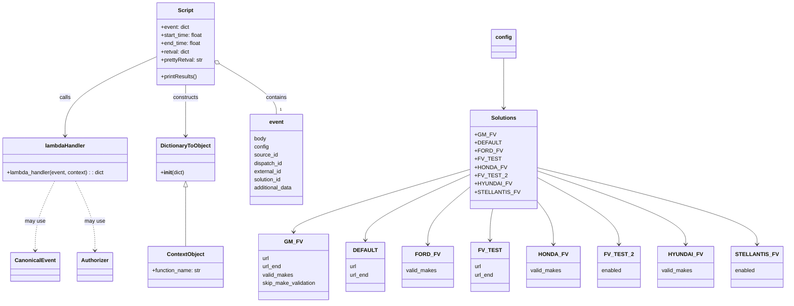

# Diagram: tools/ide_local_testing/localTest/test/byUrl/addEntityReferences.py

> Auto-generated by Obscura crawlers

## Mermaid

### SVG

<svg id="container" width="2251.0703125" xmlns="http://www.w3.org/2000/svg" class="classDiagram" height="884" viewBox="0 0 2251.0703125 884" role="graphics-document document" aria-roledescription="class"><g><defs><marker id="container_class-aggregationStart" class="marker aggregation class" refX="18" refY="7" markerWidth="190" markerHeight="240" orient="auto"><path d="M 18,7 L9,13 L1,7 L9,1 Z"></path></marker></defs><defs><marker id="container_class-aggregationEnd" class="marker aggregation class" refX="1" refY="7" markerWidth="20" markerHeight="28" orient="auto"><path d="M 18,7 L9,13 L1,7 L9,1 Z"></path></marker></defs><defs><marker id="container_class-extensionStart" class="marker extension class" refX="18" refY="7" markerWidth="190" markerHeight="240" orient="auto"><path d="M 1,7 L18,13 V 1 Z"></path></marker></defs><defs><marker id="container_class-extensionEnd" class="marker extension class" refX="1" refY="7" markerWidth="20" markerHeight="28" orient="auto"><path d="M 1,1 V 13 L18,7 Z"></path></marker></defs><defs><marker id="container_class-compositionStart" class="marker composition class" refX="18" refY="7" markerWidth="190" markerHeight="240" orient="auto"><path d="M 18,7 L9,13 L1,7 L9,1 Z"></path></marker></defs><defs><marker id="container_class-compositionEnd" class="marker composition class" refX="1" refY="7" markerWidth="20" markerHeight="28" orient="auto"><path d="M 18,7 L9,13 L1,7 L9,1 Z"></path></marker></defs><defs><marker id="container_class-dependencyStart" class="marker dependency class" refX="6" refY="7" markerWidth="190" markerHeight="240" orient="auto"><path d="M 5,7 L9,13 L1,7 L9,1 Z"></path></marker></defs><defs><marker id="container_class-dependencyEnd" class="marker dependency class" refX="13" refY="7" markerWidth="20" markerHeight="28" orient="auto"><path d="M 18,7 L9,13 L14,7 L9,1 Z"></path></marker></defs><defs><marker id="container_class-lollipopStart" class="marker lollipop class" refX="13" refY="7" markerWidth="190" markerHeight="240" orient="auto"><circle stroke="black" fill="transparent" cx="7" cy="7" r="6"></circle></marker></defs><defs><marker id="container_class-lollipopEnd" class="marker lollipop class" refX="1" refY="7" markerWidth="190" markerHeight="240" orient="auto"><circle stroke="black" fill="transparent" cx="7" cy="7" r="6"></circle></marker></defs><g class="root"><g class="clusters"></g><g class="edgePaths"><path d="M455.316,166.242L411.482,186.035C367.648,205.828,279.98,245.414,236.146,283.874C192.313,322.333,192.313,359.667,192.313,378.333L192.313,397" id="id_Script_lambdaHandler_1" class="edge-thickness-normal edge-pattern-solid relation" style=";;;" data-edge="true" data-et="edge" data-id="id_Script_lambdaHandler_1" data-points="W3sieCI6NDU1LjMxNjQwNjI1LCJ5IjoxNjYuMjQxOTYxNTc3MzUwODV9LHsieCI6MTkyLjMxMjUsInkiOjI4NX0seyJ4IjoxOTIuMzEyNSwieSI6NDAzfV0=" marker-end="url(#container_class-dependencyEnd)"></path><path d="M540.008,248L540.008,254.167C540.008,260.333,540.008,272.667,540.008,297.5C540.008,322.333,540.008,359.667,540.008,378.333L540.008,397" id="id_Script_DictionaryToObject_2" class="edge-thickness-normal edge-pattern-solid relation" style=";;;" data-edge="true" data-et="edge" data-id="id_Script_DictionaryToObject_2" data-points="W3sieCI6NTQwLjAwNzgxMjUsInkiOjI0OH0seyJ4Ijo1NDAuMDA3ODEyNSwieSI6Mjg1fSx7IngiOjU0MC4wMDc4MTI1LCJ5Ijo0MDN9XQ==" marker-end="url(#container_class-dependencyEnd)"></path><path d="M639.539,186.982L667.107,203.318C694.675,219.654,749.81,252.327,777.378,276.83C804.945,301.333,804.945,317.667,804.945,325.833L804.945,334" id="id_Script_event_3" class="edge-thickness-normal edge-pattern-solid relation" style=";;;" data-edge="true" data-et="edge" data-id="id_Script_event_3" data-points="W3sieCI6NjI0LjY5OTIxODc1LCJ5IjoxNzguMTg3NX0seyJ4Ijo4MDQuOTQ1MzEyNSwieSI6Mjg1fSx7IngiOjgwNC45NDUzMTI1LCJ5IjozMzR9XQ==" marker-start="url(#container_class-aggregationStart)"></path><path d="M1456.205,170L1456.205,189.167C1456.205,208.333,1456.205,246.667,1456.205,271C1456.205,295.333,1456.205,305.667,1456.205,310.833L1456.205,316" id="id_config_Solutions_4" class="edge-thickness-normal edge-pattern-solid relation" style=";;;" data-edge="true" data-et="edge" data-id="id_config_Solutions_4" data-points="W3sieCI6MTQ1Ni4yMDUwNzgxMjUsInkiOjE3MH0seyJ4IjoxNDU2LjIwNTA3ODEyNSwieSI6Mjg1fSx7IngiOjE0NTYuMjA1MDc4MTI1LCJ5IjozMjJ9XQ==" marker-end="url(#container_class-dependencyEnd)"></path><path d="M1369.408,492.168L1283.815,517.973C1198.221,543.779,1027.035,595.389,941.441,626.361C855.848,657.333,855.848,667.667,855.848,672.833L855.848,678" id="id_Solutions_GM_FV_5" class="edge-thickness-normal edge-pattern-solid relation" style=";;;" data-edge="true" data-et="edge" data-id="id_Solutions_GM_FV_5" data-points="W3sieCI6MTM2OS40MDgyMDMxMjUsInkiOjQ5Mi4xNjgxMzU1MTgyMjk3fSx7IngiOjg1NS44NDc2NTYyNSwieSI6NjQ3fSx7IngiOjg1NS44NDc2NTYyNSwieSI6Njg0fV0=" marker-end="url(#container_class-dependencyEnd)"></path><path d="M1369.408,506.009L1318.43,529.508C1267.452,553.006,1165.495,600.003,1114.517,632.668C1063.539,665.333,1063.539,683.667,1063.539,692.833L1063.539,702" id="id_Solutions_DEFAULT_6" class="edge-thickness-normal edge-pattern-solid relation" style=";;;" data-edge="true" data-et="edge" data-id="id_Solutions_DEFAULT_6" data-points="W3sieCI6MTM2OS40MDgyMDMxMjUsInkiOjUwNi4wMDkxNTIxNzk4NjAyfSx7IngiOjEwNjMuNTM5MDYyNSwieSI6NjQ3fSx7IngiOjEwNjMuNTM5MDYyNSwieSI6NzA4fV0=" marker-end="url(#container_class-dependencyEnd)"></path><path d="M1369.408,539.169L1348.089,557.14C1326.77,575.112,1284.131,611.056,1262.812,640.195C1241.492,669.333,1241.492,691.667,1241.492,702.833L1241.492,714" id="id_Solutions_FORD_FV_7" class="edge-thickness-normal edge-pattern-solid relation" style=";;;" data-edge="true" data-et="edge" data-id="id_Solutions_FORD_FV_7" data-points="W3sieCI6MTM2OS40MDgyMDMxMjUsInkiOjUzOS4xNjg1NjYzMDg1Njk4fSx7IngiOjEyNDEuNDkyMTg3NSwieSI6NjQ3fSx7IngiOjEyNDEuNDkyMTg3NSwieSI6NzIwfV0=" marker-end="url(#container_class-dependencyEnd)"></path><path d="M1426.385,610L1425.108,616.167C1423.831,622.333,1421.277,634.667,1420,650C1418.723,665.333,1418.723,683.667,1418.723,692.833L1418.723,702" id="id_Solutions_FV_TEST_8" class="edge-thickness-normal edge-pattern-solid relation" style=";;;" data-edge="true" data-et="edge" data-id="id_Solutions_FV_TEST_8" data-points="W3sieCI6MTQyNi4zODQ4MDg3ODc5ODM1LCJ5Ijo2MTB9LHsieCI6MTQxOC43MjI2NTYyNSwieSI6NjQ3fSx7IngiOjE0MTguNzIyNjU2MjUsInkiOjcwOH1d" marker-end="url(#container_class-dependencyEnd)"></path><path d="M1543.002,575.707L1552.403,587.59C1561.803,599.472,1580.605,623.236,1590.006,646.285C1599.406,669.333,1599.406,691.667,1599.406,702.833L1599.406,714" id="id_Solutions_HONDA_FV_9" class="edge-thickness-normal edge-pattern-solid relation" style=";;;" data-edge="true" data-et="edge" data-id="id_Solutions_HONDA_FV_9" data-points="W3sieCI6MTU0My4wMDE5NTMxMjUsInkiOjU3NS43MDc0NDI4MTgzNjl9LHsieCI6MTU5OS40MDYyNSwieSI6NjQ3fSx7IngiOjE1OTkuNDA2MjUsInkiOjcyMH1d" marker-end="url(#container_class-dependencyEnd)"></path><path d="M1543.002,513.677L1583.455,535.898C1623.908,558.118,1704.813,602.559,1745.266,635.946C1785.719,669.333,1785.719,691.667,1785.719,702.833L1785.719,714" id="id_Solutions_FV_TEST_2_10" class="edge-thickness-normal edge-pattern-solid relation" style=";;;" data-edge="true" data-et="edge" data-id="id_Solutions_FV_TEST_2_10" data-points="W3sieCI6MTU0My4wMDE5NTMxMjUsInkiOjUxMy42NzcwMzM1MDcwMDMxfSx7IngiOjE3ODUuNzE4NzUsInkiOjY0N30seyJ4IjoxNzg1LjcxODc1LCJ5Ijo3MjB9XQ==" marker-end="url(#container_class-dependencyEnd)"></path><path d="M1543.002,496.258L1615.072,521.381C1687.142,546.505,1831.282,596.753,1903.352,633.043C1975.422,669.333,1975.422,691.667,1975.422,702.833L1975.422,714" id="id_Solutions_HYUNDAI_FV_11" class="edge-thickness-normal edge-pattern-solid relation" style=";;;" data-edge="true" data-et="edge" data-id="id_Solutions_HYUNDAI_FV_11" data-points="W3sieCI6MTU0My4wMDE5NTMxMjUsInkiOjQ5Ni4yNTc1NjE5MDc3NzEyfSx7IngiOjE5NzUuNDIxODc1LCJ5Ijo2NDd9LHsieCI6MTk3NS40MjE4NzUsInkiOjcyMH1d" marker-end="url(#container_class-dependencyEnd)"></path><path d="M1543.002,487.885L1648.181,514.404C1753.359,540.923,1963.717,593.962,2068.896,631.647C2174.074,669.333,2174.074,691.667,2174.074,702.833L2174.074,714" id="id_Solutions_STELLANTIS_FV_12" class="edge-thickness-normal edge-pattern-solid relation" style=";;;" data-edge="true" data-et="edge" data-id="id_Solutions_STELLANTIS_FV_12" data-points="W3sieCI6MTU0My4wMDE5NTMxMjUsInkiOjQ4Ny44ODQ1Mzc4NDM5MzM3NH0seyJ4IjoyMTc0LjA3NDIxODc1LCJ5Ijo2NDd9LHsieCI6MjE3NC4wNzQyMTg3NSwieSI6NzIwfV0=" marker-end="url(#container_class-dependencyEnd)"></path><path d="M163.061,529L153.93,548.667C144.799,568.333,126.536,607.667,117.405,641.5C108.273,675.333,108.273,703.667,108.273,717.833L108.273,732" id="id_lambdaHandler_CanonicalEvent_13" class="edge-thickness-normal edge-pattern-dashed relation" style=";;;" data-edge="true" data-et="edge" data-id="id_lambdaHandler_CanonicalEvent_13" data-points="W3sieCI6MTYzLjA2MTMzNDU5OTQ0NzUyLCJ5Ijo1Mjl9LHsieCI6MTA4LjI3MzQzNzUsInkiOjY0N30seyJ4IjoxMDguMjczNDM3NSwieSI6NzM4fV0=" marker-end="url(#container_class-dependencyEnd)"></path><path d="M221.564,529L230.695,548.667C239.826,568.333,258.089,607.667,267.22,641.5C276.352,675.333,276.352,703.667,276.352,717.833L276.352,732" id="id_lambdaHandler_Authorizer_14" class="edge-thickness-normal edge-pattern-dashed relation" style=";;;" data-edge="true" data-et="edge" data-id="id_lambdaHandler_Authorizer_14" data-points="W3sieCI6MjIxLjU2MzY2NTQwMDU1MjQ4LCJ5Ijo1Mjl9LHsieCI6Mjc2LjM1MTU2MjUsInkiOjY0N30seyJ4IjoyNzYuMzUxNTYyNSwieSI6NzM4fV0=" marker-end="url(#container_class-dependencyEnd)"></path><path d="M540.008,546.25L540.008,563.042C540.008,579.833,540.008,613.417,540.008,642.375C540.008,671.333,540.008,695.667,540.008,707.833L540.008,720" id="id_DictionaryToObject_ContextObject_15" class="edge-thickness-normal edge-pattern-solid relation" style=";;;" data-edge="true" data-et="edge" data-id="id_DictionaryToObject_ContextObject_15" data-points="W3sieCI6NTQwLjAwNzgxMjUsInkiOjUyOX0seyJ4Ijo1NDAuMDA3ODEyNSwieSI6NjQ3fSx7IngiOjU0MC4wMDc4MTI1LCJ5Ijo3MjB9XQ==" marker-start="url(#container_class-extensionStart)"></path></g><g class="edgeLabels"><g class="edgeLabel" transform="translate(192.3125, 285)"><g class="label" data-id="id_Script_lambdaHandler_1" transform="translate(-16.4453125, -12)"><foreignObject width="32.890625" height="24">

calls

</foreignObject></g></g><g class="edgeLabel" transform="translate(540.0078125, 285)"><g class="label" data-id="id_Script_DictionaryToObject_2" transform="translate(-37.84375, -12)"><foreignObject width="75.6875" height="24">

constructs

</foreignObject></g></g><g class="edgeLabel" transform="translate(804.9453125, 285)"><g class="label" data-id="id_Script_event_3" transform="translate(-30.890625, -12)"><foreignObject width="61.78125" height="24">

contains

</foreignObject></g></g><g class="edgeLabel"><g class="label" data-id="id_config_Solutions_4" transform="translate(0, 0)"><foreignObject width="0" height="0">

</foreignObject></g></g><g class="edgeLabel"><g class="label" data-id="id_Solutions_GM_FV_5" transform="translate(0, 0)"><foreignObject width="0" height="0">

</foreignObject></g></g><g class="edgeLabel"><g class="label" data-id="id_Solutions_DEFAULT_6" transform="translate(0, 0)"><foreignObject width="0" height="0">

</foreignObject></g></g><g class="edgeLabel"><g class="label" data-id="id_Solutions_FORD_FV_7" transform="translate(0, 0)"><foreignObject width="0" height="0">

</foreignObject></g></g><g class="edgeLabel"><g class="label" data-id="id_Solutions_FV_TEST_8" transform="translate(0, 0)"><foreignObject width="0" height="0">

</foreignObject></g></g><g class="edgeLabel"><g class="label" data-id="id_Solutions_HONDA_FV_9" transform="translate(0, 0)"><foreignObject width="0" height="0">

</foreignObject></g></g><g class="edgeLabel"><g class="label" data-id="id_Solutions_FV_TEST_2_10" transform="translate(0, 0)"><foreignObject width="0" height="0">

</foreignObject></g></g><g class="edgeLabel"><g class="label" data-id="id_Solutions_HYUNDAI_FV_11" transform="translate(0, 0)"><foreignObject width="0" height="0">

</foreignObject></g></g><g class="edgeLabel"><g class="label" data-id="id_Solutions_STELLANTIS_FV_12" transform="translate(0, 0)"><foreignObject width="0" height="0">

</foreignObject></g></g><g class="edgeLabel" transform="translate(108.2734375, 647)"><g class="label" data-id="id_lambdaHandler_CanonicalEvent_13" transform="translate(-29.8984375, -12)"><foreignObject width="59.796875" height="24">

may use

</foreignObject></g></g><g class="edgeLabel" transform="translate(276.3515625, 647)"><g class="label" data-id="id_lambdaHandler_Authorizer_14" transform="translate(-29.8984375, -12)"><foreignObject width="59.796875" height="24">

may use

</foreignObject></g></g><g class="edgeLabel"><g class="label" data-id="id_DictionaryToObject_ContextObject_15" transform="translate(0, 0)"><foreignObject width="0" height="0">

</foreignObject></g></g><g class="edgeTerminals" transform="translate(814.94531125, 311.4999989285714)"><g class="inner" transform="translate(0, 0)"></g><foreignObject style="width: 9px; height: 12px;">
1
</foreignObject></g></g><g class="nodes"><g class="node default" id="classId-Script-0" transform="translate(540.0078125, 128)"><g class="basic label-container"><path d="M-84.69140625 -120 L84.69140625 -120 L84.69140625 120 L-84.69140625 120" stroke="none" stroke-width="0" fill="#ECECFF" style=""></path><path d="M-84.69140625 -120 C-32.136950143939245 -120, 20.41750596212151 -120, 84.69140625 -120 M-84.69140625 -120 C-25.502162505752523 -120, 33.687081238494955 -120, 84.69140625 -120 M84.69140625 -120 C84.69140625 -56.96445176083413, 84.69140625 6.071096478331739, 84.69140625 120 M84.69140625 -120 C84.69140625 -49.41313730984943, 84.69140625 21.173725380301136, 84.69140625 120 M84.69140625 120 C35.24490085497124 120, -14.201604540057517 120, -84.69140625 120 M84.69140625 120 C18.9089380313047 120, -46.8735301873906 120, -84.69140625 120 M-84.69140625 120 C-84.69140625 32.35729439468268, -84.69140625 -55.285411210634635, -84.69140625 -120 M-84.69140625 120 C-84.69140625 48.44773606984202, -84.69140625 -23.104527860315955, -84.69140625 -120" stroke="#9370DB" stroke-width="1.3" fill="none" stroke-dasharray="0 0" style=""></path></g><g class="annotation-group text" transform="translate(0, -96)"></g><g class="label-group text" transform="translate(-21.7421875, -96)"><g class="label" style="font-weight: bolder" transform="translate(0,-12)"><foreignObject width="43.484375" height="24">

Script

</foreignObject></g></g><g class="members-group text" transform="translate(-72.69140625, -48)"><g class="label" style="" transform="translate(0,-12)"><foreignObject width="83.96875" height="24">

+event: dict

</foreignObject></g><g class="label" style="" transform="translate(0,12)"><foreignObject width="123.640625" height="24">

+start_time: float

</foreignObject></g><g class="label" style="" transform="translate(0,36)"><foreignObject width="117.515625" height="24">

+end_time: float

</foreignObject></g><g class="label" style="" transform="translate(0,60)"><foreignObject width="84.703125" height="24">

+retval: dict

</foreignObject></g><g class="label" style="" transform="translate(0,84)"><foreignObject width="123.625" height="24">

+prettyRetval: str

</foreignObject></g></g><g class="methods-group text" transform="translate(-72.69140625, 96)"><g class="label" style="" transform="translate(0,-12)"><foreignObject width="106.578125" height="24">

+printResults()

</foreignObject></g></g><g class="divider" style=""><path d="M-84.69140625 -72 C-33.52919539937267 -72, 17.633015451254664 -72, 84.69140625 -72 M-84.69140625 -72 C-20.968662629077322 -72, 42.754080991845356 -72, 84.69140625 -72" stroke="#9370DB" stroke-width="1.3" fill="none" stroke-dasharray="0 0" style=""></path></g><g class="divider" style=""><path d="M-84.69140625 72 C-17.560825530069565 72, 49.56975518986087 72, 84.69140625 72 M-84.69140625 72 C-44.17675609106691 72, -3.6621059321338265 72, 84.69140625 72" stroke="#9370DB" stroke-width="1.3" fill="none" stroke-dasharray="0 0" style=""></path></g></g><g class="node default" id="classId-DictionaryToObject-1" transform="translate(540.0078125, 466)"><g class="basic label-container"><path d="M-82.203125 -63 L82.203125 -63 L82.203125 63 L-82.203125 63" stroke="none" stroke-width="0" fill="#ECECFF" style=""></path><path d="M-82.203125 -63 C-34.576412279582236 -63, 13.050300440835528 -63, 82.203125 -63 M-82.203125 -63 C-35.2845634116452 -63, 11.633998176709596 -63, 82.203125 -63 M82.203125 -63 C82.203125 -29.928462199252586, 82.203125 3.1430756014948287, 82.203125 63 M82.203125 -63 C82.203125 -30.660479124899595, 82.203125 1.6790417502008097, 82.203125 63 M82.203125 63 C32.995512737963175 63, -16.21209952407365 63, -82.203125 63 M82.203125 63 C27.30218530882781 63, -27.59875438234438 63, -82.203125 63 M-82.203125 63 C-82.203125 28.758486869616398, -82.203125 -5.483026260767204, -82.203125 -63 M-82.203125 63 C-82.203125 29.214552548074856, -82.203125 -4.570894903850288, -82.203125 -63" stroke="#9370DB" stroke-width="1.3" fill="none" stroke-dasharray="0 0" style=""></path></g><g class="annotation-group text" transform="translate(0, -39)"></g><g class="label-group text" transform="translate(-70.109375, -39)"><g class="label" style="font-weight: bolder" transform="translate(0,-12)"><foreignObject width="140.21875" height="24">

DictionaryToObject

</foreignObject></g></g><g class="members-group text" transform="translate(-70.203125, 9)"></g><g class="methods-group text" transform="translate(-70.203125, 39)"><g class="label" style="" transform="translate(0,-12)"><foreignObject width="70.296875" height="24">

+<strong>init</strong>(dict)

</foreignObject></g></g><g class="divider" style=""><path d="M-82.203125 -15 C-25.61726506656104 -15, 30.968594866877922 -15, 82.203125 -15 M-82.203125 -15 C-41.83666093004994 -15, -1.4701968600998754 -15, 82.203125 -15" stroke="#9370DB" stroke-width="1.3" fill="none" stroke-dasharray="0 0" style=""></path></g><g class="divider" style=""><path d="M-82.203125 9 C-34.32017988407972 9, 13.562765231840558 9, 82.203125 9 M-82.203125 9 C-40.57439705627347 9, 1.0543308874530624 9, 82.203125 9" stroke="#9370DB" stroke-width="1.3" fill="none" stroke-dasharray="0 0" style=""></path></g></g><g class="node default" id="classId-Authorizer-2" transform="translate(276.3515625, 780)"><g class="basic label-container"><path d="M-50.3671875 -42 L50.3671875 -42 L50.3671875 42 L-50.3671875 42" stroke="none" stroke-width="0" fill="#ECECFF" style=""></path><path d="M-50.3671875 -42 C-26.53607368908208 -42, -2.7049598781641606 -42, 50.3671875 -42 M-50.3671875 -42 C-25.03456445013343 -42, 0.29805859973313886 -42, 50.3671875 -42 M50.3671875 -42 C50.3671875 -11.831815638702729, 50.3671875 18.336368722594543, 50.3671875 42 M50.3671875 -42 C50.3671875 -15.983935200320229, 50.3671875 10.032129599359543, 50.3671875 42 M50.3671875 42 C27.57700422754461 42, 4.786820955089219 42, -50.3671875 42 M50.3671875 42 C20.163879023739444 42, -10.039429452521112 42, -50.3671875 42 M-50.3671875 42 C-50.3671875 17.30217924941777, -50.3671875 -7.395641501164462, -50.3671875 -42 M-50.3671875 42 C-50.3671875 15.925856356894215, -50.3671875 -10.14828728621157, -50.3671875 -42" stroke="#9370DB" stroke-width="1.3" fill="none" stroke-dasharray="0 0" style=""></path></g><g class="annotation-group text" transform="translate(0, -18)"></g><g class="label-group text" transform="translate(-38.3671875, -18)"><g class="label" style="font-weight: bolder" transform="translate(0,-12)"><foreignObject width="76.734375" height="24">

Authorizer

</foreignObject></g></g><g class="members-group text" transform="translate(-38.3671875, 30)"></g><g class="methods-group text" transform="translate(-38.3671875, 60)"></g><g class="divider" style=""><path d="M-50.3671875 6 C-19.747328997141942 6, 10.872529505716116 6, 50.3671875 6 M-50.3671875 6 C-19.114714342020932 6, 12.137758815958136 6, 50.3671875 6" stroke="#9370DB" stroke-width="1.3" fill="none" stroke-dasharray="0 0" style=""></path></g><g class="divider" style=""><path d="M-50.3671875 24 C-24.349826801826456 24, 1.6675338963470878 24, 50.3671875 24 M-50.3671875 24 C-22.91511531937526 24, 4.536956861249479 24, 50.3671875 24" stroke="#9370DB" stroke-width="1.3" fill="none" stroke-dasharray="0 0" style=""></path></g></g><g class="node default" id="classId-CanonicalEvent-3" transform="translate(108.2734375, 780)"><g class="basic label-container"><path d="M-67.7109375 -42 L67.7109375 -42 L67.7109375 42 L-67.7109375 42" stroke="none" stroke-width="0" fill="#ECECFF" style=""></path><path d="M-67.7109375 -42 C-15.799981394737053 -42, 36.110974710525895 -42, 67.7109375 -42 M-67.7109375 -42 C-30.580865067964766 -42, 6.549207364070469 -42, 67.7109375 -42 M67.7109375 -42 C67.7109375 -20.752568755514876, 67.7109375 0.49486248897024865, 67.7109375 42 M67.7109375 -42 C67.7109375 -19.30933050698975, 67.7109375 3.381338986020502, 67.7109375 42 M67.7109375 42 C39.522725643189816 42, 11.334513786379631 42, -67.7109375 42 M67.7109375 42 C17.273280503142487 42, -33.164376493715025 42, -67.7109375 42 M-67.7109375 42 C-67.7109375 16.889362607194858, -67.7109375 -8.221274785610284, -67.7109375 -42 M-67.7109375 42 C-67.7109375 17.008271474320658, -67.7109375 -7.983457051358684, -67.7109375 -42" stroke="#9370DB" stroke-width="1.3" fill="none" stroke-dasharray="0 0" style=""></path></g><g class="annotation-group text" transform="translate(0, -18)"></g><g class="label-group text" transform="translate(-55.7109375, -18)"><g class="label" style="font-weight: bolder" transform="translate(0,-12)"><foreignObject width="111.421875" height="24">

CanonicalEvent

</foreignObject></g></g><g class="members-group text" transform="translate(-55.7109375, 30)"></g><g class="methods-group text" transform="translate(-55.7109375, 60)"></g><g class="divider" style=""><path d="M-67.7109375 6 C-13.783019701451757 6, 40.14489809709649 6, 67.7109375 6 M-67.7109375 6 C-36.1026108929899 6, -4.494284285979809 6, 67.7109375 6" stroke="#9370DB" stroke-width="1.3" fill="none" stroke-dasharray="0 0" style=""></path></g><g class="divider" style=""><path d="M-67.7109375 24 C-20.04830262578703 24, 27.61433224842594 24, 67.7109375 24 M-67.7109375 24 C-33.1909303901642 24, 1.3290767196716047 24, 67.7109375 24" stroke="#9370DB" stroke-width="1.3" fill="none" stroke-dasharray="0 0" style=""></path></g></g><g class="node default" id="classId-lambdaHandler-4" transform="translate(192.3125, 466)"><g class="basic label-container"><path d="M-184.3125 -63 L184.3125 -63 L184.3125 63 L-184.3125 63" stroke="none" stroke-width="0" fill="#ECECFF" style=""></path><path d="M-184.3125 -63 C-52.18755551079394 -63, 79.93738897841212 -63, 184.3125 -63 M-184.3125 -63 C-92.65589460561304 -63, -0.9992892112260847 -63, 184.3125 -63 M184.3125 -63 C184.3125 -28.04887938429544, 184.3125 6.902241231409121, 184.3125 63 M184.3125 -63 C184.3125 -12.632467460122491, 184.3125 37.73506507975502, 184.3125 63 M184.3125 63 C42.86239934746192 63, -98.58770130507617 63, -184.3125 63 M184.3125 63 C92.33203732594657 63, 0.3515746518931451 63, -184.3125 63 M-184.3125 63 C-184.3125 31.432566553912967, -184.3125 -0.13486689217406678, -184.3125 -63 M-184.3125 63 C-184.3125 37.75381283439242, -184.3125 12.507625668784847, -184.3125 -63" stroke="#9370DB" stroke-width="1.3" fill="none" stroke-dasharray="0 0" style=""></path></g><g class="annotation-group text" transform="translate(0, -39)"></g><g class="label-group text" transform="translate(-56.53125, -39)"><g class="label" style="font-weight: bolder" transform="translate(0,-12)"><foreignObject width="113.0625" height="24">

lambdaHandler

</foreignObject></g></g><g class="members-group text" transform="translate(-172.3125, 9)"></g><g class="methods-group text" transform="translate(-172.3125, 39)"><g class="label" style="" transform="translate(0,-12)"><foreignObject width="288.09375" height="24">

+lambda_handler(event, context) : : dict

</foreignObject></g></g><g class="divider" style=""><path d="M-184.3125 -15 C-81.27927845246751 -15, 21.753943095064983 -15, 184.3125 -15 M-184.3125 -15 C-39.13150644190554 -15, 106.04948711618891 -15, 184.3125 -15" stroke="#9370DB" stroke-width="1.3" fill="none" stroke-dasharray="0 0" style=""></path></g><g class="divider" style=""><path d="M-184.3125 9 C-63.196788291468664 9, 57.91892341706267 9, 184.3125 9 M-184.3125 9 C-98.03877740262973 9, -11.765054805259467 9, 184.3125 9" stroke="#9370DB" stroke-width="1.3" fill="none" stroke-dasharray="0 0" style=""></path></g></g><g class="node default" id="classId-event-5" transform="translate(804.9453125, 466)"><g class="basic label-container"><path d="M-79.875 -132 L79.875 -132 L79.875 132 L-79.875 132" stroke="none" stroke-width="0" fill="#ECECFF" style=""></path><path d="M-79.875 -132 C-28.868151114130313 -132, 22.138697771739373 -132, 79.875 -132 M-79.875 -132 C-40.29027233029289 -132, -0.7055446605857867 -132, 79.875 -132 M79.875 -132 C79.875 -30.94793935718411, 79.875 70.10412128563178, 79.875 132 M79.875 -132 C79.875 -73.0674033882066, 79.875 -14.1348067764132, 79.875 132 M79.875 132 C41.17199201970057 132, 2.4689840394011355 132, -79.875 132 M79.875 132 C41.72305160542848 132, 3.571103210856961 132, -79.875 132 M-79.875 132 C-79.875 50.9553131411607, -79.875 -30.089373717678598, -79.875 -132 M-79.875 132 C-79.875 40.33418388236305, -79.875 -51.3316322352739, -79.875 -132" stroke="#9370DB" stroke-width="1.3" fill="none" stroke-dasharray="0 0" style=""></path></g><g class="annotation-group text" transform="translate(0, -108)"></g><g class="label-group text" transform="translate(-20.515625, -108)"><g class="label" style="font-weight: bolder" transform="translate(0,-12)"><foreignObject width="41.03125" height="24">

event

</foreignObject></g></g><g class="members-group text" transform="translate(-67.875, -60)"><g class="label" style="" transform="translate(0,-12)"><foreignObject width="36.296875" height="24">

body

</foreignObject></g><g class="label" style="" transform="translate(0,12)"><foreignObject width="43.578125" height="24">

config

</foreignObject></g><g class="label" style="" transform="translate(0,36)"><foreignObject width="69.953125" height="24">

source_id

</foreignObject></g><g class="label" style="" transform="translate(0,60)"><foreignObject width="84.5625" height="24">

dispatch_id

</foreignObject></g><g class="label" style="" transform="translate(0,84)"><foreignObject width="81.78125" height="24">

external_id

</foreignObject></g><g class="label" style="" transform="translate(0,108)"><foreignObject width="82.234375" height="24">

solution_id

</foreignObject></g><g class="label" style="" transform="translate(0,132)"><foreignObject width="115.234375" height="24">

additional_data

</foreignObject></g></g><g class="methods-group text" transform="translate(-67.875, 132)"></g><g class="divider" style=""><path d="M-79.875 -84 C-37.80941347711013 -84, 4.256173045779747 -84, 79.875 -84 M-79.875 -84 C-46.041388030583555 -84, -12.20777606116711 -84, 79.875 -84" stroke="#9370DB" stroke-width="1.3" fill="none" stroke-dasharray="0 0" style=""></path></g><g class="divider" style=""><path d="M-79.875 108 C-20.78660255058049 108, 38.30179489883902 108, 79.875 108 M-79.875 108 C-34.227796919081136 108, 11.419406161837728 108, 79.875 108" stroke="#9370DB" stroke-width="1.3" fill="none" stroke-dasharray="0 0" style=""></path></g></g><g class="node default" id="classId-config-6" transform="translate(1456.205078125, 128)"><g class="basic label-container"><path d="M-34.1640625 -42 L34.1640625 -42 L34.1640625 42 L-34.1640625 42" stroke="none" stroke-width="0" fill="#ECECFF" style=""></path><path d="M-34.1640625 -42 C-18.32900645516878 -42, -2.493950410337561 -42, 34.1640625 -42 M-34.1640625 -42 C-14.351361270994506 -42, 5.4613399580109885 -42, 34.1640625 -42 M34.1640625 -42 C34.1640625 -18.772372601950924, 34.1640625 4.455254796098153, 34.1640625 42 M34.1640625 -42 C34.1640625 -14.790269649054807, 34.1640625 12.419460701890387, 34.1640625 42 M34.1640625 42 C8.282520404022762 42, -17.599021691954476 42, -34.1640625 42 M34.1640625 42 C16.01042075842918 42, -2.1432209831416387 42, -34.1640625 42 M-34.1640625 42 C-34.1640625 23.244637147653684, -34.1640625 4.489274295307368, -34.1640625 -42 M-34.1640625 42 C-34.1640625 25.155344703996445, -34.1640625 8.31068940799289, -34.1640625 -42" stroke="#9370DB" stroke-width="1.3" fill="none" stroke-dasharray="0 0" style=""></path></g><g class="annotation-group text" transform="translate(0, -18)"></g><g class="label-group text" transform="translate(-22.1640625, -18)"><g class="label" style="font-weight: bolder" transform="translate(0,-12)"><foreignObject width="44.328125" height="24">

config

</foreignObject></g></g><g class="members-group text" transform="translate(-22.1640625, 30)"></g><g class="methods-group text" transform="translate(-22.1640625, 60)"></g><g class="divider" style=""><path d="M-34.1640625 6 C-14.828048503500227 6, 4.507965492999546 6, 34.1640625 6 M-34.1640625 6 C-12.568265275951127 6, 9.027531948097746 6, 34.1640625 6" stroke="#9370DB" stroke-width="1.3" fill="none" stroke-dasharray="0 0" style=""></path></g><g class="divider" style=""><path d="M-34.1640625 24 C-19.40296129039936 24, -4.641860080798718 24, 34.1640625 24 M-34.1640625 24 C-15.636332100093089 24, 2.8913982998138223 24, 34.1640625 24" stroke="#9370DB" stroke-width="1.3" fill="none" stroke-dasharray="0 0" style=""></path></g></g><g class="node default" id="classId-Solutions-7" transform="translate(1456.205078125, 466)"><g class="basic label-container"><path d="M-86.796875 -144 L86.796875 -144 L86.796875 144 L-86.796875 144" stroke="none" stroke-width="0" fill="#ECECFF" style=""></path><path d="M-86.796875 -144 C-45.11006745099494 -144, -3.42325990198988 -144, 86.796875 -144 M-86.796875 -144 C-23.437564056169926 -144, 39.92174688766015 -144, 86.796875 -144 M86.796875 -144 C86.796875 -47.30051228669464, 86.796875 49.39897542661072, 86.796875 144 M86.796875 -144 C86.796875 -85.98206290231619, 86.796875 -27.96412580463236, 86.796875 144 M86.796875 144 C35.060337021206095 144, -16.67620095758781 144, -86.796875 144 M86.796875 144 C22.976222525883415 144, -40.84442994823317 144, -86.796875 144 M-86.796875 144 C-86.796875 35.26714527583313, -86.796875 -73.46570944833374, -86.796875 -144 M-86.796875 144 C-86.796875 82.50105920905071, -86.796875 21.002118418101404, -86.796875 -144" stroke="#9370DB" stroke-width="1.3" fill="none" stroke-dasharray="0 0" style=""></path></g><g class="annotation-group text" transform="translate(0, -120)"></g><g class="label-group text" transform="translate(-34.703125, -120)"><g class="label" style="font-weight: bolder" transform="translate(0,-12)"><foreignObject width="69.40625" height="24">

Solutions

</foreignObject></g></g><g class="members-group text" transform="translate(-74.796875, -72)"><g class="label" style="" transform="translate(0,-12)"><foreignObject width="55.609375" height="24">

+GM_FV

</foreignObject></g><g class="label" style="" transform="translate(0,12)"><foreignObject width="68.421875" height="24">

+DEFAULT

</foreignObject></g><g class="label" style="" transform="translate(0,36)"><foreignObject width="71.0625" height="24">

+FORD_FV

</foreignObject></g><g class="label" style="" transform="translate(0,60)"><foreignObject width="64.78125" height="24">

+FV_TEST

</foreignObject></g><g class="label" style="" transform="translate(0,84)"><foreignObject width="85.25" height="24">

+HONDA_FV

</foreignObject></g><g class="label" style="" transform="translate(0,108)"><foreignObject width="80.21875" height="24">

+FV_TEST_2

</foreignObject></g><g class="label" style="" transform="translate(0,132)"><foreignObject width="98.296875" height="24">

+HYUNDAI_FV

</foreignObject></g><g class="label" style="" transform="translate(0,156)"><foreignObject width="114.890625" height="24">

+STELLANTIS_FV

</foreignObject></g></g><g class="methods-group text" transform="translate(-74.796875, 144)"></g><g class="divider" style=""><path d="M-86.796875 -96 C-34.21046385501228 -96, 18.375947289975443 -96, 86.796875 -96 M-86.796875 -96 C-23.340365971641276 -96, 40.11614305671745 -96, 86.796875 -96" stroke="#9370DB" stroke-width="1.3" fill="none" stroke-dasharray="0 0" style=""></path></g><g class="divider" style=""><path d="M-86.796875 120 C-50.51236744396485 120, -14.227859887929696 120, 86.796875 120 M-86.796875 120 C-23.959789803632766 120, 38.87729539273447 120, 86.796875 120" stroke="#9370DB" stroke-width="1.3" fill="none" stroke-dasharray="0 0" style=""></path></g></g><g class="node default" id="classId-GM_FV-8" transform="translate(855.84765625, 780)"><g class="basic label-container"><path d="M-102.55078125 -96 L102.55078125 -96 L102.55078125 96 L-102.55078125 96" stroke="none" stroke-width="0" fill="#ECECFF" style=""></path><path d="M-102.55078125 -96 C-53.60589334522517 -96, -4.661005440450339 -96, 102.55078125 -96 M-102.55078125 -96 C-26.793799247635533 -96, 48.96318275472893 -96, 102.55078125 -96 M102.55078125 -96 C102.55078125 -55.09157969141387, 102.55078125 -14.18315938282774, 102.55078125 96 M102.55078125 -96 C102.55078125 -57.39136347178618, 102.55078125 -18.782726943572357, 102.55078125 96 M102.55078125 96 C44.08713934289145 96, -14.376502564217105 96, -102.55078125 96 M102.55078125 96 C46.752502818117996 96, -9.045775613764008 96, -102.55078125 96 M-102.55078125 96 C-102.55078125 56.798690668783124, -102.55078125 17.597381337566247, -102.55078125 -96 M-102.55078125 96 C-102.55078125 48.58399248094064, -102.55078125 1.1679849618812739, -102.55078125 -96" stroke="#9370DB" stroke-width="1.3" fill="none" stroke-dasharray="0 0" style=""></path></g><g class="annotation-group text" transform="translate(0, -72)"></g><g class="label-group text" transform="translate(-24.0703125, -72)"><g class="label" style="font-weight: bolder" transform="translate(0,-12)"><foreignObject width="48.140625" height="24">

GM_FV

</foreignObject></g></g><g class="members-group text" transform="translate(-90.55078125, -24)"><g class="label" style="" transform="translate(0,-12)"><foreignObject width="20.1875" height="24">

url

</foreignObject></g><g class="label" style="" transform="translate(0,12)"><foreignObject width="55.84375" height="24">

url_end

</foreignObject></g><g class="label" style="" transform="translate(0,36)"><foreignObject width="89.90625" height="24">

valid_makes

</foreignObject></g><g class="label" style="" transform="translate(0,60)"><foreignObject width="157.03125" height="24">

skip_make_validation

</foreignObject></g></g><g class="methods-group text" transform="translate(-90.55078125, 96)"></g><g class="divider" style=""><path d="M-102.55078125 -48 C-51.76437430771226 -48, -0.9779673654245187 -48, 102.55078125 -48 M-102.55078125 -48 C-46.56548061368272 -48, 9.419820022634553 -48, 102.55078125 -48" stroke="#9370DB" stroke-width="1.3" fill="none" stroke-dasharray="0 0" style=""></path></g><g class="divider" style=""><path d="M-102.55078125 72 C-28.66522824691816 72, 45.22032475616368 72, 102.55078125 72 M-102.55078125 72 C-57.447009246250474 72, -12.343237242500948 72, 102.55078125 72" stroke="#9370DB" stroke-width="1.3" fill="none" stroke-dasharray="0 0" style=""></path></g></g><g class="node default" id="classId-DEFAULT-9" transform="translate(1063.5390625, 780)"><g class="basic label-container"><path d="M-55.140625 -72 L55.140625 -72 L55.140625 72 L-55.140625 72" stroke="none" stroke-width="0" fill="#ECECFF" style=""></path><path d="M-55.140625 -72 C-23.087826531217026 -72, 8.964971937565949 -72, 55.140625 -72 M-55.140625 -72 C-16.79190972867265 -72, 21.5568055426547 -72, 55.140625 -72 M55.140625 -72 C55.140625 -42.33021552264035, 55.140625 -12.660431045280703, 55.140625 72 M55.140625 -72 C55.140625 -40.73449671667179, 55.140625 -9.468993433343584, 55.140625 72 M55.140625 72 C16.302861961202282 72, -22.534901077595435 72, -55.140625 72 M55.140625 72 C24.97852400853261 72, -5.183576982934781 72, -55.140625 72 M-55.140625 72 C-55.140625 43.15030185139783, -55.140625 14.300603702795655, -55.140625 -72 M-55.140625 72 C-55.140625 21.26766778827318, -55.140625 -29.46466442345364, -55.140625 -72" stroke="#9370DB" stroke-width="1.3" fill="none" stroke-dasharray="0 0" style=""></path></g><g class="annotation-group text" transform="translate(0, -48)"></g><g class="label-group text" transform="translate(-30.4375, -48)"><g class="label" style="font-weight: bolder" transform="translate(0,-12)"><foreignObject width="60.875" height="24">

DEFAULT

</foreignObject></g></g><g class="members-group text" transform="translate(-43.140625, 0)"><g class="label" style="" transform="translate(0,-12)"><foreignObject width="20.1875" height="24">

url

</foreignObject></g><g class="label" style="" transform="translate(0,12)"><foreignObject width="55.84375" height="24">

url_end

</foreignObject></g></g><g class="methods-group text" transform="translate(-43.140625, 72)"></g><g class="divider" style=""><path d="M-55.140625 -24 C-26.614511601354714 -24, 1.9116017972905723 -24, 55.140625 -24 M-55.140625 -24 C-12.806557732518911 -24, 29.527509534962178 -24, 55.140625 -24" stroke="#9370DB" stroke-width="1.3" fill="none" stroke-dasharray="0 0" style=""></path></g><g class="divider" style=""><path d="M-55.140625 48 C-23.64933234792572 48, 7.841960304148557 48, 55.140625 48 M-55.140625 48 C-14.422258283144537 48, 26.296108433710927 48, 55.140625 48" stroke="#9370DB" stroke-width="1.3" fill="none" stroke-dasharray="0 0" style=""></path></g></g><g class="node default" id="classId-FORD_FV-10" transform="translate(1241.4921875, 780)"><g class="basic label-container"><path d="M-72.8125 -60 L72.8125 -60 L72.8125 60 L-72.8125 60" stroke="none" stroke-width="0" fill="#ECECFF" style=""></path><path d="M-72.8125 -60 C-16.975913242629474 -60, 38.86067351474105 -60, 72.8125 -60 M-72.8125 -60 C-42.496995244079514 -60, -12.181490488159035 -60, 72.8125 -60 M72.8125 -60 C72.8125 -23.35129922151762, 72.8125 13.297401556964758, 72.8125 60 M72.8125 -60 C72.8125 -21.68903189681525, 72.8125 16.621936206369497, 72.8125 60 M72.8125 60 C36.956799442870235 60, 1.1010988857404698 60, -72.8125 60 M72.8125 60 C19.286529904053843 60, -34.239440191892314 60, -72.8125 60 M-72.8125 60 C-72.8125 13.511599930155455, -72.8125 -32.97680013968909, -72.8125 -60 M-72.8125 60 C-72.8125 20.607223278187902, -72.8125 -18.785553443624195, -72.8125 -60" stroke="#9370DB" stroke-width="1.3" fill="none" stroke-dasharray="0 0" style=""></path></g><g class="annotation-group text" transform="translate(0, -36)"></g><g class="label-group text" transform="translate(-31.71875, -36)"><g class="label" style="font-weight: bolder" transform="translate(0,-12)"><foreignObject width="63.4375" height="24">

FORD_FV

</foreignObject></g></g><g class="members-group text" transform="translate(-60.8125, 12)"><g class="label" style="" transform="translate(0,-12)"><foreignObject width="89.90625" height="24">

valid_makes

</foreignObject></g></g><g class="methods-group text" transform="translate(-60.8125, 60)"></g><g class="divider" style=""><path d="M-72.8125 -12 C-38.829183296419885 -12, -4.845866592839769 -12, 72.8125 -12 M-72.8125 -12 C-39.59613168103792 -12, -6.379763362075835 -12, 72.8125 -12" stroke="#9370DB" stroke-width="1.3" fill="none" stroke-dasharray="0 0" style=""></path></g><g class="divider" style=""><path d="M-72.8125 36 C-22.515970716726528 36, 27.780558566546944 36, 72.8125 36 M-72.8125 36 C-38.63627488692661 36, -4.460049773853214 36, 72.8125 36" stroke="#9370DB" stroke-width="1.3" fill="none" stroke-dasharray="0 0" style=""></path></g></g><g class="node default" id="classId-FV_TEST-11" transform="translate(1418.72265625, 780)"><g class="basic label-container"><path d="M-54.41796875 -72 L54.41796875 -72 L54.41796875 72 L-54.41796875 72" stroke="none" stroke-width="0" fill="#ECECFF" style=""></path><path d="M-54.41796875 -72 C-21.963157131429718 -72, 10.491654487140565 -72, 54.41796875 -72 M-54.41796875 -72 C-25.46393403117104 -72, 3.4901006876579217 -72, 54.41796875 -72 M54.41796875 -72 C54.41796875 -30.256384852747132, 54.41796875 11.487230294505736, 54.41796875 72 M54.41796875 -72 C54.41796875 -16.30503100369954, 54.41796875 39.38993799260092, 54.41796875 72 M54.41796875 72 C14.246909976996548 72, -25.924148796006904 72, -54.41796875 72 M54.41796875 72 C20.60193709439038 72, -13.214094561219241 72, -54.41796875 72 M-54.41796875 72 C-54.41796875 33.63295500057767, -54.41796875 -4.7340899988446665, -54.41796875 -72 M-54.41796875 72 C-54.41796875 30.852270904774763, -54.41796875 -10.295458190450475, -54.41796875 -72" stroke="#9370DB" stroke-width="1.3" fill="none" stroke-dasharray="0 0" style=""></path></g><g class="annotation-group text" transform="translate(0, -48)"></g><g class="label-group text" transform="translate(-28.9921875, -48)"><g class="label" style="font-weight: bolder" transform="translate(0,-12)"><foreignObject width="57.984375" height="24">

FV_TEST

</foreignObject></g></g><g class="members-group text" transform="translate(-42.41796875, 0)"><g class="label" style="" transform="translate(0,-12)"><foreignObject width="20.1875" height="24">

url

</foreignObject></g><g class="label" style="" transform="translate(0,12)"><foreignObject width="55.84375" height="24">

url_end

</foreignObject></g></g><g class="methods-group text" transform="translate(-42.41796875, 72)"></g><g class="divider" style=""><path d="M-54.41796875 -24 C-15.18825135366879 -24, 24.04146604266242 -24, 54.41796875 -24 M-54.41796875 -24 C-20.56184251940813 -24, 13.294283711183738 -24, 54.41796875 -24" stroke="#9370DB" stroke-width="1.3" fill="none" stroke-dasharray="0 0" style=""></path></g><g class="divider" style=""><path d="M-54.41796875 48 C-21.353423336744022 48, 11.711122076511955 48, 54.41796875 48 M-54.41796875 48 C-24.053916507029452 48, 6.3101357359410954 48, 54.41796875 48" stroke="#9370DB" stroke-width="1.3" fill="none" stroke-dasharray="0 0" style=""></path></g></g><g class="node default" id="classId-HONDA_FV-12" transform="translate(1599.40625, 780)"><g class="basic label-container"><path d="M-76.265625 -60 L76.265625 -60 L76.265625 60 L-76.265625 60" stroke="none" stroke-width="0" fill="#ECECFF" style=""></path><path d="M-76.265625 -60 C-20.87890529874894 -60, 34.50781440250212 -60, 76.265625 -60 M-76.265625 -60 C-32.93730835866464 -60, 10.391008282670725 -60, 76.265625 -60 M76.265625 -60 C76.265625 -21.87295241473295, 76.265625 16.2540951705341, 76.265625 60 M76.265625 -60 C76.265625 -29.82565050960818, 76.265625 0.34869898078363804, 76.265625 60 M76.265625 60 C40.34024123180706 60, 4.414857463614126 60, -76.265625 60 M76.265625 60 C19.03237195227907 60, -38.20088109544186 60, -76.265625 60 M-76.265625 60 C-76.265625 13.264326626490934, -76.265625 -33.47134674701813, -76.265625 -60 M-76.265625 60 C-76.265625 19.665168171615633, -76.265625 -20.669663656768734, -76.265625 -60" stroke="#9370DB" stroke-width="1.3" fill="none" stroke-dasharray="0 0" style=""></path></g><g class="annotation-group text" transform="translate(0, -36)"></g><g class="label-group text" transform="translate(-38.625, -36)"><g class="label" style="font-weight: bolder" transform="translate(0,-12)"><foreignObject width="77.25" height="24">

HONDA_FV

</foreignObject></g></g><g class="members-group text" transform="translate(-64.265625, 12)"><g class="label" style="" transform="translate(0,-12)"><foreignObject width="89.90625" height="24">

valid_makes

</foreignObject></g></g><g class="methods-group text" transform="translate(-64.265625, 60)"></g><g class="divider" style=""><path d="M-76.265625 -12 C-39.58828986771238 -12, -2.9109547354247667 -12, 76.265625 -12 M-76.265625 -12 C-23.656603053098983 -12, 28.952418893802033 -12, 76.265625 -12" stroke="#9370DB" stroke-width="1.3" fill="none" stroke-dasharray="0 0" style=""></path></g><g class="divider" style=""><path d="M-76.265625 36 C-24.11506978748843 36, 28.03548542502314 36, 76.265625 36 M-76.265625 36 C-30.479263343272855 36, 15.30709831345429 36, 76.265625 36" stroke="#9370DB" stroke-width="1.3" fill="none" stroke-dasharray="0 0" style=""></path></g></g><g class="node default" id="classId-FV_TEST_2-13" transform="translate(1785.71875, 780)"><g class="basic label-container"><path d="M-60.046875 -60 L60.046875 -60 L60.046875 60 L-60.046875 60" stroke="none" stroke-width="0" fill="#ECECFF" style=""></path><path d="M-60.046875 -60 C-24.941980674906198 -60, 10.162913650187605 -60, 60.046875 -60 M-60.046875 -60 C-18.754525311460725 -60, 22.53782437707855 -60, 60.046875 -60 M60.046875 -60 C60.046875 -15.286427375519139, 60.046875 29.427145248961722, 60.046875 60 M60.046875 -60 C60.046875 -23.50508331851392, 60.046875 12.989833362972163, 60.046875 60 M60.046875 60 C22.387670958139807 60, -15.271533083720385 60, -60.046875 60 M60.046875 60 C34.48986427580525 60, 8.932853551610506 60, -60.046875 60 M-60.046875 60 C-60.046875 25.11940365484282, -60.046875 -9.76119269031436, -60.046875 -60 M-60.046875 60 C-60.046875 31.2216246533448, -60.046875 2.4432493066896015, -60.046875 -60" stroke="#9370DB" stroke-width="1.3" fill="none" stroke-dasharray="0 0" style=""></path></g><g class="annotation-group text" transform="translate(0, -36)"></g><g class="label-group text" transform="translate(-36.890625, -36)"><g class="label" style="font-weight: bolder" transform="translate(0,-12)"><foreignObject width="73.78125" height="24">

FV_TEST_2

</foreignObject></g></g><g class="members-group text" transform="translate(-48.046875, 12)"><g class="label" style="" transform="translate(0,-12)"><foreignObject width="59.203125" height="24">

enabled

</foreignObject></g></g><g class="methods-group text" transform="translate(-48.046875, 60)"></g><g class="divider" style=""><path d="M-60.046875 -12 C-21.991244447905004 -12, 16.064386104189992 -12, 60.046875 -12 M-60.046875 -12 C-15.096517408825818 -12, 29.853840182348364 -12, 60.046875 -12" stroke="#9370DB" stroke-width="1.3" fill="none" stroke-dasharray="0 0" style=""></path></g><g class="divider" style=""><path d="M-60.046875 36 C-30.87748647978577 36, -1.708097959571539 36, 60.046875 36 M-60.046875 36 C-23.8551760204979 36, 12.3365229590042 36, 60.046875 36" stroke="#9370DB" stroke-width="1.3" fill="none" stroke-dasharray="0 0" style=""></path></g></g><g class="node default" id="classId-HYUNDAI_FV-14" transform="translate(1975.421875, 780)"><g class="basic label-container"><path d="M-79.65625 -60 L79.65625 -60 L79.65625 60 L-79.65625 60" stroke="none" stroke-width="0" fill="#ECECFF" style=""></path><path d="M-79.65625 -60 C-39.57192010673868 -60, 0.5124097865226389 -60, 79.65625 -60 M-79.65625 -60 C-32.99634387457572 -60, 13.663562250848557 -60, 79.65625 -60 M79.65625 -60 C79.65625 -18.82113235397349, 79.65625 22.35773529205302, 79.65625 60 M79.65625 -60 C79.65625 -35.92039480332099, 79.65625 -11.840789606641984, 79.65625 60 M79.65625 60 C32.406077682323776 60, -14.844094635352448 60, -79.65625 60 M79.65625 60 C45.819266360443535 60, 11.98228272088707 60, -79.65625 60 M-79.65625 60 C-79.65625 12.697829527937643, -79.65625 -34.604340944124715, -79.65625 -60 M-79.65625 60 C-79.65625 15.903614199450175, -79.65625 -28.19277160109965, -79.65625 -60" stroke="#9370DB" stroke-width="1.3" fill="none" stroke-dasharray="0 0" style=""></path></g><g class="annotation-group text" transform="translate(0, -36)"></g><g class="label-group text" transform="translate(-45.40625, -36)"><g class="label" style="font-weight: bolder" transform="translate(0,-12)"><foreignObject width="90.8125" height="24">

HYUNDAI_FV

</foreignObject></g></g><g class="members-group text" transform="translate(-67.65625, 12)"><g class="label" style="" transform="translate(0,-12)"><foreignObject width="89.90625" height="24">

valid_makes

</foreignObject></g></g><g class="methods-group text" transform="translate(-67.65625, 60)"></g><g class="divider" style=""><path d="M-79.65625 -12 C-23.368867762201823 -12, 32.91851447559635 -12, 79.65625 -12 M-79.65625 -12 C-39.26436820286835 -12, 1.1275135942633057 -12, 79.65625 -12" stroke="#9370DB" stroke-width="1.3" fill="none" stroke-dasharray="0 0" style=""></path></g><g class="divider" style=""><path d="M-79.65625 36 C-22.03599746503444 36, 35.58425506993112 36, 79.65625 36 M-79.65625 36 C-18.075176694907583 36, 43.505896610184834 36, 79.65625 36" stroke="#9370DB" stroke-width="1.3" fill="none" stroke-dasharray="0 0" style=""></path></g></g><g class="node default" id="classId-STELLANTIS_FV-15" transform="translate(2174.07421875, 780)"><g class="basic label-container"><path d="M-68.99609375 -60 L68.99609375 -60 L68.99609375 60 L-68.99609375 60" stroke="none" stroke-width="0" fill="#ECECFF" style=""></path><path d="M-68.99609375 -60 C-26.39130848592267 -60, 16.213476778154657 -60, 68.99609375 -60 M-68.99609375 -60 C-39.05870986281806 -60, -9.121325975636132 -60, 68.99609375 -60 M68.99609375 -60 C68.99609375 -21.66475011448057, 68.99609375 16.670499771038862, 68.99609375 60 M68.99609375 -60 C68.99609375 -33.90021796166574, 68.99609375 -7.800435923331477, 68.99609375 60 M68.99609375 60 C27.4528416201617 60, -14.090410509676602 60, -68.99609375 60 M68.99609375 60 C31.895213355690196 60, -5.205667038619609 60, -68.99609375 60 M-68.99609375 60 C-68.99609375 17.918346539078442, -68.99609375 -24.163306921843116, -68.99609375 -60 M-68.99609375 60 C-68.99609375 31.650566896326005, -68.99609375 3.30113379265201, -68.99609375 -60" stroke="#9370DB" stroke-width="1.3" fill="none" stroke-dasharray="0 0" style=""></path></g><g class="annotation-group text" transform="translate(0, -36)"></g><g class="label-group text" transform="translate(-54.7890625, -36)"><g class="label" style="font-weight: bolder" transform="translate(0,-12)"><foreignObject width="109.578125" height="24">

STELLANTIS_FV

</foreignObject></g></g><g class="members-group text" transform="translate(-56.99609375, 12)"><g class="label" style="" transform="translate(0,-12)"><foreignObject width="59.203125" height="24">

enabled

</foreignObject></g></g><g class="methods-group text" transform="translate(-56.99609375, 60)"></g><g class="divider" style=""><path d="M-68.99609375 -12 C-39.86301439264647 -12, -10.72993503529294 -12, 68.99609375 -12 M-68.99609375 -12 C-28.885071648814083 -12, 11.225950452371833 -12, 68.99609375 -12" stroke="#9370DB" stroke-width="1.3" fill="none" stroke-dasharray="0 0" style=""></path></g><g class="divider" style=""><path d="M-68.99609375 36 C-21.05847699095373 36, 26.879139768092543 36, 68.99609375 36 M-68.99609375 36 C-38.64849415980606 36, -8.300894569612126 36, 68.99609375 36" stroke="#9370DB" stroke-width="1.3" fill="none" stroke-dasharray="0 0" style=""></path></g></g><g class="node default" id="classId-ContextObject-16" transform="translate(540.0078125, 780)"><g class="basic label-container"><path d="M-110.4296875 -60 L110.4296875 -60 L110.4296875 60 L-110.4296875 60" stroke="none" stroke-width="0" fill="#ECECFF" style=""></path><path d="M-110.4296875 -60 C-25.44784290285429 -60, 59.53400169429142 -60, 110.4296875 -60 M-110.4296875 -60 C-61.84366482525792 -60, -13.257642150515835 -60, 110.4296875 -60 M110.4296875 -60 C110.4296875 -34.18860379026832, 110.4296875 -8.377207580536641, 110.4296875 60 M110.4296875 -60 C110.4296875 -27.353529603262366, 110.4296875 5.2929407934752675, 110.4296875 60 M110.4296875 60 C29.579177450354464 60, -51.27133259929107 60, -110.4296875 60 M110.4296875 60 C37.248153557424516 60, -35.93338038515097 60, -110.4296875 60 M-110.4296875 60 C-110.4296875 21.670842916412298, -110.4296875 -16.658314167175405, -110.4296875 -60 M-110.4296875 60 C-110.4296875 34.2676597908829, -110.4296875 8.535319581765812, -110.4296875 -60" stroke="#9370DB" stroke-width="1.3" fill="none" stroke-dasharray="0 0" style=""></path></g><g class="annotation-group text" transform="translate(0, -36)"></g><g class="label-group text" transform="translate(-52.0625, -36)"><g class="label" style="font-weight: bolder" transform="translate(0,-12)"><foreignObject width="104.125" height="24">

ContextObject

</foreignObject></g></g><g class="members-group text" transform="translate(-98.4296875, 12)"><g class="label" style="" transform="translate(0,-12)"><foreignObject width="144.796875" height="24">

+function_name: str

</foreignObject></g></g><g class="methods-group text" transform="translate(-98.4296875, 60)"></g><g class="divider" style=""><path d="M-110.4296875 -12 C-23.132720239056695 -12, 64.16424702188661 -12, 110.4296875 -12 M-110.4296875 -12 C-40.360597250631784 -12, 29.708492998736432 -12, 110.4296875 -12" stroke="#9370DB" stroke-width="1.3" fill="none" stroke-dasharray="0 0" style=""></path></g><g class="divider" style=""><path d="M-110.4296875 36 C-65.6776864978508 36, -20.925685495701615 36, 110.4296875 36 M-110.4296875 36 C-23.144705798120086 36, 64.14027590375983 36, 110.4296875 36" stroke="#9370DB" stroke-width="1.3" fill="none" stroke-dasharray="0 0" style=""></path></g></g></g></g></g></svg>
