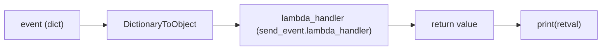
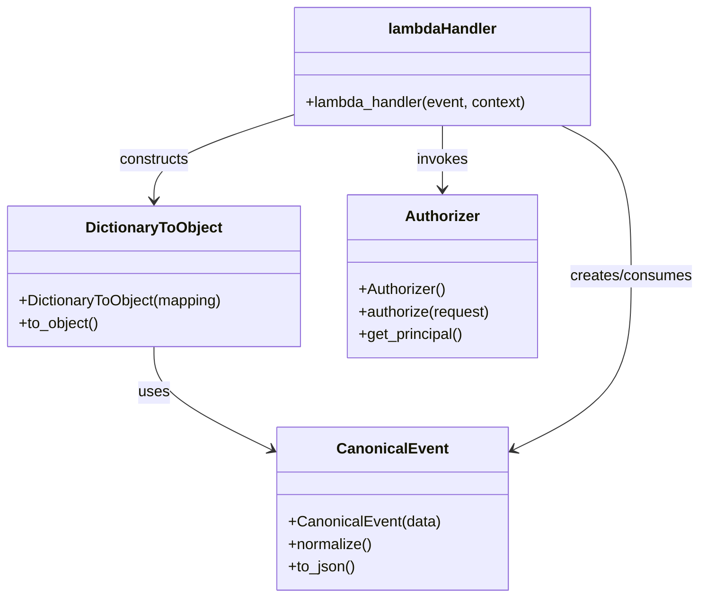

# Diagram: tools/ide_local_testing/localTest/test/byUrl/byEvent.py

> Auto-generated by Obscura crawlers

## Diagram 1

### SVG

<svg id="container" width="1128.890625" xmlns="http://www.w3.org/2000/svg" class="flowchart" height="94" viewBox="0 0 1128.890625 94" role="graphics-document document" aria-roledescription="flowchart-v2"><g><marker id="container_flowchart-v2-pointEnd" class="marker flowchart-v2" viewBox="0 0 10 10" refX="5" refY="5" markerUnits="userSpaceOnUse" markerWidth="8" markerHeight="8" orient="auto"><path d="M 0 0 L 10 5 L 0 10 z" class="arrowMarkerPath" style="stroke-width: 1; stroke-dasharray: 1, 0;"></path></marker><marker id="container_flowchart-v2-pointStart" class="marker flowchart-v2" viewBox="0 0 10 10" refX="4.5" refY="5" markerUnits="userSpaceOnUse" markerWidth="8" markerHeight="8" orient="auto"><path d="M 0 5 L 10 10 L 10 0 z" class="arrowMarkerPath" style="stroke-width: 1; stroke-dasharray: 1, 0;"></path></marker><marker id="container_flowchart-v2-circleEnd" class="marker flowchart-v2" viewBox="0 0 10 10" refX="11" refY="5" markerUnits="userSpaceOnUse" markerWidth="11" markerHeight="11" orient="auto"><circle cx="5" cy="5" r="5" class="arrowMarkerPath" style="stroke-width: 1; stroke-dasharray: 1, 0;"></circle></marker><marker id="container_flowchart-v2-circleStart" class="marker flowchart-v2" viewBox="0 0 10 10" refX="-1" refY="5" markerUnits="userSpaceOnUse" markerWidth="11" markerHeight="11" orient="auto"><circle cx="5" cy="5" r="5" class="arrowMarkerPath" style="stroke-width: 1; stroke-dasharray: 1, 0;"></circle></marker><marker id="container_flowchart-v2-crossEnd" class="marker cross flowchart-v2" viewBox="0 0 11 11" refX="12" refY="5.2" markerUnits="userSpaceOnUse" markerWidth="11" markerHeight="11" orient="auto"><path d="M 1,1 l 9,9 M 10,1 l -9,9" class="arrowMarkerPath" style="stroke-width: 2; stroke-dasharray: 1, 0;"></path></marker><marker id="container_flowchart-v2-crossStart" class="marker cross flowchart-v2" viewBox="0 0 11 11" refX="-1" refY="5.2" markerUnits="userSpaceOnUse" markerWidth="11" markerHeight="11" orient="auto"><path d="M 1,1 l 9,9 M 10,1 l -9,9" class="arrowMarkerPath" style="stroke-width: 2; stroke-dasharray: 1, 0;"></path></marker><g class="root"><g class="clusters"></g><g class="edgePaths"><path d="M150.453,47L154.62,47C158.786,47,167.12,47,174.786,47C182.453,47,189.453,47,192.953,47L196.453,47" id="L_event_dto_0" class="edge-thickness-normal edge-pattern-solid edge-thickness-normal edge-pattern-solid flowchart-link" style=";" data-edge="true" data-et="edge" data-id="L_event_dto_0" data-points="W3sieCI6MTUwLjQ1MzEyNSwieSI6NDd9LHsieCI6MTc1LjQ1MzEyNSwieSI6NDd9LHsieCI6MjAwLjQ1MzEyNSwieSI6NDd9XQ==" marker-end="url(#container_flowchart-v2-pointEnd)"></path><path d="M398.625,47L402.792,47C406.958,47,415.292,47,422.958,47C430.625,47,437.625,47,441.125,47L444.625,47" id="L_dto_lambdaHandler_0" class="edge-thickness-normal edge-pattern-solid edge-thickness-normal edge-pattern-solid flowchart-link" style=";" data-edge="true" data-et="edge" data-id="L_dto_lambdaHandler_0" data-points="W3sieCI6Mzk4LjYyNSwieSI6NDd9LHsieCI6NDIzLjYyNSwieSI6NDd9LHsieCI6NDQ4LjYyNSwieSI6NDd9XQ==" marker-end="url(#container_flowchart-v2-pointEnd)"></path><path d="M726.016,47L730.182,47C734.349,47,742.682,47,750.349,47C758.016,47,765.016,47,768.516,47L772.016,47" id="L_lambdaHandler_retval_0" class="edge-thickness-normal edge-pattern-solid edge-thickness-normal edge-pattern-solid flowchart-link" style=";" data-edge="true" data-et="edge" data-id="L_lambdaHandler_retval_0" data-points="W3sieCI6NzI2LjAxNTYyNSwieSI6NDd9LHsieCI6NzUxLjAxNTYyNSwieSI6NDd9LHsieCI6Nzc2LjAxNTYyNSwieSI6NDd9XQ==" marker-end="url(#container_flowchart-v2-pointEnd)"></path><path d="M924.203,47L928.37,47C932.536,47,940.87,47,948.536,47C956.203,47,963.203,47,966.703,47L970.203,47" id="L_retval_print_0" class="edge-thickness-normal edge-pattern-solid edge-thickness-normal edge-pattern-solid flowchart-link" style=";" data-edge="true" data-et="edge" data-id="L_retval_print_0" data-points="W3sieCI6OTI0LjIwMzEyNSwieSI6NDd9LHsieCI6OTQ5LjIwMzEyNSwieSI6NDd9LHsieCI6OTc0LjIwMzEyNSwieSI6NDd9XQ==" marker-end="url(#container_flowchart-v2-pointEnd)"></path></g><g class="edgeLabels"><g class="edgeLabel"><g class="label" data-id="L_event_dto_0" transform="translate(0, 0)"><foreignObject width="0" height="0">

</foreignObject></g></g><g class="edgeLabel"><g class="label" data-id="L_dto_lambdaHandler_0" transform="translate(0, 0)"><foreignObject width="0" height="0">

</foreignObject></g></g><g class="edgeLabel"><g class="label" data-id="L_lambdaHandler_retval_0" transform="translate(0, 0)"><foreignObject width="0" height="0">

</foreignObject></g></g><g class="edgeLabel"><g class="label" data-id="L_retval_print_0" transform="translate(0, 0)"><foreignObject width="0" height="0">

</foreignObject></g></g></g><g class="nodes"><g class="node default" id="flowchart-event-0" transform="translate(79.2265625, 47)"><rect class="basic label-container" style="" x="-71.2265625" y="-27" width="142.453125" height="54"></rect><g class="label" style="" transform="translate(-41.2265625, -12)"><rect></rect><foreignObject width="82.453125" height="24">

event (dict)

</foreignObject></g></g><g class="node default" id="flowchart-dto-1" transform="translate(299.5390625, 47)"><rect class="basic label-container" style="" x="-99.0859375" y="-27" width="198.171875" height="54"></rect><g class="label" style="" transform="translate(-69.0859375, -12)"><rect></rect><foreignObject width="138.171875" height="24">

DictionaryToObject

</foreignObject></g></g><g class="node default" id="flowchart-lambdaHandler-3" transform="translate(587.3203125, 47)"><rect class="basic label-container" style="" x="-138.6953125" y="-39" width="277.390625" height="78"></rect><g class="label" style="" transform="translate(-108.6953125, -24)"><rect></rect><foreignObject width="217.390625" height="48">

lambda_handler (send_event.lambda_handler)

</foreignObject></g></g><g class="node default" id="flowchart-retval-5" transform="translate(850.109375, 47)"><rect class="basic label-container" style="" x="-74.09375" y="-27" width="148.1875" height="54"></rect><g class="label" style="" transform="translate(-44.09375, -12)"><rect></rect><foreignObject width="88.1875" height="24">

return value

</foreignObject></g></g><g class="node default" id="flowchart-print-7" transform="translate(1047.546875, 47)"><rect class="basic label-container" style="" x="-73.34375" y="-27" width="146.6875" height="54"></rect><g class="label" style="" transform="translate(-43.34375, -12)"><rect></rect><foreignObject width="86.6875" height="24">

print(retval)

</foreignObject></g></g></g></g></g></svg>

## Diagram 2

### SVG

<svg id="container" width="752.4140625" xmlns="http://www.w3.org/2000/svg" class="classDiagram" height="638" viewBox="0 0 752.4140625 638" role="graphics-document document" aria-roledescription="class"><g><defs><marker id="container_class-aggregationStart" class="marker aggregation class" refX="18" refY="7" markerWidth="190" markerHeight="240" orient="auto"><path d="M 18,7 L9,13 L1,7 L9,1 Z"></path></marker></defs><defs><marker id="container_class-aggregationEnd" class="marker aggregation class" refX="1" refY="7" markerWidth="20" markerHeight="28" orient="auto"><path d="M 18,7 L9,13 L1,7 L9,1 Z"></path></marker></defs><defs><marker id="container_class-extensionStart" class="marker extension class" refX="18" refY="7" markerWidth="190" markerHeight="240" orient="auto"><path d="M 1,7 L18,13 V 1 Z"></path></marker></defs><defs><marker id="container_class-extensionEnd" class="marker extension class" refX="1" refY="7" markerWidth="20" markerHeight="28" orient="auto"><path d="M 1,1 V 13 L18,7 Z"></path></marker></defs><defs><marker id="container_class-compositionStart" class="marker composition class" refX="18" refY="7" markerWidth="190" markerHeight="240" orient="auto"><path d="M 18,7 L9,13 L1,7 L9,1 Z"></path></marker></defs><defs><marker id="container_class-compositionEnd" class="marker composition class" refX="1" refY="7" markerWidth="20" markerHeight="28" orient="auto"><path d="M 18,7 L9,13 L1,7 L9,1 Z"></path></marker></defs><defs><marker id="container_class-dependencyStart" class="marker dependency class" refX="6" refY="7" markerWidth="190" markerHeight="240" orient="auto"><path d="M 5,7 L9,13 L1,7 L9,1 Z"></path></marker></defs><defs><marker id="container_class-dependencyEnd" class="marker dependency class" refX="13" refY="7" markerWidth="20" markerHeight="28" orient="auto"><path d="M 18,7 L9,13 L14,7 L9,1 Z"></path></marker></defs><defs><marker id="container_class-lollipopStart" class="marker lollipop class" refX="13" refY="7" markerWidth="190" markerHeight="240" orient="auto"><circle stroke="black" fill="transparent" cx="7" cy="7" r="6"></circle></marker></defs><defs><marker id="container_class-lollipopEnd" class="marker lollipop class" refX="1" refY="7" markerWidth="190" markerHeight="240" orient="auto"><circle stroke="black" fill="transparent" cx="7" cy="7" r="6"></circle></marker></defs><g class="root"><g class="clusters"></g><g class="edgePaths"><path d="M165.133,370L165.133,378.167C165.133,386.333,165.133,402.667,186.859,421.337C208.586,440.007,252.039,461.015,273.766,471.518L295.493,482.022" id="id_DictionaryToObject_CanonicalEvent_1" class="edge-thickness-normal edge-pattern-solid relation" style=";;;" data-edge="true" data-et="edge" data-id="id_DictionaryToObject_CanonicalEvent_1" data-points="W3sieCI6MTY1LjEzMjgxMjUsInkiOjM3MH0seyJ4IjoxNjUuMTMyODEyNSwieSI6NDE5fSx7IngiOjMwMC44OTQ1MzEyNSwieSI6NDg0LjYzMzM5NTI2NjY2ODd9XQ==" marker-end="url(#container_class-dependencyEnd)"></path><path d="M314.184,122.827L289.342,130.856C264.5,138.885,214.816,154.942,189.975,170.138C165.133,185.333,165.133,199.667,165.133,206.833L165.133,214" id="id_lambdaHandler_DictionaryToObject_2" class="edge-thickness-normal edge-pattern-solid relation" style=";;;" data-edge="true" data-et="edge" data-id="id_lambdaHandler_DictionaryToObject_2" data-points="W3sieCI6MzE0LjE4MzU5Mzc1LCJ5IjoxMjIuODI3NDQzODUxMDc3NTN9LHsieCI6MTY1LjEzMjgxMjUsInkiOjE3MX0seyJ4IjoxNjUuMTMyODEyNSwieSI6MjIwfV0=" marker-end="url(#container_class-dependencyEnd)"></path><path d="M602.795,134L615.348,140.167C627.902,146.333,653.01,158.667,665.563,185.5C678.117,212.333,678.117,253.667,678.117,295C678.117,336.333,678.117,377.667,656.391,408.837C634.664,440.007,591.211,461.015,569.484,471.518L547.757,482.022" id="id_lambdaHandler_CanonicalEvent_3" class="edge-thickness-normal edge-pattern-solid relation" style=";;;" data-edge="true" data-et="edge" data-id="id_lambdaHandler_CanonicalEvent_3" data-points="W3sieCI6NjAyLjc5NDcyNjU2MjUsInkiOjEzNH0seyJ4Ijo2NzguMTE3MTg3NSwieSI6MTcxfSx7IngiOjY3OC4xMTcxODc1LCJ5IjoyOTV9LHsieCI6Njc4LjExNzE4NzUsInkiOjQxOX0seyJ4Ijo1NDIuMzU1NDY4NzUsInkiOjQ4NC42MzMzOTUyNjY2Njg3fV0=" marker-end="url(#container_class-dependencyEnd)"></path><path d="M474.543,134L474.543,140.167C474.543,146.333,474.543,158.667,474.543,170C474.543,181.333,474.543,191.667,474.543,196.833L474.543,202" id="id_lambdaHandler_Authorizer_4" class="edge-thickness-normal edge-pattern-solid relation" style=";;;" data-edge="true" data-et="edge" data-id="id_lambdaHandler_Authorizer_4" data-points="W3sieCI6NDc0LjU0Mjk2ODc1LCJ5IjoxMzR9LHsieCI6NDc0LjU0Mjk2ODc1LCJ5IjoxNzF9LHsieCI6NDc0LjU0Mjk2ODc1LCJ5IjoyMDh9XQ==" marker-end="url(#container_class-dependencyEnd)"></path></g><g class="edgeLabels"><g class="edgeLabel" transform="translate(165.1328125, 419)"><g class="label" data-id="id_DictionaryToObject_CanonicalEvent_1" transform="translate(-16.4921875, -12)"><foreignObject width="32.984375" height="24">

uses

</foreignObject></g></g><g class="edgeLabel" transform="translate(165.1328125, 171)"><g class="label" data-id="id_lambdaHandler_DictionaryToObject_2" transform="translate(-37.84375, -12)"><foreignObject width="75.6875" height="24">

constructs

</foreignObject></g></g><g class="edgeLabel" transform="translate(678.1171875, 295)"><g class="label" data-id="id_lambdaHandler_CanonicalEvent_3" transform="translate(-66.296875, -12)"><foreignObject width="132.59375" height="24">

creates/consumes

</foreignObject></g></g><g class="edgeLabel" transform="translate(474.54296875, 171)"><g class="label" data-id="id_lambdaHandler_Authorizer_4" transform="translate(-27.5859375, -12)"><foreignObject width="55.171875" height="24">

invokes

</foreignObject></g></g></g><g class="nodes"><g class="node default" id="classId-DictionaryToObject-0" transform="translate(165.1328125, 295)"><g class="basic label-container"><path d="M-157.1328125 -75 L157.1328125 -75 L157.1328125 75 L-157.1328125 75" stroke="none" stroke-width="0" fill="#ECECFF" style=""></path><path d="M-157.1328125 -75 C-51.25828120800132 -75, 54.61625008399736 -75, 157.1328125 -75 M-157.1328125 -75 C-82.44232650866306 -75, -7.751840517326116 -75, 157.1328125 -75 M157.1328125 -75 C157.1328125 -44.33948217003236, 157.1328125 -13.678964340064724, 157.1328125 75 M157.1328125 -75 C157.1328125 -18.676431377207727, 157.1328125 37.647137245584545, 157.1328125 75 M157.1328125 75 C61.15787087202595 75, -34.817070755948095 75, -157.1328125 75 M157.1328125 75 C69.56077060952255 75, -18.0112712809549 75, -157.1328125 75 M-157.1328125 75 C-157.1328125 32.90252501701705, -157.1328125 -9.194949965965904, -157.1328125 -75 M-157.1328125 75 C-157.1328125 19.141227981450342, -157.1328125 -36.717544037099316, -157.1328125 -75" stroke="#9370DB" stroke-width="1.3" fill="none" stroke-dasharray="0 0" style=""></path></g><g class="annotation-group text" transform="translate(0, -51)"></g><g class="label-group text" transform="translate(-70.109375, -51)"><g class="label" style="font-weight: bolder" transform="translate(0,-12)"><foreignObject width="140.21875" height="24">

DictionaryToObject

</foreignObject></g></g><g class="members-group text" transform="translate(-145.1328125, -3)"></g><g class="methods-group text" transform="translate(-145.1328125, 27)"><g class="label" style="" transform="translate(0,-12)"><foreignObject width="220.15625" height="24">

+DictionaryToObject(mapping)

</foreignObject></g><g class="label" style="" transform="translate(0,12)"><foreignObject width="86.3125" height="24">

+to_object()

</foreignObject></g></g><g class="divider" style=""><path d="M-157.1328125 -27 C-53.674637525927054 -27, 49.78353744814589 -27, 157.1328125 -27 M-157.1328125 -27 C-86.39694962453419 -27, -15.661086749068375 -27, 157.1328125 -27" stroke="#9370DB" stroke-width="1.3" fill="none" stroke-dasharray="0 0" style=""></path></g><g class="divider" style=""><path d="M-157.1328125 -3 C-39.108544964712465 -3, 78.91572257057507 -3, 157.1328125 -3 M-157.1328125 -3 C-60.87897778199729 -3, 35.374856936005415 -3, 157.1328125 -3" stroke="#9370DB" stroke-width="1.3" fill="none" stroke-dasharray="0 0" style=""></path></g></g><g class="node default" id="classId-CanonicalEvent-1" transform="translate(421.625, 543)"><g class="basic label-container"><path d="M-120.73046875 -87 L120.73046875 -87 L120.73046875 87 L-120.73046875 87" stroke="none" stroke-width="0" fill="#ECECFF" style=""></path><path d="M-120.73046875 -87 C-38.89686031315736 -87, 42.93674812368528 -87, 120.73046875 -87 M-120.73046875 -87 C-43.087109341050635 -87, 34.55625006789873 -87, 120.73046875 -87 M120.73046875 -87 C120.73046875 -42.03592680719644, 120.73046875 2.9281463856071213, 120.73046875 87 M120.73046875 -87 C120.73046875 -31.64714454703681, 120.73046875 23.70571090592638, 120.73046875 87 M120.73046875 87 C51.02199047606561 87, -18.68648779786878 87, -120.73046875 87 M120.73046875 87 C56.732843270852975 87, -7.264782208294051 87, -120.73046875 87 M-120.73046875 87 C-120.73046875 24.737746051229493, -120.73046875 -37.524507897541014, -120.73046875 -87 M-120.73046875 87 C-120.73046875 28.322492639278437, -120.73046875 -30.355014721443126, -120.73046875 -87" stroke="#9370DB" stroke-width="1.3" fill="none" stroke-dasharray="0 0" style=""></path></g><g class="annotation-group text" transform="translate(0, -63)"></g><g class="label-group text" transform="translate(-55.7109375, -63)"><g class="label" style="font-weight: bolder" transform="translate(0,-12)"><foreignObject width="111.421875" height="24">

CanonicalEvent

</foreignObject></g></g><g class="members-group text" transform="translate(-108.73046875, -15)"></g><g class="methods-group text" transform="translate(-108.73046875, 15)"><g class="label" style="" transform="translate(0,-12)"><foreignObject width="161.75" height="24">

+CanonicalEvent(data)

</foreignObject></g><g class="label" style="" transform="translate(0,12)"><foreignObject width="90.3125" height="24">

+normalize()

</foreignObject></g><g class="label" style="" transform="translate(0,36)"><foreignObject width="72.40625" height="24">

+to_json()

</foreignObject></g></g><g class="divider" style=""><path d="M-120.73046875 -39 C-41.57234822492205 -39, 37.585772300155895 -39, 120.73046875 -39 M-120.73046875 -39 C-41.31320815782939 -39, 38.10405243434121 -39, 120.73046875 -39" stroke="#9370DB" stroke-width="1.3" fill="none" stroke-dasharray="0 0" style=""></path></g><g class="divider" style=""><path d="M-120.73046875 -15 C-59.75998433310167 -15, 1.21050008379666 -15, 120.73046875 -15 M-120.73046875 -15 C-31.991533341554643 -15, 56.747402066890714 -15, 120.73046875 -15" stroke="#9370DB" stroke-width="1.3" fill="none" stroke-dasharray="0 0" style=""></path></g></g><g class="node default" id="classId-Authorizer-2" transform="translate(474.54296875, 295)"><g class="basic label-container"><path d="M-102.27734375 -87 L102.27734375 -87 L102.27734375 87 L-102.27734375 87" stroke="none" stroke-width="0" fill="#ECECFF" style=""></path><path d="M-102.27734375 -87 C-31.352669071366876 -87, 39.57200560726625 -87, 102.27734375 -87 M-102.27734375 -87 C-33.01252575800467 -87, 36.25229223399066 -87, 102.27734375 -87 M102.27734375 -87 C102.27734375 -39.77791370432265, 102.27734375 7.4441725913547, 102.27734375 87 M102.27734375 -87 C102.27734375 -39.49103753891254, 102.27734375 8.017924922174913, 102.27734375 87 M102.27734375 87 C44.67532232014044 87, -12.926699109719124 87, -102.27734375 87 M102.27734375 87 C21.081705651978396 87, -60.11393244604321 87, -102.27734375 87 M-102.27734375 87 C-102.27734375 26.143241630891715, -102.27734375 -34.71351673821657, -102.27734375 -87 M-102.27734375 87 C-102.27734375 46.286946273628736, -102.27734375 5.573892547257472, -102.27734375 -87" stroke="#9370DB" stroke-width="1.3" fill="none" stroke-dasharray="0 0" style=""></path></g><g class="annotation-group text" transform="translate(0, -63)"></g><g class="label-group text" transform="translate(-38.3671875, -63)"><g class="label" style="font-weight: bolder" transform="translate(0,-12)"><foreignObject width="76.734375" height="24">

Authorizer

</foreignObject></g></g><g class="members-group text" transform="translate(-90.27734375, -15)"></g><g class="methods-group text" transform="translate(-90.27734375, 15)"><g class="label" style="" transform="translate(0,-12)"><foreignObject width="93.640625" height="24">

+Authorizer()

</foreignObject></g><g class="label" style="" transform="translate(0,12)"><foreignObject width="142.1875" height="24">

+authorize(request)

</foreignObject></g><g class="label" style="" transform="translate(0,36)"><foreignObject width="113.546875" height="24">

+get_principal()

</foreignObject></g></g><g class="divider" style=""><path d="M-102.27734375 -39 C-24.923124901061783 -39, 52.431093947876434 -39, 102.27734375 -39 M-102.27734375 -39 C-23.470971177026442 -39, 55.335401395947116 -39, 102.27734375 -39" stroke="#9370DB" stroke-width="1.3" fill="none" stroke-dasharray="0 0" style=""></path></g><g class="divider" style=""><path d="M-102.27734375 -15 C-45.71800384316895 -15, 10.841336063662098 -15, 102.27734375 -15 M-102.27734375 -15 C-43.392753455468785 -15, 15.49183683906243 -15, 102.27734375 -15" stroke="#9370DB" stroke-width="1.3" fill="none" stroke-dasharray="0 0" style=""></path></g></g><g class="node default" id="classId-lambdaHandler-3" transform="translate(474.54296875, 71)"><g class="basic label-container"><path d="M-160.359375 -63 L160.359375 -63 L160.359375 63 L-160.359375 63" stroke="none" stroke-width="0" fill="#ECECFF" style=""></path><path d="M-160.359375 -63 C-45.86784464758662 -63, 68.62368570482676 -63, 160.359375 -63 M-160.359375 -63 C-39.14032176028185 -63, 82.0787314794363 -63, 160.359375 -63 M160.359375 -63 C160.359375 -36.66074810568622, 160.359375 -10.321496211372434, 160.359375 63 M160.359375 -63 C160.359375 -34.88332902777786, 160.359375 -6.766658055555723, 160.359375 63 M160.359375 63 C40.007736185792766 63, -80.34390262841447 63, -160.359375 63 M160.359375 63 C80.48848852902545 63, 0.6176020580508919 63, -160.359375 63 M-160.359375 63 C-160.359375 31.680680068088254, -160.359375 0.36136013617650775, -160.359375 -63 M-160.359375 63 C-160.359375 28.68369230475289, -160.359375 -5.632615390494223, -160.359375 -63" stroke="#9370DB" stroke-width="1.3" fill="none" stroke-dasharray="0 0" style=""></path></g><g class="annotation-group text" transform="translate(0, -39)"></g><g class="label-group text" transform="translate(-56.53125, -39)"><g class="label" style="font-weight: bolder" transform="translate(0,-12)"><foreignObject width="113.0625" height="24">

lambdaHandler

</foreignObject></g></g><g class="members-group text" transform="translate(-148.359375, 9)"></g><g class="methods-group text" transform="translate(-148.359375, 39)"><g class="label" style="" transform="translate(0,-12)"><foreignObject width="240.1875" height="24">

+lambda_handler(event, context)

</foreignObject></g></g><g class="divider" style=""><path d="M-160.359375 -15 C-39.24443589570839 -15, 81.87050320858322 -15, 160.359375 -15 M-160.359375 -15 C-58.87129935973604 -15, 42.616776280527915 -15, 160.359375 -15" stroke="#9370DB" stroke-width="1.3" fill="none" stroke-dasharray="0 0" style=""></path></g><g class="divider" style=""><path d="M-160.359375 9 C-40.398918669617174 9, 79.56153766076565 9, 160.359375 9 M-160.359375 9 C-93.88136778432934 9, -27.403360568658684 9, 160.359375 9" stroke="#9370DB" stroke-width="1.3" fill="none" stroke-dasharray="0 0" style=""></path></g></g></g></g></g></svg>
