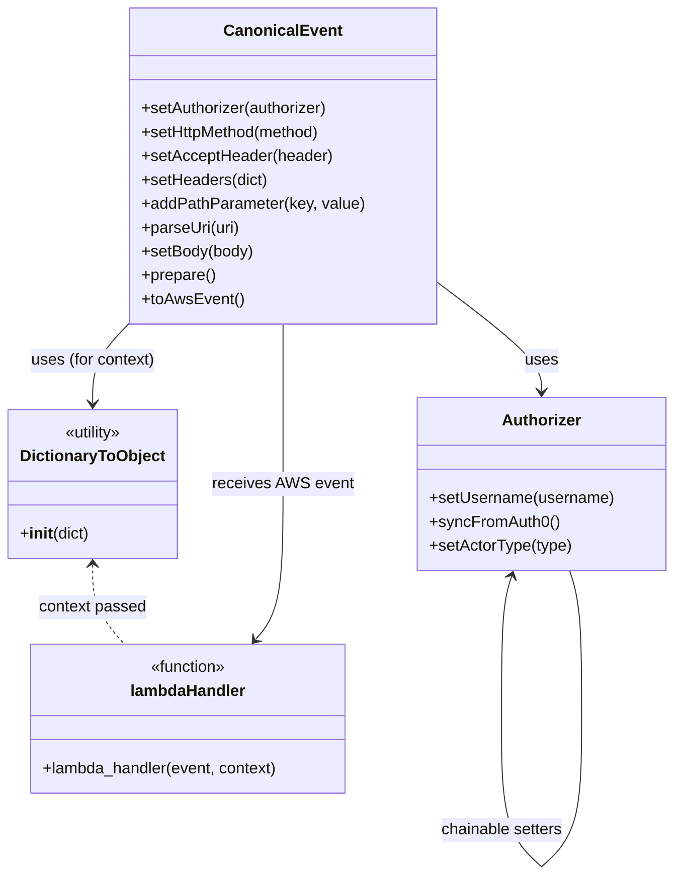

# Diagram: tools/ide_local_testing/localTest/test/byUrl/createShipment.py


> Auto-generated by Obscura crawlers

## Diagram 1



### SVG

<svg id="container" width="669.6363525390625" xmlns="http://www.w3.org/2000/svg" class="classDiagram" height="880.1499633789062" viewBox="0 0 669.6363525390625 880.1499633789062" role="graphics-document document" aria-roledescription="class"><style>#container{font-family:"trebuchet ms",verdana,arial,sans-serif;font-size:16px;fill:#333;}@keyframes edge-animation-frame{from{stroke-dashoffset:0;}}@keyframes dash{to{stroke-dashoffset:0;}}#container .edge-animation-slow{stroke-dasharray:9,5!important;stroke-dashoffset:900;animation:dash 50s linear infinite;stroke-linecap:round;}#container .edge-animation-fast{stroke-dasharray:9,5!important;stroke-dashoffset:900;animation:dash 20s linear infinite;stroke-linecap:round;}#container .error-icon{fill:#552222;}#container .error-text{fill:#552222;stroke:#552222;}#container .edge-thickness-normal{stroke-width:1px;}#container .edge-thickness-thick{stroke-width:3.5px;}#container .edge-pattern-solid{stroke-dasharray:0;}#container .edge-thickness-invisible{stroke-width:0;fill:none;}#container .edge-pattern-dashed{stroke-dasharray:3;}#container .edge-pattern-dotted{stroke-dasharray:2;}#container .marker{fill:#333333;stroke:#333333;}#container .marker.cross{stroke:#333333;}#container svg{font-family:"trebuchet ms",verdana,arial,sans-serif;font-size:16px;}#container p{margin:0;}#container g.classGroup text{fill:#9370DB;stroke:none;font-family:"trebuchet ms",verdana,arial,sans-serif;font-size:10px;}#container g.classGroup text .title{font-weight:bolder;}#container .nodeLabel,#container .edgeLabel{color:#131300;}#container .edgeLabel .label rect{fill:#ECECFF;}#container .label text{fill:#131300;}#container .labelBkg{background:#ECECFF;}#container .edgeLabel .label span{background:#ECECFF;}#container .classTitle{font-weight:bolder;}#container .node rect,#container .node circle,#container .node ellipse,#container .node polygon,#container .node path{fill:#ECECFF;stroke:#9370DB;stroke-width:1px;}#container .divider{stroke:#9370DB;stroke-width:1;}#container g.clickable{cursor:pointer;}#container g.classGroup rect{fill:#ECECFF;stroke:#9370DB;}#container g.classGroup line{stroke:#9370DB;stroke-width:1;}#container .classLabel .box{stroke:none;stroke-width:0;fill:#ECECFF;opacity:0.5;}#container .classLabel .label{fill:#9370DB;font-size:10px;}#container .relation{stroke:#333333;stroke-width:1;fill:none;}#container .dashed-line{stroke-dasharray:3;}#container .dotted-line{stroke-dasharray:1 2;}#container #compositionStart,#container .composition{fill:#333333!important;stroke:#333333!important;stroke-width:1;}#container #compositionEnd,#container .composition{fill:#333333!important;stroke:#333333!important;stroke-width:1;}#container #dependencyStart,#container .dependency{fill:#333333!important;stroke:#333333!important;stroke-width:1;}#container #dependencyStart,#container .dependency{fill:#333333!important;stroke:#333333!important;stroke-width:1;}#container #extensionStart,#container .extension{fill:transparent!important;stroke:#333333!important;stroke-width:1;}#container #extensionEnd,#container .extension{fill:transparent!important;stroke:#333333!important;stroke-width:1;}#container #aggregationStart,#container .aggregation{fill:transparent!important;stroke:#333333!important;stroke-width:1;}#container #aggregationEnd,#container .aggregation{fill:transparent!important;stroke:#333333!important;stroke-width:1;}#container #lollipopStart,#container .lollipop{fill:#ECECFF!important;stroke:#333333!important;stroke-width:1;}#container #lollipopEnd,#container .lollipop{fill:#ECECFF!important;stroke:#333333!important;stroke-width:1;}#container .edgeTerminals{font-size:11px;line-height:initial;}#container .classTitleText{text-anchor:middle;font-size:18px;fill:#333;}#container .label-icon{display:inline-block;height:1em;overflow:visible;vertical-align:-0.125em;}#container .node .label-icon path{fill:currentColor;stroke:revert;stroke-width:revert;}#container :root{--mermaid-font-family:"trebuchet ms",verdana,arial,sans-serif;}</style><g><defs><marker id="container_class-aggregationStart" class="marker aggregation class" refX="18" refY="7" markerWidth="190" markerHeight="240" orient="auto"><path d="M 18,7 L9,13 L1,7 L9,1 Z"></path></marker></defs><defs><marker id="container_class-aggregationEnd" class="marker aggregation class" refX="1" refY="7" markerWidth="20" markerHeight="28" orient="auto"><path d="M 18,7 L9,13 L1,7 L9,1 Z"></path></marker></defs><defs><marker id="container_class-extensionStart" class="marker extension class" refX="18" refY="7" markerWidth="190" markerHeight="240" orient="auto"><path d="M 1,7 L18,13 V 1 Z"></path></marker></defs><defs><marker id="container_class-extensionEnd" class="marker extension class" refX="1" refY="7" markerWidth="20" markerHeight="28" orient="auto"><path d="M 1,1 V 13 L18,7 Z"></path></marker></defs><defs><marker id="container_class-compositionStart" class="marker composition class" refX="18" refY="7" markerWidth="190" markerHeight="240" orient="auto"><path d="M 18,7 L9,13 L1,7 L9,1 Z"></path></marker></defs><defs><marker id="container_class-compositionEnd" class="marker composition class" refX="1" refY="7" markerWidth="20" markerHeight="28" orient="auto"><path d="M 18,7 L9,13 L1,7 L9,1 Z"></path></marker></defs><defs><marker id="container_class-dependencyStart" class="marker dependency class" refX="6" refY="7" markerWidth="190" markerHeight="240" orient="auto"><path d="M 5,7 L9,13 L1,7 L9,1 Z"></path></marker></defs><defs><marker id="container_class-dependencyEnd" class="marker dependency class" refX="13" refY="7" markerWidth="20" markerHeight="28" orient="auto"><path d="M 18,7 L9,13 L14,7 L9,1 Z"></path></marker></defs><defs><marker id="container_class-lollipopStart" class="marker lollipop class" refX="13" refY="7" markerWidth="190" markerHeight="240" orient="auto"><circle stroke="black" fill="transparent" cx="7" cy="7" r="6"></circle></marker></defs><defs><marker id="container_class-lollipopEnd" class="marker lollipop class" refX="1" refY="7" markerWidth="190" markerHeight="240" orient="auto"><circle stroke="black" fill="transparent" cx="7" cy="7" r="6"></circle></marker></defs><g class="root"><g class="clusters"></g><g class="edgePaths"><path d="M428.355,280.949L446.546,294.624C464.737,308.299,501.118,335.65,519.309,354.491C537.5,373.333,537.5,383.667,537.5,388.833L537.5,394" id="id_CanonicalEvent_Authorizer_1" class="edge-thickness-normal edge-pattern-solid relation" style=";;;" data-edge="true" data-et="edge" data-id="id_CanonicalEvent_Authorizer_1" data-points="W3sieCI6NDI4LjM1NTQ2ODc1LCJ5IjoyODAuOTQ4ODEwMzAzMTAwODZ9LHsieCI6NTM3LjQ5OTYwOTM3NTM3MjUsInkiOjM2M30seyJ4Ijo1MzcuNDk5NjA5Mzc1MzcyNSwieSI6NDAwfV0=" marker-end="url(#container_class-dependencyEnd)"></path><path d="M125.425,326L119.554,332.167C113.684,338.333,101.944,350.667,96.073,364C90.203,377.333,90.203,391.667,90.203,398.833L90.203,406" id="id_CanonicalEvent_DictionaryToObject_2" class="edge-thickness-normal edge-pattern-solid relation" style=";;;" data-edge="true" data-et="edge" data-id="id_CanonicalEvent_DictionaryToObject_2" data-points="W3sieCI6MTI1LjQyNDUwNTczOTc5NTksInkiOjMyNn0seyJ4Ijo5MC4yMDMxMjUsInkiOjM2M30seyJ4Ijo5MC4yMDMxMjUsInkiOjQxMn1d" marker-end="url(#container_class-dependencyEnd)"></path><path d="M249.803,643.39L254.299,637.991C258.795,632.593,267.788,621.797,272.285,595.732C276.781,569.667,276.781,528.333,276.781,487C276.781,445.667,276.781,404.333,276.781,377.5C276.781,350.667,276.781,338.333,276.781,332.167L276.781,326" id="id_lambdaHandler_CanonicalEvent_3" class="edge-thickness-normal edge-pattern-solid relation" style=";;;" data-edge="true" data-et="edge" data-id="id_lambdaHandler_CanonicalEvent_3" data-points="W3sieCI6MjQ1Ljk2MjU0MTg1MjY3ODU2LCJ5Ijo2NDh9LHsieCI6Mjc2Ljc4MTI1LCJ5Ijo2MTF9LHsieCI6Mjc2Ljc4MTI1LCJ5Ijo0ODd9LHsieCI6Mjc2Ljc4MTI1LCJ5IjozNjN9LHsieCI6Mjc2Ljc4MTI1LCJ5IjozMjZ9XQ==" marker-start="url(#container_class-dependencyStart)"></path><path d="M506.658,579.693L504.922,584.911C503.186,590.129,499.714,600.564,497.978,624.441C496.242,648.317,496.242,685.633,496.242,704.292L496.242,722.95" id="Authorizer-cyclic-special-1" class="edge-thickness-normal edge-pattern-solid relation" style=";;;" data-edge="true" data-et="edge" data-id="Authorizer-cyclic-special-1" data-points="W3sieCI6NTA4LjU1MjU5NTc2NjUwMTU1LCJ5Ijo1NzR9LHsieCI6NDk2LjI0MTc5Njg3NTM3MjUzLCJ5Ijo2MTF9LHsieCI6NDk2LjI0MTc5Njg3NTM3MjUzLCJ5Ijo3MjIuOTQ5OTk5OTk5MjU0OX1d" marker-start="url(#container_class-dependencyStart)"></path><path d="M496.242,723.05L496.242,741.708C496.242,760.367,496.242,797.683,503.11,822.509C509.978,847.335,523.714,859.67,530.582,865.838L537.45,872.005" id="Authorizer-cyclic-special-mid" class="edge-thickness-normal edge-pattern-solid relation" style=";;;" data-edge="true" data-et="edge" data-id="Authorizer-cyclic-special-mid" data-points="W3sieCI6NDk2LjI0MTc5Njg3NTM3MjUzLCJ5Ijo3MjMuMDUwMDAwMDAwNzQ1MX0seyJ4Ijo0OTYuMjQxNzk2ODc1MzcyNTMsInkiOjgzNX0seyJ4Ijo1MzcuNDQ5NjA5Mzc0NjI3NSwieSI6ODcyLjAwNTA5OTQxMzA2NTF9XQ=="></path><path d="M537.55,872.005L544.418,865.838C551.286,859.67,565.021,847.335,571.889,822.501C578.757,797.667,578.757,760.333,578.757,723C578.757,685.667,578.757,648.333,576.706,623.5C574.654,598.667,570.55,586.333,568.498,580.167L566.447,574" id="Authorizer-cyclic-special-2" class="edge-thickness-normal edge-pattern-solid relation" style=";;;" data-edge="true" data-et="edge" data-id="Authorizer-cyclic-special-2" data-points="W3sieCI6NTM3LjU0OTYwOTM3NjExNzYsInkiOjg3Mi4wMDUwOTk0MTMwNjUxfSx7IngiOjU3OC43NTc0MjE4NzUzNzI1LCJ5Ijo4MzV9LHsieCI6NTc4Ljc1NzQyMTg3NTM3MjUsInkiOjcyM30seyJ4Ijo1NzguNzU3NDIxODc1MzcyNSwieSI6NjExfSx7IngiOjU2Ni40NDY2MjI5ODQyNDM1LCJ5Ijo1NzR9XQ=="></path><path d="M90.203,568L90.203,575.167C90.203,582.333,90.203,596.667,95.34,610C100.476,623.333,110.749,635.667,115.885,641.833L121.022,648" id="id_DictionaryToObject_lambdaHandler_5" class="edge-thickness-normal edge-pattern-dashed relation" style=";;;" data-edge="true" data-et="edge" data-id="id_DictionaryToObject_lambdaHandler_5" data-points="W3sieCI6OTAuMjAzMTI1LCJ5Ijo1NjJ9LHsieCI6OTAuMjAzMTI1LCJ5Ijo2MTF9LHsieCI6MTIxLjAyMTgzMzE0NzMyMTQzLCJ5Ijo2NDh9XQ==" marker-start="url(#container_class-dependencyStart)"></path></g><g class="edgeLabels"><g class="edgeLabel" transform="translate(497.71497, 333.09114)"><g class="label" data-id="id_CanonicalEvent_Authorizer_1" transform="translate(-16.4921875, -12)"><foreignObject width="32.984375" height="24"><div xmlns="http://www.w3.org/1999/xhtml" class="labelBkg" style="display: table-cell; white-space: nowrap; line-height: 1.5; max-width: 200px; text-align: center;"><span class="edgeLabel"><p>uses</p></span></div></foreignObject></g></g><g class="edgeLabel" transform="translate(90.203125, 363)"><g class="label" data-id="id_CanonicalEvent_DictionaryToObject_2" transform="translate(-63.125, -12)"><foreignObject width="126.25" height="24"><div xmlns="http://www.w3.org/1999/xhtml" class="labelBkg" style="display: table-cell; white-space: nowrap; line-height: 1.5; max-width: 200px; text-align: center;"><span class="edgeLabel"><p>uses (for context)</p></span></div></foreignObject></g></g><g class="edgeLabel" transform="translate(276.78125, 487)"><g class="label" data-id="id_lambdaHandler_CanonicalEvent_3" transform="translate(-69.375, -12)"><foreignObject width="138.75" height="24"><div xmlns="http://www.w3.org/1999/xhtml" class="labelBkg" style="display: table-cell; white-space: nowrap; line-height: 1.5; max-width: 200px; text-align: center;"><span class="edgeLabel"><p>receives AWS event</p></span></div></foreignObject></g></g><g class="edgeLabel"><g class="label" data-id="Authorizer-cyclic-special-1" transform="translate(0, 0)"><foreignObject width="0" height="0"><div xmlns="http://www.w3.org/1999/xhtml" class="labelBkg" style="display: table-cell; white-space: nowrap; line-height: 1.5; max-width: 200px; text-align: center;"><span class="edgeLabel"></span></div></foreignObject></g></g><g class="edgeLabel" transform="translate(496.24179687537253, 835)"><g class="label" data-id="Authorizer-cyclic-special-mid" transform="translate(-62.515625, -12)"><foreignObject width="125.03125" height="24"><div xmlns="http://www.w3.org/1999/xhtml" class="labelBkg" style="display: table-cell; white-space: nowrap; line-height: 1.5; max-width: 200px; text-align: center;"><span class="edgeLabel"><p>chainable setters</p></span></div></foreignObject></g></g><g class="edgeLabel"><g class="label" data-id="Authorizer-cyclic-special-2" transform="translate(0, 0)"><foreignObject width="0" height="0"><div xmlns="http://www.w3.org/1999/xhtml" class="labelBkg" style="display: table-cell; white-space: nowrap; line-height: 1.5; max-width: 200px; text-align: center;"><span class="edgeLabel"></span></div></foreignObject></g></g><g class="edgeLabel" transform="translate(90.203125, 611)"><g class="label" data-id="id_DictionaryToObject_lambdaHandler_5" transform="translate(-54.453125, -12)"><foreignObject width="108.90625" height="24"><div xmlns="http://www.w3.org/1999/xhtml" class="labelBkg" style="display: table-cell; white-space: nowrap; line-height: 1.5; max-width: 200px; text-align: center;"><span class="edgeLabel"><p>context passed</p></span></div></foreignObject></g></g></g><g class="nodes"><g class="node default" id="classId-CanonicalEvent-0" transform="translate(276.78125, 167)"><g class="basic label-container"><path d="M-151.57421875 -159 L151.57421875 -159 L151.57421875 159 L-151.57421875 159" stroke="none" stroke-width="0" fill="#ECECFF" style=""></path><path d="M-151.57421875 -159 C-34.15125084466814 -159, 83.27171706066372 -159, 151.57421875 -159 M-151.57421875 -159 C-69.81288274458907 -159, 11.94845326082185 -159, 151.57421875 -159 M151.57421875 -159 C151.57421875 -49.22956950402805, 151.57421875 60.5408609919439, 151.57421875 159 M151.57421875 -159 C151.57421875 -48.20057265271538, 151.57421875 62.59885469456924, 151.57421875 159 M151.57421875 159 C42.94543658369123 159, -65.68334558261753 159, -151.57421875 159 M151.57421875 159 C74.1338657325374 159, -3.306487284925197 159, -151.57421875 159 M-151.57421875 159 C-151.57421875 39.22363257941909, -151.57421875 -80.55273484116182, -151.57421875 -159 M-151.57421875 159 C-151.57421875 55.617942524092825, -151.57421875 -47.76411495181435, -151.57421875 -159" stroke="#9370DB" stroke-width="1.3" fill="none" stroke-dasharray="0 0" style=""></path></g><g class="annotation-group text" transform="translate(0, -135)"></g><g class="label-group text" transform="translate(-55.7109375, -135)"><g class="label" style="font-weight: bolder" transform="translate(0,-12)"><foreignObject width="111.421875" height="24"><div xmlns="http://www.w3.org/1999/xhtml" style="display: table-cell; white-space: nowrap; line-height: 1.5; max-width: 161px; text-align: center;"><span class="nodeLabel markdown-node-label" style=""><p>CanonicalEvent</p></span></div></foreignObject></g></g><g class="members-group text" transform="translate(-139.57421875, -87)"></g><g class="methods-group text" transform="translate(-139.57421875, -57)"><g class="label" style="" transform="translate(0,-12)"><foreignObject width="190.75" height="24"><div xmlns="http://www.w3.org/1999/xhtml" style="display: table-cell; white-space: nowrap; line-height: 1.5; max-width: 248px; text-align: center;"><span class="nodeLabel markdown-node-label" style=""><p>+setAuthorizer(authorizer)</p></span></div></foreignObject></g><g class="label" style="" transform="translate(0,12)"><foreignObject width="184" height="24"><div xmlns="http://www.w3.org/1999/xhtml" style="display: table-cell; white-space: nowrap; line-height: 1.5; max-width: 241px; text-align: center;"><span class="nodeLabel markdown-node-label" style=""><p>+setHttpMethod(method)</p></span></div></foreignObject></g><g class="label" style="" transform="translate(0,36)"><foreignObject width="191.859375" height="24"><div xmlns="http://www.w3.org/1999/xhtml" style="display: table-cell; white-space: nowrap; line-height: 1.5; max-width: 249px; text-align: center;"><span class="nodeLabel markdown-node-label" style=""><p>+setAcceptHeader(header)</p></span></div></foreignObject></g><g class="label" style="" transform="translate(0,60)"><foreignObject width="127.671875" height="24"><div xmlns="http://www.w3.org/1999/xhtml" style="display: table-cell; white-space: nowrap; line-height: 1.5; max-width: 185px; text-align: center;"><span class="nodeLabel markdown-node-label" style=""><p>+setHeaders(dict)</p></span></div></foreignObject></g><g class="label" style="" transform="translate(0,84)"><foreignObject width="223.4375" height="24"><div xmlns="http://www.w3.org/1999/xhtml" style="display: table-cell; white-space: nowrap; line-height: 1.5; max-width: 281px; text-align: center;"><span class="nodeLabel markdown-node-label" style=""><p>+addPathParameter(key, value)</p></span></div></foreignObject></g><g class="label" style="" transform="translate(0,108)"><foreignObject width="99.8125" height="24"><div xmlns="http://www.w3.org/1999/xhtml" style="display: table-cell; white-space: nowrap; line-height: 1.5; max-width: 157px; text-align: center;"><span class="nodeLabel markdown-node-label" style=""><p>+parseUri(uri)</p></span></div></foreignObject></g><g class="label" style="" transform="translate(0,132)"><foreignObject width="113.125" height="24"><div xmlns="http://www.w3.org/1999/xhtml" style="display: table-cell; white-space: nowrap; line-height: 1.5; max-width: 170px; text-align: center;"><span class="nodeLabel markdown-node-label" style=""><p>+setBody(body)</p></span></div></foreignObject></g><g class="label" style="" transform="translate(0,156)"><foreignObject width="74.75" height="24"><div xmlns="http://www.w3.org/1999/xhtml" style="display: table-cell; white-space: nowrap; line-height: 1.5; max-width: 132px; text-align: center;"><span class="nodeLabel markdown-node-label" style=""><p>+prepare()</p></span></div></foreignObject></g><g class="label" style="" transform="translate(0,180)"><foreignObject width="101.1875" height="24"><div xmlns="http://www.w3.org/1999/xhtml" style="display: table-cell; white-space: nowrap; line-height: 1.5; max-width: 159px; text-align: center;"><span class="nodeLabel markdown-node-label" style=""><p>+toAwsEvent()</p></span></div></foreignObject></g></g><g class="divider" style=""><path d="M-151.57421875 -111 C-52.43895084620492 -111, 46.696317057590164 -111, 151.57421875 -111 M-151.57421875 -111 C-41.9755201287912 -111, 67.6231784924176 -111, 151.57421875 -111" stroke="#9370DB" stroke-width="1.3" fill="none" stroke-dasharray="0 0" style=""></path></g><g class="divider" style=""><path d="M-151.57421875 -87 C-74.1493211085464 -87, 3.275576532907195 -87, 151.57421875 -87 M-151.57421875 -87 C-49.16244458885576 -87, 53.249329572288474 -87, 151.57421875 -87" stroke="#9370DB" stroke-width="1.3" fill="none" stroke-dasharray="0 0" style=""></path></g></g><g class="node default" id="classId-Authorizer-1" transform="translate(537.4996093753725, 487)"><g class="basic label-container"><path d="M-124.13671875 -87 L124.13671875 -87 L124.13671875 87 L-124.13671875 87" stroke="none" stroke-width="0" fill="#ECECFF" style=""></path><path d="M-124.13671875 -87 C-27.5034978942942 -87, 69.1297229614116 -87, 124.13671875 -87 M-124.13671875 -87 C-39.617977411193536 -87, 44.90076392761293 -87, 124.13671875 -87 M124.13671875 -87 C124.13671875 -24.941591634362396, 124.13671875 37.11681673127521, 124.13671875 87 M124.13671875 -87 C124.13671875 -19.42105939573416, 124.13671875 48.15788120853168, 124.13671875 87 M124.13671875 87 C53.72858815643205 87, -16.679542437135893 87, -124.13671875 87 M124.13671875 87 C70.62994131822067 87, 17.123163886441347 87, -124.13671875 87 M-124.13671875 87 C-124.13671875 31.48662295094765, -124.13671875 -24.026754098104703, -124.13671875 -87 M-124.13671875 87 C-124.13671875 35.18317261420105, -124.13671875 -16.633654771597904, -124.13671875 -87" stroke="#9370DB" stroke-width="1.3" fill="none" stroke-dasharray="0 0" style=""></path></g><g class="annotation-group text" transform="translate(0, -63)"></g><g class="label-group text" transform="translate(-38.3671875, -63)"><g class="label" style="font-weight: bolder" transform="translate(0,-12)"><foreignObject width="76.734375" height="24"><div xmlns="http://www.w3.org/1999/xhtml" style="display: table-cell; white-space: nowrap; line-height: 1.5; max-width: 126px; text-align: center;"><span class="nodeLabel markdown-node-label" style=""><p>Authorizer</p></span></div></foreignObject></g></g><g class="members-group text" transform="translate(-112.13671875, -15)"></g><g class="methods-group text" transform="translate(-112.13671875, 15)"><g class="label" style="" transform="translate(0,-12)"><foreignObject width="185.90625" height="24"><div xmlns="http://www.w3.org/1999/xhtml" style="display: table-cell; white-space: nowrap; line-height: 1.5; max-width: 243px; text-align: center;"><span class="nodeLabel markdown-node-label" style=""><p>+setUsername(username)</p></span></div></foreignObject></g><g class="label" style="" transform="translate(0,12)"><foreignObject width="129.0625" height="24"><div xmlns="http://www.w3.org/1999/xhtml" style="display: table-cell; white-space: nowrap; line-height: 1.5; max-width: 186px; text-align: center;"><span class="nodeLabel markdown-node-label" style=""><p>+syncFromAuth0()</p></span></div></foreignObject></g><g class="label" style="" transform="translate(0,36)"><foreignObject width="143.71875" height="24"><div xmlns="http://www.w3.org/1999/xhtml" style="display: table-cell; white-space: nowrap; line-height: 1.5; max-width: 201px; text-align: center;"><span class="nodeLabel markdown-node-label" style=""><p>+setActorType(type)</p></span></div></foreignObject></g></g><g class="divider" style=""><path d="M-124.13671875 -39 C-41.0504357772253 -39, 42.035847195549394 -39, 124.13671875 -39 M-124.13671875 -39 C-27.621095270905485 -39, 68.89452820818903 -39, 124.13671875 -39" stroke="#9370DB" stroke-width="1.3" fill="none" stroke-dasharray="0 0" style=""></path></g><g class="divider" style=""><path d="M-124.13671875 -15 C-66.04002181407641 -15, -7.943324878152822 -15, 124.13671875 -15 M-124.13671875 -15 C-25.771032493470585 -15, 72.59465376305883 -15, 124.13671875 -15" stroke="#9370DB" stroke-width="1.3" fill="none" stroke-dasharray="0 0" style=""></path></g></g><g class="node default" id="classId-DictionaryToObject-2" transform="translate(90.203125, 487)"><g class="basic label-container"><path d="M-82.203125 -75 L82.203125 -75 L82.203125 75 L-82.203125 75" stroke="none" stroke-width="0" fill="#ECECFF" style=""></path><path d="M-82.203125 -75 C-31.38976057930391 -75, 19.42360384139218 -75, 82.203125 -75 M-82.203125 -75 C-39.562376651397116 -75, 3.0783716972057675 -75, 82.203125 -75 M82.203125 -75 C82.203125 -19.982053732053053, 82.203125 35.03589253589389, 82.203125 75 M82.203125 -75 C82.203125 -28.640725356140827, 82.203125 17.718549287718346, 82.203125 75 M82.203125 75 C48.65512625636728 75, 15.107127512734564 75, -82.203125 75 M82.203125 75 C34.44995613808802 75, -13.303212723823961 75, -82.203125 75 M-82.203125 75 C-82.203125 36.42859434421588, -82.203125 -2.142811311568238, -82.203125 -75 M-82.203125 75 C-82.203125 34.462463334834, -82.203125 -6.075073330332003, -82.203125 -75" stroke="#9370DB" stroke-width="1.3" fill="none" stroke-dasharray="0 0" style=""></path></g><g class="annotation-group text" transform="translate(-30.3125, -51)"><g class="label" style="" transform="translate(0,-12)"><foreignObject width="60.625" height="24"><div xmlns="http://www.w3.org/1999/xhtml" style="display: table-cell; white-space: nowrap; line-height: 1.5; max-width: 111px; text-align: center;"><span class="nodeLabel markdown-node-label" style=""><p>«utility»</p></span></div></foreignObject></g></g><g class="label-group text" transform="translate(-70.109375, -27)"><g class="label" style="font-weight: bolder" transform="translate(0,-12)"><foreignObject width="140.21875" height="24"><div xmlns="http://www.w3.org/1999/xhtml" style="display: table-cell; white-space: nowrap; line-height: 1.5; max-width: 188px; text-align: center;"><span class="nodeLabel markdown-node-label" style=""><p>DictionaryToObject</p></span></div></foreignObject></g></g><g class="members-group text" transform="translate(-70.203125, 21)"></g><g class="methods-group text" transform="translate(-70.203125, 51)"><g class="label" style="" transform="translate(0,-12)"><foreignObject width="70.296875" height="24"><div xmlns="http://www.w3.org/1999/xhtml" style="display: table-cell; white-space: nowrap; line-height: 1.5; max-width: 159px; text-align: center;"><span class="nodeLabel markdown-node-label" style=""><p>+<strong>init</strong>(dict)</p></span></div></foreignObject></g></g><g class="divider" style=""><path d="M-82.203125 -3 C-35.32013692402389 -3, 11.562851151952216 -3, 82.203125 -3 M-82.203125 -3 C-47.32117245101364 -3, -12.439219902027276 -3, 82.203125 -3" stroke="#9370DB" stroke-width="1.3" fill="none" stroke-dasharray="0 0" style=""></path></g><g class="divider" style=""><path d="M-82.203125 21 C-43.49010974652285 21, -4.777094493045695 21, 82.203125 21 M-82.203125 21 C-36.63402611640784 21, 8.935072767184323 21, 82.203125 21" stroke="#9370DB" stroke-width="1.3" fill="none" stroke-dasharray="0 0" style=""></path></g></g><g class="node default" id="classId-lambdaHandler-3" transform="translate(183.4921875, 723)"><g class="basic label-container"><path d="M-160.359375 -75 L160.359375 -75 L160.359375 75 L-160.359375 75" stroke="none" stroke-width="0" fill="#ECECFF" style=""></path><path d="M-160.359375 -75 C-82.30398375586402 -75, -4.248592511728049 -75, 160.359375 -75 M-160.359375 -75 C-62.5891388079131 -75, 35.181097384173796 -75, 160.359375 -75 M160.359375 -75 C160.359375 -20.744075408254282, 160.359375 33.511849183491435, 160.359375 75 M160.359375 -75 C160.359375 -40.842326641771, 160.359375 -6.684653283542005, 160.359375 75 M160.359375 75 C91.64805077876827 75, 22.93672655753653 75, -160.359375 75 M160.359375 75 C54.792069456796185 75, -50.77523608640763 75, -160.359375 75 M-160.359375 75 C-160.359375 17.44868181403639, -160.359375 -40.10263637192722, -160.359375 -75 M-160.359375 75 C-160.359375 38.42829007901973, -160.359375 1.8565801580394634, -160.359375 -75" stroke="#9370DB" stroke-width="1.3" fill="none" stroke-dasharray="0 0" style=""></path></g><g class="annotation-group text" transform="translate(-39.484375, -51)"><g class="label" style="" transform="translate(0,-12)"><foreignObject width="78.96875" height="24"><div xmlns="http://www.w3.org/1999/xhtml" style="display: table-cell; white-space: nowrap; line-height: 1.5; max-width: 129px; text-align: center;"><span class="nodeLabel markdown-node-label" style=""><p>«function»</p></span></div></foreignObject></g></g><g class="label-group text" transform="translate(-56.53125, -27)"><g class="label" style="font-weight: bolder" transform="translate(0,-12)"><foreignObject width="113.0625" height="24"><div xmlns="http://www.w3.org/1999/xhtml" style="display: table-cell; white-space: nowrap; line-height: 1.5; max-width: 164px; text-align: center;"><span class="nodeLabel markdown-node-label" style=""><p>lambdaHandler</p></span></div></foreignObject></g></g><g class="members-group text" transform="translate(-148.359375, 21)"></g><g class="methods-group text" transform="translate(-148.359375, 51)"><g class="label" style="" transform="translate(0,-12)"><foreignObject width="240.1875" height="24"><div xmlns="http://www.w3.org/1999/xhtml" style="display: table-cell; white-space: nowrap; line-height: 1.5; max-width: 298px; text-align: center;"><span class="nodeLabel markdown-node-label" style=""><p>+lambda_handler(event, context)</p></span></div></foreignObject></g></g><g class="divider" style=""><path d="M-160.359375 -3 C-54.61269734667496 -3, 51.13398030665007 -3, 160.359375 -3 M-160.359375 -3 C-67.89722319857226 -3, 24.564928602855474 -3, 160.359375 -3" stroke="#9370DB" stroke-width="1.3" fill="none" stroke-dasharray="0 0" style=""></path></g><g class="divider" style=""><path d="M-160.359375 21 C-35.29266811520186 21, 89.77403876959627 21, 160.359375 21 M-160.359375 21 C-62.751835599945224 21, 34.85570380010955 21, 160.359375 21" stroke="#9370DB" stroke-width="1.3" fill="none" stroke-dasharray="0 0" style=""></path></g></g><g class="label edgeLabel" id="Authorizer---Authorizer---1" transform="translate(496.24179687537253, 723)"><rect width="0.1" height="0.1"></rect><g class="label" style="" transform="translate(0, 0)"><rect></rect><foreignObject width="0" height="0"><div xmlns="http://www.w3.org/1999/xhtml" style="display: table-cell; white-space: nowrap; line-height: 1.5; max-width: 10px; text-align: center;"><span class="nodeLabel"></span></div></foreignObject></g></g><g class="label edgeLabel" id="Authorizer---Authorizer---2" transform="translate(537.4996093753725, 872.0500000007451)"><rect width="0.1" height="0.1"></rect><g class="label" style="" transform="translate(0, 0)"><rect></rect><foreignObject width="0" height="0"><div xmlns="http://www.w3.org/1999/xhtml" style="display: table-cell; white-space: nowrap; line-height: 1.5; max-width: 10px; text-align: center;"><span class="nodeLabel"></span></div></foreignObject></g></g></g></g></g></svg>

## Diagram 2

```mermaid
flowchart TD
    A[Start script] --> B[Define constants: creatorShipmentId, carrierFvId, creatorFvId]
    B --> C[Build body JSON (tender, stops, header, reference)]
    C --> D[Create Authorizer and set username, syncFromAuth0, setActorType]
    D --> E[Compose URI and headers]
    E --> F[Construct CanonicalEvent via chained setters and toAwsEvent()]
    F --> G[Call lambdaHandler(event, context)]
    G --> H{retval and retval.body?}
    H -->|yes| I[Parse JSON body, pretty print]
    H -->|no| J[Set prettyRetval = ""]
    I --> K[Print prettyRetval]
    J --> K
    K --> L[Print Lambda execution time]
    L --> M[End]
```

> SVG rendering failed for this diagram.
