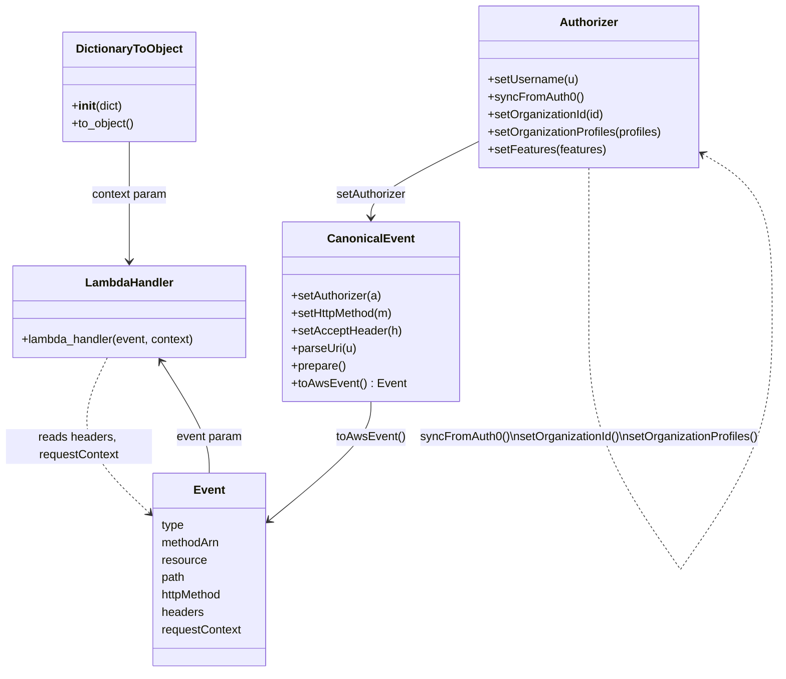
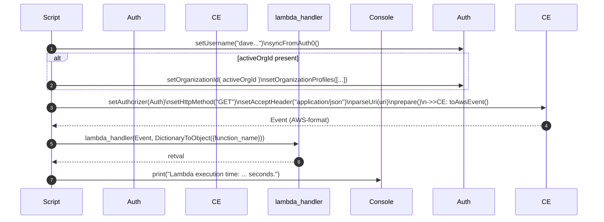

# Diagram: tools/ide_local_testing/localTest/test/byUrl/customAuthorizer.py

> Auto-generated by Obscura crawlers

## Diagram 1

### SVG

<svg id="container" width="1073.8734130859375" xmlns="http://www.w3.org/2000/svg" class="classDiagram" height="920" viewBox="12.817619323730469 0 1073.8734130859375 920" role="graphics-document document" aria-roledescription="class"><g><defs><marker id="container_class-aggregationStart" class="marker aggregation class" refX="18" refY="7" markerWidth="190" markerHeight="240" orient="auto"><path d="M 18,7 L9,13 L1,7 L9,1 Z"></path></marker></defs><defs><marker id="container_class-aggregationEnd" class="marker aggregation class" refX="1" refY="7" markerWidth="20" markerHeight="28" orient="auto"><path d="M 18,7 L9,13 L1,7 L9,1 Z"></path></marker></defs><defs><marker id="container_class-extensionStart" class="marker extension class" refX="18" refY="7" markerWidth="190" markerHeight="240" orient="auto"><path d="M 1,7 L18,13 V 1 Z"></path></marker></defs><defs><marker id="container_class-extensionEnd" class="marker extension class" refX="1" refY="7" markerWidth="20" markerHeight="28" orient="auto"><path d="M 1,1 V 13 L18,7 Z"></path></marker></defs><defs><marker id="container_class-compositionStart" class="marker composition class" refX="18" refY="7" markerWidth="190" markerHeight="240" orient="auto"><path d="M 18,7 L9,13 L1,7 L9,1 Z"></path></marker></defs><defs><marker id="container_class-compositionEnd" class="marker composition class" refX="1" refY="7" markerWidth="20" markerHeight="28" orient="auto"><path d="M 18,7 L9,13 L1,7 L9,1 Z"></path></marker></defs><defs><marker id="container_class-dependencyStart" class="marker dependency class" refX="6" refY="7" markerWidth="190" markerHeight="240" orient="auto"><path d="M 5,7 L9,13 L1,7 L9,1 Z"></path></marker></defs><defs><marker id="container_class-dependencyEnd" class="marker dependency class" refX="13" refY="7" markerWidth="20" markerHeight="28" orient="auto"><path d="M 18,7 L9,13 L14,7 L9,1 Z"></path></marker></defs><defs><marker id="container_class-lollipopStart" class="marker lollipop class" refX="13" refY="7" markerWidth="190" markerHeight="240" orient="auto"><circle stroke="black" fill="transparent" cx="7" cy="7" r="6"></circle></marker></defs><defs><marker id="container_class-lollipopEnd" class="marker lollipop class" refX="1" refY="7" markerWidth="190" markerHeight="240" orient="auto"><circle stroke="black" fill="transparent" cx="7" cy="7" r="6"></circle></marker></defs><g class="root"><g class="clusters"></g><g class="edgePaths"><path d="M670.219,192.973L644.923,205.311C619.626,217.649,569.034,242.324,543.738,259.829C518.441,277.333,518.441,287.667,518.441,292.833L518.441,298" id="id_Authorizer_CanonicalEvent_1" class="edge-thickness-normal edge-pattern-solid relation" style=";;;" data-edge="true" data-et="edge" data-id="id_Authorizer_CanonicalEvent_1" data-points="W3sieCI6NjcwLjIxODc1LCJ5IjoxOTIuOTczMzI3MTU0Mjk1N30seyJ4Ijo1MTguNDQxNDA2MjUsInkiOjI2N30seyJ4Ijo1MTguNDQxNDA2MjUsInkiOjMwNH1d" marker-end="url(#container_class-dependencyEnd)"></path><path d="M518.441,550L518.441,558.167C518.441,566.333,518.441,582.667,495.442,609.766C472.443,636.866,426.445,674.732,403.446,693.665L380.447,712.597" id="id_CanonicalEvent_Event_2" class="edge-thickness-normal edge-pattern-solid relation" style=";;;" data-edge="true" data-et="edge" data-id="id_CanonicalEvent_Event_2" data-points="W3sieCI6NTE4LjQ0MTQwNjI1LCJ5Ijo1NTB9LHsieCI6NTE4LjQ0MTQwNjI1LCJ5Ijo1OTl9LHsieCI6Mzc1LjgxNDQ1MzEyNSwieSI6NzE2LjQxMDgzNzIxOTYzMTR9XQ==" marker-end="url(#container_class-dependencyEnd)"></path><path d="M190.664,194L190.664,206.167C190.664,218.333,190.664,242.667,190.664,270C190.664,297.333,190.664,327.667,190.664,342.833L190.664,358" id="id_DictionaryToObject_LambdaHandler_3" class="edge-thickness-normal edge-pattern-solid relation" style=";;;" data-edge="true" data-et="edge" data-id="id_DictionaryToObject_LambdaHandler_3" data-points="W3sieCI6MTkwLjY2NDA2MjUsInkiOjE5NH0seyJ4IjoxOTAuNjY0MDYyNSwieSI6MjY3fSx7IngiOjE5MC42NjQwNjI1LCJ5IjozNjR9XQ==" marker-end="url(#container_class-dependencyEnd)"></path><path d="M298.568,648L298.568,639.833C298.568,631.667,298.568,615.333,287.703,589.847C276.837,564.361,255.107,529.722,244.241,512.402L233.376,495.083" id="id_Event_LambdaHandler_4" class="edge-thickness-normal edge-pattern-solid relation" style=";;;" data-edge="true" data-et="edge" data-id="id_Event_LambdaHandler_4" data-points="W3sieCI6Mjk4LjU2ODM1OTM3NSwieSI6NjQ4fSx7IngiOjI5OC41NjgzNTkzNzUsInkiOjU5OX0seyJ4IjoyMzAuMTg3MTQ3OTgzMjg0OSwieSI6NDkwfV0=" marker-end="url(#container_class-dependencyEnd)"></path><path d="M821.887,230L821.887,236.167C821.887,242.333,821.887,254.667,821.887,287.492C821.887,320.317,821.887,373.633,821.887,400.292L821.887,426.95" id="Authorizer-cyclic-special-1" class="edge-thickness-normal edge-pattern-dashed relation" style=";;;" data-edge="true" data-et="edge" data-id="Authorizer-cyclic-special-1" data-points="W3sieCI6ODIxLjg4NjcxODc1LCJ5IjoyMzB9LHsieCI6ODIxLjg4NjcxODc1LCJ5IjoyNjd9LHsieCI6ODIxLjg4NjcxODc1LCJ5Ijo0MjYuOTQ5OTk5OTk5MjU0OTR9XQ=="></path><path d="M821.887,427.05L821.887,455.708C821.887,484.367,821.887,541.683,843.281,600.5C864.676,659.317,907.465,719.633,928.859,749.792L950.254,779.95" id="Authorizer-cyclic-special-mid" class="edge-thickness-normal edge-pattern-dashed relation" style=";;;" data-edge="true" data-et="edge" data-id="Authorizer-cyclic-special-mid" data-points="W3sieCI6ODIxLjg4NjcxODc1LCJ5Ijo0MjcuMDUwMDAwMDAwNzQ1MDZ9LHsieCI6ODIxLjg4NjcxODc1LCJ5Ijo1OTl9LHsieCI6OTUwLjI1MzU5MjIzODc2NywieSI6Nzc5Ljk0OTk5OTk5OTI1NDl9XQ=="></path><path d="M950.325,779.95L971.719,749.792C993.113,719.633,1035.902,659.317,1057.297,600.492C1078.691,541.667,1078.691,484.333,1078.691,429C1078.691,373.667,1078.691,320.333,1062.035,284.067C1045.379,247.801,1012.066,228.603,995.41,219.004L978.753,209.404" id="Authorizer-cyclic-special-2" class="edge-thickness-normal edge-pattern-dashed relation" style=";;;" data-edge="true" data-et="edge" data-id="Authorizer-cyclic-special-2" data-points="W3sieCI6OTUwLjMyNDUzMjc2MTIzMywieSI6Nzc5Ljk0OTk5OTk5OTI1NDl9LHsieCI6MTA3OC42OTE0MDYyNSwieSI6NTk5fSx7IngiOjEwNzguNjkxNDA2MjUsInkiOjQyN30seyJ4IjoxMDc4LjY5MTQwNjI1LCJ5IjoyNjd9LHsieCI6OTczLjU1NDY4NzUsInkiOjIwNi40MDgyOTMwMjQyNDYzfV0=" marker-end="url(#container_class-dependencyEnd)"></path><path d="M160.386,490L151.655,508.167C142.924,526.333,125.462,562.667,134.893,598.083C144.324,633.5,180.648,668,198.81,685.25L216.972,702.5" id="id_LambdaHandler_Event_6" class="edge-thickness-normal edge-pattern-dashed relation" style=";;;" data-edge="true" data-et="edge" data-id="id_LambdaHandler_Event_6" data-points="W3sieCI6MTYwLjM4NTk0NjU4NDMwMjMzLCJ5Ijo0OTB9LHsieCI6MTA4LCJ5Ijo1OTl9LHsieCI6MjIxLjMyMjI2NTYyNSwieSI6NzA2LjYzMjQwMTAyMDc5NTF9XQ==" marker-end="url(#container_class-dependencyEnd)"></path></g><g class="edgeLabels"><g class="edgeLabel" transform="translate(518.44140625, 267)"><g class="label" data-id="id_Authorizer_CanonicalEvent_1" transform="translate(-48.7109375, -12)"><foreignObject width="97.421875" height="24">

setAuthorizer

</foreignObject></g></g><g class="edgeLabel" transform="translate(518.44140625, 599)"><g class="label" data-id="id_CanonicalEvent_Event_2" transform="translate(-46.640625, -12)"><foreignObject width="93.28125" height="24">

toAwsEvent()

</foreignObject></g></g><g class="edgeLabel" transform="translate(190.6640625, 267)"><g class="label" data-id="id_DictionaryToObject_LambdaHandler_3" transform="translate(-52.015625, -12)"><foreignObject width="104.03125" height="24">

context param

</foreignObject></g></g><g class="edgeLabel" transform="translate(298.568359375, 599)"><g class="label" data-id="id_Event_LambdaHandler_4" transform="translate(-45.328125, -12)"><foreignObject width="90.65625" height="24">

event param

</foreignObject></g></g><g class="edgeLabel"><g class="label" data-id="Authorizer-cyclic-special-1" transform="translate(0, 0)"><foreignObject width="0" height="0">

</foreignObject></g></g><g class="edgeLabel" transform="translate(821.88671875, 599)"><g class="label" data-id="Authorizer-cyclic-special-mid" transform="translate(-236.8046875, -12)"><foreignObject width="473.609375" height="24">

syncFromAuth0()\nsetOrganizationId()\nsetOrganizationProfiles()

</foreignObject></g></g><g class="edgeLabel"><g class="label" data-id="Authorizer-cyclic-special-2" transform="translate(0, 0)"><foreignObject width="0" height="0">

</foreignObject></g></g><g class="edgeLabel" transform="translate(120.81762, 611.17405)"><g class="label" data-id="id_LambdaHandler_Event_6" transform="translate(-100, -24)"><foreignObject width="200" height="48">

reads headers, requestContext

</foreignObject></g></g></g><g class="nodes"><g class="node default" id="classId-DictionaryToObject-0" transform="translate(190.6640625, 119)"><g class="basic label-container"><path d="M-90.2109375 -75 L90.2109375 -75 L90.2109375 75 L-90.2109375 75" stroke="none" stroke-width="0" fill="#ECECFF" style=""></path><path d="M-90.2109375 -75 C-44.341196082224386 -75, 1.5285453355512288 -75, 90.2109375 -75 M-90.2109375 -75 C-47.81526608984899 -75, -5.41959467969798 -75, 90.2109375 -75 M90.2109375 -75 C90.2109375 -38.56786667312733, 90.2109375 -2.1357333462546535, 90.2109375 75 M90.2109375 -75 C90.2109375 -23.90054522459367, 90.2109375 27.198909550812658, 90.2109375 75 M90.2109375 75 C31.889906110222988 75, -26.431125279554024 75, -90.2109375 75 M90.2109375 75 C47.3537227878444 75, 4.496508075688794 75, -90.2109375 75 M-90.2109375 75 C-90.2109375 38.8181076741407, -90.2109375 2.6362153482813966, -90.2109375 -75 M-90.2109375 75 C-90.2109375 17.11935100788026, -90.2109375 -40.76129798423948, -90.2109375 -75" stroke="#9370DB" stroke-width="1.3" fill="none" stroke-dasharray="0 0" style=""></path></g><g class="annotation-group text" transform="translate(0, -51)"></g><g class="label-group text" transform="translate(-70.109375, -51)"><g class="label" style="font-weight: bolder" transform="translate(0,-12)"><foreignObject width="140.21875" height="24">

DictionaryToObject

</foreignObject></g></g><g class="members-group text" transform="translate(-78.2109375, -3)"></g><g class="methods-group text" transform="translate(-78.2109375, 27)"><g class="label" style="" transform="translate(0,-12)"><foreignObject width="70.296875" height="24">

+<strong>init</strong>(dict)

</foreignObject></g><g class="label" style="" transform="translate(0,12)"><foreignObject width="86.3125" height="24">

+to_object()

</foreignObject></g></g><g class="divider" style=""><path d="M-90.2109375 -27 C-25.511856147052626 -27, 39.18722520589475 -27, 90.2109375 -27 M-90.2109375 -27 C-33.104642193371994 -27, 24.001653113256012 -27, 90.2109375 -27" stroke="#9370DB" stroke-width="1.3" fill="none" stroke-dasharray="0 0" style=""></path></g><g class="divider" style=""><path d="M-90.2109375 -3 C-18.447404287658486 -3, 53.31612892468303 -3, 90.2109375 -3 M-90.2109375 -3 C-30.07884017057704 -3, 30.053257158845923 -3, 90.2109375 -3" stroke="#9370DB" stroke-width="1.3" fill="none" stroke-dasharray="0 0" style=""></path></g></g><g class="node default" id="classId-CanonicalEvent-1" transform="translate(518.44140625, 427)"><g class="basic label-container"><path d="M-116.57421875 -123 L116.57421875 -123 L116.57421875 123 L-116.57421875 123" stroke="none" stroke-width="0" fill="#ECECFF" style=""></path><path d="M-116.57421875 -123 C-25.955704577877825 -123, 64.66280959424435 -123, 116.57421875 -123 M-116.57421875 -123 C-43.390090139350136 -123, 29.79403847129973 -123, 116.57421875 -123 M116.57421875 -123 C116.57421875 -54.44968692383047, 116.57421875 14.10062615233906, 116.57421875 123 M116.57421875 -123 C116.57421875 -34.24417381266713, 116.57421875 54.51165237466574, 116.57421875 123 M116.57421875 123 C69.50238434750815 123, 22.430549945016324 123, -116.57421875 123 M116.57421875 123 C31.246287196887792 123, -54.081644356224416 123, -116.57421875 123 M-116.57421875 123 C-116.57421875 44.342931141477706, -116.57421875 -34.31413771704459, -116.57421875 -123 M-116.57421875 123 C-116.57421875 60.10837711719068, -116.57421875 -2.783245765618645, -116.57421875 -123" stroke="#9370DB" stroke-width="1.3" fill="none" stroke-dasharray="0 0" style=""></path></g><g class="annotation-group text" transform="translate(0, -99)"></g><g class="label-group text" transform="translate(-55.7109375, -99)"><g class="label" style="font-weight: bolder" transform="translate(0,-12)"><foreignObject width="111.421875" height="24">

CanonicalEvent

</foreignObject></g></g><g class="members-group text" transform="translate(-104.57421875, -51)"></g><g class="methods-group text" transform="translate(-104.57421875, -21)"><g class="label" style="" transform="translate(0,-12)"><foreignObject width="124.46875" height="24">

+setAuthorizer(a)

</foreignObject></g><g class="label" style="" transform="translate(0,12)"><foreignObject width="141.203125" height="24">

+setHttpMethod(m)

</foreignObject></g><g class="label" style="" transform="translate(0,36)"><foreignObject width="150.140625" height="24">

+setAcceptHeader(h)

</foreignObject></g><g class="label" style="" transform="translate(0,60)"><foreignObject width="89.125" height="24">

+parseUri(u)

</foreignObject></g><g class="label" style="" transform="translate(0,84)"><foreignObject width="74.75" height="24">

+prepare()

</foreignObject></g><g class="label" style="" transform="translate(0,108)"><foreignObject width="153.4375" height="24">

+toAwsEvent() : Event

</foreignObject></g></g><g class="divider" style=""><path d="M-116.57421875 -75 C-62.04818852084767 -75, -7.522158291695334 -75, 116.57421875 -75 M-116.57421875 -75 C-39.58587647206923 -75, 37.40246580586154 -75, 116.57421875 -75" stroke="#9370DB" stroke-width="1.3" fill="none" stroke-dasharray="0 0" style=""></path></g><g class="divider" style=""><path d="M-116.57421875 -51 C-40.226988969655494 -51, 36.12024081068901 -51, 116.57421875 -51 M-116.57421875 -51 C-36.39186707802233 -51, 43.79048459395534 -51, 116.57421875 -51" stroke="#9370DB" stroke-width="1.3" fill="none" stroke-dasharray="0 0" style=""></path></g></g><g class="node default" id="classId-Authorizer-2" transform="translate(821.88671875, 119)"><g class="basic label-container"><path d="M-151.66796875 -111 L151.66796875 -111 L151.66796875 111 L-151.66796875 111" stroke="none" stroke-width="0" fill="#ECECFF" style=""></path><path d="M-151.66796875 -111 C-42.80245994192428 -111, 66.06304886615143 -111, 151.66796875 -111 M-151.66796875 -111 C-61.871028087170515 -111, 27.92591257565897 -111, 151.66796875 -111 M151.66796875 -111 C151.66796875 -38.79957337564399, 151.66796875 33.400853248712025, 151.66796875 111 M151.66796875 -111 C151.66796875 -42.97603106986388, 151.66796875 25.047937860272242, 151.66796875 111 M151.66796875 111 C74.99952702805986 111, -1.6689146938802821 111, -151.66796875 111 M151.66796875 111 C63.54733919860128 111, -24.573290352797443 111, -151.66796875 111 M-151.66796875 111 C-151.66796875 65.61742247437672, -151.66796875 20.234844948753434, -151.66796875 -111 M-151.66796875 111 C-151.66796875 62.69638767622101, -151.66796875 14.392775352442015, -151.66796875 -111" stroke="#9370DB" stroke-width="1.3" fill="none" stroke-dasharray="0 0" style=""></path></g><g class="annotation-group text" transform="translate(0, -87)"></g><g class="label-group text" transform="translate(-38.3671875, -87)"><g class="label" style="font-weight: bolder" transform="translate(0,-12)"><foreignObject width="76.734375" height="24">

Authorizer

</foreignObject></g></g><g class="members-group text" transform="translate(-139.66796875, -39)"></g><g class="methods-group text" transform="translate(-139.66796875, -9)"><g class="label" style="" transform="translate(0,-12)"><foreignObject width="123.03125" height="24">

+setUsername(u)

</foreignObject></g><g class="label" style="" transform="translate(0,12)"><foreignObject width="129.0625" height="24">

+syncFromAuth0()

</foreignObject></g><g class="label" style="" transform="translate(0,36)"><foreignObject width="160.78125" height="24">

+setOrganizationId(id)

</foreignObject></g><g class="label" style="" transform="translate(0,60)"><foreignObject width="240.96875" height="24">

+setOrganizationProfiles(profiles)

</foreignObject></g><g class="label" style="" transform="translate(0,84)"><foreignObject width="161.296875" height="24">

+setFeatures(features)

</foreignObject></g></g><g class="divider" style=""><path d="M-151.66796875 -63 C-56.452663136959345 -63, 38.76264247608131 -63, 151.66796875 -63 M-151.66796875 -63 C-52.80437545776384 -63, 46.05921783447232 -63, 151.66796875 -63" stroke="#9370DB" stroke-width="1.3" fill="none" stroke-dasharray="0 0" style=""></path></g><g class="divider" style=""><path d="M-151.66796875 -39 C-45.97229401771291 -39, 59.723380714574176 -39, 151.66796875 -39 M-151.66796875 -39 C-54.52862412690304 -39, 42.61072049619392 -39, 151.66796875 -39" stroke="#9370DB" stroke-width="1.3" fill="none" stroke-dasharray="0 0" style=""></path></g></g><g class="node default" id="classId-LambdaHandler-3" transform="translate(190.6640625, 427)"><g class="basic label-container"><path d="M-161.203125 -63 L161.203125 -63 L161.203125 63 L-161.203125 63" stroke="none" stroke-width="0" fill="#ECECFF" style=""></path><path d="M-161.203125 -63 C-36.350181054199055 -63, 88.50276289160189 -63, 161.203125 -63 M-161.203125 -63 C-52.25271942452922 -63, 56.697686150941564 -63, 161.203125 -63 M161.203125 -63 C161.203125 -31.213410865660116, 161.203125 0.5731782686797686, 161.203125 63 M161.203125 -63 C161.203125 -17.74437087915745, 161.203125 27.5112582416851, 161.203125 63 M161.203125 63 C50.760543862665145 63, -59.68203727466971 63, -161.203125 63 M161.203125 63 C47.60800367064648 63, -65.98711765870704 63, -161.203125 63 M-161.203125 63 C-161.203125 24.523057346111365, -161.203125 -13.95388530777727, -161.203125 -63 M-161.203125 63 C-161.203125 28.33180040177747, -161.203125 -6.336399196445058, -161.203125 -63" stroke="#9370DB" stroke-width="1.3" fill="none" stroke-dasharray="0 0" style=""></path></g><g class="annotation-group text" transform="translate(0, -39)"></g><g class="label-group text" transform="translate(-58.21875, -39)"><g class="label" style="font-weight: bolder" transform="translate(0,-12)"><foreignObject width="116.4375" height="24">

LambdaHandler

</foreignObject></g></g><g class="members-group text" transform="translate(-149.203125, 9)"></g><g class="methods-group text" transform="translate(-149.203125, 39)"><g class="label" style="" transform="translate(0,-12)"><foreignObject width="240.1875" height="24">

+lambda_handler(event, context)

</foreignObject></g></g><g class="divider" style=""><path d="M-161.203125 -15 C-56.71940045996183 -15, 47.764324080076335 -15, 161.203125 -15 M-161.203125 -15 C-36.40812107228997 -15, 88.38688285542005 -15, 161.203125 -15" stroke="#9370DB" stroke-width="1.3" fill="none" stroke-dasharray="0 0" style=""></path></g><g class="divider" style=""><path d="M-161.203125 9 C-90.6520264864855 9, -20.100927972970993 9, 161.203125 9 M-161.203125 9 C-77.34177998761012 9, 6.519565024779752 9, 161.203125 9" stroke="#9370DB" stroke-width="1.3" fill="none" stroke-dasharray="0 0" style=""></path></g></g><g class="node default" id="classId-Event-4" transform="translate(298.568359375, 780)"><g class="basic label-container"><path d="M-77.24609375 -132 L77.24609375 -132 L77.24609375 132 L-77.24609375 132" stroke="none" stroke-width="0" fill="#ECECFF" style=""></path><path d="M-77.24609375 -132 C-41.21909522382787 -132, -5.192096697655742 -132, 77.24609375 -132 M-77.24609375 -132 C-42.77190611679948 -132, -8.297718483598956 -132, 77.24609375 -132 M77.24609375 -132 C77.24609375 -54.20631176348202, 77.24609375 23.58737647303596, 77.24609375 132 M77.24609375 -132 C77.24609375 -62.69979723490874, 77.24609375 6.600405530182513, 77.24609375 132 M77.24609375 132 C40.35229352550108 132, 3.4584933010021643 132, -77.24609375 132 M77.24609375 132 C36.94451998251376 132, -3.3570537849724786 132, -77.24609375 132 M-77.24609375 132 C-77.24609375 57.248662184637936, -77.24609375 -17.502675630724127, -77.24609375 -132 M-77.24609375 132 C-77.24609375 34.51945994061211, -77.24609375 -62.96108011877578, -77.24609375 -132" stroke="#9370DB" stroke-width="1.3" fill="none" stroke-dasharray="0 0" style=""></path></g><g class="annotation-group text" transform="translate(0, -108)"></g><g class="label-group text" transform="translate(-20.2109375, -108)"><g class="label" style="font-weight: bolder" transform="translate(0,-12)"><foreignObject width="40.421875" height="24">

Event

</foreignObject></g></g><g class="members-group text" transform="translate(-65.24609375, -60)"><g class="label" style="" transform="translate(0,-12)"><foreignObject width="31.796875" height="24">

type

</foreignObject></g><g class="label" style="" transform="translate(0,12)"><foreignObject width="81.21875" height="24">

methodArn

</foreignObject></g><g class="label" style="" transform="translate(0,36)"><foreignObject width="62.296875" height="24">

resource

</foreignObject></g><g class="label" style="" transform="translate(0,60)"><foreignObject width="33.203125" height="24">

path

</foreignObject></g><g class="label" style="" transform="translate(0,84)"><foreignObject width="85.671875" height="24">

httpMethod

</foreignObject></g><g class="label" style="" transform="translate(0,108)"><foreignObject width="58.34375" height="24">

headers

</foreignObject></g><g class="label" style="" transform="translate(0,132)"><foreignObject width="110.28125" height="24">

requestContext

</foreignObject></g></g><g class="methods-group text" transform="translate(-65.24609375, 132)"></g><g class="divider" style=""><path d="M-77.24609375 -84 C-25.5460024790304 -84, 26.154088791939202 -84, 77.24609375 -84 M-77.24609375 -84 C-18.22886314930234 -84, 40.78836745139532 -84, 77.24609375 -84" stroke="#9370DB" stroke-width="1.3" fill="none" stroke-dasharray="0 0" style=""></path></g><g class="divider" style=""><path d="M-77.24609375 108 C-23.755568149104015 108, 29.73495745179197 108, 77.24609375 108 M-77.24609375 108 C-27.7970589903207 108, 21.6519757693586 108, 77.24609375 108" stroke="#9370DB" stroke-width="1.3" fill="none" stroke-dasharray="0 0" style=""></path></g></g><g class="label edgeLabel" id="Authorizer---Authorizer---1" transform="translate(821.88671875, 427)"><rect width="0.1" height="0.1"></rect><g class="label" style="" transform="translate(0, 0)"><rect></rect><foreignObject width="0" height="0">

</foreignObject></g></g><g class="label edgeLabel" id="Authorizer---Authorizer---2" transform="translate(950.2890625, 780)"><rect width="0.1" height="0.1"></rect><g class="label" style="" transform="translate(0, 0)"><rect></rect><foreignObject width="0" height="0">

</foreignObject></g></g></g></g></g></svg>

## Diagram 2

### SVG

<svg id="container" width="1450" xmlns="http://www.w3.org/2000/svg" height="562" viewBox="-50 -10 1450 562" role="graphics-document document" aria-roledescription="sequence"><g><rect x="1200" y="476" fill="#eaeaea" stroke="#666" width="150" height="65" name="CE" rx="3" ry="3" class="actor actor-bottom"></rect><text x="1275" y="508.5" dominant-baseline="central" alignment-baseline="central" class="actor actor-box" style="text-anchor: middle; font-size: 16px; font-weight: 400;"><tspan x="1275" dy="0">CE</tspan></text></g><g><rect x="1000" y="476" fill="#eaeaea" stroke="#666" width="150" height="65" name="Auth" rx="3" ry="3" class="actor actor-bottom"></rect><text x="1075" y="508.5" dominant-baseline="central" alignment-baseline="central" class="actor actor-box" style="text-anchor: middle; font-size: 16px; font-weight: 400;"><tspan x="1075" dy="0">Auth</tspan></text></g><g><rect x="800" y="476" fill="#eaeaea" stroke="#666" width="150" height="65" name="Console" rx="3" ry="3" class="actor actor-bottom"></rect><text x="875" y="508.5" dominant-baseline="central" alignment-baseline="central" class="actor actor-box" style="text-anchor: middle; font-size: 16px; font-weight: 400;"><tspan x="875" dy="0">Console</tspan></text></g><g><rect x="600" y="476" fill="#eaeaea" stroke="#666" width="150" height="65" name="Lambda" rx="3" ry="3" class="actor actor-bottom"></rect><text x="675" y="508.5" dominant-baseline="central" alignment-baseline="central" class="actor actor-box" style="text-anchor: middle; font-size: 16px; font-weight: 400;"><tspan x="675" dy="0">lambda_handler</tspan></text></g><g><rect x="400" y="476" fill="#eaeaea" stroke="#666" width="150" height="65" name="CanonicalEvent" rx="3" ry="3" class="actor actor-bottom"></rect><text x="475" y="508.5" dominant-baseline="central" alignment-baseline="central" class="actor actor-box" style="text-anchor: middle; font-size: 16px; font-weight: 400;"><tspan x="475" dy="0">CE</tspan></text></g><g><rect x="200" y="476" fill="#eaeaea" stroke="#666" width="150" height="65" name="Authorizer" rx="3" ry="3" class="actor actor-bottom"></rect><text x="275" y="508.5" dominant-baseline="central" alignment-baseline="central" class="actor actor-box" style="text-anchor: middle; font-size: 16px; font-weight: 400;"><tspan x="275" dy="0">Auth</tspan></text></g><g><rect x="0" y="476" fill="#eaeaea" stroke="#666" width="150" height="65" name="Script" rx="3" ry="3" class="actor actor-bottom"></rect><text x="75" y="508.5" dominant-baseline="central" alignment-baseline="central" class="actor actor-box" style="text-anchor: middle; font-size: 16px; font-weight: 400;"><tspan x="75" dy="0">Script</tspan></text></g><g><line id="actor6" x1="1275" y1="65" x2="1275" y2="476" class="actor-line 200" stroke-width="0.5px" stroke="#999" name="CE"></line><g id="root-6"><rect x="1200" y="0" fill="#eaeaea" stroke="#666" width="150" height="65" name="CE" rx="3" ry="3" class="actor actor-top"></rect><text x="1275" y="32.5" dominant-baseline="central" alignment-baseline="central" class="actor actor-box" style="text-anchor: middle; font-size: 16px; font-weight: 400;"><tspan x="1275" dy="0">CE</tspan></text></g></g><g><line id="actor5" x1="1075" y1="65" x2="1075" y2="476" class="actor-line 200" stroke-width="0.5px" stroke="#999" name="Auth"></line><g id="root-5"><rect x="1000" y="0" fill="#eaeaea" stroke="#666" width="150" height="65" name="Auth" rx="3" ry="3" class="actor actor-top"></rect><text x="1075" y="32.5" dominant-baseline="central" alignment-baseline="central" class="actor actor-box" style="text-anchor: middle; font-size: 16px; font-weight: 400;"><tspan x="1075" dy="0">Auth</tspan></text></g></g><g><line id="actor4" x1="875" y1="65" x2="875" y2="476" class="actor-line 200" stroke-width="0.5px" stroke="#999" name="Console"></line><g id="root-4"><rect x="800" y="0" fill="#eaeaea" stroke="#666" width="150" height="65" name="Console" rx="3" ry="3" class="actor actor-top"></rect><text x="875" y="32.5" dominant-baseline="central" alignment-baseline="central" class="actor actor-box" style="text-anchor: middle; font-size: 16px; font-weight: 400;"><tspan x="875" dy="0">Console</tspan></text></g></g><g><line id="actor3" x1="675" y1="65" x2="675" y2="476" class="actor-line 200" stroke-width="0.5px" stroke="#999" name="Lambda"></line><g id="root-3"><rect x="600" y="0" fill="#eaeaea" stroke="#666" width="150" height="65" name="Lambda" rx="3" ry="3" class="actor actor-top"></rect><text x="675" y="32.5" dominant-baseline="central" alignment-baseline="central" class="actor actor-box" style="text-anchor: middle; font-size: 16px; font-weight: 400;"><tspan x="675" dy="0">lambda_handler</tspan></text></g></g><g><line id="actor2" x1="475" y1="65" x2="475" y2="476" class="actor-line 200" stroke-width="0.5px" stroke="#999" name="CanonicalEvent"></line><g id="root-2"><rect x="400" y="0" fill="#eaeaea" stroke="#666" width="150" height="65" name="CanonicalEvent" rx="3" ry="3" class="actor actor-top"></rect><text x="475" y="32.5" dominant-baseline="central" alignment-baseline="central" class="actor actor-box" style="text-anchor: middle; font-size: 16px; font-weight: 400;"><tspan x="475" dy="0">CE</tspan></text></g></g><g><line id="actor1" x1="275" y1="65" x2="275" y2="476" class="actor-line 200" stroke-width="0.5px" stroke="#999" name="Authorizer"></line><g id="root-1"><rect x="200" y="0" fill="#eaeaea" stroke="#666" width="150" height="65" name="Authorizer" rx="3" ry="3" class="actor actor-top"></rect><text x="275" y="32.5" dominant-baseline="central" alignment-baseline="central" class="actor actor-box" style="text-anchor: middle; font-size: 16px; font-weight: 400;"><tspan x="275" dy="0">Auth</tspan></text></g></g><g><line id="actor0" x1="75" y1="65" x2="75" y2="476" class="actor-line 200" stroke-width="0.5px" stroke="#999" name="Script"></line><g id="root-0"><rect x="0" y="0" fill="#eaeaea" stroke="#666" width="150" height="65" name="Script" rx="3" ry="3" class="actor actor-top"></rect><text x="75" y="32.5" dominant-baseline="central" alignment-baseline="central" class="actor actor-box" style="text-anchor: middle; font-size: 16px; font-weight: 400;"><tspan x="75" dy="0">Script</tspan></text></g></g><g></g><defs><symbol id="computer" width="24" height="24"><path transform="scale(.5)" d="M2 2v13h20v-13h-20zm18 11h-16v-9h16v9zm-10.228 6l.466-1h3.524l.467 1h-4.457zm14.228 3h-24l2-6h2.104l-1.33 4h18.45l-1.297-4h2.073l2 6zm-5-10h-14v-7h14v7z"></path></symbol></defs><defs><symbol id="database" fill-rule="evenodd" clip-rule="evenodd"><path transform="scale(.5)" d="M12.258.001l.256.004.255.005.253.008.251.01.249.012.247.015.246.016.242.019.241.02.239.023.236.024.233.027.231.028.229.031.225.032.223.034.22.036.217.038.214.04.211.041.208.043.205.045.201.046.198.048.194.05.191.051.187.053.183.054.18.056.175.057.172.059.168.06.163.061.16.063.155.064.15.066.074.033.073.033.071.034.07.034.069.035.068.035.067.035.066.035.064.036.064.036.062.036.06.036.06.037.058.037.058.037.055.038.055.038.053.038.052.038.051.039.05.039.048.039.047.039.045.04.044.04.043.04.041.04.04.041.039.041.037.041.036.041.034.041.033.042.032.042.03.042.029.042.027.042.026.043.024.043.023.043.021.043.02.043.018.044.017.043.015.044.013.044.012.044.011.045.009.044.007.045.006.045.004.045.002.045.001.045v17l-.001.045-.002.045-.004.045-.006.045-.007.045-.009.044-.011.045-.012.044-.013.044-.015.044-.017.043-.018.044-.02.043-.021.043-.023.043-.024.043-.026.043-.027.042-.029.042-.03.042-.032.042-.033.042-.034.041-.036.041-.037.041-.039.041-.04.041-.041.04-.043.04-.044.04-.045.04-.047.039-.048.039-.05.039-.051.039-.052.038-.053.038-.055.038-.055.038-.058.037-.058.037-.06.037-.06.036-.062.036-.064.036-.064.036-.066.035-.067.035-.068.035-.069.035-.07.034-.071.034-.073.033-.074.033-.15.066-.155.064-.16.063-.163.061-.168.06-.172.059-.175.057-.18.056-.183.054-.187.053-.191.051-.194.05-.198.048-.201.046-.205.045-.208.043-.211.041-.214.04-.217.038-.22.036-.223.034-.225.032-.229.031-.231.028-.233.027-.236.024-.239.023-.241.02-.242.019-.246.016-.247.015-.249.012-.251.01-.253.008-.255.005-.256.004-.258.001-.258-.001-.256-.004-.255-.005-.253-.008-.251-.01-.249-.012-.247-.015-.245-.016-.243-.019-.241-.02-.238-.023-.236-.024-.234-.027-.231-.028-.228-.031-.226-.032-.223-.034-.22-.036-.217-.038-.214-.04-.211-.041-.208-.043-.204-.045-.201-.046-.198-.048-.195-.05-.19-.051-.187-.053-.184-.054-.179-.056-.176-.057-.172-.059-.167-.06-.164-.061-.159-.063-.155-.064-.151-.066-.074-.033-.072-.033-.072-.034-.07-.034-.069-.035-.068-.035-.067-.035-.066-.035-.064-.036-.063-.036-.062-.036-.061-.036-.06-.037-.058-.037-.057-.037-.056-.038-.055-.038-.053-.038-.052-.038-.051-.039-.049-.039-.049-.039-.046-.039-.046-.04-.044-.04-.043-.04-.041-.04-.04-.041-.039-.041-.037-.041-.036-.041-.034-.041-.033-.042-.032-.042-.03-.042-.029-.042-.027-.042-.026-.043-.024-.043-.023-.043-.021-.043-.02-.043-.018-.044-.017-.043-.015-.044-.013-.044-.012-.044-.011-.045-.009-.044-.007-.045-.006-.045-.004-.045-.002-.045-.001-.045v-17l.001-.045.002-.045.004-.045.006-.045.007-.045.009-.044.011-.045.012-.044.013-.044.015-.044.017-.043.018-.044.02-.043.021-.043.023-.043.024-.043.026-.043.027-.042.029-.042.03-.042.032-.042.033-.042.034-.041.036-.041.037-.041.039-.041.04-.041.041-.04.043-.04.044-.04.046-.04.046-.039.049-.039.049-.039.051-.039.052-.038.053-.038.055-.038.056-.038.057-.037.058-.037.06-.037.061-.036.062-.036.063-.036.064-.036.066-.035.067-.035.068-.035.069-.035.07-.034.072-.034.072-.033.074-.033.151-.066.155-.064.159-.063.164-.061.167-.06.172-.059.176-.057.179-.056.184-.054.187-.053.19-.051.195-.05.198-.048.201-.046.204-.045.208-.043.211-.041.214-.04.217-.038.22-.036.223-.034.226-.032.228-.031.231-.028.234-.027.236-.024.238-.023.241-.02.243-.019.245-.016.247-.015.249-.012.251-.01.253-.008.255-.005.256-.004.258-.001.258.001zm-9.258 20.499v.01l.001.021.003.021.004.022.005.021.006.022.007.022.009.023.01.022.011.023.012.023.013.023.015.023.016.024.017.023.018.024.019.024.021.024.022.025.023.024.024.025.052.049.056.05.061.051.066.051.07.051.075.051.079.052.084.052.088.052.092.052.097.052.102.051.105.052.11.052.114.051.119.051.123.051.127.05.131.05.135.05.139.048.144.049.147.047.152.047.155.047.16.045.163.045.167.043.171.043.176.041.178.041.183.039.187.039.19.037.194.035.197.035.202.033.204.031.209.03.212.029.216.027.219.025.222.024.226.021.23.02.233.018.236.016.24.015.243.012.246.01.249.008.253.005.256.004.259.001.26-.001.257-.004.254-.005.25-.008.247-.011.244-.012.241-.014.237-.016.233-.018.231-.021.226-.021.224-.024.22-.026.216-.027.212-.028.21-.031.205-.031.202-.034.198-.034.194-.036.191-.037.187-.039.183-.04.179-.04.175-.042.172-.043.168-.044.163-.045.16-.046.155-.046.152-.047.148-.048.143-.049.139-.049.136-.05.131-.05.126-.05.123-.051.118-.052.114-.051.11-.052.106-.052.101-.052.096-.052.092-.052.088-.053.083-.051.079-.052.074-.052.07-.051.065-.051.06-.051.056-.05.051-.05.023-.024.023-.025.021-.024.02-.024.019-.024.018-.024.017-.024.015-.023.014-.024.013-.023.012-.023.01-.023.01-.022.008-.022.006-.022.006-.022.004-.022.004-.021.001-.021.001-.021v-4.127l-.077.055-.08.053-.083.054-.085.053-.087.052-.09.052-.093.051-.095.05-.097.05-.1.049-.102.049-.105.048-.106.047-.109.047-.111.046-.114.045-.115.045-.118.044-.12.043-.122.042-.124.042-.126.041-.128.04-.13.04-.132.038-.134.038-.135.037-.138.037-.139.035-.142.035-.143.034-.144.033-.147.032-.148.031-.15.03-.151.03-.153.029-.154.027-.156.027-.158.026-.159.025-.161.024-.162.023-.163.022-.165.021-.166.02-.167.019-.169.018-.169.017-.171.016-.173.015-.173.014-.175.013-.175.012-.177.011-.178.01-.179.008-.179.008-.181.006-.182.005-.182.004-.184.003-.184.002h-.37l-.184-.002-.184-.003-.182-.004-.182-.005-.181-.006-.179-.008-.179-.008-.178-.01-.176-.011-.176-.012-.175-.013-.173-.014-.172-.015-.171-.016-.17-.017-.169-.018-.167-.019-.166-.02-.165-.021-.163-.022-.162-.023-.161-.024-.159-.025-.157-.026-.156-.027-.155-.027-.153-.029-.151-.03-.15-.03-.148-.031-.146-.032-.145-.033-.143-.034-.141-.035-.14-.035-.137-.037-.136-.037-.134-.038-.132-.038-.13-.04-.128-.04-.126-.041-.124-.042-.122-.042-.12-.044-.117-.043-.116-.045-.113-.045-.112-.046-.109-.047-.106-.047-.105-.048-.102-.049-.1-.049-.097-.05-.095-.05-.093-.052-.09-.051-.087-.052-.085-.053-.083-.054-.08-.054-.077-.054v4.127zm0-5.654v.011l.001.021.003.021.004.021.005.022.006.022.007.022.009.022.01.022.011.023.012.023.013.023.015.024.016.023.017.024.018.024.019.024.021.024.022.024.023.025.024.024.052.05.056.05.061.05.066.051.07.051.075.052.079.051.084.052.088.052.092.052.097.052.102.052.105.052.11.051.114.051.119.052.123.05.127.051.131.05.135.049.139.049.144.048.147.048.152.047.155.046.16.045.163.045.167.044.171.042.176.042.178.04.183.04.187.038.19.037.194.036.197.034.202.033.204.032.209.03.212.028.216.027.219.025.222.024.226.022.23.02.233.018.236.016.24.014.243.012.246.01.249.008.253.006.256.003.259.001.26-.001.257-.003.254-.006.25-.008.247-.01.244-.012.241-.015.237-.016.233-.018.231-.02.226-.022.224-.024.22-.025.216-.027.212-.029.21-.03.205-.032.202-.033.198-.035.194-.036.191-.037.187-.039.183-.039.179-.041.175-.042.172-.043.168-.044.163-.045.16-.045.155-.047.152-.047.148-.048.143-.048.139-.05.136-.049.131-.05.126-.051.123-.051.118-.051.114-.052.11-.052.106-.052.101-.052.096-.052.092-.052.088-.052.083-.052.079-.052.074-.051.07-.052.065-.051.06-.05.056-.051.051-.049.023-.025.023-.024.021-.025.02-.024.019-.024.018-.024.017-.024.015-.023.014-.023.013-.024.012-.022.01-.023.01-.023.008-.022.006-.022.006-.022.004-.021.004-.022.001-.021.001-.021v-4.139l-.077.054-.08.054-.083.054-.085.052-.087.053-.09.051-.093.051-.095.051-.097.05-.1.049-.102.049-.105.048-.106.047-.109.047-.111.046-.114.045-.115.044-.118.044-.12.044-.122.042-.124.042-.126.041-.128.04-.13.039-.132.039-.134.038-.135.037-.138.036-.139.036-.142.035-.143.033-.144.033-.147.033-.148.031-.15.03-.151.03-.153.028-.154.028-.156.027-.158.026-.159.025-.161.024-.162.023-.163.022-.165.021-.166.02-.167.019-.169.018-.169.017-.171.016-.173.015-.173.014-.175.013-.175.012-.177.011-.178.009-.179.009-.179.007-.181.007-.182.005-.182.004-.184.003-.184.002h-.37l-.184-.002-.184-.003-.182-.004-.182-.005-.181-.007-.179-.007-.179-.009-.178-.009-.176-.011-.176-.012-.175-.013-.173-.014-.172-.015-.171-.016-.17-.017-.169-.018-.167-.019-.166-.02-.165-.021-.163-.022-.162-.023-.161-.024-.159-.025-.157-.026-.156-.027-.155-.028-.153-.028-.151-.03-.15-.03-.148-.031-.146-.033-.145-.033-.143-.033-.141-.035-.14-.036-.137-.036-.136-.037-.134-.038-.132-.039-.13-.039-.128-.04-.126-.041-.124-.042-.122-.043-.12-.043-.117-.044-.116-.044-.113-.046-.112-.046-.109-.046-.106-.047-.105-.048-.102-.049-.1-.049-.097-.05-.095-.051-.093-.051-.09-.051-.087-.053-.085-.052-.083-.054-.08-.054-.077-.054v4.139zm0-5.666v.011l.001.02.003.022.004.021.005.022.006.021.007.022.009.023.01.022.011.023.012.023.013.023.015.023.016.024.017.024.018.023.019.024.021.025.022.024.023.024.024.025.052.05.056.05.061.05.066.051.07.051.075.052.079.051.084.052.088.052.092.052.097.052.102.052.105.051.11.052.114.051.119.051.123.051.127.05.131.05.135.05.139.049.144.048.147.048.152.047.155.046.16.045.163.045.167.043.171.043.176.042.178.04.183.04.187.038.19.037.194.036.197.034.202.033.204.032.209.03.212.028.216.027.219.025.222.024.226.021.23.02.233.018.236.017.24.014.243.012.246.01.249.008.253.006.256.003.259.001.26-.001.257-.003.254-.006.25-.008.247-.01.244-.013.241-.014.237-.016.233-.018.231-.02.226-.022.224-.024.22-.025.216-.027.212-.029.21-.03.205-.032.202-.033.198-.035.194-.036.191-.037.187-.039.183-.039.179-.041.175-.042.172-.043.168-.044.163-.045.16-.045.155-.047.152-.047.148-.048.143-.049.139-.049.136-.049.131-.051.126-.05.123-.051.118-.052.114-.051.11-.052.106-.052.101-.052.096-.052.092-.052.088-.052.083-.052.079-.052.074-.052.07-.051.065-.051.06-.051.056-.05.051-.049.023-.025.023-.025.021-.024.02-.024.019-.024.018-.024.017-.024.015-.023.014-.024.013-.023.012-.023.01-.022.01-.023.008-.022.006-.022.006-.022.004-.022.004-.021.001-.021.001-.021v-4.153l-.077.054-.08.054-.083.053-.085.053-.087.053-.09.051-.093.051-.095.051-.097.05-.1.049-.102.048-.105.048-.106.048-.109.046-.111.046-.114.046-.115.044-.118.044-.12.043-.122.043-.124.042-.126.041-.128.04-.13.039-.132.039-.134.038-.135.037-.138.036-.139.036-.142.034-.143.034-.144.033-.147.032-.148.032-.15.03-.151.03-.153.028-.154.028-.156.027-.158.026-.159.024-.161.024-.162.023-.163.023-.165.021-.166.02-.167.019-.169.018-.169.017-.171.016-.173.015-.173.014-.175.013-.175.012-.177.01-.178.01-.179.009-.179.007-.181.006-.182.006-.182.004-.184.003-.184.001-.185.001-.185-.001-.184-.001-.184-.003-.182-.004-.182-.006-.181-.006-.179-.007-.179-.009-.178-.01-.176-.01-.176-.012-.175-.013-.173-.014-.172-.015-.171-.016-.17-.017-.169-.018-.167-.019-.166-.02-.165-.021-.163-.023-.162-.023-.161-.024-.159-.024-.157-.026-.156-.027-.155-.028-.153-.028-.151-.03-.15-.03-.148-.032-.146-.032-.145-.033-.143-.034-.141-.034-.14-.036-.137-.036-.136-.037-.134-.038-.132-.039-.13-.039-.128-.041-.126-.041-.124-.041-.122-.043-.12-.043-.117-.044-.116-.044-.113-.046-.112-.046-.109-.046-.106-.048-.105-.048-.102-.048-.1-.05-.097-.049-.095-.051-.093-.051-.09-.052-.087-.052-.085-.053-.083-.053-.08-.054-.077-.054v4.153zm8.74-8.179l-.257.004-.254.005-.25.008-.247.011-.244.012-.241.014-.237.016-.233.018-.231.021-.226.022-.224.023-.22.026-.216.027-.212.028-.21.031-.205.032-.202.033-.198.034-.194.036-.191.038-.187.038-.183.04-.179.041-.175.042-.172.043-.168.043-.163.045-.16.046-.155.046-.152.048-.148.048-.143.048-.139.049-.136.05-.131.05-.126.051-.123.051-.118.051-.114.052-.11.052-.106.052-.101.052-.096.052-.092.052-.088.052-.083.052-.079.052-.074.051-.07.052-.065.051-.06.05-.056.05-.051.05-.023.025-.023.024-.021.024-.02.025-.019.024-.018.024-.017.023-.015.024-.014.023-.013.023-.012.023-.01.023-.01.022-.008.022-.006.023-.006.021-.004.022-.004.021-.001.021-.001.021.001.021.001.021.004.021.004.022.006.021.006.023.008.022.01.022.01.023.012.023.013.023.014.023.015.024.017.023.018.024.019.024.02.025.021.024.023.024.023.025.051.05.056.05.06.05.065.051.07.052.074.051.079.052.083.052.088.052.092.052.096.052.101.052.106.052.11.052.114.052.118.051.123.051.126.051.131.05.136.05.139.049.143.048.148.048.152.048.155.046.16.046.163.045.168.043.172.043.175.042.179.041.183.04.187.038.191.038.194.036.198.034.202.033.205.032.21.031.212.028.216.027.22.026.224.023.226.022.231.021.233.018.237.016.241.014.244.012.247.011.25.008.254.005.257.004.26.001.26-.001.257-.004.254-.005.25-.008.247-.011.244-.012.241-.014.237-.016.233-.018.231-.021.226-.022.224-.023.22-.026.216-.027.212-.028.21-.031.205-.032.202-.033.198-.034.194-.036.191-.038.187-.038.183-.04.179-.041.175-.042.172-.043.168-.043.163-.045.16-.046.155-.046.152-.048.148-.048.143-.048.139-.049.136-.05.131-.05.126-.051.123-.051.118-.051.114-.052.11-.052.106-.052.101-.052.096-.052.092-.052.088-.052.083-.052.079-.052.074-.051.07-.052.065-.051.06-.05.056-.05.051-.05.023-.025.023-.024.021-.024.02-.025.019-.024.018-.024.017-.023.015-.024.014-.023.013-.023.012-.023.01-.023.01-.022.008-.022.006-.023.006-.021.004-.022.004-.021.001-.021.001-.021-.001-.021-.001-.021-.004-.021-.004-.022-.006-.021-.006-.023-.008-.022-.01-.022-.01-.023-.012-.023-.013-.023-.014-.023-.015-.024-.017-.023-.018-.024-.019-.024-.02-.025-.021-.024-.023-.024-.023-.025-.051-.05-.056-.05-.06-.05-.065-.051-.07-.052-.074-.051-.079-.052-.083-.052-.088-.052-.092-.052-.096-.052-.101-.052-.106-.052-.11-.052-.114-.052-.118-.051-.123-.051-.126-.051-.131-.05-.136-.05-.139-.049-.143-.048-.148-.048-.152-.048-.155-.046-.16-.046-.163-.045-.168-.043-.172-.043-.175-.042-.179-.041-.183-.04-.187-.038-.191-.038-.194-.036-.198-.034-.202-.033-.205-.032-.21-.031-.212-.028-.216-.027-.22-.026-.224-.023-.226-.022-.231-.021-.233-.018-.237-.016-.241-.014-.244-.012-.247-.011-.25-.008-.254-.005-.257-.004-.26-.001-.26.001z"></path></symbol></defs><defs><symbol id="clock" width="24" height="24"><path transform="scale(.5)" d="M12 2c5.514 0 10 4.486 10 10s-4.486 10-10 10-10-4.486-10-10 4.486-10 10-10zm0-2c-6.627 0-12 5.373-12 12s5.373 12 12 12 12-5.373 12-12-5.373-12-12-12zm5.848 12.459c.202.038.202.333.001.372-1.907.361-6.045 1.111-6.547 1.111-.719 0-1.301-.582-1.301-1.301 0-.512.77-5.447 1.125-7.445.034-.192.312-.181.343.014l.985 6.238 5.394 1.011z"></path></symbol></defs><defs><marker id="arrowhead" refX="7.9" refY="5" markerUnits="userSpaceOnUse" markerWidth="12" markerHeight="12" orient="auto-start-reverse"><path d="M -1 0 L 10 5 L 0 10 z"></path></marker></defs><defs><marker id="crosshead" markerWidth="15" markerHeight="8" orient="auto" refX="4" refY="4.5"><path fill="none" stroke="#000000" stroke-width="1pt" d="M 1,2 L 6,7 M 6,2 L 1,7" style="stroke-dasharray: 0, 0;"></path></marker></defs><defs><marker id="filled-head" refX="15.5" refY="7" markerWidth="20" markerHeight="28" orient="auto"><path d="M 18,7 L9,13 L14,7 L9,1 Z"></path></marker></defs><defs><marker id="sequencenumber" refX="15" refY="15" markerWidth="60" markerHeight="40" orient="auto"><circle cx="15" cy="15" r="6"></circle></marker></defs><g><line x1="64" y1="123" x2="1086" y2="123" class="loopLine"></line><line x1="1086" y1="123" x2="1086" y2="216" class="loopLine"></line><line x1="64" y1="216" x2="1086" y2="216" class="loopLine"></line><line x1="64" y1="123" x2="64" y2="216" class="loopLine"></line><polygon points="64,123 114,123 114,136 105.6,143 64,143" class="labelBox"></polygon><text x="89" y="136" text-anchor="middle" dominant-baseline="middle" alignment-baseline="middle" class="labelText" style="font-size: 16px; font-weight: 400;">alt</text><text x="600" y="141" text-anchor="middle" class="loopText" style="font-size: 16px; font-weight: 400;"><tspan x="600">[activeOrgId present]</tspan></text></g><text x="574" y="80" text-anchor="middle" dominant-baseline="middle" alignment-baseline="middle" class="messageText" dy="1em" style="font-size: 16px; font-weight: 400;">setUsername("dave...")\nsyncFromAuth0()</text><line x1="76" y1="113" x2="1071" y2="113" class="messageLine0" stroke-width="2" stroke="none" marker-end="url(#arrowhead)" style="fill: none;"></line><line x1="76" y1="113" x2="76" y2="113" stroke-width="0" marker-start="url(#sequencenumber)"></line><text x="76" y="117" font-family="sans-serif" font-size="12px" text-anchor="middle" class="sequenceNumber">1</text><text x="574" y="173" text-anchor="middle" dominant-baseline="middle" alignment-baseline="middle" class="messageText" dy="1em" style="font-size: 16px; font-weight: 400;">setOrganizationId( activeOrgId )\nsetOrganizationProfiles([...])</text><line x1="76" y1="206" x2="1071" y2="206" class="messageLine0" stroke-width="2" stroke="none" marker-end="url(#arrowhead)" style="fill: none;"></line><line x1="76" y1="206" x2="76" y2="206" stroke-width="0" marker-start="url(#sequencenumber)"></line><text x="76" y="210" font-family="sans-serif" font-size="12px" text-anchor="middle" class="sequenceNumber">2</text><text x="674" y="231" text-anchor="middle" dominant-baseline="middle" alignment-baseline="middle" class="messageText" dy="1em" style="font-size: 16px; font-weight: 400;">setAuthorizer(Auth)\nsetHttpMethod("GET")\nsetAcceptHeader("application/json")\nparseUri(uri)\nprepare()\n-&gt;&gt;CE: toAwsEvent()</text><line x1="76" y1="264" x2="1271" y2="264" class="messageLine0" stroke-width="2" stroke="none" marker-end="url(#arrowhead)" style="fill: none;"></line><line x1="76" y1="264" x2="76" y2="264" stroke-width="0" marker-start="url(#sequencenumber)"></line><text x="76" y="268" font-family="sans-serif" font-size="12px" text-anchor="middle" class="sequenceNumber">3</text><text x="677" y="279" text-anchor="middle" dominant-baseline="middle" alignment-baseline="middle" class="messageText" dy="1em" style="font-size: 16px; font-weight: 400;">Event (AWS-format)</text><line x1="1274" y1="312" x2="79" y2="312" class="messageLine1" stroke-width="2" stroke="none" marker-end="url(#arrowhead)" style="stroke-dasharray: 3, 3; fill: none;"></line><line x1="1274" y1="312" x2="1274" y2="312" stroke-width="0" marker-start="url(#sequencenumber)"></line><text x="1274" y="316" font-family="sans-serif" font-size="12px" text-anchor="middle" class="sequenceNumber">4</text><text x="374" y="327" text-anchor="middle" dominant-baseline="middle" alignment-baseline="middle" class="messageText" dy="1em" style="font-size: 16px; font-weight: 400;">lambda_handler(Event, DictionaryToObject({function_name}))</text><line x1="76" y1="360" x2="671" y2="360" class="messageLine0" stroke-width="2" stroke="none" marker-end="url(#arrowhead)" style="fill: none;"></line><line x1="76" y1="360" x2="76" y2="360" stroke-width="0" marker-start="url(#sequencenumber)"></line><text x="76" y="364" font-family="sans-serif" font-size="12px" text-anchor="middle" class="sequenceNumber">5</text><text x="377" y="375" text-anchor="middle" dominant-baseline="middle" alignment-baseline="middle" class="messageText" dy="1em" style="font-size: 16px; font-weight: 400;">retval</text><line x1="674" y1="408" x2="79" y2="408" class="messageLine1" stroke-width="2" stroke="none" marker-end="url(#arrowhead)" style="stroke-dasharray: 3, 3; fill: none;"></line><line x1="674" y1="408" x2="674" y2="408" stroke-width="0" marker-start="url(#sequencenumber)"></line><text x="674" y="412" font-family="sans-serif" font-size="12px" text-anchor="middle" class="sequenceNumber">6</text><text x="474" y="423" text-anchor="middle" dominant-baseline="middle" alignment-baseline="middle" class="messageText" dy="1em" style="font-size: 16px; font-weight: 400;">print("Lambda execution time: ... seconds.")</text><line x1="76" y1="456" x2="871" y2="456" class="messageLine0" stroke-width="2" stroke="none" marker-end="url(#arrowhead)" style="fill: none;"></line><line x1="76" y1="456" x2="76" y2="456" stroke-width="0" marker-start="url(#sequencenumber)"></line><text x="76" y="460" font-family="sans-serif" font-size="12px" text-anchor="middle" class="sequenceNumber">7</text></svg>
