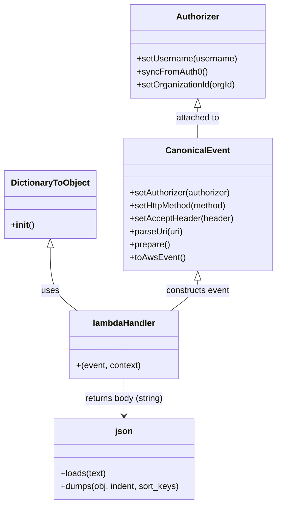

# Diagram: tools/ide_local_testing/localTest/test/byUrl/getLads.py


> Auto-generated by Obscura crawlers

## Diagram 1



### SVG

<svg id="container" width="501.7890625" xmlns="http://www.w3.org/2000/svg" class="classDiagram" height="934" viewBox="0 0 501.7890625 934" role="graphics-document document" aria-roledescription="class"><style>#container{font-family:"trebuchet ms",verdana,arial,sans-serif;font-size:16px;fill:#333;}@keyframes edge-animation-frame{from{stroke-dashoffset:0;}}@keyframes dash{to{stroke-dashoffset:0;}}#container .edge-animation-slow{stroke-dasharray:9,5!important;stroke-dashoffset:900;animation:dash 50s linear infinite;stroke-linecap:round;}#container .edge-animation-fast{stroke-dasharray:9,5!important;stroke-dashoffset:900;animation:dash 20s linear infinite;stroke-linecap:round;}#container .error-icon{fill:#552222;}#container .error-text{fill:#552222;stroke:#552222;}#container .edge-thickness-normal{stroke-width:1px;}#container .edge-thickness-thick{stroke-width:3.5px;}#container .edge-pattern-solid{stroke-dasharray:0;}#container .edge-thickness-invisible{stroke-width:0;fill:none;}#container .edge-pattern-dashed{stroke-dasharray:3;}#container .edge-pattern-dotted{stroke-dasharray:2;}#container .marker{fill:#333333;stroke:#333333;}#container .marker.cross{stroke:#333333;}#container svg{font-family:"trebuchet ms",verdana,arial,sans-serif;font-size:16px;}#container p{margin:0;}#container g.classGroup text{fill:#9370DB;stroke:none;font-family:"trebuchet ms",verdana,arial,sans-serif;font-size:10px;}#container g.classGroup text .title{font-weight:bolder;}#container .nodeLabel,#container .edgeLabel{color:#131300;}#container .edgeLabel .label rect{fill:#ECECFF;}#container .label text{fill:#131300;}#container .labelBkg{background:#ECECFF;}#container .edgeLabel .label span{background:#ECECFF;}#container .classTitle{font-weight:bolder;}#container .node rect,#container .node circle,#container .node ellipse,#container .node polygon,#container .node path{fill:#ECECFF;stroke:#9370DB;stroke-width:1px;}#container .divider{stroke:#9370DB;stroke-width:1;}#container g.clickable{cursor:pointer;}#container g.classGroup rect{fill:#ECECFF;stroke:#9370DB;}#container g.classGroup line{stroke:#9370DB;stroke-width:1;}#container .classLabel .box{stroke:none;stroke-width:0;fill:#ECECFF;opacity:0.5;}#container .classLabel .label{fill:#9370DB;font-size:10px;}#container .relation{stroke:#333333;stroke-width:1;fill:none;}#container .dashed-line{stroke-dasharray:3;}#container .dotted-line{stroke-dasharray:1 2;}#container #compositionStart,#container .composition{fill:#333333!important;stroke:#333333!important;stroke-width:1;}#container #compositionEnd,#container .composition{fill:#333333!important;stroke:#333333!important;stroke-width:1;}#container #dependencyStart,#container .dependency{fill:#333333!important;stroke:#333333!important;stroke-width:1;}#container #dependencyStart,#container .dependency{fill:#333333!important;stroke:#333333!important;stroke-width:1;}#container #extensionStart,#container .extension{fill:transparent!important;stroke:#333333!important;stroke-width:1;}#container #extensionEnd,#container .extension{fill:transparent!important;stroke:#333333!important;stroke-width:1;}#container #aggregationStart,#container .aggregation{fill:transparent!important;stroke:#333333!important;stroke-width:1;}#container #aggregationEnd,#container .aggregation{fill:transparent!important;stroke:#333333!important;stroke-width:1;}#container #lollipopStart,#container .lollipop{fill:#ECECFF!important;stroke:#333333!important;stroke-width:1;}#container #lollipopEnd,#container .lollipop{fill:#ECECFF!important;stroke:#333333!important;stroke-width:1;}#container .edgeTerminals{font-size:11px;line-height:initial;}#container .classTitleText{text-anchor:middle;font-size:18px;fill:#333;}#container .label-icon{display:inline-block;height:1em;overflow:visible;vertical-align:-0.125em;}#container .node .label-icon path{fill:currentColor;stroke:revert;stroke-width:revert;}#container :root{--mermaid-font-family:"trebuchet ms",verdana,arial,sans-serif;}</style><g><defs><marker id="container_class-aggregationStart" class="marker aggregation class" refX="18" refY="7" markerWidth="190" markerHeight="240" orient="auto"><path d="M 18,7 L9,13 L1,7 L9,1 Z"></path></marker></defs><defs><marker id="container_class-aggregationEnd" class="marker aggregation class" refX="1" refY="7" markerWidth="20" markerHeight="28" orient="auto"><path d="M 18,7 L9,13 L1,7 L9,1 Z"></path></marker></defs><defs><marker id="container_class-extensionStart" class="marker extension class" refX="18" refY="7" markerWidth="190" markerHeight="240" orient="auto"><path d="M 1,7 L18,13 V 1 Z"></path></marker></defs><defs><marker id="container_class-extensionEnd" class="marker extension class" refX="1" refY="7" markerWidth="20" markerHeight="28" orient="auto"><path d="M 1,1 V 13 L18,7 Z"></path></marker></defs><defs><marker id="container_class-compositionStart" class="marker composition class" refX="18" refY="7" markerWidth="190" markerHeight="240" orient="auto"><path d="M 18,7 L9,13 L1,7 L9,1 Z"></path></marker></defs><defs><marker id="container_class-compositionEnd" class="marker composition class" refX="1" refY="7" markerWidth="20" markerHeight="28" orient="auto"><path d="M 18,7 L9,13 L1,7 L9,1 Z"></path></marker></defs><defs><marker id="container_class-dependencyStart" class="marker dependency class" refX="6" refY="7" markerWidth="190" markerHeight="240" orient="auto"><path d="M 5,7 L9,13 L1,7 L9,1 Z"></path></marker></defs><defs><marker id="container_class-dependencyEnd" class="marker dependency class" refX="13" refY="7" markerWidth="20" markerHeight="28" orient="auto"><path d="M 18,7 L9,13 L14,7 L9,1 Z"></path></marker></defs><defs><marker id="container_class-lollipopStart" class="marker lollipop class" refX="13" refY="7" markerWidth="190" markerHeight="240" orient="auto"><circle stroke="black" fill="transparent" cx="7" cy="7" r="6"></circle></marker></defs><defs><marker id="container_class-lollipopEnd" class="marker lollipop class" refX="1" refY="7" markerWidth="190" markerHeight="240" orient="auto"><circle stroke="black" fill="transparent" cx="7" cy="7" r="6"></circle></marker></defs><g class="root"><g class="clusters"></g><g class="edgePaths"><path d="M90.109,459.25L90.109,472.542C90.109,485.833,90.109,512.417,98.369,531.875C106.63,551.333,123.15,563.667,131.41,569.833L139.67,576" id="id_DictionaryToObject_lambdaHandler_1" class="edge-thickness-normal edge-pattern-solid relation" style=";;;" data-edge="true" data-et="edge" data-id="id_DictionaryToObject_lambdaHandler_1" data-points="W3sieCI6OTAuMTA5Mzc1LCJ5Ijo0NDJ9LHsieCI6OTAuMTA5Mzc1LCJ5Ijo1Mzl9LHsieCI6MTM5LjY2OTg2MzI4MTI1LCJ5Ijo1NzZ9XQ==" marker-start="url(#container_class-extensionStart)"></path><path d="M358.004,519.25L358.004,522.542C358.004,525.833,358.004,532.417,349.744,541.875C341.484,551.333,324.964,563.667,316.703,569.833L308.443,576" id="id_CanonicalEvent_lambdaHandler_2" class="edge-thickness-normal edge-pattern-solid relation" style=";;;" data-edge="true" data-et="edge" data-id="id_CanonicalEvent_lambdaHandler_2" data-points="W3sieCI6MzU4LjAwMzkwNjI1LCJ5Ijo1MDJ9LHsieCI6MzU4LjAwMzkwNjI1LCJ5Ijo1Mzl9LHsieCI6MzA4LjQ0MzQxNzk2ODc1LCJ5Ijo1NzZ9XQ==" marker-start="url(#container_class-extensionStart)"></path><path d="M358.004,199.25L358.004,202.542C358.004,205.833,358.004,212.417,358.004,221.875C358.004,231.333,358.004,243.667,358.004,249.833L358.004,256" id="id_Authorizer_CanonicalEvent_3" class="edge-thickness-normal edge-pattern-solid relation" style=";;;" data-edge="true" data-et="edge" data-id="id_Authorizer_CanonicalEvent_3" data-points="W3sieCI6MzU4LjAwMzkwNjI1LCJ5IjoxODJ9LHsieCI6MzU4LjAwMzkwNjI1LCJ5IjoyMTl9LHsieCI6MzU4LjAwMzkwNjI1LCJ5IjoyNTZ9XQ==" marker-start="url(#container_class-extensionStart)"></path><path d="M224.057,702L224.057,708.167C224.057,714.333,224.057,726.667,224.057,738C224.057,749.333,224.057,759.667,224.057,764.833L224.057,770" id="id_lambdaHandler_json_4" class="edge-thickness-normal edge-pattern-dashed relation" style=";;;" data-edge="true" data-et="edge" data-id="id_lambdaHandler_json_4" data-points="W3sieCI6MjI0LjA1NjY0MDYyNSwieSI6NzAyfSx7IngiOjIyNC4wNTY2NDA2MjUsInkiOjczOX0seyJ4IjoyMjQuMDU2NjQwNjI1LCJ5Ijo3NzZ9XQ==" marker-end="url(#container_class-dependencyEnd)"></path></g><g class="edgeLabels"><g class="edgeLabel" transform="translate(90.109375, 539)"><g class="label" data-id="id_DictionaryToObject_lambdaHandler_1" transform="translate(-16.4921875, -12)"><foreignObject width="32.984375" height="24"><div xmlns="http://www.w3.org/1999/xhtml" class="labelBkg" style="display: table-cell; white-space: nowrap; line-height: 1.5; max-width: 200px; text-align: center;"><span class="edgeLabel"><p>uses</p></span></div></foreignObject></g></g><g class="edgeLabel" transform="translate(358.00390625, 539)"><g class="label" data-id="id_CanonicalEvent_lambdaHandler_2" transform="translate(-60.1328125, -12)"><foreignObject width="120.265625" height="24"><div xmlns="http://www.w3.org/1999/xhtml" class="labelBkg" style="display: table-cell; white-space: nowrap; line-height: 1.5; max-width: 200px; text-align: center;"><span class="edgeLabel"><p>constructs event</p></span></div></foreignObject></g></g><g class="edgeLabel" transform="translate(358.00390625, 219)"><g class="label" data-id="id_Authorizer_CanonicalEvent_3" transform="translate(-41.640625, -12)"><foreignObject width="83.28125" height="24"><div xmlns="http://www.w3.org/1999/xhtml" class="labelBkg" style="display: table-cell; white-space: nowrap; line-height: 1.5; max-width: 200px; text-align: center;"><span class="edgeLabel"><p>attached to</p></span></div></foreignObject></g></g><g class="edgeLabel" transform="translate(224.056640625, 739)"><g class="label" data-id="id_lambdaHandler_json_4" transform="translate(-74.6484375, -12)"><foreignObject width="149.296875" height="24"><div xmlns="http://www.w3.org/1999/xhtml" class="labelBkg" style="display: table-cell; white-space: nowrap; line-height: 1.5; max-width: 200px; text-align: center;"><span class="edgeLabel"><p>returns body (string)</p></span></div></foreignObject></g></g></g><g class="nodes"><g class="node default" id="classId-DictionaryToObject-0" transform="translate(90.109375, 379)"><g class="basic label-container"><path d="M-82.109375 -63 L82.109375 -63 L82.109375 63 L-82.109375 63" stroke="none" stroke-width="0" fill="#ECECFF" style=""></path><path d="M-82.109375 -63 C-34.09134422101695 -63, 13.926686557966093 -63, 82.109375 -63 M-82.109375 -63 C-35.54891108766759 -63, 11.011552824664818 -63, 82.109375 -63 M82.109375 -63 C82.109375 -12.792520311298986, 82.109375 37.41495937740203, 82.109375 63 M82.109375 -63 C82.109375 -18.806461880517922, 82.109375 25.387076238964156, 82.109375 63 M82.109375 63 C22.673384638816316 63, -36.76260572236737 63, -82.109375 63 M82.109375 63 C30.727576378733424 63, -20.65422224253315 63, -82.109375 63 M-82.109375 63 C-82.109375 18.7415161365021, -82.109375 -25.5169677269958, -82.109375 -63 M-82.109375 63 C-82.109375 13.312516117076214, -82.109375 -36.37496776584757, -82.109375 -63" stroke="#9370DB" stroke-width="1.3" fill="none" stroke-dasharray="0 0" style=""></path></g><g class="annotation-group text" transform="translate(0, -39)"></g><g class="label-group text" transform="translate(-70.109375, -39)"><g class="label" style="font-weight: bolder" transform="translate(0,-12)"><foreignObject width="140.21875" height="24"><div xmlns="http://www.w3.org/1999/xhtml" style="display: table-cell; white-space: nowrap; line-height: 1.5; max-width: 188px; text-align: center;"><span class="nodeLabel markdown-node-label" style=""><p>DictionaryToObject</p></span></div></foreignObject></g></g><g class="members-group text" transform="translate(-70.109375, 9)"></g><g class="methods-group text" transform="translate(-70.109375, 39)"><g class="label" style="" transform="translate(0,-12)"><foreignObject width="42.796875" height="24"><div xmlns="http://www.w3.org/1999/xhtml" style="display: table-cell; white-space: nowrap; line-height: 1.5; max-width: 132px; text-align: center;"><span class="nodeLabel markdown-node-label" style=""><p>+<strong>init</strong>()</p></span></div></foreignObject></g></g><g class="divider" style=""><path d="M-82.109375 -15 C-31.091518393190505 -15, 19.92633821361899 -15, 82.109375 -15 M-82.109375 -15 C-34.68829017614872 -15, 12.732794647702562 -15, 82.109375 -15" stroke="#9370DB" stroke-width="1.3" fill="none" stroke-dasharray="0 0" style=""></path></g><g class="divider" style=""><path d="M-82.109375 9 C-44.961232195277056 9, -7.8130893905541114 9, 82.109375 9 M-82.109375 9 C-28.966159507391815 9, 24.17705598521637 9, 82.109375 9" stroke="#9370DB" stroke-width="1.3" fill="none" stroke-dasharray="0 0" style=""></path></g></g><g class="node default" id="classId-CanonicalEvent-1" transform="translate(358.00390625, 379)"><g class="basic label-container"><path d="M-135.78515625 -123 L135.78515625 -123 L135.78515625 123 L-135.78515625 123" stroke="none" stroke-width="0" fill="#ECECFF" style=""></path><path d="M-135.78515625 -123 C-45.16811117353393 -123, 45.44893390293214 -123, 135.78515625 -123 M-135.78515625 -123 C-28.977526993287753 -123, 77.8301022634245 -123, 135.78515625 -123 M135.78515625 -123 C135.78515625 -36.42833431233289, 135.78515625 50.14333137533421, 135.78515625 123 M135.78515625 -123 C135.78515625 -65.50796658672087, 135.78515625 -8.015933173441752, 135.78515625 123 M135.78515625 123 C73.9675735114487 123, 12.14999077289741 123, -135.78515625 123 M135.78515625 123 C76.25290545127552 123, 16.720654652551048 123, -135.78515625 123 M-135.78515625 123 C-135.78515625 65.37428256213629, -135.78515625 7.748565124272574, -135.78515625 -123 M-135.78515625 123 C-135.78515625 37.353949994458716, -135.78515625 -48.29210001108257, -135.78515625 -123" stroke="#9370DB" stroke-width="1.3" fill="none" stroke-dasharray="0 0" style=""></path></g><g class="annotation-group text" transform="translate(0, -99)"></g><g class="label-group text" transform="translate(-55.7109375, -99)"><g class="label" style="font-weight: bolder" transform="translate(0,-12)"><foreignObject width="111.421875" height="24"><div xmlns="http://www.w3.org/1999/xhtml" style="display: table-cell; white-space: nowrap; line-height: 1.5; max-width: 161px; text-align: center;"><span class="nodeLabel markdown-node-label" style=""><p>CanonicalEvent</p></span></div></foreignObject></g></g><g class="members-group text" transform="translate(-123.78515625, -51)"></g><g class="methods-group text" transform="translate(-123.78515625, -21)"><g class="label" style="" transform="translate(0,-12)"><foreignObject width="190.75" height="24"><div xmlns="http://www.w3.org/1999/xhtml" style="display: table-cell; white-space: nowrap; line-height: 1.5; max-width: 248px; text-align: center;"><span class="nodeLabel markdown-node-label" style=""><p>+setAuthorizer(authorizer)</p></span></div></foreignObject></g><g class="label" style="" transform="translate(0,12)"><foreignObject width="184" height="24"><div xmlns="http://www.w3.org/1999/xhtml" style="display: table-cell; white-space: nowrap; line-height: 1.5; max-width: 241px; text-align: center;"><span class="nodeLabel markdown-node-label" style=""><p>+setHttpMethod(method)</p></span></div></foreignObject></g><g class="label" style="" transform="translate(0,36)"><foreignObject width="191.859375" height="24"><div xmlns="http://www.w3.org/1999/xhtml" style="display: table-cell; white-space: nowrap; line-height: 1.5; max-width: 249px; text-align: center;"><span class="nodeLabel markdown-node-label" style=""><p>+setAcceptHeader(header)</p></span></div></foreignObject></g><g class="label" style="" transform="translate(0,60)"><foreignObject width="99.8125" height="24"><div xmlns="http://www.w3.org/1999/xhtml" style="display: table-cell; white-space: nowrap; line-height: 1.5; max-width: 157px; text-align: center;"><span class="nodeLabel markdown-node-label" style=""><p>+parseUri(uri)</p></span></div></foreignObject></g><g class="label" style="" transform="translate(0,84)"><foreignObject width="74.75" height="24"><div xmlns="http://www.w3.org/1999/xhtml" style="display: table-cell; white-space: nowrap; line-height: 1.5; max-width: 132px; text-align: center;"><span class="nodeLabel markdown-node-label" style=""><p>+prepare()</p></span></div></foreignObject></g><g class="label" style="" transform="translate(0,108)"><foreignObject width="101.1875" height="24"><div xmlns="http://www.w3.org/1999/xhtml" style="display: table-cell; white-space: nowrap; line-height: 1.5; max-width: 159px; text-align: center;"><span class="nodeLabel markdown-node-label" style=""><p>+toAwsEvent()</p></span></div></foreignObject></g></g><g class="divider" style=""><path d="M-135.78515625 -75 C-29.45028600596038 -75, 76.88458423807924 -75, 135.78515625 -75 M-135.78515625 -75 C-80.62001854962534 -75, -25.454880849250685 -75, 135.78515625 -75" stroke="#9370DB" stroke-width="1.3" fill="none" stroke-dasharray="0 0" style=""></path></g><g class="divider" style=""><path d="M-135.78515625 -51 C-41.38174963389315 -51, 53.0216569822137 -51, 135.78515625 -51 M-135.78515625 -51 C-43.85720810569386 -51, 48.070740038612286 -51, 135.78515625 -51" stroke="#9370DB" stroke-width="1.3" fill="none" stroke-dasharray="0 0" style=""></path></g></g><g class="node default" id="classId-Authorizer-2" transform="translate(358.00390625, 95)"><g class="basic label-container"><path d="M-124.13671875 -87 L124.13671875 -87 L124.13671875 87 L-124.13671875 87" stroke="none" stroke-width="0" fill="#ECECFF" style=""></path><path d="M-124.13671875 -87 C-69.78002465503198 -87, -15.423330560063945 -87, 124.13671875 -87 M-124.13671875 -87 C-45.57175736123884 -87, 32.993204027522324 -87, 124.13671875 -87 M124.13671875 -87 C124.13671875 -19.572476252167476, 124.13671875 47.85504749566505, 124.13671875 87 M124.13671875 -87 C124.13671875 -50.99015304323066, 124.13671875 -14.980306086461326, 124.13671875 87 M124.13671875 87 C58.960148200733045 87, -6.216422348533911 87, -124.13671875 87 M124.13671875 87 C45.92840356221379 87, -32.279911625572424 87, -124.13671875 87 M-124.13671875 87 C-124.13671875 25.383316970959186, -124.13671875 -36.23336605808163, -124.13671875 -87 M-124.13671875 87 C-124.13671875 50.654430104091134, -124.13671875 14.308860208182267, -124.13671875 -87" stroke="#9370DB" stroke-width="1.3" fill="none" stroke-dasharray="0 0" style=""></path></g><g class="annotation-group text" transform="translate(0, -63)"></g><g class="label-group text" transform="translate(-38.3671875, -63)"><g class="label" style="font-weight: bolder" transform="translate(0,-12)"><foreignObject width="76.734375" height="24"><div xmlns="http://www.w3.org/1999/xhtml" style="display: table-cell; white-space: nowrap; line-height: 1.5; max-width: 126px; text-align: center;"><span class="nodeLabel markdown-node-label" style=""><p>Authorizer</p></span></div></foreignObject></g></g><g class="members-group text" transform="translate(-112.13671875, -15)"></g><g class="methods-group text" transform="translate(-112.13671875, 15)"><g class="label" style="" transform="translate(0,-12)"><foreignObject width="185.90625" height="24"><div xmlns="http://www.w3.org/1999/xhtml" style="display: table-cell; white-space: nowrap; line-height: 1.5; max-width: 243px; text-align: center;"><span class="nodeLabel markdown-node-label" style=""><p>+setUsername(username)</p></span></div></foreignObject></g><g class="label" style="" transform="translate(0,12)"><foreignObject width="129.0625" height="24"><div xmlns="http://www.w3.org/1999/xhtml" style="display: table-cell; white-space: nowrap; line-height: 1.5; max-width: 186px; text-align: center;"><span class="nodeLabel markdown-node-label" style=""><p>+syncFromAuth0()</p></span></div></foreignObject></g><g class="label" style="" transform="translate(0,36)"><foreignObject width="184.578125" height="24"><div xmlns="http://www.w3.org/1999/xhtml" style="display: table-cell; white-space: nowrap; line-height: 1.5; max-width: 242px; text-align: center;"><span class="nodeLabel markdown-node-label" style=""><p>+setOrganizationId(orgId)</p></span></div></foreignObject></g></g><g class="divider" style=""><path d="M-124.13671875 -39 C-59.97990178453435 -39, 4.176915180931303 -39, 124.13671875 -39 M-124.13671875 -39 C-70.07216778700501 -39, -16.00761682401003 -39, 124.13671875 -39" stroke="#9370DB" stroke-width="1.3" fill="none" stroke-dasharray="0 0" style=""></path></g><g class="divider" style=""><path d="M-124.13671875 -15 C-31.320665845065065 -15, 61.49538705986987 -15, 124.13671875 -15 M-124.13671875 -15 C-68.83349288769898 -15, -13.530267025397976 -15, 124.13671875 -15" stroke="#9370DB" stroke-width="1.3" fill="none" stroke-dasharray="0 0" style=""></path></g></g><g class="node default" id="classId-lambdaHandler-3" transform="translate(224.056640625, 639)"><g class="basic label-container"><path d="M-100.53125 -63 L100.53125 -63 L100.53125 63 L-100.53125 63" stroke="none" stroke-width="0" fill="#ECECFF" style=""></path><path d="M-100.53125 -63 C-25.680020082224672 -63, 49.171209835550655 -63, 100.53125 -63 M-100.53125 -63 C-42.33240823883639 -63, 15.866433522327213 -63, 100.53125 -63 M100.53125 -63 C100.53125 -29.386137421449888, 100.53125 4.227725157100224, 100.53125 63 M100.53125 -63 C100.53125 -36.608004261000374, 100.53125 -10.216008522000742, 100.53125 63 M100.53125 63 C42.326052086245646 63, -15.879145827508708 63, -100.53125 63 M100.53125 63 C41.203813643550944 63, -18.12362271289811 63, -100.53125 63 M-100.53125 63 C-100.53125 30.597952355412836, -100.53125 -1.8040952891743274, -100.53125 -63 M-100.53125 63 C-100.53125 27.784457070875412, -100.53125 -7.431085858249176, -100.53125 -63" stroke="#9370DB" stroke-width="1.3" fill="none" stroke-dasharray="0 0" style=""></path></g><g class="annotation-group text" transform="translate(0, -39)"></g><g class="label-group text" transform="translate(-56.53125, -39)"><g class="label" style="font-weight: bolder" transform="translate(0,-12)"><foreignObject width="113.0625" height="24"><div xmlns="http://www.w3.org/1999/xhtml" style="display: table-cell; white-space: nowrap; line-height: 1.5; max-width: 164px; text-align: center;"><span class="nodeLabel markdown-node-label" style=""><p>lambdaHandler</p></span></div></foreignObject></g></g><g class="members-group text" transform="translate(-88.53125, 9)"></g><g class="methods-group text" transform="translate(-88.53125, 39)"><g class="label" style="" transform="translate(0,-12)"><foreignObject width="120.53125" height="24"><div xmlns="http://www.w3.org/1999/xhtml" style="display: table-cell; white-space: nowrap; line-height: 1.5; max-width: 171px; text-align: center;"><span class="nodeLabel markdown-node-label" style=""><p>+(event, context)</p></span></div></foreignObject></g></g><g class="divider" style=""><path d="M-100.53125 -15 C-48.310269325306834 -15, 3.9107113493863324 -15, 100.53125 -15 M-100.53125 -15 C-30.691783517120953 -15, 39.147682965758094 -15, 100.53125 -15" stroke="#9370DB" stroke-width="1.3" fill="none" stroke-dasharray="0 0" style=""></path></g><g class="divider" style=""><path d="M-100.53125 9 C-30.46617990953399 9, 39.59889018093202 9, 100.53125 9 M-100.53125 9 C-35.177874142972016 9, 30.17550171405597 9, 100.53125 9" stroke="#9370DB" stroke-width="1.3" fill="none" stroke-dasharray="0 0" style=""></path></g></g><g class="node default" id="classId-json-4" transform="translate(224.056640625, 851)"><g class="basic label-container"><path d="M-131.6171875 -75 L131.6171875 -75 L131.6171875 75 L-131.6171875 75" stroke="none" stroke-width="0" fill="#ECECFF" style=""></path><path d="M-131.6171875 -75 C-67.75743087651563 -75, -3.897674253031255 -75, 131.6171875 -75 M-131.6171875 -75 C-58.104452415126204 -75, 15.408282669747592 -75, 131.6171875 -75 M131.6171875 -75 C131.6171875 -42.58672649248386, 131.6171875 -10.173452984967724, 131.6171875 75 M131.6171875 -75 C131.6171875 -40.515170270028385, 131.6171875 -6.03034054005677, 131.6171875 75 M131.6171875 75 C62.68147006615328 75, -6.254247367693438 75, -131.6171875 75 M131.6171875 75 C48.77547792296549 75, -34.066231654069014 75, -131.6171875 75 M-131.6171875 75 C-131.6171875 26.831307386146683, -131.6171875 -21.337385227706633, -131.6171875 -75 M-131.6171875 75 C-131.6171875 29.608038610681476, -131.6171875 -15.783922778637049, -131.6171875 -75" stroke="#9370DB" stroke-width="1.3" fill="none" stroke-dasharray="0 0" style=""></path></g><g class="annotation-group text" transform="translate(0, -51)"></g><g class="label-group text" transform="translate(-15.40625, -51)"><g class="label" style="font-weight: bolder" transform="translate(0,-12)"><foreignObject width="30.8125" height="24"><div xmlns="http://www.w3.org/1999/xhtml" style="display: table-cell; white-space: nowrap; line-height: 1.5; max-width: 82px; text-align: center;"><span class="nodeLabel markdown-node-label" style=""><p>json</p></span></div></foreignObject></g></g><g class="members-group text" transform="translate(-119.6171875, -3)"></g><g class="methods-group text" transform="translate(-119.6171875, 27)"><g class="label" style="" transform="translate(0,-12)"><foreignObject width="85.546875" height="24"><div xmlns="http://www.w3.org/1999/xhtml" style="display: table-cell; white-space: nowrap; line-height: 1.5; max-width: 143px; text-align: center;"><span class="nodeLabel markdown-node-label" style=""><p>+loads(text)</p></span></div></foreignObject></g><g class="label" style="" transform="translate(0,12)"><foreignObject width="223.828125" height="24"><div xmlns="http://www.w3.org/1999/xhtml" style="display: table-cell; white-space: nowrap; line-height: 1.5; max-width: 281px; text-align: center;"><span class="nodeLabel markdown-node-label" style=""><p>+dumps(obj, indent, sort_keys)</p></span></div></foreignObject></g></g><g class="divider" style=""><path d="M-131.6171875 -27 C-45.17025042479496 -27, 41.276686650410085 -27, 131.6171875 -27 M-131.6171875 -27 C-30.865669851577138 -27, 69.88584779684572 -27, 131.6171875 -27" stroke="#9370DB" stroke-width="1.3" fill="none" stroke-dasharray="0 0" style=""></path></g><g class="divider" style=""><path d="M-131.6171875 -3 C-74.97401203711567 -3, -18.33083657423134 -3, 131.6171875 -3 M-131.6171875 -3 C-50.97142785243459 -3, 29.674331795130826 -3, 131.6171875 -3" stroke="#9370DB" stroke-width="1.3" fill="none" stroke-dasharray="0 0" style=""></path></g></g></g></g></g></svg>

## Diagram 2

```mermaid
flowchart TD
    A[Start script] --> B[Create Authorizer]
    B --> C{activeOrgId?}
    C -- yes --> D[setOrganizationId(activeOrgId)]
    C -- no --> E[skip org set]
    B --> F[Authorizer.syncFromAuth0()]
    F --> G[Create CanonicalEvent]
    G --> H[setHttpMethod("GET")]
    H --> I[setAcceptHeader("application/json")]
    I --> J[parseUri(uri)]
    J --> K[prepare() -> toAwsEvent()]
    K --> L[Call lambdaHandler(event, context)]
    L --> M{retval and retval.body?}
    M -- yes --> N[json.loads(retval.body) -> prettyRetval]
    M -- no --> O[prettyRetval = ""]
    N --> P[print(prettyRetval)]
    O --> P
    P --> Z[End]
```

> SVG rendering failed for this diagram.
