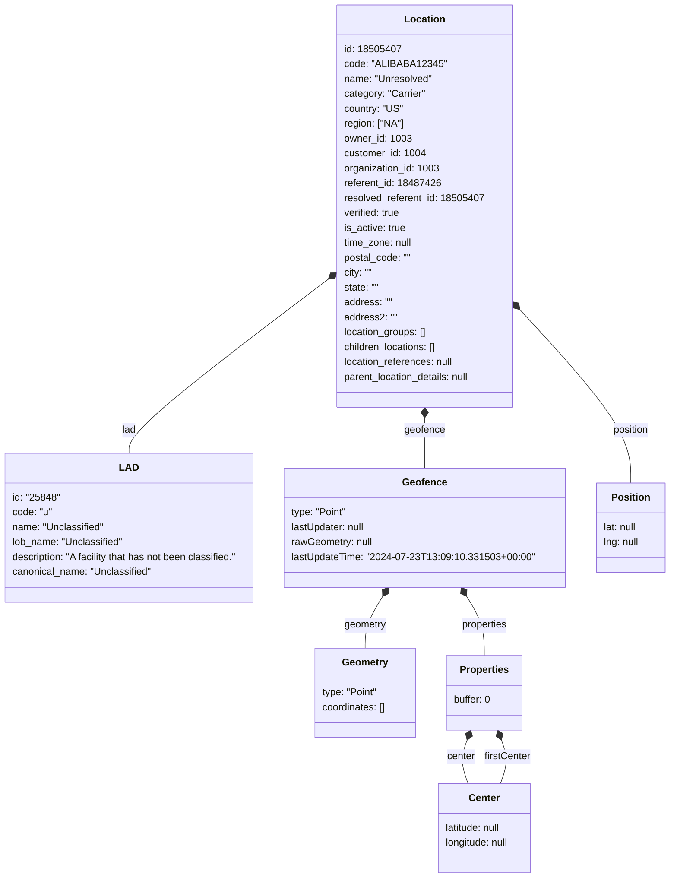

# Diagram: tools/ide_local_testing/localTest/test/byUrl/locationsPut.py

> Auto-generated by Obscura crawlers

## Mermaid

### SVG

<svg id="container" width="1067.9921875" xmlns="http://www.w3.org/2000/svg" class="classDiagram" height="1414" viewBox="0 0 1067.9921875 1414" role="graphics-document document" aria-roledescription="class"><g><defs><marker id="container_class-aggregationStart" class="marker aggregation class" refX="18" refY="7" markerWidth="190" markerHeight="240" orient="auto"><path d="M 18,7 L9,13 L1,7 L9,1 Z"></path></marker></defs><defs><marker id="container_class-aggregationEnd" class="marker aggregation class" refX="1" refY="7" markerWidth="20" markerHeight="28" orient="auto"><path d="M 18,7 L9,13 L1,7 L9,1 Z"></path></marker></defs><defs><marker id="container_class-extensionStart" class="marker extension class" refX="18" refY="7" markerWidth="190" markerHeight="240" orient="auto"><path d="M 1,7 L18,13 V 1 Z"></path></marker></defs><defs><marker id="container_class-extensionEnd" class="marker extension class" refX="1" refY="7" markerWidth="20" markerHeight="28" orient="auto"><path d="M 1,1 V 13 L18,7 Z"></path></marker></defs><defs><marker id="container_class-compositionStart" class="marker composition class" refX="18" refY="7" markerWidth="190" markerHeight="240" orient="auto"><path d="M 18,7 L9,13 L1,7 L9,1 Z"></path></marker></defs><defs><marker id="container_class-compositionEnd" class="marker composition class" refX="1" refY="7" markerWidth="20" markerHeight="28" orient="auto"><path d="M 18,7 L9,13 L1,7 L9,1 Z"></path></marker></defs><defs><marker id="container_class-dependencyStart" class="marker dependency class" refX="6" refY="7" markerWidth="190" markerHeight="240" orient="auto"><path d="M 5,7 L9,13 L1,7 L9,1 Z"></path></marker></defs><defs><marker id="container_class-dependencyEnd" class="marker dependency class" refX="13" refY="7" markerWidth="20" markerHeight="28" orient="auto"><path d="M 18,7 L9,13 L14,7 L9,1 Z"></path></marker></defs><defs><marker id="container_class-lollipopStart" class="marker lollipop class" refX="13" refY="7" markerWidth="190" markerHeight="240" orient="auto"><circle stroke="black" fill="transparent" cx="7" cy="7" r="6"></circle></marker></defs><defs><marker id="container_class-lollipopEnd" class="marker lollipop class" refX="1" refY="7" markerWidth="190" markerHeight="240" orient="auto"><circle stroke="black" fill="transparent" cx="7" cy="7" r="6"></circle></marker></defs><g class="root"><g class="clusters"></g><g class="edgePaths"><path d="M529.6,449.662L476.827,490.218C424.055,530.775,318.51,611.887,265.737,658.61C212.965,705.333,212.965,717.667,212.965,723.833L212.965,730" id="id_Location_LAD_1" class="edge-thickness-normal edge-pattern-solid relation" style=";;;" data-edge="true" data-et="edge" data-id="id_Location_LAD_1" data-points="W3sieCI6NTQzLjI3NzM0Mzc1LCJ5Ijo0MzkuMTUwNTMyNjI3MDQ0NjR9LHsieCI6MjEyLjk2NDg0Mzc1LCJ5Ijo2OTN9LHsieCI6MjEyLjk2NDg0Mzc1LCJ5Ijo3MzB9XQ==" marker-start="url(#container_class-compositionStart)"></path><path d="M682.703,673.25L682.703,676.542C682.703,679.833,682.703,686.417,682.703,699.875C682.703,713.333,682.703,733.667,682.703,743.833L682.703,754" id="id_Location_Geofence_2" class="edge-thickness-normal edge-pattern-solid relation" style=";;;" data-edge="true" data-et="edge" data-id="id_Location_Geofence_2" data-points="W3sieCI6NjgyLjcwMzEyNSwieSI6NjU2fSx7IngiOjY4Mi43MDMxMjUsInkiOjY5M30seyJ4Ijo2ODIuNzAzMTI1LCJ5Ijo3NTR9XQ==" marker-start="url(#container_class-compositionStart)"></path><path d="M614.391,960.679L609.626,968.399C604.861,976.119,595.331,991.56,590.566,1005.447C585.801,1019.333,585.801,1031.667,585.801,1037.833L585.801,1044" id="id_Geofence_Geometry_3" class="edge-thickness-normal edge-pattern-solid relation" style=";;;" data-edge="true" data-et="edge" data-id="id_Geofence_Geometry_3" data-points="W3sieCI6NjIzLjQ1MDczNjQ2NDk2ODEsInkiOjk0Nn0seyJ4Ijo1ODUuODAwNzgxMjUsInkiOjEwMDd9LHsieCI6NTg1LjgwMDc4MTI1LCJ5IjoxMDQ0fV0=" marker-start="url(#container_class-compositionStart)"></path><path d="M751.016,960.679L755.781,968.399C760.546,976.119,770.076,991.56,774.84,1007.447C779.605,1023.333,779.605,1039.667,779.605,1047.833L779.605,1056" id="id_Geofence_Properties_4" class="edge-thickness-normal edge-pattern-solid relation" style=";;;" data-edge="true" data-et="edge" data-id="id_Geofence_Properties_4" data-points="W3sieCI6NzQxLjk1NTUxMzUzNTAzMTksInkiOjk0Nn0seyJ4Ijo3NzkuNjA1NDY4NzUsInkiOjEwMDd9LHsieCI6Nzc5LjYwNTQ2ODc1LCJ5IjoxMDU2fV0=" marker-start="url(#container_class-compositionStart)"></path><path d="M751.402,1192.177L749.377,1197.647C747.351,1203.118,743.301,1214.059,743.558,1225.696C743.816,1237.333,748.382,1249.667,750.666,1255.833L752.949,1262" id="id_Properties_Center_5" class="edge-thickness-normal edge-pattern-solid relation" style=";;;" data-edge="true" data-et="edge" data-id="id_Properties_Center_5" data-points="W3sieCI6NzU3LjM5MTQ0OTI1NDU4NzIsInkiOjExNzZ9LHsieCI6NzM5LjI1LCJ5IjoxMjI1fSx7IngiOjc1Mi45NDg2NDUzNTU1MDQ2LCJ5IjoxMjYyfV0=" marker-start="url(#container_class-compositionStart)"></path><path d="M807.809,1192.177L809.834,1197.647C811.859,1203.118,815.91,1214.059,815.652,1225.696C815.395,1237.333,810.829,1249.667,808.545,1255.833L806.262,1262" id="id_Properties_Center_6" class="edge-thickness-normal edge-pattern-solid relation" style=";;;" data-edge="true" data-et="edge" data-id="id_Properties_Center_6" data-points="W3sieCI6ODAxLjgxOTQ4ODI0NTQxMjgsInkiOjExNzZ9LHsieCI6ODE5Ljk2MDkzNzUsInkiOjEyMjV9LHsieCI6ODA2LjI2MjI5MjE0NDQ5NTQsInkiOjEyNjJ9XQ==" marker-start="url(#container_class-compositionStart)"></path><path d="M833.592,501.675L861.949,533.562C890.306,565.45,947.02,629.225,975.377,675.279C1003.734,721.333,1003.734,749.667,1003.734,763.833L1003.734,778" id="id_Location_Position_7" class="edge-thickness-normal edge-pattern-solid relation" style=";;;" data-edge="true" data-et="edge" data-id="id_Location_Position_7" data-points="W3sieCI6ODIyLjEyODkwNjI1LCJ5Ijo0ODguNzg0NDQ3MDk0MzI0OTV9LHsieCI6MTAwMy43MzQzNzUsInkiOjY5M30seyJ4IjoxMDAzLjczNDM3NSwieSI6Nzc4fV0=" marker-start="url(#container_class-compositionStart)"></path></g><g class="edgeLabels"><g class="edgeLabel" transform="translate(212.96484375, 693)"><g class="label" data-id="id_Location_LAD_1" transform="translate(-11.4453125, -12)"><foreignObject width="22.890625" height="24">

lad

</foreignObject></g></g><g class="edgeLabel" transform="translate(682.703125, 693)"><g class="label" data-id="id_Location_Geofence_2" transform="translate(-32.7421875, -12)"><foreignObject width="65.484375" height="24">

geofence

</foreignObject></g></g><g class="edgeLabel" transform="translate(585.80078125, 1007)"><g class="label" data-id="id_Geofence_Geometry_3" transform="translate(-34.1953125, -12)"><foreignObject width="68.390625" height="24">

geometry

</foreignObject></g></g><g class="edgeLabel" transform="translate(779.60546875, 1007)"><g class="label" data-id="id_Geofence_Properties_4" transform="translate(-37.71875, -12)"><foreignObject width="75.4375" height="24">

properties

</foreignObject></g></g><g class="edgeLabel" transform="translate(741.4714, 1219)"><g class="label" data-id="id_Properties_Center_5" transform="translate(-22.9296875, -12)"><foreignObject width="45.859375" height="24">

center

</foreignObject></g></g><g class="edgeLabel" transform="translate(817.73954, 1219)"><g class="label" data-id="id_Properties_Center_6" transform="translate(-37.78125, -12)"><foreignObject width="75.5625" height="24">

firstCenter

</foreignObject></g></g><g class="edgeLabel" transform="translate(1003.734375, 693)"><g class="label" data-id="id_Location_Position_7" transform="translate(-29.921875, -12)"><foreignObject width="59.84375" height="24">

position

</foreignObject></g></g></g><g class="nodes"><g class="node default" id="classId-Location-0" transform="translate(682.703125, 332)"><g class="basic label-container"><path d="M-139.42578125 -324 L139.42578125 -324 L139.42578125 324 L-139.42578125 324" stroke="none" stroke-width="0" fill="#ECECFF" style=""></path><path d="M-139.42578125 -324 C-32.71564777695673 -324, 73.99448569608654 -324, 139.42578125 -324 M-139.42578125 -324 C-49.04029669112245 -324, 41.3451878677551 -324, 139.42578125 -324 M139.42578125 -324 C139.42578125 -85.00333557601988, 139.42578125 153.99332884796024, 139.42578125 324 M139.42578125 -324 C139.42578125 -167.44639894777453, 139.42578125 -10.892797895549052, 139.42578125 324 M139.42578125 324 C57.30203333976951 324, -24.821714570460983 324, -139.42578125 324 M139.42578125 324 C54.888207121194284 324, -29.64936700761143 324, -139.42578125 324 M-139.42578125 324 C-139.42578125 118.67614083439963, -139.42578125 -86.64771833120074, -139.42578125 -324 M-139.42578125 324 C-139.42578125 141.42318155852956, -139.42578125 -41.15363688294087, -139.42578125 -324" stroke="#9370DB" stroke-width="1.3" fill="none" stroke-dasharray="0 0" style=""></path></g><g class="annotation-group text" transform="translate(0, -300)"></g><g class="label-group text" transform="translate(-31.3515625, -300)"><g class="label" style="font-weight: bolder" transform="translate(0,-12)"><foreignObject width="62.703125" height="24">

Location

</foreignObject></g></g><g class="members-group text" transform="translate(-127.42578125, -252)"><g class="label" style="" transform="translate(0,-12)"><foreignObject width="87.09375" height="24">

id: 18505407

</foreignObject></g><g class="label" style="" transform="translate(0,12)"><foreignObject width="152.578125" height="24">

code: "ALIBABA12345"

</foreignObject></g><g class="label" style="" transform="translate(0,36)"><foreignObject width="143.1875" height="24">

name: "Unresolved"

</foreignObject></g><g class="label" style="" transform="translate(0,60)"><foreignObject width="132.15625" height="24">

category: "Carrier"

</foreignObject></g><g class="label" style="" transform="translate(0,84)"><foreignObject width="95.140625" height="24">

country: "US"

</foreignObject></g><g class="label" style="" transform="translate(0,108)"><foreignObject width="97.0625" height="24">

region: ["NA"]

</foreignObject></g><g class="label" style="" transform="translate(0,132)"><foreignObject width="106.90625" height="24">

owner_id: 1003

</foreignObject></g><g class="label" style="" transform="translate(0,156)"><foreignObject width="130.265625" height="24">

customer_id: 1004

</foreignObject></g><g class="label" style="" transform="translate(0,180)"><foreignObject width="153.453125" height="24">

organization_id: 1003

</foreignObject></g><g class="label" style="" transform="translate(0,204)"><foreignObject width="152.328125" height="24">

referent_id: 18487426

</foreignObject></g><g class="label" style="" transform="translate(0,228)"><foreignObject width="223.5" height="24">

resolved_referent_id: 18505407

</foreignObject></g><g class="label" style="" transform="translate(0,252)"><foreignObject width="92.78125" height="24">

verified: true

</foreignObject></g><g class="label" style="" transform="translate(0,276)"><foreignObject width="100.90625" height="24">

is_active: true

</foreignObject></g><g class="label" style="" transform="translate(0,300)"><foreignObject width="111.1875" height="24">

time_zone: null

</foreignObject></g><g class="label" style="" transform="translate(0,324)"><foreignObject width="109.03125" height="24">

postal_code: ""

</foreignObject></g><g class="label" style="" transform="translate(0,348)"><foreignObject width="46.640625" height="24">

city: ""

</foreignObject></g><g class="label" style="" transform="translate(0,372)"><foreignObject width="56.953125" height="24">

state: ""

</foreignObject></g><g class="label" style="" transform="translate(0,396)"><foreignObject width="77.890625" height="24">

address: ""

</foreignObject></g><g class="label" style="" transform="translate(0,420)"><foreignObject width="85.65625" height="24">

address2: ""

</foreignObject></g><g class="label" style="" transform="translate(0,444)"><foreignObject width="135.65625" height="24">

location_groups: []

</foreignObject></g><g class="label" style="" transform="translate(0,468)"><foreignObject width="152.6875" height="24">

children_locations: []

</foreignObject></g><g class="label" style="" transform="translate(0,492)"><foreignObject width="179.265625" height="24">

location_references: null

</foreignObject></g><g class="label" style="" transform="translate(0,516)"><foreignObject width="208.40625" height="24">

parent_location_details: null

</foreignObject></g></g><g class="methods-group text" transform="translate(-127.42578125, 324)"></g><g class="divider" style=""><path d="M-139.42578125 -276 C-30.268611677392315 -276, 78.88855789521537 -276, 139.42578125 -276 M-139.42578125 -276 C-56.16432616887141 -276, 27.097128912257176 -276, 139.42578125 -276" stroke="#9370DB" stroke-width="1.3" fill="none" stroke-dasharray="0 0" style=""></path></g><g class="divider" style=""><path d="M-139.42578125 300 C-53.598762022230105 300, 32.22825720553979 300, 139.42578125 300 M-139.42578125 300 C-77.88875135491152 300, -16.35172145982304 300, 139.42578125 300" stroke="#9370DB" stroke-width="1.3" fill="none" stroke-dasharray="0 0" style=""></path></g></g><g class="node default" id="classId-LAD-1" transform="translate(212.96484375, 850)"><g class="basic label-container"><path d="M-204.96484375 -120 L204.96484375 -120 L204.96484375 120 L-204.96484375 120" stroke="none" stroke-width="0" fill="#ECECFF" style=""></path><path d="M-204.96484375 -120 C-99.1676181405687 -120, 6.629607468862588 -120, 204.96484375 -120 M-204.96484375 -120 C-114.45797480740252 -120, -23.951105864805044 -120, 204.96484375 -120 M204.96484375 -120 C204.96484375 -55.45680970125453, 204.96484375 9.086380597490944, 204.96484375 120 M204.96484375 -120 C204.96484375 -34.11072861175309, 204.96484375 51.77854277649382, 204.96484375 120 M204.96484375 120 C45.191889765232276 120, -114.58106421953545 120, -204.96484375 120 M204.96484375 120 C54.98716883398106 120, -94.99050608203788 120, -204.96484375 120 M-204.96484375 120 C-204.96484375 27.82462003590443, -204.96484375 -64.35075992819114, -204.96484375 -120 M-204.96484375 120 C-204.96484375 35.990741818981135, -204.96484375 -48.01851636203773, -204.96484375 -120" stroke="#9370DB" stroke-width="1.3" fill="none" stroke-dasharray="0 0" style=""></path></g><g class="annotation-group text" transform="translate(0, -96)"></g><g class="label-group text" transform="translate(-14.0390625, -96)"><g class="label" style="font-weight: bolder" transform="translate(0,-12)"><foreignObject width="28.078125" height="24">

LAD

</foreignObject></g></g><g class="members-group text" transform="translate(-192.96484375, -48)"><g class="label" style="" transform="translate(0,-12)"><foreignObject width="76.78125" height="24">

id: "25848"

</foreignObject></g><g class="label" style="" transform="translate(0,12)"><foreignObject width="65.125" height="24">

code: "u"

</foreignObject></g><g class="label" style="" transform="translate(0,36)"><foreignObject width="148.921875" height="24">

name: "Unclassified"

</foreignObject></g><g class="label" style="" transform="translate(0,60)"><foreignObject width="180.375" height="24">

lob_name: "Unclassified"

</foreignObject></g><g class="label" style="" transform="translate(0,84)"><foreignObject width="371.890625" height="24">

description: "A facility that has not been classified."

</foreignObject></g><g class="label" style="" transform="translate(0,108)"><foreignObject width="226.765625" height="24">

canonical_name: "Unclassified"

</foreignObject></g></g><g class="methods-group text" transform="translate(-192.96484375, 120)"></g><g class="divider" style=""><path d="M-204.96484375 -72 C-52.483732931227905 -72, 99.99737788754419 -72, 204.96484375 -72 M-204.96484375 -72 C-111.53911486503796 -72, -18.11338598007592 -72, 204.96484375 -72" stroke="#9370DB" stroke-width="1.3" fill="none" stroke-dasharray="0 0" style=""></path></g><g class="divider" style=""><path d="M-204.96484375 96 C-53.95930371600315 96, 97.0462363179937 96, 204.96484375 96 M-204.96484375 96 C-45.20007487143059 96, 114.56469400713883 96, 204.96484375 96" stroke="#9370DB" stroke-width="1.3" fill="none" stroke-dasharray="0 0" style=""></path></g></g><g class="node default" id="classId-Geofence-2" transform="translate(682.703125, 850)"><g class="basic label-container"><path d="M-214.7734375 -96 L214.7734375 -96 L214.7734375 96 L-214.7734375 96" stroke="none" stroke-width="0" fill="#ECECFF" style=""></path><path d="M-214.7734375 -96 C-79.73187050968608 -96, 55.30969648062785 -96, 214.7734375 -96 M-214.7734375 -96 C-95.79137012195974 -96, 23.19069725608051 -96, 214.7734375 -96 M214.7734375 -96 C214.7734375 -29.969710333833817, 214.7734375 36.06057933233237, 214.7734375 96 M214.7734375 -96 C214.7734375 -51.66935665530751, 214.7734375 -7.33871331061502, 214.7734375 96 M214.7734375 96 C116.62103044607284 96, 18.468623392145673 96, -214.7734375 96 M214.7734375 96 C98.61372388025706 96, -17.54598973948589 96, -214.7734375 96 M-214.7734375 96 C-214.7734375 37.229706994513336, -214.7734375 -21.54058601097333, -214.7734375 -96 M-214.7734375 96 C-214.7734375 29.139029508596224, -214.7734375 -37.72194098280755, -214.7734375 -96" stroke="#9370DB" stroke-width="1.3" fill="none" stroke-dasharray="0 0" style=""></path></g><g class="annotation-group text" transform="translate(0, -72)"></g><g class="label-group text" transform="translate(-34.140625, -72)"><g class="label" style="font-weight: bolder" transform="translate(0,-12)"><foreignObject width="68.28125" height="24">

Geofence

</foreignObject></g></g><g class="members-group text" transform="translate(-202.7734375, -24)"><g class="label" style="" transform="translate(0,-12)"><foreignObject width="90.234375" height="24">

type: "Point"

</foreignObject></g><g class="label" style="" transform="translate(0,12)"><foreignObject width="121.515625" height="24">

lastUpdater: null

</foreignObject></g><g class="label" style="" transform="translate(0,36)"><foreignObject width="132.34375" height="24">

rawGeometry: null

</foreignObject></g><g class="label" style="" transform="translate(0,60)"><foreignObject width="371.40625" height="24">

lastUpdateTime: "2024-07-23T13:09:10.331503+00:00"

</foreignObject></g></g><g class="methods-group text" transform="translate(-202.7734375, 96)"></g><g class="divider" style=""><path d="M-214.7734375 -48 C-105.55909069551178 -48, 3.655256108976431 -48, 214.7734375 -48 M-214.7734375 -48 C-100.54223110795259 -48, 13.688975284094823 -48, 214.7734375 -48" stroke="#9370DB" stroke-width="1.3" fill="none" stroke-dasharray="0 0" style=""></path></g><g class="divider" style=""><path d="M-214.7734375 72 C-87.25986658318452 72, 40.253704333630964 72, 214.7734375 72 M-214.7734375 72 C-54.28892702002355 72, 106.1955834599529 72, 214.7734375 72" stroke="#9370DB" stroke-width="1.3" fill="none" stroke-dasharray="0 0" style=""></path></g></g><g class="node default" id="classId-Geometry-3" transform="translate(585.80078125, 1116)"><g class="basic label-container"><path d="M-81.92578125 -72 L81.92578125 -72 L81.92578125 72 L-81.92578125 72" stroke="none" stroke-width="0" fill="#ECECFF" style=""></path><path d="M-81.92578125 -72 C-43.13265169384401 -72, -4.3395221376880215 -72, 81.92578125 -72 M-81.92578125 -72 C-26.634516387332148 -72, 28.656748475335704 -72, 81.92578125 -72 M81.92578125 -72 C81.92578125 -37.84432460613012, 81.92578125 -3.688649212260245, 81.92578125 72 M81.92578125 -72 C81.92578125 -16.843880785601932, 81.92578125 38.312238428796135, 81.92578125 72 M81.92578125 72 C44.01655836773318 72, 6.107335485466365 72, -81.92578125 72 M81.92578125 72 C32.45369533813384 72, -17.01839057373232 72, -81.92578125 72 M-81.92578125 72 C-81.92578125 41.66822988197676, -81.92578125 11.336459763953506, -81.92578125 -72 M-81.92578125 72 C-81.92578125 39.96487387154026, -81.92578125 7.929747743080526, -81.92578125 -72" stroke="#9370DB" stroke-width="1.3" fill="none" stroke-dasharray="0 0" style=""></path></g><g class="annotation-group text" transform="translate(0, -48)"></g><g class="label-group text" transform="translate(-35.8671875, -48)"><g class="label" style="font-weight: bolder" transform="translate(0,-12)"><foreignObject width="71.734375" height="24">

Geometry

</foreignObject></g></g><g class="members-group text" transform="translate(-69.92578125, 0)"><g class="label" style="" transform="translate(0,-12)"><foreignObject width="90.234375" height="24">

type: "Point"

</foreignObject></g><g class="label" style="" transform="translate(0,12)"><foreignObject width="103.984375" height="24">

coordinates: []

</foreignObject></g></g><g class="methods-group text" transform="translate(-69.92578125, 72)"></g><g class="divider" style=""><path d="M-81.92578125 -24 C-27.725120827747254 -24, 26.47553959450549 -24, 81.92578125 -24 M-81.92578125 -24 C-19.72474396027105 -24, 42.4762933294579 -24, 81.92578125 -24" stroke="#9370DB" stroke-width="1.3" fill="none" stroke-dasharray="0 0" style=""></path></g><g class="divider" style=""><path d="M-81.92578125 48 C-32.541833332443375 48, 16.84211458511325 48, 81.92578125 48 M-81.92578125 48 C-38.988532793936315 48, 3.94871566212737 48, 81.92578125 48" stroke="#9370DB" stroke-width="1.3" fill="none" stroke-dasharray="0 0" style=""></path></g></g><g class="node default" id="classId-Properties-4" transform="translate(779.60546875, 1116)"><g class="basic label-container"><path d="M-61.87890625 -60 L61.87890625 -60 L61.87890625 60 L-61.87890625 60" stroke="none" stroke-width="0" fill="#ECECFF" style=""></path><path d="M-61.87890625 -60 C-32.98039365277498 -60, -4.08188105554995 -60, 61.87890625 -60 M-61.87890625 -60 C-18.70929640680054 -60, 24.46031343639892 -60, 61.87890625 -60 M61.87890625 -60 C61.87890625 -35.68051287768676, 61.87890625 -11.361025755373518, 61.87890625 60 M61.87890625 -60 C61.87890625 -18.566848771707015, 61.87890625 22.86630245658597, 61.87890625 60 M61.87890625 60 C31.337831172430075 60, 0.7967560948601502 60, -61.87890625 60 M61.87890625 60 C20.00561218471845 60, -21.867681880563097 60, -61.87890625 60 M-61.87890625 60 C-61.87890625 13.997855912952083, -61.87890625 -32.004288174095834, -61.87890625 -60 M-61.87890625 60 C-61.87890625 18.6283174177465, -61.87890625 -22.743365164506997, -61.87890625 -60" stroke="#9370DB" stroke-width="1.3" fill="none" stroke-dasharray="0 0" style=""></path></g><g class="annotation-group text" transform="translate(0, -36)"></g><g class="label-group text" transform="translate(-38.3046875, -36)"><g class="label" style="font-weight: bolder" transform="translate(0,-12)"><foreignObject width="76.609375" height="24">

Properties

</foreignObject></g></g><g class="members-group text" transform="translate(-49.87890625, 12)"><g class="label" style="" transform="translate(0,-12)"><foreignObject width="61.453125" height="24">

buffer: 0

</foreignObject></g></g><g class="methods-group text" transform="translate(-49.87890625, 60)"></g><g class="divider" style=""><path d="M-61.87890625 -12 C-22.77439368387821 -12, 16.330118882243582 -12, 61.87890625 -12 M-61.87890625 -12 C-21.572690222032797 -12, 18.733525805934406 -12, 61.87890625 -12" stroke="#9370DB" stroke-width="1.3" fill="none" stroke-dasharray="0 0" style=""></path></g><g class="divider" style=""><path d="M-61.87890625 36 C-32.89507440889905 36, -3.911242567798105 36, 61.87890625 36 M-61.87890625 36 C-34.74303366258924 36, -7.607161075178489 36, 61.87890625 36" stroke="#9370DB" stroke-width="1.3" fill="none" stroke-dasharray="0 0" style=""></path></g></g><g class="node default" id="classId-Center-5" transform="translate(779.60546875, 1334)"><g class="basic label-container"><path d="M-76.8671875 -72 L76.8671875 -72 L76.8671875 72 L-76.8671875 72" stroke="none" stroke-width="0" fill="#ECECFF" style=""></path><path d="M-76.8671875 -72 C-35.63702207789401 -72, 5.593143344211981 -72, 76.8671875 -72 M-76.8671875 -72 C-39.71662457588543 -72, -2.566061651770866 -72, 76.8671875 -72 M76.8671875 -72 C76.8671875 -32.36377358808766, 76.8671875 7.272452823824679, 76.8671875 72 M76.8671875 -72 C76.8671875 -27.818266003841686, 76.8671875 16.36346799231663, 76.8671875 72 M76.8671875 72 C42.12633012685992 72, 7.385472753719839 72, -76.8671875 72 M76.8671875 72 C30.995855298913753 72, -14.875476902172494 72, -76.8671875 72 M-76.8671875 72 C-76.8671875 38.09588463933333, -76.8671875 4.191769278666655, -76.8671875 -72 M-76.8671875 72 C-76.8671875 15.22952438010904, -76.8671875 -41.54095123978192, -76.8671875 -72" stroke="#9370DB" stroke-width="1.3" fill="none" stroke-dasharray="0 0" style=""></path></g><g class="annotation-group text" transform="translate(0, -48)"></g><g class="label-group text" transform="translate(-24.046875, -48)"><g class="label" style="font-weight: bolder" transform="translate(0,-12)"><foreignObject width="48.09375" height="24">

Center

</foreignObject></g></g><g class="members-group text" transform="translate(-64.8671875, 0)"><g class="label" style="" transform="translate(0,-12)"><foreignObject width="93.125" height="24">

latitude: null

</foreignObject></g><g class="label" style="" transform="translate(0,12)"><foreignObject width="105.6875" height="24">

longitude: null

</foreignObject></g></g><g class="methods-group text" transform="translate(-64.8671875, 72)"></g><g class="divider" style=""><path d="M-76.8671875 -24 C-42.286051543963616 -24, -7.704915587927232 -24, 76.8671875 -24 M-76.8671875 -24 C-42.634237178890146 -24, -8.401286857780292 -24, 76.8671875 -24" stroke="#9370DB" stroke-width="1.3" fill="none" stroke-dasharray="0 0" style=""></path></g><g class="divider" style=""><path d="M-76.8671875 48 C-37.54617617630803 48, 1.7748351473839392 48, 76.8671875 48 M-76.8671875 48 C-40.02340502101457 48, -3.1796225420291364 48, 76.8671875 48" stroke="#9370DB" stroke-width="1.3" fill="none" stroke-dasharray="0 0" style=""></path></g></g><g class="node default" id="classId-Position-6" transform="translate(1003.734375, 850)"><g class="basic label-container"><path d="M-56.2578125 -72 L56.2578125 -72 L56.2578125 72 L-56.2578125 72" stroke="none" stroke-width="0" fill="#ECECFF" style=""></path><path d="M-56.2578125 -72 C-15.076681010300142 -72, 26.104450479399716 -72, 56.2578125 -72 M-56.2578125 -72 C-12.363909083805865 -72, 31.52999433238827 -72, 56.2578125 -72 M56.2578125 -72 C56.2578125 -19.659095611029727, 56.2578125 32.681808777940546, 56.2578125 72 M56.2578125 -72 C56.2578125 -14.749898590967952, 56.2578125 42.500202818064096, 56.2578125 72 M56.2578125 72 C13.177910930077687 72, -29.901990639844627 72, -56.2578125 72 M56.2578125 72 C19.165535256068253 72, -17.926741987863494 72, -56.2578125 72 M-56.2578125 72 C-56.2578125 34.00040500855216, -56.2578125 -3.999189982895686, -56.2578125 -72 M-56.2578125 72 C-56.2578125 15.4933098021217, -56.2578125 -41.0133803957566, -56.2578125 -72" stroke="#9370DB" stroke-width="1.3" fill="none" stroke-dasharray="0 0" style=""></path></g><g class="annotation-group text" transform="translate(0, -48)"></g><g class="label-group text" transform="translate(-29.984375, -48)"><g class="label" style="font-weight: bolder" transform="translate(0,-12)"><foreignObject width="59.96875" height="24">

Position

</foreignObject></g></g><g class="members-group text" transform="translate(-44.2578125, 0)"><g class="label" style="" transform="translate(0,-12)"><foreignObject width="55.296875" height="24">

lat: null

</foreignObject></g><g class="label" style="" transform="translate(0,12)"><foreignObject width="58.53125" height="24">

lng: null

</foreignObject></g></g><g class="methods-group text" transform="translate(-44.2578125, 72)"></g><g class="divider" style=""><path d="M-56.2578125 -24 C-15.935410374086743 -24, 24.386991751826514 -24, 56.2578125 -24 M-56.2578125 -24 C-21.357393993984182 -24, 13.543024512031636 -24, 56.2578125 -24" stroke="#9370DB" stroke-width="1.3" fill="none" stroke-dasharray="0 0" style=""></path></g><g class="divider" style=""><path d="M-56.2578125 48 C-13.195100592422179 48, 29.867611315155642 48, 56.2578125 48 M-56.2578125 48 C-12.24168198356822 48, 31.77444853286356 48, 56.2578125 48" stroke="#9370DB" stroke-width="1.3" fill="none" stroke-dasharray="0 0" style=""></path></g></g></g></g></g></svg>
