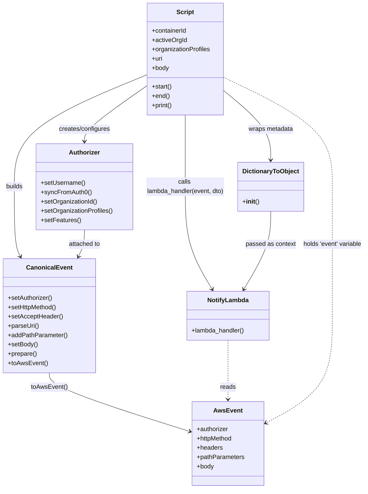

# Diagram: tools/ide_local_testing/localTest/test/byUrl/notificationService.py

> Auto-generated by Obscura crawlers

## Mermaid

### SVG

<svg id="container" width="938.490234375" xmlns="http://www.w3.org/2000/svg" class="classDiagram" height="1258" viewBox="0 0 938.490234375 1258" role="graphics-document document" aria-roledescription="class"><g><defs><marker id="container_class-aggregationStart" class="marker aggregation class" refX="18" refY="7" markerWidth="190" markerHeight="240" orient="auto"><path d="M 18,7 L9,13 L1,7 L9,1 Z"></path></marker></defs><defs><marker id="container_class-aggregationEnd" class="marker aggregation class" refX="1" refY="7" markerWidth="20" markerHeight="28" orient="auto"><path d="M 18,7 L9,13 L1,7 L9,1 Z"></path></marker></defs><defs><marker id="container_class-extensionStart" class="marker extension class" refX="18" refY="7" markerWidth="190" markerHeight="240" orient="auto"><path d="M 1,7 L18,13 V 1 Z"></path></marker></defs><defs><marker id="container_class-extensionEnd" class="marker extension class" refX="1" refY="7" markerWidth="20" markerHeight="28" orient="auto"><path d="M 1,1 V 13 L18,7 Z"></path></marker></defs><defs><marker id="container_class-compositionStart" class="marker composition class" refX="18" refY="7" markerWidth="190" markerHeight="240" orient="auto"><path d="M 18,7 L9,13 L1,7 L9,1 Z"></path></marker></defs><defs><marker id="container_class-compositionEnd" class="marker composition class" refX="1" refY="7" markerWidth="20" markerHeight="28" orient="auto"><path d="M 18,7 L9,13 L1,7 L9,1 Z"></path></marker></defs><defs><marker id="container_class-dependencyStart" class="marker dependency class" refX="6" refY="7" markerWidth="190" markerHeight="240" orient="auto"><path d="M 5,7 L9,13 L1,7 L9,1 Z"></path></marker></defs><defs><marker id="container_class-dependencyEnd" class="marker dependency class" refX="13" refY="7" markerWidth="20" markerHeight="28" orient="auto"><path d="M 18,7 L9,13 L14,7 L9,1 Z"></path></marker></defs><defs><marker id="container_class-lollipopStart" class="marker lollipop class" refX="13" refY="7" markerWidth="190" markerHeight="240" orient="auto"><circle stroke="black" fill="transparent" cx="7" cy="7" r="6"></circle></marker></defs><defs><marker id="container_class-lollipopEnd" class="marker lollipop class" refX="1" refY="7" markerWidth="190" markerHeight="240" orient="auto"><circle stroke="black" fill="transparent" cx="7" cy="7" r="6"></circle></marker></defs><g class="root"><g class="clusters"></g><g class="edgePaths"><path d="M375.408,221.116L348.684,239.763C321.96,258.41,268.512,295.705,241.788,319.519C215.064,343.333,215.064,353.667,215.064,358.833L215.064,364" id="id_Script_Authorizer_1" class="edge-thickness-normal edge-pattern-solid relation" style=";;;" data-edge="true" data-et="edge" data-id="id_Script_Authorizer_1" data-points="W3sieCI6Mzc1LjQwODIwMzEyNSwieSI6MjIxLjExNTUzMzQ2ODg2NTN9LHsieCI6MjE1LjA2NDQ1MzEyNSwieSI6MzMzfSx7IngiOjIxNS4wNjQ0NTMxMjUsInkiOjM3MH1d" marker-end="url(#container_class-dependencyEnd)"></path><path d="M375.408,192.628L318.37,216.023C261.331,239.418,147.255,286.209,90.216,334.271C33.178,382.333,33.178,431.667,33.178,481C33.178,530.333,33.178,579.667,35.783,609.604C38.387,639.54,43.597,650.081,46.202,655.351L48.807,660.621" id="id_Script_CanonicalEvent_2" class="edge-thickness-normal edge-pattern-solid relation" style=";;;" data-edge="true" data-et="edge" data-id="id_Script_CanonicalEvent_2" data-points="W3sieCI6Mzc1LjQwODIwMzEyNSwieSI6MTkyLjYyNzU4NDgwMjc3Nn0seyJ4IjozMy4xNzc3MzQzNzUsInkiOjMzM30seyJ4IjozMy4xNzc3MzQzNzUsInkiOjQ4MX0seyJ4IjozMy4xNzc3MzQzNzUsInkiOjYyOX0seyJ4Ijo1MS40NjUyNTc3Mjc1ODE1MTYsInkiOjY2Nn1d" marker-end="url(#container_class-dependencyEnd)"></path><path d="M573.51,234.577L593.186,250.981C612.863,267.385,652.215,300.192,671.892,329.763C691.568,359.333,691.568,385.667,691.568,398.833L691.568,412" id="id_Script_DictionaryToObject_3" class="edge-thickness-normal edge-pattern-solid relation" style=";;;" data-edge="true" data-et="edge" data-id="id_Script_DictionaryToObject_3" data-points="W3sieCI6NTczLjUwOTc2NTYyNSwieSI6MjM0LjU3Njc3MjIyMDIyMzEyfSx7IngiOjY5MS41NjgzNTkzNzUsInkiOjMzM30seyJ4Ijo2OTEuNTY4MzU5Mzc1LCJ5Ijo0MTh9XQ==" marker-end="url(#container_class-dependencyEnd)"></path><path d="M124.121,960L124.121,966.167C124.121,972.333,124.121,984.667,184.523,1009.919C244.924,1035.171,365.728,1073.342,426.129,1092.428L486.531,1111.514" id="id_CanonicalEvent_AwsEvent_4" class="edge-thickness-normal edge-pattern-solid relation" style=";;;" data-edge="true" data-et="edge" data-id="id_CanonicalEvent_AwsEvent_4" data-points="W3sieCI6MTI0LjEyMTA5Mzc1LCJ5Ijo5NjB9LHsieCI6MTI0LjEyMTA5Mzc1LCJ5Ijo5OTd9LHsieCI6NDkyLjI1MTk1MzEyNSwieSI6MTExMy4zMjEyODU1MzM3MDI0fV0=" marker-end="url(#container_class-dependencyEnd)"></path><path d="M474.459,296L474.459,302.167C474.459,308.333,474.459,320.667,474.459,351.5C474.459,382.333,474.459,431.667,474.459,481C474.459,530.333,474.459,579.667,485.849,623.639C497.238,667.611,520.017,706.222,531.407,725.527L542.797,744.832" id="id_Script_NotifyLambda_5" class="edge-thickness-normal edge-pattern-solid relation" style=";;;" data-edge="true" data-et="edge" data-id="id_Script_NotifyLambda_5" data-points="W3sieCI6NDc0LjQ1ODk4NDM3NSwieSI6Mjk2fSx7IngiOjQ3NC40NTg5ODQzNzUsInkiOjMzM30seyJ4Ijo0NzQuNDU4OTg0Mzc1LCJ5Ijo0ODF9LHsieCI6NDc0LjQ1ODk4NDM3NSwieSI6NjI5fSx7IngiOjU0NS44NDU0OTA4Mjg4MDQ0LCJ5Ijo3NTB9XQ==" marker-end="url(#container_class-dependencyEnd)"></path><path d="M583.014,876L583.014,896.167C583.014,916.333,583.014,956.667,583.014,982C583.014,1007.333,583.014,1017.667,583.014,1022.833L583.014,1028" id="id_NotifyLambda_AwsEvent_6" class="edge-thickness-normal edge-pattern-dashed relation" style=";;;" data-edge="true" data-et="edge" data-id="id_NotifyLambda_AwsEvent_6" data-points="W3sieCI6NTgzLjAxMzY3MTg3NSwieSI6ODc2fSx7IngiOjU4My4wMTM2NzE4NzUsInkiOjk5N30seyJ4Ijo1ODMuMDEzNjcxODc1LCJ5IjoxMDM0fV0=" marker-end="url(#container_class-dependencyEnd)"></path><path d="M215.064,592L215.064,598.167C215.064,604.333,215.064,616.667,212.46,628.104C209.855,639.54,204.645,650.081,202.04,655.351L199.435,660.621" id="id_Authorizer_CanonicalEvent_7" class="edge-thickness-normal edge-pattern-solid relation" style=";;;" data-edge="true" data-et="edge" data-id="id_Authorizer_CanonicalEvent_7" data-points="W3sieCI6MjE1LjA2NDQ1MzEyNSwieSI6NTkyfSx7IngiOjIxNS4wNjQ0NTMxMjUsInkiOjYyOX0seyJ4IjoxOTYuNzc2OTI5NzcyNDE4NSwieSI6NjY2fV0=" marker-end="url(#container_class-dependencyEnd)"></path><path d="M691.568,544L691.568,558.167C691.568,572.333,691.568,600.667,680.179,634.139C668.789,667.611,646.01,706.222,634.62,725.527L623.231,744.832" id="id_DictionaryToObject_NotifyLambda_8" class="edge-thickness-normal edge-pattern-solid relation" style=";;;" data-edge="true" data-et="edge" data-id="id_DictionaryToObject_NotifyLambda_8" data-points="W3sieCI6NjkxLjU2ODM1OTM3NSwieSI6NTQ0fSx7IngiOjY5MS41NjgzNTkzNzUsInkiOjYyOX0seyJ4Ijo2MjAuMTgxODUyOTIxMTk1NiwieSI6NzUwfV0=" marker-end="url(#container_class-dependencyEnd)"></path><path d="M573.51,199.321L620.145,221.601C666.779,243.881,760.049,288.44,806.684,335.387C853.318,382.333,853.318,431.667,853.318,481C853.318,530.333,853.318,579.667,853.318,635C853.318,690.333,853.318,751.667,853.318,813C853.318,874.333,853.318,935.667,824.276,981.913C795.233,1028.159,737.148,1059.318,708.105,1074.897L679.063,1090.476" id="id_Script_AwsEvent_9" class="edge-thickness-normal edge-pattern-dashed relation" style=";;;" data-edge="true" data-et="edge" data-id="id_Script_AwsEvent_9" data-points="W3sieCI6NTczLjUwOTc2NTYyNSwieSI6MTk5LjMyMTQ5MzM4MDYyNDQyfSx7IngiOjg1My4zMTgzNTkzNzUsInkiOjMzM30seyJ4Ijo4NTMuMzE4MzU5Mzc1LCJ5Ijo0ODF9LHsieCI6ODUzLjMxODM1OTM3NSwieSI6NjI5fSx7IngiOjg1My4zMTgzNTkzNzUsInkiOjgxM30seyJ4Ijo4NTMuMzE4MzU5Mzc1LCJ5Ijo5OTd9LHsieCI6NjczLjc3NTM5MDYyNSwieSI6MTA5My4zMTI1Mzc5MzQ2MjI1fV0=" marker-end="url(#container_class-dependencyEnd)"></path></g><g class="edgeLabels"><g class="edgeLabel" transform="translate(215.064453125, 333)"><g class="label" data-id="id_Script_Authorizer_1" transform="translate(-67.234375, -12)"><foreignObject width="134.46875" height="24">

creates/configures

</foreignObject></g></g><g class="edgeLabel" transform="translate(33.177734375, 481)"><g class="label" data-id="id_Script_CanonicalEvent_2" transform="translate(-22.4921875, -12)"><foreignObject width="44.984375" height="24">

builds

</foreignObject></g></g><g class="edgeLabel" transform="translate(691.568359375, 333)"><g class="label" data-id="id_Script_DictionaryToObject_3" transform="translate(-58.2265625, -12)"><foreignObject width="116.453125" height="24">

wraps metadata

</foreignObject></g></g><g class="edgeLabel" transform="translate(124.12109375, 997)"><g class="label" data-id="id_CanonicalEvent_AwsEvent_4" transform="translate(-46.640625, -12)"><foreignObject width="93.28125" height="24">

toAwsEvent()

</foreignObject></g></g><g class="edgeLabel" transform="translate(474.458984375, 481)"><g class="label" data-id="id_Script_NotifyLambda_5" transform="translate(-100, -36)"><foreignObject width="200" height="72">

calls lambda_handler(event, dto)

</foreignObject></g></g><g class="edgeLabel" transform="translate(583.013671875, 997)"><g class="label" data-id="id_NotifyLambda_AwsEvent_6" transform="translate(-20.0078125, -12)"><foreignObject width="40.015625" height="24">

reads

</foreignObject></g></g><g class="edgeLabel" transform="translate(215.064453125, 629)"><g class="label" data-id="id_Authorizer_CanonicalEvent_7" transform="translate(-41.640625, -12)"><foreignObject width="83.28125" height="24">

attached to

</foreignObject></g></g><g class="edgeLabel" transform="translate(691.568359375, 629)"><g class="label" data-id="id_DictionaryToObject_NotifyLambda_8" transform="translate(-64.578125, -12)"><foreignObject width="129.15625" height="24">

passed as context

</foreignObject></g></g><g class="edgeLabel" transform="translate(853.318359375, 629)"><g class="label" data-id="id_Script_AwsEvent_9" transform="translate(-77.171875, -12)"><foreignObject width="154.34375" height="24">

holds 'event' variable

</foreignObject></g></g></g><g class="nodes"><g class="node default" id="classId-Script-0" transform="translate(474.458984375, 152)"><g class="basic label-container"><path d="M-99.05078125 -144 L99.05078125 -144 L99.05078125 144 L-99.05078125 144" stroke="none" stroke-width="0" fill="#ECECFF" style=""></path><path d="M-99.05078125 -144 C-42.343347582749175 -144, 14.36408608450165 -144, 99.05078125 -144 M-99.05078125 -144 C-57.68253826895309 -144, -16.314295287906177 -144, 99.05078125 -144 M99.05078125 -144 C99.05078125 -44.74356155054244, 99.05078125 54.512876898915124, 99.05078125 144 M99.05078125 -144 C99.05078125 -70.91461408692265, 99.05078125 2.1707718261546916, 99.05078125 144 M99.05078125 144 C39.16049746268144 144, -20.729786324637118 144, -99.05078125 144 M99.05078125 144 C24.813495657518487 144, -49.423789934963025 144, -99.05078125 144 M-99.05078125 144 C-99.05078125 79.5367739890584, -99.05078125 15.073547978116807, -99.05078125 -144 M-99.05078125 144 C-99.05078125 41.8488436014288, -99.05078125 -60.302312797142406, -99.05078125 -144" stroke="#9370DB" stroke-width="1.3" fill="none" stroke-dasharray="0 0" style=""></path></g><g class="annotation-group text" transform="translate(0, -120)"></g><g class="label-group text" transform="translate(-21.7421875, -120)"><g class="label" style="font-weight: bolder" transform="translate(0,-12)"><foreignObject width="43.484375" height="24">

Script

</foreignObject></g></g><g class="members-group text" transform="translate(-87.05078125, -72)"><g class="label" style="" transform="translate(0,-12)"><foreignObject width="91.484375" height="24">

+containerId

</foreignObject></g><g class="label" style="" transform="translate(0,12)"><foreignObject width="90.53125" height="24">

+activeOrgId

</foreignObject></g><g class="label" style="" transform="translate(0,36)"><foreignObject width="152.359375" height="24">

+organizationProfiles

</foreignObject></g><g class="label" style="" transform="translate(0,60)"><foreignObject width="27.984375" height="24">

+uri

</foreignObject></g><g class="label" style="" transform="translate(0,84)"><foreignObject width="44.28125" height="24">

+body

</foreignObject></g></g><g class="methods-group text" transform="translate(-87.05078125, 72)"><g class="label" style="" transform="translate(0,-12)"><foreignObject width="52.15625" height="24">

+start()

</foreignObject></g><g class="label" style="" transform="translate(0,12)"><foreignObject width="46.03125" height="24">

+end()

</foreignObject></g><g class="label" style="" transform="translate(0,36)"><foreignObject width="53.703125" height="24">

+print()

</foreignObject></g></g><g class="divider" style=""><path d="M-99.05078125 -96 C-51.69905131109435 -96, -4.347321372188702 -96, 99.05078125 -96 M-99.05078125 -96 C-50.27276075177822 -96, -1.4947402535564436 -96, 99.05078125 -96" stroke="#9370DB" stroke-width="1.3" fill="none" stroke-dasharray="0 0" style=""></path></g><g class="divider" style=""><path d="M-99.05078125 48 C-27.739524253715572 48, 43.571732742568855 48, 99.05078125 48 M-99.05078125 48 C-23.116918434395643 48, 52.816944381208714 48, 99.05078125 48" stroke="#9370DB" stroke-width="1.3" fill="none" stroke-dasharray="0 0" style=""></path></g></g><g class="node default" id="classId-Authorizer-1" transform="translate(215.064453125, 481)"><g class="basic label-container"><path d="M-124.39453125 -111 L124.39453125 -111 L124.39453125 111 L-124.39453125 111" stroke="none" stroke-width="0" fill="#ECECFF" style=""></path><path d="M-124.39453125 -111 C-69.54406891851218 -111, -14.693606587024362 -111, 124.39453125 -111 M-124.39453125 -111 C-35.013474017097266 -111, 54.36758321580547 -111, 124.39453125 -111 M124.39453125 -111 C124.39453125 -55.24889795956863, 124.39453125 0.5022040808627395, 124.39453125 111 M124.39453125 -111 C124.39453125 -58.967214278042555, 124.39453125 -6.934428556085109, 124.39453125 111 M124.39453125 111 C67.37482619106419 111, 10.35512113212836 111, -124.39453125 111 M124.39453125 111 C64.82133174723862 111, 5.248132244477247 111, -124.39453125 111 M-124.39453125 111 C-124.39453125 60.799732141995555, -124.39453125 10.59946428399111, -124.39453125 -111 M-124.39453125 111 C-124.39453125 59.386491759014454, -124.39453125 7.772983518028909, -124.39453125 -111" stroke="#9370DB" stroke-width="1.3" fill="none" stroke-dasharray="0 0" style=""></path></g><g class="annotation-group text" transform="translate(0, -87)"></g><g class="label-group text" transform="translate(-38.3671875, -87)"><g class="label" style="font-weight: bolder" transform="translate(0,-12)"><foreignObject width="76.734375" height="24">

Authorizer

</foreignObject></g></g><g class="members-group text" transform="translate(-112.39453125, -39)"></g><g class="methods-group text" transform="translate(-112.39453125, -9)"><g class="label" style="" transform="translate(0,-12)"><foreignObject width="113.71875" height="24">

+setUsername()

</foreignObject></g><g class="label" style="" transform="translate(0,12)"><foreignObject width="129.0625" height="24">

+syncFromAuth0()

</foreignObject></g><g class="label" style="" transform="translate(0,36)"><foreignObject width="146.703125" height="24">

+setOrganizationId()

</foreignObject></g><g class="label" style="" transform="translate(0,60)"><foreignObject width="186.421875" height="24">

+setOrganizationProfiles()

</foreignObject></g><g class="label" style="" transform="translate(0,84)"><foreignObject width="101.859375" height="24">

+setFeatures()

</foreignObject></g></g><g class="divider" style=""><path d="M-124.39453125 -63 C-30.262210092473197 -63, 63.87011106505361 -63, 124.39453125 -63 M-124.39453125 -63 C-38.475224075542215 -63, 47.44408309891557 -63, 124.39453125 -63" stroke="#9370DB" stroke-width="1.3" fill="none" stroke-dasharray="0 0" style=""></path></g><g class="divider" style=""><path d="M-124.39453125 -39 C-31.885268709255115 -39, 60.62399383148977 -39, 124.39453125 -39 M-124.39453125 -39 C-32.16637318848126 -39, 60.06178487303748 -39, 124.39453125 -39" stroke="#9370DB" stroke-width="1.3" fill="none" stroke-dasharray="0 0" style=""></path></g></g><g class="node default" id="classId-CanonicalEvent-2" transform="translate(124.12109375, 813)"><g class="basic label-container"><path d="M-116.12109375 -147 L116.12109375 -147 L116.12109375 147 L-116.12109375 147" stroke="none" stroke-width="0" fill="#ECECFF" style=""></path><path d="M-116.12109375 -147 C-58.13888011419154 -147, -0.15666647838307313 -147, 116.12109375 -147 M-116.12109375 -147 C-68.14894981754846 -147, -20.17680588509691 -147, 116.12109375 -147 M116.12109375 -147 C116.12109375 -77.57219222645199, 116.12109375 -8.144384452903978, 116.12109375 147 M116.12109375 -147 C116.12109375 -53.68784147602534, 116.12109375 39.62431704794932, 116.12109375 147 M116.12109375 147 C56.697783305586704 147, -2.7255271388265925 147, -116.12109375 147 M116.12109375 147 C44.32371758225554 147, -27.47365858548892 147, -116.12109375 147 M-116.12109375 147 C-116.12109375 66.66231243814661, -116.12109375 -13.675375123706772, -116.12109375 -147 M-116.12109375 147 C-116.12109375 33.09835070137942, -116.12109375 -80.80329859724117, -116.12109375 -147" stroke="#9370DB" stroke-width="1.3" fill="none" stroke-dasharray="0 0" style=""></path></g><g class="annotation-group text" transform="translate(0, -123)"></g><g class="label-group text" transform="translate(-55.7109375, -123)"><g class="label" style="font-weight: bolder" transform="translate(0,-12)"><foreignObject width="111.421875" height="24">

CanonicalEvent

</foreignObject></g></g><g class="members-group text" transform="translate(-104.12109375, -75)"></g><g class="methods-group text" transform="translate(-104.12109375, -45)"><g class="label" style="" transform="translate(0,-12)"><foreignObject width="115.765625" height="24">

+setAuthorizer()

</foreignObject></g><g class="label" style="" transform="translate(0,12)"><foreignObject width="127.5" height="24">

+setHttpMethod()

</foreignObject></g><g class="label" style="" transform="translate(0,36)"><foreignObject width="140.765625" height="24">

+setAcceptHeader()

</foreignObject></g><g class="label" style="" transform="translate(0,60)"><foreignObject width="79.8125" height="24">

+parseUri()

</foreignObject></g><g class="label" style="" transform="translate(0,84)"><foreignObject width="152.53125" height="24">

+addPathParameter()

</foreignObject></g><g class="label" style="" transform="translate(0,108)"><foreignObject width="76.84375" height="24">

+setBody()

</foreignObject></g><g class="label" style="" transform="translate(0,132)"><foreignObject width="74.75" height="24">

+prepare()

</foreignObject></g><g class="label" style="" transform="translate(0,156)"><foreignObject width="101.1875" height="24">

+toAwsEvent()

</foreignObject></g></g><g class="divider" style=""><path d="M-116.12109375 -99 C-38.99843496524835 -99, 38.1242238195033 -99, 116.12109375 -99 M-116.12109375 -99 C-56.346639485662294 -99, 3.427814778675412 -99, 116.12109375 -99" stroke="#9370DB" stroke-width="1.3" fill="none" stroke-dasharray="0 0" style=""></path></g><g class="divider" style=""><path d="M-116.12109375 -75 C-36.58729892036996 -75, 42.94649590926008 -75, 116.12109375 -75 M-116.12109375 -75 C-35.20664605819475 -75, 45.7078016336105 -75, 116.12109375 -75" stroke="#9370DB" stroke-width="1.3" fill="none" stroke-dasharray="0 0" style=""></path></g></g><g class="node default" id="classId-DictionaryToObject-3" transform="translate(691.568359375, 481)"><g class="basic label-container"><path d="M-82.109375 -63 L82.109375 -63 L82.109375 63 L-82.109375 63" stroke="none" stroke-width="0" fill="#ECECFF" style=""></path><path d="M-82.109375 -63 C-43.16004850856806 -63, -4.210722017136121 -63, 82.109375 -63 M-82.109375 -63 C-39.38972077066725 -63, 3.3299334586654936 -63, 82.109375 -63 M82.109375 -63 C82.109375 -20.99761872630331, 82.109375 21.004762547393383, 82.109375 63 M82.109375 -63 C82.109375 -13.141283155191843, 82.109375 36.717433689616314, 82.109375 63 M82.109375 63 C45.35447616746371 63, 8.599577334927417 63, -82.109375 63 M82.109375 63 C23.86296033030665 63, -34.3834543393867 63, -82.109375 63 M-82.109375 63 C-82.109375 16.087302573427117, -82.109375 -30.825394853145767, -82.109375 -63 M-82.109375 63 C-82.109375 37.42415296700223, -82.109375 11.848305934004458, -82.109375 -63" stroke="#9370DB" stroke-width="1.3" fill="none" stroke-dasharray="0 0" style=""></path></g><g class="annotation-group text" transform="translate(0, -39)"></g><g class="label-group text" transform="translate(-70.109375, -39)"><g class="label" style="font-weight: bolder" transform="translate(0,-12)"><foreignObject width="140.21875" height="24">

DictionaryToObject

</foreignObject></g></g><g class="members-group text" transform="translate(-70.109375, 9)"></g><g class="methods-group text" transform="translate(-70.109375, 39)"><g class="label" style="" transform="translate(0,-12)"><foreignObject width="42.796875" height="24">

+<strong>init</strong>()

</foreignObject></g></g><g class="divider" style=""><path d="M-82.109375 -15 C-45.914561978343805 -15, -9.71974895668761 -15, 82.109375 -15 M-82.109375 -15 C-37.21511707068029 -15, 7.679140858639414 -15, 82.109375 -15" stroke="#9370DB" stroke-width="1.3" fill="none" stroke-dasharray="0 0" style=""></path></g><g class="divider" style=""><path d="M-82.109375 9 C-31.677986400639426 9, 18.753402198721147 9, 82.109375 9 M-82.109375 9 C-33.411531367736075 9, 15.28631226452785 9, 82.109375 9" stroke="#9370DB" stroke-width="1.3" fill="none" stroke-dasharray="0 0" style=""></path></g></g><g class="node default" id="classId-NotifyLambda-4" transform="translate(583.013671875, 813)"><g class="basic label-container"><path d="M-106.73046875 -63 L106.73046875 -63 L106.73046875 63 L-106.73046875 63" stroke="none" stroke-width="0" fill="#ECECFF" style=""></path><path d="M-106.73046875 -63 C-29.673949358270463 -63, 47.382570033459075 -63, 106.73046875 -63 M-106.73046875 -63 C-27.96392263635512 -63, 50.80262347728976 -63, 106.73046875 -63 M106.73046875 -63 C106.73046875 -34.76440246334579, 106.73046875 -6.528804926691571, 106.73046875 63 M106.73046875 -63 C106.73046875 -15.448115763280974, 106.73046875 32.10376847343805, 106.73046875 63 M106.73046875 63 C25.315780047604193 63, -56.098908654791614 63, -106.73046875 63 M106.73046875 63 C37.691045139563585 63, -31.34837847087283 63, -106.73046875 63 M-106.73046875 63 C-106.73046875 13.005140631420907, -106.73046875 -36.989718737158185, -106.73046875 -63 M-106.73046875 63 C-106.73046875 25.95109249856828, -106.73046875 -11.097815002863442, -106.73046875 -63" stroke="#9370DB" stroke-width="1.3" fill="none" stroke-dasharray="0 0" style=""></path></g><g class="annotation-group text" transform="translate(0, -39)"></g><g class="label-group text" transform="translate(-51.4453125, -39)"><g class="label" style="font-weight: bolder" transform="translate(0,-12)"><foreignObject width="102.890625" height="24">

NotifyLambda

</foreignObject></g></g><g class="members-group text" transform="translate(-94.73046875, 9)"></g><g class="methods-group text" transform="translate(-94.73046875, 39)"><g class="label" style="" transform="translate(0,-12)"><foreignObject width="138.015625" height="24">

+lambda_handler()

</foreignObject></g></g><g class="divider" style=""><path d="M-106.73046875 -15 C-59.9115636564375 -15, -13.092658562875002 -15, 106.73046875 -15 M-106.73046875 -15 C-47.91071981023621 -15, 10.909029129527582 -15, 106.73046875 -15" stroke="#9370DB" stroke-width="1.3" fill="none" stroke-dasharray="0 0" style=""></path></g><g class="divider" style=""><path d="M-106.73046875 9 C-53.05590121404646 9, 0.6186663219070851 9, 106.73046875 9 M-106.73046875 9 C-50.672582943347585 9, 5.38530286330483 9, 106.73046875 9" stroke="#9370DB" stroke-width="1.3" fill="none" stroke-dasharray="0 0" style=""></path></g></g><g class="node default" id="classId-AwsEvent-5" transform="translate(583.013671875, 1142)"><g class="basic label-container"><path d="M-90.76171875 -108 L90.76171875 -108 L90.76171875 108 L-90.76171875 108" stroke="none" stroke-width="0" fill="#ECECFF" style=""></path><path d="M-90.76171875 -108 C-36.62196288317439 -108, 17.51779298365122 -108, 90.76171875 -108 M-90.76171875 -108 C-45.69209602161862 -108, -0.6224732932372348 -108, 90.76171875 -108 M90.76171875 -108 C90.76171875 -28.92673569763484, 90.76171875 50.14652860473032, 90.76171875 108 M90.76171875 -108 C90.76171875 -49.24033488182733, 90.76171875 9.51933023634534, 90.76171875 108 M90.76171875 108 C36.919497336492825 108, -16.92272407701435 108, -90.76171875 108 M90.76171875 108 C22.003026171313593 108, -46.755666407372814 108, -90.76171875 108 M-90.76171875 108 C-90.76171875 38.40059873025152, -90.76171875 -31.198802539496967, -90.76171875 -108 M-90.76171875 108 C-90.76171875 22.340054220831277, -90.76171875 -63.319891558337446, -90.76171875 -108" stroke="#9370DB" stroke-width="1.3" fill="none" stroke-dasharray="0 0" style=""></path></g><g class="annotation-group text" transform="translate(0, -84)"></g><g class="label-group text" transform="translate(-34.7890625, -84)"><g class="label" style="font-weight: bolder" transform="translate(0,-12)"><foreignObject width="69.578125" height="24">

AwsEvent

</foreignObject></g></g><g class="members-group text" transform="translate(-78.76171875, -36)"><g class="label" style="" transform="translate(0,-12)"><foreignObject width="82.734375" height="24">

+authorizer

</foreignObject></g><g class="label" style="" transform="translate(0,12)"><foreignObject width="93.65625" height="24">

+httpMethod

</foreignObject></g><g class="label" style="" transform="translate(0,36)"><foreignObject width="66.328125" height="24">

+headers

</foreignObject></g><g class="label" style="" transform="translate(0,60)"><foreignObject width="122.734375" height="24">

+pathParameters

</foreignObject></g><g class="label" style="" transform="translate(0,84)"><foreignObject width="44.28125" height="24">

+body

</foreignObject></g></g><g class="methods-group text" transform="translate(-78.76171875, 108)"></g><g class="divider" style=""><path d="M-90.76171875 -60 C-36.14331684190407 -60, 18.475085066191866 -60, 90.76171875 -60 M-90.76171875 -60 C-25.044813222932575 -60, 40.67209230413485 -60, 90.76171875 -60" stroke="#9370DB" stroke-width="1.3" fill="none" stroke-dasharray="0 0" style=""></path></g><g class="divider" style=""><path d="M-90.76171875 84 C-47.98431168909085 84, -5.206904628181704 84, 90.76171875 84 M-90.76171875 84 C-48.36884463796786 84, -5.975970525935722 84, 90.76171875 84" stroke="#9370DB" stroke-width="1.3" fill="none" stroke-dasharray="0 0" style=""></path></g></g></g></g></g></svg>
