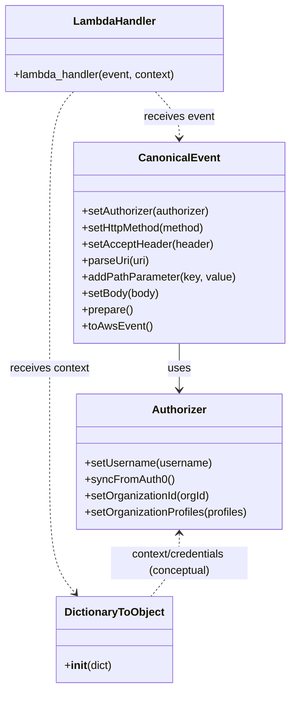

# Diagram: tools/ide_local_testing/localTest/test/byUrl/partViewUpdatePartActuals.py


> Auto-generated by Obscura crawlers

## Diagram 1

```mermaid
flowchart TD
    Start([Start]) --> InitAuthorizer[/"Create Authorizer instance"/]
    InitAuthorizer --> SetUser[/"setUsername(\"dave.damon@freightverify.com\")"/]
    SetUser --> SyncAuth0[/"syncFromAuth0()"/]
    SyncAuth0 --> ConfigureOrg{activeOrgId present?}
    ConfigureOrg -->|yes| SetOrg["setOrganizationId(activeOrgId)"]
    ConfigureOrg -->|yes| SetProfiles["setOrganizationProfiles(organizationProfiles)"]
    SetOrg --> BuildEvent["Build CanonicalEvent:\nsetAuthorizer → setHttpMethod → setAcceptHeader\nparseUri → addPathParameter(s) → setBody → prepare → toAwsEvent"]
    SetProfiles --> BuildEvent
    BuildEvent --> CallLambda["Invoke lambdaHandler(event, context)"]
    CallLambda --> MeasureTime["Record start/end time"]
    CallLambda --> HandleResponse{retval contains body?}
    HandleResponse -->|yes| ParseBody["json.loads(retval.body) → pretty JSON"]
    HandleResponse -->|no| EmptyBody["prettyRetval = \"\""]
    ParseBody --> PrintOutput["print(prettyRetval)"]
    EmptyBody --> PrintOutput
    MeasureTime --> PrintTime["print(lambda execution time)"]
    PrintOutput --> PrintTime
    PrintTime --> End([End])
```

> SVG rendering failed for this diagram.

## Diagram 2



### SVG

<svg id="container" width="422.205078125" xmlns="http://www.w3.org/2000/svg" class="classDiagram" height="1006" viewBox="0 0 422.205078125 1006" role="graphics-document document" aria-roledescription="class"><style>#container{font-family:"trebuchet ms",verdana,arial,sans-serif;font-size:16px;fill:#333;}@keyframes edge-animation-frame{from{stroke-dashoffset:0;}}@keyframes dash{to{stroke-dashoffset:0;}}#container .edge-animation-slow{stroke-dasharray:9,5!important;stroke-dashoffset:900;animation:dash 50s linear infinite;stroke-linecap:round;}#container .edge-animation-fast{stroke-dasharray:9,5!important;stroke-dashoffset:900;animation:dash 20s linear infinite;stroke-linecap:round;}#container .error-icon{fill:#552222;}#container .error-text{fill:#552222;stroke:#552222;}#container .edge-thickness-normal{stroke-width:1px;}#container .edge-thickness-thick{stroke-width:3.5px;}#container .edge-pattern-solid{stroke-dasharray:0;}#container .edge-thickness-invisible{stroke-width:0;fill:none;}#container .edge-pattern-dashed{stroke-dasharray:3;}#container .edge-pattern-dotted{stroke-dasharray:2;}#container .marker{fill:#333333;stroke:#333333;}#container .marker.cross{stroke:#333333;}#container svg{font-family:"trebuchet ms",verdana,arial,sans-serif;font-size:16px;}#container p{margin:0;}#container g.classGroup text{fill:#9370DB;stroke:none;font-family:"trebuchet ms",verdana,arial,sans-serif;font-size:10px;}#container g.classGroup text .title{font-weight:bolder;}#container .nodeLabel,#container .edgeLabel{color:#131300;}#container .edgeLabel .label rect{fill:#ECECFF;}#container .label text{fill:#131300;}#container .labelBkg{background:#ECECFF;}#container .edgeLabel .label span{background:#ECECFF;}#container .classTitle{font-weight:bolder;}#container .node rect,#container .node circle,#container .node ellipse,#container .node polygon,#container .node path{fill:#ECECFF;stroke:#9370DB;stroke-width:1px;}#container .divider{stroke:#9370DB;stroke-width:1;}#container g.clickable{cursor:pointer;}#container g.classGroup rect{fill:#ECECFF;stroke:#9370DB;}#container g.classGroup line{stroke:#9370DB;stroke-width:1;}#container .classLabel .box{stroke:none;stroke-width:0;fill:#ECECFF;opacity:0.5;}#container .classLabel .label{fill:#9370DB;font-size:10px;}#container .relation{stroke:#333333;stroke-width:1;fill:none;}#container .dashed-line{stroke-dasharray:3;}#container .dotted-line{stroke-dasharray:1 2;}#container #compositionStart,#container .composition{fill:#333333!important;stroke:#333333!important;stroke-width:1;}#container #compositionEnd,#container .composition{fill:#333333!important;stroke:#333333!important;stroke-width:1;}#container #dependencyStart,#container .dependency{fill:#333333!important;stroke:#333333!important;stroke-width:1;}#container #dependencyStart,#container .dependency{fill:#333333!important;stroke:#333333!important;stroke-width:1;}#container #extensionStart,#container .extension{fill:transparent!important;stroke:#333333!important;stroke-width:1;}#container #extensionEnd,#container .extension{fill:transparent!important;stroke:#333333!important;stroke-width:1;}#container #aggregationStart,#container .aggregation{fill:transparent!important;stroke:#333333!important;stroke-width:1;}#container #aggregationEnd,#container .aggregation{fill:transparent!important;stroke:#333333!important;stroke-width:1;}#container #lollipopStart,#container .lollipop{fill:#ECECFF!important;stroke:#333333!important;stroke-width:1;}#container #lollipopEnd,#container .lollipop{fill:#ECECFF!important;stroke:#333333!important;stroke-width:1;}#container .edgeTerminals{font-size:11px;line-height:initial;}#container .classTitleText{text-anchor:middle;font-size:18px;fill:#333;}#container .label-icon{display:inline-block;height:1em;overflow:visible;vertical-align:-0.125em;}#container .node .label-icon path{fill:currentColor;stroke:revert;stroke-width:revert;}#container :root{--mermaid-font-family:"trebuchet ms",verdana,arial,sans-serif;}</style><g><defs><marker id="container_class-aggregationStart" class="marker aggregation class" refX="18" refY="7" markerWidth="190" markerHeight="240" orient="auto"><path d="M 18,7 L9,13 L1,7 L9,1 Z"></path></marker></defs><defs><marker id="container_class-aggregationEnd" class="marker aggregation class" refX="1" refY="7" markerWidth="20" markerHeight="28" orient="auto"><path d="M 18,7 L9,13 L1,7 L9,1 Z"></path></marker></defs><defs><marker id="container_class-extensionStart" class="marker extension class" refX="18" refY="7" markerWidth="190" markerHeight="240" orient="auto"><path d="M 1,7 L18,13 V 1 Z"></path></marker></defs><defs><marker id="container_class-extensionEnd" class="marker extension class" refX="1" refY="7" markerWidth="20" markerHeight="28" orient="auto"><path d="M 1,1 V 13 L18,7 Z"></path></marker></defs><defs><marker id="container_class-compositionStart" class="marker composition class" refX="18" refY="7" markerWidth="190" markerHeight="240" orient="auto"><path d="M 18,7 L9,13 L1,7 L9,1 Z"></path></marker></defs><defs><marker id="container_class-compositionEnd" class="marker composition class" refX="1" refY="7" markerWidth="20" markerHeight="28" orient="auto"><path d="M 18,7 L9,13 L1,7 L9,1 Z"></path></marker></defs><defs><marker id="container_class-dependencyStart" class="marker dependency class" refX="6" refY="7" markerWidth="190" markerHeight="240" orient="auto"><path d="M 5,7 L9,13 L1,7 L9,1 Z"></path></marker></defs><defs><marker id="container_class-dependencyEnd" class="marker dependency class" refX="13" refY="7" markerWidth="20" markerHeight="28" orient="auto"><path d="M 18,7 L9,13 L14,7 L9,1 Z"></path></marker></defs><defs><marker id="container_class-lollipopStart" class="marker lollipop class" refX="13" refY="7" markerWidth="190" markerHeight="240" orient="auto"><circle stroke="black" fill="transparent" cx="7" cy="7" r="6"></circle></marker></defs><defs><marker id="container_class-lollipopEnd" class="marker lollipop class" refX="1" refY="7" markerWidth="190" markerHeight="240" orient="auto"><circle stroke="black" fill="transparent" cx="7" cy="7" r="6"></circle></marker></defs><g class="root"><g class="clusters"></g><g class="edgePaths"><path d="M262.537,502L262.537,508.167C262.537,514.333,262.537,526.667,262.537,538C262.537,549.333,262.537,559.667,262.537,564.833L262.537,570" id="id_CanonicalEvent_Authorizer_1" class="edge-thickness-normal edge-pattern-solid relation" style=";;;" data-edge="true" data-et="edge" data-id="id_CanonicalEvent_Authorizer_1" data-points="W3sieCI6MjYyLjUzNzEwOTM3NSwieSI6NTAyfSx7IngiOjI2Mi41MzcxMDkzNzUsInkiOjUzOX0seyJ4IjoyNjIuNTM3MTA5Mzc1LCJ5Ijo1NzZ9XQ==" marker-end="url(#container_class-dependencyEnd)"></path><path d="M228.004,134L233.759,140.167C239.515,146.333,251.026,158.667,256.782,170C262.537,181.333,262.537,191.667,262.537,196.833L262.537,202" id="id_LambdaHandler_CanonicalEvent_2" class="edge-thickness-normal edge-pattern-dashed relation" style=";;;" data-edge="true" data-et="edge" data-id="id_LambdaHandler_CanonicalEvent_2" data-points="W3sieCI6MjI4LjAwMzUzNTE1NjI1LCJ5IjoxMzR9LHsieCI6MjYyLjUzNzEwOTM3NSwieSI6MTcxfSx7IngiOjI2Mi41MzcxMDkzNzUsInkiOjIwOH1d" marker-end="url(#container_class-dependencyEnd)"></path><path d="M110.403,134L104.647,140.167C98.892,146.333,87.38,158.667,81.625,195.5C75.869,232.333,75.869,293.667,75.869,355C75.869,416.333,75.869,477.667,75.869,531C75.869,584.333,75.869,629.667,75.869,677C75.869,724.333,75.869,773.667,82.035,805.732C88.2,837.797,100.531,852.594,106.696,859.992L112.862,867.391" id="id_LambdaHandler_DictionaryToObject_3" class="edge-thickness-normal edge-pattern-dashed relation" style=";;;" data-edge="true" data-et="edge" data-id="id_LambdaHandler_DictionaryToObject_3" data-points="W3sieCI6MTEwLjQwMjcxNDg0Mzc1LCJ5IjoxMzR9LHsieCI6NzUuODY5MTQwNjI1LCJ5IjoxNzF9LHsieCI6NzUuODY5MTQwNjI1LCJ5IjozNTV9LHsieCI6NzUuODY5MTQwNjI1LCJ5Ijo1Mzl9LHsieCI6NzUuODY5MTQwNjI1LCJ5Ijo2NzV9LHsieCI6NzUuODY5MTQwNjI1LCJ5Ijo4MjN9LHsieCI6MTE2LjcwMjc1ODc4OTA2MjUsInkiOjg3Mn1d" marker-end="url(#container_class-dependencyEnd)"></path><path d="M262.537,780L262.537,787.167C262.537,794.333,262.537,808.667,255.732,824C248.926,839.333,235.315,855.667,228.509,863.833L221.703,872" id="id_Authorizer_DictionaryToObject_4" class="edge-thickness-normal edge-pattern-dashed relation" style=";;;" data-edge="true" data-et="edge" data-id="id_Authorizer_DictionaryToObject_4" data-points="W3sieCI6MjYyLjUzNzEwOTM3NSwieSI6Nzc0fSx7IngiOjI2Mi41MzcxMDkzNzUsInkiOjgyM30seyJ4IjoyMjEuNzAzNDkxMjEwOTM3NSwieSI6ODcyfV0=" marker-start="url(#container_class-dependencyStart)"></path></g><g class="edgeLabels"><g class="edgeLabel" transform="translate(262.537109375, 539)"><g class="label" data-id="id_CanonicalEvent_Authorizer_1" transform="translate(-16.4921875, -12)"><foreignObject width="32.984375" height="24"><div xmlns="http://www.w3.org/1999/xhtml" class="labelBkg" style="display: table-cell; white-space: nowrap; line-height: 1.5; max-width: 200px; text-align: center;"><span class="edgeLabel"><p>uses</p></span></div></foreignObject></g></g><g class="edgeLabel" transform="translate(262.537109375, 171)"><g class="label" data-id="id_LambdaHandler_CanonicalEvent_2" transform="translate(-51.78125, -12)"><foreignObject width="103.5625" height="24"><div xmlns="http://www.w3.org/1999/xhtml" class="labelBkg" style="display: table-cell; white-space: nowrap; line-height: 1.5; max-width: 200px; text-align: center;"><span class="edgeLabel"><p>receives event</p></span></div></foreignObject></g></g><g class="edgeLabel" transform="translate(75.869140625, 539)"><g class="label" data-id="id_LambdaHandler_DictionaryToObject_3" transform="translate(-58.4609375, -12)"><foreignObject width="116.921875" height="24"><div xmlns="http://www.w3.org/1999/xhtml" class="labelBkg" style="display: table-cell; white-space: nowrap; line-height: 1.5; max-width: 200px; text-align: center;"><span class="edgeLabel"><p>receives context</p></span></div></foreignObject></g></g><g class="edgeLabel" transform="translate(262.537109375, 823)"><g class="label" data-id="id_Authorizer_DictionaryToObject_4" transform="translate(-100, -24)"><foreignObject width="200" height="48"><div xmlns="http://www.w3.org/1999/xhtml" class="labelBkg" style="display: table; white-space: break-spaces; line-height: 1.5; max-width: 200px; text-align: center; width: 200px;"><span class="edgeLabel"><p>context/credentials (conceptual)</p></span></div></foreignObject></g></g></g><g class="nodes"><g class="node default" id="classId-CanonicalEvent-0" transform="translate(262.537109375, 355)"><g class="basic label-container"><path d="M-151.57421875 -147 L151.57421875 -147 L151.57421875 147 L-151.57421875 147" stroke="none" stroke-width="0" fill="#ECECFF" style=""></path><path d="M-151.57421875 -147 C-84.01660284730235 -147, -16.458986944604703 -147, 151.57421875 -147 M-151.57421875 -147 C-51.62775763864434 -147, 48.31870347271132 -147, 151.57421875 -147 M151.57421875 -147 C151.57421875 -67.60937794855315, 151.57421875 11.781244102893709, 151.57421875 147 M151.57421875 -147 C151.57421875 -59.81166682442327, 151.57421875 27.37666635115346, 151.57421875 147 M151.57421875 147 C59.39003492042758 147, -32.79414890914484 147, -151.57421875 147 M151.57421875 147 C68.53520108694588 147, -14.50381657610825 147, -151.57421875 147 M-151.57421875 147 C-151.57421875 43.816718053833725, -151.57421875 -59.36656389233255, -151.57421875 -147 M-151.57421875 147 C-151.57421875 86.36827463701795, -151.57421875 25.736549274035895, -151.57421875 -147" stroke="#9370DB" stroke-width="1.3" fill="none" stroke-dasharray="0 0" style=""></path></g><g class="annotation-group text" transform="translate(0, -123)"></g><g class="label-group text" transform="translate(-55.7109375, -123)"><g class="label" style="font-weight: bolder" transform="translate(0,-12)"><foreignObject width="111.421875" height="24"><div xmlns="http://www.w3.org/1999/xhtml" style="display: table-cell; white-space: nowrap; line-height: 1.5; max-width: 161px; text-align: center;"><span class="nodeLabel markdown-node-label" style=""><p>CanonicalEvent</p></span></div></foreignObject></g></g><g class="members-group text" transform="translate(-139.57421875, -75)"></g><g class="methods-group text" transform="translate(-139.57421875, -45)"><g class="label" style="" transform="translate(0,-12)"><foreignObject width="190.75" height="24"><div xmlns="http://www.w3.org/1999/xhtml" style="display: table-cell; white-space: nowrap; line-height: 1.5; max-width: 248px; text-align: center;"><span class="nodeLabel markdown-node-label" style=""><p>+setAuthorizer(authorizer)</p></span></div></foreignObject></g><g class="label" style="" transform="translate(0,12)"><foreignObject width="184" height="24"><div xmlns="http://www.w3.org/1999/xhtml" style="display: table-cell; white-space: nowrap; line-height: 1.5; max-width: 241px; text-align: center;"><span class="nodeLabel markdown-node-label" style=""><p>+setHttpMethod(method)</p></span></div></foreignObject></g><g class="label" style="" transform="translate(0,36)"><foreignObject width="191.859375" height="24"><div xmlns="http://www.w3.org/1999/xhtml" style="display: table-cell; white-space: nowrap; line-height: 1.5; max-width: 249px; text-align: center;"><span class="nodeLabel markdown-node-label" style=""><p>+setAcceptHeader(header)</p></span></div></foreignObject></g><g class="label" style="" transform="translate(0,60)"><foreignObject width="99.8125" height="24"><div xmlns="http://www.w3.org/1999/xhtml" style="display: table-cell; white-space: nowrap; line-height: 1.5; max-width: 157px; text-align: center;"><span class="nodeLabel markdown-node-label" style=""><p>+parseUri(uri)</p></span></div></foreignObject></g><g class="label" style="" transform="translate(0,84)"><foreignObject width="223.4375" height="24"><div xmlns="http://www.w3.org/1999/xhtml" style="display: table-cell; white-space: nowrap; line-height: 1.5; max-width: 281px; text-align: center;"><span class="nodeLabel markdown-node-label" style=""><p>+addPathParameter(key, value)</p></span></div></foreignObject></g><g class="label" style="" transform="translate(0,108)"><foreignObject width="113.125" height="24"><div xmlns="http://www.w3.org/1999/xhtml" style="display: table-cell; white-space: nowrap; line-height: 1.5; max-width: 170px; text-align: center;"><span class="nodeLabel markdown-node-label" style=""><p>+setBody(body)</p></span></div></foreignObject></g><g class="label" style="" transform="translate(0,132)"><foreignObject width="74.75" height="24"><div xmlns="http://www.w3.org/1999/xhtml" style="display: table-cell; white-space: nowrap; line-height: 1.5; max-width: 132px; text-align: center;"><span class="nodeLabel markdown-node-label" style=""><p>+prepare()</p></span></div></foreignObject></g><g class="label" style="" transform="translate(0,156)"><foreignObject width="101.1875" height="24"><div xmlns="http://www.w3.org/1999/xhtml" style="display: table-cell; white-space: nowrap; line-height: 1.5; max-width: 159px; text-align: center;"><span class="nodeLabel markdown-node-label" style=""><p>+toAwsEvent()</p></span></div></foreignObject></g></g><g class="divider" style=""><path d="M-151.57421875 -99 C-78.24289931858975 -99, -4.911579887179499 -99, 151.57421875 -99 M-151.57421875 -99 C-47.91456652347591 -99, 55.745085703048176 -99, 151.57421875 -99" stroke="#9370DB" stroke-width="1.3" fill="none" stroke-dasharray="0 0" style=""></path></g><g class="divider" style=""><path d="M-151.57421875 -75 C-78.02846451405964 -75, -4.482710278119271 -75, 151.57421875 -75 M-151.57421875 -75 C-80.54782637445857 -75, -9.521433998917132 -75, 151.57421875 -75" stroke="#9370DB" stroke-width="1.3" fill="none" stroke-dasharray="0 0" style=""></path></g></g><g class="node default" id="classId-Authorizer-1" transform="translate(262.537109375, 675)"><g class="basic label-container"><path d="M-151.66796875 -99 L151.66796875 -99 L151.66796875 99 L-151.66796875 99" stroke="none" stroke-width="0" fill="#ECECFF" style=""></path><path d="M-151.66796875 -99 C-67.41299565264612 -99, 16.841977444707766 -99, 151.66796875 -99 M-151.66796875 -99 C-34.436203883207924 -99, 82.79556098358415 -99, 151.66796875 -99 M151.66796875 -99 C151.66796875 -39.25793536226358, 151.66796875 20.48412927547284, 151.66796875 99 M151.66796875 -99 C151.66796875 -33.86891542615959, 151.66796875 31.262169147680822, 151.66796875 99 M151.66796875 99 C54.82945593901702 99, -42.00905687196595 99, -151.66796875 99 M151.66796875 99 C82.98002915294126 99, 14.292089555882512 99, -151.66796875 99 M-151.66796875 99 C-151.66796875 40.258442795237336, -151.66796875 -18.483114409525328, -151.66796875 -99 M-151.66796875 99 C-151.66796875 45.54106028614452, -151.66796875 -7.917879427710957, -151.66796875 -99" stroke="#9370DB" stroke-width="1.3" fill="none" stroke-dasharray="0 0" style=""></path></g><g class="annotation-group text" transform="translate(0, -75)"></g><g class="label-group text" transform="translate(-38.3671875, -75)"><g class="label" style="font-weight: bolder" transform="translate(0,-12)"><foreignObject width="76.734375" height="24"><div xmlns="http://www.w3.org/1999/xhtml" style="display: table-cell; white-space: nowrap; line-height: 1.5; max-width: 126px; text-align: center;"><span class="nodeLabel markdown-node-label" style=""><p>Authorizer</p></span></div></foreignObject></g></g><g class="members-group text" transform="translate(-139.66796875, -27)"></g><g class="methods-group text" transform="translate(-139.66796875, 3)"><g class="label" style="" transform="translate(0,-12)"><foreignObject width="185.90625" height="24"><div xmlns="http://www.w3.org/1999/xhtml" style="display: table-cell; white-space: nowrap; line-height: 1.5; max-width: 243px; text-align: center;"><span class="nodeLabel markdown-node-label" style=""><p>+setUsername(username)</p></span></div></foreignObject></g><g class="label" style="" transform="translate(0,12)"><foreignObject width="129.0625" height="24"><div xmlns="http://www.w3.org/1999/xhtml" style="display: table-cell; white-space: nowrap; line-height: 1.5; max-width: 186px; text-align: center;"><span class="nodeLabel markdown-node-label" style=""><p>+syncFromAuth0()</p></span></div></foreignObject></g><g class="label" style="" transform="translate(0,36)"><foreignObject width="184.578125" height="24"><div xmlns="http://www.w3.org/1999/xhtml" style="display: table-cell; white-space: nowrap; line-height: 1.5; max-width: 242px; text-align: center;"><span class="nodeLabel markdown-node-label" style=""><p>+setOrganizationId(orgId)</p></span></div></foreignObject></g><g class="label" style="" transform="translate(0,60)"><foreignObject width="240.96875" height="24"><div xmlns="http://www.w3.org/1999/xhtml" style="display: table-cell; white-space: nowrap; line-height: 1.5; max-width: 298px; text-align: center;"><span class="nodeLabel markdown-node-label" style=""><p>+setOrganizationProfiles(profiles)</p></span></div></foreignObject></g></g><g class="divider" style=""><path d="M-151.66796875 -51 C-38.58850011661248 -51, 74.49096851677504 -51, 151.66796875 -51 M-151.66796875 -51 C-58.188235195966 -51, 35.291498358068 -51, 151.66796875 -51" stroke="#9370DB" stroke-width="1.3" fill="none" stroke-dasharray="0 0" style=""></path></g><g class="divider" style=""><path d="M-151.66796875 -27 C-64.3418124702254 -27, 22.984343809549188 -27, 151.66796875 -27 M-151.66796875 -27 C-38.388295639633895 -27, 74.89137747073221 -27, 151.66796875 -27" stroke="#9370DB" stroke-width="1.3" fill="none" stroke-dasharray="0 0" style=""></path></g></g><g class="node default" id="classId-DictionaryToObject-2" transform="translate(169.203125, 935)"><g class="basic label-container"><path d="M-82.203125 -63 L82.203125 -63 L82.203125 63 L-82.203125 63" stroke="none" stroke-width="0" fill="#ECECFF" style=""></path><path d="M-82.203125 -63 C-17.139158824452508 -63, 47.924807351094984 -63, 82.203125 -63 M-82.203125 -63 C-24.92145893945873 -63, 32.36020712108254 -63, 82.203125 -63 M82.203125 -63 C82.203125 -35.01795059241262, 82.203125 -7.035901184825228, 82.203125 63 M82.203125 -63 C82.203125 -31.518967956865357, 82.203125 -0.037935913730713366, 82.203125 63 M82.203125 63 C48.47638923339251 63, 14.74965346678502 63, -82.203125 63 M82.203125 63 C37.10337594832989 63, -7.996373103340218 63, -82.203125 63 M-82.203125 63 C-82.203125 12.826373178389169, -82.203125 -37.34725364322166, -82.203125 -63 M-82.203125 63 C-82.203125 37.45948230984584, -82.203125 11.918964619691685, -82.203125 -63" stroke="#9370DB" stroke-width="1.3" fill="none" stroke-dasharray="0 0" style=""></path></g><g class="annotation-group text" transform="translate(0, -39)"></g><g class="label-group text" transform="translate(-70.109375, -39)"><g class="label" style="font-weight: bolder" transform="translate(0,-12)"><foreignObject width="140.21875" height="24"><div xmlns="http://www.w3.org/1999/xhtml" style="display: table-cell; white-space: nowrap; line-height: 1.5; max-width: 188px; text-align: center;"><span class="nodeLabel markdown-node-label" style=""><p>DictionaryToObject</p></span></div></foreignObject></g></g><g class="members-group text" transform="translate(-70.203125, 9)"></g><g class="methods-group text" transform="translate(-70.203125, 39)"><g class="label" style="" transform="translate(0,-12)"><foreignObject width="70.296875" height="24"><div xmlns="http://www.w3.org/1999/xhtml" style="display: table-cell; white-space: nowrap; line-height: 1.5; max-width: 159px; text-align: center;"><span class="nodeLabel markdown-node-label" style=""><p>+<strong>init</strong>(dict)</p></span></div></foreignObject></g></g><g class="divider" style=""><path d="M-82.203125 -15 C-27.762480478490424 -15, 26.67816404301915 -15, 82.203125 -15 M-82.203125 -15 C-49.07586244162133 -15, -15.948599883242665 -15, 82.203125 -15" stroke="#9370DB" stroke-width="1.3" fill="none" stroke-dasharray="0 0" style=""></path></g><g class="divider" style=""><path d="M-82.203125 9 C-27.40419155300556 9, 27.39474189398888 9, 82.203125 9 M-82.203125 9 C-18.527995436772663 9, 45.147134126454674 9, 82.203125 9" stroke="#9370DB" stroke-width="1.3" fill="none" stroke-dasharray="0 0" style=""></path></g></g><g class="node default" id="classId-LambdaHandler-3" transform="translate(169.203125, 71)"><g class="basic label-container"><path d="M-161.203125 -63 L161.203125 -63 L161.203125 63 L-161.203125 63" stroke="none" stroke-width="0" fill="#ECECFF" style=""></path><path d="M-161.203125 -63 C-41.85907864950457 -63, 77.48496770099086 -63, 161.203125 -63 M-161.203125 -63 C-57.24128321650889 -63, 46.72055856698222 -63, 161.203125 -63 M161.203125 -63 C161.203125 -23.70803132107269, 161.203125 15.583937357854623, 161.203125 63 M161.203125 -63 C161.203125 -27.576072214554948, 161.203125 7.847855570890104, 161.203125 63 M161.203125 63 C39.333384370752015 63, -82.53635625849597 63, -161.203125 63 M161.203125 63 C90.36944593915486 63, 19.535766878309715 63, -161.203125 63 M-161.203125 63 C-161.203125 22.34201785462681, -161.203125 -18.31596429074638, -161.203125 -63 M-161.203125 63 C-161.203125 28.426234782222004, -161.203125 -6.147530435555993, -161.203125 -63" stroke="#9370DB" stroke-width="1.3" fill="none" stroke-dasharray="0 0" style=""></path></g><g class="annotation-group text" transform="translate(0, -39)"></g><g class="label-group text" transform="translate(-58.21875, -39)"><g class="label" style="font-weight: bolder" transform="translate(0,-12)"><foreignObject width="116.4375" height="24"><div xmlns="http://www.w3.org/1999/xhtml" style="display: table-cell; white-space: nowrap; line-height: 1.5; max-width: 167px; text-align: center;"><span class="nodeLabel markdown-node-label" style=""><p>LambdaHandler</p></span></div></foreignObject></g></g><g class="members-group text" transform="translate(-149.203125, 9)"></g><g class="methods-group text" transform="translate(-149.203125, 39)"><g class="label" style="" transform="translate(0,-12)"><foreignObject width="240.1875" height="24"><div xmlns="http://www.w3.org/1999/xhtml" style="display: table-cell; white-space: nowrap; line-height: 1.5; max-width: 298px; text-align: center;"><span class="nodeLabel markdown-node-label" style=""><p>+lambda_handler(event, context)</p></span></div></foreignObject></g></g><g class="divider" style=""><path d="M-161.203125 -15 C-52.6787517477613 -15, 55.84562150447741 -15, 161.203125 -15 M-161.203125 -15 C-89.80407641905019 -15, -18.40502783810038 -15, 161.203125 -15" stroke="#9370DB" stroke-width="1.3" fill="none" stroke-dasharray="0 0" style=""></path></g><g class="divider" style=""><path d="M-161.203125 9 C-38.09192510300316 9, 85.01927479399367 9, 161.203125 9 M-161.203125 9 C-74.38427196722833 9, 12.434581065543341 9, 161.203125 9" stroke="#9370DB" stroke-width="1.3" fill="none" stroke-dasharray="0 0" style=""></path></g></g></g></g></g></svg>
