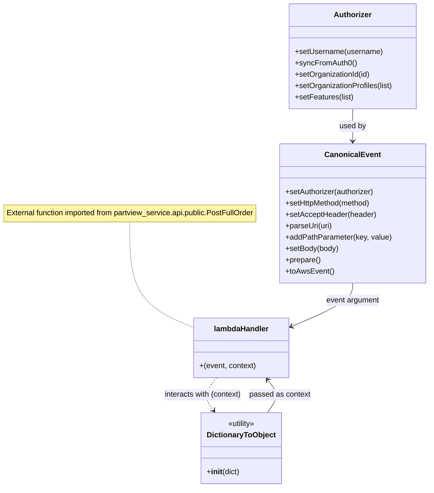

# Diagram: tools/ide_local_testing/localTest/test/byUrl/partviewContainerAsnOrder.py


> Auto-generated by Obscura crawlers

## Diagram 1

```mermaid
flowchart LR
  A[Start script] --> B[Create Authorizer]
  B --> B1[setUsername("dave.damon@freightverify.com")]
  B1 --> B2[syncFromAuth0()]
  B2 --> C{activeOrgId?}
  C -->|true| C1[setOrganizationId(1004)]
  C1 --> C2[setOrganizationProfiles(["SH","FV"])]
  C2 --> C3[setFeatures(["PartView"])]
  C3 --> D[Build URI: https://data.freightverify.com/partview/app/asn-order]
  D --> E[Create CanonicalEvent]
  E --> E1[setAuthorizer(authorizer)]
  E1 --> E2[setHttpMethod("POST")]
  E2 --> E3[setAcceptHeader("application/json")]
  E3 --> E4[parseUri(uri) & addPathParameters(type, containerId)]
  E4 --> E5[setBody(body) & prepare() -> toAwsEvent()]
  E5 --> F[Call lambdaHandler(event, context)]
  F --> G[Receive retval]
  G --> H{retval.body?}
  H -->|true| H1[json.loads(retval.body) -> prettyRetval]
  H -->|false| H2[prettyRetval = ""]
  H1 --> I[print(prettyRetval)]
  H2 --> I
  I --> J[print Lambda execution time]
  J --> K[End]
```

> SVG rendering failed for this diagram.

## Diagram 2



### SVG

<svg id="container" width="918.6640625" xmlns="http://www.w3.org/2000/svg" class="classDiagram" height="1030" viewBox="0 0 918.6640625 1030" role="graphics-document document" aria-roledescription="class"><style>#container{font-family:"trebuchet ms",verdana,arial,sans-serif;font-size:16px;fill:#333;}@keyframes edge-animation-frame{from{stroke-dashoffset:0;}}@keyframes dash{to{stroke-dashoffset:0;}}#container .edge-animation-slow{stroke-dasharray:9,5!important;stroke-dashoffset:900;animation:dash 50s linear infinite;stroke-linecap:round;}#container .edge-animation-fast{stroke-dasharray:9,5!important;stroke-dashoffset:900;animation:dash 20s linear infinite;stroke-linecap:round;}#container .error-icon{fill:#552222;}#container .error-text{fill:#552222;stroke:#552222;}#container .edge-thickness-normal{stroke-width:1px;}#container .edge-thickness-thick{stroke-width:3.5px;}#container .edge-pattern-solid{stroke-dasharray:0;}#container .edge-thickness-invisible{stroke-width:0;fill:none;}#container .edge-pattern-dashed{stroke-dasharray:3;}#container .edge-pattern-dotted{stroke-dasharray:2;}#container .marker{fill:#333333;stroke:#333333;}#container .marker.cross{stroke:#333333;}#container svg{font-family:"trebuchet ms",verdana,arial,sans-serif;font-size:16px;}#container p{margin:0;}#container g.classGroup text{fill:#9370DB;stroke:none;font-family:"trebuchet ms",verdana,arial,sans-serif;font-size:10px;}#container g.classGroup text .title{font-weight:bolder;}#container .nodeLabel,#container .edgeLabel{color:#131300;}#container .edgeLabel .label rect{fill:#ECECFF;}#container .label text{fill:#131300;}#container .labelBkg{background:#ECECFF;}#container .edgeLabel .label span{background:#ECECFF;}#container .classTitle{font-weight:bolder;}#container .node rect,#container .node circle,#container .node ellipse,#container .node polygon,#container .node path{fill:#ECECFF;stroke:#9370DB;stroke-width:1px;}#container .divider{stroke:#9370DB;stroke-width:1;}#container g.clickable{cursor:pointer;}#container g.classGroup rect{fill:#ECECFF;stroke:#9370DB;}#container g.classGroup line{stroke:#9370DB;stroke-width:1;}#container .classLabel .box{stroke:none;stroke-width:0;fill:#ECECFF;opacity:0.5;}#container .classLabel .label{fill:#9370DB;font-size:10px;}#container .relation{stroke:#333333;stroke-width:1;fill:none;}#container .dashed-line{stroke-dasharray:3;}#container .dotted-line{stroke-dasharray:1 2;}#container #compositionStart,#container .composition{fill:#333333!important;stroke:#333333!important;stroke-width:1;}#container #compositionEnd,#container .composition{fill:#333333!important;stroke:#333333!important;stroke-width:1;}#container #dependencyStart,#container .dependency{fill:#333333!important;stroke:#333333!important;stroke-width:1;}#container #dependencyStart,#container .dependency{fill:#333333!important;stroke:#333333!important;stroke-width:1;}#container #extensionStart,#container .extension{fill:transparent!important;stroke:#333333!important;stroke-width:1;}#container #extensionEnd,#container .extension{fill:transparent!important;stroke:#333333!important;stroke-width:1;}#container #aggregationStart,#container .aggregation{fill:transparent!important;stroke:#333333!important;stroke-width:1;}#container #aggregationEnd,#container .aggregation{fill:transparent!important;stroke:#333333!important;stroke-width:1;}#container #lollipopStart,#container .lollipop{fill:#ECECFF!important;stroke:#333333!important;stroke-width:1;}#container #lollipopEnd,#container .lollipop{fill:#ECECFF!important;stroke:#333333!important;stroke-width:1;}#container .edgeTerminals{font-size:11px;line-height:initial;}#container .classTitleText{text-anchor:middle;font-size:18px;fill:#333;}#container .label-icon{display:inline-block;height:1em;overflow:visible;vertical-align:-0.125em;}#container .node .label-icon path{fill:currentColor;stroke:revert;stroke-width:revert;}#container :root{--mermaid-font-family:"trebuchet ms",verdana,arial,sans-serif;}</style><g><defs><marker id="container_class-aggregationStart" class="marker aggregation class" refX="18" refY="7" markerWidth="190" markerHeight="240" orient="auto"><path d="M 18,7 L9,13 L1,7 L9,1 Z"></path></marker></defs><defs><marker id="container_class-aggregationEnd" class="marker aggregation class" refX="1" refY="7" markerWidth="20" markerHeight="28" orient="auto"><path d="M 18,7 L9,13 L1,7 L9,1 Z"></path></marker></defs><defs><marker id="container_class-extensionStart" class="marker extension class" refX="18" refY="7" markerWidth="190" markerHeight="240" orient="auto"><path d="M 1,7 L18,13 V 1 Z"></path></marker></defs><defs><marker id="container_class-extensionEnd" class="marker extension class" refX="1" refY="7" markerWidth="20" markerHeight="28" orient="auto"><path d="M 1,1 V 13 L18,7 Z"></path></marker></defs><defs><marker id="container_class-compositionStart" class="marker composition class" refX="18" refY="7" markerWidth="190" markerHeight="240" orient="auto"><path d="M 18,7 L9,13 L1,7 L9,1 Z"></path></marker></defs><defs><marker id="container_class-compositionEnd" class="marker composition class" refX="1" refY="7" markerWidth="20" markerHeight="28" orient="auto"><path d="M 18,7 L9,13 L1,7 L9,1 Z"></path></marker></defs><defs><marker id="container_class-dependencyStart" class="marker dependency class" refX="6" refY="7" markerWidth="190" markerHeight="240" orient="auto"><path d="M 5,7 L9,13 L1,7 L9,1 Z"></path></marker></defs><defs><marker id="container_class-dependencyEnd" class="marker dependency class" refX="13" refY="7" markerWidth="20" markerHeight="28" orient="auto"><path d="M 18,7 L9,13 L14,7 L9,1 Z"></path></marker></defs><defs><marker id="container_class-lollipopStart" class="marker lollipop class" refX="13" refY="7" markerWidth="190" markerHeight="240" orient="auto"><circle stroke="black" fill="transparent" cx="7" cy="7" r="6"></circle></marker></defs><defs><marker id="container_class-lollipopEnd" class="marker lollipop class" refX="1" refY="7" markerWidth="190" markerHeight="240" orient="auto"><circle stroke="black" fill="transparent" cx="7" cy="7" r="6"></circle></marker></defs><g class="root"><g class="clusters"></g><g class="edgePaths"><path d="M282.758,469L282.758,496.667C282.758,524.333,282.758,579.667,305.697,616.965C328.636,654.263,374.514,673.526,397.453,683.158L420.393,692.789" id="edgeNote1" class="edge-thickness-normal edge-pattern-dotted relation" style="fill: none;;;fill: none" data-edge="true" data-et="edge" data-id="edgeNote1" data-points="W3sieCI6MjgyLjc1NzgxMjUsInkiOjQ2OX0seyJ4IjoyODIuNzU3ODEyNSwieSI6NjM1fSx7IngiOjQyMC4zOTI1NzgxMjUsInkiOjY5Mi43ODk0MjI3NTM2MjY3fV0="></path><path d="M759.09,230L759.09,236.167C759.09,242.333,759.09,254.667,759.09,266C759.09,277.333,759.09,287.667,759.09,292.833L759.09,298" id="id_Authorizer_CanonicalEvent_1" class="edge-thickness-normal edge-pattern-solid relation" style=";;;" data-edge="true" data-et="edge" data-id="id_Authorizer_CanonicalEvent_1" data-points="W3sieCI6NzU5LjA4OTg0Mzc1LCJ5IjoyMzB9LHsieCI6NzU5LjA4OTg0Mzc1LCJ5IjoyNjd9LHsieCI6NzU5LjA4OTg0Mzc1LCJ5IjozMDR9XQ==" marker-end="url(#container_class-dependencyEnd)"></path><path d="M577.208,872L581.836,865.833C586.463,859.667,595.719,847.333,595.807,835.766C595.895,824.198,586.816,813.395,582.276,807.994L577.736,802.593" id="id_DictionaryToObject_lambdaHandler_2" class="edge-thickness-normal edge-pattern-solid relation" style=";;;" data-edge="true" data-et="edge" data-id="id_DictionaryToObject_lambdaHandler_2" data-points="W3sieCI6NTc3LjIwNzgzMzQyNjMzOTMsInkiOjg3Mn0seyJ4Ijo2MDQuOTc0NjA5Mzc1LCJ5Ijo4MzV9LHsieCI6NTczLjg3NTgyMDMxMjUsInkiOjc5OH1d" marker-end="url(#container_class-dependencyEnd)"></path><path d="M759.09,598L759.09,604.167C759.09,610.333,759.09,622.667,737.073,638.078C715.056,653.489,671.021,671.978,649.004,681.222L626.987,690.467" id="id_CanonicalEvent_lambdaHandler_3" class="edge-thickness-normal edge-pattern-solid relation" style=";;;" data-edge="true" data-et="edge" data-id="id_CanonicalEvent_lambdaHandler_3" data-points="W3sieCI6NzU5LjA4OTg0Mzc1LCJ5Ijo1OTh9LHsieCI6NzU5LjA4OTg0Mzc1LCJ5Ijo2MzV9LHsieCI6NjIxLjQ1NTA3ODEyNSwieSI6NjkyLjc4OTQyMjc1MzYyNjd9XQ==" marker-end="url(#container_class-dependencyEnd)"></path><path d="M467.972,798L462.789,804.167C457.606,810.333,447.239,822.667,446.084,834.2C444.928,845.734,452.983,856.467,457.011,861.834L461.038,867.201" id="id_lambdaHandler_DictionaryToObject_4" class="edge-thickness-normal edge-pattern-dashed relation" style=";;;" data-edge="true" data-et="edge" data-id="id_lambdaHandler_DictionaryToObject_4" data-points="W3sieCI6NDY3Ljk3MTgzNTkzNzUwMDAzLCJ5Ijo3OTh9LHsieCI6NDM2Ljg3MzA0Njg3NSwieSI6ODM1fSx7IngiOjQ2NC42Mzk4MjI4MjM2NjA3LCJ5Ijo4NzJ9XQ==" marker-end="url(#container_class-dependencyEnd)"></path></g><g class="edgeLabels"><g class="edgeLabel"><g class="label" data-id="edgeNote1" transform="translate(0, 0)"><foreignObject width="0" height="0"><div xmlns="http://www.w3.org/1999/xhtml" class="labelBkg" style="display: table-cell; white-space: nowrap; line-height: 1.5; max-width: 200px; text-align: center;"><span class="edgeLabel"></span></div></foreignObject></g></g><g class="edgeLabel" transform="translate(759.08984375, 267)"><g class="label" data-id="id_Authorizer_CanonicalEvent_1" transform="translate(-28.3125, -12)"><foreignObject width="56.625" height="24"><div xmlns="http://www.w3.org/1999/xhtml" class="labelBkg" style="display: table-cell; white-space: nowrap; line-height: 1.5; max-width: 200px; text-align: center;"><span class="edgeLabel"><p>used by</p></span></div></foreignObject></g></g><g class="edgeLabel" transform="translate(604.30754, 834.20635)"><g class="label" data-id="id_DictionaryToObject_lambdaHandler_2" transform="translate(-64.578125, -12)"><foreignObject width="129.15625" height="24"><div xmlns="http://www.w3.org/1999/xhtml" class="labelBkg" style="display: table-cell; white-space: nowrap; line-height: 1.5; max-width: 200px; text-align: center;"><span class="edgeLabel"><p>passed as context</p></span></div></foreignObject></g></g><g class="edgeLabel" transform="translate(759.08984375, 635)"><g class="label" data-id="id_CanonicalEvent_lambdaHandler_3" transform="translate(-57.140625, -12)"><foreignObject width="114.28125" height="24"><div xmlns="http://www.w3.org/1999/xhtml" class="labelBkg" style="display: table-cell; white-space: nowrap; line-height: 1.5; max-width: 200px; text-align: center;"><span class="edgeLabel"><p>event argument</p></span></div></foreignObject></g></g><g class="edgeLabel" transform="translate(437.54012, 834.20635)"><g class="label" data-id="id_lambdaHandler_DictionaryToObject_4" transform="translate(-83.5234375, -12)"><foreignObject width="167.046875" height="24"><div xmlns="http://www.w3.org/1999/xhtml" class="labelBkg" style="display: table-cell; white-space: nowrap; line-height: 1.5; max-width: 200px; text-align: center;"><span class="edgeLabel"><p>interacts with (context)</p></span></div></foreignObject></g></g></g><g class="nodes"><g class="node default" id="classId-Authorizer-0" transform="translate(759.08984375, 119)"><g class="basic label-container"><path d="M-135.62109375 -111 L135.62109375 -111 L135.62109375 111 L-135.62109375 111" stroke="none" stroke-width="0" fill="#ECECFF" style=""></path><path d="M-135.62109375 -111 C-70.6957985861533 -111, -5.770503422306604 -111, 135.62109375 -111 M-135.62109375 -111 C-77.14370311429144 -111, -18.666312478582867 -111, 135.62109375 -111 M135.62109375 -111 C135.62109375 -58.06455363495339, 135.62109375 -5.129107269906783, 135.62109375 111 M135.62109375 -111 C135.62109375 -24.647775178616172, 135.62109375 61.704449642767656, 135.62109375 111 M135.62109375 111 C60.42309615907952 111, -14.77490143184096 111, -135.62109375 111 M135.62109375 111 C49.1906795923327 111, -37.2397345653346 111, -135.62109375 111 M-135.62109375 111 C-135.62109375 47.83404248197929, -135.62109375 -15.331915036041423, -135.62109375 -111 M-135.62109375 111 C-135.62109375 39.270185826952755, -135.62109375 -32.45962834609449, -135.62109375 -111" stroke="#9370DB" stroke-width="1.3" fill="none" stroke-dasharray="0 0" style=""></path></g><g class="annotation-group text" transform="translate(0, -87)"></g><g class="label-group text" transform="translate(-38.3671875, -87)"><g class="label" style="font-weight: bolder" transform="translate(0,-12)"><foreignObject width="76.734375" height="24"><div xmlns="http://www.w3.org/1999/xhtml" style="display: table-cell; white-space: nowrap; line-height: 1.5; max-width: 126px; text-align: center;"><span class="nodeLabel markdown-node-label" style=""><p>Authorizer</p></span></div></foreignObject></g></g><g class="members-group text" transform="translate(-123.62109375, -39)"></g><g class="methods-group text" transform="translate(-123.62109375, -9)"><g class="label" style="" transform="translate(0,-12)"><foreignObject width="185.90625" height="24"><div xmlns="http://www.w3.org/1999/xhtml" style="display: table-cell; white-space: nowrap; line-height: 1.5; max-width: 243px; text-align: center;"><span class="nodeLabel markdown-node-label" style=""><p>+setUsername(username)</p></span></div></foreignObject></g><g class="label" style="" transform="translate(0,12)"><foreignObject width="129.0625" height="24"><div xmlns="http://www.w3.org/1999/xhtml" style="display: table-cell; white-space: nowrap; line-height: 1.5; max-width: 186px; text-align: center;"><span class="nodeLabel markdown-node-label" style=""><p>+syncFromAuth0()</p></span></div></foreignObject></g><g class="label" style="" transform="translate(0,36)"><foreignObject width="160.78125" height="24"><div xmlns="http://www.w3.org/1999/xhtml" style="display: table-cell; white-space: nowrap; line-height: 1.5; max-width: 218px; text-align: center;"><span class="nodeLabel markdown-node-label" style=""><p>+setOrganizationId(id)</p></span></div></foreignObject></g><g class="label" style="" transform="translate(0,60)"><foreignObject width="208.875" height="24"><div xmlns="http://www.w3.org/1999/xhtml" style="display: table-cell; white-space: nowrap; line-height: 1.5; max-width: 266px; text-align: center;"><span class="nodeLabel markdown-node-label" style=""><p>+setOrganizationProfiles(list)</p></span></div></foreignObject></g><g class="label" style="" transform="translate(0,84)"><foreignObject width="124.3125" height="24"><div xmlns="http://www.w3.org/1999/xhtml" style="display: table-cell; white-space: nowrap; line-height: 1.5; max-width: 182px; text-align: center;"><span class="nodeLabel markdown-node-label" style=""><p>+setFeatures(list)</p></span></div></foreignObject></g></g><g class="divider" style=""><path d="M-135.62109375 -63 C-48.859974110215404 -63, 37.90114552956919 -63, 135.62109375 -63 M-135.62109375 -63 C-29.55806473757518 -63, 76.50496427484964 -63, 135.62109375 -63" stroke="#9370DB" stroke-width="1.3" fill="none" stroke-dasharray="0 0" style=""></path></g><g class="divider" style=""><path d="M-135.62109375 -39 C-78.18683979621392 -39, -20.752585842427848 -39, 135.62109375 -39 M-135.62109375 -39 C-39.01115264665137 -39, 57.598788456697264 -39, 135.62109375 -39" stroke="#9370DB" stroke-width="1.3" fill="none" stroke-dasharray="0 0" style=""></path></g></g><g class="node default" id="classId-CanonicalEvent-1" transform="translate(759.08984375, 451)"><g class="basic label-container"><path d="M-151.57421875 -147 L151.57421875 -147 L151.57421875 147 L-151.57421875 147" stroke="none" stroke-width="0" fill="#ECECFF" style=""></path><path d="M-151.57421875 -147 C-69.582635325979 -147, 12.408948098042003 -147, 151.57421875 -147 M-151.57421875 -147 C-53.0313594392085 -147, 45.511499871583 -147, 151.57421875 -147 M151.57421875 -147 C151.57421875 -31.17344534070031, 151.57421875 84.65310931859938, 151.57421875 147 M151.57421875 -147 C151.57421875 -72.37980342258832, 151.57421875 2.2403931548233516, 151.57421875 147 M151.57421875 147 C47.118012845219596 147, -57.33819305956081 147, -151.57421875 147 M151.57421875 147 C41.3389403096313 147, -68.8963381307374 147, -151.57421875 147 M-151.57421875 147 C-151.57421875 60.42957523528631, -151.57421875 -26.140849529427385, -151.57421875 -147 M-151.57421875 147 C-151.57421875 61.71255217886444, -151.57421875 -23.574895642271116, -151.57421875 -147" stroke="#9370DB" stroke-width="1.3" fill="none" stroke-dasharray="0 0" style=""></path></g><g class="annotation-group text" transform="translate(0, -123)"></g><g class="label-group text" transform="translate(-55.7109375, -123)"><g class="label" style="font-weight: bolder" transform="translate(0,-12)"><foreignObject width="111.421875" height="24"><div xmlns="http://www.w3.org/1999/xhtml" style="display: table-cell; white-space: nowrap; line-height: 1.5; max-width: 161px; text-align: center;"><span class="nodeLabel markdown-node-label" style=""><p>CanonicalEvent</p></span></div></foreignObject></g></g><g class="members-group text" transform="translate(-139.57421875, -75)"></g><g class="methods-group text" transform="translate(-139.57421875, -45)"><g class="label" style="" transform="translate(0,-12)"><foreignObject width="190.75" height="24"><div xmlns="http://www.w3.org/1999/xhtml" style="display: table-cell; white-space: nowrap; line-height: 1.5; max-width: 248px; text-align: center;"><span class="nodeLabel markdown-node-label" style=""><p>+setAuthorizer(authorizer)</p></span></div></foreignObject></g><g class="label" style="" transform="translate(0,12)"><foreignObject width="184" height="24"><div xmlns="http://www.w3.org/1999/xhtml" style="display: table-cell; white-space: nowrap; line-height: 1.5; max-width: 241px; text-align: center;"><span class="nodeLabel markdown-node-label" style=""><p>+setHttpMethod(method)</p></span></div></foreignObject></g><g class="label" style="" transform="translate(0,36)"><foreignObject width="191.859375" height="24"><div xmlns="http://www.w3.org/1999/xhtml" style="display: table-cell; white-space: nowrap; line-height: 1.5; max-width: 249px; text-align: center;"><span class="nodeLabel markdown-node-label" style=""><p>+setAcceptHeader(header)</p></span></div></foreignObject></g><g class="label" style="" transform="translate(0,60)"><foreignObject width="99.8125" height="24"><div xmlns="http://www.w3.org/1999/xhtml" style="display: table-cell; white-space: nowrap; line-height: 1.5; max-width: 157px; text-align: center;"><span class="nodeLabel markdown-node-label" style=""><p>+parseUri(uri)</p></span></div></foreignObject></g><g class="label" style="" transform="translate(0,84)"><foreignObject width="223.4375" height="24"><div xmlns="http://www.w3.org/1999/xhtml" style="display: table-cell; white-space: nowrap; line-height: 1.5; max-width: 281px; text-align: center;"><span class="nodeLabel markdown-node-label" style=""><p>+addPathParameter(key, value)</p></span></div></foreignObject></g><g class="label" style="" transform="translate(0,108)"><foreignObject width="113.125" height="24"><div xmlns="http://www.w3.org/1999/xhtml" style="display: table-cell; white-space: nowrap; line-height: 1.5; max-width: 170px; text-align: center;"><span class="nodeLabel markdown-node-label" style=""><p>+setBody(body)</p></span></div></foreignObject></g><g class="label" style="" transform="translate(0,132)"><foreignObject width="74.75" height="24"><div xmlns="http://www.w3.org/1999/xhtml" style="display: table-cell; white-space: nowrap; line-height: 1.5; max-width: 132px; text-align: center;"><span class="nodeLabel markdown-node-label" style=""><p>+prepare()</p></span></div></foreignObject></g><g class="label" style="" transform="translate(0,156)"><foreignObject width="101.1875" height="24"><div xmlns="http://www.w3.org/1999/xhtml" style="display: table-cell; white-space: nowrap; line-height: 1.5; max-width: 159px; text-align: center;"><span class="nodeLabel markdown-node-label" style=""><p>+toAwsEvent()</p></span></div></foreignObject></g></g><g class="divider" style=""><path d="M-151.57421875 -99 C-78.84356249730034 -99, -6.11290624460068 -99, 151.57421875 -99 M-151.57421875 -99 C-32.02093739962683 -99, 87.53234395074634 -99, 151.57421875 -99" stroke="#9370DB" stroke-width="1.3" fill="none" stroke-dasharray="0 0" style=""></path></g><g class="divider" style=""><path d="M-151.57421875 -75 C-56.626634663582706 -75, 38.32094942283459 -75, 151.57421875 -75 M-151.57421875 -75 C-76.95002127982193 -75, -2.3258238096438504 -75, 151.57421875 -75" stroke="#9370DB" stroke-width="1.3" fill="none" stroke-dasharray="0 0" style=""></path></g></g><g class="node default" id="classId-DictionaryToObject-2" transform="translate(520.923828125, 947)"><g class="basic label-container"><path d="M-82.203125 -75 L82.203125 -75 L82.203125 75 L-82.203125 75" stroke="none" stroke-width="0" fill="#ECECFF" style=""></path><path d="M-82.203125 -75 C-30.067118221328386 -75, 22.06888855734323 -75, 82.203125 -75 M-82.203125 -75 C-37.03861087402977 -75, 8.125903251940457 -75, 82.203125 -75 M82.203125 -75 C82.203125 -31.491327982811093, 82.203125 12.017344034377814, 82.203125 75 M82.203125 -75 C82.203125 -34.827821248944154, 82.203125 5.344357502111691, 82.203125 75 M82.203125 75 C33.00574088633108 75, -16.191643227337835 75, -82.203125 75 M82.203125 75 C43.89156778629282 75, 5.5800105725856355 75, -82.203125 75 M-82.203125 75 C-82.203125 20.237866732161635, -82.203125 -34.52426653567673, -82.203125 -75 M-82.203125 75 C-82.203125 43.251057127218154, -82.203125 11.502114254436307, -82.203125 -75" stroke="#9370DB" stroke-width="1.3" fill="none" stroke-dasharray="0 0" style=""></path></g><g class="annotation-group text" transform="translate(-30.3125, -51)"><g class="label" style="" transform="translate(0,-12)"><foreignObject width="60.625" height="24"><div xmlns="http://www.w3.org/1999/xhtml" style="display: table-cell; white-space: nowrap; line-height: 1.5; max-width: 111px; text-align: center;"><span class="nodeLabel markdown-node-label" style=""><p>«utility»</p></span></div></foreignObject></g></g><g class="label-group text" transform="translate(-70.109375, -27)"><g class="label" style="font-weight: bolder" transform="translate(0,-12)"><foreignObject width="140.21875" height="24"><div xmlns="http://www.w3.org/1999/xhtml" style="display: table-cell; white-space: nowrap; line-height: 1.5; max-width: 188px; text-align: center;"><span class="nodeLabel markdown-node-label" style=""><p>DictionaryToObject</p></span></div></foreignObject></g></g><g class="members-group text" transform="translate(-70.203125, 21)"></g><g class="methods-group text" transform="translate(-70.203125, 51)"><g class="label" style="" transform="translate(0,-12)"><foreignObject width="70.296875" height="24"><div xmlns="http://www.w3.org/1999/xhtml" style="display: table-cell; white-space: nowrap; line-height: 1.5; max-width: 159px; text-align: center;"><span class="nodeLabel markdown-node-label" style=""><p>+<strong>init</strong>(dict)</p></span></div></foreignObject></g></g><g class="divider" style=""><path d="M-82.203125 -3 C-45.54688080184098 -3, -8.890636603681955 -3, 82.203125 -3 M-82.203125 -3 C-29.20094290622948 -3, 23.801239187541043 -3, 82.203125 -3" stroke="#9370DB" stroke-width="1.3" fill="none" stroke-dasharray="0 0" style=""></path></g><g class="divider" style=""><path d="M-82.203125 21 C-32.461526013039816 21, 17.28007297392037 21, 82.203125 21 M-82.203125 21 C-43.97439333917963 21, -5.745661678359255 21, 82.203125 21" stroke="#9370DB" stroke-width="1.3" fill="none" stroke-dasharray="0 0" style=""></path></g></g><g class="node default" id="classId-lambdaHandler-3" transform="translate(520.923828125, 735)"><g class="basic label-container"><path d="M-100.53125 -63 L100.53125 -63 L100.53125 63 L-100.53125 63" stroke="none" stroke-width="0" fill="#ECECFF" style=""></path><path d="M-100.53125 -63 C-28.655801043676988 -63, 43.219647912646025 -63, 100.53125 -63 M-100.53125 -63 C-48.922770534586334 -63, 2.6857089308273316 -63, 100.53125 -63 M100.53125 -63 C100.53125 -18.079671901189123, 100.53125 26.840656197621755, 100.53125 63 M100.53125 -63 C100.53125 -32.37838810590108, 100.53125 -1.756776211802162, 100.53125 63 M100.53125 63 C35.12457345528594 63, -30.28210308942812 63, -100.53125 63 M100.53125 63 C53.04815632318377 63, 5.565062646367537 63, -100.53125 63 M-100.53125 63 C-100.53125 29.310914907581626, -100.53125 -4.378170184836748, -100.53125 -63 M-100.53125 63 C-100.53125 30.190886051092427, -100.53125 -2.618227897815146, -100.53125 -63" stroke="#9370DB" stroke-width="1.3" fill="none" stroke-dasharray="0 0" style=""></path></g><g class="annotation-group text" transform="translate(0, -39)"></g><g class="label-group text" transform="translate(-56.53125, -39)"><g class="label" style="font-weight: bolder" transform="translate(0,-12)"><foreignObject width="113.0625" height="24"><div xmlns="http://www.w3.org/1999/xhtml" style="display: table-cell; white-space: nowrap; line-height: 1.5; max-width: 164px; text-align: center;"><span class="nodeLabel markdown-node-label" style=""><p>lambdaHandler</p></span></div></foreignObject></g></g><g class="members-group text" transform="translate(-88.53125, 9)"></g><g class="methods-group text" transform="translate(-88.53125, 39)"><g class="label" style="" transform="translate(0,-12)"><foreignObject width="120.53125" height="24"><div xmlns="http://www.w3.org/1999/xhtml" style="display: table-cell; white-space: nowrap; line-height: 1.5; max-width: 171px; text-align: center;"><span class="nodeLabel markdown-node-label" style=""><p>+(event, context)</p></span></div></foreignObject></g></g><g class="divider" style=""><path d="M-100.53125 -15 C-52.4382907639644 -15, -4.345331527928806 -15, 100.53125 -15 M-100.53125 -15 C-39.15049592521284 -15, 22.230258149574325 -15, 100.53125 -15" stroke="#9370DB" stroke-width="1.3" fill="none" stroke-dasharray="0 0" style=""></path></g><g class="divider" style=""><path d="M-100.53125 9 C-40.9128958756776 9, 18.705458248644803 9, 100.53125 9 M-100.53125 9 C-57.84243782550517 9, -15.153625651010344 9, 100.53125 9" stroke="#9370DB" stroke-width="1.3" fill="none" stroke-dasharray="0 0" style=""></path></g></g><g class="node undefined" id="note0" transform="translate(282.7578125, 451)"><g class="basic label-container"><path d="M-274.7578125 -18 L274.7578125 -18 L274.7578125 18 L-274.7578125 18" stroke="none" stroke-width="0" fill="#fff5ad" style="fill:#fff5ad !important;stroke:#aaaa33 !important"></path><path d="M-274.7578125 -18 C-127.42424110867807 -18, 19.90933028264385 -18, 274.7578125 -18 M-274.7578125 -18 C-110.02591689906933 -18, 54.70597870186134 -18, 274.7578125 -18 M274.7578125 -18 C274.7578125 -9.998741156982131, 274.7578125 -1.9974823139642623, 274.7578125 18 M274.7578125 -18 C274.7578125 -5.351991823997578, 274.7578125 7.296016352004845, 274.7578125 18 M274.7578125 18 C104.03995038929926 18, -66.67791172140147 18, -274.7578125 18 M274.7578125 18 C117.429749014039 18, -39.89831447192199 18, -274.7578125 18 M-274.7578125 18 C-274.7578125 4.431359050787858, -274.7578125 -9.137281898424284, -274.7578125 -18 M-274.7578125 18 C-274.7578125 7.995798121892314, -274.7578125 -2.0084037562153725, -274.7578125 -18" stroke="#aaaa33" stroke-width="1.3" fill="none" stroke-dasharray="0 0" style="fill:#fff5ad !important;stroke:#aaaa33 !important"></path></g><g class="label" style="text-align:left !important;white-space:nowrap !important" transform="translate(-268.7578125, -12)"><rect></rect><foreignObject width="537.515625" height="24"><div style="text-align: center; white-space: break-spaces; display: table; line-height: 1.5; max-width: 200px; width: 200px;" xmlns="http://www.w3.org/1999/xhtml"><span style="text-align:left !important;white-space:nowrap !important" class="nodeLabel"><p>External function imported from partview_service.api.public.PostFullOrder</p></span></div></foreignObject></g></g></g></g></g></svg>
