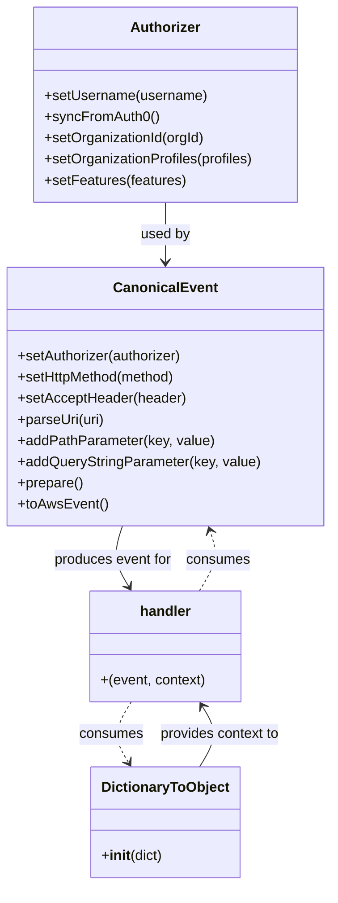

# Diagram: tools/ide_local_testing/localTest/test/byUrl/partviewContainerSearchReferenceSet.py


> Auto-generated by Obscura crawlers

## Diagram 1



### SVG

<svg id="container" width="372.8828125" xmlns="http://www.w3.org/2000/svg" class="classDiagram" height="1006" viewBox="0 0 372.8828125 1006" role="graphics-document document" aria-roledescription="class"><style>#container{font-family:"trebuchet ms",verdana,arial,sans-serif;font-size:16px;fill:#333;}@keyframes edge-animation-frame{from{stroke-dashoffset:0;}}@keyframes dash{to{stroke-dashoffset:0;}}#container .edge-animation-slow{stroke-dasharray:9,5!important;stroke-dashoffset:900;animation:dash 50s linear infinite;stroke-linecap:round;}#container .edge-animation-fast{stroke-dasharray:9,5!important;stroke-dashoffset:900;animation:dash 20s linear infinite;stroke-linecap:round;}#container .error-icon{fill:#552222;}#container .error-text{fill:#552222;stroke:#552222;}#container .edge-thickness-normal{stroke-width:1px;}#container .edge-thickness-thick{stroke-width:3.5px;}#container .edge-pattern-solid{stroke-dasharray:0;}#container .edge-thickness-invisible{stroke-width:0;fill:none;}#container .edge-pattern-dashed{stroke-dasharray:3;}#container .edge-pattern-dotted{stroke-dasharray:2;}#container .marker{fill:#333333;stroke:#333333;}#container .marker.cross{stroke:#333333;}#container svg{font-family:"trebuchet ms",verdana,arial,sans-serif;font-size:16px;}#container p{margin:0;}#container g.classGroup text{fill:#9370DB;stroke:none;font-family:"trebuchet ms",verdana,arial,sans-serif;font-size:10px;}#container g.classGroup text .title{font-weight:bolder;}#container .nodeLabel,#container .edgeLabel{color:#131300;}#container .edgeLabel .label rect{fill:#ECECFF;}#container .label text{fill:#131300;}#container .labelBkg{background:#ECECFF;}#container .edgeLabel .label span{background:#ECECFF;}#container .classTitle{font-weight:bolder;}#container .node rect,#container .node circle,#container .node ellipse,#container .node polygon,#container .node path{fill:#ECECFF;stroke:#9370DB;stroke-width:1px;}#container .divider{stroke:#9370DB;stroke-width:1;}#container g.clickable{cursor:pointer;}#container g.classGroup rect{fill:#ECECFF;stroke:#9370DB;}#container g.classGroup line{stroke:#9370DB;stroke-width:1;}#container .classLabel .box{stroke:none;stroke-width:0;fill:#ECECFF;opacity:0.5;}#container .classLabel .label{fill:#9370DB;font-size:10px;}#container .relation{stroke:#333333;stroke-width:1;fill:none;}#container .dashed-line{stroke-dasharray:3;}#container .dotted-line{stroke-dasharray:1 2;}#container #compositionStart,#container .composition{fill:#333333!important;stroke:#333333!important;stroke-width:1;}#container #compositionEnd,#container .composition{fill:#333333!important;stroke:#333333!important;stroke-width:1;}#container #dependencyStart,#container .dependency{fill:#333333!important;stroke:#333333!important;stroke-width:1;}#container #dependencyStart,#container .dependency{fill:#333333!important;stroke:#333333!important;stroke-width:1;}#container #extensionStart,#container .extension{fill:transparent!important;stroke:#333333!important;stroke-width:1;}#container #extensionEnd,#container .extension{fill:transparent!important;stroke:#333333!important;stroke-width:1;}#container #aggregationStart,#container .aggregation{fill:transparent!important;stroke:#333333!important;stroke-width:1;}#container #aggregationEnd,#container .aggregation{fill:transparent!important;stroke:#333333!important;stroke-width:1;}#container #lollipopStart,#container .lollipop{fill:#ECECFF!important;stroke:#333333!important;stroke-width:1;}#container #lollipopEnd,#container .lollipop{fill:#ECECFF!important;stroke:#333333!important;stroke-width:1;}#container .edgeTerminals{font-size:11px;line-height:initial;}#container .classTitleText{text-anchor:middle;font-size:18px;fill:#333;}#container .label-icon{display:inline-block;height:1em;overflow:visible;vertical-align:-0.125em;}#container .node .label-icon path{fill:currentColor;stroke:revert;stroke-width:revert;}#container :root{--mermaid-font-family:"trebuchet ms",verdana,arial,sans-serif;}</style><g><defs><marker id="container_class-aggregationStart" class="marker aggregation class" refX="18" refY="7" markerWidth="190" markerHeight="240" orient="auto"><path d="M 18,7 L9,13 L1,7 L9,1 Z"></path></marker></defs><defs><marker id="container_class-aggregationEnd" class="marker aggregation class" refX="1" refY="7" markerWidth="20" markerHeight="28" orient="auto"><path d="M 18,7 L9,13 L1,7 L9,1 Z"></path></marker></defs><defs><marker id="container_class-extensionStart" class="marker extension class" refX="18" refY="7" markerWidth="190" markerHeight="240" orient="auto"><path d="M 1,7 L18,13 V 1 Z"></path></marker></defs><defs><marker id="container_class-extensionEnd" class="marker extension class" refX="1" refY="7" markerWidth="20" markerHeight="28" orient="auto"><path d="M 1,1 V 13 L18,7 Z"></path></marker></defs><defs><marker id="container_class-compositionStart" class="marker composition class" refX="18" refY="7" markerWidth="190" markerHeight="240" orient="auto"><path d="M 18,7 L9,13 L1,7 L9,1 Z"></path></marker></defs><defs><marker id="container_class-compositionEnd" class="marker composition class" refX="1" refY="7" markerWidth="20" markerHeight="28" orient="auto"><path d="M 18,7 L9,13 L1,7 L9,1 Z"></path></marker></defs><defs><marker id="container_class-dependencyStart" class="marker dependency class" refX="6" refY="7" markerWidth="190" markerHeight="240" orient="auto"><path d="M 5,7 L9,13 L1,7 L9,1 Z"></path></marker></defs><defs><marker id="container_class-dependencyEnd" class="marker dependency class" refX="13" refY="7" markerWidth="20" markerHeight="28" orient="auto"><path d="M 18,7 L9,13 L14,7 L9,1 Z"></path></marker></defs><defs><marker id="container_class-lollipopStart" class="marker lollipop class" refX="13" refY="7" markerWidth="190" markerHeight="240" orient="auto"><circle stroke="black" fill="transparent" cx="7" cy="7" r="6"></circle></marker></defs><defs><marker id="container_class-lollipopEnd" class="marker lollipop class" refX="1" refY="7" markerWidth="190" markerHeight="240" orient="auto"><circle stroke="black" fill="transparent" cx="7" cy="7" r="6"></circle></marker></defs><g class="root"><g class="clusters"></g><g class="edgePaths"><path d="M186.441,230L186.441,236.167C186.441,242.333,186.441,254.667,186.441,266C186.441,277.333,186.441,287.667,186.441,292.833L186.441,298" id="id_Authorizer_CanonicalEvent_1" class="edge-thickness-normal edge-pattern-solid relation" style=";;;" data-edge="true" data-et="edge" data-id="id_Authorizer_CanonicalEvent_1" data-points="W3sieCI6MTg2LjQ0MTQwNjI1LCJ5IjoyMzB9LHsieCI6MTg2LjQ0MTQwNjI1LCJ5IjoyNjd9LHsieCI6MTg2LjQ0MTQwNjI1LCJ5IjozMDR9XQ==" marker-end="url(#container_class-dependencyEnd)"></path><path d="M136.662,598L134.574,604.167C132.486,610.333,128.309,622.667,129.535,634.151C130.76,645.636,137.387,656.272,140.7,661.59L144.014,666.908" id="id_CanonicalEvent_handler_2" class="edge-thickness-normal edge-pattern-solid relation" style=";;;" data-edge="true" data-et="edge" data-id="id_CanonicalEvent_handler_2" data-points="W3sieCI6MTM2LjY2MjI1Nzk4MjMzNjk0LCJ5Ijo1OTh9LHsieCI6MTI0LjEzMjgxMjUsInkiOjYzNX0seyJ4IjoxNDcuMTg2OTkyMTg3NSwieSI6NjcyfV0=" marker-end="url(#container_class-dependencyEnd)"></path><path d="M226.2,872L230.092,865.833C233.984,859.667,241.767,847.333,242.301,835.846C242.835,824.358,236.119,813.716,232.761,808.395L229.403,803.074" id="id_DictionaryToObject_handler_3" class="edge-thickness-normal edge-pattern-solid relation" style=";;;" data-edge="true" data-et="edge" data-id="id_DictionaryToObject_handler_3" data-points="W3sieCI6MjI2LjIwMDMxMjUsInkiOjg3Mn0seyJ4IjoyNDkuNTUwNzgxMjUsInkiOjgzNX0seyJ4IjoyMjYuMjAwMzEyNSwieSI6Nzk4fV0=" marker-end="url(#container_class-dependencyEnd)"></path><path d="M146.683,798L142.791,804.167C138.899,810.333,131.116,822.667,130.582,834.154C130.048,845.642,136.764,856.284,140.122,861.605L143.48,866.926" id="id_handler_DictionaryToObject_4" class="edge-thickness-normal edge-pattern-dashed relation" style=";;;" data-edge="true" data-et="edge" data-id="id_handler_DictionaryToObject_4" data-points="W3sieCI6MTQ2LjY4MjUsInkiOjc5OH0seyJ4IjoxMjMuMzMyMDMxMjUsInkiOjgzNX0seyJ4IjoxNDYuNjgyNSwieSI6ODcyfV0=" marker-end="url(#container_class-dependencyEnd)"></path><path d="M225.696,672L229.538,665.833C233.381,659.667,241.065,647.333,243.14,635.947C245.215,624.561,241.68,614.122,239.913,608.902L238.145,603.683" id="id_handler_CanonicalEvent_5" class="edge-thickness-normal edge-pattern-dashed relation" style=";;;" data-edge="true" data-et="edge" data-id="id_handler_CanonicalEvent_5" data-points="W3sieCI6MjI1LjY5NTgyMDMxMjUsInkiOjY3Mn0seyJ4IjoyNDguNzUsInkiOjYzNX0seyJ4IjoyMzYuMjIwNTU0NTE3NjYzMDYsInkiOjU5OH1d" marker-end="url(#container_class-dependencyEnd)"></path></g><g class="edgeLabels"><g class="edgeLabel" transform="translate(186.44140625, 267)"><g class="label" data-id="id_Authorizer_CanonicalEvent_1" transform="translate(-28.3125, -12)"><foreignObject width="56.625" height="24"><div xmlns="http://www.w3.org/1999/xhtml" class="labelBkg" style="display: table-cell; white-space: nowrap; line-height: 1.5; max-width: 200px; text-align: center;"><span class="edgeLabel"><p>used by</p></span></div></foreignObject></g></g><g class="edgeLabel" transform="translate(125.33082, 636.9227)"><g class="label" data-id="id_CanonicalEvent_handler_2" transform="translate(-68.2421875, -12)"><foreignObject width="136.484375" height="24"><div xmlns="http://www.w3.org/1999/xhtml" class="labelBkg" style="display: table-cell; white-space: nowrap; line-height: 1.5; max-width: 200px; text-align: center;"><span class="edgeLabel"><p>produces event for</p></span></div></foreignObject></g></g><g class="edgeLabel" transform="translate(249.55078125, 835)"><g class="label" data-id="id_DictionaryToObject_handler_3" transform="translate(-69.84375, -12)"><foreignObject width="139.6875" height="24"><div xmlns="http://www.w3.org/1999/xhtml" class="labelBkg" style="display: table-cell; white-space: nowrap; line-height: 1.5; max-width: 200px; text-align: center;"><span class="edgeLabel"><p>provides context to</p></span></div></foreignObject></g></g><g class="edgeLabel" transform="translate(123.33203125, 835)"><g class="label" data-id="id_handler_DictionaryToObject_4" transform="translate(-36.375, -12)"><foreignObject width="72.75" height="24"><div xmlns="http://www.w3.org/1999/xhtml" class="labelBkg" style="display: table-cell; white-space: nowrap; line-height: 1.5; max-width: 200px; text-align: center;"><span class="edgeLabel"><p>consumes</p></span></div></foreignObject></g></g><g class="edgeLabel" transform="translate(247.55199, 636.9227)"><g class="label" data-id="id_handler_CanonicalEvent_5" transform="translate(-36.375, -12)"><foreignObject width="72.75" height="24"><div xmlns="http://www.w3.org/1999/xhtml" class="labelBkg" style="display: table-cell; white-space: nowrap; line-height: 1.5; max-width: 200px; text-align: center;"><span class="edgeLabel"><p>consumes</p></span></div></foreignObject></g></g></g><g class="nodes"><g class="node default" id="classId-Authorizer-0" transform="translate(186.44140625, 119)"><g class="basic label-container"><path d="M-151.66796875 -111 L151.66796875 -111 L151.66796875 111 L-151.66796875 111" stroke="none" stroke-width="0" fill="#ECECFF" style=""></path><path d="M-151.66796875 -111 C-47.45288035780432 -111, 56.762208034391364 -111, 151.66796875 -111 M-151.66796875 -111 C-82.4104686178173 -111, -13.152968485634602 -111, 151.66796875 -111 M151.66796875 -111 C151.66796875 -43.24505326793384, 151.66796875 24.50989346413232, 151.66796875 111 M151.66796875 -111 C151.66796875 -53.57069082780414, 151.66796875 3.858618344391715, 151.66796875 111 M151.66796875 111 C76.68918338760334 111, 1.710398025206672 111, -151.66796875 111 M151.66796875 111 C62.49204543720833 111, -26.683877875583335 111, -151.66796875 111 M-151.66796875 111 C-151.66796875 44.479849357157974, -151.66796875 -22.040301285684052, -151.66796875 -111 M-151.66796875 111 C-151.66796875 47.754402954106666, -151.66796875 -15.491194091786667, -151.66796875 -111" stroke="#9370DB" stroke-width="1.3" fill="none" stroke-dasharray="0 0" style=""></path></g><g class="annotation-group text" transform="translate(0, -87)"></g><g class="label-group text" transform="translate(-38.3671875, -87)"><g class="label" style="font-weight: bolder" transform="translate(0,-12)"><foreignObject width="76.734375" height="24"><div xmlns="http://www.w3.org/1999/xhtml" style="display: table-cell; white-space: nowrap; line-height: 1.5; max-width: 126px; text-align: center;"><span class="nodeLabel markdown-node-label" style=""><p>Authorizer</p></span></div></foreignObject></g></g><g class="members-group text" transform="translate(-139.66796875, -39)"></g><g class="methods-group text" transform="translate(-139.66796875, -9)"><g class="label" style="" transform="translate(0,-12)"><foreignObject width="185.90625" height="24"><div xmlns="http://www.w3.org/1999/xhtml" style="display: table-cell; white-space: nowrap; line-height: 1.5; max-width: 243px; text-align: center;"><span class="nodeLabel markdown-node-label" style=""><p>+setUsername(username)</p></span></div></foreignObject></g><g class="label" style="" transform="translate(0,12)"><foreignObject width="129.0625" height="24"><div xmlns="http://www.w3.org/1999/xhtml" style="display: table-cell; white-space: nowrap; line-height: 1.5; max-width: 186px; text-align: center;"><span class="nodeLabel markdown-node-label" style=""><p>+syncFromAuth0()</p></span></div></foreignObject></g><g class="label" style="" transform="translate(0,36)"><foreignObject width="184.578125" height="24"><div xmlns="http://www.w3.org/1999/xhtml" style="display: table-cell; white-space: nowrap; line-height: 1.5; max-width: 242px; text-align: center;"><span class="nodeLabel markdown-node-label" style=""><p>+setOrganizationId(orgId)</p></span></div></foreignObject></g><g class="label" style="" transform="translate(0,60)"><foreignObject width="240.96875" height="24"><div xmlns="http://www.w3.org/1999/xhtml" style="display: table-cell; white-space: nowrap; line-height: 1.5; max-width: 298px; text-align: center;"><span class="nodeLabel markdown-node-label" style=""><p>+setOrganizationProfiles(profiles)</p></span></div></foreignObject></g><g class="label" style="" transform="translate(0,84)"><foreignObject width="161.296875" height="24"><div xmlns="http://www.w3.org/1999/xhtml" style="display: table-cell; white-space: nowrap; line-height: 1.5; max-width: 219px; text-align: center;"><span class="nodeLabel markdown-node-label" style=""><p>+setFeatures(features)</p></span></div></foreignObject></g></g><g class="divider" style=""><path d="M-151.66796875 -63 C-70.95996090006346 -63, 9.748046949873071 -63, 151.66796875 -63 M-151.66796875 -63 C-51.26585093708438 -63, 49.13626687583124 -63, 151.66796875 -63" stroke="#9370DB" stroke-width="1.3" fill="none" stroke-dasharray="0 0" style=""></path></g><g class="divider" style=""><path d="M-151.66796875 -39 C-64.56506068433985 -39, 22.53784738132029 -39, 151.66796875 -39 M-151.66796875 -39 C-40.08164905186776 -39, 71.50467064626449 -39, 151.66796875 -39" stroke="#9370DB" stroke-width="1.3" fill="none" stroke-dasharray="0 0" style=""></path></g></g><g class="node default" id="classId-CanonicalEvent-1" transform="translate(186.44140625, 451)"><g class="basic label-container"><path d="M-178.44140625 -147 L178.44140625 -147 L178.44140625 147 L-178.44140625 147" stroke="none" stroke-width="0" fill="#ECECFF" style=""></path><path d="M-178.44140625 -147 C-42.228986534964434 -147, 93.98343318007113 -147, 178.44140625 -147 M-178.44140625 -147 C-92.30985264894036 -147, -6.178299047880728 -147, 178.44140625 -147 M178.44140625 -147 C178.44140625 -53.13898429578708, 178.44140625 40.722031408425835, 178.44140625 147 M178.44140625 -147 C178.44140625 -58.66732022929361, 178.44140625 29.665359541412784, 178.44140625 147 M178.44140625 147 C52.03614344380941 147, -74.36911936238118 147, -178.44140625 147 M178.44140625 147 C55.451366392840285 147, -67.53867346431943 147, -178.44140625 147 M-178.44140625 147 C-178.44140625 73.81416609412315, -178.44140625 0.6283321882463042, -178.44140625 -147 M-178.44140625 147 C-178.44140625 44.84955373253506, -178.44140625 -57.300892534929886, -178.44140625 -147" stroke="#9370DB" stroke-width="1.3" fill="none" stroke-dasharray="0 0" style=""></path></g><g class="annotation-group text" transform="translate(0, -123)"></g><g class="label-group text" transform="translate(-55.7109375, -123)"><g class="label" style="font-weight: bolder" transform="translate(0,-12)"><foreignObject width="111.421875" height="24"><div xmlns="http://www.w3.org/1999/xhtml" style="display: table-cell; white-space: nowrap; line-height: 1.5; max-width: 161px; text-align: center;"><span class="nodeLabel markdown-node-label" style=""><p>CanonicalEvent</p></span></div></foreignObject></g></g><g class="members-group text" transform="translate(-166.44140625, -75)"></g><g class="methods-group text" transform="translate(-166.44140625, -45)"><g class="label" style="" transform="translate(0,-12)"><foreignObject width="190.75" height="24"><div xmlns="http://www.w3.org/1999/xhtml" style="display: table-cell; white-space: nowrap; line-height: 1.5; max-width: 248px; text-align: center;"><span class="nodeLabel markdown-node-label" style=""><p>+setAuthorizer(authorizer)</p></span></div></foreignObject></g><g class="label" style="" transform="translate(0,12)"><foreignObject width="184" height="24"><div xmlns="http://www.w3.org/1999/xhtml" style="display: table-cell; white-space: nowrap; line-height: 1.5; max-width: 241px; text-align: center;"><span class="nodeLabel markdown-node-label" style=""><p>+setHttpMethod(method)</p></span></div></foreignObject></g><g class="label" style="" transform="translate(0,36)"><foreignObject width="191.859375" height="24"><div xmlns="http://www.w3.org/1999/xhtml" style="display: table-cell; white-space: nowrap; line-height: 1.5; max-width: 249px; text-align: center;"><span class="nodeLabel markdown-node-label" style=""><p>+setAcceptHeader(header)</p></span></div></foreignObject></g><g class="label" style="" transform="translate(0,60)"><foreignObject width="99.8125" height="24"><div xmlns="http://www.w3.org/1999/xhtml" style="display: table-cell; white-space: nowrap; line-height: 1.5; max-width: 157px; text-align: center;"><span class="nodeLabel markdown-node-label" style=""><p>+parseUri(uri)</p></span></div></foreignObject></g><g class="label" style="" transform="translate(0,84)"><foreignObject width="223.4375" height="24"><div xmlns="http://www.w3.org/1999/xhtml" style="display: table-cell; white-space: nowrap; line-height: 1.5; max-width: 281px; text-align: center;"><span class="nodeLabel markdown-node-label" style=""><p>+addPathParameter(key, value)</p></span></div></foreignObject></g><g class="label" style="" transform="translate(0,108)"><foreignObject width="277.171875" height="24"><div xmlns="http://www.w3.org/1999/xhtml" style="display: table-cell; white-space: nowrap; line-height: 1.5; max-width: 335px; text-align: center;"><span class="nodeLabel markdown-node-label" style=""><p>+addQueryStringParameter(key, value)</p></span></div></foreignObject></g><g class="label" style="" transform="translate(0,132)"><foreignObject width="74.75" height="24"><div xmlns="http://www.w3.org/1999/xhtml" style="display: table-cell; white-space: nowrap; line-height: 1.5; max-width: 132px; text-align: center;"><span class="nodeLabel markdown-node-label" style=""><p>+prepare()</p></span></div></foreignObject></g><g class="label" style="" transform="translate(0,156)"><foreignObject width="101.1875" height="24"><div xmlns="http://www.w3.org/1999/xhtml" style="display: table-cell; white-space: nowrap; line-height: 1.5; max-width: 159px; text-align: center;"><span class="nodeLabel markdown-node-label" style=""><p>+toAwsEvent()</p></span></div></foreignObject></g></g><g class="divider" style=""><path d="M-178.44140625 -99 C-44.52973374573659 -99, 89.38193875852681 -99, 178.44140625 -99 M-178.44140625 -99 C-97.65407641746324 -99, -16.86674658492649 -99, 178.44140625 -99" stroke="#9370DB" stroke-width="1.3" fill="none" stroke-dasharray="0 0" style=""></path></g><g class="divider" style=""><path d="M-178.44140625 -75 C-64.97207299945639 -75, 48.497260251087226 -75, 178.44140625 -75 M-178.44140625 -75 C-59.45312026590929 -75, 59.53516571818142 -75, 178.44140625 -75" stroke="#9370DB" stroke-width="1.3" fill="none" stroke-dasharray="0 0" style=""></path></g></g><g class="node default" id="classId-DictionaryToObject-2" transform="translate(186.44140625, 935)"><g class="basic label-container"><path d="M-82.203125 -63 L82.203125 -63 L82.203125 63 L-82.203125 63" stroke="none" stroke-width="0" fill="#ECECFF" style=""></path><path d="M-82.203125 -63 C-23.55630011626063 -63, 35.09052476747874 -63, 82.203125 -63 M-82.203125 -63 C-44.16441850366146 -63, -6.125712007322917 -63, 82.203125 -63 M82.203125 -63 C82.203125 -34.08341301725136, 82.203125 -5.166826034502712, 82.203125 63 M82.203125 -63 C82.203125 -29.333345194249397, 82.203125 4.333309611501207, 82.203125 63 M82.203125 63 C40.26554405159635 63, -1.672036896807299 63, -82.203125 63 M82.203125 63 C47.678895416900716 63, 13.154665833801431 63, -82.203125 63 M-82.203125 63 C-82.203125 33.91927760401258, -82.203125 4.838555208025149, -82.203125 -63 M-82.203125 63 C-82.203125 30.59430703987416, -82.203125 -1.8113859202516807, -82.203125 -63" stroke="#9370DB" stroke-width="1.3" fill="none" stroke-dasharray="0 0" style=""></path></g><g class="annotation-group text" transform="translate(0, -39)"></g><g class="label-group text" transform="translate(-70.109375, -39)"><g class="label" style="font-weight: bolder" transform="translate(0,-12)"><foreignObject width="140.21875" height="24"><div xmlns="http://www.w3.org/1999/xhtml" style="display: table-cell; white-space: nowrap; line-height: 1.5; max-width: 188px; text-align: center;"><span class="nodeLabel markdown-node-label" style=""><p>DictionaryToObject</p></span></div></foreignObject></g></g><g class="members-group text" transform="translate(-70.203125, 9)"></g><g class="methods-group text" transform="translate(-70.203125, 39)"><g class="label" style="" transform="translate(0,-12)"><foreignObject width="70.296875" height="24"><div xmlns="http://www.w3.org/1999/xhtml" style="display: table-cell; white-space: nowrap; line-height: 1.5; max-width: 159px; text-align: center;"><span class="nodeLabel markdown-node-label" style=""><p>+<strong>init</strong>(dict)</p></span></div></foreignObject></g></g><g class="divider" style=""><path d="M-82.203125 -15 C-35.66243780618175 -15, 10.878249387636501 -15, 82.203125 -15 M-82.203125 -15 C-38.15776951664936 -15, 5.88758596670128 -15, 82.203125 -15" stroke="#9370DB" stroke-width="1.3" fill="none" stroke-dasharray="0 0" style=""></path></g><g class="divider" style=""><path d="M-82.203125 9 C-42.41144414494451 9, -2.619763289889022 9, 82.203125 9 M-82.203125 9 C-22.73744739221126 9, 36.72823021557748 9, 82.203125 9" stroke="#9370DB" stroke-width="1.3" fill="none" stroke-dasharray="0 0" style=""></path></g></g><g class="node default" id="classId-handler-3" transform="translate(186.44140625, 735)"><g class="basic label-container"><path d="M-86.45703125 -63 L86.45703125 -63 L86.45703125 63 L-86.45703125 63" stroke="none" stroke-width="0" fill="#ECECFF" style=""></path><path d="M-86.45703125 -63 C-21.062424415674627 -63, 44.332182418650746 -63, 86.45703125 -63 M-86.45703125 -63 C-33.9855385605619 -63, 18.4859541288762 -63, 86.45703125 -63 M86.45703125 -63 C86.45703125 -21.44134045182269, 86.45703125 20.11731909635462, 86.45703125 63 M86.45703125 -63 C86.45703125 -34.77498686515543, 86.45703125 -6.549973730310846, 86.45703125 63 M86.45703125 63 C49.037135755998186 63, 11.617240261996372 63, -86.45703125 63 M86.45703125 63 C44.95637522151678 63, 3.455719193033559 63, -86.45703125 63 M-86.45703125 63 C-86.45703125 14.411750687756651, -86.45703125 -34.1764986244867, -86.45703125 -63 M-86.45703125 63 C-86.45703125 18.643548084323832, -86.45703125 -25.712903831352335, -86.45703125 -63" stroke="#9370DB" stroke-width="1.3" fill="none" stroke-dasharray="0 0" style=""></path></g><g class="annotation-group text" transform="translate(0, -39)"></g><g class="label-group text" transform="translate(-28.3828125, -39)"><g class="label" style="font-weight: bolder" transform="translate(0,-12)"><foreignObject width="56.765625" height="24"><div xmlns="http://www.w3.org/1999/xhtml" style="display: table-cell; white-space: nowrap; line-height: 1.5; max-width: 107px; text-align: center;"><span class="nodeLabel markdown-node-label" style=""><p>handler</p></span></div></foreignObject></g></g><g class="members-group text" transform="translate(-74.45703125, 9)"></g><g class="methods-group text" transform="translate(-74.45703125, 39)"><g class="label" style="" transform="translate(0,-12)"><foreignObject width="120.53125" height="24"><div xmlns="http://www.w3.org/1999/xhtml" style="display: table-cell; white-space: nowrap; line-height: 1.5; max-width: 171px; text-align: center;"><span class="nodeLabel markdown-node-label" style=""><p>+(event, context)</p></span></div></foreignObject></g></g><g class="divider" style=""><path d="M-86.45703125 -15 C-49.243158810288605 -15, -12.02928637057721 -15, 86.45703125 -15 M-86.45703125 -15 C-36.113351335400225 -15, 14.23032857919955 -15, 86.45703125 -15" stroke="#9370DB" stroke-width="1.3" fill="none" stroke-dasharray="0 0" style=""></path></g><g class="divider" style=""><path d="M-86.45703125 9 C-44.36401514995637 9, -2.2709990499127457 9, 86.45703125 9 M-86.45703125 9 C-35.057223182944135 9, 16.34258488411173 9, 86.45703125 9" stroke="#9370DB" stroke-width="1.3" fill="none" stroke-dasharray="0 0" style=""></path></g></g></g></g></g></svg>

## Diagram 2

```mermaid
flowchart TD
    A[Start script] --> B[Create Authorizer]
    B --> C{Active OrgId set?}
    C -- yes --> D[setOrganizationId & setOrganizationProfiles]
    C -- no --> E[skip org config]
    B --> F[setFeatures]
    A --> G[Create CanonicalEvent]
    G --> H[chain setters: setAuthorizer, setHttpMethod, setAcceptHeader]
    H --> I[parseUri]
    I --> J[addPathParameter(type)]
    J --> K[addQueryStringParameter(...multiple...)]
    K --> L[prepare() -> toAwsEvent()]
    L --> M[Call handler(event, DictionaryToObject(...))]
    M --> N{retval.body?}
    N -- yes --> O[json.loads(body) -> prettyRetval -> print]
    N -- no --> P[prettyRetval = "" -> print]
    M --> Q[measure execution time and print Lambda execution time]
    O --> R[End]
    P --> R
```

> SVG rendering failed for this diagram.
