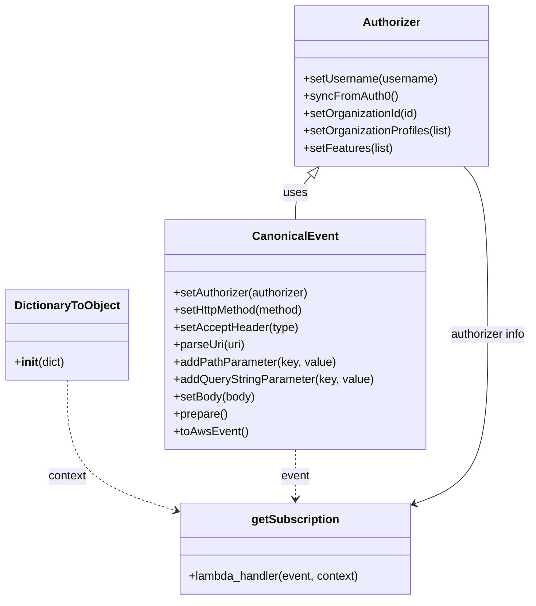
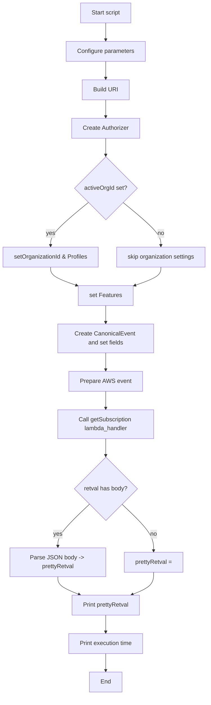

# Diagram: tools/ide_local_testing/localTest/test/byUrl/partviewGetSubscriptionByUrl.py

> Auto-generated by Obscura crawlers

## Diagram 1

### SVG

<svg id="container" width="729.9453125" xmlns="http://www.w3.org/2000/svg" class="classDiagram" height="830" viewBox="0 0 729.9453125 830" role="graphics-document document" aria-roledescription="class"><g><defs><marker id="container_class-aggregationStart" class="marker aggregation class" refX="18" refY="7" markerWidth="190" markerHeight="240" orient="auto"><path d="M 18,7 L9,13 L1,7 L9,1 Z"></path></marker></defs><defs><marker id="container_class-aggregationEnd" class="marker aggregation class" refX="1" refY="7" markerWidth="20" markerHeight="28" orient="auto"><path d="M 18,7 L9,13 L1,7 L9,1 Z"></path></marker></defs><defs><marker id="container_class-extensionStart" class="marker extension class" refX="18" refY="7" markerWidth="190" markerHeight="240" orient="auto"><path d="M 1,7 L18,13 V 1 Z"></path></marker></defs><defs><marker id="container_class-extensionEnd" class="marker extension class" refX="1" refY="7" markerWidth="20" markerHeight="28" orient="auto"><path d="M 1,1 V 13 L18,7 Z"></path></marker></defs><defs><marker id="container_class-compositionStart" class="marker composition class" refX="18" refY="7" markerWidth="190" markerHeight="240" orient="auto"><path d="M 18,7 L9,13 L1,7 L9,1 Z"></path></marker></defs><defs><marker id="container_class-compositionEnd" class="marker composition class" refX="1" refY="7" markerWidth="20" markerHeight="28" orient="auto"><path d="M 18,7 L9,13 L1,7 L9,1 Z"></path></marker></defs><defs><marker id="container_class-dependencyStart" class="marker dependency class" refX="6" refY="7" markerWidth="190" markerHeight="240" orient="auto"><path d="M 5,7 L9,13 L1,7 L9,1 Z"></path></marker></defs><defs><marker id="container_class-dependencyEnd" class="marker dependency class" refX="13" refY="7" markerWidth="20" markerHeight="28" orient="auto"><path d="M 18,7 L9,13 L14,7 L9,1 Z"></path></marker></defs><defs><marker id="container_class-lollipopStart" class="marker lollipop class" refX="13" refY="7" markerWidth="190" markerHeight="240" orient="auto"><circle stroke="black" fill="transparent" cx="7" cy="7" r="6"></circle></marker></defs><defs><marker id="container_class-lollipopEnd" class="marker lollipop class" refX="1" refY="7" markerWidth="190" markerHeight="240" orient="auto"><circle stroke="black" fill="transparent" cx="7" cy="7" r="6"></circle></marker></defs><g class="root"><g class="clusters"></g><g class="edgePaths"><path d="M422.696,242.803L419.055,246.836C415.413,250.869,408.13,258.934,404.489,269.134C400.848,279.333,400.848,291.667,400.848,297.833L400.848,304" id="id_Authorizer_CanonicalEvent_1" class="edge-thickness-normal edge-pattern-solid relation" style=";;;" data-edge="true" data-et="edge" data-id="id_Authorizer_CanonicalEvent_1" data-points="W3sieCI6NDM0LjI1NjM0NzY1NjI1LCJ5IjoyMzB9LHsieCI6NDAwLjg0NzY1NjI1LCJ5IjoyNjd9LHsieCI6NDAwLjg0NzY1NjI1LCJ5IjozMDR9XQ==" marker-start="url(#container_class-extensionStart)"></path><path d="M90.203,526L90.203,548.167C90.203,570.333,90.203,614.667,114.157,644.544C138.111,674.422,186.018,689.844,209.972,697.555L233.925,705.266" id="id_DictionaryToObject_getSubscription_2" class="edge-thickness-normal edge-pattern-dashed relation" style=";;;" data-edge="true" data-et="edge" data-id="id_DictionaryToObject_getSubscription_2" data-points="W3sieCI6OTAuMjAzMTI1LCJ5Ijo1MjZ9LHsieCI6OTAuMjAzMTI1LCJ5Ijo2NTl9LHsieCI6MjM5LjYzNjcxODc1LCJ5Ijo3MDcuMTA0MzY5Njk1MDY0NH1d" marker-end="url(#container_class-dependencyEnd)"></path><path d="M400.848,622L400.848,628.167C400.848,634.333,400.848,646.667,400.848,658C400.848,669.333,400.848,679.667,400.848,684.833L400.848,690" id="id_CanonicalEvent_getSubscription_3" class="edge-thickness-normal edge-pattern-dashed relation" style=";;;" data-edge="true" data-et="edge" data-id="id_CanonicalEvent_getSubscription_3" data-points="W3sieCI6NDAwLjg0NzY1NjI1LCJ5Ijo2MjJ9LHsieCI6NDAwLjg0NzY1NjI1LCJ5Ijo2NTl9LHsieCI6NDAwLjg0NzY1NjI1LCJ5Ijo2OTZ9XQ==" marker-end="url(#container_class-dependencyEnd)"></path><path d="M567.678,696.58L584.418,690.316C601.158,684.053,634.638,671.527,651.377,632.597C668.117,593.667,668.117,528.333,668.117,463C668.117,397.667,668.117,332.333,662.549,293.5C656.981,254.667,645.845,242.333,640.277,236.167L634.708,230" id="id_getSubscription_Authorizer_4" class="edge-thickness-normal edge-pattern-solid relation" style=";;;" data-edge="true" data-et="edge" data-id="id_getSubscription_Authorizer_4" data-points="W3sieCI6NTYyLjA1ODU5Mzc1LCJ5Ijo2OTguNjgyMjYxMjk0MDQ3Mn0seyJ4Ijo2NjguMTE3MTg3NSwieSI6NjU5fSx7IngiOjY2OC4xMTcxODc1LCJ5Ijo0NjN9LHsieCI6NjY4LjExNzE4NzUsInkiOjI2N30seyJ4Ijo2MzQuNzA4NDk2MDkzNzUsInkiOjIzMH1d" marker-start="url(#container_class-dependencyStart)"></path></g><g class="edgeLabels"><g class="edgeLabel" transform="translate(400.84765625, 267)"><g class="label" data-id="id_Authorizer_CanonicalEvent_1" transform="translate(-16.4921875, -12)"><foreignObject width="32.984375" height="24">

uses

</foreignObject></g></g><g class="edgeLabel" transform="translate(90.203125, 659)"><g class="label" data-id="id_DictionaryToObject_getSubscription_2" transform="translate(-26.8515625, -12)"><foreignObject width="53.703125" height="24">

context

</foreignObject></g></g><g class="edgeLabel" transform="translate(400.84765625, 659)"><g class="label" data-id="id_CanonicalEvent_getSubscription_3" transform="translate(-20.171875, -12)"><foreignObject width="40.34375" height="24">

event

</foreignObject></g></g><g class="edgeLabel" transform="translate(668.1171875, 463)"><g class="label" data-id="id_getSubscription_Authorizer_4" transform="translate(-53.828125, -12)"><foreignObject width="107.65625" height="24">

authorizer info

</foreignObject></g></g></g><g class="nodes"><g class="node default" id="classId-Authorizer-0" transform="translate(534.482421875, 119)"><g class="basic label-container"><path d="M-135.62109375 -111 L135.62109375 -111 L135.62109375 111 L-135.62109375 111" stroke="none" stroke-width="0" fill="#ECECFF" style=""></path><path d="M-135.62109375 -111 C-64.09103368103045 -111, 7.439026387939094 -111, 135.62109375 -111 M-135.62109375 -111 C-81.08691660859654 -111, -26.552739467193064 -111, 135.62109375 -111 M135.62109375 -111 C135.62109375 -61.298786633674695, 135.62109375 -11.59757326734939, 135.62109375 111 M135.62109375 -111 C135.62109375 -54.472710136154134, 135.62109375 2.0545797276917313, 135.62109375 111 M135.62109375 111 C42.87571699361622 111, -49.869659762767554 111, -135.62109375 111 M135.62109375 111 C64.18273961131972 111, -7.255614527360564 111, -135.62109375 111 M-135.62109375 111 C-135.62109375 39.41181196889369, -135.62109375 -32.176376062212626, -135.62109375 -111 M-135.62109375 111 C-135.62109375 51.1055907607172, -135.62109375 -8.788818478565602, -135.62109375 -111" stroke="#9370DB" stroke-width="1.3" fill="none" stroke-dasharray="0 0" style=""></path></g><g class="annotation-group text" transform="translate(0, -87)"></g><g class="label-group text" transform="translate(-38.3671875, -87)"><g class="label" style="font-weight: bolder" transform="translate(0,-12)"><foreignObject width="76.734375" height="24">

Authorizer

</foreignObject></g></g><g class="members-group text" transform="translate(-123.62109375, -39)"></g><g class="methods-group text" transform="translate(-123.62109375, -9)"><g class="label" style="" transform="translate(0,-12)"><foreignObject width="185.90625" height="24">

+setUsername(username)

</foreignObject></g><g class="label" style="" transform="translate(0,12)"><foreignObject width="129.0625" height="24">

+syncFromAuth0()

</foreignObject></g><g class="label" style="" transform="translate(0,36)"><foreignObject width="160.78125" height="24">

+setOrganizationId(id)

</foreignObject></g><g class="label" style="" transform="translate(0,60)"><foreignObject width="208.875" height="24">

+setOrganizationProfiles(list)

</foreignObject></g><g class="label" style="" transform="translate(0,84)"><foreignObject width="124.3125" height="24">

+setFeatures(list)

</foreignObject></g></g><g class="divider" style=""><path d="M-135.62109375 -63 C-31.752327196166547 -63, 72.1164393576669 -63, 135.62109375 -63 M-135.62109375 -63 C-71.64320985286966 -63, -7.66532595573932 -63, 135.62109375 -63" stroke="#9370DB" stroke-width="1.3" fill="none" stroke-dasharray="0 0" style=""></path></g><g class="divider" style=""><path d="M-135.62109375 -39 C-66.80143042277288 -39, 2.018232904454237 -39, 135.62109375 -39 M-135.62109375 -39 C-27.585128985391634 -39, 80.45083577921673 -39, 135.62109375 -39" stroke="#9370DB" stroke-width="1.3" fill="none" stroke-dasharray="0 0" style=""></path></g></g><g class="node default" id="classId-CanonicalEvent-1" transform="translate(400.84765625, 463)"><g class="basic label-container"><path d="M-178.44140625 -159 L178.44140625 -159 L178.44140625 159 L-178.44140625 159" stroke="none" stroke-width="0" fill="#ECECFF" style=""></path><path d="M-178.44140625 -159 C-47.61017464312931 -159, 83.22105696374138 -159, 178.44140625 -159 M-178.44140625 -159 C-50.75697624649601 -159, 76.92745375700798 -159, 178.44140625 -159 M178.44140625 -159 C178.44140625 -33.151401805595725, 178.44140625 92.69719638880855, 178.44140625 159 M178.44140625 -159 C178.44140625 -65.26446741095808, 178.44140625 28.471065178083848, 178.44140625 159 M178.44140625 159 C86.4231444947196 159, -5.595117260560812 159, -178.44140625 159 M178.44140625 159 C78.66298914591408 159, -21.115427958171836 159, -178.44140625 159 M-178.44140625 159 C-178.44140625 50.35537492114652, -178.44140625 -58.28925015770696, -178.44140625 -159 M-178.44140625 159 C-178.44140625 35.49939838996214, -178.44140625 -88.00120322007572, -178.44140625 -159" stroke="#9370DB" stroke-width="1.3" fill="none" stroke-dasharray="0 0" style=""></path></g><g class="annotation-group text" transform="translate(0, -135)"></g><g class="label-group text" transform="translate(-55.7109375, -135)"><g class="label" style="font-weight: bolder" transform="translate(0,-12)"><foreignObject width="111.421875" height="24">

CanonicalEvent

</foreignObject></g></g><g class="members-group text" transform="translate(-166.44140625, -87)"></g><g class="methods-group text" transform="translate(-166.44140625, -57)"><g class="label" style="" transform="translate(0,-12)"><foreignObject width="190.75" height="24">

+setAuthorizer(authorizer)

</foreignObject></g><g class="label" style="" transform="translate(0,12)"><foreignObject width="184" height="24">

+setHttpMethod(method)

</foreignObject></g><g class="label" style="" transform="translate(0,36)"><foreignObject width="172.546875" height="24">

+setAcceptHeader(type)

</foreignObject></g><g class="label" style="" transform="translate(0,60)"><foreignObject width="99.8125" height="24">

+parseUri(uri)

</foreignObject></g><g class="label" style="" transform="translate(0,84)"><foreignObject width="223.4375" height="24">

+addPathParameter(key, value)

</foreignObject></g><g class="label" style="" transform="translate(0,108)"><foreignObject width="277.171875" height="24">

+addQueryStringParameter(key, value)

</foreignObject></g><g class="label" style="" transform="translate(0,132)"><foreignObject width="113.125" height="24">

+setBody(body)

</foreignObject></g><g class="label" style="" transform="translate(0,156)"><foreignObject width="74.75" height="24">

+prepare()

</foreignObject></g><g class="label" style="" transform="translate(0,180)"><foreignObject width="101.1875" height="24">

+toAwsEvent()

</foreignObject></g></g><g class="divider" style=""><path d="M-178.44140625 -111 C-57.47388325674662 -111, 63.493639736506765 -111, 178.44140625 -111 M-178.44140625 -111 C-68.17104424880341 -111, 42.099317752393176 -111, 178.44140625 -111" stroke="#9370DB" stroke-width="1.3" fill="none" stroke-dasharray="0 0" style=""></path></g><g class="divider" style=""><path d="M-178.44140625 -87 C-72.35805215225827 -87, 33.725301945483466 -87, 178.44140625 -87 M-178.44140625 -87 C-65.77762382122903 -87, 46.886158607541944 -87, 178.44140625 -87" stroke="#9370DB" stroke-width="1.3" fill="none" stroke-dasharray="0 0" style=""></path></g></g><g class="node default" id="classId-DictionaryToObject-2" transform="translate(90.203125, 463)"><g class="basic label-container"><path d="M-82.203125 -63 L82.203125 -63 L82.203125 63 L-82.203125 63" stroke="none" stroke-width="0" fill="#ECECFF" style=""></path><path d="M-82.203125 -63 C-47.3372597781095 -63, -12.471394556218996 -63, 82.203125 -63 M-82.203125 -63 C-28.62561479074538 -63, 24.95189541850924 -63, 82.203125 -63 M82.203125 -63 C82.203125 -36.67649073484522, 82.203125 -10.352981469690434, 82.203125 63 M82.203125 -63 C82.203125 -30.684974508360114, 82.203125 1.630050983279773, 82.203125 63 M82.203125 63 C17.201685010299812 63, -47.799754979400376 63, -82.203125 63 M82.203125 63 C19.543081337448577 63, -43.11696232510285 63, -82.203125 63 M-82.203125 63 C-82.203125 27.16246672270144, -82.203125 -8.675066554597123, -82.203125 -63 M-82.203125 63 C-82.203125 16.610555885170868, -82.203125 -29.778888229658264, -82.203125 -63" stroke="#9370DB" stroke-width="1.3" fill="none" stroke-dasharray="0 0" style=""></path></g><g class="annotation-group text" transform="translate(0, -39)"></g><g class="label-group text" transform="translate(-70.109375, -39)"><g class="label" style="font-weight: bolder" transform="translate(0,-12)"><foreignObject width="140.21875" height="24">

DictionaryToObject

</foreignObject></g></g><g class="members-group text" transform="translate(-70.203125, 9)"></g><g class="methods-group text" transform="translate(-70.203125, 39)"><g class="label" style="" transform="translate(0,-12)"><foreignObject width="70.296875" height="24">

+<strong>init</strong>(dict)

</foreignObject></g></g><g class="divider" style=""><path d="M-82.203125 -15 C-30.81666882685112 -15, 20.56978734629776 -15, 82.203125 -15 M-82.203125 -15 C-28.716142107110727 -15, 24.770840785778546 -15, 82.203125 -15" stroke="#9370DB" stroke-width="1.3" fill="none" stroke-dasharray="0 0" style=""></path></g><g class="divider" style=""><path d="M-82.203125 9 C-41.673980698107265 9, -1.1448363962145294 9, 82.203125 9 M-82.203125 9 C-35.01838749507506 9, 12.166350009849879 9, 82.203125 9" stroke="#9370DB" stroke-width="1.3" fill="none" stroke-dasharray="0 0" style=""></path></g></g><g class="node default" id="classId-getSubscription-3" transform="translate(400.84765625, 759)"><g class="basic label-container"><path d="M-161.2109375 -63 L161.2109375 -63 L161.2109375 63 L-161.2109375 63" stroke="none" stroke-width="0" fill="#ECECFF" style=""></path><path d="M-161.2109375 -63 C-69.66211835890397 -63, 21.886700782192065 -63, 161.2109375 -63 M-161.2109375 -63 C-96.2830021982185 -63, -31.355066896436995 -63, 161.2109375 -63 M161.2109375 -63 C161.2109375 -22.054001059052737, 161.2109375 18.891997881894525, 161.2109375 63 M161.2109375 -63 C161.2109375 -20.812392315951065, 161.2109375 21.37521536809787, 161.2109375 63 M161.2109375 63 C77.94985125226079 63, -5.311234995478429 63, -161.2109375 63 M161.2109375 63 C41.70759485216065 63, -77.7957477956787 63, -161.2109375 63 M-161.2109375 63 C-161.2109375 16.565489159802695, -161.2109375 -29.86902168039461, -161.2109375 -63 M-161.2109375 63 C-161.2109375 33.247606165177515, -161.2109375 3.495212330355038, -161.2109375 -63" stroke="#9370DB" stroke-width="1.3" fill="none" stroke-dasharray="0 0" style=""></path></g><g class="annotation-group text" transform="translate(0, -39)"></g><g class="label-group text" transform="translate(-58.234375, -39)"><g class="label" style="font-weight: bolder" transform="translate(0,-12)"><foreignObject width="116.46875" height="24">

getSubscription

</foreignObject></g></g><g class="members-group text" transform="translate(-149.2109375, 9)"></g><g class="methods-group text" transform="translate(-149.2109375, 39)"><g class="label" style="" transform="translate(0,-12)"><foreignObject width="240.1875" height="24">

+lambda_handler(event, context)

</foreignObject></g></g><g class="divider" style=""><path d="M-161.2109375 -15 C-80.89976443057557 -15, -0.5885913611511455 -15, 161.2109375 -15 M-161.2109375 -15 C-69.55681121303006 -15, 22.097315073939882 -15, 161.2109375 -15" stroke="#9370DB" stroke-width="1.3" fill="none" stroke-dasharray="0 0" style=""></path></g><g class="divider" style=""><path d="M-161.2109375 9 C-33.83798197378856 9, 93.53497355242288 9, 161.2109375 9 M-161.2109375 9 C-44.62233933177872 9, 71.96625883644256 9, 161.2109375 9" stroke="#9370DB" stroke-width="1.3" fill="none" stroke-dasharray="0 0" style=""></path></g></g></g></g></g></svg>

## Diagram 2

### SVG

<svg id="container" width="571.828125" xmlns="http://www.w3.org/2000/svg" class="flowchart" height="1903.84375" viewBox="0 0 571.828125 1903.84375" role="graphics-document document" aria-roledescription="flowchart-v2"><g><marker id="container_flowchart-v2-pointEnd" class="marker flowchart-v2" viewBox="0 0 10 10" refX="5" refY="5" markerUnits="userSpaceOnUse" markerWidth="8" markerHeight="8" orient="auto"><path d="M 0 0 L 10 5 L 0 10 z" class="arrowMarkerPath" style="stroke-width: 1; stroke-dasharray: 1, 0;"></path></marker><marker id="container_flowchart-v2-pointStart" class="marker flowchart-v2" viewBox="0 0 10 10" refX="4.5" refY="5" markerUnits="userSpaceOnUse" markerWidth="8" markerHeight="8" orient="auto"><path d="M 0 5 L 10 10 L 10 0 z" class="arrowMarkerPath" style="stroke-width: 1; stroke-dasharray: 1, 0;"></path></marker><marker id="container_flowchart-v2-circleEnd" class="marker flowchart-v2" viewBox="0 0 10 10" refX="11" refY="5" markerUnits="userSpaceOnUse" markerWidth="11" markerHeight="11" orient="auto"><circle cx="5" cy="5" r="5" class="arrowMarkerPath" style="stroke-width: 1; stroke-dasharray: 1, 0;"></circle></marker><marker id="container_flowchart-v2-circleStart" class="marker flowchart-v2" viewBox="0 0 10 10" refX="-1" refY="5" markerUnits="userSpaceOnUse" markerWidth="11" markerHeight="11" orient="auto"><circle cx="5" cy="5" r="5" class="arrowMarkerPath" style="stroke-width: 1; stroke-dasharray: 1, 0;"></circle></marker><marker id="container_flowchart-v2-crossEnd" class="marker cross flowchart-v2" viewBox="0 0 11 11" refX="12" refY="5.2" markerUnits="userSpaceOnUse" markerWidth="11" markerHeight="11" orient="auto"><path d="M 1,1 l 9,9 M 10,1 l -9,9" class="arrowMarkerPath" style="stroke-width: 2; stroke-dasharray: 1, 0;"></path></marker><marker id="container_flowchart-v2-crossStart" class="marker cross flowchart-v2" viewBox="0 0 11 11" refX="-1" refY="5.2" markerUnits="userSpaceOnUse" markerWidth="11" markerHeight="11" orient="auto"><path d="M 1,1 l 9,9 M 10,1 l -9,9" class="arrowMarkerPath" style="stroke-width: 2; stroke-dasharray: 1, 0;"></path></marker><g class="root"><g class="clusters"></g><g class="edgePaths"><path d="M289.457,62L289.457,66.167C289.457,70.333,289.457,78.667,289.457,86.333C289.457,94,289.457,101,289.457,104.5L289.457,108" id="L_A_B_0" class="edge-thickness-normal edge-pattern-solid edge-thickness-normal edge-pattern-solid flowchart-link" style=";" data-edge="true" data-et="edge" data-id="L_A_B_0" data-points="W3sieCI6Mjg5LjQ1NzAzMTI1LCJ5Ijo2Mn0seyJ4IjoyODkuNDU3MDMxMjUsInkiOjg3fSx7IngiOjI4OS40NTcwMzEyNSwieSI6MTEyfV0=" marker-end="url(#container_flowchart-v2-pointEnd)"></path><path d="M289.457,166L289.457,170.167C289.457,174.333,289.457,182.667,289.457,190.333C289.457,198,289.457,205,289.457,208.5L289.457,212" id="L_B_C_0" class="edge-thickness-normal edge-pattern-solid edge-thickness-normal edge-pattern-solid flowchart-link" style=";" data-edge="true" data-et="edge" data-id="L_B_C_0" data-points="W3sieCI6Mjg5LjQ1NzAzMTI1LCJ5IjoxNjZ9LHsieCI6Mjg5LjQ1NzAzMTI1LCJ5IjoxOTF9LHsieCI6Mjg5LjQ1NzAzMTI1LCJ5IjoyMTZ9XQ==" marker-end="url(#container_flowchart-v2-pointEnd)"></path><path d="M289.457,270L289.457,274.167C289.457,278.333,289.457,286.667,289.457,294.333C289.457,302,289.457,309,289.457,312.5L289.457,316" id="L_C_D_0" class="edge-thickness-normal edge-pattern-solid edge-thickness-normal edge-pattern-solid flowchart-link" style=";" data-edge="true" data-et="edge" data-id="L_C_D_0" data-points="W3sieCI6Mjg5LjQ1NzAzMTI1LCJ5IjoyNzB9LHsieCI6Mjg5LjQ1NzAzMTI1LCJ5IjoyOTV9LHsieCI6Mjg5LjQ1NzAzMTI1LCJ5IjozMjB9XQ==" marker-end="url(#container_flowchart-v2-pointEnd)"></path><path d="M289.457,374L289.457,378.167C289.457,382.333,289.457,390.667,289.457,398.333C289.457,406,289.457,413,289.457,416.5L289.457,420" id="L_D_E_0" class="edge-thickness-normal edge-pattern-solid edge-thickness-normal edge-pattern-solid flowchart-link" style=";" data-edge="true" data-et="edge" data-id="L_D_E_0" data-points="W3sieCI6Mjg5LjQ1NzAzMTI1LCJ5IjozNzR9LHsieCI6Mjg5LjQ1NzAzMTI1LCJ5IjozOTl9LHsieCI6Mjg5LjQ1NzAzMTI1LCJ5Ijo0MjR9XQ==" marker-end="url(#container_flowchart-v2-pointEnd)"></path><path d="M242.406,546.808L225.005,560.817C207.604,574.825,172.802,602.842,155.401,622.351C138,641.859,138,652.859,138,658.359L138,663.859" id="L_E_F_0" class="edge-thickness-normal edge-pattern-solid edge-thickness-normal edge-pattern-solid flowchart-link" style=";" data-edge="true" data-et="edge" data-id="L_E_F_0" data-points="W3sieCI6MjQyLjQwNTczOTI0NjY2MzY3LCJ5Ijo1NDYuODA4MDgyOTk2NjYzNn0seyJ4IjoxMzgsInkiOjYzMC44NTkzNzV9LHsieCI6MTM4LCJ5Ijo2NjcuODU5Mzc1fV0=" marker-end="url(#container_flowchart-v2-pointEnd)"></path><path d="M336.508,546.808L353.909,560.817C371.31,574.825,406.112,602.842,423.513,624.351C440.914,645.859,440.914,660.859,440.914,668.359L440.914,675.859" id="L_E_G_0" class="edge-thickness-normal edge-pattern-solid edge-thickness-normal edge-pattern-solid flowchart-link" style=";" data-edge="true" data-et="edge" data-id="L_E_G_0" data-points="W3sieCI6MzM2LjUwODMyMzI1MzMzNjM2LCJ5Ijo1NDYuODA4MDgyOTk2NjYzNn0seyJ4Ijo0NDAuOTE0MDYyNSwieSI6NjMwLjg1OTM3NX0seyJ4Ijo0NDAuOTE0MDYyNSwieSI6Njc5Ljg1OTM3NX1d" marker-end="url(#container_flowchart-v2-pointEnd)"></path><path d="M138,745.859L138,750.026C138,754.193,138,762.526,150.3,770.916C162.6,779.305,187.199,787.751,199.499,791.974L211.799,796.197" id="L_F_H_0" class="edge-thickness-normal edge-pattern-solid edge-thickness-normal edge-pattern-solid flowchart-link" style=";" data-edge="true" data-et="edge" data-id="L_F_H_0" data-points="W3sieCI6MTM4LCJ5Ijo3NDUuODU5Mzc1fSx7IngiOjEzOCwieSI6NzcwLjg1OTM3NX0seyJ4IjoyMTUuNTgyMDMxMjUsInkiOjc5Ny40OTU3NDU2NzAzMTE5fV0=" marker-end="url(#container_flowchart-v2-pointEnd)"></path><path d="M440.914,733.859L440.914,740.026C440.914,746.193,440.914,758.526,428.614,768.916C416.314,779.305,391.715,787.751,379.415,791.974L367.115,796.197" id="L_G_H_0" class="edge-thickness-normal edge-pattern-solid edge-thickness-normal edge-pattern-solid flowchart-link" style=";" data-edge="true" data-et="edge" data-id="L_G_H_0" data-points="W3sieCI6NDQwLjkxNDA2MjUsInkiOjczMy44NTkzNzV9LHsieCI6NDQwLjkxNDA2MjUsInkiOjc3MC44NTkzNzV9LHsieCI6MzYzLjMzMjAzMTI1LCJ5Ijo3OTcuNDk1NzQ1NjcwMzExOX1d" marker-end="url(#container_flowchart-v2-pointEnd)"></path><path d="M289.457,849.859L289.457,854.026C289.457,858.193,289.457,866.526,289.457,874.193C289.457,881.859,289.457,888.859,289.457,892.359L289.457,895.859" id="L_H_I_0" class="edge-thickness-normal edge-pattern-solid edge-thickness-normal edge-pattern-solid flowchart-link" style=";" data-edge="true" data-et="edge" data-id="L_H_I_0" data-points="W3sieCI6Mjg5LjQ1NzAzMTI1LCJ5Ijo4NDkuODU5Mzc1fSx7IngiOjI4OS40NTcwMzEyNSwieSI6ODc0Ljg1OTM3NX0seyJ4IjoyODkuNDU3MDMxMjUsInkiOjg5OS44NTkzNzV9XQ==" marker-end="url(#container_flowchart-v2-pointEnd)"></path><path d="M289.457,977.859L289.457,982.026C289.457,986.193,289.457,994.526,289.457,1002.193C289.457,1009.859,289.457,1016.859,289.457,1020.359L289.457,1023.859" id="L_I_J_0" class="edge-thickness-normal edge-pattern-solid edge-thickness-normal edge-pattern-solid flowchart-link" style=";" data-edge="true" data-et="edge" data-id="L_I_J_0" data-points="W3sieCI6Mjg5LjQ1NzAzMTI1LCJ5Ijo5NzcuODU5Mzc1fSx7IngiOjI4OS40NTcwMzEyNSwieSI6MTAwMi44NTkzNzV9LHsieCI6Mjg5LjQ1NzAzMTI1LCJ5IjoxMDI3Ljg1OTM3NX1d" marker-end="url(#container_flowchart-v2-pointEnd)"></path><path d="M289.457,1081.859L289.457,1086.026C289.457,1090.193,289.457,1098.526,289.457,1106.193C289.457,1113.859,289.457,1120.859,289.457,1124.359L289.457,1127.859" id="L_J_K_0" class="edge-thickness-normal edge-pattern-solid edge-thickness-normal edge-pattern-solid flowchart-link" style=";" data-edge="true" data-et="edge" data-id="L_J_K_0" data-points="W3sieCI6Mjg5LjQ1NzAzMTI1LCJ5IjoxMDgxLjg1OTM3NX0seyJ4IjoyODkuNDU3MDMxMjUsInkiOjExMDYuODU5Mzc1fSx7IngiOjI4OS40NTcwMzEyNSwieSI6MTEzMS44NTkzNzV9XQ==" marker-end="url(#container_flowchart-v2-pointEnd)"></path><path d="M289.457,1209.859L289.457,1214.026C289.457,1218.193,289.457,1226.526,289.457,1234.193C289.457,1241.859,289.457,1248.859,289.457,1252.359L289.457,1255.859" id="L_K_L_0" class="edge-thickness-normal edge-pattern-solid edge-thickness-normal edge-pattern-solid flowchart-link" style=";" data-edge="true" data-et="edge" data-id="L_K_L_0" data-points="W3sieCI6Mjg5LjQ1NzAzMTI1LCJ5IjoxMjA5Ljg1OTM3NX0seyJ4IjoyODkuNDU3MDMxMjUsInkiOjEyMzQuODU5Mzc1fSx7IngiOjI4OS40NTcwMzEyNSwieSI6MTI1OS44NTkzNzV9XQ==" marker-end="url(#container_flowchart-v2-pointEnd)"></path><path d="M245.261,1387.648L230.951,1401.18C216.641,1414.713,188.022,1441.778,173.712,1460.811C159.402,1479.844,159.402,1490.844,159.402,1496.344L159.402,1501.844" id="L_L_M_0" class="edge-thickness-normal edge-pattern-solid edge-thickness-normal edge-pattern-solid flowchart-link" style=";" data-edge="true" data-et="edge" data-id="L_L_M_0" data-points="W3sieCI6MjQ1LjI2MDkyMzAyNzk0MDcyLCJ5IjoxMzg3LjY0NzY0MTc3Nzk0MDZ9LHsieCI6MTU5LjQwMjM0Mzc1LCJ5IjoxNDY4Ljg0Mzc1fSx7IngiOjE1OS40MDIzNDM3NSwieSI6MTUwNS44NDM3NX1d" marker-end="url(#container_flowchart-v2-pointEnd)"></path><path d="M333.653,1387.648L347.963,1401.18C362.273,1414.713,390.892,1441.778,405.202,1462.811C419.512,1483.844,419.512,1498.844,419.512,1506.344L419.512,1513.844" id="L_L_N_0" class="edge-thickness-normal edge-pattern-solid edge-thickness-normal edge-pattern-solid flowchart-link" style=";" data-edge="true" data-et="edge" data-id="L_L_N_0" data-points="W3sieCI6MzMzLjY1MzEzOTQ3MjA1OTI1LCJ5IjoxMzg3LjY0NzY0MTc3Nzk0MDZ9LHsieCI6NDE5LjUxMTcxODc1LCJ5IjoxNDY4Ljg0Mzc1fSx7IngiOjQxOS41MTE3MTg3NSwieSI6MTUxNy44NDM3NX1d" marker-end="url(#container_flowchart-v2-pointEnd)"></path><path d="M159.402,1583.844L159.402,1588.01C159.402,1592.177,159.402,1600.51,169.204,1608.596C179.006,1616.682,198.61,1624.52,208.412,1628.44L218.215,1632.359" id="L_M_O_0" class="edge-thickness-normal edge-pattern-solid edge-thickness-normal edge-pattern-solid flowchart-link" style=";" data-edge="true" data-et="edge" data-id="L_M_O_0" data-points="W3sieCI6MTU5LjQwMjM0Mzc1LCJ5IjoxNTgzLjg0Mzc1fSx7IngiOjE1OS40MDIzNDM3NSwieSI6MTYwOC44NDM3NX0seyJ4IjoyMjEuOTI4NjM1ODE3MzA3NjgsInkiOjE2MzMuODQzNzV9XQ==" marker-end="url(#container_flowchart-v2-pointEnd)"></path><path d="M419.512,1571.844L419.512,1578.01C419.512,1584.177,419.512,1596.51,409.71,1606.596C399.908,1616.682,380.304,1624.52,370.502,1628.44L360.7,1632.359" id="L_N_O_0" class="edge-thickness-normal edge-pattern-solid edge-thickness-normal edge-pattern-solid flowchart-link" style=";" data-edge="true" data-et="edge" data-id="L_N_O_0" data-points="W3sieCI6NDE5LjUxMTcxODc1LCJ5IjoxNTcxLjg0Mzc1fSx7IngiOjQxOS41MTE3MTg3NSwieSI6MTYwOC44NDM3NX0seyJ4IjozNTYuOTg1NDI2NjgyNjkyMywieSI6MTYzMy44NDM3NX1d" marker-end="url(#container_flowchart-v2-pointEnd)"></path><path d="M289.457,1687.844L289.457,1692.01C289.457,1696.177,289.457,1704.51,289.457,1712.177C289.457,1719.844,289.457,1726.844,289.457,1730.344L289.457,1733.844" id="L_O_P_0" class="edge-thickness-normal edge-pattern-solid edge-thickness-normal edge-pattern-solid flowchart-link" style=";" data-edge="true" data-et="edge" data-id="L_O_P_0" data-points="W3sieCI6Mjg5LjQ1NzAzMTI1LCJ5IjoxNjg3Ljg0Mzc1fSx7IngiOjI4OS40NTcwMzEyNSwieSI6MTcxMi44NDM3NX0seyJ4IjoyODkuNDU3MDMxMjUsInkiOjE3MzcuODQzNzV9XQ==" marker-end="url(#container_flowchart-v2-pointEnd)"></path><path d="M289.457,1791.844L289.457,1796.01C289.457,1800.177,289.457,1808.51,289.457,1816.177C289.457,1823.844,289.457,1830.844,289.457,1834.344L289.457,1837.844" id="L_P_Q_0" class="edge-thickness-normal edge-pattern-solid edge-thickness-normal edge-pattern-solid flowchart-link" style=";" data-edge="true" data-et="edge" data-id="L_P_Q_0" data-points="W3sieCI6Mjg5LjQ1NzAzMTI1LCJ5IjoxNzkxLjg0Mzc1fSx7IngiOjI4OS40NTcwMzEyNSwieSI6MTgxNi44NDM3NX0seyJ4IjoyODkuNDU3MDMxMjUsInkiOjE4NDEuODQzNzV9XQ==" marker-end="url(#container_flowchart-v2-pointEnd)"></path></g><g class="edgeLabels"><g class="edgeLabel"><g class="label" data-id="L_A_B_0" transform="translate(0, 0)"><foreignObject width="0" height="0">

</foreignObject></g></g><g class="edgeLabel"><g class="label" data-id="L_B_C_0" transform="translate(0, 0)"><foreignObject width="0" height="0">

</foreignObject></g></g><g class="edgeLabel"><g class="label" data-id="L_C_D_0" transform="translate(0, 0)"><foreignObject width="0" height="0">

</foreignObject></g></g><g class="edgeLabel"><g class="label" data-id="L_D_E_0" transform="translate(0, 0)"><foreignObject width="0" height="0">

</foreignObject></g></g><g class="edgeLabel" transform="translate(138, 630.859375)"><g class="label" data-id="L_E_F_0" transform="translate(-12.0078125, -12)"><foreignObject width="24.015625" height="24">

yes

</foreignObject></g></g><g class="edgeLabel" transform="translate(440.9140625, 630.859375)"><g class="label" data-id="L_E_G_0" transform="translate(-9.3671875, -12)"><foreignObject width="18.734375" height="24">

no

</foreignObject></g></g><g class="edgeLabel"><g class="label" data-id="L_F_H_0" transform="translate(0, 0)"><foreignObject width="0" height="0">

</foreignObject></g></g><g class="edgeLabel"><g class="label" data-id="L_G_H_0" transform="translate(0, 0)"><foreignObject width="0" height="0">

</foreignObject></g></g><g class="edgeLabel"><g class="label" data-id="L_H_I_0" transform="translate(0, 0)"><foreignObject width="0" height="0">

</foreignObject></g></g><g class="edgeLabel"><g class="label" data-id="L_I_J_0" transform="translate(0, 0)"><foreignObject width="0" height="0">

</foreignObject></g></g><g class="edgeLabel"><g class="label" data-id="L_J_K_0" transform="translate(0, 0)"><foreignObject width="0" height="0">

</foreignObject></g></g><g class="edgeLabel"><g class="label" data-id="L_K_L_0" transform="translate(0, 0)"><foreignObject width="0" height="0">

</foreignObject></g></g><g class="edgeLabel" transform="translate(159.40234375, 1468.84375)"><g class="label" data-id="L_L_M_0" transform="translate(-12.0078125, -12)"><foreignObject width="24.015625" height="24">

yes

</foreignObject></g></g><g class="edgeLabel" transform="translate(419.51171875, 1468.84375)"><g class="label" data-id="L_L_N_0" transform="translate(-9.3671875, -12)"><foreignObject width="18.734375" height="24">

no

</foreignObject></g></g><g class="edgeLabel"><g class="label" data-id="L_M_O_0" transform="translate(0, 0)"><foreignObject width="0" height="0">

</foreignObject></g></g><g class="edgeLabel"><g class="label" data-id="L_N_O_0" transform="translate(0, 0)"><foreignObject width="0" height="0">

</foreignObject></g></g><g class="edgeLabel"><g class="label" data-id="L_O_P_0" transform="translate(0, 0)"><foreignObject width="0" height="0">

</foreignObject></g></g><g class="edgeLabel"><g class="label" data-id="L_P_Q_0" transform="translate(0, 0)"><foreignObject width="0" height="0">

</foreignObject></g></g></g><g class="nodes"><g class="node default" id="flowchart-A-0" transform="translate(289.45703125, 35)"><rect class="basic label-container" style="" x="-70.1875" y="-27" width="140.375" height="54"></rect><g class="label" style="" transform="translate(-40.1875, -12)"><rect></rect><foreignObject width="80.375" height="24">

Start script

</foreignObject></g></g><g class="node default" id="flowchart-B-1" transform="translate(289.45703125, 139)"><rect class="basic label-container" style="" x="-107.578125" y="-27" width="215.15625" height="54"></rect><g class="label" style="" transform="translate(-77.578125, -12)"><rect></rect><foreignObject width="155.15625" height="24">

Configure parameters

</foreignObject></g></g><g class="node default" id="flowchart-C-3" transform="translate(289.45703125, 243)"><rect class="basic label-container" style="" x="-63.484375" y="-27" width="126.96875" height="54"></rect><g class="label" style="" transform="translate(-33.484375, -12)"><rect></rect><foreignObject width="66.96875" height="24">

Build URI

</foreignObject></g></g><g class="node default" id="flowchart-D-5" transform="translate(289.45703125, 347)"><rect class="basic label-container" style="" x="-92.8125" y="-27" width="185.625" height="54"></rect><g class="label" style="" transform="translate(-62.8125, -12)"><rect></rect><foreignObject width="125.625" height="24">

Create Authorizer

</foreignObject></g></g><g class="node default" id="flowchart-E-7" transform="translate(289.45703125, 508.9296875)"><polygon points="84.9296875,0 169.859375,-84.9296875 84.9296875,-169.859375 0,-84.9296875" class="label-container" transform="translate(-84.4296875, 84.9296875)"></polygon><g class="label" style="" transform="translate(-57.9296875, -12)"><rect></rect><foreignObject width="115.859375" height="24">

activeOrgId set?

</foreignObject></g></g><g class="node default" id="flowchart-F-9" transform="translate(138, 706.859375)"><rect class="basic label-container" style="" x="-130" y="-39" width="260" height="78"></rect><g class="label" style="" transform="translate(-100, -24)"><rect></rect><foreignObject width="200" height="48">

setOrganizationId &amp; Profiles

</foreignObject></g></g><g class="node default" id="flowchart-G-11" transform="translate(440.9140625, 706.859375)"><rect class="basic label-container" style="" x="-122.9140625" y="-27" width="245.828125" height="54"></rect><g class="label" style="" transform="translate(-92.9140625, -12)"><rect></rect><foreignObject width="185.828125" height="24">

skip organization settings

</foreignObject></g></g><g class="node default" id="flowchart-H-13" transform="translate(289.45703125, 822.859375)"><rect class="basic label-container" style="" x="-73.875" y="-27" width="147.75" height="54"></rect><g class="label" style="" transform="translate(-43.875, -12)"><rect></rect><foreignObject width="87.75" height="24">

set Features

</foreignObject></g></g><g class="node default" id="flowchart-I-17" transform="translate(289.45703125, 938.859375)"><rect class="basic label-container" style="" x="-130" y="-39" width="260" height="78"></rect><g class="label" style="" transform="translate(-100, -24)"><rect></rect><foreignObject width="200" height="48">

Create CanonicalEvent and set fields

</foreignObject></g></g><g class="node default" id="flowchart-J-19" transform="translate(289.45703125, 1054.859375)"><rect class="basic label-container" style="" x="-97.8125" y="-27" width="195.625" height="54"></rect><g class="label" style="" transform="translate(-67.8125, -12)"><rect></rect><foreignObject width="135.625" height="24">

Prepare AWS event

</foreignObject></g></g><g class="node default" id="flowchart-K-21" transform="translate(289.45703125, 1170.859375)"><rect class="basic label-container" style="" x="-130" y="-39" width="260" height="78"></rect><g class="label" style="" transform="translate(-100, -24)"><rect></rect><foreignObject width="200" height="48">

Call getSubscription lambda_handler

</foreignObject></g></g><g class="node default" id="flowchart-L-23" transform="translate(289.45703125, 1345.8515625)"><polygon points="85.9921875,0 171.984375,-85.9921875 85.9921875,-171.984375 0,-85.9921875" class="label-container" transform="translate(-85.4921875, 85.9921875)"></polygon><g class="label" style="" transform="translate(-58.9921875, -12)"><rect></rect><foreignObject width="117.984375" height="24">

retval has body?

</foreignObject></g></g><g class="node default" id="flowchart-M-25" transform="translate(159.40234375, 1544.84375)"><rect class="basic label-container" style="" x="-130" y="-39" width="260" height="78"></rect><g class="label" style="" transform="translate(-100, -24)"><rect></rect><foreignObject width="200" height="48">

Parse JSON body -&gt; prettyRetval

</foreignObject></g></g><g class="node default" id="flowchart-N-27" transform="translate(419.51171875, 1544.84375)"><rect class="basic label-container" style="" x="-80.109375" y="-27" width="160.21875" height="54"></rect><g class="label" style="" transform="translate(-50.109375, -12)"><rect></rect><foreignObject width="100.21875" height="24">

prettyRetval =

</foreignObject></g></g><g class="node default" id="flowchart-O-29" transform="translate(289.45703125, 1660.84375)"><rect class="basic label-container" style="" x="-93.515625" y="-27" width="187.03125" height="54"></rect><g class="label" style="" transform="translate(-63.515625, -12)"><rect></rect><foreignObject width="127.03125" height="24">

Print prettyRetval

</foreignObject></g></g><g class="node default" id="flowchart-P-33" transform="translate(289.45703125, 1764.84375)"><rect class="basic label-container" style="" x="-103.375" y="-27" width="206.75" height="54"></rect><g class="label" style="" transform="translate(-73.375, -12)"><rect></rect><foreignObject width="146.75" height="24">

Print execution time

</foreignObject></g></g><g class="node default" id="flowchart-Q-35" transform="translate(289.45703125, 1868.84375)"><rect class="basic label-container" style="" x="-43.6796875" y="-27" width="87.359375" height="54"></rect><g class="label" style="" transform="translate(-13.6796875, -12)"><rect></rect><foreignObject width="27.359375" height="24">

End

</foreignObject></g></g></g></g></g></svg>
