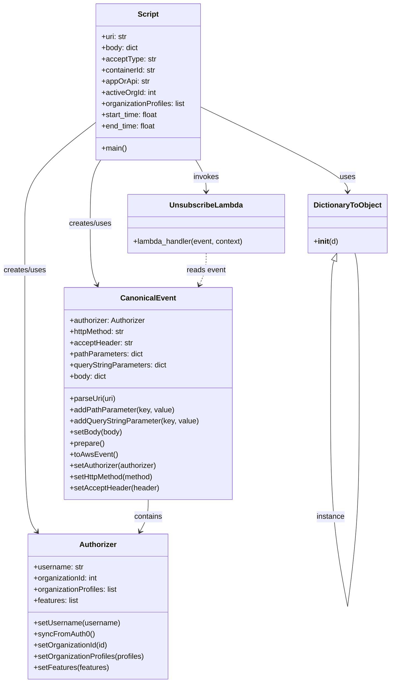
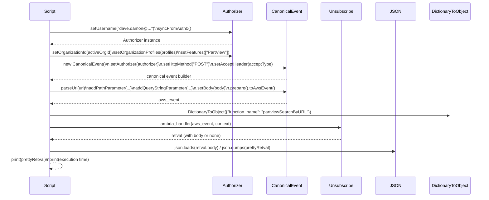

# Diagram: tools/ide_local_testing/localTest/test/byUrl/partviewUnsubscribeByUrl.py

> Auto-generated by Obscura crawlers

## Diagram 1

### SVG

<svg id="container" width="837.095703125" xmlns="http://www.w3.org/2000/svg" class="classDiagram" height="1468" viewBox="0 0 837.095703125 1468" role="graphics-document document" aria-roledescription="class"><g><defs><marker id="container_class-aggregationStart" class="marker aggregation class" refX="18" refY="7" markerWidth="190" markerHeight="240" orient="auto"><path d="M 18,7 L9,13 L1,7 L9,1 Z"></path></marker></defs><defs><marker id="container_class-aggregationEnd" class="marker aggregation class" refX="1" refY="7" markerWidth="20" markerHeight="28" orient="auto"><path d="M 18,7 L9,13 L1,7 L9,1 Z"></path></marker></defs><defs><marker id="container_class-extensionStart" class="marker extension class" refX="18" refY="7" markerWidth="190" markerHeight="240" orient="auto"><path d="M 1,7 L18,13 V 1 Z"></path></marker></defs><defs><marker id="container_class-extensionEnd" class="marker extension class" refX="1" refY="7" markerWidth="20" markerHeight="28" orient="auto"><path d="M 1,1 V 13 L18,7 Z"></path></marker></defs><defs><marker id="container_class-compositionStart" class="marker composition class" refX="18" refY="7" markerWidth="190" markerHeight="240" orient="auto"><path d="M 18,7 L9,13 L1,7 L9,1 Z"></path></marker></defs><defs><marker id="container_class-compositionEnd" class="marker composition class" refX="1" refY="7" markerWidth="20" markerHeight="28" orient="auto"><path d="M 18,7 L9,13 L1,7 L9,1 Z"></path></marker></defs><defs><marker id="container_class-dependencyStart" class="marker dependency class" refX="6" refY="7" markerWidth="190" markerHeight="240" orient="auto"><path d="M 5,7 L9,13 L1,7 L9,1 Z"></path></marker></defs><defs><marker id="container_class-dependencyEnd" class="marker dependency class" refX="13" refY="7" markerWidth="20" markerHeight="28" orient="auto"><path d="M 18,7 L9,13 L14,7 L9,1 Z"></path></marker></defs><defs><marker id="container_class-lollipopStart" class="marker lollipop class" refX="13" refY="7" markerWidth="190" markerHeight="240" orient="auto"><circle stroke="black" fill="transparent" cx="7" cy="7" r="6"></circle></marker></defs><defs><marker id="container_class-lollipopEnd" class="marker lollipop class" refX="1" refY="7" markerWidth="190" markerHeight="240" orient="auto"><circle stroke="black" fill="transparent" cx="7" cy="7" r="6"></circle></marker></defs><g class="root"><g class="clusters"></g><g class="edgePaths"><path d="M205.738,264.275L180.545,283.729C155.352,303.183,104.965,342.092,79.771,378.212C54.578,414.333,54.578,447.667,54.578,481C54.578,514.333,54.578,547.667,54.578,608.5C54.578,669.333,54.578,757.667,54.578,846C54.578,934.333,54.578,1022.667,59.015,1072.228C63.453,1121.789,72.327,1132.577,76.764,1137.972L81.202,1143.366" id="id_Script_Authorizer_1" class="edge-thickness-normal edge-pattern-solid relation" style=";;;" data-edge="true" data-et="edge" data-id="id_Script_Authorizer_1" data-points="W3sieCI6MjA1LjczODI4MTI1LCJ5IjoyNjQuMjc0Njk3NjI1MTQzNDZ9LHsieCI6NTQuNTc4MTI1LCJ5IjozODF9LHsieCI6NTQuNTc4MTI1LCJ5Ijo0ODF9LHsieCI6NTQuNTc4MTI1LCJ5Ijo1ODF9LHsieCI6NTQuNTc4MTI1LCJ5Ijo4NDZ9LHsieCI6NTQuNTc4MTI1LCJ5IjoxMTExfSx7IngiOjg1LjAxMzE4NjEyMzcwNDY2LCJ5IjoxMTQ4fV0=" marker-end="url(#container_class-dependencyEnd)"></path><path d="M217.233,344L213.459,350.167C209.685,356.333,202.136,368.667,198.362,391.5C194.588,414.333,194.588,447.667,194.588,481C194.588,514.333,194.588,547.667,197.08,569.596C199.571,591.526,204.555,602.051,207.047,607.314L209.538,612.577" id="id_Script_CanonicalEvent_2" class="edge-thickness-normal edge-pattern-solid relation" style=";;;" data-edge="true" data-et="edge" data-id="id_Script_CanonicalEvent_2" data-points="W3sieCI6MjE3LjIzMzExNzM3ODA0ODc3LCJ5IjozNDR9LHsieCI6MTk0LjU4Nzg5MDYyNSwieSI6MzgxfSx7IngiOjE5NC41ODc4OTA2MjUsInkiOjQ4MX0seyJ4IjoxOTQuNTg3ODkwNjI1LCJ5Ijo1ODF9LHsieCI6MjEyLjEwNTg5NjIyNjQxNTEsInkiOjYxOH1d" marker-end="url(#container_class-dependencyEnd)"></path><path d="M434.371,230.891L486.474,255.909C538.576,280.928,642.781,330.964,694.884,361.149C746.986,391.333,746.986,401.667,746.986,406.833L746.986,412" id="id_Script_DictionaryToObject_3" class="edge-thickness-normal edge-pattern-solid relation" style=";;;" data-edge="true" data-et="edge" data-id="id_Script_DictionaryToObject_3" data-points="W3sieCI6NDM0LjM3MTA5Mzc1LCJ5IjoyMzAuODkxMzcxNDc3OTc5MjJ9LHsieCI6NzQ2Ljk4NjMyODEyNSwieSI6MzgxfSx7IngiOjc0Ni45ODYzMjgxMjUsInkiOjQxOH1d" marker-end="url(#container_class-dependencyEnd)"></path><path d="M422.876,344L426.65,350.167C430.425,356.333,437.973,368.667,441.747,380C445.521,391.333,445.521,401.667,445.521,406.833L445.521,412" id="id_Script_UnsubscribeLambda_4" class="edge-thickness-normal edge-pattern-solid relation" style=";;;" data-edge="true" data-et="edge" data-id="id_Script_UnsubscribeLambda_4" data-points="W3sieCI6NDIyLjg3NjI1NzYyMTk1MTI1LCJ5IjozNDR9LHsieCI6NDQ1LjUyMTQ4NDM3NSwieSI6MzgxfSx7IngiOjQ0NS41MjE0ODQzNzUsInkiOjQxOH1d" marker-end="url(#container_class-dependencyEnd)"></path><path d="M320.055,1074L320.055,1080.167C320.055,1086.333,320.055,1098.667,317.129,1110.125C314.203,1121.583,308.351,1132.166,305.425,1137.458L302.499,1142.749" id="id_CanonicalEvent_Authorizer_5" class="edge-thickness-normal edge-pattern-solid relation" style=";;;" data-edge="true" data-et="edge" data-id="id_CanonicalEvent_Authorizer_5" data-points="W3sieCI6MzIwLjA1NDY4NzUsInkiOjEwNzR9LHsieCI6MzIwLjA1NDY4NzUsInkiOjExMTF9LHsieCI6Mjk5LjU5NTI3ODA5MjYxNjYsInkiOjExNDh9XQ==" marker-end="url(#container_class-dependencyEnd)"></path><path d="M445.521,544L445.521,550.167C445.521,556.333,445.521,568.667,443.03,580.096C440.538,591.526,435.554,602.051,433.063,607.314L430.571,612.577" id="id_UnsubscribeLambda_CanonicalEvent_6" class="edge-thickness-normal edge-pattern-dashed relation" style=";;;" data-edge="true" data-et="edge" data-id="id_UnsubscribeLambda_CanonicalEvent_6" data-points="W3sieCI6NDQ1LjUyMTQ4NDM3NSwieSI6NTQ0fSx7IngiOjQ0NS41MjE0ODQzNzUsInkiOjU4MX0seyJ4Ijo0MjguMDAzNDc4NzczNTg0OSwieSI6NjE4fV0=" marker-end="url(#container_class-dependencyEnd)"></path><path d="M718.087,560.205L716.822,563.671C715.558,567.137,713.029,574.068,711.764,621.693C710.5,669.317,710.5,757.633,710.5,801.792L710.5,845.95" id="DictionaryToObject-cyclic-special-1" class="edge-thickness-normal edge-pattern-solid relation" style=";;;" data-edge="true" data-et="edge" data-id="DictionaryToObject-cyclic-special-1" data-points="W3sieCI6NzIzLjk5OTY5NTMxMjczNDcsInkiOjU0NH0seyJ4Ijo3MTAuNDk5NjA5Mzc1MzcyNSwieSI6NTgxfSx7IngiOjcxMC40OTk2MDkzNzUzNzI1LCJ5Ijo4NDUuOTQ5OTk5OTk5MjU0OX1d" marker-start="url(#container_class-extensionStart)"></path><path d="M710.5,846.05L710.5,890.208C710.5,934.367,710.5,1022.683,716.579,1099C722.659,1175.317,734.818,1239.633,740.897,1271.792L746.977,1303.95" id="DictionaryToObject-cyclic-special-mid" class="edge-thickness-normal edge-pattern-solid relation" style=";;;" data-edge="true" data-et="edge" data-id="DictionaryToObject-cyclic-special-mid" data-points="W3sieCI6NzEwLjQ5OTYwOTM3NTM3MjUsInkiOjg0Ni4wNTAwMDAwMDA3NDUxfSx7IngiOjcxMC40OTk2MDkzNzUzNzI1LCJ5IjoxMTExfSx7IngiOjc0Ni45NzY4NzU2MDcwNDgzLCJ5IjoxMzAzLjk0OTk5OTk5OTI1NX1d"></path><path d="M746.993,1303.95L751.207,1271.792C755.42,1239.633,763.848,1175.317,768.062,1098.992C772.275,1022.667,772.275,934.333,772.275,846C772.275,757.667,772.275,669.333,770.716,619C769.156,568.667,766.037,556.333,764.478,550.167L762.918,544" id="DictionaryToObject-cyclic-special-2" class="edge-thickness-normal edge-pattern-solid relation" style=";;;" data-edge="true" data-et="edge" data-id="DictionaryToObject-cyclic-special-2" data-points="W3sieCI6NzQ2Ljk5Mjg3OTY5NTY5MzQsInkiOjEzMDMuOTQ5OTk5OTk5MjU1fSx7IngiOjc3Mi4yNzUzOTA2MjUsInkiOjExMTF9LHsieCI6NzcyLjI3NTM5MDYyNSwieSI6ODQ2fSx7IngiOjc3Mi4yNzUzOTA2MjUsInkiOjU4MX0seyJ4Ijo3NjIuOTE4NDM3NSwieSI6NTQ0fV0="></path></g><g class="edgeLabels"><g class="edgeLabel" transform="translate(54.578125, 581)"><g class="label" data-id="id_Script_Authorizer_1" transform="translate(-46.578125, -12)"><foreignObject width="93.15625" height="24">

creates/uses

</foreignObject></g></g><g class="edgeLabel" transform="translate(194.587890625, 481)"><g class="label" data-id="id_Script_CanonicalEvent_2" transform="translate(-46.578125, -12)"><foreignObject width="93.15625" height="24">

creates/uses

</foreignObject></g></g><g class="edgeLabel" transform="translate(746.986328125, 381)"><g class="label" data-id="id_Script_DictionaryToObject_3" transform="translate(-16.4921875, -12)"><foreignObject width="32.984375" height="24">

uses

</foreignObject></g></g><g class="edgeLabel" transform="translate(445.521484375, 381)"><g class="label" data-id="id_Script_UnsubscribeLambda_4" transform="translate(-27.5859375, -12)"><foreignObject width="55.171875" height="24">

invokes

</foreignObject></g></g><g class="edgeLabel" transform="translate(320.0546875, 1111)"><g class="label" data-id="id_CanonicalEvent_Authorizer_5" transform="translate(-30.890625, -12)"><foreignObject width="61.78125" height="24">

contains

</foreignObject></g></g><g class="edgeLabel" transform="translate(445.521484375, 581)"><g class="label" data-id="id_UnsubscribeLambda_CanonicalEvent_6" transform="translate(-42.2890625, -12)"><foreignObject width="84.578125" height="24">

reads event

</foreignObject></g></g><g class="edgeLabel"><g class="label" data-id="DictionaryToObject-cyclic-special-1" transform="translate(0, 0)"><foreignObject width="0" height="0">

</foreignObject></g></g><g class="edgeLabel" transform="translate(710.49961, 1076.70888)"><g class="label" data-id="DictionaryToObject-cyclic-special-mid" transform="translate(-30.578125, -12)"><foreignObject width="61.15625" height="24">

instance

</foreignObject></g></g><g class="edgeLabel"><g class="label" data-id="DictionaryToObject-cyclic-special-2" transform="translate(0, 0)"><foreignObject width="0" height="0">

</foreignObject></g></g></g><g class="nodes"><g class="node default" id="classId-Script-0" transform="translate(320.0546875, 176)"><g class="basic label-container"><path d="M-114.31640625 -168 L114.31640625 -168 L114.31640625 168 L-114.31640625 168" stroke="none" stroke-width="0" fill="#ECECFF" style=""></path><path d="M-114.31640625 -168 C-43.611219896377264 -168, 27.09396645724547 -168, 114.31640625 -168 M-114.31640625 -168 C-68.080816530025 -168, -21.845226810050022 -168, 114.31640625 -168 M114.31640625 -168 C114.31640625 -89.36387143168177, 114.31640625 -10.727742863363545, 114.31640625 168 M114.31640625 -168 C114.31640625 -77.78670496491043, 114.31640625 12.426590070179145, 114.31640625 168 M114.31640625 168 C44.200896045362626 168, -25.91461415927475 168, -114.31640625 168 M114.31640625 168 C50.82696447042272 168, -12.662477309154553 168, -114.31640625 168 M-114.31640625 168 C-114.31640625 48.68737931275385, -114.31640625 -70.6252413744923, -114.31640625 -168 M-114.31640625 168 C-114.31640625 63.28517571173623, -114.31640625 -41.42964857652754, -114.31640625 -168" stroke="#9370DB" stroke-width="1.3" fill="none" stroke-dasharray="0 0" style=""></path></g><g class="annotation-group text" transform="translate(0, -144)"></g><g class="label-group text" transform="translate(-21.7421875, -144)"><g class="label" style="font-weight: bolder" transform="translate(0,-12)"><foreignObject width="43.484375" height="24">

Script

</foreignObject></g></g><g class="members-group text" transform="translate(-102.31640625, -96)"><g class="label" style="" transform="translate(0,-12)"><foreignObject width="55.5" height="24">

+uri: str

</foreignObject></g><g class="label" style="" transform="translate(0,12)"><foreignObject width="79.921875" height="24">

+body: dict

</foreignObject></g><g class="label" style="" transform="translate(0,36)"><foreignObject width="116.34375" height="24">

+acceptType: str

</foreignObject></g><g class="label" style="" transform="translate(0,60)"><foreignObject width="118.984375" height="24">

+containerId: str

</foreignObject></g><g class="label" style="" transform="translate(0,84)"><foreignObject width="103.40625" height="24">

+appOrApi: str

</foreignObject></g><g class="label" style="" transform="translate(0,108)"><foreignObject width="118.28125" height="24">

+activeOrgId: int

</foreignObject></g><g class="label" style="" transform="translate(0,132)"><foreignObject width="182.890625" height="24">

+organizationProfiles: list

</foreignObject></g><g class="label" style="" transform="translate(0,156)"><foreignObject width="123.640625" height="24">

+start_time: float

</foreignObject></g><g class="label" style="" transform="translate(0,180)"><foreignObject width="117.515625" height="24">

+end_time: float

</foreignObject></g></g><g class="methods-group text" transform="translate(-102.31640625, 144)"><g class="label" style="" transform="translate(0,-12)"><foreignObject width="54.65625" height="24">

+main()

</foreignObject></g></g><g class="divider" style=""><path d="M-114.31640625 -120 C-67.31851502990435 -120, -20.320623809808694 -120, 114.31640625 -120 M-114.31640625 -120 C-44.13949971162046 -120, 26.03740682675908 -120, 114.31640625 -120" stroke="#9370DB" stroke-width="1.3" fill="none" stroke-dasharray="0 0" style=""></path></g><g class="divider" style=""><path d="M-114.31640625 120 C-40.593254388203675 120, 33.12989747359265 120, 114.31640625 120 M-114.31640625 120 C-29.189425330689986 120, 55.93755558862003 120, 114.31640625 120" stroke="#9370DB" stroke-width="1.3" fill="none" stroke-dasharray="0 0" style=""></path></g></g><g class="node default" id="classId-Authorizer-1" transform="translate(213.333984375, 1304)"><g class="basic label-container"><path d="M-151.66796875 -156 L151.66796875 -156 L151.66796875 156 L-151.66796875 156" stroke="none" stroke-width="0" fill="#ECECFF" style=""></path><path d="M-151.66796875 -156 C-79.07780468782067 -156, -6.4876406256413475 -156, 151.66796875 -156 M-151.66796875 -156 C-85.37094347905246 -156, -19.073918208104914 -156, 151.66796875 -156 M151.66796875 -156 C151.66796875 -85.68422445334056, 151.66796875 -15.368448906681124, 151.66796875 156 M151.66796875 -156 C151.66796875 -44.35884469074733, 151.66796875 67.28231061850533, 151.66796875 156 M151.66796875 156 C55.48224237595281 156, -40.703483998094384 156, -151.66796875 156 M151.66796875 156 C68.11637019552177 156, -15.435228358956465 156, -151.66796875 156 M-151.66796875 156 C-151.66796875 63.62944871916082, -151.66796875 -28.74110256167836, -151.66796875 -156 M-151.66796875 156 C-151.66796875 79.18182371755674, -151.66796875 2.363647435113478, -151.66796875 -156" stroke="#9370DB" stroke-width="1.3" fill="none" stroke-dasharray="0 0" style=""></path></g><g class="annotation-group text" transform="translate(0, -132)"></g><g class="label-group text" transform="translate(-38.3671875, -132)"><g class="label" style="font-weight: bolder" transform="translate(0,-12)"><foreignObject width="76.734375" height="24">

Authorizer

</foreignObject></g></g><g class="members-group text" transform="translate(-139.66796875, -84)"><g class="label" style="" transform="translate(0,-12)"><foreignObject width="107.6875" height="24">

+username: str

</foreignObject></g><g class="label" style="" transform="translate(0,12)"><foreignObject width="140.375" height="24">

+organizationId: int

</foreignObject></g><g class="label" style="" transform="translate(0,36)"><foreignObject width="182.890625" height="24">

+organizationProfiles: list

</foreignObject></g><g class="label" style="" transform="translate(0,60)"><foreignObject width="97.71875" height="24">

+features: list

</foreignObject></g></g><g class="methods-group text" transform="translate(-139.66796875, 36)"><g class="label" style="" transform="translate(0,-12)"><foreignObject width="185.90625" height="24">

+setUsername(username)

</foreignObject></g><g class="label" style="" transform="translate(0,12)"><foreignObject width="129.0625" height="24">

+syncFromAuth0()

</foreignObject></g><g class="label" style="" transform="translate(0,36)"><foreignObject width="160.78125" height="24">

+setOrganizationId(id)

</foreignObject></g><g class="label" style="" transform="translate(0,60)"><foreignObject width="240.96875" height="24">

+setOrganizationProfiles(profiles)

</foreignObject></g><g class="label" style="" transform="translate(0,84)"><foreignObject width="161.296875" height="24">

+setFeatures(features)

</foreignObject></g></g><g class="divider" style=""><path d="M-151.66796875 -108 C-72.41977192374839 -108, 6.8284249025032295 -108, 151.66796875 -108 M-151.66796875 -108 C-71.68144006833009 -108, 8.30508861333982 -108, 151.66796875 -108" stroke="#9370DB" stroke-width="1.3" fill="none" stroke-dasharray="0 0" style=""></path></g><g class="divider" style=""><path d="M-151.66796875 12 C-65.56353923000239 12, 20.540890289995218 12, 151.66796875 12 M-151.66796875 12 C-85.59768502868332 12, -19.52740130736663 12, 151.66796875 12" stroke="#9370DB" stroke-width="1.3" fill="none" stroke-dasharray="0 0" style=""></path></g></g><g class="node default" id="classId-CanonicalEvent-2" transform="translate(320.0546875, 846)"><g class="basic label-container"><path d="M-178.44140625 -228 L178.44140625 -228 L178.44140625 228 L-178.44140625 228" stroke="none" stroke-width="0" fill="#ECECFF" style=""></path><path d="M-178.44140625 -228 C-91.28245627520947 -228, -4.1235063004189385 -228, 178.44140625 -228 M-178.44140625 -228 C-94.43908454035723 -228, -10.436762830714457 -228, 178.44140625 -228 M178.44140625 -228 C178.44140625 -106.75988358626051, 178.44140625 14.480232827478972, 178.44140625 228 M178.44140625 -228 C178.44140625 -127.76176186456387, 178.44140625 -27.52352372912773, 178.44140625 228 M178.44140625 228 C52.90110814532916 228, -72.63918995934168 228, -178.44140625 228 M178.44140625 228 C57.14899485358343 228, -64.14341654283314 228, -178.44140625 228 M-178.44140625 228 C-178.44140625 134.19805443441123, -178.44140625 40.396108868822466, -178.44140625 -228 M-178.44140625 228 C-178.44140625 101.87416638672678, -178.44140625 -24.25166722654643, -178.44140625 -228" stroke="#9370DB" stroke-width="1.3" fill="none" stroke-dasharray="0 0" style=""></path></g><g class="annotation-group text" transform="translate(0, -204)"></g><g class="label-group text" transform="translate(-55.7109375, -204)"><g class="label" style="font-weight: bolder" transform="translate(0,-12)"><foreignObject width="111.421875" height="24">

CanonicalEvent

</foreignObject></g></g><g class="members-group text" transform="translate(-166.44140625, -156)"><g class="label" style="" transform="translate(0,-12)"><foreignObject width="166.40625" height="24">

+authorizer: Authorizer

</foreignObject></g><g class="label" style="" transform="translate(0,12)"><foreignObject width="121.15625" height="24">

+httpMethod: str

</foreignObject></g><g class="label" style="" transform="translate(0,36)"><foreignObject width="135.390625" height="24">

+acceptHeader: str

</foreignObject></g><g class="label" style="" transform="translate(0,60)"><foreignObject width="158.3125" height="24">

+pathParameters: dict

</foreignObject></g><g class="label" style="" transform="translate(0,84)"><foreignObject width="209.640625" height="24">

+queryStringParameters: dict

</foreignObject></g><g class="label" style="" transform="translate(0,108)"><foreignObject width="79.921875" height="24">

+body: dict

</foreignObject></g></g><g class="methods-group text" transform="translate(-166.44140625, 12)"><g class="label" style="" transform="translate(0,-12)"><foreignObject width="99.8125" height="24">

+parseUri(uri)

</foreignObject></g><g class="label" style="" transform="translate(0,12)"><foreignObject width="223.4375" height="24">

+addPathParameter(key, value)

</foreignObject></g><g class="label" style="" transform="translate(0,36)"><foreignObject width="277.171875" height="24">

+addQueryStringParameter(key, value)

</foreignObject></g><g class="label" style="" transform="translate(0,60)"><foreignObject width="113.125" height="24">

+setBody(body)

</foreignObject></g><g class="label" style="" transform="translate(0,84)"><foreignObject width="74.75" height="24">

+prepare()

</foreignObject></g><g class="label" style="" transform="translate(0,108)"><foreignObject width="101.1875" height="24">

+toAwsEvent()

</foreignObject></g><g class="label" style="" transform="translate(0,132)"><foreignObject width="190.75" height="24">

+setAuthorizer(authorizer)

</foreignObject></g><g class="label" style="" transform="translate(0,156)"><foreignObject width="184" height="24">

+setHttpMethod(method)

</foreignObject></g><g class="label" style="" transform="translate(0,180)"><foreignObject width="191.859375" height="24">

+setAcceptHeader(header)

</foreignObject></g></g><g class="divider" style=""><path d="M-178.44140625 -180 C-86.76260294082667 -180, 4.916200368346665 -180, 178.44140625 -180 M-178.44140625 -180 C-51.14182656356907 -180, 76.15775312286186 -180, 178.44140625 -180" stroke="#9370DB" stroke-width="1.3" fill="none" stroke-dasharray="0 0" style=""></path></g><g class="divider" style=""><path d="M-178.44140625 -12 C-91.1697227626314 -12, -3.8980392752627893 -12, 178.44140625 -12 M-178.44140625 -12 C-48.5943660293527 -12, 81.2526741912946 -12, 178.44140625 -12" stroke="#9370DB" stroke-width="1.3" fill="none" stroke-dasharray="0 0" style=""></path></g></g><g class="node default" id="classId-DictionaryToObject-3" transform="translate(746.986328125, 481)"><g class="basic label-container"><path d="M-82.109375 -63 L82.109375 -63 L82.109375 63 L-82.109375 63" stroke="none" stroke-width="0" fill="#ECECFF" style=""></path><path d="M-82.109375 -63 C-39.196553130342735 -63, 3.716268739314529 -63, 82.109375 -63 M-82.109375 -63 C-47.76928011472787 -63, -13.42918522945574 -63, 82.109375 -63 M82.109375 -63 C82.109375 -22.340245507438084, 82.109375 18.319508985123832, 82.109375 63 M82.109375 -63 C82.109375 -12.710311871538131, 82.109375 37.57937625692374, 82.109375 63 M82.109375 63 C36.40320534310847 63, -9.302964313783065 63, -82.109375 63 M82.109375 63 C34.81617458573872 63, -12.477025828522557 63, -82.109375 63 M-82.109375 63 C-82.109375 21.283347829392483, -82.109375 -20.433304341215035, -82.109375 -63 M-82.109375 63 C-82.109375 35.11872657593058, -82.109375 7.2374531518611604, -82.109375 -63" stroke="#9370DB" stroke-width="1.3" fill="none" stroke-dasharray="0 0" style=""></path></g><g class="annotation-group text" transform="translate(0, -39)"></g><g class="label-group text" transform="translate(-70.109375, -39)"><g class="label" style="font-weight: bolder" transform="translate(0,-12)"><foreignObject width="140.21875" height="24">

DictionaryToObject

</foreignObject></g></g><g class="members-group text" transform="translate(-70.109375, 9)"></g><g class="methods-group text" transform="translate(-70.109375, 39)"><g class="label" style="" transform="translate(0,-12)"><foreignObject width="52.359375" height="24">

+<strong>init</strong>(d)

</foreignObject></g></g><g class="divider" style=""><path d="M-82.109375 -15 C-17.01408150010856 -15, 48.08121199978288 -15, 82.109375 -15 M-82.109375 -15 C-24.678569417808333 -15, 32.75223616438333 -15, 82.109375 -15" stroke="#9370DB" stroke-width="1.3" fill="none" stroke-dasharray="0 0" style=""></path></g><g class="divider" style=""><path d="M-82.109375 9 C-46.360399270176764 9, -10.611423540353528 9, 82.109375 9 M-82.109375 9 C-45.42564210019611 9, -8.741909200392215 9, 82.109375 9" stroke="#9370DB" stroke-width="1.3" fill="none" stroke-dasharray="0 0" style=""></path></g></g><g class="node default" id="classId-UnsubscribeLambda-4" transform="translate(445.521484375, 481)"><g class="basic label-container"><path d="M-169.35546875 -63 L169.35546875 -63 L169.35546875 63 L-169.35546875 63" stroke="none" stroke-width="0" fill="#ECECFF" style=""></path><path d="M-169.35546875 -63 C-91.9533677052605 -63, -14.551266660521009 -63, 169.35546875 -63 M-169.35546875 -63 C-68.8921034782581 -63, 31.571261793483814 -63, 169.35546875 -63 M169.35546875 -63 C169.35546875 -29.63543453538435, 169.35546875 3.729130929231303, 169.35546875 63 M169.35546875 -63 C169.35546875 -30.53849189446762, 169.35546875 1.9230162110647626, 169.35546875 63 M169.35546875 63 C93.84521672316338 63, 18.33496469632675 63, -169.35546875 63 M169.35546875 63 C52.02567471254547 63, -65.30411932490907 63, -169.35546875 63 M-169.35546875 63 C-169.35546875 30.173171881853428, -169.35546875 -2.653656236293145, -169.35546875 -63 M-169.35546875 63 C-169.35546875 12.868032810761228, -169.35546875 -37.26393437847754, -169.35546875 -63" stroke="#9370DB" stroke-width="1.3" fill="none" stroke-dasharray="0 0" style=""></path></g><g class="annotation-group text" transform="translate(0, -39)"></g><g class="label-group text" transform="translate(-74.5234375, -39)"><g class="label" style="font-weight: bolder" transform="translate(0,-12)"><foreignObject width="149.046875" height="24">

UnsubscribeLambda

</foreignObject></g></g><g class="members-group text" transform="translate(-157.35546875, 9)"></g><g class="methods-group text" transform="translate(-157.35546875, 39)"><g class="label" style="" transform="translate(0,-12)"><foreignObject width="240.1875" height="24">

+lambda_handler(event, context)

</foreignObject></g></g><g class="divider" style=""><path d="M-169.35546875 -15 C-38.30459827309963 -15, 92.74627220380074 -15, 169.35546875 -15 M-169.35546875 -15 C-98.30545752616999 -15, -27.255446302339976 -15, 169.35546875 -15" stroke="#9370DB" stroke-width="1.3" fill="none" stroke-dasharray="0 0" style=""></path></g><g class="divider" style=""><path d="M-169.35546875 9 C-64.64442621131711 9, 40.06661632736578 9, 169.35546875 9 M-169.35546875 9 C-56.528623854237736 9, 56.29822104152453 9, 169.35546875 9" stroke="#9370DB" stroke-width="1.3" fill="none" stroke-dasharray="0 0" style=""></path></g></g><g class="label edgeLabel" id="DictionaryToObject---DictionaryToObject---1" transform="translate(710.4996093753725, 846)"><rect width="0.1" height="0.1"></rect><g class="label" style="" transform="translate(0, 0)"><rect></rect><foreignObject width="0" height="0">

</foreignObject></g></g><g class="label edgeLabel" id="DictionaryToObject---DictionaryToObject---2" transform="translate(746.986328125, 1304)"><rect width="0.1" height="0.1"></rect><g class="label" style="" transform="translate(0, 0)"><rect></rect><foreignObject width="0" height="0">

</foreignObject></g></g></g></g></g></svg>

## Diagram 2

### SVG

<svg id="container" width="1874.5" xmlns="http://www.w3.org/2000/svg" height="777" viewBox="-126.5 -10 1874.5 777" role="graphics-document document" aria-roledescription="sequence"><g><rect x="1540" y="691" fill="#eaeaea" stroke="#666" width="158" height="65" name="DictionaryToObject" rx="3" ry="3" class="actor actor-bottom"></rect><text x="1619" y="723.5" dominant-baseline="central" alignment-baseline="central" class="actor actor-box" style="text-anchor: middle; font-size: 16px; font-weight: 400;"><tspan x="1619" dy="0">DictionaryToObject</tspan></text></g><g><rect x="1340" y="691" fill="#eaeaea" stroke="#666" width="150" height="65" name="JSON" rx="3" ry="3" class="actor actor-bottom"></rect><text x="1415" y="723.5" dominant-baseline="central" alignment-baseline="central" class="actor actor-box" style="text-anchor: middle; font-size: 16px; font-weight: 400;"><tspan x="1415" dy="0">JSON</tspan></text></g><g><rect x="1140" y="691" fill="#eaeaea" stroke="#666" width="150" height="65" name="Lambda" rx="3" ry="3" class="actor actor-bottom"></rect><text x="1215" y="723.5" dominant-baseline="central" alignment-baseline="central" class="actor actor-box" style="text-anchor: middle; font-size: 16px; font-weight: 400;"><tspan x="1215" dy="0">Unsubscribe</tspan></text></g><g><rect x="940" y="691" fill="#eaeaea" stroke="#666" width="150" height="65" name="CanonicalEvent" rx="3" ry="3" class="actor actor-bottom"></rect><text x="1015" y="723.5" dominant-baseline="central" alignment-baseline="central" class="actor actor-box" style="text-anchor: middle; font-size: 16px; font-weight: 400;"><tspan x="1015" dy="0">CanonicalEvent</tspan></text></g><g><rect x="740" y="691" fill="#eaeaea" stroke="#666" width="150" height="65" name="Authorizer" rx="3" ry="3" class="actor actor-bottom"></rect><text x="815" y="723.5" dominant-baseline="central" alignment-baseline="central" class="actor actor-box" style="text-anchor: middle; font-size: 16px; font-weight: 400;"><tspan x="815" dy="0">Authorizer</tspan></text></g><g><rect x="0" y="691" fill="#eaeaea" stroke="#666" width="150" height="65" name="Script" rx="3" ry="3" class="actor actor-bottom"></rect><text x="75" y="723.5" dominant-baseline="central" alignment-baseline="central" class="actor actor-box" style="text-anchor: middle; font-size: 16px; font-weight: 400;"><tspan x="75" dy="0">Script</tspan></text></g><g><line id="actor5" x1="1619" y1="65" x2="1619" y2="691" class="actor-line 200" stroke-width="0.5px" stroke="#999" name="DictionaryToObject"></line><g id="root-5"><rect x="1540" y="0" fill="#eaeaea" stroke="#666" width="158" height="65" name="DictionaryToObject" rx="3" ry="3" class="actor actor-top"></rect><text x="1619" y="32.5" dominant-baseline="central" alignment-baseline="central" class="actor actor-box" style="text-anchor: middle; font-size: 16px; font-weight: 400;"><tspan x="1619" dy="0">DictionaryToObject</tspan></text></g></g><g><line id="actor4" x1="1415" y1="65" x2="1415" y2="691" class="actor-line 200" stroke-width="0.5px" stroke="#999" name="JSON"></line><g id="root-4"><rect x="1340" y="0" fill="#eaeaea" stroke="#666" width="150" height="65" name="JSON" rx="3" ry="3" class="actor actor-top"></rect><text x="1415" y="32.5" dominant-baseline="central" alignment-baseline="central" class="actor actor-box" style="text-anchor: middle; font-size: 16px; font-weight: 400;"><tspan x="1415" dy="0">JSON</tspan></text></g></g><g><line id="actor3" x1="1215" y1="65" x2="1215" y2="691" class="actor-line 200" stroke-width="0.5px" stroke="#999" name="Lambda"></line><g id="root-3"><rect x="1140" y="0" fill="#eaeaea" stroke="#666" width="150" height="65" name="Lambda" rx="3" ry="3" class="actor actor-top"></rect><text x="1215" y="32.5" dominant-baseline="central" alignment-baseline="central" class="actor actor-box" style="text-anchor: middle; font-size: 16px; font-weight: 400;"><tspan x="1215" dy="0">Unsubscribe</tspan></text></g></g><g><line id="actor2" x1="1015" y1="65" x2="1015" y2="691" class="actor-line 200" stroke-width="0.5px" stroke="#999" name="CanonicalEvent"></line><g id="root-2"><rect x="940" y="0" fill="#eaeaea" stroke="#666" width="150" height="65" name="CanonicalEvent" rx="3" ry="3" class="actor actor-top"></rect><text x="1015" y="32.5" dominant-baseline="central" alignment-baseline="central" class="actor actor-box" style="text-anchor: middle; font-size: 16px; font-weight: 400;"><tspan x="1015" dy="0">CanonicalEvent</tspan></text></g></g><g><line id="actor1" x1="815" y1="65" x2="815" y2="691" class="actor-line 200" stroke-width="0.5px" stroke="#999" name="Authorizer"></line><g id="root-1"><rect x="740" y="0" fill="#eaeaea" stroke="#666" width="150" height="65" name="Authorizer" rx="3" ry="3" class="actor actor-top"></rect><text x="815" y="32.5" dominant-baseline="central" alignment-baseline="central" class="actor actor-box" style="text-anchor: middle; font-size: 16px; font-weight: 400;"><tspan x="815" dy="0">Authorizer</tspan></text></g></g><g><line id="actor0" x1="75" y1="65" x2="75" y2="691" class="actor-line 200" stroke-width="0.5px" stroke="#999" name="Script"></line><g id="root-0"><rect x="0" y="0" fill="#eaeaea" stroke="#666" width="150" height="65" name="Script" rx="3" ry="3" class="actor actor-top"></rect><text x="75" y="32.5" dominant-baseline="central" alignment-baseline="central" class="actor actor-box" style="text-anchor: middle; font-size: 16px; font-weight: 400;"><tspan x="75" dy="0">Script</tspan></text></g></g><g></g><defs><symbol id="computer" width="24" height="24"><path transform="scale(.5)" d="M2 2v13h20v-13h-20zm18 11h-16v-9h16v9zm-10.228 6l.466-1h3.524l.467 1h-4.457zm14.228 3h-24l2-6h2.104l-1.33 4h18.45l-1.297-4h2.073l2 6zm-5-10h-14v-7h14v7z"></path></symbol></defs><defs><symbol id="database" fill-rule="evenodd" clip-rule="evenodd"><path transform="scale(.5)" d="M12.258.001l.256.004.255.005.253.008.251.01.249.012.247.015.246.016.242.019.241.02.239.023.236.024.233.027.231.028.229.031.225.032.223.034.22.036.217.038.214.04.211.041.208.043.205.045.201.046.198.048.194.05.191.051.187.053.183.054.18.056.175.057.172.059.168.06.163.061.16.063.155.064.15.066.074.033.073.033.071.034.07.034.069.035.068.035.067.035.066.035.064.036.064.036.062.036.06.036.06.037.058.037.058.037.055.038.055.038.053.038.052.038.051.039.05.039.048.039.047.039.045.04.044.04.043.04.041.04.04.041.039.041.037.041.036.041.034.041.033.042.032.042.03.042.029.042.027.042.026.043.024.043.023.043.021.043.02.043.018.044.017.043.015.044.013.044.012.044.011.045.009.044.007.045.006.045.004.045.002.045.001.045v17l-.001.045-.002.045-.004.045-.006.045-.007.045-.009.044-.011.045-.012.044-.013.044-.015.044-.017.043-.018.044-.02.043-.021.043-.023.043-.024.043-.026.043-.027.042-.029.042-.03.042-.032.042-.033.042-.034.041-.036.041-.037.041-.039.041-.04.041-.041.04-.043.04-.044.04-.045.04-.047.039-.048.039-.05.039-.051.039-.052.038-.053.038-.055.038-.055.038-.058.037-.058.037-.06.037-.06.036-.062.036-.064.036-.064.036-.066.035-.067.035-.068.035-.069.035-.07.034-.071.034-.073.033-.074.033-.15.066-.155.064-.16.063-.163.061-.168.06-.172.059-.175.057-.18.056-.183.054-.187.053-.191.051-.194.05-.198.048-.201.046-.205.045-.208.043-.211.041-.214.04-.217.038-.22.036-.223.034-.225.032-.229.031-.231.028-.233.027-.236.024-.239.023-.241.02-.242.019-.246.016-.247.015-.249.012-.251.01-.253.008-.255.005-.256.004-.258.001-.258-.001-.256-.004-.255-.005-.253-.008-.251-.01-.249-.012-.247-.015-.245-.016-.243-.019-.241-.02-.238-.023-.236-.024-.234-.027-.231-.028-.228-.031-.226-.032-.223-.034-.22-.036-.217-.038-.214-.04-.211-.041-.208-.043-.204-.045-.201-.046-.198-.048-.195-.05-.19-.051-.187-.053-.184-.054-.179-.056-.176-.057-.172-.059-.167-.06-.164-.061-.159-.063-.155-.064-.151-.066-.074-.033-.072-.033-.072-.034-.07-.034-.069-.035-.068-.035-.067-.035-.066-.035-.064-.036-.063-.036-.062-.036-.061-.036-.06-.037-.058-.037-.057-.037-.056-.038-.055-.038-.053-.038-.052-.038-.051-.039-.049-.039-.049-.039-.046-.039-.046-.04-.044-.04-.043-.04-.041-.04-.04-.041-.039-.041-.037-.041-.036-.041-.034-.041-.033-.042-.032-.042-.03-.042-.029-.042-.027-.042-.026-.043-.024-.043-.023-.043-.021-.043-.02-.043-.018-.044-.017-.043-.015-.044-.013-.044-.012-.044-.011-.045-.009-.044-.007-.045-.006-.045-.004-.045-.002-.045-.001-.045v-17l.001-.045.002-.045.004-.045.006-.045.007-.045.009-.044.011-.045.012-.044.013-.044.015-.044.017-.043.018-.044.02-.043.021-.043.023-.043.024-.043.026-.043.027-.042.029-.042.03-.042.032-.042.033-.042.034-.041.036-.041.037-.041.039-.041.04-.041.041-.04.043-.04.044-.04.046-.04.046-.039.049-.039.049-.039.051-.039.052-.038.053-.038.055-.038.056-.038.057-.037.058-.037.06-.037.061-.036.062-.036.063-.036.064-.036.066-.035.067-.035.068-.035.069-.035.07-.034.072-.034.072-.033.074-.033.151-.066.155-.064.159-.063.164-.061.167-.06.172-.059.176-.057.179-.056.184-.054.187-.053.19-.051.195-.05.198-.048.201-.046.204-.045.208-.043.211-.041.214-.04.217-.038.22-.036.223-.034.226-.032.228-.031.231-.028.234-.027.236-.024.238-.023.241-.02.243-.019.245-.016.247-.015.249-.012.251-.01.253-.008.255-.005.256-.004.258-.001.258.001zm-9.258 20.499v.01l.001.021.003.021.004.022.005.021.006.022.007.022.009.023.01.022.011.023.012.023.013.023.015.023.016.024.017.023.018.024.019.024.021.024.022.025.023.024.024.025.052.049.056.05.061.051.066.051.07.051.075.051.079.052.084.052.088.052.092.052.097.052.102.051.105.052.11.052.114.051.119.051.123.051.127.05.131.05.135.05.139.048.144.049.147.047.152.047.155.047.16.045.163.045.167.043.171.043.176.041.178.041.183.039.187.039.19.037.194.035.197.035.202.033.204.031.209.03.212.029.216.027.219.025.222.024.226.021.23.02.233.018.236.016.24.015.243.012.246.01.249.008.253.005.256.004.259.001.26-.001.257-.004.254-.005.25-.008.247-.011.244-.012.241-.014.237-.016.233-.018.231-.021.226-.021.224-.024.22-.026.216-.027.212-.028.21-.031.205-.031.202-.034.198-.034.194-.036.191-.037.187-.039.183-.04.179-.04.175-.042.172-.043.168-.044.163-.045.16-.046.155-.046.152-.047.148-.048.143-.049.139-.049.136-.05.131-.05.126-.05.123-.051.118-.052.114-.051.11-.052.106-.052.101-.052.096-.052.092-.052.088-.053.083-.051.079-.052.074-.052.07-.051.065-.051.06-.051.056-.05.051-.05.023-.024.023-.025.021-.024.02-.024.019-.024.018-.024.017-.024.015-.023.014-.024.013-.023.012-.023.01-.023.01-.022.008-.022.006-.022.006-.022.004-.022.004-.021.001-.021.001-.021v-4.127l-.077.055-.08.053-.083.054-.085.053-.087.052-.09.052-.093.051-.095.05-.097.05-.1.049-.102.049-.105.048-.106.047-.109.047-.111.046-.114.045-.115.045-.118.044-.12.043-.122.042-.124.042-.126.041-.128.04-.13.04-.132.038-.134.038-.135.037-.138.037-.139.035-.142.035-.143.034-.144.033-.147.032-.148.031-.15.03-.151.03-.153.029-.154.027-.156.027-.158.026-.159.025-.161.024-.162.023-.163.022-.165.021-.166.02-.167.019-.169.018-.169.017-.171.016-.173.015-.173.014-.175.013-.175.012-.177.011-.178.01-.179.008-.179.008-.181.006-.182.005-.182.004-.184.003-.184.002h-.37l-.184-.002-.184-.003-.182-.004-.182-.005-.181-.006-.179-.008-.179-.008-.178-.01-.176-.011-.176-.012-.175-.013-.173-.014-.172-.015-.171-.016-.17-.017-.169-.018-.167-.019-.166-.02-.165-.021-.163-.022-.162-.023-.161-.024-.159-.025-.157-.026-.156-.027-.155-.027-.153-.029-.151-.03-.15-.03-.148-.031-.146-.032-.145-.033-.143-.034-.141-.035-.14-.035-.137-.037-.136-.037-.134-.038-.132-.038-.13-.04-.128-.04-.126-.041-.124-.042-.122-.042-.12-.044-.117-.043-.116-.045-.113-.045-.112-.046-.109-.047-.106-.047-.105-.048-.102-.049-.1-.049-.097-.05-.095-.05-.093-.052-.09-.051-.087-.052-.085-.053-.083-.054-.08-.054-.077-.054v4.127zm0-5.654v.011l.001.021.003.021.004.021.005.022.006.022.007.022.009.022.01.022.011.023.012.023.013.023.015.024.016.023.017.024.018.024.019.024.021.024.022.024.023.025.024.024.052.05.056.05.061.05.066.051.07.051.075.052.079.051.084.052.088.052.092.052.097.052.102.052.105.052.11.051.114.051.119.052.123.05.127.051.131.05.135.049.139.049.144.048.147.048.152.047.155.046.16.045.163.045.167.044.171.042.176.042.178.04.183.04.187.038.19.037.194.036.197.034.202.033.204.032.209.03.212.028.216.027.219.025.222.024.226.022.23.02.233.018.236.016.24.014.243.012.246.01.249.008.253.006.256.003.259.001.26-.001.257-.003.254-.006.25-.008.247-.01.244-.012.241-.015.237-.016.233-.018.231-.02.226-.022.224-.024.22-.025.216-.027.212-.029.21-.03.205-.032.202-.033.198-.035.194-.036.191-.037.187-.039.183-.039.179-.041.175-.042.172-.043.168-.044.163-.045.16-.045.155-.047.152-.047.148-.048.143-.048.139-.05.136-.049.131-.05.126-.051.123-.051.118-.051.114-.052.11-.052.106-.052.101-.052.096-.052.092-.052.088-.052.083-.052.079-.052.074-.051.07-.052.065-.051.06-.05.056-.051.051-.049.023-.025.023-.024.021-.025.02-.024.019-.024.018-.024.017-.024.015-.023.014-.023.013-.024.012-.022.01-.023.01-.023.008-.022.006-.022.006-.022.004-.021.004-.022.001-.021.001-.021v-4.139l-.077.054-.08.054-.083.054-.085.052-.087.053-.09.051-.093.051-.095.051-.097.05-.1.049-.102.049-.105.048-.106.047-.109.047-.111.046-.114.045-.115.044-.118.044-.12.044-.122.042-.124.042-.126.041-.128.04-.13.039-.132.039-.134.038-.135.037-.138.036-.139.036-.142.035-.143.033-.144.033-.147.033-.148.031-.15.03-.151.03-.153.028-.154.028-.156.027-.158.026-.159.025-.161.024-.162.023-.163.022-.165.021-.166.02-.167.019-.169.018-.169.017-.171.016-.173.015-.173.014-.175.013-.175.012-.177.011-.178.009-.179.009-.179.007-.181.007-.182.005-.182.004-.184.003-.184.002h-.37l-.184-.002-.184-.003-.182-.004-.182-.005-.181-.007-.179-.007-.179-.009-.178-.009-.176-.011-.176-.012-.175-.013-.173-.014-.172-.015-.171-.016-.17-.017-.169-.018-.167-.019-.166-.02-.165-.021-.163-.022-.162-.023-.161-.024-.159-.025-.157-.026-.156-.027-.155-.028-.153-.028-.151-.03-.15-.03-.148-.031-.146-.033-.145-.033-.143-.033-.141-.035-.14-.036-.137-.036-.136-.037-.134-.038-.132-.039-.13-.039-.128-.04-.126-.041-.124-.042-.122-.043-.12-.043-.117-.044-.116-.044-.113-.046-.112-.046-.109-.046-.106-.047-.105-.048-.102-.049-.1-.049-.097-.05-.095-.051-.093-.051-.09-.051-.087-.053-.085-.052-.083-.054-.08-.054-.077-.054v4.139zm0-5.666v.011l.001.02.003.022.004.021.005.022.006.021.007.022.009.023.01.022.011.023.012.023.013.023.015.023.016.024.017.024.018.023.019.024.021.025.022.024.023.024.024.025.052.05.056.05.061.05.066.051.07.051.075.052.079.051.084.052.088.052.092.052.097.052.102.052.105.051.11.052.114.051.119.051.123.051.127.05.131.05.135.05.139.049.144.048.147.048.152.047.155.046.16.045.163.045.167.043.171.043.176.042.178.04.183.04.187.038.19.037.194.036.197.034.202.033.204.032.209.03.212.028.216.027.219.025.222.024.226.021.23.02.233.018.236.017.24.014.243.012.246.01.249.008.253.006.256.003.259.001.26-.001.257-.003.254-.006.25-.008.247-.01.244-.013.241-.014.237-.016.233-.018.231-.02.226-.022.224-.024.22-.025.216-.027.212-.029.21-.03.205-.032.202-.033.198-.035.194-.036.191-.037.187-.039.183-.039.179-.041.175-.042.172-.043.168-.044.163-.045.16-.045.155-.047.152-.047.148-.048.143-.049.139-.049.136-.049.131-.051.126-.05.123-.051.118-.052.114-.051.11-.052.106-.052.101-.052.096-.052.092-.052.088-.052.083-.052.079-.052.074-.052.07-.051.065-.051.06-.051.056-.05.051-.049.023-.025.023-.025.021-.024.02-.024.019-.024.018-.024.017-.024.015-.023.014-.024.013-.023.012-.023.01-.022.01-.023.008-.022.006-.022.006-.022.004-.022.004-.021.001-.021.001-.021v-4.153l-.077.054-.08.054-.083.053-.085.053-.087.053-.09.051-.093.051-.095.051-.097.05-.1.049-.102.048-.105.048-.106.048-.109.046-.111.046-.114.046-.115.044-.118.044-.12.043-.122.043-.124.042-.126.041-.128.04-.13.039-.132.039-.134.038-.135.037-.138.036-.139.036-.142.034-.143.034-.144.033-.147.032-.148.032-.15.03-.151.03-.153.028-.154.028-.156.027-.158.026-.159.024-.161.024-.162.023-.163.023-.165.021-.166.02-.167.019-.169.018-.169.017-.171.016-.173.015-.173.014-.175.013-.175.012-.177.01-.178.01-.179.009-.179.007-.181.006-.182.006-.182.004-.184.003-.184.001-.185.001-.185-.001-.184-.001-.184-.003-.182-.004-.182-.006-.181-.006-.179-.007-.179-.009-.178-.01-.176-.01-.176-.012-.175-.013-.173-.014-.172-.015-.171-.016-.17-.017-.169-.018-.167-.019-.166-.02-.165-.021-.163-.023-.162-.023-.161-.024-.159-.024-.157-.026-.156-.027-.155-.028-.153-.028-.151-.03-.15-.03-.148-.032-.146-.032-.145-.033-.143-.034-.141-.034-.14-.036-.137-.036-.136-.037-.134-.038-.132-.039-.13-.039-.128-.041-.126-.041-.124-.041-.122-.043-.12-.043-.117-.044-.116-.044-.113-.046-.112-.046-.109-.046-.106-.048-.105-.048-.102-.048-.1-.05-.097-.049-.095-.051-.093-.051-.09-.052-.087-.052-.085-.053-.083-.053-.08-.054-.077-.054v4.153zm8.74-8.179l-.257.004-.254.005-.25.008-.247.011-.244.012-.241.014-.237.016-.233.018-.231.021-.226.022-.224.023-.22.026-.216.027-.212.028-.21.031-.205.032-.202.033-.198.034-.194.036-.191.038-.187.038-.183.04-.179.041-.175.042-.172.043-.168.043-.163.045-.16.046-.155.046-.152.048-.148.048-.143.048-.139.049-.136.05-.131.05-.126.051-.123.051-.118.051-.114.052-.11.052-.106.052-.101.052-.096.052-.092.052-.088.052-.083.052-.079.052-.074.051-.07.052-.065.051-.06.05-.056.05-.051.05-.023.025-.023.024-.021.024-.02.025-.019.024-.018.024-.017.023-.015.024-.014.023-.013.023-.012.023-.01.023-.01.022-.008.022-.006.023-.006.021-.004.022-.004.021-.001.021-.001.021.001.021.001.021.004.021.004.022.006.021.006.023.008.022.01.022.01.023.012.023.013.023.014.023.015.024.017.023.018.024.019.024.02.025.021.024.023.024.023.025.051.05.056.05.06.05.065.051.07.052.074.051.079.052.083.052.088.052.092.052.096.052.101.052.106.052.11.052.114.052.118.051.123.051.126.051.131.05.136.05.139.049.143.048.148.048.152.048.155.046.16.046.163.045.168.043.172.043.175.042.179.041.183.04.187.038.191.038.194.036.198.034.202.033.205.032.21.031.212.028.216.027.22.026.224.023.226.022.231.021.233.018.237.016.241.014.244.012.247.011.25.008.254.005.257.004.26.001.26-.001.257-.004.254-.005.25-.008.247-.011.244-.012.241-.014.237-.016.233-.018.231-.021.226-.022.224-.023.22-.026.216-.027.212-.028.21-.031.205-.032.202-.033.198-.034.194-.036.191-.038.187-.038.183-.04.179-.041.175-.042.172-.043.168-.043.163-.045.16-.046.155-.046.152-.048.148-.048.143-.048.139-.049.136-.05.131-.05.126-.051.123-.051.118-.051.114-.052.11-.052.106-.052.101-.052.096-.052.092-.052.088-.052.083-.052.079-.052.074-.051.07-.052.065-.051.06-.05.056-.05.051-.05.023-.025.023-.024.021-.024.02-.025.019-.024.018-.024.017-.023.015-.024.014-.023.013-.023.012-.023.01-.023.01-.022.008-.022.006-.023.006-.021.004-.022.004-.021.001-.021.001-.021-.001-.021-.001-.021-.004-.021-.004-.022-.006-.021-.006-.023-.008-.022-.01-.022-.01-.023-.012-.023-.013-.023-.014-.023-.015-.024-.017-.023-.018-.024-.019-.024-.02-.025-.021-.024-.023-.024-.023-.025-.051-.05-.056-.05-.06-.05-.065-.051-.07-.052-.074-.051-.079-.052-.083-.052-.088-.052-.092-.052-.096-.052-.101-.052-.106-.052-.11-.052-.114-.052-.118-.051-.123-.051-.126-.051-.131-.05-.136-.05-.139-.049-.143-.048-.148-.048-.152-.048-.155-.046-.16-.046-.163-.045-.168-.043-.172-.043-.175-.042-.179-.041-.183-.04-.187-.038-.191-.038-.194-.036-.198-.034-.202-.033-.205-.032-.21-.031-.212-.028-.216-.027-.22-.026-.224-.023-.226-.022-.231-.021-.233-.018-.237-.016-.241-.014-.244-.012-.247-.011-.25-.008-.254-.005-.257-.004-.26-.001-.26.001z"></path></symbol></defs><defs><symbol id="clock" width="24" height="24"><path transform="scale(.5)" d="M12 2c5.514 0 10 4.486 10 10s-4.486 10-10 10-10-4.486-10-10 4.486-10 10-10zm0-2c-6.627 0-12 5.373-12 12s5.373 12 12 12 12-5.373 12-12-5.373-12-12-12zm5.848 12.459c.202.038.202.333.001.372-1.907.361-6.045 1.111-6.547 1.111-.719 0-1.301-.582-1.301-1.301 0-.512.77-5.447 1.125-7.445.034-.192.312-.181.343.014l.985 6.238 5.394 1.011z"></path></symbol></defs><defs><marker id="arrowhead" refX="7.9" refY="5" markerUnits="userSpaceOnUse" markerWidth="12" markerHeight="12" orient="auto-start-reverse"><path d="M -1 0 L 10 5 L 0 10 z"></path></marker></defs><defs><marker id="crosshead" markerWidth="15" markerHeight="8" orient="auto" refX="4" refY="4.5"><path fill="none" stroke="#000000" stroke-width="1pt" d="M 1,2 L 6,7 M 6,2 L 1,7" style="stroke-dasharray: 0, 0;"></path></marker></defs><defs><marker id="filled-head" refX="15.5" refY="7" markerWidth="20" markerHeight="28" orient="auto"><path d="M 18,7 L9,13 L14,7 L9,1 Z"></path></marker></defs><defs><marker id="sequencenumber" refX="15" refY="15" markerWidth="60" markerHeight="40" orient="auto"><circle cx="15" cy="15" r="6"></circle></marker></defs><text x="444" y="80" text-anchor="middle" dominant-baseline="middle" alignment-baseline="middle" class="messageText" dy="1em" style="font-size: 16px; font-weight: 400;">setUsername("dave.damon@...")\nsyncFromAuth0()</text><line x1="76" y1="113" x2="811" y2="113" class="messageLine0" stroke-width="2" stroke="none" marker-end="url(#arrowhead)" style="fill: none;"></line><text x="447" y="128" text-anchor="middle" dominant-baseline="middle" alignment-baseline="middle" class="messageText" dy="1em" style="font-size: 16px; font-weight: 400;">Authorizer instance</text><line x1="814" y1="161" x2="79" y2="161" class="messageLine1" stroke-width="2" stroke="none" marker-end="url(#arrowhead)" style="stroke-dasharray: 3, 3; fill: none;"></line><text x="444" y="176" text-anchor="middle" dominant-baseline="middle" alignment-baseline="middle" class="messageText" dy="1em" style="font-size: 16px; font-weight: 400;">setOrganizationId(activeOrgId)\nsetOrganizationProfiles(profiles)\nsetFeatures(["PartView"])</text><line x1="76" y1="209" x2="811" y2="209" class="messageLine0" stroke-width="2" stroke="none" marker-end="url(#arrowhead)" style="fill: none;"></line><text x="544" y="224" text-anchor="middle" dominant-baseline="middle" alignment-baseline="middle" class="messageText" dy="1em" style="font-size: 16px; font-weight: 400;">new CanonicalEvent()\n.setAuthorizer(authorizer)\n.setHttpMethod("POST")\n.setAcceptHeader(acceptType)</text><line x1="76" y1="257" x2="1011" y2="257" class="messageLine0" stroke-width="2" stroke="none" marker-end="url(#arrowhead)" style="fill: none;"></line><text x="547" y="272" text-anchor="middle" dominant-baseline="middle" alignment-baseline="middle" class="messageText" dy="1em" style="font-size: 16px; font-weight: 400;">canonical event builder</text><line x1="1014" y1="305" x2="79" y2="305" class="messageLine1" stroke-width="2" stroke="none" marker-end="url(#arrowhead)" style="stroke-dasharray: 3, 3; fill: none;"></line><text x="544" y="320" text-anchor="middle" dominant-baseline="middle" alignment-baseline="middle" class="messageText" dy="1em" style="font-size: 16px; font-weight: 400;">parseUri(uri)\naddPathParameter(...)\naddQueryStringParameter(...)\n.setBody(body)\n.prepare().toAwsEvent()</text><line x1="76" y1="353" x2="1011" y2="353" class="messageLine0" stroke-width="2" stroke="none" marker-end="url(#arrowhead)" style="fill: none;"></line><text x="547" y="368" text-anchor="middle" dominant-baseline="middle" alignment-baseline="middle" class="messageText" dy="1em" style="font-size: 16px; font-weight: 400;">aws_event</text><line x1="1014" y1="401" x2="79" y2="401" class="messageLine1" stroke-width="2" stroke="none" marker-end="url(#arrowhead)" style="stroke-dasharray: 3, 3; fill: none;"></line><text x="846" y="416" text-anchor="middle" dominant-baseline="middle" alignment-baseline="middle" class="messageText" dy="1em" style="font-size: 16px; font-weight: 400;">DictionaryToObject({"function_name": "partviewSearchByURL"})</text><line x1="76" y1="449" x2="1615" y2="449" class="messageLine0" stroke-width="2" stroke="none" marker-end="url(#arrowhead)" style="fill: none;"></line><text x="644" y="464" text-anchor="middle" dominant-baseline="middle" alignment-baseline="middle" class="messageText" dy="1em" style="font-size: 16px; font-weight: 400;">lambda_handler(aws_event, context)</text><line x1="76" y1="497" x2="1211" y2="497" class="messageLine0" stroke-width="2" stroke="none" marker-end="url(#arrowhead)" style="fill: none;"></line><text x="647" y="512" text-anchor="middle" dominant-baseline="middle" alignment-baseline="middle" class="messageText" dy="1em" style="font-size: 16px; font-weight: 400;">retval (with body or none)</text><line x1="1214" y1="545" x2="79" y2="545" class="messageLine1" stroke-width="2" stroke="none" marker-end="url(#arrowhead)" style="stroke-dasharray: 3, 3; fill: none;"></line><text x="744" y="560" text-anchor="middle" dominant-baseline="middle" alignment-baseline="middle" class="messageText" dy="1em" style="font-size: 16px; font-weight: 400;">json.loads(retval.body) / json.dumps(prettyRetval)</text><line x1="76" y1="593" x2="1411" y2="593" class="messageLine0" stroke-width="2" stroke="none" marker-end="url(#arrowhead)" style="fill: none;"></line><text x="76" y="608" text-anchor="middle" dominant-baseline="middle" alignment-baseline="middle" class="messageText" dy="1em" style="font-size: 16px; font-weight: 400;">print(prettyRetval)\nprint(execution time)</text><path d="M 76,641 C 136,631 136,671 76,661" class="messageLine1" stroke-width="2" stroke="none" marker-end="url(#arrowhead)" style="stroke-dasharray: 3, 3; fill: none;"></path></svg>
