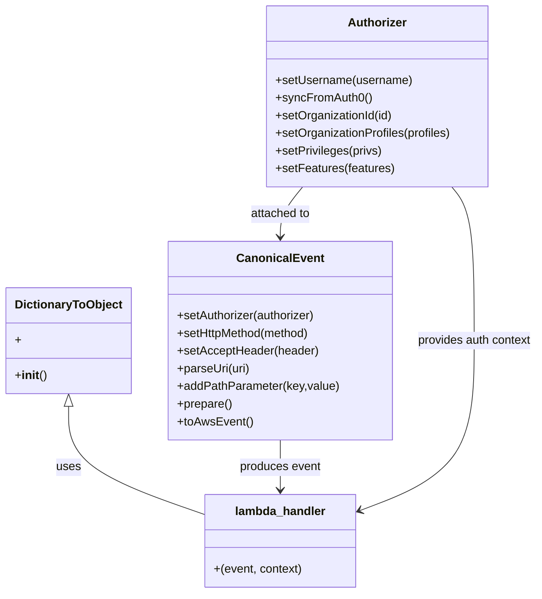

# Diagram: tools/ide_local_testing/localTest/test/byUrl/reusableContainerTrackingSearchByUrl.py


> Auto-generated by Obscura crawlers

## Diagram 1



### SVG

<svg id="container" width="721.4453125" xmlns="http://www.w3.org/2000/svg" class="classDiagram" height="806" viewBox="0 0 721.4453125 806" role="graphics-document document" aria-roledescription="class"><style>#container{font-family:"trebuchet ms",verdana,arial,sans-serif;font-size:16px;fill:#333;}@keyframes edge-animation-frame{from{stroke-dashoffset:0;}}@keyframes dash{to{stroke-dashoffset:0;}}#container .edge-animation-slow{stroke-dasharray:9,5!important;stroke-dashoffset:900;animation:dash 50s linear infinite;stroke-linecap:round;}#container .edge-animation-fast{stroke-dasharray:9,5!important;stroke-dashoffset:900;animation:dash 20s linear infinite;stroke-linecap:round;}#container .error-icon{fill:#552222;}#container .error-text{fill:#552222;stroke:#552222;}#container .edge-thickness-normal{stroke-width:1px;}#container .edge-thickness-thick{stroke-width:3.5px;}#container .edge-pattern-solid{stroke-dasharray:0;}#container .edge-thickness-invisible{stroke-width:0;fill:none;}#container .edge-pattern-dashed{stroke-dasharray:3;}#container .edge-pattern-dotted{stroke-dasharray:2;}#container .marker{fill:#333333;stroke:#333333;}#container .marker.cross{stroke:#333333;}#container svg{font-family:"trebuchet ms",verdana,arial,sans-serif;font-size:16px;}#container p{margin:0;}#container g.classGroup text{fill:#9370DB;stroke:none;font-family:"trebuchet ms",verdana,arial,sans-serif;font-size:10px;}#container g.classGroup text .title{font-weight:bolder;}#container .nodeLabel,#container .edgeLabel{color:#131300;}#container .edgeLabel .label rect{fill:#ECECFF;}#container .label text{fill:#131300;}#container .labelBkg{background:#ECECFF;}#container .edgeLabel .label span{background:#ECECFF;}#container .classTitle{font-weight:bolder;}#container .node rect,#container .node circle,#container .node ellipse,#container .node polygon,#container .node path{fill:#ECECFF;stroke:#9370DB;stroke-width:1px;}#container .divider{stroke:#9370DB;stroke-width:1;}#container g.clickable{cursor:pointer;}#container g.classGroup rect{fill:#ECECFF;stroke:#9370DB;}#container g.classGroup line{stroke:#9370DB;stroke-width:1;}#container .classLabel .box{stroke:none;stroke-width:0;fill:#ECECFF;opacity:0.5;}#container .classLabel .label{fill:#9370DB;font-size:10px;}#container .relation{stroke:#333333;stroke-width:1;fill:none;}#container .dashed-line{stroke-dasharray:3;}#container .dotted-line{stroke-dasharray:1 2;}#container #compositionStart,#container .composition{fill:#333333!important;stroke:#333333!important;stroke-width:1;}#container #compositionEnd,#container .composition{fill:#333333!important;stroke:#333333!important;stroke-width:1;}#container #dependencyStart,#container .dependency{fill:#333333!important;stroke:#333333!important;stroke-width:1;}#container #dependencyStart,#container .dependency{fill:#333333!important;stroke:#333333!important;stroke-width:1;}#container #extensionStart,#container .extension{fill:transparent!important;stroke:#333333!important;stroke-width:1;}#container #extensionEnd,#container .extension{fill:transparent!important;stroke:#333333!important;stroke-width:1;}#container #aggregationStart,#container .aggregation{fill:transparent!important;stroke:#333333!important;stroke-width:1;}#container #aggregationEnd,#container .aggregation{fill:transparent!important;stroke:#333333!important;stroke-width:1;}#container #lollipopStart,#container .lollipop{fill:#ECECFF!important;stroke:#333333!important;stroke-width:1;}#container #lollipopEnd,#container .lollipop{fill:#ECECFF!important;stroke:#333333!important;stroke-width:1;}#container .edgeTerminals{font-size:11px;line-height:initial;}#container .classTitleText{text-anchor:middle;font-size:18px;fill:#333;}#container .label-icon{display:inline-block;height:1em;overflow:visible;vertical-align:-0.125em;}#container .node .label-icon path{fill:currentColor;stroke:revert;stroke-width:revert;}#container :root{--mermaid-font-family:"trebuchet ms",verdana,arial,sans-serif;}</style><g><defs><marker id="container_class-aggregationStart" class="marker aggregation class" refX="18" refY="7" markerWidth="190" markerHeight="240" orient="auto"><path d="M 18,7 L9,13 L1,7 L9,1 Z"></path></marker></defs><defs><marker id="container_class-aggregationEnd" class="marker aggregation class" refX="1" refY="7" markerWidth="20" markerHeight="28" orient="auto"><path d="M 18,7 L9,13 L1,7 L9,1 Z"></path></marker></defs><defs><marker id="container_class-extensionStart" class="marker extension class" refX="18" refY="7" markerWidth="190" markerHeight="240" orient="auto"><path d="M 1,7 L18,13 V 1 Z"></path></marker></defs><defs><marker id="container_class-extensionEnd" class="marker extension class" refX="1" refY="7" markerWidth="20" markerHeight="28" orient="auto"><path d="M 1,1 V 13 L18,7 Z"></path></marker></defs><defs><marker id="container_class-compositionStart" class="marker composition class" refX="18" refY="7" markerWidth="190" markerHeight="240" orient="auto"><path d="M 18,7 L9,13 L1,7 L9,1 Z"></path></marker></defs><defs><marker id="container_class-compositionEnd" class="marker composition class" refX="1" refY="7" markerWidth="20" markerHeight="28" orient="auto"><path d="M 18,7 L9,13 L1,7 L9,1 Z"></path></marker></defs><defs><marker id="container_class-dependencyStart" class="marker dependency class" refX="6" refY="7" markerWidth="190" markerHeight="240" orient="auto"><path d="M 5,7 L9,13 L1,7 L9,1 Z"></path></marker></defs><defs><marker id="container_class-dependencyEnd" class="marker dependency class" refX="13" refY="7" markerWidth="20" markerHeight="28" orient="auto"><path d="M 18,7 L9,13 L14,7 L9,1 Z"></path></marker></defs><defs><marker id="container_class-lollipopStart" class="marker lollipop class" refX="13" refY="7" markerWidth="190" markerHeight="240" orient="auto"><circle stroke="black" fill="transparent" cx="7" cy="7" r="6"></circle></marker></defs><defs><marker id="container_class-lollipopEnd" class="marker lollipop class" refX="1" refY="7" markerWidth="190" markerHeight="240" orient="auto"><circle stroke="black" fill="transparent" cx="7" cy="7" r="6"></circle></marker></defs><g class="root"><g class="clusters"></g><g class="edgePaths"><path d="M90.109,552.25L90.109,566.042C90.109,579.833,90.109,607.417,119.94,631.815C149.771,656.214,209.432,677.428,239.263,688.035L269.094,698.642" id="id_DictionaryToObject_lambda_handler_1" class="edge-thickness-normal edge-pattern-solid relation" style=";;;" data-edge="true" data-et="edge" data-id="id_DictionaryToObject_lambda_handler_1" data-points="W3sieCI6OTAuMTA5Mzc1LCJ5Ijo1MzV9LHsieCI6OTAuMTA5Mzc1LCJ5Ijo2MzV9LHsieCI6MjY5LjA5Mzc1LCJ5Ijo2OTguNjQxNTQwNjE5NzQ4MX1d" marker-start="url(#container_class-extensionStart)"></path><path d="M371.348,598L371.348,604.167C371.348,610.333,371.348,622.667,371.348,634C371.348,645.333,371.348,655.667,371.348,660.833L371.348,666" id="id_CanonicalEvent_lambda_handler_2" class="edge-thickness-normal edge-pattern-solid relation" style=";;;" data-edge="true" data-et="edge" data-id="id_CanonicalEvent_lambda_handler_2" data-points="W3sieCI6MzcxLjM0NzY1NjI1LCJ5Ijo1OTh9LHsieCI6MzcxLjM0NzY1NjI1LCJ5Ijo2MzV9LHsieCI6MzcxLjM0NzY1NjI1LCJ5Ijo2NzJ9XQ==" marker-end="url(#container_class-dependencyEnd)"></path><path d="M401.77,254L396.7,260.167C391.629,266.333,381.488,278.667,376.418,290C371.348,301.333,371.348,311.667,371.348,316.833L371.348,322" id="id_Authorizer_CanonicalEvent_3" class="edge-thickness-normal edge-pattern-solid relation" style=";;;" data-edge="true" data-et="edge" data-id="id_Authorizer_CanonicalEvent_3" data-points="W3sieCI6NDAxLjc3MDEyOTM5NDUzMTI0LCJ5IjoyNTR9LHsieCI6MzcxLjM0NzY1NjI1LCJ5IjoyOTF9LHsieCI6MzcxLjM0NzY1NjI1LCJ5IjozMjh9XQ==" marker-end="url(#container_class-dependencyEnd)"></path><path d="M604.038,254L609.109,260.167C614.179,266.333,624.32,278.667,629.391,313.5C634.461,348.333,634.461,405.667,634.461,463C634.461,520.333,634.461,577.667,608.586,616.168C582.711,654.668,530.96,674.337,505.085,684.171L479.21,694.005" id="id_Authorizer_lambda_handler_4" class="edge-thickness-normal edge-pattern-solid relation" style=";;;" data-edge="true" data-et="edge" data-id="id_Authorizer_lambda_handler_4" data-points="W3sieCI6NjA0LjAzODQ2NDM1NTQ2ODcsInkiOjI1NH0seyJ4Ijo2MzQuNDYwOTM3NSwieSI6MjkxfSx7IngiOjYzNC40NjA5Mzc1LCJ5Ijo0NjN9LHsieCI6NjM0LjQ2MDkzNzUsInkiOjYzNX0seyJ4Ijo0NzMuNjAxNTYyNSwieSI6Njk2LjEzNjkyNzExOTY3NTh9XQ==" marker-end="url(#container_class-dependencyEnd)"></path></g><g class="edgeLabels"><g class="edgeLabel" transform="translate(90.109375, 635)"><g class="label" data-id="id_DictionaryToObject_lambda_handler_1" transform="translate(-16.4921875, -12)"><foreignObject width="32.984375" height="24"><div xmlns="http://www.w3.org/1999/xhtml" class="labelBkg" style="display: table-cell; white-space: nowrap; line-height: 1.5; max-width: 200px; text-align: center;"><span class="edgeLabel"><p>uses</p></span></div></foreignObject></g></g><g class="edgeLabel" transform="translate(371.34765625, 635)"><g class="label" data-id="id_CanonicalEvent_lambda_handler_2" transform="translate(-55.765625, -12)"><foreignObject width="111.53125" height="24"><div xmlns="http://www.w3.org/1999/xhtml" class="labelBkg" style="display: table-cell; white-space: nowrap; line-height: 1.5; max-width: 200px; text-align: center;"><span class="edgeLabel"><p>produces event</p></span></div></foreignObject></g></g><g class="edgeLabel" transform="translate(371.34765625, 291)"><g class="label" data-id="id_Authorizer_CanonicalEvent_3" transform="translate(-41.640625, -12)"><foreignObject width="83.28125" height="24"><div xmlns="http://www.w3.org/1999/xhtml" class="labelBkg" style="display: table-cell; white-space: nowrap; line-height: 1.5; max-width: 200px; text-align: center;"><span class="edgeLabel"><p>attached to</p></span></div></foreignObject></g></g><g class="edgeLabel" transform="translate(634.4609375, 463)"><g class="label" data-id="id_Authorizer_lambda_handler_4" transform="translate(-78.984375, -12)"><foreignObject width="157.96875" height="24"><div xmlns="http://www.w3.org/1999/xhtml" class="labelBkg" style="display: table-cell; white-space: nowrap; line-height: 1.5; max-width: 200px; text-align: center;"><span class="edgeLabel"><p>provides auth context</p></span></div></foreignObject></g></g></g><g class="nodes"><g class="node default" id="classId-DictionaryToObject-0" transform="translate(90.109375, 463)"><g class="basic label-container"><path d="M-82.109375 -72 L82.109375 -72 L82.109375 72 L-82.109375 72" stroke="none" stroke-width="0" fill="#ECECFF" style=""></path><path d="M-82.109375 -72 C-23.11654694615077 -72, 35.87628110769846 -72, 82.109375 -72 M-82.109375 -72 C-28.557886615002637 -72, 24.993601769994726 -72, 82.109375 -72 M82.109375 -72 C82.109375 -34.554515195915116, 82.109375 2.890969608169769, 82.109375 72 M82.109375 -72 C82.109375 -25.582680639306595, 82.109375 20.83463872138681, 82.109375 72 M82.109375 72 C38.765387441652926 72, -4.5786001166941475 72, -82.109375 72 M82.109375 72 C20.13496567550984 72, -41.83944364898032 72, -82.109375 72 M-82.109375 72 C-82.109375 32.8291605365323, -82.109375 -6.341678926935401, -82.109375 -72 M-82.109375 72 C-82.109375 42.91430845580645, -82.109375 13.828616911612905, -82.109375 -72" stroke="#9370DB" stroke-width="1.3" fill="none" stroke-dasharray="0 0" style=""></path></g><g class="annotation-group text" transform="translate(0, -48)"></g><g class="label-group text" transform="translate(-70.109375, -48)"><g class="label" style="font-weight: bolder" transform="translate(0,-12)"><foreignObject width="140.21875" height="24"><div xmlns="http://www.w3.org/1999/xhtml" style="display: table-cell; white-space: nowrap; line-height: 1.5; max-width: 188px; text-align: center;"><span class="nodeLabel markdown-node-label" style=""><p>DictionaryToObject</p></span></div></foreignObject></g></g><g class="members-group text" transform="translate(-70.109375, 0)"><g class="label" style="" transform="translate(0,-12)"><foreignObject width="7.984375" height="24"><div xmlns="http://www.w3.org/1999/xhtml" style="display: table-cell; white-space: nowrap; line-height: 1.5; max-width: 65px; text-align: center;"><span class="nodeLabel markdown-node-label" style=""><p>+</p></span></div></foreignObject></g></g><g class="methods-group text" transform="translate(-70.109375, 48)"><g class="label" style="" transform="translate(0,-12)"><foreignObject width="42.796875" height="24"><div xmlns="http://www.w3.org/1999/xhtml" style="display: table-cell; white-space: nowrap; line-height: 1.5; max-width: 132px; text-align: center;"><span class="nodeLabel markdown-node-label" style=""><p>+<strong>init</strong>()</p></span></div></foreignObject></g></g><g class="divider" style=""><path d="M-82.109375 -24 C-17.63273142979743 -24, 46.84391214040514 -24, 82.109375 -24 M-82.109375 -24 C-16.43829709760739 -24, 49.23278080478522 -24, 82.109375 -24" stroke="#9370DB" stroke-width="1.3" fill="none" stroke-dasharray="0 0" style=""></path></g><g class="divider" style=""><path d="M-82.109375 24 C-33.23364333924838 24, 15.642088321503238 24, 82.109375 24 M-82.109375 24 C-45.723912885287476 24, -9.338450770574951 24, 82.109375 24" stroke="#9370DB" stroke-width="1.3" fill="none" stroke-dasharray="0 0" style=""></path></g></g><g class="node default" id="classId-CanonicalEvent-1" transform="translate(371.34765625, 463)"><g class="basic label-container"><path d="M-149.12890625 -135 L149.12890625 -135 L149.12890625 135 L-149.12890625 135" stroke="none" stroke-width="0" fill="#ECECFF" style=""></path><path d="M-149.12890625 -135 C-49.66057344512221 -135, 49.80775935975558 -135, 149.12890625 -135 M-149.12890625 -135 C-79.21170987526537 -135, -9.29451350053074 -135, 149.12890625 -135 M149.12890625 -135 C149.12890625 -74.48836191044455, 149.12890625 -13.97672382088912, 149.12890625 135 M149.12890625 -135 C149.12890625 -32.20528435142572, 149.12890625 70.58943129714856, 149.12890625 135 M149.12890625 135 C82.49519738974428 135, 15.861488529488554 135, -149.12890625 135 M149.12890625 135 C85.51162453786205 135, 21.89434282572411 135, -149.12890625 135 M-149.12890625 135 C-149.12890625 62.655236915820325, -149.12890625 -9.68952616835935, -149.12890625 -135 M-149.12890625 135 C-149.12890625 67.43231509124094, -149.12890625 -0.13536981751812505, -149.12890625 -135" stroke="#9370DB" stroke-width="1.3" fill="none" stroke-dasharray="0 0" style=""></path></g><g class="annotation-group text" transform="translate(0, -111)"></g><g class="label-group text" transform="translate(-55.7109375, -111)"><g class="label" style="font-weight: bolder" transform="translate(0,-12)"><foreignObject width="111.421875" height="24"><div xmlns="http://www.w3.org/1999/xhtml" style="display: table-cell; white-space: nowrap; line-height: 1.5; max-width: 161px; text-align: center;"><span class="nodeLabel markdown-node-label" style=""><p>CanonicalEvent</p></span></div></foreignObject></g></g><g class="members-group text" transform="translate(-137.12890625, -63)"></g><g class="methods-group text" transform="translate(-137.12890625, -33)"><g class="label" style="" transform="translate(0,-12)"><foreignObject width="190.75" height="24"><div xmlns="http://www.w3.org/1999/xhtml" style="display: table-cell; white-space: nowrap; line-height: 1.5; max-width: 248px; text-align: center;"><span class="nodeLabel markdown-node-label" style=""><p>+setAuthorizer(authorizer)</p></span></div></foreignObject></g><g class="label" style="" transform="translate(0,12)"><foreignObject width="184" height="24"><div xmlns="http://www.w3.org/1999/xhtml" style="display: table-cell; white-space: nowrap; line-height: 1.5; max-width: 241px; text-align: center;"><span class="nodeLabel markdown-node-label" style=""><p>+setHttpMethod(method)</p></span></div></foreignObject></g><g class="label" style="" transform="translate(0,36)"><foreignObject width="191.859375" height="24"><div xmlns="http://www.w3.org/1999/xhtml" style="display: table-cell; white-space: nowrap; line-height: 1.5; max-width: 249px; text-align: center;"><span class="nodeLabel markdown-node-label" style=""><p>+setAcceptHeader(header)</p></span></div></foreignObject></g><g class="label" style="" transform="translate(0,60)"><foreignObject width="99.8125" height="24"><div xmlns="http://www.w3.org/1999/xhtml" style="display: table-cell; white-space: nowrap; line-height: 1.5; max-width: 157px; text-align: center;"><span class="nodeLabel markdown-node-label" style=""><p>+parseUri(uri)</p></span></div></foreignObject></g><g class="label" style="" transform="translate(0,84)"><foreignObject width="218.546875" height="24"><div xmlns="http://www.w3.org/1999/xhtml" style="display: table-cell; white-space: nowrap; line-height: 1.5; max-width: 276px; text-align: center;"><span class="nodeLabel markdown-node-label" style=""><p>+addPathParameter(key,value)</p></span></div></foreignObject></g><g class="label" style="" transform="translate(0,108)"><foreignObject width="74.75" height="24"><div xmlns="http://www.w3.org/1999/xhtml" style="display: table-cell; white-space: nowrap; line-height: 1.5; max-width: 132px; text-align: center;"><span class="nodeLabel markdown-node-label" style=""><p>+prepare()</p></span></div></foreignObject></g><g class="label" style="" transform="translate(0,132)"><foreignObject width="101.1875" height="24"><div xmlns="http://www.w3.org/1999/xhtml" style="display: table-cell; white-space: nowrap; line-height: 1.5; max-width: 159px; text-align: center;"><span class="nodeLabel markdown-node-label" style=""><p>+toAwsEvent()</p></span></div></foreignObject></g></g><g class="divider" style=""><path d="M-149.12890625 -87 C-82.34585751189 -87, -15.562808773780006 -87, 149.12890625 -87 M-149.12890625 -87 C-43.854548071155065 -87, 61.41981010768987 -87, 149.12890625 -87" stroke="#9370DB" stroke-width="1.3" fill="none" stroke-dasharray="0 0" style=""></path></g><g class="divider" style=""><path d="M-149.12890625 -63 C-67.6551293419355 -63, 13.818647566128988 -63, 149.12890625 -63 M-149.12890625 -63 C-88.46435494631879 -63, -27.7998036426376 -63, 149.12890625 -63" stroke="#9370DB" stroke-width="1.3" fill="none" stroke-dasharray="0 0" style=""></path></g></g><g class="node default" id="classId-Authorizer-2" transform="translate(502.904296875, 131)"><g class="basic label-container"><path d="M-151.66796875 -123 L151.66796875 -123 L151.66796875 123 L-151.66796875 123" stroke="none" stroke-width="0" fill="#ECECFF" style=""></path><path d="M-151.66796875 -123 C-81.7016379504826 -123, -11.735307150965212 -123, 151.66796875 -123 M-151.66796875 -123 C-68.97503552340319 -123, 13.717897703193614 -123, 151.66796875 -123 M151.66796875 -123 C151.66796875 -24.86660295098821, 151.66796875 73.26679409802358, 151.66796875 123 M151.66796875 -123 C151.66796875 -45.6521768669261, 151.66796875 31.695646266147804, 151.66796875 123 M151.66796875 123 C57.90334666649791 123, -35.86127541700418 123, -151.66796875 123 M151.66796875 123 C73.21841965252499 123, -5.231129444950028 123, -151.66796875 123 M-151.66796875 123 C-151.66796875 46.32110885392245, -151.66796875 -30.357782292155093, -151.66796875 -123 M-151.66796875 123 C-151.66796875 72.25229007334133, -151.66796875 21.50458014668267, -151.66796875 -123" stroke="#9370DB" stroke-width="1.3" fill="none" stroke-dasharray="0 0" style=""></path></g><g class="annotation-group text" transform="translate(0, -99)"></g><g class="label-group text" transform="translate(-38.3671875, -99)"><g class="label" style="font-weight: bolder" transform="translate(0,-12)"><foreignObject width="76.734375" height="24"><div xmlns="http://www.w3.org/1999/xhtml" style="display: table-cell; white-space: nowrap; line-height: 1.5; max-width: 126px; text-align: center;"><span class="nodeLabel markdown-node-label" style=""><p>Authorizer</p></span></div></foreignObject></g></g><g class="members-group text" transform="translate(-139.66796875, -51)"></g><g class="methods-group text" transform="translate(-139.66796875, -21)"><g class="label" style="" transform="translate(0,-12)"><foreignObject width="185.90625" height="24"><div xmlns="http://www.w3.org/1999/xhtml" style="display: table-cell; white-space: nowrap; line-height: 1.5; max-width: 243px; text-align: center;"><span class="nodeLabel markdown-node-label" style=""><p>+setUsername(username)</p></span></div></foreignObject></g><g class="label" style="" transform="translate(0,12)"><foreignObject width="129.0625" height="24"><div xmlns="http://www.w3.org/1999/xhtml" style="display: table-cell; white-space: nowrap; line-height: 1.5; max-width: 186px; text-align: center;"><span class="nodeLabel markdown-node-label" style=""><p>+syncFromAuth0()</p></span></div></foreignObject></g><g class="label" style="" transform="translate(0,36)"><foreignObject width="160.78125" height="24"><div xmlns="http://www.w3.org/1999/xhtml" style="display: table-cell; white-space: nowrap; line-height: 1.5; max-width: 218px; text-align: center;"><span class="nodeLabel markdown-node-label" style=""><p>+setOrganizationId(id)</p></span></div></foreignObject></g><g class="label" style="" transform="translate(0,60)"><foreignObject width="240.96875" height="24"><div xmlns="http://www.w3.org/1999/xhtml" style="display: table-cell; white-space: nowrap; line-height: 1.5; max-width: 298px; text-align: center;"><span class="nodeLabel markdown-node-label" style=""><p>+setOrganizationProfiles(profiles)</p></span></div></foreignObject></g><g class="label" style="" transform="translate(0,84)"><foreignObject width="145.390625" height="24"><div xmlns="http://www.w3.org/1999/xhtml" style="display: table-cell; white-space: nowrap; line-height: 1.5; max-width: 203px; text-align: center;"><span class="nodeLabel markdown-node-label" style=""><p>+setPrivileges(privs)</p></span></div></foreignObject></g><g class="label" style="" transform="translate(0,108)"><foreignObject width="161.296875" height="24"><div xmlns="http://www.w3.org/1999/xhtml" style="display: table-cell; white-space: nowrap; line-height: 1.5; max-width: 219px; text-align: center;"><span class="nodeLabel markdown-node-label" style=""><p>+setFeatures(features)</p></span></div></foreignObject></g></g><g class="divider" style=""><path d="M-151.66796875 -75 C-84.29649264730595 -75, -16.925016544611907 -75, 151.66796875 -75 M-151.66796875 -75 C-74.06254266411266 -75, 3.5428834217746896 -75, 151.66796875 -75" stroke="#9370DB" stroke-width="1.3" fill="none" stroke-dasharray="0 0" style=""></path></g><g class="divider" style=""><path d="M-151.66796875 -51 C-51.242056423703914 -51, 49.18385590259217 -51, 151.66796875 -51 M-151.66796875 -51 C-89.30754660767828 -51, -26.947124465356552 -51, 151.66796875 -51" stroke="#9370DB" stroke-width="1.3" fill="none" stroke-dasharray="0 0" style=""></path></g></g><g class="node default" id="classId-lambda_handler-3" transform="translate(371.34765625, 735)"><g class="basic label-container"><path d="M-102.25390625 -63 L102.25390625 -63 L102.25390625 63 L-102.25390625 63" stroke="none" stroke-width="0" fill="#ECECFF" style=""></path><path d="M-102.25390625 -63 C-38.941017962742286 -63, 24.371870324515427 -63, 102.25390625 -63 M-102.25390625 -63 C-59.317895101269755 -63, -16.38188395253951 -63, 102.25390625 -63 M102.25390625 -63 C102.25390625 -14.448074982726766, 102.25390625 34.10385003454647, 102.25390625 63 M102.25390625 -63 C102.25390625 -31.900234487436336, 102.25390625 -0.8004689748726719, 102.25390625 63 M102.25390625 63 C41.07073843755437 63, -20.112429374891263 63, -102.25390625 63 M102.25390625 63 C42.18222846539664 63, -17.88944931920672 63, -102.25390625 63 M-102.25390625 63 C-102.25390625 15.122544978826163, -102.25390625 -32.754910042347674, -102.25390625 -63 M-102.25390625 63 C-102.25390625 16.719150725971282, -102.25390625 -29.561698548057436, -102.25390625 -63" stroke="#9370DB" stroke-width="1.3" fill="none" stroke-dasharray="0 0" style=""></path></g><g class="annotation-group text" transform="translate(0, -39)"></g><g class="label-group text" transform="translate(-59.9765625, -39)"><g class="label" style="font-weight: bolder" transform="translate(0,-12)"><foreignObject width="119.953125" height="24"><div xmlns="http://www.w3.org/1999/xhtml" style="display: table-cell; white-space: nowrap; line-height: 1.5; max-width: 170px; text-align: center;"><span class="nodeLabel markdown-node-label" style=""><p>lambda_handler</p></span></div></foreignObject></g></g><g class="members-group text" transform="translate(-90.25390625, 9)"></g><g class="methods-group text" transform="translate(-90.25390625, 39)"><g class="label" style="" transform="translate(0,-12)"><foreignObject width="120.53125" height="24"><div xmlns="http://www.w3.org/1999/xhtml" style="display: table-cell; white-space: nowrap; line-height: 1.5; max-width: 171px; text-align: center;"><span class="nodeLabel markdown-node-label" style=""><p>+(event, context)</p></span></div></foreignObject></g></g><g class="divider" style=""><path d="M-102.25390625 -15 C-60.19610039424287 -15, -18.138294538485738 -15, 102.25390625 -15 M-102.25390625 -15 C-53.19873484286369 -15, -4.143563435727387 -15, 102.25390625 -15" stroke="#9370DB" stroke-width="1.3" fill="none" stroke-dasharray="0 0" style=""></path></g><g class="divider" style=""><path d="M-102.25390625 9 C-56.123373869042354 9, -9.992841488084707 9, 102.25390625 9 M-102.25390625 9 C-60.596766695986695 9, -18.93962714197339 9, 102.25390625 9" stroke="#9370DB" stroke-width="1.3" fill="none" stroke-dasharray="0 0" style=""></path></g></g></g></g></g></svg>

## Diagram 2

```mermaid
flowchart TD
    A[Start script] --> B[Create Authorizer]
    B --> C{activeOrgId?}
    C -- yes --> D[setOrganizationId / profiles / privileges / features]
    C -- no --> E[skip org setup]
    B --> F[Authorizer.syncFromAuth0()]
    F --> G[Create CanonicalEvent]
    G --> H[setHttpMethod / setAcceptHeader / parseUri / addPathParameter / prepare / toAwsEvent]
    H --> I[Call lambda_handler(event, DictionaryToObject({...}))]
    I --> J{retval.body?}
    J -- yes --> K[json.loads(body) -> prettyRetval -> print]
    J -- no --> L[prettyRetval = "" -> print]
    K --> M[End]
    L --> M
```

> SVG rendering failed for this diagram.
