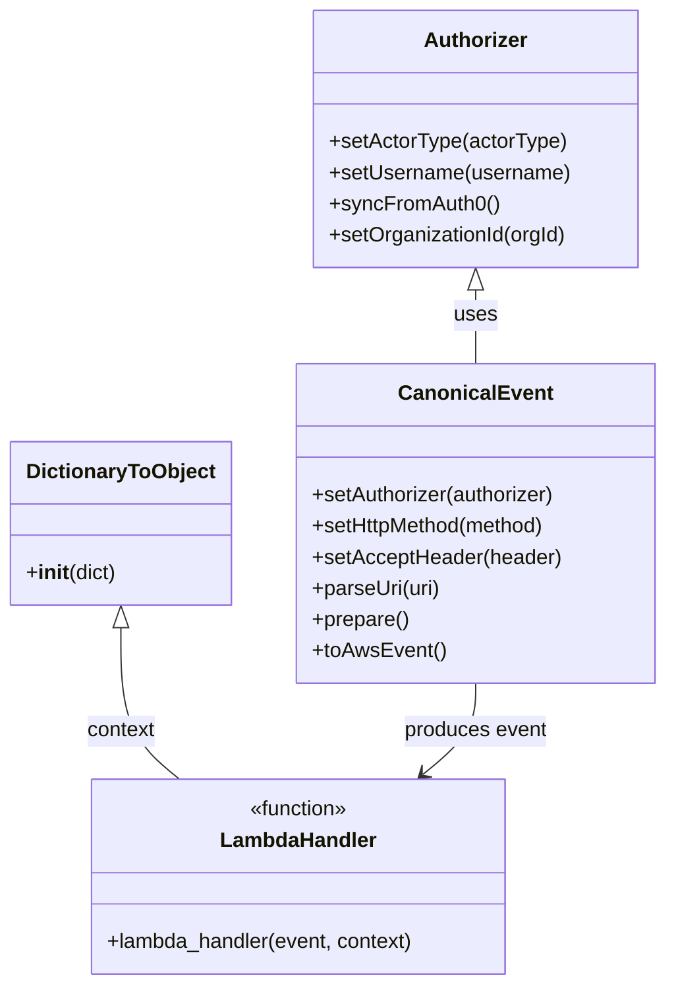

# Diagram: tools/ide_local_testing/localTest/test/byUrl/shipmentFilterSearch.py


> Auto-generated by Obscura crawlers

## Diagram 1



> SVG rendering failed for this diagram.

## Diagram 2

```mermaid
flowchart LR
    Start([Start Script])
    A[Import modules\n(core, shipment_service.ng_shipments.ng_filter)]
    B[Configure acceptType and URI]
    C[Create Authorizer\nsetActorType, setUsername,\nsyncFromAuth0]
    D{activeOrgId set?}
    E[authorizer.setOrganizationId(activeOrgId)]
    F[Build CanonicalEvent\nsetAuthorizer,\nsetHttpMethod,\nsetAcceptHeader,\nparseUri, prepare, toAwsEvent]
    G[Record start time]
    H[Call lambdaHandler(event, context)]
    I[Record end time]
    J{retval and body?}
    K[Parse JSON body\npretty print]
    L[Print prettyRetval\nPrint execution time]
    End([End])

    Start --> A --> B --> C --> D
    D -- yes --> E --> F
    D -- no --> F
    F --> G --> H --> I --> J
    J -- yes --> K --> L --> End
    J -- no --> L --> End
```

> SVG rendering failed for this diagram.
