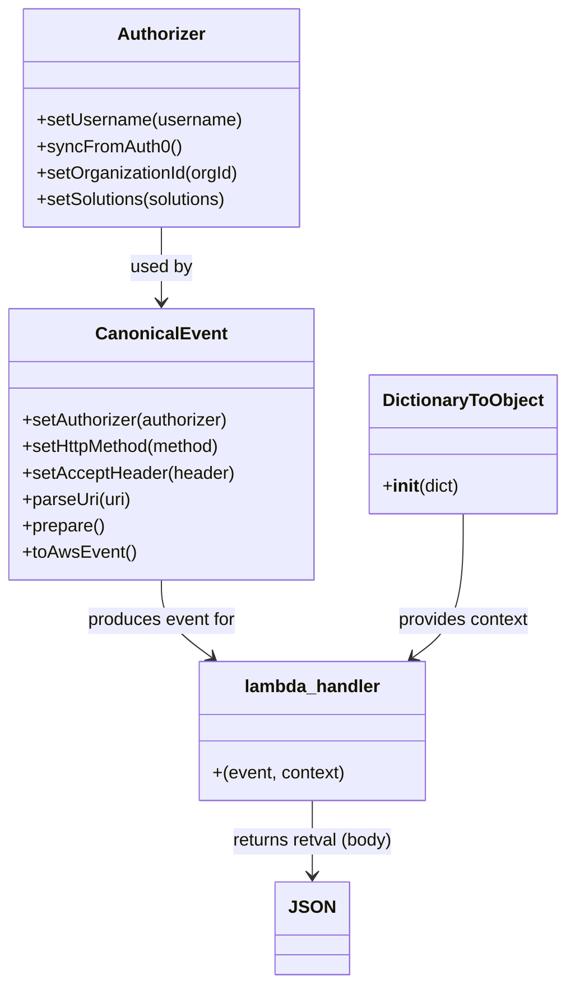

# Diagram: tools/ide_local_testing/localTest/test/byUrl/shipmentGetById.py


> Auto-generated by Obscura crawlers

## Diagram 1



### SVG

<svg id="container" width="501.9765625" xmlns="http://www.w3.org/2000/svg" class="classDiagram" height="892" viewBox="0 0 501.9765625 892" role="graphics-document document" aria-roledescription="class"><style>#container{font-family:"trebuchet ms",verdana,arial,sans-serif;font-size:16px;fill:#333;}@keyframes edge-animation-frame{from{stroke-dashoffset:0;}}@keyframes dash{to{stroke-dashoffset:0;}}#container .edge-animation-slow{stroke-dasharray:9,5!important;stroke-dashoffset:900;animation:dash 50s linear infinite;stroke-linecap:round;}#container .edge-animation-fast{stroke-dasharray:9,5!important;stroke-dashoffset:900;animation:dash 20s linear infinite;stroke-linecap:round;}#container .error-icon{fill:#552222;}#container .error-text{fill:#552222;stroke:#552222;}#container .edge-thickness-normal{stroke-width:1px;}#container .edge-thickness-thick{stroke-width:3.5px;}#container .edge-pattern-solid{stroke-dasharray:0;}#container .edge-thickness-invisible{stroke-width:0;fill:none;}#container .edge-pattern-dashed{stroke-dasharray:3;}#container .edge-pattern-dotted{stroke-dasharray:2;}#container .marker{fill:#333333;stroke:#333333;}#container .marker.cross{stroke:#333333;}#container svg{font-family:"trebuchet ms",verdana,arial,sans-serif;font-size:16px;}#container p{margin:0;}#container g.classGroup text{fill:#9370DB;stroke:none;font-family:"trebuchet ms",verdana,arial,sans-serif;font-size:10px;}#container g.classGroup text .title{font-weight:bolder;}#container .nodeLabel,#container .edgeLabel{color:#131300;}#container .edgeLabel .label rect{fill:#ECECFF;}#container .label text{fill:#131300;}#container .labelBkg{background:#ECECFF;}#container .edgeLabel .label span{background:#ECECFF;}#container .classTitle{font-weight:bolder;}#container .node rect,#container .node circle,#container .node ellipse,#container .node polygon,#container .node path{fill:#ECECFF;stroke:#9370DB;stroke-width:1px;}#container .divider{stroke:#9370DB;stroke-width:1;}#container g.clickable{cursor:pointer;}#container g.classGroup rect{fill:#ECECFF;stroke:#9370DB;}#container g.classGroup line{stroke:#9370DB;stroke-width:1;}#container .classLabel .box{stroke:none;stroke-width:0;fill:#ECECFF;opacity:0.5;}#container .classLabel .label{fill:#9370DB;font-size:10px;}#container .relation{stroke:#333333;stroke-width:1;fill:none;}#container .dashed-line{stroke-dasharray:3;}#container .dotted-line{stroke-dasharray:1 2;}#container #compositionStart,#container .composition{fill:#333333!important;stroke:#333333!important;stroke-width:1;}#container #compositionEnd,#container .composition{fill:#333333!important;stroke:#333333!important;stroke-width:1;}#container #dependencyStart,#container .dependency{fill:#333333!important;stroke:#333333!important;stroke-width:1;}#container #dependencyStart,#container .dependency{fill:#333333!important;stroke:#333333!important;stroke-width:1;}#container #extensionStart,#container .extension{fill:transparent!important;stroke:#333333!important;stroke-width:1;}#container #extensionEnd,#container .extension{fill:transparent!important;stroke:#333333!important;stroke-width:1;}#container #aggregationStart,#container .aggregation{fill:transparent!important;stroke:#333333!important;stroke-width:1;}#container #aggregationEnd,#container .aggregation{fill:transparent!important;stroke:#333333!important;stroke-width:1;}#container #lollipopStart,#container .lollipop{fill:#ECECFF!important;stroke:#333333!important;stroke-width:1;}#container #lollipopEnd,#container .lollipop{fill:#ECECFF!important;stroke:#333333!important;stroke-width:1;}#container .edgeTerminals{font-size:11px;line-height:initial;}#container .classTitleText{text-anchor:middle;font-size:18px;fill:#333;}#container .label-icon{display:inline-block;height:1em;overflow:visible;vertical-align:-0.125em;}#container .node .label-icon path{fill:currentColor;stroke:revert;stroke-width:revert;}#container :root{--mermaid-font-family:"trebuchet ms",verdana,arial,sans-serif;}</style><g><defs><marker id="container_class-aggregationStart" class="marker aggregation class" refX="18" refY="7" markerWidth="190" markerHeight="240" orient="auto"><path d="M 18,7 L9,13 L1,7 L9,1 Z"></path></marker></defs><defs><marker id="container_class-aggregationEnd" class="marker aggregation class" refX="1" refY="7" markerWidth="20" markerHeight="28" orient="auto"><path d="M 18,7 L9,13 L1,7 L9,1 Z"></path></marker></defs><defs><marker id="container_class-extensionStart" class="marker extension class" refX="18" refY="7" markerWidth="190" markerHeight="240" orient="auto"><path d="M 1,7 L18,13 V 1 Z"></path></marker></defs><defs><marker id="container_class-extensionEnd" class="marker extension class" refX="1" refY="7" markerWidth="20" markerHeight="28" orient="auto"><path d="M 1,1 V 13 L18,7 Z"></path></marker></defs><defs><marker id="container_class-compositionStart" class="marker composition class" refX="18" refY="7" markerWidth="190" markerHeight="240" orient="auto"><path d="M 18,7 L9,13 L1,7 L9,1 Z"></path></marker></defs><defs><marker id="container_class-compositionEnd" class="marker composition class" refX="1" refY="7" markerWidth="20" markerHeight="28" orient="auto"><path d="M 18,7 L9,13 L1,7 L9,1 Z"></path></marker></defs><defs><marker id="container_class-dependencyStart" class="marker dependency class" refX="6" refY="7" markerWidth="190" markerHeight="240" orient="auto"><path d="M 5,7 L9,13 L1,7 L9,1 Z"></path></marker></defs><defs><marker id="container_class-dependencyEnd" class="marker dependency class" refX="13" refY="7" markerWidth="20" markerHeight="28" orient="auto"><path d="M 18,7 L9,13 L14,7 L9,1 Z"></path></marker></defs><defs><marker id="container_class-lollipopStart" class="marker lollipop class" refX="13" refY="7" markerWidth="190" markerHeight="240" orient="auto"><circle stroke="black" fill="transparent" cx="7" cy="7" r="6"></circle></marker></defs><defs><marker id="container_class-lollipopEnd" class="marker lollipop class" refX="1" refY="7" markerWidth="190" markerHeight="240" orient="auto"><circle stroke="black" fill="transparent" cx="7" cy="7" r="6"></circle></marker></defs><g class="root"><g class="clusters"></g><g class="edgePaths"><path d="M143.785,206L143.785,212.167C143.785,218.333,143.785,230.667,143.785,242C143.785,253.333,143.785,263.667,143.785,268.833L143.785,274" id="id_Authorizer_CanonicalEvent_1" class="edge-thickness-normal edge-pattern-solid relation" style=";;;" data-edge="true" data-et="edge" data-id="id_Authorizer_CanonicalEvent_1" data-points="W3sieCI6MTQzLjc4NTE1NjI1LCJ5IjoyMDZ9LHsieCI6MTQzLjc4NTE1NjI1LCJ5IjoyNDN9LHsieCI6MTQzLjc4NTE1NjI1LCJ5IjoyODB9XQ==" marker-end="url(#container_class-dependencyEnd)"></path><path d="M143.785,526L143.785,532.167C143.785,538.333,143.785,550.667,151.247,562.402C158.708,574.137,173.631,585.274,181.093,590.843L188.554,596.411" id="id_CanonicalEvent_lambda_handler_2" class="edge-thickness-normal edge-pattern-solid relation" style=";;;" data-edge="true" data-et="edge" data-id="id_CanonicalEvent_lambda_handler_2" data-points="W3sieCI6MTQzLjc4NTE1NjI1LCJ5Ijo1MjZ9LHsieCI6MTQzLjc4NTE1NjI1LCJ5Ijo1NjN9LHsieCI6MTkzLjM2Mjk4ODI4MTI1LCJ5Ijo2MDB9XQ==" marker-end="url(#container_class-dependencyEnd)"></path><path d="M411.773,466L411.773,482.167C411.773,498.333,411.773,530.667,404.312,552.402C396.85,574.137,381.927,585.274,374.466,590.843L367.004,596.411" id="id_DictionaryToObject_lambda_handler_3" class="edge-thickness-normal edge-pattern-solid relation" style=";;;" data-edge="true" data-et="edge" data-id="id_DictionaryToObject_lambda_handler_3" data-points="W3sieCI6NDExLjc3MzQzNzUsInkiOjQ2Nn0seyJ4Ijo0MTEuNzczNDM3NSwieSI6NTYzfSx7IngiOjM2Mi4xOTU2MDU0Njg3NSwieSI6NjAwfV0=" marker-end="url(#container_class-dependencyEnd)"></path><path d="M277.779,726L277.779,732.167C277.779,738.333,277.779,750.667,277.779,762C277.779,773.333,277.779,783.667,277.779,788.833L277.779,794" id="id_lambda_handler_JSON_4" class="edge-thickness-normal edge-pattern-solid relation" style=";;;" data-edge="true" data-et="edge" data-id="id_lambda_handler_JSON_4" data-points="W3sieCI6Mjc3Ljc3OTI5Njg3NSwieSI6NzI2fSx7IngiOjI3Ny43NzkyOTY4NzUsInkiOjc2M30seyJ4IjoyNzcuNzc5Mjk2ODc1LCJ5Ijo4MDB9XQ==" marker-end="url(#container_class-dependencyEnd)"></path></g><g class="edgeLabels"><g class="edgeLabel" transform="translate(143.78515625, 243)"><g class="label" data-id="id_Authorizer_CanonicalEvent_1" transform="translate(-28.3125, -12)"><foreignObject width="56.625" height="24"><div xmlns="http://www.w3.org/1999/xhtml" class="labelBkg" style="display: table-cell; white-space: nowrap; line-height: 1.5; max-width: 200px; text-align: center;"><span class="edgeLabel"><p>used by</p></span></div></foreignObject></g></g><g class="edgeLabel" transform="translate(143.78515625, 563)"><g class="label" data-id="id_CanonicalEvent_lambda_handler_2" transform="translate(-68.2421875, -12)"><foreignObject width="136.484375" height="24"><div xmlns="http://www.w3.org/1999/xhtml" class="labelBkg" style="display: table-cell; white-space: nowrap; line-height: 1.5; max-width: 200px; text-align: center;"><span class="edgeLabel"><p>produces event for</p></span></div></foreignObject></g></g><g class="edgeLabel" transform="translate(411.7734375, 563)"><g class="label" data-id="id_DictionaryToObject_lambda_handler_3" transform="translate(-60.28125, -12)"><foreignObject width="120.5625" height="24"><div xmlns="http://www.w3.org/1999/xhtml" class="labelBkg" style="display: table-cell; white-space: nowrap; line-height: 1.5; max-width: 200px; text-align: center;"><span class="edgeLabel"><p>provides context</p></span></div></foreignObject></g></g><g class="edgeLabel" transform="translate(277.779296875, 763)"><g class="label" data-id="id_lambda_handler_JSON_4" transform="translate(-74.3125, -12)"><foreignObject width="148.625" height="24"><div xmlns="http://www.w3.org/1999/xhtml" class="labelBkg" style="display: table-cell; white-space: nowrap; line-height: 1.5; max-width: 200px; text-align: center;"><span class="edgeLabel"><p>returns retval (body)</p></span></div></foreignObject></g></g></g><g class="nodes"><g class="node default" id="classId-Authorizer-0" transform="translate(143.78515625, 107)"><g class="basic label-container"><path d="M-124.13671875 -99 L124.13671875 -99 L124.13671875 99 L-124.13671875 99" stroke="none" stroke-width="0" fill="#ECECFF" style=""></path><path d="M-124.13671875 -99 C-62.907038650110806 -99, -1.6773585502216122 -99, 124.13671875 -99 M-124.13671875 -99 C-59.645261809423886 -99, 4.846195131152228 -99, 124.13671875 -99 M124.13671875 -99 C124.13671875 -50.12152526370729, 124.13671875 -1.2430505274145816, 124.13671875 99 M124.13671875 -99 C124.13671875 -21.763668899760617, 124.13671875 55.472662200478766, 124.13671875 99 M124.13671875 99 C54.17372453604155 99, -15.789269677916906 99, -124.13671875 99 M124.13671875 99 C49.136329897992695 99, -25.86405895401461 99, -124.13671875 99 M-124.13671875 99 C-124.13671875 36.42468064299417, -124.13671875 -26.150638714011663, -124.13671875 -99 M-124.13671875 99 C-124.13671875 43.98144306223339, -124.13671875 -11.037113875533223, -124.13671875 -99" stroke="#9370DB" stroke-width="1.3" fill="none" stroke-dasharray="0 0" style=""></path></g><g class="annotation-group text" transform="translate(0, -75)"></g><g class="label-group text" transform="translate(-38.3671875, -75)"><g class="label" style="font-weight: bolder" transform="translate(0,-12)"><foreignObject width="76.734375" height="24"><div xmlns="http://www.w3.org/1999/xhtml" style="display: table-cell; white-space: nowrap; line-height: 1.5; max-width: 126px; text-align: center;"><span class="nodeLabel markdown-node-label" style=""><p>Authorizer</p></span></div></foreignObject></g></g><g class="members-group text" transform="translate(-112.13671875, -27)"></g><g class="methods-group text" transform="translate(-112.13671875, 3)"><g class="label" style="" transform="translate(0,-12)"><foreignObject width="185.90625" height="24"><div xmlns="http://www.w3.org/1999/xhtml" style="display: table-cell; white-space: nowrap; line-height: 1.5; max-width: 243px; text-align: center;"><span class="nodeLabel markdown-node-label" style=""><p>+setUsername(username)</p></span></div></foreignObject></g><g class="label" style="" transform="translate(0,12)"><foreignObject width="129.0625" height="24"><div xmlns="http://www.w3.org/1999/xhtml" style="display: table-cell; white-space: nowrap; line-height: 1.5; max-width: 186px; text-align: center;"><span class="nodeLabel markdown-node-label" style=""><p>+syncFromAuth0()</p></span></div></foreignObject></g><g class="label" style="" transform="translate(0,36)"><foreignObject width="184.578125" height="24"><div xmlns="http://www.w3.org/1999/xhtml" style="display: table-cell; white-space: nowrap; line-height: 1.5; max-width: 242px; text-align: center;"><span class="nodeLabel markdown-node-label" style=""><p>+setOrganizationId(orgId)</p></span></div></foreignObject></g><g class="label" style="" transform="translate(0,60)"><foreignObject width="176.171875" height="24"><div xmlns="http://www.w3.org/1999/xhtml" style="display: table-cell; white-space: nowrap; line-height: 1.5; max-width: 234px; text-align: center;"><span class="nodeLabel markdown-node-label" style=""><p>+setSolutions(solutions)</p></span></div></foreignObject></g></g><g class="divider" style=""><path d="M-124.13671875 -51 C-58.09885170245917 -51, 7.939015345081657 -51, 124.13671875 -51 M-124.13671875 -51 C-63.07450358896117 -51, -2.0122884279223427 -51, 124.13671875 -51" stroke="#9370DB" stroke-width="1.3" fill="none" stroke-dasharray="0 0" style=""></path></g><g class="divider" style=""><path d="M-124.13671875 -27 C-74.30035007656943 -27, -24.463981403138845 -27, 124.13671875 -27 M-124.13671875 -27 C-36.92841003177125 -27, 50.2798986864575 -27, 124.13671875 -27" stroke="#9370DB" stroke-width="1.3" fill="none" stroke-dasharray="0 0" style=""></path></g></g><g class="node default" id="classId-CanonicalEvent-1" transform="translate(143.78515625, 403)"><g class="basic label-container"><path d="M-135.78515625 -123 L135.78515625 -123 L135.78515625 123 L-135.78515625 123" stroke="none" stroke-width="0" fill="#ECECFF" style=""></path><path d="M-135.78515625 -123 C-42.95617716387072 -123, 49.87280192225856 -123, 135.78515625 -123 M-135.78515625 -123 C-35.72563403146164 -123, 64.33388818707672 -123, 135.78515625 -123 M135.78515625 -123 C135.78515625 -45.56187912924459, 135.78515625 31.876241741510825, 135.78515625 123 M135.78515625 -123 C135.78515625 -40.47156614785135, 135.78515625 42.056867704297304, 135.78515625 123 M135.78515625 123 C42.24051992250601 123, -51.30411640498798 123, -135.78515625 123 M135.78515625 123 C36.867242891209 123, -62.050670467581995 123, -135.78515625 123 M-135.78515625 123 C-135.78515625 31.78467464181675, -135.78515625 -59.4306507163665, -135.78515625 -123 M-135.78515625 123 C-135.78515625 50.01843249021344, -135.78515625 -22.963135019573116, -135.78515625 -123" stroke="#9370DB" stroke-width="1.3" fill="none" stroke-dasharray="0 0" style=""></path></g><g class="annotation-group text" transform="translate(0, -99)"></g><g class="label-group text" transform="translate(-55.7109375, -99)"><g class="label" style="font-weight: bolder" transform="translate(0,-12)"><foreignObject width="111.421875" height="24"><div xmlns="http://www.w3.org/1999/xhtml" style="display: table-cell; white-space: nowrap; line-height: 1.5; max-width: 161px; text-align: center;"><span class="nodeLabel markdown-node-label" style=""><p>CanonicalEvent</p></span></div></foreignObject></g></g><g class="members-group text" transform="translate(-123.78515625, -51)"></g><g class="methods-group text" transform="translate(-123.78515625, -21)"><g class="label" style="" transform="translate(0,-12)"><foreignObject width="190.75" height="24"><div xmlns="http://www.w3.org/1999/xhtml" style="display: table-cell; white-space: nowrap; line-height: 1.5; max-width: 248px; text-align: center;"><span class="nodeLabel markdown-node-label" style=""><p>+setAuthorizer(authorizer)</p></span></div></foreignObject></g><g class="label" style="" transform="translate(0,12)"><foreignObject width="184" height="24"><div xmlns="http://www.w3.org/1999/xhtml" style="display: table-cell; white-space: nowrap; line-height: 1.5; max-width: 241px; text-align: center;"><span class="nodeLabel markdown-node-label" style=""><p>+setHttpMethod(method)</p></span></div></foreignObject></g><g class="label" style="" transform="translate(0,36)"><foreignObject width="191.859375" height="24"><div xmlns="http://www.w3.org/1999/xhtml" style="display: table-cell; white-space: nowrap; line-height: 1.5; max-width: 249px; text-align: center;"><span class="nodeLabel markdown-node-label" style=""><p>+setAcceptHeader(header)</p></span></div></foreignObject></g><g class="label" style="" transform="translate(0,60)"><foreignObject width="99.8125" height="24"><div xmlns="http://www.w3.org/1999/xhtml" style="display: table-cell; white-space: nowrap; line-height: 1.5; max-width: 157px; text-align: center;"><span class="nodeLabel markdown-node-label" style=""><p>+parseUri(uri)</p></span></div></foreignObject></g><g class="label" style="" transform="translate(0,84)"><foreignObject width="74.75" height="24"><div xmlns="http://www.w3.org/1999/xhtml" style="display: table-cell; white-space: nowrap; line-height: 1.5; max-width: 132px; text-align: center;"><span class="nodeLabel markdown-node-label" style=""><p>+prepare()</p></span></div></foreignObject></g><g class="label" style="" transform="translate(0,108)"><foreignObject width="101.1875" height="24"><div xmlns="http://www.w3.org/1999/xhtml" style="display: table-cell; white-space: nowrap; line-height: 1.5; max-width: 159px; text-align: center;"><span class="nodeLabel markdown-node-label" style=""><p>+toAwsEvent()</p></span></div></foreignObject></g></g><g class="divider" style=""><path d="M-135.78515625 -75 C-72.54979647934776 -75, -9.314436708695524 -75, 135.78515625 -75 M-135.78515625 -75 C-46.33453472130594 -75, 43.116086807388115 -75, 135.78515625 -75" stroke="#9370DB" stroke-width="1.3" fill="none" stroke-dasharray="0 0" style=""></path></g><g class="divider" style=""><path d="M-135.78515625 -51 C-41.94557298160005 -51, 51.8940102867999 -51, 135.78515625 -51 M-135.78515625 -51 C-75.8062724675404 -51, -15.827388685080805 -51, 135.78515625 -51" stroke="#9370DB" stroke-width="1.3" fill="none" stroke-dasharray="0 0" style=""></path></g></g><g class="node default" id="classId-DictionaryToObject-2" transform="translate(411.7734375, 403)"><g class="basic label-container"><path d="M-82.203125 -63 L82.203125 -63 L82.203125 63 L-82.203125 63" stroke="none" stroke-width="0" fill="#ECECFF" style=""></path><path d="M-82.203125 -63 C-17.751491477517277 -63, 46.700142044965446 -63, 82.203125 -63 M-82.203125 -63 C-25.048692942062566 -63, 32.10573911587487 -63, 82.203125 -63 M82.203125 -63 C82.203125 -21.741432849537873, 82.203125 19.517134300924255, 82.203125 63 M82.203125 -63 C82.203125 -13.706790106277047, 82.203125 35.586419787445905, 82.203125 63 M82.203125 63 C34.66829348539357 63, -12.866538029212862 63, -82.203125 63 M82.203125 63 C46.38753867925221 63, 10.571952358504419 63, -82.203125 63 M-82.203125 63 C-82.203125 12.825128090117822, -82.203125 -37.349743819764356, -82.203125 -63 M-82.203125 63 C-82.203125 29.173401611083342, -82.203125 -4.653196777833315, -82.203125 -63" stroke="#9370DB" stroke-width="1.3" fill="none" stroke-dasharray="0 0" style=""></path></g><g class="annotation-group text" transform="translate(0, -39)"></g><g class="label-group text" transform="translate(-70.109375, -39)"><g class="label" style="font-weight: bolder" transform="translate(0,-12)"><foreignObject width="140.21875" height="24"><div xmlns="http://www.w3.org/1999/xhtml" style="display: table-cell; white-space: nowrap; line-height: 1.5; max-width: 188px; text-align: center;"><span class="nodeLabel markdown-node-label" style=""><p>DictionaryToObject</p></span></div></foreignObject></g></g><g class="members-group text" transform="translate(-70.203125, 9)"></g><g class="methods-group text" transform="translate(-70.203125, 39)"><g class="label" style="" transform="translate(0,-12)"><foreignObject width="70.296875" height="24"><div xmlns="http://www.w3.org/1999/xhtml" style="display: table-cell; white-space: nowrap; line-height: 1.5; max-width: 159px; text-align: center;"><span class="nodeLabel markdown-node-label" style=""><p>+<strong>init</strong>(dict)</p></span></div></foreignObject></g></g><g class="divider" style=""><path d="M-82.203125 -15 C-24.911263697056604 -15, 32.38059760588679 -15, 82.203125 -15 M-82.203125 -15 C-43.97501522540944 -15, -5.746905450818886 -15, 82.203125 -15" stroke="#9370DB" stroke-width="1.3" fill="none" stroke-dasharray="0 0" style=""></path></g><g class="divider" style=""><path d="M-82.203125 9 C-29.69925572454317 9, 22.804613550913658 9, 82.203125 9 M-82.203125 9 C-21.757002318203476 9, 38.68912036359305 9, 82.203125 9" stroke="#9370DB" stroke-width="1.3" fill="none" stroke-dasharray="0 0" style=""></path></g></g><g class="node default" id="classId-lambda_handler-3" transform="translate(277.779296875, 663)"><g class="basic label-container"><path d="M-102.25390625 -63 L102.25390625 -63 L102.25390625 63 L-102.25390625 63" stroke="none" stroke-width="0" fill="#ECECFF" style=""></path><path d="M-102.25390625 -63 C-20.607545241396764 -63, 61.03881576720647 -63, 102.25390625 -63 M-102.25390625 -63 C-51.203546300545376 -63, -0.15318635109075274 -63, 102.25390625 -63 M102.25390625 -63 C102.25390625 -32.347921384678486, 102.25390625 -1.6958427693569647, 102.25390625 63 M102.25390625 -63 C102.25390625 -31.38518940191755, 102.25390625 0.2296211961648993, 102.25390625 63 M102.25390625 63 C42.69317120615036 63, -16.86756383769928 63, -102.25390625 63 M102.25390625 63 C42.54971615670266 63, -17.154473936594684 63, -102.25390625 63 M-102.25390625 63 C-102.25390625 33.257458083236145, -102.25390625 3.5149161664722826, -102.25390625 -63 M-102.25390625 63 C-102.25390625 15.240769909345126, -102.25390625 -32.51846018130975, -102.25390625 -63" stroke="#9370DB" stroke-width="1.3" fill="none" stroke-dasharray="0 0" style=""></path></g><g class="annotation-group text" transform="translate(0, -39)"></g><g class="label-group text" transform="translate(-59.9765625, -39)"><g class="label" style="font-weight: bolder" transform="translate(0,-12)"><foreignObject width="119.953125" height="24"><div xmlns="http://www.w3.org/1999/xhtml" style="display: table-cell; white-space: nowrap; line-height: 1.5; max-width: 170px; text-align: center;"><span class="nodeLabel markdown-node-label" style=""><p>lambda_handler</p></span></div></foreignObject></g></g><g class="members-group text" transform="translate(-90.25390625, 9)"></g><g class="methods-group text" transform="translate(-90.25390625, 39)"><g class="label" style="" transform="translate(0,-12)"><foreignObject width="120.53125" height="24"><div xmlns="http://www.w3.org/1999/xhtml" style="display: table-cell; white-space: nowrap; line-height: 1.5; max-width: 171px; text-align: center;"><span class="nodeLabel markdown-node-label" style=""><p>+(event, context)</p></span></div></foreignObject></g></g><g class="divider" style=""><path d="M-102.25390625 -15 C-52.2109144523508 -15, -2.1679226547015986 -15, 102.25390625 -15 M-102.25390625 -15 C-57.89200557733719 -15, -13.530104904674374 -15, 102.25390625 -15" stroke="#9370DB" stroke-width="1.3" fill="none" stroke-dasharray="0 0" style=""></path></g><g class="divider" style=""><path d="M-102.25390625 9 C-24.513086618861124 9, 53.22773301227775 9, 102.25390625 9 M-102.25390625 9 C-28.852914211205217 9, 44.548077827589566 9, 102.25390625 9" stroke="#9370DB" stroke-width="1.3" fill="none" stroke-dasharray="0 0" style=""></path></g></g><g class="node default" id="classId-JSON-4" transform="translate(277.779296875, 842)"><g class="basic label-container"><path d="M-29.9453125 -42 L29.9453125 -42 L29.9453125 42 L-29.9453125 42" stroke="none" stroke-width="0" fill="#ECECFF" style=""></path><path d="M-29.9453125 -42 C-7.5273823453754005 -42, 14.890547809249199 -42, 29.9453125 -42 M-29.9453125 -42 C-7.892245693135191 -42, 14.160821113729618 -42, 29.9453125 -42 M29.9453125 -42 C29.9453125 -9.81396103343858, 29.9453125 22.37207793312284, 29.9453125 42 M29.9453125 -42 C29.9453125 -21.3455738886089, 29.9453125 -0.6911477772178003, 29.9453125 42 M29.9453125 42 C13.787133717866482 42, -2.3710450642670367 42, -29.9453125 42 M29.9453125 42 C15.750494029128753 42, 1.555675558257505 42, -29.9453125 42 M-29.9453125 42 C-29.9453125 23.459647110469067, -29.9453125 4.919294220938134, -29.9453125 -42 M-29.9453125 42 C-29.9453125 9.186839356294783, -29.9453125 -23.626321287410434, -29.9453125 -42" stroke="#9370DB" stroke-width="1.3" fill="none" stroke-dasharray="0 0" style=""></path></g><g class="annotation-group text" transform="translate(0, -18)"></g><g class="label-group text" transform="translate(-17.9453125, -18)"><g class="label" style="font-weight: bolder" transform="translate(0,-12)"><foreignObject width="35.890625" height="24"><div xmlns="http://www.w3.org/1999/xhtml" style="display: table-cell; white-space: nowrap; line-height: 1.5; max-width: 86px; text-align: center;"><span class="nodeLabel markdown-node-label" style=""><p>JSON</p></span></div></foreignObject></g></g><g class="members-group text" transform="translate(-17.9453125, 30)"></g><g class="methods-group text" transform="translate(-17.9453125, 60)"></g><g class="divider" style=""><path d="M-29.9453125 6 C-13.344174932052727 6, 3.2569626358945456 6, 29.9453125 6 M-29.9453125 6 C-15.9035479933434 6, -1.8617834866868002 6, 29.9453125 6" stroke="#9370DB" stroke-width="1.3" fill="none" stroke-dasharray="0 0" style=""></path></g><g class="divider" style=""><path d="M-29.9453125 24 C-11.364965597578916 24, 7.215381304842168 24, 29.9453125 24 M-29.9453125 24 C-8.15744416018017 24, 13.630424179639661 24, 29.9453125 24" stroke="#9370DB" stroke-width="1.3" fill="none" stroke-dasharray="0 0" style=""></path></g></g></g></g></g></svg>

## Diagram 2

```mermaid
flowchart TD
    A[Start script] --> B[Create Authorizer]
    B --> C{set username and sync}
    C --> D[setOrganizationId if activeOrgId]
    D --> E[Build CanonicalEvent]
    E --> F[prepare and toAwsEvent]
    F --> G[Call lambda_handler(event, context)]
    G --> H{retval has body?}
    H -->|yes| I[parse JSON body and pretty print]
    H -->|no| J[prettyRetval = ""]
    I --> K[print prettyRetval]
    J --> K
    K --> L[End]
```

> SVG rendering failed for this diagram.
