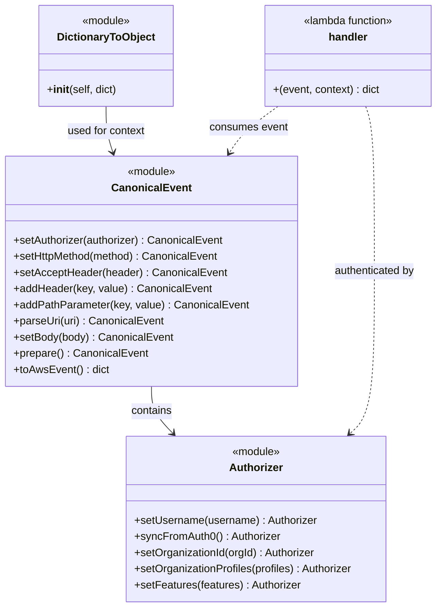

# Diagram: tools/ide_local_testing/localTest/test/byUrl/shipmentLOStatus.py


> Auto-generated by Obscura crawlers

## Diagram 1



### SVG

<svg id="container" width="648.44921875" xmlns="http://www.w3.org/2000/svg" class="classDiagram" height="902" viewBox="0 0 648.44921875 902" role="graphics-document document" aria-roledescription="class"><style>#container{font-family:"trebuchet ms",verdana,arial,sans-serif;font-size:16px;fill:#333;}@keyframes edge-animation-frame{from{stroke-dashoffset:0;}}@keyframes dash{to{stroke-dashoffset:0;}}#container .edge-animation-slow{stroke-dasharray:9,5!important;stroke-dashoffset:900;animation:dash 50s linear infinite;stroke-linecap:round;}#container .edge-animation-fast{stroke-dasharray:9,5!important;stroke-dashoffset:900;animation:dash 20s linear infinite;stroke-linecap:round;}#container .error-icon{fill:#552222;}#container .error-text{fill:#552222;stroke:#552222;}#container .edge-thickness-normal{stroke-width:1px;}#container .edge-thickness-thick{stroke-width:3.5px;}#container .edge-pattern-solid{stroke-dasharray:0;}#container .edge-thickness-invisible{stroke-width:0;fill:none;}#container .edge-pattern-dashed{stroke-dasharray:3;}#container .edge-pattern-dotted{stroke-dasharray:2;}#container .marker{fill:#333333;stroke:#333333;}#container .marker.cross{stroke:#333333;}#container svg{font-family:"trebuchet ms",verdana,arial,sans-serif;font-size:16px;}#container p{margin:0;}#container g.classGroup text{fill:#9370DB;stroke:none;font-family:"trebuchet ms",verdana,arial,sans-serif;font-size:10px;}#container g.classGroup text .title{font-weight:bolder;}#container .nodeLabel,#container .edgeLabel{color:#131300;}#container .edgeLabel .label rect{fill:#ECECFF;}#container .label text{fill:#131300;}#container .labelBkg{background:#ECECFF;}#container .edgeLabel .label span{background:#ECECFF;}#container .classTitle{font-weight:bolder;}#container .node rect,#container .node circle,#container .node ellipse,#container .node polygon,#container .node path{fill:#ECECFF;stroke:#9370DB;stroke-width:1px;}#container .divider{stroke:#9370DB;stroke-width:1;}#container g.clickable{cursor:pointer;}#container g.classGroup rect{fill:#ECECFF;stroke:#9370DB;}#container g.classGroup line{stroke:#9370DB;stroke-width:1;}#container .classLabel .box{stroke:none;stroke-width:0;fill:#ECECFF;opacity:0.5;}#container .classLabel .label{fill:#9370DB;font-size:10px;}#container .relation{stroke:#333333;stroke-width:1;fill:none;}#container .dashed-line{stroke-dasharray:3;}#container .dotted-line{stroke-dasharray:1 2;}#container #compositionStart,#container .composition{fill:#333333!important;stroke:#333333!important;stroke-width:1;}#container #compositionEnd,#container .composition{fill:#333333!important;stroke:#333333!important;stroke-width:1;}#container #dependencyStart,#container .dependency{fill:#333333!important;stroke:#333333!important;stroke-width:1;}#container #dependencyStart,#container .dependency{fill:#333333!important;stroke:#333333!important;stroke-width:1;}#container #extensionStart,#container .extension{fill:transparent!important;stroke:#333333!important;stroke-width:1;}#container #extensionEnd,#container .extension{fill:transparent!important;stroke:#333333!important;stroke-width:1;}#container #aggregationStart,#container .aggregation{fill:transparent!important;stroke:#333333!important;stroke-width:1;}#container #aggregationEnd,#container .aggregation{fill:transparent!important;stroke:#333333!important;stroke-width:1;}#container #lollipopStart,#container .lollipop{fill:#ECECFF!important;stroke:#333333!important;stroke-width:1;}#container #lollipopEnd,#container .lollipop{fill:#ECECFF!important;stroke:#333333!important;stroke-width:1;}#container .edgeTerminals{font-size:11px;line-height:initial;}#container .classTitleText{text-anchor:middle;font-size:18px;fill:#333;}#container .label-icon{display:inline-block;height:1em;overflow:visible;vertical-align:-0.125em;}#container .node .label-icon path{fill:currentColor;stroke:revert;stroke-width:revert;}#container :root{--mermaid-font-family:"trebuchet ms",verdana,arial,sans-serif;}</style><g><defs><marker id="container_class-aggregationStart" class="marker aggregation class" refX="18" refY="7" markerWidth="190" markerHeight="240" orient="auto"><path d="M 18,7 L9,13 L1,7 L9,1 Z"></path></marker></defs><defs><marker id="container_class-aggregationEnd" class="marker aggregation class" refX="1" refY="7" markerWidth="20" markerHeight="28" orient="auto"><path d="M 18,7 L9,13 L1,7 L9,1 Z"></path></marker></defs><defs><marker id="container_class-extensionStart" class="marker extension class" refX="18" refY="7" markerWidth="190" markerHeight="240" orient="auto"><path d="M 1,7 L18,13 V 1 Z"></path></marker></defs><defs><marker id="container_class-extensionEnd" class="marker extension class" refX="1" refY="7" markerWidth="20" markerHeight="28" orient="auto"><path d="M 1,1 V 13 L18,7 Z"></path></marker></defs><defs><marker id="container_class-compositionStart" class="marker composition class" refX="18" refY="7" markerWidth="190" markerHeight="240" orient="auto"><path d="M 18,7 L9,13 L1,7 L9,1 Z"></path></marker></defs><defs><marker id="container_class-compositionEnd" class="marker composition class" refX="1" refY="7" markerWidth="20" markerHeight="28" orient="auto"><path d="M 18,7 L9,13 L1,7 L9,1 Z"></path></marker></defs><defs><marker id="container_class-dependencyStart" class="marker dependency class" refX="6" refY="7" markerWidth="190" markerHeight="240" orient="auto"><path d="M 5,7 L9,13 L1,7 L9,1 Z"></path></marker></defs><defs><marker id="container_class-dependencyEnd" class="marker dependency class" refX="13" refY="7" markerWidth="20" markerHeight="28" orient="auto"><path d="M 18,7 L9,13 L14,7 L9,1 Z"></path></marker></defs><defs><marker id="container_class-lollipopStart" class="marker lollipop class" refX="13" refY="7" markerWidth="190" markerHeight="240" orient="auto"><circle stroke="black" fill="transparent" cx="7" cy="7" r="6"></circle></marker></defs><defs><marker id="container_class-lollipopEnd" class="marker lollipop class" refX="1" refY="7" markerWidth="190" markerHeight="240" orient="auto"><circle stroke="black" fill="transparent" cx="7" cy="7" r="6"></circle></marker></defs><g class="root"><g class="clusters"></g><g class="edgePaths"><path d="M152.285,158L152.285,164.167C152.285,170.333,152.285,182.667,154.011,194.051C155.738,205.435,159.19,215.869,160.916,221.086L162.643,226.304" id="id_DictionaryToObject_CanonicalEvent_1" class="edge-thickness-normal edge-pattern-solid relation" style=";;;" data-edge="true" data-et="edge" data-id="id_DictionaryToObject_CanonicalEvent_1" data-points="W3sieCI6MTUyLjI4NTE1NjI1LCJ5IjoxNTh9LHsieCI6MTUyLjI4NTE1NjI1LCJ5IjoxOTV9LHsieCI6MTY0LjUyNzIzMTA2OTcxMTU1LCJ5IjoyMzJ9XQ==" marker-end="url(#container_class-dependencyEnd)"></path><path d="M221.105,574L221.105,580.167C221.105,586.333,221.105,598.667,226.378,610.281C231.65,621.896,242.194,632.792,247.466,638.24L252.738,643.688" id="id_CanonicalEvent_Authorizer_2" class="edge-thickness-normal edge-pattern-solid relation" style=";;;" data-edge="true" data-et="edge" data-id="id_CanonicalEvent_Authorizer_2" data-points="W3sieCI6MjIxLjEwNTQ2ODc1LCJ5Ijo1NzR9LHsieCI6MjIxLjEwNTQ2ODc1LCJ5Ijo2MTF9LHsieCI6MjU2LjkxMDgyNzYzNjcxODc1LCJ5Ijo2NDh9XQ==" marker-end="url(#container_class-dependencyEnd)"></path><path d="M410.082,158L401.557,164.167C393.032,170.333,375.982,182.667,363.923,194.166C351.864,205.666,344.796,216.332,341.263,221.665L337.729,226.998" id="id_handler_CanonicalEvent_3" class="edge-thickness-normal edge-pattern-dashed relation" style=";;;" data-edge="true" data-et="edge" data-id="id_handler_CanonicalEvent_3" data-points="W3sieCI6NDEwLjA4MjE1MzMyMDMxMjUsInkiOjE1OH0seyJ4IjozNTguOTMxNjQwNjI1LCJ5IjoxOTV9LHsieCI6MzM0LjQxNDQ4NTA1MTA4MTcsInkiOjIzMn1d" marker-end="url(#container_class-dependencyEnd)"></path><path d="M540.101,158L542.267,164.167C544.432,170.333,548.763,182.667,550.928,223.5C553.094,264.333,553.094,333.667,553.094,403C553.094,472.333,553.094,541.667,547.008,581.83C540.922,621.993,528.751,632.986,522.665,638.482L516.58,643.978" id="id_handler_Authorizer_4" class="edge-thickness-normal edge-pattern-dashed relation" style=";;;" data-edge="true" data-et="edge" data-id="id_handler_Authorizer_4" data-points="W3sieCI6NTQwLjEwMTQyMjk5MTA3MTQsInkiOjE1OH0seyJ4Ijo1NTMuMDkzNzUsInkiOjE5NX0seyJ4Ijo1NTMuMDkzNzUsInkiOjQwM30seyJ4Ijo1NTMuMDkzNzUsInkiOjYxMX0seyJ4Ijo1MTIuMTI2ODE4ODQ3NjU2MywieSI6NjQ4fV0=" marker-end="url(#container_class-dependencyEnd)"></path></g><g class="edgeLabels"><g class="edgeLabel" transform="translate(152.28515625, 195)"><g class="label" data-id="id_DictionaryToObject_CanonicalEvent_1" transform="translate(-58.984375, -12)"><foreignObject width="117.96875" height="24"><div xmlns="http://www.w3.org/1999/xhtml" class="labelBkg" style="display: table-cell; white-space: nowrap; line-height: 1.5; max-width: 200px; text-align: center;"><span class="edgeLabel"><p>used for context</p></span></div></foreignObject></g></g><g class="edgeLabel" transform="translate(221.10546875, 611)"><g class="label" data-id="id_CanonicalEvent_Authorizer_2" transform="translate(-30.890625, -12)"><foreignObject width="61.78125" height="24"><div xmlns="http://www.w3.org/1999/xhtml" class="labelBkg" style="display: table-cell; white-space: nowrap; line-height: 1.5; max-width: 200px; text-align: center;"><span class="edgeLabel"><p>contains</p></span></div></foreignObject></g></g><g class="edgeLabel" transform="translate(366.52529, 189.50709)"><g class="label" data-id="id_handler_CanonicalEvent_3" transform="translate(-58.65625, -12)"><foreignObject width="117.3125" height="24"><div xmlns="http://www.w3.org/1999/xhtml" class="labelBkg" style="display: table-cell; white-space: nowrap; line-height: 1.5; max-width: 200px; text-align: center;"><span class="edgeLabel"><p>consumes event</p></span></div></foreignObject></g></g><g class="edgeLabel" transform="translate(553.09375, 403)"><g class="label" data-id="id_handler_Authorizer_4" transform="translate(-61.5625, -12)"><foreignObject width="123.125" height="24"><div xmlns="http://www.w3.org/1999/xhtml" class="labelBkg" style="display: table-cell; white-space: nowrap; line-height: 1.5; max-width: 200px; text-align: center;"><span class="edgeLabel"><p>authenticated by</p></span></div></foreignObject></g></g></g><g class="nodes"><g class="node default" id="classId-DictionaryToObject-0" transform="translate(152.28515625, 83)"><g class="basic label-container"><path d="M-98.96875 -75 L98.96875 -75 L98.96875 75 L-98.96875 75" stroke="none" stroke-width="0" fill="#ECECFF" style=""></path><path d="M-98.96875 -75 C-41.482894747652594 -75, 16.002960504694812 -75, 98.96875 -75 M-98.96875 -75 C-42.71058699459413 -75, 13.547576010811738 -75, 98.96875 -75 M98.96875 -75 C98.96875 -29.762873078967985, 98.96875 15.47425384206403, 98.96875 75 M98.96875 -75 C98.96875 -37.775531270045974, 98.96875 -0.551062540091948, 98.96875 75 M98.96875 75 C46.57374775947469 75, -5.821254481050616 75, -98.96875 75 M98.96875 75 C35.025045857911856 75, -28.91865828417629 75, -98.96875 75 M-98.96875 75 C-98.96875 31.171874424787234, -98.96875 -12.656251150425533, -98.96875 -75 M-98.96875 75 C-98.96875 16.89477571283021, -98.96875 -41.21044857433958, -98.96875 -75" stroke="#9370DB" stroke-width="1.3" fill="none" stroke-dasharray="0 0" style=""></path></g><g class="annotation-group text" transform="translate(-36.6015625, -51)"><g class="label" style="" transform="translate(0,-12)"><foreignObject width="73.203125" height="24"><div xmlns="http://www.w3.org/1999/xhtml" style="display: table-cell; white-space: nowrap; line-height: 1.5; max-width: 123px; text-align: center;"><span class="nodeLabel markdown-node-label" style=""><p>«module»</p></span></div></foreignObject></g></g><g class="label-group text" transform="translate(-70.109375, -27)"><g class="label" style="font-weight: bolder" transform="translate(0,-12)"><foreignObject width="140.21875" height="24"><div xmlns="http://www.w3.org/1999/xhtml" style="display: table-cell; white-space: nowrap; line-height: 1.5; max-width: 188px; text-align: center;"><span class="nodeLabel markdown-node-label" style=""><p>DictionaryToObject</p></span></div></foreignObject></g></g><g class="members-group text" transform="translate(-86.96875, 21)"></g><g class="methods-group text" transform="translate(-86.96875, 51)"><g class="label" style="" transform="translate(0,-12)"><foreignObject width="103.828125" height="24"><div xmlns="http://www.w3.org/1999/xhtml" style="display: table-cell; white-space: nowrap; line-height: 1.5; max-width: 193px; text-align: center;"><span class="nodeLabel markdown-node-label" style=""><p>+<strong>init</strong>(self, dict)</p></span></div></foreignObject></g></g><g class="divider" style=""><path d="M-98.96875 -3 C-55.35233385978165 -3, -11.735917719563304 -3, 98.96875 -3 M-98.96875 -3 C-21.757614598661064 -3, 55.45352080267787 -3, 98.96875 -3" stroke="#9370DB" stroke-width="1.3" fill="none" stroke-dasharray="0 0" style=""></path></g><g class="divider" style=""><path d="M-98.96875 21 C-42.03095959972261 21, 14.906830800554786 21, 98.96875 21 M-98.96875 21 C-27.2082378840814 21, 44.5522742318372 21, 98.96875 21" stroke="#9370DB" stroke-width="1.3" fill="none" stroke-dasharray="0 0" style=""></path></g></g><g class="node default" id="classId-CanonicalEvent-1" transform="translate(221.10546875, 403)"><g class="basic label-container"><path d="M-213.10546875 -171 L213.10546875 -171 L213.10546875 171 L-213.10546875 171" stroke="none" stroke-width="0" fill="#ECECFF" style=""></path><path d="M-213.10546875 -171 C-125.48060387360589 -171, -37.85573899721177 -171, 213.10546875 -171 M-213.10546875 -171 C-126.99485763635082 -171, -40.88424652270163 -171, 213.10546875 -171 M213.10546875 -171 C213.10546875 -43.99405314676284, 213.10546875 83.01189370647432, 213.10546875 171 M213.10546875 -171 C213.10546875 -51.91854536847063, 213.10546875 67.16290926305874, 213.10546875 171 M213.10546875 171 C67.36946281974747 171, -78.36654311050506 171, -213.10546875 171 M213.10546875 171 C77.4607532867752 171, -58.1839621764496 171, -213.10546875 171 M-213.10546875 171 C-213.10546875 57.00943794421444, -213.10546875 -56.98112411157112, -213.10546875 -171 M-213.10546875 171 C-213.10546875 81.13691360179061, -213.10546875 -8.72617279641878, -213.10546875 -171" stroke="#9370DB" stroke-width="1.3" fill="none" stroke-dasharray="0 0" style=""></path></g><g class="annotation-group text" transform="translate(-36.6015625, -147)"><g class="label" style="" transform="translate(0,-12)"><foreignObject width="73.203125" height="24"><div xmlns="http://www.w3.org/1999/xhtml" style="display: table-cell; white-space: nowrap; line-height: 1.5; max-width: 123px; text-align: center;"><span class="nodeLabel markdown-node-label" style=""><p>«module»</p></span></div></foreignObject></g></g><g class="label-group text" transform="translate(-55.7109375, -123)"><g class="label" style="font-weight: bolder" transform="translate(0,-12)"><foreignObject width="111.421875" height="24"><div xmlns="http://www.w3.org/1999/xhtml" style="display: table-cell; white-space: nowrap; line-height: 1.5; max-width: 161px; text-align: center;"><span class="nodeLabel markdown-node-label" style=""><p>CanonicalEvent</p></span></div></foreignObject></g></g><g class="members-group text" transform="translate(-201.10546875, -75)"></g><g class="methods-group text" transform="translate(-201.10546875, -45)"><g class="label" style="" transform="translate(0,-12)"><foreignObject width="313.8125" height="24"><div xmlns="http://www.w3.org/1999/xhtml" style="display: table-cell; white-space: nowrap; line-height: 1.5; max-width: 371px; text-align: center;"><span class="nodeLabel markdown-node-label" style=""><p>+setAuthorizer(authorizer) : CanonicalEvent</p></span></div></foreignObject></g><g class="label" style="" transform="translate(0,12)"><foreignObject width="307.0625" height="24"><div xmlns="http://www.w3.org/1999/xhtml" style="display: table-cell; white-space: nowrap; line-height: 1.5; max-width: 365px; text-align: center;"><span class="nodeLabel markdown-node-label" style=""><p>+setHttpMethod(method) : CanonicalEvent</p></span></div></foreignObject></g><g class="label" style="" transform="translate(0,36)"><foreignObject width="314.9375" height="24"><div xmlns="http://www.w3.org/1999/xhtml" style="display: table-cell; white-space: nowrap; line-height: 1.5; max-width: 373px; text-align: center;"><span class="nodeLabel markdown-node-label" style=""><p>+setAcceptHeader(header) : CanonicalEvent</p></span></div></foreignObject></g><g class="label" style="" transform="translate(0,60)"><foreignObject width="292.53125" height="24"><div xmlns="http://www.w3.org/1999/xhtml" style="display: table-cell; white-space: nowrap; line-height: 1.5; max-width: 350px; text-align: center;"><span class="nodeLabel markdown-node-label" style=""><p>+addHeader(key, value) : CanonicalEvent</p></span></div></foreignObject></g><g class="label" style="" transform="translate(0,84)"><foreignObject width="346.5" height="24"><div xmlns="http://www.w3.org/1999/xhtml" style="display: table-cell; white-space: nowrap; line-height: 1.5; max-width: 404px; text-align: center;"><span class="nodeLabel markdown-node-label" style=""><p>+addPathParameter(key, value) : CanonicalEvent</p></span></div></foreignObject></g><g class="label" style="" transform="translate(0,108)"><foreignObject width="222.890625" height="24"><div xmlns="http://www.w3.org/1999/xhtml" style="display: table-cell; white-space: nowrap; line-height: 1.5; max-width: 280px; text-align: center;"><span class="nodeLabel markdown-node-label" style=""><p>+parseUri(uri) : CanonicalEvent</p></span></div></foreignObject></g><g class="label" style="" transform="translate(0,132)"><foreignObject width="236.203125" height="24"><div xmlns="http://www.w3.org/1999/xhtml" style="display: table-cell; white-space: nowrap; line-height: 1.5; max-width: 294px; text-align: center;"><span class="nodeLabel markdown-node-label" style=""><p>+setBody(body) : CanonicalEvent</p></span></div></foreignObject></g><g class="label" style="" transform="translate(0,156)"><foreignObject width="197.8125" height="24"><div xmlns="http://www.w3.org/1999/xhtml" style="display: table-cell; white-space: nowrap; line-height: 1.5; max-width: 255px; text-align: center;"><span class="nodeLabel markdown-node-label" style=""><p>+prepare() : CanonicalEvent</p></span></div></foreignObject></g><g class="label" style="" transform="translate(0,180)"><foreignObject width="141.015625" height="24"><div xmlns="http://www.w3.org/1999/xhtml" style="display: table-cell; white-space: nowrap; line-height: 1.5; max-width: 199px; text-align: center;"><span class="nodeLabel markdown-node-label" style=""><p>+toAwsEvent() : dict</p></span></div></foreignObject></g></g><g class="divider" style=""><path d="M-213.10546875 -99 C-79.90644479631652 -99, 53.29257915736696 -99, 213.10546875 -99 M-213.10546875 -99 C-55.42759281860003 -99, 102.25028311279993 -99, 213.10546875 -99" stroke="#9370DB" stroke-width="1.3" fill="none" stroke-dasharray="0 0" style=""></path></g><g class="divider" style=""><path d="M-213.10546875 -75 C-59.72220402285393 -75, 93.66106070429214 -75, 213.10546875 -75 M-213.10546875 -75 C-101.29967033470938 -75, 10.506128080581249 -75, 213.10546875 -75" stroke="#9370DB" stroke-width="1.3" fill="none" stroke-dasharray="0 0" style=""></path></g></g><g class="node default" id="classId-Authorizer-2" transform="translate(375.939453125, 771)"><g class="basic label-container"><path d="M-195.55078125 -123 L195.55078125 -123 L195.55078125 123 L-195.55078125 123" stroke="none" stroke-width="0" fill="#ECECFF" style=""></path><path d="M-195.55078125 -123 C-94.45873186690481 -123, 6.633317516190374 -123, 195.55078125 -123 M-195.55078125 -123 C-97.34252814336452 -123, 0.8657249632709636 -123, 195.55078125 -123 M195.55078125 -123 C195.55078125 -62.47199310242171, 195.55078125 -1.9439862048434264, 195.55078125 123 M195.55078125 -123 C195.55078125 -51.79716369384964, 195.55078125 19.40567261230072, 195.55078125 123 M195.55078125 123 C85.59213283433894 123, -24.36651558132212 123, -195.55078125 123 M195.55078125 123 C114.71918671365741 123, 33.887592177314815 123, -195.55078125 123 M-195.55078125 123 C-195.55078125 56.062680291801215, -195.55078125 -10.87463941639757, -195.55078125 -123 M-195.55078125 123 C-195.55078125 34.334915214495425, -195.55078125 -54.33016957100915, -195.55078125 -123" stroke="#9370DB" stroke-width="1.3" fill="none" stroke-dasharray="0 0" style=""></path></g><g class="annotation-group text" transform="translate(-36.6015625, -99)"><g class="label" style="" transform="translate(0,-12)"><foreignObject width="73.203125" height="24"><div xmlns="http://www.w3.org/1999/xhtml" style="display: table-cell; white-space: nowrap; line-height: 1.5; max-width: 123px; text-align: center;"><span class="nodeLabel markdown-node-label" style=""><p>«module»</p></span></div></foreignObject></g></g><g class="label-group text" transform="translate(-38.3671875, -75)"><g class="label" style="font-weight: bolder" transform="translate(0,-12)"><foreignObject width="76.734375" height="24"><div xmlns="http://www.w3.org/1999/xhtml" style="display: table-cell; white-space: nowrap; line-height: 1.5; max-width: 126px; text-align: center;"><span class="nodeLabel markdown-node-label" style=""><p>Authorizer</p></span></div></foreignObject></g></g><g class="members-group text" transform="translate(-183.55078125, -27)"></g><g class="methods-group text" transform="translate(-183.55078125, 3)"><g class="label" style="" transform="translate(0,-12)"><foreignObject width="273.671875" height="24"><div xmlns="http://www.w3.org/1999/xhtml" style="display: table-cell; white-space: nowrap; line-height: 1.5; max-width: 332px; text-align: center;"><span class="nodeLabel markdown-node-label" style=""><p>+setUsername(username) : Authorizer</p></span></div></foreignObject></g><g class="label" style="" transform="translate(0,12)"><foreignObject width="216.828125" height="24"><div xmlns="http://www.w3.org/1999/xhtml" style="display: table-cell; white-space: nowrap; line-height: 1.5; max-width: 275px; text-align: center;"><span class="nodeLabel markdown-node-label" style=""><p>+syncFromAuth0() : Authorizer</p></span></div></foreignObject></g><g class="label" style="" transform="translate(0,36)"><foreignObject width="272.34375" height="24"><div xmlns="http://www.w3.org/1999/xhtml" style="display: table-cell; white-space: nowrap; line-height: 1.5; max-width: 331px; text-align: center;"><span class="nodeLabel markdown-node-label" style=""><p>+setOrganizationId(orgId) : Authorizer</p></span></div></foreignObject></g><g class="label" style="" transform="translate(0,60)"><foreignObject width="328.734375" height="24"><div xmlns="http://www.w3.org/1999/xhtml" style="display: table-cell; white-space: nowrap; line-height: 1.5; max-width: 387px; text-align: center;"><span class="nodeLabel markdown-node-label" style=""><p>+setOrganizationProfiles(profiles) : Authorizer</p></span></div></foreignObject></g><g class="label" style="" transform="translate(0,84)"><foreignObject width="249.0625" height="24"><div xmlns="http://www.w3.org/1999/xhtml" style="display: table-cell; white-space: nowrap; line-height: 1.5; max-width: 307px; text-align: center;"><span class="nodeLabel markdown-node-label" style=""><p>+setFeatures(features) : Authorizer</p></span></div></foreignObject></g></g><g class="divider" style=""><path d="M-195.55078125 -51 C-65.57967881048205 -51, 64.3914236290359 -51, 195.55078125 -51 M-195.55078125 -51 C-111.54799483238803 -51, -27.545208414776056 -51, 195.55078125 -51" stroke="#9370DB" stroke-width="1.3" fill="none" stroke-dasharray="0 0" style=""></path></g><g class="divider" style=""><path d="M-195.55078125 -27 C-62.69186912378569 -27, 70.16704300242861 -27, 195.55078125 -27 M-195.55078125 -27 C-92.32882388464014 -27, 10.893133480719712 -27, 195.55078125 -27" stroke="#9370DB" stroke-width="1.3" fill="none" stroke-dasharray="0 0" style=""></path></g></g><g class="node default" id="classId-handler-3" transform="translate(513.765625, 83)"><g class="basic label-container"><path d="M-126.68359375 -75 L126.68359375 -75 L126.68359375 75 L-126.68359375 75" stroke="none" stroke-width="0" fill="#ECECFF" style=""></path><path d="M-126.68359375 -75 C-27.467118892537457 -75, 71.74935596492509 -75, 126.68359375 -75 M-126.68359375 -75 C-73.16319278863111 -75, -19.64279182726223 -75, 126.68359375 -75 M126.68359375 -75 C126.68359375 -38.72501225008914, 126.68359375 -2.450024500178273, 126.68359375 75 M126.68359375 -75 C126.68359375 -23.595305724863557, 126.68359375 27.809388550272885, 126.68359375 75 M126.68359375 75 C60.135629959828265 75, -6.412333830343471 75, -126.68359375 75 M126.68359375 75 C54.38951778322392 75, -17.904558183552155 75, -126.68359375 75 M-126.68359375 75 C-126.68359375 31.221486829894452, -126.68359375 -12.557026340211095, -126.68359375 -75 M-126.68359375 75 C-126.68359375 37.8334085228038, -126.68359375 0.6668170456076012, -126.68359375 -75" stroke="#9370DB" stroke-width="1.3" fill="none" stroke-dasharray="0 0" style=""></path></g><g class="annotation-group text" transform="translate(-69.0078125, -51)"><g class="label" style="" transform="translate(0,-12)"><foreignObject width="138.015625" height="24"><div xmlns="http://www.w3.org/1999/xhtml" style="display: table-cell; white-space: nowrap; line-height: 1.5; max-width: 188px; text-align: center;"><span class="nodeLabel markdown-node-label" style=""><p>«lambda function»</p></span></div></foreignObject></g></g><g class="label-group text" transform="translate(-28.3828125, -27)"><g class="label" style="font-weight: bolder" transform="translate(0,-12)"><foreignObject width="56.765625" height="24"><div xmlns="http://www.w3.org/1999/xhtml" style="display: table-cell; white-space: nowrap; line-height: 1.5; max-width: 107px; text-align: center;"><span class="nodeLabel markdown-node-label" style=""><p>handler</p></span></div></foreignObject></g></g><g class="members-group text" transform="translate(-114.68359375, 21)"></g><g class="methods-group text" transform="translate(-114.68359375, 51)"><g class="label" style="" transform="translate(0,-12)"><foreignObject width="160.359375" height="24"><div xmlns="http://www.w3.org/1999/xhtml" style="display: table-cell; white-space: nowrap; line-height: 1.5; max-width: 211px; text-align: center;"><span class="nodeLabel markdown-node-label" style=""><p>+(event, context) : dict</p></span></div></foreignObject></g></g><g class="divider" style=""><path d="M-126.68359375 -3 C-30.888876924047608 -3, 64.90583990190478 -3, 126.68359375 -3 M-126.68359375 -3 C-72.44742253653092 -3, -18.21125132306186 -3, 126.68359375 -3" stroke="#9370DB" stroke-width="1.3" fill="none" stroke-dasharray="0 0" style=""></path></g><g class="divider" style=""><path d="M-126.68359375 21 C-55.773308181585506 21, 15.136977386828988 21, 126.68359375 21 M-126.68359375 21 C-57.59320533470459 21, 11.497183080590816 21, 126.68359375 21" stroke="#9370DB" stroke-width="1.3" fill="none" stroke-dasharray="0 0" style=""></path></g></g></g></g></g></svg>

## Diagram 2

```mermaid
flowchart TD
    A[Start script] --> B[Create Authorizer]
    B --> C[Sync from Auth0 and set user/org/features]
    C --> D[Build CanonicalEvent chain]
    D --> E[Parse URI and set body/headers/path params]
    E --> F[Convert to AWS event]
    F --> G[Call handler(event, context)]
    G --> H[Receive retval]
    H --> I{retval has body?}
    I -->|yes| J[Parse JSON body and pretty-print]
    I -->|no| K[Set prettyRetval empty]
    J --> L[Print prettyRetval]
    K --> L
    L --> M[Print Lambda execution time]
    M --> Z[End]
```

> SVG rendering failed for this diagram.
