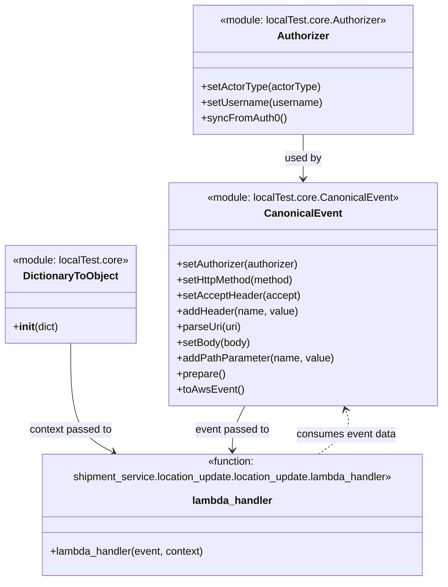

# Diagram: tools/ide_local_testing/localTest/test/byUrl/shipmentLocationUpdate.py


> Auto-generated by Obscura crawlers

## Diagram 1

```mermaid
flowchart LR
  Start([Start]) --> BuildAuth[/"Create Authorizer"/]
  BuildAuth --> SetActor{setActorType("human")}
  SetActor --> SetUser{setUsername("test@freightverify-api.com")}
  SetUser --> SyncAuth[/syncFromAuth0()/]
  SyncAuth --> BuildEvent[/Create CanonicalEvent and configure/]
  BuildEvent --> Method[setHttpMethod("POST")]
  BuildEvent --> Accept[setAcceptHeader("application/json")]
  BuildEvent --> Header[addHeader("X-WSS-fvShipmentId", shipmentId)]
  BuildEvent --> ParseUri[parseUri(uri)]
  BuildEvent --> Body[setBody(body)]
  BuildEvent --> PathParam[addPathParameter("shipment_db_id", shipmentDbId)]
  PathParam --> Prepare[prepare()]
  Prepare --> ToAws[toAwsEvent()]
  ToAws --> Invoke[/Invoke lambda_handler(event, context)/]
  Invoke --> MeasureStart([record start time])
  Invoke --> MeasureEnd([record end time])
  Invoke --> CheckRet{retval and retval.body?}
  CheckRet -- yes --> ParseJson[json.loads(retval.body)]
  ParseJson --> Pretty[json.dumps(...)]
  Pretty --> PrintBody[print(prettyRetval)]
  CheckRet -- no --> PrintEmpty[print("")]
  PrintBody --> PrintTime[print("Lambda execution time: ...")]
  PrintEmpty --> PrintTime
  PrintTime --> End([End])
```

> SVG rendering failed for this diagram.

## Diagram 2



### SVG

<svg id="container" width="681.2890625" xmlns="http://www.w3.org/2000/svg" class="classDiagram" height="854" viewBox="0 0 681.2890625 854" role="graphics-document document" aria-roledescription="class"><style>#container{font-family:"trebuchet ms",verdana,arial,sans-serif;font-size:16px;fill:#333;}@keyframes edge-animation-frame{from{stroke-dashoffset:0;}}@keyframes dash{to{stroke-dashoffset:0;}}#container .edge-animation-slow{stroke-dasharray:9,5!important;stroke-dashoffset:900;animation:dash 50s linear infinite;stroke-linecap:round;}#container .edge-animation-fast{stroke-dasharray:9,5!important;stroke-dashoffset:900;animation:dash 20s linear infinite;stroke-linecap:round;}#container .error-icon{fill:#552222;}#container .error-text{fill:#552222;stroke:#552222;}#container .edge-thickness-normal{stroke-width:1px;}#container .edge-thickness-thick{stroke-width:3.5px;}#container .edge-pattern-solid{stroke-dasharray:0;}#container .edge-thickness-invisible{stroke-width:0;fill:none;}#container .edge-pattern-dashed{stroke-dasharray:3;}#container .edge-pattern-dotted{stroke-dasharray:2;}#container .marker{fill:#333333;stroke:#333333;}#container .marker.cross{stroke:#333333;}#container svg{font-family:"trebuchet ms",verdana,arial,sans-serif;font-size:16px;}#container p{margin:0;}#container g.classGroup text{fill:#9370DB;stroke:none;font-family:"trebuchet ms",verdana,arial,sans-serif;font-size:10px;}#container g.classGroup text .title{font-weight:bolder;}#container .nodeLabel,#container .edgeLabel{color:#131300;}#container .edgeLabel .label rect{fill:#ECECFF;}#container .label text{fill:#131300;}#container .labelBkg{background:#ECECFF;}#container .edgeLabel .label span{background:#ECECFF;}#container .classTitle{font-weight:bolder;}#container .node rect,#container .node circle,#container .node ellipse,#container .node polygon,#container .node path{fill:#ECECFF;stroke:#9370DB;stroke-width:1px;}#container .divider{stroke:#9370DB;stroke-width:1;}#container g.clickable{cursor:pointer;}#container g.classGroup rect{fill:#ECECFF;stroke:#9370DB;}#container g.classGroup line{stroke:#9370DB;stroke-width:1;}#container .classLabel .box{stroke:none;stroke-width:0;fill:#ECECFF;opacity:0.5;}#container .classLabel .label{fill:#9370DB;font-size:10px;}#container .relation{stroke:#333333;stroke-width:1;fill:none;}#container .dashed-line{stroke-dasharray:3;}#container .dotted-line{stroke-dasharray:1 2;}#container #compositionStart,#container .composition{fill:#333333!important;stroke:#333333!important;stroke-width:1;}#container #compositionEnd,#container .composition{fill:#333333!important;stroke:#333333!important;stroke-width:1;}#container #dependencyStart,#container .dependency{fill:#333333!important;stroke:#333333!important;stroke-width:1;}#container #dependencyStart,#container .dependency{fill:#333333!important;stroke:#333333!important;stroke-width:1;}#container #extensionStart,#container .extension{fill:transparent!important;stroke:#333333!important;stroke-width:1;}#container #extensionEnd,#container .extension{fill:transparent!important;stroke:#333333!important;stroke-width:1;}#container #aggregationStart,#container .aggregation{fill:transparent!important;stroke:#333333!important;stroke-width:1;}#container #aggregationEnd,#container .aggregation{fill:transparent!important;stroke:#333333!important;stroke-width:1;}#container #lollipopStart,#container .lollipop{fill:#ECECFF!important;stroke:#333333!important;stroke-width:1;}#container #lollipopEnd,#container .lollipop{fill:#ECECFF!important;stroke:#333333!important;stroke-width:1;}#container .edgeTerminals{font-size:11px;line-height:initial;}#container .classTitleText{text-anchor:middle;font-size:18px;fill:#333;}#container .label-icon{display:inline-block;height:1em;overflow:visible;vertical-align:-0.125em;}#container .node .label-icon path{fill:currentColor;stroke:revert;stroke-width:revert;}#container :root{--mermaid-font-family:"trebuchet ms",verdana,arial,sans-serif;}</style><g><defs><marker id="container_class-aggregationStart" class="marker aggregation class" refX="18" refY="7" markerWidth="190" markerHeight="240" orient="auto"><path d="M 18,7 L9,13 L1,7 L9,1 Z"></path></marker></defs><defs><marker id="container_class-aggregationEnd" class="marker aggregation class" refX="1" refY="7" markerWidth="20" markerHeight="28" orient="auto"><path d="M 18,7 L9,13 L1,7 L9,1 Z"></path></marker></defs><defs><marker id="container_class-extensionStart" class="marker extension class" refX="18" refY="7" markerWidth="190" markerHeight="240" orient="auto"><path d="M 1,7 L18,13 V 1 Z"></path></marker></defs><defs><marker id="container_class-extensionEnd" class="marker extension class" refX="1" refY="7" markerWidth="20" markerHeight="28" orient="auto"><path d="M 1,1 V 13 L18,7 Z"></path></marker></defs><defs><marker id="container_class-compositionStart" class="marker composition class" refX="18" refY="7" markerWidth="190" markerHeight="240" orient="auto"><path d="M 18,7 L9,13 L1,7 L9,1 Z"></path></marker></defs><defs><marker id="container_class-compositionEnd" class="marker composition class" refX="1" refY="7" markerWidth="20" markerHeight="28" orient="auto"><path d="M 18,7 L9,13 L1,7 L9,1 Z"></path></marker></defs><defs><marker id="container_class-dependencyStart" class="marker dependency class" refX="6" refY="7" markerWidth="190" markerHeight="240" orient="auto"><path d="M 5,7 L9,13 L1,7 L9,1 Z"></path></marker></defs><defs><marker id="container_class-dependencyEnd" class="marker dependency class" refX="13" refY="7" markerWidth="20" markerHeight="28" orient="auto"><path d="M 18,7 L9,13 L14,7 L9,1 Z"></path></marker></defs><defs><marker id="container_class-lollipopStart" class="marker lollipop class" refX="13" refY="7" markerWidth="190" markerHeight="240" orient="auto"><circle stroke="black" fill="transparent" cx="7" cy="7" r="6"></circle></marker></defs><defs><marker id="container_class-lollipopEnd" class="marker lollipop class" refX="1" refY="7" markerWidth="190" markerHeight="240" orient="auto"><circle stroke="black" fill="transparent" cx="7" cy="7" r="6"></circle></marker></defs><g class="root"><g class="clusters"></g><g class="edgePaths"><path d="M467.723,206L467.723,212.167C467.723,218.333,467.723,230.667,467.723,242C467.723,253.333,467.723,263.667,467.723,268.833L467.723,274" id="id_Authorizer_CanonicalEvent_1" class="edge-thickness-normal edge-pattern-solid relation" style=";;;" data-edge="true" data-et="edge" data-id="id_Authorizer_CanonicalEvent_1" data-points="W3sieCI6NDY3LjcyMjY1NjI1LCJ5IjoyMDZ9LHsieCI6NDY3LjcyMjY1NjI1LCJ5IjoyNDN9LHsieCI6NDY3LjcyMjY1NjI1LCJ5IjoyODB9XQ==" marker-end="url(#container_class-dependencyEnd)"></path><path d="M110.078,526L110.078,548.167C110.078,570.333,110.078,614.667,122.903,642.59C135.728,670.514,161.377,682.029,174.202,687.786L187.027,693.543" id="id_DictionaryToObject_lambda_handler_2" class="edge-thickness-normal edge-pattern-solid relation" style=";;;" data-edge="true" data-et="edge" data-id="id_DictionaryToObject_lambda_handler_2" data-points="W3sieCI6MTEwLjA3ODEyNSwieSI6NTI2fSx7IngiOjExMC4wNzgxMjUsInkiOjY1OX0seyJ4IjoxOTIuNTAwMjk2NDU2NDczMjIsInkiOjY5Nn1d" marker-end="url(#container_class-dependencyEnd)"></path><path d="M378.811,622L375.604,628.167C372.398,634.333,365.985,646.667,362.779,658C359.572,669.333,359.572,679.667,359.572,684.833L359.572,690" id="id_CanonicalEvent_lambda_handler_3" class="edge-thickness-normal edge-pattern-solid relation" style=";;;" data-edge="true" data-et="edge" data-id="id_CanonicalEvent_lambda_handler_3" data-points="W3sieCI6Mzc4LjgxMDU1NjI2NTAyNDA1LCJ5Ijo2MjJ9LHsieCI6MzU5LjU3MjI2NTYyNSwieSI6NjU5fSx7IngiOjM1OS41NzIyNjU2MjUsInkiOjY5Nn1d" marker-end="url(#container_class-dependencyEnd)"></path><path d="M483.701,696L493.907,689.833C504.113,683.667,524.525,671.333,532.79,659.937C541.055,648.542,537.173,638.083,535.231,632.854L533.29,627.625" id="id_lambda_handler_CanonicalEvent_4" class="edge-thickness-normal edge-pattern-dashed relation" style=";;;" data-edge="true" data-et="edge" data-id="id_lambda_handler_CanonicalEvent_4" data-points="W3sieCI6NDgzLjcwMDc3MDc4NjgzMDQsInkiOjY5Nn0seyJ4Ijo1NDQuOTM3NSwieSI6NjU5fSx7IngiOjUzMS4yMDIxNjcyMTc1NDgxLCJ5Ijo2MjJ9XQ==" marker-end="url(#container_class-dependencyEnd)"></path></g><g class="edgeLabels"><g class="edgeLabel" transform="translate(467.72265625, 243)"><g class="label" data-id="id_Authorizer_CanonicalEvent_1" transform="translate(-28.3125, -12)"><foreignObject width="56.625" height="24"><div xmlns="http://www.w3.org/1999/xhtml" class="labelBkg" style="display: table-cell; white-space: nowrap; line-height: 1.5; max-width: 200px; text-align: center;"><span class="edgeLabel"><p>used by</p></span></div></foreignObject></g></g><g class="edgeLabel" transform="translate(110.078125, 659)"><g class="label" data-id="id_DictionaryToObject_lambda_handler_2" transform="translate(-64.015625, -12)"><foreignObject width="128.03125" height="24"><div xmlns="http://www.w3.org/1999/xhtml" class="labelBkg" style="display: table-cell; white-space: nowrap; line-height: 1.5; max-width: 200px; text-align: center;"><span class="edgeLabel"><p>context passed to</p></span></div></foreignObject></g></g><g class="edgeLabel" transform="translate(359.572265625, 659)"><g class="label" data-id="id_CanonicalEvent_lambda_handler_3" transform="translate(-57.328125, -12)"><foreignObject width="114.65625" height="24"><div xmlns="http://www.w3.org/1999/xhtml" class="labelBkg" style="display: table-cell; white-space: nowrap; line-height: 1.5; max-width: 200px; text-align: center;"><span class="edgeLabel"><p>event passed to</p></span></div></foreignObject></g></g><g class="edgeLabel" transform="translate(531.20908, 667.29488)"><g class="label" data-id="id_lambda_handler_CanonicalEvent_4" transform="translate(-77.1015625, -12)"><foreignObject width="154.203125" height="24"><div xmlns="http://www.w3.org/1999/xhtml" class="labelBkg" style="display: table-cell; white-space: nowrap; line-height: 1.5; max-width: 200px; text-align: center;"><span class="edgeLabel"><p>consumes event data</p></span></div></foreignObject></g></g></g><g class="nodes"><g class="node default" id="classId-Authorizer-0" transform="translate(467.72265625, 107)"><g class="basic label-container"><path d="M-169.828125 -99 L169.828125 -99 L169.828125 99 L-169.828125 99" stroke="none" stroke-width="0" fill="#ECECFF" style=""></path><path d="M-169.828125 -99 C-56.92722513898434 -99, 55.97367472203132 -99, 169.828125 -99 M-169.828125 -99 C-73.71485824662591 -99, 22.398408506748183 -99, 169.828125 -99 M169.828125 -99 C169.828125 -57.297379627868736, 169.828125 -15.594759255737472, 169.828125 99 M169.828125 -99 C169.828125 -57.63538173328678, 169.828125 -16.270763466573555, 169.828125 99 M169.828125 99 C83.53120424532544 99, -2.7657165093491187 99, -169.828125 99 M169.828125 99 C90.39274869908459 99, 10.957372398169184 99, -169.828125 99 M-169.828125 99 C-169.828125 31.89149619291723, -169.828125 -35.21700761416554, -169.828125 -99 M-169.828125 99 C-169.828125 25.961423372045417, -169.828125 -47.07715325590917, -169.828125 -99" stroke="#9370DB" stroke-width="1.3" fill="none" stroke-dasharray="0 0" style=""></path></g><g class="annotation-group text" transform="translate(-129.75, -75)"><g class="label" style="" transform="translate(0,-12)"><foreignObject width="259.5" height="24"><div xmlns="http://www.w3.org/1999/xhtml" style="display: table-cell; white-space: nowrap; line-height: 1.5; max-width: 310px; text-align: center;"><span class="nodeLabel markdown-node-label" style=""><p>«module: localTest.core.Authorizer»</p></span></div></foreignObject></g></g><g class="label-group text" transform="translate(-38.3671875, -51)"><g class="label" style="font-weight: bolder" transform="translate(0,-12)"><foreignObject width="76.734375" height="24"><div xmlns="http://www.w3.org/1999/xhtml" style="display: table-cell; white-space: nowrap; line-height: 1.5; max-width: 126px; text-align: center;"><span class="nodeLabel markdown-node-label" style=""><p>Authorizer</p></span></div></foreignObject></g></g><g class="members-group text" transform="translate(-157.828125, -3)"></g><g class="methods-group text" transform="translate(-157.828125, 27)"><g class="label" style="" transform="translate(0,-12)"><foreignObject width="183.0625" height="24"><div xmlns="http://www.w3.org/1999/xhtml" style="display: table-cell; white-space: nowrap; line-height: 1.5; max-width: 240px; text-align: center;"><span class="nodeLabel markdown-node-label" style=""><p>+setActorType(actorType)</p></span></div></foreignObject></g><g class="label" style="" transform="translate(0,12)"><foreignObject width="185.90625" height="24"><div xmlns="http://www.w3.org/1999/xhtml" style="display: table-cell; white-space: nowrap; line-height: 1.5; max-width: 243px; text-align: center;"><span class="nodeLabel markdown-node-label" style=""><p>+setUsername(username)</p></span></div></foreignObject></g><g class="label" style="" transform="translate(0,36)"><foreignObject width="129.0625" height="24"><div xmlns="http://www.w3.org/1999/xhtml" style="display: table-cell; white-space: nowrap; line-height: 1.5; max-width: 186px; text-align: center;"><span class="nodeLabel markdown-node-label" style=""><p>+syncFromAuth0()</p></span></div></foreignObject></g></g><g class="divider" style=""><path d="M-169.828125 -27 C-87.53735255014699 -27, -5.246580100293983 -27, 169.828125 -27 M-169.828125 -27 C-47.5636030741137 -27, 74.7009188517726 -27, 169.828125 -27" stroke="#9370DB" stroke-width="1.3" fill="none" stroke-dasharray="0 0" style=""></path></g><g class="divider" style=""><path d="M-169.828125 -3 C-46.08282785613784 -3, 77.66246928772432 -3, 169.828125 -3 M-169.828125 -3 C-65.2714534070623 -3, 39.28521818587541 -3, 169.828125 -3" stroke="#9370DB" stroke-width="1.3" fill="none" stroke-dasharray="0 0" style=""></path></g></g><g class="node default" id="classId-CanonicalEvent-1" transform="translate(467.72265625, 451)"><g class="basic label-container"><path d="M-205.56640625 -171 L205.56640625 -171 L205.56640625 171 L-205.56640625 171" stroke="none" stroke-width="0" fill="#ECECFF" style=""></path><path d="M-205.56640625 -171 C-110.3008596810041 -171, -15.035313112008197 -171, 205.56640625 -171 M-205.56640625 -171 C-107.29200145405655 -171, -9.017596658113092 -171, 205.56640625 -171 M205.56640625 -171 C205.56640625 -78.4002363148433, 205.56640625 14.199527370313405, 205.56640625 171 M205.56640625 -171 C205.56640625 -77.01657722888353, 205.56640625 16.96684554223293, 205.56640625 171 M205.56640625 171 C79.1795253198187 171, -47.20735561036261 171, -205.56640625 171 M205.56640625 171 C94.91799654374562 171, -15.730413162508768 171, -205.56640625 171 M-205.56640625 171 C-205.56640625 80.93037134542834, -205.56640625 -9.139257309143318, -205.56640625 -171 M-205.56640625 171 C-205.56640625 52.903868400548234, -205.56640625 -65.19226319890353, -205.56640625 -171" stroke="#9370DB" stroke-width="1.3" fill="none" stroke-dasharray="0 0" style=""></path></g><g class="annotation-group text" transform="translate(-147.2890625, -147)"><g class="label" style="" transform="translate(0,-12)"><foreignObject width="294.578125" height="24"><div xmlns="http://www.w3.org/1999/xhtml" style="display: table-cell; white-space: nowrap; line-height: 1.5; max-width: 345px; text-align: center;"><span class="nodeLabel markdown-node-label" style=""><p>«module: localTest.core.CanonicalEvent»</p></span></div></foreignObject></g></g><g class="label-group text" transform="translate(-55.7109375, -123)"><g class="label" style="font-weight: bolder" transform="translate(0,-12)"><foreignObject width="111.421875" height="24"><div xmlns="http://www.w3.org/1999/xhtml" style="display: table-cell; white-space: nowrap; line-height: 1.5; max-width: 161px; text-align: center;"><span class="nodeLabel markdown-node-label" style=""><p>CanonicalEvent</p></span></div></foreignObject></g></g><g class="members-group text" transform="translate(-193.56640625, -75)"></g><g class="methods-group text" transform="translate(-193.56640625, -45)"><g class="label" style="" transform="translate(0,-12)"><foreignObject width="190.75" height="24"><div xmlns="http://www.w3.org/1999/xhtml" style="display: table-cell; white-space: nowrap; line-height: 1.5; max-width: 248px; text-align: center;"><span class="nodeLabel markdown-node-label" style=""><p>+setAuthorizer(authorizer)</p></span></div></foreignObject></g><g class="label" style="" transform="translate(0,12)"><foreignObject width="184" height="24"><div xmlns="http://www.w3.org/1999/xhtml" style="display: table-cell; white-space: nowrap; line-height: 1.5; max-width: 241px; text-align: center;"><span class="nodeLabel markdown-node-label" style=""><p>+setHttpMethod(method)</p></span></div></foreignObject></g><g class="label" style="" transform="translate(0,36)"><foreignObject width="188.125" height="24"><div xmlns="http://www.w3.org/1999/xhtml" style="display: table-cell; white-space: nowrap; line-height: 1.5; max-width: 245px; text-align: center;"><span class="nodeLabel markdown-node-label" style=""><p>+setAcceptHeader(accept)</p></span></div></foreignObject></g><g class="label" style="" transform="translate(0,60)"><foreignObject width="185.875" height="24"><div xmlns="http://www.w3.org/1999/xhtml" style="display: table-cell; white-space: nowrap; line-height: 1.5; max-width: 243px; text-align: center;"><span class="nodeLabel markdown-node-label" style=""><p>+addHeader(name, value)</p></span></div></foreignObject></g><g class="label" style="" transform="translate(0,84)"><foreignObject width="99.8125" height="24"><div xmlns="http://www.w3.org/1999/xhtml" style="display: table-cell; white-space: nowrap; line-height: 1.5; max-width: 157px; text-align: center;"><span class="nodeLabel markdown-node-label" style=""><p>+parseUri(uri)</p></span></div></foreignObject></g><g class="label" style="" transform="translate(0,108)"><foreignObject width="113.125" height="24"><div xmlns="http://www.w3.org/1999/xhtml" style="display: table-cell; white-space: nowrap; line-height: 1.5; max-width: 170px; text-align: center;"><span class="nodeLabel markdown-node-label" style=""><p>+setBody(body)</p></span></div></foreignObject></g><g class="label" style="" transform="translate(0,132)"><foreignObject width="239.84375" height="24"><div xmlns="http://www.w3.org/1999/xhtml" style="display: table-cell; white-space: nowrap; line-height: 1.5; max-width: 297px; text-align: center;"><span class="nodeLabel markdown-node-label" style=""><p>+addPathParameter(name, value)</p></span></div></foreignObject></g><g class="label" style="" transform="translate(0,156)"><foreignObject width="74.75" height="24"><div xmlns="http://www.w3.org/1999/xhtml" style="display: table-cell; white-space: nowrap; line-height: 1.5; max-width: 132px; text-align: center;"><span class="nodeLabel markdown-node-label" style=""><p>+prepare()</p></span></div></foreignObject></g><g class="label" style="" transform="translate(0,180)"><foreignObject width="101.1875" height="24"><div xmlns="http://www.w3.org/1999/xhtml" style="display: table-cell; white-space: nowrap; line-height: 1.5; max-width: 159px; text-align: center;"><span class="nodeLabel markdown-node-label" style=""><p>+toAwsEvent()</p></span></div></foreignObject></g></g><g class="divider" style=""><path d="M-205.56640625 -99 C-107.5312622828052 -99, -9.496118315610403 -99, 205.56640625 -99 M-205.56640625 -99 C-49.368792407696816 -99, 106.82882143460637 -99, 205.56640625 -99" stroke="#9370DB" stroke-width="1.3" fill="none" stroke-dasharray="0 0" style=""></path></g><g class="divider" style=""><path d="M-205.56640625 -75 C-121.85777581057931 -75, -38.149145371158625 -75, 205.56640625 -75 M-205.56640625 -75 C-105.09004636730108 -75, -4.6136864846021695 -75, 205.56640625 -75" stroke="#9370DB" stroke-width="1.3" fill="none" stroke-dasharray="0 0" style=""></path></g></g><g class="node default" id="classId-DictionaryToObject-2" transform="translate(110.078125, 451)"><g class="basic label-container"><path d="M-102.078125 -75 L102.078125 -75 L102.078125 75 L-102.078125 75" stroke="none" stroke-width="0" fill="#ECECFF" style=""></path><path d="M-102.078125 -75 C-58.91431230502808 -75, -15.750499610056167 -75, 102.078125 -75 M-102.078125 -75 C-43.56623885638829 -75, 14.945647287223423 -75, 102.078125 -75 M102.078125 -75 C102.078125 -33.1901827333935, 102.078125 8.619634533213002, 102.078125 75 M102.078125 -75 C102.078125 -44.20090988227618, 102.078125 -13.40181976455235, 102.078125 75 M102.078125 75 C40.554974691500625 75, -20.96817561699875 75, -102.078125 75 M102.078125 75 C32.88068809599402 75, -36.316748808011965 75, -102.078125 75 M-102.078125 75 C-102.078125 34.564906008503876, -102.078125 -5.870187982992249, -102.078125 -75 M-102.078125 75 C-102.078125 16.916092907339262, -102.078125 -41.167814185321475, -102.078125 -75" stroke="#9370DB" stroke-width="1.3" fill="none" stroke-dasharray="0 0" style=""></path></g><g class="annotation-group text" transform="translate(-90.078125, -51)"><g class="label" style="" transform="translate(0,-12)"><foreignObject width="180.15625" height="24"><div xmlns="http://www.w3.org/1999/xhtml" style="display: table-cell; white-space: nowrap; line-height: 1.5; max-width: 230px; text-align: center;"><span class="nodeLabel markdown-node-label" style=""><p>«module: localTest.core»</p></span></div></foreignObject></g></g><g class="label-group text" transform="translate(-70.109375, -27)"><g class="label" style="font-weight: bolder" transform="translate(0,-12)"><foreignObject width="140.21875" height="24"><div xmlns="http://www.w3.org/1999/xhtml" style="display: table-cell; white-space: nowrap; line-height: 1.5; max-width: 188px; text-align: center;"><span class="nodeLabel markdown-node-label" style=""><p>DictionaryToObject</p></span></div></foreignObject></g></g><g class="members-group text" transform="translate(-90.078125, 21)"></g><g class="methods-group text" transform="translate(-90.078125, 51)"><g class="label" style="" transform="translate(0,-12)"><foreignObject width="70.296875" height="24"><div xmlns="http://www.w3.org/1999/xhtml" style="display: table-cell; white-space: nowrap; line-height: 1.5; max-width: 159px; text-align: center;"><span class="nodeLabel markdown-node-label" style=""><p>+<strong>init</strong>(dict)</p></span></div></foreignObject></g></g><g class="divider" style=""><path d="M-102.078125 -3 C-47.30139810148781 -3, 7.475328797024375 -3, 102.078125 -3 M-102.078125 -3 C-24.568026364757046 -3, 52.94207227048591 -3, 102.078125 -3" stroke="#9370DB" stroke-width="1.3" fill="none" stroke-dasharray="0 0" style=""></path></g><g class="divider" style=""><path d="M-102.078125 21 C-57.34145254698375 21, -12.604780093967506 21, 102.078125 21 M-102.078125 21 C-38.05794798063603 21, 25.96222903872794 21, 102.078125 21" stroke="#9370DB" stroke-width="1.3" fill="none" stroke-dasharray="0 0" style=""></path></g></g><g class="node default" id="classId-lambda_handler-3" transform="translate(359.572265625, 771)"><g class="basic label-container"><path d="M-303.0703125 -75 L303.0703125 -75 L303.0703125 75 L-303.0703125 75" stroke="none" stroke-width="0" fill="#ECECFF" style=""></path><path d="M-303.0703125 -75 C-164.17320618040978 -75, -25.276099860819556 -75, 303.0703125 -75 M-303.0703125 -75 C-77.06351069684976 -75, 148.94329110630048 -75, 303.0703125 -75 M303.0703125 -75 C303.0703125 -19.81460572767528, 303.0703125 35.37078854464944, 303.0703125 75 M303.0703125 -75 C303.0703125 -27.619382146642465, 303.0703125 19.76123570671507, 303.0703125 75 M303.0703125 75 C178.52601150164722 75, 53.98171050329444 75, -303.0703125 75 M303.0703125 75 C158.6721581632625 75, 14.274003826525018 75, -303.0703125 75 M-303.0703125 75 C-303.0703125 30.542044970507398, -303.0703125 -13.915910058985205, -303.0703125 -75 M-303.0703125 75 C-303.0703125 27.81409995253148, -303.0703125 -19.371800094937043, -303.0703125 -75" stroke="#9370DB" stroke-width="1.3" fill="none" stroke-dasharray="0 0" style=""></path></g><g class="annotation-group text" transform="translate(-291.0703125, -51)"><g class="label" style="" transform="translate(0,-12)"><foreignObject width="582.140625" height="24"><div xmlns="http://www.w3.org/1999/xhtml" style="display: table-cell; white-space: nowrap; line-height: 1.5; max-width: 632px; text-align: center;"><span class="nodeLabel markdown-node-label" style=""><p>«function: shipment_service.location_update.location_update.lambda_handler»</p></span></div></foreignObject></g></g><g class="label-group text" transform="translate(-59.9765625, -27)"><g class="label" style="font-weight: bolder" transform="translate(0,-12)"><foreignObject width="119.953125" height="24"><div xmlns="http://www.w3.org/1999/xhtml" style="display: table-cell; white-space: nowrap; line-height: 1.5; max-width: 170px; text-align: center;"><span class="nodeLabel markdown-node-label" style=""><p>lambda_handler</p></span></div></foreignObject></g></g><g class="members-group text" transform="translate(-291.0703125, 21)"></g><g class="methods-group text" transform="translate(-291.0703125, 51)"><g class="label" style="" transform="translate(0,-12)"><foreignObject width="240.1875" height="24"><div xmlns="http://www.w3.org/1999/xhtml" style="display: table-cell; white-space: nowrap; line-height: 1.5; max-width: 298px; text-align: center;"><span class="nodeLabel markdown-node-label" style=""><p>+lambda_handler(event, context)</p></span></div></foreignObject></g></g><g class="divider" style=""><path d="M-303.0703125 -3 C-68.57325649240653 -3, 165.92379951518694 -3, 303.0703125 -3 M-303.0703125 -3 C-100.82037681017465 -3, 101.4295588796507 -3, 303.0703125 -3" stroke="#9370DB" stroke-width="1.3" fill="none" stroke-dasharray="0 0" style=""></path></g><g class="divider" style=""><path d="M-303.0703125 21 C-147.46315991075124 21, 8.143992678497511 21, 303.0703125 21 M-303.0703125 21 C-168.2699346195432 21, -33.469556739086386 21, 303.0703125 21" stroke="#9370DB" stroke-width="1.3" fill="none" stroke-dasharray="0 0" style=""></path></g></g></g></g></g></svg>
