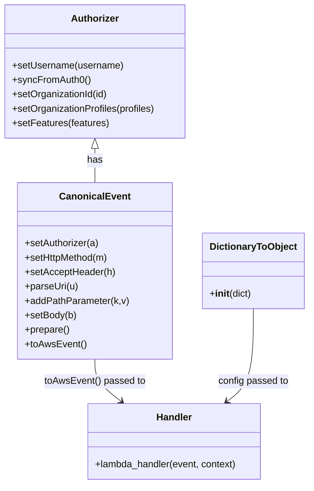

# Diagram: tools/ide_local_testing/localTest/test/byUrl/shipmentPatch.py


> Auto-generated by Obscura crawlers

## Diagram 1

```mermaid
flowchart TD
    Start([Start Script]) --> BuildEvent[Build CanonicalEvent]
    BuildEvent --> SetAuth[Configure Authorizer]
    SetAuth --> PrepareEvent[Prepare AWS Event]
    PrepareEvent --> CallHandler[Invoke lambda_handler (handler)]
    CallHandler --> ProcessResponse[Process retval & print]
    ProcessResponse --> End([End])
```

> SVG rendering failed for this diagram.

## Diagram 2



### SVG

<svg id="container" width="507.859375" xmlns="http://www.w3.org/2000/svg" class="classDiagram" height="806" viewBox="0 0 507.859375 806" role="graphics-document document" aria-roledescription="class"><style>#container{font-family:"trebuchet ms",verdana,arial,sans-serif;font-size:16px;fill:#333;}@keyframes edge-animation-frame{from{stroke-dashoffset:0;}}@keyframes dash{to{stroke-dashoffset:0;}}#container .edge-animation-slow{stroke-dasharray:9,5!important;stroke-dashoffset:900;animation:dash 50s linear infinite;stroke-linecap:round;}#container .edge-animation-fast{stroke-dasharray:9,5!important;stroke-dashoffset:900;animation:dash 20s linear infinite;stroke-linecap:round;}#container .error-icon{fill:#552222;}#container .error-text{fill:#552222;stroke:#552222;}#container .edge-thickness-normal{stroke-width:1px;}#container .edge-thickness-thick{stroke-width:3.5px;}#container .edge-pattern-solid{stroke-dasharray:0;}#container .edge-thickness-invisible{stroke-width:0;fill:none;}#container .edge-pattern-dashed{stroke-dasharray:3;}#container .edge-pattern-dotted{stroke-dasharray:2;}#container .marker{fill:#333333;stroke:#333333;}#container .marker.cross{stroke:#333333;}#container svg{font-family:"trebuchet ms",verdana,arial,sans-serif;font-size:16px;}#container p{margin:0;}#container g.classGroup text{fill:#9370DB;stroke:none;font-family:"trebuchet ms",verdana,arial,sans-serif;font-size:10px;}#container g.classGroup text .title{font-weight:bolder;}#container .nodeLabel,#container .edgeLabel{color:#131300;}#container .edgeLabel .label rect{fill:#ECECFF;}#container .label text{fill:#131300;}#container .labelBkg{background:#ECECFF;}#container .edgeLabel .label span{background:#ECECFF;}#container .classTitle{font-weight:bolder;}#container .node rect,#container .node circle,#container .node ellipse,#container .node polygon,#container .node path{fill:#ECECFF;stroke:#9370DB;stroke-width:1px;}#container .divider{stroke:#9370DB;stroke-width:1;}#container g.clickable{cursor:pointer;}#container g.classGroup rect{fill:#ECECFF;stroke:#9370DB;}#container g.classGroup line{stroke:#9370DB;stroke-width:1;}#container .classLabel .box{stroke:none;stroke-width:0;fill:#ECECFF;opacity:0.5;}#container .classLabel .label{fill:#9370DB;font-size:10px;}#container .relation{stroke:#333333;stroke-width:1;fill:none;}#container .dashed-line{stroke-dasharray:3;}#container .dotted-line{stroke-dasharray:1 2;}#container #compositionStart,#container .composition{fill:#333333!important;stroke:#333333!important;stroke-width:1;}#container #compositionEnd,#container .composition{fill:#333333!important;stroke:#333333!important;stroke-width:1;}#container #dependencyStart,#container .dependency{fill:#333333!important;stroke:#333333!important;stroke-width:1;}#container #dependencyStart,#container .dependency{fill:#333333!important;stroke:#333333!important;stroke-width:1;}#container #extensionStart,#container .extension{fill:transparent!important;stroke:#333333!important;stroke-width:1;}#container #extensionEnd,#container .extension{fill:transparent!important;stroke:#333333!important;stroke-width:1;}#container #aggregationStart,#container .aggregation{fill:transparent!important;stroke:#333333!important;stroke-width:1;}#container #aggregationEnd,#container .aggregation{fill:transparent!important;stroke:#333333!important;stroke-width:1;}#container #lollipopStart,#container .lollipop{fill:#ECECFF!important;stroke:#333333!important;stroke-width:1;}#container #lollipopEnd,#container .lollipop{fill:#ECECFF!important;stroke:#333333!important;stroke-width:1;}#container .edgeTerminals{font-size:11px;line-height:initial;}#container .classTitleText{text-anchor:middle;font-size:18px;fill:#333;}#container .label-icon{display:inline-block;height:1em;overflow:visible;vertical-align:-0.125em;}#container .node .label-icon path{fill:currentColor;stroke:revert;stroke-width:revert;}#container :root{--mermaid-font-family:"trebuchet ms",verdana,arial,sans-serif;}</style><g><defs><marker id="container_class-aggregationStart" class="marker aggregation class" refX="18" refY="7" markerWidth="190" markerHeight="240" orient="auto"><path d="M 18,7 L9,13 L1,7 L9,1 Z"></path></marker></defs><defs><marker id="container_class-aggregationEnd" class="marker aggregation class" refX="1" refY="7" markerWidth="20" markerHeight="28" orient="auto"><path d="M 18,7 L9,13 L1,7 L9,1 Z"></path></marker></defs><defs><marker id="container_class-extensionStart" class="marker extension class" refX="18" refY="7" markerWidth="190" markerHeight="240" orient="auto"><path d="M 1,7 L18,13 V 1 Z"></path></marker></defs><defs><marker id="container_class-extensionEnd" class="marker extension class" refX="1" refY="7" markerWidth="20" markerHeight="28" orient="auto"><path d="M 1,1 V 13 L18,7 Z"></path></marker></defs><defs><marker id="container_class-compositionStart" class="marker composition class" refX="18" refY="7" markerWidth="190" markerHeight="240" orient="auto"><path d="M 18,7 L9,13 L1,7 L9,1 Z"></path></marker></defs><defs><marker id="container_class-compositionEnd" class="marker composition class" refX="1" refY="7" markerWidth="20" markerHeight="28" orient="auto"><path d="M 18,7 L9,13 L1,7 L9,1 Z"></path></marker></defs><defs><marker id="container_class-dependencyStart" class="marker dependency class" refX="6" refY="7" markerWidth="190" markerHeight="240" orient="auto"><path d="M 5,7 L9,13 L1,7 L9,1 Z"></path></marker></defs><defs><marker id="container_class-dependencyEnd" class="marker dependency class" refX="13" refY="7" markerWidth="20" markerHeight="28" orient="auto"><path d="M 18,7 L9,13 L14,7 L9,1 Z"></path></marker></defs><defs><marker id="container_class-lollipopStart" class="marker lollipop class" refX="13" refY="7" markerWidth="190" markerHeight="240" orient="auto"><circle stroke="black" fill="transparent" cx="7" cy="7" r="6"></circle></marker></defs><defs><marker id="container_class-lollipopEnd" class="marker lollipop class" refX="1" refY="7" markerWidth="190" markerHeight="240" orient="auto"><circle stroke="black" fill="transparent" cx="7" cy="7" r="6"></circle></marker></defs><g class="root"><g class="clusters"></g><g class="edgePaths"><path d="M159.668,247.25L159.668,250.542C159.668,253.833,159.668,260.417,159.668,269.875C159.668,279.333,159.668,291.667,159.668,297.833L159.668,304" id="id_Authorizer_CanonicalEvent_1" class="edge-thickness-normal edge-pattern-solid relation" style=";;;" data-edge="true" data-et="edge" data-id="id_Authorizer_CanonicalEvent_1" data-points="W3sieCI6MTU5LjY2Nzk2ODc1LCJ5IjoyMzB9LHsieCI6MTU5LjY2Nzk2ODc1LCJ5IjoyNjd9LHsieCI6MTU5LjY2Nzk2ODc1LCJ5IjozMDR9XQ==" marker-start="url(#container_class-extensionStart)"></path><path d="M159.668,598L159.668,604.167C159.668,610.333,159.668,622.667,166.832,634.387C173.997,646.108,188.325,657.216,195.49,662.77L202.654,668.324" id="id_CanonicalEvent_Handler_2" class="edge-thickness-normal edge-pattern-solid relation" style=";;;" data-edge="true" data-et="edge" data-id="id_CanonicalEvent_Handler_2" data-points="W3sieCI6MTU5LjY2Nzk2ODc1LCJ5Ijo1OTh9LHsieCI6MTU5LjY2Nzk2ODc1LCJ5Ijo2MzV9LHsieCI6MjA3LjM5NTgwMDc4MTI1LCJ5Ijo2NzJ9XQ==" marker-end="url(#container_class-dependencyEnd)"></path><path d="M417.656,514L417.656,534.167C417.656,554.333,417.656,594.667,410.492,620.387C403.328,646.108,388.999,657.216,381.835,662.77L374.67,668.324" id="id_DictionaryToObject_Handler_3" class="edge-thickness-normal edge-pattern-solid relation" style=";;;" data-edge="true" data-et="edge" data-id="id_DictionaryToObject_Handler_3" data-points="W3sieCI6NDE3LjY1NjI1LCJ5Ijo1MTR9LHsieCI6NDE3LjY1NjI1LCJ5Ijo2MzV9LHsieCI6MzY5LjkyODQxNzk2ODc1LCJ5Ijo2NzJ9XQ==" marker-end="url(#container_class-dependencyEnd)"></path></g><g class="edgeLabels"><g class="edgeLabel" transform="translate(159.66796875, 267)"><g class="label" data-id="id_Authorizer_CanonicalEvent_1" transform="translate(-12.703125, -12)"><foreignObject width="25.40625" height="24"><div xmlns="http://www.w3.org/1999/xhtml" class="labelBkg" style="display: table-cell; white-space: nowrap; line-height: 1.5; max-width: 200px; text-align: center;"><span class="edgeLabel"><p>has</p></span></div></foreignObject></g></g><g class="edgeLabel" transform="translate(159.66796875, 635)"><g class="label" data-id="id_CanonicalEvent_Handler_2" transform="translate(-83.8046875, -12)"><foreignObject width="167.609375" height="24"><div xmlns="http://www.w3.org/1999/xhtml" class="labelBkg" style="display: table-cell; white-space: nowrap; line-height: 1.5; max-width: 200px; text-align: center;"><span class="edgeLabel"><p>toAwsEvent() passed to</p></span></div></foreignObject></g></g><g class="edgeLabel" transform="translate(417.65625, 635)"><g class="label" data-id="id_DictionaryToObject_Handler_3" transform="translate(-58.9453125, -12)"><foreignObject width="117.890625" height="24"><div xmlns="http://www.w3.org/1999/xhtml" class="labelBkg" style="display: table-cell; white-space: nowrap; line-height: 1.5; max-width: 200px; text-align: center;"><span class="edgeLabel"><p>config passed to</p></span></div></foreignObject></g></g></g><g class="nodes"><g class="node default" id="classId-Authorizer-0" transform="translate(159.66796875, 119)"><g class="basic label-container"><path d="M-151.66796875 -111 L151.66796875 -111 L151.66796875 111 L-151.66796875 111" stroke="none" stroke-width="0" fill="#ECECFF" style=""></path><path d="M-151.66796875 -111 C-30.335589542624717 -111, 90.99678966475057 -111, 151.66796875 -111 M-151.66796875 -111 C-40.712334527472194 -111, 70.24329969505561 -111, 151.66796875 -111 M151.66796875 -111 C151.66796875 -53.28439203648568, 151.66796875 4.431215927028646, 151.66796875 111 M151.66796875 -111 C151.66796875 -45.42120160186937, 151.66796875 20.15759679626126, 151.66796875 111 M151.66796875 111 C77.37455741569707 111, 3.081146081394138 111, -151.66796875 111 M151.66796875 111 C79.292598893066 111, 6.9172290361319995 111, -151.66796875 111 M-151.66796875 111 C-151.66796875 26.358400328531943, -151.66796875 -58.283199342936115, -151.66796875 -111 M-151.66796875 111 C-151.66796875 44.36998372375403, -151.66796875 -22.260032552491936, -151.66796875 -111" stroke="#9370DB" stroke-width="1.3" fill="none" stroke-dasharray="0 0" style=""></path></g><g class="annotation-group text" transform="translate(0, -87)"></g><g class="label-group text" transform="translate(-38.3671875, -87)"><g class="label" style="font-weight: bolder" transform="translate(0,-12)"><foreignObject width="76.734375" height="24"><div xmlns="http://www.w3.org/1999/xhtml" style="display: table-cell; white-space: nowrap; line-height: 1.5; max-width: 126px; text-align: center;"><span class="nodeLabel markdown-node-label" style=""><p>Authorizer</p></span></div></foreignObject></g></g><g class="members-group text" transform="translate(-139.66796875, -39)"></g><g class="methods-group text" transform="translate(-139.66796875, -9)"><g class="label" style="" transform="translate(0,-12)"><foreignObject width="185.90625" height="24"><div xmlns="http://www.w3.org/1999/xhtml" style="display: table-cell; white-space: nowrap; line-height: 1.5; max-width: 243px; text-align: center;"><span class="nodeLabel markdown-node-label" style=""><p>+setUsername(username)</p></span></div></foreignObject></g><g class="label" style="" transform="translate(0,12)"><foreignObject width="129.0625" height="24"><div xmlns="http://www.w3.org/1999/xhtml" style="display: table-cell; white-space: nowrap; line-height: 1.5; max-width: 186px; text-align: center;"><span class="nodeLabel markdown-node-label" style=""><p>+syncFromAuth0()</p></span></div></foreignObject></g><g class="label" style="" transform="translate(0,36)"><foreignObject width="160.78125" height="24"><div xmlns="http://www.w3.org/1999/xhtml" style="display: table-cell; white-space: nowrap; line-height: 1.5; max-width: 218px; text-align: center;"><span class="nodeLabel markdown-node-label" style=""><p>+setOrganizationId(id)</p></span></div></foreignObject></g><g class="label" style="" transform="translate(0,60)"><foreignObject width="240.96875" height="24"><div xmlns="http://www.w3.org/1999/xhtml" style="display: table-cell; white-space: nowrap; line-height: 1.5; max-width: 298px; text-align: center;"><span class="nodeLabel markdown-node-label" style=""><p>+setOrganizationProfiles(profiles)</p></span></div></foreignObject></g><g class="label" style="" transform="translate(0,84)"><foreignObject width="161.296875" height="24"><div xmlns="http://www.w3.org/1999/xhtml" style="display: table-cell; white-space: nowrap; line-height: 1.5; max-width: 219px; text-align: center;"><span class="nodeLabel markdown-node-label" style=""><p>+setFeatures(features)</p></span></div></foreignObject></g></g><g class="divider" style=""><path d="M-151.66796875 -63 C-45.789290291620546 -63, 60.08938816675891 -63, 151.66796875 -63 M-151.66796875 -63 C-80.70211624943398 -63, -9.73626374886797 -63, 151.66796875 -63" stroke="#9370DB" stroke-width="1.3" fill="none" stroke-dasharray="0 0" style=""></path></g><g class="divider" style=""><path d="M-151.66796875 -39 C-89.61307966838217 -39, -27.558190586764326 -39, 151.66796875 -39 M-151.66796875 -39 C-51.80728920749635 -39, 48.05339033500729 -39, 151.66796875 -39" stroke="#9370DB" stroke-width="1.3" fill="none" stroke-dasharray="0 0" style=""></path></g></g><g class="node default" id="classId-CanonicalEvent-1" transform="translate(159.66796875, 451)"><g class="basic label-container"><path d="M-125.78515625 -147 L125.78515625 -147 L125.78515625 147 L-125.78515625 147" stroke="none" stroke-width="0" fill="#ECECFF" style=""></path><path d="M-125.78515625 -147 C-27.756456322508967 -147, 70.27224360498207 -147, 125.78515625 -147 M-125.78515625 -147 C-70.0896864176797 -147, -14.394216585359416 -147, 125.78515625 -147 M125.78515625 -147 C125.78515625 -39.10369980549652, 125.78515625 68.79260038900696, 125.78515625 147 M125.78515625 -147 C125.78515625 -59.20920591227677, 125.78515625 28.581588175446456, 125.78515625 147 M125.78515625 147 C75.1030826668403 147, 24.421009083680573 147, -125.78515625 147 M125.78515625 147 C57.73455397943779 147, -10.316048291124417 147, -125.78515625 147 M-125.78515625 147 C-125.78515625 86.96027944774141, -125.78515625 26.92055889548284, -125.78515625 -147 M-125.78515625 147 C-125.78515625 83.03612895337972, -125.78515625 19.072257906759432, -125.78515625 -147" stroke="#9370DB" stroke-width="1.3" fill="none" stroke-dasharray="0 0" style=""></path></g><g class="annotation-group text" transform="translate(0, -123)"></g><g class="label-group text" transform="translate(-55.7109375, -123)"><g class="label" style="font-weight: bolder" transform="translate(0,-12)"><foreignObject width="111.421875" height="24"><div xmlns="http://www.w3.org/1999/xhtml" style="display: table-cell; white-space: nowrap; line-height: 1.5; max-width: 161px; text-align: center;"><span class="nodeLabel markdown-node-label" style=""><p>CanonicalEvent</p></span></div></foreignObject></g></g><g class="members-group text" transform="translate(-113.78515625, -75)"></g><g class="methods-group text" transform="translate(-113.78515625, -45)"><g class="label" style="" transform="translate(0,-12)"><foreignObject width="124.46875" height="24"><div xmlns="http://www.w3.org/1999/xhtml" style="display: table-cell; white-space: nowrap; line-height: 1.5; max-width: 182px; text-align: center;"><span class="nodeLabel markdown-node-label" style=""><p>+setAuthorizer(a)</p></span></div></foreignObject></g><g class="label" style="" transform="translate(0,12)"><foreignObject width="141.203125" height="24"><div xmlns="http://www.w3.org/1999/xhtml" style="display: table-cell; white-space: nowrap; line-height: 1.5; max-width: 199px; text-align: center;"><span class="nodeLabel markdown-node-label" style=""><p>+setHttpMethod(m)</p></span></div></foreignObject></g><g class="label" style="" transform="translate(0,36)"><foreignObject width="150.140625" height="24"><div xmlns="http://www.w3.org/1999/xhtml" style="display: table-cell; white-space: nowrap; line-height: 1.5; max-width: 208px; text-align: center;"><span class="nodeLabel markdown-node-label" style=""><p>+setAcceptHeader(h)</p></span></div></foreignObject></g><g class="label" style="" transform="translate(0,60)"><foreignObject width="89.125" height="24"><div xmlns="http://www.w3.org/1999/xhtml" style="display: table-cell; white-space: nowrap; line-height: 1.5; max-width: 146px; text-align: center;"><span class="nodeLabel markdown-node-label" style=""><p>+parseUri(u)</p></span></div></foreignObject></g><g class="label" style="" transform="translate(0,84)"><foreignObject width="171.859375" height="24"><div xmlns="http://www.w3.org/1999/xhtml" style="display: table-cell; white-space: nowrap; line-height: 1.5; max-width: 229px; text-align: center;"><span class="nodeLabel markdown-node-label" style=""><p>+addPathParameter(k,v)</p></span></div></foreignObject></g><g class="label" style="" transform="translate(0,108)"><foreignObject width="86.34375" height="24"><div xmlns="http://www.w3.org/1999/xhtml" style="display: table-cell; white-space: nowrap; line-height: 1.5; max-width: 144px; text-align: center;"><span class="nodeLabel markdown-node-label" style=""><p>+setBody(b)</p></span></div></foreignObject></g><g class="label" style="" transform="translate(0,132)"><foreignObject width="74.75" height="24"><div xmlns="http://www.w3.org/1999/xhtml" style="display: table-cell; white-space: nowrap; line-height: 1.5; max-width: 132px; text-align: center;"><span class="nodeLabel markdown-node-label" style=""><p>+prepare()</p></span></div></foreignObject></g><g class="label" style="" transform="translate(0,156)"><foreignObject width="101.1875" height="24"><div xmlns="http://www.w3.org/1999/xhtml" style="display: table-cell; white-space: nowrap; line-height: 1.5; max-width: 159px; text-align: center;"><span class="nodeLabel markdown-node-label" style=""><p>+toAwsEvent()</p></span></div></foreignObject></g></g><g class="divider" style=""><path d="M-125.78515625 -99 C-64.22678476400111 -99, -2.668413278002234 -99, 125.78515625 -99 M-125.78515625 -99 C-53.045042756770584 -99, 19.69507073645883 -99, 125.78515625 -99" stroke="#9370DB" stroke-width="1.3" fill="none" stroke-dasharray="0 0" style=""></path></g><g class="divider" style=""><path d="M-125.78515625 -75 C-59.77585398063138 -75, 6.233448288737236 -75, 125.78515625 -75 M-125.78515625 -75 C-52.82957923110341 -75, 20.12599778779318 -75, 125.78515625 -75" stroke="#9370DB" stroke-width="1.3" fill="none" stroke-dasharray="0 0" style=""></path></g></g><g class="node default" id="classId-DictionaryToObject-2" transform="translate(417.65625, 451)"><g class="basic label-container"><path d="M-82.203125 -63 L82.203125 -63 L82.203125 63 L-82.203125 63" stroke="none" stroke-width="0" fill="#ECECFF" style=""></path><path d="M-82.203125 -63 C-17.414793713065052 -63, 47.373537573869896 -63, 82.203125 -63 M-82.203125 -63 C-44.231312855905955 -63, -6.25950071181191 -63, 82.203125 -63 M82.203125 -63 C82.203125 -17.887935110912814, 82.203125 27.224129778174373, 82.203125 63 M82.203125 -63 C82.203125 -21.425377382313343, 82.203125 20.149245235373314, 82.203125 63 M82.203125 63 C22.204658526723065 63, -37.79380794655387 63, -82.203125 63 M82.203125 63 C29.023229725092712 63, -24.156665549814576 63, -82.203125 63 M-82.203125 63 C-82.203125 20.88981499332629, -82.203125 -21.22037001334742, -82.203125 -63 M-82.203125 63 C-82.203125 27.24242856844691, -82.203125 -8.515142863106178, -82.203125 -63" stroke="#9370DB" stroke-width="1.3" fill="none" stroke-dasharray="0 0" style=""></path></g><g class="annotation-group text" transform="translate(0, -39)"></g><g class="label-group text" transform="translate(-70.109375, -39)"><g class="label" style="font-weight: bolder" transform="translate(0,-12)"><foreignObject width="140.21875" height="24"><div xmlns="http://www.w3.org/1999/xhtml" style="display: table-cell; white-space: nowrap; line-height: 1.5; max-width: 188px; text-align: center;"><span class="nodeLabel markdown-node-label" style=""><p>DictionaryToObject</p></span></div></foreignObject></g></g><g class="members-group text" transform="translate(-70.203125, 9)"></g><g class="methods-group text" transform="translate(-70.203125, 39)"><g class="label" style="" transform="translate(0,-12)"><foreignObject width="70.296875" height="24"><div xmlns="http://www.w3.org/1999/xhtml" style="display: table-cell; white-space: nowrap; line-height: 1.5; max-width: 159px; text-align: center;"><span class="nodeLabel markdown-node-label" style=""><p>+<strong>init</strong>(dict)</p></span></div></foreignObject></g></g><g class="divider" style=""><path d="M-82.203125 -15 C-21.73877652288899 -15, 38.72557195422202 -15, 82.203125 -15 M-82.203125 -15 C-19.426682471073896 -15, 43.34976005785221 -15, 82.203125 -15" stroke="#9370DB" stroke-width="1.3" fill="none" stroke-dasharray="0 0" style=""></path></g><g class="divider" style=""><path d="M-82.203125 9 C-41.273669578058204 9, -0.3442141561164078 9, 82.203125 9 M-82.203125 9 C-19.459461783765427 9, 43.284201432469146 9, 82.203125 9" stroke="#9370DB" stroke-width="1.3" fill="none" stroke-dasharray="0 0" style=""></path></g></g><g class="node default" id="classId-Handler-3" transform="translate(288.662109375, 735)"><g class="basic label-container"><path d="M-146.640625 -63 L146.640625 -63 L146.640625 63 L-146.640625 63" stroke="none" stroke-width="0" fill="#ECECFF" style=""></path><path d="M-146.640625 -63 C-41.8022251690938 -63, 63.036174661812396 -63, 146.640625 -63 M-146.640625 -63 C-71.17679771933176 -63, 4.287029561336482 -63, 146.640625 -63 M146.640625 -63 C146.640625 -32.929729605517956, 146.640625 -2.8594592110359116, 146.640625 63 M146.640625 -63 C146.640625 -12.77817348968042, 146.640625 37.44365302063916, 146.640625 63 M146.640625 63 C74.28040387949157 63, 1.9201827589831453 63, -146.640625 63 M146.640625 63 C86.59671188802051 63, 26.552798776041 63, -146.640625 63 M-146.640625 63 C-146.640625 21.166904662777583, -146.640625 -20.666190674444834, -146.640625 -63 M-146.640625 63 C-146.640625 29.489406067052165, -146.640625 -4.021187865895669, -146.640625 -63" stroke="#9370DB" stroke-width="1.3" fill="none" stroke-dasharray="0 0" style=""></path></g><g class="annotation-group text" transform="translate(0, -39)"></g><g class="label-group text" transform="translate(-29.09375, -39)"><g class="label" style="font-weight: bolder" transform="translate(0,-12)"><foreignObject width="58.1875" height="24"><div xmlns="http://www.w3.org/1999/xhtml" style="display: table-cell; white-space: nowrap; line-height: 1.5; max-width: 109px; text-align: center;"><span class="nodeLabel markdown-node-label" style=""><p>Handler</p></span></div></foreignObject></g></g><g class="members-group text" transform="translate(-134.640625, 9)"></g><g class="methods-group text" transform="translate(-134.640625, 39)"><g class="label" style="" transform="translate(0,-12)"><foreignObject width="240.1875" height="24"><div xmlns="http://www.w3.org/1999/xhtml" style="display: table-cell; white-space: nowrap; line-height: 1.5; max-width: 298px; text-align: center;"><span class="nodeLabel markdown-node-label" style=""><p>+lambda_handler(event, context)</p></span></div></foreignObject></g></g><g class="divider" style=""><path d="M-146.640625 -15 C-81.73759623306887 -15, -16.83456746613774 -15, 146.640625 -15 M-146.640625 -15 C-60.07325016857111 -15, 26.494124662857786 -15, 146.640625 -15" stroke="#9370DB" stroke-width="1.3" fill="none" stroke-dasharray="0 0" style=""></path></g><g class="divider" style=""><path d="M-146.640625 9 C-62.81684054928887 9, 21.00694390142226 9, 146.640625 9 M-146.640625 9 C-86.02318746791923 9, -25.40574993583847 9, 146.640625 9" stroke="#9370DB" stroke-width="1.3" fill="none" stroke-dasharray="0 0" style=""></path></g></g></g></g></g></svg>
