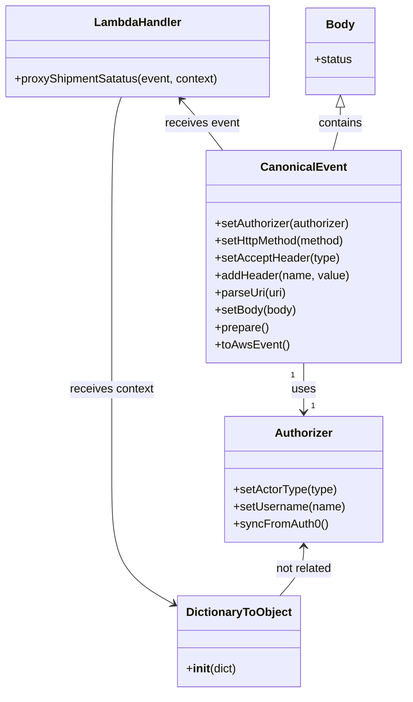

# Diagram: tools/ide_local_testing/localTest/test/byUrl/shipmentPostProxyStatus.py


> Auto-generated by Obscura crawlers

## Diagram 1

```mermaid
flowchart TD
  Start([Start]) --> BuildBody[/"Build body (JSON)"/]
  BuildBody --> CreateAuthorizer[/"Authorizer().setActorType().setUsername().syncFromAuth0()"/]
  CreateAuthorizer --> CreateEvent[/"CanonicalEvent().setAuthorizer(...)\n.setHttpMethod('POST')\n.setAcceptHeader(...)\n.addHeader(...)\n.parseUri(...)\n.setBody(...)\n.prepare()\n.toAwsEvent()"/]
  CreateEvent --> StartTimer[/"start = time.time()"/]
  StartTimer --> InvokeLambda[/"lambdaHandler(event, DictionaryToObject(...))"/]
  InvokeLambda --> StopTimer[/"end = time.time()"/]
  StopTimer --> CheckResponse{retval and retval.get('body')?}
  CheckResponse -- yes --> ParseBody[/"json.loads(retval.get('body'))\nprettyRetval = json.dumps(...)"/]
  CheckResponse -- no --> EmptyBody[/"prettyRetval = ''"/]
  ParseBody --> PrintBody[/"print(prettyRetval)"/]
  EmptyBody --> PrintBody
  PrintBody --> PrintTime[/"print(f'Lambda execution time: {end - start} seconds.')"/]
  PrintTime --> End([End])
```

> SVG rendering failed for this diagram.

## Diagram 2



### SVG

<svg id="container" width="564.1953125" xmlns="http://www.w3.org/2000/svg" class="classDiagram" height="958" viewBox="0 0 564.1953125 958" role="graphics-document document" aria-roledescription="class"><style>#container{font-family:"trebuchet ms",verdana,arial,sans-serif;font-size:16px;fill:#333;}@keyframes edge-animation-frame{from{stroke-dashoffset:0;}}@keyframes dash{to{stroke-dashoffset:0;}}#container .edge-animation-slow{stroke-dasharray:9,5!important;stroke-dashoffset:900;animation:dash 50s linear infinite;stroke-linecap:round;}#container .edge-animation-fast{stroke-dasharray:9,5!important;stroke-dashoffset:900;animation:dash 20s linear infinite;stroke-linecap:round;}#container .error-icon{fill:#552222;}#container .error-text{fill:#552222;stroke:#552222;}#container .edge-thickness-normal{stroke-width:1px;}#container .edge-thickness-thick{stroke-width:3.5px;}#container .edge-pattern-solid{stroke-dasharray:0;}#container .edge-thickness-invisible{stroke-width:0;fill:none;}#container .edge-pattern-dashed{stroke-dasharray:3;}#container .edge-pattern-dotted{stroke-dasharray:2;}#container .marker{fill:#333333;stroke:#333333;}#container .marker.cross{stroke:#333333;}#container svg{font-family:"trebuchet ms",verdana,arial,sans-serif;font-size:16px;}#container p{margin:0;}#container g.classGroup text{fill:#9370DB;stroke:none;font-family:"trebuchet ms",verdana,arial,sans-serif;font-size:10px;}#container g.classGroup text .title{font-weight:bolder;}#container .nodeLabel,#container .edgeLabel{color:#131300;}#container .edgeLabel .label rect{fill:#ECECFF;}#container .label text{fill:#131300;}#container .labelBkg{background:#ECECFF;}#container .edgeLabel .label span{background:#ECECFF;}#container .classTitle{font-weight:bolder;}#container .node rect,#container .node circle,#container .node ellipse,#container .node polygon,#container .node path{fill:#ECECFF;stroke:#9370DB;stroke-width:1px;}#container .divider{stroke:#9370DB;stroke-width:1;}#container g.clickable{cursor:pointer;}#container g.classGroup rect{fill:#ECECFF;stroke:#9370DB;}#container g.classGroup line{stroke:#9370DB;stroke-width:1;}#container .classLabel .box{stroke:none;stroke-width:0;fill:#ECECFF;opacity:0.5;}#container .classLabel .label{fill:#9370DB;font-size:10px;}#container .relation{stroke:#333333;stroke-width:1;fill:none;}#container .dashed-line{stroke-dasharray:3;}#container .dotted-line{stroke-dasharray:1 2;}#container #compositionStart,#container .composition{fill:#333333!important;stroke:#333333!important;stroke-width:1;}#container #compositionEnd,#container .composition{fill:#333333!important;stroke:#333333!important;stroke-width:1;}#container #dependencyStart,#container .dependency{fill:#333333!important;stroke:#333333!important;stroke-width:1;}#container #dependencyStart,#container .dependency{fill:#333333!important;stroke:#333333!important;stroke-width:1;}#container #extensionStart,#container .extension{fill:transparent!important;stroke:#333333!important;stroke-width:1;}#container #extensionEnd,#container .extension{fill:transparent!important;stroke:#333333!important;stroke-width:1;}#container #aggregationStart,#container .aggregation{fill:transparent!important;stroke:#333333!important;stroke-width:1;}#container #aggregationEnd,#container .aggregation{fill:transparent!important;stroke:#333333!important;stroke-width:1;}#container #lollipopStart,#container .lollipop{fill:#ECECFF!important;stroke:#333333!important;stroke-width:1;}#container #lollipopEnd,#container .lollipop{fill:#ECECFF!important;stroke:#333333!important;stroke-width:1;}#container .edgeTerminals{font-size:11px;line-height:initial;}#container .classTitleText{text-anchor:middle;font-size:18px;fill:#333;}#container .label-icon{display:inline-block;height:1em;overflow:visible;vertical-align:-0.125em;}#container .node .label-icon path{fill:currentColor;stroke:revert;stroke-width:revert;}#container :root{--mermaid-font-family:"trebuchet ms",verdana,arial,sans-serif;}</style><g><defs><marker id="container_class-aggregationStart" class="marker aggregation class" refX="18" refY="7" markerWidth="190" markerHeight="240" orient="auto"><path d="M 18,7 L9,13 L1,7 L9,1 Z"></path></marker></defs><defs><marker id="container_class-aggregationEnd" class="marker aggregation class" refX="1" refY="7" markerWidth="20" markerHeight="28" orient="auto"><path d="M 18,7 L9,13 L1,7 L9,1 Z"></path></marker></defs><defs><marker id="container_class-extensionStart" class="marker extension class" refX="18" refY="7" markerWidth="190" markerHeight="240" orient="auto"><path d="M 1,7 L18,13 V 1 Z"></path></marker></defs><defs><marker id="container_class-extensionEnd" class="marker extension class" refX="1" refY="7" markerWidth="20" markerHeight="28" orient="auto"><path d="M 1,1 V 13 L18,7 Z"></path></marker></defs><defs><marker id="container_class-compositionStart" class="marker composition class" refX="18" refY="7" markerWidth="190" markerHeight="240" orient="auto"><path d="M 18,7 L9,13 L1,7 L9,1 Z"></path></marker></defs><defs><marker id="container_class-compositionEnd" class="marker composition class" refX="1" refY="7" markerWidth="20" markerHeight="28" orient="auto"><path d="M 18,7 L9,13 L1,7 L9,1 Z"></path></marker></defs><defs><marker id="container_class-dependencyStart" class="marker dependency class" refX="6" refY="7" markerWidth="190" markerHeight="240" orient="auto"><path d="M 5,7 L9,13 L1,7 L9,1 Z"></path></marker></defs><defs><marker id="container_class-dependencyEnd" class="marker dependency class" refX="13" refY="7" markerWidth="20" markerHeight="28" orient="auto"><path d="M 18,7 L9,13 L14,7 L9,1 Z"></path></marker></defs><defs><marker id="container_class-lollipopStart" class="marker lollipop class" refX="13" refY="7" markerWidth="190" markerHeight="240" orient="auto"><circle stroke="black" fill="transparent" cx="7" cy="7" r="6"></circle></marker></defs><defs><marker id="container_class-lollipopEnd" class="marker lollipop class" refX="1" refY="7" markerWidth="190" markerHeight="240" orient="auto"><circle stroke="black" fill="transparent" cx="7" cy="7" r="6"></circle></marker></defs><g class="root"><g class="clusters"></g><g class="edgePaths"><path d="M420.965,502L420.965,508.167C420.965,514.333,420.965,526.667,420.965,538C420.965,549.333,420.965,559.667,420.965,564.833L420.965,570" id="id_CanonicalEvent_Authorizer_1" class="edge-thickness-normal edge-pattern-solid relation" style=";;;" data-edge="true" data-et="edge" data-id="id_CanonicalEvent_Authorizer_1" data-points="W3sieCI6NDIwLjk2NDg0Mzc1LCJ5Ijo1MDJ9LHsieCI6NDIwLjk2NDg0Mzc1LCJ5Ijo1Mzl9LHsieCI6NDIwLjk2NDg0Mzc1LCJ5Ijo1NzZ9XQ==" marker-end="url(#container_class-dependencyEnd)"></path><path d="M251.543,138.48L256.373,143.9C261.203,149.32,270.862,160.16,280.399,171.747C289.935,183.333,299.349,195.667,304.056,201.833L308.763,208" id="id_LambdaHandler_CanonicalEvent_2" class="edge-thickness-normal edge-pattern-solid relation" style=";;;" data-edge="true" data-et="edge" data-id="id_LambdaHandler_CanonicalEvent_2" data-points="W3sieCI6MjQ3LjU1MTczODI4MTI1LCJ5IjoxMzR9LHsieCI6MjgwLjUyMTQ4NDM3NSwieSI6MTcxfSx7IngiOjMwOC43NjI4MTIwNzU0MDc2LCJ5IjoyMDh9XQ==" marker-start="url(#container_class-dependencyStart)"></path><path d="M168.803,134L166.59,140.167C164.376,146.333,159.95,158.667,157.737,195.5C155.523,232.333,155.523,293.667,155.523,355C155.523,416.333,155.523,477.667,155.523,529C155.523,580.333,155.523,621.667,155.523,663C155.523,704.333,155.523,745.667,170.342,774.737C185.161,803.807,214.798,820.615,229.617,829.019L244.435,837.422" id="id_LambdaHandler_DictionaryToObject_3" class="edge-thickness-normal edge-pattern-solid relation" style=";;;" data-edge="true" data-et="edge" data-id="id_LambdaHandler_DictionaryToObject_3" data-points="W3sieCI6MTY4LjgwMjk2ODc1LCJ5IjoxMzR9LHsieCI6MTU1LjUyMzQzNzUsInkiOjE3MX0seyJ4IjoxNTUuNTIzNDM3NSwieSI6MzU1fSx7IngiOjE1NS41MjM0Mzc1LCJ5Ijo1Mzl9LHsieCI6MTU1LjUyMzQzNzUsInkiOjY2M30seyJ4IjoxNTUuNTIzNDM3NSwieSI6Nzg3fSx7IngiOjI0OS42NTQyOTY4NzUsInkiOjg0MC4zODIxNDI4MTc1ODQ3fV0=" marker-end="url(#container_class-dependencyEnd)"></path><path d="M472.301,148.25L472.301,152.042C472.301,155.833,472.301,163.417,470.58,173.375C468.86,183.333,465.419,195.667,463.698,201.833L461.978,208" id="id_Body_CanonicalEvent_4" class="edge-thickness-normal edge-pattern-solid relation" style=";;;" data-edge="true" data-et="edge" data-id="id_Body_CanonicalEvent_4" data-points="W3sieCI6NDcyLjMwMDc4MTI1LCJ5IjoxMzF9LHsieCI6NDcyLjMwMDc4MTI1LCJ5IjoxNzF9LHsieCI6NDYxLjk3Nzc5MzgxNzkzNDc1LCJ5IjoyMDh9XQ==" marker-start="url(#container_class-extensionStart)"></path><path d="M420.965,756L420.965,761.167C420.965,766.333,420.965,776.667,415.47,788C409.975,799.333,398.985,811.667,393.49,817.833L387.995,824" id="id_Authorizer_DictionaryToObject_5" class="edge-thickness-normal edge-pattern-solid relation" style=";;;" data-edge="true" data-et="edge" data-id="id_Authorizer_DictionaryToObject_5" data-points="W3sieCI6NDIwLjk2NDg0Mzc1LCJ5Ijo3NTB9LHsieCI6NDIwLjk2NDg0Mzc1LCJ5Ijo3ODd9LHsieCI6Mzg3Ljk5NTA5NzY1NjI1LCJ5Ijo4MjR9XQ==" marker-start="url(#container_class-dependencyStart)"></path></g><g class="edgeLabels"><g class="edgeLabel" transform="translate(420.96484375, 539)"><g class="label" data-id="id_CanonicalEvent_Authorizer_1" transform="translate(-16.4921875, -12)"><foreignObject width="32.984375" height="24"><div xmlns="http://www.w3.org/1999/xhtml" class="labelBkg" style="display: table-cell; white-space: nowrap; line-height: 1.5; max-width: 200px; text-align: center;"><span class="edgeLabel"><p>uses</p></span></div></foreignObject></g></g><g class="edgeLabel" transform="translate(279.5197, 169.87576)"><g class="label" data-id="id_LambdaHandler_CanonicalEvent_2" transform="translate(-51.78125, -12)"><foreignObject width="103.5625" height="24"><div xmlns="http://www.w3.org/1999/xhtml" class="labelBkg" style="display: table-cell; white-space: nowrap; line-height: 1.5; max-width: 200px; text-align: center;"><span class="edgeLabel"><p>receives event</p></span></div></foreignObject></g></g><g class="edgeLabel" transform="translate(155.5234375, 539)"><g class="label" data-id="id_LambdaHandler_DictionaryToObject_3" transform="translate(-58.4609375, -12)"><foreignObject width="116.921875" height="24"><div xmlns="http://www.w3.org/1999/xhtml" class="labelBkg" style="display: table-cell; white-space: nowrap; line-height: 1.5; max-width: 200px; text-align: center;"><span class="edgeLabel"><p>receives context</p></span></div></foreignObject></g></g><g class="edgeLabel" transform="translate(472.30078125, 171)"><g class="label" data-id="id_Body_CanonicalEvent_4" transform="translate(-30.890625, -12)"><foreignObject width="61.78125" height="24"><div xmlns="http://www.w3.org/1999/xhtml" class="labelBkg" style="display: table-cell; white-space: nowrap; line-height: 1.5; max-width: 200px; text-align: center;"><span class="edgeLabel"><p>contains</p></span></div></foreignObject></g></g><g class="edgeLabel" transform="translate(420.96484375, 787)"><g class="label" data-id="id_Authorizer_DictionaryToObject_5" transform="translate(-40.1484375, -12)"><foreignObject width="80.296875" height="24"><div xmlns="http://www.w3.org/1999/xhtml" class="labelBkg" style="display: table-cell; white-space: nowrap; line-height: 1.5; max-width: 200px; text-align: center;"><span class="edgeLabel"><p>not related</p></span></div></foreignObject></g></g><g class="edgeTerminals" transform="translate(405.9648418750001, 519.4999983928572)"><g class="inner" transform="translate(0, 0)"><foreignObject style="width: 9px; height: 12px;"><div xmlns="http://www.w3.org/1999/xhtml" style="display: inline-block; padding-right: 1px; white-space: nowrap;"><span class="edgeLabel">1</span></div></foreignObject></g></g><g class="edgeTerminals" transform="translate(430.9648418749999, 553.4999983928572)"><g class="inner" transform="translate(0, 0)"></g><foreignObject style="width: 9px; height: 12px;"><div xmlns="http://www.w3.org/1999/xhtml" style="display: inline-block; padding-right: 1px; white-space: nowrap;"><span class="edgeLabel">1</span></div></foreignObject></g></g><g class="nodes"><g class="node default" id="classId-CanonicalEvent-0" transform="translate(420.96484375, 355)"><g class="basic label-container"><path d="M-135.23046875 -147 L135.23046875 -147 L135.23046875 147 L-135.23046875 147" stroke="none" stroke-width="0" fill="#ECECFF" style=""></path><path d="M-135.23046875 -147 C-30.498175741175274 -147, 74.23411726764945 -147, 135.23046875 -147 M-135.23046875 -147 C-60.96232250579379 -147, 13.305823738412414 -147, 135.23046875 -147 M135.23046875 -147 C135.23046875 -68.21386843182557, 135.23046875 10.572263136348852, 135.23046875 147 M135.23046875 -147 C135.23046875 -68.1141242590346, 135.23046875 10.771751481930806, 135.23046875 147 M135.23046875 147 C79.57922814531997 147, 23.927987540639947 147, -135.23046875 147 M135.23046875 147 C45.904080190133186 147, -43.42230836973363 147, -135.23046875 147 M-135.23046875 147 C-135.23046875 41.56404615770474, -135.23046875 -63.871907684590525, -135.23046875 -147 M-135.23046875 147 C-135.23046875 29.9046304176986, -135.23046875 -87.1907391646028, -135.23046875 -147" stroke="#9370DB" stroke-width="1.3" fill="none" stroke-dasharray="0 0" style=""></path></g><g class="annotation-group text" transform="translate(0, -123)"></g><g class="label-group text" transform="translate(-55.7109375, -123)"><g class="label" style="font-weight: bolder" transform="translate(0,-12)"><foreignObject width="111.421875" height="24"><div xmlns="http://www.w3.org/1999/xhtml" style="display: table-cell; white-space: nowrap; line-height: 1.5; max-width: 161px; text-align: center;"><span class="nodeLabel markdown-node-label" style=""><p>CanonicalEvent</p></span></div></foreignObject></g></g><g class="members-group text" transform="translate(-123.23046875, -75)"></g><g class="methods-group text" transform="translate(-123.23046875, -45)"><g class="label" style="" transform="translate(0,-12)"><foreignObject width="190.75" height="24"><div xmlns="http://www.w3.org/1999/xhtml" style="display: table-cell; white-space: nowrap; line-height: 1.5; max-width: 248px; text-align: center;"><span class="nodeLabel markdown-node-label" style=""><p>+setAuthorizer(authorizer)</p></span></div></foreignObject></g><g class="label" style="" transform="translate(0,12)"><foreignObject width="184" height="24"><div xmlns="http://www.w3.org/1999/xhtml" style="display: table-cell; white-space: nowrap; line-height: 1.5; max-width: 241px; text-align: center;"><span class="nodeLabel markdown-node-label" style=""><p>+setHttpMethod(method)</p></span></div></foreignObject></g><g class="label" style="" transform="translate(0,36)"><foreignObject width="172.546875" height="24"><div xmlns="http://www.w3.org/1999/xhtml" style="display: table-cell; white-space: nowrap; line-height: 1.5; max-width: 230px; text-align: center;"><span class="nodeLabel markdown-node-label" style=""><p>+setAcceptHeader(type)</p></span></div></foreignObject></g><g class="label" style="" transform="translate(0,60)"><foreignObject width="185.875" height="24"><div xmlns="http://www.w3.org/1999/xhtml" style="display: table-cell; white-space: nowrap; line-height: 1.5; max-width: 243px; text-align: center;"><span class="nodeLabel markdown-node-label" style=""><p>+addHeader(name, value)</p></span></div></foreignObject></g><g class="label" style="" transform="translate(0,84)"><foreignObject width="99.8125" height="24"><div xmlns="http://www.w3.org/1999/xhtml" style="display: table-cell; white-space: nowrap; line-height: 1.5; max-width: 157px; text-align: center;"><span class="nodeLabel markdown-node-label" style=""><p>+parseUri(uri)</p></span></div></foreignObject></g><g class="label" style="" transform="translate(0,108)"><foreignObject width="113.125" height="24"><div xmlns="http://www.w3.org/1999/xhtml" style="display: table-cell; white-space: nowrap; line-height: 1.5; max-width: 170px; text-align: center;"><span class="nodeLabel markdown-node-label" style=""><p>+setBody(body)</p></span></div></foreignObject></g><g class="label" style="" transform="translate(0,132)"><foreignObject width="74.75" height="24"><div xmlns="http://www.w3.org/1999/xhtml" style="display: table-cell; white-space: nowrap; line-height: 1.5; max-width: 132px; text-align: center;"><span class="nodeLabel markdown-node-label" style=""><p>+prepare()</p></span></div></foreignObject></g><g class="label" style="" transform="translate(0,156)"><foreignObject width="101.1875" height="24"><div xmlns="http://www.w3.org/1999/xhtml" style="display: table-cell; white-space: nowrap; line-height: 1.5; max-width: 159px; text-align: center;"><span class="nodeLabel markdown-node-label" style=""><p>+toAwsEvent()</p></span></div></foreignObject></g></g><g class="divider" style=""><path d="M-135.23046875 -99 C-62.86342095355907 -99, 9.503626842881857 -99, 135.23046875 -99 M-135.23046875 -99 C-53.09309583357681 -99, 29.044277082846378 -99, 135.23046875 -99" stroke="#9370DB" stroke-width="1.3" fill="none" stroke-dasharray="0 0" style=""></path></g><g class="divider" style=""><path d="M-135.23046875 -75 C-55.65277885058936 -75, 23.924911048821286 -75, 135.23046875 -75 M-135.23046875 -75 C-80.80517915120262 -75, -26.37988955240526 -75, 135.23046875 -75" stroke="#9370DB" stroke-width="1.3" fill="none" stroke-dasharray="0 0" style=""></path></g></g><g class="node default" id="classId-Authorizer-1" transform="translate(420.96484375, 663)"><g class="basic label-container"><path d="M-108.30078125 -87 L108.30078125 -87 L108.30078125 87 L-108.30078125 87" stroke="none" stroke-width="0" fill="#ECECFF" style=""></path><path d="M-108.30078125 -87 C-50.989951448888384 -87, 6.320878352223232 -87, 108.30078125 -87 M-108.30078125 -87 C-54.503217548487505 -87, -0.7056538469750109 -87, 108.30078125 -87 M108.30078125 -87 C108.30078125 -27.511462015062413, 108.30078125 31.977075969875173, 108.30078125 87 M108.30078125 -87 C108.30078125 -32.965666882989474, 108.30078125 21.06866623402105, 108.30078125 87 M108.30078125 87 C34.53885556996451 87, -39.22307011007098 87, -108.30078125 87 M108.30078125 87 C39.269881466842065 87, -29.76101831631587 87, -108.30078125 87 M-108.30078125 87 C-108.30078125 46.804865126702786, -108.30078125 6.609730253405573, -108.30078125 -87 M-108.30078125 87 C-108.30078125 31.758624650536838, -108.30078125 -23.482750698926324, -108.30078125 -87" stroke="#9370DB" stroke-width="1.3" fill="none" stroke-dasharray="0 0" style=""></path></g><g class="annotation-group text" transform="translate(0, -63)"></g><g class="label-group text" transform="translate(-38.3671875, -63)"><g class="label" style="font-weight: bolder" transform="translate(0,-12)"><foreignObject width="76.734375" height="24"><div xmlns="http://www.w3.org/1999/xhtml" style="display: table-cell; white-space: nowrap; line-height: 1.5; max-width: 126px; text-align: center;"><span class="nodeLabel markdown-node-label" style=""><p>Authorizer</p></span></div></foreignObject></g></g><g class="members-group text" transform="translate(-96.30078125, -15)"></g><g class="methods-group text" transform="translate(-96.30078125, 15)"><g class="label" style="" transform="translate(0,-12)"><foreignObject width="143.71875" height="24"><div xmlns="http://www.w3.org/1999/xhtml" style="display: table-cell; white-space: nowrap; line-height: 1.5; max-width: 201px; text-align: center;"><span class="nodeLabel markdown-node-label" style=""><p>+setActorType(type)</p></span></div></foreignObject></g><g class="label" style="" transform="translate(0,12)"><foreignObject width="154.234375" height="24"><div xmlns="http://www.w3.org/1999/xhtml" style="display: table-cell; white-space: nowrap; line-height: 1.5; max-width: 212px; text-align: center;"><span class="nodeLabel markdown-node-label" style=""><p>+setUsername(name)</p></span></div></foreignObject></g><g class="label" style="" transform="translate(0,36)"><foreignObject width="129.0625" height="24"><div xmlns="http://www.w3.org/1999/xhtml" style="display: table-cell; white-space: nowrap; line-height: 1.5; max-width: 186px; text-align: center;"><span class="nodeLabel markdown-node-label" style=""><p>+syncFromAuth0()</p></span></div></foreignObject></g></g><g class="divider" style=""><path d="M-108.30078125 -39 C-24.678810533011784 -39, 58.94316018397643 -39, 108.30078125 -39 M-108.30078125 -39 C-59.374954946808295 -39, -10.44912864361659 -39, 108.30078125 -39" stroke="#9370DB" stroke-width="1.3" fill="none" stroke-dasharray="0 0" style=""></path></g><g class="divider" style=""><path d="M-108.30078125 -15 C-53.3112954400888 -15, 1.6781903698224028 -15, 108.30078125 -15 M-108.30078125 -15 C-26.622435458478265 -15, 55.05591033304347 -15, 108.30078125 -15" stroke="#9370DB" stroke-width="1.3" fill="none" stroke-dasharray="0 0" style=""></path></g></g><g class="node default" id="classId-DictionaryToObject-2" transform="translate(331.857421875, 887)"><g class="basic label-container"><path d="M-82.203125 -63 L82.203125 -63 L82.203125 63 L-82.203125 63" stroke="none" stroke-width="0" fill="#ECECFF" style=""></path><path d="M-82.203125 -63 C-23.852569468432975 -63, 34.49798606313405 -63, 82.203125 -63 M-82.203125 -63 C-17.937372111912765 -63, 46.32838077617447 -63, 82.203125 -63 M82.203125 -63 C82.203125 -21.55964514275402, 82.203125 19.880709714491957, 82.203125 63 M82.203125 -63 C82.203125 -27.50267604765199, 82.203125 7.9946479046960235, 82.203125 63 M82.203125 63 C16.619681435847056 63, -48.96376212830589 63, -82.203125 63 M82.203125 63 C16.964282001412656 63, -48.27456099717469 63, -82.203125 63 M-82.203125 63 C-82.203125 31.496638981189538, -82.203125 -0.006722037620924937, -82.203125 -63 M-82.203125 63 C-82.203125 25.421902073648802, -82.203125 -12.156195852702396, -82.203125 -63" stroke="#9370DB" stroke-width="1.3" fill="none" stroke-dasharray="0 0" style=""></path></g><g class="annotation-group text" transform="translate(0, -39)"></g><g class="label-group text" transform="translate(-70.109375, -39)"><g class="label" style="font-weight: bolder" transform="translate(0,-12)"><foreignObject width="140.21875" height="24"><div xmlns="http://www.w3.org/1999/xhtml" style="display: table-cell; white-space: nowrap; line-height: 1.5; max-width: 188px; text-align: center;"><span class="nodeLabel markdown-node-label" style=""><p>DictionaryToObject</p></span></div></foreignObject></g></g><g class="members-group text" transform="translate(-70.203125, 9)"></g><g class="methods-group text" transform="translate(-70.203125, 39)"><g class="label" style="" transform="translate(0,-12)"><foreignObject width="70.296875" height="24"><div xmlns="http://www.w3.org/1999/xhtml" style="display: table-cell; white-space: nowrap; line-height: 1.5; max-width: 159px; text-align: center;"><span class="nodeLabel markdown-node-label" style=""><p>+<strong>init</strong>(dict)</p></span></div></foreignObject></g></g><g class="divider" style=""><path d="M-82.203125 -15 C-38.53160010091832 -15, 5.139924798163364 -15, 82.203125 -15 M-82.203125 -15 C-40.40603553832307 -15, 1.3910539233538657 -15, 82.203125 -15" stroke="#9370DB" stroke-width="1.3" fill="none" stroke-dasharray="0 0" style=""></path></g><g class="divider" style=""><path d="M-82.203125 9 C-29.330429562707124 9, 23.542265874585752 9, 82.203125 9 M-82.203125 9 C-48.74584022174323 9, -15.288555443486459 9, 82.203125 9" stroke="#9370DB" stroke-width="1.3" fill="none" stroke-dasharray="0 0" style=""></path></g></g><g class="node default" id="classId-LambdaHandler-3" transform="translate(191.4140625, 71)"><g class="basic label-container"><path d="M-183.4140625 -63 L183.4140625 -63 L183.4140625 63 L-183.4140625 63" stroke="none" stroke-width="0" fill="#ECECFF" style=""></path><path d="M-183.4140625 -63 C-77.82796165669262 -63, 27.758139186614756 -63, 183.4140625 -63 M-183.4140625 -63 C-109.1600430294777 -63, -34.90602355895541 -63, 183.4140625 -63 M183.4140625 -63 C183.4140625 -18.622143177004844, 183.4140625 25.755713645990312, 183.4140625 63 M183.4140625 -63 C183.4140625 -15.032471372132441, 183.4140625 32.93505725573512, 183.4140625 63 M183.4140625 63 C62.00646904631955 63, -59.401124407360896 63, -183.4140625 63 M183.4140625 63 C57.52288251837322 63, -68.36829746325355 63, -183.4140625 63 M-183.4140625 63 C-183.4140625 27.006280677093145, -183.4140625 -8.987438645813711, -183.4140625 -63 M-183.4140625 63 C-183.4140625 20.218118790718158, -183.4140625 -22.563762418563684, -183.4140625 -63" stroke="#9370DB" stroke-width="1.3" fill="none" stroke-dasharray="0 0" style=""></path></g><g class="annotation-group text" transform="translate(0, -39)"></g><g class="label-group text" transform="translate(-58.21875, -39)"><g class="label" style="font-weight: bolder" transform="translate(0,-12)"><foreignObject width="116.4375" height="24"><div xmlns="http://www.w3.org/1999/xhtml" style="display: table-cell; white-space: nowrap; line-height: 1.5; max-width: 167px; text-align: center;"><span class="nodeLabel markdown-node-label" style=""><p>LambdaHandler</p></span></div></foreignObject></g></g><g class="members-group text" transform="translate(-171.4140625, 9)"></g><g class="methods-group text" transform="translate(-171.4140625, 39)"><g class="label" style="" transform="translate(0,-12)"><foreignObject width="284.609375" height="24"><div xmlns="http://www.w3.org/1999/xhtml" style="display: table-cell; white-space: nowrap; line-height: 1.5; max-width: 342px; text-align: center;"><span class="nodeLabel markdown-node-label" style=""><p>+proxyShipmentSatatus(event, context)</p></span></div></foreignObject></g></g><g class="divider" style=""><path d="M-183.4140625 -15 C-96.6256055483898 -15, -9.837148596779599 -15, 183.4140625 -15 M-183.4140625 -15 C-57.21160201523672 -15, 68.99085846952656 -15, 183.4140625 -15" stroke="#9370DB" stroke-width="1.3" fill="none" stroke-dasharray="0 0" style=""></path></g><g class="divider" style=""><path d="M-183.4140625 9 C-88.45667504570378 9, 6.500712408592449 9, 183.4140625 9 M-183.4140625 9 C-103.63901729017887 9, -23.86397208035774 9, 183.4140625 9" stroke="#9370DB" stroke-width="1.3" fill="none" stroke-dasharray="0 0" style=""></path></g></g><g class="node default" id="classId-Body-4" transform="translate(472.30078125, 71)"><g class="basic label-container"><path d="M-47.47265625 -60 L47.47265625 -60 L47.47265625 60 L-47.47265625 60" stroke="none" stroke-width="0" fill="#ECECFF" style=""></path><path d="M-47.47265625 -60 C-21.25418320308325 -60, 4.964289843833498 -60, 47.47265625 -60 M-47.47265625 -60 C-18.179032914213188 -60, 11.114590421573624 -60, 47.47265625 -60 M47.47265625 -60 C47.47265625 -12.20350189116904, 47.47265625 35.59299621766192, 47.47265625 60 M47.47265625 -60 C47.47265625 -30.308540739615392, 47.47265625 -0.6170814792307837, 47.47265625 60 M47.47265625 60 C13.47839323814619 60, -20.51586977370762 60, -47.47265625 60 M47.47265625 60 C22.904567724131056 60, -1.6635208017378886 60, -47.47265625 60 M-47.47265625 60 C-47.47265625 30.064471006417662, -47.47265625 0.12894201283532425, -47.47265625 -60 M-47.47265625 60 C-47.47265625 30.440825626058995, -47.47265625 0.8816512521179902, -47.47265625 -60" stroke="#9370DB" stroke-width="1.3" fill="none" stroke-dasharray="0 0" style=""></path></g><g class="annotation-group text" transform="translate(0, -36)"></g><g class="label-group text" transform="translate(-18.5546875, -36)"><g class="label" style="font-weight: bolder" transform="translate(0,-12)"><foreignObject width="37.109375" height="24"><div xmlns="http://www.w3.org/1999/xhtml" style="display: table-cell; white-space: nowrap; line-height: 1.5; max-width: 87px; text-align: center;"><span class="nodeLabel markdown-node-label" style=""><p>Body</p></span></div></foreignObject></g></g><g class="members-group text" transform="translate(-35.47265625, 12)"><g class="label" style="" transform="translate(0,-12)"><foreignObject width="52.390625" height="24"><div xmlns="http://www.w3.org/1999/xhtml" style="display: table-cell; white-space: nowrap; line-height: 1.5; max-width: 110px; text-align: center;"><span class="nodeLabel markdown-node-label" style=""><p>+status</p></span></div></foreignObject></g></g><g class="methods-group text" transform="translate(-35.47265625, 60)"></g><g class="divider" style=""><path d="M-47.47265625 -12 C-17.871253652000284 -12, 11.730148945999431 -12, 47.47265625 -12 M-47.47265625 -12 C-27.117051047403354 -12, -6.761445844806708 -12, 47.47265625 -12" stroke="#9370DB" stroke-width="1.3" fill="none" stroke-dasharray="0 0" style=""></path></g><g class="divider" style=""><path d="M-47.47265625 36 C-24.579522820855143 36, -1.6863893917102857 36, 47.47265625 36 M-47.47265625 36 C-12.080218572102027 36, 23.312219105795947 36, 47.47265625 36" stroke="#9370DB" stroke-width="1.3" fill="none" stroke-dasharray="0 0" style=""></path></g></g></g></g></g></svg>
