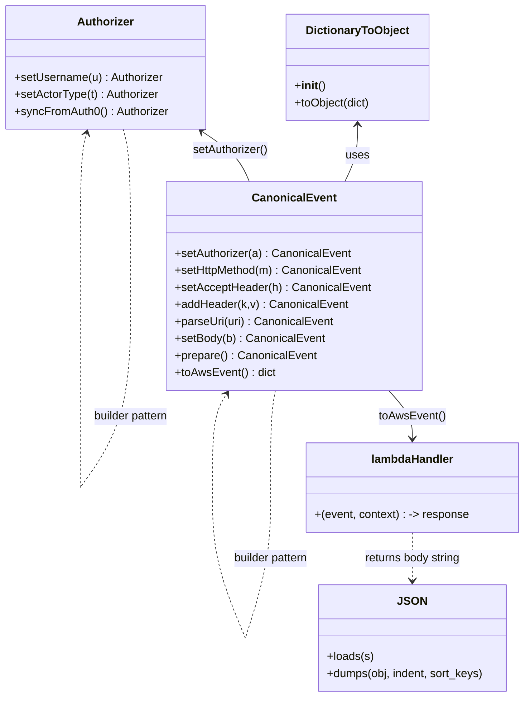
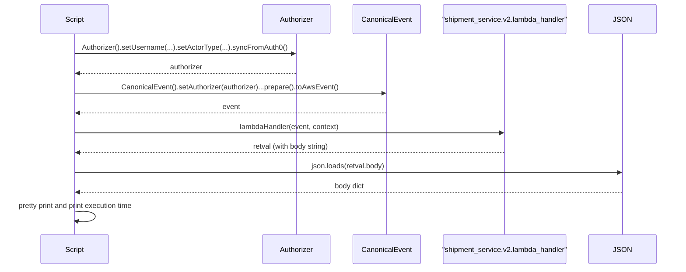

# Diagram: tools/ide_local_testing/localTest/test/byUrl/shipmentPostStatus.py

> Auto-generated by Obscura crawlers

## Diagram 1

### SVG

<svg id="container" width="737.4640502929688" xmlns="http://www.w3.org/2000/svg" class="classDiagram" height="982" viewBox="0 0 737.4640502929688 982" role="graphics-document document" aria-roledescription="class"><g><defs><marker id="container_class-aggregationStart" class="marker aggregation class" refX="18" refY="7" markerWidth="190" markerHeight="240" orient="auto"><path d="M 18,7 L9,13 L1,7 L9,1 Z"></path></marker></defs><defs><marker id="container_class-aggregationEnd" class="marker aggregation class" refX="1" refY="7" markerWidth="20" markerHeight="28" orient="auto"><path d="M 18,7 L9,13 L1,7 L9,1 Z"></path></marker></defs><defs><marker id="container_class-extensionStart" class="marker extension class" refX="18" refY="7" markerWidth="190" markerHeight="240" orient="auto"><path d="M 1,7 L18,13 V 1 Z"></path></marker></defs><defs><marker id="container_class-extensionEnd" class="marker extension class" refX="1" refY="7" markerWidth="20" markerHeight="28" orient="auto"><path d="M 1,1 V 13 L18,7 Z"></path></marker></defs><defs><marker id="container_class-compositionStart" class="marker composition class" refX="18" refY="7" markerWidth="190" markerHeight="240" orient="auto"><path d="M 18,7 L9,13 L1,7 L9,1 Z"></path></marker></defs><defs><marker id="container_class-compositionEnd" class="marker composition class" refX="1" refY="7" markerWidth="20" markerHeight="28" orient="auto"><path d="M 18,7 L9,13 L1,7 L9,1 Z"></path></marker></defs><defs><marker id="container_class-dependencyStart" class="marker dependency class" refX="6" refY="7" markerWidth="190" markerHeight="240" orient="auto"><path d="M 5,7 L9,13 L1,7 L9,1 Z"></path></marker></defs><defs><marker id="container_class-dependencyEnd" class="marker dependency class" refX="13" refY="7" markerWidth="20" markerHeight="28" orient="auto"><path d="M 18,7 L9,13 L14,7 L9,1 Z"></path></marker></defs><defs><marker id="container_class-lollipopStart" class="marker lollipop class" refX="13" refY="7" markerWidth="190" markerHeight="240" orient="auto"><circle stroke="black" fill="transparent" cx="7" cy="7" r="6"></circle></marker></defs><defs><marker id="container_class-lollipopEnd" class="marker lollipop class" refX="1" refY="7" markerWidth="190" markerHeight="240" orient="auto"><circle stroke="black" fill="transparent" cx="7" cy="7" r="6"></circle></marker></defs><g class="root"><g class="clusters"></g><g class="edgePaths"><path d="M502.058,176L502.058,183.167C502.058,190.333,502.058,204.667,499.029,218C496,231.333,489.941,243.667,486.912,249.833L483.883,256" id="id_DictionaryToObject_CanonicalEvent_1" class="edge-thickness-normal edge-pattern-solid relation" style=";;;" data-edge="true" data-et="edge" data-id="id_DictionaryToObject_CanonicalEvent_1" data-points="W3sieCI6NTAyLjA1NzgxMjUwMDc0NTA2LCJ5IjoxNzB9LHsieCI6NTAyLjA1NzgxMjUwMDc0NTA2LCJ5IjoyMTl9LHsieCI6NDgzLjg4MzAwNzgxMzI0NTA2LCJ5IjoyNTZ9XQ==" marker-start="url(#container_class-dependencyStart)"></path><path d="M284.346,185.306L292.849,190.922C301.353,196.538,318.36,207.769,329.421,219.551C340.482,231.333,345.597,243.667,348.154,249.833L350.711,256" id="id_Authorizer_CanonicalEvent_2" class="edge-thickness-normal edge-pattern-solid relation" style=";;;" data-edge="true" data-et="edge" data-id="id_Authorizer_CanonicalEvent_2" data-points="W3sieCI6Mjc5LjMzODkwODE0MDM4MjMzLCJ5IjoxODJ9LHsieCI6MzM1LjM2Njc5Njg3NTM3MjUzLCJ5IjoyMTl9LHsieCI6MzUwLjcxMTM4MTE5OTQ5NjQsInkiOjI1Nn1d" marker-start="url(#container_class-dependencyStart)"></path><path d="M546.373,550L552.024,556.167C557.674,562.333,568.975,574.667,574.626,586C580.277,597.333,580.277,607.667,580.277,612.833L580.277,618" id="id_CanonicalEvent_lambdaHandler_3" class="edge-thickness-normal edge-pattern-solid relation" style=";;;" data-edge="true" data-et="edge" data-id="id_CanonicalEvent_lambdaHandler_3" data-points="W3sieCI6NTQ2LjM3Mjk4NzQzMjgxMDMsInkiOjU1MH0seyJ4Ijo1ODAuMjc2NTYyNTAwNzQ1MSwieSI6NTg3fSx7IngiOjU4MC4yNzY1NjI1MDA3NDUxLCJ5Ijo2MjR9XQ==" marker-end="url(#container_class-dependencyEnd)"></path><path d="M580.277,750L580.277,756.167C580.277,762.333,580.277,774.667,580.277,786C580.277,797.333,580.277,807.667,580.277,812.833L580.277,818" id="id_lambdaHandler_JSON_4" class="edge-thickness-normal edge-pattern-dashed relation" style=";;;" data-edge="true" data-et="edge" data-id="id_lambdaHandler_JSON_4" data-points="W3sieCI6NTgwLjI3NjU2MjUwMDc0NTEsInkiOjc1MH0seyJ4Ijo1ODAuMjc2NTYyNTAwNzQ1MSwieSI6Nzg3fSx7IngiOjU4MC4yNzY1NjI1MDA3NDUxLCJ5Ijo4MjR9XQ==" marker-end="url(#container_class-dependencyEnd)"></path><path d="M173.957,182L175.826,188.167C177.694,194.333,181.431,206.667,183.3,243.492C185.168,280.317,185.168,341.633,185.168,372.292L185.168,402.95" id="Authorizer-cyclic-special-1" class="edge-thickness-normal edge-pattern-dashed relation" style=";;;" data-edge="true" data-et="edge" data-id="Authorizer-cyclic-special-1" data-points="W3sieCI6MTczLjk1NzQ3MjI3ODIyNTgsInkiOjE4Mn0seyJ4IjoxODUuMTY3OTY4NzUsInkiOjIxOX0seyJ4IjoxODUuMTY3OTY4NzUsInkiOjQwMi45NDk5OTk5OTkyNTQ5NH1d"></path><path d="M185.168,403.05L185.168,433.708C185.168,464.367,185.168,525.683,172.651,573C160.134,620.317,135.099,653.633,122.582,670.292L110.065,686.95" id="Authorizer-cyclic-special-mid" class="edge-thickness-normal edge-pattern-dashed relation" style=";;;" data-edge="true" data-et="edge" data-id="Authorizer-cyclic-special-mid" data-points="W3sieCI6MTg1LjE2Nzk2ODc1LCJ5Ijo0MDMuMDUwMDAwMDAwNzQ1MDZ9LHsieCI6MTg1LjE2Nzk2ODc1LCJ5Ijo1ODd9LHsieCI6MTEwLjA2NDkxNDA2MzA1OTg1LCJ5Ijo2ODYuOTQ5OTk5OTk5MjU0OX1d"></path><path d="M110.027,686.95L110.027,670.292C110.027,653.633,110.027,620.317,110.027,572.992C110.027,525.667,110.027,464.333,110.027,403C110.027,341.667,110.027,280.333,111.606,244.457C113.184,208.581,116.341,198.161,117.92,192.952L119.498,187.742" id="Authorizer-cyclic-special-2" class="edge-thickness-normal edge-pattern-dashed relation" style=";;;" data-edge="true" data-et="edge" data-id="Authorizer-cyclic-special-2" data-points="W3sieCI6MTEwLjAyNzM0Mzc1LCJ5Ijo2ODYuOTQ5OTk5OTk5MjU0OX0seyJ4IjoxMTAuMDI3MzQzNzUsInkiOjU4N30seyJ4IjoxMTAuMDI3MzQzNzUsInkiOjQwM30seyJ4IjoxMTAuMDI3MzQzNzUsInkiOjIxOX0seyJ4IjoxMjEuMjM3ODQwMjIxNzc0MTksInkiOjE4Mn1d" marker-end="url(#container_class-dependencyEnd)"></path><path d="M387.2,550L386.173,556.167C385.146,562.333,383.093,574.667,382.066,597.492C381.039,620.317,381.039,653.633,381.039,670.292L381.039,686.95" id="CanonicalEvent-cyclic-special-1" class="edge-thickness-normal edge-pattern-dashed relation" style=";;;" data-edge="true" data-et="edge" data-id="CanonicalEvent-cyclic-special-1" data-points="W3sieCI6Mzg3LjE5OTU0OTkzMjIxNTA2LCJ5Ijo1NTB9LHsieCI6MzgxLjAzOTA2MjUsInkiOjU4N30seyJ4IjozODEuMDM5MDYyNSwieSI6Njg2Ljk0OTk5OTk5OTI1NDl9XQ=="></path><path d="M381.039,687.05L381.039,703.708C381.039,720.367,381.039,753.683,374.78,789C368.521,824.317,356.003,861.633,349.744,880.292L343.486,898.95" id="CanonicalEvent-cyclic-special-mid" class="edge-thickness-normal edge-pattern-dashed relation" style=";;;" data-edge="true" data-et="edge" data-id="CanonicalEvent-cyclic-special-mid" data-points="W3sieCI6MzgxLjAzOTA2MjUsInkiOjY4Ny4wNTAwMDAwMDA3NDUxfSx7IngiOjM4MS4wMzkwNjI1LCJ5Ijo3ODd9LHsieCI6MzQzLjQ4NTUyMjQ2MTE4NzQzLCJ5Ijo4OTguOTQ5OTk5OTk5MjU0OX1d"></path><path d="M343.449,898.95L335.944,880.292C328.44,861.633,313.431,824.317,305.926,788.992C298.421,753.667,298.421,720.333,298.421,687C298.421,653.667,298.421,620.333,301.693,598.352C304.964,576.37,311.507,565.74,314.779,560.425L318.05,555.11" id="CanonicalEvent-cyclic-special-2" class="edge-thickness-normal edge-pattern-dashed relation" style=";;;" data-edge="true" data-et="edge" data-id="CanonicalEvent-cyclic-special-2" data-points="W3sieCI6MzQzLjQ0ODYzOTYxMzI2MDc1LCJ5Ijo4OTguOTQ5OTk5OTk5MjU0OX0seyJ4IjoyOTguNDIxNDg0Mzc1MzcyNTMsInkiOjc4N30seyJ4IjoyOTguNDIxNDg0Mzc1MzcyNTMsInkiOjY4N30seyJ4IjoyOTguNDIxNDg0Mzc1MzcyNTMsInkiOjU4N30seyJ4IjozMjEuMTk1Mjg5MTQ3ODY1OTQsInkiOjU1MH1d" marker-end="url(#container_class-dependencyEnd)"></path></g><g class="edgeLabels"><g class="edgeLabel" transform="translate(502.05781250074506, 219)"><g class="label" data-id="id_DictionaryToObject_CanonicalEvent_1" transform="translate(-16.4921875, -12)"><foreignObject width="32.984375" height="24">

uses

</foreignObject></g></g><g class="edgeLabel" transform="translate(324.06531, 211.53666)"><g class="label" data-id="id_Authorizer_CanonicalEvent_2" transform="translate(-53.890625, -12)"><foreignObject width="107.78125" height="24">

setAuthorizer()

</foreignObject></g></g><g class="edgeLabel" transform="translate(580.2765625007451, 587)"><g class="label" data-id="id_CanonicalEvent_lambdaHandler_3" transform="translate(-46.640625, -12)"><foreignObject width="93.28125" height="24">

toAwsEvent()

</foreignObject></g></g><g class="edgeLabel" transform="translate(580.2765625007451, 787)"><g class="label" data-id="id_lambdaHandler_JSON_4" transform="translate(-69.46875, -12)"><foreignObject width="138.9375" height="24">

returns body string

</foreignObject></g></g><g class="edgeLabel"><g class="label" data-id="Authorizer-cyclic-special-1" transform="translate(0, 0)"><foreignObject width="0" height="0">

</foreignObject></g></g><g class="edgeLabel" transform="translate(185.16796875, 587)"><g class="label" data-id="Authorizer-cyclic-special-mid" transform="translate(-55.140625, -12)"><foreignObject width="110.28125" height="24">

builder pattern

</foreignObject></g></g><g class="edgeLabel"><g class="label" data-id="Authorizer-cyclic-special-2" transform="translate(0, 0)"><foreignObject width="0" height="0">

</foreignObject></g></g><g class="edgeLabel"><g class="label" data-id="CanonicalEvent-cyclic-special-1" transform="translate(0, 0)"><foreignObject width="0" height="0">

</foreignObject></g></g><g class="edgeLabel" transform="translate(381.0390625, 787)"><g class="label" data-id="CanonicalEvent-cyclic-special-mid" transform="translate(-55.140625, -12)"><foreignObject width="110.28125" height="24">

builder pattern

</foreignObject></g></g><g class="edgeLabel"><g class="label" data-id="CanonicalEvent-cyclic-special-2" transform="translate(0, 0)"><foreignObject width="0" height="0">

</foreignObject></g></g></g><g class="nodes"><g class="node default" id="classId-DictionaryToObject-0" transform="translate(502.05781250074506, 95)"><g class="basic label-container"><path d="M-100.984375 -75 L100.984375 -75 L100.984375 75 L-100.984375 75" stroke="none" stroke-width="0" fill="#ECECFF" style=""></path><path d="M-100.984375 -75 C-26.726317781394144 -75, 47.53173943721171 -75, 100.984375 -75 M-100.984375 -75 C-57.94943106559458 -75, -14.914487131189162 -75, 100.984375 -75 M100.984375 -75 C100.984375 -15.783241823486783, 100.984375 43.433516353026434, 100.984375 75 M100.984375 -75 C100.984375 -22.532672073297896, 100.984375 29.93465585340421, 100.984375 75 M100.984375 75 C33.43585004385123 75, -34.112674912297535 75, -100.984375 75 M100.984375 75 C27.981597764756202 75, -45.021179470487596 75, -100.984375 75 M-100.984375 75 C-100.984375 25.538284507997666, -100.984375 -23.923430984004668, -100.984375 -75 M-100.984375 75 C-100.984375 24.81011233188738, -100.984375 -25.379775336225237, -100.984375 -75" stroke="#9370DB" stroke-width="1.3" fill="none" stroke-dasharray="0 0" style=""></path></g><g class="annotation-group text" transform="translate(0, -51)"></g><g class="label-group text" transform="translate(-70.109375, -51)"><g class="label" style="font-weight: bolder" transform="translate(0,-12)"><foreignObject width="140.21875" height="24">

DictionaryToObject

</foreignObject></g></g><g class="members-group text" transform="translate(-88.984375, -3)"></g><g class="methods-group text" transform="translate(-88.984375, 27)"><g class="label" style="" transform="translate(0,-12)"><foreignObject width="42.796875" height="24">

+<strong>init</strong>()

</foreignObject></g><g class="label" style="" transform="translate(0,12)"><foreignObject width="107.859375" height="24">

+toObject(dict)

</foreignObject></g></g><g class="divider" style=""><path d="M-100.984375 -27 C-48.17975652208387 -27, 4.624861955832259 -27, 100.984375 -27 M-100.984375 -27 C-33.94743394189611 -27, 33.089507116207784 -27, 100.984375 -27" stroke="#9370DB" stroke-width="1.3" fill="none" stroke-dasharray="0 0" style=""></path></g><g class="divider" style=""><path d="M-100.984375 -3 C-43.108629821794324 -3, 14.767115356411352 -3, 100.984375 -3 M-100.984375 -3 C-46.54121359265044 -3, 7.901947814699113 -3, 100.984375 -3" stroke="#9370DB" stroke-width="1.3" fill="none" stroke-dasharray="0 0" style=""></path></g></g><g class="node default" id="classId-CanonicalEvent-1" transform="translate(411.67500000074506, 403)"><g class="basic label-container"><path d="M-176.45703125 -147 L176.45703125 -147 L176.45703125 147 L-176.45703125 147" stroke="none" stroke-width="0" fill="#ECECFF" style=""></path><path d="M-176.45703125 -147 C-84.98774274055269 -147, 6.48154576889462 -147, 176.45703125 -147 M-176.45703125 -147 C-98.2257432518111 -147, -19.994455253622192 -147, 176.45703125 -147 M176.45703125 -147 C176.45703125 -60.800153017301355, 176.45703125 25.39969396539729, 176.45703125 147 M176.45703125 -147 C176.45703125 -51.4462896210743, 176.45703125 44.1074207578514, 176.45703125 147 M176.45703125 147 C58.27807480501474 147, -59.90088163997052 147, -176.45703125 147 M176.45703125 147 C101.23915304923631 147, 26.021274848472615 147, -176.45703125 147 M-176.45703125 147 C-176.45703125 57.22784003495141, -176.45703125 -32.544319930097174, -176.45703125 -147 M-176.45703125 147 C-176.45703125 53.87783422480038, -176.45703125 -39.24433155039924, -176.45703125 -147" stroke="#9370DB" stroke-width="1.3" fill="none" stroke-dasharray="0 0" style=""></path></g><g class="annotation-group text" transform="translate(0, -123)"></g><g class="label-group text" transform="translate(-55.7109375, -123)"><g class="label" style="font-weight: bolder" transform="translate(0,-12)"><foreignObject width="111.421875" height="24">

CanonicalEvent

</foreignObject></g></g><g class="members-group text" transform="translate(-164.45703125, -75)"></g><g class="methods-group text" transform="translate(-164.45703125, -45)"><g class="label" style="" transform="translate(0,-12)"><foreignObject width="247.546875" height="24">

+setAuthorizer(a) : CanonicalEvent

</foreignObject></g><g class="label" style="" transform="translate(0,12)"><foreignObject width="264.28125" height="24">

+setHttpMethod(m) : CanonicalEvent

</foreignObject></g><g class="label" style="" transform="translate(0,36)"><foreignObject width="273.203125" height="24">

+setAcceptHeader(h) : CanonicalEvent

</foreignObject></g><g class="label" style="" transform="translate(0,60)"><foreignObject width="240.96875" height="24">

+addHeader(k,v) : CanonicalEvent

</foreignObject></g><g class="label" style="" transform="translate(0,84)"><foreignObject width="222.890625" height="24">

+parseUri(uri) : CanonicalEvent

</foreignObject></g><g class="label" style="" transform="translate(0,108)"><foreignObject width="209.421875" height="24">

+setBody(b) : CanonicalEvent

</foreignObject></g><g class="label" style="" transform="translate(0,132)"><foreignObject width="197.8125" height="24">

+prepare() : CanonicalEvent

</foreignObject></g><g class="label" style="" transform="translate(0,156)"><foreignObject width="141.015625" height="24">

+toAwsEvent() : dict

</foreignObject></g></g><g class="divider" style=""><path d="M-176.45703125 -99 C-90.96036963414734 -99, -5.463708018294682 -99, 176.45703125 -99 M-176.45703125 -99 C-53.629417339671136 -99, 69.19819657065773 -99, 176.45703125 -99" stroke="#9370DB" stroke-width="1.3" fill="none" stroke-dasharray="0 0" style=""></path></g><g class="divider" style=""><path d="M-176.45703125 -75 C-51.687276383575465 -75, 73.08247848284907 -75, 176.45703125 -75 M-176.45703125 -75 C-101.97904782757433 -75, -27.501064405148668 -75, 176.45703125 -75" stroke="#9370DB" stroke-width="1.3" fill="none" stroke-dasharray="0 0" style=""></path></g></g><g class="node default" id="classId-Authorizer-2" transform="translate(147.59765625, 95)"><g class="basic label-container"><path d="M-139.59765625 -87 L139.59765625 -87 L139.59765625 87 L-139.59765625 87" stroke="none" stroke-width="0" fill="#ECECFF" style=""></path><path d="M-139.59765625 -87 C-48.658981442674914 -87, 42.27969336465017 -87, 139.59765625 -87 M-139.59765625 -87 C-49.81236163237162 -87, 39.97293298525676 -87, 139.59765625 -87 M139.59765625 -87 C139.59765625 -27.216031575876322, 139.59765625 32.567936848247356, 139.59765625 87 M139.59765625 -87 C139.59765625 -48.460729401607146, 139.59765625 -9.921458803214293, 139.59765625 87 M139.59765625 87 C51.74184468255362 87, -36.11396688489276 87, -139.59765625 87 M139.59765625 87 C57.29540605445206 87, -25.006844141095883 87, -139.59765625 87 M-139.59765625 87 C-139.59765625 39.72540345221011, -139.59765625 -7.549193095579781, -139.59765625 -87 M-139.59765625 87 C-139.59765625 34.02689701952754, -139.59765625 -18.946205960944923, -139.59765625 -87" stroke="#9370DB" stroke-width="1.3" fill="none" stroke-dasharray="0 0" style=""></path></g><g class="annotation-group text" transform="translate(0, -63)"></g><g class="label-group text" transform="translate(-38.3671875, -63)"><g class="label" style="font-weight: bolder" transform="translate(0,-12)"><foreignObject width="76.734375" height="24">

Authorizer

</foreignObject></g></g><g class="members-group text" transform="translate(-127.59765625, -15)"></g><g class="methods-group text" transform="translate(-127.59765625, 15)"><g class="label" style="" transform="translate(0,-12)"><foreignObject width="210.796875" height="24">

+setUsername(u) : Authorizer

</foreignObject></g><g class="label" style="" transform="translate(0,12)"><foreignObject width="205.46875" height="24">

+setActorType(t) : Authorizer

</foreignObject></g><g class="label" style="" transform="translate(0,36)"><foreignObject width="216.828125" height="24">

+syncFromAuth0() : Authorizer

</foreignObject></g></g><g class="divider" style=""><path d="M-139.59765625 -39 C-72.38349955189479 -39, -5.169342853789573 -39, 139.59765625 -39 M-139.59765625 -39 C-76.97870518496191 -39, -14.35975411992382 -39, 139.59765625 -39" stroke="#9370DB" stroke-width="1.3" fill="none" stroke-dasharray="0 0" style=""></path></g><g class="divider" style=""><path d="M-139.59765625 -15 C-70.67461969919562 -15, -1.7515831483912336 -15, 139.59765625 -15 M-139.59765625 -15 C-37.51126788842653 -15, 64.57512047314694 -15, 139.59765625 -15" stroke="#9370DB" stroke-width="1.3" fill="none" stroke-dasharray="0 0" style=""></path></g></g><g class="node default" id="classId-lambdaHandler-3" transform="translate(580.2765625007451, 687)"><g class="basic label-container"><path d="M-149.1875 -63 L149.1875 -63 L149.1875 63 L-149.1875 63" stroke="none" stroke-width="0" fill="#ECECFF" style=""></path><path d="M-149.1875 -63 C-36.57977820897683 -63, 76.02794358204633 -63, 149.1875 -63 M-149.1875 -63 C-47.2199435040302 -63, 54.747612991939604 -63, 149.1875 -63 M149.1875 -63 C149.1875 -16.690305549911372, 149.1875 29.619388900177256, 149.1875 63 M149.1875 -63 C149.1875 -26.262854223642705, 149.1875 10.47429155271459, 149.1875 63 M149.1875 63 C47.34871637919407 63, -54.490067241611854 63, -149.1875 63 M149.1875 63 C38.21437684321964 63, -72.75874631356072 63, -149.1875 63 M-149.1875 63 C-149.1875 36.06700165798071, -149.1875 9.13400331596143, -149.1875 -63 M-149.1875 63 C-149.1875 30.77022540907152, -149.1875 -1.459549181856957, -149.1875 -63" stroke="#9370DB" stroke-width="1.3" fill="none" stroke-dasharray="0 0" style=""></path></g><g class="annotation-group text" transform="translate(0, -39)"></g><g class="label-group text" transform="translate(-56.53125, -39)"><g class="label" style="font-weight: bolder" transform="translate(0,-12)"><foreignObject width="113.0625" height="24">

lambdaHandler

</foreignObject></g></g><g class="members-group text" transform="translate(-137.1875, 9)"></g><g class="methods-group text" transform="translate(-137.1875, 39)"><g class="label" style="" transform="translate(0,-12)"><foreignObject width="217.84375" height="24">

+(event, context) : -&gt; response

</foreignObject></g></g><g class="divider" style=""><path d="M-149.1875 -15 C-50.40045742037478 -15, 48.386585159250444 -15, 149.1875 -15 M-149.1875 -15 C-43.24407073857357 -15, 62.69935852285286 -15, 149.1875 -15" stroke="#9370DB" stroke-width="1.3" fill="none" stroke-dasharray="0 0" style=""></path></g><g class="divider" style=""><path d="M-149.1875 9 C-86.01261398968472 9, -22.837727979369447 9, 149.1875 9 M-149.1875 9 C-74.01806496951751 9, 1.1513700609649788 9, 149.1875 9" stroke="#9370DB" stroke-width="1.3" fill="none" stroke-dasharray="0 0" style=""></path></g></g><g class="node default" id="classId-JSON-4" transform="translate(580.2765625007451, 899)"><g class="basic label-container"><path d="M-132.88671875 -75 L132.88671875 -75 L132.88671875 75 L-132.88671875 75" stroke="none" stroke-width="0" fill="#ECECFF" style=""></path><path d="M-132.88671875 -75 C-64.15761026521989 -75, 4.571498219560226 -75, 132.88671875 -75 M-132.88671875 -75 C-60.869151209644414 -75, 11.148416330711171 -75, 132.88671875 -75 M132.88671875 -75 C132.88671875 -39.207723979006744, 132.88671875 -3.4154479580134876, 132.88671875 75 M132.88671875 -75 C132.88671875 -41.88204289963382, 132.88671875 -8.764085799267633, 132.88671875 75 M132.88671875 75 C39.851492518799816 75, -53.18373371240037 75, -132.88671875 75 M132.88671875 75 C71.62059426136977 75, 10.354469772739535 75, -132.88671875 75 M-132.88671875 75 C-132.88671875 18.049231177208178, -132.88671875 -38.901537645583645, -132.88671875 -75 M-132.88671875 75 C-132.88671875 35.25624553388124, -132.88671875 -4.4875089322375175, -132.88671875 -75" stroke="#9370DB" stroke-width="1.3" fill="none" stroke-dasharray="0 0" style=""></path></g><g class="annotation-group text" transform="translate(0, -51)"></g><g class="label-group text" transform="translate(-17.9453125, -51)"><g class="label" style="font-weight: bolder" transform="translate(0,-12)"><foreignObject width="35.890625" height="24">

JSON

</foreignObject></g></g><g class="members-group text" transform="translate(-120.88671875, -3)"></g><g class="methods-group text" transform="translate(-120.88671875, 27)"><g class="label" style="" transform="translate(0,-12)"><foreignObject width="65.375" height="24">

+loads(s)

</foreignObject></g><g class="label" style="" transform="translate(0,12)"><foreignObject width="223.828125" height="24">

+dumps(obj, indent, sort_keys)

</foreignObject></g></g><g class="divider" style=""><path d="M-132.88671875 -27 C-71.15909223928688 -27, -9.43146572857377 -27, 132.88671875 -27 M-132.88671875 -27 C-39.99349437792044 -27, 52.89972999415912 -27, 132.88671875 -27" stroke="#9370DB" stroke-width="1.3" fill="none" stroke-dasharray="0 0" style=""></path></g><g class="divider" style=""><path d="M-132.88671875 -3 C-32.0791298441507 -3, 68.7284590616986 -3, 132.88671875 -3 M-132.88671875 -3 C-71.99879792859753 -3, -11.110877107195066 -3, 132.88671875 -3" stroke="#9370DB" stroke-width="1.3" fill="none" stroke-dasharray="0 0" style=""></path></g></g><g class="label edgeLabel" id="Authorizer---Authorizer---1" transform="translate(185.16796875, 403)"><rect width="0.1" height="0.1"></rect><g class="label" style="" transform="translate(0, 0)"><rect></rect><foreignObject width="0" height="0">

</foreignObject></g></g><g class="label edgeLabel" id="Authorizer---Authorizer---2" transform="translate(110.02734375, 687)"><rect width="0.1" height="0.1"></rect><g class="label" style="" transform="translate(0, 0)"><rect></rect><foreignObject width="0" height="0">

</foreignObject></g></g><g class="label edgeLabel" id="CanonicalEvent---CanonicalEvent---1" transform="translate(381.0390625, 687)"><rect width="0.1" height="0.1"></rect><g class="label" style="" transform="translate(0, 0)"><rect></rect><foreignObject width="0" height="0">

</foreignObject></g></g><g class="label edgeLabel" id="CanonicalEvent---CanonicalEvent---2" transform="translate(343.46875, 899)"><rect width="0.1" height="0.1"></rect><g class="label" style="" transform="translate(0, 0)"><rect></rect><foreignObject width="0" height="0">

</foreignObject></g></g></g></g></g></svg>

## Diagram 2

### SVG

<svg id="container" width="1580" xmlns="http://www.w3.org/2000/svg" height="633" viewBox="-107 -10 1580 633" role="graphics-document document" aria-roledescription="sequence"><g><rect x="1273" y="547" fill="#eaeaea" stroke="#666" width="150" height="65" name="JSON" rx="3" ry="3" class="actor actor-bottom"></rect><text x="1348" y="579.5" dominant-baseline="central" alignment-baseline="central" class="actor actor-box" style="text-anchor: middle; font-size: 16px; font-weight: 400;"><tspan x="1348" dy="0">JSON</tspan></text></g><g><rect x="921" y="547" fill="#eaeaea" stroke="#666" width="302" height="65" name="Lambda" rx="3" ry="3" class="actor actor-bottom"></rect><text x="1072" y="579.5" dominant-baseline="central" alignment-baseline="central" class="actor actor-box" style="text-anchor: middle; font-size: 16px; font-weight: 400;"><tspan x="1072" dy="0">"shipment_service.v2.lambda_handler"</tspan></text></g><g><rect x="721" y="547" fill="#eaeaea" stroke="#666" width="150" height="65" name="CanonicalEvent" rx="3" ry="3" class="actor actor-bottom"></rect><text x="796" y="579.5" dominant-baseline="central" alignment-baseline="central" class="actor actor-box" style="text-anchor: middle; font-size: 16px; font-weight: 400;"><tspan x="796" dy="0">CanonicalEvent</tspan></text></g><g><rect x="521" y="547" fill="#eaeaea" stroke="#666" width="150" height="65" name="Authorizer" rx="3" ry="3" class="actor actor-bottom"></rect><text x="596" y="579.5" dominant-baseline="central" alignment-baseline="central" class="actor actor-box" style="text-anchor: middle; font-size: 16px; font-weight: 400;"><tspan x="596" dy="0">Authorizer</tspan></text></g><g><rect x="0" y="547" fill="#eaeaea" stroke="#666" width="150" height="65" name="Script" rx="3" ry="3" class="actor actor-bottom"></rect><text x="75" y="579.5" dominant-baseline="central" alignment-baseline="central" class="actor actor-box" style="text-anchor: middle; font-size: 16px; font-weight: 400;"><tspan x="75" dy="0">Script</tspan></text></g><g><line id="actor4" x1="1348" y1="65" x2="1348" y2="547" class="actor-line 200" stroke-width="0.5px" stroke="#999" name="JSON"></line><g id="root-4"><rect x="1273" y="0" fill="#eaeaea" stroke="#666" width="150" height="65" name="JSON" rx="3" ry="3" class="actor actor-top"></rect><text x="1348" y="32.5" dominant-baseline="central" alignment-baseline="central" class="actor actor-box" style="text-anchor: middle; font-size: 16px; font-weight: 400;"><tspan x="1348" dy="0">JSON</tspan></text></g></g><g><line id="actor3" x1="1072" y1="65" x2="1072" y2="547" class="actor-line 200" stroke-width="0.5px" stroke="#999" name="Lambda"></line><g id="root-3"><rect x="921" y="0" fill="#eaeaea" stroke="#666" width="302" height="65" name="Lambda" rx="3" ry="3" class="actor actor-top"></rect><text x="1072" y="32.5" dominant-baseline="central" alignment-baseline="central" class="actor actor-box" style="text-anchor: middle; font-size: 16px; font-weight: 400;"><tspan x="1072" dy="0">"shipment_service.v2.lambda_handler"</tspan></text></g></g><g><line id="actor2" x1="796" y1="65" x2="796" y2="547" class="actor-line 200" stroke-width="0.5px" stroke="#999" name="CanonicalEvent"></line><g id="root-2"><rect x="721" y="0" fill="#eaeaea" stroke="#666" width="150" height="65" name="CanonicalEvent" rx="3" ry="3" class="actor actor-top"></rect><text x="796" y="32.5" dominant-baseline="central" alignment-baseline="central" class="actor actor-box" style="text-anchor: middle; font-size: 16px; font-weight: 400;"><tspan x="796" dy="0">CanonicalEvent</tspan></text></g></g><g><line id="actor1" x1="596" y1="65" x2="596" y2="547" class="actor-line 200" stroke-width="0.5px" stroke="#999" name="Authorizer"></line><g id="root-1"><rect x="521" y="0" fill="#eaeaea" stroke="#666" width="150" height="65" name="Authorizer" rx="3" ry="3" class="actor actor-top"></rect><text x="596" y="32.5" dominant-baseline="central" alignment-baseline="central" class="actor actor-box" style="text-anchor: middle; font-size: 16px; font-weight: 400;"><tspan x="596" dy="0">Authorizer</tspan></text></g></g><g><line id="actor0" x1="75" y1="65" x2="75" y2="547" class="actor-line 200" stroke-width="0.5px" stroke="#999" name="Script"></line><g id="root-0"><rect x="0" y="0" fill="#eaeaea" stroke="#666" width="150" height="65" name="Script" rx="3" ry="3" class="actor actor-top"></rect><text x="75" y="32.5" dominant-baseline="central" alignment-baseline="central" class="actor actor-box" style="text-anchor: middle; font-size: 16px; font-weight: 400;"><tspan x="75" dy="0">Script</tspan></text></g></g><g></g><defs><symbol id="computer" width="24" height="24"><path transform="scale(.5)" d="M2 2v13h20v-13h-20zm18 11h-16v-9h16v9zm-10.228 6l.466-1h3.524l.467 1h-4.457zm14.228 3h-24l2-6h2.104l-1.33 4h18.45l-1.297-4h2.073l2 6zm-5-10h-14v-7h14v7z"></path></symbol></defs><defs><symbol id="database" fill-rule="evenodd" clip-rule="evenodd"><path transform="scale(.5)" d="M12.258.001l.256.004.255.005.253.008.251.01.249.012.247.015.246.016.242.019.241.02.239.023.236.024.233.027.231.028.229.031.225.032.223.034.22.036.217.038.214.04.211.041.208.043.205.045.201.046.198.048.194.05.191.051.187.053.183.054.18.056.175.057.172.059.168.06.163.061.16.063.155.064.15.066.074.033.073.033.071.034.07.034.069.035.068.035.067.035.066.035.064.036.064.036.062.036.06.036.06.037.058.037.058.037.055.038.055.038.053.038.052.038.051.039.05.039.048.039.047.039.045.04.044.04.043.04.041.04.04.041.039.041.037.041.036.041.034.041.033.042.032.042.03.042.029.042.027.042.026.043.024.043.023.043.021.043.02.043.018.044.017.043.015.044.013.044.012.044.011.045.009.044.007.045.006.045.004.045.002.045.001.045v17l-.001.045-.002.045-.004.045-.006.045-.007.045-.009.044-.011.045-.012.044-.013.044-.015.044-.017.043-.018.044-.02.043-.021.043-.023.043-.024.043-.026.043-.027.042-.029.042-.03.042-.032.042-.033.042-.034.041-.036.041-.037.041-.039.041-.04.041-.041.04-.043.04-.044.04-.045.04-.047.039-.048.039-.05.039-.051.039-.052.038-.053.038-.055.038-.055.038-.058.037-.058.037-.06.037-.06.036-.062.036-.064.036-.064.036-.066.035-.067.035-.068.035-.069.035-.07.034-.071.034-.073.033-.074.033-.15.066-.155.064-.16.063-.163.061-.168.06-.172.059-.175.057-.18.056-.183.054-.187.053-.191.051-.194.05-.198.048-.201.046-.205.045-.208.043-.211.041-.214.04-.217.038-.22.036-.223.034-.225.032-.229.031-.231.028-.233.027-.236.024-.239.023-.241.02-.242.019-.246.016-.247.015-.249.012-.251.01-.253.008-.255.005-.256.004-.258.001-.258-.001-.256-.004-.255-.005-.253-.008-.251-.01-.249-.012-.247-.015-.245-.016-.243-.019-.241-.02-.238-.023-.236-.024-.234-.027-.231-.028-.228-.031-.226-.032-.223-.034-.22-.036-.217-.038-.214-.04-.211-.041-.208-.043-.204-.045-.201-.046-.198-.048-.195-.05-.19-.051-.187-.053-.184-.054-.179-.056-.176-.057-.172-.059-.167-.06-.164-.061-.159-.063-.155-.064-.151-.066-.074-.033-.072-.033-.072-.034-.07-.034-.069-.035-.068-.035-.067-.035-.066-.035-.064-.036-.063-.036-.062-.036-.061-.036-.06-.037-.058-.037-.057-.037-.056-.038-.055-.038-.053-.038-.052-.038-.051-.039-.049-.039-.049-.039-.046-.039-.046-.04-.044-.04-.043-.04-.041-.04-.04-.041-.039-.041-.037-.041-.036-.041-.034-.041-.033-.042-.032-.042-.03-.042-.029-.042-.027-.042-.026-.043-.024-.043-.023-.043-.021-.043-.02-.043-.018-.044-.017-.043-.015-.044-.013-.044-.012-.044-.011-.045-.009-.044-.007-.045-.006-.045-.004-.045-.002-.045-.001-.045v-17l.001-.045.002-.045.004-.045.006-.045.007-.045.009-.044.011-.045.012-.044.013-.044.015-.044.017-.043.018-.044.02-.043.021-.043.023-.043.024-.043.026-.043.027-.042.029-.042.03-.042.032-.042.033-.042.034-.041.036-.041.037-.041.039-.041.04-.041.041-.04.043-.04.044-.04.046-.04.046-.039.049-.039.049-.039.051-.039.052-.038.053-.038.055-.038.056-.038.057-.037.058-.037.06-.037.061-.036.062-.036.063-.036.064-.036.066-.035.067-.035.068-.035.069-.035.07-.034.072-.034.072-.033.074-.033.151-.066.155-.064.159-.063.164-.061.167-.06.172-.059.176-.057.179-.056.184-.054.187-.053.19-.051.195-.05.198-.048.201-.046.204-.045.208-.043.211-.041.214-.04.217-.038.22-.036.223-.034.226-.032.228-.031.231-.028.234-.027.236-.024.238-.023.241-.02.243-.019.245-.016.247-.015.249-.012.251-.01.253-.008.255-.005.256-.004.258-.001.258.001zm-9.258 20.499v.01l.001.021.003.021.004.022.005.021.006.022.007.022.009.023.01.022.011.023.012.023.013.023.015.023.016.024.017.023.018.024.019.024.021.024.022.025.023.024.024.025.052.049.056.05.061.051.066.051.07.051.075.051.079.052.084.052.088.052.092.052.097.052.102.051.105.052.11.052.114.051.119.051.123.051.127.05.131.05.135.05.139.048.144.049.147.047.152.047.155.047.16.045.163.045.167.043.171.043.176.041.178.041.183.039.187.039.19.037.194.035.197.035.202.033.204.031.209.03.212.029.216.027.219.025.222.024.226.021.23.02.233.018.236.016.24.015.243.012.246.01.249.008.253.005.256.004.259.001.26-.001.257-.004.254-.005.25-.008.247-.011.244-.012.241-.014.237-.016.233-.018.231-.021.226-.021.224-.024.22-.026.216-.027.212-.028.21-.031.205-.031.202-.034.198-.034.194-.036.191-.037.187-.039.183-.04.179-.04.175-.042.172-.043.168-.044.163-.045.16-.046.155-.046.152-.047.148-.048.143-.049.139-.049.136-.05.131-.05.126-.05.123-.051.118-.052.114-.051.11-.052.106-.052.101-.052.096-.052.092-.052.088-.053.083-.051.079-.052.074-.052.07-.051.065-.051.06-.051.056-.05.051-.05.023-.024.023-.025.021-.024.02-.024.019-.024.018-.024.017-.024.015-.023.014-.024.013-.023.012-.023.01-.023.01-.022.008-.022.006-.022.006-.022.004-.022.004-.021.001-.021.001-.021v-4.127l-.077.055-.08.053-.083.054-.085.053-.087.052-.09.052-.093.051-.095.05-.097.05-.1.049-.102.049-.105.048-.106.047-.109.047-.111.046-.114.045-.115.045-.118.044-.12.043-.122.042-.124.042-.126.041-.128.04-.13.04-.132.038-.134.038-.135.037-.138.037-.139.035-.142.035-.143.034-.144.033-.147.032-.148.031-.15.03-.151.03-.153.029-.154.027-.156.027-.158.026-.159.025-.161.024-.162.023-.163.022-.165.021-.166.02-.167.019-.169.018-.169.017-.171.016-.173.015-.173.014-.175.013-.175.012-.177.011-.178.01-.179.008-.179.008-.181.006-.182.005-.182.004-.184.003-.184.002h-.37l-.184-.002-.184-.003-.182-.004-.182-.005-.181-.006-.179-.008-.179-.008-.178-.01-.176-.011-.176-.012-.175-.013-.173-.014-.172-.015-.171-.016-.17-.017-.169-.018-.167-.019-.166-.02-.165-.021-.163-.022-.162-.023-.161-.024-.159-.025-.157-.026-.156-.027-.155-.027-.153-.029-.151-.03-.15-.03-.148-.031-.146-.032-.145-.033-.143-.034-.141-.035-.14-.035-.137-.037-.136-.037-.134-.038-.132-.038-.13-.04-.128-.04-.126-.041-.124-.042-.122-.042-.12-.044-.117-.043-.116-.045-.113-.045-.112-.046-.109-.047-.106-.047-.105-.048-.102-.049-.1-.049-.097-.05-.095-.05-.093-.052-.09-.051-.087-.052-.085-.053-.083-.054-.08-.054-.077-.054v4.127zm0-5.654v.011l.001.021.003.021.004.021.005.022.006.022.007.022.009.022.01.022.011.023.012.023.013.023.015.024.016.023.017.024.018.024.019.024.021.024.022.024.023.025.024.024.052.05.056.05.061.05.066.051.07.051.075.052.079.051.084.052.088.052.092.052.097.052.102.052.105.052.11.051.114.051.119.052.123.05.127.051.131.05.135.049.139.049.144.048.147.048.152.047.155.046.16.045.163.045.167.044.171.042.176.042.178.04.183.04.187.038.19.037.194.036.197.034.202.033.204.032.209.03.212.028.216.027.219.025.222.024.226.022.23.02.233.018.236.016.24.014.243.012.246.01.249.008.253.006.256.003.259.001.26-.001.257-.003.254-.006.25-.008.247-.01.244-.012.241-.015.237-.016.233-.018.231-.02.226-.022.224-.024.22-.025.216-.027.212-.029.21-.03.205-.032.202-.033.198-.035.194-.036.191-.037.187-.039.183-.039.179-.041.175-.042.172-.043.168-.044.163-.045.16-.045.155-.047.152-.047.148-.048.143-.048.139-.05.136-.049.131-.05.126-.051.123-.051.118-.051.114-.052.11-.052.106-.052.101-.052.096-.052.092-.052.088-.052.083-.052.079-.052.074-.051.07-.052.065-.051.06-.05.056-.051.051-.049.023-.025.023-.024.021-.025.02-.024.019-.024.018-.024.017-.024.015-.023.014-.023.013-.024.012-.022.01-.023.01-.023.008-.022.006-.022.006-.022.004-.021.004-.022.001-.021.001-.021v-4.139l-.077.054-.08.054-.083.054-.085.052-.087.053-.09.051-.093.051-.095.051-.097.05-.1.049-.102.049-.105.048-.106.047-.109.047-.111.046-.114.045-.115.044-.118.044-.12.044-.122.042-.124.042-.126.041-.128.04-.13.039-.132.039-.134.038-.135.037-.138.036-.139.036-.142.035-.143.033-.144.033-.147.033-.148.031-.15.03-.151.03-.153.028-.154.028-.156.027-.158.026-.159.025-.161.024-.162.023-.163.022-.165.021-.166.02-.167.019-.169.018-.169.017-.171.016-.173.015-.173.014-.175.013-.175.012-.177.011-.178.009-.179.009-.179.007-.181.007-.182.005-.182.004-.184.003-.184.002h-.37l-.184-.002-.184-.003-.182-.004-.182-.005-.181-.007-.179-.007-.179-.009-.178-.009-.176-.011-.176-.012-.175-.013-.173-.014-.172-.015-.171-.016-.17-.017-.169-.018-.167-.019-.166-.02-.165-.021-.163-.022-.162-.023-.161-.024-.159-.025-.157-.026-.156-.027-.155-.028-.153-.028-.151-.03-.15-.03-.148-.031-.146-.033-.145-.033-.143-.033-.141-.035-.14-.036-.137-.036-.136-.037-.134-.038-.132-.039-.13-.039-.128-.04-.126-.041-.124-.042-.122-.043-.12-.043-.117-.044-.116-.044-.113-.046-.112-.046-.109-.046-.106-.047-.105-.048-.102-.049-.1-.049-.097-.05-.095-.051-.093-.051-.09-.051-.087-.053-.085-.052-.083-.054-.08-.054-.077-.054v4.139zm0-5.666v.011l.001.02.003.022.004.021.005.022.006.021.007.022.009.023.01.022.011.023.012.023.013.023.015.023.016.024.017.024.018.023.019.024.021.025.022.024.023.024.024.025.052.05.056.05.061.05.066.051.07.051.075.052.079.051.084.052.088.052.092.052.097.052.102.052.105.051.11.052.114.051.119.051.123.051.127.05.131.05.135.05.139.049.144.048.147.048.152.047.155.046.16.045.163.045.167.043.171.043.176.042.178.04.183.04.187.038.19.037.194.036.197.034.202.033.204.032.209.03.212.028.216.027.219.025.222.024.226.021.23.02.233.018.236.017.24.014.243.012.246.01.249.008.253.006.256.003.259.001.26-.001.257-.003.254-.006.25-.008.247-.01.244-.013.241-.014.237-.016.233-.018.231-.02.226-.022.224-.024.22-.025.216-.027.212-.029.21-.03.205-.032.202-.033.198-.035.194-.036.191-.037.187-.039.183-.039.179-.041.175-.042.172-.043.168-.044.163-.045.16-.045.155-.047.152-.047.148-.048.143-.049.139-.049.136-.049.131-.051.126-.05.123-.051.118-.052.114-.051.11-.052.106-.052.101-.052.096-.052.092-.052.088-.052.083-.052.079-.052.074-.052.07-.051.065-.051.06-.051.056-.05.051-.049.023-.025.023-.025.021-.024.02-.024.019-.024.018-.024.017-.024.015-.023.014-.024.013-.023.012-.023.01-.022.01-.023.008-.022.006-.022.006-.022.004-.022.004-.021.001-.021.001-.021v-4.153l-.077.054-.08.054-.083.053-.085.053-.087.053-.09.051-.093.051-.095.051-.097.05-.1.049-.102.048-.105.048-.106.048-.109.046-.111.046-.114.046-.115.044-.118.044-.12.043-.122.043-.124.042-.126.041-.128.04-.13.039-.132.039-.134.038-.135.037-.138.036-.139.036-.142.034-.143.034-.144.033-.147.032-.148.032-.15.03-.151.03-.153.028-.154.028-.156.027-.158.026-.159.024-.161.024-.162.023-.163.023-.165.021-.166.02-.167.019-.169.018-.169.017-.171.016-.173.015-.173.014-.175.013-.175.012-.177.01-.178.01-.179.009-.179.007-.181.006-.182.006-.182.004-.184.003-.184.001-.185.001-.185-.001-.184-.001-.184-.003-.182-.004-.182-.006-.181-.006-.179-.007-.179-.009-.178-.01-.176-.01-.176-.012-.175-.013-.173-.014-.172-.015-.171-.016-.17-.017-.169-.018-.167-.019-.166-.02-.165-.021-.163-.023-.162-.023-.161-.024-.159-.024-.157-.026-.156-.027-.155-.028-.153-.028-.151-.03-.15-.03-.148-.032-.146-.032-.145-.033-.143-.034-.141-.034-.14-.036-.137-.036-.136-.037-.134-.038-.132-.039-.13-.039-.128-.041-.126-.041-.124-.041-.122-.043-.12-.043-.117-.044-.116-.044-.113-.046-.112-.046-.109-.046-.106-.048-.105-.048-.102-.048-.1-.05-.097-.049-.095-.051-.093-.051-.09-.052-.087-.052-.085-.053-.083-.053-.08-.054-.077-.054v4.153zm8.74-8.179l-.257.004-.254.005-.25.008-.247.011-.244.012-.241.014-.237.016-.233.018-.231.021-.226.022-.224.023-.22.026-.216.027-.212.028-.21.031-.205.032-.202.033-.198.034-.194.036-.191.038-.187.038-.183.04-.179.041-.175.042-.172.043-.168.043-.163.045-.16.046-.155.046-.152.048-.148.048-.143.048-.139.049-.136.05-.131.05-.126.051-.123.051-.118.051-.114.052-.11.052-.106.052-.101.052-.096.052-.092.052-.088.052-.083.052-.079.052-.074.051-.07.052-.065.051-.06.05-.056.05-.051.05-.023.025-.023.024-.021.024-.02.025-.019.024-.018.024-.017.023-.015.024-.014.023-.013.023-.012.023-.01.023-.01.022-.008.022-.006.023-.006.021-.004.022-.004.021-.001.021-.001.021.001.021.001.021.004.021.004.022.006.021.006.023.008.022.01.022.01.023.012.023.013.023.014.023.015.024.017.023.018.024.019.024.02.025.021.024.023.024.023.025.051.05.056.05.06.05.065.051.07.052.074.051.079.052.083.052.088.052.092.052.096.052.101.052.106.052.11.052.114.052.118.051.123.051.126.051.131.05.136.05.139.049.143.048.148.048.152.048.155.046.16.046.163.045.168.043.172.043.175.042.179.041.183.04.187.038.191.038.194.036.198.034.202.033.205.032.21.031.212.028.216.027.22.026.224.023.226.022.231.021.233.018.237.016.241.014.244.012.247.011.25.008.254.005.257.004.26.001.26-.001.257-.004.254-.005.25-.008.247-.011.244-.012.241-.014.237-.016.233-.018.231-.021.226-.022.224-.023.22-.026.216-.027.212-.028.21-.031.205-.032.202-.033.198-.034.194-.036.191-.038.187-.038.183-.04.179-.041.175-.042.172-.043.168-.043.163-.045.16-.046.155-.046.152-.048.148-.048.143-.048.139-.049.136-.05.131-.05.126-.051.123-.051.118-.051.114-.052.11-.052.106-.052.101-.052.096-.052.092-.052.088-.052.083-.052.079-.052.074-.051.07-.052.065-.051.06-.05.056-.05.051-.05.023-.025.023-.024.021-.024.02-.025.019-.024.018-.024.017-.023.015-.024.014-.023.013-.023.012-.023.01-.023.01-.022.008-.022.006-.023.006-.021.004-.022.004-.021.001-.021.001-.021-.001-.021-.001-.021-.004-.021-.004-.022-.006-.021-.006-.023-.008-.022-.01-.022-.01-.023-.012-.023-.013-.023-.014-.023-.015-.024-.017-.023-.018-.024-.019-.024-.02-.025-.021-.024-.023-.024-.023-.025-.051-.05-.056-.05-.06-.05-.065-.051-.07-.052-.074-.051-.079-.052-.083-.052-.088-.052-.092-.052-.096-.052-.101-.052-.106-.052-.11-.052-.114-.052-.118-.051-.123-.051-.126-.051-.131-.05-.136-.05-.139-.049-.143-.048-.148-.048-.152-.048-.155-.046-.16-.046-.163-.045-.168-.043-.172-.043-.175-.042-.179-.041-.183-.04-.187-.038-.191-.038-.194-.036-.198-.034-.202-.033-.205-.032-.21-.031-.212-.028-.216-.027-.22-.026-.224-.023-.226-.022-.231-.021-.233-.018-.237-.016-.241-.014-.244-.012-.247-.011-.25-.008-.254-.005-.257-.004-.26-.001-.26.001z"></path></symbol></defs><defs><symbol id="clock" width="24" height="24"><path transform="scale(.5)" d="M12 2c5.514 0 10 4.486 10 10s-4.486 10-10 10-10-4.486-10-10 4.486-10 10-10zm0-2c-6.627 0-12 5.373-12 12s5.373 12 12 12 12-5.373 12-12-5.373-12-12-12zm5.848 12.459c.202.038.202.333.001.372-1.907.361-6.045 1.111-6.547 1.111-.719 0-1.301-.582-1.301-1.301 0-.512.77-5.447 1.125-7.445.034-.192.312-.181.343.014l.985 6.238 5.394 1.011z"></path></symbol></defs><defs><marker id="arrowhead" refX="7.9" refY="5" markerUnits="userSpaceOnUse" markerWidth="12" markerHeight="12" orient="auto-start-reverse"><path d="M -1 0 L 10 5 L 0 10 z"></path></marker></defs><defs><marker id="crosshead" markerWidth="15" markerHeight="8" orient="auto" refX="4" refY="4.5"><path fill="none" stroke="#000000" stroke-width="1pt" d="M 1,2 L 6,7 M 6,2 L 1,7" style="stroke-dasharray: 0, 0;"></path></marker></defs><defs><marker id="filled-head" refX="15.5" refY="7" markerWidth="20" markerHeight="28" orient="auto"><path d="M 18,7 L9,13 L14,7 L9,1 Z"></path></marker></defs><defs><marker id="sequencenumber" refX="15" refY="15" markerWidth="60" markerHeight="40" orient="auto"><circle cx="15" cy="15" r="6"></circle></marker></defs><text x="334" y="80" text-anchor="middle" dominant-baseline="middle" alignment-baseline="middle" class="messageText" dy="1em" style="font-size: 16px; font-weight: 400;">Authorizer().setUsername(...).setActorType(...).syncFromAuth0()</text><line x1="76" y1="113" x2="592" y2="113" class="messageLine0" stroke-width="2" stroke="none" marker-end="url(#arrowhead)" style="fill: none;"></line><text x="337" y="128" text-anchor="middle" dominant-baseline="middle" alignment-baseline="middle" class="messageText" dy="1em" style="font-size: 16px; font-weight: 400;">authorizer</text><line x1="595" y1="161" x2="79" y2="161" class="messageLine1" stroke-width="2" stroke="none" marker-end="url(#arrowhead)" style="stroke-dasharray: 3, 3; fill: none;"></line><text x="434" y="176" text-anchor="middle" dominant-baseline="middle" alignment-baseline="middle" class="messageText" dy="1em" style="font-size: 16px; font-weight: 400;">CanonicalEvent().setAuthorizer(authorizer)...prepare().toAwsEvent()</text><line x1="76" y1="209" x2="792" y2="209" class="messageLine0" stroke-width="2" stroke="none" marker-end="url(#arrowhead)" style="fill: none;"></line><text x="437" y="224" text-anchor="middle" dominant-baseline="middle" alignment-baseline="middle" class="messageText" dy="1em" style="font-size: 16px; font-weight: 400;">event</text><line x1="795" y1="257" x2="79" y2="257" class="messageLine1" stroke-width="2" stroke="none" marker-end="url(#arrowhead)" style="stroke-dasharray: 3, 3; fill: none;"></line><text x="572" y="272" text-anchor="middle" dominant-baseline="middle" alignment-baseline="middle" class="messageText" dy="1em" style="font-size: 16px; font-weight: 400;">lambdaHandler(event, context)</text><line x1="76" y1="305" x2="1068" y2="305" class="messageLine0" stroke-width="2" stroke="none" marker-end="url(#arrowhead)" style="fill: none;"></line><text x="575" y="320" text-anchor="middle" dominant-baseline="middle" alignment-baseline="middle" class="messageText" dy="1em" style="font-size: 16px; font-weight: 400;">retval (with body string)</text><line x1="1071" y1="353" x2="79" y2="353" class="messageLine1" stroke-width="2" stroke="none" marker-end="url(#arrowhead)" style="stroke-dasharray: 3, 3; fill: none;"></line><text x="710" y="368" text-anchor="middle" dominant-baseline="middle" alignment-baseline="middle" class="messageText" dy="1em" style="font-size: 16px; font-weight: 400;">json.loads(retval.body)</text><line x1="76" y1="401" x2="1344" y2="401" class="messageLine0" stroke-width="2" stroke="none" marker-end="url(#arrowhead)" style="fill: none;"></line><text x="713" y="416" text-anchor="middle" dominant-baseline="middle" alignment-baseline="middle" class="messageText" dy="1em" style="font-size: 16px; font-weight: 400;">body dict</text><line x1="1347" y1="449" x2="79" y2="449" class="messageLine1" stroke-width="2" stroke="none" marker-end="url(#arrowhead)" style="stroke-dasharray: 3, 3; fill: none;"></line><text x="76" y="464" text-anchor="middle" dominant-baseline="middle" alignment-baseline="middle" class="messageText" dy="1em" style="font-size: 16px; font-weight: 400;">pretty print and print execution time</text><path d="M 76,497 C 136,487 136,527 76,517" class="messageLine0" stroke-width="2" stroke="none" marker-end="url(#arrowhead)" style="fill: none;"></path></svg>
