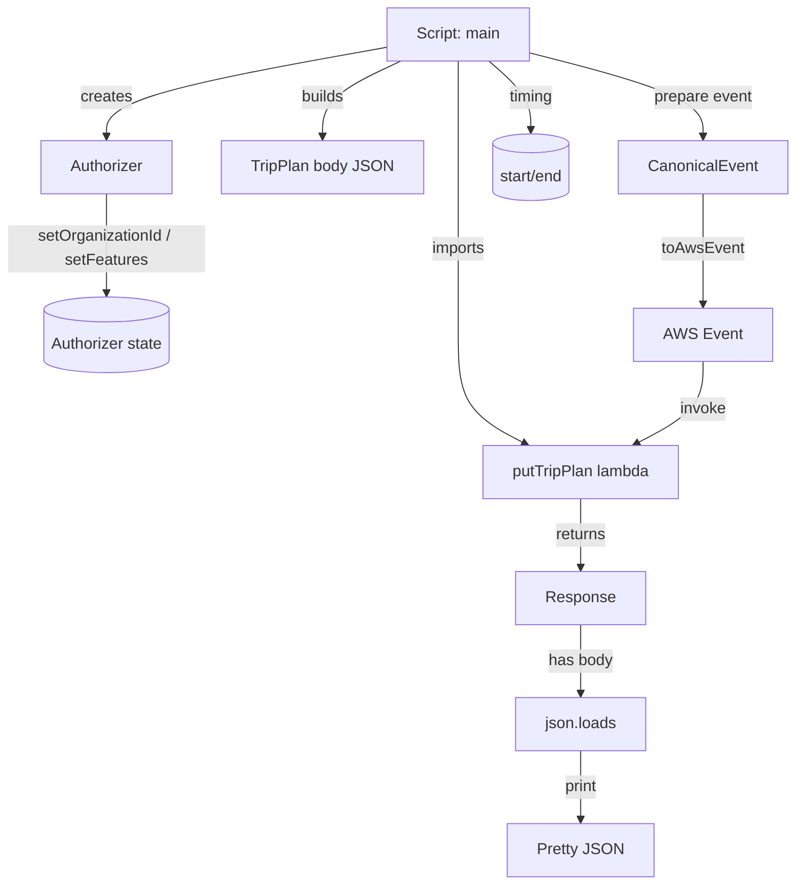
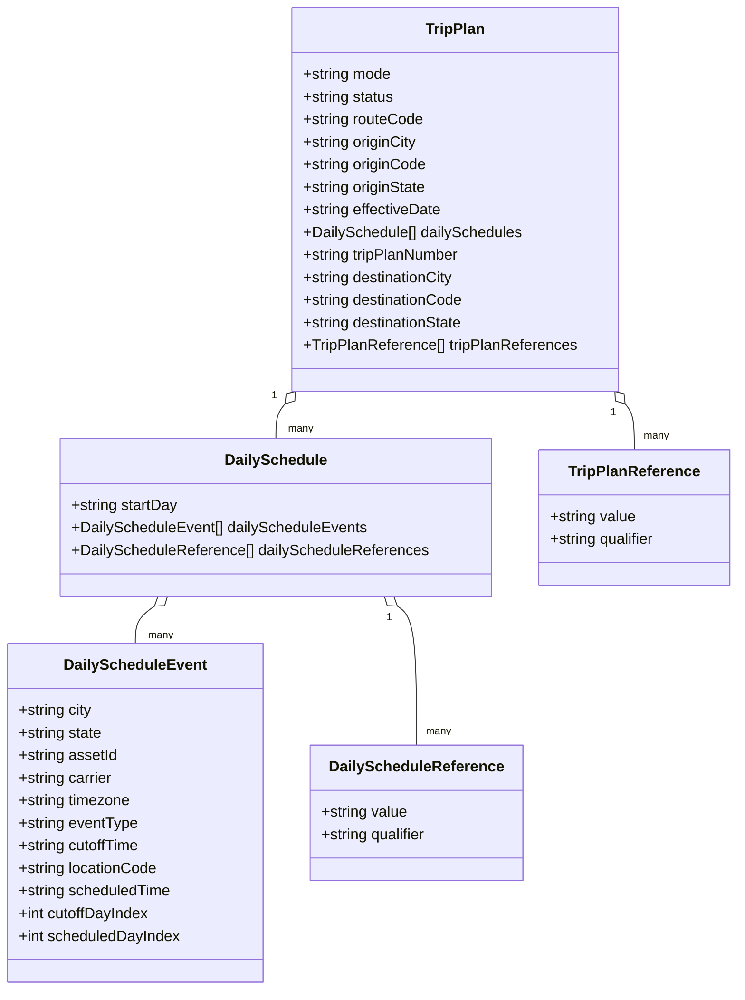

# Diagram: tools/ide_local_testing/localTest/test/byUrl/shipmentPutTripPlan.py

> Auto-generated by Obscura crawlers

## Diagram 1

### SVG

<svg id="container" width="808.6640625" xmlns="http://www.w3.org/2000/svg" class="flowchart" height="900.48779296875" viewBox="0 0 808.6640625 900.48779296875" role="graphics-document document" aria-roledescription="flowchart-v2"><g><marker id="container_flowchart-v2-pointEnd" class="marker flowchart-v2" viewBox="0 0 10 10" refX="5" refY="5" markerUnits="userSpaceOnUse" markerWidth="8" markerHeight="8" orient="auto"><path d="M 0 0 L 10 5 L 0 10 z" class="arrowMarkerPath" style="stroke-width: 1; stroke-dasharray: 1, 0;"></path></marker><marker id="container_flowchart-v2-pointStart" class="marker flowchart-v2" viewBox="0 0 10 10" refX="4.5" refY="5" markerUnits="userSpaceOnUse" markerWidth="8" markerHeight="8" orient="auto"><path d="M 0 5 L 10 10 L 10 0 z" class="arrowMarkerPath" style="stroke-width: 1; stroke-dasharray: 1, 0;"></path></marker><marker id="container_flowchart-v2-circleEnd" class="marker flowchart-v2" viewBox="0 0 10 10" refX="11" refY="5" markerUnits="userSpaceOnUse" markerWidth="11" markerHeight="11" orient="auto"><circle cx="5" cy="5" r="5" class="arrowMarkerPath" style="stroke-width: 1; stroke-dasharray: 1, 0;"></circle></marker><marker id="container_flowchart-v2-circleStart" class="marker flowchart-v2" viewBox="0 0 10 10" refX="-1" refY="5" markerUnits="userSpaceOnUse" markerWidth="11" markerHeight="11" orient="auto"><circle cx="5" cy="5" r="5" class="arrowMarkerPath" style="stroke-width: 1; stroke-dasharray: 1, 0;"></circle></marker><marker id="container_flowchart-v2-crossEnd" class="marker cross flowchart-v2" viewBox="0 0 11 11" refX="12" refY="5.2" markerUnits="userSpaceOnUse" markerWidth="11" markerHeight="11" orient="auto"><path d="M 1,1 l 9,9 M 10,1 l -9,9" class="arrowMarkerPath" style="stroke-width: 2; stroke-dasharray: 1, 0;"></path></marker><marker id="container_flowchart-v2-crossStart" class="marker cross flowchart-v2" viewBox="0 0 11 11" refX="-1" refY="5.2" markerUnits="userSpaceOnUse" markerWidth="11" markerHeight="11" orient="auto"><path d="M 1,1 l 9,9 M 10,1 l -9,9" class="arrowMarkerPath" style="stroke-width: 2; stroke-dasharray: 1, 0;"></path></marker><g class="root"><g class="clusters"></g><g class="edgePaths"><path d="M387.516,48.311L340.93,56.759C294.344,65.207,201.172,82.104,154.586,97.313C108,112.523,108,126.047,108,132.808L108,139.57" id="L_Script_Authorizer_0" class="edge-thickness-normal edge-pattern-solid edge-thickness-normal edge-pattern-solid flowchart-link" style=";" data-edge="true" data-et="edge" data-id="L_Script_Authorizer_0" data-points="W3sieCI6Mzg3LjUxNTYyNSwieSI6NDguMzEwNjA1ODkyOTAwNjI1fSx7IngiOjEwOCwieSI6OTl9LHsieCI6MTA4LCJ5IjoxNDMuNTcwMDk1MDYyMjU1ODZ9XQ==" marker-end="url(#container_flowchart-v2-pointEnd)"></path><path d="M460.914,62L460.914,68.167C460.914,74.333,460.914,86.667,460.914,104.762C460.914,122.857,460.914,146.713,460.914,172.57C460.914,198.427,460.914,226.283,460.914,254.824C460.914,283.365,460.914,312.589,460.914,339.814C460.914,367.039,460.914,392.263,472.573,410.742C484.232,429.222,507.551,440.956,519.21,446.823L530.869,452.69" id="L_Script_PutTripPlan_0" class="edge-thickness-normal edge-pattern-solid edge-thickness-normal edge-pattern-solid flowchart-link" style=";" data-edge="true" data-et="edge" data-id="L_Script_PutTripPlan_0" data-points="W3sieCI6NDYwLjkxNDA2MjUsInkiOjYyfSx7IngiOjQ2MC45MTQwNjI1LCJ5Ijo5OX0seyJ4Ijo0NjAuOTE0MDYyNSwieSI6MTcwLjU3MDA5NTA2MjI1NTg2fSx7IngiOjQ2MC45MTQwNjI1LCJ5IjoyNTQuMTQwMTkwMTI0NTExNzJ9LHsieCI6NDYwLjkxNDA2MjUsInkiOjM0MS44MTM5ODAxMDI1MzkwNn0seyJ4Ijo0NjAuOTE0MDYyNSwieSI6NDE3LjQ4Nzc3MDA4MDU2NjR9LHsieCI6NTM0LjQ0MjA3NzYzNjcxODgsInkiOjQ1NC40ODc3NzAwODA1NjY0fV0=" marker-end="url(#container_flowchart-v2-pointEnd)"></path><path d="M108,197.57L108,206.998C108,216.427,108,235.283,108,252.212C108,269.14,108,284.14,108,291.64L108,299.14" id="L_Authorizer_AuthZState_0" class="edge-thickness-normal edge-pattern-solid edge-thickness-normal edge-pattern-solid flowchart-link" style=";" data-edge="true" data-et="edge" data-id="L_Authorizer_AuthZState_0" data-points="W3sieCI6MTA4LCJ5IjoxOTcuNTcwMDk1MDYyMjU1ODZ9LHsieCI6MTA4LCJ5IjoyNTQuMTQwMTkwMTI0NTExNzJ9LHsieCI6MTA4LCJ5IjozMDMuMTQwMTkwMTI0NTExN31d" marker-end="url(#container_flowchart-v2-pointEnd)"></path><path d="M403.921,62L390.905,68.167C377.888,74.333,351.854,86.667,338.837,99.595C325.82,112.523,325.82,126.047,325.82,132.808L325.82,139.57" id="L_Script_Body_0" class="edge-thickness-normal edge-pattern-solid edge-thickness-normal edge-pattern-solid flowchart-link" style=";" data-edge="true" data-et="edge" data-id="L_Script_Body_0" data-points="W3sieCI6NDAzLjkyMTM4NjcxODc1LCJ5Ijo2Mn0seyJ4IjozMjUuODIwMzEyNSwieSI6OTl9LHsieCI6MzI1LjgyMDMxMjUsInkiOjE0My41NzAwOTUwNjIyNTU4Nn1d" marker-end="url(#container_flowchart-v2-pointEnd)"></path><path d="M534.313,53.467L564.474,61.056C594.635,68.645,654.958,83.822,685.12,98.173C715.281,112.523,715.281,126.047,715.281,132.808L715.281,139.57" id="L_Script_CanonicalEvent_0" class="edge-thickness-normal edge-pattern-solid edge-thickness-normal edge-pattern-solid flowchart-link" style=";" data-edge="true" data-et="edge" data-id="L_Script_CanonicalEvent_0" data-points="W3sieCI6NTM0LjMxMjUsInkiOjUzLjQ2NzM5NzY0NzM0Nzg5NH0seyJ4Ijo3MTUuMjgxMjUsInkiOjk5fSx7IngiOjcxNS4yODEyNSwieSI6MTQzLjU3MDA5NTA2MjI1NTg2fV0=" marker-end="url(#container_flowchart-v2-pointEnd)"></path><path d="M715.281,197.57L715.281,206.998C715.281,216.427,715.281,235.283,715.281,254.157C715.281,273.031,715.281,291.923,715.281,301.368L715.281,310.814" id="L_CanonicalEvent_AwsEvent_0" class="edge-thickness-normal edge-pattern-solid edge-thickness-normal edge-pattern-solid flowchart-link" style=";" data-edge="true" data-et="edge" data-id="L_CanonicalEvent_AwsEvent_0" data-points="W3sieCI6NzE1LjI4MTI1LCJ5IjoxOTcuNTcwMDk1MDYyMjU1ODZ9LHsieCI6NzE1LjI4MTI1LCJ5IjoyNTQuMTQwMTkwMTI0NTExNzJ9LHsieCI6NzE1LjI4MTI1LCJ5IjozMTQuODEzOTgwMTAyNTM5MDZ9XQ==" marker-end="url(#container_flowchart-v2-pointEnd)"></path><path d="M715.281,368.814L715.281,376.926C715.281,385.039,715.281,401.263,703.622,415.242C691.963,429.222,668.645,440.956,656.985,446.823L645.326,452.69" id="L_AwsEvent_PutTripPlan_0" class="edge-thickness-normal edge-pattern-solid edge-thickness-normal edge-pattern-solid flowchart-link" style=";" data-edge="true" data-et="edge" data-id="L_AwsEvent_PutTripPlan_0" data-points="W3sieCI6NzE1LjI4MTI1LCJ5IjozNjguODEzOTgwMTAyNTM5MDZ9LHsieCI6NzE1LjI4MTI1LCJ5Ijo0MTcuNDg3NzcwMDgwNTY2NH0seyJ4Ijo2NDEuNzUzMjM0ODYzMjgxMiwieSI6NDU0LjQ4Nzc3MDA4MDU2NjR9XQ==" marker-end="url(#container_flowchart-v2-pointEnd)"></path><path d="M588.098,508.488L588.098,514.654C588.098,520.821,588.098,533.154,588.098,544.821C588.098,556.488,588.098,567.488,588.098,572.988L588.098,578.488" id="L_PutTripPlan_retval_0" class="edge-thickness-normal edge-pattern-solid edge-thickness-normal edge-pattern-solid flowchart-link" style=";" data-edge="true" data-et="edge" data-id="L_PutTripPlan_retval_0" data-points="W3sieCI6NTg4LjA5NzY1NjI1LCJ5Ijo1MDguNDg3NzcwMDgwNTY2NH0seyJ4Ijo1ODguMDk3NjU2MjUsInkiOjU0NS40ODc3NzAwODA1NjY0fSx7IngiOjU4OC4wOTc2NTYyNSwieSI6NTgyLjQ4Nzc3MDA4MDU2NjR9XQ==" marker-end="url(#container_flowchart-v2-pointEnd)"></path><path d="M588.098,636.488L588.098,642.654C588.098,648.821,588.098,661.154,588.098,672.821C588.098,684.488,588.098,695.488,588.098,700.988L588.098,706.488" id="L_retval_Parse_0" class="edge-thickness-normal edge-pattern-solid edge-thickness-normal edge-pattern-solid flowchart-link" style=";" data-edge="true" data-et="edge" data-id="L_retval_Parse_0" data-points="W3sieCI6NTg4LjA5NzY1NjI1LCJ5Ijo2MzYuNDg3NzcwMDgwNTY2NH0seyJ4Ijo1ODguMDk3NjU2MjUsInkiOjY3My40ODc3NzAwODA1NjY0fSx7IngiOjU4OC4wOTc2NTYyNSwieSI6NzEwLjQ4Nzc3MDA4MDU2NjR9XQ==" marker-end="url(#container_flowchart-v2-pointEnd)"></path><path d="M588.098,764.488L588.098,770.654C588.098,776.821,588.098,789.154,588.098,800.821C588.098,812.488,588.098,823.488,588.098,828.988L588.098,834.488" id="L_Parse_Output_0" class="edge-thickness-normal edge-pattern-solid edge-thickness-normal edge-pattern-solid flowchart-link" style=";" data-edge="true" data-et="edge" data-id="L_Parse_Output_0" data-points="W3sieCI6NTg4LjA5NzY1NjI1LCJ5Ijo3NjQuNDg3NzcwMDgwNTY2NH0seyJ4Ijo1ODguMDk3NjU2MjUsInkiOjgwMS40ODc3NzAwODA1NjY0fSx7IngiOjU4OC4wOTc2NTYyNSwieSI6ODM4LjQ4Nzc3MDA4MDU2NjR9XQ==" marker-end="url(#container_flowchart-v2-pointEnd)"></path><path d="M493.395,62L500.814,68.167C508.232,74.333,523.069,86.667,530.488,98.333C537.906,110,537.906,121,537.906,126.5L537.906,132" id="L_Script_Timer_0" class="edge-thickness-normal edge-pattern-solid edge-thickness-normal edge-pattern-solid flowchart-link" style=";" data-edge="true" data-et="edge" data-id="L_Script_Timer_0" data-points="W3sieCI6NDkzLjM5NTE0MTYwMTU2MjUsInkiOjYyfSx7IngiOjUzNy45MDYyNSwieSI6OTl9LHsieCI6NTM3LjkwNjI1LCJ5IjoxMzZ9XQ==" marker-end="url(#container_flowchart-v2-pointEnd)"></path></g><g class="edgeLabels"><g class="edgeLabel" transform="translate(108, 99)"><g class="label" data-id="L_Script_Authorizer_0" transform="translate(-26.171875, -12)"><foreignObject width="52.34375" height="24">

creates

</foreignObject></g></g><g class="edgeLabel" transform="translate(460.9140625, 254.14019012451172)"><g class="label" data-id="L_Script_PutTripPlan_0" transform="translate(-28.25, -12)"><foreignObject width="56.5" height="24">

imports

</foreignObject></g></g><g class="edgeLabel" transform="translate(108, 254.14019012451172)"><g class="label" data-id="L_Authorizer_AuthZState_0" transform="translate(-100, -24)"><foreignObject width="200" height="48">

setOrganizationId / setFeatures

</foreignObject></g></g><g class="edgeLabel" transform="translate(325.8203125, 99)"><g class="label" data-id="L_Script_Body_0" transform="translate(-22.4921875, -12)"><foreignObject width="44.984375" height="24">

builds

</foreignObject></g></g><g class="edgeLabel" transform="translate(715.28125, 99)"><g class="label" data-id="L_Script_CanonicalEvent_0" transform="translate(-50.484375, -12)"><foreignObject width="100.96875" height="24">

prepare event

</foreignObject></g></g><g class="edgeLabel" transform="translate(715.28125, 254.14019012451172)"><g class="label" data-id="L_CanonicalEvent_AwsEvent_0" transform="translate(-41.4609375, -12)"><foreignObject width="82.921875" height="24">

toAwsEvent

</foreignObject></g></g><g class="edgeLabel" transform="translate(715.28125, 417.4877700805664)"><g class="label" data-id="L_AwsEvent_PutTripPlan_0" transform="translate(-23.8515625, -12)"><foreignObject width="47.703125" height="24">

invoke

</foreignObject></g></g><g class="edgeLabel" transform="translate(588.09765625, 545.4877700805664)"><g class="label" data-id="L_PutTripPlan_retval_0" transform="translate(-26.265625, -12)"><foreignObject width="52.53125" height="24">

returns

</foreignObject></g></g><g class="edgeLabel" transform="translate(588.09765625, 673.4877700805664)"><g class="label" data-id="L_retval_Parse_0" transform="translate(-32.9609375, -12)"><foreignObject width="65.921875" height="24">

has body

</foreignObject></g></g><g class="edgeLabel" transform="translate(588.09765625, 801.4877700805664)"><g class="label" data-id="L_Parse_Output_0" transform="translate(-17.6796875, -12)"><foreignObject width="35.359375" height="24">

print

</foreignObject></g></g><g class="edgeLabel" transform="translate(537.90625, 99)"><g class="label" data-id="L_Script_Timer_0" transform="translate(-23.109375, -12)"><foreignObject width="46.21875" height="24">

timing

</foreignObject></g></g></g><g class="nodes"><g class="node default" id="flowchart-Script-0" transform="translate(460.9140625, 35)"><rect class="basic label-container" style="" x="-73.3984375" y="-27" width="146.796875" height="54"></rect><g class="label" style="" transform="translate(-43.3984375, -12)"><rect></rect><foreignObject width="86.796875" height="24">

Script: main

</foreignObject></g></g><g class="node default" id="flowchart-Authorizer-1" transform="translate(108, 170.57009506225586)"><rect class="basic label-container" style="" x="-67.7265625" y="-27" width="135.453125" height="54"></rect><g class="label" style="" transform="translate(-37.7265625, -12)"><rect></rect><foreignObject width="75.453125" height="24">

Authorizer

</foreignObject></g></g><g class="node default" id="flowchart-PutTripPlan-3" transform="translate(588.09765625, 481.4877700805664)"><rect class="basic label-container" style="" x="-101.7265625" y="-27" width="203.453125" height="54"></rect><g class="label" style="" transform="translate(-71.7265625, -12)"><rect></rect><foreignObject width="143.453125" height="24">

putTripPlan lambda

</foreignObject></g></g><g class="node default" id="flowchart-AuthZState-5" transform="translate(108, 341.81398010253906)"><path d="M0,12.782529016493587 a65.390625,12.782529016493587 0,0,0 130.78125,0 a65.390625,12.782529016493587 0,0,0 -130.78125,0 l0,51.782529016493584 a65.390625,12.782529016493587 0,0,0 130.78125,0 l0,-51.782529016493584" class="basic label-container" style="" transform="translate(-65.390625, -38.673793524740375)"></path><g class="label" style="" transform="translate(-57.890625, -2)"><rect></rect><foreignObject width="115.78125" height="24">

Authorizer state

</foreignObject></g></g><g class="node default" id="flowchart-Body-7" transform="translate(325.8203125, 170.57009506225586)"><rect class="basic label-container" style="" x="-100.09375" y="-27" width="200.1875" height="54"></rect><g class="label" style="" transform="translate(-70.09375, -12)"><rect></rect><foreignObject width="140.1875" height="24">

TripPlan body JSON

</foreignObject></g></g><g class="node default" id="flowchart-CanonicalEvent-9" transform="translate(715.28125, 170.57009506225586)"><rect class="basic label-container" style="" x="-85.3828125" y="-27" width="170.765625" height="54"></rect><g class="label" style="" transform="translate(-55.3828125, -12)"><rect></rect><foreignObject width="110.765625" height="24">

CanonicalEvent

</foreignObject></g></g><g class="node default" id="flowchart-AwsEvent-11" transform="translate(715.28125, 341.81398010253906)"><rect class="basic label-container" style="" x="-67.5546875" y="-27" width="135.109375" height="54"></rect><g class="label" style="" transform="translate(-37.5546875, -12)"><rect></rect><foreignObject width="75.109375" height="24">

AWS Event

</foreignObject></g></g><g class="node default" id="flowchart-retval-15" transform="translate(588.09765625, 609.4877700805664)"><rect class="basic label-container" style="" x="-65.03125" y="-27" width="130.0625" height="54"></rect><g class="label" style="" transform="translate(-35.03125, -12)"><rect></rect><foreignObject width="70.0625" height="24">

Response

</foreignObject></g></g><g class="node default" id="flowchart-Parse-17" transform="translate(588.09765625, 737.4877700805664)"><rect class="basic label-container" style="" x="-67.03125" y="-27" width="134.0625" height="54"></rect><g class="label" style="" transform="translate(-37.03125, -12)"><rect></rect><foreignObject width="74.0625" height="24">

json.loads

</foreignObject></g></g><g class="node default" id="flowchart-Output-19" transform="translate(588.09765625, 865.4877700805664)"><rect class="basic label-container" style="" x="-71.2890625" y="-27" width="142.578125" height="54"></rect><g class="label" style="" transform="translate(-41.2890625, -12)"><rect></rect><foreignObject width="82.578125" height="24">

Pretty JSON

</foreignObject></g></g><g class="node default" id="flowchart-Timer-21" transform="translate(537.90625, 170.57009506225586)"><path d="M0,10.046728971962617 a41.9921875,10.046728971962617 0,0,0 83.984375,0 a41.9921875,10.046728971962617 0,0,0 -83.984375,0 l0,49.046728971962615 a41.9921875,10.046728971962617 0,0,0 83.984375,0 l0,-49.046728971962615" class="basic label-container" style="" transform="translate(-41.9921875, -34.570093457943926)"></path><g class="label" style="" transform="translate(-34.4921875, -2)"><rect></rect><foreignObject width="68.984375" height="24">

start/end

</foreignObject></g></g></g></g></g></svg>

## Diagram 2

### SVG

<svg id="container" width="782.15625" xmlns="http://www.w3.org/2000/svg" class="classDiagram" height="1052" viewBox="0 0 782.15625 1052" role="graphics-document document" aria-roledescription="class"><g><defs><marker id="container_class-aggregationStart" class="marker aggregation class" refX="18" refY="7" markerWidth="190" markerHeight="240" orient="auto"><path d="M 18,7 L9,13 L1,7 L9,1 Z"></path></marker></defs><defs><marker id="container_class-aggregationEnd" class="marker aggregation class" refX="1" refY="7" markerWidth="20" markerHeight="28" orient="auto"><path d="M 18,7 L9,13 L1,7 L9,1 Z"></path></marker></defs><defs><marker id="container_class-extensionStart" class="marker extension class" refX="18" refY="7" markerWidth="190" markerHeight="240" orient="auto"><path d="M 1,7 L18,13 V 1 Z"></path></marker></defs><defs><marker id="container_class-extensionEnd" class="marker extension class" refX="1" refY="7" markerWidth="20" markerHeight="28" orient="auto"><path d="M 1,1 V 13 L18,7 Z"></path></marker></defs><defs><marker id="container_class-compositionStart" class="marker composition class" refX="18" refY="7" markerWidth="190" markerHeight="240" orient="auto"><path d="M 18,7 L9,13 L1,7 L9,1 Z"></path></marker></defs><defs><marker id="container_class-compositionEnd" class="marker composition class" refX="1" refY="7" markerWidth="20" markerHeight="28" orient="auto"><path d="M 18,7 L9,13 L1,7 L9,1 Z"></path></marker></defs><defs><marker id="container_class-dependencyStart" class="marker dependency class" refX="6" refY="7" markerWidth="190" markerHeight="240" orient="auto"><path d="M 5,7 L9,13 L1,7 L9,1 Z"></path></marker></defs><defs><marker id="container_class-dependencyEnd" class="marker dependency class" refX="13" refY="7" markerWidth="20" markerHeight="28" orient="auto"><path d="M 18,7 L9,13 L14,7 L9,1 Z"></path></marker></defs><defs><marker id="container_class-lollipopStart" class="marker lollipop class" refX="13" refY="7" markerWidth="190" markerHeight="240" orient="auto"><circle stroke="black" fill="transparent" cx="7" cy="7" r="6"></circle></marker></defs><defs><marker id="container_class-lollipopEnd" class="marker lollipop class" refX="1" refY="7" markerWidth="190" markerHeight="240" orient="auto"><circle stroke="black" fill="transparent" cx="7" cy="7" r="6"></circle></marker></defs><g class="root"><g class="clusters"></g><g class="edgePaths"><path d="M301.451,429.28L299.831,431.233C298.212,433.187,294.973,437.093,293.354,443.213C291.734,449.333,291.734,457.667,291.734,461.833L291.734,466" id="id_TripPlan_DailySchedule_1" class="edge-thickness-normal edge-pattern-solid relation" style=";;;" data-edge="true" data-et="edge" data-id="id_TripPlan_DailySchedule_1" data-points="W3sieCI6MzEyLjQ1OTg4ODQ0MTU5MzksInkiOjQxNn0seyJ4IjoyOTEuNzM0Mzc1LCJ5Ijo0NDF9LHsieCI6MjkxLjczNDM3NSwieSI6NDY2fV0=" marker-start="url(#container_class-aggregationStart)"></path><path d="M162.942,644.182L159.565,646.652C156.188,649.122,149.434,654.061,146.057,660.697C142.68,667.333,142.68,675.667,142.68,679.833L142.68,684" id="id_DailySchedule_DailyScheduleEvent_2" class="edge-thickness-normal edge-pattern-solid relation" style=";;;" data-edge="true" data-et="edge" data-id="id_DailySchedule_DailyScheduleEvent_2" data-points="W3sieCI6MTc2Ljg2NjU0MjQzMTE5MjY3LCJ5Ijo2MzR9LHsieCI6MTQyLjY3OTY4NzUsInkiOjY1OX0seyJ4IjoxNDIuNjc5Njg3NSwieSI6Njg0fV0=" marker-start="url(#container_class-aggregationStart)"></path><path d="M420.526,644.182L423.903,646.652C427.281,649.122,434.035,654.061,437.412,678.697C440.789,703.333,440.789,747.667,440.789,769.833L440.789,792" id="id_DailySchedule_DailyScheduleReference_3" class="edge-thickness-normal edge-pattern-solid relation" style=";;;" data-edge="true" data-et="edge" data-id="id_DailySchedule_DailyScheduleReference_3" data-points="W3sieCI6NDA2LjYwMjIwNzU2ODgwNzMzLCJ5Ijo2MzR9LHsieCI6NDQwLjc4OTA2MjUsInkiOjY1OX0seyJ4Ijo0NDAuNzg5MDYyNSwieSI6NzkyfV0=" marker-start="url(#container_class-aggregationStart)"></path><path d="M661.71,429.28L663.329,431.233C664.948,433.187,668.187,437.093,669.806,445.213C671.426,453.333,671.426,465.667,671.426,471.833L671.426,478" id="id_TripPlan_TripPlanReference_4" class="edge-thickness-normal edge-pattern-solid relation" style=";;;" data-edge="true" data-et="edge" data-id="id_TripPlan_TripPlanReference_4" data-points="W3sieCI6NjUwLjcwMDI2NzgwODQwNjEsInkiOjQxNn0seyJ4Ijo2NzEuNDI1NzgxMjUsInkiOjQ0MX0seyJ4Ijo2NzEuNDI1NzgxMjUsInkiOjQ3OH1d" marker-start="url(#container_class-aggregationStart)"></path></g><g class="edgeLabels"><g class="edgeLabel"><g class="label" data-id="id_TripPlan_DailySchedule_1" transform="translate(0, 0)"><foreignObject width="0" height="0">

</foreignObject></g></g><g class="edgeLabel"><g class="label" data-id="id_DailySchedule_DailyScheduleEvent_2" transform="translate(0, 0)"><foreignObject width="0" height="0">

</foreignObject></g></g><g class="edgeLabel"><g class="label" data-id="id_DailySchedule_DailyScheduleReference_3" transform="translate(0, 0)"><foreignObject width="0" height="0">

</foreignObject></g></g><g class="edgeLabel"><g class="label" data-id="id_TripPlan_TripPlanReference_4" transform="translate(0, 0)"><foreignObject width="0" height="0">

</foreignObject></g></g><g class="edgeTerminals" transform="translate(290.11404998695434, 420.74059469273885)"><g class="inner" transform="translate(0, 0)"><foreignObject style="width: 9px; height: 12px;">
1
</foreignObject></g></g><g class="edgeTerminals" transform="translate(153.88635954714772, 632.2220020121406)"><g class="inner" transform="translate(0, 0)"><foreignObject style="width: 9px; height: 12px;">
1
</foreignObject></g></g><g class="edgeTerminals" transform="translate(411.87390711595503, 656.4378979878595)"><g class="inner" transform="translate(0, 0)"><foreignObject style="width: 9px; height: 12px;">
1
</foreignObject></g></g><g class="edgeTerminals" transform="translate(649.0799404548135, 438.7856163491182)"><g class="inner" transform="translate(0, 0)"><foreignObject style="width: 9px; height: 12px;">
1
</foreignObject></g></g><g class="edgeTerminals" transform="translate(304.6476748965104, 447.52427410664137)"><g class="inner" transform="translate(0, 0)"></g><foreignObject style="width: 36px; height: 12px;">
many
</foreignObject></g><g class="edgeTerminals" transform="translate(156.22873936338237, 667.3394663448825)"><g class="inner" transform="translate(0, 0)"></g><foreignObject style="width: 36px; height: 12px;">
many
</foreignObject></g><g class="edgeTerminals" transform="translate(450.78906125, 769.4999989285715)"><g class="inner" transform="translate(0, 0)"></g><foreignObject style="width: 36px; height: 12px;">
many
</foreignObject></g><g class="edgeTerminals" transform="translate(681.425780625, 455.49999946428574)"><g class="inner" transform="translate(0, 0)"></g><foreignObject style="width: 36px; height: 12px;">
many
</foreignObject></g></g><g class="nodes"><g class="node default" id="classId-TripPlan-0" transform="translate(481.580078125, 212)"><g class="basic label-container"><path d="M-172.51171875 -204 L172.51171875 -204 L172.51171875 204 L-172.51171875 204" stroke="none" stroke-width="0" fill="#ECECFF" style=""></path><path d="M-172.51171875 -204 C-43.98491953759125 -204, 84.5418796748175 -204, 172.51171875 -204 M-172.51171875 -204 C-81.95789447238903 -204, 8.595929805221942 -204, 172.51171875 -204 M172.51171875 -204 C172.51171875 -52.69981923993447, 172.51171875 98.60036152013106, 172.51171875 204 M172.51171875 -204 C172.51171875 -120.09454591634882, 172.51171875 -36.18909183269764, 172.51171875 204 M172.51171875 204 C72.16636046571934 204, -28.178997818561328 204, -172.51171875 204 M172.51171875 204 C81.51751297006165 204, -9.47669280987671 204, -172.51171875 204 M-172.51171875 204 C-172.51171875 108.20125689217573, -172.51171875 12.40251378435147, -172.51171875 -204 M-172.51171875 204 C-172.51171875 85.12261589195548, -172.51171875 -33.75476821608905, -172.51171875 -204" stroke="#9370DB" stroke-width="1.3" fill="none" stroke-dasharray="0 0" style=""></path></g><g class="annotation-group text" transform="translate(0, -180)"></g><g class="label-group text" transform="translate(-30.3828125, -180)"><g class="label" style="font-weight: bolder" transform="translate(0,-12)"><foreignObject width="60.765625" height="24">

TripPlan

</foreignObject></g></g><g class="members-group text" transform="translate(-160.51171875, -132)"><g class="label" style="" transform="translate(0,-12)"><foreignObject width="95.203125" height="24">

+string mode

</foreignObject></g><g class="label" style="" transform="translate(0,12)"><foreignObject width="98.265625" height="24">

+string status

</foreignObject></g><g class="label" style="" transform="translate(0,36)"><foreignObject width="128.75" height="24">

+string routeCode

</foreignObject></g><g class="label" style="" transform="translate(0,60)"><foreignObject width="123.140625" height="24">

+string originCity

</foreignObject></g><g class="label" style="" transform="translate(0,84)"><foreignObject width="132.375" height="24">

+string originCode

</foreignObject></g><g class="label" style="" transform="translate(0,108)"><foreignObject width="133.453125" height="24">

+string originState

</foreignObject></g><g class="label" style="" transform="translate(0,132)"><foreignObject width="149.4375" height="24">

+string effectiveDate

</foreignObject></g><g class="label" style="" transform="translate(0,156)"><foreignObject width="234.296875" height="24">

+DailySchedule[] dailySchedules

</foreignObject></g><g class="label" style="" transform="translate(0,180)"><foreignObject width="170.015625" height="24">

+string tripPlanNumber

</foreignObject></g><g class="label" style="" transform="translate(0,204)"><foreignObject width="164.046875" height="24">

+string destinationCity

</foreignObject></g><g class="label" style="" transform="translate(0,228)"><foreignObject width="173.265625" height="24">

+string destinationCode

</foreignObject></g><g class="label" style="" transform="translate(0,252)"><foreignObject width="174.34375" height="24">

+string destinationState

</foreignObject></g><g class="label" style="" transform="translate(0,276)"><foreignObject width="290.640625" height="24">

+TripPlanReference[] tripPlanReferences

</foreignObject></g></g><g class="methods-group text" transform="translate(-160.51171875, 204)"></g><g class="divider" style=""><path d="M-172.51171875 -156 C-49.0184251908089 -156, 74.4748683683822 -156, 172.51171875 -156 M-172.51171875 -156 C-48.41011589927217 -156, 75.69148695145566 -156, 172.51171875 -156" stroke="#9370DB" stroke-width="1.3" fill="none" stroke-dasharray="0 0" style=""></path></g><g class="divider" style=""><path d="M-172.51171875 180 C-94.36668193618857 180, -16.22164512237714 180, 172.51171875 180 M-172.51171875 180 C-94.83788272153859 180, -17.164046693077182 180, 172.51171875 180" stroke="#9370DB" stroke-width="1.3" fill="none" stroke-dasharray="0 0" style=""></path></g></g><g class="node default" id="classId-DailySchedule-1" transform="translate(291.734375, 550)"><g class="basic label-container"><path d="M-226.9609375 -84 L226.9609375 -84 L226.9609375 84 L-226.9609375 84" stroke="none" stroke-width="0" fill="#ECECFF" style=""></path><path d="M-226.9609375 -84 C-136.06376283511418 -84, -45.16658817022835 -84, 226.9609375 -84 M-226.9609375 -84 C-74.0944716319415 -84, 78.771994236117 -84, 226.9609375 -84 M226.9609375 -84 C226.9609375 -20.99336345834108, 226.9609375 42.01327308331784, 226.9609375 84 M226.9609375 -84 C226.9609375 -38.564856318941445, 226.9609375 6.870287362117111, 226.9609375 84 M226.9609375 84 C129.63553596024255 84, 32.3101344204851 84, -226.9609375 84 M226.9609375 84 C64.03804287828143 84, -98.88485174343714 84, -226.9609375 84 M-226.9609375 84 C-226.9609375 18.78354854589621, -226.9609375 -46.43290290820758, -226.9609375 -84 M-226.9609375 84 C-226.9609375 41.306826230122745, -226.9609375 -1.3863475397545102, -226.9609375 -84" stroke="#9370DB" stroke-width="1.3" fill="none" stroke-dasharray="0 0" style=""></path></g><g class="annotation-group text" transform="translate(0, -60)"></g><g class="label-group text" transform="translate(-51.78125, -60)"><g class="label" style="font-weight: bolder" transform="translate(0,-12)"><foreignObject width="103.5625" height="24">

DailySchedule

</foreignObject></g></g><g class="members-group text" transform="translate(-214.9609375, -12)"><g class="label" style="" transform="translate(0,-12)"><foreignObject width="114.140625" height="24">

+string startDay

</foreignObject></g><g class="label" style="" transform="translate(0,12)"><foreignObject width="314.140625" height="24">

+DailyScheduleEvent[] dailyScheduleEvents

</foreignObject></g><g class="label" style="" transform="translate(0,36)"><foreignObject width="378.140625" height="24">

+DailyScheduleReference[] dailyScheduleReferences

</foreignObject></g></g><g class="methods-group text" transform="translate(-214.9609375, 84)"></g><g class="divider" style=""><path d="M-226.9609375 -36 C-65.65996863129033 -36, 95.64100023741935 -36, 226.9609375 -36 M-226.9609375 -36 C-89.6887930937859 -36, 47.58335131242819 -36, 226.9609375 -36" stroke="#9370DB" stroke-width="1.3" fill="none" stroke-dasharray="0 0" style=""></path></g><g class="divider" style=""><path d="M-226.9609375 60 C-135.40345892783716 60, -43.8459803556743 60, 226.9609375 60 M-226.9609375 60 C-100.97644671738165 60, 25.008044065236703 60, 226.9609375 60" stroke="#9370DB" stroke-width="1.3" fill="none" stroke-dasharray="0 0" style=""></path></g></g><g class="node default" id="classId-DailyScheduleEvent-2" transform="translate(142.6796875, 864)"><g class="basic label-container"><path d="M-134.6796875 -180 L134.6796875 -180 L134.6796875 180 L-134.6796875 180" stroke="none" stroke-width="0" fill="#ECECFF" style=""></path><path d="M-134.6796875 -180 C-49.11352913599234 -180, 36.452629228015326 -180, 134.6796875 -180 M-134.6796875 -180 C-71.8297118536268 -180, -8.979736207253623 -180, 134.6796875 -180 M134.6796875 -180 C134.6796875 -63.37758069308428, 134.6796875 53.24483861383143, 134.6796875 180 M134.6796875 -180 C134.6796875 -42.74250931812975, 134.6796875 94.5149813637405, 134.6796875 180 M134.6796875 180 C76.22353987141611 180, 17.76739224283223 180, -134.6796875 180 M134.6796875 180 C63.42802537961187 180, -7.823636740776266 180, -134.6796875 180 M-134.6796875 180 C-134.6796875 100.21540097926521, -134.6796875 20.430801958530424, -134.6796875 -180 M-134.6796875 180 C-134.6796875 73.06092488082825, -134.6796875 -33.878150238343494, -134.6796875 -180" stroke="#9370DB" stroke-width="1.3" fill="none" stroke-dasharray="0 0" style=""></path></g><g class="annotation-group text" transform="translate(0, -156)"></g><g class="label-group text" transform="translate(-71.984375, -156)"><g class="label" style="font-weight: bolder" transform="translate(0,-12)"><foreignObject width="143.96875" height="24">

DailyScheduleEvent

</foreignObject></g></g><g class="members-group text" transform="translate(-122.6796875, -108)"><g class="label" style="" transform="translate(0,-12)"><foreignObject width="79.59375" height="24">

+string city

</foreignObject></g><g class="label" style="" transform="translate(0,12)"><foreignObject width="89.953125" height="24">

+string state

</foreignObject></g><g class="label" style="" transform="translate(0,36)"><foreignObject width="105.96875" height="24">

+string assetId

</foreignObject></g><g class="label" style="" transform="translate(0,60)"><foreignObject width="101.8125" height="24">

+string carrier

</foreignObject></g><g class="label" style="" transform="translate(0,84)"><foreignObject width="120.796875" height="24">

+string timezone

</foreignObject></g><g class="label" style="" transform="translate(0,108)"><foreignObject width="127.921875" height="24">

+string eventType

</foreignObject></g><g class="label" style="" transform="translate(0,132)"><foreignObject width="131.484375" height="24">

+string cutoffTime

</foreignObject></g><g class="label" style="" transform="translate(0,156)"><foreignObject width="149.28125" height="24">

+string locationCode

</foreignObject></g><g class="label" style="" transform="translate(0,180)"><foreignObject width="164.078125" height="24">

+string scheduledTime

</foreignObject></g><g class="label" style="" transform="translate(0,204)"><foreignObject width="140.78125" height="24">

+int cutoffDayIndex

</foreignObject></g><g class="label" style="" transform="translate(0,228)"><foreignObject width="173.375" height="24">

+int scheduledDayIndex

</foreignObject></g></g><g class="methods-group text" transform="translate(-122.6796875, 180)"></g><g class="divider" style=""><path d="M-134.6796875 -132 C-46.69791051319919 -132, 41.28386647360162 -132, 134.6796875 -132 M-134.6796875 -132 C-39.08809158193148 -132, 56.50350433613704 -132, 134.6796875 -132" stroke="#9370DB" stroke-width="1.3" fill="none" stroke-dasharray="0 0" style=""></path></g><g class="divider" style=""><path d="M-134.6796875 156 C-52.65974883003149 156, 29.36018983993702 156, 134.6796875 156 M-134.6796875 156 C-30.748200365925413 156, 73.18328676814917 156, 134.6796875 156" stroke="#9370DB" stroke-width="1.3" fill="none" stroke-dasharray="0 0" style=""></path></g></g><g class="node default" id="classId-DailyScheduleReference-3" transform="translate(440.7890625, 864)"><g class="basic label-container"><path d="M-113.4296875 -72 L113.4296875 -72 L113.4296875 72 L-113.4296875 72" stroke="none" stroke-width="0" fill="#ECECFF" style=""></path><path d="M-113.4296875 -72 C-35.325596014515 -72, 42.77849547097 -72, 113.4296875 -72 M-113.4296875 -72 C-64.48655690262804 -72, -15.543426305256077 -72, 113.4296875 -72 M113.4296875 -72 C113.4296875 -22.847129632528862, 113.4296875 26.305740734942276, 113.4296875 72 M113.4296875 -72 C113.4296875 -30.563105218000757, 113.4296875 10.873789563998486, 113.4296875 72 M113.4296875 72 C27.43566909522302 72, -58.55834930955396 72, -113.4296875 72 M113.4296875 72 C27.473478726100637 72, -58.482730047798725 72, -113.4296875 72 M-113.4296875 72 C-113.4296875 39.90146147852577, -113.4296875 7.8029229570515355, -113.4296875 -72 M-113.4296875 72 C-113.4296875 26.107204225515204, -113.4296875 -19.78559154896959, -113.4296875 -72" stroke="#9370DB" stroke-width="1.3" fill="none" stroke-dasharray="0 0" style=""></path></g><g class="annotation-group text" transform="translate(0, -48)"></g><g class="label-group text" transform="translate(-88.28125, -48)"><g class="label" style="font-weight: bolder" transform="translate(0,-12)"><foreignObject width="176.5625" height="24">

DailyScheduleReference

</foreignObject></g></g><g class="members-group text" transform="translate(-101.4296875, 0)"><g class="label" style="" transform="translate(0,-12)"><foreignObject width="92.75" height="24">

+string value

</foreignObject></g><g class="label" style="" transform="translate(0,12)"><foreignObject width="114.578125" height="24">

+string qualifier

</foreignObject></g></g><g class="methods-group text" transform="translate(-101.4296875, 72)"></g><g class="divider" style=""><path d="M-113.4296875 -24 C-36.45968421338422 -24, 40.51031907323156 -24, 113.4296875 -24 M-113.4296875 -24 C-41.05410702091338 -24, 31.321473458173244 -24, 113.4296875 -24" stroke="#9370DB" stroke-width="1.3" fill="none" stroke-dasharray="0 0" style=""></path></g><g class="divider" style=""><path d="M-113.4296875 48 C-31.98175444907693 48, 49.46617860184614 48, 113.4296875 48 M-113.4296875 48 C-63.999591204928734 48, -14.569494909857468 48, 113.4296875 48" stroke="#9370DB" stroke-width="1.3" fill="none" stroke-dasharray="0 0" style=""></path></g></g><g class="node default" id="classId-TripPlanReference-4" transform="translate(671.42578125, 550)"><g class="basic label-container"><path d="M-102.73046875 -72 L102.73046875 -72 L102.73046875 72 L-102.73046875 72" stroke="none" stroke-width="0" fill="#ECECFF" style=""></path><path d="M-102.73046875 -72 C-58.85940244458371 -72, -14.988336139167416 -72, 102.73046875 -72 M-102.73046875 -72 C-53.9807942782168 -72, -5.231119806433597 -72, 102.73046875 -72 M102.73046875 -72 C102.73046875 -31.515953812557242, 102.73046875 8.968092374885515, 102.73046875 72 M102.73046875 -72 C102.73046875 -37.917854733728426, 102.73046875 -3.8357094674568515, 102.73046875 72 M102.73046875 72 C40.977868830080595 72, -20.77473108983881 72, -102.73046875 72 M102.73046875 72 C42.834344074791815 72, -17.06178060041637 72, -102.73046875 72 M-102.73046875 72 C-102.73046875 39.257775559726454, -102.73046875 6.515551119452908, -102.73046875 -72 M-102.73046875 72 C-102.73046875 19.807901046864338, -102.73046875 -32.384197906271325, -102.73046875 -72" stroke="#9370DB" stroke-width="1.3" fill="none" stroke-dasharray="0 0" style=""></path></g><g class="annotation-group text" transform="translate(0, -48)"></g><g class="label-group text" transform="translate(-66.8828125, -48)"><g class="label" style="font-weight: bolder" transform="translate(0,-12)"><foreignObject width="133.765625" height="24">

TripPlanReference

</foreignObject></g></g><g class="members-group text" transform="translate(-90.73046875, 0)"><g class="label" style="" transform="translate(0,-12)"><foreignObject width="92.75" height="24">

+string value

</foreignObject></g><g class="label" style="" transform="translate(0,12)"><foreignObject width="114.578125" height="24">

+string qualifier

</foreignObject></g></g><g class="methods-group text" transform="translate(-90.73046875, 72)"></g><g class="divider" style=""><path d="M-102.73046875 -24 C-24.674747563205344 -24, 53.38097362358931 -24, 102.73046875 -24 M-102.73046875 -24 C-50.18310121369931 -24, 2.364266322601381 -24, 102.73046875 -24" stroke="#9370DB" stroke-width="1.3" fill="none" stroke-dasharray="0 0" style=""></path></g><g class="divider" style=""><path d="M-102.73046875 48 C-28.427758797828545 48, 45.87495115434291 48, 102.73046875 48 M-102.73046875 48 C-35.707114584314084 48, 31.316239581371832 48, 102.73046875 48" stroke="#9370DB" stroke-width="1.3" fill="none" stroke-dasharray="0 0" style=""></path></g></g></g></g></g></svg>
