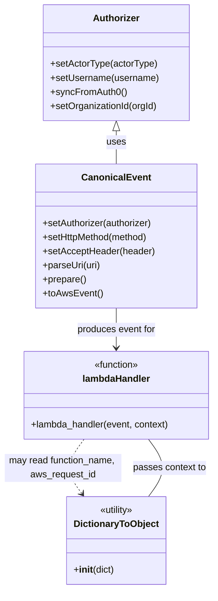

# Diagram: tools/ide_local_testing/localTest/test/byUrl/shipmentSearch.py


> Auto-generated by Obscura crawlers

## Diagram 1

```mermaid
flowchart TD
    Start([Start]) --> SetAccept[Set acceptType="application/json"]
    SetAccept --> SetGateway[Set gatewayUrl]
    SetGateway --> SetURI[Set uri (totals/search queries)]
    SetURI --> SetOrg[Set activeOrgId]
    SetOrg --> CreateAuthorizer[Create Authorizer]
    CreateAuthorizer --> ConfigureAuth[setActorType("human") / setUsername / syncFromAuth0]
    ConfigureAuth --> MaybeSetOrg{activeOrgId?}
    MaybeSetOrg -->|yes| AuthorizerSetOrg[authorizer.setOrganizationId(activeOrgId)]
    MaybeSetOrg -->|no| AuthorizerNoOrg[skip setOrganizationId]
    AuthorizerSetOrg --> BuildEvent
    AuthorizerNoOrg --> BuildEvent
    BuildEvent[Build CanonicalEvent and prepare AWS event] --> InvokeLambda[Invoke lambdaHandler(event, context)]
    InvokeLambda --> MeasureTime[Record start/end times]
    InvokeLambda --> ProcessReturn[If retval.body -> parse JSON]
    ProcessReturn --> PrettyPrint[json.dumps(body, indent=2, sort_keys=True)]
    PrettyPrint --> PrintOutput[print(prettyRetval) / print(execution time)]
    PrintOutput --> End([End])
```

> SVG rendering failed for this diagram.

## Diagram 2



### SVG

<svg id="container" width="367.83984375" xmlns="http://www.w3.org/2000/svg" class="classDiagram" height="1006" viewBox="0 0 367.83984375 1006" role="graphics-document document" aria-roledescription="class"><style>#container{font-family:"trebuchet ms",verdana,arial,sans-serif;font-size:16px;fill:#333;}@keyframes edge-animation-frame{from{stroke-dashoffset:0;}}@keyframes dash{to{stroke-dashoffset:0;}}#container .edge-animation-slow{stroke-dasharray:9,5!important;stroke-dashoffset:900;animation:dash 50s linear infinite;stroke-linecap:round;}#container .edge-animation-fast{stroke-dasharray:9,5!important;stroke-dashoffset:900;animation:dash 20s linear infinite;stroke-linecap:round;}#container .error-icon{fill:#552222;}#container .error-text{fill:#552222;stroke:#552222;}#container .edge-thickness-normal{stroke-width:1px;}#container .edge-thickness-thick{stroke-width:3.5px;}#container .edge-pattern-solid{stroke-dasharray:0;}#container .edge-thickness-invisible{stroke-width:0;fill:none;}#container .edge-pattern-dashed{stroke-dasharray:3;}#container .edge-pattern-dotted{stroke-dasharray:2;}#container .marker{fill:#333333;stroke:#333333;}#container .marker.cross{stroke:#333333;}#container svg{font-family:"trebuchet ms",verdana,arial,sans-serif;font-size:16px;}#container p{margin:0;}#container g.classGroup text{fill:#9370DB;stroke:none;font-family:"trebuchet ms",verdana,arial,sans-serif;font-size:10px;}#container g.classGroup text .title{font-weight:bolder;}#container .nodeLabel,#container .edgeLabel{color:#131300;}#container .edgeLabel .label rect{fill:#ECECFF;}#container .label text{fill:#131300;}#container .labelBkg{background:#ECECFF;}#container .edgeLabel .label span{background:#ECECFF;}#container .classTitle{font-weight:bolder;}#container .node rect,#container .node circle,#container .node ellipse,#container .node polygon,#container .node path{fill:#ECECFF;stroke:#9370DB;stroke-width:1px;}#container .divider{stroke:#9370DB;stroke-width:1;}#container g.clickable{cursor:pointer;}#container g.classGroup rect{fill:#ECECFF;stroke:#9370DB;}#container g.classGroup line{stroke:#9370DB;stroke-width:1;}#container .classLabel .box{stroke:none;stroke-width:0;fill:#ECECFF;opacity:0.5;}#container .classLabel .label{fill:#9370DB;font-size:10px;}#container .relation{stroke:#333333;stroke-width:1;fill:none;}#container .dashed-line{stroke-dasharray:3;}#container .dotted-line{stroke-dasharray:1 2;}#container #compositionStart,#container .composition{fill:#333333!important;stroke:#333333!important;stroke-width:1;}#container #compositionEnd,#container .composition{fill:#333333!important;stroke:#333333!important;stroke-width:1;}#container #dependencyStart,#container .dependency{fill:#333333!important;stroke:#333333!important;stroke-width:1;}#container #dependencyStart,#container .dependency{fill:#333333!important;stroke:#333333!important;stroke-width:1;}#container #extensionStart,#container .extension{fill:transparent!important;stroke:#333333!important;stroke-width:1;}#container #extensionEnd,#container .extension{fill:transparent!important;stroke:#333333!important;stroke-width:1;}#container #aggregationStart,#container .aggregation{fill:transparent!important;stroke:#333333!important;stroke-width:1;}#container #aggregationEnd,#container .aggregation{fill:transparent!important;stroke:#333333!important;stroke-width:1;}#container #lollipopStart,#container .lollipop{fill:#ECECFF!important;stroke:#333333!important;stroke-width:1;}#container #lollipopEnd,#container .lollipop{fill:#ECECFF!important;stroke:#333333!important;stroke-width:1;}#container .edgeTerminals{font-size:11px;line-height:initial;}#container .classTitleText{text-anchor:middle;font-size:18px;fill:#333;}#container .label-icon{display:inline-block;height:1em;overflow:visible;vertical-align:-0.125em;}#container .node .label-icon path{fill:currentColor;stroke:revert;stroke-width:revert;}#container :root{--mermaid-font-family:"trebuchet ms",verdana,arial,sans-serif;}</style><g><defs><marker id="container_class-aggregationStart" class="marker aggregation class" refX="18" refY="7" markerWidth="190" markerHeight="240" orient="auto"><path d="M 18,7 L9,13 L1,7 L9,1 Z"></path></marker></defs><defs><marker id="container_class-aggregationEnd" class="marker aggregation class" refX="1" refY="7" markerWidth="20" markerHeight="28" orient="auto"><path d="M 18,7 L9,13 L1,7 L9,1 Z"></path></marker></defs><defs><marker id="container_class-extensionStart" class="marker extension class" refX="18" refY="7" markerWidth="190" markerHeight="240" orient="auto"><path d="M 1,7 L18,13 V 1 Z"></path></marker></defs><defs><marker id="container_class-extensionEnd" class="marker extension class" refX="1" refY="7" markerWidth="20" markerHeight="28" orient="auto"><path d="M 1,1 V 13 L18,7 Z"></path></marker></defs><defs><marker id="container_class-compositionStart" class="marker composition class" refX="18" refY="7" markerWidth="190" markerHeight="240" orient="auto"><path d="M 18,7 L9,13 L1,7 L9,1 Z"></path></marker></defs><defs><marker id="container_class-compositionEnd" class="marker composition class" refX="1" refY="7" markerWidth="20" markerHeight="28" orient="auto"><path d="M 18,7 L9,13 L1,7 L9,1 Z"></path></marker></defs><defs><marker id="container_class-dependencyStart" class="marker dependency class" refX="6" refY="7" markerWidth="190" markerHeight="240" orient="auto"><path d="M 5,7 L9,13 L1,7 L9,1 Z"></path></marker></defs><defs><marker id="container_class-dependencyEnd" class="marker dependency class" refX="13" refY="7" markerWidth="20" markerHeight="28" orient="auto"><path d="M 18,7 L9,13 L14,7 L9,1 Z"></path></marker></defs><defs><marker id="container_class-lollipopStart" class="marker lollipop class" refX="13" refY="7" markerWidth="190" markerHeight="240" orient="auto"><circle stroke="black" fill="transparent" cx="7" cy="7" r="6"></circle></marker></defs><defs><marker id="container_class-lollipopEnd" class="marker lollipop class" refX="1" refY="7" markerWidth="190" markerHeight="240" orient="auto"><circle stroke="black" fill="transparent" cx="7" cy="7" r="6"></circle></marker></defs><g class="root"><g class="clusters"></g><g class="edgePaths"><path d="M199.48,223.25L199.48,226.542C199.48,229.833,199.48,236.417,199.48,245.875C199.48,255.333,199.48,267.667,199.48,273.833L199.48,280" id="id_Authorizer_CanonicalEvent_1" class="edge-thickness-normal edge-pattern-solid relation" style=";;;" data-edge="true" data-et="edge" data-id="id_Authorizer_CanonicalEvent_1" data-points="W3sieCI6MTk5LjQ4MDQ2ODc1LCJ5IjoyMDZ9LHsieCI6MTk5LjQ4MDQ2ODc1LCJ5IjoyNDN9LHsieCI6MTk5LjQ4MDQ2ODc1LCJ5IjoyODB9XQ==" marker-start="url(#container_class-extensionStart)"></path><path d="M199.48,526L199.48,532.167C199.48,538.333,199.48,550.667,199.48,562C199.48,573.333,199.48,583.667,199.48,588.833L199.48,594" id="id_CanonicalEvent_lambdaHandler_2" class="edge-thickness-normal edge-pattern-solid relation" style=";;;" data-edge="true" data-et="edge" data-id="id_CanonicalEvent_lambdaHandler_2" data-points="W3sieCI6MTk5LjQ4MDQ2ODc1LCJ5Ijo1MjZ9LHsieCI6MTk5LjQ4MDQ2ODc1LCJ5Ijo1NjN9LHsieCI6MTk5LjQ4MDQ2ODc1LCJ5Ijo2MDB9XQ==" marker-end="url(#container_class-dependencyEnd)"></path><path d="M254.811,848L260.836,839.833C266.861,831.667,278.911,815.333,278.911,799C278.911,782.667,266.861,766.333,260.836,758.167L254.811,750" id="id_DictionaryToObject_lambdaHandler_3" class="edge-thickness-normal edge-pattern-solid relation" style=";;;" data-edge="true" data-et="edge" data-id="id_DictionaryToObject_lambdaHandler_3" data-points="W3sieCI6MjU0LjgxMTM5NzQyOTQzNTUsInkiOjg0OH0seyJ4IjoyOTAuOTYwOTM3NSwieSI6Nzk5fSx7IngiOjI1NC44MTEzOTc0Mjk0MzU1LCJ5Ijo3NTB9XQ=="></path><path d="M144.15,750L138.125,758.167C132.1,766.333,120.05,782.667,119.456,798.195C118.863,813.724,129.725,828.448,135.156,835.81L140.588,843.172" id="id_lambdaHandler_DictionaryToObject_4" class="edge-thickness-normal edge-pattern-dashed relation" style=";;;" data-edge="true" data-et="edge" data-id="id_lambdaHandler_DictionaryToObject_4" data-points="W3sieCI6MTQ0LjE0OTU0MDA3MDU2NDUsInkiOjc1MH0seyJ4IjoxMDgsInkiOjc5OX0seyJ4IjoxNDQuMTQ5NTQwMDcwNTY0NSwieSI6ODQ4fV0=" marker-end="url(#container_class-dependencyEnd)"></path></g><g class="edgeLabels"><g class="edgeLabel" transform="translate(199.48046875, 243)"><g class="label" data-id="id_Authorizer_CanonicalEvent_1" transform="translate(-16.4921875, -12)"><foreignObject width="32.984375" height="24"><div xmlns="http://www.w3.org/1999/xhtml" class="labelBkg" style="display: table-cell; white-space: nowrap; line-height: 1.5; max-width: 200px; text-align: center;"><span class="edgeLabel"><p>uses</p></span></div></foreignObject></g></g><g class="edgeLabel" transform="translate(199.48046875, 563)"><g class="label" data-id="id_CanonicalEvent_lambdaHandler_2" transform="translate(-68.2421875, -12)"><foreignObject width="136.484375" height="24"><div xmlns="http://www.w3.org/1999/xhtml" class="labelBkg" style="display: table-cell; white-space: nowrap; line-height: 1.5; max-width: 200px; text-align: center;"><span class="edgeLabel"><p>produces event for</p></span></div></foreignObject></g></g><g class="edgeLabel" transform="translate(290.9609375, 799)"><g class="label" data-id="id_DictionaryToObject_lambdaHandler_3" transform="translate(-62.9609375, -12)"><foreignObject width="125.921875" height="24"><div xmlns="http://www.w3.org/1999/xhtml" class="labelBkg" style="display: table-cell; white-space: nowrap; line-height: 1.5; max-width: 200px; text-align: center;"><span class="edgeLabel"><p>passes context to</p></span></div></foreignObject></g></g><g class="edgeLabel" transform="translate(108, 799)"><g class="label" data-id="id_lambdaHandler_DictionaryToObject_4" transform="translate(-100, -24)"><foreignObject width="200" height="48"><div xmlns="http://www.w3.org/1999/xhtml" class="labelBkg" style="display: table; white-space: break-spaces; line-height: 1.5; max-width: 200px; text-align: center; width: 200px;"><span class="edgeLabel"><p>may read function_name, aws_request_id</p></span></div></foreignObject></g></g></g><g class="nodes"><g class="node default" id="classId-Authorizer-0" transform="translate(199.48046875, 107)"><g class="basic label-container"><path d="M-124.13671875 -99 L124.13671875 -99 L124.13671875 99 L-124.13671875 99" stroke="none" stroke-width="0" fill="#ECECFF" style=""></path><path d="M-124.13671875 -99 C-62.37431458503154 -99, -0.6119104200630829 -99, 124.13671875 -99 M-124.13671875 -99 C-58.36723833800147 -99, 7.4022420739970585 -99, 124.13671875 -99 M124.13671875 -99 C124.13671875 -27.15613280730996, 124.13671875 44.68773438538008, 124.13671875 99 M124.13671875 -99 C124.13671875 -42.97477477836815, 124.13671875 13.0504504432637, 124.13671875 99 M124.13671875 99 C54.94603937318138 99, -14.244640003637244 99, -124.13671875 99 M124.13671875 99 C67.93959543720675 99, 11.74247212441351 99, -124.13671875 99 M-124.13671875 99 C-124.13671875 40.35738014748727, -124.13671875 -18.28523970502546, -124.13671875 -99 M-124.13671875 99 C-124.13671875 22.607150553463967, -124.13671875 -53.785698893072066, -124.13671875 -99" stroke="#9370DB" stroke-width="1.3" fill="none" stroke-dasharray="0 0" style=""></path></g><g class="annotation-group text" transform="translate(0, -75)"></g><g class="label-group text" transform="translate(-38.3671875, -75)"><g class="label" style="font-weight: bolder" transform="translate(0,-12)"><foreignObject width="76.734375" height="24"><div xmlns="http://www.w3.org/1999/xhtml" style="display: table-cell; white-space: nowrap; line-height: 1.5; max-width: 126px; text-align: center;"><span class="nodeLabel markdown-node-label" style=""><p>Authorizer</p></span></div></foreignObject></g></g><g class="members-group text" transform="translate(-112.13671875, -27)"></g><g class="methods-group text" transform="translate(-112.13671875, 3)"><g class="label" style="" transform="translate(0,-12)"><foreignObject width="183.0625" height="24"><div xmlns="http://www.w3.org/1999/xhtml" style="display: table-cell; white-space: nowrap; line-height: 1.5; max-width: 240px; text-align: center;"><span class="nodeLabel markdown-node-label" style=""><p>+setActorType(actorType)</p></span></div></foreignObject></g><g class="label" style="" transform="translate(0,12)"><foreignObject width="185.90625" height="24"><div xmlns="http://www.w3.org/1999/xhtml" style="display: table-cell; white-space: nowrap; line-height: 1.5; max-width: 243px; text-align: center;"><span class="nodeLabel markdown-node-label" style=""><p>+setUsername(username)</p></span></div></foreignObject></g><g class="label" style="" transform="translate(0,36)"><foreignObject width="129.0625" height="24"><div xmlns="http://www.w3.org/1999/xhtml" style="display: table-cell; white-space: nowrap; line-height: 1.5; max-width: 186px; text-align: center;"><span class="nodeLabel markdown-node-label" style=""><p>+syncFromAuth0()</p></span></div></foreignObject></g><g class="label" style="" transform="translate(0,60)"><foreignObject width="184.578125" height="24"><div xmlns="http://www.w3.org/1999/xhtml" style="display: table-cell; white-space: nowrap; line-height: 1.5; max-width: 242px; text-align: center;"><span class="nodeLabel markdown-node-label" style=""><p>+setOrganizationId(orgId)</p></span></div></foreignObject></g></g><g class="divider" style=""><path d="M-124.13671875 -51 C-35.27851747875168 -51, 53.57968379249664 -51, 124.13671875 -51 M-124.13671875 -51 C-69.03983880298966 -51, -13.942958855979313 -51, 124.13671875 -51" stroke="#9370DB" stroke-width="1.3" fill="none" stroke-dasharray="0 0" style=""></path></g><g class="divider" style=""><path d="M-124.13671875 -27 C-33.27578349137107 -27, 57.585151767257855 -27, 124.13671875 -27 M-124.13671875 -27 C-71.220487028548 -27, -18.304255307096014 -27, 124.13671875 -27" stroke="#9370DB" stroke-width="1.3" fill="none" stroke-dasharray="0 0" style=""></path></g></g><g class="node default" id="classId-CanonicalEvent-1" transform="translate(199.48046875, 403)"><g class="basic label-container"><path d="M-135.78515625 -123 L135.78515625 -123 L135.78515625 123 L-135.78515625 123" stroke="none" stroke-width="0" fill="#ECECFF" style=""></path><path d="M-135.78515625 -123 C-38.19480333942563 -123, 59.395549571148734 -123, 135.78515625 -123 M-135.78515625 -123 C-70.81485053077577 -123, -5.844544811551543 -123, 135.78515625 -123 M135.78515625 -123 C135.78515625 -39.74472017797363, 135.78515625 43.510559644052734, 135.78515625 123 M135.78515625 -123 C135.78515625 -53.48211882251485, 135.78515625 16.035762354970302, 135.78515625 123 M135.78515625 123 C55.10695796668249 123, -25.571240316635027 123, -135.78515625 123 M135.78515625 123 C32.26777888086232 123, -71.24959848827535 123, -135.78515625 123 M-135.78515625 123 C-135.78515625 49.79054689715194, -135.78515625 -23.418906205696118, -135.78515625 -123 M-135.78515625 123 C-135.78515625 72.25937811432604, -135.78515625 21.51875622865208, -135.78515625 -123" stroke="#9370DB" stroke-width="1.3" fill="none" stroke-dasharray="0 0" style=""></path></g><g class="annotation-group text" transform="translate(0, -99)"></g><g class="label-group text" transform="translate(-55.7109375, -99)"><g class="label" style="font-weight: bolder" transform="translate(0,-12)"><foreignObject width="111.421875" height="24"><div xmlns="http://www.w3.org/1999/xhtml" style="display: table-cell; white-space: nowrap; line-height: 1.5; max-width: 161px; text-align: center;"><span class="nodeLabel markdown-node-label" style=""><p>CanonicalEvent</p></span></div></foreignObject></g></g><g class="members-group text" transform="translate(-123.78515625, -51)"></g><g class="methods-group text" transform="translate(-123.78515625, -21)"><g class="label" style="" transform="translate(0,-12)"><foreignObject width="190.75" height="24"><div xmlns="http://www.w3.org/1999/xhtml" style="display: table-cell; white-space: nowrap; line-height: 1.5; max-width: 248px; text-align: center;"><span class="nodeLabel markdown-node-label" style=""><p>+setAuthorizer(authorizer)</p></span></div></foreignObject></g><g class="label" style="" transform="translate(0,12)"><foreignObject width="184" height="24"><div xmlns="http://www.w3.org/1999/xhtml" style="display: table-cell; white-space: nowrap; line-height: 1.5; max-width: 241px; text-align: center;"><span class="nodeLabel markdown-node-label" style=""><p>+setHttpMethod(method)</p></span></div></foreignObject></g><g class="label" style="" transform="translate(0,36)"><foreignObject width="191.859375" height="24"><div xmlns="http://www.w3.org/1999/xhtml" style="display: table-cell; white-space: nowrap; line-height: 1.5; max-width: 249px; text-align: center;"><span class="nodeLabel markdown-node-label" style=""><p>+setAcceptHeader(header)</p></span></div></foreignObject></g><g class="label" style="" transform="translate(0,60)"><foreignObject width="99.8125" height="24"><div xmlns="http://www.w3.org/1999/xhtml" style="display: table-cell; white-space: nowrap; line-height: 1.5; max-width: 157px; text-align: center;"><span class="nodeLabel markdown-node-label" style=""><p>+parseUri(uri)</p></span></div></foreignObject></g><g class="label" style="" transform="translate(0,84)"><foreignObject width="74.75" height="24"><div xmlns="http://www.w3.org/1999/xhtml" style="display: table-cell; white-space: nowrap; line-height: 1.5; max-width: 132px; text-align: center;"><span class="nodeLabel markdown-node-label" style=""><p>+prepare()</p></span></div></foreignObject></g><g class="label" style="" transform="translate(0,108)"><foreignObject width="101.1875" height="24"><div xmlns="http://www.w3.org/1999/xhtml" style="display: table-cell; white-space: nowrap; line-height: 1.5; max-width: 159px; text-align: center;"><span class="nodeLabel markdown-node-label" style=""><p>+toAwsEvent()</p></span></div></foreignObject></g></g><g class="divider" style=""><path d="M-135.78515625 -75 C-59.645633414990016 -75, 16.49388942001997 -75, 135.78515625 -75 M-135.78515625 -75 C-80.63793539796094 -75, -25.49071454592189 -75, 135.78515625 -75" stroke="#9370DB" stroke-width="1.3" fill="none" stroke-dasharray="0 0" style=""></path></g><g class="divider" style=""><path d="M-135.78515625 -51 C-66.40288707936236 -51, 2.9793820912752835 -51, 135.78515625 -51 M-135.78515625 -51 C-48.238565867126866 -51, 39.30802451574627 -51, 135.78515625 -51" stroke="#9370DB" stroke-width="1.3" fill="none" stroke-dasharray="0 0" style=""></path></g></g><g class="node default" id="classId-DictionaryToObject-2" transform="translate(199.48046875, 923)"><g class="basic label-container"><path d="M-82.203125 -75 L82.203125 -75 L82.203125 75 L-82.203125 75" stroke="none" stroke-width="0" fill="#ECECFF" style=""></path><path d="M-82.203125 -75 C-29.42542519334485 -75, 23.3522746133103 -75, 82.203125 -75 M-82.203125 -75 C-22.720948370420565 -75, 36.76122825915887 -75, 82.203125 -75 M82.203125 -75 C82.203125 -26.349017481186536, 82.203125 22.30196503762693, 82.203125 75 M82.203125 -75 C82.203125 -39.79886475183639, 82.203125 -4.597729503672781, 82.203125 75 M82.203125 75 C28.986422139757167 75, -24.230280720485666 75, -82.203125 75 M82.203125 75 C33.95261126210592 75, -14.297902475788163 75, -82.203125 75 M-82.203125 75 C-82.203125 21.289865078129353, -82.203125 -32.420269843741295, -82.203125 -75 M-82.203125 75 C-82.203125 21.74856035890027, -82.203125 -31.50287928219946, -82.203125 -75" stroke="#9370DB" stroke-width="1.3" fill="none" stroke-dasharray="0 0" style=""></path></g><g class="annotation-group text" transform="translate(-30.3125, -51)"><g class="label" style="" transform="translate(0,-12)"><foreignObject width="60.625" height="24"><div xmlns="http://www.w3.org/1999/xhtml" style="display: table-cell; white-space: nowrap; line-height: 1.5; max-width: 111px; text-align: center;"><span class="nodeLabel markdown-node-label" style=""><p>«utility»</p></span></div></foreignObject></g></g><g class="label-group text" transform="translate(-70.109375, -27)"><g class="label" style="font-weight: bolder" transform="translate(0,-12)"><foreignObject width="140.21875" height="24"><div xmlns="http://www.w3.org/1999/xhtml" style="display: table-cell; white-space: nowrap; line-height: 1.5; max-width: 188px; text-align: center;"><span class="nodeLabel markdown-node-label" style=""><p>DictionaryToObject</p></span></div></foreignObject></g></g><g class="members-group text" transform="translate(-70.203125, 21)"></g><g class="methods-group text" transform="translate(-70.203125, 51)"><g class="label" style="" transform="translate(0,-12)"><foreignObject width="70.296875" height="24"><div xmlns="http://www.w3.org/1999/xhtml" style="display: table-cell; white-space: nowrap; line-height: 1.5; max-width: 159px; text-align: center;"><span class="nodeLabel markdown-node-label" style=""><p>+<strong>init</strong>(dict)</p></span></div></foreignObject></g></g><g class="divider" style=""><path d="M-82.203125 -3 C-26.072998509851544 -3, 30.05712798029691 -3, 82.203125 -3 M-82.203125 -3 C-18.612532744932942 -3, 44.978059510134116 -3, 82.203125 -3" stroke="#9370DB" stroke-width="1.3" fill="none" stroke-dasharray="0 0" style=""></path></g><g class="divider" style=""><path d="M-82.203125 21 C-30.28181415901289 21, 21.639496681974222 21, 82.203125 21 M-82.203125 21 C-31.918595222000825 21, 18.36593455599835 21, 82.203125 21" stroke="#9370DB" stroke-width="1.3" fill="none" stroke-dasharray="0 0" style=""></path></g></g><g class="node default" id="classId-lambdaHandler-3" transform="translate(199.48046875, 675)"><g class="basic label-container"><path d="M-160.359375 -75 L160.359375 -75 L160.359375 75 L-160.359375 75" stroke="none" stroke-width="0" fill="#ECECFF" style=""></path><path d="M-160.359375 -75 C-33.11044035522066 -75, 94.13849428955868 -75, 160.359375 -75 M-160.359375 -75 C-58.17707013737774 -75, 44.00523472524452 -75, 160.359375 -75 M160.359375 -75 C160.359375 -40.20339020399143, 160.359375 -5.406780407982865, 160.359375 75 M160.359375 -75 C160.359375 -22.902961314926912, 160.359375 29.194077370146175, 160.359375 75 M160.359375 75 C69.95076065432744 75, -20.45785369134512 75, -160.359375 75 M160.359375 75 C61.29662420589577 75, -37.766126588208465 75, -160.359375 75 M-160.359375 75 C-160.359375 26.25137478543138, -160.359375 -22.49725042913724, -160.359375 -75 M-160.359375 75 C-160.359375 41.46215228848696, -160.359375 7.924304576973924, -160.359375 -75" stroke="#9370DB" stroke-width="1.3" fill="none" stroke-dasharray="0 0" style=""></path></g><g class="annotation-group text" transform="translate(-39.484375, -51)"><g class="label" style="" transform="translate(0,-12)"><foreignObject width="78.96875" height="24"><div xmlns="http://www.w3.org/1999/xhtml" style="display: table-cell; white-space: nowrap; line-height: 1.5; max-width: 129px; text-align: center;"><span class="nodeLabel markdown-node-label" style=""><p>«function»</p></span></div></foreignObject></g></g><g class="label-group text" transform="translate(-56.53125, -27)"><g class="label" style="font-weight: bolder" transform="translate(0,-12)"><foreignObject width="113.0625" height="24"><div xmlns="http://www.w3.org/1999/xhtml" style="display: table-cell; white-space: nowrap; line-height: 1.5; max-width: 164px; text-align: center;"><span class="nodeLabel markdown-node-label" style=""><p>lambdaHandler</p></span></div></foreignObject></g></g><g class="members-group text" transform="translate(-148.359375, 21)"></g><g class="methods-group text" transform="translate(-148.359375, 51)"><g class="label" style="" transform="translate(0,-12)"><foreignObject width="240.1875" height="24"><div xmlns="http://www.w3.org/1999/xhtml" style="display: table-cell; white-space: nowrap; line-height: 1.5; max-width: 298px; text-align: center;"><span class="nodeLabel markdown-node-label" style=""><p>+lambda_handler(event, context)</p></span></div></foreignObject></g></g><g class="divider" style=""><path d="M-160.359375 -3 C-45.054848846919725 -3, 70.24967730616055 -3, 160.359375 -3 M-160.359375 -3 C-79.72083776915865 -3, 0.9176994616827017 -3, 160.359375 -3" stroke="#9370DB" stroke-width="1.3" fill="none" stroke-dasharray="0 0" style=""></path></g><g class="divider" style=""><path d="M-160.359375 21 C-81.60350698460566 21, -2.8476389692113173 21, 160.359375 21 M-160.359375 21 C-78.0610048881997 21, 4.237365223600591 21, 160.359375 21" stroke="#9370DB" stroke-width="1.3" fill="none" stroke-dasharray="0 0" style=""></path></g></g></g></g></g></svg>
