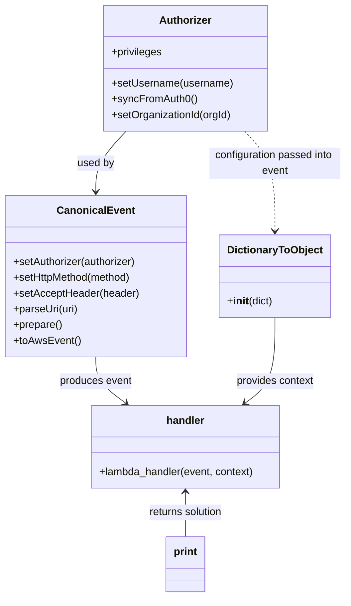

# Diagram: tools/ide_local_testing/localTest/test/byUrl/shipmentSearchShipments.py


> Auto-generated by Obscura crawlers

## Diagram 1

```mermaid
flowchart TD
  Start([Start]) --> URIs[/"Multiple URI assignments\n(final URI used)"/]
  URIs --> InitAuth[Authorizer init]
  InitAuth --> SetUser[setUsername("dave.damon@...")\nsyncFromAuth0()]
  SetUser --> CheckOrg{activeOrgId ?}
  CheckOrg -- yes --> SetOrg[setOrganizationId(activeOrgId)]
  CheckOrg -- no --> SkipOrg[skip]
  SetOrg --> BuildEvent[CanonicalEvent().setAuthorizer(...)\n.setHttpMethod("GET")\n.setAcceptHeader("application/json")\n.parseUri(uri)\n.prepare()\n.toAwsEvent()]
  SkipOrg --> BuildEvent
  BuildEvent --> Invoke[handler(event, DictionaryToObject(...))]
  Invoke --> Print[print(solution)]
  Print --> End([End])
```

> SVG rendering failed for this diagram.

## Diagram 2



### SVG

<svg id="container" width="519.7734375" xmlns="http://www.w3.org/2000/svg" class="classDiagram" height="910" viewBox="0 0 519.7734375 910" role="graphics-document document" aria-roledescription="class"><style>#container{font-family:"trebuchet ms",verdana,arial,sans-serif;font-size:16px;fill:#333;}@keyframes edge-animation-frame{from{stroke-dashoffset:0;}}@keyframes dash{to{stroke-dashoffset:0;}}#container .edge-animation-slow{stroke-dasharray:9,5!important;stroke-dashoffset:900;animation:dash 50s linear infinite;stroke-linecap:round;}#container .edge-animation-fast{stroke-dasharray:9,5!important;stroke-dashoffset:900;animation:dash 20s linear infinite;stroke-linecap:round;}#container .error-icon{fill:#552222;}#container .error-text{fill:#552222;stroke:#552222;}#container .edge-thickness-normal{stroke-width:1px;}#container .edge-thickness-thick{stroke-width:3.5px;}#container .edge-pattern-solid{stroke-dasharray:0;}#container .edge-thickness-invisible{stroke-width:0;fill:none;}#container .edge-pattern-dashed{stroke-dasharray:3;}#container .edge-pattern-dotted{stroke-dasharray:2;}#container .marker{fill:#333333;stroke:#333333;}#container .marker.cross{stroke:#333333;}#container svg{font-family:"trebuchet ms",verdana,arial,sans-serif;font-size:16px;}#container p{margin:0;}#container g.classGroup text{fill:#9370DB;stroke:none;font-family:"trebuchet ms",verdana,arial,sans-serif;font-size:10px;}#container g.classGroup text .title{font-weight:bolder;}#container .nodeLabel,#container .edgeLabel{color:#131300;}#container .edgeLabel .label rect{fill:#ECECFF;}#container .label text{fill:#131300;}#container .labelBkg{background:#ECECFF;}#container .edgeLabel .label span{background:#ECECFF;}#container .classTitle{font-weight:bolder;}#container .node rect,#container .node circle,#container .node ellipse,#container .node polygon,#container .node path{fill:#ECECFF;stroke:#9370DB;stroke-width:1px;}#container .divider{stroke:#9370DB;stroke-width:1;}#container g.clickable{cursor:pointer;}#container g.classGroup rect{fill:#ECECFF;stroke:#9370DB;}#container g.classGroup line{stroke:#9370DB;stroke-width:1;}#container .classLabel .box{stroke:none;stroke-width:0;fill:#ECECFF;opacity:0.5;}#container .classLabel .label{fill:#9370DB;font-size:10px;}#container .relation{stroke:#333333;stroke-width:1;fill:none;}#container .dashed-line{stroke-dasharray:3;}#container .dotted-line{stroke-dasharray:1 2;}#container #compositionStart,#container .composition{fill:#333333!important;stroke:#333333!important;stroke-width:1;}#container #compositionEnd,#container .composition{fill:#333333!important;stroke:#333333!important;stroke-width:1;}#container #dependencyStart,#container .dependency{fill:#333333!important;stroke:#333333!important;stroke-width:1;}#container #dependencyStart,#container .dependency{fill:#333333!important;stroke:#333333!important;stroke-width:1;}#container #extensionStart,#container .extension{fill:transparent!important;stroke:#333333!important;stroke-width:1;}#container #extensionEnd,#container .extension{fill:transparent!important;stroke:#333333!important;stroke-width:1;}#container #aggregationStart,#container .aggregation{fill:transparent!important;stroke:#333333!important;stroke-width:1;}#container #aggregationEnd,#container .aggregation{fill:transparent!important;stroke:#333333!important;stroke-width:1;}#container #lollipopStart,#container .lollipop{fill:#ECECFF!important;stroke:#333333!important;stroke-width:1;}#container #lollipopEnd,#container .lollipop{fill:#ECECFF!important;stroke:#333333!important;stroke-width:1;}#container .edgeTerminals{font-size:11px;line-height:initial;}#container .classTitleText{text-anchor:middle;font-size:18px;fill:#333;}#container .label-icon{display:inline-block;height:1em;overflow:visible;vertical-align:-0.125em;}#container .node .label-icon path{fill:currentColor;stroke:revert;stroke-width:revert;}#container :root{--mermaid-font-family:"trebuchet ms",verdana,arial,sans-serif;}</style><g><defs><marker id="container_class-aggregationStart" class="marker aggregation class" refX="18" refY="7" markerWidth="190" markerHeight="240" orient="auto"><path d="M 18,7 L9,13 L1,7 L9,1 Z"></path></marker></defs><defs><marker id="container_class-aggregationEnd" class="marker aggregation class" refX="1" refY="7" markerWidth="20" markerHeight="28" orient="auto"><path d="M 18,7 L9,13 L1,7 L9,1 Z"></path></marker></defs><defs><marker id="container_class-extensionStart" class="marker extension class" refX="18" refY="7" markerWidth="190" markerHeight="240" orient="auto"><path d="M 1,7 L18,13 V 1 Z"></path></marker></defs><defs><marker id="container_class-extensionEnd" class="marker extension class" refX="1" refY="7" markerWidth="20" markerHeight="28" orient="auto"><path d="M 1,1 V 13 L18,7 Z"></path></marker></defs><defs><marker id="container_class-compositionStart" class="marker composition class" refX="18" refY="7" markerWidth="190" markerHeight="240" orient="auto"><path d="M 18,7 L9,13 L1,7 L9,1 Z"></path></marker></defs><defs><marker id="container_class-compositionEnd" class="marker composition class" refX="1" refY="7" markerWidth="20" markerHeight="28" orient="auto"><path d="M 18,7 L9,13 L1,7 L9,1 Z"></path></marker></defs><defs><marker id="container_class-dependencyStart" class="marker dependency class" refX="6" refY="7" markerWidth="190" markerHeight="240" orient="auto"><path d="M 5,7 L9,13 L1,7 L9,1 Z"></path></marker></defs><defs><marker id="container_class-dependencyEnd" class="marker dependency class" refX="13" refY="7" markerWidth="20" markerHeight="28" orient="auto"><path d="M 18,7 L9,13 L14,7 L9,1 Z"></path></marker></defs><defs><marker id="container_class-lollipopStart" class="marker lollipop class" refX="13" refY="7" markerWidth="190" markerHeight="240" orient="auto"><circle stroke="black" fill="transparent" cx="7" cy="7" r="6"></circle></marker></defs><defs><marker id="container_class-lollipopEnd" class="marker lollipop class" refX="1" refY="7" markerWidth="190" markerHeight="240" orient="auto"><circle stroke="black" fill="transparent" cx="7" cy="7" r="6"></circle></marker></defs><g class="root"><g class="clusters"></g><g class="edgePaths"><path d="M189.066,200L181.519,208.167C173.972,216.333,158.879,232.667,151.332,248C143.785,263.333,143.785,277.667,143.785,284.833L143.785,292" id="id_Authorizer_CanonicalEvent_1" class="edge-thickness-normal edge-pattern-solid relation" style=";;;" data-edge="true" data-et="edge" data-id="id_Authorizer_CanonicalEvent_1" data-points="W3sieCI6MTg5LjA2NTkzNDgwNjAzNDQ4LCJ5IjoyMDB9LHsieCI6MTQzLjc4NTE1NjI1LCJ5IjoyNDl9LHsieCI6MTQzLjc4NTE1NjI1LCJ5IjoyOTh9XQ==" marker-end="url(#container_class-dependencyEnd)"></path><path d="M143.785,544L143.785,550.167C143.785,556.333,143.785,568.667,151.247,580.402C158.708,592.137,173.631,603.274,181.093,608.843L188.554,614.411" id="id_CanonicalEvent_handler_2" class="edge-thickness-normal edge-pattern-solid relation" style=";;;" data-edge="true" data-et="edge" data-id="id_CanonicalEvent_handler_2" data-points="W3sieCI6MTQzLjc4NTE1NjI1LCJ5Ijo1NDR9LHsieCI6MTQzLjc4NTE1NjI1LCJ5Ijo1ODF9LHsieCI6MTkzLjM2Mjk4ODI4MTI1LCJ5Ijo2MTh9XQ==" marker-end="url(#container_class-dependencyEnd)"></path><path d="M411.773,484L411.773,500.167C411.773,516.333,411.773,548.667,404.312,570.402C396.85,592.137,381.927,603.274,374.466,608.843L367.004,614.411" id="id_DictionaryToObject_handler_3" class="edge-thickness-normal edge-pattern-solid relation" style=";;;" data-edge="true" data-et="edge" data-id="id_DictionaryToObject_handler_3" data-points="W3sieCI6NDExLjc3MzQzNzUsInkiOjQ4NH0seyJ4Ijo0MTEuNzczNDM3NSwieSI6NTgxfSx7IngiOjM2Mi4xOTU2MDU0Njg3NSwieSI6NjE4fV0=" marker-end="url(#container_class-dependencyEnd)"></path><path d="M366.493,200L374.039,208.167C381.586,216.333,396.68,232.667,404.227,258C411.773,283.333,411.773,317.667,411.773,334.833L411.773,352" id="id_Authorizer_DictionaryToObject_4" class="edge-thickness-normal edge-pattern-dashed relation" style=";;;" data-edge="true" data-et="edge" data-id="id_Authorizer_DictionaryToObject_4" data-points="W3sieCI6MzY2LjQ5MjY1ODk0Mzk2NTUsInkiOjIwMH0seyJ4Ijo0MTEuNzczNDM3NSwieSI6MjQ5fSx7IngiOjQxMS43NzM0Mzc1LCJ5IjozNTh9XQ==" marker-end="url(#container_class-dependencyEnd)"></path><path d="M277.779,750L277.779,755.167C277.779,760.333,277.779,770.667,277.779,782C277.779,793.333,277.779,805.667,277.779,811.833L277.779,818" id="id_handler_print_5" class="edge-thickness-normal edge-pattern-solid relation" style=";;;" data-edge="true" data-et="edge" data-id="id_handler_print_5" data-points="W3sieCI6Mjc3Ljc3OTI5Njg3NSwieSI6NzQ0fSx7IngiOjI3Ny43NzkyOTY4NzUsInkiOjc4MX0seyJ4IjoyNzcuNzc5Mjk2ODc1LCJ5Ijo4MTh9XQ==" marker-start="url(#container_class-dependencyStart)"></path></g><g class="edgeLabels"><g class="edgeLabel" transform="translate(143.78515625, 249)"><g class="label" data-id="id_Authorizer_CanonicalEvent_1" transform="translate(-28.3125, -12)"><foreignObject width="56.625" height="24"><div xmlns="http://www.w3.org/1999/xhtml" class="labelBkg" style="display: table-cell; white-space: nowrap; line-height: 1.5; max-width: 200px; text-align: center;"><span class="edgeLabel"><p>used by</p></span></div></foreignObject></g></g><g class="edgeLabel" transform="translate(143.78515625, 581)"><g class="label" data-id="id_CanonicalEvent_handler_2" transform="translate(-55.765625, -12)"><foreignObject width="111.53125" height="24"><div xmlns="http://www.w3.org/1999/xhtml" class="labelBkg" style="display: table-cell; white-space: nowrap; line-height: 1.5; max-width: 200px; text-align: center;"><span class="edgeLabel"><p>produces event</p></span></div></foreignObject></g></g><g class="edgeLabel" transform="translate(411.7734375, 581)"><g class="label" data-id="id_DictionaryToObject_handler_3" transform="translate(-60.28125, -12)"><foreignObject width="120.5625" height="24"><div xmlns="http://www.w3.org/1999/xhtml" class="labelBkg" style="display: table-cell; white-space: nowrap; line-height: 1.5; max-width: 200px; text-align: center;"><span class="edgeLabel"><p>provides context</p></span></div></foreignObject></g></g><g class="edgeLabel" transform="translate(411.7734375, 249)"><g class="label" data-id="id_Authorizer_DictionaryToObject_4" transform="translate(-100, -24)"><foreignObject width="200" height="48"><div xmlns="http://www.w3.org/1999/xhtml" class="labelBkg" style="display: table; white-space: break-spaces; line-height: 1.5; max-width: 200px; text-align: center; width: 200px;"><span class="edgeLabel"><p>configuration passed into event</p></span></div></foreignObject></g></g><g class="edgeLabel" transform="translate(277.779296875, 781)"><g class="label" data-id="id_handler_print_5" transform="translate(-58.296875, -12)"><foreignObject width="116.59375" height="24"><div xmlns="http://www.w3.org/1999/xhtml" class="labelBkg" style="display: table-cell; white-space: nowrap; line-height: 1.5; max-width: 200px; text-align: center;"><span class="edgeLabel"><p>returns solution</p></span></div></foreignObject></g></g></g><g class="nodes"><g class="node default" id="classId-Authorizer-0" transform="translate(277.779296875, 104)"><g class="basic label-container"><path d="M-124.13671875 -96 L124.13671875 -96 L124.13671875 96 L-124.13671875 96" stroke="none" stroke-width="0" fill="#ECECFF" style=""></path><path d="M-124.13671875 -96 C-37.54364277571223 -96, 49.04943319857554 -96, 124.13671875 -96 M-124.13671875 -96 C-65.30031869506249 -96, -6.463918640124987 -96, 124.13671875 -96 M124.13671875 -96 C124.13671875 -40.888453650004976, 124.13671875 14.223092699990048, 124.13671875 96 M124.13671875 -96 C124.13671875 -56.074269080305264, 124.13671875 -16.148538160610528, 124.13671875 96 M124.13671875 96 C31.93164293339234 96, -60.27343288321532 96, -124.13671875 96 M124.13671875 96 C68.26973825126197 96, 12.402757752523954 96, -124.13671875 96 M-124.13671875 96 C-124.13671875 35.59932311786562, -124.13671875 -24.801353764268754, -124.13671875 -96 M-124.13671875 96 C-124.13671875 51.425328839828914, -124.13671875 6.850657679657829, -124.13671875 -96" stroke="#9370DB" stroke-width="1.3" fill="none" stroke-dasharray="0 0" style=""></path></g><g class="annotation-group text" transform="translate(0, -72)"></g><g class="label-group text" transform="translate(-38.3671875, -72)"><g class="label" style="font-weight: bolder" transform="translate(0,-12)"><foreignObject width="76.734375" height="24"><div xmlns="http://www.w3.org/1999/xhtml" style="display: table-cell; white-space: nowrap; line-height: 1.5; max-width: 126px; text-align: center;"><span class="nodeLabel markdown-node-label" style=""><p>Authorizer</p></span></div></foreignObject></g></g><g class="members-group text" transform="translate(-112.13671875, -24)"><g class="label" style="" transform="translate(0,-12)"><foreignObject width="78.15625" height="24"><div xmlns="http://www.w3.org/1999/xhtml" style="display: table-cell; white-space: nowrap; line-height: 1.5; max-width: 136px; text-align: center;"><span class="nodeLabel markdown-node-label" style=""><p>+privileges</p></span></div></foreignObject></g></g><g class="methods-group text" transform="translate(-112.13671875, 24)"><g class="label" style="" transform="translate(0,-12)"><foreignObject width="185.90625" height="24"><div xmlns="http://www.w3.org/1999/xhtml" style="display: table-cell; white-space: nowrap; line-height: 1.5; max-width: 243px; text-align: center;"><span class="nodeLabel markdown-node-label" style=""><p>+setUsername(username)</p></span></div></foreignObject></g><g class="label" style="" transform="translate(0,12)"><foreignObject width="129.0625" height="24"><div xmlns="http://www.w3.org/1999/xhtml" style="display: table-cell; white-space: nowrap; line-height: 1.5; max-width: 186px; text-align: center;"><span class="nodeLabel markdown-node-label" style=""><p>+syncFromAuth0()</p></span></div></foreignObject></g><g class="label" style="" transform="translate(0,36)"><foreignObject width="184.578125" height="24"><div xmlns="http://www.w3.org/1999/xhtml" style="display: table-cell; white-space: nowrap; line-height: 1.5; max-width: 242px; text-align: center;"><span class="nodeLabel markdown-node-label" style=""><p>+setOrganizationId(orgId)</p></span></div></foreignObject></g></g><g class="divider" style=""><path d="M-124.13671875 -48 C-45.29480225713483 -48, 33.547114235730334 -48, 124.13671875 -48 M-124.13671875 -48 C-66.1257001081506 -48, -8.114681466301207 -48, 124.13671875 -48" stroke="#9370DB" stroke-width="1.3" fill="none" stroke-dasharray="0 0" style=""></path></g><g class="divider" style=""><path d="M-124.13671875 0 C-24.918564360004055 0, 74.29959002999189 0, 124.13671875 0 M-124.13671875 0 C-39.845660928346135 0, 44.44539689330773 0, 124.13671875 0" stroke="#9370DB" stroke-width="1.3" fill="none" stroke-dasharray="0 0" style=""></path></g></g><g class="node default" id="classId-CanonicalEvent-1" transform="translate(143.78515625, 421)"><g class="basic label-container"><path d="M-135.78515625 -123 L135.78515625 -123 L135.78515625 123 L-135.78515625 123" stroke="none" stroke-width="0" fill="#ECECFF" style=""></path><path d="M-135.78515625 -123 C-60.725890247482695 -123, 14.33337575503461 -123, 135.78515625 -123 M-135.78515625 -123 C-45.10062618085975 -123, 45.5839038882805 -123, 135.78515625 -123 M135.78515625 -123 C135.78515625 -38.96182189738792, 135.78515625 45.07635620522416, 135.78515625 123 M135.78515625 -123 C135.78515625 -50.54535665902311, 135.78515625 21.909286681953773, 135.78515625 123 M135.78515625 123 C51.31488613661182 123, -33.15538397677636 123, -135.78515625 123 M135.78515625 123 C30.12547257216785 123, -75.5342111056643 123, -135.78515625 123 M-135.78515625 123 C-135.78515625 31.399337908803787, -135.78515625 -60.201324182392426, -135.78515625 -123 M-135.78515625 123 C-135.78515625 57.29663718226469, -135.78515625 -8.406725635470622, -135.78515625 -123" stroke="#9370DB" stroke-width="1.3" fill="none" stroke-dasharray="0 0" style=""></path></g><g class="annotation-group text" transform="translate(0, -99)"></g><g class="label-group text" transform="translate(-55.7109375, -99)"><g class="label" style="font-weight: bolder" transform="translate(0,-12)"><foreignObject width="111.421875" height="24"><div xmlns="http://www.w3.org/1999/xhtml" style="display: table-cell; white-space: nowrap; line-height: 1.5; max-width: 161px; text-align: center;"><span class="nodeLabel markdown-node-label" style=""><p>CanonicalEvent</p></span></div></foreignObject></g></g><g class="members-group text" transform="translate(-123.78515625, -51)"></g><g class="methods-group text" transform="translate(-123.78515625, -21)"><g class="label" style="" transform="translate(0,-12)"><foreignObject width="190.75" height="24"><div xmlns="http://www.w3.org/1999/xhtml" style="display: table-cell; white-space: nowrap; line-height: 1.5; max-width: 248px; text-align: center;"><span class="nodeLabel markdown-node-label" style=""><p>+setAuthorizer(authorizer)</p></span></div></foreignObject></g><g class="label" style="" transform="translate(0,12)"><foreignObject width="184" height="24"><div xmlns="http://www.w3.org/1999/xhtml" style="display: table-cell; white-space: nowrap; line-height: 1.5; max-width: 241px; text-align: center;"><span class="nodeLabel markdown-node-label" style=""><p>+setHttpMethod(method)</p></span></div></foreignObject></g><g class="label" style="" transform="translate(0,36)"><foreignObject width="191.859375" height="24"><div xmlns="http://www.w3.org/1999/xhtml" style="display: table-cell; white-space: nowrap; line-height: 1.5; max-width: 249px; text-align: center;"><span class="nodeLabel markdown-node-label" style=""><p>+setAcceptHeader(header)</p></span></div></foreignObject></g><g class="label" style="" transform="translate(0,60)"><foreignObject width="99.8125" height="24"><div xmlns="http://www.w3.org/1999/xhtml" style="display: table-cell; white-space: nowrap; line-height: 1.5; max-width: 157px; text-align: center;"><span class="nodeLabel markdown-node-label" style=""><p>+parseUri(uri)</p></span></div></foreignObject></g><g class="label" style="" transform="translate(0,84)"><foreignObject width="74.75" height="24"><div xmlns="http://www.w3.org/1999/xhtml" style="display: table-cell; white-space: nowrap; line-height: 1.5; max-width: 132px; text-align: center;"><span class="nodeLabel markdown-node-label" style=""><p>+prepare()</p></span></div></foreignObject></g><g class="label" style="" transform="translate(0,108)"><foreignObject width="101.1875" height="24"><div xmlns="http://www.w3.org/1999/xhtml" style="display: table-cell; white-space: nowrap; line-height: 1.5; max-width: 159px; text-align: center;"><span class="nodeLabel markdown-node-label" style=""><p>+toAwsEvent()</p></span></div></foreignObject></g></g><g class="divider" style=""><path d="M-135.78515625 -75 C-70.85555621050351 -75, -5.925956171007016 -75, 135.78515625 -75 M-135.78515625 -75 C-31.533751152373227 -75, 72.71765394525355 -75, 135.78515625 -75" stroke="#9370DB" stroke-width="1.3" fill="none" stroke-dasharray="0 0" style=""></path></g><g class="divider" style=""><path d="M-135.78515625 -51 C-72.05039287289716 -51, -8.31562949579434 -51, 135.78515625 -51 M-135.78515625 -51 C-38.399859048949764 -51, 58.98543815210047 -51, 135.78515625 -51" stroke="#9370DB" stroke-width="1.3" fill="none" stroke-dasharray="0 0" style=""></path></g></g><g class="node default" id="classId-DictionaryToObject-2" transform="translate(411.7734375, 421)"><g class="basic label-container"><path d="M-82.203125 -63 L82.203125 -63 L82.203125 63 L-82.203125 63" stroke="none" stroke-width="0" fill="#ECECFF" style=""></path><path d="M-82.203125 -63 C-29.19863583225277 -63, 23.80585333549446 -63, 82.203125 -63 M-82.203125 -63 C-43.404361111882395 -63, -4.605597223764789 -63, 82.203125 -63 M82.203125 -63 C82.203125 -23.108490803555576, 82.203125 16.78301839288885, 82.203125 63 M82.203125 -63 C82.203125 -31.967814567730006, 82.203125 -0.9356291354600117, 82.203125 63 M82.203125 63 C40.30544733046685 63, -1.5922303390663046 63, -82.203125 63 M82.203125 63 C34.76269127341455 63, -12.677742453170893 63, -82.203125 63 M-82.203125 63 C-82.203125 24.487779040705725, -82.203125 -14.02444191858855, -82.203125 -63 M-82.203125 63 C-82.203125 23.35805544835339, -82.203125 -16.28388910329322, -82.203125 -63" stroke="#9370DB" stroke-width="1.3" fill="none" stroke-dasharray="0 0" style=""></path></g><g class="annotation-group text" transform="translate(0, -39)"></g><g class="label-group text" transform="translate(-70.109375, -39)"><g class="label" style="font-weight: bolder" transform="translate(0,-12)"><foreignObject width="140.21875" height="24"><div xmlns="http://www.w3.org/1999/xhtml" style="display: table-cell; white-space: nowrap; line-height: 1.5; max-width: 188px; text-align: center;"><span class="nodeLabel markdown-node-label" style=""><p>DictionaryToObject</p></span></div></foreignObject></g></g><g class="members-group text" transform="translate(-70.203125, 9)"></g><g class="methods-group text" transform="translate(-70.203125, 39)"><g class="label" style="" transform="translate(0,-12)"><foreignObject width="70.296875" height="24"><div xmlns="http://www.w3.org/1999/xhtml" style="display: table-cell; white-space: nowrap; line-height: 1.5; max-width: 159px; text-align: center;"><span class="nodeLabel markdown-node-label" style=""><p>+<strong>init</strong>(dict)</p></span></div></foreignObject></g></g><g class="divider" style=""><path d="M-82.203125 -15 C-42.497904854615655 -15, -2.7926847092313096 -15, 82.203125 -15 M-82.203125 -15 C-21.457365560194553 -15, 39.288393879610894 -15, 82.203125 -15" stroke="#9370DB" stroke-width="1.3" fill="none" stroke-dasharray="0 0" style=""></path></g><g class="divider" style=""><path d="M-82.203125 9 C-23.946351933476038 9, 34.310421133047925 9, 82.203125 9 M-82.203125 9 C-30.920392910799258 9, 20.362339178401484 9, 82.203125 9" stroke="#9370DB" stroke-width="1.3" fill="none" stroke-dasharray="0 0" style=""></path></g></g><g class="node default" id="classId-handler-3" transform="translate(277.779296875, 681)"><g class="basic label-container"><path d="M-146.28515625 -63 L146.28515625 -63 L146.28515625 63 L-146.28515625 63" stroke="none" stroke-width="0" fill="#ECECFF" style=""></path><path d="M-146.28515625 -63 C-38.38216369873129 -63, 69.52082885253742 -63, 146.28515625 -63 M-146.28515625 -63 C-55.81987089030494 -63, 34.64541446939012 -63, 146.28515625 -63 M146.28515625 -63 C146.28515625 -31.254829308851455, 146.28515625 0.490341382297089, 146.28515625 63 M146.28515625 -63 C146.28515625 -33.94225236153281, 146.28515625 -4.884504723065611, 146.28515625 63 M146.28515625 63 C86.0459831717559 63, 25.806810093511814 63, -146.28515625 63 M146.28515625 63 C54.607944999864486 63, -37.06926625027103 63, -146.28515625 63 M-146.28515625 63 C-146.28515625 12.932290355454647, -146.28515625 -37.135419289090706, -146.28515625 -63 M-146.28515625 63 C-146.28515625 26.982370701454663, -146.28515625 -9.035258597090674, -146.28515625 -63" stroke="#9370DB" stroke-width="1.3" fill="none" stroke-dasharray="0 0" style=""></path></g><g class="annotation-group text" transform="translate(0, -39)"></g><g class="label-group text" transform="translate(-28.3828125, -39)"><g class="label" style="font-weight: bolder" transform="translate(0,-12)"><foreignObject width="56.765625" height="24"><div xmlns="http://www.w3.org/1999/xhtml" style="display: table-cell; white-space: nowrap; line-height: 1.5; max-width: 107px; text-align: center;"><span class="nodeLabel markdown-node-label" style=""><p>handler</p></span></div></foreignObject></g></g><g class="members-group text" transform="translate(-134.28515625, 9)"></g><g class="methods-group text" transform="translate(-134.28515625, 39)"><g class="label" style="" transform="translate(0,-12)"><foreignObject width="240.1875" height="24"><div xmlns="http://www.w3.org/1999/xhtml" style="display: table-cell; white-space: nowrap; line-height: 1.5; max-width: 298px; text-align: center;"><span class="nodeLabel markdown-node-label" style=""><p>+lambda_handler(event, context)</p></span></div></foreignObject></g></g><g class="divider" style=""><path d="M-146.28515625 -15 C-65.6901841216212 -15, 14.904788006757599 -15, 146.28515625 -15 M-146.28515625 -15 C-69.75527683636922 -15, 6.774602577261561 -15, 146.28515625 -15" stroke="#9370DB" stroke-width="1.3" fill="none" stroke-dasharray="0 0" style=""></path></g><g class="divider" style=""><path d="M-146.28515625 9 C-67.37837076376859 9, 11.528414722462827 9, 146.28515625 9 M-146.28515625 9 C-65.2596150941216 9, 15.765926061756801 9, 146.28515625 9" stroke="#9370DB" stroke-width="1.3" fill="none" stroke-dasharray="0 0" style=""></path></g></g><g class="node default" id="classId-print-4" transform="translate(277.779296875, 860)"><g class="basic label-container"><path d="M-29.9453125 -42 L29.9453125 -42 L29.9453125 42 L-29.9453125 42" stroke="none" stroke-width="0" fill="#ECECFF" style=""></path><path d="M-29.9453125 -42 C-15.973141721117775 -42, -2.0009709422355506 -42, 29.9453125 -42 M-29.9453125 -42 C-8.722084825595498 -42, 12.501142848809003 -42, 29.9453125 -42 M29.9453125 -42 C29.9453125 -10.70947094742182, 29.9453125 20.58105810515636, 29.9453125 42 M29.9453125 -42 C29.9453125 -24.205801130965728, 29.9453125 -6.411602261931456, 29.9453125 42 M29.9453125 42 C6.448744815629087 42, -17.047822868741825 42, -29.9453125 42 M29.9453125 42 C6.68762421237161 42, -16.57006407525678 42, -29.9453125 42 M-29.9453125 42 C-29.9453125 18.985873794257408, -29.9453125 -4.028252411485184, -29.9453125 -42 M-29.9453125 42 C-29.9453125 11.794200071469316, -29.9453125 -18.41159985706137, -29.9453125 -42" stroke="#9370DB" stroke-width="1.3" fill="none" stroke-dasharray="0 0" style=""></path></g><g class="annotation-group text" transform="translate(0, -18)"></g><g class="label-group text" transform="translate(-17.9453125, -18)"><g class="label" style="font-weight: bolder" transform="translate(0,-12)"><foreignObject width="35.890625" height="24"><div xmlns="http://www.w3.org/1999/xhtml" style="display: table-cell; white-space: nowrap; line-height: 1.5; max-width: 86px; text-align: center;"><span class="nodeLabel markdown-node-label" style=""><p>print</p></span></div></foreignObject></g></g><g class="members-group text" transform="translate(-17.9453125, 30)"></g><g class="methods-group text" transform="translate(-17.9453125, 60)"></g><g class="divider" style=""><path d="M-29.9453125 6 C-12.522910575661427 6, 4.899491348677145 6, 29.9453125 6 M-29.9453125 6 C-16.31679897528563 6, -2.688285450571261 6, 29.9453125 6" stroke="#9370DB" stroke-width="1.3" fill="none" stroke-dasharray="0 0" style=""></path></g><g class="divider" style=""><path d="M-29.9453125 24 C-8.755444446091136 24, 12.434423607817727 24, 29.9453125 24 M-29.9453125 24 C-9.966116851210504 24, 10.013078797578991 24, 29.9453125 24" stroke="#9370DB" stroke-width="1.3" fill="none" stroke-dasharray="0 0" style=""></path></g></g></g></g></g></svg>
