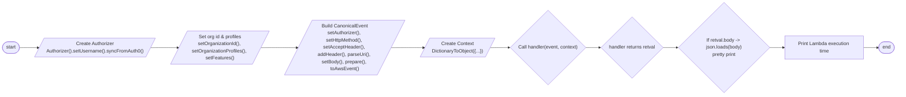

# Diagram: tools/ide_local_testing/localTest/test/byUrl/shipmentStatus.py


> Auto-generated by Obscura crawlers

## Diagram 1

```mermaid
classDiagram
    class Authorizer {
        +setUsername(username)
        +syncFromAuth0()
        +setOrganizationId(id)
        +setOrganizationProfiles(profiles)
        +setFeatures(features)
    }
    class CanonicalEvent {
        +setAuthorizer(authorizer)
        +setHttpMethod(method)
        +setAcceptHeader(type)
        +addHeader(name, value)
        +parseUri(uri)
        +setBody(body)
        +prepare()
        +toAwsEvent()
    }
    class DictionaryToObject {
        +__init__(dict)
    }
    class handler <<function>> {
        +(event, context)
    }
    Authorizer <|-- CanonicalEvent : uses
    CanonicalEvent --> "AWS event" : toAwsEvent()
    DictionaryToObject --> handler : context object
    "AWS event" --> handler : invoked with
```

> SVG rendering failed for this diagram.

## Diagram 2



### SVG

<svg id="container" width="3202.6318359375" xmlns="http://www.w3.org/2000/svg" class="flowchart" height="318" viewBox="-0.0000019073486328125 0 3202.6318359375 318" role="graphics-document document" aria-roledescription="flowchart-v2"><style>#container{font-family:"trebuchet ms",verdana,arial,sans-serif;font-size:16px;fill:#333;}@keyframes edge-animation-frame{from{stroke-dashoffset:0;}}@keyframes dash{to{stroke-dashoffset:0;}}#container .edge-animation-slow{stroke-dasharray:9,5!important;stroke-dashoffset:900;animation:dash 50s linear infinite;stroke-linecap:round;}#container .edge-animation-fast{stroke-dasharray:9,5!important;stroke-dashoffset:900;animation:dash 20s linear infinite;stroke-linecap:round;}#container .error-icon{fill:#552222;}#container .error-text{fill:#552222;stroke:#552222;}#container .edge-thickness-normal{stroke-width:1px;}#container .edge-thickness-thick{stroke-width:3.5px;}#container .edge-pattern-solid{stroke-dasharray:0;}#container .edge-thickness-invisible{stroke-width:0;fill:none;}#container .edge-pattern-dashed{stroke-dasharray:3;}#container .edge-pattern-dotted{stroke-dasharray:2;}#container .marker{fill:#333333;stroke:#333333;}#container .marker.cross{stroke:#333333;}#container svg{font-family:"trebuchet ms",verdana,arial,sans-serif;font-size:16px;}#container p{margin:0;}#container .label{font-family:"trebuchet ms",verdana,arial,sans-serif;color:#333;}#container .cluster-label text{fill:#333;}#container .cluster-label span{color:#333;}#container .cluster-label span p{background-color:transparent;}#container .label text,#container span{fill:#333;color:#333;}#container .node rect,#container .node circle,#container .node ellipse,#container .node polygon,#container .node path{fill:#ECECFF;stroke:#9370DB;stroke-width:1px;}#container .rough-node .label text,#container .node .label text,#container .image-shape .label,#container .icon-shape .label{text-anchor:middle;}#container .node .katex path{fill:#000;stroke:#000;stroke-width:1px;}#container .rough-node .label,#container .node .label,#container .image-shape .label,#container .icon-shape .label{text-align:center;}#container .node.clickable{cursor:pointer;}#container .root .anchor path{fill:#333333!important;stroke-width:0;stroke:#333333;}#container .arrowheadPath{fill:#333333;}#container .edgePath .path{stroke:#333333;stroke-width:2.0px;}#container .flowchart-link{stroke:#333333;fill:none;}#container .edgeLabel{background-color:rgba(232,232,232, 0.8);text-align:center;}#container .edgeLabel p{background-color:rgba(232,232,232, 0.8);}#container .edgeLabel rect{opacity:0.5;background-color:rgba(232,232,232, 0.8);fill:rgba(232,232,232, 0.8);}#container .labelBkg{background-color:rgba(232, 232, 232, 0.5);}#container .cluster rect{fill:#ffffde;stroke:#aaaa33;stroke-width:1px;}#container .cluster text{fill:#333;}#container .cluster span{color:#333;}#container div.mermaidTooltip{position:absolute;text-align:center;max-width:200px;padding:2px;font-family:"trebuchet ms",verdana,arial,sans-serif;font-size:12px;background:hsl(80, 100%, 96.2745098039%);border:1px solid #aaaa33;border-radius:2px;pointer-events:none;z-index:100;}#container .flowchartTitleText{text-anchor:middle;font-size:18px;fill:#333;}#container rect.text{fill:none;stroke-width:0;}#container .icon-shape,#container .image-shape{background-color:rgba(232,232,232, 0.8);text-align:center;}#container .icon-shape p,#container .image-shape p{background-color:rgba(232,232,232, 0.8);padding:2px;}#container .icon-shape rect,#container .image-shape rect{opacity:0.5;background-color:rgba(232,232,232, 0.8);fill:rgba(232,232,232, 0.8);}#container .label-icon{display:inline-block;height:1em;overflow:visible;vertical-align:-0.125em;}#container .node .label-icon path{fill:currentColor;stroke:revert;stroke-width:revert;}#container :root{--mermaid-font-family:"trebuchet ms",verdana,arial,sans-serif;}</style><g><marker id="container_flowchart-v2-pointEnd" class="marker flowchart-v2" viewBox="0 0 10 10" refX="5" refY="5" markerUnits="userSpaceOnUse" markerWidth="8" markerHeight="8" orient="auto"><path d="M 0 0 L 10 5 L 0 10 z" class="arrowMarkerPath" style="stroke-width: 1; stroke-dasharray: 1, 0;"></path></marker><marker id="container_flowchart-v2-pointStart" class="marker flowchart-v2" viewBox="0 0 10 10" refX="4.5" refY="5" markerUnits="userSpaceOnUse" markerWidth="8" markerHeight="8" orient="auto"><path d="M 0 5 L 10 10 L 10 0 z" class="arrowMarkerPath" style="stroke-width: 1; stroke-dasharray: 1, 0;"></path></marker><marker id="container_flowchart-v2-circleEnd" class="marker flowchart-v2" viewBox="0 0 10 10" refX="11" refY="5" markerUnits="userSpaceOnUse" markerWidth="11" markerHeight="11" orient="auto"><circle cx="5" cy="5" r="5" class="arrowMarkerPath" style="stroke-width: 1; stroke-dasharray: 1, 0;"></circle></marker><marker id="container_flowchart-v2-circleStart" class="marker flowchart-v2" viewBox="0 0 10 10" refX="-1" refY="5" markerUnits="userSpaceOnUse" markerWidth="11" markerHeight="11" orient="auto"><circle cx="5" cy="5" r="5" class="arrowMarkerPath" style="stroke-width: 1; stroke-dasharray: 1, 0;"></circle></marker><marker id="container_flowchart-v2-crossEnd" class="marker cross flowchart-v2" viewBox="0 0 11 11" refX="12" refY="5.2" markerUnits="userSpaceOnUse" markerWidth="11" markerHeight="11" orient="auto"><path d="M 1,1 l 9,9 M 10,1 l -9,9" class="arrowMarkerPath" style="stroke-width: 2; stroke-dasharray: 1, 0;"></path></marker><marker id="container_flowchart-v2-crossStart" class="marker cross flowchart-v2" viewBox="0 0 11 11" refX="-1" refY="5.2" markerUnits="userSpaceOnUse" markerWidth="11" markerHeight="11" orient="auto"><path d="M 1,1 l 9,9 M 10,1 l -9,9" class="arrowMarkerPath" style="stroke-width: 2; stroke-dasharray: 1, 0;"></path></marker><g class="root"><g class="clusters"></g><g class="edgePaths"><path d="M67.027,159.5L71.11,159.417C75.194,159.333,83.36,159.167,93.652,159.159C103.944,159.151,116.36,159.301,122.569,159.376L128.777,159.452" id="L_Start_Auth_0" class="edge-thickness-normal edge-pattern-solid edge-thickness-normal edge-pattern-solid flowchart-link" style=";" data-edge="true" data-et="edge" data-id="L_Start_Auth_0" data-points="W3sieCI6NjcuMDI2ODM3NDMxODI1OTgsInkiOjE1OS41fSx7IngiOjkxLjUyNjgzNjM5NTI2MzY3LCJ5IjoxNTl9LHsieCI6MTMyLjc3NjgzNjM5NTI2MzY3LCJ5IjoxNTkuNX1d" marker-end="url(#container_flowchart-v2-pointEnd)"></path><path d="M592.027,159.5L598.735,159.417C605.444,159.333,618.86,159.167,633.777,159.16C648.694,159.154,665.11,159.308,673.319,159.385L681.527,159.462" id="L_Auth_ConfigureAuthorizer_0" class="edge-thickness-normal edge-pattern-solid edge-thickness-normal edge-pattern-solid flowchart-link" style=";" data-edge="true" data-et="edge" data-id="L_Auth_ConfigureAuthorizer_0" data-points="W3sieCI6NTkyLjAyNjgzNjM5NTI2MzcsInkiOjE1OS41fSx7IngiOjYzMi4yNzY4MzYzOTUyNjM3LCJ5IjoxNTl9LHsieCI6Njg1LjUyNjgzNjM5NTI2MzcsInkiOjE1OS41fV0=" marker-end="url(#container_flowchart-v2-pointEnd)"></path><path d="M974.402,159.5L983.11,159.417C991.819,159.333,1009.235,159.167,1028.152,159.162C1047.069,159.156,1067.485,159.313,1077.694,159.391L1087.902,159.469" id="L_ConfigureAuthorizer_BuildEvent_0" class="edge-thickness-normal edge-pattern-solid edge-thickness-normal edge-pattern-solid flowchart-link" style=";" data-edge="true" data-et="edge" data-id="L_ConfigureAuthorizer_BuildEvent_0" data-points="W3sieCI6OTc0LjQwMTgzNjM5NTI2MzcsInkiOjE1OS41fSx7IngiOjEwMjYuNjUxODM2Mzk1MjYzNywieSI6MTU5fSx7IngiOjEwOTEuOTAxODM2Mzk1MjYzNywieSI6MTU5LjV9XQ==" marker-end="url(#container_flowchart-v2-pointEnd)"></path><path d="M1430.074,159.5L1440.782,159.417C1451.49,159.333,1472.907,159.167,1489.824,159.159C1506.74,159.151,1519.157,159.301,1525.366,159.376L1531.574,159.452" id="L_BuildEvent_ContextObj_0" class="edge-thickness-normal edge-pattern-solid edge-thickness-normal edge-pattern-solid flowchart-link" style=";" data-edge="true" data-et="edge" data-id="L_BuildEvent_ContextObj_0" data-points="W3sieCI6MTQzMC4wNzM3MTEzOTUyNjM3LCJ5IjoxNTkuNX0seyJ4IjoxNDk0LjMyMzcxMTM5NTI2MzcsInkiOjE1OX0seyJ4IjoxNTM1LjU3MzcxMTM5NTI2MzcsInkiOjE1OS41fV0=" marker-end="url(#container_flowchart-v2-pointEnd)"></path><path d="M1824.48,159.5L1831.188,159.417C1837.897,159.333,1851.313,159.167,1861.522,159.083C1871.73,159,1878.73,159,1882.23,159L1885.73,159" id="L_ContextObj_CallHandler_0" class="edge-thickness-normal edge-pattern-solid edge-thickness-normal edge-pattern-solid flowchart-link" style=";" data-edge="true" data-et="edge" data-id="L_ContextObj_CallHandler_0" data-points="W3sieCI6MTgyNC40Nzk5NjEzOTUyNjM3LCJ5IjoxNTkuNX0seyJ4IjoxODY0LjcyOTk2MTM5NTI2MzcsInkiOjE1OX0seyJ4IjoxODg5LjcyOTk2MTM5NTI2MzcsInkiOjE1OX1d" marker-end="url(#container_flowchart-v2-pointEnd)"></path><path d="M2167.73,159L2171.897,159C2176.063,159,2184.397,159,2192.063,159C2199.73,159,2206.73,159,2210.23,159L2213.73,159" id="L_CallHandler_HandlerRetval_0" class="edge-thickness-normal edge-pattern-solid edge-thickness-normal edge-pattern-solid flowchart-link" style=";" data-edge="true" data-et="edge" data-id="L_CallHandler_HandlerRetval_0" data-points="W3sieCI6MjE2Ny43Mjk5NjEzOTUyNjM3LCJ5IjoxNTl9LHsieCI6MjE5Mi43Mjk5NjEzOTUyNjM3LCJ5IjoxNTl9LHsieCI6MjIxNy43Mjk5NjEzOTUyNjM3LCJ5IjoxNTl9XQ==" marker-end="url(#container_flowchart-v2-pointEnd)"></path><path d="M2430.23,159L2434.397,159C2438.563,159,2446.897,159,2454.563,159C2462.23,159,2469.23,159,2472.73,159L2476.23,159" id="L_HandlerRetval_ParseBody_0" class="edge-thickness-normal edge-pattern-solid edge-thickness-normal edge-pattern-solid flowchart-link" style=";" data-edge="true" data-et="edge" data-id="L_HandlerRetval_ParseBody_0" data-points="W3sieCI6MjQzMC4yMjk5NjEzOTUyNjM3LCJ5IjoxNTl9LHsieCI6MjQ1NS4yMjk5NjEzOTUyNjM3LCJ5IjoxNTl9LHsieCI6MjQ4MC4yMjk5NjEzOTUyNjM3LCJ5IjoxNTl9XQ==" marker-end="url(#container_flowchart-v2-pointEnd)"></path><path d="M2782.23,159L2786.397,159C2790.563,159,2798.897,159,2806.563,159C2814.23,159,2821.23,159,2824.73,159L2828.23,159" id="L_ParseBody_PrintTime_0" class="edge-thickness-normal edge-pattern-solid edge-thickness-normal edge-pattern-solid flowchart-link" style=";" data-edge="true" data-et="edge" data-id="L_ParseBody_PrintTime_0" data-points="W3sieCI6Mjc4Mi4yMjk5NjEzOTUyNjM3LCJ5IjoxNTl9LHsieCI6MjgwNy4yMjk5NjEzOTUyNjM3LCJ5IjoxNTl9LHsieCI6MjgzMi4yMjk5NjEzOTUyNjM3LCJ5IjoxNTl9XQ==" marker-end="url(#container_flowchart-v2-pointEnd)"></path><path d="M3092.23,159L3096.397,159C3100.563,159,3108.897,159,3116.647,159.07C3124.397,159.141,3131.564,159.281,3135.147,159.351L3138.731,159.422" id="L_PrintTime_End_0" class="edge-thickness-normal edge-pattern-solid edge-thickness-normal edge-pattern-solid flowchart-link" style=";" data-edge="true" data-et="edge" data-id="L_PrintTime_End_0" data-points="W3sieCI6MzA5Mi4yMjk5NjEzOTUyNjM3LCJ5IjoxNTl9LHsieCI6MzExNy4yMjk5NjEzOTUyNjM3LCJ5IjoxNTl9LHsieCI6MzE0Mi43Mjk5NjEzOTUyMjg3LCJ5IjoxNTkuNX1d" marker-end="url(#container_flowchart-v2-pointEnd)"></path></g><g class="edgeLabels"><g class="edgeLabel"><g class="label" data-id="L_Start_Auth_0" transform="translate(0, 0)"><foreignObject width="0" height="0"><div xmlns="http://www.w3.org/1999/xhtml" class="labelBkg" style="display: table-cell; white-space: nowrap; line-height: 1.5; max-width: 200px; text-align: center;"><span class="edgeLabel"></span></div></foreignObject></g></g><g class="edgeLabel"><g class="label" data-id="L_Auth_ConfigureAuthorizer_0" transform="translate(0, 0)"><foreignObject width="0" height="0"><div xmlns="http://www.w3.org/1999/xhtml" class="labelBkg" style="display: table-cell; white-space: nowrap; line-height: 1.5; max-width: 200px; text-align: center;"><span class="edgeLabel"></span></div></foreignObject></g></g><g class="edgeLabel"><g class="label" data-id="L_ConfigureAuthorizer_BuildEvent_0" transform="translate(0, 0)"><foreignObject width="0" height="0"><div xmlns="http://www.w3.org/1999/xhtml" class="labelBkg" style="display: table-cell; white-space: nowrap; line-height: 1.5; max-width: 200px; text-align: center;"><span class="edgeLabel"></span></div></foreignObject></g></g><g class="edgeLabel"><g class="label" data-id="L_BuildEvent_ContextObj_0" transform="translate(0, 0)"><foreignObject width="0" height="0"><div xmlns="http://www.w3.org/1999/xhtml" class="labelBkg" style="display: table-cell; white-space: nowrap; line-height: 1.5; max-width: 200px; text-align: center;"><span class="edgeLabel"></span></div></foreignObject></g></g><g class="edgeLabel"><g class="label" data-id="L_ContextObj_CallHandler_0" transform="translate(0, 0)"><foreignObject width="0" height="0"><div xmlns="http://www.w3.org/1999/xhtml" class="labelBkg" style="display: table-cell; white-space: nowrap; line-height: 1.5; max-width: 200px; text-align: center;"><span class="edgeLabel"></span></div></foreignObject></g></g><g class="edgeLabel"><g class="label" data-id="L_CallHandler_HandlerRetval_0" transform="translate(0, 0)"><foreignObject width="0" height="0"><div xmlns="http://www.w3.org/1999/xhtml" class="labelBkg" style="display: table-cell; white-space: nowrap; line-height: 1.5; max-width: 200px; text-align: center;"><span class="edgeLabel"></span></div></foreignObject></g></g><g class="edgeLabel"><g class="label" data-id="L_HandlerRetval_ParseBody_0" transform="translate(0, 0)"><foreignObject width="0" height="0"><div xmlns="http://www.w3.org/1999/xhtml" class="labelBkg" style="display: table-cell; white-space: nowrap; line-height: 1.5; max-width: 200px; text-align: center;"><span class="edgeLabel"></span></div></foreignObject></g></g><g class="edgeLabel"><g class="label" data-id="L_ParseBody_PrintTime_0" transform="translate(0, 0)"><foreignObject width="0" height="0"><div xmlns="http://www.w3.org/1999/xhtml" class="labelBkg" style="display: table-cell; white-space: nowrap; line-height: 1.5; max-width: 200px; text-align: center;"><span class="edgeLabel"></span></div></foreignObject></g></g><g class="edgeLabel"><g class="label" data-id="L_PrintTime_End_0" transform="translate(0, 0)"><foreignObject width="0" height="0"><div xmlns="http://www.w3.org/1999/xhtml" class="labelBkg" style="display: table-cell; white-space: nowrap; line-height: 1.5; max-width: 200px; text-align: center;"><span class="edgeLabel"></span></div></foreignObject></g></g></g><g class="nodes"><g class="node default" id="flowchart-Start-0" transform="translate(37.263418197631836, 159)"><g class="basic label-container outer-path"><path d="M-9.7734375 -19.5 C-5.64084290885472 -19.5, -1.5082483177094392 -19.5, 9.7734375 -19.5 C9.7734375 -19.5, 9.773437499999998 -19.5, 9.773437499999998 -19.5 C10.075461374063568 -19.49031468221259, 10.377485248127138 -19.48062936442518, 11.0228067896239 -19.45993515863156 C11.453164632583281 -19.418419055102298, 11.883522475542662 -19.376902951573037, 12.267042152847864 -19.3399052695533 C12.760234407712677 -19.260169770549815, 13.25342666257749 -19.180434271546332, 13.501030759676757 -19.140403561325776 C13.980872501754902 -19.03088281495644, 14.460714243833047 -18.9213620685871, 14.71970188623539 -18.862249829261074 C15.119038718234616 -18.74372875368551, 15.518375550233845 -18.625207678109945, 15.918047751460602 -18.50658706670804 C16.3812195522891 -18.33613556248996, 16.8443913531176 -18.16568405827188, 17.091144095147794 -18.074876768247425 C17.47305473489022 -17.905816257010063, 17.854965374632645 -17.736755745772697, 18.23417041279238 -17.568892924097174 C18.51386263999201 -17.42297766831855, 18.793554867191638 -17.277062412539927, 19.342429764076783 -16.990714730406097 C19.63688163043656 -16.812216278627563, 19.931333496796334 -16.63371782684903, 20.411368073605697 -16.342718045390892 C20.620090606609104 -16.197122241820544, 20.828813139612514 -16.051526438250193, 21.436592844578712 -15.627565626425154 C21.80960315587072 -15.330099829391035, 22.18261346716273 -15.032634032356915, 22.41389120850187 -14.848196188198123 C22.628163709582907 -14.653599572056034, 22.84243621066394 -14.459002955913947, 23.339247236767985 -14.007812326905688 C23.57824840742781 -13.76102399583838, 23.817249578087637 -13.514235664771071, 24.208858442968648 -13.10986736009568 C24.434017679494342 -12.845382508949097, 24.659176916020037 -12.580897657802513, 25.019151408126582 -12.158051136245305 C25.234529813815755 -11.869463693998222, 25.449908219504927 -11.580876251751137, 25.766796464640635 -11.156274872382312 C26.019643411588508 -10.767834062958379, 26.272490358536384 -10.379393253534445, 26.448721378604247 -10.108655082055241 C26.637996543882316 -9.772577859915234, 26.827271709160385 -9.436500637775229, 27.0621239742735 -9.019496659696287 C27.213687291755694 -8.70477218800903, 27.365250609237883 -8.390047716321774, 27.60448364880834 -7.893275190886684 C27.761253309772407 -7.506051097370239, 27.918022970736473 -7.118827003853795, 28.073571729970325 -6.734618561215508 C28.22100187529986 -6.290582453286638, 28.36843202062939 -5.846546345357767, 28.46746063421488 -5.548287939305138 C28.57768030288292 -5.127972573167323, 28.687899971550962 -4.7076572070295075, 28.78453178754556 -4.339158212148133 C28.85185717776707 -3.993456562586942, 28.91918256798858 -3.6477549130257505, 29.023482276581777 -3.1121979531509023 C29.059565745599706 -2.8323416929347545, 29.095649214617634 -2.552485432718607, 29.183330202509367 -1.872449005199798 C29.20721295685979 -1.500455828379577, 29.23109571121022 -1.128462651559356, 29.263418715913414 -0.6250057626472757 C29.263418715913414 -0.3289278930061301, 29.263418715913414 -0.03285002336498455, 29.263418715913414 0.625005762647271 C29.234749406195444 1.0715534029549305, 29.206080096477475 1.5181010432625899, 29.183330202509367 1.8724490051997846 C29.146211536069096 2.160334052200782, 29.10909286962882 2.44821909920178, 29.023482276581777 3.1121979531508885 C28.952306434040405 3.477670861581181, 28.881130591499037 3.8431437700114737, 28.78453178754556 4.339158212148129 C28.66982098481765 4.776600218926043, 28.555110182089738 5.214042225703957, 28.467460634214884 5.548287939305125 C28.311501222955087 6.018012837261972, 28.155541811695294 6.48773773521882, 28.07357172997033 6.734618561215495 C27.953442833431527 7.031339258200548, 27.83331393689273 7.3280599551856005, 27.604483648808344 7.893275190886679 C27.445029774972923 8.224384571672275, 27.285575901137502 8.555493952457873, 27.062123974273504 9.019496659696284 C26.850177698357307 9.395828734473174, 26.638231422441113 9.772160809250064, 26.44872137860425 10.108655082055236 C26.203117500459854 10.485968592760727, 25.957513622315453 10.863282103466217, 25.76679646464064 11.156274872382301 C25.59135914021458 11.391344904444178, 25.415921815788515 11.626414936506055, 25.019151408126582 12.158051136245302 C24.739559336128416 12.486475893253933, 24.45996726413025 12.814900650262567, 24.20885844296866 13.10986736009567 C23.99593905485038 13.32972410933466, 23.783019666732102 13.54958085857365, 23.33924723676799 14.007812326905684 C22.98322584367923 14.331141536299027, 22.627204450590465 14.654470745692368, 22.413891208501887 14.848196188198111 C22.199762019421907 15.018958518272363, 21.985632830341928 15.189720848346616, 21.436592844578715 15.627565626425152 C21.149907697572402 15.827544774576765, 20.863222550566086 16.027523922728378, 20.411368073605708 16.34271804539089 C20.120206498057787 16.519221903543382, 19.829044922509866 16.695725761695872, 19.342429764076787 16.990714730406093 C18.931486924082023 17.20510334680991, 18.520544084087255 17.41949196321373, 18.234170412792388 17.56889292409717 C17.877138520869117 17.726940351676827, 17.52010662894585 17.88498777925648, 17.091144095147804 18.07487676824742 C16.781618273029785 18.188785132012185, 16.472092450911763 18.302693495776953, 15.918047751460616 18.506587066708033 C15.555533215015952 18.614179478247177, 15.193018678571288 18.72177188978632, 14.719701886235413 18.86224982926107 C14.348178749233787 18.94704756086665, 13.97665561223216 19.031845292472227, 13.501030759676766 19.140403561325773 C13.14797709391376 19.197482540034265, 12.794923428150753 19.25456151874276, 12.267042152847878 19.3399052695533 C11.840898727415977 19.38101481329226, 11.414755301984078 19.422124357031226, 11.0228067896239 19.45993515863156 C10.707291228408943 19.47005312856594, 10.391775667193984 19.480171098500318, 9.773437500000004 19.5 C9.773437500000002 19.5, 9.773437500000002 19.5, 9.7734375 19.5 C3.621903594431328 19.5, -2.5296303111373444 19.5, -9.773437499999996 19.5 C-10.174482917196181 19.487139254058068, -10.575528334392367 19.474278508116136, -11.022806789623893 19.45993515863156 C-11.517108100927056 19.412250505614445, -12.011409412230218 19.364565852597334, -12.267042152847871 19.3399052695533 C-12.65248282298047 19.2775902111433, -13.03792349311307 19.215275152733298, -13.501030759676759 19.140403561325773 C-13.76288106719703 19.080637937367218, -14.024731374717302 19.02087231340866, -14.719701886235388 18.862249829261074 C-15.101819094161819 18.748839447722666, -15.48393630208825 18.635429066184255, -15.918047751460593 18.506587066708043 C-16.378132527852255 18.33727161601886, -16.83821730424392 18.167956165329677, -17.091144095147797 18.074876768247425 C-17.516258415910983 17.886691269013834, -17.94137273667417 17.69850576978024, -18.23417041279238 17.568892924097174 C-18.553992990342422 17.402041690245454, -18.873815567892464 17.235190456393738, -19.34242976407678 16.990714730406097 C-19.657134246226853 16.799939023917904, -19.971838728376923 16.60916331742971, -20.411368073605686 16.3427180453909 C-20.63872553699862 16.18412332107395, -20.866083000391555 16.025528596757006, -21.436592844578712 15.627565626425156 C-21.710702870948797 15.40897017476916, -21.984812897318882 15.190374723113163, -22.41389120850187 14.848196188198125 C-22.73214786572869 14.55916391271444, -23.05040452295551 14.270131637230756, -23.339247236767974 14.007812326905697 C-23.627385734112526 13.710285671786865, -23.915524231457074 13.412759016668035, -24.208858442968655 13.109867360095677 C-24.392983005842957 12.893584171559093, -24.57710756871726 12.677300983022509, -25.01915140812658 12.158051136245307 C-25.284220178951173 11.802883131602151, -25.549288949775768 11.447715126958993, -25.766796464640635 11.156274872382316 C-25.98252153028261 10.824863241265106, -26.19824659592459 10.493451610147899, -26.448721378604244 10.108655082055249 C-26.631522123443357 9.784073849010769, -26.81432286828247 9.459492615966287, -27.0621239742735 9.019496659696289 C-27.27195547519455 8.583777058358843, -27.4817869761156 8.148057457021395, -27.60448364880834 7.893275190886686 C-27.76237309616842 7.503285203322487, -27.9202625435285 7.1132952157582885, -28.073571729970325 6.73461856121551 C-28.189015942284218 6.386918987263408, -28.304460154598107 6.039219413311306, -28.46746063421488 5.5482879393051325 C-28.573021649370947 5.145738038081675, -28.678582664527017 4.743188136858218, -28.784531787545557 4.339158212148136 C-28.846016520184264 4.023447104851223, -28.90750125282297 3.70773599755431, -29.023482276581777 3.112197953150904 C-29.058184048526375 2.8430578625885508, -29.092885820470975 2.5739177720261974, -29.183330202509364 1.872449005199809 C-29.204334957610378 1.5452829897683653, -29.225339712711392 1.2181169743369213, -29.263418715913414 0.6250057626472781 C-29.263418715913414 0.2916882650979982, -29.263418715913414 -0.041629232451281695, -29.263418715913414 -0.6250057626472687 C-29.23779430722306 -1.0241266116499896, -29.2121698985327 -1.4232474606527108, -29.183330202509367 -1.8724490051997822 C-29.144097158596885 -2.176732746344192, -29.1048641146844 -2.481016487488602, -29.023482276581777 -3.112197953150895 C-28.936733617739566 -3.5576339819701013, -28.84998495889736 -4.003070010789307, -28.78453178754556 -4.339158212148126 C-28.714611874675445 -4.6057931434038055, -28.64469196180533 -4.872428074659485, -28.467460634214884 -5.548287939305123 C-28.327457050670645 -5.96995642639862, -28.187453467126407 -6.391624913492117, -28.073571729970332 -6.734618561215485 C-27.937636188168845 -7.070381977600067, -27.801700646367358 -7.40614539398465, -27.604483648808344 -7.893275190886676 C-27.463508165067186 -8.186013799267327, -27.322532681326027 -8.478752407647976, -27.062123974273504 -9.019496659696282 C-26.881651120260727 -9.33994448685409, -26.701178266247954 -9.660392314011899, -26.448721378604247 -10.108655082055243 C-26.293406138577645 -10.347260998717724, -26.138090898551038 -10.585866915380203, -25.76679646464064 -11.156274872382308 C-25.48692810729126 -11.531272974698613, -25.207059749941877 -11.906271077014917, -25.019151408126586 -12.158051136245302 C-24.840524878698904 -12.367876021848518, -24.661898349271222 -12.577700907451737, -24.208858442968662 -13.10986736009567 C-23.970986967101837 -13.355489188539538, -23.733115491235008 -13.601111016983406, -23.339247236767996 -14.007812326905677 C-23.015483040542673 -14.301846403586302, -22.691718844317354 -14.595880480266928, -22.413891208501887 -14.848196188198107 C-22.082866489139825 -15.112179592951618, -21.751841769777766 -15.37616299770513, -21.43659284457872 -15.627565626425149 C-21.149022855391898 -15.828162002177681, -20.86145286620508 -16.028758377930213, -20.41136807360571 -16.342718045390885 C-20.060593852248935 -16.555359439755495, -19.70981963089216 -16.76800083412011, -19.34242976407679 -16.99071473040609 C-19.082714918628906 -17.126207798920955, -18.823000073181017 -17.26170086743582, -18.234170412792388 -17.56889292409717 C-17.97359107282871 -17.68424366808761, -17.713011732865034 -17.79959441207805, -17.091144095147804 -18.07487676824742 C-16.76529109968945 -18.194793682728164, -16.439438104231094 -18.31471059720891, -15.918047751460618 -18.506587066708033 C-15.54202967120708 -18.618187259168103, -15.166011590953543 -18.729787451628173, -14.719701886235413 -18.862249829261067 C-14.361696602593575 -18.943962199049512, -14.00369131895174 -19.025674568837957, -13.501030759676768 -19.140403561325773 C-13.191557405142172 -19.190436813285217, -12.882084050607576 -19.240470065244665, -12.26704215284788 -19.3399052695533 C-11.85073402784983 -19.380066013688086, -11.434425902851782 -19.420226757822878, -11.022806789623903 -19.45993515863156 C-10.532222636644784 -19.475667237553473, -10.041638483665666 -19.491399316475388, -9.773437500000005 -19.5 C-9.773437500000004 -19.5, -9.773437500000002 -19.5, -9.7734375 -19.5" stroke="none" stroke-width="0" fill="#ECECFF" style=""></path><path d="M-9.7734375 -19.5 C-2.027119019016708 -19.5, 5.719199461966584 -19.5, 9.7734375 -19.5 M-9.7734375 -19.5 C-2.067083861628036 -19.5, 5.639269776743928 -19.5, 9.7734375 -19.5 M9.7734375 -19.5 C9.7734375 -19.5, 9.7734375 -19.5, 9.773437499999998 -19.5 M9.7734375 -19.5 C9.7734375 -19.5, 9.773437499999998 -19.5, 9.773437499999998 -19.5 M9.773437499999998 -19.5 C10.187373865308459 -19.486725866442814, 10.60131023061692 -19.473451732885632, 11.0228067896239 -19.45993515863156 M9.773437499999998 -19.5 C10.22305402602274 -19.48558167313593, 10.672670552045483 -19.471163346271858, 11.0228067896239 -19.45993515863156 M11.0228067896239 -19.45993515863156 C11.469531043691246 -19.4168402071062, 11.91625529775859 -19.373745255580843, 12.267042152847864 -19.3399052695533 M11.0228067896239 -19.45993515863156 C11.31156434719779 -19.43207906433418, 11.60032190477168 -19.404222970036795, 12.267042152847864 -19.3399052695533 M12.267042152847864 -19.3399052695533 C12.702428893782825 -19.269515317753537, 13.137815634717787 -19.19912536595378, 13.501030759676757 -19.140403561325776 M12.267042152847864 -19.3399052695533 C12.563420300578622 -19.291989149075054, 12.859798448309379 -19.24407302859681, 13.501030759676757 -19.140403561325776 M13.501030759676757 -19.140403561325776 C13.85389758947264 -19.059864010096128, 14.20676441926852 -18.979324458866476, 14.71970188623539 -18.862249829261074 M13.501030759676757 -19.140403561325776 C13.911285773419465 -19.04676553160316, 14.321540787162172 -18.953127501880548, 14.71970188623539 -18.862249829261074 M14.71970188623539 -18.862249829261074 C15.176238779559677 -18.72675207573348, 15.632775672883966 -18.591254322205888, 15.918047751460602 -18.50658706670804 M14.71970188623539 -18.862249829261074 C15.064088790160245 -18.760037603899924, 15.4084756940851 -18.657825378538778, 15.918047751460602 -18.50658706670804 M15.918047751460602 -18.50658706670804 C16.250692071110755 -18.3841708821464, 16.58333639076091 -18.26175469758476, 17.091144095147794 -18.074876768247425 M15.918047751460602 -18.50658706670804 C16.255769165473147 -18.382302464488895, 16.593490579485692 -18.25801786226975, 17.091144095147794 -18.074876768247425 M17.091144095147794 -18.074876768247425 C17.51781880536871 -17.886000530888207, 17.94449351558962 -17.697124293528987, 18.23417041279238 -17.568892924097174 M17.091144095147794 -18.074876768247425 C17.331283883905694 -17.968574007258038, 17.571423672663595 -17.86227124626865, 18.23417041279238 -17.568892924097174 M18.23417041279238 -17.568892924097174 C18.629518900086435 -17.36263987150866, 19.024867387380493 -17.156386818920144, 19.342429764076783 -16.990714730406097 M18.23417041279238 -17.568892924097174 C18.53765881701799 -17.410563218006274, 18.841147221243602 -17.252233511915374, 19.342429764076783 -16.990714730406097 M19.342429764076783 -16.990714730406097 C19.68579764742035 -16.782563101669563, 20.02916553076392 -16.57441147293303, 20.411368073605697 -16.342718045390892 M19.342429764076783 -16.990714730406097 C19.75738864323211 -16.739164219293087, 20.172347522387437 -16.487613708180074, 20.411368073605697 -16.342718045390892 M20.411368073605697 -16.342718045390892 C20.6339895658292 -16.187426929544852, 20.856611058052707 -16.03213581369881, 21.436592844578712 -15.627565626425154 M20.411368073605697 -16.342718045390892 C20.763350177535578 -16.09719056674911, 21.115332281465456 -15.851663088107326, 21.436592844578712 -15.627565626425154 M21.436592844578712 -15.627565626425154 C21.795508763911762 -15.34133973191078, 22.154424683244816 -15.055113837396409, 22.41389120850187 -14.848196188198123 M21.436592844578712 -15.627565626425154 C21.633374612512352 -15.470637403080843, 21.830156380445988 -15.313709179736534, 22.41389120850187 -14.848196188198123 M22.41389120850187 -14.848196188198123 C22.751307858003955 -14.541763314675663, 23.088724507506036 -14.235330441153202, 23.339247236767985 -14.007812326905688 M22.41389120850187 -14.848196188198123 C22.61043163890362 -14.66970336948208, 22.80697206930537 -14.49121055076604, 23.339247236767985 -14.007812326905688 M23.339247236767985 -14.007812326905688 C23.676263411223122 -13.659815457238253, 24.01327958567826 -13.311818587570816, 24.208858442968648 -13.10986736009568 M23.339247236767985 -14.007812326905688 C23.632837948138345 -13.70465581317011, 23.926428659508705 -13.401499299434532, 24.208858442968648 -13.10986736009568 M24.208858442968648 -13.10986736009568 C24.434268031953845 -12.845088430704706, 24.659677620939043 -12.580309501313732, 25.019151408126582 -12.158051136245305 M24.208858442968648 -13.10986736009568 C24.457998197138522 -12.817213628394136, 24.707137951308397 -12.524559896692589, 25.019151408126582 -12.158051136245305 M25.019151408126582 -12.158051136245305 C25.276501233765604 -11.81322581494044, 25.53385105940463 -11.468400493635572, 25.766796464640635 -11.156274872382312 M25.019151408126582 -12.158051136245305 C25.16916827109852 -11.957042206680276, 25.319185134070462 -11.756033277115245, 25.766796464640635 -11.156274872382312 M25.766796464640635 -11.156274872382312 C26.028772042713655 -10.753810034169472, 26.290747620786675 -10.351345195956632, 26.448721378604247 -10.108655082055241 M25.766796464640635 -11.156274872382312 C26.037339162949745 -10.74064863689294, 26.307881861258856 -10.325022401403569, 26.448721378604247 -10.108655082055241 M26.448721378604247 -10.108655082055241 C26.6451178044303 -9.75993334070647, 26.84151423025635 -9.411211599357696, 27.0621239742735 -9.019496659696287 M26.448721378604247 -10.108655082055241 C26.63957793728238 -9.76976993579998, 26.83043449596051 -9.430884789544718, 27.0621239742735 -9.019496659696287 M27.0621239742735 -9.019496659696287 C27.17880615156938 -8.777203621942752, 27.295488328865254 -8.534910584189216, 27.60448364880834 -7.893275190886684 M27.0621239742735 -9.019496659696287 C27.24511484689451 -8.639512197321324, 27.428105719515514 -8.25952773494636, 27.60448364880834 -7.893275190886684 M27.60448364880834 -7.893275190886684 C27.777586024838754 -7.465708975384801, 27.950688400869165 -7.038142759882917, 28.073571729970325 -6.734618561215508 M27.60448364880834 -7.893275190886684 C27.73871900253354 -7.561711271921436, 27.872954356258738 -7.2301473529561875, 28.073571729970325 -6.734618561215508 M28.073571729970325 -6.734618561215508 C28.20063000757907 -6.3519392730453275, 28.327688285187808 -5.969259984875146, 28.46746063421488 -5.548287939305138 M28.073571729970325 -6.734618561215508 C28.18002941494796 -6.413984975791528, 28.286487099925594 -6.093351390367547, 28.46746063421488 -5.548287939305138 M28.46746063421488 -5.548287939305138 C28.55504938135117 -5.214274085271322, 28.642638128487462 -4.880260231237506, 28.78453178754556 -4.339158212148133 M28.46746063421488 -5.548287939305138 C28.55435655663222 -5.216916126196816, 28.64125247904956 -4.885544313088493, 28.78453178754556 -4.339158212148133 M28.78453178754556 -4.339158212148133 C28.863567866354042 -3.9333246517477534, 28.942603945162524 -3.527491091347373, 29.023482276581777 -3.1121979531509023 M28.78453178754556 -4.339158212148133 C28.83431456339461 -4.083534179756658, 28.884097339243663 -3.827910147365182, 29.023482276581777 -3.1121979531509023 M29.023482276581777 -3.1121979531509023 C29.07998307859584 -2.673988890075163, 29.136483880609905 -2.2357798269994236, 29.183330202509367 -1.872449005199798 M29.023482276581777 -3.1121979531509023 C29.085828052014552 -2.628656430460184, 29.14817382744733 -2.1451149077694653, 29.183330202509367 -1.872449005199798 M29.183330202509367 -1.872449005199798 C29.210323371700806 -1.4520086065491327, 29.237316540892245 -1.0315682078984674, 29.263418715913414 -0.6250057626472757 M29.183330202509367 -1.872449005199798 C29.204762769678517 -1.5386194714834527, 29.226195336847667 -1.2047899377671074, 29.263418715913414 -0.6250057626472757 M29.263418715913414 -0.6250057626472757 C29.263418715913414 -0.3443403577693901, 29.263418715913414 -0.06367495289150449, 29.263418715913414 0.625005762647271 M29.263418715913414 -0.6250057626472757 C29.263418715913414 -0.22145046645873134, 29.263418715913414 0.182104829729813, 29.263418715913414 0.625005762647271 M29.263418715913414 0.625005762647271 C29.245789007488714 0.8996027018064933, 29.228159299064014 1.1741996409657154, 29.183330202509367 1.8724490051997846 M29.263418715913414 0.625005762647271 C29.23324103665416 1.0950474760944413, 29.203063357394903 1.5650891895416112, 29.183330202509367 1.8724490051997846 M29.183330202509367 1.8724490051997846 C29.1213889594276 2.3528530548600446, 29.05944771634583 2.833257104520305, 29.023482276581777 3.1121979531508885 M29.183330202509367 1.8724490051997846 C29.120713050239928 2.358095273046256, 29.058095897970485 2.8437415408927267, 29.023482276581777 3.1121979531508885 M29.023482276581777 3.1121979531508885 C28.935112427857387 3.565958449376499, 28.846742579132997 4.019718945602109, 28.78453178754556 4.339158212148129 M29.023482276581777 3.1121979531508885 C28.935526604751317 3.5638317385624885, 28.847570932920853 4.015465523974088, 28.78453178754556 4.339158212148129 M28.78453178754556 4.339158212148129 C28.685353312068873 4.717368723363917, 28.586174836592185 5.095579234579706, 28.467460634214884 5.548287939305125 M28.78453178754556 4.339158212148129 C28.717609395009074 4.594362299238153, 28.650687002472587 4.849566386328177, 28.467460634214884 5.548287939305125 M28.467460634214884 5.548287939305125 C28.3602237432597 5.871268368983879, 28.252986852304513 6.194248798662632, 28.07357172997033 6.734618561215495 M28.467460634214884 5.548287939305125 C28.36250878956145 5.864386173595695, 28.25755694490801 6.180484407886264, 28.07357172997033 6.734618561215495 M28.07357172997033 6.734618561215495 C27.972377634377484 6.984569933784564, 27.87118353878464 7.234521306353633, 27.604483648808344 7.893275190886679 M28.07357172997033 6.734618561215495 C27.95379658452965 7.030465486148875, 27.83402143908897 7.326312411082255, 27.604483648808344 7.893275190886679 M27.604483648808344 7.893275190886679 C27.460683115203874 8.19188007575488, 27.3168825815994 8.490484960623085, 27.062123974273504 9.019496659696284 M27.604483648808344 7.893275190886679 C27.426189404297215 8.26350700449974, 27.247895159786086 8.6337388181128, 27.062123974273504 9.019496659696284 M27.062123974273504 9.019496659696284 C26.891926239453856 9.32169997225805, 26.72172850463421 9.623903284819816, 26.44872137860425 10.108655082055236 M27.062123974273504 9.019496659696284 C26.921910450765058 9.268459968844383, 26.781696927256608 9.517423277992481, 26.44872137860425 10.108655082055236 M26.44872137860425 10.108655082055236 C26.276005838267423 10.373992532629083, 26.103290297930595 10.63932998320293, 25.76679646464064 11.156274872382301 M26.44872137860425 10.108655082055236 C26.188344604924712 10.508663727380595, 25.927967831245173 10.908672372705954, 25.76679646464064 11.156274872382301 M25.76679646464064 11.156274872382301 C25.500891374309646 11.512563468973763, 25.23498628397865 11.868852065565227, 25.019151408126582 12.158051136245302 M25.76679646464064 11.156274872382301 C25.533523969667385 11.468838764084985, 25.300251474694132 11.78140265578767, 25.019151408126582 12.158051136245302 M25.019151408126582 12.158051136245302 C24.751690886869223 12.47222548344899, 24.484230365611864 12.786399830652677, 24.20885844296866 13.10986736009567 M25.019151408126582 12.158051136245302 C24.7619054307431 12.460226898990724, 24.50465945335961 12.762402661736147, 24.20885844296866 13.10986736009567 M24.20885844296866 13.10986736009567 C24.01722369079295 13.307745975222847, 23.825588938617237 13.505624590350026, 23.33924723676799 14.007812326905684 M24.20885844296866 13.10986736009567 C24.016939567379485 13.308039355974216, 23.82502069179031 13.506211351852762, 23.33924723676799 14.007812326905684 M23.33924723676799 14.007812326905684 C23.089880429864397 14.234280663051367, 22.84051362296081 14.460748999197051, 22.413891208501887 14.848196188198111 M23.33924723676799 14.007812326905684 C23.10288612665064 14.222469233341986, 22.866525016533288 14.437126139778286, 22.413891208501887 14.848196188198111 M22.413891208501887 14.848196188198111 C22.1748563623659 15.038820117007159, 21.935821516229915 15.229444045816209, 21.436592844578715 15.627565626425152 M22.413891208501887 14.848196188198111 C22.213407796006436 15.008076374575568, 22.012924383510985 15.167956560953023, 21.436592844578715 15.627565626425152 M21.436592844578715 15.627565626425152 C21.05524229704775 15.893579259983621, 20.673891749516784 16.15959289354209, 20.411368073605708 16.34271804539089 M21.436592844578715 15.627565626425152 C21.05618638205739 15.892920707149676, 20.67577991953607 16.1582757878742, 20.411368073605708 16.34271804539089 M20.411368073605708 16.34271804539089 C20.02395548588024 16.577569832759142, 19.636542898154772 16.812421620127395, 19.342429764076787 16.990714730406093 M20.411368073605708 16.34271804539089 C20.02939508677156 16.57427231473218, 19.647422099937412 16.805826584073472, 19.342429764076787 16.990714730406093 M19.342429764076787 16.990714730406093 C18.913930108935695 17.214262726026075, 18.485430453794603 17.437810721646052, 18.234170412792388 17.56889292409717 M19.342429764076787 16.990714730406093 C19.03308073949479 17.152101918383014, 18.72373171491279 17.313489106359935, 18.234170412792388 17.56889292409717 M18.234170412792388 17.56889292409717 C17.83783292173074 17.744339774456215, 17.441495430669093 17.919786624815256, 17.091144095147804 18.07487676824742 M18.234170412792388 17.56889292409717 C17.82346970662055 17.750697943715856, 17.412769000448712 17.932502963334546, 17.091144095147804 18.07487676824742 M17.091144095147804 18.07487676824742 C16.70239180752129 18.21794120368073, 16.31363951989478 18.36100563911404, 15.918047751460616 18.506587066708033 M17.091144095147804 18.07487676824742 C16.679178835409008 18.22648379199641, 16.267213575670215 18.378090815745402, 15.918047751460616 18.506587066708033 M15.918047751460616 18.506587066708033 C15.60621021939726 18.59913880935583, 15.294372687333906 18.691690552003625, 14.719701886235413 18.86224982926107 M15.918047751460616 18.506587066708033 C15.614973830987955 18.596537815436847, 15.311899910515294 18.68648856416566, 14.719701886235413 18.86224982926107 M14.719701886235413 18.86224982926107 C14.240591508487483 18.971603646494636, 13.761481130739554 19.080957463728197, 13.501030759676766 19.140403561325773 M14.719701886235413 18.86224982926107 C14.399118520013754 18.93542089059919, 14.078535153792096 19.008591951937312, 13.501030759676766 19.140403561325773 M13.501030759676766 19.140403561325773 C13.106760120615148 19.204146180634783, 12.712489481553527 19.267888799943794, 12.267042152847878 19.3399052695533 M13.501030759676766 19.140403561325773 C13.060827616108027 19.211572191751603, 12.620624472539287 19.282740822177434, 12.267042152847878 19.3399052695533 M12.267042152847878 19.3399052695533 C11.896270475743949 19.37567316732533, 11.525498798640019 19.411441065097367, 11.0228067896239 19.45993515863156 M12.267042152847878 19.3399052695533 C11.937178437824812 19.371726825422414, 11.607314722801746 19.40354838129153, 11.0228067896239 19.45993515863156 M11.0228067896239 19.45993515863156 C10.702678919170701 19.470201036345895, 10.382551048717502 19.48046691406023, 9.773437500000004 19.5 M11.0228067896239 19.45993515863156 C10.751963708292733 19.468620569085772, 10.481120626961568 19.477305979539988, 9.773437500000004 19.5 M9.773437500000004 19.5 C9.773437500000004 19.5, 9.773437500000002 19.5, 9.7734375 19.5 M9.773437500000004 19.5 C9.773437500000002 19.5, 9.773437500000002 19.5, 9.7734375 19.5 M9.7734375 19.5 C3.749497515671094 19.5, -2.2744424686578117 19.5, -9.773437499999996 19.5 M9.7734375 19.5 C3.274349753040493 19.5, -3.224737993919014 19.5, -9.773437499999996 19.5 M-9.773437499999996 19.5 C-10.186222613312205 19.48676278485356, -10.599007726624416 19.473525569707117, -11.022806789623893 19.45993515863156 M-9.773437499999996 19.5 C-10.133529139361384 19.488452562001537, -10.493620778722772 19.476905124003075, -11.022806789623893 19.45993515863156 M-11.022806789623893 19.45993515863156 C-11.418278391060866 19.42178448886512, -11.81374999249784 19.383633819098684, -12.267042152847871 19.3399052695533 M-11.022806789623893 19.45993515863156 C-11.469493766625744 19.41684380317988, -11.916180743627594 19.373752447728197, -12.267042152847871 19.3399052695533 M-12.267042152847871 19.3399052695533 C-12.597169175537742 19.286532892698098, -12.927296198227612 19.233160515842897, -13.501030759676759 19.140403561325773 M-12.267042152847871 19.3399052695533 C-12.702780076532028 19.26945854125011, -13.138518000216182 19.19901181294692, -13.501030759676759 19.140403561325773 M-13.501030759676759 19.140403561325773 C-13.82896530520894 19.065554641280954, -14.156899850741121 18.990705721236132, -14.719701886235388 18.862249829261074 M-13.501030759676759 19.140403561325773 C-13.769891254663174 19.079037907823817, -14.038751749649588 19.017672254321862, -14.719701886235388 18.862249829261074 M-14.719701886235388 18.862249829261074 C-15.16660582961655 18.729611084712214, -15.61350977299771 18.596972340163358, -15.918047751460593 18.506587066708043 M-14.719701886235388 18.862249829261074 C-14.96162675713018 18.79044779746906, -15.203551628024972 18.71864576567705, -15.918047751460593 18.506587066708043 M-15.918047751460593 18.506587066708043 C-16.300538543120673 18.365826919671015, -16.683029334780755 18.225066772633987, -17.091144095147797 18.074876768247425 M-15.918047751460593 18.506587066708043 C-16.162189260265116 18.416740734648613, -16.406330769069637 18.32689440258918, -17.091144095147797 18.074876768247425 M-17.091144095147797 18.074876768247425 C-17.541755748307253 17.8754043563135, -17.992367401466705 17.67593194437957, -18.23417041279238 17.568892924097174 M-17.091144095147797 18.074876768247425 C-17.482267531305535 17.9017380253249, -17.873390967463273 17.72859928240237, -18.23417041279238 17.568892924097174 M-18.23417041279238 17.568892924097174 C-18.56359934415209 17.397030061616114, -18.893028275511806 17.22516719913505, -19.34242976407678 16.990714730406097 M-18.23417041279238 17.568892924097174 C-18.59696180777254 17.379624885715003, -18.9597532027527 17.190356847332833, -19.34242976407678 16.990714730406097 M-19.34242976407678 16.990714730406097 C-19.648558326313754 16.805137796966925, -19.954686888550732 16.61956086352775, -20.411368073605686 16.3427180453909 M-19.34242976407678 16.990714730406097 C-19.700553917530158 16.77361776401153, -20.058678070983536 16.55652079761696, -20.411368073605686 16.3427180453909 M-20.411368073605686 16.3427180453909 C-20.81458077751073 16.061454317943372, -21.217793481415775 15.780190590495845, -21.436592844578712 15.627565626425156 M-20.411368073605686 16.3427180453909 C-20.655402513615034 16.172490184121024, -20.899436953624384 16.00226232285115, -21.436592844578712 15.627565626425156 M-21.436592844578712 15.627565626425156 C-21.73237128735259 15.391690189307912, -22.028149730126465 15.155814752190667, -22.41389120850187 14.848196188198125 M-21.436592844578712 15.627565626425156 C-21.70085868799075 15.416820648713493, -21.965124531402786 15.206075671001829, -22.41389120850187 14.848196188198125 M-22.41389120850187 14.848196188198125 C-22.726476727936674 14.564314290007067, -23.03906224737148 14.28043239181601, -23.339247236767974 14.007812326905697 M-22.41389120850187 14.848196188198125 C-22.646273446580327 14.637152788072363, -22.87865568465878 14.426109387946601, -23.339247236767974 14.007812326905697 M-23.339247236767974 14.007812326905697 C-23.65646282400165 13.680261189202866, -23.973678411235326 13.352710051500036, -24.208858442968655 13.109867360095677 M-23.339247236767974 14.007812326905697 C-23.53159214468626 13.809200417669437, -23.72393705260455 13.610588508433178, -24.208858442968655 13.109867360095677 M-24.208858442968655 13.109867360095677 C-24.404792360064572 12.879712232119093, -24.60072627716049 12.649557104142511, -25.01915140812658 12.158051136245307 M-24.208858442968655 13.109867360095677 C-24.408452045194945 12.875413357722975, -24.608045647421235 12.640959355350272, -25.01915140812658 12.158051136245307 M-25.01915140812658 12.158051136245307 C-25.20332255853399 11.911278573036341, -25.387493708941403 11.664506009827376, -25.766796464640635 11.156274872382316 M-25.01915140812658 12.158051136245307 C-25.2776770927165 11.811650271069192, -25.53620277730642 11.465249405893077, -25.766796464640635 11.156274872382316 M-25.766796464640635 11.156274872382316 C-26.008058168811214 10.785632106937584, -26.249319872981793 10.41498934149285, -26.448721378604244 10.108655082055249 M-25.766796464640635 11.156274872382316 C-25.911123193402467 10.934550259850958, -26.055449922164296 10.7128256473196, -26.448721378604244 10.108655082055249 M-26.448721378604244 10.108655082055249 C-26.658494742035945 9.736181233425832, -26.868268105467642 9.363707384796413, -27.0621239742735 9.019496659696289 M-26.448721378604244 10.108655082055249 C-26.624078895165784 9.797290054526192, -26.799436411727324 9.485925026997135, -27.0621239742735 9.019496659696289 M-27.0621239742735 9.019496659696289 C-27.242981731729714 8.64394165660237, -27.42383948918593 8.268386653508452, -27.60448364880834 7.893275190886686 M-27.0621239742735 9.019496659696289 C-27.25944672792565 8.609751739707033, -27.456769481577798 8.200006819717775, -27.60448364880834 7.893275190886686 M-27.60448364880834 7.893275190886686 C-27.706285890800505 7.641821684953587, -27.80808813279267 7.39036817902049, -28.073571729970325 6.73461856121551 M-27.60448364880834 7.893275190886686 C-27.767248279396313 7.49124340649434, -27.930012909984285 7.089211622101994, -28.073571729970325 6.73461856121551 M-28.073571729970325 6.73461856121551 C-28.156994226194932 6.483363294156731, -28.240416722419543 6.232108027097952, -28.46746063421488 5.5482879393051325 M-28.073571729970325 6.73461856121551 C-28.16918801970538 6.446637530920423, -28.264804309440436 6.1586565006253355, -28.46746063421488 5.5482879393051325 M-28.46746063421488 5.5482879393051325 C-28.55098012460893 5.2297919248565155, -28.634499615002976 4.9112959104078975, -28.784531787545557 4.339158212148136 M-28.46746063421488 5.5482879393051325 C-28.537691424320467 5.280467498415562, -28.60792221442605 5.012647057525991, -28.784531787545557 4.339158212148136 M-28.784531787545557 4.339158212148136 C-28.83954888415882 4.056657048906528, -28.894565980772082 3.77415588566492, -29.023482276581777 3.112197953150904 M-28.784531787545557 4.339158212148136 C-28.8761465015562 3.868736018480151, -28.967761215566846 3.398313824812166, -29.023482276581777 3.112197953150904 M-29.023482276581777 3.112197953150904 C-29.075842647573392 2.7061012554646995, -29.128203018565003 2.300004557778495, -29.183330202509364 1.872449005199809 M-29.023482276581777 3.112197953150904 C-29.07384847104856 2.7215676947965886, -29.124214665515343 2.330937436442273, -29.183330202509364 1.872449005199809 M-29.183330202509364 1.872449005199809 C-29.211708495684455 1.4304341824518252, -29.240086788859543 0.9884193597038412, -29.263418715913414 0.6250057626472781 M-29.183330202509364 1.872449005199809 C-29.213374370029 1.4044868448659087, -29.243418537548642 0.9365246845320083, -29.263418715913414 0.6250057626472781 M-29.263418715913414 0.6250057626472781 C-29.263418715913414 0.19184743010649075, -29.263418715913414 -0.24131090243429665, -29.263418715913414 -0.6250057626472687 M-29.263418715913414 0.6250057626472781 C-29.263418715913414 0.21120593004317895, -29.263418715913414 -0.20259390256092025, -29.263418715913414 -0.6250057626472687 M-29.263418715913414 -0.6250057626472687 C-29.238094242979273 -1.0194548701431525, -29.21276977004513 -1.4139039776390363, -29.183330202509367 -1.8724490051997822 M-29.263418715913414 -0.6250057626472687 C-29.24583530837223 -0.8988815281723315, -29.228251900831044 -1.1727572936973942, -29.183330202509367 -1.8724490051997822 M-29.183330202509367 -1.8724490051997822 C-29.149806633045856 -2.132451189981225, -29.116283063582344 -2.392453374762668, -29.023482276581777 -3.112197953150895 M-29.183330202509367 -1.8724490051997822 C-29.14597789939382 -2.162146092117421, -29.108625596278277 -2.4518431790350603, -29.023482276581777 -3.112197953150895 M-29.023482276581777 -3.112197953150895 C-28.928583597485474 -3.5994826134674764, -28.833684918389174 -4.086767273784058, -28.78453178754556 -4.339158212148126 M-29.023482276581777 -3.112197953150895 C-28.935406860650772 -3.5644465992108656, -28.847331444719764 -4.016695245270836, -28.78453178754556 -4.339158212148126 M-28.78453178754556 -4.339158212148126 C-28.682105857088253 -4.729752676660903, -28.57967992663095 -5.120347141173679, -28.467460634214884 -5.548287939305123 M-28.78453178754556 -4.339158212148126 C-28.687009783965937 -4.711051878100941, -28.589487780386317 -5.082945544053755, -28.467460634214884 -5.548287939305123 M-28.467460634214884 -5.548287939305123 C-28.31277329375401 -6.014181562692577, -28.15808595329314 -6.48007518608003, -28.073571729970332 -6.734618561215485 M-28.467460634214884 -5.548287939305123 C-28.313333785359184 -6.012493451280003, -28.159206936503484 -6.476698963254882, -28.073571729970332 -6.734618561215485 M-28.073571729970332 -6.734618561215485 C-27.906576958516016 -7.147098875331911, -27.7395821870617 -7.559579189448336, -27.604483648808344 -7.893275190886676 M-28.073571729970332 -6.734618561215485 C-27.974222672624066 -6.980012653644114, -27.874873615277803 -7.225406746072744, -27.604483648808344 -7.893275190886676 M-27.604483648808344 -7.893275190886676 C-27.468831139509184 -8.17496052894511, -27.333178630210025 -8.456645867003544, -27.062123974273504 -9.019496659696282 M-27.604483648808344 -7.893275190886676 C-27.417272262365522 -8.282023640517172, -27.230060875922696 -8.670772090147668, -27.062123974273504 -9.019496659696282 M-27.062123974273504 -9.019496659696282 C-26.93052018052455 -9.253172521826727, -26.798916386775595 -9.486848383957172, -26.448721378604247 -10.108655082055243 M-27.062123974273504 -9.019496659696282 C-26.929367898702584 -9.255218514882813, -26.796611823131663 -9.490940370069342, -26.448721378604247 -10.108655082055243 M-26.448721378604247 -10.108655082055243 C-26.181951524602194 -10.518485215538425, -25.91518167060014 -10.928315349021608, -25.76679646464064 -11.156274872382308 M-26.448721378604247 -10.108655082055243 C-26.225550007144836 -10.451506238521114, -26.002378635685425 -10.794357394986985, -25.76679646464064 -11.156274872382308 M-25.76679646464064 -11.156274872382308 C-25.597742622074712 -11.382791620298763, -25.428688779508786 -11.609308368215219, -25.019151408126586 -12.158051136245302 M-25.76679646464064 -11.156274872382308 C-25.507352264946842 -11.50390646411917, -25.247908065253046 -11.851538055856032, -25.019151408126586 -12.158051136245302 M-25.019151408126586 -12.158051136245302 C-24.754333294901947 -12.469121560616479, -24.48951518167731 -12.780191984987654, -24.208858442968662 -13.10986736009567 M-25.019151408126586 -12.158051136245302 C-24.819492512188248 -12.392581836327492, -24.619833616249913 -12.627112536409681, -24.208858442968662 -13.10986736009567 M-24.208858442968662 -13.10986736009567 C-24.005443245938906 -13.319910251727158, -23.80202804890915 -13.529953143358647, -23.339247236767996 -14.007812326905677 M-24.208858442968662 -13.10986736009567 C-24.002919784408117 -13.322515932937744, -23.796981125847573 -13.535164505779818, -23.339247236767996 -14.007812326905677 M-23.339247236767996 -14.007812326905677 C-22.991276430650103 -14.323830206218934, -22.64330562453221 -14.63984808553219, -22.413891208501887 -14.848196188198107 M-23.339247236767996 -14.007812326905677 C-23.105456706816653 -14.220134700449032, -22.87166617686531 -14.432457073992389, -22.413891208501887 -14.848196188198107 M-22.413891208501887 -14.848196188198107 C-22.137529595503104 -15.068587220273255, -21.861167982504323 -15.288978252348402, -21.43659284457872 -15.627565626425149 M-22.413891208501887 -14.848196188198107 C-22.138525294406936 -15.06779317689411, -21.863159380311984 -15.287390165590114, -21.43659284457872 -15.627565626425149 M-21.43659284457872 -15.627565626425149 C-21.121577027848062 -15.847307023361537, -20.806561211117405 -16.067048420297926, -20.41136807360571 -16.342718045390885 M-21.43659284457872 -15.627565626425149 C-21.03458542026828 -15.907988603003195, -20.63257799595784 -16.188411579581242, -20.41136807360571 -16.342718045390885 M-20.41136807360571 -16.342718045390885 C-20.0617601433175 -16.554652427255846, -19.712152213029288 -16.766586809120806, -19.34242976407679 -16.99071473040609 M-20.41136807360571 -16.342718045390885 C-20.160818316157993 -16.4946027807495, -19.910268558710275 -16.646487516108117, -19.34242976407679 -16.99071473040609 M-19.34242976407679 -16.99071473040609 C-18.916894087417006 -17.21271642035089, -18.491358410757222 -17.43471811029569, -18.234170412792388 -17.56889292409717 M-19.34242976407679 -16.99071473040609 C-19.019686833693886 -17.159089510460138, -18.696943903310977 -17.32746429051419, -18.234170412792388 -17.56889292409717 M-18.234170412792388 -17.56889292409717 C-17.981856589890384 -17.68058476887226, -17.72954276698838 -17.79227661364735, -17.091144095147804 -18.07487676824742 M-18.234170412792388 -17.56889292409717 C-17.780414916442457 -17.769757022152728, -17.326659420092522 -17.970621120208286, -17.091144095147804 -18.07487676824742 M-17.091144095147804 -18.07487676824742 C-16.790446677416828 -18.18553619758888, -16.489749259685848 -18.296195626930338, -15.918047751460618 -18.506587066708033 M-17.091144095147804 -18.07487676824742 C-16.73334784507896 -18.206549095705036, -16.375551595010116 -18.338221423162647, -15.918047751460618 -18.506587066708033 M-15.918047751460618 -18.506587066708033 C-15.47552726620215 -18.637924823895318, -15.033006780943682 -18.769262581082604, -14.719701886235413 -18.862249829261067 M-15.918047751460618 -18.506587066708033 C-15.544145436337505 -18.61755931118327, -15.17024312121439 -18.72853155565851, -14.719701886235413 -18.862249829261067 M-14.719701886235413 -18.862249829261067 C-14.427954084205311 -18.928839361242108, -14.13620628217521 -18.99542889322315, -13.501030759676768 -19.140403561325773 M-14.719701886235413 -18.862249829261067 C-14.32765201257758 -18.95173265455895, -13.93560213891975 -19.041215479856834, -13.501030759676768 -19.140403561325773 M-13.501030759676768 -19.140403561325773 C-13.105006517957081 -19.204429689513148, -12.708982276237393 -19.268455817700524, -12.26704215284788 -19.3399052695533 M-13.501030759676768 -19.140403561325773 C-13.159366660242796 -19.195641163277593, -12.817702560808822 -19.250878765229416, -12.26704215284788 -19.3399052695533 M-12.26704215284788 -19.3399052695533 C-11.97739266657391 -19.367847407139674, -11.687743180299941 -19.395789544726053, -11.022806789623903 -19.45993515863156 M-12.26704215284788 -19.3399052695533 C-12.013262328860714 -19.36438710395845, -11.759482504873548 -19.388868938363597, -11.022806789623903 -19.45993515863156 M-11.022806789623903 -19.45993515863156 C-10.700473254819155 -19.47027176770858, -10.378139720014406 -19.480608376785607, -9.773437500000005 -19.5 M-11.022806789623903 -19.45993515863156 C-10.687967191938313 -19.470672812803596, -10.353127594252722 -19.481410466975635, -9.773437500000005 -19.5 M-9.773437500000005 -19.5 C-9.773437500000004 -19.5, -9.773437500000004 -19.5, -9.7734375 -19.5 M-9.773437500000005 -19.5 C-9.773437500000004 -19.5, -9.773437500000004 -19.5, -9.7734375 -19.5" stroke="#9370DB" stroke-width="1.3" fill="none" stroke-dasharray="0 0" style=""></path></g><g class="label" style="" transform="translate(-16.8984375, -12)"><rect></rect><foreignObject width="33.796875" height="24"><div xmlns="http://www.w3.org/1999/xhtml" style="display: table-cell; white-space: nowrap; line-height: 1.5; max-width: 200px; text-align: center;"><span class="nodeLabel"><p>start</p></span></div></foreignObject></g></g><g class="node default" id="flowchart-Auth-1" transform="translate(361.9018363952637, 159)"><polygon points="-31.5,0 427.75,0 459.25,-63 0,-63" class="label-container" transform="translate(-213.875,31.5)"></polygon><g class="label" style="" transform="translate(-206.375, -24)"><rect></rect><foreignObject width="412.75" height="48"><div xmlns="http://www.w3.org/1999/xhtml" style="display: table; white-space: break-spaces; line-height: 1.5; max-width: 200px; text-align: center; width: 200px;"><span class="nodeLabel"><p>Create Authorizer\nAuthorizer().setUsername().syncFromAuth0()</p></span></div></foreignObject></g></g><g class="node default" id="flowchart-ConfigureAuthorizer-2" transform="translate(829.4643363952637, 159)"><polygon points="-55.5,0 233.375,0 288.875,-111 0,-111" class="label-container" transform="translate(-116.6875,55.5)"></polygon><g class="label" style="" transform="translate(-109.1875, -48)"><rect></rect><foreignObject width="218.375" height="96"><div xmlns="http://www.w3.org/1999/xhtml" style="display: table; white-space: break-spaces; line-height: 1.5; max-width: 200px; text-align: center; width: 200px;"><span class="nodeLabel"><p>Set org id &amp; profiles\nsetOrganizationId(), setOrganizationProfiles(), setFeatures()</p></span></div></foreignObject></g></g><g class="node default" id="flowchart-BuildEvent-3" transform="translate(1260.4877738952637, 159)"><polygon points="-79.5,0 258.671875,0 338.171875,-159 0,-159" class="label-container" transform="translate(-129.3359375,79.5)"></polygon><g class="label" style="" transform="translate(-121.8359375, -72)"><rect></rect><foreignObject width="243.671875" height="144"><div xmlns="http://www.w3.org/1999/xhtml" style="display: table; white-space: break-spaces; line-height: 1.5; max-width: 200px; text-align: center; width: 200px;"><span class="nodeLabel"><p>Build CanonicalEvent\nsetAuthorizer(), setHttpMethod(), setAcceptHeader(), addHeader(), parseUri(), setBody(), prepare(), toAwsEvent()</p></span></div></foreignObject></g></g><g class="node default" id="flowchart-ContextObj-4" transform="translate(1679.5268363952637, 159)"><polygon points="-31.5,0 257.40625,0 288.90625,-63 0,-63" class="label-container" transform="translate(-128.703125,31.5)"></polygon><g class="label" style="" transform="translate(-121.203125, -24)"><rect></rect><foreignObject width="242.40625" height="48"><div xmlns="http://www.w3.org/1999/xhtml" style="display: table; white-space: break-spaces; line-height: 1.5; max-width: 200px; text-align: center; width: 200px;"><span class="nodeLabel"><p>Create Context\nDictionaryToObject({...})</p></span></div></foreignObject></g></g><g class="node default" id="flowchart-CallHandler-5" transform="translate(2028.7299613952637, 159)"><polygon points="139,0 278,-139 139,-278 0,-139" class="label-container" transform="translate(-138.5, 139)"></polygon><g class="label" style="" transform="translate(-100, -24)"><rect></rect><foreignObject width="200" height="48"><div xmlns="http://www.w3.org/1999/xhtml" style="display: table; white-space: break-spaces; line-height: 1.5; max-width: 200px; text-align: center; width: 200px;"><span class="nodeLabel"><p>Call handler(event, context)</p></span></div></foreignObject></g></g><g class="node default" id="flowchart-HandlerRetval-6" transform="translate(2323.9799613952637, 159)"><polygon points="106.25,0 212.5,-106.25 106.25,-212.5 0,-106.25" class="label-container" transform="translate(-105.75, 106.25)"></polygon><g class="label" style="" transform="translate(-79.25, -12)"><rect></rect><foreignObject width="158.5" height="24"><div xmlns="http://www.w3.org/1999/xhtml" style="display: table-cell; white-space: nowrap; line-height: 1.5; max-width: 200px; text-align: center;"><span class="nodeLabel"><p>handler returns retval</p></span></div></foreignObject></g></g><g class="node default" id="flowchart-ParseBody-7" transform="translate(2631.2299613952637, 159)"><polygon points="151,0 302,-151 151,-302 0,-151" class="label-container" transform="translate(-150.5, 151)"></polygon><g class="label" style="" transform="translate(-100, -36)"><rect></rect><foreignObject width="200" height="72"><div xmlns="http://www.w3.org/1999/xhtml" style="display: table; white-space: break-spaces; line-height: 1.5; max-width: 200px; text-align: center; width: 200px;"><span class="nodeLabel"><p>If retval.body -&gt; json.loads(body)\npretty print</p></span></div></foreignObject></g></g><g class="node default" id="flowchart-PrintTime-8" transform="translate(2962.2299613952637, 159)"><rect class="basic label-container" style="" x="-130" y="-39" width="260" height="78"></rect><g class="label" style="" transform="translate(-100, -24)"><rect></rect><foreignObject width="200" height="48"><div xmlns="http://www.w3.org/1999/xhtml" style="display: table; white-space: break-spaces; line-height: 1.5; max-width: 200px; text-align: center; width: 200px;"><span class="nodeLabel"><p>Print Lambda execution time</p></span></div></foreignObject></g></g><g class="node default" id="flowchart-End-9" transform="translate(3168.4308795928955, 159)"><g class="basic label-container outer-path"><path d="M-6.7109375 -19.5 C-1.4249432591119149 -19.5, 3.8610509817761702 -19.5, 6.7109375 -19.5 C6.7109375 -19.5, 6.710937499999999 -19.5, 6.710937499999999 -19.5 C7.187681279199618 -19.48471175492654, 7.664425058399237 -19.469423509853083, 7.9603067896239 -19.45993515863156 C8.447166668926247 -19.41296837160993, 8.934026548228594 -19.366001584588307, 9.204542152847864 -19.3399052695533 C9.492113999606374 -19.29341288352236, 9.779685846364886 -19.246920497491427, 10.438530759676757 -19.140403561325776 C10.832112129394588 -19.050571182046145, 11.225693499112419 -18.96073880276651, 11.65720188623539 -18.862249829261074 C11.953761157489904 -18.774232594224117, 12.25032042874442 -18.686215359187155, 12.855547751460602 -18.50658706670804 C13.133681883508963 -18.40423113507051, 13.411816015557324 -18.30187520343298, 14.028644095147794 -18.074876768247425 C14.26499088191532 -17.97025305672377, 14.501337668682847 -17.865629345200116, 15.171670412792382 -17.568892924097174 C15.396799435586882 -17.451443257107304, 15.621928458381381 -17.333993590117437, 16.279929764076783 -16.990714730406097 C16.68990762017638 -16.742183744741208, 17.09988547627598 -16.493652759076323, 17.348868073605697 -16.342718045390892 C17.747150170717113 -16.064893695800073, 18.14543226782853 -15.787069346209252, 18.374092844578712 -15.627565626425154 C18.617510731419966 -15.433446339291267, 18.860928618261216 -15.23932705215738, 19.35139120850187 -14.848196188198123 C19.66576780273837 -14.56268768326141, 19.980144396974868 -14.277179178324696, 20.276747236767985 -14.007812326905688 C20.477129495734573 -13.800901192833265, 20.677511754701158 -13.593990058760843, 21.146358442968648 -13.10986736009568 C21.459784006120707 -12.741699859197505, 21.773209569272765 -12.373532358299327, 21.956651408126582 -12.158051136245305 C22.249246769697862 -11.76600000772559, 22.541842131269146 -11.373948879205876, 22.704296464640635 -11.156274872382312 C22.8606428218161 -10.91608488288546, 23.016989178991565 -10.675894893388609, 23.386221378604247 -10.108655082055241 C23.57912097493643 -9.766142315565212, 23.772020571268616 -9.423629549075184, 23.9996239742735 -9.019496659696287 C24.17716355685952 -8.6508319177179, 24.354703139445537 -8.282167175739513, 24.54198364880834 -7.893275190886684 C24.639571316525334 -7.65223176489651, 24.737158984242328 -7.411188338906336, 25.011071729970325 -6.734618561215508 C25.108014779530432 -6.442641541717834, 25.20495782909054 -6.1506645222201595, 25.40496063421488 -5.548287939305138 C25.488062428660903 -5.231384780536907, 25.57116422310693 -4.914481621768676, 25.72203178754556 -4.339158212148133 C25.794153406202224 -3.968828943255664, 25.86627502485889 -3.5984996743631945, 25.960982276581777 -3.1121979531509023 C26.01153286074005 -2.7201376047612706, 26.06208344489832 -2.3280772563716394, 26.120830202509367 -1.872449005199798 C26.147979042515118 -1.449583907961007, 26.17512788252087 -1.0267188107222158, 26.200918715913414 -0.6250057626472757 C26.200918715913414 -0.2251306909314511, 26.200918715913414 0.1747443807843735, 26.200918715913414 0.625005762647271 C26.173175659026164 1.0571262674586535, 26.145432602138914 1.489246772270036, 26.120830202509367 1.8724490051997846 C26.086361240933932 2.139783464512508, 26.051892279358498 2.407117923825231, 25.960982276581777 3.1121979531508885 C25.872044580634558 3.56887422485117, 25.78310688468734 4.025550496551451, 25.72203178754556 4.339158212148129 C25.62942212118875 4.692319007249943, 25.53681245483194 5.045479802351758, 25.404960634214884 5.548287939305125 C25.308220165644627 5.839654817138272, 25.211479697074367 6.13102169497142, 25.01107172997033 6.734618561215495 C24.86904532161781 7.085426535740017, 24.727018913265294 7.436234510264539, 24.541983648808344 7.893275190886679 C24.42650717573767 8.133064558018644, 24.311030702666997 8.372853925150608, 23.999623974273504 9.019496659696284 C23.763357426636336 9.439011839608316, 23.527090878999168 9.858527019520348, 23.38622137860425 10.108655082055236 C23.157182387399015 10.460520478127208, 22.928143396193782 10.81238587419918, 22.70429646464064 11.156274872382301 C22.524342772558516 11.397396425653742, 22.34438908047639 11.638517978925185, 21.956651408126582 12.158051136245302 C21.642849682008233 12.526660499567962, 21.329047955889887 12.895269862890622, 21.14635844296866 13.10986736009567 C20.86395816366358 13.401468833972286, 20.581557884358503 13.693070307848902, 20.27674723676799 14.007812326905684 C20.032545601230762 14.22958979107938, 19.788343965693535 14.451367255253079, 19.351391208501887 14.848196188198111 C19.063456597148456 15.077816378490672, 18.77552198579502 15.307436568783233, 18.374092844578715 15.627565626425152 C18.162132446195436 15.775420024719569, 17.950172047812153 15.923274423013984, 17.348868073605708 16.34271804539089 C16.99593174433653 16.556670122277954, 16.642995415067354 16.77062219916502, 16.279929764076787 16.990714730406093 C15.886476499891288 17.195979046312825, 15.49302323570579 17.401243362219553, 15.171670412792386 17.56889292409717 C14.866024215827832 17.704193428821085, 14.560378018863277 17.839493933545, 14.028644095147804 18.07487676824742 C13.57603646134533 18.241440561345833, 13.123428827542856 18.408004354444245, 12.855547751460616 18.506587066708033 C12.523436197471755 18.605156032642807, 12.191324643482893 18.70372499857758, 11.657201886235413 18.86224982926107 C11.28023949609169 18.94828903490189, 10.903277105947968 19.034328240542706, 10.438530759676766 19.140403561325773 C10.013807956407987 19.209069450383737, 9.58908515313921 19.2777353394417, 9.204542152847878 19.3399052695533 C8.85889287838065 19.37324963935708, 8.513243603913423 19.406594009160862, 7.960306789623901 19.45993515863156 C7.478184820199092 19.475395871797527, 6.996062850774285 19.490856584963495, 6.7109375000000036 19.5 C6.710937500000003 19.5, 6.710937500000002 19.5, 6.7109375 19.5 C2.539066098876523 19.5, -1.632805302246954 19.5, -6.7109374999999964 19.5 C-7.1138887632523 19.487078137284552, -7.516840026504604 19.474156274569104, -7.9603067896238935 19.45993515863156 C-8.269507942979326 19.430106895236154, -8.578709096334759 19.40027863184075, -9.204542152847871 19.3399052695533 C-9.565005196517628 19.281628400085424, -9.925468240187385 19.223351530617553, -10.438530759676759 19.140403561325773 C-10.848150692501637 19.046910484678364, -11.257770625326517 18.953417408030955, -11.657201886235388 18.862249829261074 C-11.906504131831792 18.788258231382255, -12.155806377428197 18.71426663350343, -12.855547751460593 18.506587066708043 C-13.113836517790554 18.411534413103436, -13.372125284120516 18.316481759498824, -14.028644095147797 18.074876768247425 C-14.402549016995502 17.90936015084087, -14.776453938843206 17.743843533434315, -15.17167041279238 17.568892924097174 C-15.473471390201635 17.41144354749552, -15.775272367610887 17.253994170893865, -16.27992976407678 16.990714730406097 C-16.67589232516967 16.750679898937292, -17.07185488626256 16.510645067468488, -17.348868073605686 16.3427180453909 C-17.651156907199194 16.131854440948768, -17.953445740792702 15.92099083650664, -18.374092844578712 15.627565626425156 C-18.702678438259106 15.365527359494916, -19.031264031939497 15.103489092564676, -19.35139120850187 14.848196188198125 C-19.695322609205938 14.535846790004891, -20.03925400991001 14.223497391811657, -20.276747236767974 14.007812326905697 C-20.471926104709485 13.806274121273015, -20.667104972650996 13.604735915640333, -21.146358442968655 13.109867360095677 C-21.36534604194209 12.852632065594102, -21.584333640915524 12.595396771092528, -21.95665140812658 12.158051136245307 C-22.12651592968718 11.930448152330364, -22.296380451247785 11.70284516841542, -22.704296464640635 11.156274872382316 C-22.962223770016074 10.760029268146392, -23.22015107539151 10.363783663910466, -23.386221378604244 10.108655082055249 C-23.629372774069456 9.676915157658087, -23.872524169534664 9.245175233260925, -23.9996239742735 9.019496659696289 C-24.109693962446705 8.790933974134164, -24.21976395061991 8.56237128857204, -24.54198364880834 7.893275190886686 C-24.643185193705598 7.643305418391699, -24.744386738602852 7.3933356458967125, -25.011071729970325 6.73461856121551 C-25.164363683882563 6.272927619787892, -25.3176556377948 5.811236678360275, -25.40496063421488 5.5482879393051325 C-25.480352929430786 5.260784442419441, -25.555745224646692 4.973280945533749, -25.722031787545557 4.339158212148136 C-25.786578126664402 4.007726402646468, -25.85112446578325 3.6762945931447994, -25.960982276581777 3.112197953150904 C-26.023889169785324 2.6243045118353274, -26.086796062988867 2.1364110705197508, -26.120830202509364 1.872449005199809 C-26.147767721707567 1.4528754001136717, -26.17470524090577 1.0333017950275343, -26.200918715913414 0.6250057626472781 C-26.200918715913414 0.1575339412658116, -26.200918715913414 -0.30993788011565493, -26.200918715913414 -0.6250057626472687 C-26.175343539268454 -1.0233597828035639, -26.149768362623494 -1.421713802959859, -26.120830202509367 -1.8724490051997822 C-26.078993999875397 -2.196922331336208, -26.037157797241427 -2.5213956574726337, -25.960982276581777 -3.112197953150895 C-25.873605496995456 -3.560859249237745, -25.786228717409138 -4.009520545324595, -25.72203178754556 -4.339158212148126 C-25.636118198914595 -4.666783960782844, -25.550204610283632 -4.994409709417562, -25.404960634214884 -5.548287939305123 C-25.27442240111796 -5.9414482989501, -25.143884168021035 -6.3346086585950765, -25.011071729970332 -6.734618561215485 C-24.8932843372544 -7.0255556984881515, -24.77549694453847 -7.316492835760819, -24.541983648808344 -7.893275190886676 C-24.388086678463413 -8.212845542675582, -24.234189708118482 -8.53241589446449, -23.999623974273504 -9.019496659696282 C-23.813980502799385 -9.349125441738497, -23.62833703132527 -9.678754223780714, -23.386221378604247 -10.108655082055243 C-23.23784960973097 -10.336593962443143, -23.08947784085769 -10.564532842831044, -22.70429646464064 -11.156274872382308 C-22.494896043339924 -11.436852360154445, -22.285495622039203 -11.717429847926581, -21.956651408126586 -12.158051136245302 C-21.785643793656792 -12.35892641081044, -21.614636179187 -12.559801685375579, -21.146358442968662 -13.10986736009567 C-20.871540498328372 -13.393639450909637, -20.596722553688082 -13.677411541723604, -20.276747236767996 -14.007812326905677 C-20.022227360693357 -14.238960544129766, -19.76770748461872 -14.470108761353856, -19.351391208501887 -14.848196188198107 C-19.049378280060825 -15.0890434617283, -18.747365351619766 -15.329890735258493, -18.37409284457872 -15.627565626425149 C-18.139039998399042 -15.791528316646378, -17.903987152219365 -15.955491006867605, -17.34886807360571 -16.342718045390885 C-17.042487984477365 -16.528447455909742, -16.736107895349022 -16.714176866428602, -16.27992976407679 -16.99071473040609 C-15.968720131805005 -17.153072596222998, -15.65751049953322 -17.315430462039906, -15.17167041279239 -17.56889292409717 C-14.823192912989548 -17.72315357604214, -14.474715413186704 -17.877414227987106, -14.028644095147806 -18.07487676824742 C-13.573944496642326 -18.24221042369445, -13.119244898136849 -18.409544079141476, -12.855547751460618 -18.506587066708033 C-12.509117216384993 -18.60940583106749, -12.162686681309369 -18.71222459542695, -11.657201886235413 -18.862249829261067 C-11.310555381441654 -18.941369631900397, -10.963908876647897 -19.020489434539726, -10.438530759676768 -19.140403561325773 C-9.998852882793319 -19.21148727070743, -9.55917500590987 -19.282570980089087, -9.20454215284788 -19.3399052695533 C-8.728447388750519 -19.385833558858046, -8.252352624653158 -19.43176184816279, -7.960306789623903 -19.45993515863156 C-7.552315806616824 -19.47301863535032, -7.144324823609745 -19.486102112069087, -6.710937500000006 -19.5 C-6.710937500000004 -19.5, -6.710937500000003 -19.5, -6.7109375 -19.5" stroke="none" stroke-width="0" fill="#ECECFF" style=""></path><path d="M-6.7109375 -19.5 C-1.8034224392282017 -19.5, 3.1040926215435967 -19.5, 6.7109375 -19.5 M-6.7109375 -19.5 C-1.8655801165978865 -19.5, 2.979777266804227 -19.5, 6.7109375 -19.5 M6.7109375 -19.5 C6.7109375 -19.5, 6.7109375 -19.5, 6.710937499999999 -19.5 M6.7109375 -19.5 C6.7109375 -19.5, 6.710937499999999 -19.5, 6.710937499999999 -19.5 M6.710937499999999 -19.5 C7.075268582802473 -19.488316611301958, 7.439599665604948 -19.476633222603915, 7.9603067896239 -19.45993515863156 M6.710937499999999 -19.5 C7.1688279117091485 -19.48531634572611, 7.626718323418298 -19.470632691452213, 7.9603067896239 -19.45993515863156 M7.9603067896239 -19.45993515863156 C8.390317422051758 -19.41845255008469, 8.820328054479619 -19.376969941537826, 9.204542152847864 -19.3399052695533 M7.9603067896239 -19.45993515863156 C8.444644902815776 -19.413211643353744, 8.92898301600765 -19.366488128075925, 9.204542152847864 -19.3399052695533 M9.204542152847864 -19.3399052695533 C9.527226212881672 -19.287736213179294, 9.849910272915478 -19.23556715680529, 10.438530759676757 -19.140403561325776 M9.204542152847864 -19.3399052695533 C9.598132629843827 -19.276272613572328, 9.991723106839787 -19.212639957591357, 10.438530759676757 -19.140403561325776 M10.438530759676757 -19.140403561325776 C10.732941709782342 -19.073206183175174, 11.027352659887926 -19.006008805024567, 11.65720188623539 -18.862249829261074 M10.438530759676757 -19.140403561325776 C10.919917182246941 -19.03053025171411, 11.401303604817127 -18.920656942102447, 11.65720188623539 -18.862249829261074 M11.65720188623539 -18.862249829261074 C12.084867234277059 -18.73532099882353, 12.51253258231873 -18.608392168385983, 12.855547751460602 -18.50658706670804 M11.65720188623539 -18.862249829261074 C11.96033927981507 -18.772280242047273, 12.26347667339475 -18.682310654833476, 12.855547751460602 -18.50658706670804 M12.855547751460602 -18.50658706670804 C13.187878169233812 -18.38428640093879, 13.520208587007021 -18.261985735169546, 14.028644095147794 -18.074876768247425 M12.855547751460602 -18.50658706670804 C13.200357483564474 -18.37969389790759, 13.545167215668346 -18.252800729107143, 14.028644095147794 -18.074876768247425 M14.028644095147794 -18.074876768247425 C14.376090808021328 -17.921072415098852, 14.72353752089486 -17.767268061950283, 15.171670412792382 -17.568892924097174 M14.028644095147794 -18.074876768247425 C14.377135750560344 -17.92060985003395, 14.725627405972894 -17.766342931820475, 15.171670412792382 -17.568892924097174 M15.171670412792382 -17.568892924097174 C15.538888541305553 -17.37731546166629, 15.906106669818724 -17.185737999235407, 16.279929764076783 -16.990714730406097 M15.171670412792382 -17.568892924097174 C15.509839040687806 -17.392470567531475, 15.848007668583232 -17.216048210965777, 16.279929764076783 -16.990714730406097 M16.279929764076783 -16.990714730406097 C16.609204256075312 -16.791106598324887, 16.93847874807384 -16.591498466243678, 17.348868073605697 -16.342718045390892 M16.279929764076783 -16.990714730406097 C16.67760266590839 -16.749643080330404, 17.07527556773999 -16.50857143025471, 17.348868073605697 -16.342718045390892 M17.348868073605697 -16.342718045390892 C17.610119575361182 -16.160480307161503, 17.871371077116667 -15.978242568932112, 18.374092844578712 -15.627565626425154 M17.348868073605697 -16.342718045390892 C17.656588041879342 -16.12806591650593, 17.96430801015299 -15.913413787620962, 18.374092844578712 -15.627565626425154 M18.374092844578712 -15.627565626425154 C18.60988992141521 -15.439523732471786, 18.845686998251708 -15.25148183851842, 19.35139120850187 -14.848196188198123 M18.374092844578712 -15.627565626425154 C18.723266020266678 -15.34910931070244, 19.072439195954644 -15.070652994979726, 19.35139120850187 -14.848196188198123 M19.35139120850187 -14.848196188198123 C19.658190929868564 -14.569568798728696, 19.964990651235258 -14.290941409259267, 20.276747236767985 -14.007812326905688 M19.35139120850187 -14.848196188198123 C19.560110612615354 -14.65864274779507, 19.768830016728838 -14.469089307392018, 20.276747236767985 -14.007812326905688 M20.276747236767985 -14.007812326905688 C20.602031541592236 -13.67192957583655, 20.927315846416487 -13.336046824767415, 21.146358442968648 -13.10986736009568 M20.276747236767985 -14.007812326905688 C20.474806232281626 -13.803300153091909, 20.672865227795267 -13.59878797927813, 21.146358442968648 -13.10986736009568 M21.146358442968648 -13.10986736009568 C21.36586960999214 -12.852017052770647, 21.58538077701563 -12.59416674544561, 21.956651408126582 -12.158051136245305 M21.146358442968648 -13.10986736009568 C21.407911308648572 -12.802632481288377, 21.669464174328496 -12.495397602481072, 21.956651408126582 -12.158051136245305 M21.956651408126582 -12.158051136245305 C22.13203063799472 -11.923058945598527, 22.30740986786286 -11.688066754951748, 22.704296464640635 -11.156274872382312 M21.956651408126582 -12.158051136245305 C22.254085481547015 -11.759516574663445, 22.55151955496745 -11.360982013081586, 22.704296464640635 -11.156274872382312 M22.704296464640635 -11.156274872382312 C22.941053738100685 -10.79255212211796, 23.177811011560735 -10.42882937185361, 23.386221378604247 -10.108655082055241 M22.704296464640635 -11.156274872382312 C22.94229175385859 -10.790650197460039, 23.180287043076547 -10.425025522537767, 23.386221378604247 -10.108655082055241 M23.386221378604247 -10.108655082055241 C23.538743127330683 -9.837837272689653, 23.69126487605712 -9.567019463324064, 23.9996239742735 -9.019496659696287 M23.386221378604247 -10.108655082055241 C23.538691382144695 -9.837929151507145, 23.691161385685138 -9.56720322095905, 23.9996239742735 -9.019496659696287 M23.9996239742735 -9.019496659696287 C24.163927561720083 -8.678316744829864, 24.328231149166665 -8.337136829963443, 24.54198364880834 -7.893275190886684 M23.9996239742735 -9.019496659696287 C24.16752410897129 -8.670848437508955, 24.335424243669074 -8.322200215321624, 24.54198364880834 -7.893275190886684 M24.54198364880834 -7.893275190886684 C24.650578968693313 -7.625042651223125, 24.759174288578283 -7.356810111559566, 25.011071729970325 -6.734618561215508 M24.54198364880834 -7.893275190886684 C24.649570830082727 -7.627532773082309, 24.75715801135711 -7.361790355277933, 25.011071729970325 -6.734618561215508 M25.011071729970325 -6.734618561215508 C25.162213392471514 -6.279403954915559, 25.313355054972703 -5.8241893486156116, 25.40496063421488 -5.548287939305138 M25.011071729970325 -6.734618561215508 C25.127189827526028 -6.384889352284104, 25.24330792508173 -6.0351601433527, 25.40496063421488 -5.548287939305138 M25.40496063421488 -5.548287939305138 C25.521781414171166 -5.1027996748855236, 25.638602194127447 -4.657311410465908, 25.72203178754556 -4.339158212148133 M25.40496063421488 -5.548287939305138 C25.50942940538364 -5.149903237786838, 25.613898176552393 -4.751518536268539, 25.72203178754556 -4.339158212148133 M25.72203178754556 -4.339158212148133 C25.785671969810316 -4.012379326575898, 25.849312152075072 -3.685600441003664, 25.960982276581777 -3.1121979531509023 M25.72203178754556 -4.339158212148133 C25.79878393764138 -3.945052142978762, 25.875536087737203 -3.550946073809391, 25.960982276581777 -3.1121979531509023 M25.960982276581777 -3.1121979531509023 C26.008129729248797 -2.7465316205830965, 26.055277181915816 -2.3808652880152907, 26.120830202509367 -1.872449005199798 M25.960982276581777 -3.1121979531509023 C26.017029618670065 -2.677505835713679, 26.073076960758357 -2.2428137182764565, 26.120830202509367 -1.872449005199798 M26.120830202509367 -1.872449005199798 C26.142609482617523 -1.533219137596777, 26.16438876272568 -1.193989269993756, 26.200918715913414 -0.6250057626472757 M26.120830202509367 -1.872449005199798 C26.152150864053773 -1.3846044200626946, 26.18347152559818 -0.8967598349255912, 26.200918715913414 -0.6250057626472757 M26.200918715913414 -0.6250057626472757 C26.200918715913414 -0.2758832525884629, 26.200918715913414 0.07323925747034987, 26.200918715913414 0.625005762647271 M26.200918715913414 -0.6250057626472757 C26.200918715913414 -0.17487584029113945, 26.200918715913414 0.2752540820649968, 26.200918715913414 0.625005762647271 M26.200918715913414 0.625005762647271 C26.17478637395996 1.0320380822190698, 26.148654032006508 1.4390704017908682, 26.120830202509367 1.8724490051997846 M26.200918715913414 0.625005762647271 C26.173017246568353 1.0595936693573185, 26.14511577722329 1.4941815760673656, 26.120830202509367 1.8724490051997846 M26.120830202509367 1.8724490051997846 C26.079104820557486 2.1960628280099437, 26.037379438605605 2.5196766508201023, 25.960982276581777 3.1121979531508885 M26.120830202509367 1.8724490051997846 C26.05721365930836 2.365846351759418, 25.993597116107356 2.8592436983190512, 25.960982276581777 3.1121979531508885 M25.960982276581777 3.1121979531508885 C25.89216300597549 3.46557036275619, 25.8233437353692 3.8189427723614915, 25.72203178754556 4.339158212148129 M25.960982276581777 3.1121979531508885 C25.897195757888994 3.439728245352836, 25.83340923919621 3.7672585375547833, 25.72203178754556 4.339158212148129 M25.72203178754556 4.339158212148129 C25.626191103162657 4.704640279315508, 25.53035041877975 5.070122346482887, 25.404960634214884 5.548287939305125 M25.72203178754556 4.339158212148129 C25.617170485788492 4.739039802923501, 25.512309184031423 5.138921393698873, 25.404960634214884 5.548287939305125 M25.404960634214884 5.548287939305125 C25.2640972822139 5.972545912004844, 25.123233930212912 6.396803884704563, 25.01107172997033 6.734618561215495 M25.404960634214884 5.548287939305125 C25.258970121919596 5.9879881019092265, 25.112979609624308 6.427688264513327, 25.01107172997033 6.734618561215495 M25.01107172997033 6.734618561215495 C24.91360511262328 6.975362990451558, 24.81613849527623 7.216107419687622, 24.541983648808344 7.893275190886679 M25.01107172997033 6.734618561215495 C24.90708597929002 6.991465375823583, 24.803100228609708 7.248312190431671, 24.541983648808344 7.893275190886679 M24.541983648808344 7.893275190886679 C24.346258092910247 8.299703495565094, 24.15053253701215 8.706131800243508, 23.999623974273504 9.019496659696284 M24.541983648808344 7.893275190886679 C24.349707119739374 8.292541517557058, 24.157430590670405 8.691807844227437, 23.999623974273504 9.019496659696284 M23.999623974273504 9.019496659696284 C23.82530521692694 9.329017265053372, 23.650986459580377 9.638537870410461, 23.38622137860425 10.108655082055236 M23.999623974273504 9.019496659696284 C23.85649150482833 9.273642852930369, 23.713359035383156 9.527789046164452, 23.38622137860425 10.108655082055236 M23.38622137860425 10.108655082055236 C23.1901162082652 10.409925285307574, 22.99401103792615 10.711195488559913, 22.70429646464064 11.156274872382301 M23.38622137860425 10.108655082055236 C23.17598137162274 10.431640190125485, 22.96574136464123 10.754625298195734, 22.70429646464064 11.156274872382301 M22.70429646464064 11.156274872382301 C22.441918391861655 11.50783758677198, 22.17954031908267 11.85940030116166, 21.956651408126582 12.158051136245302 M22.70429646464064 11.156274872382301 C22.530441294257642 11.389224962163672, 22.35658612387464 11.622175051945042, 21.956651408126582 12.158051136245302 M21.956651408126582 12.158051136245302 C21.703065546797063 12.455927518407233, 21.449479685467544 12.753803900569164, 21.14635844296866 13.10986736009567 M21.956651408126582 12.158051136245302 C21.789908687653096 12.353916623643034, 21.62316596717961 12.549782111040768, 21.14635844296866 13.10986736009567 M21.14635844296866 13.10986736009567 C20.80751531442486 13.459750709855367, 20.468672185881065 13.809634059615066, 20.27674723676799 14.007812326905684 M21.14635844296866 13.10986736009567 C20.860796457954518 13.40473355469776, 20.575234472940377 13.69959974929985, 20.27674723676799 14.007812326905684 M20.27674723676799 14.007812326905684 C20.03599326628447 14.226458712897822, 19.795239295800954 14.445105098889957, 19.351391208501887 14.848196188198111 M20.27674723676799 14.007812326905684 C19.92125506585629 14.330660910720272, 19.565762894944587 14.653509494534859, 19.351391208501887 14.848196188198111 M19.351391208501887 14.848196188198111 C18.976028888870623 15.147537649293215, 18.600666569239362 15.446879110388318, 18.374092844578715 15.627565626425152 M19.351391208501887 14.848196188198111 C18.983700711388458 15.141419574991012, 18.61601021427503 15.434642961783915, 18.374092844578715 15.627565626425152 M18.374092844578715 15.627565626425152 C18.145171173786636 15.787251474110297, 17.916249502994557 15.946937321795442, 17.348868073605708 16.34271804539089 M18.374092844578715 15.627565626425152 C17.99546394963088 15.89168075296007, 17.616835054683044 16.15579587949499, 17.348868073605708 16.34271804539089 M17.348868073605708 16.34271804539089 C16.98004367818765 16.566301561346044, 16.611219282769593 16.789885077301204, 16.279929764076787 16.990714730406093 M17.348868073605708 16.34271804539089 C17.094625531962645 16.49684136822993, 16.840382990319583 16.65096469106897, 16.279929764076787 16.990714730406093 M16.279929764076787 16.990714730406093 C15.940315350875306 17.16789135223989, 15.600700937673823 17.345067974073693, 15.171670412792386 17.56889292409717 M16.279929764076787 16.990714730406093 C15.976591419457622 17.148966150496427, 15.673253074838456 17.307217570586765, 15.171670412792386 17.56889292409717 M15.171670412792386 17.56889292409717 C14.89121696490996 17.693041346118775, 14.610763517027534 17.81718976814038, 14.028644095147804 18.07487676824742 M15.171670412792386 17.56889292409717 C14.936005860333763 17.673214630730037, 14.70034130787514 17.7775363373629, 14.028644095147804 18.07487676824742 M14.028644095147804 18.07487676824742 C13.688070858410809 18.200210867591124, 13.347497621673813 18.325544966934828, 12.855547751460616 18.506587066708033 M14.028644095147804 18.07487676824742 C13.684101256579533 18.20167171775963, 13.33955841801126 18.32846666727184, 12.855547751460616 18.506587066708033 M12.855547751460616 18.506587066708033 C12.521258996615188 18.605802214428675, 12.186970241769762 18.705017362149317, 11.657201886235413 18.86224982926107 M12.855547751460616 18.506587066708033 C12.535384572243531 18.601609817728843, 12.215221393026448 18.696632568749653, 11.657201886235413 18.86224982926107 M11.657201886235413 18.86224982926107 C11.33627545271254 18.93549919347197, 11.015349019189667 19.00874855768287, 10.438530759676766 19.140403561325773 M11.657201886235413 18.86224982926107 C11.347957439944226 18.932832856118427, 11.038712993653041 19.003415882975787, 10.438530759676766 19.140403561325773 M10.438530759676766 19.140403561325773 C9.97079015034461 19.216024235659997, 9.503049541012455 19.29164490999422, 9.204542152847878 19.3399052695533 M10.438530759676766 19.140403561325773 C10.08169140434923 19.198094580964597, 9.724852049021694 19.255785600603424, 9.204542152847878 19.3399052695533 M9.204542152847878 19.3399052695533 C8.911907168453862 19.36813541455273, 8.619272184059847 19.39636555955216, 7.960306789623901 19.45993515863156 M9.204542152847878 19.3399052695533 C8.771744284484337 19.381656759398737, 8.338946416120793 19.42340824924418, 7.960306789623901 19.45993515863156 M7.960306789623901 19.45993515863156 C7.478956573884578 19.47537112315896, 6.997606358145256 19.490807087686363, 6.7109375000000036 19.5 M7.960306789623901 19.45993515863156 C7.61881940006544 19.470885994549818, 7.277332010506978 19.481836830468076, 6.7109375000000036 19.5 M6.7109375000000036 19.5 C6.710937500000003 19.5, 6.710937500000002 19.5, 6.7109375 19.5 M6.7109375000000036 19.5 C6.710937500000002 19.5, 6.710937500000001 19.5, 6.7109375 19.5 M6.7109375 19.5 C2.464228834445624 19.5, -1.782479831108752 19.5, -6.7109374999999964 19.5 M6.7109375 19.5 C2.7662027053200684 19.5, -1.1785320893598632 19.5, -6.7109374999999964 19.5 M-6.7109374999999964 19.5 C-7.111180764080206 19.487164977547202, -7.511424028160416 19.4743299550944, -7.9603067896238935 19.45993515863156 M-6.7109374999999964 19.5 C-7.188012457725342 19.48470113467582, -7.665087415450687 19.46940226935164, -7.9603067896238935 19.45993515863156 M-7.9603067896238935 19.45993515863156 C-8.323953208672524 19.424854625934742, -8.687599627721156 19.389774093237925, -9.204542152847871 19.3399052695533 M-7.9603067896238935 19.45993515863156 C-8.312718720682158 19.425938403479726, -8.665130651740421 19.39194164832789, -9.204542152847871 19.3399052695533 M-9.204542152847871 19.3399052695533 C-9.599974970718376 19.2759747581873, -9.995407788588883 19.212044246821296, -10.438530759676759 19.140403561325773 M-9.204542152847871 19.3399052695533 C-9.496100317436186 19.292768406569994, -9.787658482024499 19.245631543586693, -10.438530759676759 19.140403561325773 M-10.438530759676759 19.140403561325773 C-10.84967674436769 19.046562173298355, -11.260822729058619 18.952720785270937, -11.657201886235388 18.862249829261074 M-10.438530759676759 19.140403561325773 C-10.868620807868254 19.04223831442592, -11.298710856059747 18.944073067526066, -11.657201886235388 18.862249829261074 M-11.657201886235388 18.862249829261074 C-11.991959426980195 18.762895548346204, -12.326716967725003 18.663541267431334, -12.855547751460593 18.506587066708043 M-11.657201886235388 18.862249829261074 C-12.037142991658582 18.74948530352303, -12.417084097081776 18.636720777784987, -12.855547751460593 18.506587066708043 M-12.855547751460593 18.506587066708043 C-13.227390310387971 18.369745567747835, -13.599232869315347 18.232904068787622, -14.028644095147797 18.074876768247425 M-12.855547751460593 18.506587066708043 C-13.287142504231166 18.34775620807031, -13.718737257001738 18.188925349432584, -14.028644095147797 18.074876768247425 M-14.028644095147797 18.074876768247425 C-14.316452857703526 17.947472366607606, -14.604261620259253 17.820067964967787, -15.17167041279238 17.568892924097174 M-14.028644095147797 18.074876768247425 C-14.400773139927725 17.910146278939255, -14.772902184707654 17.745415789631082, -15.17167041279238 17.568892924097174 M-15.17167041279238 17.568892924097174 C-15.50705306962103 17.39392400685251, -15.842435726449681 17.21895508960785, -16.27992976407678 16.990714730406097 M-15.17167041279238 17.568892924097174 C-15.493073067140124 17.40121736519218, -15.814475721487867 17.23354180628719, -16.27992976407678 16.990714730406097 M-16.27992976407678 16.990714730406097 C-16.55893914507379 16.821577604004588, -16.837948526070804 16.65244047760308, -17.348868073605686 16.3427180453909 M-16.27992976407678 16.990714730406097 C-16.633390663721077 16.776444655874915, -16.986851563365374 16.562174581343736, -17.348868073605686 16.3427180453909 M-17.348868073605686 16.3427180453909 C-17.646669574297896 16.134984610127205, -17.9444710749901 15.92725117486351, -18.374092844578712 15.627565626425156 M-17.348868073605686 16.3427180453909 C-17.61866694096034 16.154518034929026, -17.888465808314987 15.966318024467151, -18.374092844578712 15.627565626425156 M-18.374092844578712 15.627565626425156 C-18.720980202984414 15.350932189156895, -19.06786756139012 15.074298751888632, -19.35139120850187 14.848196188198125 M-18.374092844578712 15.627565626425156 C-18.750561068093997 15.327342236411882, -19.127029291609283 15.02711884639861, -19.35139120850187 14.848196188198125 M-19.35139120850187 14.848196188198125 C-19.58010375952754 14.640485500759105, -19.80881631055321 14.432774813320087, -20.276747236767974 14.007812326905697 M-19.35139120850187 14.848196188198125 C-19.71151384227505 14.521142340528078, -20.071636476048226 14.194088492858029, -20.276747236767974 14.007812326905697 M-20.276747236767974 14.007812326905697 C-20.464635297394093 13.81380247841257, -20.65252335802021 13.619792629919445, -21.146358442968655 13.109867360095677 M-20.276747236767974 14.007812326905697 C-20.605868412081943 13.667967692043003, -20.93498958739591 13.32812305718031, -21.146358442968655 13.109867360095677 M-21.146358442968655 13.109867360095677 C-21.316886188780764 12.909555766561155, -21.48741393459287 12.709244173026635, -21.95665140812658 12.158051136245307 M-21.146358442968655 13.109867360095677 C-21.410253091989976 12.799881689324316, -21.6741477410113 12.489896018552955, -21.95665140812658 12.158051136245307 M-21.95665140812658 12.158051136245307 C-22.23261428918122 11.788286016367746, -22.508577170235863 11.418520896490183, -22.704296464640635 11.156274872382316 M-21.95665140812658 12.158051136245307 C-22.250514934416138 11.764300782535285, -22.544378460705698 11.370550428825261, -22.704296464640635 11.156274872382316 M-22.704296464640635 11.156274872382316 C-22.947587549474317 10.782514433274049, -23.190878634307996 10.408753994165783, -23.386221378604244 10.108655082055249 M-22.704296464640635 11.156274872382316 C-22.937947003084826 10.79732490137748, -23.17159754152902 10.438374930372648, -23.386221378604244 10.108655082055249 M-23.386221378604244 10.108655082055249 C-23.514950974649654 9.880082648991523, -23.643680570695068 9.651510215927798, -23.9996239742735 9.019496659696289 M-23.386221378604244 10.108655082055249 C-23.526470476444395 9.85962860707892, -23.666719574284546 9.61060213210259, -23.9996239742735 9.019496659696289 M-23.9996239742735 9.019496659696289 C-24.147503059509884 8.712422575097392, -24.29538214474627 8.405348490498497, -24.54198364880834 7.893275190886686 M-23.9996239742735 9.019496659696289 C-24.125484759691314 8.758144045786796, -24.25134554510913 8.496791431877305, -24.54198364880834 7.893275190886686 M-24.54198364880834 7.893275190886686 C-24.721218269630103 7.450562212191281, -24.900452890451866 7.007849233495875, -25.011071729970325 6.73461856121551 M-24.54198364880834 7.893275190886686 C-24.67819148797342 7.556839194749515, -24.814399327138503 7.220403198612345, -25.011071729970325 6.73461856121551 M-25.011071729970325 6.73461856121551 C-25.157270523094006 6.294291089941327, -25.30346931621769 5.8539636186671435, -25.40496063421488 5.5482879393051325 M-25.011071729970325 6.73461856121551 C-25.117770141043366 6.413259947146662, -25.224468552116402 6.0919013330778125, -25.40496063421488 5.5482879393051325 M-25.40496063421488 5.5482879393051325 C-25.494926253486057 5.2052100416781, -25.584891872757233 4.862132144051067, -25.722031787545557 4.339158212148136 M-25.40496063421488 5.5482879393051325 C-25.47677519072308 5.274427910713688, -25.548589747231283 5.000567882122243, -25.722031787545557 4.339158212148136 M-25.722031787545557 4.339158212148136 C-25.794697495692606 3.9660351587158904, -25.86736320383966 3.592912105283645, -25.960982276581777 3.112197953150904 M-25.722031787545557 4.339158212148136 C-25.792523364822635 3.9771988612304754, -25.863014942099714 3.6152395103128154, -25.960982276581777 3.112197953150904 M-25.960982276581777 3.112197953150904 C-26.00537606855351 2.7678884691639456, -26.049769860525238 2.423578985176987, -26.120830202509364 1.872449005199809 M-25.960982276581777 3.112197953150904 C-26.02448740926774 2.6196646845454477, -26.087992541953703 2.127131415939991, -26.120830202509364 1.872449005199809 M-26.120830202509364 1.872449005199809 C-26.149278014620755 1.4293513689042396, -26.17772582673215 0.9862537326086701, -26.200918715913414 0.6250057626472781 M-26.120830202509364 1.872449005199809 C-26.13857178557707 1.5961095281721878, -26.156313368644778 1.3197700511445665, -26.200918715913414 0.6250057626472781 M-26.200918715913414 0.6250057626472781 C-26.200918715913414 0.21752007713793936, -26.200918715913414 -0.18996560837139942, -26.200918715913414 -0.6250057626472687 M-26.200918715913414 0.6250057626472781 C-26.200918715913414 0.3655832349511241, -26.200918715913414 0.10616070725497007, -26.200918715913414 -0.6250057626472687 M-26.200918715913414 -0.6250057626472687 C-26.170585241132084 -1.097474117106646, -26.140251766350755 -1.5699424715660233, -26.120830202509367 -1.8724490051997822 M-26.200918715913414 -0.6250057626472687 C-26.17778164119174 -0.9853843773479315, -26.154644566470065 -1.3457629920485943, -26.120830202509367 -1.8724490051997822 M-26.120830202509367 -1.8724490051997822 C-26.085417335041974 -2.147104212215241, -26.050004467574578 -2.4217594192306997, -25.960982276581777 -3.112197953150895 M-26.120830202509367 -1.8724490051997822 C-26.073870161418647 -2.2366618105904132, -26.026910120327926 -2.600874615981045, -25.960982276581777 -3.112197953150895 M-25.960982276581777 -3.112197953150895 C-25.86956236821965 -3.581619860985949, -25.77814245985752 -4.051041768821003, -25.72203178754556 -4.339158212148126 M-25.960982276581777 -3.112197953150895 C-25.89152312691442 -3.468856006496279, -25.82206397724707 -3.8255140598416624, -25.72203178754556 -4.339158212148126 M-25.72203178754556 -4.339158212148126 C-25.65167628769581 -4.607454225341744, -25.58132078784606 -4.875750238535361, -25.404960634214884 -5.548287939305123 M-25.72203178754556 -4.339158212148126 C-25.603411594576205 -4.791508418257125, -25.484791401606845 -5.2438586243661245, -25.404960634214884 -5.548287939305123 M-25.404960634214884 -5.548287939305123 C-25.32543171071688 -5.787816385667933, -25.245902787218878 -6.027344832030745, -25.011071729970332 -6.734618561215485 M-25.404960634214884 -5.548287939305123 C-25.270141378536696 -5.954342056876544, -25.13532212285851 -6.360396174447965, -25.011071729970332 -6.734618561215485 M-25.011071729970332 -6.734618561215485 C-24.90428402124844 -6.998386266358454, -24.797496312526548 -7.262153971501425, -24.541983648808344 -7.893275190886676 M-25.011071729970332 -6.734618561215485 C-24.872568582193335 -7.076724014000867, -24.734065434416337 -7.4188294667862476, -24.541983648808344 -7.893275190886676 M-24.541983648808344 -7.893275190886676 C-24.35612545274939 -8.279213711731432, -24.170267256690437 -8.665152232576188, -23.999623974273504 -9.019496659696282 M-24.541983648808344 -7.893275190886676 C-24.36115811941711 -8.268763271714095, -24.180332590025877 -8.644251352541511, -23.999623974273504 -9.019496659696282 M-23.999623974273504 -9.019496659696282 C-23.85683515241837 -9.27303267183616, -23.71404633056323 -9.526568683976041, -23.386221378604247 -10.108655082055243 M-23.999623974273504 -9.019496659696282 C-23.85767215836442 -9.271546483022908, -23.71572034245533 -9.523596306349534, -23.386221378604247 -10.108655082055243 M-23.386221378604247 -10.108655082055243 C-23.152057662467186 -10.46839343180383, -22.917893946330125 -10.82813178155242, -22.70429646464064 -11.156274872382308 M-23.386221378604247 -10.108655082055243 C-23.210701128196963 -10.378301320467422, -23.035180877789674 -10.647947558879602, -22.70429646464064 -11.156274872382308 M-22.70429646464064 -11.156274872382308 C-22.53779790841264 -11.379367769397316, -22.37129935218464 -11.602460666412323, -21.956651408126586 -12.158051136245302 M-22.70429646464064 -11.156274872382308 C-22.514304479961563 -11.410846823226397, -22.324312495282488 -11.665418774070483, -21.956651408126586 -12.158051136245302 M-21.956651408126586 -12.158051136245302 C-21.71774565036313 -12.438683433436976, -21.478839892599677 -12.71931573062865, -21.146358442968662 -13.10986736009567 M-21.956651408126586 -12.158051136245302 C-21.71653027518337 -12.440111082279929, -21.476409142240158 -12.722171028314557, -21.146358442968662 -13.10986736009567 M-21.146358442968662 -13.10986736009567 C-20.95050791400771 -13.312099110875321, -20.754657385046755 -13.514330861654972, -20.276747236767996 -14.007812326905677 M-21.146358442968662 -13.10986736009567 C-20.88143158970677 -13.383426086987736, -20.61650473644488 -13.656984813879802, -20.276747236767996 -14.007812326905677 M-20.276747236767996 -14.007812326905677 C-20.05857718699651 -14.205948593644944, -19.840407137225025 -14.404084860384211, -19.351391208501887 -14.848196188198107 M-20.276747236767996 -14.007812326905677 C-19.944261415819778 -14.309767152398091, -19.611775594871563 -14.611721977890506, -19.351391208501887 -14.848196188198107 M-19.351391208501887 -14.848196188198107 C-19.00346928458937 -15.12565466392711, -18.655547360676852 -15.403113139656112, -18.37409284457872 -15.627565626425149 M-19.351391208501887 -14.848196188198107 C-19.141489168495184 -15.015587479375583, -18.931587128488484 -15.182978770553058, -18.37409284457872 -15.627565626425149 M-18.37409284457872 -15.627565626425149 C-18.05199080824973 -15.85225006339583, -17.729888771920738 -16.076934500366512, -17.34886807360571 -16.342718045390885 M-18.37409284457872 -15.627565626425149 C-18.047123969867044 -15.855644959169554, -17.72015509515537 -16.08372429191396, -17.34886807360571 -16.342718045390885 M-17.34886807360571 -16.342718045390885 C-16.936582664939834 -16.592647882982135, -16.524297256273954 -16.842577720573384, -16.27992976407679 -16.99071473040609 M-17.34886807360571 -16.342718045390885 C-17.00756974801162 -16.54961509605761, -16.66627142241753 -16.75651214672434, -16.27992976407679 -16.99071473040609 M-16.27992976407679 -16.99071473040609 C-15.98615633592596 -17.14397613970152, -15.69238290777513 -17.297237548996943, -15.17167041279239 -17.56889292409717 M-16.27992976407679 -16.99071473040609 C-16.003002010094615 -17.135187762277898, -15.726074256112442 -17.279660794149706, -15.17167041279239 -17.56889292409717 M-15.17167041279239 -17.56889292409717 C-14.874683766704301 -17.700360102524524, -14.577697120616213 -17.831827280951877, -14.028644095147806 -18.07487676824742 M-15.17167041279239 -17.56889292409717 C-14.779203404961741 -17.742626426343655, -14.386736397131093 -17.916359928590143, -14.028644095147806 -18.07487676824742 M-14.028644095147806 -18.07487676824742 C-13.7391864904176 -18.181399842504902, -13.449728885687396 -18.287922916762383, -12.855547751460618 -18.506587066708033 M-14.028644095147806 -18.07487676824742 C-13.585188769268143 -18.23807242742723, -13.141733443388482 -18.401268086607043, -12.855547751460618 -18.506587066708033 M-12.855547751460618 -18.506587066708033 C-12.424490134710457 -18.63452270469188, -11.993432517960295 -18.76245834267572, -11.657201886235413 -18.862249829261067 M-12.855547751460618 -18.506587066708033 C-12.48125041010469 -18.617676552895635, -12.106953068748764 -18.728766039083236, -11.657201886235413 -18.862249829261067 M-11.657201886235413 -18.862249829261067 C-11.210001081333175 -18.964320494722028, -10.762800276430937 -19.066391160182985, -10.438530759676768 -19.140403561325773 M-11.657201886235413 -18.862249829261067 C-11.178517137857943 -18.971506499368317, -10.699832389480473 -19.080763169475567, -10.438530759676768 -19.140403561325773 M-10.438530759676768 -19.140403561325773 C-10.08375506637677 -19.197760944091925, -9.728979373076772 -19.255118326858074, -9.20454215284788 -19.3399052695533 M-10.438530759676768 -19.140403561325773 C-9.9704774331111 -19.21607479335715, -9.50242410654543 -19.29174602538853, -9.20454215284788 -19.3399052695533 M-9.20454215284788 -19.3399052695533 C-8.89451363773121 -19.369813347542763, -8.584485122614538 -19.399721425532228, -7.960306789623903 -19.45993515863156 M-9.20454215284788 -19.3399052695533 C-8.893541541528156 -19.369907124494354, -8.582540930208435 -19.39990897943541, -7.960306789623903 -19.45993515863156 M-7.960306789623903 -19.45993515863156 C-7.505282942547691 -19.474526887757104, -7.050259095471478 -19.48911861688265, -6.710937500000006 -19.5 M-7.960306789623903 -19.45993515863156 C-7.658423558036203 -19.46961596628851, -7.356540326448503 -19.479296773945467, -6.710937500000006 -19.5 M-6.710937500000006 -19.5 C-6.710937500000004 -19.5, -6.710937500000003 -19.5, -6.7109375 -19.5 M-6.710937500000006 -19.5 C-6.710937500000004 -19.5, -6.710937500000003 -19.5, -6.7109375 -19.5" stroke="#9370DB" stroke-width="1.3" fill="none" stroke-dasharray="0 0" style=""></path></g><g class="label" style="" transform="translate(-13.8359375, -12)"><rect></rect><foreignObject width="27.671875" height="24"><div xmlns="http://www.w3.org/1999/xhtml" style="display: table-cell; white-space: nowrap; line-height: 1.5; max-width: 200px; text-align: center;"><span class="nodeLabel"><p>end</p></span></div></foreignObject></g></g></g></g></g></svg>
