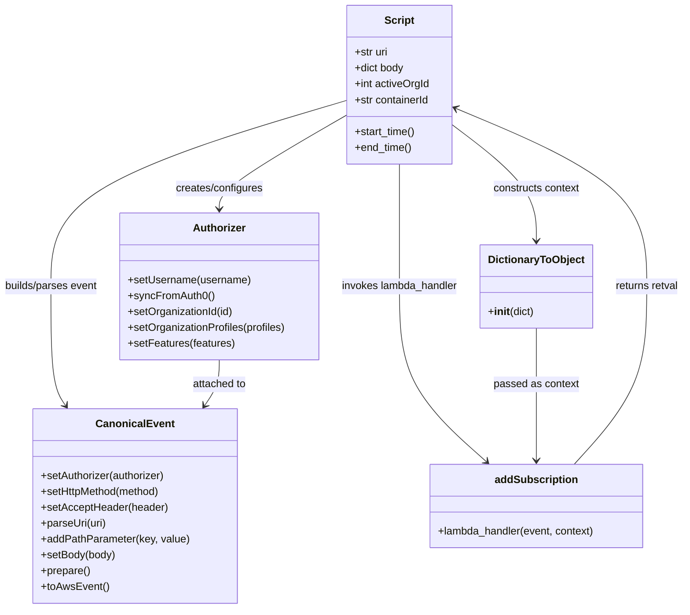
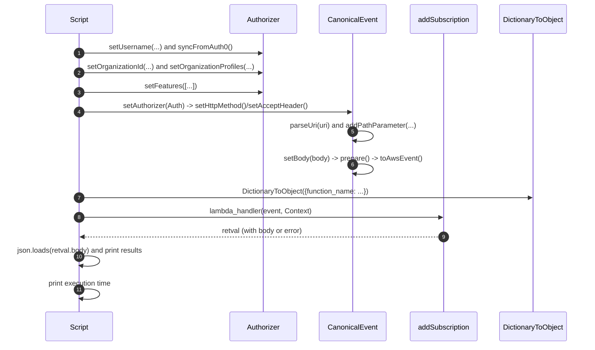

# Diagram: tools/ide_local_testing/localTest/test/byUrl/subscribeByUrl.py

> Auto-generated by Obscura crawlers

## Diagram 1

### SVG

<svg id="container" width="1045.5859375" xmlns="http://www.w3.org/2000/svg" class="classDiagram" height="920" viewBox="0 0 1045.5859375 920" role="graphics-document document" aria-roledescription="class"><g><defs><marker id="container_class-aggregationStart" class="marker aggregation class" refX="18" refY="7" markerWidth="190" markerHeight="240" orient="auto"><path d="M 18,7 L9,13 L1,7 L9,1 Z"></path></marker></defs><defs><marker id="container_class-aggregationEnd" class="marker aggregation class" refX="1" refY="7" markerWidth="20" markerHeight="28" orient="auto"><path d="M 18,7 L9,13 L1,7 L9,1 Z"></path></marker></defs><defs><marker id="container_class-extensionStart" class="marker extension class" refX="18" refY="7" markerWidth="190" markerHeight="240" orient="auto"><path d="M 1,7 L18,13 V 1 Z"></path></marker></defs><defs><marker id="container_class-extensionEnd" class="marker extension class" refX="1" refY="7" markerWidth="20" markerHeight="28" orient="auto"><path d="M 1,1 V 13 L18,7 Z"></path></marker></defs><defs><marker id="container_class-compositionStart" class="marker composition class" refX="18" refY="7" markerWidth="190" markerHeight="240" orient="auto"><path d="M 18,7 L9,13 L1,7 L9,1 Z"></path></marker></defs><defs><marker id="container_class-compositionEnd" class="marker composition class" refX="1" refY="7" markerWidth="20" markerHeight="28" orient="auto"><path d="M 18,7 L9,13 L1,7 L9,1 Z"></path></marker></defs><defs><marker id="container_class-dependencyStart" class="marker dependency class" refX="6" refY="7" markerWidth="190" markerHeight="240" orient="auto"><path d="M 5,7 L9,13 L1,7 L9,1 Z"></path></marker></defs><defs><marker id="container_class-dependencyEnd" class="marker dependency class" refX="13" refY="7" markerWidth="20" markerHeight="28" orient="auto"><path d="M 18,7 L9,13 L14,7 L9,1 Z"></path></marker></defs><defs><marker id="container_class-lollipopStart" class="marker lollipop class" refX="13" refY="7" markerWidth="190" markerHeight="240" orient="auto"><circle stroke="black" fill="transparent" cx="7" cy="7" r="6"></circle></marker></defs><defs><marker id="container_class-lollipopEnd" class="marker lollipop class" refX="1" refY="7" markerWidth="190" markerHeight="240" orient="auto"><circle stroke="black" fill="transparent" cx="7" cy="7" r="6"></circle></marker></defs><g class="root"><g class="clusters"></g><g class="edgePaths"><path d="M535.473,173.725L502.846,192.271C470.22,210.817,404.967,247.908,372.341,271.621C339.715,295.333,339.715,305.667,339.715,310.833L339.715,316" id="id_Script_Authorizer_1" class="edge-thickness-normal edge-pattern-solid relation" style=";;;" data-edge="true" data-et="edge" data-id="id_Script_Authorizer_1" data-points="W3sieCI6NTM1LjQ3MjY1NjI1LCJ5IjoxNzMuNzI1MzMxMjk2NzU5ODZ9LHsieCI6MzM5LjcxNDg0Mzc1LCJ5IjoyODV9LHsieCI6MzM5LjcxNDg0Mzc1LCJ5IjozMjJ9XQ==" marker-end="url(#container_class-dependencyEnd)"></path><path d="M535.473,151.589L459.648,173.824C383.823,196.059,232.173,240.53,156.348,287.431C80.523,334.333,80.523,383.667,80.523,433C80.523,482.333,80.523,531.667,84.291,561.682C88.058,591.698,95.593,602.396,99.361,607.745L103.128,613.095" id="id_Script_CanonicalEvent_2" class="edge-thickness-normal edge-pattern-solid relation" style=";;;" data-edge="true" data-et="edge" data-id="id_Script_CanonicalEvent_2" data-points="W3sieCI6NTM1LjQ3MjY1NjI1LCJ5IjoxNTEuNTg4OTQ2NDQ2ODExNn0seyJ4Ijo4MC41MjM0Mzc1LCJ5IjoyODV9LHsieCI6ODAuNTIzNDM3NSwieSI6NDMzfSx7IngiOjgwLjUyMzQzNzUsInkiOjU4MX0seyJ4IjoxMDYuNTgzNDQzMDE5NzAxMSwieSI6NjE4fV0=" marker-end="url(#container_class-dependencyEnd)"></path><path d="M696.355,189.09L717.404,205.075C738.453,221.06,780.551,253.03,801.6,282.182C822.648,311.333,822.648,337.667,822.648,350.833L822.648,364" id="id_Script_DictionaryToObject_3" class="edge-thickness-normal edge-pattern-solid relation" style=";;;" data-edge="true" data-et="edge" data-id="id_Script_DictionaryToObject_3" data-points="W3sieCI6Njk2LjM1NTQ2ODc1LCJ5IjoxODkuMDg5NTA1NzA2Mjk1ODJ9LHsieCI6ODIyLjY0ODQzNzUsInkiOjI4NX0seyJ4Ijo4MjIuNjQ4NDM3NSwieSI6MzcwfV0=" marker-end="url(#container_class-dependencyEnd)"></path><path d="M615.914,248L615.914,254.167C615.914,260.333,615.914,272.667,615.914,303.5C615.914,334.333,615.914,383.667,615.914,433C615.914,482.333,615.914,531.667,637.825,575.835C659.737,620.004,703.56,659.007,725.471,678.509L747.382,698.011" id="id_Script_addSubscription_4" class="edge-thickness-normal edge-pattern-solid relation" style=";;;" data-edge="true" data-et="edge" data-id="id_Script_addSubscription_4" data-points="W3sieCI6NjE1LjkxNDA2MjUsInkiOjI0OH0seyJ4Ijo2MTUuOTE0MDYyNSwieSI6Mjg1fSx7IngiOjYxNS45MTQwNjI1LCJ5Ijo0MzN9LHsieCI6NjE1LjkxNDA2MjUsInkiOjU4MX0seyJ4Ijo3NTEuODY0Mzg1MTkwMjE3NCwieSI6NzAyfV0=" marker-end="url(#container_class-dependencyEnd)"></path><path d="M339.715,544L339.715,550.167C339.715,556.333,339.715,568.667,335.947,580.182C332.18,591.698,324.645,602.396,320.877,607.745L317.11,613.095" id="id_Authorizer_CanonicalEvent_5" class="edge-thickness-normal edge-pattern-solid relation" style=";;;" data-edge="true" data-et="edge" data-id="id_Authorizer_CanonicalEvent_5" data-points="W3sieCI6MzM5LjcxNDg0Mzc1LCJ5Ijo1NDR9LHsieCI6MzM5LjcxNDg0Mzc1LCJ5Ijo1ODF9LHsieCI6MzEzLjY1NDgzODIzMDI5ODksInkiOjYxOH1d" marker-end="url(#container_class-dependencyEnd)"></path><path d="M822.648,496L822.648,510.167C822.648,524.333,822.648,552.667,822.648,586C822.648,619.333,822.648,657.667,822.648,676.833L822.648,696" id="id_DictionaryToObject_addSubscription_6" class="edge-thickness-normal edge-pattern-solid relation" style=";;;" data-edge="true" data-et="edge" data-id="id_DictionaryToObject_addSubscription_6" data-points="W3sieCI6ODIyLjY0ODQzNzUsInkiOjQ5Nn0seyJ4Ijo4MjIuNjQ4NDM3NSwieSI6NTgxfSx7IngiOjgyMi42NDg0Mzc1LCJ5Ijo3MDJ9XQ==" marker-end="url(#container_class-dependencyEnd)"></path><path d="M879.509,702L897.711,681.833C915.913,661.667,952.316,621.333,970.517,576.5C988.719,531.667,988.719,482.333,988.719,433C988.719,383.667,988.719,334.333,940.913,289.534C893.108,244.735,797.496,204.47,749.691,184.338L701.885,164.205" id="id_addSubscription_Script_7" class="edge-thickness-normal edge-pattern-solid relation" style=";;;" data-edge="true" data-et="edge" data-id="id_addSubscription_Script_7" data-points="W3sieCI6ODc5LjUwOTQ2ODQxMDMyNjEsInkiOjcwMn0seyJ4Ijo5ODguNzE4NzUsInkiOjU4MX0seyJ4Ijo5ODguNzE4NzUsInkiOjQzM30seyJ4Ijo5ODguNzE4NzUsInkiOjI4NX0seyJ4Ijo2OTYuMzU1NDY4NzUsInkiOjE2MS44NzY0NTM4MjM0MjQ2NH1d" marker-end="url(#container_class-dependencyEnd)"></path></g><g class="edgeLabels"><g class="edgeLabel" transform="translate(339.71484375, 285)"><g class="label" data-id="id_Script_Authorizer_1" transform="translate(-67.234375, -12)"><foreignObject width="134.46875" height="24">

creates/configures

</foreignObject></g></g><g class="edgeLabel" transform="translate(80.5234375, 433)"><g class="label" data-id="id_Script_CanonicalEvent_2" transform="translate(-72.5234375, -12)"><foreignObject width="145.046875" height="24">

builds/parses event

</foreignObject></g></g><g class="edgeLabel" transform="translate(822.6484375, 285)"><g class="label" data-id="id_Script_DictionaryToObject_3" transform="translate(-66.8125, -12)"><foreignObject width="133.625" height="24">

constructs context

</foreignObject></g></g><g class="edgeLabel" transform="translate(615.9140625, 433)"><g class="label" data-id="id_Script_addSubscription_4" transform="translate(-89.53125, -12)"><foreignObject width="179.0625" height="24">

invokes lambda_handler

</foreignObject></g></g><g class="edgeLabel" transform="translate(339.71484375, 581)"><g class="label" data-id="id_Authorizer_CanonicalEvent_5" transform="translate(-41.640625, -12)"><foreignObject width="83.28125" height="24">

attached to

</foreignObject></g></g><g class="edgeLabel" transform="translate(822.6484375, 581)"><g class="label" data-id="id_DictionaryToObject_addSubscription_6" transform="translate(-64.578125, -12)"><foreignObject width="129.15625" height="24">

passed as context

</foreignObject></g></g><g class="edgeLabel" transform="translate(988.71875, 433)"><g class="label" data-id="id_addSubscription_Script_7" transform="translate(-48.8671875, -12)"><foreignObject width="97.734375" height="24">

returns retval

</foreignObject></g></g></g><g class="nodes"><g class="node default" id="classId-Script-0" transform="translate(615.9140625, 128)"><g class="basic label-container"><path d="M-80.44140625 -120 L80.44140625 -120 L80.44140625 120 L-80.44140625 120" stroke="none" stroke-width="0" fill="#ECECFF" style=""></path><path d="M-80.44140625 -120 C-43.83492321744666 -120, -7.228440184893316 -120, 80.44140625 -120 M-80.44140625 -120 C-21.436396742015198 -120, 37.568612765969604 -120, 80.44140625 -120 M80.44140625 -120 C80.44140625 -68.9989922132124, 80.44140625 -17.997984426424807, 80.44140625 120 M80.44140625 -120 C80.44140625 -43.971820275809876, 80.44140625 32.05635944838025, 80.44140625 120 M80.44140625 120 C39.196954809943286 120, -2.0474966301134288 120, -80.44140625 120 M80.44140625 120 C39.59116781908765 120, -1.259070611824697 120, -80.44140625 120 M-80.44140625 120 C-80.44140625 57.28065915225492, -80.44140625 -5.4386816954901605, -80.44140625 -120 M-80.44140625 120 C-80.44140625 69.26552350734568, -80.44140625 18.531047014691367, -80.44140625 -120" stroke="#9370DB" stroke-width="1.3" fill="none" stroke-dasharray="0 0" style=""></path></g><g class="annotation-group text" transform="translate(0, -96)"></g><g class="label-group text" transform="translate(-21.7421875, -96)"><g class="label" style="font-weight: bolder" transform="translate(0,-12)"><foreignObject width="43.484375" height="24">

Script

</foreignObject></g></g><g class="members-group text" transform="translate(-68.44140625, -48)"><g class="label" style="" transform="translate(0,-12)"><foreignObject width="51.65625" height="24">

+str uri

</foreignObject></g><g class="label" style="" transform="translate(0,12)"><foreignObject width="76.03125" height="24">

+dict body

</foreignObject></g><g class="label" style="" transform="translate(0,36)"><foreignObject width="114.6875" height="24">

+int activeOrgId

</foreignObject></g><g class="label" style="" transform="translate(0,60)"><foreignObject width="115.140625" height="24">

+str containerId

</foreignObject></g></g><g class="methods-group text" transform="translate(-68.44140625, 72)"><g class="label" style="" transform="translate(0,-12)"><foreignObject width="92.875" height="24">

+start_time()

</foreignObject></g><g class="label" style="" transform="translate(0,12)"><foreignObject width="86.75" height="24">

+end_time()

</foreignObject></g></g><g class="divider" style=""><path d="M-80.44140625 -72 C-36.13442839893045 -72, 8.172549452139094 -72, 80.44140625 -72 M-80.44140625 -72 C-41.320300685195704 -72, -2.1991951203914084 -72, 80.44140625 -72" stroke="#9370DB" stroke-width="1.3" fill="none" stroke-dasharray="0 0" style=""></path></g><g class="divider" style=""><path d="M-80.44140625 48 C-38.033210086782745 48, 4.37498607643451 48, 80.44140625 48 M-80.44140625 48 C-27.099523941430547 48, 26.242358367138905 48, 80.44140625 48" stroke="#9370DB" stroke-width="1.3" fill="none" stroke-dasharray="0 0" style=""></path></g></g><g class="node default" id="classId-Authorizer-1" transform="translate(339.71484375, 433)"><g class="basic label-container"><path d="M-151.66796875 -111 L151.66796875 -111 L151.66796875 111 L-151.66796875 111" stroke="none" stroke-width="0" fill="#ECECFF" style=""></path><path d="M-151.66796875 -111 C-57.07775366019598 -111, 37.51246142960804 -111, 151.66796875 -111 M-151.66796875 -111 C-83.3741225030428 -111, -15.080276256085597 -111, 151.66796875 -111 M151.66796875 -111 C151.66796875 -52.81282026777477, 151.66796875 5.374359464450464, 151.66796875 111 M151.66796875 -111 C151.66796875 -25.446303320433927, 151.66796875 60.107393359132146, 151.66796875 111 M151.66796875 111 C41.379748394352745 111, -68.90847196129451 111, -151.66796875 111 M151.66796875 111 C64.6287377202616 111, -22.410493309476806 111, -151.66796875 111 M-151.66796875 111 C-151.66796875 42.00586537984488, -151.66796875 -26.988269240310245, -151.66796875 -111 M-151.66796875 111 C-151.66796875 47.06363450118157, -151.66796875 -16.872730997636864, -151.66796875 -111" stroke="#9370DB" stroke-width="1.3" fill="none" stroke-dasharray="0 0" style=""></path></g><g class="annotation-group text" transform="translate(0, -87)"></g><g class="label-group text" transform="translate(-38.3671875, -87)"><g class="label" style="font-weight: bolder" transform="translate(0,-12)"><foreignObject width="76.734375" height="24">

Authorizer

</foreignObject></g></g><g class="members-group text" transform="translate(-139.66796875, -39)"></g><g class="methods-group text" transform="translate(-139.66796875, -9)"><g class="label" style="" transform="translate(0,-12)"><foreignObject width="185.90625" height="24">

+setUsername(username)

</foreignObject></g><g class="label" style="" transform="translate(0,12)"><foreignObject width="129.0625" height="24">

+syncFromAuth0()

</foreignObject></g><g class="label" style="" transform="translate(0,36)"><foreignObject width="160.78125" height="24">

+setOrganizationId(id)

</foreignObject></g><g class="label" style="" transform="translate(0,60)"><foreignObject width="240.96875" height="24">

+setOrganizationProfiles(profiles)

</foreignObject></g><g class="label" style="" transform="translate(0,84)"><foreignObject width="161.296875" height="24">

+setFeatures(features)

</foreignObject></g></g><g class="divider" style=""><path d="M-151.66796875 -63 C-43.17121156695627 -63, 65.32554561608745 -63, 151.66796875 -63 M-151.66796875 -63 C-65.99963738822869 -63, 19.668693973542617 -63, 151.66796875 -63" stroke="#9370DB" stroke-width="1.3" fill="none" stroke-dasharray="0 0" style=""></path></g><g class="divider" style=""><path d="M-151.66796875 -39 C-62.24916136994372 -39, 27.169646010112558 -39, 151.66796875 -39 M-151.66796875 -39 C-90.78825436759497 -39, -29.908539985189947 -39, 151.66796875 -39" stroke="#9370DB" stroke-width="1.3" fill="none" stroke-dasharray="0 0" style=""></path></g></g><g class="node default" id="classId-CanonicalEvent-2" transform="translate(210.119140625, 765)"><g class="basic label-container"><path d="M-151.57421875 -147 L151.57421875 -147 L151.57421875 147 L-151.57421875 147" stroke="none" stroke-width="0" fill="#ECECFF" style=""></path><path d="M-151.57421875 -147 C-55.13059624570404 -147, 41.31302625859192 -147, 151.57421875 -147 M-151.57421875 -147 C-50.3195698129001 -147, 50.9350791241998 -147, 151.57421875 -147 M151.57421875 -147 C151.57421875 -83.7124423819411, 151.57421875 -20.424884763882204, 151.57421875 147 M151.57421875 -147 C151.57421875 -61.95346015680836, 151.57421875 23.093079686383277, 151.57421875 147 M151.57421875 147 C58.27155348569116 147, -35.031111778617685 147, -151.57421875 147 M151.57421875 147 C33.04749047319737 147, -85.47923780360526 147, -151.57421875 147 M-151.57421875 147 C-151.57421875 66.5500114881684, -151.57421875 -13.899977023663212, -151.57421875 -147 M-151.57421875 147 C-151.57421875 42.20460089215777, -151.57421875 -62.59079821568446, -151.57421875 -147" stroke="#9370DB" stroke-width="1.3" fill="none" stroke-dasharray="0 0" style=""></path></g><g class="annotation-group text" transform="translate(0, -123)"></g><g class="label-group text" transform="translate(-55.7109375, -123)"><g class="label" style="font-weight: bolder" transform="translate(0,-12)"><foreignObject width="111.421875" height="24">

CanonicalEvent

</foreignObject></g></g><g class="members-group text" transform="translate(-139.57421875, -75)"></g><g class="methods-group text" transform="translate(-139.57421875, -45)"><g class="label" style="" transform="translate(0,-12)"><foreignObject width="190.75" height="24">

+setAuthorizer(authorizer)

</foreignObject></g><g class="label" style="" transform="translate(0,12)"><foreignObject width="184" height="24">

+setHttpMethod(method)

</foreignObject></g><g class="label" style="" transform="translate(0,36)"><foreignObject width="191.859375" height="24">

+setAcceptHeader(header)

</foreignObject></g><g class="label" style="" transform="translate(0,60)"><foreignObject width="99.8125" height="24">

+parseUri(uri)

</foreignObject></g><g class="label" style="" transform="translate(0,84)"><foreignObject width="223.4375" height="24">

+addPathParameter(key, value)

</foreignObject></g><g class="label" style="" transform="translate(0,108)"><foreignObject width="113.125" height="24">

+setBody(body)

</foreignObject></g><g class="label" style="" transform="translate(0,132)"><foreignObject width="74.75" height="24">

+prepare()

</foreignObject></g><g class="label" style="" transform="translate(0,156)"><foreignObject width="101.1875" height="24">

+toAwsEvent()

</foreignObject></g></g><g class="divider" style=""><path d="M-151.57421875 -99 C-53.08920120581371 -99, 45.39581633837258 -99, 151.57421875 -99 M-151.57421875 -99 C-66.16198035328172 -99, 19.25025804343656 -99, 151.57421875 -99" stroke="#9370DB" stroke-width="1.3" fill="none" stroke-dasharray="0 0" style=""></path></g><g class="divider" style=""><path d="M-151.57421875 -75 C-60.9186513196842 -75, 29.736916110631597 -75, 151.57421875 -75 M-151.57421875 -75 C-30.637331269319674 -75, 90.29955621136065 -75, 151.57421875 -75" stroke="#9370DB" stroke-width="1.3" fill="none" stroke-dasharray="0 0" style=""></path></g></g><g class="node default" id="classId-DictionaryToObject-3" transform="translate(822.6484375, 433)"><g class="basic label-container"><path d="M-82.203125 -63 L82.203125 -63 L82.203125 63 L-82.203125 63" stroke="none" stroke-width="0" fill="#ECECFF" style=""></path><path d="M-82.203125 -63 C-28.99980495887631 -63, 24.203515082247378 -63, 82.203125 -63 M-82.203125 -63 C-36.29109822783417 -63, 9.620928544331662 -63, 82.203125 -63 M82.203125 -63 C82.203125 -15.762471146726867, 82.203125 31.475057706546266, 82.203125 63 M82.203125 -63 C82.203125 -23.360215993241056, 82.203125 16.27956801351789, 82.203125 63 M82.203125 63 C44.48939263505941 63, 6.77566027011882 63, -82.203125 63 M82.203125 63 C42.47584068874816 63, 2.748556377496314 63, -82.203125 63 M-82.203125 63 C-82.203125 17.746559693597113, -82.203125 -27.506880612805773, -82.203125 -63 M-82.203125 63 C-82.203125 37.08716822869218, -82.203125 11.17433645738435, -82.203125 -63" stroke="#9370DB" stroke-width="1.3" fill="none" stroke-dasharray="0 0" style=""></path></g><g class="annotation-group text" transform="translate(0, -39)"></g><g class="label-group text" transform="translate(-70.109375, -39)"><g class="label" style="font-weight: bolder" transform="translate(0,-12)"><foreignObject width="140.21875" height="24">

DictionaryToObject

</foreignObject></g></g><g class="members-group text" transform="translate(-70.203125, 9)"></g><g class="methods-group text" transform="translate(-70.203125, 39)"><g class="label" style="" transform="translate(0,-12)"><foreignObject width="70.296875" height="24">

+<strong>init</strong>(dict)

</foreignObject></g></g><g class="divider" style=""><path d="M-82.203125 -15 C-34.15147628333191 -15, 13.90017243333618 -15, 82.203125 -15 M-82.203125 -15 C-42.91908302202813 -15, -3.6350410440562655 -15, 82.203125 -15" stroke="#9370DB" stroke-width="1.3" fill="none" stroke-dasharray="0 0" style=""></path></g><g class="divider" style=""><path d="M-82.203125 9 C-24.81566199780574 9, 32.57180100438852 9, 82.203125 9 M-82.203125 9 C-36.0486026170798 9, 10.105919765840397 9, 82.203125 9" stroke="#9370DB" stroke-width="1.3" fill="none" stroke-dasharray="0 0" style=""></path></g></g><g class="node default" id="classId-addSubscription-4" transform="translate(822.6484375, 765)"><g class="basic label-container"><path d="M-162.3359375 -63 L162.3359375 -63 L162.3359375 63 L-162.3359375 63" stroke="none" stroke-width="0" fill="#ECECFF" style=""></path><path d="M-162.3359375 -63 C-36.44498350436402 -63, 89.44597049127196 -63, 162.3359375 -63 M-162.3359375 -63 C-67.41407067785892 -63, 27.507796144282167 -63, 162.3359375 -63 M162.3359375 -63 C162.3359375 -37.24260978056702, 162.3359375 -11.485219561134045, 162.3359375 63 M162.3359375 -63 C162.3359375 -15.332766139510852, 162.3359375 32.334467720978296, 162.3359375 63 M162.3359375 63 C80.6157467647086 63, -1.1044439705827926 63, -162.3359375 63 M162.3359375 63 C46.610666652698725 63, -69.11460419460255 63, -162.3359375 63 M-162.3359375 63 C-162.3359375 36.90611055501435, -162.3359375 10.812221110028702, -162.3359375 -63 M-162.3359375 63 C-162.3359375 20.749190287771597, -162.3359375 -21.501619424456806, -162.3359375 -63" stroke="#9370DB" stroke-width="1.3" fill="none" stroke-dasharray="0 0" style=""></path></g><g class="annotation-group text" transform="translate(0, -39)"></g><g class="label-group text" transform="translate(-60.484375, -39)"><g class="label" style="font-weight: bolder" transform="translate(0,-12)"><foreignObject width="120.96875" height="24">

addSubscription

</foreignObject></g></g><g class="members-group text" transform="translate(-150.3359375, 9)"></g><g class="methods-group text" transform="translate(-150.3359375, 39)"><g class="label" style="" transform="translate(0,-12)"><foreignObject width="240.1875" height="24">

+lambda_handler(event, context)

</foreignObject></g></g><g class="divider" style=""><path d="M-162.3359375 -15 C-59.94104297121133 -15, 42.45385155757734 -15, 162.3359375 -15 M-162.3359375 -15 C-62.817823340595 -15, 36.700290818810004 -15, 162.3359375 -15" stroke="#9370DB" stroke-width="1.3" fill="none" stroke-dasharray="0 0" style=""></path></g><g class="divider" style=""><path d="M-162.3359375 9 C-65.02628005885538 9, 32.283377382289245 9, 162.3359375 9 M-162.3359375 9 C-39.25190455838718 9, 83.83212838322564 9, 162.3359375 9" stroke="#9370DB" stroke-width="1.3" fill="none" stroke-dasharray="0 0" style=""></path></g></g></g></g></g></svg>

## Diagram 2

### SVG

<svg id="container" width="1389" xmlns="http://www.w3.org/2000/svg" height="819" viewBox="-119.5 -10 1389 819" role="graphics-document document" aria-roledescription="sequence"><g><rect x="1061.5" y="733" fill="#eaeaea" stroke="#666" width="158" height="65" name="Context" rx="3" ry="3" class="actor actor-bottom"></rect><text x="1140.5" y="765.5" dominant-baseline="central" alignment-baseline="central" class="actor actor-box" style="text-anchor: middle; font-size: 16px; font-weight: 400;"><tspan x="1140.5" dy="0">DictionaryToObject</tspan></text></g><g><rect x="861.5" y="733" fill="#eaeaea" stroke="#666" width="150" height="65" name="Lambda" rx="3" ry="3" class="actor actor-bottom"></rect><text x="936.5" y="765.5" dominant-baseline="central" alignment-baseline="central" class="actor actor-box" style="text-anchor: middle; font-size: 16px; font-weight: 400;"><tspan x="936.5" dy="0">addSubscription</tspan></text></g><g><rect x="646" y="733" fill="#eaeaea" stroke="#666" width="150" height="65" name="Event" rx="3" ry="3" class="actor actor-bottom"></rect><text x="721" y="765.5" dominant-baseline="central" alignment-baseline="central" class="actor actor-box" style="text-anchor: middle; font-size: 16px; font-weight: 400;"><tspan x="721" dy="0">CanonicalEvent</tspan></text></g><g><rect x="446" y="733" fill="#eaeaea" stroke="#666" width="150" height="65" name="Auth" rx="3" ry="3" class="actor actor-bottom"></rect><text x="521" y="765.5" dominant-baseline="central" alignment-baseline="central" class="actor actor-box" style="text-anchor: middle; font-size: 16px; font-weight: 400;"><tspan x="521" dy="0">Authorizer</tspan></text></g><g><rect x="0" y="733" fill="#eaeaea" stroke="#666" width="150" height="65" name="UserScript" rx="3" ry="3" class="actor actor-bottom"></rect><text x="75" y="765.5" dominant-baseline="central" alignment-baseline="central" class="actor actor-box" style="text-anchor: middle; font-size: 16px; font-weight: 400;"><tspan x="75" dy="0">Script</tspan></text></g><g><line id="actor4" x1="1140.5" y1="65" x2="1140.5" y2="733" class="actor-line 200" stroke-width="0.5px" stroke="#999" name="Context"></line><g id="root-4"><rect x="1061.5" y="0" fill="#eaeaea" stroke="#666" width="158" height="65" name="Context" rx="3" ry="3" class="actor actor-top"></rect><text x="1140.5" y="32.5" dominant-baseline="central" alignment-baseline="central" class="actor actor-box" style="text-anchor: middle; font-size: 16px; font-weight: 400;"><tspan x="1140.5" dy="0">DictionaryToObject</tspan></text></g></g><g><line id="actor3" x1="936.5" y1="65" x2="936.5" y2="733" class="actor-line 200" stroke-width="0.5px" stroke="#999" name="Lambda"></line><g id="root-3"><rect x="861.5" y="0" fill="#eaeaea" stroke="#666" width="150" height="65" name="Lambda" rx="3" ry="3" class="actor actor-top"></rect><text x="936.5" y="32.5" dominant-baseline="central" alignment-baseline="central" class="actor actor-box" style="text-anchor: middle; font-size: 16px; font-weight: 400;"><tspan x="936.5" dy="0">addSubscription</tspan></text></g></g><g><line id="actor2" x1="721" y1="65" x2="721" y2="733" class="actor-line 200" stroke-width="0.5px" stroke="#999" name="Event"></line><g id="root-2"><rect x="646" y="0" fill="#eaeaea" stroke="#666" width="150" height="65" name="Event" rx="3" ry="3" class="actor actor-top"></rect><text x="721" y="32.5" dominant-baseline="central" alignment-baseline="central" class="actor actor-box" style="text-anchor: middle; font-size: 16px; font-weight: 400;"><tspan x="721" dy="0">CanonicalEvent</tspan></text></g></g><g><line id="actor1" x1="521" y1="65" x2="521" y2="733" class="actor-line 200" stroke-width="0.5px" stroke="#999" name="Auth"></line><g id="root-1"><rect x="446" y="0" fill="#eaeaea" stroke="#666" width="150" height="65" name="Auth" rx="3" ry="3" class="actor actor-top"></rect><text x="521" y="32.5" dominant-baseline="central" alignment-baseline="central" class="actor actor-box" style="text-anchor: middle; font-size: 16px; font-weight: 400;"><tspan x="521" dy="0">Authorizer</tspan></text></g></g><g><line id="actor0" x1="75" y1="65" x2="75" y2="733" class="actor-line 200" stroke-width="0.5px" stroke="#999" name="UserScript"></line><g id="root-0"><rect x="0" y="0" fill="#eaeaea" stroke="#666" width="150" height="65" name="UserScript" rx="3" ry="3" class="actor actor-top"></rect><text x="75" y="32.5" dominant-baseline="central" alignment-baseline="central" class="actor actor-box" style="text-anchor: middle; font-size: 16px; font-weight: 400;"><tspan x="75" dy="0">Script</tspan></text></g></g><g></g><defs><symbol id="computer" width="24" height="24"><path transform="scale(.5)" d="M2 2v13h20v-13h-20zm18 11h-16v-9h16v9zm-10.228 6l.466-1h3.524l.467 1h-4.457zm14.228 3h-24l2-6h2.104l-1.33 4h18.45l-1.297-4h2.073l2 6zm-5-10h-14v-7h14v7z"></path></symbol></defs><defs><symbol id="database" fill-rule="evenodd" clip-rule="evenodd"><path transform="scale(.5)" d="M12.258.001l.256.004.255.005.253.008.251.01.249.012.247.015.246.016.242.019.241.02.239.023.236.024.233.027.231.028.229.031.225.032.223.034.22.036.217.038.214.04.211.041.208.043.205.045.201.046.198.048.194.05.191.051.187.053.183.054.18.056.175.057.172.059.168.06.163.061.16.063.155.064.15.066.074.033.073.033.071.034.07.034.069.035.068.035.067.035.066.035.064.036.064.036.062.036.06.036.06.037.058.037.058.037.055.038.055.038.053.038.052.038.051.039.05.039.048.039.047.039.045.04.044.04.043.04.041.04.04.041.039.041.037.041.036.041.034.041.033.042.032.042.03.042.029.042.027.042.026.043.024.043.023.043.021.043.02.043.018.044.017.043.015.044.013.044.012.044.011.045.009.044.007.045.006.045.004.045.002.045.001.045v17l-.001.045-.002.045-.004.045-.006.045-.007.045-.009.044-.011.045-.012.044-.013.044-.015.044-.017.043-.018.044-.02.043-.021.043-.023.043-.024.043-.026.043-.027.042-.029.042-.03.042-.032.042-.033.042-.034.041-.036.041-.037.041-.039.041-.04.041-.041.04-.043.04-.044.04-.045.04-.047.039-.048.039-.05.039-.051.039-.052.038-.053.038-.055.038-.055.038-.058.037-.058.037-.06.037-.06.036-.062.036-.064.036-.064.036-.066.035-.067.035-.068.035-.069.035-.07.034-.071.034-.073.033-.074.033-.15.066-.155.064-.16.063-.163.061-.168.06-.172.059-.175.057-.18.056-.183.054-.187.053-.191.051-.194.05-.198.048-.201.046-.205.045-.208.043-.211.041-.214.04-.217.038-.22.036-.223.034-.225.032-.229.031-.231.028-.233.027-.236.024-.239.023-.241.02-.242.019-.246.016-.247.015-.249.012-.251.01-.253.008-.255.005-.256.004-.258.001-.258-.001-.256-.004-.255-.005-.253-.008-.251-.01-.249-.012-.247-.015-.245-.016-.243-.019-.241-.02-.238-.023-.236-.024-.234-.027-.231-.028-.228-.031-.226-.032-.223-.034-.22-.036-.217-.038-.214-.04-.211-.041-.208-.043-.204-.045-.201-.046-.198-.048-.195-.05-.19-.051-.187-.053-.184-.054-.179-.056-.176-.057-.172-.059-.167-.06-.164-.061-.159-.063-.155-.064-.151-.066-.074-.033-.072-.033-.072-.034-.07-.034-.069-.035-.068-.035-.067-.035-.066-.035-.064-.036-.063-.036-.062-.036-.061-.036-.06-.037-.058-.037-.057-.037-.056-.038-.055-.038-.053-.038-.052-.038-.051-.039-.049-.039-.049-.039-.046-.039-.046-.04-.044-.04-.043-.04-.041-.04-.04-.041-.039-.041-.037-.041-.036-.041-.034-.041-.033-.042-.032-.042-.03-.042-.029-.042-.027-.042-.026-.043-.024-.043-.023-.043-.021-.043-.02-.043-.018-.044-.017-.043-.015-.044-.013-.044-.012-.044-.011-.045-.009-.044-.007-.045-.006-.045-.004-.045-.002-.045-.001-.045v-17l.001-.045.002-.045.004-.045.006-.045.007-.045.009-.044.011-.045.012-.044.013-.044.015-.044.017-.043.018-.044.02-.043.021-.043.023-.043.024-.043.026-.043.027-.042.029-.042.03-.042.032-.042.033-.042.034-.041.036-.041.037-.041.039-.041.04-.041.041-.04.043-.04.044-.04.046-.04.046-.039.049-.039.049-.039.051-.039.052-.038.053-.038.055-.038.056-.038.057-.037.058-.037.06-.037.061-.036.062-.036.063-.036.064-.036.066-.035.067-.035.068-.035.069-.035.07-.034.072-.034.072-.033.074-.033.151-.066.155-.064.159-.063.164-.061.167-.06.172-.059.176-.057.179-.056.184-.054.187-.053.19-.051.195-.05.198-.048.201-.046.204-.045.208-.043.211-.041.214-.04.217-.038.22-.036.223-.034.226-.032.228-.031.231-.028.234-.027.236-.024.238-.023.241-.02.243-.019.245-.016.247-.015.249-.012.251-.01.253-.008.255-.005.256-.004.258-.001.258.001zm-9.258 20.499v.01l.001.021.003.021.004.022.005.021.006.022.007.022.009.023.01.022.011.023.012.023.013.023.015.023.016.024.017.023.018.024.019.024.021.024.022.025.023.024.024.025.052.049.056.05.061.051.066.051.07.051.075.051.079.052.084.052.088.052.092.052.097.052.102.051.105.052.11.052.114.051.119.051.123.051.127.05.131.05.135.05.139.048.144.049.147.047.152.047.155.047.16.045.163.045.167.043.171.043.176.041.178.041.183.039.187.039.19.037.194.035.197.035.202.033.204.031.209.03.212.029.216.027.219.025.222.024.226.021.23.02.233.018.236.016.24.015.243.012.246.01.249.008.253.005.256.004.259.001.26-.001.257-.004.254-.005.25-.008.247-.011.244-.012.241-.014.237-.016.233-.018.231-.021.226-.021.224-.024.22-.026.216-.027.212-.028.21-.031.205-.031.202-.034.198-.034.194-.036.191-.037.187-.039.183-.04.179-.04.175-.042.172-.043.168-.044.163-.045.16-.046.155-.046.152-.047.148-.048.143-.049.139-.049.136-.05.131-.05.126-.05.123-.051.118-.052.114-.051.11-.052.106-.052.101-.052.096-.052.092-.052.088-.053.083-.051.079-.052.074-.052.07-.051.065-.051.06-.051.056-.05.051-.05.023-.024.023-.025.021-.024.02-.024.019-.024.018-.024.017-.024.015-.023.014-.024.013-.023.012-.023.01-.023.01-.022.008-.022.006-.022.006-.022.004-.022.004-.021.001-.021.001-.021v-4.127l-.077.055-.08.053-.083.054-.085.053-.087.052-.09.052-.093.051-.095.05-.097.05-.1.049-.102.049-.105.048-.106.047-.109.047-.111.046-.114.045-.115.045-.118.044-.12.043-.122.042-.124.042-.126.041-.128.04-.13.04-.132.038-.134.038-.135.037-.138.037-.139.035-.142.035-.143.034-.144.033-.147.032-.148.031-.15.03-.151.03-.153.029-.154.027-.156.027-.158.026-.159.025-.161.024-.162.023-.163.022-.165.021-.166.02-.167.019-.169.018-.169.017-.171.016-.173.015-.173.014-.175.013-.175.012-.177.011-.178.01-.179.008-.179.008-.181.006-.182.005-.182.004-.184.003-.184.002h-.37l-.184-.002-.184-.003-.182-.004-.182-.005-.181-.006-.179-.008-.179-.008-.178-.01-.176-.011-.176-.012-.175-.013-.173-.014-.172-.015-.171-.016-.17-.017-.169-.018-.167-.019-.166-.02-.165-.021-.163-.022-.162-.023-.161-.024-.159-.025-.157-.026-.156-.027-.155-.027-.153-.029-.151-.03-.15-.03-.148-.031-.146-.032-.145-.033-.143-.034-.141-.035-.14-.035-.137-.037-.136-.037-.134-.038-.132-.038-.13-.04-.128-.04-.126-.041-.124-.042-.122-.042-.12-.044-.117-.043-.116-.045-.113-.045-.112-.046-.109-.047-.106-.047-.105-.048-.102-.049-.1-.049-.097-.05-.095-.05-.093-.052-.09-.051-.087-.052-.085-.053-.083-.054-.08-.054-.077-.054v4.127zm0-5.654v.011l.001.021.003.021.004.021.005.022.006.022.007.022.009.022.01.022.011.023.012.023.013.023.015.024.016.023.017.024.018.024.019.024.021.024.022.024.023.025.024.024.052.05.056.05.061.05.066.051.07.051.075.052.079.051.084.052.088.052.092.052.097.052.102.052.105.052.11.051.114.051.119.052.123.05.127.051.131.05.135.049.139.049.144.048.147.048.152.047.155.046.16.045.163.045.167.044.171.042.176.042.178.04.183.04.187.038.19.037.194.036.197.034.202.033.204.032.209.03.212.028.216.027.219.025.222.024.226.022.23.02.233.018.236.016.24.014.243.012.246.01.249.008.253.006.256.003.259.001.26-.001.257-.003.254-.006.25-.008.247-.01.244-.012.241-.015.237-.016.233-.018.231-.02.226-.022.224-.024.22-.025.216-.027.212-.029.21-.03.205-.032.202-.033.198-.035.194-.036.191-.037.187-.039.183-.039.179-.041.175-.042.172-.043.168-.044.163-.045.16-.045.155-.047.152-.047.148-.048.143-.048.139-.05.136-.049.131-.05.126-.051.123-.051.118-.051.114-.052.11-.052.106-.052.101-.052.096-.052.092-.052.088-.052.083-.052.079-.052.074-.051.07-.052.065-.051.06-.05.056-.051.051-.049.023-.025.023-.024.021-.025.02-.024.019-.024.018-.024.017-.024.015-.023.014-.023.013-.024.012-.022.01-.023.01-.023.008-.022.006-.022.006-.022.004-.021.004-.022.001-.021.001-.021v-4.139l-.077.054-.08.054-.083.054-.085.052-.087.053-.09.051-.093.051-.095.051-.097.05-.1.049-.102.049-.105.048-.106.047-.109.047-.111.046-.114.045-.115.044-.118.044-.12.044-.122.042-.124.042-.126.041-.128.04-.13.039-.132.039-.134.038-.135.037-.138.036-.139.036-.142.035-.143.033-.144.033-.147.033-.148.031-.15.03-.151.03-.153.028-.154.028-.156.027-.158.026-.159.025-.161.024-.162.023-.163.022-.165.021-.166.02-.167.019-.169.018-.169.017-.171.016-.173.015-.173.014-.175.013-.175.012-.177.011-.178.009-.179.009-.179.007-.181.007-.182.005-.182.004-.184.003-.184.002h-.37l-.184-.002-.184-.003-.182-.004-.182-.005-.181-.007-.179-.007-.179-.009-.178-.009-.176-.011-.176-.012-.175-.013-.173-.014-.172-.015-.171-.016-.17-.017-.169-.018-.167-.019-.166-.02-.165-.021-.163-.022-.162-.023-.161-.024-.159-.025-.157-.026-.156-.027-.155-.028-.153-.028-.151-.03-.15-.03-.148-.031-.146-.033-.145-.033-.143-.033-.141-.035-.14-.036-.137-.036-.136-.037-.134-.038-.132-.039-.13-.039-.128-.04-.126-.041-.124-.042-.122-.043-.12-.043-.117-.044-.116-.044-.113-.046-.112-.046-.109-.046-.106-.047-.105-.048-.102-.049-.1-.049-.097-.05-.095-.051-.093-.051-.09-.051-.087-.053-.085-.052-.083-.054-.08-.054-.077-.054v4.139zm0-5.666v.011l.001.02.003.022.004.021.005.022.006.021.007.022.009.023.01.022.011.023.012.023.013.023.015.023.016.024.017.024.018.023.019.024.021.025.022.024.023.024.024.025.052.05.056.05.061.05.066.051.07.051.075.052.079.051.084.052.088.052.092.052.097.052.102.052.105.051.11.052.114.051.119.051.123.051.127.05.131.05.135.05.139.049.144.048.147.048.152.047.155.046.16.045.163.045.167.043.171.043.176.042.178.04.183.04.187.038.19.037.194.036.197.034.202.033.204.032.209.03.212.028.216.027.219.025.222.024.226.021.23.02.233.018.236.017.24.014.243.012.246.01.249.008.253.006.256.003.259.001.26-.001.257-.003.254-.006.25-.008.247-.01.244-.013.241-.014.237-.016.233-.018.231-.02.226-.022.224-.024.22-.025.216-.027.212-.029.21-.03.205-.032.202-.033.198-.035.194-.036.191-.037.187-.039.183-.039.179-.041.175-.042.172-.043.168-.044.163-.045.16-.045.155-.047.152-.047.148-.048.143-.049.139-.049.136-.049.131-.051.126-.05.123-.051.118-.052.114-.051.11-.052.106-.052.101-.052.096-.052.092-.052.088-.052.083-.052.079-.052.074-.052.07-.051.065-.051.06-.051.056-.05.051-.049.023-.025.023-.025.021-.024.02-.024.019-.024.018-.024.017-.024.015-.023.014-.024.013-.023.012-.023.01-.022.01-.023.008-.022.006-.022.006-.022.004-.022.004-.021.001-.021.001-.021v-4.153l-.077.054-.08.054-.083.053-.085.053-.087.053-.09.051-.093.051-.095.051-.097.05-.1.049-.102.048-.105.048-.106.048-.109.046-.111.046-.114.046-.115.044-.118.044-.12.043-.122.043-.124.042-.126.041-.128.04-.13.039-.132.039-.134.038-.135.037-.138.036-.139.036-.142.034-.143.034-.144.033-.147.032-.148.032-.15.03-.151.03-.153.028-.154.028-.156.027-.158.026-.159.024-.161.024-.162.023-.163.023-.165.021-.166.02-.167.019-.169.018-.169.017-.171.016-.173.015-.173.014-.175.013-.175.012-.177.01-.178.01-.179.009-.179.007-.181.006-.182.006-.182.004-.184.003-.184.001-.185.001-.185-.001-.184-.001-.184-.003-.182-.004-.182-.006-.181-.006-.179-.007-.179-.009-.178-.01-.176-.01-.176-.012-.175-.013-.173-.014-.172-.015-.171-.016-.17-.017-.169-.018-.167-.019-.166-.02-.165-.021-.163-.023-.162-.023-.161-.024-.159-.024-.157-.026-.156-.027-.155-.028-.153-.028-.151-.03-.15-.03-.148-.032-.146-.032-.145-.033-.143-.034-.141-.034-.14-.036-.137-.036-.136-.037-.134-.038-.132-.039-.13-.039-.128-.041-.126-.041-.124-.041-.122-.043-.12-.043-.117-.044-.116-.044-.113-.046-.112-.046-.109-.046-.106-.048-.105-.048-.102-.048-.1-.05-.097-.049-.095-.051-.093-.051-.09-.052-.087-.052-.085-.053-.083-.053-.08-.054-.077-.054v4.153zm8.74-8.179l-.257.004-.254.005-.25.008-.247.011-.244.012-.241.014-.237.016-.233.018-.231.021-.226.022-.224.023-.22.026-.216.027-.212.028-.21.031-.205.032-.202.033-.198.034-.194.036-.191.038-.187.038-.183.04-.179.041-.175.042-.172.043-.168.043-.163.045-.16.046-.155.046-.152.048-.148.048-.143.048-.139.049-.136.05-.131.05-.126.051-.123.051-.118.051-.114.052-.11.052-.106.052-.101.052-.096.052-.092.052-.088.052-.083.052-.079.052-.074.051-.07.052-.065.051-.06.05-.056.05-.051.05-.023.025-.023.024-.021.024-.02.025-.019.024-.018.024-.017.023-.015.024-.014.023-.013.023-.012.023-.01.023-.01.022-.008.022-.006.023-.006.021-.004.022-.004.021-.001.021-.001.021.001.021.001.021.004.021.004.022.006.021.006.023.008.022.01.022.01.023.012.023.013.023.014.023.015.024.017.023.018.024.019.024.02.025.021.024.023.024.023.025.051.05.056.05.06.05.065.051.07.052.074.051.079.052.083.052.088.052.092.052.096.052.101.052.106.052.11.052.114.052.118.051.123.051.126.051.131.05.136.05.139.049.143.048.148.048.152.048.155.046.16.046.163.045.168.043.172.043.175.042.179.041.183.04.187.038.191.038.194.036.198.034.202.033.205.032.21.031.212.028.216.027.22.026.224.023.226.022.231.021.233.018.237.016.241.014.244.012.247.011.25.008.254.005.257.004.26.001.26-.001.257-.004.254-.005.25-.008.247-.011.244-.012.241-.014.237-.016.233-.018.231-.021.226-.022.224-.023.22-.026.216-.027.212-.028.21-.031.205-.032.202-.033.198-.034.194-.036.191-.038.187-.038.183-.04.179-.041.175-.042.172-.043.168-.043.163-.045.16-.046.155-.046.152-.048.148-.048.143-.048.139-.049.136-.05.131-.05.126-.051.123-.051.118-.051.114-.052.11-.052.106-.052.101-.052.096-.052.092-.052.088-.052.083-.052.079-.052.074-.051.07-.052.065-.051.06-.05.056-.05.051-.05.023-.025.023-.024.021-.024.02-.025.019-.024.018-.024.017-.023.015-.024.014-.023.013-.023.012-.023.01-.023.01-.022.008-.022.006-.023.006-.021.004-.022.004-.021.001-.021.001-.021-.001-.021-.001-.021-.004-.021-.004-.022-.006-.021-.006-.023-.008-.022-.01-.022-.01-.023-.012-.023-.013-.023-.014-.023-.015-.024-.017-.023-.018-.024-.019-.024-.02-.025-.021-.024-.023-.024-.023-.025-.051-.05-.056-.05-.06-.05-.065-.051-.07-.052-.074-.051-.079-.052-.083-.052-.088-.052-.092-.052-.096-.052-.101-.052-.106-.052-.11-.052-.114-.052-.118-.051-.123-.051-.126-.051-.131-.05-.136-.05-.139-.049-.143-.048-.148-.048-.152-.048-.155-.046-.16-.046-.163-.045-.168-.043-.172-.043-.175-.042-.179-.041-.183-.04-.187-.038-.191-.038-.194-.036-.198-.034-.202-.033-.205-.032-.21-.031-.212-.028-.216-.027-.22-.026-.224-.023-.226-.022-.231-.021-.233-.018-.237-.016-.241-.014-.244-.012-.247-.011-.25-.008-.254-.005-.257-.004-.26-.001-.26.001z"></path></symbol></defs><defs><symbol id="clock" width="24" height="24"><path transform="scale(.5)" d="M12 2c5.514 0 10 4.486 10 10s-4.486 10-10 10-10-4.486-10-10 4.486-10 10-10zm0-2c-6.627 0-12 5.373-12 12s5.373 12 12 12 12-5.373 12-12-5.373-12-12-12zm5.848 12.459c.202.038.202.333.001.372-1.907.361-6.045 1.111-6.547 1.111-.719 0-1.301-.582-1.301-1.301 0-.512.77-5.447 1.125-7.445.034-.192.312-.181.343.014l.985 6.238 5.394 1.011z"></path></symbol></defs><defs><marker id="arrowhead" refX="7.9" refY="5" markerUnits="userSpaceOnUse" markerWidth="12" markerHeight="12" orient="auto-start-reverse"><path d="M -1 0 L 10 5 L 0 10 z"></path></marker></defs><defs><marker id="crosshead" markerWidth="15" markerHeight="8" orient="auto" refX="4" refY="4.5"><path fill="none" stroke="#000000" stroke-width="1pt" d="M 1,2 L 6,7 M 6,2 L 1,7" style="stroke-dasharray: 0, 0;"></path></marker></defs><defs><marker id="filled-head" refX="15.5" refY="7" markerWidth="20" markerHeight="28" orient="auto"><path d="M 18,7 L9,13 L14,7 L9,1 Z"></path></marker></defs><defs><marker id="sequencenumber" refX="15" refY="15" markerWidth="60" markerHeight="40" orient="auto"><circle cx="15" cy="15" r="6"></circle></marker></defs><text x="297" y="80" text-anchor="middle" dominant-baseline="middle" alignment-baseline="middle" class="messageText" dy="1em" style="font-size: 16px; font-weight: 400;">setUsername(...) and syncFromAuth0()</text><line x1="76" y1="113" x2="517" y2="113" class="messageLine0" stroke-width="2" stroke="none" marker-end="url(#arrowhead)" style="fill: none;"></line><line x1="76" y1="113" x2="76" y2="113" stroke-width="0" marker-start="url(#sequencenumber)"></line><text x="76" y="117" font-family="sans-serif" font-size="12px" text-anchor="middle" class="sequenceNumber">1</text><text x="297" y="128" text-anchor="middle" dominant-baseline="middle" alignment-baseline="middle" class="messageText" dy="1em" style="font-size: 16px; font-weight: 400;">setOrganizationId(...) and setOrganizationProfiles(...)</text><line x1="76" y1="161" x2="517" y2="161" class="messageLine0" stroke-width="2" stroke="none" marker-end="url(#arrowhead)" style="fill: none;"></line><line x1="76" y1="161" x2="76" y2="161" stroke-width="0" marker-start="url(#sequencenumber)"></line><text x="76" y="165" font-family="sans-serif" font-size="12px" text-anchor="middle" class="sequenceNumber">2</text><text x="297" y="176" text-anchor="middle" dominant-baseline="middle" alignment-baseline="middle" class="messageText" dy="1em" style="font-size: 16px; font-weight: 400;">setFeatures([...])</text><line x1="76" y1="209" x2="517" y2="209" class="messageLine0" stroke-width="2" stroke="none" marker-end="url(#arrowhead)" style="fill: none;"></line><line x1="76" y1="209" x2="76" y2="209" stroke-width="0" marker-start="url(#sequencenumber)"></line><text x="76" y="213" font-family="sans-serif" font-size="12px" text-anchor="middle" class="sequenceNumber">3</text><text x="397" y="224" text-anchor="middle" dominant-baseline="middle" alignment-baseline="middle" class="messageText" dy="1em" style="font-size: 16px; font-weight: 400;">setAuthorizer(Auth) -&gt; setHttpMethod()/setAcceptHeader()</text><line x1="76" y1="257" x2="717" y2="257" class="messageLine0" stroke-width="2" stroke="none" marker-end="url(#arrowhead)" style="fill: none;"></line><line x1="76" y1="257" x2="76" y2="257" stroke-width="0" marker-start="url(#sequencenumber)"></line><text x="76" y="261" font-family="sans-serif" font-size="12px" text-anchor="middle" class="sequenceNumber">4</text><text x="722" y="272" text-anchor="middle" dominant-baseline="middle" alignment-baseline="middle" class="messageText" dy="1em" style="font-size: 16px; font-weight: 400;">parseUri(uri) and addPathParameter(...)</text><path d="M 722,305 C 782,295 782,335 722,325" class="messageLine0" stroke-width="2" stroke="none" marker-end="url(#arrowhead)" style="fill: none;"></path><line x1="722" y1="305" x2="722" y2="305" stroke-width="0" marker-start="url(#sequencenumber)"></line><text x="722" y="309" font-family="sans-serif" font-size="12px" text-anchor="middle" class="sequenceNumber">5</text><text x="722" y="350" text-anchor="middle" dominant-baseline="middle" alignment-baseline="middle" class="messageText" dy="1em" style="font-size: 16px; font-weight: 400;">setBody(body) -&gt; prepare() -&gt; toAwsEvent()</text><path d="M 722,383 C 782,373 782,413 722,403" class="messageLine0" stroke-width="2" stroke="none" marker-end="url(#arrowhead)" style="fill: none;"></path><line x1="722" y1="383" x2="722" y2="383" stroke-width="0" marker-start="url(#sequencenumber)"></line><text x="722" y="387" font-family="sans-serif" font-size="12px" text-anchor="middle" class="sequenceNumber">6</text><text x="606" y="428" text-anchor="middle" dominant-baseline="middle" alignment-baseline="middle" class="messageText" dy="1em" style="font-size: 16px; font-weight: 400;">DictionaryToObject({function_name: ...})</text><line x1="76" y1="461" x2="1136.5" y2="461" class="messageLine0" stroke-width="2" stroke="none" marker-end="url(#arrowhead)" style="fill: none;"></line><line x1="76" y1="461" x2="76" y2="461" stroke-width="0" marker-start="url(#sequencenumber)"></line><text x="76" y="465" font-family="sans-serif" font-size="12px" text-anchor="middle" class="sequenceNumber">7</text><text x="504" y="476" text-anchor="middle" dominant-baseline="middle" alignment-baseline="middle" class="messageText" dy="1em" style="font-size: 16px; font-weight: 400;">lambda_handler(event, Context)</text><line x1="76" y1="509" x2="932.5" y2="509" class="messageLine0" stroke-width="2" stroke="none" marker-end="url(#arrowhead)" style="fill: none;"></line><line x1="76" y1="509" x2="76" y2="509" stroke-width="0" marker-start="url(#sequencenumber)"></line><text x="76" y="513" font-family="sans-serif" font-size="12px" text-anchor="middle" class="sequenceNumber">8</text><text x="507" y="524" text-anchor="middle" dominant-baseline="middle" alignment-baseline="middle" class="messageText" dy="1em" style="font-size: 16px; font-weight: 400;">retval (with body or error)</text><line x1="935.5" y1="557" x2="79" y2="557" class="messageLine1" stroke-width="2" stroke="none" marker-end="url(#arrowhead)" style="stroke-dasharray: 3, 3; fill: none;"></line><line x1="935.5" y1="557" x2="935.5" y2="557" stroke-width="0" marker-start="url(#sequencenumber)"></line><text x="935.5" y="561" font-family="sans-serif" font-size="12px" text-anchor="middle" class="sequenceNumber">9</text><text x="76" y="572" text-anchor="middle" dominant-baseline="middle" alignment-baseline="middle" class="messageText" dy="1em" style="font-size: 16px; font-weight: 400;">json.loads(retval.body) and print results</text><path d="M 76,605 C 136,595 136,635 76,625" class="messageLine0" stroke-width="2" stroke="none" marker-end="url(#arrowhead)" style="fill: none;"></path><line x1="76" y1="605" x2="76" y2="605" stroke-width="0" marker-start="url(#sequencenumber)"></line><text x="76" y="609" font-family="sans-serif" font-size="12px" text-anchor="middle" class="sequenceNumber">10</text><text x="76" y="650" text-anchor="middle" dominant-baseline="middle" alignment-baseline="middle" class="messageText" dy="1em" style="font-size: 16px; font-weight: 400;">print execution time</text><path d="M 76,683 C 136,673 136,713 76,703" class="messageLine0" stroke-width="2" stroke="none" marker-end="url(#arrowhead)" style="fill: none;"></path><line x1="76" y1="683" x2="76" y2="683" stroke-width="0" marker-start="url(#sequencenumber)"></line><text x="76" y="687" font-family="sans-serif" font-size="12px" text-anchor="middle" class="sequenceNumber">11</text></svg>
