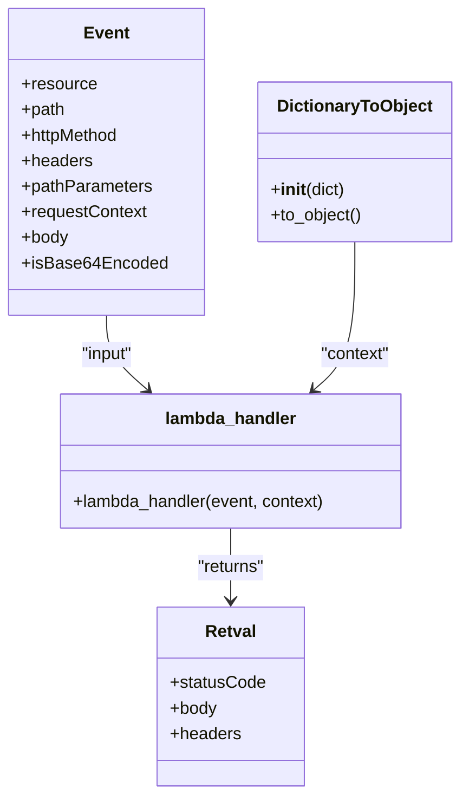

# Diagram: tools/ide_local_testing/localTest/test/byUrl/updateEntity.py


> Auto-generated by Obscura crawlers

## Diagram 1

```mermaid
flowchart TD
  Event[[event (dict)]] -->|passed to| lambdaHandler[lambda_handler(event, context)]
  Event -->|used to build| Context[DictionaryToObject(context)]
  Context -->|context arg| lambdaHandler
  lambdaHandler -->|returns| Retval[retval (dict)]
  Retval -->|body parsed| Printer[print prettyRetval]
  lambda_exec_time[[time measurement]] -->|printed after| Printer
```

> SVG rendering failed for this diagram.

## Diagram 2



### SVG

<svg id="container" width="424.4140625" xmlns="http://www.w3.org/2000/svg" class="classDiagram" height="746" viewBox="0 0 424.4140625 746" role="graphics-document document" aria-roledescription="class"><style>#container{font-family:"trebuchet ms",verdana,arial,sans-serif;font-size:16px;fill:#333;}@keyframes edge-animation-frame{from{stroke-dashoffset:0;}}@keyframes dash{to{stroke-dashoffset:0;}}#container .edge-animation-slow{stroke-dasharray:9,5!important;stroke-dashoffset:900;animation:dash 50s linear infinite;stroke-linecap:round;}#container .edge-animation-fast{stroke-dasharray:9,5!important;stroke-dashoffset:900;animation:dash 20s linear infinite;stroke-linecap:round;}#container .error-icon{fill:#552222;}#container .error-text{fill:#552222;stroke:#552222;}#container .edge-thickness-normal{stroke-width:1px;}#container .edge-thickness-thick{stroke-width:3.5px;}#container .edge-pattern-solid{stroke-dasharray:0;}#container .edge-thickness-invisible{stroke-width:0;fill:none;}#container .edge-pattern-dashed{stroke-dasharray:3;}#container .edge-pattern-dotted{stroke-dasharray:2;}#container .marker{fill:#333333;stroke:#333333;}#container .marker.cross{stroke:#333333;}#container svg{font-family:"trebuchet ms",verdana,arial,sans-serif;font-size:16px;}#container p{margin:0;}#container g.classGroup text{fill:#9370DB;stroke:none;font-family:"trebuchet ms",verdana,arial,sans-serif;font-size:10px;}#container g.classGroup text .title{font-weight:bolder;}#container .nodeLabel,#container .edgeLabel{color:#131300;}#container .edgeLabel .label rect{fill:#ECECFF;}#container .label text{fill:#131300;}#container .labelBkg{background:#ECECFF;}#container .edgeLabel .label span{background:#ECECFF;}#container .classTitle{font-weight:bolder;}#container .node rect,#container .node circle,#container .node ellipse,#container .node polygon,#container .node path{fill:#ECECFF;stroke:#9370DB;stroke-width:1px;}#container .divider{stroke:#9370DB;stroke-width:1;}#container g.clickable{cursor:pointer;}#container g.classGroup rect{fill:#ECECFF;stroke:#9370DB;}#container g.classGroup line{stroke:#9370DB;stroke-width:1;}#container .classLabel .box{stroke:none;stroke-width:0;fill:#ECECFF;opacity:0.5;}#container .classLabel .label{fill:#9370DB;font-size:10px;}#container .relation{stroke:#333333;stroke-width:1;fill:none;}#container .dashed-line{stroke-dasharray:3;}#container .dotted-line{stroke-dasharray:1 2;}#container #compositionStart,#container .composition{fill:#333333!important;stroke:#333333!important;stroke-width:1;}#container #compositionEnd,#container .composition{fill:#333333!important;stroke:#333333!important;stroke-width:1;}#container #dependencyStart,#container .dependency{fill:#333333!important;stroke:#333333!important;stroke-width:1;}#container #dependencyStart,#container .dependency{fill:#333333!important;stroke:#333333!important;stroke-width:1;}#container #extensionStart,#container .extension{fill:transparent!important;stroke:#333333!important;stroke-width:1;}#container #extensionEnd,#container .extension{fill:transparent!important;stroke:#333333!important;stroke-width:1;}#container #aggregationStart,#container .aggregation{fill:transparent!important;stroke:#333333!important;stroke-width:1;}#container #aggregationEnd,#container .aggregation{fill:transparent!important;stroke:#333333!important;stroke-width:1;}#container #lollipopStart,#container .lollipop{fill:#ECECFF!important;stroke:#333333!important;stroke-width:1;}#container #lollipopEnd,#container .lollipop{fill:#ECECFF!important;stroke:#333333!important;stroke-width:1;}#container .edgeTerminals{font-size:11px;line-height:initial;}#container .classTitleText{text-anchor:middle;font-size:18px;fill:#333;}#container .label-icon{display:inline-block;height:1em;overflow:visible;vertical-align:-0.125em;}#container .node .label-icon path{fill:currentColor;stroke:revert;stroke-width:revert;}#container :root{--mermaid-font-family:"trebuchet ms",verdana,arial,sans-serif;}</style><g><defs><marker id="container_class-aggregationStart" class="marker aggregation class" refX="18" refY="7" markerWidth="190" markerHeight="240" orient="auto"><path d="M 18,7 L9,13 L1,7 L9,1 Z"></path></marker></defs><defs><marker id="container_class-aggregationEnd" class="marker aggregation class" refX="1" refY="7" markerWidth="20" markerHeight="28" orient="auto"><path d="M 18,7 L9,13 L1,7 L9,1 Z"></path></marker></defs><defs><marker id="container_class-extensionStart" class="marker extension class" refX="18" refY="7" markerWidth="190" markerHeight="240" orient="auto"><path d="M 1,7 L18,13 V 1 Z"></path></marker></defs><defs><marker id="container_class-extensionEnd" class="marker extension class" refX="1" refY="7" markerWidth="20" markerHeight="28" orient="auto"><path d="M 1,1 V 13 L18,7 Z"></path></marker></defs><defs><marker id="container_class-compositionStart" class="marker composition class" refX="18" refY="7" markerWidth="190" markerHeight="240" orient="auto"><path d="M 18,7 L9,13 L1,7 L9,1 Z"></path></marker></defs><defs><marker id="container_class-compositionEnd" class="marker composition class" refX="1" refY="7" markerWidth="20" markerHeight="28" orient="auto"><path d="M 18,7 L9,13 L1,7 L9,1 Z"></path></marker></defs><defs><marker id="container_class-dependencyStart" class="marker dependency class" refX="6" refY="7" markerWidth="190" markerHeight="240" orient="auto"><path d="M 5,7 L9,13 L1,7 L9,1 Z"></path></marker></defs><defs><marker id="container_class-dependencyEnd" class="marker dependency class" refX="13" refY="7" markerWidth="20" markerHeight="28" orient="auto"><path d="M 18,7 L9,13 L14,7 L9,1 Z"></path></marker></defs><defs><marker id="container_class-lollipopStart" class="marker lollipop class" refX="13" refY="7" markerWidth="190" markerHeight="240" orient="auto"><circle stroke="black" fill="transparent" cx="7" cy="7" r="6"></circle></marker></defs><defs><marker id="container_class-lollipopEnd" class="marker lollipop class" refX="1" refY="7" markerWidth="190" markerHeight="240" orient="auto"><circle stroke="black" fill="transparent" cx="7" cy="7" r="6"></circle></marker></defs><g class="root"><g class="clusters"></g><g class="edgePaths"><path d="M96.996,296L96.996,302.167C96.996,308.333,96.996,320.667,103.31,332.343C109.624,344.018,122.251,355.037,128.565,360.546L134.879,366.055" id="id_Event_lambda_handler_1" class="edge-thickness-normal edge-pattern-solid relation" style=";;;" data-edge="true" data-et="edge" data-id="id_Event_lambda_handler_1" data-points="W3sieCI6OTYuOTk2MDkzNzUsInkiOjI5Nn0seyJ4Ijo5Ni45OTYwOTM3NSwieSI6MzMzfSx7IngiOjEzOS4zOTkzOTQ1MzEyNDk5OCwieSI6MzcwfV0=" marker-end="url(#container_class-dependencyEnd)"></path><path d="M326.203,227L326.203,244.667C326.203,262.333,326.203,297.667,319.889,320.843C313.576,344.018,300.948,355.037,294.634,360.546L288.321,366.055" id="id_DictionaryToObject_lambda_handler_2" class="edge-thickness-normal edge-pattern-solid relation" style=";;;" data-edge="true" data-et="edge" data-id="id_DictionaryToObject_lambda_handler_2" data-points="W3sieCI6MzI2LjIwMzEyNSwieSI6MjI3fSx7IngiOjMyNi4yMDMxMjUsInkiOjMzM30seyJ4IjoyODMuNzk5ODI0MjE4NzUsInkiOjM3MH1d" marker-end="url(#container_class-dependencyEnd)"></path><path d="M211.6,496L211.6,502.167C211.6,508.333,211.6,520.667,211.6,532C211.6,543.333,211.6,553.667,211.6,558.833L211.6,564" id="id_lambda_handler_Retval_3" class="edge-thickness-normal edge-pattern-solid relation" style=";;;" data-edge="true" data-et="edge" data-id="id_lambda_handler_Retval_3" data-points="W3sieCI6MjExLjU5OTYwOTM3NSwieSI6NDk2fSx7IngiOjIxMS41OTk2MDkzNzUsInkiOjUzM30seyJ4IjoyMTEuNTk5NjA5Mzc1LCJ5Ijo1NzB9XQ==" marker-end="url(#container_class-dependencyEnd)"></path></g><g class="edgeLabels"><g class="edgeLabel" transform="translate(96.99609375, 333)"><g class="label" data-id="id_Event_lambda_handler_1" transform="translate(-25.5078125, -12)"><foreignObject width="51.015625" height="24"><div xmlns="http://www.w3.org/1999/xhtml" class="labelBkg" style="display: table-cell; white-space: nowrap; line-height: 1.5; max-width: 200px; text-align: center;"><span class="edgeLabel"><p>"input"</p></span></div></foreignObject></g></g><g class="edgeLabel" transform="translate(326.203125, 333)"><g class="label" data-id="id_DictionaryToObject_lambda_handler_2" transform="translate(-33.0390625, -12)"><foreignObject width="66.078125" height="24"><div xmlns="http://www.w3.org/1999/xhtml" class="labelBkg" style="display: table-cell; white-space: nowrap; line-height: 1.5; max-width: 200px; text-align: center;"><span class="edgeLabel"><p>"context"</p></span></div></foreignObject></g></g><g class="edgeLabel" transform="translate(211.599609375, 533)"><g class="label" data-id="id_lambda_handler_Retval_3" transform="translate(-32.53125, -12)"><foreignObject width="65.0625" height="24"><div xmlns="http://www.w3.org/1999/xhtml" class="labelBkg" style="display: table-cell; white-space: nowrap; line-height: 1.5; max-width: 200px; text-align: center;"><span class="edgeLabel"><p>"returns"</p></span></div></foreignObject></g></g></g><g class="nodes"><g class="node default" id="classId-Event-0" transform="translate(96.99609375, 152)"><g class="basic label-container"><path d="M-88.99609375 -144 L88.99609375 -144 L88.99609375 144 L-88.99609375 144" stroke="none" stroke-width="0" fill="#ECECFF" style=""></path><path d="M-88.99609375 -144 C-48.63918150703034 -144, -8.282269264060673 -144, 88.99609375 -144 M-88.99609375 -144 C-51.69427460162075 -144, -14.392455453241496 -144, 88.99609375 -144 M88.99609375 -144 C88.99609375 -83.90012242547078, 88.99609375 -23.80024485094158, 88.99609375 144 M88.99609375 -144 C88.99609375 -53.63996495451711, 88.99609375 36.72007009096578, 88.99609375 144 M88.99609375 144 C48.47114568621808 144, 7.946197622436159 144, -88.99609375 144 M88.99609375 144 C24.96625592499329 144, -39.06358190001342 144, -88.99609375 144 M-88.99609375 144 C-88.99609375 79.07674949122823, -88.99609375 14.153498982456455, -88.99609375 -144 M-88.99609375 144 C-88.99609375 78.27296225821222, -88.99609375 12.545924516424435, -88.99609375 -144" stroke="#9370DB" stroke-width="1.3" fill="none" stroke-dasharray="0 0" style=""></path></g><g class="annotation-group text" transform="translate(0, -120)"></g><g class="label-group text" transform="translate(-20.2109375, -120)"><g class="label" style="font-weight: bolder" transform="translate(0,-12)"><foreignObject width="40.421875" height="24"><div xmlns="http://www.w3.org/1999/xhtml" style="display: table-cell; white-space: nowrap; line-height: 1.5; max-width: 90px; text-align: center;"><span class="nodeLabel markdown-node-label" style=""><p>Event</p></span></div></foreignObject></g></g><g class="members-group text" transform="translate(-76.99609375, -72)"><g class="label" style="" transform="translate(0,-12)"><foreignObject width="70.28125" height="24"><div xmlns="http://www.w3.org/1999/xhtml" style="display: table-cell; white-space: nowrap; line-height: 1.5; max-width: 128px; text-align: center;"><span class="nodeLabel markdown-node-label" style=""><p>+resource</p></span></div></foreignObject></g><g class="label" style="" transform="translate(0,12)"><foreignObject width="41.1875" height="24"><div xmlns="http://www.w3.org/1999/xhtml" style="display: table-cell; white-space: nowrap; line-height: 1.5; max-width: 99px; text-align: center;"><span class="nodeLabel markdown-node-label" style=""><p>+path</p></span></div></foreignObject></g><g class="label" style="" transform="translate(0,36)"><foreignObject width="93.65625" height="24"><div xmlns="http://www.w3.org/1999/xhtml" style="display: table-cell; white-space: nowrap; line-height: 1.5; max-width: 151px; text-align: center;"><span class="nodeLabel markdown-node-label" style=""><p>+httpMethod</p></span></div></foreignObject></g><g class="label" style="" transform="translate(0,60)"><foreignObject width="66.328125" height="24"><div xmlns="http://www.w3.org/1999/xhtml" style="display: table-cell; white-space: nowrap; line-height: 1.5; max-width: 124px; text-align: center;"><span class="nodeLabel markdown-node-label" style=""><p>+headers</p></span></div></foreignObject></g><g class="label" style="" transform="translate(0,84)"><foreignObject width="122.734375" height="24"><div xmlns="http://www.w3.org/1999/xhtml" style="display: table-cell; white-space: nowrap; line-height: 1.5; max-width: 180px; text-align: center;"><span class="nodeLabel markdown-node-label" style=""><p>+pathParameters</p></span></div></foreignObject></g><g class="label" style="" transform="translate(0,108)"><foreignObject width="118.265625" height="24"><div xmlns="http://www.w3.org/1999/xhtml" style="display: table-cell; white-space: nowrap; line-height: 1.5; max-width: 176px; text-align: center;"><span class="nodeLabel markdown-node-label" style=""><p>+requestContext</p></span></div></foreignObject></g><g class="label" style="" transform="translate(0,132)"><foreignObject width="44.28125" height="24"><div xmlns="http://www.w3.org/1999/xhtml" style="display: table-cell; white-space: nowrap; line-height: 1.5; max-width: 102px; text-align: center;"><span class="nodeLabel markdown-node-label" style=""><p>+body</p></span></div></foreignObject></g><g class="label" style="" transform="translate(0,156)"><foreignObject width="133.78125" height="24"><div xmlns="http://www.w3.org/1999/xhtml" style="display: table-cell; white-space: nowrap; line-height: 1.5; max-width: 191px; text-align: center;"><span class="nodeLabel markdown-node-label" style=""><p>+isBase64Encoded</p></span></div></foreignObject></g></g><g class="methods-group text" transform="translate(-76.99609375, 144)"></g><g class="divider" style=""><path d="M-88.99609375 -96 C-53.15160697576748 -96, -17.307120201534957 -96, 88.99609375 -96 M-88.99609375 -96 C-35.110234627869986 -96, 18.77562449426003 -96, 88.99609375 -96" stroke="#9370DB" stroke-width="1.3" fill="none" stroke-dasharray="0 0" style=""></path></g><g class="divider" style=""><path d="M-88.99609375 120 C-41.90301119623967 120, 5.190071357520665 120, 88.99609375 120 M-88.99609375 120 C-49.755752148998276 120, -10.515410547996552 120, 88.99609375 120" stroke="#9370DB" stroke-width="1.3" fill="none" stroke-dasharray="0 0" style=""></path></g></g><g class="node default" id="classId-DictionaryToObject-1" transform="translate(326.203125, 152)"><g class="basic label-container"><path d="M-90.2109375 -75 L90.2109375 -75 L90.2109375 75 L-90.2109375 75" stroke="none" stroke-width="0" fill="#ECECFF" style=""></path><path d="M-90.2109375 -75 C-46.89687036243331 -75, -3.5828032248666233 -75, 90.2109375 -75 M-90.2109375 -75 C-45.00223147142329 -75, 0.20647455715341323 -75, 90.2109375 -75 M90.2109375 -75 C90.2109375 -25.947074130014272, 90.2109375 23.105851739971456, 90.2109375 75 M90.2109375 -75 C90.2109375 -23.016380416986046, 90.2109375 28.96723916602791, 90.2109375 75 M90.2109375 75 C30.485564061520712 75, -29.239809376958576 75, -90.2109375 75 M90.2109375 75 C33.25826468948121 75, -23.694408121037583 75, -90.2109375 75 M-90.2109375 75 C-90.2109375 30.812687726263924, -90.2109375 -13.374624547472152, -90.2109375 -75 M-90.2109375 75 C-90.2109375 33.750557072916884, -90.2109375 -7.498885854166232, -90.2109375 -75" stroke="#9370DB" stroke-width="1.3" fill="none" stroke-dasharray="0 0" style=""></path></g><g class="annotation-group text" transform="translate(0, -51)"></g><g class="label-group text" transform="translate(-70.109375, -51)"><g class="label" style="font-weight: bolder" transform="translate(0,-12)"><foreignObject width="140.21875" height="24"><div xmlns="http://www.w3.org/1999/xhtml" style="display: table-cell; white-space: nowrap; line-height: 1.5; max-width: 188px; text-align: center;"><span class="nodeLabel markdown-node-label" style=""><p>DictionaryToObject</p></span></div></foreignObject></g></g><g class="members-group text" transform="translate(-78.2109375, -3)"></g><g class="methods-group text" transform="translate(-78.2109375, 27)"><g class="label" style="" transform="translate(0,-12)"><foreignObject width="70.296875" height="24"><div xmlns="http://www.w3.org/1999/xhtml" style="display: table-cell; white-space: nowrap; line-height: 1.5; max-width: 159px; text-align: center;"><span class="nodeLabel markdown-node-label" style=""><p>+<strong>init</strong>(dict)</p></span></div></foreignObject></g><g class="label" style="" transform="translate(0,12)"><foreignObject width="86.3125" height="24"><div xmlns="http://www.w3.org/1999/xhtml" style="display: table-cell; white-space: nowrap; line-height: 1.5; max-width: 144px; text-align: center;"><span class="nodeLabel markdown-node-label" style=""><p>+to_object()</p></span></div></foreignObject></g></g><g class="divider" style=""><path d="M-90.2109375 -27 C-41.18396536907221 -27, 7.843006761855577 -27, 90.2109375 -27 M-90.2109375 -27 C-20.27271045494909 -27, 49.66551659010182 -27, 90.2109375 -27" stroke="#9370DB" stroke-width="1.3" fill="none" stroke-dasharray="0 0" style=""></path></g><g class="divider" style=""><path d="M-90.2109375 -3 C-29.440474277641762 -3, 31.329988944716476 -3, 90.2109375 -3 M-90.2109375 -3 C-24.78468096415054 -3, 40.64157557169892 -3, 90.2109375 -3" stroke="#9370DB" stroke-width="1.3" fill="none" stroke-dasharray="0 0" style=""></path></g></g><g class="node default" id="classId-lambda_handler-2" transform="translate(211.599609375, 433)"><g class="basic label-container"><path d="M-162.08203125 -63 L162.08203125 -63 L162.08203125 63 L-162.08203125 63" stroke="none" stroke-width="0" fill="#ECECFF" style=""></path><path d="M-162.08203125 -63 C-51.89932581562354 -63, 58.28337961875292 -63, 162.08203125 -63 M-162.08203125 -63 C-90.07401929670928 -63, -18.066007343418562 -63, 162.08203125 -63 M162.08203125 -63 C162.08203125 -22.555961522946554, 162.08203125 17.888076954106893, 162.08203125 63 M162.08203125 -63 C162.08203125 -29.13011555267959, 162.08203125 4.739768894640818, 162.08203125 63 M162.08203125 63 C66.47076220368608 63, -29.140506842627843 63, -162.08203125 63 M162.08203125 63 C56.799401942267636 63, -48.48322736546473 63, -162.08203125 63 M-162.08203125 63 C-162.08203125 27.88692265626699, -162.08203125 -7.226154687466021, -162.08203125 -63 M-162.08203125 63 C-162.08203125 30.027564115811295, -162.08203125 -2.9448717683774106, -162.08203125 -63" stroke="#9370DB" stroke-width="1.3" fill="none" stroke-dasharray="0 0" style=""></path></g><g class="annotation-group text" transform="translate(0, -39)"></g><g class="label-group text" transform="translate(-59.9765625, -39)"><g class="label" style="font-weight: bolder" transform="translate(0,-12)"><foreignObject width="119.953125" height="24"><div xmlns="http://www.w3.org/1999/xhtml" style="display: table-cell; white-space: nowrap; line-height: 1.5; max-width: 170px; text-align: center;"><span class="nodeLabel markdown-node-label" style=""><p>lambda_handler</p></span></div></foreignObject></g></g><g class="members-group text" transform="translate(-150.08203125, 9)"></g><g class="methods-group text" transform="translate(-150.08203125, 39)"><g class="label" style="" transform="translate(0,-12)"><foreignObject width="240.1875" height="24"><div xmlns="http://www.w3.org/1999/xhtml" style="display: table-cell; white-space: nowrap; line-height: 1.5; max-width: 298px; text-align: center;"><span class="nodeLabel markdown-node-label" style=""><p>+lambda_handler(event, context)</p></span></div></foreignObject></g></g><g class="divider" style=""><path d="M-162.08203125 -15 C-67.6816923152418 -15, 26.71864661951639 -15, 162.08203125 -15 M-162.08203125 -15 C-40.43863247661858 -15, 81.20476629676284 -15, 162.08203125 -15" stroke="#9370DB" stroke-width="1.3" fill="none" stroke-dasharray="0 0" style=""></path></g><g class="divider" style=""><path d="M-162.08203125 9 C-60.77792502231357 9, 40.526181205372865 9, 162.08203125 9 M-162.08203125 9 C-77.7143788534612 9, 6.653273543077603 9, 162.08203125 9" stroke="#9370DB" stroke-width="1.3" fill="none" stroke-dasharray="0 0" style=""></path></g></g><g class="node default" id="classId-Retval-3" transform="translate(211.599609375, 654)"><g class="basic label-container"><path d="M-67.7734375 -84 L67.7734375 -84 L67.7734375 84 L-67.7734375 84" stroke="none" stroke-width="0" fill="#ECECFF" style=""></path><path d="M-67.7734375 -84 C-22.044271128662345 -84, 23.68489524267531 -84, 67.7734375 -84 M-67.7734375 -84 C-36.624359941441114 -84, -5.47528238288222 -84, 67.7734375 -84 M67.7734375 -84 C67.7734375 -22.711902099346005, 67.7734375 38.57619580130799, 67.7734375 84 M67.7734375 -84 C67.7734375 -27.265802493874297, 67.7734375 29.468395012251406, 67.7734375 84 M67.7734375 84 C34.430998780838394 84, 1.0885600616767874 84, -67.7734375 84 M67.7734375 84 C14.441748718634692 84, -38.889940062730616 84, -67.7734375 84 M-67.7734375 84 C-67.7734375 45.273900208030476, -67.7734375 6.5478004160609515, -67.7734375 -84 M-67.7734375 84 C-67.7734375 30.540532545291825, -67.7734375 -22.91893490941635, -67.7734375 -84" stroke="#9370DB" stroke-width="1.3" fill="none" stroke-dasharray="0 0" style=""></path></g><g class="annotation-group text" transform="translate(0, -60)"></g><g class="label-group text" transform="translate(-22.890625, -60)"><g class="label" style="font-weight: bolder" transform="translate(0,-12)"><foreignObject width="45.78125" height="24"><div xmlns="http://www.w3.org/1999/xhtml" style="display: table-cell; white-space: nowrap; line-height: 1.5; max-width: 95px; text-align: center;"><span class="nodeLabel markdown-node-label" style=""><p>Retval</p></span></div></foreignObject></g></g><g class="members-group text" transform="translate(-55.7734375, -12)"><g class="label" style="" transform="translate(0,-12)"><foreignObject width="88.65625" height="24"><div xmlns="http://www.w3.org/1999/xhtml" style="display: table-cell; white-space: nowrap; line-height: 1.5; max-width: 146px; text-align: center;"><span class="nodeLabel markdown-node-label" style=""><p>+statusCode</p></span></div></foreignObject></g><g class="label" style="" transform="translate(0,12)"><foreignObject width="44.28125" height="24"><div xmlns="http://www.w3.org/1999/xhtml" style="display: table-cell; white-space: nowrap; line-height: 1.5; max-width: 102px; text-align: center;"><span class="nodeLabel markdown-node-label" style=""><p>+body</p></span></div></foreignObject></g><g class="label" style="" transform="translate(0,36)"><foreignObject width="66.328125" height="24"><div xmlns="http://www.w3.org/1999/xhtml" style="display: table-cell; white-space: nowrap; line-height: 1.5; max-width: 124px; text-align: center;"><span class="nodeLabel markdown-node-label" style=""><p>+headers</p></span></div></foreignObject></g></g><g class="methods-group text" transform="translate(-55.7734375, 84)"></g><g class="divider" style=""><path d="M-67.7734375 -36 C-37.32816772755985 -36, -6.882897955119702 -36, 67.7734375 -36 M-67.7734375 -36 C-39.95736453423715 -36, -12.141291568474301 -36, 67.7734375 -36" stroke="#9370DB" stroke-width="1.3" fill="none" stroke-dasharray="0 0" style=""></path></g><g class="divider" style=""><path d="M-67.7734375 60 C-20.319525281390206 60, 27.13438693721959 60, 67.7734375 60 M-67.7734375 60 C-37.12656719500474 60, -6.479696890009485 60, 67.7734375 60" stroke="#9370DB" stroke-width="1.3" fill="none" stroke-dasharray="0 0" style=""></path></g></g></g></g></g></svg>
