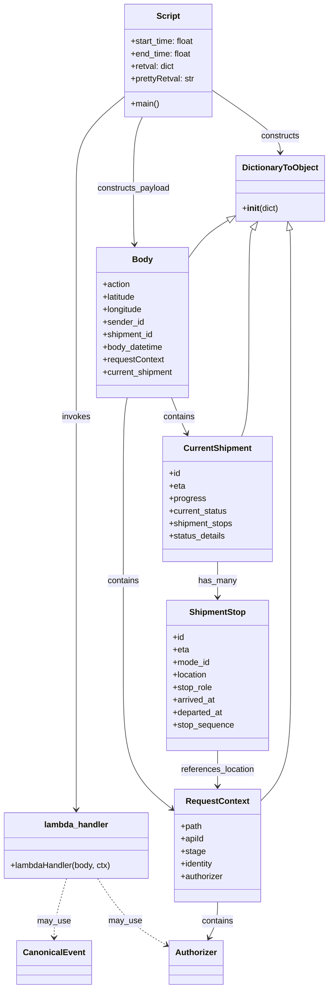

# Diagram: tools/ide_local_testing/localTest/test/byUrl/updateRouteTiming.py

> Auto-generated by Obscura crawlers

## Mermaid

### SVG

<svg id="container" width="631.00390625" xmlns="http://www.w3.org/2000/svg" class="classDiagram" height="1894" viewBox="0 0 631.00390625 1894" role="graphics-document document" aria-roledescription="class"><g><defs><marker id="container_class-aggregationStart" class="marker aggregation class" refX="18" refY="7" markerWidth="190" markerHeight="240" orient="auto"><path d="M 18,7 L9,13 L1,7 L9,1 Z"></path></marker></defs><defs><marker id="container_class-aggregationEnd" class="marker aggregation class" refX="1" refY="7" markerWidth="20" markerHeight="28" orient="auto"><path d="M 18,7 L9,13 L1,7 L9,1 Z"></path></marker></defs><defs><marker id="container_class-extensionStart" class="marker extension class" refX="18" refY="7" markerWidth="190" markerHeight="240" orient="auto"><path d="M 1,7 L18,13 V 1 Z"></path></marker></defs><defs><marker id="container_class-extensionEnd" class="marker extension class" refX="1" refY="7" markerWidth="20" markerHeight="28" orient="auto"><path d="M 1,1 V 13 L18,7 Z"></path></marker></defs><defs><marker id="container_class-compositionStart" class="marker composition class" refX="18" refY="7" markerWidth="190" markerHeight="240" orient="auto"><path d="M 18,7 L9,13 L1,7 L9,1 Z"></path></marker></defs><defs><marker id="container_class-compositionEnd" class="marker composition class" refX="1" refY="7" markerWidth="20" markerHeight="28" orient="auto"><path d="M 18,7 L9,13 L1,7 L9,1 Z"></path></marker></defs><defs><marker id="container_class-dependencyStart" class="marker dependency class" refX="6" refY="7" markerWidth="190" markerHeight="240" orient="auto"><path d="M 5,7 L9,13 L1,7 L9,1 Z"></path></marker></defs><defs><marker id="container_class-dependencyEnd" class="marker dependency class" refX="13" refY="7" markerWidth="20" markerHeight="28" orient="auto"><path d="M 18,7 L9,13 L14,7 L9,1 Z"></path></marker></defs><defs><marker id="container_class-lollipopStart" class="marker lollipop class" refX="13" refY="7" markerWidth="190" markerHeight="240" orient="auto"><circle stroke="black" fill="transparent" cx="7" cy="7" r="6"></circle></marker></defs><defs><marker id="container_class-lollipopEnd" class="marker lollipop class" refX="1" refY="7" markerWidth="190" markerHeight="240" orient="auto"><circle stroke="black" fill="transparent" cx="7" cy="7" r="6"></circle></marker></defs><g class="root"><g class="clusters"></g><g class="edgePaths"><path d="M241.875,184.788L226.236,197.49C210.598,210.192,179.32,235.596,163.682,264.965C148.043,294.333,148.043,327.667,148.043,359C148.043,390.333,148.043,419.667,148.043,462.5C148.043,505.333,148.043,561.667,148.043,620C148.043,678.333,148.043,738.667,148.043,795C148.043,851.333,148.043,903.667,148.043,956C148.043,1008.333,148.043,1060.667,148.043,1117C148.043,1173.333,148.043,1233.667,148.043,1294C148.043,1354.333,148.043,1414.667,148.043,1457.5C148.043,1500.333,148.043,1525.667,148.043,1538.333L148.043,1551" id="id_Script_lambda_handler_1" class="edge-thickness-normal edge-pattern-solid relation" style=";;;" data-edge="true" data-et="edge" data-id="id_Script_lambda_handler_1" data-points="W3sieCI6MjQxLjg3NSwieSI6MTg0Ljc4NzkwODYyNTQ0MzF9LHsieCI6MTQ4LjA0Mjk2ODc1LCJ5IjoyNjF9LHsieCI6MTQ4LjA0Mjk2ODc1LCJ5IjozNjF9LHsieCI6MTQ4LjA0Mjk2ODc1LCJ5Ijo0NDl9LHsieCI6MTQ4LjA0Mjk2ODc1LCJ5Ijo2MTh9LHsieCI6MTQ4LjA0Mjk2ODc1LCJ5Ijo3OTl9LHsieCI6MTQ4LjA0Mjk2ODc1LCJ5Ijo5NTZ9LHsieCI6MTQ4LjA0Mjk2ODc1LCJ5IjoxMTEzfSx7IngiOjE0OC4wNDI5Njg3NSwieSI6MTI5NH0seyJ4IjoxNDguMDQyOTY4NzUsInkiOjE0NzV9LHsieCI6MTQ4LjA0Mjk2ODc1LCJ5IjoxNTU3fV0=" marker-end="url(#container_class-dependencyEnd)"></path><path d="M411.258,173.322L432.848,187.935C454.439,202.548,497.62,231.774,519.21,251.554C540.801,271.333,540.801,281.667,540.801,286.833L540.801,292" id="id_Script_DictionaryToObject_2" class="edge-thickness-normal edge-pattern-solid relation" style=";;;" data-edge="true" data-et="edge" data-id="id_Script_DictionaryToObject_2" data-points="W3sieCI6NDExLjI1NzgxMjUsInkiOjE3My4zMjE1ODQ4NTg4NzI0M30seyJ4Ijo1NDAuODAwNzgxMjUsInkiOjI2MX0seyJ4Ijo1NDAuODAwNzgxMjUsInkiOjI5OH1d" marker-end="url(#container_class-dependencyEnd)"></path><path d="M276.619,224L273.767,230.167C270.915,236.333,265.212,248.667,262.36,271.5C259.508,294.333,259.508,327.667,259.508,359C259.508,390.333,259.508,419.667,259.829,437.505C260.15,455.343,260.792,461.687,261.113,464.859L261.434,468.03" id="id_Script_Body_3" class="edge-thickness-normal edge-pattern-solid relation" style=";;;" data-edge="true" data-et="edge" data-id="id_Script_Body_3" data-points="W3sieCI6Mjc2LjYxOTMxNTczMjc1ODY1LCJ5IjoyMjR9LHsieCI6MjU5LjUwNzgxMjUsInkiOjI2MX0seyJ4IjoyNTkuNTA3ODEyNSwieSI6MzYxfSx7IngiOjI1OS41MDc4MTI1LCJ5Ijo0NDl9LHsieCI6MjYyLjAzNzkxODM2MTY4NjM3LCJ5Ijo0NzR9XQ==" marker-end="url(#container_class-dependencyEnd)"></path><path d="M129.995,1683L126.08,1696.667C122.165,1710.333,114.334,1737.667,110.419,1756.5C106.504,1775.333,106.504,1785.667,106.504,1790.833L106.504,1796" id="id_lambda_handler_CanonicalEvent_4" class="edge-thickness-normal edge-pattern-dashed relation" style=";;;" data-edge="true" data-et="edge" data-id="id_lambda_handler_CanonicalEvent_4" data-points="W3sieCI6MTI5Ljk5NDk2MjI4NDQ4Mjc3LCJ5IjoxNjgzfSx7IngiOjEwNi41MDM5MDYyNSwieSI6MTc2NX0seyJ4IjoxMDYuNTAzOTA2MjUsInkiOjE4MDJ9XQ==" marker-end="url(#container_class-dependencyEnd)"></path><path d="M189.331,1683L198.287,1696.667C207.244,1710.333,225.157,1737.667,247.561,1759.131C269.965,1780.595,296.86,1796.19,310.307,1803.987L323.755,1811.785" id="id_lambda_handler_Authorizer_5" class="edge-thickness-normal edge-pattern-dashed relation" style=";;;" data-edge="true" data-et="edge" data-id="id_lambda_handler_Authorizer_5" data-points="W3sieCI6MTg5LjMzMDcxMTIwNjg5NjU1LCJ5IjoxNjgzfSx7IngiOjI0My4wNzAzMTI1LCJ5IjoxNzY1fSx7IngiOjMyOC45NDUzMTI1LCJ5IjoxODE0Ljc5NDU5ODMxNDEyMzV9XQ==" marker-end="url(#container_class-dependencyEnd)"></path><path d="M247.161,762L245.9,768.167C244.639,774.333,242.116,786.667,240.855,819C239.594,851.333,239.594,903.667,239.594,956C239.594,1008.333,239.594,1060.667,239.594,1117C239.594,1173.333,239.594,1233.667,239.594,1294C239.594,1354.333,239.594,1414.667,255.229,1457.363C270.864,1500.06,302.134,1525.12,317.769,1537.649L333.404,1550.179" id="id_Body_RequestContext_6" class="edge-thickness-normal edge-pattern-solid relation" style=";;;" data-edge="true" data-et="edge" data-id="id_Body_RequestContext_6" data-points="W3sieCI6MjQ3LjE2MDg3OTIyOTk3MjM4LCJ5Ijo3NjJ9LHsieCI6MjM5LjU5Mzc1LCJ5Ijo3OTl9LHsieCI6MjM5LjU5Mzc1LCJ5Ijo5NTZ9LHsieCI6MjM5LjU5Mzc1LCJ5IjoxMTEzfSx7IngiOjIzOS41OTM3NSwieSI6MTI5NH0seyJ4IjoyMzkuNTkzNzUsInkiOjE0NzV9LHsieCI6MzM4LjA4NTkzNzUsInkiOjE1NTMuOTMxNTM5OTcyNzk3M31d" marker-end="url(#container_class-dependencyEnd)"></path><path d="M420.527,1728L420.527,1734.167C420.527,1740.333,420.527,1752.667,417.773,1764.113C415.018,1775.56,409.509,1786.12,406.754,1791.4L403.999,1796.68" id="id_RequestContext_Authorizer_7" class="edge-thickness-normal edge-pattern-solid relation" style=";;;" data-edge="true" data-et="edge" data-id="id_RequestContext_Authorizer_7" data-points="W3sieCI6NDIwLjUyNzM0Mzc1LCJ5IjoxNzI4fSx7IngiOjQyMC41MjczNDM3NSwieSI6MTc2NX0seyJ4Ijo0MDEuMjI0MTg5MDgyMjc4NSwieSI6MTgwMn1d" marker-end="url(#container_class-dependencyEnd)"></path><path d="M332.411,762L334.8,768.167C337.19,774.333,341.969,786.667,346.831,798.095C351.693,809.523,356.638,820.046,359.111,825.308L361.584,830.57" id="id_Body_CurrentShipment_8" class="edge-thickness-normal edge-pattern-solid relation" style=";;;" data-edge="true" data-et="edge" data-id="id_Body_CurrentShipment_8" data-points="W3sieCI6MzMyLjQxMDcwNjU3ODAzODcsInkiOjc2Mn0seyJ4IjozNDYuNzQ4MDQ2ODc1LCJ5Ijo3OTl9LHsieCI6MzY0LjEzNTUyNDQ4MjQ4NDEsInkiOjgzNn1d" marker-end="url(#container_class-dependencyEnd)"></path><path d="M420.527,1076L420.527,1082.167C420.527,1088.333,420.527,1100.667,420.527,1112C420.527,1123.333,420.527,1133.667,420.527,1138.833L420.527,1144" id="id_CurrentShipment_ShipmentStop_9" class="edge-thickness-normal edge-pattern-solid relation" style=";;;" data-edge="true" data-et="edge" data-id="id_CurrentShipment_ShipmentStop_9" data-points="W3sieCI6NDIwLjUyNzM0Mzc1LCJ5IjoxMDc2fSx7IngiOjQyMC41MjczNDM3NSwieSI6MTExM30seyJ4Ijo0MjAuNTI3MzQzNzUsInkiOjExNTB9XQ==" marker-end="url(#container_class-dependencyEnd)"></path><path d="M420.527,1438L420.527,1444.167C420.527,1450.333,420.527,1462.667,420.527,1474C420.527,1485.333,420.527,1495.667,420.527,1500.833L420.527,1506" id="id_ShipmentStop_RequestContext_10" class="edge-thickness-normal edge-pattern-solid relation" style=";;;" data-edge="true" data-et="edge" data-id="id_ShipmentStop_RequestContext_10" data-points="W3sieCI6NDIwLjUyNzM0Mzc1LCJ5IjoxNDM4fSx7IngiOjQyMC41MjczNDM3NSwieSI6MTQ3NX0seyJ4Ijo0MjAuNTI3MzQzNzUsInkiOjE1MTJ9XQ==" marker-end="url(#container_class-dependencyEnd)"></path><path d="M558.942,440.821L559.252,442.184C559.562,443.547,560.181,446.274,560.491,475.804C560.801,505.333,560.801,561.667,560.801,620C560.801,678.333,560.801,738.667,560.801,795C560.801,851.333,560.801,903.667,560.801,956C560.801,1008.333,560.801,1060.667,560.801,1117C560.801,1173.333,560.801,1233.667,560.801,1294C560.801,1354.333,560.801,1414.667,551.162,1454.797C541.523,1494.927,522.246,1514.854,512.607,1524.817L502.969,1534.781" id="id_DictionaryToObject_RequestContext_11" class="edge-thickness-normal edge-pattern-solid relation" style=";;;" data-edge="true" data-et="edge" data-id="id_DictionaryToObject_RequestContext_11" data-points="W3sieCI6NTU1LjExODk2MzA2ODE4MTksInkiOjQyNH0seyJ4Ijo1NjAuODAwNzgxMjUsInkiOjQ0OX0seyJ4Ijo1NjAuODAwNzgxMjUsInkiOjYxOH0seyJ4Ijo1NjAuODAwNzgxMjUsInkiOjc5OX0seyJ4Ijo1NjAuODAwNzgxMjUsInkiOjk1Nn0seyJ4Ijo1NjAuODAwNzgxMjUsInkiOjExMTN9LHsieCI6NTYwLjgwMDc4MTI1LCJ5IjoxMjk0fSx7IngiOjU2MC44MDA3ODEyNSwieSI6MTQ3NX0seyJ4Ijo1MDIuOTY4NzUsInkiOjE1MzQuNzgwNzAxNzU0Mzg2fV0=" marker-start="url(#container_class-extensionStart)"></path><path d="M443.881,420.263L436.048,425.053C428.216,429.842,412.55,439.421,399.66,451.318C386.769,463.214,376.653,477.428,371.595,484.535L366.537,491.642" id="id_DictionaryToObject_Body_12" class="edge-thickness-normal edge-pattern-solid relation" style=";;;" data-edge="true" data-et="edge" data-id="id_DictionaryToObject_Body_12" data-points="W3sieCI6NDU4LjU5NzY1NjI1LCJ5Ijo0MTEuMjY0NTU4NTk0MDE1MDZ9LHsieCI6Mzk2Ljg4NDc2NTYyNSwieSI6NDQ5fSx7IngiOjM2Ni41MzcxMDkzNzUsInkiOjQ5MS42NDI0NDg4NDcwMjgzfV0=" marker-start="url(#container_class-extensionStart)"></path><path d="M488.016,438.242L486.79,440.035C485.565,441.828,483.115,445.414,481.889,475.374C480.664,505.333,480.664,561.667,480.664,620C480.664,678.333,480.664,738.667,478.302,775C475.94,811.333,471.216,823.667,468.854,829.833L466.492,836" id="id_DictionaryToObject_CurrentShipment_13" class="edge-thickness-normal edge-pattern-solid relation" style=";;;" data-edge="true" data-et="edge" data-id="id_DictionaryToObject_CurrentShipment_13" data-points="W3sieCI6NDk3Ljc0ODM1NzU5OTQzMTgsInkiOjQyNH0seyJ4Ijo0ODAuNjY0MDYyNSwieSI6NDQ5fSx7IngiOjQ4MC42NjQwNjI1LCJ5Ijo2MTh9LHsieCI6NDgwLjY2NDA2MjUsInkiOjc5OX0seyJ4Ijo0NjYuNDkxNzE0NzY5MTA4MywieSI6ODM2fV0=" marker-start="url(#container_class-extensionStart)"></path></g><g class="edgeLabels"><g class="edgeLabel" transform="translate(148.04296875, 799)"><g class="label" data-id="id_Script_lambda_handler_1" transform="translate(-27.5859375, -12)"><foreignObject width="55.171875" height="24">

invokes

</foreignObject></g></g><g class="edgeLabel" transform="translate(540.80078125, 261)"><g class="label" data-id="id_Script_DictionaryToObject_2" transform="translate(-37.84375, -12)"><foreignObject width="75.6875" height="24">

constructs

</foreignObject></g></g><g class="edgeLabel" transform="translate(259.5078125, 361)"><g class="label" data-id="id_Script_Body_3" transform="translate(-70.71875, -12)"><foreignObject width="141.4375" height="24">

constructs_payload

</foreignObject></g></g><g class="edgeLabel" transform="translate(106.50390625, 1765)"><g class="label" data-id="id_lambda_handler_CanonicalEvent_4" transform="translate(-31.5390625, -12)"><foreignObject width="63.078125" height="24">

may_use

</foreignObject></g></g><g class="edgeLabel" transform="translate(243.60099, 1765.30771)"><g class="label" data-id="id_lambda_handler_Authorizer_5" transform="translate(-31.5390625, -12)"><foreignObject width="63.078125" height="24">

may_use

</foreignObject></g></g><g class="edgeLabel" transform="translate(239.59375, 1113)"><g class="label" data-id="id_Body_RequestContext_6" transform="translate(-30.890625, -12)"><foreignObject width="61.78125" height="24">

contains

</foreignObject></g></g><g class="edgeLabel" transform="translate(420.52734375, 1765)"><g class="label" data-id="id_RequestContext_Authorizer_7" transform="translate(-30.890625, -12)"><foreignObject width="61.78125" height="24">

contains

</foreignObject></g></g><g class="edgeLabel" transform="translate(346.748046875, 799)"><g class="label" data-id="id_Body_CurrentShipment_8" transform="translate(-30.890625, -12)"><foreignObject width="61.78125" height="24">

contains

</foreignObject></g></g><g class="edgeLabel" transform="translate(420.52734375, 1113)"><g class="label" data-id="id_CurrentShipment_ShipmentStop_9" transform="translate(-36.4765625, -12)"><foreignObject width="72.953125" height="24">

has_many

</foreignObject></g></g><g class="edgeLabel" transform="translate(420.52734375, 1475)"><g class="label" data-id="id_ShipmentStop_RequestContext_10" transform="translate(-71.3203125, -12)"><foreignObject width="142.640625" height="24">

references_location

</foreignObject></g></g><g class="edgeLabel"><g class="label" data-id="id_DictionaryToObject_RequestContext_11" transform="translate(0, 0)"><foreignObject width="0" height="0">

</foreignObject></g></g><g class="edgeLabel"><g class="label" data-id="id_DictionaryToObject_Body_12" transform="translate(0, 0)"><foreignObject width="0" height="0">

</foreignObject></g></g><g class="edgeLabel"><g class="label" data-id="id_DictionaryToObject_CurrentShipment_13" transform="translate(0, 0)"><foreignObject width="0" height="0">

</foreignObject></g></g></g><g class="nodes"><g class="node default" id="classId-Script-0" transform="translate(326.56640625, 116)"><g class="basic label-container"><path d="M-84.69140625 -108 L84.69140625 -108 L84.69140625 108 L-84.69140625 108" stroke="none" stroke-width="0" fill="#ECECFF" style=""></path><path d="M-84.69140625 -108 C-43.9090164914825 -108, -3.1266267329649935 -108, 84.69140625 -108 M-84.69140625 -108 C-35.741222552758536 -108, 13.208961144482927 -108, 84.69140625 -108 M84.69140625 -108 C84.69140625 -46.86412492584156, 84.69140625 14.271750148316883, 84.69140625 108 M84.69140625 -108 C84.69140625 -51.039296344582866, 84.69140625 5.921407310834269, 84.69140625 108 M84.69140625 108 C19.281716171403573 108, -46.12797390719285 108, -84.69140625 108 M84.69140625 108 C44.766675221273935 108, 4.841944192547871 108, -84.69140625 108 M-84.69140625 108 C-84.69140625 30.161774719602718, -84.69140625 -47.676450560794564, -84.69140625 -108 M-84.69140625 108 C-84.69140625 27.413477117960497, -84.69140625 -53.173045764079006, -84.69140625 -108" stroke="#9370DB" stroke-width="1.3" fill="none" stroke-dasharray="0 0" style=""></path></g><g class="annotation-group text" transform="translate(0, -84)"></g><g class="label-group text" transform="translate(-21.7421875, -84)"><g class="label" style="font-weight: bolder" transform="translate(0,-12)"><foreignObject width="43.484375" height="24">

Script

</foreignObject></g></g><g class="members-group text" transform="translate(-72.69140625, -36)"><g class="label" style="" transform="translate(0,-12)"><foreignObject width="123.640625" height="24">

+start_time: float

</foreignObject></g><g class="label" style="" transform="translate(0,12)"><foreignObject width="117.515625" height="24">

+end_time: float

</foreignObject></g><g class="label" style="" transform="translate(0,36)"><foreignObject width="84.703125" height="24">

+retval: dict

</foreignObject></g><g class="label" style="" transform="translate(0,60)"><foreignObject width="123.625" height="24">

+prettyRetval: str

</foreignObject></g></g><g class="methods-group text" transform="translate(-72.69140625, 84)"><g class="label" style="" transform="translate(0,-12)"><foreignObject width="54.65625" height="24">

+main()

</foreignObject></g></g><g class="divider" style=""><path d="M-84.69140625 -60 C-46.09468426547659 -60, -7.497962280953175 -60, 84.69140625 -60 M-84.69140625 -60 C-49.992030033422935 -60, -15.29265381684587 -60, 84.69140625 -60" stroke="#9370DB" stroke-width="1.3" fill="none" stroke-dasharray="0 0" style=""></path></g><g class="divider" style=""><path d="M-84.69140625 60 C-31.965362245780554 60, 20.760681758438892 60, 84.69140625 60 M-84.69140625 60 C-18.479616350510128 60, 47.732173548979745 60, 84.69140625 60" stroke="#9370DB" stroke-width="1.3" fill="none" stroke-dasharray="0 0" style=""></path></g></g><g class="node default" id="classId-lambda_handler-1" transform="translate(148.04296875, 1620)"><g class="basic label-container"><path d="M-140.04296875 -63 L140.04296875 -63 L140.04296875 63 L-140.04296875 63" stroke="none" stroke-width="0" fill="#ECECFF" style=""></path><path d="M-140.04296875 -63 C-75.34738017392102 -63, -10.651791597842049 -63, 140.04296875 -63 M-140.04296875 -63 C-29.783452126878984 -63, 80.47606449624203 -63, 140.04296875 -63 M140.04296875 -63 C140.04296875 -15.503657903564068, 140.04296875 31.992684192871863, 140.04296875 63 M140.04296875 -63 C140.04296875 -21.533932018217655, 140.04296875 19.93213596356469, 140.04296875 63 M140.04296875 63 C36.810252793183665 63, -66.42246316363267 63, -140.04296875 63 M140.04296875 63 C42.659924749806194 63, -54.72311925038761 63, -140.04296875 63 M-140.04296875 63 C-140.04296875 30.690384776930834, -140.04296875 -1.6192304461383316, -140.04296875 -63 M-140.04296875 63 C-140.04296875 19.403607368370118, -140.04296875 -24.192785263259765, -140.04296875 -63" stroke="#9370DB" stroke-width="1.3" fill="none" stroke-dasharray="0 0" style=""></path></g><g class="annotation-group text" transform="translate(0, -39)"></g><g class="label-group text" transform="translate(-59.9765625, -39)"><g class="label" style="font-weight: bolder" transform="translate(0,-12)"><foreignObject width="119.953125" height="24">

lambda_handler

</foreignObject></g></g><g class="members-group text" transform="translate(-128.04296875, 9)"></g><g class="methods-group text" transform="translate(-128.04296875, 39)"><g class="label" style="" transform="translate(0,-12)"><foreignObject width="196.109375" height="24">

+lambdaHandler(body, ctx)

</foreignObject></g></g><g class="divider" style=""><path d="M-140.04296875 -15 C-44.96175112505783 -15, 50.11946649988434 -15, 140.04296875 -15 M-140.04296875 -15 C-73.7433738663828 -15, -7.443778982765593 -15, 140.04296875 -15" stroke="#9370DB" stroke-width="1.3" fill="none" stroke-dasharray="0 0" style=""></path></g><g class="divider" style=""><path d="M-140.04296875 9 C-49.28206733622194 9, 41.478834077556115 9, 140.04296875 9 M-140.04296875 9 C-31.849920885517406 9, 76.34312697896519 9, 140.04296875 9" stroke="#9370DB" stroke-width="1.3" fill="none" stroke-dasharray="0 0" style=""></path></g></g><g class="node default" id="classId-DictionaryToObject-2" transform="translate(540.80078125, 361)"><g class="basic label-container"><path d="M-82.203125 -63 L82.203125 -63 L82.203125 63 L-82.203125 63" stroke="none" stroke-width="0" fill="#ECECFF" style=""></path><path d="M-82.203125 -63 C-39.33160754310097 -63, 3.5399099137980556 -63, 82.203125 -63 M-82.203125 -63 C-41.95910953939874 -63, -1.7150940787974776 -63, 82.203125 -63 M82.203125 -63 C82.203125 -34.54992506405665, 82.203125 -6.099850128113303, 82.203125 63 M82.203125 -63 C82.203125 -36.328317242491494, 82.203125 -9.656634484982987, 82.203125 63 M82.203125 63 C27.390975865392576 63, -27.421173269214847 63, -82.203125 63 M82.203125 63 C28.679258757638543 63, -24.844607484722914 63, -82.203125 63 M-82.203125 63 C-82.203125 16.86157437256272, -82.203125 -29.276851254874558, -82.203125 -63 M-82.203125 63 C-82.203125 30.08687250303869, -82.203125 -2.8262549939226176, -82.203125 -63" stroke="#9370DB" stroke-width="1.3" fill="none" stroke-dasharray="0 0" style=""></path></g><g class="annotation-group text" transform="translate(0, -39)"></g><g class="label-group text" transform="translate(-70.109375, -39)"><g class="label" style="font-weight: bolder" transform="translate(0,-12)"><foreignObject width="140.21875" height="24">

DictionaryToObject

</foreignObject></g></g><g class="members-group text" transform="translate(-70.203125, 9)"></g><g class="methods-group text" transform="translate(-70.203125, 39)"><g class="label" style="" transform="translate(0,-12)"><foreignObject width="70.296875" height="24">

+<strong>init</strong>(dict)

</foreignObject></g></g><g class="divider" style=""><path d="M-82.203125 -15 C-47.0038586853794 -15, -11.804592370758797 -15, 82.203125 -15 M-82.203125 -15 C-42.829229220822135 -15, -3.455333441644271 -15, 82.203125 -15" stroke="#9370DB" stroke-width="1.3" fill="none" stroke-dasharray="0 0" style=""></path></g><g class="divider" style=""><path d="M-82.203125 9 C-47.074888318992436 9, -11.946651637984871 9, 82.203125 9 M-82.203125 9 C-33.380974574647055 9, 15.44117585070589 9, 82.203125 9" stroke="#9370DB" stroke-width="1.3" fill="none" stroke-dasharray="0 0" style=""></path></g></g><g class="node default" id="classId-CanonicalEvent-3" transform="translate(106.50390625, 1844)"><g class="basic label-container"><path d="M-67.7109375 -42 L67.7109375 -42 L67.7109375 42 L-67.7109375 42" stroke="none" stroke-width="0" fill="#ECECFF" style=""></path><path d="M-67.7109375 -42 C-32.08261704515382 -42, 3.545703409692365 -42, 67.7109375 -42 M-67.7109375 -42 C-17.258837487709442 -42, 33.193262524581115 -42, 67.7109375 -42 M67.7109375 -42 C67.7109375 -21.465077190915917, 67.7109375 -0.9301543818318336, 67.7109375 42 M67.7109375 -42 C67.7109375 -17.29372662054725, 67.7109375 7.412546758905499, 67.7109375 42 M67.7109375 42 C26.017869343061477 42, -15.675198813877046 42, -67.7109375 42 M67.7109375 42 C21.400906783475868 42, -24.909123933048264 42, -67.7109375 42 M-67.7109375 42 C-67.7109375 18.64857785976083, -67.7109375 -4.702844280478338, -67.7109375 -42 M-67.7109375 42 C-67.7109375 15.354915240220546, -67.7109375 -11.290169519558908, -67.7109375 -42" stroke="#9370DB" stroke-width="1.3" fill="none" stroke-dasharray="0 0" style=""></path></g><g class="annotation-group text" transform="translate(0, -18)"></g><g class="label-group text" transform="translate(-55.7109375, -18)"><g class="label" style="font-weight: bolder" transform="translate(0,-12)"><foreignObject width="111.421875" height="24">

CanonicalEvent

</foreignObject></g></g><g class="members-group text" transform="translate(-55.7109375, 30)"></g><g class="methods-group text" transform="translate(-55.7109375, 60)"></g><g class="divider" style=""><path d="M-67.7109375 6 C-16.85950563220024 6, 33.99192623559952 6, 67.7109375 6 M-67.7109375 6 C-17.5442520422721 6, 32.6224334154558 6, 67.7109375 6" stroke="#9370DB" stroke-width="1.3" fill="none" stroke-dasharray="0 0" style=""></path></g><g class="divider" style=""><path d="M-67.7109375 24 C-18.537123601621715 24, 30.63669029675657 24, 67.7109375 24 M-67.7109375 24 C-35.11944898789927 24, -2.5279604757985368 24, 67.7109375 24" stroke="#9370DB" stroke-width="1.3" fill="none" stroke-dasharray="0 0" style=""></path></g></g><g class="node default" id="classId-Authorizer-4" transform="translate(379.3125, 1844)"><g class="basic label-container"><path d="M-50.3671875 -42 L50.3671875 -42 L50.3671875 42 L-50.3671875 42" stroke="none" stroke-width="0" fill="#ECECFF" style=""></path><path d="M-50.3671875 -42 C-25.066230466838956 -42, 0.2347265663220881 -42, 50.3671875 -42 M-50.3671875 -42 C-19.982389835686288 -42, 10.402407828627425 -42, 50.3671875 -42 M50.3671875 -42 C50.3671875 -16.39733586505644, 50.3671875 9.205328269887119, 50.3671875 42 M50.3671875 -42 C50.3671875 -19.678463290924984, 50.3671875 2.6430734181500313, 50.3671875 42 M50.3671875 42 C25.644718786055797 42, 0.9222500721115949 42, -50.3671875 42 M50.3671875 42 C26.384249497340914 42, 2.4013114946818277 42, -50.3671875 42 M-50.3671875 42 C-50.3671875 13.157129643002325, -50.3671875 -15.68574071399535, -50.3671875 -42 M-50.3671875 42 C-50.3671875 18.599032719994813, -50.3671875 -4.801934560010373, -50.3671875 -42" stroke="#9370DB" stroke-width="1.3" fill="none" stroke-dasharray="0 0" style=""></path></g><g class="annotation-group text" transform="translate(0, -18)"></g><g class="label-group text" transform="translate(-38.3671875, -18)"><g class="label" style="font-weight: bolder" transform="translate(0,-12)"><foreignObject width="76.734375" height="24">

Authorizer

</foreignObject></g></g><g class="members-group text" transform="translate(-38.3671875, 30)"></g><g class="methods-group text" transform="translate(-38.3671875, 60)"></g><g class="divider" style=""><path d="M-50.3671875 6 C-24.453027141450004 6, 1.4611332170999916 6, 50.3671875 6 M-50.3671875 6 C-13.477532956787186 6, 23.412121586425627 6, 50.3671875 6" stroke="#9370DB" stroke-width="1.3" fill="none" stroke-dasharray="0 0" style=""></path></g><g class="divider" style=""><path d="M-50.3671875 24 C-23.78796098722609 24, 2.7912655255478214 24, 50.3671875 24 M-50.3671875 24 C-30.085139394488056 24, -9.803091288976113 24, 50.3671875 24" stroke="#9370DB" stroke-width="1.3" fill="none" stroke-dasharray="0 0" style=""></path></g></g><g class="node default" id="classId-Body-5" transform="translate(276.611328125, 618)"><g class="basic label-container"><path d="M-89.92578125 -144 L89.92578125 -144 L89.92578125 144 L-89.92578125 144" stroke="none" stroke-width="0" fill="#ECECFF" style=""></path><path d="M-89.92578125 -144 C-50.42574322815194 -144, -10.925705206303874 -144, 89.92578125 -144 M-89.92578125 -144 C-48.59276928182706 -144, -7.25975731365412 -144, 89.92578125 -144 M89.92578125 -144 C89.92578125 -57.84397539057127, 89.92578125 28.312049218857453, 89.92578125 144 M89.92578125 -144 C89.92578125 -78.97589884109154, 89.92578125 -13.95179768218307, 89.92578125 144 M89.92578125 144 C42.54313096196247 144, -4.839519326075063 144, -89.92578125 144 M89.92578125 144 C24.34464609639214 144, -41.23648905721572 144, -89.92578125 144 M-89.92578125 144 C-89.92578125 34.82705450549152, -89.92578125 -74.34589098901697, -89.92578125 -144 M-89.92578125 144 C-89.92578125 70.04792309660259, -89.92578125 -3.904153806794824, -89.92578125 -144" stroke="#9370DB" stroke-width="1.3" fill="none" stroke-dasharray="0 0" style=""></path></g><g class="annotation-group text" transform="translate(0, -120)"></g><g class="label-group text" transform="translate(-18.5546875, -120)"><g class="label" style="font-weight: bolder" transform="translate(0,-12)"><foreignObject width="37.109375" height="24">

Body

</foreignObject></g></g><g class="members-group text" transform="translate(-77.92578125, -72)"><g class="label" style="" transform="translate(0,-12)"><foreignObject width="53.109375" height="24">

+action

</foreignObject></g><g class="label" style="" transform="translate(0,12)"><foreignObject width="64.96875" height="24">

+latitude

</foreignObject></g><g class="label" style="" transform="translate(0,36)"><foreignObject width="77.53125" height="24">

+longitude

</foreignObject></g><g class="label" style="" transform="translate(0,60)"><foreignObject width="79.140625" height="24">

+sender_id

</foreignObject></g><g class="label" style="" transform="translate(0,84)"><foreignObject width="98.84375" height="24">

+shipment_id

</foreignObject></g><g class="label" style="" transform="translate(0,108)"><foreignObject width="117.046875" height="24">

+body_datetime

</foreignObject></g><g class="label" style="" transform="translate(0,132)"><foreignObject width="118.265625" height="24">

+requestContext

</foreignObject></g><g class="label" style="" transform="translate(0,156)"><foreignObject width="137.296875" height="24">

+current_shipment

</foreignObject></g></g><g class="methods-group text" transform="translate(-77.92578125, 144)"></g><g class="divider" style=""><path d="M-89.92578125 -96 C-52.3488963481291 -96, -14.772011446258205 -96, 89.92578125 -96 M-89.92578125 -96 C-27.49739406854087 -96, 34.93099311291826 -96, 89.92578125 -96" stroke="#9370DB" stroke-width="1.3" fill="none" stroke-dasharray="0 0" style=""></path></g><g class="divider" style=""><path d="M-89.92578125 120 C-25.755603238004426 120, 38.41457477399115 120, 89.92578125 120 M-89.92578125 120 C-46.6505412026291 120, -3.3753011552581995 120, 89.92578125 120" stroke="#9370DB" stroke-width="1.3" fill="none" stroke-dasharray="0 0" style=""></path></g></g><g class="node default" id="classId-RequestContext-6" transform="translate(420.52734375, 1620)"><g class="basic label-container"><path d="M-82.44140625 -108 L82.44140625 -108 L82.44140625 108 L-82.44140625 108" stroke="none" stroke-width="0" fill="#ECECFF" style=""></path><path d="M-82.44140625 -108 C-34.00198799215208 -108, 14.437430265695838 -108, 82.44140625 -108 M-82.44140625 -108 C-28.210315161914032 -108, 26.020775926171936 -108, 82.44140625 -108 M82.44140625 -108 C82.44140625 -59.640726445649214, 82.44140625 -11.281452891298429, 82.44140625 108 M82.44140625 -108 C82.44140625 -26.481880592764156, 82.44140625 55.03623881447169, 82.44140625 108 M82.44140625 108 C17.663691167269775 108, -47.11402391546045 108, -82.44140625 108 M82.44140625 108 C40.28668435328906 108, -1.8680375434218774 108, -82.44140625 108 M-82.44140625 108 C-82.44140625 46.630705690907696, -82.44140625 -14.738588618184608, -82.44140625 -108 M-82.44140625 108 C-82.44140625 59.69562509363661, -82.44140625 11.391250187273215, -82.44140625 -108" stroke="#9370DB" stroke-width="1.3" fill="none" stroke-dasharray="0 0" style=""></path></g><g class="annotation-group text" transform="translate(0, -84)"></g><g class="label-group text" transform="translate(-58.1484375, -84)"><g class="label" style="font-weight: bolder" transform="translate(0,-12)"><foreignObject width="116.296875" height="24">

RequestContext

</foreignObject></g></g><g class="members-group text" transform="translate(-70.44140625, -36)"><g class="label" style="" transform="translate(0,-12)"><foreignObject width="41.1875" height="24">

+path

</foreignObject></g><g class="label" style="" transform="translate(0,12)"><foreignObject width="44.765625" height="24">

+apiId

</foreignObject></g><g class="label" style="" transform="translate(0,36)"><foreignObject width="46.453125" height="24">

+stage

</foreignObject></g><g class="label" style="" transform="translate(0,60)"><foreignObject width="64.03125" height="24">

+identity

</foreignObject></g><g class="label" style="" transform="translate(0,84)"><foreignObject width="82.734375" height="24">

+authorizer

</foreignObject></g></g><g class="methods-group text" transform="translate(-70.44140625, 108)"></g><g class="divider" style=""><path d="M-82.44140625 -60 C-35.86286985114761 -60, 10.715666547704785 -60, 82.44140625 -60 M-82.44140625 -60 C-37.42670724479359 -60, 7.5879917604128195 -60, 82.44140625 -60" stroke="#9370DB" stroke-width="1.3" fill="none" stroke-dasharray="0 0" style=""></path></g><g class="divider" style=""><path d="M-82.44140625 84 C-21.629902815098824 84, 39.18160061980235 84, 82.44140625 84 M-82.44140625 84 C-34.157763197950985 84, 14.12587985409803 84, 82.44140625 84" stroke="#9370DB" stroke-width="1.3" fill="none" stroke-dasharray="0 0" style=""></path></g></g><g class="node default" id="classId-CurrentShipment-7" transform="translate(420.52734375, 956)"><g class="basic label-container"><path d="M-105.2734375 -120 L105.2734375 -120 L105.2734375 120 L-105.2734375 120" stroke="none" stroke-width="0" fill="#ECECFF" style=""></path><path d="M-105.2734375 -120 C-23.40469000555916 -120, 58.46405748888168 -120, 105.2734375 -120 M-105.2734375 -120 C-43.242680000378556 -120, 18.78807749924289 -120, 105.2734375 -120 M105.2734375 -120 C105.2734375 -52.09132604957237, 105.2734375 15.817347900855253, 105.2734375 120 M105.2734375 -120 C105.2734375 -66.11560569568725, 105.2734375 -12.2312113913745, 105.2734375 120 M105.2734375 120 C43.04854321830326 120, -19.176351063393483 120, -105.2734375 120 M105.2734375 120 C33.726364836686955 120, -37.82070782662609 120, -105.2734375 120 M-105.2734375 120 C-105.2734375 32.50531443358713, -105.2734375 -54.98937113282574, -105.2734375 -120 M-105.2734375 120 C-105.2734375 51.488326433859214, -105.2734375 -17.02334713228157, -105.2734375 -120" stroke="#9370DB" stroke-width="1.3" fill="none" stroke-dasharray="0 0" style=""></path></g><g class="annotation-group text" transform="translate(0, -96)"></g><g class="label-group text" transform="translate(-62.453125, -96)"><g class="label" style="font-weight: bolder" transform="translate(0,-12)"><foreignObject width="124.90625" height="24">

CurrentShipment

</foreignObject></g></g><g class="members-group text" transform="translate(-93.2734375, -48)"><g class="label" style="" transform="translate(0,-12)"><foreignObject width="22.078125" height="24">

+id

</foreignObject></g><g class="label" style="" transform="translate(0,12)"><foreignObject width="31.078125" height="24">

+eta

</foreignObject></g><g class="label" style="" transform="translate(0,36)"><foreignObject width="70.0625" height="24">

+progress

</foreignObject></g><g class="label" style="" transform="translate(0,60)"><foreignObject width="113.25" height="24">

+current_status

</foreignObject></g><g class="label" style="" transform="translate(0,84)"><foreignObject width="124.09375" height="24">

+shipment_stops

</foreignObject></g><g class="label" style="" transform="translate(0,108)"><foreignObject width="109.40625" height="24">

+status_details

</foreignObject></g></g><g class="methods-group text" transform="translate(-93.2734375, 120)"></g><g class="divider" style=""><path d="M-105.2734375 -72 C-60.0450635317158 -72, -14.816689563431595 -72, 105.2734375 -72 M-105.2734375 -72 C-55.326373954962065 -72, -5.3793104099241305 -72, 105.2734375 -72" stroke="#9370DB" stroke-width="1.3" fill="none" stroke-dasharray="0 0" style=""></path></g><g class="divider" style=""><path d="M-105.2734375 96 C-59.16505942606618 96, -13.056681352132358 96, 105.2734375 96 M-105.2734375 96 C-31.815019013924896 96, 41.64339947215021 96, 105.2734375 96" stroke="#9370DB" stroke-width="1.3" fill="none" stroke-dasharray="0 0" style=""></path></g></g><g class="node default" id="classId-ShipmentStop-8" transform="translate(420.52734375, 1294)"><g class="basic label-container"><path d="M-96.5703125 -144 L96.5703125 -144 L96.5703125 144 L-96.5703125 144" stroke="none" stroke-width="0" fill="#ECECFF" style=""></path><path d="M-96.5703125 -144 C-55.44137096022368 -144, -14.312429420447359 -144, 96.5703125 -144 M-96.5703125 -144 C-27.083259751779764 -144, 42.40379299644047 -144, 96.5703125 -144 M96.5703125 -144 C96.5703125 -49.38096355189832, 96.5703125 45.23807289620336, 96.5703125 144 M96.5703125 -144 C96.5703125 -71.1070196247113, 96.5703125 1.7859607505774022, 96.5703125 144 M96.5703125 144 C54.48112070593362 144, 12.39192891186724 144, -96.5703125 144 M96.5703125 144 C29.76544934748749 144, -37.03941380502502 144, -96.5703125 144 M-96.5703125 144 C-96.5703125 50.13624993262245, -96.5703125 -43.727500134755104, -96.5703125 -144 M-96.5703125 144 C-96.5703125 84.08570852987404, -96.5703125 24.171417059748094, -96.5703125 -144" stroke="#9370DB" stroke-width="1.3" fill="none" stroke-dasharray="0 0" style=""></path></g><g class="annotation-group text" transform="translate(0, -120)"></g><g class="label-group text" transform="translate(-52.078125, -120)"><g class="label" style="font-weight: bolder" transform="translate(0,-12)"><foreignObject width="104.15625" height="24">

ShipmentStop

</foreignObject></g></g><g class="members-group text" transform="translate(-84.5703125, -72)"><g class="label" style="" transform="translate(0,-12)"><foreignObject width="22.078125" height="24">

+id

</foreignObject></g><g class="label" style="" transform="translate(0,12)"><foreignObject width="31.078125" height="24">

+eta

</foreignObject></g><g class="label" style="" transform="translate(0,36)"><foreignObject width="71.421875" height="24">

+mode_id

</foreignObject></g><g class="label" style="" transform="translate(0,60)"><foreignObject width="67.140625" height="24">

+location

</foreignObject></g><g class="label" style="" transform="translate(0,84)"><foreignObject width="76.21875" height="24">

+stop_role

</foreignObject></g><g class="label" style="" transform="translate(0,108)"><foreignObject width="81.890625" height="24">

+arrived_at

</foreignObject></g><g class="label" style="" transform="translate(0,132)"><foreignObject width="96.8125" height="24">

+departed_at

</foreignObject></g><g class="label" style="" transform="translate(0,156)"><foreignObject width="117.0625" height="24">

+stop_sequence

</foreignObject></g></g><g class="methods-group text" transform="translate(-84.5703125, 144)"></g><g class="divider" style=""><path d="M-96.5703125 -96 C-20.124467921344092 -96, 56.321376657311816 -96, 96.5703125 -96 M-96.5703125 -96 C-39.715100497373435 -96, 17.14011150525313 -96, 96.5703125 -96" stroke="#9370DB" stroke-width="1.3" fill="none" stroke-dasharray="0 0" style=""></path></g><g class="divider" style=""><path d="M-96.5703125 120 C-32.19202793323916 120, 32.18625663352168 120, 96.5703125 120 M-96.5703125 120 C-51.06103830800613 120, -5.551764116012265 120, 96.5703125 120" stroke="#9370DB" stroke-width="1.3" fill="none" stroke-dasharray="0 0" style=""></path></g></g></g></g></g></svg>
