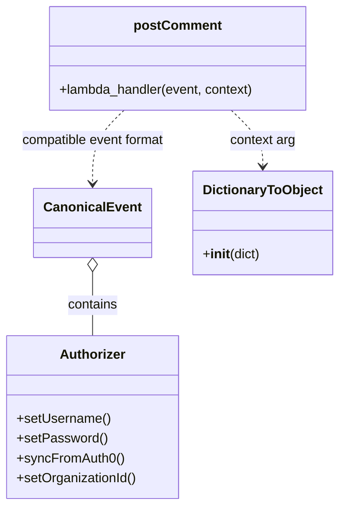

# Diagram: tools/ide_local_testing/localTest/test/comment/addComment.py


> Auto-generated by Obscura crawlers

## Diagram 1

```mermaid
flowchart LR
Start([Start]) --> CreateEvent[Create event dict with body, headers, pathParameters, requestContext]
CreateEvent --> DTO[DictionaryToObject({function_name: "addComment"})]
CreateEvent --> Invoke[Invoke postComment.lambda_handler(event, DTO)]
DTO --> Invoke
Invoke --> Print[Print retval]
Print --> End([End])
```

> SVG rendering failed for this diagram.

## Diagram 2



### SVG

<svg id="container" width="402.65234375" xmlns="http://www.w3.org/2000/svg" class="classDiagram" height="614" viewBox="0 0 402.65234375 614" role="graphics-document document" aria-roledescription="class"><style>#container{font-family:"trebuchet ms",verdana,arial,sans-serif;font-size:16px;fill:#333;}@keyframes edge-animation-frame{from{stroke-dashoffset:0;}}@keyframes dash{to{stroke-dashoffset:0;}}#container .edge-animation-slow{stroke-dasharray:9,5!important;stroke-dashoffset:900;animation:dash 50s linear infinite;stroke-linecap:round;}#container .edge-animation-fast{stroke-dasharray:9,5!important;stroke-dashoffset:900;animation:dash 20s linear infinite;stroke-linecap:round;}#container .error-icon{fill:#552222;}#container .error-text{fill:#552222;stroke:#552222;}#container .edge-thickness-normal{stroke-width:1px;}#container .edge-thickness-thick{stroke-width:3.5px;}#container .edge-pattern-solid{stroke-dasharray:0;}#container .edge-thickness-invisible{stroke-width:0;fill:none;}#container .edge-pattern-dashed{stroke-dasharray:3;}#container .edge-pattern-dotted{stroke-dasharray:2;}#container .marker{fill:#333333;stroke:#333333;}#container .marker.cross{stroke:#333333;}#container svg{font-family:"trebuchet ms",verdana,arial,sans-serif;font-size:16px;}#container p{margin:0;}#container g.classGroup text{fill:#9370DB;stroke:none;font-family:"trebuchet ms",verdana,arial,sans-serif;font-size:10px;}#container g.classGroup text .title{font-weight:bolder;}#container .nodeLabel,#container .edgeLabel{color:#131300;}#container .edgeLabel .label rect{fill:#ECECFF;}#container .label text{fill:#131300;}#container .labelBkg{background:#ECECFF;}#container .edgeLabel .label span{background:#ECECFF;}#container .classTitle{font-weight:bolder;}#container .node rect,#container .node circle,#container .node ellipse,#container .node polygon,#container .node path{fill:#ECECFF;stroke:#9370DB;stroke-width:1px;}#container .divider{stroke:#9370DB;stroke-width:1;}#container g.clickable{cursor:pointer;}#container g.classGroup rect{fill:#ECECFF;stroke:#9370DB;}#container g.classGroup line{stroke:#9370DB;stroke-width:1;}#container .classLabel .box{stroke:none;stroke-width:0;fill:#ECECFF;opacity:0.5;}#container .classLabel .label{fill:#9370DB;font-size:10px;}#container .relation{stroke:#333333;stroke-width:1;fill:none;}#container .dashed-line{stroke-dasharray:3;}#container .dotted-line{stroke-dasharray:1 2;}#container #compositionStart,#container .composition{fill:#333333!important;stroke:#333333!important;stroke-width:1;}#container #compositionEnd,#container .composition{fill:#333333!important;stroke:#333333!important;stroke-width:1;}#container #dependencyStart,#container .dependency{fill:#333333!important;stroke:#333333!important;stroke-width:1;}#container #dependencyStart,#container .dependency{fill:#333333!important;stroke:#333333!important;stroke-width:1;}#container #extensionStart,#container .extension{fill:transparent!important;stroke:#333333!important;stroke-width:1;}#container #extensionEnd,#container .extension{fill:transparent!important;stroke:#333333!important;stroke-width:1;}#container #aggregationStart,#container .aggregation{fill:transparent!important;stroke:#333333!important;stroke-width:1;}#container #aggregationEnd,#container .aggregation{fill:transparent!important;stroke:#333333!important;stroke-width:1;}#container #lollipopStart,#container .lollipop{fill:#ECECFF!important;stroke:#333333!important;stroke-width:1;}#container #lollipopEnd,#container .lollipop{fill:#ECECFF!important;stroke:#333333!important;stroke-width:1;}#container .edgeTerminals{font-size:11px;line-height:initial;}#container .classTitleText{text-anchor:middle;font-size:18px;fill:#333;}#container .label-icon{display:inline-block;height:1em;overflow:visible;vertical-align:-0.125em;}#container .node .label-icon path{fill:currentColor;stroke:revert;stroke-width:revert;}#container :root{--mermaid-font-family:"trebuchet ms",verdana,arial,sans-serif;}</style><g><defs><marker id="container_class-aggregationStart" class="marker aggregation class" refX="18" refY="7" markerWidth="190" markerHeight="240" orient="auto"><path d="M 18,7 L9,13 L1,7 L9,1 Z"></path></marker></defs><defs><marker id="container_class-aggregationEnd" class="marker aggregation class" refX="1" refY="7" markerWidth="20" markerHeight="28" orient="auto"><path d="M 18,7 L9,13 L1,7 L9,1 Z"></path></marker></defs><defs><marker id="container_class-extensionStart" class="marker extension class" refX="18" refY="7" markerWidth="190" markerHeight="240" orient="auto"><path d="M 1,7 L18,13 V 1 Z"></path></marker></defs><defs><marker id="container_class-extensionEnd" class="marker extension class" refX="1" refY="7" markerWidth="20" markerHeight="28" orient="auto"><path d="M 1,1 V 13 L18,7 Z"></path></marker></defs><defs><marker id="container_class-compositionStart" class="marker composition class" refX="18" refY="7" markerWidth="190" markerHeight="240" orient="auto"><path d="M 18,7 L9,13 L1,7 L9,1 Z"></path></marker></defs><defs><marker id="container_class-compositionEnd" class="marker composition class" refX="1" refY="7" markerWidth="20" markerHeight="28" orient="auto"><path d="M 18,7 L9,13 L1,7 L9,1 Z"></path></marker></defs><defs><marker id="container_class-dependencyStart" class="marker dependency class" refX="6" refY="7" markerWidth="190" markerHeight="240" orient="auto"><path d="M 5,7 L9,13 L1,7 L9,1 Z"></path></marker></defs><defs><marker id="container_class-dependencyEnd" class="marker dependency class" refX="13" refY="7" markerWidth="20" markerHeight="28" orient="auto"><path d="M 18,7 L9,13 L14,7 L9,1 Z"></path></marker></defs><defs><marker id="container_class-lollipopStart" class="marker lollipop class" refX="13" refY="7" markerWidth="190" markerHeight="240" orient="auto"><circle stroke="black" fill="transparent" cx="7" cy="7" r="6"></circle></marker></defs><defs><marker id="container_class-lollipopEnd" class="marker lollipop class" refX="1" refY="7" markerWidth="190" markerHeight="240" orient="auto"><circle stroke="black" fill="transparent" cx="7" cy="7" r="6"></circle></marker></defs><g class="root"><g class="clusters"></g><g class="edgePaths"><path d="M112.535,330.25L112.535,337.042C112.535,343.833,112.535,357.417,112.535,370.375C112.535,383.333,112.535,395.667,112.535,401.833L112.535,408" id="id_CanonicalEvent_Authorizer_1" class="edge-thickness-normal edge-pattern-solid relation" style=";;;" data-edge="true" data-et="edge" data-id="id_CanonicalEvent_Authorizer_1" data-points="W3sieCI6MTEyLjUzNTE1NjI1LCJ5IjozMTN9LHsieCI6MTEyLjUzNTE1NjI1LCJ5IjozNzF9LHsieCI6MTEyLjUzNTE1NjI1LCJ5Ijo0MDh9XQ==" marker-start="url(#container_class-aggregationStart)"></path><path d="M275.465,134L281.629,140.167C287.793,146.333,300.121,158.667,306.285,170C312.449,181.333,312.449,191.667,312.449,196.833L312.449,202" id="id_postComment_DictionaryToObject_2" class="edge-thickness-normal edge-pattern-dashed relation" style=";;;" data-edge="true" data-et="edge" data-id="id_postComment_DictionaryToObject_2" data-points="W3sieCI6Mjc1LjQ2NTExNzE4NzUsInkiOjEzNH0seyJ4IjozMTIuNDQ5MjE4NzUsInkiOjE3MX0seyJ4IjozMTIuNDQ5MjE4NzUsInkiOjIwOH1d" marker-end="url(#container_class-dependencyEnd)"></path><path d="M149.519,134L143.355,140.167C137.191,146.333,124.863,158.667,118.699,173.5C112.535,188.333,112.535,205.667,112.535,214.333L112.535,223" id="id_postComment_CanonicalEvent_3" class="edge-thickness-normal edge-pattern-dashed relation" style=";;;" data-edge="true" data-et="edge" data-id="id_postComment_CanonicalEvent_3" data-points="W3sieCI6MTQ5LjUxOTI1NzgxMjUsInkiOjEzNH0seyJ4IjoxMTIuNTM1MTU2MjUsInkiOjE3MX0seyJ4IjoxMTIuNTM1MTU2MjUsInkiOjIyOX1d" marker-end="url(#container_class-dependencyEnd)"></path></g><g class="edgeLabels"><g class="edgeLabel" transform="translate(112.53515625, 371)"><g class="label" data-id="id_CanonicalEvent_Authorizer_1" transform="translate(-30.890625, -12)"><foreignObject width="61.78125" height="24"><div xmlns="http://www.w3.org/1999/xhtml" class="labelBkg" style="display: table-cell; white-space: nowrap; line-height: 1.5; max-width: 200px; text-align: center;"><span class="edgeLabel"><p>contains</p></span></div></foreignObject></g></g><g class="edgeLabel" transform="translate(312.44921875, 171)"><g class="label" data-id="id_postComment_DictionaryToObject_2" transform="translate(-40.453125, -12)"><foreignObject width="80.90625" height="24"><div xmlns="http://www.w3.org/1999/xhtml" class="labelBkg" style="display: table-cell; white-space: nowrap; line-height: 1.5; max-width: 200px; text-align: center;"><span class="edgeLabel"><p>context arg</p></span></div></foreignObject></g></g><g class="edgeLabel" transform="translate(112.53515625, 171)"><g class="label" data-id="id_postComment_CanonicalEvent_3" transform="translate(-89.640625, -12)"><foreignObject width="179.28125" height="24"><div xmlns="http://www.w3.org/1999/xhtml" class="labelBkg" style="display: table-cell; white-space: nowrap; line-height: 1.5; max-width: 200px; text-align: center;"><span class="edgeLabel"><p>compatible event format</p></span></div></foreignObject></g></g></g><g class="nodes"><g class="node default" id="classId-CanonicalEvent-0" transform="translate(112.53515625, 271)"><g class="basic label-container"><path d="M-67.7109375 -42 L67.7109375 -42 L67.7109375 42 L-67.7109375 42" stroke="none" stroke-width="0" fill="#ECECFF" style=""></path><path d="M-67.7109375 -42 C-25.711895563800766 -42, 16.287146372398468 -42, 67.7109375 -42 M-67.7109375 -42 C-13.611058871450602 -42, 40.488819757098796 -42, 67.7109375 -42 M67.7109375 -42 C67.7109375 -13.931961002561973, 67.7109375 14.136077994876054, 67.7109375 42 M67.7109375 -42 C67.7109375 -22.04902844864196, 67.7109375 -2.098056897283918, 67.7109375 42 M67.7109375 42 C39.59667772150543 42, 11.482417943010859 42, -67.7109375 42 M67.7109375 42 C23.488977224694075 42, -20.73298305061185 42, -67.7109375 42 M-67.7109375 42 C-67.7109375 10.271839042946091, -67.7109375 -21.456321914107818, -67.7109375 -42 M-67.7109375 42 C-67.7109375 16.8522907576567, -67.7109375 -8.2954184846866, -67.7109375 -42" stroke="#9370DB" stroke-width="1.3" fill="none" stroke-dasharray="0 0" style=""></path></g><g class="annotation-group text" transform="translate(0, -18)"></g><g class="label-group text" transform="translate(-55.7109375, -18)"><g class="label" style="font-weight: bolder" transform="translate(0,-12)"><foreignObject width="111.421875" height="24"><div xmlns="http://www.w3.org/1999/xhtml" style="display: table-cell; white-space: nowrap; line-height: 1.5; max-width: 161px; text-align: center;"><span class="nodeLabel markdown-node-label" style=""><p>CanonicalEvent</p></span></div></foreignObject></g></g><g class="members-group text" transform="translate(-55.7109375, 30)"></g><g class="methods-group text" transform="translate(-55.7109375, 60)"></g><g class="divider" style=""><path d="M-67.7109375 6 C-34.98451951660921 6, -2.258101533218422 6, 67.7109375 6 M-67.7109375 6 C-37.20607219791485 6, -6.701206895829706 6, 67.7109375 6" stroke="#9370DB" stroke-width="1.3" fill="none" stroke-dasharray="0 0" style=""></path></g><g class="divider" style=""><path d="M-67.7109375 24 C-19.004944664742624 24, 29.701048170514753 24, 67.7109375 24 M-67.7109375 24 C-22.369011481550167 24, 22.972914536899665 24, 67.7109375 24" stroke="#9370DB" stroke-width="1.3" fill="none" stroke-dasharray="0 0" style=""></path></g></g><g class="node default" id="classId-Authorizer-1" transform="translate(112.53515625, 507)"><g class="basic label-container"><path d="M-104.53515625 -99 L104.53515625 -99 L104.53515625 99 L-104.53515625 99" stroke="none" stroke-width="0" fill="#ECECFF" style=""></path><path d="M-104.53515625 -99 C-61.706691787408744 -99, -18.878227324817487 -99, 104.53515625 -99 M-104.53515625 -99 C-55.71292232738921 -99, -6.890688404778416 -99, 104.53515625 -99 M104.53515625 -99 C104.53515625 -44.30506904008053, 104.53515625 10.389861919838935, 104.53515625 99 M104.53515625 -99 C104.53515625 -57.87835193802164, 104.53515625 -16.756703876043275, 104.53515625 99 M104.53515625 99 C40.57341728977091 99, -23.388321670458183 99, -104.53515625 99 M104.53515625 99 C41.127797430999344 99, -22.279561388001312 99, -104.53515625 99 M-104.53515625 99 C-104.53515625 20.959622147870277, -104.53515625 -57.080755704259445, -104.53515625 -99 M-104.53515625 99 C-104.53515625 54.32901451320604, -104.53515625 9.65802902641208, -104.53515625 -99" stroke="#9370DB" stroke-width="1.3" fill="none" stroke-dasharray="0 0" style=""></path></g><g class="annotation-group text" transform="translate(0, -75)"></g><g class="label-group text" transform="translate(-38.3671875, -75)"><g class="label" style="font-weight: bolder" transform="translate(0,-12)"><foreignObject width="76.734375" height="24"><div xmlns="http://www.w3.org/1999/xhtml" style="display: table-cell; white-space: nowrap; line-height: 1.5; max-width: 126px; text-align: center;"><span class="nodeLabel markdown-node-label" style=""><p>Authorizer</p></span></div></foreignObject></g></g><g class="members-group text" transform="translate(-92.53515625, -27)"></g><g class="methods-group text" transform="translate(-92.53515625, 3)"><g class="label" style="" transform="translate(0,-12)"><foreignObject width="113.71875" height="24"><div xmlns="http://www.w3.org/1999/xhtml" style="display: table-cell; white-space: nowrap; line-height: 1.5; max-width: 171px; text-align: center;"><span class="nodeLabel markdown-node-label" style=""><p>+setUsername()</p></span></div></foreignObject></g><g class="label" style="" transform="translate(0,12)"><foreignObject width="108.046875" height="24"><div xmlns="http://www.w3.org/1999/xhtml" style="display: table-cell; white-space: nowrap; line-height: 1.5; max-width: 165px; text-align: center;"><span class="nodeLabel markdown-node-label" style=""><p>+setPassword()</p></span></div></foreignObject></g><g class="label" style="" transform="translate(0,36)"><foreignObject width="129.0625" height="24"><div xmlns="http://www.w3.org/1999/xhtml" style="display: table-cell; white-space: nowrap; line-height: 1.5; max-width: 186px; text-align: center;"><span class="nodeLabel markdown-node-label" style=""><p>+syncFromAuth0()</p></span></div></foreignObject></g><g class="label" style="" transform="translate(0,60)"><foreignObject width="146.703125" height="24"><div xmlns="http://www.w3.org/1999/xhtml" style="display: table-cell; white-space: nowrap; line-height: 1.5; max-width: 204px; text-align: center;"><span class="nodeLabel markdown-node-label" style=""><p>+setOrganizationId()</p></span></div></foreignObject></g></g><g class="divider" style=""><path d="M-104.53515625 -51 C-35.8837572317793 -51, 32.7676417864414 -51, 104.53515625 -51 M-104.53515625 -51 C-39.480091080867155 -51, 25.57497408826569 -51, 104.53515625 -51" stroke="#9370DB" stroke-width="1.3" fill="none" stroke-dasharray="0 0" style=""></path></g><g class="divider" style=""><path d="M-104.53515625 -27 C-46.12997207840652 -27, 12.275212093186965 -27, 104.53515625 -27 M-104.53515625 -27 C-24.29386404016276 -27, 55.94742816967448 -27, 104.53515625 -27" stroke="#9370DB" stroke-width="1.3" fill="none" stroke-dasharray="0 0" style=""></path></g></g><g class="node default" id="classId-DictionaryToObject-2" transform="translate(312.44921875, 271)"><g class="basic label-container"><path d="M-82.203125 -63 L82.203125 -63 L82.203125 63 L-82.203125 63" stroke="none" stroke-width="0" fill="#ECECFF" style=""></path><path d="M-82.203125 -63 C-20.576298834447655 -63, 41.05052733110469 -63, 82.203125 -63 M-82.203125 -63 C-46.67104222715588 -63, -11.13895945431176 -63, 82.203125 -63 M82.203125 -63 C82.203125 -33.77469474447611, 82.203125 -4.549389488952208, 82.203125 63 M82.203125 -63 C82.203125 -27.773723693017565, 82.203125 7.452552613964869, 82.203125 63 M82.203125 63 C46.25573191249567 63, 10.308338824991338 63, -82.203125 63 M82.203125 63 C48.32354358069924 63, 14.443962161398474 63, -82.203125 63 M-82.203125 63 C-82.203125 22.64580340309997, -82.203125 -17.708393193800063, -82.203125 -63 M-82.203125 63 C-82.203125 27.408411392399245, -82.203125 -8.18317721520151, -82.203125 -63" stroke="#9370DB" stroke-width="1.3" fill="none" stroke-dasharray="0 0" style=""></path></g><g class="annotation-group text" transform="translate(0, -39)"></g><g class="label-group text" transform="translate(-70.109375, -39)"><g class="label" style="font-weight: bolder" transform="translate(0,-12)"><foreignObject width="140.21875" height="24"><div xmlns="http://www.w3.org/1999/xhtml" style="display: table-cell; white-space: nowrap; line-height: 1.5; max-width: 188px; text-align: center;"><span class="nodeLabel markdown-node-label" style=""><p>DictionaryToObject</p></span></div></foreignObject></g></g><g class="members-group text" transform="translate(-70.203125, 9)"></g><g class="methods-group text" transform="translate(-70.203125, 39)"><g class="label" style="" transform="translate(0,-12)"><foreignObject width="70.296875" height="24"><div xmlns="http://www.w3.org/1999/xhtml" style="display: table-cell; white-space: nowrap; line-height: 1.5; max-width: 159px; text-align: center;"><span class="nodeLabel markdown-node-label" style=""><p>+<strong>init</strong>(dict)</p></span></div></foreignObject></g></g><g class="divider" style=""><path d="M-82.203125 -15 C-39.83141355869172 -15, 2.5402978826165565 -15, 82.203125 -15 M-82.203125 -15 C-43.55092506158214 -15, -4.898725123164283 -15, 82.203125 -15" stroke="#9370DB" stroke-width="1.3" fill="none" stroke-dasharray="0 0" style=""></path></g><g class="divider" style=""><path d="M-82.203125 9 C-42.79750678826484 9, -3.3918885765296807 9, 82.203125 9 M-82.203125 9 C-49.08868323471251 9, -15.974241469425024 9, 82.203125 9" stroke="#9370DB" stroke-width="1.3" fill="none" stroke-dasharray="0 0" style=""></path></g></g><g class="node default" id="classId-postComment-3" transform="translate(212.4921875, 71)"><g class="basic label-container"><path d="M-157.671875 -63 L157.671875 -63 L157.671875 63 L-157.671875 63" stroke="none" stroke-width="0" fill="#ECECFF" style=""></path><path d="M-157.671875 -63 C-80.43892960336527 -63, -3.205984206730534 -63, 157.671875 -63 M-157.671875 -63 C-87.00022514161763 -63, -16.328575283235267 -63, 157.671875 -63 M157.671875 -63 C157.671875 -29.44546099522951, 157.671875 4.10907800954098, 157.671875 63 M157.671875 -63 C157.671875 -16.68658872247601, 157.671875 29.62682255504798, 157.671875 63 M157.671875 63 C70.37729928729048 63, -16.917276425419033 63, -157.671875 63 M157.671875 63 C77.7251808865374 63, -2.2215132269251967 63, -157.671875 63 M-157.671875 63 C-157.671875 36.533738486998324, -157.671875 10.067476973996648, -157.671875 -63 M-157.671875 63 C-157.671875 28.37205636291791, -157.671875 -6.255887274164181, -157.671875 -63" stroke="#9370DB" stroke-width="1.3" fill="none" stroke-dasharray="0 0" style=""></path></g><g class="annotation-group text" transform="translate(0, -39)"></g><g class="label-group text" transform="translate(-51.15625, -39)"><g class="label" style="font-weight: bolder" transform="translate(0,-12)"><foreignObject width="102.3125" height="24"><div xmlns="http://www.w3.org/1999/xhtml" style="display: table-cell; white-space: nowrap; line-height: 1.5; max-width: 152px; text-align: center;"><span class="nodeLabel markdown-node-label" style=""><p>postComment</p></span></div></foreignObject></g></g><g class="members-group text" transform="translate(-145.671875, 9)"></g><g class="methods-group text" transform="translate(-145.671875, 39)"><g class="label" style="" transform="translate(0,-12)"><foreignObject width="240.1875" height="24"><div xmlns="http://www.w3.org/1999/xhtml" style="display: table-cell; white-space: nowrap; line-height: 1.5; max-width: 298px; text-align: center;"><span class="nodeLabel markdown-node-label" style=""><p>+lambda_handler(event, context)</p></span></div></foreignObject></g></g><g class="divider" style=""><path d="M-157.671875 -15 C-78.46335887929483 -15, 0.7451572414103396 -15, 157.671875 -15 M-157.671875 -15 C-68.91781594486368 -15, 19.836243110272648 -15, 157.671875 -15" stroke="#9370DB" stroke-width="1.3" fill="none" stroke-dasharray="0 0" style=""></path></g><g class="divider" style=""><path d="M-157.671875 9 C-35.322314541329305 9, 87.02724591734139 9, 157.671875 9 M-157.671875 9 C-71.7534193431375 9, 14.165036313725011 9, 157.671875 9" stroke="#9370DB" stroke-width="1.3" fill="none" stroke-dasharray="0 0" style=""></path></g></g></g></g></g></svg>
