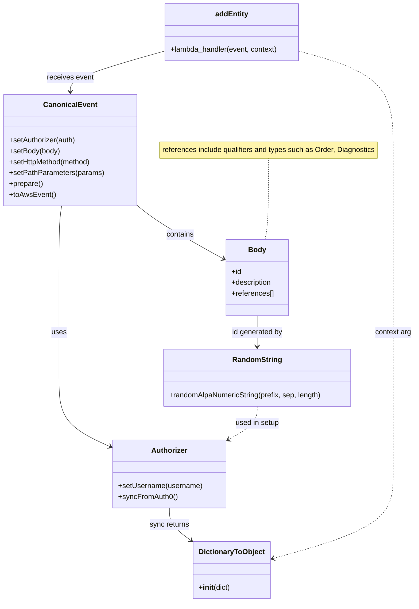

# Diagram: tools/ide_local_testing/localTest/test/entity/entity/addEntity.py

> Auto-generated by Obscura crawlers

## Mermaid

### SVG

<svg id="container" width="916.0078125" xmlns="http://www.w3.org/2000/svg" class="classDiagram" height="1328" viewBox="0 0 916.0078125 1328" role="graphics-document document" aria-roledescription="class"><g><defs><marker id="container_class-aggregationStart" class="marker aggregation class" refX="18" refY="7" markerWidth="190" markerHeight="240" orient="auto"><path d="M 18,7 L9,13 L1,7 L9,1 Z"></path></marker></defs><defs><marker id="container_class-aggregationEnd" class="marker aggregation class" refX="1" refY="7" markerWidth="20" markerHeight="28" orient="auto"><path d="M 18,7 L9,13 L1,7 L9,1 Z"></path></marker></defs><defs><marker id="container_class-extensionStart" class="marker extension class" refX="18" refY="7" markerWidth="190" markerHeight="240" orient="auto"><path d="M 1,7 L18,13 V 1 Z"></path></marker></defs><defs><marker id="container_class-extensionEnd" class="marker extension class" refX="1" refY="7" markerWidth="20" markerHeight="28" orient="auto"><path d="M 1,1 V 13 L18,7 Z"></path></marker></defs><defs><marker id="container_class-compositionStart" class="marker composition class" refX="18" refY="7" markerWidth="190" markerHeight="240" orient="auto"><path d="M 18,7 L9,13 L1,7 L9,1 Z"></path></marker></defs><defs><marker id="container_class-compositionEnd" class="marker composition class" refX="1" refY="7" markerWidth="20" markerHeight="28" orient="auto"><path d="M 18,7 L9,13 L1,7 L9,1 Z"></path></marker></defs><defs><marker id="container_class-dependencyStart" class="marker dependency class" refX="6" refY="7" markerWidth="190" markerHeight="240" orient="auto"><path d="M 5,7 L9,13 L1,7 L9,1 Z"></path></marker></defs><defs><marker id="container_class-dependencyEnd" class="marker dependency class" refX="13" refY="7" markerWidth="20" markerHeight="28" orient="auto"><path d="M 18,7 L9,13 L14,7 L9,1 Z"></path></marker></defs><defs><marker id="container_class-lollipopStart" class="marker lollipop class" refX="13" refY="7" markerWidth="190" markerHeight="240" orient="auto"><circle stroke="black" fill="transparent" cx="7" cy="7" r="6"></circle></marker></defs><defs><marker id="container_class-lollipopEnd" class="marker lollipop class" refX="1" refY="7" markerWidth="190" markerHeight="240" orient="auto"><circle stroke="black" fill="transparent" cx="7" cy="7" r="6"></circle></marker></defs><g class="root"><g class="clusters"></g><g class="edgePaths"><path d="M588.977,349L588.977,372.667C588.977,396.333,588.977,443.667,587.68,473.5C586.383,503.333,583.789,515.667,582.493,521.833L581.196,528" id="edgeNote1" class="edge-thickness-normal edge-pattern-dotted relation" style="fill: none;;;fill: none" data-edge="true" data-et="edge" data-id="edgeNote1" data-points="W3sieCI6NTg4Ljk3NjU2MjUsInkiOjM0OX0seyJ4Ijo1ODguOTc2NTYyNSwieSI6NDkxfSx7IngiOjU4MS4xOTU3NjQ0NjI4MSwieSI6NTI4fV0="></path><path d="M359.9,112.832L325.2,122.526C290.5,132.221,221.1,151.611,186.399,166.472C151.699,181.333,151.699,191.667,151.699,196.833L151.699,202" id="id_addEntity_CanonicalEvent_1" class="edge-thickness-normal edge-pattern-solid relation" style=";;;" data-edge="true" data-et="edge" data-id="id_addEntity_CanonicalEvent_1" data-points="W3sieCI6MzU5LjkwMDM5MDYyNSwieSI6MTEyLjgzMTUwNjIyODg4OTE3fSx7IngiOjE1MS42OTkyMTg3NSwieSI6MTcxfSx7IngiOjE1MS42OTkyMTg3NSwieSI6MjA4fV0=" marker-end="url(#container_class-dependencyEnd)"></path><path d="M132.138,454L131.157,460.167C130.177,466.333,128.215,478.667,127.235,505C126.254,531.333,126.254,571.667,126.254,612C126.254,652.333,126.254,692.667,126.254,729.5C126.254,766.333,126.254,799.667,126.254,833C126.254,866.333,126.254,899.667,145.336,925.089C164.419,950.512,202.583,968.024,221.666,976.78L240.748,985.537" id="id_CanonicalEvent_Authorizer_2" class="edge-thickness-normal edge-pattern-solid relation" style=";;;" data-edge="true" data-et="edge" data-id="id_CanonicalEvent_Authorizer_2" data-points="W3sieCI6MTMyLjEzODEzNDc2NTYyNSwieSI6NDU0fSx7IngiOjEyNi4yNTM5MDYyNSwieSI6NDkxfSx7IngiOjEyNi4yNTM5MDYyNSwieSI6NjEyfSx7IngiOjEyNi4yNTM5MDYyNSwieSI6NzMzfSx7IngiOjEyNi4yNTM5MDYyNSwieSI6ODMzfSx7IngiOjEyNi4yNTM5MDYyNSwieSI6OTMzfSx7IngiOjI0Ni4yMDExNzE4NzUsInkiOjk4OC4wMzg4MTcwMDU1NDUzfV0=" marker-end="url(#container_class-dependencyEnd)"></path><path d="M295.398,450.01L303.647,456.841C311.896,463.673,328.395,477.337,360.834,497.556C393.274,517.775,441.655,544.55,465.845,557.938L490.035,571.326" id="id_CanonicalEvent_Body_3" class="edge-thickness-normal edge-pattern-solid relation" style=";;;" data-edge="true" data-et="edge" data-id="id_CanonicalEvent_Body_3" data-points="W3sieCI6Mjk1LjM5ODQzNzUsInkiOjQ1MC4wMDk2NTQ3NTQwODE4fSx7IngiOjM0NC44OTI1NzgxMjUsInkiOjQ5MX0seyJ4Ijo0OTUuMjg1MTU2MjUsInkiOjU3NC4yMzA5Mzg5NjAwMDY1fV0=" marker-end="url(#container_class-dependencyEnd)"></path><path d="M563.531,696L563.531,702.167C563.531,708.333,563.531,720.667,563.531,732C563.531,743.333,563.531,753.667,563.531,758.833L563.531,764" id="id_Body_RandomString_4" class="edge-thickness-normal edge-pattern-solid relation" style=";;;" data-edge="true" data-et="edge" data-id="id_Body_RandomString_4" data-points="W3sieCI6NTYzLjUzMTI1LCJ5Ijo2OTZ9LHsieCI6NTYzLjUzMTI1LCJ5Ijo3MzN9LHsieCI6NTYzLjUzMTI1LCJ5Ijo3NzB9XQ==" marker-end="url(#container_class-dependencyEnd)"></path><path d="M370.338,1120L370.338,1126.167C370.338,1132.333,370.338,1144.667,379.04,1157.081C387.742,1169.495,405.146,1181.99,413.848,1188.237L422.55,1194.485" id="id_Authorizer_DictionaryToObject_5" class="edge-thickness-normal edge-pattern-solid relation" style=";;;" data-edge="true" data-et="edge" data-id="id_Authorizer_DictionaryToObject_5" data-points="W3sieCI6MzcwLjMzNzg5MDYyNSwieSI6MTEyMH0seyJ4IjozNzAuMzM3ODkwNjI1LCJ5IjoxMTU3fSx7IngiOjQyNy40MjM4MjgxMjUsInkiOjExOTcuOTgzNzkwNDUzNzU1fV0=" marker-end="url(#container_class-dependencyEnd)"></path><path d="M563.531,896L563.531,902.167C563.531,908.333,563.531,920.667,552.887,933.004C542.243,945.342,520.954,957.683,510.31,963.854L499.665,970.025" id="id_RandomString_Authorizer_6" class="edge-thickness-normal edge-pattern-dashed relation" style=";;;" data-edge="true" data-et="edge" data-id="id_RandomString_Authorizer_6" data-points="W3sieCI6NTYzLjUzMTI1LCJ5Ijo4OTZ9LHsieCI6NTYzLjUzMTI1LCJ5Ijo5MzN9LHsieCI6NDk0LjQ3NDYwOTM3NSwieSI6OTczLjAzNDIxMTE5MTQyN31d" marker-end="url(#container_class-dependencyEnd)"></path><path d="M659.354,112.832L694.054,122.526C728.754,132.221,798.154,151.611,832.854,187.972C867.555,224.333,867.555,277.667,867.555,331C867.555,384.333,867.555,437.667,867.555,484.5C867.555,531.333,867.555,571.667,867.555,612C867.555,652.333,867.555,692.667,867.555,729.5C867.555,766.333,867.555,799.667,867.555,833C867.555,866.333,867.555,899.667,867.555,935C867.555,970.333,867.555,1007.667,867.555,1045C867.555,1082.333,867.555,1119.667,822.564,1150.903C777.573,1182.14,687.591,1207.279,642.6,1219.849L597.609,1232.419" id="id_addEntity_DictionaryToObject_7" class="edge-thickness-normal edge-pattern-dashed relation" style=";;;" data-edge="true" data-et="edge" data-id="id_addEntity_DictionaryToObject_7" data-points="W3sieCI6NjU5LjM1MzUxNTYyNSwieSI6MTEyLjgzMTUwNjIyODg4OTE3fSx7IngiOjg2Ny41NTQ2ODc1LCJ5IjoxNzF9LHsieCI6ODY3LjU1NDY4NzUsInkiOjMzMX0seyJ4Ijo4NjcuNTU0Njg3NSwieSI6NDkxfSx7IngiOjg2Ny41NTQ2ODc1LCJ5Ijo2MTJ9LHsieCI6ODY3LjU1NDY4NzUsInkiOjczM30seyJ4Ijo4NjcuNTU0Njg3NSwieSI6ODMzfSx7IngiOjg2Ny41NTQ2ODc1LCJ5Ijo5MzN9LHsieCI6ODY3LjU1NDY4NzUsInkiOjEwNDV9LHsieCI6ODY3LjU1NDY4NzUsInkiOjExNTd9LHsieCI6NTkxLjgzMDA3ODEyNSwieSI6MTIzNC4wMzM1OTcyNTg1MjQ5fV0=" marker-end="url(#container_class-dependencyEnd)"></path></g><g class="edgeLabels"><g class="edgeLabel"><g class="label" data-id="edgeNote1" transform="translate(0, 0)"><foreignObject width="0" height="0">

</foreignObject></g></g><g class="edgeLabel" transform="translate(151.69921875, 171)"><g class="label" data-id="id_addEntity_CanonicalEvent_1" transform="translate(-51.78125, -12)"><foreignObject width="103.5625" height="24">

receives event

</foreignObject></g></g><g class="edgeLabel" transform="translate(126.25390625, 733)"><g class="label" data-id="id_CanonicalEvent_Authorizer_2" transform="translate(-16.4921875, -12)"><foreignObject width="32.984375" height="24">

uses

</foreignObject></g></g><g class="edgeLabel" transform="translate(391.97499, 517.05656)"><g class="label" data-id="id_CanonicalEvent_Body_3" transform="translate(-30.890625, -12)"><foreignObject width="61.78125" height="24">

contains

</foreignObject></g></g><g class="edgeLabel" transform="translate(563.53125, 733)"><g class="label" data-id="id_Body_RandomString_4" transform="translate(-56.453125, -12)"><foreignObject width="112.90625" height="24">

id generated by

</foreignObject></g></g><g class="edgeLabel" transform="translate(370.337890625, 1157)"><g class="label" data-id="id_Authorizer_DictionaryToObject_5" transform="translate(-44.4375, -12)"><foreignObject width="88.875" height="24">

sync returns

</foreignObject></g></g><g class="edgeLabel" transform="translate(563.53125, 933)"><g class="label" data-id="id_RandomString_Authorizer_6" transform="translate(-49.1171875, -12)"><foreignObject width="98.234375" height="24">

used in setup

</foreignObject></g></g><g class="edgeLabel" transform="translate(867.5546875, 733)"><g class="label" data-id="id_addEntity_DictionaryToObject_7" transform="translate(-40.453125, -12)"><foreignObject width="80.90625" height="24">

context arg

</foreignObject></g></g></g><g class="nodes"><g class="node default" id="classId-addEntity-0" transform="translate(509.626953125, 71)"><g class="basic label-container"><path d="M-149.7265625 -63 L149.7265625 -63 L149.7265625 63 L-149.7265625 63" stroke="none" stroke-width="0" fill="#ECECFF" style=""></path><path d="M-149.7265625 -63 C-68.36333358547917 -63, 12.999895329041664 -63, 149.7265625 -63 M-149.7265625 -63 C-84.79883590321784 -63, -19.87110930643567 -63, 149.7265625 -63 M149.7265625 -63 C149.7265625 -28.15253814119861, 149.7265625 6.6949237176027765, 149.7265625 63 M149.7265625 -63 C149.7265625 -17.68645506886014, 149.7265625 27.627089862279718, 149.7265625 63 M149.7265625 63 C89.57723682213927 63, 29.427911144278553 63, -149.7265625 63 M149.7265625 63 C55.46003477949262 63, -38.80649294101477 63, -149.7265625 63 M-149.7265625 63 C-149.7265625 20.08511830312591, -149.7265625 -22.82976339374818, -149.7265625 -63 M-149.7265625 63 C-149.7265625 18.541878938507253, -149.7265625 -25.916242122985494, -149.7265625 -63" stroke="#9370DB" stroke-width="1.3" fill="none" stroke-dasharray="0 0" style=""></path></g><g class="annotation-group text" transform="translate(0, -39)"></g><g class="label-group text" transform="translate(-35.265625, -39)"><g class="label" style="font-weight: bolder" transform="translate(0,-12)"><foreignObject width="70.53125" height="24">

addEntity

</foreignObject></g></g><g class="members-group text" transform="translate(-137.7265625, 9)"></g><g class="methods-group text" transform="translate(-137.7265625, 39)"><g class="label" style="" transform="translate(0,-12)"><foreignObject width="240.1875" height="24">

+lambda_handler(event, context)

</foreignObject></g></g><g class="divider" style=""><path d="M-149.7265625 -15 C-71.1036868428835 -15, 7.51918881423299 -15, 149.7265625 -15 M-149.7265625 -15 C-38.87636943800803 -15, 71.97382362398395 -15, 149.7265625 -15" stroke="#9370DB" stroke-width="1.3" fill="none" stroke-dasharray="0 0" style=""></path></g><g class="divider" style=""><path d="M-149.7265625 9 C-31.39776403359511 9, 86.93103443280978 9, 149.7265625 9 M-149.7265625 9 C-45.83825939240745 9, 58.0500437151851 9, 149.7265625 9" stroke="#9370DB" stroke-width="1.3" fill="none" stroke-dasharray="0 0" style=""></path></g></g><g class="node default" id="classId-DictionaryToObject-1" transform="translate(509.626953125, 1257)"><g class="basic label-container"><path d="M-82.203125 -63 L82.203125 -63 L82.203125 63 L-82.203125 63" stroke="none" stroke-width="0" fill="#ECECFF" style=""></path><path d="M-82.203125 -63 C-37.80480195567717 -63, 6.593521088645659 -63, 82.203125 -63 M-82.203125 -63 C-36.2304317141656 -63, 9.742261571668806 -63, 82.203125 -63 M82.203125 -63 C82.203125 -34.80562781236836, 82.203125 -6.611255624736707, 82.203125 63 M82.203125 -63 C82.203125 -27.29737425413586, 82.203125 8.40525149172828, 82.203125 63 M82.203125 63 C26.0290624911905 63, -30.145000017618997 63, -82.203125 63 M82.203125 63 C34.80135890908323 63, -12.600407181833546 63, -82.203125 63 M-82.203125 63 C-82.203125 20.745372210284252, -82.203125 -21.509255579431496, -82.203125 -63 M-82.203125 63 C-82.203125 20.388185015444115, -82.203125 -22.22362996911177, -82.203125 -63" stroke="#9370DB" stroke-width="1.3" fill="none" stroke-dasharray="0 0" style=""></path></g><g class="annotation-group text" transform="translate(0, -39)"></g><g class="label-group text" transform="translate(-70.109375, -39)"><g class="label" style="font-weight: bolder" transform="translate(0,-12)"><foreignObject width="140.21875" height="24">

DictionaryToObject

</foreignObject></g></g><g class="members-group text" transform="translate(-70.203125, 9)"></g><g class="methods-group text" transform="translate(-70.203125, 39)"><g class="label" style="" transform="translate(0,-12)"><foreignObject width="70.296875" height="24">

+<strong>init</strong>(dict)

</foreignObject></g></g><g class="divider" style=""><path d="M-82.203125 -15 C-27.906521598819964 -15, 26.390081802360072 -15, 82.203125 -15 M-82.203125 -15 C-33.9544055153804 -15, 14.294313969239198 -15, 82.203125 -15" stroke="#9370DB" stroke-width="1.3" fill="none" stroke-dasharray="0 0" style=""></path></g><g class="divider" style=""><path d="M-82.203125 9 C-28.972398055792937 9, 24.258328888414127 9, 82.203125 9 M-82.203125 9 C-32.36067411513619 9, 17.481776769727617 9, 82.203125 9" stroke="#9370DB" stroke-width="1.3" fill="none" stroke-dasharray="0 0" style=""></path></g></g><g class="node default" id="classId-CanonicalEvent-2" transform="translate(151.69921875, 331)"><g class="basic label-container"><path d="M-143.69921875 -123 L143.69921875 -123 L143.69921875 123 L-143.69921875 123" stroke="none" stroke-width="0" fill="#ECECFF" style=""></path><path d="M-143.69921875 -123 C-65.04751515533545 -123, 13.604188439329107 -123, 143.69921875 -123 M-143.69921875 -123 C-42.709278197200064 -123, 58.28066235559987 -123, 143.69921875 -123 M143.69921875 -123 C143.69921875 -35.900532229992066, 143.69921875 51.19893554001587, 143.69921875 123 M143.69921875 -123 C143.69921875 -55.38244090242466, 143.69921875 12.235118195150676, 143.69921875 123 M143.69921875 123 C38.853714496155916 123, -65.99178975768817 123, -143.69921875 123 M143.69921875 123 C33.85103975402396 123, -75.99713924195208 123, -143.69921875 123 M-143.69921875 123 C-143.69921875 57.71816023358245, -143.69921875 -7.563679532835096, -143.69921875 -123 M-143.69921875 123 C-143.69921875 61.48284210909901, -143.69921875 -0.03431578180197903, -143.69921875 -123" stroke="#9370DB" stroke-width="1.3" fill="none" stroke-dasharray="0 0" style=""></path></g><g class="annotation-group text" transform="translate(0, -99)"></g><g class="label-group text" transform="translate(-55.7109375, -99)"><g class="label" style="font-weight: bolder" transform="translate(0,-12)"><foreignObject width="111.421875" height="24">

CanonicalEvent

</foreignObject></g></g><g class="members-group text" transform="translate(-131.69921875, -51)"></g><g class="methods-group text" transform="translate(-131.69921875, -21)"><g class="label" style="" transform="translate(0,-12)"><foreignObject width="148.9375" height="24">

+setAuthorizer(auth)

</foreignObject></g><g class="label" style="" transform="translate(0,12)"><foreignObject width="113.125" height="24">

+setBody(body)

</foreignObject></g><g class="label" style="" transform="translate(0,36)"><foreignObject width="184" height="24">

+setHttpMethod(method)

</foreignObject></g><g class="label" style="" transform="translate(0,60)"><foreignObject width="207.6875" height="24">

+setPathParameters(params)

</foreignObject></g><g class="label" style="" transform="translate(0,84)"><foreignObject width="74.75" height="24">

+prepare()

</foreignObject></g><g class="label" style="" transform="translate(0,108)"><foreignObject width="101.1875" height="24">

+toAwsEvent()

</foreignObject></g></g><g class="divider" style=""><path d="M-143.69921875 -75 C-39.26760585494952 -75, 65.16400704010096 -75, 143.69921875 -75 M-143.69921875 -75 C-53.490851337521505 -75, 36.71751607495699 -75, 143.69921875 -75" stroke="#9370DB" stroke-width="1.3" fill="none" stroke-dasharray="0 0" style=""></path></g><g class="divider" style=""><path d="M-143.69921875 -51 C-31.380843381906075 -51, 80.93753198618785 -51, 143.69921875 -51 M-143.69921875 -51 C-66.2152868877119 -51, 11.268644974576205 -51, 143.69921875 -51" stroke="#9370DB" stroke-width="1.3" fill="none" stroke-dasharray="0 0" style=""></path></g></g><g class="node default" id="classId-Authorizer-3" transform="translate(370.337890625, 1045)"><g class="basic label-container"><path d="M-124.13671875 -75 L124.13671875 -75 L124.13671875 75 L-124.13671875 75" stroke="none" stroke-width="0" fill="#ECECFF" style=""></path><path d="M-124.13671875 -75 C-38.94731249562638 -75, 46.242093758747245 -75, 124.13671875 -75 M-124.13671875 -75 C-54.751718568308846 -75, 14.633281613382309 -75, 124.13671875 -75 M124.13671875 -75 C124.13671875 -19.41883828217972, 124.13671875 36.16232343564056, 124.13671875 75 M124.13671875 -75 C124.13671875 -31.05303702314106, 124.13671875 12.893925953717883, 124.13671875 75 M124.13671875 75 C56.93661005959487 75, -10.263498630810261 75, -124.13671875 75 M124.13671875 75 C34.617002369261826 75, -54.90271401147635 75, -124.13671875 75 M-124.13671875 75 C-124.13671875 15.455666869945603, -124.13671875 -44.088666260108795, -124.13671875 -75 M-124.13671875 75 C-124.13671875 22.39139210348685, -124.13671875 -30.2172157930263, -124.13671875 -75" stroke="#9370DB" stroke-width="1.3" fill="none" stroke-dasharray="0 0" style=""></path></g><g class="annotation-group text" transform="translate(0, -51)"></g><g class="label-group text" transform="translate(-38.3671875, -51)"><g class="label" style="font-weight: bolder" transform="translate(0,-12)"><foreignObject width="76.734375" height="24">

Authorizer

</foreignObject></g></g><g class="members-group text" transform="translate(-112.13671875, -3)"></g><g class="methods-group text" transform="translate(-112.13671875, 27)"><g class="label" style="" transform="translate(0,-12)"><foreignObject width="185.90625" height="24">

+setUsername(username)

</foreignObject></g><g class="label" style="" transform="translate(0,12)"><foreignObject width="129.0625" height="24">

+syncFromAuth0()

</foreignObject></g></g><g class="divider" style=""><path d="M-124.13671875 -27 C-37.12720402378882 -27, 49.88231070242236 -27, 124.13671875 -27 M-124.13671875 -27 C-36.20546551792047 -27, 51.725787714159054 -27, 124.13671875 -27" stroke="#9370DB" stroke-width="1.3" fill="none" stroke-dasharray="0 0" style=""></path></g><g class="divider" style=""><path d="M-124.13671875 -3 C-53.11489325942674 -3, 17.906932231146527 -3, 124.13671875 -3 M-124.13671875 -3 C-27.610620566134088 -3, 68.91547761773182 -3, 124.13671875 -3" stroke="#9370DB" stroke-width="1.3" fill="none" stroke-dasharray="0 0" style=""></path></g></g><g class="node default" id="classId-RandomString-4" transform="translate(563.53125, 833)"><g class="basic label-container"><path d="M-207.76171875 -63 L207.76171875 -63 L207.76171875 63 L-207.76171875 63" stroke="none" stroke-width="0" fill="#ECECFF" style=""></path><path d="M-207.76171875 -63 C-98.82019199184774 -63, 10.121334766304528 -63, 207.76171875 -63 M-207.76171875 -63 C-76.71076015508544 -63, 54.34019843982912 -63, 207.76171875 -63 M207.76171875 -63 C207.76171875 -31.895756553107617, 207.76171875 -0.7915131062152341, 207.76171875 63 M207.76171875 -63 C207.76171875 -23.626763795999885, 207.76171875 15.74647240800023, 207.76171875 63 M207.76171875 63 C89.62333004384358 63, -28.51505866231284 63, -207.76171875 63 M207.76171875 63 C67.59680985222349 63, -72.56809904555303 63, -207.76171875 63 M-207.76171875 63 C-207.76171875 20.372486250542572, -207.76171875 -22.255027498914856, -207.76171875 -63 M-207.76171875 63 C-207.76171875 27.191323951549236, -207.76171875 -8.617352096901527, -207.76171875 -63" stroke="#9370DB" stroke-width="1.3" fill="none" stroke-dasharray="0 0" style=""></path></g><g class="annotation-group text" transform="translate(0, -39)"></g><g class="label-group text" transform="translate(-52.2421875, -39)"><g class="label" style="font-weight: bolder" transform="translate(0,-12)"><foreignObject width="104.484375" height="24">

RandomString

</foreignObject></g></g><g class="members-group text" transform="translate(-195.76171875, 9)"></g><g class="methods-group text" transform="translate(-195.76171875, 39)"><g class="label" style="" transform="translate(0,-12)"><foreignObject width="339.28125" height="24">

+randomAlpaNumericString(prefix, sep, length)

</foreignObject></g></g><g class="divider" style=""><path d="M-207.76171875 -15 C-62.87464575589104 -15, 82.01242723821792 -15, 207.76171875 -15 M-207.76171875 -15 C-100.93809649296018 -15, 5.885525764079631 -15, 207.76171875 -15" stroke="#9370DB" stroke-width="1.3" fill="none" stroke-dasharray="0 0" style=""></path></g><g class="divider" style=""><path d="M-207.76171875 9 C-88.6636904815691 9, 30.43433778686179 9, 207.76171875 9 M-207.76171875 9 C-116.34911330576931 9, -24.936507861538615 9, 207.76171875 9" stroke="#9370DB" stroke-width="1.3" fill="none" stroke-dasharray="0 0" style=""></path></g></g><g class="node default" id="classId-Body-5" transform="translate(563.53125, 612)"><g class="basic label-container"><path d="M-68.24609375 -84 L68.24609375 -84 L68.24609375 84 L-68.24609375 84" stroke="none" stroke-width="0" fill="#ECECFF" style=""></path><path d="M-68.24609375 -84 C-13.953999171196052 -84, 40.338095407607895 -84, 68.24609375 -84 M-68.24609375 -84 C-17.060875072683537 -84, 34.12434360463293 -84, 68.24609375 -84 M68.24609375 -84 C68.24609375 -38.483104053486635, 68.24609375 7.033791893026731, 68.24609375 84 M68.24609375 -84 C68.24609375 -44.19586317494307, 68.24609375 -4.391726349886142, 68.24609375 84 M68.24609375 84 C32.17038957040663 84, -3.905314609186746 84, -68.24609375 84 M68.24609375 84 C23.524751685810422 84, -21.196590378379156 84, -68.24609375 84 M-68.24609375 84 C-68.24609375 17.10222271223485, -68.24609375 -49.7955545755303, -68.24609375 -84 M-68.24609375 84 C-68.24609375 41.1393343310897, -68.24609375 -1.721331337820601, -68.24609375 -84" stroke="#9370DB" stroke-width="1.3" fill="none" stroke-dasharray="0 0" style=""></path></g><g class="annotation-group text" transform="translate(0, -60)"></g><g class="label-group text" transform="translate(-18.5546875, -60)"><g class="label" style="font-weight: bolder" transform="translate(0,-12)"><foreignObject width="37.109375" height="24">

Body

</foreignObject></g></g><g class="members-group text" transform="translate(-56.24609375, -12)"><g class="label" style="" transform="translate(0,-12)"><foreignObject width="22.078125" height="24">

+id

</foreignObject></g><g class="label" style="" transform="translate(0,12)"><foreignObject width="90.59375" height="24">

+description

</foreignObject></g><g class="label" style="" transform="translate(0,36)"><foreignObject width="93.9375" height="24">

+references[]

</foreignObject></g></g><g class="methods-group text" transform="translate(-56.24609375, 84)"></g><g class="divider" style=""><path d="M-68.24609375 -36 C-14.978254798120936 -36, 38.28958415375813 -36, 68.24609375 -36 M-68.24609375 -36 C-25.447381590433892 -36, 17.351330569132216 -36, 68.24609375 -36" stroke="#9370DB" stroke-width="1.3" fill="none" stroke-dasharray="0 0" style=""></path></g><g class="divider" style=""><path d="M-68.24609375 60 C-35.15194791951337 60, -2.057802089026737 60, 68.24609375 60 M-68.24609375 60 C-24.999415906249048 60, 18.247261937501904 60, 68.24609375 60" stroke="#9370DB" stroke-width="1.3" fill="none" stroke-dasharray="0 0" style=""></path></g></g><g class="node undefined" id="note0" transform="translate(588.9765625, 331)"><g class="basic label-container"><path d="M-243.578125 -18 L243.578125 -18 L243.578125 18 L-243.578125 18" stroke="none" stroke-width="0" fill="#fff5ad" style="fill:#fff5ad !important;stroke:#aaaa33 !important"></path><path d="M-243.578125 -18 C-92.41877817565214 -18, 58.74056864869573 -18, 243.578125 -18 M-243.578125 -18 C-87.1291451448906 -18, 69.3198347102188 -18, 243.578125 -18 M243.578125 -18 C243.578125 -6.252610119529077, 243.578125 5.494779760941846, 243.578125 18 M243.578125 -18 C243.578125 -4.223332794399351, 243.578125 9.553334411201298, 243.578125 18 M243.578125 18 C59.11144062458732 18, -125.35524375082537 18, -243.578125 18 M243.578125 18 C125.31352516966531 18, 7.048925339330623 18, -243.578125 18 M-243.578125 18 C-243.578125 9.146548864037413, -243.578125 0.2930977280748266, -243.578125 -18 M-243.578125 18 C-243.578125 10.46959608521393, -243.578125 2.9391921704278587, -243.578125 -18" stroke="#aaaa33" stroke-width="1.3" fill="none" stroke-dasharray="0 0" style="fill:#fff5ad !important;stroke:#aaaa33 !important"></path></g><g class="label" style="text-align:left !important;white-space:nowrap !important" transform="translate(-237.578125, -12)"><rect></rect><foreignObject width="475.15625" height="24">

references include qualifiers and types such as Order, Diagnostics

</foreignObject></g></g></g></g></g></svg>
