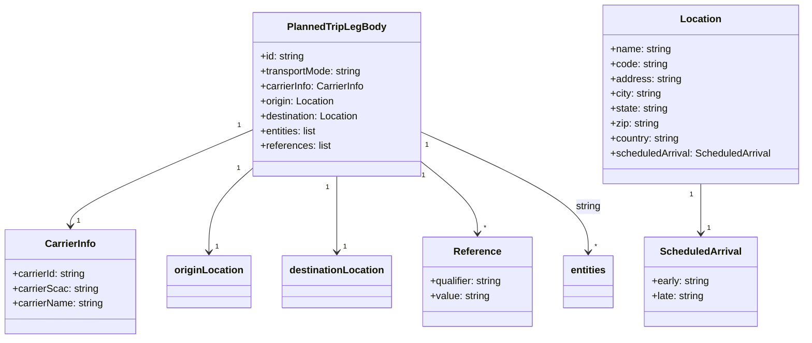

# Diagram: tools/ide_local_testing/localTest/test/entity/entity/addPlannedTripLeg.py


> Auto-generated by Obscura crawlers

## Diagram 1

```mermaid
flowchart TD
    A[Script] --> B[Import addPlannedTripLeg]
    A --> C[Import DictionaryToObject & get_event]
    B --> D[addPlannedTripLeg.lambda_handler]
    C --> E[Build body dict]
    E --> F[get_event(event)]
    F --> G[DictionaryToObject(function_name)]
    G --> D
    D --> H[print(response)]
    style A fill:#f9f,stroke:#333,stroke-width:1px
    style D fill:#bbf,stroke:#333,stroke-width:1px
```

> SVG rendering failed for this diagram.

## Diagram 2



### SVG

<svg id="container" width="1285.04296875" xmlns="http://www.w3.org/2000/svg" class="classDiagram" height="546" viewBox="0 0 1285.04296875 546" role="graphics-document document" aria-roledescription="class"><style>#container{font-family:"trebuchet ms",verdana,arial,sans-serif;font-size:16px;fill:#333;}@keyframes edge-animation-frame{from{stroke-dashoffset:0;}}@keyframes dash{to{stroke-dashoffset:0;}}#container .edge-animation-slow{stroke-dasharray:9,5!important;stroke-dashoffset:900;animation:dash 50s linear infinite;stroke-linecap:round;}#container .edge-animation-fast{stroke-dasharray:9,5!important;stroke-dashoffset:900;animation:dash 20s linear infinite;stroke-linecap:round;}#container .error-icon{fill:#552222;}#container .error-text{fill:#552222;stroke:#552222;}#container .edge-thickness-normal{stroke-width:1px;}#container .edge-thickness-thick{stroke-width:3.5px;}#container .edge-pattern-solid{stroke-dasharray:0;}#container .edge-thickness-invisible{stroke-width:0;fill:none;}#container .edge-pattern-dashed{stroke-dasharray:3;}#container .edge-pattern-dotted{stroke-dasharray:2;}#container .marker{fill:#333333;stroke:#333333;}#container .marker.cross{stroke:#333333;}#container svg{font-family:"trebuchet ms",verdana,arial,sans-serif;font-size:16px;}#container p{margin:0;}#container g.classGroup text{fill:#9370DB;stroke:none;font-family:"trebuchet ms",verdana,arial,sans-serif;font-size:10px;}#container g.classGroup text .title{font-weight:bolder;}#container .nodeLabel,#container .edgeLabel{color:#131300;}#container .edgeLabel .label rect{fill:#ECECFF;}#container .label text{fill:#131300;}#container .labelBkg{background:#ECECFF;}#container .edgeLabel .label span{background:#ECECFF;}#container .classTitle{font-weight:bolder;}#container .node rect,#container .node circle,#container .node ellipse,#container .node polygon,#container .node path{fill:#ECECFF;stroke:#9370DB;stroke-width:1px;}#container .divider{stroke:#9370DB;stroke-width:1;}#container g.clickable{cursor:pointer;}#container g.classGroup rect{fill:#ECECFF;stroke:#9370DB;}#container g.classGroup line{stroke:#9370DB;stroke-width:1;}#container .classLabel .box{stroke:none;stroke-width:0;fill:#ECECFF;opacity:0.5;}#container .classLabel .label{fill:#9370DB;font-size:10px;}#container .relation{stroke:#333333;stroke-width:1;fill:none;}#container .dashed-line{stroke-dasharray:3;}#container .dotted-line{stroke-dasharray:1 2;}#container #compositionStart,#container .composition{fill:#333333!important;stroke:#333333!important;stroke-width:1;}#container #compositionEnd,#container .composition{fill:#333333!important;stroke:#333333!important;stroke-width:1;}#container #dependencyStart,#container .dependency{fill:#333333!important;stroke:#333333!important;stroke-width:1;}#container #dependencyStart,#container .dependency{fill:#333333!important;stroke:#333333!important;stroke-width:1;}#container #extensionStart,#container .extension{fill:transparent!important;stroke:#333333!important;stroke-width:1;}#container #extensionEnd,#container .extension{fill:transparent!important;stroke:#333333!important;stroke-width:1;}#container #aggregationStart,#container .aggregation{fill:transparent!important;stroke:#333333!important;stroke-width:1;}#container #aggregationEnd,#container .aggregation{fill:transparent!important;stroke:#333333!important;stroke-width:1;}#container #lollipopStart,#container .lollipop{fill:#ECECFF!important;stroke:#333333!important;stroke-width:1;}#container #lollipopEnd,#container .lollipop{fill:#ECECFF!important;stroke:#333333!important;stroke-width:1;}#container .edgeTerminals{font-size:11px;line-height:initial;}#container .classTitleText{text-anchor:middle;font-size:18px;fill:#333;}#container .label-icon{display:inline-block;height:1em;overflow:visible;vertical-align:-0.125em;}#container .node .label-icon path{fill:currentColor;stroke:revert;stroke-width:revert;}#container :root{--mermaid-font-family:"trebuchet ms",verdana,arial,sans-serif;}</style><g><defs><marker id="container_class-aggregationStart" class="marker aggregation class" refX="18" refY="7" markerWidth="190" markerHeight="240" orient="auto"><path d="M 18,7 L9,13 L1,7 L9,1 Z"></path></marker></defs><defs><marker id="container_class-aggregationEnd" class="marker aggregation class" refX="1" refY="7" markerWidth="20" markerHeight="28" orient="auto"><path d="M 18,7 L9,13 L1,7 L9,1 Z"></path></marker></defs><defs><marker id="container_class-extensionStart" class="marker extension class" refX="18" refY="7" markerWidth="190" markerHeight="240" orient="auto"><path d="M 1,7 L18,13 V 1 Z"></path></marker></defs><defs><marker id="container_class-extensionEnd" class="marker extension class" refX="1" refY="7" markerWidth="20" markerHeight="28" orient="auto"><path d="M 1,1 V 13 L18,7 Z"></path></marker></defs><defs><marker id="container_class-compositionStart" class="marker composition class" refX="18" refY="7" markerWidth="190" markerHeight="240" orient="auto"><path d="M 18,7 L9,13 L1,7 L9,1 Z"></path></marker></defs><defs><marker id="container_class-compositionEnd" class="marker composition class" refX="1" refY="7" markerWidth="20" markerHeight="28" orient="auto"><path d="M 18,7 L9,13 L1,7 L9,1 Z"></path></marker></defs><defs><marker id="container_class-dependencyStart" class="marker dependency class" refX="6" refY="7" markerWidth="190" markerHeight="240" orient="auto"><path d="M 5,7 L9,13 L1,7 L9,1 Z"></path></marker></defs><defs><marker id="container_class-dependencyEnd" class="marker dependency class" refX="13" refY="7" markerWidth="20" markerHeight="28" orient="auto"><path d="M 18,7 L9,13 L14,7 L9,1 Z"></path></marker></defs><defs><marker id="container_class-lollipopStart" class="marker lollipop class" refX="13" refY="7" markerWidth="190" markerHeight="240" orient="auto"><circle stroke="black" fill="transparent" cx="7" cy="7" r="6"></circle></marker></defs><defs><marker id="container_class-lollipopEnd" class="marker lollipop class" refX="1" refY="7" markerWidth="190" markerHeight="240" orient="auto"><circle stroke="black" fill="transparent" cx="7" cy="7" r="6"></circle></marker></defs><g class="root"><g class="clusters"></g><g class="edgePaths"><path d="M399.23,210.108L351.635,230.59C304.04,251.072,208.85,292.036,161.255,317.685C113.66,343.333,113.66,353.667,113.66,358.833L113.66,364" id="id_PlannedTripLegBody_CarrierInfo_1" class="edge-thickness-normal edge-pattern-solid relation" style=";;;" data-edge="true" data-et="edge" data-id="id_PlannedTripLegBody_CarrierInfo_1" data-points="W3sieCI6Mzk5LjIzMDQ2ODc1LCJ5IjoyMTAuMTA3NjY4NTg5MTU0Mn0seyJ4IjoxMTMuNjYwMTU2MjUsInkiOjMzM30seyJ4IjoxMTMuNjYwMTU2MjUsInkiOjM3MH1d" marker-end="url(#container_class-dependencyEnd)"></path><path d="M399.23,274.095L388.373,283.912C377.516,293.73,355.801,313.365,344.943,335.349C334.086,357.333,334.086,381.667,334.086,393.833L334.086,406" id="id_PlannedTripLegBody_originLocation_2" class="edge-thickness-normal edge-pattern-solid relation" style=";;;" data-edge="true" data-et="edge" data-id="id_PlannedTripLegBody_originLocation_2" data-points="W3sieCI6Mzk5LjIzMDQ2ODc1LCJ5IjoyNzQuMDk0ODIwODU3MDc1OTR9LHsieCI6MzM0LjA4NTkzNzUsInkiOjMzM30seyJ4IjozMzQuMDg1OTM3NSwieSI6NDEyfV0=" marker-end="url(#container_class-dependencyEnd)"></path><path d="M534.258,284L534.258,292.167C534.258,300.333,534.258,316.667,534.258,337C534.258,357.333,534.258,381.667,534.258,393.833L534.258,406" id="id_PlannedTripLegBody_destinationLocation_3" class="edge-thickness-normal edge-pattern-solid relation" style=";;;" data-edge="true" data-et="edge" data-id="id_PlannedTripLegBody_destinationLocation_3" data-points="W3sieCI6NTM0LjI1NzgxMjUsInkiOjI4NH0seyJ4Ijo1MzQuMjU3ODEyNSwieSI6MzMzfSx7IngiOjUzNC4yNTc4MTI1LCJ5Ijo0MTJ9XQ==" marker-end="url(#container_class-dependencyEnd)"></path><path d="M1118.758,296L1118.758,302.167C1118.758,308.333,1118.758,320.667,1118.758,334C1118.758,347.333,1118.758,361.667,1118.758,368.833L1118.758,376" id="id_Location_ScheduledArrival_4" class="edge-thickness-normal edge-pattern-solid relation" style=";;;" data-edge="true" data-et="edge" data-id="id_Location_ScheduledArrival_4" data-points="W3sieCI6MTExOC43NTc4MTI1LCJ5IjoyOTZ9LHsieCI6MTExOC43NTc4MTI1LCJ5IjozMzN9LHsieCI6MTExOC43NTc4MTI1LCJ5IjozODJ9XQ==" marker-end="url(#container_class-dependencyEnd)"></path><path d="M669.285,260.647L684.272,272.705C699.259,284.764,729.233,308.882,744.22,328.108C759.207,347.333,759.207,361.667,759.207,368.833L759.207,376" id="id_PlannedTripLegBody_Reference_5" class="edge-thickness-normal edge-pattern-solid relation" style=";;;" data-edge="true" data-et="edge" data-id="id_PlannedTripLegBody_Reference_5" data-points="W3sieCI6NjY5LjI4NTE1NjI1LCJ5IjoyNjAuNjQ2NTE3NDQzMTcyOX0seyJ4Ijo3NTkuMjA3MDMxMjUsInkiOjMzM30seyJ4Ijo3NTkuMjA3MDMxMjUsInkiOjM4Mn1d" marker-end="url(#container_class-dependencyEnd)"></path><path d="M669.285,212.42L714.197,232.517C759.109,252.613,848.934,292.807,893.846,325.07C938.758,357.333,938.758,381.667,938.758,393.833L938.758,406" id="id_PlannedTripLegBody_entities_6" class="edge-thickness-normal edge-pattern-solid relation" style=";;;" data-edge="true" data-et="edge" data-id="id_PlannedTripLegBody_entities_6" data-points="W3sieCI6NjY5LjI4NTE1NjI1LCJ5IjoyMTIuNDIwMTQ2Mzk5ODc2NH0seyJ4Ijo5MzguNzU3ODEyNSwieSI6MzMzfSx7IngiOjkzOC43NTc4MTI1LCJ5Ijo0MTJ9XQ==" marker-end="url(#container_class-dependencyEnd)"></path></g><g class="edgeLabels"><g class="edgeLabel"><g class="label" data-id="id_PlannedTripLegBody_CarrierInfo_1" transform="translate(0, 0)"><foreignObject width="0" height="0"><div xmlns="http://www.w3.org/1999/xhtml" class="labelBkg" style="display: table-cell; white-space: nowrap; line-height: 1.5; max-width: 200px; text-align: center;"><span class="edgeLabel"></span></div></foreignObject></g></g><g class="edgeLabel"><g class="label" data-id="id_PlannedTripLegBody_originLocation_2" transform="translate(0, 0)"><foreignObject width="0" height="0"><div xmlns="http://www.w3.org/1999/xhtml" class="labelBkg" style="display: table-cell; white-space: nowrap; line-height: 1.5; max-width: 200px; text-align: center;"><span class="edgeLabel"></span></div></foreignObject></g></g><g class="edgeLabel"><g class="label" data-id="id_PlannedTripLegBody_destinationLocation_3" transform="translate(0, 0)"><foreignObject width="0" height="0"><div xmlns="http://www.w3.org/1999/xhtml" class="labelBkg" style="display: table-cell; white-space: nowrap; line-height: 1.5; max-width: 200px; text-align: center;"><span class="edgeLabel"></span></div></foreignObject></g></g><g class="edgeLabel"><g class="label" data-id="id_Location_ScheduledArrival_4" transform="translate(0, 0)"><foreignObject width="0" height="0"><div xmlns="http://www.w3.org/1999/xhtml" class="labelBkg" style="display: table-cell; white-space: nowrap; line-height: 1.5; max-width: 200px; text-align: center;"><span class="edgeLabel"></span></div></foreignObject></g></g><g class="edgeLabel"><g class="label" data-id="id_PlannedTripLegBody_Reference_5" transform="translate(0, 0)"><foreignObject width="0" height="0"><div xmlns="http://www.w3.org/1999/xhtml" class="labelBkg" style="display: table-cell; white-space: nowrap; line-height: 1.5; max-width: 200px; text-align: center;"><span class="edgeLabel"></span></div></foreignObject></g></g><g class="edgeLabel" transform="translate(938.7578125, 333)"><g class="label" data-id="id_PlannedTripLegBody_entities_6" transform="translate(-20.8203125, -12)"><foreignObject width="41.640625" height="24"><div xmlns="http://www.w3.org/1999/xhtml" class="labelBkg" style="display: table-cell; white-space: nowrap; line-height: 1.5; max-width: 200px; text-align: center;"><span class="edgeLabel"><p>string</p></span></div></foreignObject></g></g><g class="edgeTerminals" transform="translate(377.22637560208557, 203.24692673321698)"><g class="inner" transform="translate(0, 0)"><foreignObject style="width: 9px; height: 12px;"><div xmlns="http://www.w3.org/1999/xhtml" style="display: inline-block; padding-right: 1px; white-space: nowrap;"><span class="edgeLabel">1</span></div></foreignObject></g></g><g class="edgeTerminals" transform="translate(376.1897121253741, 274.70593607857626)"><g class="inner" transform="translate(0, 0)"><foreignObject style="width: 9px; height: 12px;"><div xmlns="http://www.w3.org/1999/xhtml" style="display: inline-block; padding-right: 1px; white-space: nowrap;"><span class="edgeLabel">1</span></div></foreignObject></g></g><g class="edgeTerminals" transform="translate(519.25781125, 301.4999989285714)"><g class="inner" transform="translate(0, 0)"><foreignObject style="width: 9px; height: 12px;"><div xmlns="http://www.w3.org/1999/xhtml" style="display: inline-block; padding-right: 1px; white-space: nowrap;"><span class="edgeLabel">1</span></div></foreignObject></g></g><g class="edgeTerminals" transform="translate(1103.75781125, 313.4999989285715)"><g class="inner" transform="translate(0, 0)"><foreignObject style="width: 9px; height: 12px;"><div xmlns="http://www.w3.org/1999/xhtml" style="display: inline-block; padding-right: 1px; white-space: nowrap;"><span class="edgeLabel">1</span></div></foreignObject></g></g><g class="edgeTerminals" transform="translate(673.5161830919964, 283.3037113241881)"><g class="inner" transform="translate(0, 0)"><foreignObject style="width: 9px; height: 12px;"><div xmlns="http://www.w3.org/1999/xhtml" style="display: inline-block; padding-right: 1px; white-space: nowrap;"><span class="edgeLabel">1</span></div></foreignObject></g></g><g class="edgeTerminals" transform="translate(679.1322871188429, 233.25962806097502)"><g class="inner" transform="translate(0, 0)"><foreignObject style="width: 9px; height: 12px;"><div xmlns="http://www.w3.org/1999/xhtml" style="display: inline-block; padding-right: 1px; white-space: nowrap;"><span class="edgeLabel">1</span></div></foreignObject></g></g><g class="edgeTerminals" transform="translate(123.66015812499992, 347.50000160714285)"><g class="inner" transform="translate(0, 0)"></g><foreignObject style="width: 9px; height: 12px;"><div xmlns="http://www.w3.org/1999/xhtml" style="display: inline-block; padding-right: 1px; white-space: nowrap;"><span class="edgeLabel">1</span></div></foreignObject></g><g class="edgeTerminals" transform="translate(344.0859387499999, 389.5000010714286)"><g class="inner" transform="translate(0, 0)"></g><foreignObject style="width: 9px; height: 12px;"><div xmlns="http://www.w3.org/1999/xhtml" style="display: inline-block; padding-right: 1px; white-space: nowrap;"><span class="edgeLabel">1</span></div></foreignObject></g><g class="edgeTerminals" transform="translate(544.25781125, 389.4999989285714)"><g class="inner" transform="translate(0, 0)"></g><foreignObject style="width: 9px; height: 12px;"><div xmlns="http://www.w3.org/1999/xhtml" style="display: inline-block; padding-right: 1px; white-space: nowrap;"><span class="edgeLabel">1</span></div></foreignObject></g><g class="edgeTerminals" transform="translate(1128.75781125, 359.4999989285715)"><g class="inner" transform="translate(0, 0)"></g><foreignObject style="width: 9px; height: 12px;"><div xmlns="http://www.w3.org/1999/xhtml" style="display: inline-block; padding-right: 1px; white-space: nowrap;"><span class="edgeLabel">1</span></div></foreignObject></g><g class="edgeTerminals" transform="translate(769.207030625, 359.49999946428574)"><g class="inner" transform="translate(0, 0)"></g><foreignObject style="width: 9px; height: 12px;"><div xmlns="http://www.w3.org/1999/xhtml" style="display: inline-block; padding-right: 1px; white-space: nowrap;"><span class="edgeLabel">*</span></div></foreignObject></g><g class="edgeTerminals" transform="translate(948.75781125, 389.4999989285714)"><g class="inner" transform="translate(0, 0)"></g><foreignObject style="width: 9px; height: 12px;"><div xmlns="http://www.w3.org/1999/xhtml" style="display: inline-block; padding-right: 1px; white-space: nowrap;"><span class="edgeLabel">*</span></div></foreignObject></g></g><g class="nodes"><g class="node default" id="classId-PlannedTripLegBody-0" transform="translate(534.2578125, 152)"><g class="basic label-container"><path d="M-135.02734375 -132 L135.02734375 -132 L135.02734375 132 L-135.02734375 132" stroke="none" stroke-width="0" fill="#ECECFF" style=""></path><path d="M-135.02734375 -132 C-59.82345163321352 -132, 15.380440483572954 -132, 135.02734375 -132 M-135.02734375 -132 C-66.55876662588308 -132, 1.9098104982338384 -132, 135.02734375 -132 M135.02734375 -132 C135.02734375 -52.25215956376192, 135.02734375 27.495680872476157, 135.02734375 132 M135.02734375 -132 C135.02734375 -61.51865143032032, 135.02734375 8.962697139359364, 135.02734375 132 M135.02734375 132 C42.744863480142115 132, -49.53761678971577 132, -135.02734375 132 M135.02734375 132 C69.88847532189394 132, 4.74960689378787 132, -135.02734375 132 M-135.02734375 132 C-135.02734375 51.51152642983192, -135.02734375 -28.976947140336165, -135.02734375 -132 M-135.02734375 132 C-135.02734375 64.83723367413548, -135.02734375 -2.3255326517290484, -135.02734375 -132" stroke="#9370DB" stroke-width="1.3" fill="none" stroke-dasharray="0 0" style=""></path></g><g class="annotation-group text" transform="translate(0, -108)"></g><g class="label-group text" transform="translate(-75.4921875, -108)"><g class="label" style="font-weight: bolder" transform="translate(0,-12)"><foreignObject width="150.984375" height="24"><div xmlns="http://www.w3.org/1999/xhtml" style="display: table-cell; white-space: nowrap; line-height: 1.5; max-width: 199px; text-align: center;"><span class="nodeLabel markdown-node-label" style=""><p>PlannedTripLegBody</p></span></div></foreignObject></g></g><g class="members-group text" transform="translate(-123.02734375, -60)"><g class="label" style="" transform="translate(0,-12)"><foreignObject width="71.78125" height="24"><div xmlns="http://www.w3.org/1999/xhtml" style="display: table-cell; white-space: nowrap; line-height: 1.5; max-width: 130px; text-align: center;"><span class="nodeLabel markdown-node-label" style=""><p>+id: string</p></span></div></foreignObject></g><g class="label" style="" transform="translate(0,12)"><foreignObject width="165.453125" height="24"><div xmlns="http://www.w3.org/1999/xhtml" style="display: table-cell; white-space: nowrap; line-height: 1.5; max-width: 223px; text-align: center;"><span class="nodeLabel markdown-node-label" style=""><p>+transportMode: string</p></span></div></foreignObject></g><g class="label" style="" transform="translate(0,36)"><foreignObject width="170.5625" height="24"><div xmlns="http://www.w3.org/1999/xhtml" style="display: table-cell; white-space: nowrap; line-height: 1.5; max-width: 228px; text-align: center;"><span class="nodeLabel markdown-node-label" style=""><p>+carrierInfo: CarrierInfo</p></span></div></foreignObject></g><g class="label" style="" transform="translate(0,60)"><foreignObject width="120.421875" height="24"><div xmlns="http://www.w3.org/1999/xhtml" style="display: table-cell; white-space: nowrap; line-height: 1.5; max-width: 178px; text-align: center;"><span class="nodeLabel markdown-node-label" style=""><p>+origin: Location</p></span></div></foreignObject></g><g class="label" style="" transform="translate(0,84)"><foreignObject width="161.3125" height="24"><div xmlns="http://www.w3.org/1999/xhtml" style="display: table-cell; white-space: nowrap; line-height: 1.5; max-width: 219px; text-align: center;"><span class="nodeLabel markdown-node-label" style=""><p>+destination: Location</p></span></div></foreignObject></g><g class="label" style="" transform="translate(0,108)"><foreignObject width="93.390625" height="24"><div xmlns="http://www.w3.org/1999/xhtml" style="display: table-cell; white-space: nowrap; line-height: 1.5; max-width: 151px; text-align: center;"><span class="nodeLabel markdown-node-label" style=""><p>+entities: list</p></span></div></foreignObject></g><g class="label" style="" transform="translate(0,132)"><foreignObject width="114.171875" height="24"><div xmlns="http://www.w3.org/1999/xhtml" style="display: table-cell; white-space: nowrap; line-height: 1.5; max-width: 172px; text-align: center;"><span class="nodeLabel markdown-node-label" style=""><p>+references: list</p></span></div></foreignObject></g></g><g class="methods-group text" transform="translate(-123.02734375, 132)"></g><g class="divider" style=""><path d="M-135.02734375 -84 C-31.997223514803323 -84, 71.03289672039335 -84, 135.02734375 -84 M-135.02734375 -84 C-68.52623034148408 -84, -2.02511693296816 -84, 135.02734375 -84" stroke="#9370DB" stroke-width="1.3" fill="none" stroke-dasharray="0 0" style=""></path></g><g class="divider" style=""><path d="M-135.02734375 108 C-49.16414097936203 108, 36.69906179127594 108, 135.02734375 108 M-135.02734375 108 C-80.63077748507341 108, -26.23421122014682 108, 135.02734375 108" stroke="#9370DB" stroke-width="1.3" fill="none" stroke-dasharray="0 0" style=""></path></g></g><g class="node default" id="classId-CarrierInfo-1" transform="translate(113.66015625, 454)"><g class="basic label-container"><path d="M-105.66015625 -84 L105.66015625 -84 L105.66015625 84 L-105.66015625 84" stroke="none" stroke-width="0" fill="#ECECFF" style=""></path><path d="M-105.66015625 -84 C-58.44081683652111 -84, -11.221477423042217 -84, 105.66015625 -84 M-105.66015625 -84 C-39.376119827392 -84, 26.907916595215994 -84, 105.66015625 -84 M105.66015625 -84 C105.66015625 -25.81081806324847, 105.66015625 32.37836387350306, 105.66015625 84 M105.66015625 -84 C105.66015625 -40.269849613855015, 105.66015625 3.460300772289969, 105.66015625 84 M105.66015625 84 C48.6052821227285 84, -8.449592004543007 84, -105.66015625 84 M105.66015625 84 C29.779603609065134 84, -46.10094903186973 84, -105.66015625 84 M-105.66015625 84 C-105.66015625 49.02363826733922, -105.66015625 14.047276534678446, -105.66015625 -84 M-105.66015625 84 C-105.66015625 19.754794581834858, -105.66015625 -44.490410836330284, -105.66015625 -84" stroke="#9370DB" stroke-width="1.3" fill="none" stroke-dasharray="0 0" style=""></path></g><g class="annotation-group text" transform="translate(0, -60)"></g><g class="label-group text" transform="translate(-39.6015625, -60)"><g class="label" style="font-weight: bolder" transform="translate(0,-12)"><foreignObject width="79.203125" height="24"><div xmlns="http://www.w3.org/1999/xhtml" style="display: table-cell; white-space: nowrap; line-height: 1.5; max-width: 128px; text-align: center;"><span class="nodeLabel markdown-node-label" style=""><p>CarrierInfo</p></span></div></foreignObject></g></g><g class="members-group text" transform="translate(-93.66015625, -12)"><g class="label" style="" transform="translate(0,-12)"><foreignObject width="119.9375" height="24"><div xmlns="http://www.w3.org/1999/xhtml" style="display: table-cell; white-space: nowrap; line-height: 1.5; max-width: 178px; text-align: center;"><span class="nodeLabel markdown-node-label" style=""><p>+carrierId: string</p></span></div></foreignObject></g><g class="label" style="" transform="translate(0,12)"><foreignObject width="138.28125" height="24"><div xmlns="http://www.w3.org/1999/xhtml" style="display: table-cell; white-space: nowrap; line-height: 1.5; max-width: 196px; text-align: center;"><span class="nodeLabel markdown-node-label" style=""><p>+carrierScac: string</p></span></div></foreignObject></g><g class="label" style="" transform="translate(0,36)"><foreignObject width="147.71875" height="24"><div xmlns="http://www.w3.org/1999/xhtml" style="display: table-cell; white-space: nowrap; line-height: 1.5; max-width: 206px; text-align: center;"><span class="nodeLabel markdown-node-label" style=""><p>+carrierName: string</p></span></div></foreignObject></g></g><g class="methods-group text" transform="translate(-93.66015625, 84)"></g><g class="divider" style=""><path d="M-105.66015625 -36 C-62.908525957048504 -36, -20.156895664097007 -36, 105.66015625 -36 M-105.66015625 -36 C-32.63343118748766 -36, 40.39329387502468 -36, 105.66015625 -36" stroke="#9370DB" stroke-width="1.3" fill="none" stroke-dasharray="0 0" style=""></path></g><g class="divider" style=""><path d="M-105.66015625 60 C-57.93856408802179 60, -10.216971926043584 60, 105.66015625 60 M-105.66015625 60 C-38.827052631322104 60, 28.006050987355792 60, 105.66015625 60" stroke="#9370DB" stroke-width="1.3" fill="none" stroke-dasharray="0 0" style=""></path></g></g><g class="node default" id="classId-Location-2" transform="translate(1118.7578125, 152)"><g class="basic label-container"><path d="M-158.28515625 -144 L158.28515625 -144 L158.28515625 144 L-158.28515625 144" stroke="none" stroke-width="0" fill="#ECECFF" style=""></path><path d="M-158.28515625 -144 C-84.85661167956142 -144, -11.42806710912285 -144, 158.28515625 -144 M-158.28515625 -144 C-35.6454867652282 -144, 86.9941827195436 -144, 158.28515625 -144 M158.28515625 -144 C158.28515625 -74.7324476474771, 158.28515625 -5.464895294954204, 158.28515625 144 M158.28515625 -144 C158.28515625 -51.200962707611666, 158.28515625 41.59807458477667, 158.28515625 144 M158.28515625 144 C82.23995237193995 144, 6.194748493879899 144, -158.28515625 144 M158.28515625 144 C88.77562570933195 144, 19.266095168663895 144, -158.28515625 144 M-158.28515625 144 C-158.28515625 48.21894982538015, -158.28515625 -47.5621003492397, -158.28515625 -144 M-158.28515625 144 C-158.28515625 55.35514273654883, -158.28515625 -33.289714526902344, -158.28515625 -144" stroke="#9370DB" stroke-width="1.3" fill="none" stroke-dasharray="0 0" style=""></path></g><g class="annotation-group text" transform="translate(0, -120)"></g><g class="label-group text" transform="translate(-31.3515625, -120)"><g class="label" style="font-weight: bolder" transform="translate(0,-12)"><foreignObject width="62.703125" height="24"><div xmlns="http://www.w3.org/1999/xhtml" style="display: table-cell; white-space: nowrap; line-height: 1.5; max-width: 112px; text-align: center;"><span class="nodeLabel markdown-node-label" style=""><p>Location</p></span></div></foreignObject></g></g><g class="members-group text" transform="translate(-146.28515625, -72)"><g class="label" style="" transform="translate(0,-12)"><foreignObject width="98.21875" height="24"><div xmlns="http://www.w3.org/1999/xhtml" style="display: table-cell; white-space: nowrap; line-height: 1.5; max-width: 156px; text-align: center;"><span class="nodeLabel markdown-node-label" style=""><p>+name: string</p></span></div></foreignObject></g><g class="label" style="" transform="translate(0,12)"><foreignObject width="92.65625" height="24"><div xmlns="http://www.w3.org/1999/xhtml" style="display: table-cell; white-space: nowrap; line-height: 1.5; max-width: 151px; text-align: center;"><span class="nodeLabel markdown-node-label" style=""><p>+code: string</p></span></div></foreignObject></g><g class="label" style="" transform="translate(0,36)"><foreignObject width="114.5" height="24"><div xmlns="http://www.w3.org/1999/xhtml" style="display: table-cell; white-space: nowrap; line-height: 1.5; max-width: 173px; text-align: center;"><span class="nodeLabel markdown-node-label" style=""><p>+address: string</p></span></div></foreignObject></g><g class="label" style="" transform="translate(0,60)"><foreignObject width="83.5" height="24"><div xmlns="http://www.w3.org/1999/xhtml" style="display: table-cell; white-space: nowrap; line-height: 1.5; max-width: 142px; text-align: center;"><span class="nodeLabel markdown-node-label" style=""><p>+city: string</p></span></div></foreignObject></g><g class="label" style="" transform="translate(0,84)"><foreignObject width="93.796875" height="24"><div xmlns="http://www.w3.org/1999/xhtml" style="display: table-cell; white-space: nowrap; line-height: 1.5; max-width: 152px; text-align: center;"><span class="nodeLabel markdown-node-label" style=""><p>+state: string</p></span></div></foreignObject></g><g class="label" style="" transform="translate(0,108)"><foreignObject width="78.234375" height="24"><div xmlns="http://www.w3.org/1999/xhtml" style="display: table-cell; white-space: nowrap; line-height: 1.5; max-width: 136px; text-align: center;"><span class="nodeLabel markdown-node-label" style=""><p>+zip: string</p></span></div></foreignObject></g><g class="label" style="" transform="translate(0,132)"><foreignObject width="112.953125" height="24"><div xmlns="http://www.w3.org/1999/xhtml" style="display: table-cell; white-space: nowrap; line-height: 1.5; max-width: 171px; text-align: center;"><span class="nodeLabel markdown-node-label" style=""><p>+country: string</p></span></div></foreignObject></g><g class="label" style="" transform="translate(0,156)"><foreignObject width="261.21875" height="24"><div xmlns="http://www.w3.org/1999/xhtml" style="display: table-cell; white-space: nowrap; line-height: 1.5; max-width: 319px; text-align: center;"><span class="nodeLabel markdown-node-label" style=""><p>+scheduledArrival: ScheduledArrival</p></span></div></foreignObject></g></g><g class="methods-group text" transform="translate(-146.28515625, 144)"></g><g class="divider" style=""><path d="M-158.28515625 -96 C-87.74570460268893 -96, -17.206252955377863 -96, 158.28515625 -96 M-158.28515625 -96 C-32.70907595135847 -96, 92.86700434728306 -96, 158.28515625 -96" stroke="#9370DB" stroke-width="1.3" fill="none" stroke-dasharray="0 0" style=""></path></g><g class="divider" style=""><path d="M-158.28515625 120 C-54.68911853141414 120, 48.906919187171724 120, 158.28515625 120 M-158.28515625 120 C-72.35600120282825 120, 13.573153844343494 120, 158.28515625 120" stroke="#9370DB" stroke-width="1.3" fill="none" stroke-dasharray="0 0" style=""></path></g></g><g class="node default" id="classId-ScheduledArrival-3" transform="translate(1118.7578125, 454)"><g class="basic label-container"><path d="M-89.9921875 -72 L89.9921875 -72 L89.9921875 72 L-89.9921875 72" stroke="none" stroke-width="0" fill="#ECECFF" style=""></path><path d="M-89.9921875 -72 C-37.017882552376975 -72, 15.95642239524605 -72, 89.9921875 -72 M-89.9921875 -72 C-48.24846858090118 -72, -6.504749661802364 -72, 89.9921875 -72 M89.9921875 -72 C89.9921875 -38.01631140200178, 89.9921875 -4.032622804003566, 89.9921875 72 M89.9921875 -72 C89.9921875 -24.774260242804672, 89.9921875 22.451479514390655, 89.9921875 72 M89.9921875 72 C29.323413555459744 72, -31.34536038908051 72, -89.9921875 72 M89.9921875 72 C30.476538949133392 72, -29.039109601733216 72, -89.9921875 72 M-89.9921875 72 C-89.9921875 35.61043393381869, -89.9921875 -0.7791321323626192, -89.9921875 -72 M-89.9921875 72 C-89.9921875 35.38798975103434, -89.9921875 -1.2240204979313205, -89.9921875 -72" stroke="#9370DB" stroke-width="1.3" fill="none" stroke-dasharray="0 0" style=""></path></g><g class="annotation-group text" transform="translate(0, -48)"></g><g class="label-group text" transform="translate(-62.375, -48)"><g class="label" style="font-weight: bolder" transform="translate(0,-12)"><foreignObject width="124.75" height="24"><div xmlns="http://www.w3.org/1999/xhtml" style="display: table-cell; white-space: nowrap; line-height: 1.5; max-width: 173px; text-align: center;"><span class="nodeLabel markdown-node-label" style=""><p>ScheduledArrival</p></span></div></foreignObject></g></g><g class="members-group text" transform="translate(-77.9921875, 0)"><g class="label" style="" transform="translate(0,-12)"><foreignObject width="93.609375" height="24"><div xmlns="http://www.w3.org/1999/xhtml" style="display: table-cell; white-space: nowrap; line-height: 1.5; max-width: 152px; text-align: center;"><span class="nodeLabel markdown-node-label" style=""><p>+early: string</p></span></div></foreignObject></g><g class="label" style="" transform="translate(0,12)"><foreignObject width="85.265625" height="24"><div xmlns="http://www.w3.org/1999/xhtml" style="display: table-cell; white-space: nowrap; line-height: 1.5; max-width: 143px; text-align: center;"><span class="nodeLabel markdown-node-label" style=""><p>+late: string</p></span></div></foreignObject></g></g><g class="methods-group text" transform="translate(-77.9921875, 72)"></g><g class="divider" style=""><path d="M-89.9921875 -24 C-20.33415642417316 -24, 49.32387465165368 -24, 89.9921875 -24 M-89.9921875 -24 C-23.149452652535416 -24, 43.69328219492917 -24, 89.9921875 -24" stroke="#9370DB" stroke-width="1.3" fill="none" stroke-dasharray="0 0" style=""></path></g><g class="divider" style=""><path d="M-89.9921875 48 C-28.002180725399988 48, 33.987826049200024 48, 89.9921875 48 M-89.9921875 48 C-25.44250909009706 48, 39.10716931980588 48, 89.9921875 48" stroke="#9370DB" stroke-width="1.3" fill="none" stroke-dasharray="0 0" style=""></path></g></g><g class="node default" id="classId-Reference-4" transform="translate(759.20703125, 454)"><g class="basic label-container"><path d="M-89.54296875 -72 L89.54296875 -72 L89.54296875 72 L-89.54296875 72" stroke="none" stroke-width="0" fill="#ECECFF" style=""></path><path d="M-89.54296875 -72 C-19.48685649885722 -72, 50.56925575228556 -72, 89.54296875 -72 M-89.54296875 -72 C-27.306386530285472 -72, 34.930195689429056 -72, 89.54296875 -72 M89.54296875 -72 C89.54296875 -37.79686795744794, 89.54296875 -3.5937359148958734, 89.54296875 72 M89.54296875 -72 C89.54296875 -29.260372477169007, 89.54296875 13.479255045661986, 89.54296875 72 M89.54296875 72 C36.94378610300444 72, -15.655396543991117 72, -89.54296875 72 M89.54296875 72 C35.84953207845121 72, -17.843904593097577 72, -89.54296875 72 M-89.54296875 72 C-89.54296875 41.751007723877194, -89.54296875 11.502015447754388, -89.54296875 -72 M-89.54296875 72 C-89.54296875 18.470816489618095, -89.54296875 -35.05836702076381, -89.54296875 -72" stroke="#9370DB" stroke-width="1.3" fill="none" stroke-dasharray="0 0" style=""></path></g><g class="annotation-group text" transform="translate(0, -48)"></g><g class="label-group text" transform="translate(-36.5078125, -48)"><g class="label" style="font-weight: bolder" transform="translate(0,-12)"><foreignObject width="73.015625" height="24"><div xmlns="http://www.w3.org/1999/xhtml" style="display: table-cell; white-space: nowrap; line-height: 1.5; max-width: 122px; text-align: center;"><span class="nodeLabel markdown-node-label" style=""><p>Reference</p></span></div></foreignObject></g></g><g class="members-group text" transform="translate(-77.54296875, 0)"><g class="label" style="" transform="translate(0,-12)"><foreignObject width="118.578125" height="24"><div xmlns="http://www.w3.org/1999/xhtml" style="display: table-cell; white-space: nowrap; line-height: 1.5; max-width: 177px; text-align: center;"><span class="nodeLabel markdown-node-label" style=""><p>+qualifier: string</p></span></div></foreignObject></g><g class="label" style="" transform="translate(0,12)"><foreignObject width="96.421875" height="24"><div xmlns="http://www.w3.org/1999/xhtml" style="display: table-cell; white-space: nowrap; line-height: 1.5; max-width: 154px; text-align: center;"><span class="nodeLabel markdown-node-label" style=""><p>+value: string</p></span></div></foreignObject></g></g><g class="methods-group text" transform="translate(-77.54296875, 72)"></g><g class="divider" style=""><path d="M-89.54296875 -24 C-45.384687694146265 -24, -1.2264066382925307 -24, 89.54296875 -24 M-89.54296875 -24 C-36.64624246851002 -24, 16.250483812979965 -24, 89.54296875 -24" stroke="#9370DB" stroke-width="1.3" fill="none" stroke-dasharray="0 0" style=""></path></g><g class="divider" style=""><path d="M-89.54296875 48 C-25.147423010780642 48, 39.248122728438716 48, 89.54296875 48 M-89.54296875 48 C-48.340751644691615 48, -7.13853453938323 48, 89.54296875 48" stroke="#9370DB" stroke-width="1.3" fill="none" stroke-dasharray="0 0" style=""></path></g></g><g class="node default" id="classId-originLocation-5" transform="translate(334.0859375, 454)"><g class="basic label-container"><path d="M-64.765625 -42 L64.765625 -42 L64.765625 42 L-64.765625 42" stroke="none" stroke-width="0" fill="#ECECFF" style=""></path><path d="M-64.765625 -42 C-30.18876727659675 -42, 4.388090446806501 -42, 64.765625 -42 M-64.765625 -42 C-38.55369975476145 -42, -12.341774509522914 -42, 64.765625 -42 M64.765625 -42 C64.765625 -20.9076984241786, 64.765625 0.18460315164279706, 64.765625 42 M64.765625 -42 C64.765625 -15.572193458132482, 64.765625 10.855613083735037, 64.765625 42 M64.765625 42 C27.53616138680043 42, -9.69330222639914 42, -64.765625 42 M64.765625 42 C14.576096305521297 42, -35.613432388957406 42, -64.765625 42 M-64.765625 42 C-64.765625 12.785588127962978, -64.765625 -16.428823744074045, -64.765625 -42 M-64.765625 42 C-64.765625 23.9891739772337, -64.765625 5.978347954467402, -64.765625 -42" stroke="#9370DB" stroke-width="1.3" fill="none" stroke-dasharray="0 0" style=""></path></g><g class="annotation-group text" transform="translate(0, -18)"></g><g class="label-group text" transform="translate(-52.765625, -18)"><g class="label" style="font-weight: bolder" transform="translate(0,-12)"><foreignObject width="105.53125" height="24"><div xmlns="http://www.w3.org/1999/xhtml" style="display: table-cell; white-space: nowrap; line-height: 1.5; max-width: 154px; text-align: center;"><span class="nodeLabel markdown-node-label" style=""><p>originLocation</p></span></div></foreignObject></g></g><g class="members-group text" transform="translate(-52.765625, 30)"></g><g class="methods-group text" transform="translate(-52.765625, 60)"></g><g class="divider" style=""><path d="M-64.765625 6 C-33.42155539401168 6, -2.077485788023367 6, 64.765625 6 M-64.765625 6 C-19.88357032265848 6, 24.998484354683043 6, 64.765625 6" stroke="#9370DB" stroke-width="1.3" fill="none" stroke-dasharray="0 0" style=""></path></g><g class="divider" style=""><path d="M-64.765625 24 C-21.448032554347023 24, 21.869559891305954 24, 64.765625 24 M-64.765625 24 C-38.1702254717721 24, -11.574825943544198 24, 64.765625 24" stroke="#9370DB" stroke-width="1.3" fill="none" stroke-dasharray="0 0" style=""></path></g></g><g class="node default" id="classId-destinationLocation-6" transform="translate(534.2578125, 454)"><g class="basic label-container"><path d="M-85.40625 -42 L85.40625 -42 L85.40625 42 L-85.40625 42" stroke="none" stroke-width="0" fill="#ECECFF" style=""></path><path d="M-85.40625 -42 C-42.39281109997785 -42, 0.6206278000443035 -42, 85.40625 -42 M-85.40625 -42 C-33.954885646455786 -42, 17.49647870708843 -42, 85.40625 -42 M85.40625 -42 C85.40625 -14.027699151690658, 85.40625 13.944601696618683, 85.40625 42 M85.40625 -42 C85.40625 -13.816741066002287, 85.40625 14.366517867995427, 85.40625 42 M85.40625 42 C41.684456008527405 42, -2.037337982945189 42, -85.40625 42 M85.40625 42 C39.35066917448756 42, -6.7049116510248865 42, -85.40625 42 M-85.40625 42 C-85.40625 20.368665963399618, -85.40625 -1.2626680732007642, -85.40625 -42 M-85.40625 42 C-85.40625 18.570771438526158, -85.40625 -4.858457122947684, -85.40625 -42" stroke="#9370DB" stroke-width="1.3" fill="none" stroke-dasharray="0 0" style=""></path></g><g class="annotation-group text" transform="translate(0, -18)"></g><g class="label-group text" transform="translate(-73.40625, -18)"><g class="label" style="font-weight: bolder" transform="translate(0,-12)"><foreignObject width="146.8125" height="24"><div xmlns="http://www.w3.org/1999/xhtml" style="display: table-cell; white-space: nowrap; line-height: 1.5; max-width: 195px; text-align: center;"><span class="nodeLabel markdown-node-label" style=""><p>destinationLocation</p></span></div></foreignObject></g></g><g class="members-group text" transform="translate(-73.40625, 30)"></g><g class="methods-group text" transform="translate(-73.40625, 60)"></g><g class="divider" style=""><path d="M-85.40625 6 C-18.004294551701804 6, 49.39766089659639 6, 85.40625 6 M-85.40625 6 C-24.121269073728264 6, 37.16371185254347 6, 85.40625 6" stroke="#9370DB" stroke-width="1.3" fill="none" stroke-dasharray="0 0" style=""></path></g><g class="divider" style=""><path d="M-85.40625 24 C-35.29009886352674 24, 14.826052272946527 24, 85.40625 24 M-85.40625 24 C-20.11661288906062 24, 45.17302422187876 24, 85.40625 24" stroke="#9370DB" stroke-width="1.3" fill="none" stroke-dasharray="0 0" style=""></path></g></g><g class="node default" id="classId-entities-7" transform="translate(938.7578125, 454)"><g class="basic label-container"><path d="M-40.0078125 -42 L40.0078125 -42 L40.0078125 42 L-40.0078125 42" stroke="none" stroke-width="0" fill="#ECECFF" style=""></path><path d="M-40.0078125 -42 C-15.172663088573238 -42, 9.662486322853525 -42, 40.0078125 -42 M-40.0078125 -42 C-14.52644652844829 -42, 10.954919443103421 -42, 40.0078125 -42 M40.0078125 -42 C40.0078125 -20.49440514777801, 40.0078125 1.0111897044439786, 40.0078125 42 M40.0078125 -42 C40.0078125 -19.299257931557268, 40.0078125 3.4014841368854647, 40.0078125 42 M40.0078125 42 C8.368480106729749 42, -23.270852286540503 42, -40.0078125 42 M40.0078125 42 C10.080437644368061 42, -19.846937211263878 42, -40.0078125 42 M-40.0078125 42 C-40.0078125 20.445303043527698, -40.0078125 -1.1093939129446042, -40.0078125 -42 M-40.0078125 42 C-40.0078125 17.25110354533036, -40.0078125 -7.497792909339282, -40.0078125 -42" stroke="#9370DB" stroke-width="1.3" fill="none" stroke-dasharray="0 0" style=""></path></g><g class="annotation-group text" transform="translate(0, -18)"></g><g class="label-group text" transform="translate(-28.0078125, -18)"><g class="label" style="font-weight: bolder" transform="translate(0,-12)"><foreignObject width="56.015625" height="24"><div xmlns="http://www.w3.org/1999/xhtml" style="display: table-cell; white-space: nowrap; line-height: 1.5; max-width: 105px; text-align: center;"><span class="nodeLabel markdown-node-label" style=""><p>entities</p></span></div></foreignObject></g></g><g class="members-group text" transform="translate(-28.0078125, 30)"></g><g class="methods-group text" transform="translate(-28.0078125, 60)"></g><g class="divider" style=""><path d="M-40.0078125 6 C-21.37593371174316 6, -2.744054923486317 6, 40.0078125 6 M-40.0078125 6 C-9.558232361788903 6, 20.891347776422194 6, 40.0078125 6" stroke="#9370DB" stroke-width="1.3" fill="none" stroke-dasharray="0 0" style=""></path></g><g class="divider" style=""><path d="M-40.0078125 24 C-19.767955123094826 24, 0.4719022538103488 24, 40.0078125 24 M-40.0078125 24 C-20.728167979287292 24, -1.4485234585745843 24, 40.0078125 24" stroke="#9370DB" stroke-width="1.3" fill="none" stroke-dasharray="0 0" style=""></path></g></g></g></g></g></svg>
