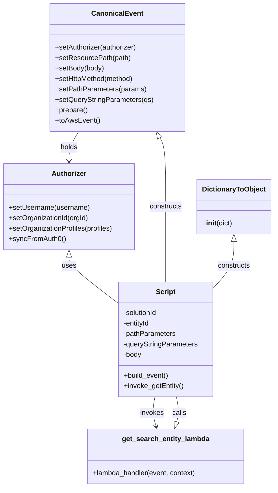

# Diagram: tools/ide_local_testing/localTest/test/entity/entity/getEntity.py


> Auto-generated by Obscura crawlers

## Diagram 1

```mermaid
flowchart TD
    Start([Start]) --> CreateAuth[Authorizer()]
    CreateAuth --> SetUser[setUsername("dave.damon@...")]
    SetUser --> SetOrg[setOrganizationId(18)]
    SetOrg --> SetProfiles[setOrganizationProfiles(["SH"])]
    SetProfiles --> CreateEvent[CanonicalEvent()]
    CreateEvent --> E_setAuth[.setAuthorizer(authorizer)]
    E_setAuth --> E_setPath[.setResourcePath("/entity/solution/GM_FV/entity/1GNSKPKD8NR210447")]
    E_setPath --> E_setBody[.setBody(None)]
    E_setBody --> E_setMethod[.setHttpMethod("GET")]
    E_setMethod --> E_setPathParams[.setPathParameters({...})]
    E_setPathParams --> E_setQuery[.setQueryStringParameters({})]
    E_setQuery --> E_prepare[.prepare()]
    E_prepare --> E_toAws[.toAwsEvent()]
    E_toAws --> Serialize[json.dumps(event)]
    Serialize --> Timestamp1[print(datetime.now())]
    Timestamp1 --> Invoke[lambda_handler getEntity(event, DictionaryToObject(...))]
    Invoke --> Timestamp2[print(datetime.now())]
    Timestamp2 --> PrintRetval[print(retval)]
    PrintRetval --> End([End])
```

> SVG rendering failed for this diagram.

## Diagram 2



### SVG

<svg id="container" width="629.4296875" xmlns="http://www.w3.org/2000/svg" class="classDiagram" height="1120" viewBox="0 0 629.4296875 1120" role="graphics-document document" aria-roledescription="class"><style>#container{font-family:"trebuchet ms",verdana,arial,sans-serif;font-size:16px;fill:#333;}@keyframes edge-animation-frame{from{stroke-dashoffset:0;}}@keyframes dash{to{stroke-dashoffset:0;}}#container .edge-animation-slow{stroke-dasharray:9,5!important;stroke-dashoffset:900;animation:dash 50s linear infinite;stroke-linecap:round;}#container .edge-animation-fast{stroke-dasharray:9,5!important;stroke-dashoffset:900;animation:dash 20s linear infinite;stroke-linecap:round;}#container .error-icon{fill:#552222;}#container .error-text{fill:#552222;stroke:#552222;}#container .edge-thickness-normal{stroke-width:1px;}#container .edge-thickness-thick{stroke-width:3.5px;}#container .edge-pattern-solid{stroke-dasharray:0;}#container .edge-thickness-invisible{stroke-width:0;fill:none;}#container .edge-pattern-dashed{stroke-dasharray:3;}#container .edge-pattern-dotted{stroke-dasharray:2;}#container .marker{fill:#333333;stroke:#333333;}#container .marker.cross{stroke:#333333;}#container svg{font-family:"trebuchet ms",verdana,arial,sans-serif;font-size:16px;}#container p{margin:0;}#container g.classGroup text{fill:#9370DB;stroke:none;font-family:"trebuchet ms",verdana,arial,sans-serif;font-size:10px;}#container g.classGroup text .title{font-weight:bolder;}#container .nodeLabel,#container .edgeLabel{color:#131300;}#container .edgeLabel .label rect{fill:#ECECFF;}#container .label text{fill:#131300;}#container .labelBkg{background:#ECECFF;}#container .edgeLabel .label span{background:#ECECFF;}#container .classTitle{font-weight:bolder;}#container .node rect,#container .node circle,#container .node ellipse,#container .node polygon,#container .node path{fill:#ECECFF;stroke:#9370DB;stroke-width:1px;}#container .divider{stroke:#9370DB;stroke-width:1;}#container g.clickable{cursor:pointer;}#container g.classGroup rect{fill:#ECECFF;stroke:#9370DB;}#container g.classGroup line{stroke:#9370DB;stroke-width:1;}#container .classLabel .box{stroke:none;stroke-width:0;fill:#ECECFF;opacity:0.5;}#container .classLabel .label{fill:#9370DB;font-size:10px;}#container .relation{stroke:#333333;stroke-width:1;fill:none;}#container .dashed-line{stroke-dasharray:3;}#container .dotted-line{stroke-dasharray:1 2;}#container #compositionStart,#container .composition{fill:#333333!important;stroke:#333333!important;stroke-width:1;}#container #compositionEnd,#container .composition{fill:#333333!important;stroke:#333333!important;stroke-width:1;}#container #dependencyStart,#container .dependency{fill:#333333!important;stroke:#333333!important;stroke-width:1;}#container #dependencyStart,#container .dependency{fill:#333333!important;stroke:#333333!important;stroke-width:1;}#container #extensionStart,#container .extension{fill:transparent!important;stroke:#333333!important;stroke-width:1;}#container #extensionEnd,#container .extension{fill:transparent!important;stroke:#333333!important;stroke-width:1;}#container #aggregationStart,#container .aggregation{fill:transparent!important;stroke:#333333!important;stroke-width:1;}#container #aggregationEnd,#container .aggregation{fill:transparent!important;stroke:#333333!important;stroke-width:1;}#container #lollipopStart,#container .lollipop{fill:#ECECFF!important;stroke:#333333!important;stroke-width:1;}#container #lollipopEnd,#container .lollipop{fill:#ECECFF!important;stroke:#333333!important;stroke-width:1;}#container .edgeTerminals{font-size:11px;line-height:initial;}#container .classTitleText{text-anchor:middle;font-size:18px;fill:#333;}#container .label-icon{display:inline-block;height:1em;overflow:visible;vertical-align:-0.125em;}#container .node .label-icon path{fill:currentColor;stroke:revert;stroke-width:revert;}#container :root{--mermaid-font-family:"trebuchet ms",verdana,arial,sans-serif;}</style><g><defs><marker id="container_class-aggregationStart" class="marker aggregation class" refX="18" refY="7" markerWidth="190" markerHeight="240" orient="auto"><path d="M 18,7 L9,13 L1,7 L9,1 Z"></path></marker></defs><defs><marker id="container_class-aggregationEnd" class="marker aggregation class" refX="1" refY="7" markerWidth="20" markerHeight="28" orient="auto"><path d="M 18,7 L9,13 L1,7 L9,1 Z"></path></marker></defs><defs><marker id="container_class-extensionStart" class="marker extension class" refX="18" refY="7" markerWidth="190" markerHeight="240" orient="auto"><path d="M 1,7 L18,13 V 1 Z"></path></marker></defs><defs><marker id="container_class-extensionEnd" class="marker extension class" refX="1" refY="7" markerWidth="20" markerHeight="28" orient="auto"><path d="M 1,1 V 13 L18,7 Z"></path></marker></defs><defs><marker id="container_class-compositionStart" class="marker composition class" refX="18" refY="7" markerWidth="190" markerHeight="240" orient="auto"><path d="M 18,7 L9,13 L1,7 L9,1 Z"></path></marker></defs><defs><marker id="container_class-compositionEnd" class="marker composition class" refX="1" refY="7" markerWidth="20" markerHeight="28" orient="auto"><path d="M 18,7 L9,13 L1,7 L9,1 Z"></path></marker></defs><defs><marker id="container_class-dependencyStart" class="marker dependency class" refX="6" refY="7" markerWidth="190" markerHeight="240" orient="auto"><path d="M 5,7 L9,13 L1,7 L9,1 Z"></path></marker></defs><defs><marker id="container_class-dependencyEnd" class="marker dependency class" refX="13" refY="7" markerWidth="20" markerHeight="28" orient="auto"><path d="M 18,7 L9,13 L14,7 L9,1 Z"></path></marker></defs><defs><marker id="container_class-lollipopStart" class="marker lollipop class" refX="13" refY="7" markerWidth="190" markerHeight="240" orient="auto"><circle stroke="black" fill="transparent" cx="7" cy="7" r="6"></circle></marker></defs><defs><marker id="container_class-lollipopEnd" class="marker lollipop class" refX="1" refY="7" markerWidth="190" markerHeight="240" orient="auto"><circle stroke="black" fill="transparent" cx="7" cy="7" r="6"></circle></marker></defs><g class="root"><g class="clusters"></g><g class="edgePaths"><path d="M159.668,591.25L159.668,594.542C159.668,597.833,159.668,604.417,178.898,622.184C198.129,639.951,236.59,668.903,255.82,683.378L275.051,697.854" id="id_Authorizer_Script_1" class="edge-thickness-normal edge-pattern-solid relation" style=";;;" data-edge="true" data-et="edge" data-id="id_Authorizer_Script_1" data-points="W3sieCI6MTU5LjY2Nzk2ODc1LCJ5Ijo1NzR9LHsieCI6MTU5LjY2Nzk2ODc1LCJ5Ijo2MTF9LHsieCI6Mjc1LjA1MDc4MTI1LCJ5Ijo2OTcuODUzNzk3MzAzMTc1M31d" marker-start="url(#container_class-extensionStart)"></path><path d="M370.591,316.726L372.855,320.438C375.12,324.151,379.65,331.575,381.915,357.954C384.18,384.333,384.18,429.667,384.18,475C384.18,520.333,384.18,565.667,384.18,594.5C384.18,623.333,384.18,635.667,384.18,641.833L384.18,648" id="id_CanonicalEvent_Script_2" class="edge-thickness-normal edge-pattern-solid relation" style=";;;" data-edge="true" data-et="edge" data-id="id_CanonicalEvent_Script_2" data-points="W3sieCI6MzYxLjYwNjQ5ODM4NjU0ODksInkiOjMwMn0seyJ4IjozODQuMTc5Njg3NSwieSI6MzM5fSx7IngiOjM4NC4xNzk2ODc1LCJ5Ijo0NzV9LHsieCI6Mzg0LjE3OTY4NzUsInkiOjYxMX0seyJ4IjozODQuMTc5Njg3NSwieSI6NjQ4fV0=" marker-start="url(#container_class-extensionStart)"></path><path d="M539.227,555.25L539.227,564.542C539.227,573.833,539.227,592.417,531.574,610.05C523.921,627.683,508.615,644.367,500.962,652.709L493.309,661.05" id="id_DictionaryToObject_Script_3" class="edge-thickness-normal edge-pattern-solid relation" style=";;;" data-edge="true" data-et="edge" data-id="id_DictionaryToObject_Script_3" data-points="W3sieCI6NTM5LjIyNjU2MjUsInkiOjUzOH0seyJ4Ijo1MzkuMjI2NTYyNSwieSI6NjExfSx7IngiOjQ5My4zMDg1OTM3NSwieSI6NjYxLjA1MDI2MjAxNzUzNX1d" marker-start="url(#container_class-extensionStart)"></path><path d="M409.609,969.571L410.707,966.143C411.805,962.714,414,955.857,413.929,946.262C413.859,936.667,411.522,924.333,410.354,918.167L409.186,912" id="id_get_search_entity_lambda_Script_4" class="edge-thickness-normal edge-pattern-solid relation" style=";;;" data-edge="true" data-et="edge" data-id="id_get_search_entity_lambda_Script_4" data-points="W3sieCI6NDA0LjM0OTUzMTI1LCJ5Ijo5ODZ9LHsieCI6NDE2LjE5NTMxMjUsInkiOjk0OX0seyJ4Ijo0MDkuMTg1OTc0NDgyMjQ4NSwieSI6OTEyfV0=" marker-start="url(#container_class-extensionStart)"></path><path d="M182.241,302L178.479,308.167C174.717,314.333,167.192,326.667,163.43,338C159.668,349.333,159.668,359.667,159.668,364.833L159.668,370" id="id_CanonicalEvent_Authorizer_5" class="edge-thickness-normal edge-pattern-solid relation" style=";;;" data-edge="true" data-et="edge" data-id="id_CanonicalEvent_Authorizer_5" data-points="W3sieCI6MTgyLjI0MTE1Nzg2MzQ1MTEsInkiOjMwMn0seyJ4IjoxNTkuNjY3OTY4NzUsInkiOjMzOX0seyJ4IjoxNTkuNjY3OTY4NzUsInkiOjM3Nn1d" marker-end="url(#container_class-dependencyEnd)"></path><path d="M359.173,912L358.005,918.167C356.837,924.333,354.501,936.667,355.002,948.048C355.503,959.429,358.842,969.857,360.511,975.071L362.18,980.286" id="id_Script_get_search_entity_lambda_6" class="edge-thickness-normal edge-pattern-solid relation" style=";;;" data-edge="true" data-et="edge" data-id="id_Script_get_search_entity_lambda_6" data-points="W3sieCI6MzU5LjE3MzQwMDUxNzc1MTUsInkiOjkxMn0seyJ4IjozNTIuMTY0MDYyNSwieSI6OTQ5fSx7IngiOjM2NC4wMDk4NDM3NSwieSI6OTg2fV0=" marker-end="url(#container_class-dependencyEnd)"></path></g><g class="edgeLabels"><g class="edgeLabel" transform="translate(159.66796875, 611)"><g class="label" data-id="id_Authorizer_Script_1" transform="translate(-16.4921875, -12)"><foreignObject width="32.984375" height="24"><div xmlns="http://www.w3.org/1999/xhtml" class="labelBkg" style="display: table-cell; white-space: nowrap; line-height: 1.5; max-width: 200px; text-align: center;"><span class="edgeLabel"><p>uses</p></span></div></foreignObject></g></g><g class="edgeLabel" transform="translate(384.1796875, 475)"><g class="label" data-id="id_CanonicalEvent_Script_2" transform="translate(-37.84375, -12)"><foreignObject width="75.6875" height="24"><div xmlns="http://www.w3.org/1999/xhtml" class="labelBkg" style="display: table-cell; white-space: nowrap; line-height: 1.5; max-width: 200px; text-align: center;"><span class="edgeLabel"><p>constructs</p></span></div></foreignObject></g></g><g class="edgeLabel" transform="translate(539.2265625, 611)"><g class="label" data-id="id_DictionaryToObject_Script_3" transform="translate(-37.84375, -12)"><foreignObject width="75.6875" height="24"><div xmlns="http://www.w3.org/1999/xhtml" class="labelBkg" style="display: table-cell; white-space: nowrap; line-height: 1.5; max-width: 200px; text-align: center;"><span class="edgeLabel"><p>constructs</p></span></div></foreignObject></g></g><g class="edgeLabel" transform="translate(416.0136, 949.56758)"><g class="label" data-id="id_get_search_entity_lambda_Script_4" transform="translate(-16.4453125, -12)"><foreignObject width="32.890625" height="24"><div xmlns="http://www.w3.org/1999/xhtml" class="labelBkg" style="display: table-cell; white-space: nowrap; line-height: 1.5; max-width: 200px; text-align: center;"><span class="edgeLabel"><p>calls</p></span></div></foreignObject></g></g><g class="edgeLabel" transform="translate(159.66796875, 339)"><g class="label" data-id="id_CanonicalEvent_Authorizer_5" transform="translate(-20.1875, -12)"><foreignObject width="40.375" height="24"><div xmlns="http://www.w3.org/1999/xhtml" class="labelBkg" style="display: table-cell; white-space: nowrap; line-height: 1.5; max-width: 200px; text-align: center;"><span class="edgeLabel"><p>holds</p></span></div></foreignObject></g></g><g class="edgeLabel" transform="translate(352.34578, 949.56758)"><g class="label" data-id="id_Script_get_search_entity_lambda_6" transform="translate(-27.5859375, -12)"><foreignObject width="55.171875" height="24"><div xmlns="http://www.w3.org/1999/xhtml" class="labelBkg" style="display: table-cell; white-space: nowrap; line-height: 1.5; max-width: 200px; text-align: center;"><span class="edgeLabel"><p>invokes</p></span></div></foreignObject></g></g></g><g class="nodes"><g class="node default" id="classId-Authorizer-0" transform="translate(159.66796875, 475)"><g class="basic label-container"><path d="M-151.66796875 -99 L151.66796875 -99 L151.66796875 99 L-151.66796875 99" stroke="none" stroke-width="0" fill="#ECECFF" style=""></path><path d="M-151.66796875 -99 C-53.38328913310137 -99, 44.90139048379726 -99, 151.66796875 -99 M-151.66796875 -99 C-71.47905130950979 -99, 8.70986613098043 -99, 151.66796875 -99 M151.66796875 -99 C151.66796875 -27.03626358776377, 151.66796875 44.92747282447246, 151.66796875 99 M151.66796875 -99 C151.66796875 -38.18862350508528, 151.66796875 22.622752989829436, 151.66796875 99 M151.66796875 99 C50.54133333351368 99, -50.585302082972646 99, -151.66796875 99 M151.66796875 99 C53.4318443123956 99, -44.804280125208805 99, -151.66796875 99 M-151.66796875 99 C-151.66796875 50.423390043051285, -151.66796875 1.8467800861025694, -151.66796875 -99 M-151.66796875 99 C-151.66796875 38.04882438087632, -151.66796875 -22.902351238247363, -151.66796875 -99" stroke="#9370DB" stroke-width="1.3" fill="none" stroke-dasharray="0 0" style=""></path></g><g class="annotation-group text" transform="translate(0, -75)"></g><g class="label-group text" transform="translate(-38.3671875, -75)"><g class="label" style="font-weight: bolder" transform="translate(0,-12)"><foreignObject width="76.734375" height="24"><div xmlns="http://www.w3.org/1999/xhtml" style="display: table-cell; white-space: nowrap; line-height: 1.5; max-width: 126px; text-align: center;"><span class="nodeLabel markdown-node-label" style=""><p>Authorizer</p></span></div></foreignObject></g></g><g class="members-group text" transform="translate(-139.66796875, -27)"></g><g class="methods-group text" transform="translate(-139.66796875, 3)"><g class="label" style="" transform="translate(0,-12)"><foreignObject width="185.90625" height="24"><div xmlns="http://www.w3.org/1999/xhtml" style="display: table-cell; white-space: nowrap; line-height: 1.5; max-width: 243px; text-align: center;"><span class="nodeLabel markdown-node-label" style=""><p>+setUsername(username)</p></span></div></foreignObject></g><g class="label" style="" transform="translate(0,12)"><foreignObject width="184.578125" height="24"><div xmlns="http://www.w3.org/1999/xhtml" style="display: table-cell; white-space: nowrap; line-height: 1.5; max-width: 242px; text-align: center;"><span class="nodeLabel markdown-node-label" style=""><p>+setOrganizationId(orgId)</p></span></div></foreignObject></g><g class="label" style="" transform="translate(0,36)"><foreignObject width="240.96875" height="24"><div xmlns="http://www.w3.org/1999/xhtml" style="display: table-cell; white-space: nowrap; line-height: 1.5; max-width: 298px; text-align: center;"><span class="nodeLabel markdown-node-label" style=""><p>+setOrganizationProfiles(profiles)</p></span></div></foreignObject></g><g class="label" style="" transform="translate(0,60)"><foreignObject width="129.0625" height="24"><div xmlns="http://www.w3.org/1999/xhtml" style="display: table-cell; white-space: nowrap; line-height: 1.5; max-width: 186px; text-align: center;"><span class="nodeLabel markdown-node-label" style=""><p>+syncFromAuth0()</p></span></div></foreignObject></g></g><g class="divider" style=""><path d="M-151.66796875 -51 C-81.74079228996379 -51, -11.813615829927585 -51, 151.66796875 -51 M-151.66796875 -51 C-79.51368038790953 -51, -7.359392025819062 -51, 151.66796875 -51" stroke="#9370DB" stroke-width="1.3" fill="none" stroke-dasharray="0 0" style=""></path></g><g class="divider" style=""><path d="M-151.66796875 -27 C-67.54584472161994 -27, 16.576279306760114 -27, 151.66796875 -27 M-151.66796875 -27 C-85.1176577192145 -27, -18.567346688429012 -27, 151.66796875 -27" stroke="#9370DB" stroke-width="1.3" fill="none" stroke-dasharray="0 0" style=""></path></g></g><g class="node default" id="classId-CanonicalEvent-1" transform="translate(271.923828125, 155)"><g class="basic label-container"><path d="M-152.31640625 -147 L152.31640625 -147 L152.31640625 147 L-152.31640625 147" stroke="none" stroke-width="0" fill="#ECECFF" style=""></path><path d="M-152.31640625 -147 C-68.33635637696348 -147, 15.643693496073041 -147, 152.31640625 -147 M-152.31640625 -147 C-65.8457142028007 -147, 20.624977844398586 -147, 152.31640625 -147 M152.31640625 -147 C152.31640625 -77.44774382968988, 152.31640625 -7.895487659379768, 152.31640625 147 M152.31640625 -147 C152.31640625 -66.78017892775395, 152.31640625 13.439642144492097, 152.31640625 147 M152.31640625 147 C89.05624746186902 147, 25.796088673738026 147, -152.31640625 147 M152.31640625 147 C35.24443084103157 147, -81.82754456793685 147, -152.31640625 147 M-152.31640625 147 C-152.31640625 29.819241694490344, -152.31640625 -87.36151661101931, -152.31640625 -147 M-152.31640625 147 C-152.31640625 46.38296602264231, -152.31640625 -54.234067954715385, -152.31640625 -147" stroke="#9370DB" stroke-width="1.3" fill="none" stroke-dasharray="0 0" style=""></path></g><g class="annotation-group text" transform="translate(0, -123)"></g><g class="label-group text" transform="translate(-55.7109375, -123)"><g class="label" style="font-weight: bolder" transform="translate(0,-12)"><foreignObject width="111.421875" height="24"><div xmlns="http://www.w3.org/1999/xhtml" style="display: table-cell; white-space: nowrap; line-height: 1.5; max-width: 161px; text-align: center;"><span class="nodeLabel markdown-node-label" style=""><p>CanonicalEvent</p></span></div></foreignObject></g></g><g class="members-group text" transform="translate(-140.31640625, -75)"></g><g class="methods-group text" transform="translate(-140.31640625, -45)"><g class="label" style="" transform="translate(0,-12)"><foreignObject width="190.75" height="24"><div xmlns="http://www.w3.org/1999/xhtml" style="display: table-cell; white-space: nowrap; line-height: 1.5; max-width: 248px; text-align: center;"><span class="nodeLabel markdown-node-label" style=""><p>+setAuthorizer(authorizer)</p></span></div></foreignObject></g><g class="label" style="" transform="translate(0,12)"><foreignObject width="171.828125" height="24"><div xmlns="http://www.w3.org/1999/xhtml" style="display: table-cell; white-space: nowrap; line-height: 1.5; max-width: 229px; text-align: center;"><span class="nodeLabel markdown-node-label" style=""><p>+setResourcePath(path)</p></span></div></foreignObject></g><g class="label" style="" transform="translate(0,36)"><foreignObject width="113.125" height="24"><div xmlns="http://www.w3.org/1999/xhtml" style="display: table-cell; white-space: nowrap; line-height: 1.5; max-width: 170px; text-align: center;"><span class="nodeLabel markdown-node-label" style=""><p>+setBody(body)</p></span></div></foreignObject></g><g class="label" style="" transform="translate(0,60)"><foreignObject width="184" height="24"><div xmlns="http://www.w3.org/1999/xhtml" style="display: table-cell; white-space: nowrap; line-height: 1.5; max-width: 241px; text-align: center;"><span class="nodeLabel markdown-node-label" style=""><p>+setHttpMethod(method)</p></span></div></foreignObject></g><g class="label" style="" transform="translate(0,84)"><foreignObject width="207.6875" height="24"><div xmlns="http://www.w3.org/1999/xhtml" style="display: table-cell; white-space: nowrap; line-height: 1.5; max-width: 265px; text-align: center;"><span class="nodeLabel markdown-node-label" style=""><p>+setPathParameters(params)</p></span></div></foreignObject></g><g class="label" style="" transform="translate(0,108)"><foreignObject width="224.921875" height="24"><div xmlns="http://www.w3.org/1999/xhtml" style="display: table-cell; white-space: nowrap; line-height: 1.5; max-width: 282px; text-align: center;"><span class="nodeLabel markdown-node-label" style=""><p>+setQueryStringParameters(qs)</p></span></div></foreignObject></g><g class="label" style="" transform="translate(0,132)"><foreignObject width="74.75" height="24"><div xmlns="http://www.w3.org/1999/xhtml" style="display: table-cell; white-space: nowrap; line-height: 1.5; max-width: 132px; text-align: center;"><span class="nodeLabel markdown-node-label" style=""><p>+prepare()</p></span></div></foreignObject></g><g class="label" style="" transform="translate(0,156)"><foreignObject width="101.1875" height="24"><div xmlns="http://www.w3.org/1999/xhtml" style="display: table-cell; white-space: nowrap; line-height: 1.5; max-width: 159px; text-align: center;"><span class="nodeLabel markdown-node-label" style=""><p>+toAwsEvent()</p></span></div></foreignObject></g></g><g class="divider" style=""><path d="M-152.31640625 -99 C-46.09950925470157 -99, 60.117387740596854 -99, 152.31640625 -99 M-152.31640625 -99 C-90.31096619805773 -99, -28.305526146115454 -99, 152.31640625 -99" stroke="#9370DB" stroke-width="1.3" fill="none" stroke-dasharray="0 0" style=""></path></g><g class="divider" style=""><path d="M-152.31640625 -75 C-58.98216033894268 -75, 34.352085572114646 -75, 152.31640625 -75 M-152.31640625 -75 C-30.61712702343695 -75, 91.0821522031261 -75, 152.31640625 -75" stroke="#9370DB" stroke-width="1.3" fill="none" stroke-dasharray="0 0" style=""></path></g></g><g class="node default" id="classId-DictionaryToObject-2" transform="translate(539.2265625, 475)"><g class="basic label-container"><path d="M-82.203125 -63 L82.203125 -63 L82.203125 63 L-82.203125 63" stroke="none" stroke-width="0" fill="#ECECFF" style=""></path><path d="M-82.203125 -63 C-22.310059206356947 -63, 37.58300658728611 -63, 82.203125 -63 M-82.203125 -63 C-21.611893235396714 -63, 38.97933852920657 -63, 82.203125 -63 M82.203125 -63 C82.203125 -15.840651643383694, 82.203125 31.31869671323261, 82.203125 63 M82.203125 -63 C82.203125 -20.072914425468078, 82.203125 22.854171149063845, 82.203125 63 M82.203125 63 C46.1797841787058 63, 10.156443357411604 63, -82.203125 63 M82.203125 63 C17.22701396972211 63, -47.74909706055578 63, -82.203125 63 M-82.203125 63 C-82.203125 29.257614110744832, -82.203125 -4.484771778510336, -82.203125 -63 M-82.203125 63 C-82.203125 21.664114535506812, -82.203125 -19.671770928986376, -82.203125 -63" stroke="#9370DB" stroke-width="1.3" fill="none" stroke-dasharray="0 0" style=""></path></g><g class="annotation-group text" transform="translate(0, -39)"></g><g class="label-group text" transform="translate(-70.109375, -39)"><g class="label" style="font-weight: bolder" transform="translate(0,-12)"><foreignObject width="140.21875" height="24"><div xmlns="http://www.w3.org/1999/xhtml" style="display: table-cell; white-space: nowrap; line-height: 1.5; max-width: 188px; text-align: center;"><span class="nodeLabel markdown-node-label" style=""><p>DictionaryToObject</p></span></div></foreignObject></g></g><g class="members-group text" transform="translate(-70.203125, 9)"></g><g class="methods-group text" transform="translate(-70.203125, 39)"><g class="label" style="" transform="translate(0,-12)"><foreignObject width="70.296875" height="24"><div xmlns="http://www.w3.org/1999/xhtml" style="display: table-cell; white-space: nowrap; line-height: 1.5; max-width: 159px; text-align: center;"><span class="nodeLabel markdown-node-label" style=""><p>+<strong>init</strong>(dict)</p></span></div></foreignObject></g></g><g class="divider" style=""><path d="M-82.203125 -15 C-40.61656092031659 -15, 0.9700031593668257 -15, 82.203125 -15 M-82.203125 -15 C-39.10367886023604 -15, 3.995767279527925 -15, 82.203125 -15" stroke="#9370DB" stroke-width="1.3" fill="none" stroke-dasharray="0 0" style=""></path></g><g class="divider" style=""><path d="M-82.203125 9 C-47.876823615283236 9, -13.550522230566472 9, 82.203125 9 M-82.203125 9 C-30.360634440416646 9, 21.481856119166707 9, 82.203125 9" stroke="#9370DB" stroke-width="1.3" fill="none" stroke-dasharray="0 0" style=""></path></g></g><g class="node default" id="classId-get_search_entity_lambda-3" transform="translate(384.1796875, 1049)"><g class="basic label-container"><path d="M-180.46875 -63 L180.46875 -63 L180.46875 63 L-180.46875 63" stroke="none" stroke-width="0" fill="#ECECFF" style=""></path><path d="M-180.46875 -63 C-65.8206341183494 -63, 48.82748176330119 -63, 180.46875 -63 M-180.46875 -63 C-51.9017422936912 -63, 76.6652654126176 -63, 180.46875 -63 M180.46875 -63 C180.46875 -20.48349258147538, 180.46875 22.033014837049237, 180.46875 63 M180.46875 -63 C180.46875 -35.658119596351725, 180.46875 -8.316239192703456, 180.46875 63 M180.46875 63 C61.59272444840124 63, -57.283301103197516 63, -180.46875 63 M180.46875 63 C92.09838458296777 63, 3.7280191659355353 63, -180.46875 63 M-180.46875 63 C-180.46875 25.917434766867295, -180.46875 -11.16513046626541, -180.46875 -63 M-180.46875 63 C-180.46875 30.971264607582683, -180.46875 -1.057470784834635, -180.46875 -63" stroke="#9370DB" stroke-width="1.3" fill="none" stroke-dasharray="0 0" style=""></path></g><g class="annotation-group text" transform="translate(0, -39)"></g><g class="label-group text" transform="translate(-96.75, -39)"><g class="label" style="font-weight: bolder" transform="translate(0,-12)"><foreignObject width="193.5" height="24"><div xmlns="http://www.w3.org/1999/xhtml" style="display: table-cell; white-space: nowrap; line-height: 1.5; max-width: 241px; text-align: center;"><span class="nodeLabel markdown-node-label" style=""><p>get_search_entity_lambda</p></span></div></foreignObject></g></g><g class="members-group text" transform="translate(-168.46875, 9)"></g><g class="methods-group text" transform="translate(-168.46875, 39)"><g class="label" style="" transform="translate(0,-12)"><foreignObject width="240.1875" height="24"><div xmlns="http://www.w3.org/1999/xhtml" style="display: table-cell; white-space: nowrap; line-height: 1.5; max-width: 298px; text-align: center;"><span class="nodeLabel markdown-node-label" style=""><p>+lambda_handler(event, context)</p></span></div></foreignObject></g></g><g class="divider" style=""><path d="M-180.46875 -15 C-60.425362970513206 -15, 59.61802405897359 -15, 180.46875 -15 M-180.46875 -15 C-87.34893705099894 -15, 5.770875898002117 -15, 180.46875 -15" stroke="#9370DB" stroke-width="1.3" fill="none" stroke-dasharray="0 0" style=""></path></g><g class="divider" style=""><path d="M-180.46875 9 C-100.7619804226782 9, -21.055210845356413 9, 180.46875 9 M-180.46875 9 C-49.682834701602644 9, 81.10308059679471 9, 180.46875 9" stroke="#9370DB" stroke-width="1.3" fill="none" stroke-dasharray="0 0" style=""></path></g></g><g class="node default" id="classId-Script-4" transform="translate(384.1796875, 780)"><g class="basic label-container"><path d="M-109.12890625 -132 L109.12890625 -132 L109.12890625 132 L-109.12890625 132" stroke="none" stroke-width="0" fill="#ECECFF" style=""></path><path d="M-109.12890625 -132 C-33.47443622637198 -132, 42.180033797256044 -132, 109.12890625 -132 M-109.12890625 -132 C-42.23281500064422 -132, 24.663276248711554 -132, 109.12890625 -132 M109.12890625 -132 C109.12890625 -35.564857257611976, 109.12890625 60.87028548477605, 109.12890625 132 M109.12890625 -132 C109.12890625 -32.25443611165667, 109.12890625 67.49112777668665, 109.12890625 132 M109.12890625 132 C27.276255169454373 132, -54.576395911091254 132, -109.12890625 132 M109.12890625 132 C32.015871971598855 132, -45.09716230680229 132, -109.12890625 132 M-109.12890625 132 C-109.12890625 41.55432862459317, -109.12890625 -48.89134275081366, -109.12890625 -132 M-109.12890625 132 C-109.12890625 75.80794358798082, -109.12890625 19.615887175961618, -109.12890625 -132" stroke="#9370DB" stroke-width="1.3" fill="none" stroke-dasharray="0 0" style=""></path></g><g class="annotation-group text" transform="translate(0, -108)"></g><g class="label-group text" transform="translate(-21.7421875, -108)"><g class="label" style="font-weight: bolder" transform="translate(0,-12)"><foreignObject width="43.484375" height="24"><div xmlns="http://www.w3.org/1999/xhtml" style="display: table-cell; white-space: nowrap; line-height: 1.5; max-width: 93px; text-align: center;"><span class="nodeLabel markdown-node-label" style=""><p>Script</p></span></div></foreignObject></g></g><g class="members-group text" transform="translate(-97.12890625, -60)"><g class="label" style="" transform="translate(0,-12)"><foreignObject width="80.5625" height="24"><div xmlns="http://www.w3.org/1999/xhtml" style="display: table-cell; white-space: nowrap; line-height: 1.5; max-width: 138px; text-align: center;"><span class="nodeLabel markdown-node-label" style=""><p>-solutionId</p></span></div></foreignObject></g><g class="label" style="" transform="translate(0,12)"><foreignObject width="62.703125" height="24"><div xmlns="http://www.w3.org/1999/xhtml" style="display: table-cell; white-space: nowrap; line-height: 1.5; max-width: 120px; text-align: center;"><span class="nodeLabel markdown-node-label" style=""><p>-entityId</p></span></div></foreignObject></g><g class="label" style="" transform="translate(0,36)"><foreignObject width="121.1875" height="24"><div xmlns="http://www.w3.org/1999/xhtml" style="display: table-cell; white-space: nowrap; line-height: 1.5; max-width: 179px; text-align: center;"><span class="nodeLabel markdown-node-label" style=""><p>-pathParameters</p></span></div></foreignObject></g><g class="label" style="" transform="translate(0,60)"><foreignObject width="172.515625" height="24"><div xmlns="http://www.w3.org/1999/xhtml" style="display: table-cell; white-space: nowrap; line-height: 1.5; max-width: 230px; text-align: center;"><span class="nodeLabel markdown-node-label" style=""><p>-queryStringParameters</p></span></div></foreignObject></g><g class="label" style="" transform="translate(0,84)"><foreignObject width="42.75" height="24"><div xmlns="http://www.w3.org/1999/xhtml" style="display: table-cell; white-space: nowrap; line-height: 1.5; max-width: 100px; text-align: center;"><span class="nodeLabel markdown-node-label" style=""><p>-body</p></span></div></foreignObject></g></g><g class="methods-group text" transform="translate(-97.12890625, 84)"><g class="label" style="" transform="translate(0,-12)"><foreignObject width="104.203125" height="24"><div xmlns="http://www.w3.org/1999/xhtml" style="display: table-cell; white-space: nowrap; line-height: 1.5; max-width: 162px; text-align: center;"><span class="nodeLabel markdown-node-label" style=""><p>+build_event()</p></span></div></foreignObject></g><g class="label" style="" transform="translate(0,12)"><foreignObject width="138.390625" height="24"><div xmlns="http://www.w3.org/1999/xhtml" style="display: table-cell; white-space: nowrap; line-height: 1.5; max-width: 196px; text-align: center;"><span class="nodeLabel markdown-node-label" style=""><p>+invoke_getEntity()</p></span></div></foreignObject></g></g><g class="divider" style=""><path d="M-109.12890625 -84 C-36.05230368390609 -84, 37.02429888218782 -84, 109.12890625 -84 M-109.12890625 -84 C-47.180258517411126 -84, 14.768389215177748 -84, 109.12890625 -84" stroke="#9370DB" stroke-width="1.3" fill="none" stroke-dasharray="0 0" style=""></path></g><g class="divider" style=""><path d="M-109.12890625 60 C-32.586939094283295 60, 43.95502806143341 60, 109.12890625 60 M-109.12890625 60 C-37.35717980407097 60, 34.41454664185807 60, 109.12890625 60" stroke="#9370DB" stroke-width="1.3" fill="none" stroke-dasharray="0 0" style=""></path></g></g></g></g></g></svg>
