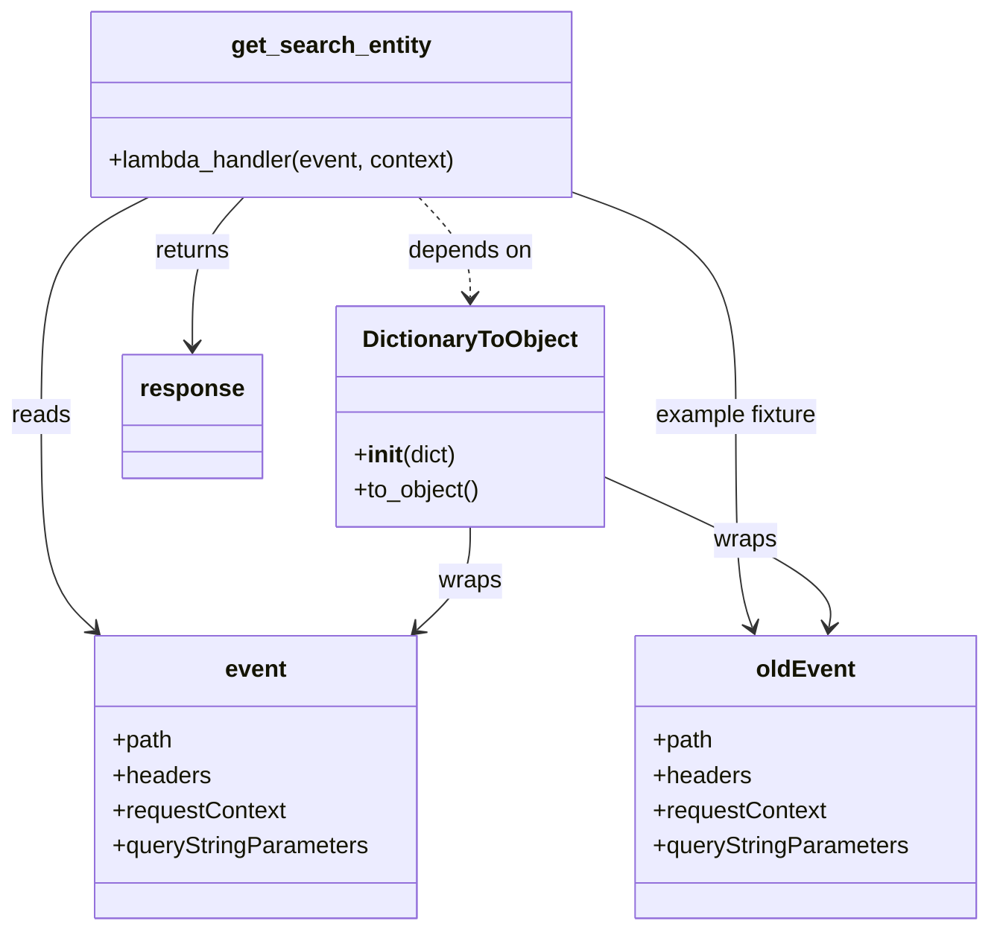

# Diagram: tools/ide_local_testing/localTest/test/entity/entity/getSearchEntity.py

> Auto-generated by Obscura crawlers

## Mermaid

### SVG

<svg id="container" width="665.244140625" xmlns="http://www.w3.org/2000/svg" class="classDiagram" height="632" viewBox="0 0 665.244140625 632" role="graphics-document document" aria-roledescription="class"><g><defs><marker id="container_class-aggregationStart" class="marker aggregation class" refX="18" refY="7" markerWidth="190" markerHeight="240" orient="auto"><path d="M 18,7 L9,13 L1,7 L9,1 Z"></path></marker></defs><defs><marker id="container_class-aggregationEnd" class="marker aggregation class" refX="1" refY="7" markerWidth="20" markerHeight="28" orient="auto"><path d="M 18,7 L9,13 L1,7 L9,1 Z"></path></marker></defs><defs><marker id="container_class-extensionStart" class="marker extension class" refX="18" refY="7" markerWidth="190" markerHeight="240" orient="auto"><path d="M 1,7 L18,13 V 1 Z"></path></marker></defs><defs><marker id="container_class-extensionEnd" class="marker extension class" refX="1" refY="7" markerWidth="20" markerHeight="28" orient="auto"><path d="M 1,1 V 13 L18,7 Z"></path></marker></defs><defs><marker id="container_class-compositionStart" class="marker composition class" refX="18" refY="7" markerWidth="190" markerHeight="240" orient="auto"><path d="M 18,7 L9,13 L1,7 L9,1 Z"></path></marker></defs><defs><marker id="container_class-compositionEnd" class="marker composition class" refX="1" refY="7" markerWidth="20" markerHeight="28" orient="auto"><path d="M 18,7 L9,13 L1,7 L9,1 Z"></path></marker></defs><defs><marker id="container_class-dependencyStart" class="marker dependency class" refX="6" refY="7" markerWidth="190" markerHeight="240" orient="auto"><path d="M 5,7 L9,13 L1,7 L9,1 Z"></path></marker></defs><defs><marker id="container_class-dependencyEnd" class="marker dependency class" refX="13" refY="7" markerWidth="20" markerHeight="28" orient="auto"><path d="M 18,7 L9,13 L14,7 L9,1 Z"></path></marker></defs><defs><marker id="container_class-lollipopStart" class="marker lollipop class" refX="13" refY="7" markerWidth="190" markerHeight="240" orient="auto"><circle stroke="black" fill="transparent" cx="7" cy="7" r="6"></circle></marker></defs><defs><marker id="container_class-lollipopEnd" class="marker lollipop class" refX="1" refY="7" markerWidth="190" markerHeight="240" orient="auto"><circle stroke="black" fill="transparent" cx="7" cy="7" r="6"></circle></marker></defs><g class="root"><g class="clusters"></g><g class="edgePaths"><path d="M280.04,134L285.769,140.167C291.498,146.333,302.956,158.667,308.685,170C314.414,181.333,314.414,191.667,314.414,196.833L314.414,202" id="id_get_search_entity_DictionaryToObject_1" class="edge-thickness-normal edge-pattern-dashed relation" style=";;;" data-edge="true" data-et="edge" data-id="id_get_search_entity_DictionaryToObject_1" data-points="W3sieCI6MjgwLjA0MDE5NTMxMjUwMDAzLCJ5IjoxMzR9LHsieCI6MzE0LjQxNDA2MjUsInkiOjE3MX0seyJ4IjozMTQuNDE0MDYyNSwieSI6MjA4fV0=" marker-end="url(#container_class-dependencyEnd)"></path><path d="M99.604,134L87.672,140.167C75.739,146.333,51.873,158.667,39.941,183.5C28.008,208.333,28.008,245.667,28.008,283C28.008,320.333,28.008,357.667,33.915,381.819C39.822,405.972,51.636,416.945,57.543,422.431L63.45,427.917" id="id_get_search_entity_event_2" class="edge-thickness-normal edge-pattern-solid relation" style=";;;" data-edge="true" data-et="edge" data-id="id_get_search_entity_event_2" data-points="W3sieCI6OTkuNjA0MjU3ODEyNSwieSI6MTM0fSx7IngiOjI4LjAwNzgxMjUsInkiOjE3MX0seyJ4IjoyOC4wMDc4MTI1LCJ5IjoyODN9LHsieCI6MjguMDA3ODEyNSwieSI6Mzk1fSx7IngiOjY3Ljg0NjI3NTg0NTg2NDY3LCJ5Ijo0MzJ9XQ==" marker-end="url(#container_class-dependencyEnd)"></path><path d="M386.34,131.125L404.559,137.77C422.779,144.416,459.217,157.708,477.437,183.021C495.656,208.333,495.656,245.667,495.656,283C495.656,320.333,495.656,357.667,497.484,381.556C499.312,405.446,502.967,415.891,504.795,421.114L506.623,426.337" id="id_get_search_entity_oldEvent_3" class="edge-thickness-normal edge-pattern-solid relation" style=";;;" data-edge="true" data-et="edge" data-id="id_get_search_entity_oldEvent_3" data-points="W3sieCI6Mzg2LjMzOTg0Mzc1LCJ5IjoxMzEuMTI0NTM1MTMwNTkwOX0seyJ4Ijo0OTUuNjU2MjUsInkiOjE3MX0seyJ4Ijo0OTUuNjU2MjUsInkiOjI4M30seyJ4Ijo0OTUuNjU2MjUsInkiOjM5NX0seyJ4Ijo1MDguNjA0ODM3Mjg4NTMzOCwieSI6NDMyfV0=" marker-end="url(#container_class-dependencyEnd)"></path><path d="M162.983,134L157.254,140.167C151.525,146.333,140.067,158.667,134.338,175.5C128.609,192.333,128.609,213.667,128.609,224.333L128.609,235" id="id_get_search_entity_response_4" class="edge-thickness-normal edge-pattern-solid relation" style=";;;" data-edge="true" data-et="edge" data-id="id_get_search_entity_response_4" data-points="W3sieCI6MTYyLjk4MzI0MjE4NzUsInkiOjEzNH0seyJ4IjoxMjguNjA5Mzc1LCJ5IjoxNzF9LHsieCI6MTI4LjYwOTM3NSwieSI6MjQxfV0=" marker-end="url(#container_class-dependencyEnd)"></path><path d="M314.414,358L314.414,364.167C314.414,370.333,314.414,382.667,308.507,394.319C302.6,405.972,290.786,416.945,284.879,422.431L278.972,427.917" id="id_DictionaryToObject_event_5" class="edge-thickness-normal edge-pattern-solid relation" style=";;;" data-edge="true" data-et="edge" data-id="id_DictionaryToObject_event_5" data-points="W3sieCI6MzE0LjQxNDA2MjUsInkiOjM1OH0seyJ4IjozMTQuNDE0MDYyNSwieSI6Mzk1fSx7IngiOjI3NC41NzU1OTkxNTQxMzUzLCJ5Ijo0MzJ9XQ==" marker-end="url(#container_class-dependencyEnd)"></path><path d="M404.625,323.661L431.004,335.551C457.382,347.441,510.139,371.22,535.712,388.289C561.285,405.357,559.673,415.714,558.867,420.893L558.062,426.071" id="id_DictionaryToObject_oldEvent_6" class="edge-thickness-normal edge-pattern-solid relation" style=";;;" data-edge="true" data-et="edge" data-id="id_DictionaryToObject_oldEvent_6" data-points="W3sieCI6NDA0LjYyNSwieSI6MzIzLjY2MTMyNjk2MTMxOTl9LHsieCI6NTYyLjg5NjQ4NDM3NSwieSI6Mzk1fSx7IngiOjU1Ny4xMzkxNDE3OTk4MTIsInkiOjQzMn1d" marker-end="url(#container_class-dependencyEnd)"></path></g><g class="edgeLabels"><g class="edgeLabel" transform="translate(314.4140625, 171)"><g class="label" data-id="id_get_search_entity_DictionaryToObject_1" transform="translate(-42.9453125, -12)"><foreignObject width="85.890625" height="24">

depends on

</foreignObject></g></g><g class="edgeLabel" transform="translate(28.0078125, 283)"><g class="label" data-id="id_get_search_entity_event_2" transform="translate(-20.0078125, -12)"><foreignObject width="40.015625" height="24">

reads

</foreignObject></g></g><g class="edgeLabel" transform="translate(495.65625, 283)"><g class="label" data-id="id_get_search_entity_oldEvent_3" transform="translate(-56.03125, -12)"><foreignObject width="112.0625" height="24">

example fixture

</foreignObject></g></g><g class="edgeLabel" transform="translate(128.609375, 171)"><g class="label" data-id="id_get_search_entity_response_4" transform="translate(-26.265625, -12)"><foreignObject width="52.53125" height="24">

returns

</foreignObject></g></g><g class="edgeLabel" transform="translate(314.4140625, 395)"><g class="label" data-id="id_DictionaryToObject_event_5" transform="translate(-21.390625, -12)"><foreignObject width="42.78125" height="24">

wraps

</foreignObject></g></g><g class="edgeLabel" transform="translate(500.8296, 367.02422)"><g class="label" data-id="id_DictionaryToObject_oldEvent_6" transform="translate(-21.390625, -12)"><foreignObject width="42.78125" height="24">

wraps

</foreignObject></g></g></g><g class="nodes"><g class="node default" id="classId-get_search_entity-0" transform="translate(221.51171875, 71)"><g class="basic label-container"><path d="M-164.828125 -63 L164.828125 -63 L164.828125 63 L-164.828125 63" stroke="none" stroke-width="0" fill="#ECECFF" style=""></path><path d="M-164.828125 -63 C-36.440265717199395 -63, 91.94759356560121 -63, 164.828125 -63 M-164.828125 -63 C-93.95591112784872 -63, -23.083697255697444 -63, 164.828125 -63 M164.828125 -63 C164.828125 -37.740349306537894, 164.828125 -12.480698613075788, 164.828125 63 M164.828125 -63 C164.828125 -22.946351382328018, 164.828125 17.107297235343964, 164.828125 63 M164.828125 63 C57.70960019353976 63, -49.40892461292049 63, -164.828125 63 M164.828125 63 C62.69916810516628 63, -39.42978878966744 63, -164.828125 63 M-164.828125 63 C-164.828125 29.755329859872134, -164.828125 -3.489340280255732, -164.828125 -63 M-164.828125 63 C-164.828125 27.79142137699379, -164.828125 -7.417157246012422, -164.828125 -63" stroke="#9370DB" stroke-width="1.3" fill="none" stroke-dasharray="0 0" style=""></path></g><g class="annotation-group text" transform="translate(0, -39)"></g><g class="label-group text" transform="translate(-65.46875, -39)"><g class="label" style="font-weight: bolder" transform="translate(0,-12)"><foreignObject width="130.9375" height="24">

get_search_entity

</foreignObject></g></g><g class="members-group text" transform="translate(-152.828125, 9)"></g><g class="methods-group text" transform="translate(-152.828125, 39)"><g class="label" style="" transform="translate(0,-12)"><foreignObject width="240.1875" height="24">

+lambda_handler(event, context)

</foreignObject></g></g><g class="divider" style=""><path d="M-164.828125 -15 C-63.29396826378918 -15, 38.240188472421636 -15, 164.828125 -15 M-164.828125 -15 C-44.32893759278193 -15, 76.17024981443615 -15, 164.828125 -15" stroke="#9370DB" stroke-width="1.3" fill="none" stroke-dasharray="0 0" style=""></path></g><g class="divider" style=""><path d="M-164.828125 9 C-34.1082088404782 9, 96.6117073190436 9, 164.828125 9 M-164.828125 9 C-52.645703762467974 9, 59.53671747506405 9, 164.828125 9" stroke="#9370DB" stroke-width="1.3" fill="none" stroke-dasharray="0 0" style=""></path></g></g><g class="node default" id="classId-DictionaryToObject-1" transform="translate(314.4140625, 283)"><g class="basic label-container"><path d="M-90.2109375 -75 L90.2109375 -75 L90.2109375 75 L-90.2109375 75" stroke="none" stroke-width="0" fill="#ECECFF" style=""></path><path d="M-90.2109375 -75 C-22.960799386907325 -75, 44.28933872618535 -75, 90.2109375 -75 M-90.2109375 -75 C-49.48905220452015 -75, -8.767166909040299 -75, 90.2109375 -75 M90.2109375 -75 C90.2109375 -16.86697278877339, 90.2109375 41.26605442245322, 90.2109375 75 M90.2109375 -75 C90.2109375 -31.278462493429927, 90.2109375 12.443075013140145, 90.2109375 75 M90.2109375 75 C51.664161198612796 75, 13.117384897225591 75, -90.2109375 75 M90.2109375 75 C37.32410397982463 75, -15.562729540350745 75, -90.2109375 75 M-90.2109375 75 C-90.2109375 32.785054185422716, -90.2109375 -9.429891629154568, -90.2109375 -75 M-90.2109375 75 C-90.2109375 32.50412897156629, -90.2109375 -9.991742056867423, -90.2109375 -75" stroke="#9370DB" stroke-width="1.3" fill="none" stroke-dasharray="0 0" style=""></path></g><g class="annotation-group text" transform="translate(0, -51)"></g><g class="label-group text" transform="translate(-70.109375, -51)"><g class="label" style="font-weight: bolder" transform="translate(0,-12)"><foreignObject width="140.21875" height="24">

DictionaryToObject

</foreignObject></g></g><g class="members-group text" transform="translate(-78.2109375, -3)"></g><g class="methods-group text" transform="translate(-78.2109375, 27)"><g class="label" style="" transform="translate(0,-12)"><foreignObject width="70.296875" height="24">

+<strong>init</strong>(dict)

</foreignObject></g><g class="label" style="" transform="translate(0,12)"><foreignObject width="86.3125" height="24">

+to_object()

</foreignObject></g></g><g class="divider" style=""><path d="M-90.2109375 -27 C-40.613142664746086 -27, 8.984652170507829 -27, 90.2109375 -27 M-90.2109375 -27 C-30.0449520045914 -27, 30.121033490817197 -27, 90.2109375 -27" stroke="#9370DB" stroke-width="1.3" fill="none" stroke-dasharray="0 0" style=""></path></g><g class="divider" style=""><path d="M-90.2109375 -3 C-28.499691258910907 -3, 33.211554982178185 -3, 90.2109375 -3 M-90.2109375 -3 C-52.42020888932618 -3, -14.629480278652366 -3, 90.2109375 -3" stroke="#9370DB" stroke-width="1.3" fill="none" stroke-dasharray="0 0" style=""></path></g></g><g class="node default" id="classId-event-2" transform="translate(171.2109375, 528)"><g class="basic label-container"><path d="M-109.2890625 -96 L109.2890625 -96 L109.2890625 96 L-109.2890625 96" stroke="none" stroke-width="0" fill="#ECECFF" style=""></path><path d="M-109.2890625 -96 C-55.21798223637702 -96, -1.146901972754037 -96, 109.2890625 -96 M-109.2890625 -96 C-52.63382992874191 -96, 4.021402642516179 -96, 109.2890625 -96 M109.2890625 -96 C109.2890625 -55.69878709869894, 109.2890625 -15.397574197397887, 109.2890625 96 M109.2890625 -96 C109.2890625 -51.455852820230575, 109.2890625 -6.91170564046115, 109.2890625 96 M109.2890625 96 C64.27643992150658 96, 19.26381734301316 96, -109.2890625 96 M109.2890625 96 C25.84374402089962 96, -57.60157445820076 96, -109.2890625 96 M-109.2890625 96 C-109.2890625 43.460875034459306, -109.2890625 -9.078249931081388, -109.2890625 -96 M-109.2890625 96 C-109.2890625 41.13718922747945, -109.2890625 -13.725621545041093, -109.2890625 -96" stroke="#9370DB" stroke-width="1.3" fill="none" stroke-dasharray="0 0" style=""></path></g><g class="annotation-group text" transform="translate(0, -72)"></g><g class="label-group text" transform="translate(-20.515625, -72)"><g class="label" style="font-weight: bolder" transform="translate(0,-12)"><foreignObject width="41.03125" height="24">

event

</foreignObject></g></g><g class="members-group text" transform="translate(-97.2890625, -24)"><g class="label" style="" transform="translate(0,-12)"><foreignObject width="41.1875" height="24">

+path

</foreignObject></g><g class="label" style="" transform="translate(0,12)"><foreignObject width="66.328125" height="24">

+headers

</foreignObject></g><g class="label" style="" transform="translate(0,36)"><foreignObject width="118.265625" height="24">

+requestContext

</foreignObject></g><g class="label" style="" transform="translate(0,60)"><foreignObject width="174.0625" height="24">

+queryStringParameters

</foreignObject></g></g><g class="methods-group text" transform="translate(-97.2890625, 96)"></g><g class="divider" style=""><path d="M-109.2890625 -48 C-52.77399370024346 -48, 3.7410750995130826 -48, 109.2890625 -48 M-109.2890625 -48 C-60.453655581854576 -48, -11.618248663709153 -48, 109.2890625 -48" stroke="#9370DB" stroke-width="1.3" fill="none" stroke-dasharray="0 0" style=""></path></g><g class="divider" style=""><path d="M-109.2890625 72 C-57.70317619286649 72, -6.117289885732987 72, 109.2890625 72 M-109.2890625 72 C-62.10550479471201 72, -14.921947089424023 72, 109.2890625 72" stroke="#9370DB" stroke-width="1.3" fill="none" stroke-dasharray="0 0" style=""></path></g></g><g class="node default" id="classId-oldEvent-3" transform="translate(542.201171875, 528)"><g class="basic label-container"><path d="M-115.04296875 -96 L115.04296875 -96 L115.04296875 96 L-115.04296875 96" stroke="none" stroke-width="0" fill="#ECECFF" style=""></path><path d="M-115.04296875 -96 C-47.480057151964715 -96, 20.08285444607057 -96, 115.04296875 -96 M-115.04296875 -96 C-37.36998248620267 -96, 40.303003777594654 -96, 115.04296875 -96 M115.04296875 -96 C115.04296875 -56.93460512326832, 115.04296875 -17.86921024653664, 115.04296875 96 M115.04296875 -96 C115.04296875 -39.99216133292998, 115.04296875 16.015677334140037, 115.04296875 96 M115.04296875 96 C55.1398245798481 96, -4.763319590303794 96, -115.04296875 96 M115.04296875 96 C64.8042876858053 96, 14.565606621610613 96, -115.04296875 96 M-115.04296875 96 C-115.04296875 43.244831352232566, -115.04296875 -9.510337295534868, -115.04296875 -96 M-115.04296875 96 C-115.04296875 44.75206288329432, -115.04296875 -6.495874233411357, -115.04296875 -96" stroke="#9370DB" stroke-width="1.3" fill="none" stroke-dasharray="0 0" style=""></path></g><g class="annotation-group text" transform="translate(0, -72)"></g><g class="label-group text" transform="translate(-32.0234375, -72)"><g class="label" style="font-weight: bolder" transform="translate(0,-12)"><foreignObject width="64.046875" height="24">

oldEvent

</foreignObject></g></g><g class="members-group text" transform="translate(-103.04296875, -24)"><g class="label" style="" transform="translate(0,-12)"><foreignObject width="41.1875" height="24">

+path

</foreignObject></g><g class="label" style="" transform="translate(0,12)"><foreignObject width="66.328125" height="24">

+headers

</foreignObject></g><g class="label" style="" transform="translate(0,36)"><foreignObject width="118.265625" height="24">

+requestContext

</foreignObject></g><g class="label" style="" transform="translate(0,60)"><foreignObject width="174.0625" height="24">

+queryStringParameters

</foreignObject></g></g><g class="methods-group text" transform="translate(-103.04296875, 96)"></g><g class="divider" style=""><path d="M-115.04296875 -48 C-31.774777077746165 -48, 51.49341459450767 -48, 115.04296875 -48 M-115.04296875 -48 C-45.62432027506986 -48, 23.794328199860274 -48, 115.04296875 -48" stroke="#9370DB" stroke-width="1.3" fill="none" stroke-dasharray="0 0" style=""></path></g><g class="divider" style=""><path d="M-115.04296875 72 C-54.27770175376193 72, 6.487565242476137 72, 115.04296875 72 M-115.04296875 72 C-26.386544640431893 72, 62.269879469136214 72, 115.04296875 72" stroke="#9370DB" stroke-width="1.3" fill="none" stroke-dasharray="0 0" style=""></path></g></g><g class="node default" id="classId-response-4" transform="translate(128.609375, 283)"><g class="basic label-container"><path d="M-45.59375 -42 L45.59375 -42 L45.59375 42 L-45.59375 42" stroke="none" stroke-width="0" fill="#ECECFF" style=""></path><path d="M-45.59375 -42 C-20.701621866626528 -42, 4.190506266746944 -42, 45.59375 -42 M-45.59375 -42 C-19.708057303690655 -42, 6.17763539261869 -42, 45.59375 -42 M45.59375 -42 C45.59375 -24.037274778746276, 45.59375 -6.074549557492553, 45.59375 42 M45.59375 -42 C45.59375 -12.933166388201549, 45.59375 16.133667223596902, 45.59375 42 M45.59375 42 C23.34961617545081 42, 1.1054823509016174 42, -45.59375 42 M45.59375 42 C10.424281233368788 42, -24.745187533262424 42, -45.59375 42 M-45.59375 42 C-45.59375 11.43613504272573, -45.59375 -19.12772991454854, -45.59375 -42 M-45.59375 42 C-45.59375 21.87242185697504, -45.59375 1.7448437139500825, -45.59375 -42" stroke="#9370DB" stroke-width="1.3" fill="none" stroke-dasharray="0 0" style=""></path></g><g class="annotation-group text" transform="translate(0, -18)"></g><g class="label-group text" transform="translate(-33.59375, -18)"><g class="label" style="font-weight: bolder" transform="translate(0,-12)"><foreignObject width="67.1875" height="24">

response

</foreignObject></g></g><g class="members-group text" transform="translate(-33.59375, 30)"></g><g class="methods-group text" transform="translate(-33.59375, 60)"></g><g class="divider" style=""><path d="M-45.59375 6 C-10.748603141700883 6, 24.096543716598234 6, 45.59375 6 M-45.59375 6 C-18.93510533215794 6, 7.723539335684123 6, 45.59375 6" stroke="#9370DB" stroke-width="1.3" fill="none" stroke-dasharray="0 0" style=""></path></g><g class="divider" style=""><path d="M-45.59375 24 C-10.008796501235302 24, 25.576156997529395 24, 45.59375 24 M-45.59375 24 C-19.97192559207784 24, 5.649898815844317 24, 45.59375 24" stroke="#9370DB" stroke-width="1.3" fill="none" stroke-dasharray="0 0" style=""></path></g></g></g></g></g></svg>
