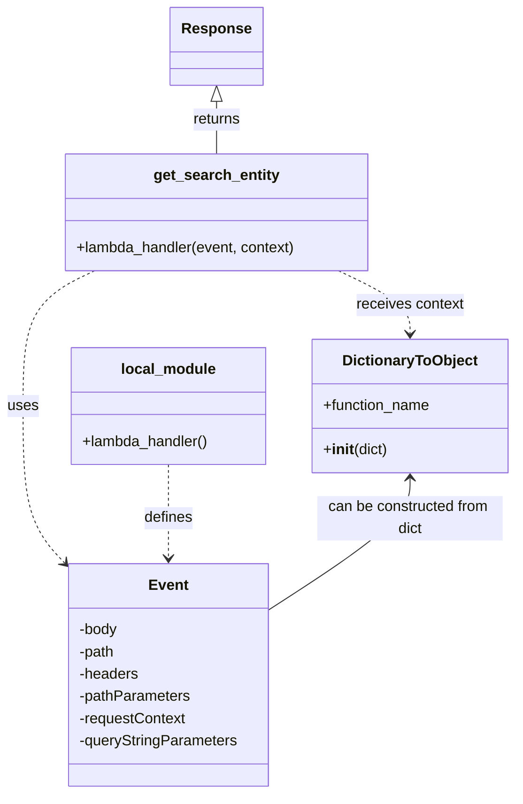

# Diagram: tools/ide_local_testing/localTest/test/entity/entity/getSearchEntityByMilestone.py


> Auto-generated by Obscura crawlers

## Diagram 1

```mermaid
flowchart LR
    Event[Event (dict) with path, headers, queryStringParameters] -->|calls| GetSearchEntity[getSearchEntity.lambda_handler(event, context)]
    DictionaryToObjectObj[DictionaryToObject({function_name: "getStatusUpdateEventsByLambda"})] -->|passed as context| GetSearchEntity
    GetSearchEntity --> Response[response]
    LocalLambda[local lambda_handler() - pass] -.-> GetSearchEntity
    Response -->|printed| Print[print(response)]
```

> SVG rendering failed for this diagram.

## Diagram 2



### SVG

<svg id="container" width="556.5546875" xmlns="http://www.w3.org/2000/svg" class="classDiagram" height="856" viewBox="0 0 556.5546875 856" role="graphics-document document" aria-roledescription="class"><style>#container{font-family:"trebuchet ms",verdana,arial,sans-serif;font-size:16px;fill:#333;}@keyframes edge-animation-frame{from{stroke-dashoffset:0;}}@keyframes dash{to{stroke-dashoffset:0;}}#container .edge-animation-slow{stroke-dasharray:9,5!important;stroke-dashoffset:900;animation:dash 50s linear infinite;stroke-linecap:round;}#container .edge-animation-fast{stroke-dasharray:9,5!important;stroke-dashoffset:900;animation:dash 20s linear infinite;stroke-linecap:round;}#container .error-icon{fill:#552222;}#container .error-text{fill:#552222;stroke:#552222;}#container .edge-thickness-normal{stroke-width:1px;}#container .edge-thickness-thick{stroke-width:3.5px;}#container .edge-pattern-solid{stroke-dasharray:0;}#container .edge-thickness-invisible{stroke-width:0;fill:none;}#container .edge-pattern-dashed{stroke-dasharray:3;}#container .edge-pattern-dotted{stroke-dasharray:2;}#container .marker{fill:#333333;stroke:#333333;}#container .marker.cross{stroke:#333333;}#container svg{font-family:"trebuchet ms",verdana,arial,sans-serif;font-size:16px;}#container p{margin:0;}#container g.classGroup text{fill:#9370DB;stroke:none;font-family:"trebuchet ms",verdana,arial,sans-serif;font-size:10px;}#container g.classGroup text .title{font-weight:bolder;}#container .nodeLabel,#container .edgeLabel{color:#131300;}#container .edgeLabel .label rect{fill:#ECECFF;}#container .label text{fill:#131300;}#container .labelBkg{background:#ECECFF;}#container .edgeLabel .label span{background:#ECECFF;}#container .classTitle{font-weight:bolder;}#container .node rect,#container .node circle,#container .node ellipse,#container .node polygon,#container .node path{fill:#ECECFF;stroke:#9370DB;stroke-width:1px;}#container .divider{stroke:#9370DB;stroke-width:1;}#container g.clickable{cursor:pointer;}#container g.classGroup rect{fill:#ECECFF;stroke:#9370DB;}#container g.classGroup line{stroke:#9370DB;stroke-width:1;}#container .classLabel .box{stroke:none;stroke-width:0;fill:#ECECFF;opacity:0.5;}#container .classLabel .label{fill:#9370DB;font-size:10px;}#container .relation{stroke:#333333;stroke-width:1;fill:none;}#container .dashed-line{stroke-dasharray:3;}#container .dotted-line{stroke-dasharray:1 2;}#container #compositionStart,#container .composition{fill:#333333!important;stroke:#333333!important;stroke-width:1;}#container #compositionEnd,#container .composition{fill:#333333!important;stroke:#333333!important;stroke-width:1;}#container #dependencyStart,#container .dependency{fill:#333333!important;stroke:#333333!important;stroke-width:1;}#container #dependencyStart,#container .dependency{fill:#333333!important;stroke:#333333!important;stroke-width:1;}#container #extensionStart,#container .extension{fill:transparent!important;stroke:#333333!important;stroke-width:1;}#container #extensionEnd,#container .extension{fill:transparent!important;stroke:#333333!important;stroke-width:1;}#container #aggregationStart,#container .aggregation{fill:transparent!important;stroke:#333333!important;stroke-width:1;}#container #aggregationEnd,#container .aggregation{fill:transparent!important;stroke:#333333!important;stroke-width:1;}#container #lollipopStart,#container .lollipop{fill:#ECECFF!important;stroke:#333333!important;stroke-width:1;}#container #lollipopEnd,#container .lollipop{fill:#ECECFF!important;stroke:#333333!important;stroke-width:1;}#container .edgeTerminals{font-size:11px;line-height:initial;}#container .classTitleText{text-anchor:middle;font-size:18px;fill:#333;}#container .label-icon{display:inline-block;height:1em;overflow:visible;vertical-align:-0.125em;}#container .node .label-icon path{fill:currentColor;stroke:revert;stroke-width:revert;}#container :root{--mermaid-font-family:"trebuchet ms",verdana,arial,sans-serif;}</style><g><defs><marker id="container_class-aggregationStart" class="marker aggregation class" refX="18" refY="7" markerWidth="190" markerHeight="240" orient="auto"><path d="M 18,7 L9,13 L1,7 L9,1 Z"></path></marker></defs><defs><marker id="container_class-aggregationEnd" class="marker aggregation class" refX="1" refY="7" markerWidth="20" markerHeight="28" orient="auto"><path d="M 18,7 L9,13 L1,7 L9,1 Z"></path></marker></defs><defs><marker id="container_class-extensionStart" class="marker extension class" refX="18" refY="7" markerWidth="190" markerHeight="240" orient="auto"><path d="M 1,7 L18,13 V 1 Z"></path></marker></defs><defs><marker id="container_class-extensionEnd" class="marker extension class" refX="1" refY="7" markerWidth="20" markerHeight="28" orient="auto"><path d="M 1,1 V 13 L18,7 Z"></path></marker></defs><defs><marker id="container_class-compositionStart" class="marker composition class" refX="18" refY="7" markerWidth="190" markerHeight="240" orient="auto"><path d="M 18,7 L9,13 L1,7 L9,1 Z"></path></marker></defs><defs><marker id="container_class-compositionEnd" class="marker composition class" refX="1" refY="7" markerWidth="20" markerHeight="28" orient="auto"><path d="M 18,7 L9,13 L1,7 L9,1 Z"></path></marker></defs><defs><marker id="container_class-dependencyStart" class="marker dependency class" refX="6" refY="7" markerWidth="190" markerHeight="240" orient="auto"><path d="M 5,7 L9,13 L1,7 L9,1 Z"></path></marker></defs><defs><marker id="container_class-dependencyEnd" class="marker dependency class" refX="13" refY="7" markerWidth="20" markerHeight="28" orient="auto"><path d="M 18,7 L9,13 L14,7 L9,1 Z"></path></marker></defs><defs><marker id="container_class-lollipopStart" class="marker lollipop class" refX="13" refY="7" markerWidth="190" markerHeight="240" orient="auto"><circle stroke="black" fill="transparent" cx="7" cy="7" r="6"></circle></marker></defs><defs><marker id="container_class-lollipopEnd" class="marker lollipop class" refX="1" refY="7" markerWidth="190" markerHeight="240" orient="auto"><circle stroke="black" fill="transparent" cx="7" cy="7" r="6"></circle></marker></defs><g class="root"><g class="clusters"></g><g class="edgePaths"><path d="M101.89,292L88.99,298.167C76.091,304.333,50.291,316.667,37.392,341C24.492,365.333,24.492,401.667,24.492,440C24.492,478.333,24.492,518.667,31.931,546.837C39.37,575.007,54.248,591.014,61.687,599.017L69.126,607.02" id="id_get_search_entity_Event_1" class="edge-thickness-normal edge-pattern-dashed relation" style=";;;" data-edge="true" data-et="edge" data-id="id_get_search_entity_Event_1" data-points="W3sieCI6MTAxLjg5MDExNzE4NzUwMDAxLCJ5IjoyOTJ9LHsieCI6MjQuNDkyMTg3NSwieSI6MzI5fSx7IngiOjI0LjQ5MjE4NzUsInkiOjQzOH0seyJ4IjoyNC40OTIxODc1LCJ5Ijo1NTl9LHsieCI6NzMuMjEwOTM3NSwieSI6NjExLjQxNTA4OTY0NzYyNjR9XQ==" marker-end="url(#container_class-dependencyEnd)"></path><path d="M365.461,292L378.361,298.167C391.261,304.333,417.06,316.667,429.96,328C442.859,339.333,442.859,349.667,442.859,354.833L442.859,360" id="id_get_search_entity_DictionaryToObject_2" class="edge-thickness-normal edge-pattern-dashed relation" style=";;;" data-edge="true" data-et="edge" data-id="id_get_search_entity_DictionaryToObject_2" data-points="W3sieCI6MzY1LjQ2MTQ0NTMxMjUsInkiOjI5Mn0seyJ4Ijo0NDIuODU5Mzc1LCJ5IjozMjl9LHsieCI6NDQyLjg1OTM3NSwieSI6MzY2fV0=" marker-end="url(#container_class-dependencyEnd)"></path><path d="M181.574,501L181.574,510.667C181.574,520.333,181.574,539.667,181.574,556.5C181.574,573.333,181.574,587.667,181.574,594.833L181.574,602" id="id_local_module_Event_3" class="edge-thickness-normal edge-pattern-dashed relation" style=";;;" data-edge="true" data-et="edge" data-id="id_local_module_Event_3" data-points="W3sieCI6MTgxLjU3NDIxODc1LCJ5Ijo1MDF9LHsieCI6MTgxLjU3NDIxODc1LCJ5Ijo1NTl9LHsieCI6MTgxLjU3NDIxODc1LCJ5Ijo2MDh9XQ==" marker-end="url(#container_class-dependencyEnd)"></path><path d="M233.676,109.25L233.676,112.542C233.676,115.833,233.676,122.417,233.676,131.875C233.676,141.333,233.676,153.667,233.676,159.833L233.676,166" id="id_Response_get_search_entity_4" class="edge-thickness-normal edge-pattern-solid relation" style=";;;" data-edge="true" data-et="edge" data-id="id_Response_get_search_entity_4" data-points="W3sieCI6MjMzLjY3NTc4MTI1LCJ5Ijo5Mn0seyJ4IjoyMzMuNjc1NzgxMjUsInkiOjEyOX0seyJ4IjoyMzMuNjc1NzgxMjUsInkiOjE2Nn1d" marker-start="url(#container_class-extensionStart)"></path><path d="M442.859,516L442.859,523.167C442.859,530.333,442.859,544.667,417.372,568.318C391.885,591.97,340.911,624.94,315.424,641.425L289.938,657.91" id="id_DictionaryToObject_Event_5" class="edge-thickness-normal edge-pattern-solid relation" style=";;;" data-edge="true" data-et="edge" data-id="id_DictionaryToObject_Event_5" data-points="W3sieCI6NDQyLjg1OTM3NSwieSI6NTEwfSx7IngiOjQ0Mi44NTkzNzUsInkiOjU1OX0seyJ4IjoyODkuOTM3NSwieSI6NjU3LjkxMDMxNDEwMjQ2ODN9XQ==" marker-start="url(#container_class-dependencyStart)"></path></g><g class="edgeLabels"><g class="edgeLabel" transform="translate(24.4921875, 438)"><g class="label" data-id="id_get_search_entity_Event_1" transform="translate(-16.4921875, -12)"><foreignObject width="32.984375" height="24"><div xmlns="http://www.w3.org/1999/xhtml" class="labelBkg" style="display: table-cell; white-space: nowrap; line-height: 1.5; max-width: 200px; text-align: center;"><span class="edgeLabel"><p>uses</p></span></div></foreignObject></g></g><g class="edgeLabel" transform="translate(442.859375, 329)"><g class="label" data-id="id_get_search_entity_DictionaryToObject_2" transform="translate(-58.4609375, -12)"><foreignObject width="116.921875" height="24"><div xmlns="http://www.w3.org/1999/xhtml" class="labelBkg" style="display: table-cell; white-space: nowrap; line-height: 1.5; max-width: 200px; text-align: center;"><span class="edgeLabel"><p>receives context</p></span></div></foreignObject></g></g><g class="edgeLabel" transform="translate(181.57421875, 559)"><g class="label" data-id="id_local_module_Event_3" transform="translate(-26.53125, -12)"><foreignObject width="53.0625" height="24"><div xmlns="http://www.w3.org/1999/xhtml" class="labelBkg" style="display: table-cell; white-space: nowrap; line-height: 1.5; max-width: 200px; text-align: center;"><span class="edgeLabel"><p>defines</p></span></div></foreignObject></g></g><g class="edgeLabel" transform="translate(233.67578125, 129)"><g class="label" data-id="id_Response_get_search_entity_4" transform="translate(-26.265625, -12)"><foreignObject width="52.53125" height="24"><div xmlns="http://www.w3.org/1999/xhtml" class="labelBkg" style="display: table-cell; white-space: nowrap; line-height: 1.5; max-width: 200px; text-align: center;"><span class="edgeLabel"><p>returns</p></span></div></foreignObject></g></g><g class="edgeLabel" transform="translate(442.859375, 559)"><g class="label" data-id="id_DictionaryToObject_Event_5" transform="translate(-100, -24)"><foreignObject width="200" height="48"><div xmlns="http://www.w3.org/1999/xhtml" class="labelBkg" style="display: table; white-space: break-spaces; line-height: 1.5; max-width: 200px; text-align: center; width: 200px;"><span class="edgeLabel"><p>can be constructed from dict</p></span></div></foreignObject></g></g></g><g class="nodes"><g class="node default" id="classId-get_search_entity-0" transform="translate(233.67578125, 229)"><g class="basic label-container"><path d="M-164.828125 -63 L164.828125 -63 L164.828125 63 L-164.828125 63" stroke="none" stroke-width="0" fill="#ECECFF" style=""></path><path d="M-164.828125 -63 C-42.19187612085402 -63, 80.44437275829196 -63, 164.828125 -63 M-164.828125 -63 C-68.47524324169623 -63, 27.877638516607533 -63, 164.828125 -63 M164.828125 -63 C164.828125 -15.928172478530456, 164.828125 31.143655042939088, 164.828125 63 M164.828125 -63 C164.828125 -22.53121064880915, 164.828125 17.9375787023817, 164.828125 63 M164.828125 63 C94.67699090595471 63, 24.52585681190942 63, -164.828125 63 M164.828125 63 C60.44465710736142 63, -43.938810785277155 63, -164.828125 63 M-164.828125 63 C-164.828125 15.884845240466646, -164.828125 -31.230309519066708, -164.828125 -63 M-164.828125 63 C-164.828125 17.35815681297671, -164.828125 -28.28368637404658, -164.828125 -63" stroke="#9370DB" stroke-width="1.3" fill="none" stroke-dasharray="0 0" style=""></path></g><g class="annotation-group text" transform="translate(0, -39)"></g><g class="label-group text" transform="translate(-65.46875, -39)"><g class="label" style="font-weight: bolder" transform="translate(0,-12)"><foreignObject width="130.9375" height="24"><div xmlns="http://www.w3.org/1999/xhtml" style="display: table-cell; white-space: nowrap; line-height: 1.5; max-width: 178px; text-align: center;"><span class="nodeLabel markdown-node-label" style=""><p>get_search_entity</p></span></div></foreignObject></g></g><g class="members-group text" transform="translate(-152.828125, 9)"></g><g class="methods-group text" transform="translate(-152.828125, 39)"><g class="label" style="" transform="translate(0,-12)"><foreignObject width="240.1875" height="24"><div xmlns="http://www.w3.org/1999/xhtml" style="display: table-cell; white-space: nowrap; line-height: 1.5; max-width: 298px; text-align: center;"><span class="nodeLabel markdown-node-label" style=""><p>+lambda_handler(event, context)</p></span></div></foreignObject></g></g><g class="divider" style=""><path d="M-164.828125 -15 C-65.21300861475484 -15, 34.40210777049032 -15, 164.828125 -15 M-164.828125 -15 C-78.58245751690937 -15, 7.663209966181256 -15, 164.828125 -15" stroke="#9370DB" stroke-width="1.3" fill="none" stroke-dasharray="0 0" style=""></path></g><g class="divider" style=""><path d="M-164.828125 9 C-77.7046734671976 9, 9.418778065604812 9, 164.828125 9 M-164.828125 9 C-74.69144217925636 9, 15.445240641487288 9, 164.828125 9" stroke="#9370DB" stroke-width="1.3" fill="none" stroke-dasharray="0 0" style=""></path></g></g><g class="node default" id="classId-DictionaryToObject-1" transform="translate(442.859375, 438)"><g class="basic label-container"><path d="M-105.6953125 -72 L105.6953125 -72 L105.6953125 72 L-105.6953125 72" stroke="none" stroke-width="0" fill="#ECECFF" style=""></path><path d="M-105.6953125 -72 C-25.85934397092481 -72, 53.97662455815038 -72, 105.6953125 -72 M-105.6953125 -72 C-34.298307602162936 -72, 37.09869729567413 -72, 105.6953125 -72 M105.6953125 -72 C105.6953125 -18.77729996485737, 105.6953125 34.44540007028526, 105.6953125 72 M105.6953125 -72 C105.6953125 -33.15401058430866, 105.6953125 5.691978831382684, 105.6953125 72 M105.6953125 72 C46.962236678675545 72, -11.77083914264891 72, -105.6953125 72 M105.6953125 72 C29.013070024480186 72, -47.66917245103963 72, -105.6953125 72 M-105.6953125 72 C-105.6953125 19.82923389735455, -105.6953125 -32.3415322052909, -105.6953125 -72 M-105.6953125 72 C-105.6953125 28.704102328168567, -105.6953125 -14.591795343662866, -105.6953125 -72" stroke="#9370DB" stroke-width="1.3" fill="none" stroke-dasharray="0 0" style=""></path></g><g class="annotation-group text" transform="translate(0, -48)"></g><g class="label-group text" transform="translate(-70.109375, -48)"><g class="label" style="font-weight: bolder" transform="translate(0,-12)"><foreignObject width="140.21875" height="24"><div xmlns="http://www.w3.org/1999/xhtml" style="display: table-cell; white-space: nowrap; line-height: 1.5; max-width: 188px; text-align: center;"><span class="nodeLabel markdown-node-label" style=""><p>DictionaryToObject</p></span></div></foreignObject></g></g><g class="members-group text" transform="translate(-93.6953125, 0)"><g class="label" style="" transform="translate(0,-12)"><foreignObject width="117.28125" height="24"><div xmlns="http://www.w3.org/1999/xhtml" style="display: table-cell; white-space: nowrap; line-height: 1.5; max-width: 175px; text-align: center;"><span class="nodeLabel markdown-node-label" style=""><p>+function_name</p></span></div></foreignObject></g></g><g class="methods-group text" transform="translate(-93.6953125, 48)"><g class="label" style="" transform="translate(0,-12)"><foreignObject width="70.296875" height="24"><div xmlns="http://www.w3.org/1999/xhtml" style="display: table-cell; white-space: nowrap; line-height: 1.5; max-width: 159px; text-align: center;"><span class="nodeLabel markdown-node-label" style=""><p>+<strong>init</strong>(dict)</p></span></div></foreignObject></g></g><g class="divider" style=""><path d="M-105.6953125 -24 C-24.185318843168503 -24, 57.324674813662995 -24, 105.6953125 -24 M-105.6953125 -24 C-49.56473503803127 -24, 6.565842423937454 -24, 105.6953125 -24" stroke="#9370DB" stroke-width="1.3" fill="none" stroke-dasharray="0 0" style=""></path></g><g class="divider" style=""><path d="M-105.6953125 24 C-27.803194918388954 24, 50.08892266322209 24, 105.6953125 24 M-105.6953125 24 C-59.27254227793903 24, -12.849772055878063 24, 105.6953125 24" stroke="#9370DB" stroke-width="1.3" fill="none" stroke-dasharray="0 0" style=""></path></g></g><g class="node default" id="classId-local_module-2" transform="translate(181.57421875, 438)"><g class="basic label-container"><path d="M-105.58984375 -63 L105.58984375 -63 L105.58984375 63 L-105.58984375 63" stroke="none" stroke-width="0" fill="#ECECFF" style=""></path><path d="M-105.58984375 -63 C-34.700303881133365 -63, 36.18923598773327 -63, 105.58984375 -63 M-105.58984375 -63 C-49.0631852070064 -63, 7.463473335987203 -63, 105.58984375 -63 M105.58984375 -63 C105.58984375 -19.150034071063985, 105.58984375 24.69993185787203, 105.58984375 63 M105.58984375 -63 C105.58984375 -34.85254047040219, 105.58984375 -6.705080940804386, 105.58984375 63 M105.58984375 63 C31.74457429244339 63, -42.10069516511322 63, -105.58984375 63 M105.58984375 63 C29.708588174894132 63, -46.172667400211736 63, -105.58984375 63 M-105.58984375 63 C-105.58984375 27.077939685690552, -105.58984375 -8.844120628618896, -105.58984375 -63 M-105.58984375 63 C-105.58984375 30.55010830097074, -105.58984375 -1.899783398058517, -105.58984375 -63" stroke="#9370DB" stroke-width="1.3" fill="none" stroke-dasharray="0 0" style=""></path></g><g class="annotation-group text" transform="translate(0, -39)"></g><g class="label-group text" transform="translate(-49.1640625, -39)"><g class="label" style="font-weight: bolder" transform="translate(0,-12)"><foreignObject width="98.328125" height="24"><div xmlns="http://www.w3.org/1999/xhtml" style="display: table-cell; white-space: nowrap; line-height: 1.5; max-width: 148px; text-align: center;"><span class="nodeLabel markdown-node-label" style=""><p>local_module</p></span></div></foreignObject></g></g><g class="members-group text" transform="translate(-93.58984375, 9)"></g><g class="methods-group text" transform="translate(-93.58984375, 39)"><g class="label" style="" transform="translate(0,-12)"><foreignObject width="138.015625" height="24"><div xmlns="http://www.w3.org/1999/xhtml" style="display: table-cell; white-space: nowrap; line-height: 1.5; max-width: 195px; text-align: center;"><span class="nodeLabel markdown-node-label" style=""><p>+lambda_handler()</p></span></div></foreignObject></g></g><g class="divider" style=""><path d="M-105.58984375 -15 C-37.280820305607904 -15, 31.028203138784193 -15, 105.58984375 -15 M-105.58984375 -15 C-61.0481242625434 -15, -16.506404775086807 -15, 105.58984375 -15" stroke="#9370DB" stroke-width="1.3" fill="none" stroke-dasharray="0 0" style=""></path></g><g class="divider" style=""><path d="M-105.58984375 9 C-46.67513971360942 9, 12.239564322781163 9, 105.58984375 9 M-105.58984375 9 C-54.68941045836909 9, -3.788977166738178 9, 105.58984375 9" stroke="#9370DB" stroke-width="1.3" fill="none" stroke-dasharray="0 0" style=""></path></g></g><g class="node default" id="classId-Event-3" transform="translate(181.57421875, 728)"><g class="basic label-container"><path d="M-108.36328125 -120 L108.36328125 -120 L108.36328125 120 L-108.36328125 120" stroke="none" stroke-width="0" fill="#ECECFF" style=""></path><path d="M-108.36328125 -120 C-29.914349284178 -120, 48.534582681644 -120, 108.36328125 -120 M-108.36328125 -120 C-30.855517560008167 -120, 46.652246129983666 -120, 108.36328125 -120 M108.36328125 -120 C108.36328125 -28.687371646772448, 108.36328125 62.625256706455104, 108.36328125 120 M108.36328125 -120 C108.36328125 -51.28320692257732, 108.36328125 17.433586154845358, 108.36328125 120 M108.36328125 120 C32.01106925684131 120, -44.34114273631738 120, -108.36328125 120 M108.36328125 120 C24.55427211645788 120, -59.25473701708424 120, -108.36328125 120 M-108.36328125 120 C-108.36328125 66.11021311773268, -108.36328125 12.220426235465354, -108.36328125 -120 M-108.36328125 120 C-108.36328125 37.3244869993955, -108.36328125 -45.35102600120899, -108.36328125 -120" stroke="#9370DB" stroke-width="1.3" fill="none" stroke-dasharray="0 0" style=""></path></g><g class="annotation-group text" transform="translate(0, -96)"></g><g class="label-group text" transform="translate(-20.2109375, -96)"><g class="label" style="font-weight: bolder" transform="translate(0,-12)"><foreignObject width="40.421875" height="24"><div xmlns="http://www.w3.org/1999/xhtml" style="display: table-cell; white-space: nowrap; line-height: 1.5; max-width: 90px; text-align: center;"><span class="nodeLabel markdown-node-label" style=""><p>Event</p></span></div></foreignObject></g></g><g class="members-group text" transform="translate(-96.36328125, -48)"><g class="label" style="" transform="translate(0,-12)"><foreignObject width="42.75" height="24"><div xmlns="http://www.w3.org/1999/xhtml" style="display: table-cell; white-space: nowrap; line-height: 1.5; max-width: 100px; text-align: center;"><span class="nodeLabel markdown-node-label" style=""><p>-body</p></span></div></foreignObject></g><g class="label" style="" transform="translate(0,12)"><foreignObject width="39.65625" height="24"><div xmlns="http://www.w3.org/1999/xhtml" style="display: table-cell; white-space: nowrap; line-height: 1.5; max-width: 97px; text-align: center;"><span class="nodeLabel markdown-node-label" style=""><p>-path</p></span></div></foreignObject></g><g class="label" style="" transform="translate(0,36)"><foreignObject width="64.796875" height="24"><div xmlns="http://www.w3.org/1999/xhtml" style="display: table-cell; white-space: nowrap; line-height: 1.5; max-width: 122px; text-align: center;"><span class="nodeLabel markdown-node-label" style=""><p>-headers</p></span></div></foreignObject></g><g class="label" style="" transform="translate(0,60)"><foreignObject width="121.1875" height="24"><div xmlns="http://www.w3.org/1999/xhtml" style="display: table-cell; white-space: nowrap; line-height: 1.5; max-width: 179px; text-align: center;"><span class="nodeLabel markdown-node-label" style=""><p>-pathParameters</p></span></div></foreignObject></g><g class="label" style="" transform="translate(0,84)"><foreignObject width="116.734375" height="24"><div xmlns="http://www.w3.org/1999/xhtml" style="display: table-cell; white-space: nowrap; line-height: 1.5; max-width: 174px; text-align: center;"><span class="nodeLabel markdown-node-label" style=""><p>-requestContext</p></span></div></foreignObject></g><g class="label" style="" transform="translate(0,108)"><foreignObject width="172.515625" height="24"><div xmlns="http://www.w3.org/1999/xhtml" style="display: table-cell; white-space: nowrap; line-height: 1.5; max-width: 230px; text-align: center;"><span class="nodeLabel markdown-node-label" style=""><p>-queryStringParameters</p></span></div></foreignObject></g></g><g class="methods-group text" transform="translate(-96.36328125, 120)"></g><g class="divider" style=""><path d="M-108.36328125 -72 C-33.06008462295017 -72, 42.24311200409966 -72, 108.36328125 -72 M-108.36328125 -72 C-48.38723884929191 -72, 11.588803551416177 -72, 108.36328125 -72" stroke="#9370DB" stroke-width="1.3" fill="none" stroke-dasharray="0 0" style=""></path></g><g class="divider" style=""><path d="M-108.36328125 96 C-39.120069346769014 96, 30.12314255646197 96, 108.36328125 96 M-108.36328125 96 C-40.15803355299822 96, 28.04721414400356 96, 108.36328125 96" stroke="#9370DB" stroke-width="1.3" fill="none" stroke-dasharray="0 0" style=""></path></g></g><g class="node default" id="classId-Response-4" transform="translate(233.67578125, 50)"><g class="basic label-container"><path d="M-47.4453125 -42 L47.4453125 -42 L47.4453125 42 L-47.4453125 42" stroke="none" stroke-width="0" fill="#ECECFF" style=""></path><path d="M-47.4453125 -42 C-11.590677527689792 -42, 24.263957444620416 -42, 47.4453125 -42 M-47.4453125 -42 C-15.137807351103042 -42, 17.169697797793916 -42, 47.4453125 -42 M47.4453125 -42 C47.4453125 -22.123106808016452, 47.4453125 -2.246213616032904, 47.4453125 42 M47.4453125 -42 C47.4453125 -25.155881576463376, 47.4453125 -8.311763152926751, 47.4453125 42 M47.4453125 42 C28.41932466471254 42, 9.393336829425081 42, -47.4453125 42 M47.4453125 42 C26.578869031613134 42, 5.712425563226269 42, -47.4453125 42 M-47.4453125 42 C-47.4453125 18.470134058047183, -47.4453125 -5.059731883905634, -47.4453125 -42 M-47.4453125 42 C-47.4453125 9.676629519679196, -47.4453125 -22.64674096064161, -47.4453125 -42" stroke="#9370DB" stroke-width="1.3" fill="none" stroke-dasharray="0 0" style=""></path></g><g class="annotation-group text" transform="translate(0, -18)"></g><g class="label-group text" transform="translate(-35.4453125, -18)"><g class="label" style="font-weight: bolder" transform="translate(0,-12)"><foreignObject width="70.890625" height="24"><div xmlns="http://www.w3.org/1999/xhtml" style="display: table-cell; white-space: nowrap; line-height: 1.5; max-width: 120px; text-align: center;"><span class="nodeLabel markdown-node-label" style=""><p>Response</p></span></div></foreignObject></g></g><g class="members-group text" transform="translate(-35.4453125, 30)"></g><g class="methods-group text" transform="translate(-35.4453125, 60)"></g><g class="divider" style=""><path d="M-47.4453125 6 C-25.972733522231607 6, -4.500154544463214 6, 47.4453125 6 M-47.4453125 6 C-24.649269648503342 6, -1.853226797006684 6, 47.4453125 6" stroke="#9370DB" stroke-width="1.3" fill="none" stroke-dasharray="0 0" style=""></path></g><g class="divider" style=""><path d="M-47.4453125 24 C-22.00380680029305 24, 3.4376988994139026 24, 47.4453125 24 M-47.4453125 24 C-11.777722539560493 24, 23.889867420879014 24, 47.4453125 24" stroke="#9370DB" stroke-width="1.3" fill="none" stroke-dasharray="0 0" style=""></path></g></g></g></g></g></svg>
