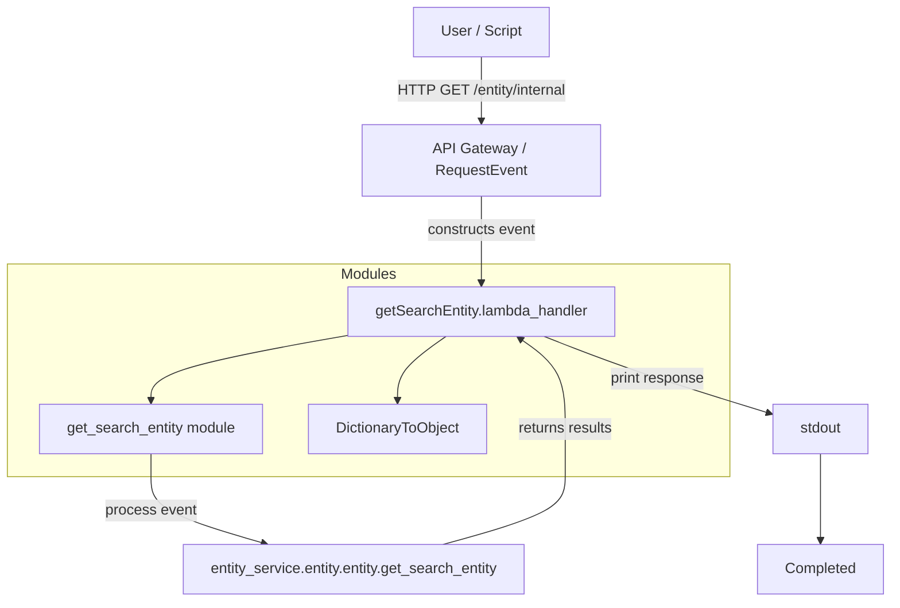

# Diagram: tools/ide_local_testing/localTest/test/entity/entity/getSearchEntityInternal.py

> Auto-generated by Obscura crawlers

## Mermaid

### SVG

<svg id="container" width="988.4765625" xmlns="http://www.w3.org/2000/svg" class="flowchart" height="656" viewBox="0 0 988.4765625 656" role="graphics-document document" aria-roledescription="flowchart-v2"><g><marker id="container_flowchart-v2-pointEnd" class="marker flowchart-v2" viewBox="0 0 10 10" refX="5" refY="5" markerUnits="userSpaceOnUse" markerWidth="8" markerHeight="8" orient="auto"><path d="M 0 0 L 10 5 L 0 10 z" class="arrowMarkerPath" style="stroke-width: 1; stroke-dasharray: 1, 0;"></path></marker><marker id="container_flowchart-v2-pointStart" class="marker flowchart-v2" viewBox="0 0 10 10" refX="4.5" refY="5" markerUnits="userSpaceOnUse" markerWidth="8" markerHeight="8" orient="auto"><path d="M 0 5 L 10 10 L 10 0 z" class="arrowMarkerPath" style="stroke-width: 1; stroke-dasharray: 1, 0;"></path></marker><marker id="container_flowchart-v2-circleEnd" class="marker flowchart-v2" viewBox="0 0 10 10" refX="11" refY="5" markerUnits="userSpaceOnUse" markerWidth="11" markerHeight="11" orient="auto"><circle cx="5" cy="5" r="5" class="arrowMarkerPath" style="stroke-width: 1; stroke-dasharray: 1, 0;"></circle></marker><marker id="container_flowchart-v2-circleStart" class="marker flowchart-v2" viewBox="0 0 10 10" refX="-1" refY="5" markerUnits="userSpaceOnUse" markerWidth="11" markerHeight="11" orient="auto"><circle cx="5" cy="5" r="5" class="arrowMarkerPath" style="stroke-width: 1; stroke-dasharray: 1, 0;"></circle></marker><marker id="container_flowchart-v2-crossEnd" class="marker cross flowchart-v2" viewBox="0 0 11 11" refX="12" refY="5.2" markerUnits="userSpaceOnUse" markerWidth="11" markerHeight="11" orient="auto"><path d="M 1,1 l 9,9 M 10,1 l -9,9" class="arrowMarkerPath" style="stroke-width: 2; stroke-dasharray: 1, 0;"></path></marker><marker id="container_flowchart-v2-crossStart" class="marker cross flowchart-v2" viewBox="0 0 11 11" refX="-1" refY="5.2" markerUnits="userSpaceOnUse" markerWidth="11" markerHeight="11" orient="auto"><path d="M 1,1 l 9,9 M 10,1 l -9,9" class="arrowMarkerPath" style="stroke-width: 2; stroke-dasharray: 1, 0;"></path></marker><g class="root"><g class="clusters"><g class="cluster" id="Modules" data-look="classic"><rect style="" x="8" y="288" width="802.80078125" height="232"></rect><g class="cluster-label" transform="translate(378.658203125, 288)"><foreignObject width="61.484375" height="24">

Modules

</foreignObject></g></g></g><g class="edgePaths"><path d="M533.402,62L533.402,68.167C533.402,74.333,533.402,86.667,533.402,98.333C533.402,110,533.402,121,533.402,126.5L533.402,132" id="L_Client_APIGateway_0" class="edge-thickness-normal edge-pattern-solid edge-thickness-normal edge-pattern-solid flowchart-link" style=";" data-edge="true" data-et="edge" data-id="L_Client_APIGateway_0" data-points="W3sieCI6NTMzLjQwMjM0Mzc1LCJ5Ijo2Mn0seyJ4Ijo1MzMuNDAyMzQzNzUsInkiOjk5fSx7IngiOjUzMy40MDIzNDM3NSwieSI6MTM2fV0=" marker-end="url(#container_flowchart-v2-pointEnd)"></path><path d="M533.402,214L533.402,220.167C533.402,226.333,533.402,238.667,533.402,251C533.402,263.333,533.402,275.667,533.402,285.333C533.402,295,533.402,302,533.402,305.5L533.402,309" id="L_APIGateway_Handler_0" class="edge-thickness-normal edge-pattern-solid edge-thickness-normal edge-pattern-solid flowchart-link" style=";" data-edge="true" data-et="edge" data-id="L_APIGateway_Handler_0" data-points="W3sieCI6NTMzLjQwMjM0Mzc1LCJ5IjoyMTR9LHsieCI6NTMzLjQwMjM0Mzc1LCJ5IjoyNTF9LHsieCI6NTMzLjQwMjM0Mzc1LCJ5IjoyODh9LHsieCI6NTMzLjQwMjM0Mzc1LCJ5IjozMTN9XQ==" marker-end="url(#container_flowchart-v2-pointEnd)"></path><path d="M385.527,365.822L349.089,372.185C312.651,378.548,239.775,391.274,203.337,403.137C166.898,415,166.898,426,166.898,431.5L166.898,437" id="L_Handler_getSearch_0" class="edge-thickness-normal edge-pattern-solid edge-thickness-normal edge-pattern-solid flowchart-link" style=";" data-edge="true" data-et="edge" data-id="L_Handler_getSearch_0" data-points="W3sieCI6Mzg1LjUyNzM0Mzc1LCJ5IjozNjUuODIyMzcxNDM2MTg0Mzd9LHsieCI6MTY2Ljg5ODQzNzUsInkiOjQwNH0seyJ4IjoxNjYuODk4NDM3NSwieSI6NDQxfV0=" marker-end="url(#container_flowchart-v2-pointEnd)"></path><path d="M493.949,367L484.938,373.167C475.927,379.333,457.905,391.667,448.894,403.333C439.883,415,439.883,426,439.883,431.5L439.883,437" id="L_Handler_DTO_0" class="edge-thickness-normal edge-pattern-solid edge-thickness-normal edge-pattern-solid flowchart-link" style=";" data-edge="true" data-et="edge" data-id="L_Handler_DTO_0" data-points="W3sieCI6NDkzLjk0ODc5MTUwMzkwNjI1LCJ5IjozNjd9LHsieCI6NDM5Ljg4MjgxMjUsInkiOjQwNH0seyJ4Ijo0MzkuODgyODEyNSwieSI6NDQxfV0=" marker-end="url(#container_flowchart-v2-pointEnd)"></path><path d="M166.898,495L166.898,499.167C166.898,503.333,166.898,511.667,166.898,522C166.898,532.333,166.898,544.667,187.939,556.818C208.98,568.969,251.061,580.937,272.102,586.921L293.143,592.906" id="L_getSearch_DataService_0" class="edge-thickness-normal edge-pattern-solid edge-thickness-normal edge-pattern-solid flowchart-link" style=";" data-edge="true" data-et="edge" data-id="L_getSearch_DataService_0" data-points="W3sieCI6MTY2Ljg5ODQzNzUsInkiOjQ5NX0seyJ4IjoxNjYuODk4NDM3NSwieSI6NTIwfSx7IngiOjE2Ni44OTg0Mzc1LCJ5Ijo1NTd9LHsieCI6Mjk2Ljk5MDExMjMwNDY4NzUsInkiOjU5NH1d" marker-end="url(#container_flowchart-v2-pointEnd)"></path><path d="M491.063,594L513.706,587.833C536.349,581.667,581.635,569.333,604.279,557C626.922,544.667,626.922,532.333,626.922,517.5C626.922,502.667,626.922,485.333,626.922,466C626.922,446.667,626.922,425.333,618.461,408.877C610,392.42,593.079,380.839,584.618,375.049L576.157,369.259" id="L_DataService_Handler_0" class="edge-thickness-normal edge-pattern-solid edge-thickness-normal edge-pattern-solid flowchart-link" style=";" data-edge="true" data-et="edge" data-id="L_DataService_Handler_0" data-points="W3sieCI6NDkxLjA2MjUsInkiOjU5NH0seyJ4Ijo2MjYuOTIxODc1LCJ5Ijo1NTd9LHsieCI6NjI2LjkyMTg3NSwieSI6NTIwfSx7IngiOjYyNi45MjE4NzUsInkiOjQ2OH0seyJ4Ijo2MjYuOTIxODc1LCJ5Ijo0MDR9LHsieCI6NTcyLjg1NTg5NTk5NjA5MzgsInkiOjM2N31d" marker-end="url(#container_flowchart-v2-pointEnd)"></path><path d="M603.63,367L619.669,373.167C635.709,379.333,667.788,391.667,709.51,405.607C751.232,419.548,802.596,435.096,828.278,442.87L853.961,450.644" id="L_Handler_Console_0" class="edge-thickness-normal edge-pattern-solid edge-thickness-normal edge-pattern-solid flowchart-link" style=";" data-edge="true" data-et="edge" data-id="L_Handler_Console_0" data-points="W3sieCI6NjAzLjYyOTY5OTcwNzAzMTIsInkiOjM2N30seyJ4Ijo2OTkuODY3MTg3NSwieSI6NDA0fSx7IngiOjg1Ny43ODkwNjI1LCJ5Ijo0NTEuODAzMTI2MDM5MjQxNzZ9XQ==" marker-end="url(#container_flowchart-v2-pointEnd)"></path><path d="M911.297,495L911.297,499.167C911.297,503.333,911.297,511.667,911.297,522C911.297,532.333,911.297,544.667,911.297,556.333C911.297,568,911.297,579,911.297,584.5L911.297,590" id="L_Console_End_0" class="edge-thickness-normal edge-pattern-solid edge-thickness-normal edge-pattern-solid flowchart-link" style=";" data-edge="true" data-et="edge" data-id="L_Console_End_0" data-points="W3sieCI6OTExLjI5Njg3NSwieSI6NDk1fSx7IngiOjkxMS4yOTY4NzUsInkiOjUyMH0seyJ4Ijo5MTEuMjk2ODc1LCJ5Ijo1NTd9LHsieCI6OTExLjI5Njg3NSwieSI6NTk0fV0=" marker-end="url(#container_flowchart-v2-pointEnd)"></path></g><g class="edgeLabels"><g class="edgeLabel" transform="translate(533.40234375, 99)"><g class="label" data-id="L_Client_APIGateway_0" transform="translate(-93.4296875, -12)"><foreignObject width="186.859375" height="24">

HTTP GET /entity/internal

</foreignObject></g></g><g class="edgeLabel" transform="translate(533.40234375, 251)"><g class="label" data-id="L_APIGateway_Handler_0" transform="translate(-60.1328125, -12)"><foreignObject width="120.265625" height="24">

constructs event

</foreignObject></g></g><g class="edgeLabel"><g class="label" data-id="L_Handler_getSearch_0" transform="translate(0, 0)"><foreignObject width="0" height="0">

</foreignObject></g></g><g class="edgeLabel"><g class="label" data-id="L_Handler_DTO_0" transform="translate(0, 0)"><foreignObject width="0" height="0">

</foreignObject></g></g><g class="edgeLabel" transform="translate(166.8984375, 557)"><g class="label" data-id="L_getSearch_DataService_0" transform="translate(-49.9765625, -12)"><foreignObject width="99.953125" height="24">

process event

</foreignObject></g></g><g class="edgeLabel" transform="translate(626.921875, 468)"><g class="label" data-id="L_DataService_Handler_0" transform="translate(-52.953125, -12)"><foreignObject width="105.90625" height="24">

returns results

</foreignObject></g></g><g class="edgeLabel" transform="translate(729.48659, 412.96583)"><g class="label" data-id="L_Handler_Console_0" transform="translate(-52.9453125, -12)"><foreignObject width="105.890625" height="24">

print response

</foreignObject></g></g><g class="edgeLabel"><g class="label" data-id="L_Console_End_0" transform="translate(0, 0)"><foreignObject width="0" height="0">

</foreignObject></g></g></g><g class="nodes"><g class="node default" id="flowchart-Client-0" transform="translate(533.40234375, 35)"><rect class="basic label-container" style="" x="-76.015625" y="-27" width="152.03125" height="54"></rect><g class="label" style="" transform="translate(-46.015625, -12)"><rect></rect><foreignObject width="92.03125" height="24">

User / Script

</foreignObject></g></g><g class="node default" id="flowchart-APIGateway-1" transform="translate(533.40234375, 175)"><rect class="basic label-container" style="" x="-130" y="-39" width="260" height="78"></rect><g class="label" style="" transform="translate(-100, -24)"><rect></rect><foreignObject width="200" height="48">

API Gateway / RequestEvent

</foreignObject></g></g><g class="node default" id="flowchart-Handler-3" transform="translate(533.40234375, 340)"><rect class="basic label-container" style="" x="-147.875" y="-27" width="295.75" height="54"></rect><g class="label" style="" transform="translate(-117.875, -12)"><rect></rect><foreignObject width="235.75" height="24">

getSearchEntity.lambda_handler

</foreignObject></g></g><g class="node default" id="flowchart-getSearch-5" transform="translate(166.8984375, 468)"><rect class="basic label-container" style="" x="-123.8984375" y="-27" width="247.796875" height="54"></rect><g class="label" style="" transform="translate(-93.8984375, -12)"><rect></rect><foreignObject width="187.796875" height="24">

get_search_entity module

</foreignObject></g></g><g class="node default" id="flowchart-DTO-7" transform="translate(439.8828125, 468)"><rect class="basic label-container" style="" x="-99.0859375" y="-27" width="198.171875" height="54"></rect><g class="label" style="" transform="translate(-69.0859375, -12)"><rect></rect><foreignObject width="138.171875" height="24">

DictionaryToObject

</foreignObject></g></g><g class="node default" id="flowchart-DataService-9" transform="translate(391.921875, 621)"><rect class="basic label-container" style="" x="-191.1953125" y="-27" width="382.390625" height="54"></rect><g class="label" style="" transform="translate(-161.1953125, -12)"><rect></rect><foreignObject width="322.390625" height="24">

entity_service.entity.entity.get_search_entity

</foreignObject></g></g><g class="node default" id="flowchart-Console-13" transform="translate(911.296875, 468)"><rect class="basic label-container" style="" x="-53.5078125" y="-27" width="107.015625" height="54"></rect><g class="label" style="" transform="translate(-23.5078125, -12)"><rect></rect><foreignObject width="47.015625" height="24">

stdout

</foreignObject></g></g><g class="node default" id="flowchart-End-15" transform="translate(911.296875, 621)"><rect class="basic label-container" style="" x="-69.1796875" y="-27" width="138.359375" height="54"></rect><g class="label" style="" transform="translate(-39.1796875, -12)"><rect></rect><foreignObject width="78.359375" height="24">

Completed

</foreignObject></g></g></g></g></g></svg>
