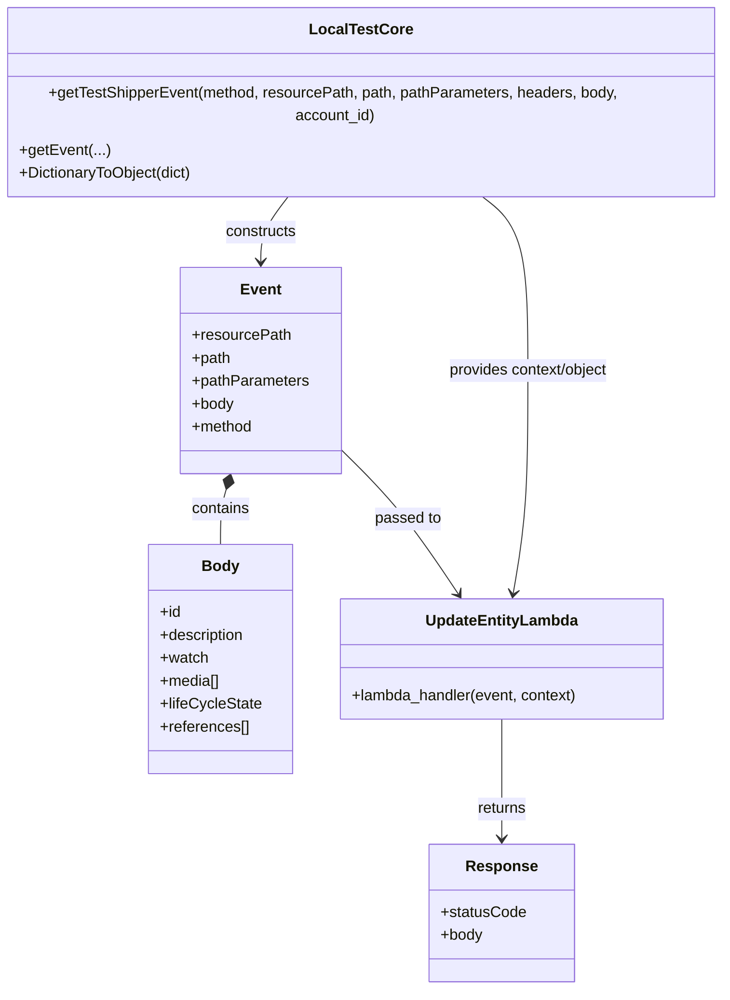

# Diagram: tools/ide_local_testing/localTest/test/entity/entity/patchEntityViaLambda.py


> Auto-generated by Obscura crawlers

## Diagram 1



### SVG

<svg id="container" width="778.4921875" xmlns="http://www.w3.org/2000/svg" class="classDiagram" height="1012" viewBox="0 0 778.4921875 1012" role="graphics-document document" aria-roledescription="class"><style>#container{font-family:"trebuchet ms",verdana,arial,sans-serif;font-size:16px;fill:#333;}@keyframes edge-animation-frame{from{stroke-dashoffset:0;}}@keyframes dash{to{stroke-dashoffset:0;}}#container .edge-animation-slow{stroke-dasharray:9,5!important;stroke-dashoffset:900;animation:dash 50s linear infinite;stroke-linecap:round;}#container .edge-animation-fast{stroke-dasharray:9,5!important;stroke-dashoffset:900;animation:dash 20s linear infinite;stroke-linecap:round;}#container .error-icon{fill:#552222;}#container .error-text{fill:#552222;stroke:#552222;}#container .edge-thickness-normal{stroke-width:1px;}#container .edge-thickness-thick{stroke-width:3.5px;}#container .edge-pattern-solid{stroke-dasharray:0;}#container .edge-thickness-invisible{stroke-width:0;fill:none;}#container .edge-pattern-dashed{stroke-dasharray:3;}#container .edge-pattern-dotted{stroke-dasharray:2;}#container .marker{fill:#333333;stroke:#333333;}#container .marker.cross{stroke:#333333;}#container svg{font-family:"trebuchet ms",verdana,arial,sans-serif;font-size:16px;}#container p{margin:0;}#container g.classGroup text{fill:#9370DB;stroke:none;font-family:"trebuchet ms",verdana,arial,sans-serif;font-size:10px;}#container g.classGroup text .title{font-weight:bolder;}#container .nodeLabel,#container .edgeLabel{color:#131300;}#container .edgeLabel .label rect{fill:#ECECFF;}#container .label text{fill:#131300;}#container .labelBkg{background:#ECECFF;}#container .edgeLabel .label span{background:#ECECFF;}#container .classTitle{font-weight:bolder;}#container .node rect,#container .node circle,#container .node ellipse,#container .node polygon,#container .node path{fill:#ECECFF;stroke:#9370DB;stroke-width:1px;}#container .divider{stroke:#9370DB;stroke-width:1;}#container g.clickable{cursor:pointer;}#container g.classGroup rect{fill:#ECECFF;stroke:#9370DB;}#container g.classGroup line{stroke:#9370DB;stroke-width:1;}#container .classLabel .box{stroke:none;stroke-width:0;fill:#ECECFF;opacity:0.5;}#container .classLabel .label{fill:#9370DB;font-size:10px;}#container .relation{stroke:#333333;stroke-width:1;fill:none;}#container .dashed-line{stroke-dasharray:3;}#container .dotted-line{stroke-dasharray:1 2;}#container #compositionStart,#container .composition{fill:#333333!important;stroke:#333333!important;stroke-width:1;}#container #compositionEnd,#container .composition{fill:#333333!important;stroke:#333333!important;stroke-width:1;}#container #dependencyStart,#container .dependency{fill:#333333!important;stroke:#333333!important;stroke-width:1;}#container #dependencyStart,#container .dependency{fill:#333333!important;stroke:#333333!important;stroke-width:1;}#container #extensionStart,#container .extension{fill:transparent!important;stroke:#333333!important;stroke-width:1;}#container #extensionEnd,#container .extension{fill:transparent!important;stroke:#333333!important;stroke-width:1;}#container #aggregationStart,#container .aggregation{fill:transparent!important;stroke:#333333!important;stroke-width:1;}#container #aggregationEnd,#container .aggregation{fill:transparent!important;stroke:#333333!important;stroke-width:1;}#container #lollipopStart,#container .lollipop{fill:#ECECFF!important;stroke:#333333!important;stroke-width:1;}#container #lollipopEnd,#container .lollipop{fill:#ECECFF!important;stroke:#333333!important;stroke-width:1;}#container .edgeTerminals{font-size:11px;line-height:initial;}#container .classTitleText{text-anchor:middle;font-size:18px;fill:#333;}#container .label-icon{display:inline-block;height:1em;overflow:visible;vertical-align:-0.125em;}#container .node .label-icon path{fill:currentColor;stroke:revert;stroke-width:revert;}#container :root{--mermaid-font-family:"trebuchet ms",verdana,arial,sans-serif;}</style><g><defs><marker id="container_class-aggregationStart" class="marker aggregation class" refX="18" refY="7" markerWidth="190" markerHeight="240" orient="auto"><path d="M 18,7 L9,13 L1,7 L9,1 Z"></path></marker></defs><defs><marker id="container_class-aggregationEnd" class="marker aggregation class" refX="1" refY="7" markerWidth="20" markerHeight="28" orient="auto"><path d="M 18,7 L9,13 L1,7 L9,1 Z"></path></marker></defs><defs><marker id="container_class-extensionStart" class="marker extension class" refX="18" refY="7" markerWidth="190" markerHeight="240" orient="auto"><path d="M 1,7 L18,13 V 1 Z"></path></marker></defs><defs><marker id="container_class-extensionEnd" class="marker extension class" refX="1" refY="7" markerWidth="20" markerHeight="28" orient="auto"><path d="M 1,1 V 13 L18,7 Z"></path></marker></defs><defs><marker id="container_class-compositionStart" class="marker composition class" refX="18" refY="7" markerWidth="190" markerHeight="240" orient="auto"><path d="M 18,7 L9,13 L1,7 L9,1 Z"></path></marker></defs><defs><marker id="container_class-compositionEnd" class="marker composition class" refX="1" refY="7" markerWidth="20" markerHeight="28" orient="auto"><path d="M 18,7 L9,13 L1,7 L9,1 Z"></path></marker></defs><defs><marker id="container_class-dependencyStart" class="marker dependency class" refX="6" refY="7" markerWidth="190" markerHeight="240" orient="auto"><path d="M 5,7 L9,13 L1,7 L9,1 Z"></path></marker></defs><defs><marker id="container_class-dependencyEnd" class="marker dependency class" refX="13" refY="7" markerWidth="20" markerHeight="28" orient="auto"><path d="M 18,7 L9,13 L14,7 L9,1 Z"></path></marker></defs><defs><marker id="container_class-lollipopStart" class="marker lollipop class" refX="13" refY="7" markerWidth="190" markerHeight="240" orient="auto"><circle stroke="black" fill="transparent" cx="7" cy="7" r="6"></circle></marker></defs><defs><marker id="container_class-lollipopEnd" class="marker lollipop class" refX="1" refY="7" markerWidth="190" markerHeight="240" orient="auto"><circle stroke="black" fill="transparent" cx="7" cy="7" r="6"></circle></marker></defs><g class="root"><g class="clusters"></g><g class="edgePaths"><path d="M316.066,182L310.879,188.167C305.692,194.333,295.318,206.667,290.13,218C284.943,229.333,284.943,239.667,284.943,244.833L284.943,250" id="id_LocalTestCore_Event_1" class="edge-thickness-normal edge-pattern-solid relation" style=";;;" data-edge="true" data-et="edge" data-id="id_LocalTestCore_Event_1" data-points="W3sieCI6MzE2LjA2NTk0OTQ3MDc2NjEsInkiOjE4Mn0seyJ4IjoyODQuOTQzMzU5Mzc1LCJ5IjoyMTl9LHsieCI6Mjg0Ljk0MzM1OTM3NSwieSI6MjU2fV0=" marker-end="url(#container_class-dependencyEnd)"></path><path d="M248.038,488.539L247.027,491.949C246.017,495.359,243.996,502.18,242.985,511.757C241.975,521.333,241.975,533.667,241.975,539.833L241.975,546" id="id_Event_Body_2" class="edge-thickness-normal edge-pattern-solid relation" style=";;;" data-edge="true" data-et="edge" data-id="id_Event_Body_2" data-points="W3sieCI6MjUyLjkzOTA0OTAzMDE3MjQsInkiOjQ3Mn0seyJ4IjoyNDEuOTc0NjA5Mzc1LCJ5Ijo1MDl9LHsieCI6MjQxLjk3NDYwOTM3NSwieSI6NTQ2fV0=" marker-start="url(#container_class-compositionStart)"></path><path d="M368.416,446.185L379.049,456.654C389.682,467.123,410.949,488.062,431.436,513.365C451.924,538.667,471.634,568.335,481.489,583.169L491.343,598.002" id="id_Event_UpdateEntityLambda_3" class="edge-thickness-normal edge-pattern-solid relation" style=";;;" data-edge="true" data-et="edge" data-id="id_Event_UpdateEntityLambda_3" data-points="W3sieCI6MzY4LjQxNjAxNTYyNSwieSI6NDQ2LjE4NTE5MTU3MDYyNzJ9LHsieCI6NDMyLjIxNDg0Mzc1LCJ5Ijo1MDl9LHsieCI6NDk0LjY2MzYxNDY0OTY4MTUsInkiOjYwM31d" marker-end="url(#container_class-dependencyEnd)"></path><path d="M536.518,729L536.518,744.667C536.518,760.333,536.518,791.667,536.518,812.5C536.518,833.333,536.518,843.667,536.518,848.833L536.518,854" id="id_UpdateEntityLambda_Response_4" class="edge-thickness-normal edge-pattern-solid relation" style=";;;" data-edge="true" data-et="edge" data-id="id_UpdateEntityLambda_Response_4" data-points="W3sieCI6NTM2LjUxNzU3ODEyNSwieSI6NzI5fSx7IngiOjUzNi41MTc1NzgxMjUsInkiOjgyM30seyJ4Ijo1MzYuNTE3NTc4MTI1LCJ5Ijo4NjB9XQ==" marker-end="url(#container_class-dependencyEnd)"></path><path d="M511.884,182L520.577,188.167C529.27,194.333,546.655,206.667,555.348,237C564.041,267.333,564.041,315.667,564.041,364C564.041,412.333,564.041,460.667,561.467,499.515C558.893,538.363,553.746,567.727,551.172,582.408L548.598,597.09" id="id_LocalTestCore_UpdateEntityLambda_5" class="edge-thickness-normal edge-pattern-solid relation" style=";;;" data-edge="true" data-et="edge" data-id="id_LocalTestCore_UpdateEntityLambda_5" data-points="W3sieCI6NTExLjg4NDQ2NjM1NTg0Njc3LCJ5IjoxODJ9LHsieCI6NTY0LjA0MTAxNTYyNSwieSI6MjE5fSx7IngiOjU2NC4wNDEwMTU2MjUsInkiOjM2NH0seyJ4Ijo1NjQuMDQxMDE1NjI1LCJ5Ijo1MDl9LHsieCI6NTQ3LjU2MjAxNDgyODgyMTcsInkiOjYwM31d" marker-end="url(#container_class-dependencyEnd)"></path></g><g class="edgeLabels"><g class="edgeLabel" transform="translate(284.943359375, 219)"><g class="label" data-id="id_LocalTestCore_Event_1" transform="translate(-37.84375, -12)"><foreignObject width="75.6875" height="24"><div xmlns="http://www.w3.org/1999/xhtml" class="labelBkg" style="display: table-cell; white-space: nowrap; line-height: 1.5; max-width: 200px; text-align: center;"><span class="edgeLabel"><p>constructs</p></span></div></foreignObject></g></g><g class="edgeLabel" transform="translate(241.974609375, 509)"><g class="label" data-id="id_Event_Body_2" transform="translate(-30.890625, -12)"><foreignObject width="61.78125" height="24"><div xmlns="http://www.w3.org/1999/xhtml" class="labelBkg" style="display: table-cell; white-space: nowrap; line-height: 1.5; max-width: 200px; text-align: center;"><span class="edgeLabel"><p>contains</p></span></div></foreignObject></g></g><g class="edgeLabel" transform="translate(438.66737, 518.71257)"><g class="label" data-id="id_Event_UpdateEntityLambda_3" transform="translate(-35.046875, -12)"><foreignObject width="70.09375" height="24"><div xmlns="http://www.w3.org/1999/xhtml" class="labelBkg" style="display: table-cell; white-space: nowrap; line-height: 1.5; max-width: 200px; text-align: center;"><span class="edgeLabel"><p>passed to</p></span></div></foreignObject></g></g><g class="edgeLabel" transform="translate(536.517578125, 823)"><g class="label" data-id="id_UpdateEntityLambda_Response_4" transform="translate(-26.265625, -12)"><foreignObject width="52.53125" height="24"><div xmlns="http://www.w3.org/1999/xhtml" class="labelBkg" style="display: table-cell; white-space: nowrap; line-height: 1.5; max-width: 200px; text-align: center;"><span class="edgeLabel"><p>returns</p></span></div></foreignObject></g></g><g class="edgeLabel" transform="translate(564.041015625, 364)"><g class="label" data-id="id_LocalTestCore_UpdateEntityLambda_5" transform="translate(-86.78125, -12)"><foreignObject width="173.5625" height="24"><div xmlns="http://www.w3.org/1999/xhtml" class="labelBkg" style="display: table-cell; white-space: nowrap; line-height: 1.5; max-width: 200px; text-align: center;"><span class="edgeLabel"><p>provides context/object</p></span></div></foreignObject></g></g></g><g class="nodes"><g class="node default" id="classId-LocalTestCore-0" transform="translate(389.24609375, 95)"><g class="basic label-container"><path d="M-381.24609375 -87 L381.24609375 -87 L381.24609375 87 L-381.24609375 87" stroke="none" stroke-width="0" fill="#ECECFF" style=""></path><path d="M-381.24609375 -87 C-77.4957589886368 -87, 226.2545757727264 -87, 381.24609375 -87 M-381.24609375 -87 C-159.73415557012206 -87, 61.77778260975589 -87, 381.24609375 -87 M381.24609375 -87 C381.24609375 -24.69411954133257, 381.24609375 37.61176091733486, 381.24609375 87 M381.24609375 -87 C381.24609375 -44.80779710402886, 381.24609375 -2.615594208057715, 381.24609375 87 M381.24609375 87 C226.87873159231881 87, 72.51136943463763 87, -381.24609375 87 M381.24609375 87 C163.58823068497546 87, -54.069632380049086 87, -381.24609375 87 M-381.24609375 87 C-381.24609375 19.904578441564226, -381.24609375 -47.19084311687155, -381.24609375 -87 M-381.24609375 87 C-381.24609375 47.92638062061058, -381.24609375 8.85276124122116, -381.24609375 -87" stroke="#9370DB" stroke-width="1.3" fill="none" stroke-dasharray="0 0" style=""></path></g><g class="annotation-group text" transform="translate(0, -63)"></g><g class="label-group text" transform="translate(-50.7578125, -63)"><g class="label" style="font-weight: bolder" transform="translate(0,-12)"><foreignObject width="101.515625" height="24"><div xmlns="http://www.w3.org/1999/xhtml" style="display: table-cell; white-space: nowrap; line-height: 1.5; max-width: 149px; text-align: center;"><span class="nodeLabel markdown-node-label" style=""><p>LocalTestCore</p></span></div></foreignObject></g></g><g class="members-group text" transform="translate(-369.24609375, -15)"></g><g class="methods-group text" transform="translate(-369.24609375, 15)"><g class="label" style="" transform="translate(0,-12)"><foreignObject width="687.734375" height="24"><div xmlns="http://www.w3.org/1999/xhtml" style="display: table-cell; white-space: nowrap; line-height: 1.5; max-width: 745px; text-align: center;"><span class="nodeLabel markdown-node-label" style=""><p>+getTestShipperEvent(method, resourcePath, path, pathParameters, headers, body, account_id)</p></span></div></foreignObject></g><g class="label" style="" transform="translate(0,12)"><foreignObject width="92.359375" height="24"><div xmlns="http://www.w3.org/1999/xhtml" style="display: table-cell; white-space: nowrap; line-height: 1.5; max-width: 150px; text-align: center;"><span class="nodeLabel markdown-node-label" style=""><p>+getEvent(...)</p></span></div></foreignObject></g><g class="label" style="" transform="translate(0,36)"><foreignObject width="184.03125" height="24"><div xmlns="http://www.w3.org/1999/xhtml" style="display: table-cell; white-space: nowrap; line-height: 1.5; max-width: 241px; text-align: center;"><span class="nodeLabel markdown-node-label" style=""><p>+DictionaryToObject(dict)</p></span></div></foreignObject></g></g><g class="divider" style=""><path d="M-381.24609375 -39 C-155.47062595212782 -39, 70.30484184574436 -39, 381.24609375 -39 M-381.24609375 -39 C-220.32126540191993 -39, -59.39643705383986 -39, 381.24609375 -39" stroke="#9370DB" stroke-width="1.3" fill="none" stroke-dasharray="0 0" style=""></path></g><g class="divider" style=""><path d="M-381.24609375 -15 C-204.579559623417 -15, -27.913025496833995 -15, 381.24609375 -15 M-381.24609375 -15 C-121.573132202799 -15, 138.099829344402 -15, 381.24609375 -15" stroke="#9370DB" stroke-width="1.3" fill="none" stroke-dasharray="0 0" style=""></path></g></g><g class="node default" id="classId-UpdateEntityLambda-1" transform="translate(536.517578125, 666)"><g class="basic label-container"><path d="M-170.5625 -63 L170.5625 -63 L170.5625 63 L-170.5625 63" stroke="none" stroke-width="0" fill="#ECECFF" style=""></path><path d="M-170.5625 -63 C-49.96551781976771 -63, 70.63146436046458 -63, 170.5625 -63 M-170.5625 -63 C-52.393208864216646 -63, 65.77608227156671 -63, 170.5625 -63 M170.5625 -63 C170.5625 -30.628557312327693, 170.5625 1.7428853753446134, 170.5625 63 M170.5625 -63 C170.5625 -29.556672394166135, 170.5625 3.8866552116677298, 170.5625 63 M170.5625 63 C70.33712889980256 63, -29.88824220039487 63, -170.5625 63 M170.5625 63 C43.16736363710018 63, -84.22777272579964 63, -170.5625 63 M-170.5625 63 C-170.5625 24.304993999587097, -170.5625 -14.390012000825806, -170.5625 -63 M-170.5625 63 C-170.5625 31.57850256032766, -170.5625 0.15700512065532024, -170.5625 -63" stroke="#9370DB" stroke-width="1.3" fill="none" stroke-dasharray="0 0" style=""></path></g><g class="annotation-group text" transform="translate(0, -39)"></g><g class="label-group text" transform="translate(-76.9375, -39)"><g class="label" style="font-weight: bolder" transform="translate(0,-12)"><foreignObject width="153.875" height="24"><div xmlns="http://www.w3.org/1999/xhtml" style="display: table-cell; white-space: nowrap; line-height: 1.5; max-width: 202px; text-align: center;"><span class="nodeLabel markdown-node-label" style=""><p>UpdateEntityLambda</p></span></div></foreignObject></g></g><g class="members-group text" transform="translate(-158.5625, 9)"></g><g class="methods-group text" transform="translate(-158.5625, 39)"><g class="label" style="" transform="translate(0,-12)"><foreignObject width="240.1875" height="24"><div xmlns="http://www.w3.org/1999/xhtml" style="display: table-cell; white-space: nowrap; line-height: 1.5; max-width: 298px; text-align: center;"><span class="nodeLabel markdown-node-label" style=""><p>+lambda_handler(event, context)</p></span></div></foreignObject></g></g><g class="divider" style=""><path d="M-170.5625 -15 C-51.51168578636269 -15, 67.53912842727462 -15, 170.5625 -15 M-170.5625 -15 C-52.913242757547906 -15, 64.73601448490419 -15, 170.5625 -15" stroke="#9370DB" stroke-width="1.3" fill="none" stroke-dasharray="0 0" style=""></path></g><g class="divider" style=""><path d="M-170.5625 9 C-99.55873654248539 9, -28.554973084970783 9, 170.5625 9 M-170.5625 9 C-53.001009310835755 9, 64.56048137832849 9, 170.5625 9" stroke="#9370DB" stroke-width="1.3" fill="none" stroke-dasharray="0 0" style=""></path></g></g><g class="node default" id="classId-Event-2" transform="translate(284.943359375, 364)"><g class="basic label-container"><path d="M-83.47265625 -108 L83.47265625 -108 L83.47265625 108 L-83.47265625 108" stroke="none" stroke-width="0" fill="#ECECFF" style=""></path><path d="M-83.47265625 -108 C-49.39987377366511 -108, -15.327091297330213 -108, 83.47265625 -108 M-83.47265625 -108 C-31.459269847791283 -108, 20.554116554417433 -108, 83.47265625 -108 M83.47265625 -108 C83.47265625 -37.15396068871, 83.47265625 33.69207862258, 83.47265625 108 M83.47265625 -108 C83.47265625 -57.99849181336974, 83.47265625 -7.996983626739478, 83.47265625 108 M83.47265625 108 C27.196965850067095 108, -29.07872454986581 108, -83.47265625 108 M83.47265625 108 C22.277338112224058 108, -38.917980025551884 108, -83.47265625 108 M-83.47265625 108 C-83.47265625 48.40154481430619, -83.47265625 -11.196910371387617, -83.47265625 -108 M-83.47265625 108 C-83.47265625 30.98803845206119, -83.47265625 -46.02392309587762, -83.47265625 -108" stroke="#9370DB" stroke-width="1.3" fill="none" stroke-dasharray="0 0" style=""></path></g><g class="annotation-group text" transform="translate(0, -84)"></g><g class="label-group text" transform="translate(-20.2109375, -84)"><g class="label" style="font-weight: bolder" transform="translate(0,-12)"><foreignObject width="40.421875" height="24"><div xmlns="http://www.w3.org/1999/xhtml" style="display: table-cell; white-space: nowrap; line-height: 1.5; max-width: 90px; text-align: center;"><span class="nodeLabel markdown-node-label" style=""><p>Event</p></span></div></foreignObject></g></g><g class="members-group text" transform="translate(-71.47265625, -36)"><g class="label" style="" transform="translate(0,-12)"><foreignObject width="102.546875" height="24"><div xmlns="http://www.w3.org/1999/xhtml" style="display: table-cell; white-space: nowrap; line-height: 1.5; max-width: 160px; text-align: center;"><span class="nodeLabel markdown-node-label" style=""><p>+resourcePath</p></span></div></foreignObject></g><g class="label" style="" transform="translate(0,12)"><foreignObject width="41.1875" height="24"><div xmlns="http://www.w3.org/1999/xhtml" style="display: table-cell; white-space: nowrap; line-height: 1.5; max-width: 99px; text-align: center;"><span class="nodeLabel markdown-node-label" style=""><p>+path</p></span></div></foreignObject></g><g class="label" style="" transform="translate(0,36)"><foreignObject width="122.734375" height="24"><div xmlns="http://www.w3.org/1999/xhtml" style="display: table-cell; white-space: nowrap; line-height: 1.5; max-width: 180px; text-align: center;"><span class="nodeLabel markdown-node-label" style=""><p>+pathParameters</p></span></div></foreignObject></g><g class="label" style="" transform="translate(0,60)"><foreignObject width="44.28125" height="24"><div xmlns="http://www.w3.org/1999/xhtml" style="display: table-cell; white-space: nowrap; line-height: 1.5; max-width: 102px; text-align: center;"><span class="nodeLabel markdown-node-label" style=""><p>+body</p></span></div></foreignObject></g><g class="label" style="" transform="translate(0,84)"><foreignObject width="64.484375" height="24"><div xmlns="http://www.w3.org/1999/xhtml" style="display: table-cell; white-space: nowrap; line-height: 1.5; max-width: 122px; text-align: center;"><span class="nodeLabel markdown-node-label" style=""><p>+method</p></span></div></foreignObject></g></g><g class="methods-group text" transform="translate(-71.47265625, 108)"></g><g class="divider" style=""><path d="M-83.47265625 -60 C-23.470602203212934 -60, 36.53145184357413 -60, 83.47265625 -60 M-83.47265625 -60 C-22.527527947452704 -60, 38.41760035509459 -60, 83.47265625 -60" stroke="#9370DB" stroke-width="1.3" fill="none" stroke-dasharray="0 0" style=""></path></g><g class="divider" style=""><path d="M-83.47265625 84 C-34.788418015157674 84, 13.895820219684651 84, 83.47265625 84 M-83.47265625 84 C-42.31511572869146 84, -1.1575752073829193 84, 83.47265625 84" stroke="#9370DB" stroke-width="1.3" fill="none" stroke-dasharray="0 0" style=""></path></g></g><g class="node default" id="classId-Body-3" transform="translate(241.974609375, 666)"><g class="basic label-container"><path d="M-73.98046875 -120 L73.98046875 -120 L73.98046875 120 L-73.98046875 120" stroke="none" stroke-width="0" fill="#ECECFF" style=""></path><path d="M-73.98046875 -120 C-34.02367021968957 -120, 5.933128310620859 -120, 73.98046875 -120 M-73.98046875 -120 C-38.969916331114824 -120, -3.959363912229648 -120, 73.98046875 -120 M73.98046875 -120 C73.98046875 -43.65686236581952, 73.98046875 32.68627526836096, 73.98046875 120 M73.98046875 -120 C73.98046875 -70.56375736159583, 73.98046875 -21.12751472319168, 73.98046875 120 M73.98046875 120 C41.24031895145265 120, 8.5001691529053 120, -73.98046875 120 M73.98046875 120 C24.369984415842893 120, -25.240499918314214 120, -73.98046875 120 M-73.98046875 120 C-73.98046875 60.95293973757233, -73.98046875 1.9058794751446584, -73.98046875 -120 M-73.98046875 120 C-73.98046875 42.23091519417858, -73.98046875 -35.53816961164284, -73.98046875 -120" stroke="#9370DB" stroke-width="1.3" fill="none" stroke-dasharray="0 0" style=""></path></g><g class="annotation-group text" transform="translate(0, -96)"></g><g class="label-group text" transform="translate(-18.5546875, -96)"><g class="label" style="font-weight: bolder" transform="translate(0,-12)"><foreignObject width="37.109375" height="24"><div xmlns="http://www.w3.org/1999/xhtml" style="display: table-cell; white-space: nowrap; line-height: 1.5; max-width: 87px; text-align: center;"><span class="nodeLabel markdown-node-label" style=""><p>Body</p></span></div></foreignObject></g></g><g class="members-group text" transform="translate(-61.98046875, -48)"><g class="label" style="" transform="translate(0,-12)"><foreignObject width="22.078125" height="24"><div xmlns="http://www.w3.org/1999/xhtml" style="display: table-cell; white-space: nowrap; line-height: 1.5; max-width: 79px; text-align: center;"><span class="nodeLabel markdown-node-label" style=""><p>+id</p></span></div></foreignObject></g><g class="label" style="" transform="translate(0,12)"><foreignObject width="90.59375" height="24"><div xmlns="http://www.w3.org/1999/xhtml" style="display: table-cell; white-space: nowrap; line-height: 1.5; max-width: 148px; text-align: center;"><span class="nodeLabel markdown-node-label" style=""><p>+description</p></span></div></foreignObject></g><g class="label" style="" transform="translate(0,36)"><foreignObject width="50.53125" height="24"><div xmlns="http://www.w3.org/1999/xhtml" style="display: table-cell; white-space: nowrap; line-height: 1.5; max-width: 108px; text-align: center;"><span class="nodeLabel markdown-node-label" style=""><p>+watch</p></span></div></foreignObject></g><g class="label" style="" transform="translate(0,60)"><foreignObject width="63.515625" height="24"><div xmlns="http://www.w3.org/1999/xhtml" style="display: table-cell; white-space: nowrap; line-height: 1.5; max-width: 121px; text-align: center;"><span class="nodeLabel markdown-node-label" style=""><p>+media[]</p></span></div></foreignObject></g><g class="label" style="" transform="translate(0,84)"><foreignObject width="105.40625" height="24"><div xmlns="http://www.w3.org/1999/xhtml" style="display: table-cell; white-space: nowrap; line-height: 1.5; max-width: 163px; text-align: center;"><span class="nodeLabel markdown-node-label" style=""><p>+lifeCycleState</p></span></div></foreignObject></g><g class="label" style="" transform="translate(0,108)"><foreignObject width="93.9375" height="24"><div xmlns="http://www.w3.org/1999/xhtml" style="display: table-cell; white-space: nowrap; line-height: 1.5; max-width: 151px; text-align: center;"><span class="nodeLabel markdown-node-label" style=""><p>+references[]</p></span></div></foreignObject></g></g><g class="methods-group text" transform="translate(-61.98046875, 120)"></g><g class="divider" style=""><path d="M-73.98046875 -72 C-18.90502798275213 -72, 36.17041278449574 -72, 73.98046875 -72 M-73.98046875 -72 C-40.91429508289347 -72, -7.848121415786935 -72, 73.98046875 -72" stroke="#9370DB" stroke-width="1.3" fill="none" stroke-dasharray="0 0" style=""></path></g><g class="divider" style=""><path d="M-73.98046875 96 C-27.114491079048776 96, 19.75148659190245 96, 73.98046875 96 M-73.98046875 96 C-36.52122851510364 96, 0.9380117197927262 96, 73.98046875 96" stroke="#9370DB" stroke-width="1.3" fill="none" stroke-dasharray="0 0" style=""></path></g></g><g class="node default" id="classId-Response-4" transform="translate(536.517578125, 932)"><g class="basic label-container"><path d="M-74.05078125 -72 L74.05078125 -72 L74.05078125 72 L-74.05078125 72" stroke="none" stroke-width="0" fill="#ECECFF" style=""></path><path d="M-74.05078125 -72 C-26.00707590313393 -72, 22.03662944373214 -72, 74.05078125 -72 M-74.05078125 -72 C-35.44573321927566 -72, 3.159314811448681 -72, 74.05078125 -72 M74.05078125 -72 C74.05078125 -31.28385715833369, 74.05078125 9.432285683332623, 74.05078125 72 M74.05078125 -72 C74.05078125 -40.70255531860282, 74.05078125 -9.405110637205631, 74.05078125 72 M74.05078125 72 C23.39256681167784 72, -27.265647626644324 72, -74.05078125 72 M74.05078125 72 C28.09228422673025 72, -17.8662127965395 72, -74.05078125 72 M-74.05078125 72 C-74.05078125 17.73810273432082, -74.05078125 -36.52379453135836, -74.05078125 -72 M-74.05078125 72 C-74.05078125 42.10465214122677, -74.05078125 12.209304282453544, -74.05078125 -72" stroke="#9370DB" stroke-width="1.3" fill="none" stroke-dasharray="0 0" style=""></path></g><g class="annotation-group text" transform="translate(0, -48)"></g><g class="label-group text" transform="translate(-35.4453125, -48)"><g class="label" style="font-weight: bolder" transform="translate(0,-12)"><foreignObject width="70.890625" height="24"><div xmlns="http://www.w3.org/1999/xhtml" style="display: table-cell; white-space: nowrap; line-height: 1.5; max-width: 120px; text-align: center;"><span class="nodeLabel markdown-node-label" style=""><p>Response</p></span></div></foreignObject></g></g><g class="members-group text" transform="translate(-62.05078125, 0)"><g class="label" style="" transform="translate(0,-12)"><foreignObject width="88.65625" height="24"><div xmlns="http://www.w3.org/1999/xhtml" style="display: table-cell; white-space: nowrap; line-height: 1.5; max-width: 146px; text-align: center;"><span class="nodeLabel markdown-node-label" style=""><p>+statusCode</p></span></div></foreignObject></g><g class="label" style="" transform="translate(0,12)"><foreignObject width="44.28125" height="24"><div xmlns="http://www.w3.org/1999/xhtml" style="display: table-cell; white-space: nowrap; line-height: 1.5; max-width: 102px; text-align: center;"><span class="nodeLabel markdown-node-label" style=""><p>+body</p></span></div></foreignObject></g></g><g class="methods-group text" transform="translate(-62.05078125, 72)"></g><g class="divider" style=""><path d="M-74.05078125 -24 C-27.114104899500347 -24, 19.822571450999305 -24, 74.05078125 -24 M-74.05078125 -24 C-25.335713251245465 -24, 23.37935474750907 -24, 74.05078125 -24" stroke="#9370DB" stroke-width="1.3" fill="none" stroke-dasharray="0 0" style=""></path></g><g class="divider" style=""><path d="M-74.05078125 48 C-39.559122199528396 48, -5.067463149056792 48, 74.05078125 48 M-74.05078125 48 C-23.850058033523027 48, 26.350665182953946 48, 74.05078125 48" stroke="#9370DB" stroke-width="1.3" fill="none" stroke-dasharray="0 0" style=""></path></g></g></g></g></g></svg>

## Diagram 2

```mermaid
flowchart TD
    Start([Start]) --> GetEvent[getTestShipperEvent("GET", resourcePath, path, pathParameters, None, body, 1001)]
    GetEvent --> EventObj[Event object]
    EventObj --> Invoke[Invoke update_entity.lambda_handler(event, context)]
    Invoke --> Process[process request: validate -> patch entity -> build response]
    Process --> ResponseObj[Response]
    ResponseObj --> Print[print(response)]
    Print --> End([End])
```

> SVG rendering failed for this diagram.
