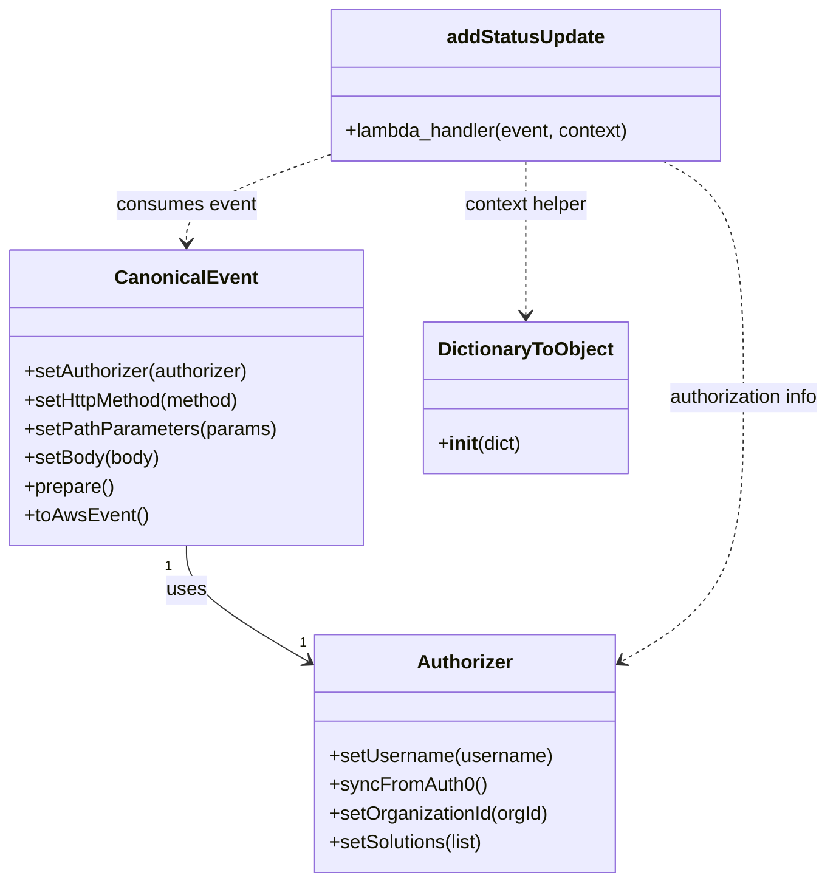

# Diagram: tools/ide_local_testing/localTest/test/entity/statusUpdate/addEntityStatusUpdate.py


> Auto-generated by Obscura crawlers

## Diagram 1

```mermaid
flowchart LR
    A[Set solutionId/entityId/body] --> B[Authorizer().setUsername(...)]
    B --> C[authorizer.setOrganizationId(137)]
    C --> D[authorizer.setSolutions([solutionId])]
    D --> E[CanonicalEvent().setAuthorizer(authorizer)]
    E --> F[.setHttpMethod("POST")]
    F --> G[.setPathParameters(...)]
    G --> H[.setBody(body)]
    H --> I[.prepare().toAwsEvent()]
    I --> J[event overridden with full AWS-style event dict]
    J --> K[addStatusUpdate.lambda_handler(event, DictionaryToObject(...))]
    K --> L[retval printed]
```

> SVG rendering failed for this diagram.

## Diagram 2



### SVG

<svg id="container" width="683.1484375" xmlns="http://www.w3.org/2000/svg" class="classDiagram" height="734" viewBox="0 0 683.1484375 734" role="graphics-document document" aria-roledescription="class"><style>#container{font-family:"trebuchet ms",verdana,arial,sans-serif;font-size:16px;fill:#333;}@keyframes edge-animation-frame{from{stroke-dashoffset:0;}}@keyframes dash{to{stroke-dashoffset:0;}}#container .edge-animation-slow{stroke-dasharray:9,5!important;stroke-dashoffset:900;animation:dash 50s linear infinite;stroke-linecap:round;}#container .edge-animation-fast{stroke-dasharray:9,5!important;stroke-dashoffset:900;animation:dash 20s linear infinite;stroke-linecap:round;}#container .error-icon{fill:#552222;}#container .error-text{fill:#552222;stroke:#552222;}#container .edge-thickness-normal{stroke-width:1px;}#container .edge-thickness-thick{stroke-width:3.5px;}#container .edge-pattern-solid{stroke-dasharray:0;}#container .edge-thickness-invisible{stroke-width:0;fill:none;}#container .edge-pattern-dashed{stroke-dasharray:3;}#container .edge-pattern-dotted{stroke-dasharray:2;}#container .marker{fill:#333333;stroke:#333333;}#container .marker.cross{stroke:#333333;}#container svg{font-family:"trebuchet ms",verdana,arial,sans-serif;font-size:16px;}#container p{margin:0;}#container g.classGroup text{fill:#9370DB;stroke:none;font-family:"trebuchet ms",verdana,arial,sans-serif;font-size:10px;}#container g.classGroup text .title{font-weight:bolder;}#container .nodeLabel,#container .edgeLabel{color:#131300;}#container .edgeLabel .label rect{fill:#ECECFF;}#container .label text{fill:#131300;}#container .labelBkg{background:#ECECFF;}#container .edgeLabel .label span{background:#ECECFF;}#container .classTitle{font-weight:bolder;}#container .node rect,#container .node circle,#container .node ellipse,#container .node polygon,#container .node path{fill:#ECECFF;stroke:#9370DB;stroke-width:1px;}#container .divider{stroke:#9370DB;stroke-width:1;}#container g.clickable{cursor:pointer;}#container g.classGroup rect{fill:#ECECFF;stroke:#9370DB;}#container g.classGroup line{stroke:#9370DB;stroke-width:1;}#container .classLabel .box{stroke:none;stroke-width:0;fill:#ECECFF;opacity:0.5;}#container .classLabel .label{fill:#9370DB;font-size:10px;}#container .relation{stroke:#333333;stroke-width:1;fill:none;}#container .dashed-line{stroke-dasharray:3;}#container .dotted-line{stroke-dasharray:1 2;}#container #compositionStart,#container .composition{fill:#333333!important;stroke:#333333!important;stroke-width:1;}#container #compositionEnd,#container .composition{fill:#333333!important;stroke:#333333!important;stroke-width:1;}#container #dependencyStart,#container .dependency{fill:#333333!important;stroke:#333333!important;stroke-width:1;}#container #dependencyStart,#container .dependency{fill:#333333!important;stroke:#333333!important;stroke-width:1;}#container #extensionStart,#container .extension{fill:transparent!important;stroke:#333333!important;stroke-width:1;}#container #extensionEnd,#container .extension{fill:transparent!important;stroke:#333333!important;stroke-width:1;}#container #aggregationStart,#container .aggregation{fill:transparent!important;stroke:#333333!important;stroke-width:1;}#container #aggregationEnd,#container .aggregation{fill:transparent!important;stroke:#333333!important;stroke-width:1;}#container #lollipopStart,#container .lollipop{fill:#ECECFF!important;stroke:#333333!important;stroke-width:1;}#container #lollipopEnd,#container .lollipop{fill:#ECECFF!important;stroke:#333333!important;stroke-width:1;}#container .edgeTerminals{font-size:11px;line-height:initial;}#container .classTitleText{text-anchor:middle;font-size:18px;fill:#333;}#container .label-icon{display:inline-block;height:1em;overflow:visible;vertical-align:-0.125em;}#container .node .label-icon path{fill:currentColor;stroke:revert;stroke-width:revert;}#container :root{--mermaid-font-family:"trebuchet ms",verdana,arial,sans-serif;}</style><g><defs><marker id="container_class-aggregationStart" class="marker aggregation class" refX="18" refY="7" markerWidth="190" markerHeight="240" orient="auto"><path d="M 18,7 L9,13 L1,7 L9,1 Z"></path></marker></defs><defs><marker id="container_class-aggregationEnd" class="marker aggregation class" refX="1" refY="7" markerWidth="20" markerHeight="28" orient="auto"><path d="M 18,7 L9,13 L1,7 L9,1 Z"></path></marker></defs><defs><marker id="container_class-extensionStart" class="marker extension class" refX="18" refY="7" markerWidth="190" markerHeight="240" orient="auto"><path d="M 1,7 L18,13 V 1 Z"></path></marker></defs><defs><marker id="container_class-extensionEnd" class="marker extension class" refX="1" refY="7" markerWidth="20" markerHeight="28" orient="auto"><path d="M 1,1 V 13 L18,7 Z"></path></marker></defs><defs><marker id="container_class-compositionStart" class="marker composition class" refX="18" refY="7" markerWidth="190" markerHeight="240" orient="auto"><path d="M 18,7 L9,13 L1,7 L9,1 Z"></path></marker></defs><defs><marker id="container_class-compositionEnd" class="marker composition class" refX="1" refY="7" markerWidth="20" markerHeight="28" orient="auto"><path d="M 18,7 L9,13 L1,7 L9,1 Z"></path></marker></defs><defs><marker id="container_class-dependencyStart" class="marker dependency class" refX="6" refY="7" markerWidth="190" markerHeight="240" orient="auto"><path d="M 5,7 L9,13 L1,7 L9,1 Z"></path></marker></defs><defs><marker id="container_class-dependencyEnd" class="marker dependency class" refX="13" refY="7" markerWidth="20" markerHeight="28" orient="auto"><path d="M 18,7 L9,13 L14,7 L9,1 Z"></path></marker></defs><defs><marker id="container_class-lollipopStart" class="marker lollipop class" refX="13" refY="7" markerWidth="190" markerHeight="240" orient="auto"><circle stroke="black" fill="transparent" cx="7" cy="7" r="6"></circle></marker></defs><defs><marker id="container_class-lollipopEnd" class="marker lollipop class" refX="1" refY="7" markerWidth="190" markerHeight="240" orient="auto"><circle stroke="black" fill="transparent" cx="7" cy="7" r="6"></circle></marker></defs><g class="root"><g class="clusters"></g><g class="edgePaths"><path d="M151.699,454L151.699,460.167C151.699,466.333,151.699,478.667,168.34,494.71C184.98,510.753,218.261,530.506,234.901,540.383L251.542,550.259" id="id_CanonicalEvent_Authorizer_1" class="edge-thickness-normal edge-pattern-solid relation" style=";;;" data-edge="true" data-et="edge" data-id="id_CanonicalEvent_Authorizer_1" data-points="W3sieCI6MTUxLjY5OTIxODc1LCJ5Ijo0NTR9LHsieCI6MTUxLjY5OTIxODc1LCJ5Ijo0OTF9LHsieCI6MjU2LjcwMTE3MTg3NSwieSI6NTUzLjMyMTQ5OTUwMTM1OTV9XQ==" marker-end="url(#container_class-dependencyEnd)"></path><path d="M263.512,130.474L244.876,137.228C226.241,143.983,188.97,157.491,170.335,169.412C151.699,181.333,151.699,191.667,151.699,196.833L151.699,202" id="id_addStatusUpdate_CanonicalEvent_2" class="edge-thickness-normal edge-pattern-dashed relation" style=";;;" data-edge="true" data-et="edge" data-id="id_addStatusUpdate_CanonicalEvent_2" data-points="W3sieCI6MjYzLjUxMTcxODc1LCJ5IjoxMzAuNDczODg1NDA0NDI1ODN9LHsieCI6MTUxLjY5OTIxODc1LCJ5IjoxNzF9LHsieCI6MTUxLjY5OTIxODc1LCJ5IjoyMDh9XQ==" marker-end="url(#container_class-dependencyEnd)"></path><path d="M542.498,134L553.744,140.167C564.991,146.333,587.484,158.667,598.73,191.5C609.977,224.333,609.977,277.667,609.977,331C609.977,384.333,609.977,437.667,593.336,474.21C576.696,510.753,543.415,530.506,526.775,540.383L510.134,550.259" id="id_addStatusUpdate_Authorizer_3" class="edge-thickness-normal edge-pattern-dashed relation" style=";;;" data-edge="true" data-et="edge" data-id="id_addStatusUpdate_Authorizer_3" data-points="W3sieCI6NTQyLjQ5NzgxMjUsInkiOjEzNH0seyJ4Ijo2MDkuOTc2NTYyNSwieSI6MTcxfSx7IngiOjYwOS45NzY1NjI1LCJ5IjozMzF9LHsieCI6NjA5Ljk3NjU2MjUsInkiOjQ5MX0seyJ4Ijo1MDQuOTc0NjA5Mzc1LCJ5Ijo1NTMuMzIxNDk5NTAxMzU5NX1d" marker-end="url(#container_class-dependencyEnd)"></path><path d="M427.602,134L427.602,140.167C427.602,146.333,427.602,158.667,427.602,180C427.602,201.333,427.602,231.667,427.602,246.833L427.602,262" id="id_addStatusUpdate_DictionaryToObject_4" class="edge-thickness-normal edge-pattern-dashed relation" style=";;;" data-edge="true" data-et="edge" data-id="id_addStatusUpdate_DictionaryToObject_4" data-points="W3sieCI6NDI3LjYwMTU2MjUsInkiOjEzNH0seyJ4Ijo0MjcuNjAxNTYyNSwieSI6MTcxfSx7IngiOjQyNy42MDE1NjI1LCJ5IjoyNjh9XQ==" marker-end="url(#container_class-dependencyEnd)"></path></g><g class="edgeLabels"><g class="edgeLabel" transform="translate(151.69921875, 491)"><g class="label" data-id="id_CanonicalEvent_Authorizer_1" transform="translate(-16.4921875, -12)"><foreignObject width="32.984375" height="24"><div xmlns="http://www.w3.org/1999/xhtml" class="labelBkg" style="display: table-cell; white-space: nowrap; line-height: 1.5; max-width: 200px; text-align: center;"><span class="edgeLabel"><p>uses</p></span></div></foreignObject></g></g><g class="edgeLabel" transform="translate(151.69921875, 171)"><g class="label" data-id="id_addStatusUpdate_CanonicalEvent_2" transform="translate(-58.65625, -12)"><foreignObject width="117.3125" height="24"><div xmlns="http://www.w3.org/1999/xhtml" class="labelBkg" style="display: table-cell; white-space: nowrap; line-height: 1.5; max-width: 200px; text-align: center;"><span class="edgeLabel"><p>consumes event</p></span></div></foreignObject></g></g><g class="edgeLabel" transform="translate(609.9765625, 331)"><g class="label" data-id="id_addStatusUpdate_Authorizer_3" transform="translate(-65.171875, -12)"><foreignObject width="130.34375" height="24"><div xmlns="http://www.w3.org/1999/xhtml" class="labelBkg" style="display: table-cell; white-space: nowrap; line-height: 1.5; max-width: 200px; text-align: center;"><span class="edgeLabel"><p>authorization info</p></span></div></foreignObject></g></g><g class="edgeLabel" transform="translate(427.6015625, 171)"><g class="label" data-id="id_addStatusUpdate_DictionaryToObject_4" transform="translate(-52.5625, -12)"><foreignObject width="105.125" height="24"><div xmlns="http://www.w3.org/1999/xhtml" class="labelBkg" style="display: table-cell; white-space: nowrap; line-height: 1.5; max-width: 200px; text-align: center;"><span class="edgeLabel"><p>context helper</p></span></div></foreignObject></g></g><g class="edgeTerminals" transform="translate(136.69921937499998, 471.50000053571426)"><g class="inner" transform="translate(0, 0)"><foreignObject style="width: 9px; height: 12px;"><div xmlns="http://www.w3.org/1999/xhtml" style="display: inline-block; padding-right: 1px; white-space: nowrap;"><span class="edgeLabel">1</span></div></foreignObject></g></g><g class="edgeTerminals" transform="translate(244.30819725779855, 526.4904671157913)"><g class="inner" transform="translate(0, 0)"></g><foreignObject style="width: 9px; height: 12px;"><div xmlns="http://www.w3.org/1999/xhtml" style="display: inline-block; padding-right: 1px; white-space: nowrap;"><span class="edgeLabel">1</span></div></foreignObject></g></g><g class="nodes"><g class="node default" id="classId-CanonicalEvent-0" transform="translate(151.69921875, 331)"><g class="basic label-container"><path d="M-143.69921875 -123 L143.69921875 -123 L143.69921875 123 L-143.69921875 123" stroke="none" stroke-width="0" fill="#ECECFF" style=""></path><path d="M-143.69921875 -123 C-74.91461081602183 -123, -6.130002882043669 -123, 143.69921875 -123 M-143.69921875 -123 C-75.26032508889276 -123, -6.821431427785512 -123, 143.69921875 -123 M143.69921875 -123 C143.69921875 -26.188119248677324, 143.69921875 70.62376150264535, 143.69921875 123 M143.69921875 -123 C143.69921875 -38.670250598433825, 143.69921875 45.65949880313235, 143.69921875 123 M143.69921875 123 C31.510675508140793 123, -80.67786773371841 123, -143.69921875 123 M143.69921875 123 C76.30330023527519 123, 8.907381720550376 123, -143.69921875 123 M-143.69921875 123 C-143.69921875 42.20891312863668, -143.69921875 -38.58217374272664, -143.69921875 -123 M-143.69921875 123 C-143.69921875 65.60761051212253, -143.69921875 8.215221024245082, -143.69921875 -123" stroke="#9370DB" stroke-width="1.3" fill="none" stroke-dasharray="0 0" style=""></path></g><g class="annotation-group text" transform="translate(0, -99)"></g><g class="label-group text" transform="translate(-55.7109375, -99)"><g class="label" style="font-weight: bolder" transform="translate(0,-12)"><foreignObject width="111.421875" height="24"><div xmlns="http://www.w3.org/1999/xhtml" style="display: table-cell; white-space: nowrap; line-height: 1.5; max-width: 161px; text-align: center;"><span class="nodeLabel markdown-node-label" style=""><p>CanonicalEvent</p></span></div></foreignObject></g></g><g class="members-group text" transform="translate(-131.69921875, -51)"></g><g class="methods-group text" transform="translate(-131.69921875, -21)"><g class="label" style="" transform="translate(0,-12)"><foreignObject width="190.75" height="24"><div xmlns="http://www.w3.org/1999/xhtml" style="display: table-cell; white-space: nowrap; line-height: 1.5; max-width: 248px; text-align: center;"><span class="nodeLabel markdown-node-label" style=""><p>+setAuthorizer(authorizer)</p></span></div></foreignObject></g><g class="label" style="" transform="translate(0,12)"><foreignObject width="184" height="24"><div xmlns="http://www.w3.org/1999/xhtml" style="display: table-cell; white-space: nowrap; line-height: 1.5; max-width: 241px; text-align: center;"><span class="nodeLabel markdown-node-label" style=""><p>+setHttpMethod(method)</p></span></div></foreignObject></g><g class="label" style="" transform="translate(0,36)"><foreignObject width="207.6875" height="24"><div xmlns="http://www.w3.org/1999/xhtml" style="display: table-cell; white-space: nowrap; line-height: 1.5; max-width: 265px; text-align: center;"><span class="nodeLabel markdown-node-label" style=""><p>+setPathParameters(params)</p></span></div></foreignObject></g><g class="label" style="" transform="translate(0,60)"><foreignObject width="113.125" height="24"><div xmlns="http://www.w3.org/1999/xhtml" style="display: table-cell; white-space: nowrap; line-height: 1.5; max-width: 170px; text-align: center;"><span class="nodeLabel markdown-node-label" style=""><p>+setBody(body)</p></span></div></foreignObject></g><g class="label" style="" transform="translate(0,84)"><foreignObject width="74.75" height="24"><div xmlns="http://www.w3.org/1999/xhtml" style="display: table-cell; white-space: nowrap; line-height: 1.5; max-width: 132px; text-align: center;"><span class="nodeLabel markdown-node-label" style=""><p>+prepare()</p></span></div></foreignObject></g><g class="label" style="" transform="translate(0,108)"><foreignObject width="101.1875" height="24"><div xmlns="http://www.w3.org/1999/xhtml" style="display: table-cell; white-space: nowrap; line-height: 1.5; max-width: 159px; text-align: center;"><span class="nodeLabel markdown-node-label" style=""><p>+toAwsEvent()</p></span></div></foreignObject></g></g><g class="divider" style=""><path d="M-143.69921875 -75 C-44.58860665543321 -75, 54.52200543913358 -75, 143.69921875 -75 M-143.69921875 -75 C-31.99905053411429 -75, 79.70111768177142 -75, 143.69921875 -75" stroke="#9370DB" stroke-width="1.3" fill="none" stroke-dasharray="0 0" style=""></path></g><g class="divider" style=""><path d="M-143.69921875 -51 C-44.075253215464 -51, 55.548712319071996 -51, 143.69921875 -51 M-143.69921875 -51 C-31.922204962137087 -51, 79.85480882572583 -51, 143.69921875 -51" stroke="#9370DB" stroke-width="1.3" fill="none" stroke-dasharray="0 0" style=""></path></g></g><g class="node default" id="classId-Authorizer-1" transform="translate(380.837890625, 627)"><g class="basic label-container"><path d="M-124.13671875 -99 L124.13671875 -99 L124.13671875 99 L-124.13671875 99" stroke="none" stroke-width="0" fill="#ECECFF" style=""></path><path d="M-124.13671875 -99 C-68.43291051908264 -99, -12.729102288165294 -99, 124.13671875 -99 M-124.13671875 -99 C-71.02233069667633 -99, -17.907942643352655 -99, 124.13671875 -99 M124.13671875 -99 C124.13671875 -40.213554667484836, 124.13671875 18.57289066503033, 124.13671875 99 M124.13671875 -99 C124.13671875 -21.557860559908065, 124.13671875 55.88427888018387, 124.13671875 99 M124.13671875 99 C58.58947754504541 99, -6.957763659909176 99, -124.13671875 99 M124.13671875 99 C41.82498239813309 99, -40.486753953733825 99, -124.13671875 99 M-124.13671875 99 C-124.13671875 51.553181469730106, -124.13671875 4.106362939460212, -124.13671875 -99 M-124.13671875 99 C-124.13671875 34.9199769483871, -124.13671875 -29.160046103225795, -124.13671875 -99" stroke="#9370DB" stroke-width="1.3" fill="none" stroke-dasharray="0 0" style=""></path></g><g class="annotation-group text" transform="translate(0, -75)"></g><g class="label-group text" transform="translate(-38.3671875, -75)"><g class="label" style="font-weight: bolder" transform="translate(0,-12)"><foreignObject width="76.734375" height="24"><div xmlns="http://www.w3.org/1999/xhtml" style="display: table-cell; white-space: nowrap; line-height: 1.5; max-width: 126px; text-align: center;"><span class="nodeLabel markdown-node-label" style=""><p>Authorizer</p></span></div></foreignObject></g></g><g class="members-group text" transform="translate(-112.13671875, -27)"></g><g class="methods-group text" transform="translate(-112.13671875, 3)"><g class="label" style="" transform="translate(0,-12)"><foreignObject width="185.90625" height="24"><div xmlns="http://www.w3.org/1999/xhtml" style="display: table-cell; white-space: nowrap; line-height: 1.5; max-width: 243px; text-align: center;"><span class="nodeLabel markdown-node-label" style=""><p>+setUsername(username)</p></span></div></foreignObject></g><g class="label" style="" transform="translate(0,12)"><foreignObject width="129.0625" height="24"><div xmlns="http://www.w3.org/1999/xhtml" style="display: table-cell; white-space: nowrap; line-height: 1.5; max-width: 186px; text-align: center;"><span class="nodeLabel markdown-node-label" style=""><p>+syncFromAuth0()</p></span></div></foreignObject></g><g class="label" style="" transform="translate(0,36)"><foreignObject width="184.578125" height="24"><div xmlns="http://www.w3.org/1999/xhtml" style="display: table-cell; white-space: nowrap; line-height: 1.5; max-width: 242px; text-align: center;"><span class="nodeLabel markdown-node-label" style=""><p>+setOrganizationId(orgId)</p></span></div></foreignObject></g><g class="label" style="" transform="translate(0,60)"><foreignObject width="131.3125" height="24"><div xmlns="http://www.w3.org/1999/xhtml" style="display: table-cell; white-space: nowrap; line-height: 1.5; max-width: 189px; text-align: center;"><span class="nodeLabel markdown-node-label" style=""><p>+setSolutions(list)</p></span></div></foreignObject></g></g><g class="divider" style=""><path d="M-124.13671875 -51 C-42.64280054962606 -51, 38.85111765074788 -51, 124.13671875 -51 M-124.13671875 -51 C-62.69651512297657 -51, -1.2563114959531418 -51, 124.13671875 -51" stroke="#9370DB" stroke-width="1.3" fill="none" stroke-dasharray="0 0" style=""></path></g><g class="divider" style=""><path d="M-124.13671875 -27 C-45.307174391848505 -27, 33.52236996630299 -27, 124.13671875 -27 M-124.13671875 -27 C-42.06248558155558 -27, 40.011747586888845 -27, 124.13671875 -27" stroke="#9370DB" stroke-width="1.3" fill="none" stroke-dasharray="0 0" style=""></path></g></g><g class="node default" id="classId-addStatusUpdate-2" transform="translate(427.6015625, 71)"><g class="basic label-container"><path d="M-164.08984375 -63 L164.08984375 -63 L164.08984375 63 L-164.08984375 63" stroke="none" stroke-width="0" fill="#ECECFF" style=""></path><path d="M-164.08984375 -63 C-64.56130866550217 -63, 34.967226418995665 -63, 164.08984375 -63 M-164.08984375 -63 C-57.415733501343496 -63, 49.25837674731301 -63, 164.08984375 -63 M164.08984375 -63 C164.08984375 -21.814980425159447, 164.08984375 19.370039149681105, 164.08984375 63 M164.08984375 -63 C164.08984375 -36.37664046171625, 164.08984375 -9.753280923432499, 164.08984375 63 M164.08984375 63 C80.56048957334036 63, -2.9688646033192754 63, -164.08984375 63 M164.08984375 63 C84.06930827764444 63, 4.048772805288877 63, -164.08984375 63 M-164.08984375 63 C-164.08984375 23.612373540676153, -164.08984375 -15.775252918647695, -164.08984375 -63 M-164.08984375 63 C-164.08984375 29.892657257260268, -164.08984375 -3.214685485479464, -164.08984375 -63" stroke="#9370DB" stroke-width="1.3" fill="none" stroke-dasharray="0 0" style=""></path></g><g class="annotation-group text" transform="translate(0, -39)"></g><g class="label-group text" transform="translate(-63.9921875, -39)"><g class="label" style="font-weight: bolder" transform="translate(0,-12)"><foreignObject width="127.984375" height="24"><div xmlns="http://www.w3.org/1999/xhtml" style="display: table-cell; white-space: nowrap; line-height: 1.5; max-width: 176px; text-align: center;"><span class="nodeLabel markdown-node-label" style=""><p>addStatusUpdate</p></span></div></foreignObject></g></g><g class="members-group text" transform="translate(-152.08984375, 9)"></g><g class="methods-group text" transform="translate(-152.08984375, 39)"><g class="label" style="" transform="translate(0,-12)"><foreignObject width="240.1875" height="24"><div xmlns="http://www.w3.org/1999/xhtml" style="display: table-cell; white-space: nowrap; line-height: 1.5; max-width: 298px; text-align: center;"><span class="nodeLabel markdown-node-label" style=""><p>+lambda_handler(event, context)</p></span></div></foreignObject></g></g><g class="divider" style=""><path d="M-164.08984375 -15 C-38.79221596409347 -15, 86.50541182181306 -15, 164.08984375 -15 M-164.08984375 -15 C-61.5100997901485 -15, 41.069644169703 -15, 164.08984375 -15" stroke="#9370DB" stroke-width="1.3" fill="none" stroke-dasharray="0 0" style=""></path></g><g class="divider" style=""><path d="M-164.08984375 9 C-50.8113298265513 9, 62.4671840968974 9, 164.08984375 9 M-164.08984375 9 C-32.875262638809545 9, 98.33931847238091 9, 164.08984375 9" stroke="#9370DB" stroke-width="1.3" fill="none" stroke-dasharray="0 0" style=""></path></g></g><g class="node default" id="classId-DictionaryToObject-3" transform="translate(427.6015625, 331)"><g class="basic label-container"><path d="M-82.203125 -63 L82.203125 -63 L82.203125 63 L-82.203125 63" stroke="none" stroke-width="0" fill="#ECECFF" style=""></path><path d="M-82.203125 -63 C-26.916099230735206 -63, 28.370926538529588 -63, 82.203125 -63 M-82.203125 -63 C-45.582031550789786 -63, -8.960938101579572 -63, 82.203125 -63 M82.203125 -63 C82.203125 -24.226040022685822, 82.203125 14.547919954628355, 82.203125 63 M82.203125 -63 C82.203125 -24.422173554183118, 82.203125 14.155652891633764, 82.203125 63 M82.203125 63 C26.775337650392387 63, -28.652449699215225 63, -82.203125 63 M82.203125 63 C41.72813032476994 63, 1.2531356495398853 63, -82.203125 63 M-82.203125 63 C-82.203125 21.209385431632754, -82.203125 -20.581229136734493, -82.203125 -63 M-82.203125 63 C-82.203125 14.865998884525716, -82.203125 -33.26800223094857, -82.203125 -63" stroke="#9370DB" stroke-width="1.3" fill="none" stroke-dasharray="0 0" style=""></path></g><g class="annotation-group text" transform="translate(0, -39)"></g><g class="label-group text" transform="translate(-70.109375, -39)"><g class="label" style="font-weight: bolder" transform="translate(0,-12)"><foreignObject width="140.21875" height="24"><div xmlns="http://www.w3.org/1999/xhtml" style="display: table-cell; white-space: nowrap; line-height: 1.5; max-width: 188px; text-align: center;"><span class="nodeLabel markdown-node-label" style=""><p>DictionaryToObject</p></span></div></foreignObject></g></g><g class="members-group text" transform="translate(-70.203125, 9)"></g><g class="methods-group text" transform="translate(-70.203125, 39)"><g class="label" style="" transform="translate(0,-12)"><foreignObject width="70.296875" height="24"><div xmlns="http://www.w3.org/1999/xhtml" style="display: table-cell; white-space: nowrap; line-height: 1.5; max-width: 159px; text-align: center;"><span class="nodeLabel markdown-node-label" style=""><p>+<strong>init</strong>(dict)</p></span></div></foreignObject></g></g><g class="divider" style=""><path d="M-82.203125 -15 C-45.42829672383391 -15, -8.65346844766782 -15, 82.203125 -15 M-82.203125 -15 C-23.391053198653893 -15, 35.421018602692214 -15, 82.203125 -15" stroke="#9370DB" stroke-width="1.3" fill="none" stroke-dasharray="0 0" style=""></path></g><g class="divider" style=""><path d="M-82.203125 9 C-42.9625347503908 9, -3.7219445007816034 9, 82.203125 9 M-82.203125 9 C-44.821268928319626 9, -7.439412856639251 9, 82.203125 9" stroke="#9370DB" stroke-width="1.3" fill="none" stroke-dasharray="0 0" style=""></path></g></g></g></g></g></svg>
