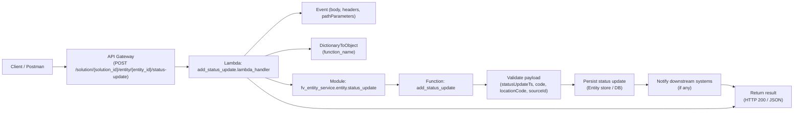

# Diagram: tools/ide_local_testing/localTest/test/entity/statusUpdate/addStatusUpdateViaLambda.py

> Auto-generated by Obscura crawlers

## Mermaid

### SVG

<svg id="container" width="2975.59375" xmlns="http://www.w3.org/2000/svg" class="flowchart" height="385" viewBox="0 0 2975.59375 385" role="graphics-document document" aria-roledescription="flowchart-v2"><g><marker id="container_flowchart-v2-pointEnd" class="marker flowchart-v2" viewBox="0 0 10 10" refX="5" refY="5" markerUnits="userSpaceOnUse" markerWidth="8" markerHeight="8" orient="auto"><path d="M 0 0 L 10 5 L 0 10 z" class="arrowMarkerPath" style="stroke-width: 1; stroke-dasharray: 1, 0;"></path></marker><marker id="container_flowchart-v2-pointStart" class="marker flowchart-v2" viewBox="0 0 10 10" refX="4.5" refY="5" markerUnits="userSpaceOnUse" markerWidth="8" markerHeight="8" orient="auto"><path d="M 0 5 L 10 10 L 10 0 z" class="arrowMarkerPath" style="stroke-width: 1; stroke-dasharray: 1, 0;"></path></marker><marker id="container_flowchart-v2-circleEnd" class="marker flowchart-v2" viewBox="0 0 10 10" refX="11" refY="5" markerUnits="userSpaceOnUse" markerWidth="11" markerHeight="11" orient="auto"><circle cx="5" cy="5" r="5" class="arrowMarkerPath" style="stroke-width: 1; stroke-dasharray: 1, 0;"></circle></marker><marker id="container_flowchart-v2-circleStart" class="marker flowchart-v2" viewBox="0 0 10 10" refX="-1" refY="5" markerUnits="userSpaceOnUse" markerWidth="11" markerHeight="11" orient="auto"><circle cx="5" cy="5" r="5" class="arrowMarkerPath" style="stroke-width: 1; stroke-dasharray: 1, 0;"></circle></marker><marker id="container_flowchart-v2-crossEnd" class="marker cross flowchart-v2" viewBox="0 0 11 11" refX="12" refY="5.2" markerUnits="userSpaceOnUse" markerWidth="11" markerHeight="11" orient="auto"><path d="M 1,1 l 9,9 M 10,1 l -9,9" class="arrowMarkerPath" style="stroke-width: 2; stroke-dasharray: 1, 0;"></path></marker><marker id="container_flowchart-v2-crossStart" class="marker cross flowchart-v2" viewBox="0 0 11 11" refX="-1" refY="5.2" markerUnits="userSpaceOnUse" markerWidth="11" markerHeight="11" orient="auto"><path d="M 1,1 l 9,9 M 10,1 l -9,9" class="arrowMarkerPath" style="stroke-width: 2; stroke-dasharray: 1, 0;"></path></marker><g class="root"><g class="clusters"></g><g class="edgePaths"><path d="M189.875,221L194.042,221C198.208,221,206.542,221,214.208,221C221.875,221,228.875,221,232.375,221L235.875,221" id="L_Client_API_Gateway_0" class="edge-thickness-normal edge-pattern-solid edge-thickness-normal edge-pattern-solid flowchart-link" style=";" data-edge="true" data-et="edge" data-id="L_Client_API_Gateway_0" data-points="W3sieCI6MTg5Ljg3NSwieSI6MjIxfSx7IngiOjIxNC44NzUsInkiOjIyMX0seyJ4IjoyMzkuODc1LCJ5IjoyMjF9XQ==" marker-end="url(#container_flowchart-v2-pointEnd)"></path><path d="M658.891,221L663.057,221C667.224,221,675.557,221,683.224,221C690.891,221,697.891,221,701.391,221L704.891,221" id="L_API_Gateway_Lambda_0" class="edge-thickness-normal edge-pattern-solid edge-thickness-normal edge-pattern-solid flowchart-link" style=";" data-edge="true" data-et="edge" data-id="L_API_Gateway_Lambda_0" data-points="W3sieCI6NjU4Ljg5MDYyNSwieSI6MjIxfSx7IngiOjY4My44OTA2MjUsInkiOjIyMX0seyJ4Ijo3MDguODkwNjI1LCJ5IjoyMjF9XQ==" marker-end="url(#container_flowchart-v2-pointEnd)"></path><path d="M912.135,182L936.245,159.5C960.356,137,1008.576,92,1042.447,69.5C1076.318,47,1095.839,47,1105.599,47L1115.359,47" id="L_Lambda_Event_0" class="edge-thickness-normal edge-pattern-solid edge-thickness-normal edge-pattern-solid flowchart-link" style=";" data-edge="true" data-et="edge" data-id="L_Lambda_Event_0" data-points="W3sieCI6OTEyLjEzNDk2NzY3MjQxMzgsInkiOjE4Mn0seyJ4IjoxMDU2Ljc5Njg3NSwieSI6NDd9LHsieCI6MTExOS4zNTkzNzUsInkiOjQ3fV0=" marker-end="url(#container_flowchart-v2-pointEnd)"></path><path d="M995.717,182L1005.897,178.833C1016.077,175.667,1036.437,169.333,1050.117,166.167C1063.797,163,1070.797,163,1074.297,163L1077.797,163" id="L_Lambda_DictObj_0" class="edge-thickness-normal edge-pattern-solid edge-thickness-normal edge-pattern-solid flowchart-link" style=";" data-edge="true" data-et="edge" data-id="L_Lambda_DictObj_0" data-points="W3sieCI6OTk1LjcxNzQwMzAxNzI0MTQsInkiOjE4Mn0seyJ4IjoxMDU2Ljc5Njg3NSwieSI6MTYzfSx7IngiOjEwODEuNzk2ODc1LCJ5IjoxNjN9XQ==" marker-end="url(#container_flowchart-v2-pointEnd)"></path><path d="M995.717,260L1005.897,263.167C1016.077,266.333,1036.437,272.667,1050.252,275.833C1064.068,279,1071.339,279,1074.974,279L1078.609,279" id="L_Lambda_ImportModule_0" class="edge-thickness-normal edge-pattern-solid edge-thickness-normal edge-pattern-solid flowchart-link" style=";" data-edge="true" data-et="edge" data-id="L_Lambda_ImportModule_0" data-points="W3sieCI6OTk1LjcxNzQwMzAxNzI0MTQsInkiOjI2MH0seyJ4IjoxMDU2Ljc5Njg3NSwieSI6Mjc5fSx7IngiOjEwODIuNjA5Mzc1LCJ5IjoyNzl9XQ==" marker-end="url(#container_flowchart-v2-pointEnd)"></path><path d="M1416.109,279L1420.411,279C1424.714,279,1433.318,279,1441.12,279C1448.922,279,1455.922,279,1459.422,279L1462.922,279" id="L_ImportModule_AddStatus_0" class="edge-thickness-normal edge-pattern-solid edge-thickness-normal edge-pattern-solid flowchart-link" style=";" data-edge="true" data-et="edge" data-id="L_ImportModule_AddStatus_0" data-points="W3sieCI6MTQxNi4xMDkzNzUsInkiOjI3OX0seyJ4IjoxNDQxLjkyMTg3NSwieSI6Mjc5fSx7IngiOjE0NjYuOTIxODc1LCJ5IjoyNzl9XQ==" marker-end="url(#container_flowchart-v2-pointEnd)"></path><path d="M1726.922,279L1731.089,279C1735.255,279,1743.589,279,1751.255,279C1758.922,279,1765.922,279,1769.422,279L1772.922,279" id="L_AddStatus_Validate_0" class="edge-thickness-normal edge-pattern-solid edge-thickness-normal edge-pattern-solid flowchart-link" style=";" data-edge="true" data-et="edge" data-id="L_AddStatus_Validate_0" data-points="W3sieCI6MTcyNi45MjE4NzUsInkiOjI3OX0seyJ4IjoxNzUxLjkyMTg3NSwieSI6Mjc5fSx7IngiOjE3NzYuOTIxODc1LCJ5IjoyNzl9XQ==" marker-end="url(#container_flowchart-v2-pointEnd)"></path><path d="M2037.594,279L2041.76,279C2045.927,279,2054.26,279,2061.927,279C2069.594,279,2076.594,279,2080.094,279L2083.594,279" id="L_Validate_Persist_0" class="edge-thickness-normal edge-pattern-solid edge-thickness-normal edge-pattern-solid flowchart-link" style=";" data-edge="true" data-et="edge" data-id="L_Validate_Persist_0" data-points="W3sieCI6MjAzNy41OTM3NSwieSI6Mjc5fSx7IngiOjIwNjIuNTkzNzUsInkiOjI3OX0seyJ4IjoyMDg3LjU5Mzc1LCJ5IjoyNzl9XQ==" marker-end="url(#container_flowchart-v2-pointEnd)"></path><path d="M2347.594,279L2351.76,279C2355.927,279,2364.26,279,2371.927,279C2379.594,279,2386.594,279,2390.094,279L2393.594,279" id="L_Persist_Notify_0" class="edge-thickness-normal edge-pattern-solid edge-thickness-normal edge-pattern-solid flowchart-link" style=";" data-edge="true" data-et="edge" data-id="L_Persist_Notify_0" data-points="W3sieCI6MjM0Ny41OTM3NSwieSI6Mjc5fSx7IngiOjIzNzIuNTkzNzUsInkiOjI3OX0seyJ4IjoyMzk3LjU5Mzc1LCJ5IjoyNzl9XQ==" marker-end="url(#container_flowchart-v2-pointEnd)"></path><path d="M2657.594,279L2661.76,279C2665.927,279,2674.26,279,2683.064,280.466C2691.867,281.931,2701.14,284.863,2705.776,286.329L2710.412,287.794" id="L_Notify_Response_0" class="edge-thickness-normal edge-pattern-solid edge-thickness-normal edge-pattern-solid flowchart-link" style=";" data-edge="true" data-et="edge" data-id="L_Notify_Response_0" data-points="W3sieCI6MjY1Ny41OTM3NSwieSI6Mjc5fSx7IngiOjI2ODIuNTkzNzUsInkiOjI3OX0seyJ4IjoyNzE0LjIyNjQwMzA2MTIyNDYsInkiOjI4OX1d" marker-end="url(#container_flowchart-v2-pointEnd)"></path><path d="M916.957,260L940.264,279.5C963.57,299,1010.184,338,1065.584,357.5C1120.984,377,1185.172,377,1249.359,377C1313.547,377,1377.734,377,1435.661,377C1493.589,377,1545.255,377,1596.922,377C1648.589,377,1700.255,377,1751.978,377C1803.701,377,1855.479,377,1907.258,377C1959.036,377,2010.815,377,2062.538,377C2114.26,377,2165.927,377,2217.594,377C2269.26,377,2320.927,377,2372.594,377C2424.26,377,2475.927,377,2527.594,377C2579.26,377,2630.927,377,2661.397,375.534C2691.867,374.069,2701.14,371.137,2705.776,369.671L2710.412,368.206" id="L_Lambda_Response_0" class="edge-thickness-normal edge-pattern-solid edge-thickness-normal edge-pattern-solid flowchart-link" style=";" data-edge="true" data-et="edge" data-id="L_Lambda_Response_0" data-points="W3sieCI6OTE2Ljk1NzAzMTI1LCJ5IjoyNjB9LHsieCI6MTA1Ni43OTY4NzUsInkiOjM3N30seyJ4IjoxMjQ5LjM1OTM3NSwieSI6Mzc3fSx7IngiOjE0NDEuOTIxODc1LCJ5IjozNzd9LHsieCI6MTU5Ni45MjE4NzUsInkiOjM3N30seyJ4IjoxNzUxLjkyMTg3NSwieSI6Mzc3fSx7IngiOjE5MDcuMjU3ODEyNSwieSI6Mzc3fSx7IngiOjIwNjIuNTkzNzUsInkiOjM3N30seyJ4IjoyMjE3LjU5Mzc1LCJ5IjozNzd9LHsieCI6MjM3Mi41OTM3NSwieSI6Mzc3fSx7IngiOjI1MjcuNTkzNzUsInkiOjM3N30seyJ4IjoyNjgyLjU5Mzc1LCJ5IjozNzd9LHsieCI6MjcxNC4yMjY0MDMwNjEyMjQ2LCJ5IjozNjd9XQ==" marker-end="url(#container_flowchart-v2-pointEnd)"></path></g><g class="edgeLabels"><g class="edgeLabel"><g class="label" data-id="L_Client_API_Gateway_0" transform="translate(0, 0)"><foreignObject width="0" height="0">

</foreignObject></g></g><g class="edgeLabel"><g class="label" data-id="L_API_Gateway_Lambda_0" transform="translate(0, 0)"><foreignObject width="0" height="0">

</foreignObject></g></g><g class="edgeLabel"><g class="label" data-id="L_Lambda_Event_0" transform="translate(0, 0)"><foreignObject width="0" height="0">

</foreignObject></g></g><g class="edgeLabel"><g class="label" data-id="L_Lambda_DictObj_0" transform="translate(0, 0)"><foreignObject width="0" height="0">

</foreignObject></g></g><g class="edgeLabel"><g class="label" data-id="L_Lambda_ImportModule_0" transform="translate(0, 0)"><foreignObject width="0" height="0">

</foreignObject></g></g><g class="edgeLabel"><g class="label" data-id="L_ImportModule_AddStatus_0" transform="translate(0, 0)"><foreignObject width="0" height="0">

</foreignObject></g></g><g class="edgeLabel"><g class="label" data-id="L_AddStatus_Validate_0" transform="translate(0, 0)"><foreignObject width="0" height="0">

</foreignObject></g></g><g class="edgeLabel"><g class="label" data-id="L_Validate_Persist_0" transform="translate(0, 0)"><foreignObject width="0" height="0">

</foreignObject></g></g><g class="edgeLabel"><g class="label" data-id="L_Persist_Notify_0" transform="translate(0, 0)"><foreignObject width="0" height="0">

</foreignObject></g></g><g class="edgeLabel"><g class="label" data-id="L_Notify_Response_0" transform="translate(0, 0)"><foreignObject width="0" height="0">

</foreignObject></g></g><g class="edgeLabel"><g class="label" data-id="L_Lambda_Response_0" transform="translate(0, 0)"><foreignObject width="0" height="0">

</foreignObject></g></g></g><g class="nodes"><g class="node default" id="flowchart-Client-0" transform="translate(98.9375, 221)"><rect class="basic label-container" style="" x="-90.9375" y="-27" width="181.875" height="54"></rect><g class="label" style="" transform="translate(-60.9375, -12)"><rect></rect><foreignObject width="121.875" height="24">

Client / Postman

</foreignObject></g></g><g class="node default" id="flowchart-API_Gateway-1" transform="translate(449.3828125, 221)"><rect class="basic label-container" style="" x="-209.5078125" y="-51" width="419.015625" height="102"></rect><g class="label" style="" transform="translate(-179.5078125, -36)"><rect></rect><foreignObject width="359.015625" height="72">

API Gateway\n(POST /solution/{solution_id}/entity/{entity_id}/status-update)

</foreignObject></g></g><g class="node default" id="flowchart-Lambda-3" transform="translate(870.34375, 221)"><rect class="basic label-container" style="" x="-161.453125" y="-39" width="322.90625" height="78"></rect><g class="label" style="" transform="translate(-131.453125, -24)"><rect></rect><foreignObject width="262.90625" height="48">

Lambda: add_status_update.lambda_handler

</foreignObject></g></g><g class="node default" id="flowchart-Event-5" transform="translate(1249.359375, 47)"><rect class="basic label-container" style="" x="-130" y="-39" width="260" height="78"></rect><g class="label" style="" transform="translate(-100, -24)"><rect></rect><foreignObject width="200" height="48">

Event (body, headers, pathParameters)

</foreignObject></g></g><g class="node default" id="flowchart-DictObj-7" transform="translate(1249.359375, 163)"><rect class="basic label-container" style="" x="-167.5625" y="-27" width="335.125" height="54"></rect><g class="label" style="" transform="translate(-137.5625, -12)"><rect></rect><foreignObject width="275.125" height="24">

DictionaryToObject\n(function_name)

</foreignObject></g></g><g class="node default" id="flowchart-ImportModule-9" transform="translate(1249.359375, 279)"><rect class="basic label-container" style="" x="-166.75" y="-39" width="333.5" height="78"></rect><g class="label" style="" transform="translate(-136.75, -24)"><rect></rect><foreignObject width="273.5" height="48">

Module: fv_entity_service.entity.status_update

</foreignObject></g></g><g class="node default" id="flowchart-AddStatus-11" transform="translate(1596.921875, 279)"><rect class="basic label-container" style="" x="-130" y="-39" width="260" height="78"></rect><g class="label" style="" transform="translate(-100, -24)"><rect></rect><foreignObject width="200" height="48">

Function: add_status_update

</foreignObject></g></g><g class="node default" id="flowchart-Validate-13" transform="translate(1907.2578125, 279)"><rect class="basic label-container" style="" x="-130.3359375" y="-63" width="260.671875" height="126"></rect><g class="label" style="" transform="translate(-100.3359375, -48)"><rect></rect><foreignObject width="200.671875" height="96">

Validate payload\n(statusUpdateTs, code, locationCode, sourceId)

</foreignObject></g></g><g class="node default" id="flowchart-Persist-15" transform="translate(2217.59375, 279)"><rect class="basic label-container" style="" x="-130" y="-39" width="260" height="78"></rect><g class="label" style="" transform="translate(-100, -24)"><rect></rect><foreignObject width="200" height="48">

Persist status update\n(Entity store / DB)

</foreignObject></g></g><g class="node default" id="flowchart-Notify-17" transform="translate(2527.59375, 279)"><rect class="basic label-container" style="" x="-130" y="-39" width="260" height="78"></rect><g class="label" style="" transform="translate(-100, -24)"><rect></rect><foreignObject width="200" height="48">

Notify downstream systems\n(if any)

</foreignObject></g></g><g class="node default" id="flowchart-Response-19" transform="translate(2837.59375, 328)"><rect class="basic label-container" style="" x="-130" y="-39" width="260" height="78"></rect><g class="label" style="" transform="translate(-100, -24)"><rect></rect><foreignObject width="200" height="48">

Return result\n(HTTP 200 / JSON)

</foreignObject></g></g></g></g></g></svg>
