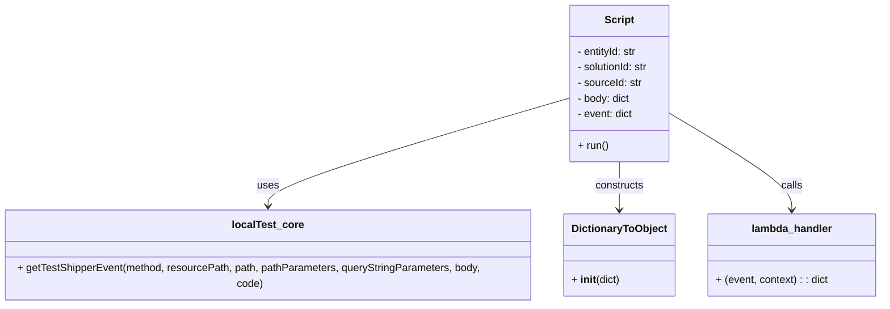

# Diagram: tools/ide_local_testing/localTest/test/entity/statusUpdate/addStatusUpdateWithBadSourceIdViaLambda.py


> Auto-generated by Obscura crawlers

## Diagram 1



### SVG

<svg id="container" width="1372.8359375" xmlns="http://www.w3.org/2000/svg" class="classDiagram" height="456" viewBox="0 0 1372.8359375 456" role="graphics-document document" aria-roledescription="class"><style>#container{font-family:"trebuchet ms",verdana,arial,sans-serif;font-size:16px;fill:#333;}@keyframes edge-animation-frame{from{stroke-dashoffset:0;}}@keyframes dash{to{stroke-dashoffset:0;}}#container .edge-animation-slow{stroke-dasharray:9,5!important;stroke-dashoffset:900;animation:dash 50s linear infinite;stroke-linecap:round;}#container .edge-animation-fast{stroke-dasharray:9,5!important;stroke-dashoffset:900;animation:dash 20s linear infinite;stroke-linecap:round;}#container .error-icon{fill:#552222;}#container .error-text{fill:#552222;stroke:#552222;}#container .edge-thickness-normal{stroke-width:1px;}#container .edge-thickness-thick{stroke-width:3.5px;}#container .edge-pattern-solid{stroke-dasharray:0;}#container .edge-thickness-invisible{stroke-width:0;fill:none;}#container .edge-pattern-dashed{stroke-dasharray:3;}#container .edge-pattern-dotted{stroke-dasharray:2;}#container .marker{fill:#333333;stroke:#333333;}#container .marker.cross{stroke:#333333;}#container svg{font-family:"trebuchet ms",verdana,arial,sans-serif;font-size:16px;}#container p{margin:0;}#container g.classGroup text{fill:#9370DB;stroke:none;font-family:"trebuchet ms",verdana,arial,sans-serif;font-size:10px;}#container g.classGroup text .title{font-weight:bolder;}#container .nodeLabel,#container .edgeLabel{color:#131300;}#container .edgeLabel .label rect{fill:#ECECFF;}#container .label text{fill:#131300;}#container .labelBkg{background:#ECECFF;}#container .edgeLabel .label span{background:#ECECFF;}#container .classTitle{font-weight:bolder;}#container .node rect,#container .node circle,#container .node ellipse,#container .node polygon,#container .node path{fill:#ECECFF;stroke:#9370DB;stroke-width:1px;}#container .divider{stroke:#9370DB;stroke-width:1;}#container g.clickable{cursor:pointer;}#container g.classGroup rect{fill:#ECECFF;stroke:#9370DB;}#container g.classGroup line{stroke:#9370DB;stroke-width:1;}#container .classLabel .box{stroke:none;stroke-width:0;fill:#ECECFF;opacity:0.5;}#container .classLabel .label{fill:#9370DB;font-size:10px;}#container .relation{stroke:#333333;stroke-width:1;fill:none;}#container .dashed-line{stroke-dasharray:3;}#container .dotted-line{stroke-dasharray:1 2;}#container #compositionStart,#container .composition{fill:#333333!important;stroke:#333333!important;stroke-width:1;}#container #compositionEnd,#container .composition{fill:#333333!important;stroke:#333333!important;stroke-width:1;}#container #dependencyStart,#container .dependency{fill:#333333!important;stroke:#333333!important;stroke-width:1;}#container #dependencyStart,#container .dependency{fill:#333333!important;stroke:#333333!important;stroke-width:1;}#container #extensionStart,#container .extension{fill:transparent!important;stroke:#333333!important;stroke-width:1;}#container #extensionEnd,#container .extension{fill:transparent!important;stroke:#333333!important;stroke-width:1;}#container #aggregationStart,#container .aggregation{fill:transparent!important;stroke:#333333!important;stroke-width:1;}#container #aggregationEnd,#container .aggregation{fill:transparent!important;stroke:#333333!important;stroke-width:1;}#container #lollipopStart,#container .lollipop{fill:#ECECFF!important;stroke:#333333!important;stroke-width:1;}#container #lollipopEnd,#container .lollipop{fill:#ECECFF!important;stroke:#333333!important;stroke-width:1;}#container .edgeTerminals{font-size:11px;line-height:initial;}#container .classTitleText{text-anchor:middle;font-size:18px;fill:#333;}#container .label-icon{display:inline-block;height:1em;overflow:visible;vertical-align:-0.125em;}#container .node .label-icon path{fill:currentColor;stroke:revert;stroke-width:revert;}#container :root{--mermaid-font-family:"trebuchet ms",verdana,arial,sans-serif;}</style><g><defs><marker id="container_class-aggregationStart" class="marker aggregation class" refX="18" refY="7" markerWidth="190" markerHeight="240" orient="auto"><path d="M 18,7 L9,13 L1,7 L9,1 Z"></path></marker></defs><defs><marker id="container_class-aggregationEnd" class="marker aggregation class" refX="1" refY="7" markerWidth="20" markerHeight="28" orient="auto"><path d="M 18,7 L9,13 L1,7 L9,1 Z"></path></marker></defs><defs><marker id="container_class-extensionStart" class="marker extension class" refX="18" refY="7" markerWidth="190" markerHeight="240" orient="auto"><path d="M 1,7 L18,13 V 1 Z"></path></marker></defs><defs><marker id="container_class-extensionEnd" class="marker extension class" refX="1" refY="7" markerWidth="20" markerHeight="28" orient="auto"><path d="M 1,1 V 13 L18,7 Z"></path></marker></defs><defs><marker id="container_class-compositionStart" class="marker composition class" refX="18" refY="7" markerWidth="190" markerHeight="240" orient="auto"><path d="M 18,7 L9,13 L1,7 L9,1 Z"></path></marker></defs><defs><marker id="container_class-compositionEnd" class="marker composition class" refX="1" refY="7" markerWidth="20" markerHeight="28" orient="auto"><path d="M 18,7 L9,13 L1,7 L9,1 Z"></path></marker></defs><defs><marker id="container_class-dependencyStart" class="marker dependency class" refX="6" refY="7" markerWidth="190" markerHeight="240" orient="auto"><path d="M 5,7 L9,13 L1,7 L9,1 Z"></path></marker></defs><defs><marker id="container_class-dependencyEnd" class="marker dependency class" refX="13" refY="7" markerWidth="20" markerHeight="28" orient="auto"><path d="M 18,7 L9,13 L14,7 L9,1 Z"></path></marker></defs><defs><marker id="container_class-lollipopStart" class="marker lollipop class" refX="13" refY="7" markerWidth="190" markerHeight="240" orient="auto"><circle stroke="black" fill="transparent" cx="7" cy="7" r="6"></circle></marker></defs><defs><marker id="container_class-lollipopEnd" class="marker lollipop class" refX="1" refY="7" markerWidth="190" markerHeight="240" orient="auto"><circle stroke="black" fill="transparent" cx="7" cy="7" r="6"></circle></marker></defs><g class="root"><g class="clusters"></g><g class="edgePaths"><path d="M894.816,150.555L816.307,172.963C737.797,195.37,580.777,240.185,502.268,267.759C423.758,295.333,423.758,305.667,423.758,310.833L423.758,316" id="id_Script_localTest_core_1" class="edge-thickness-normal edge-pattern-solid relation" style=";;;" data-edge="true" data-et="edge" data-id="id_Script_localTest_core_1" data-points="W3sieCI6ODk0LjgxNjQwNjI1LCJ5IjoxNTAuNTU1MTkwMjQwMTYxMzJ9LHsieCI6NDIzLjc1NzgxMjUsInkiOjI4NX0seyJ4Ijo0MjMuNzU3ODEyNSwieSI6MzIyfV0=" marker-end="url(#container_class-dependencyEnd)"></path><path d="M973.844,248L973.844,254.167C973.844,260.333,973.844,272.667,973.844,284C973.844,295.333,973.844,305.667,973.844,310.833L973.844,316" id="id_Script_DictionaryToObject_2" class="edge-thickness-normal edge-pattern-solid relation" style=";;;" data-edge="true" data-et="edge" data-id="id_Script_DictionaryToObject_2" data-points="W3sieCI6OTczLjg0Mzc1LCJ5IjoyNDh9LHsieCI6OTczLjg0Mzc1LCJ5IjoyODV9LHsieCI6OTczLjg0Mzc1LCJ5IjozMjJ9XQ==" marker-end="url(#container_class-dependencyEnd)"></path><path d="M1052.871,175.237L1083.477,193.531C1114.082,211.825,1175.293,248.412,1205.898,271.873C1236.504,295.333,1236.504,305.667,1236.504,310.833L1236.504,316" id="id_Script_lambda_handler_3" class="edge-thickness-normal edge-pattern-solid relation" style=";;;" data-edge="true" data-et="edge" data-id="id_Script_lambda_handler_3" data-points="W3sieCI6MTA1Mi44NzEwOTM3NSwieSI6MTc1LjIzNzA1Nzc0NzUwNTI1fSx7IngiOjEyMzYuNTAzOTA2MjUsInkiOjI4NX0seyJ4IjoxMjM2LjUwMzkwNjI1LCJ5IjozMjJ9XQ==" marker-end="url(#container_class-dependencyEnd)"></path></g><g class="edgeLabels"><g class="edgeLabel" transform="translate(423.7578125, 285)"><g class="label" data-id="id_Script_localTest_core_1" transform="translate(-16.4921875, -12)"><foreignObject width="32.984375" height="24"><div xmlns="http://www.w3.org/1999/xhtml" class="labelBkg" style="display: table-cell; white-space: nowrap; line-height: 1.5; max-width: 200px; text-align: center;"><span class="edgeLabel"><p>uses</p></span></div></foreignObject></g></g><g class="edgeLabel" transform="translate(973.84375, 285)"><g class="label" data-id="id_Script_DictionaryToObject_2" transform="translate(-37.84375, -12)"><foreignObject width="75.6875" height="24"><div xmlns="http://www.w3.org/1999/xhtml" class="labelBkg" style="display: table-cell; white-space: nowrap; line-height: 1.5; max-width: 200px; text-align: center;"><span class="edgeLabel"><p>constructs</p></span></div></foreignObject></g></g><g class="edgeLabel" transform="translate(1236.50390625, 285)"><g class="label" data-id="id_Script_lambda_handler_3" transform="translate(-16.4453125, -12)"><foreignObject width="32.890625" height="24"><div xmlns="http://www.w3.org/1999/xhtml" class="labelBkg" style="display: table-cell; white-space: nowrap; line-height: 1.5; max-width: 200px; text-align: center;"><span class="edgeLabel"><p>calls</p></span></div></foreignObject></g></g></g><g class="nodes"><g class="node default" id="classId-Script-0" transform="translate(973.84375, 128)"><g class="basic label-container"><path d="M-79.02734375 -120 L79.02734375 -120 L79.02734375 120 L-79.02734375 120" stroke="none" stroke-width="0" fill="#ECECFF" style=""></path><path d="M-79.02734375 -120 C-45.71946379486789 -120, -12.411583839735783 -120, 79.02734375 -120 M-79.02734375 -120 C-38.193379919228065 -120, 2.640583911543871 -120, 79.02734375 -120 M79.02734375 -120 C79.02734375 -47.20327182211149, 79.02734375 25.593456355777022, 79.02734375 120 M79.02734375 -120 C79.02734375 -33.158905155933766, 79.02734375 53.68218968813247, 79.02734375 120 M79.02734375 120 C23.04817520867465 120, -32.9309933326507 120, -79.02734375 120 M79.02734375 120 C36.010212819688995 120, -7.00691811062201 120, -79.02734375 120 M-79.02734375 120 C-79.02734375 45.66613589825238, -79.02734375 -28.667728203495244, -79.02734375 -120 M-79.02734375 120 C-79.02734375 24.401279858056782, -79.02734375 -71.19744028388644, -79.02734375 -120" stroke="#9370DB" stroke-width="1.3" fill="none" stroke-dasharray="0 0" style=""></path></g><g class="annotation-group text" transform="translate(0, -96)"></g><g class="label-group text" transform="translate(-21.7421875, -96)"><g class="label" style="font-weight: bolder" transform="translate(0,-12)"><foreignObject width="43.484375" height="24"><div xmlns="http://www.w3.org/1999/xhtml" style="display: table-cell; white-space: nowrap; line-height: 1.5; max-width: 93px; text-align: center;"><span class="nodeLabel markdown-node-label" style=""><p>Script</p></span></div></foreignObject></g></g><g class="members-group text" transform="translate(-67.02734375, -48)"><g class="label" style="" transform="translate(0,-12)"><foreignObject width="94.4375" height="24"><div xmlns="http://www.w3.org/1999/xhtml" style="display: table-cell; white-space: nowrap; line-height: 1.5; max-width: 153px; text-align: center;"><span class="nodeLabel markdown-node-label" style=""><p>- entityId: str</p></span></div></foreignObject></g><g class="label" style="" transform="translate(0,12)"><foreignObject width="112.3125" height="24"><div xmlns="http://www.w3.org/1999/xhtml" style="display: table-cell; white-space: nowrap; line-height: 1.5; max-width: 170px; text-align: center;"><span class="nodeLabel markdown-node-label" style=""><p>- solutionId: str</p></span></div></foreignObject></g><g class="label" style="" transform="translate(0,36)"><foreignObject width="100.359375" height="24"><div xmlns="http://www.w3.org/1999/xhtml" style="display: table-cell; white-space: nowrap; line-height: 1.5; max-width: 159px; text-align: center;"><span class="nodeLabel markdown-node-label" style=""><p>- sourceId: str</p></span></div></foreignObject></g><g class="label" style="" transform="translate(0,60)"><foreignObject width="82.625" height="24"><div xmlns="http://www.w3.org/1999/xhtml" style="display: table-cell; white-space: nowrap; line-height: 1.5; max-width: 140px; text-align: center;"><span class="nodeLabel markdown-node-label" style=""><p>- body: dict</p></span></div></foreignObject></g><g class="label" style="" transform="translate(0,84)"><foreignObject width="86.6875" height="24"><div xmlns="http://www.w3.org/1999/xhtml" style="display: table-cell; white-space: nowrap; line-height: 1.5; max-width: 144px; text-align: center;"><span class="nodeLabel markdown-node-label" style=""><p>- event: dict</p></span></div></foreignObject></g></g><g class="methods-group text" transform="translate(-67.02734375, 96)"><g class="label" style="" transform="translate(0,-12)"><foreignObject width="47.46875" height="24"><div xmlns="http://www.w3.org/1999/xhtml" style="display: table-cell; white-space: nowrap; line-height: 1.5; max-width: 105px; text-align: center;"><span class="nodeLabel markdown-node-label" style=""><p>+ run()</p></span></div></foreignObject></g></g><g class="divider" style=""><path d="M-79.02734375 -72 C-27.21127190794038 -72, 24.604799934119242 -72, 79.02734375 -72 M-79.02734375 -72 C-16.702845868284918 -72, 45.621652013430165 -72, 79.02734375 -72" stroke="#9370DB" stroke-width="1.3" fill="none" stroke-dasharray="0 0" style=""></path></g><g class="divider" style=""><path d="M-79.02734375 72 C-36.0285145816396 72, 6.970314586720804 72, 79.02734375 72 M-79.02734375 72 C-30.993169899291097 72, 17.041003951417807 72, 79.02734375 72" stroke="#9370DB" stroke-width="1.3" fill="none" stroke-dasharray="0 0" style=""></path></g></g><g class="node default" id="classId-localTest_core-1" transform="translate(423.7578125, 385)"><g class="basic label-container"><path d="M-415.7578125 -63 L415.7578125 -63 L415.7578125 63 L-415.7578125 63" stroke="none" stroke-width="0" fill="#ECECFF" style=""></path><path d="M-415.7578125 -63 C-173.4334066131566 -63, 68.89099927368682 -63, 415.7578125 -63 M-415.7578125 -63 C-86.19217386338795 -63, 243.3734647732241 -63, 415.7578125 -63 M415.7578125 -63 C415.7578125 -17.93612539085416, 415.7578125 27.127749218291683, 415.7578125 63 M415.7578125 -63 C415.7578125 -29.110080718949263, 415.7578125 4.7798385621014745, 415.7578125 63 M415.7578125 63 C134.78152556417092 63, -146.19476137165816 63, -415.7578125 63 M415.7578125 63 C101.54051013083262 63, -212.67679223833477 63, -415.7578125 63 M-415.7578125 63 C-415.7578125 33.16007561320064, -415.7578125 3.320151226401279, -415.7578125 -63 M-415.7578125 63 C-415.7578125 23.611922726596795, -415.7578125 -15.77615454680641, -415.7578125 -63" stroke="#9370DB" stroke-width="1.3" fill="none" stroke-dasharray="0 0" style=""></path></g><g class="annotation-group text" transform="translate(0, -39)"></g><g class="label-group text" transform="translate(-52.421875, -39)"><g class="label" style="font-weight: bolder" transform="translate(0,-12)"><foreignObject width="104.84375" height="24"><div xmlns="http://www.w3.org/1999/xhtml" style="display: table-cell; white-space: nowrap; line-height: 1.5; max-width: 153px; text-align: center;"><span class="nodeLabel markdown-node-label" style=""><p>localTest_core</p></span></div></foreignObject></g></g><g class="members-group text" transform="translate(-403.7578125, 9)"></g><g class="methods-group text" transform="translate(-403.7578125, 39)"><g class="label" style="" transform="translate(0,-12)"><foreignObject width="755.09375" height="24"><div xmlns="http://www.w3.org/1999/xhtml" style="display: table-cell; white-space: nowrap; line-height: 1.5; max-width: 812px; text-align: center;"><span class="nodeLabel markdown-node-label" style=""><p>+ getTestShipperEvent(method, resourcePath, path, pathParameters, queryStringParameters, body, code)</p></span></div></foreignObject></g></g><g class="divider" style=""><path d="M-415.7578125 -15 C-200.30453316758584 -15, 15.14874616482831 -15, 415.7578125 -15 M-415.7578125 -15 C-217.87980485719353 -15, -20.001797214387068 -15, 415.7578125 -15" stroke="#9370DB" stroke-width="1.3" fill="none" stroke-dasharray="0 0" style=""></path></g><g class="divider" style=""><path d="M-415.7578125 9 C-130.94756211024935 9, 153.8626882795013 9, 415.7578125 9 M-415.7578125 9 C-235.57388412140054 9, -55.38995574280108 9, 415.7578125 9" stroke="#9370DB" stroke-width="1.3" fill="none" stroke-dasharray="0 0" style=""></path></g></g><g class="node default" id="classId-DictionaryToObject-2" transform="translate(973.84375, 385)"><g class="basic label-container"><path d="M-84.328125 -63 L84.328125 -63 L84.328125 63 L-84.328125 63" stroke="none" stroke-width="0" fill="#ECECFF" style=""></path><path d="M-84.328125 -63 C-24.007637503908263 -63, 36.31284999218347 -63, 84.328125 -63 M-84.328125 -63 C-39.66215172032571 -63, 5.00382155934858 -63, 84.328125 -63 M84.328125 -63 C84.328125 -36.40587218411464, 84.328125 -9.811744368229284, 84.328125 63 M84.328125 -63 C84.328125 -17.481379149337876, 84.328125 28.03724170132425, 84.328125 63 M84.328125 63 C38.99924031494937 63, -6.3296443701012635 63, -84.328125 63 M84.328125 63 C35.815777396076804 63, -12.696570207846392 63, -84.328125 63 M-84.328125 63 C-84.328125 34.133940866540414, -84.328125 5.267881733080827, -84.328125 -63 M-84.328125 63 C-84.328125 34.95812150685252, -84.328125 6.916243013705049, -84.328125 -63" stroke="#9370DB" stroke-width="1.3" fill="none" stroke-dasharray="0 0" style=""></path></g><g class="annotation-group text" transform="translate(0, -39)"></g><g class="label-group text" transform="translate(-70.109375, -39)"><g class="label" style="font-weight: bolder" transform="translate(0,-12)"><foreignObject width="140.21875" height="24"><div xmlns="http://www.w3.org/1999/xhtml" style="display: table-cell; white-space: nowrap; line-height: 1.5; max-width: 188px; text-align: center;"><span class="nodeLabel markdown-node-label" style=""><p>DictionaryToObject</p></span></div></foreignObject></g></g><g class="members-group text" transform="translate(-72.328125, 9)"></g><g class="methods-group text" transform="translate(-72.328125, 39)"><g class="label" style="" transform="translate(0,-12)"><foreignObject width="74.546875" height="24"><div xmlns="http://www.w3.org/1999/xhtml" style="display: table-cell; white-space: nowrap; line-height: 1.5; max-width: 165px; text-align: center;"><span class="nodeLabel markdown-node-label" style=""><p>+ <strong>init</strong>(dict)</p></span></div></foreignObject></g></g><g class="divider" style=""><path d="M-84.328125 -15 C-40.12515105955474 -15, 4.077822880890523 -15, 84.328125 -15 M-84.328125 -15 C-45.44813018737572 -15, -6.568135374751435 -15, 84.328125 -15" stroke="#9370DB" stroke-width="1.3" fill="none" stroke-dasharray="0 0" style=""></path></g><g class="divider" style=""><path d="M-84.328125 9 C-36.53893667086508 9, 11.250251658269846 9, 84.328125 9 M-84.328125 9 C-21.164040718854153 9, 42.000043562291694 9, 84.328125 9" stroke="#9370DB" stroke-width="1.3" fill="none" stroke-dasharray="0 0" style=""></path></g></g><g class="node default" id="classId-lambda_handler-3" transform="translate(1236.50390625, 385)"><g class="basic label-container"><path d="M-128.33203125 -63 L128.33203125 -63 L128.33203125 63 L-128.33203125 63" stroke="none" stroke-width="0" fill="#ECECFF" style=""></path><path d="M-128.33203125 -63 C-52.94015269542429 -63, 22.451725859151423 -63, 128.33203125 -63 M-128.33203125 -63 C-50.957265087214765 -63, 26.41750107557047 -63, 128.33203125 -63 M128.33203125 -63 C128.33203125 -13.452780668185703, 128.33203125 36.094438663628594, 128.33203125 63 M128.33203125 -63 C128.33203125 -36.68757641876042, 128.33203125 -10.375152837520844, 128.33203125 63 M128.33203125 63 C68.37395218206379 63, 8.415873114127592 63, -128.33203125 63 M128.33203125 63 C64.92320945438962 63, 1.514387658779242 63, -128.33203125 63 M-128.33203125 63 C-128.33203125 27.166212209184216, -128.33203125 -8.667575581631567, -128.33203125 -63 M-128.33203125 63 C-128.33203125 19.195084738567708, -128.33203125 -24.609830522864584, -128.33203125 -63" stroke="#9370DB" stroke-width="1.3" fill="none" stroke-dasharray="0 0" style=""></path></g><g class="annotation-group text" transform="translate(0, -39)"></g><g class="label-group text" transform="translate(-59.9765625, -39)"><g class="label" style="font-weight: bolder" transform="translate(0,-12)"><foreignObject width="119.953125" height="24"><div xmlns="http://www.w3.org/1999/xhtml" style="display: table-cell; white-space: nowrap; line-height: 1.5; max-width: 170px; text-align: center;"><span class="nodeLabel markdown-node-label" style=""><p>lambda_handler</p></span></div></foreignObject></g></g><g class="members-group text" transform="translate(-116.33203125, 9)"></g><g class="methods-group text" transform="translate(-116.33203125, 39)"><g class="label" style="" transform="translate(0,-12)"><foreignObject width="172.6875" height="24"><div xmlns="http://www.w3.org/1999/xhtml" style="display: table-cell; white-space: nowrap; line-height: 1.5; max-width: 230px; text-align: center;"><span class="nodeLabel markdown-node-label" style=""><p>+ (event, context) : : dict</p></span></div></foreignObject></g></g><g class="divider" style=""><path d="M-128.33203125 -15 C-76.98407042151842 -15, -25.63610959303685 -15, 128.33203125 -15 M-128.33203125 -15 C-56.744856878672266 -15, 14.842317492655468 -15, 128.33203125 -15" stroke="#9370DB" stroke-width="1.3" fill="none" stroke-dasharray="0 0" style=""></path></g><g class="divider" style=""><path d="M-128.33203125 9 C-58.24570565791133 9, 11.84061993417734 9, 128.33203125 9 M-128.33203125 9 C-45.49454950249448 9, 37.34293224501104 9, 128.33203125 9" stroke="#9370DB" stroke-width="1.3" fill="none" stroke-dasharray="0 0" style=""></path></g></g></g></g></g></svg>

## Diagram 2

```mermaid
flowchart TD
    Start([Start]) --> BuildBody[Build body dict with vin, code, references, sourceId]
    BuildBody --> GetEvent[getTestShipperEvent(...) -> event]
    GetEvent --> CallLambda[Call lambda_handler(event, DictionaryToObject(...))]
    CallLambda --> Response[Receive response (expected 400 for bad source)]
    Response --> Print[print(response)]
    Print --> End([End])
```

> SVG rendering failed for this diagram.
