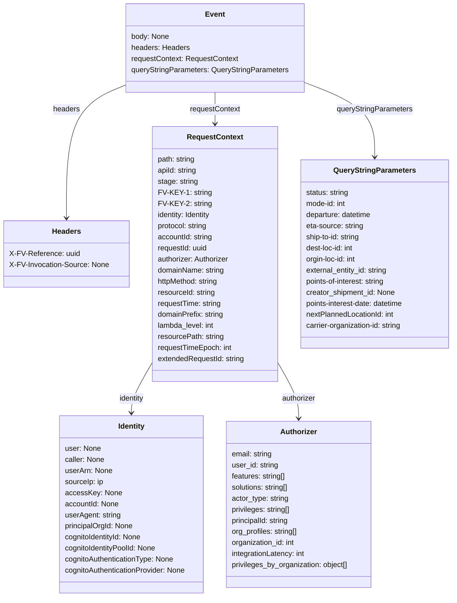

# Diagram: tools/ide_local_testing/localTest/test/entity/statusUpdate/etaProxy.py

> Auto-generated by Obscura crawlers

## Mermaid

### SVG

<svg id="container" width="987.65625" xmlns="http://www.w3.org/2000/svg" class="classDiagram" height="1292" viewBox="0 0 987.65625 1292" role="graphics-document document" aria-roledescription="class"><g><defs><marker id="container_class-aggregationStart" class="marker aggregation class" refX="18" refY="7" markerWidth="190" markerHeight="240" orient="auto"><path d="M 18,7 L9,13 L1,7 L9,1 Z"></path></marker></defs><defs><marker id="container_class-aggregationEnd" class="marker aggregation class" refX="1" refY="7" markerWidth="20" markerHeight="28" orient="auto"><path d="M 18,7 L9,13 L1,7 L9,1 Z"></path></marker></defs><defs><marker id="container_class-extensionStart" class="marker extension class" refX="18" refY="7" markerWidth="190" markerHeight="240" orient="auto"><path d="M 1,7 L18,13 V 1 Z"></path></marker></defs><defs><marker id="container_class-extensionEnd" class="marker extension class" refX="1" refY="7" markerWidth="20" markerHeight="28" orient="auto"><path d="M 1,1 V 13 L18,7 Z"></path></marker></defs><defs><marker id="container_class-compositionStart" class="marker composition class" refX="18" refY="7" markerWidth="190" markerHeight="240" orient="auto"><path d="M 18,7 L9,13 L1,7 L9,1 Z"></path></marker></defs><defs><marker id="container_class-compositionEnd" class="marker composition class" refX="1" refY="7" markerWidth="20" markerHeight="28" orient="auto"><path d="M 18,7 L9,13 L1,7 L9,1 Z"></path></marker></defs><defs><marker id="container_class-dependencyStart" class="marker dependency class" refX="6" refY="7" markerWidth="190" markerHeight="240" orient="auto"><path d="M 5,7 L9,13 L1,7 L9,1 Z"></path></marker></defs><defs><marker id="container_class-dependencyEnd" class="marker dependency class" refX="13" refY="7" markerWidth="20" markerHeight="28" orient="auto"><path d="M 18,7 L9,13 L14,7 L9,1 Z"></path></marker></defs><defs><marker id="container_class-lollipopStart" class="marker lollipop class" refX="13" refY="7" markerWidth="190" markerHeight="240" orient="auto"><circle stroke="black" fill="transparent" cx="7" cy="7" r="6"></circle></marker></defs><defs><marker id="container_class-lollipopEnd" class="marker lollipop class" refX="1" refY="7" markerWidth="190" markerHeight="240" orient="auto"><circle stroke="black" fill="transparent" cx="7" cy="7" r="6"></circle></marker></defs><g class="root"><g class="clusters"></g><g class="edgePaths"><path d="M270.844,183.911L249.479,192.759C228.113,201.607,185.383,219.304,164.018,267.318C142.652,315.333,142.652,393.667,142.652,432.833L142.652,472" id="id_Event_Headers_1" class="edge-thickness-normal edge-pattern-solid relation" style=";;;" data-edge="true" data-et="edge" data-id="id_Event_Headers_1" data-points="W3sieCI6MjcwLjg0Mzc1LCJ5IjoxODMuOTEwOTc2MjMyNzU4NH0seyJ4IjoxNDIuNjUyMzQzNzUsInkiOjIzN30seyJ4IjoxNDIuNjUyMzQzNzUsInkiOjQ3OH1d" marker-end="url(#container_class-dependencyEnd)"></path><path d="M463.801,200L463.801,206.167C463.801,212.333,463.801,224.667,463.801,236C463.801,247.333,463.801,257.667,463.801,262.833L463.801,268" id="id_Event_RequestContext_2" class="edge-thickness-normal edge-pattern-solid relation" style=";;;" data-edge="true" data-et="edge" data-id="id_Event_RequestContext_2" data-points="W3sieCI6NDYzLjgwMDc4MTI1LCJ5IjoyMDB9LHsieCI6NDYzLjgwMDc4MTI1LCJ5IjoyMzd9LHsieCI6NDYzLjgwMDc4MTI1LCJ5IjoyNzR9XQ==" marker-end="url(#container_class-dependencyEnd)"></path><path d="M656.758,177.078L683.128,187.065C709.497,197.052,762.237,217.026,788.607,244.18C814.977,271.333,814.977,305.667,814.977,322.833L814.977,340" id="id_Event_QueryStringParameters_3" class="edge-thickness-normal edge-pattern-solid relation" style=";;;" data-edge="true" data-et="edge" data-id="id_Event_QueryStringParameters_3" data-points="W3sieCI6NjU2Ljc1NzgxMjUsInkiOjE3Ny4wNzgxNzQ4ODEyNTgzfSx7IngiOjgxNC45NzY1NjI1LCJ5IjoyMzd9LHsieCI6ODE0Ljk3NjU2MjUsInkiOjM0Nn1d" marker-end="url(#container_class-dependencyEnd)"></path><path d="M327.305,780.725L319.192,794.437C311.08,808.15,294.855,835.575,286.743,854.454C278.631,873.333,278.631,883.667,278.631,888.833L278.631,894" id="id_RequestContext_Identity_4" class="edge-thickness-normal edge-pattern-solid relation" style=";;;" data-edge="true" data-et="edge" data-id="id_RequestContext_Identity_4" data-points="W3sieCI6MzI3LjMwNDY4NzUsInkiOjc4MC43MjQ3MTQ0MTk4MjEzfSx7IngiOjI3OC42MzA4NTkzNzUsInkiOjg2M30seyJ4IjoyNzguNjMwODU5Mzc1LCJ5Ijo5MDB9XQ==" marker-end="url(#container_class-dependencyEnd)"></path><path d="M600.297,780.725L608.409,794.437C616.521,808.15,632.746,835.575,640.858,856.454C648.971,877.333,648.971,891.667,648.971,898.833L648.971,906" id="id_RequestContext_Authorizer_5" class="edge-thickness-normal edge-pattern-solid relation" style=";;;" data-edge="true" data-et="edge" data-id="id_RequestContext_Authorizer_5" data-points="W3sieCI6NjAwLjI5Njg3NSwieSI6NzgwLjcyNDcxNDQxOTgyMTN9LHsieCI6NjQ4Ljk3MDcwMzEyNSwieSI6ODYzfSx7IngiOjY0OC45NzA3MDMxMjUsInkiOjkxMn1d" marker-end="url(#container_class-dependencyEnd)"></path></g><g class="edgeLabels"><g class="edgeLabel" transform="translate(142.65234375, 237)"><g class="label" data-id="id_Event_Headers_1" transform="translate(-29.171875, -12)"><foreignObject width="58.34375" height="24">

headers

</foreignObject></g></g><g class="edgeLabel" transform="translate(463.80078125, 237)"><g class="label" data-id="id_Event_RequestContext_2" transform="translate(-55.140625, -12)"><foreignObject width="110.28125" height="24">

requestContext

</foreignObject></g></g><g class="edgeLabel" transform="translate(814.9765625, 237)"><g class="label" data-id="id_Event_QueryStringParameters_3" transform="translate(-83.0390625, -12)"><foreignObject width="166.078125" height="24">

queryStringParameters

</foreignObject></g></g><g class="edgeLabel" transform="translate(278.630859375, 863)"><g class="label" data-id="id_RequestContext_Identity_4" transform="translate(-28.0234375, -12)"><foreignObject width="56.046875" height="24">

identity

</foreignObject></g></g><g class="edgeLabel" transform="translate(648.970703125, 863)"><g class="label" data-id="id_RequestContext_Authorizer_5" transform="translate(-37.4921875, -12)"><foreignObject width="74.984375" height="24">

authorizer

</foreignObject></g></g></g><g class="nodes"><g class="node default" id="classId-Event-0" transform="translate(463.80078125, 104)"><g class="basic label-container"><path d="M-192.95703125 -96 L192.95703125 -96 L192.95703125 96 L-192.95703125 96" stroke="none" stroke-width="0" fill="#ECECFF" style=""></path><path d="M-192.95703125 -96 C-96.78787484616558 -96, -0.6187184423311578 -96, 192.95703125 -96 M-192.95703125 -96 C-39.8228522085096 -96, 113.3113268329808 -96, 192.95703125 -96 M192.95703125 -96 C192.95703125 -44.730546566574745, 192.95703125 6.53890686685051, 192.95703125 96 M192.95703125 -96 C192.95703125 -30.38379203930799, 192.95703125 35.23241592138402, 192.95703125 96 M192.95703125 96 C58.17962145691669 96, -76.59778833616662 96, -192.95703125 96 M192.95703125 96 C61.651167192411094 96, -69.65469686517781 96, -192.95703125 96 M-192.95703125 96 C-192.95703125 30.4873412569153, -192.95703125 -35.0253174861694, -192.95703125 -96 M-192.95703125 96 C-192.95703125 33.19618322664632, -192.95703125 -29.607633546707362, -192.95703125 -96" stroke="#9370DB" stroke-width="1.3" fill="none" stroke-dasharray="0 0" style=""></path></g><g class="annotation-group text" transform="translate(0, -72)"></g><g class="label-group text" transform="translate(-20.2109375, -72)"><g class="label" style="font-weight: bolder" transform="translate(0,-12)"><foreignObject width="40.421875" height="24">

Event

</foreignObject></g></g><g class="members-group text" transform="translate(-180.95703125, -24)"><g class="label" style="" transform="translate(0,-12)"><foreignObject width="82.8125" height="24">

body: None

</foreignObject></g><g class="label" style="" transform="translate(0,12)"><foreignObject width="126.265625" height="24">

headers: Headers

</foreignObject></g><g class="label" style="" transform="translate(0,36)"><foreignObject width="232.4375" height="24">

requestContext: RequestContext

</foreignObject></g><g class="label" style="" transform="translate(0,60)"><foreignObject width="341.703125" height="24">

queryStringParameters: QueryStringParameters

</foreignObject></g></g><g class="methods-group text" transform="translate(-180.95703125, 96)"></g><g class="divider" style=""><path d="M-192.95703125 -48 C-96.63013785934267 -48, -0.3032444686853353 -48, 192.95703125 -48 M-192.95703125 -48 C-67.27797135558237 -48, 58.40108853883527 -48, 192.95703125 -48" stroke="#9370DB" stroke-width="1.3" fill="none" stroke-dasharray="0 0" style=""></path></g><g class="divider" style=""><path d="M-192.95703125 72 C-115.47094353508678 72, -37.98485582017355 72, 192.95703125 72 M-192.95703125 72 C-79.67508511880987 72, 33.60686101238025 72, 192.95703125 72" stroke="#9370DB" stroke-width="1.3" fill="none" stroke-dasharray="0 0" style=""></path></g></g><g class="node default" id="classId-Headers-1" transform="translate(142.65234375, 550)"><g class="basic label-container"><path d="M-134.65234375 -72 L134.65234375 -72 L134.65234375 72 L-134.65234375 72" stroke="none" stroke-width="0" fill="#ECECFF" style=""></path><path d="M-134.65234375 -72 C-75.49794672671908 -72, -16.343549703438143 -72, 134.65234375 -72 M-134.65234375 -72 C-72.62890993349392 -72, -10.60547611698783 -72, 134.65234375 -72 M134.65234375 -72 C134.65234375 -31.562929629795725, 134.65234375 8.87414074040855, 134.65234375 72 M134.65234375 -72 C134.65234375 -29.812858712609227, 134.65234375 12.374282574781546, 134.65234375 72 M134.65234375 72 C29.392843751252656 72, -75.86665624749469 72, -134.65234375 72 M134.65234375 72 C60.51357595605715 72, -13.625191837885694 72, -134.65234375 72 M-134.65234375 72 C-134.65234375 33.80625841580139, -134.65234375 -4.387483168397225, -134.65234375 -72 M-134.65234375 72 C-134.65234375 16.555171125450137, -134.65234375 -38.889657749099726, -134.65234375 -72" stroke="#9370DB" stroke-width="1.3" fill="none" stroke-dasharray="0 0" style=""></path></g><g class="annotation-group text" transform="translate(0, -48)"></g><g class="label-group text" transform="translate(-30.2421875, -48)"><g class="label" style="font-weight: bolder" transform="translate(0,-12)"><foreignObject width="60.484375" height="24">

Headers

</foreignObject></g></g><g class="members-group text" transform="translate(-122.65234375, 0)"><g class="label" style="" transform="translate(0,-12)"><foreignObject width="150.0625" height="24">

X-FV-Reference: uuid

</foreignObject></g><g class="label" style="" transform="translate(0,12)"><foreignObject width="215.0625" height="24">

X-FV-Invocation-Source: None

</foreignObject></g></g><g class="methods-group text" transform="translate(-122.65234375, 72)"></g><g class="divider" style=""><path d="M-134.65234375 -24 C-72.01119782441589 -24, -9.370051898831761 -24, 134.65234375 -24 M-134.65234375 -24 C-67.17507393160251 -24, 0.30219588679497633 -24, 134.65234375 -24" stroke="#9370DB" stroke-width="1.3" fill="none" stroke-dasharray="0 0" style=""></path></g><g class="divider" style=""><path d="M-134.65234375 48 C-73.30036802434822 48, -11.948392298696447 48, 134.65234375 48 M-134.65234375 48 C-52.14519506385443 48, 30.36195362229114 48, 134.65234375 48" stroke="#9370DB" stroke-width="1.3" fill="none" stroke-dasharray="0 0" style=""></path></g></g><g class="node default" id="classId-RequestContext-2" transform="translate(463.80078125, 550)"><g class="basic label-container"><path d="M-136.49609375 -276 L136.49609375 -276 L136.49609375 276 L-136.49609375 276" stroke="none" stroke-width="0" fill="#ECECFF" style=""></path><path d="M-136.49609375 -276 C-53.86932675058962 -276, 28.757440248820757 -276, 136.49609375 -276 M-136.49609375 -276 C-59.36559546895111 -276, 17.764902812097773 -276, 136.49609375 -276 M136.49609375 -276 C136.49609375 -119.88933789140478, 136.49609375 36.22132421719044, 136.49609375 276 M136.49609375 -276 C136.49609375 -114.16893825793119, 136.49609375 47.662123484137624, 136.49609375 276 M136.49609375 276 C35.59073145757077 276, -65.31463083485846 276, -136.49609375 276 M136.49609375 276 C69.3055996403305 276, 2.1151055306609976 276, -136.49609375 276 M-136.49609375 276 C-136.49609375 68.01328619897271, -136.49609375 -139.97342760205458, -136.49609375 -276 M-136.49609375 276 C-136.49609375 119.81336594631347, -136.49609375 -36.373268107373065, -136.49609375 -276" stroke="#9370DB" stroke-width="1.3" fill="none" stroke-dasharray="0 0" style=""></path></g><g class="annotation-group text" transform="translate(0, -252)"></g><g class="label-group text" transform="translate(-58.1484375, -252)"><g class="label" style="font-weight: bolder" transform="translate(0,-12)"><foreignObject width="116.296875" height="24">

RequestContext

</foreignObject></g></g><g class="members-group text" transform="translate(-124.49609375, -204)"><g class="label" style="" transform="translate(0,-12)"><foreignObject width="82.921875" height="24">

path: string

</foreignObject></g><g class="label" style="" transform="translate(0,12)"><foreignObject width="86.734375" height="24">

apiId: string

</foreignObject></g><g class="label" style="" transform="translate(0,36)"><foreignObject width="88.1875" height="24">

stage: string

</foreignObject></g><g class="label" style="" transform="translate(0,60)"><foreignObject width="110.609375" height="24">

FV-KEY-1: string

</foreignObject></g><g class="label" style="" transform="translate(0,84)"><foreignObject width="111.75" height="24">

FV-KEY-2: string

</foreignObject></g><g class="label" style="" transform="translate(0,108)"><foreignObject width="120.421875" height="24">

identity: Identity

</foreignObject></g><g class="label" style="" transform="translate(0,132)"><foreignObject width="110.65625" height="24">

protocol: string

</foreignObject></g><g class="label" style="" transform="translate(0,156)"><foreignObject width="121.171875" height="24">

accountId: string

</foreignObject></g><g class="label" style="" transform="translate(0,180)"><foreignObject width="110.34375" height="24">

requestId: uuid

</foreignObject></g><g class="label" style="" transform="translate(0,204)"><foreignObject width="158.671875" height="24">

authorizer: Authorizer

</foreignObject></g><g class="label" style="" transform="translate(0,228)"><foreignObject width="147" height="24">

domainName: string

</foreignObject></g><g class="label" style="" transform="translate(0,252)"><foreignObject width="135.390625" height="24">

httpMethod: string

</foreignObject></g><g class="label" style="" transform="translate(0,276)"><foreignObject width="126.296875" height="24">

resourceId: string

</foreignObject></g><g class="label" style="" transform="translate(0,300)"><foreignObject width="140.203125" height="24">

requestTime: string

</foreignObject></g><g class="label" style="" transform="translate(0,324)"><foreignObject width="145.359375" height="24">

domainPrefix: string

</foreignObject></g><g class="label" style="" transform="translate(0,348)"><foreignObject width="125.359375" height="24">

lambda_level: int

</foreignObject></g><g class="label" style="" transform="translate(0,372)"><foreignObject width="144.28125" height="24">

resourcePath: string

</foreignObject></g><g class="label" style="" transform="translate(0,396)"><foreignObject width="162.5" height="24">

requestTimeEpoch: int

</foreignObject></g><g class="label" style="" transform="translate(0,420)"><foreignObject width="190.84375" height="24">

extendedRequestId: string

</foreignObject></g></g><g class="methods-group text" transform="translate(-124.49609375, 276)"></g><g class="divider" style=""><path d="M-136.49609375 -228 C-57.97413837188397 -228, 20.547817006232066 -228, 136.49609375 -228 M-136.49609375 -228 C-65.68435866510129 -228, 5.127376419797429 -228, 136.49609375 -228" stroke="#9370DB" stroke-width="1.3" fill="none" stroke-dasharray="0 0" style=""></path></g><g class="divider" style=""><path d="M-136.49609375 252 C-56.52288175822109 252, 23.45033023355782 252, 136.49609375 252 M-136.49609375 252 C-56.06456697306362 252, 24.36695980387276 252, 136.49609375 252" stroke="#9370DB" stroke-width="1.3" fill="none" stroke-dasharray="0 0" style=""></path></g></g><g class="node default" id="classId-Identity-3" transform="translate(278.630859375, 1092)"><g class="basic label-container"><path d="M-160.5546875 -192 L160.5546875 -192 L160.5546875 192 L-160.5546875 192" stroke="none" stroke-width="0" fill="#ECECFF" style=""></path><path d="M-160.5546875 -192 C-58.42555902375469 -192, 43.703569452490626 -192, 160.5546875 -192 M-160.5546875 -192 C-37.140957132152536 -192, 86.27277323569493 -192, 160.5546875 -192 M160.5546875 -192 C160.5546875 -48.55916383171345, 160.5546875 94.8816723365731, 160.5546875 192 M160.5546875 -192 C160.5546875 -110.33497899849549, 160.5546875 -28.669957996990973, 160.5546875 192 M160.5546875 192 C46.45960314045102 192, -67.63548121909795 192, -160.5546875 192 M160.5546875 192 C38.07448397470111 192, -84.40571955059778 192, -160.5546875 192 M-160.5546875 192 C-160.5546875 54.79323481225322, -160.5546875 -82.41353037549356, -160.5546875 -192 M-160.5546875 192 C-160.5546875 82.89769093904115, -160.5546875 -26.20461812191769, -160.5546875 -192" stroke="#9370DB" stroke-width="1.3" fill="none" stroke-dasharray="0 0" style=""></path></g><g class="annotation-group text" transform="translate(0, -168)"></g><g class="label-group text" transform="translate(-28.71875, -168)"><g class="label" style="font-weight: bolder" transform="translate(0,-12)"><foreignObject width="57.4375" height="24">

Identity

</foreignObject></g></g><g class="members-group text" transform="translate(-148.5546875, -120)"><g class="label" style="" transform="translate(0,-12)"><foreignObject width="78.296875" height="24">

user: None

</foreignObject></g><g class="label" style="" transform="translate(0,12)"><foreignObject width="86.84375" height="24">

caller: None

</foreignObject></g><g class="label" style="" transform="translate(0,36)"><foreignObject width="102.859375" height="24">

userArn: None

</foreignObject></g><g class="label" style="" transform="translate(0,60)"><foreignObject width="84.203125" height="24">

sourceIp: ip

</foreignObject></g><g class="label" style="" transform="translate(0,84)"><foreignObject width="119.109375" height="24">

accessKey: None

</foreignObject></g><g class="label" style="" transform="translate(0,108)"><foreignObject width="117.90625" height="24">

accountId: None

</foreignObject></g><g class="label" style="" transform="translate(0,132)"><foreignObject width="122.5625" height="24">

userAgent: string

</foreignObject></g><g class="label" style="" transform="translate(0,156)"><foreignObject width="150.375" height="24">

principalOrgId: None

</foreignObject></g><g class="label" style="" transform="translate(0,180)"><foreignObject width="170.75" height="24">

cognitoIdentityId: None

</foreignObject></g><g class="label" style="" transform="translate(0,204)"><foreignObject width="202.9375" height="24">

cognitoIdentityPoolId: None

</foreignObject></g><g class="label" style="" transform="translate(0,228)"><foreignObject width="241.15625" height="24">

cognitoAuthenticationType: None

</foreignObject></g><g class="label" style="" transform="translate(0,252)"><foreignObject width="268.390625" height="24">

cognitoAuthenticationProvider: None

</foreignObject></g></g><g class="methods-group text" transform="translate(-148.5546875, 192)"></g><g class="divider" style=""><path d="M-160.5546875 -144 C-33.36353283790484 -144, 93.82762182419032 -144, 160.5546875 -144 M-160.5546875 -144 C-32.402057384988666 -144, 95.75057273002267 -144, 160.5546875 -144" stroke="#9370DB" stroke-width="1.3" fill="none" stroke-dasharray="0 0" style=""></path></g><g class="divider" style=""><path d="M-160.5546875 168 C-80.65159899746448 168, -0.7485104949289507 168, 160.5546875 168 M-160.5546875 168 C-57.79272705165165 168, 44.969233396696694 168, 160.5546875 168" stroke="#9370DB" stroke-width="1.3" fill="none" stroke-dasharray="0 0" style=""></path></g></g><g class="node default" id="classId-Authorizer-4" transform="translate(648.970703125, 1092)"><g class="basic label-container"><path d="M-159.78515625 -180 L159.78515625 -180 L159.78515625 180 L-159.78515625 180" stroke="none" stroke-width="0" fill="#ECECFF" style=""></path><path d="M-159.78515625 -180 C-72.16114000570343 -180, 15.46287623859314 -180, 159.78515625 -180 M-159.78515625 -180 C-40.80510648469597 -180, 78.17494328060806 -180, 159.78515625 -180 M159.78515625 -180 C159.78515625 -36.20195963404089, 159.78515625 107.59608073191822, 159.78515625 180 M159.78515625 -180 C159.78515625 -57.68427212459474, 159.78515625 64.63145575081052, 159.78515625 180 M159.78515625 180 C88.89486204395834 180, 18.00456783791668 180, -159.78515625 180 M159.78515625 180 C47.97619908264478 180, -63.832758084710434 180, -159.78515625 180 M-159.78515625 180 C-159.78515625 107.16807235945221, -159.78515625 34.33614471890442, -159.78515625 -180 M-159.78515625 180 C-159.78515625 57.589486080871794, -159.78515625 -64.82102783825641, -159.78515625 -180" stroke="#9370DB" stroke-width="1.3" fill="none" stroke-dasharray="0 0" style=""></path></g><g class="annotation-group text" transform="translate(0, -156)"></g><g class="label-group text" transform="translate(-38.3671875, -156)"><g class="label" style="font-weight: bolder" transform="translate(0,-12)"><foreignObject width="76.734375" height="24">

Authorizer

</foreignObject></g></g><g class="members-group text" transform="translate(-147.78515625, -108)"><g class="label" style="" transform="translate(0,-12)"><foreignObject width="90.21875" height="24">

email: string

</foreignObject></g><g class="label" style="" transform="translate(0,12)"><foreignObject width="102.515625" height="24">

user_id: string

</foreignObject></g><g class="label" style="" transform="translate(0,36)"><foreignObject width="119.46875" height="24">

features: string[]

</foreignObject></g><g class="label" style="" transform="translate(0,60)"><foreignObject width="127.3125" height="24">

solutions: string[]

</foreignObject></g><g class="label" style="" transform="translate(0,84)"><foreignObject width="125.640625" height="24">

actor_type: string

</foreignObject></g><g class="label" style="" transform="translate(0,108)"><foreignObject width="130.1875" height="24">

privileges: string[]

</foreignObject></g><g class="label" style="" transform="translate(0,132)"><foreignObject width="128.3125" height="24">

principalId: string

</foreignObject></g><g class="label" style="" transform="translate(0,156)"><foreignObject width="146.546875" height="24">

org_profiles: string[]

</foreignObject></g><g class="label" style="" transform="translate(0,180)"><foreignObject width="140.5" height="24">

organization_id: int

</foreignObject></g><g class="label" style="" transform="translate(0,204)"><foreignObject width="163.265625" height="24">

integrationLatency: int

</foreignObject></g><g class="label" style="" transform="translate(0,228)"><foreignObject width="257.203125" height="24">

privileges_by_organization: object[]

</foreignObject></g></g><g class="methods-group text" transform="translate(-147.78515625, 180)"></g><g class="divider" style=""><path d="M-159.78515625 -132 C-87.28608535465307 -132, -14.787014459306135 -132, 159.78515625 -132 M-159.78515625 -132 C-50.27043237024549 -132, 59.244291509509026 -132, 159.78515625 -132" stroke="#9370DB" stroke-width="1.3" fill="none" stroke-dasharray="0 0" style=""></path></g><g class="divider" style=""><path d="M-159.78515625 156 C-87.35477075150256 156, -14.924385253005113 156, 159.78515625 156 M-159.78515625 156 C-55.35338495901625 156, 49.078386331967494 156, 159.78515625 156" stroke="#9370DB" stroke-width="1.3" fill="none" stroke-dasharray="0 0" style=""></path></g></g><g class="node default" id="classId-QueryStringParameters-5" transform="translate(814.9765625, 550)"><g class="basic label-container"><path d="M-164.6796875 -204 L164.6796875 -204 L164.6796875 204 L-164.6796875 204" stroke="none" stroke-width="0" fill="#ECECFF" style=""></path><path d="M-164.6796875 -204 C-33.73534425481728 -204, 97.20899899036544 -204, 164.6796875 -204 M-164.6796875 -204 C-54.16902633840307 -204, 56.34163482319386 -204, 164.6796875 -204 M164.6796875 -204 C164.6796875 -52.33705952974202, 164.6796875 99.32588094051596, 164.6796875 204 M164.6796875 -204 C164.6796875 -76.8098360155532, 164.6796875 50.380327968893596, 164.6796875 204 M164.6796875 204 C81.25306694513574 204, -2.173553609728515 204, -164.6796875 204 M164.6796875 204 C38.2442158427353 204, -88.1912558145294 204, -164.6796875 204 M-164.6796875 204 C-164.6796875 82.34025077820422, -164.6796875 -39.319498443591556, -164.6796875 -204 M-164.6796875 204 C-164.6796875 49.939704341594876, -164.6796875 -104.12059131681025, -164.6796875 -204" stroke="#9370DB" stroke-width="1.3" fill="none" stroke-dasharray="0 0" style=""></path></g><g class="annotation-group text" transform="translate(0, -180)"></g><g class="label-group text" transform="translate(-85.609375, -180)"><g class="label" style="font-weight: bolder" transform="translate(0,-12)"><foreignObject width="171.21875" height="24">

QueryStringParameters

</foreignObject></g></g><g class="members-group text" transform="translate(-152.6796875, -132)"><g class="label" style="" transform="translate(0,-12)"><foreignObject width="94.125" height="24">

status: string

</foreignObject></g><g class="label" style="" transform="translate(0,12)"><foreignObject width="89.625" height="24">

mode-id: int

</foreignObject></g><g class="label" style="" transform="translate(0,36)"><foreignObject width="145.359375" height="24">

departure: datetime

</foreignObject></g><g class="label" style="" transform="translate(0,60)"><foreignObject width="126.96875" height="24">

eta-source: string

</foreignObject></g><g class="label" style="" transform="translate(0,84)"><foreignObject width="122.359375" height="24">

ship-to-id: string

</foreignObject></g><g class="label" style="" transform="translate(0,108)"><foreignObject width="106.53125" height="24">

dest-loc-id: int

</foreignObject></g><g class="label" style="" transform="translate(0,132)"><foreignObject width="113.125" height="24">

orgin-loc-id: int

</foreignObject></g><g class="label" style="" transform="translate(0,156)"><foreignObject width="180.96875" height="24">

external_entity_id: string

</foreignObject></g><g class="label" style="" transform="translate(0,180)"><foreignObject width="178.703125" height="24">

points-of-interest: string

</foreignObject></g><g class="label" style="" transform="translate(0,204)"><foreignObject width="196.015625" height="24">

creator_shipment_id: None

</foreignObject></g><g class="label" style="" transform="translate(0,228)"><foreignObject width="219.75" height="24">

points-interest-date: datetime

</foreignObject></g><g class="label" style="" transform="translate(0,252)"><foreignObject width="195.125" height="24">

nextPlannedLocationId: int

</foreignObject></g><g class="label" style="" transform="translate(0,276)"><foreignObject width="214.46875" height="24">

carrier-organization-id: string

</foreignObject></g></g><g class="methods-group text" transform="translate(-152.6796875, 204)"></g><g class="divider" style=""><path d="M-164.6796875 -156 C-46.841564860150584 -156, 70.99655777969883 -156, 164.6796875 -156 M-164.6796875 -156 C-52.49621215320664 -156, 59.687263193586716 -156, 164.6796875 -156" stroke="#9370DB" stroke-width="1.3" fill="none" stroke-dasharray="0 0" style=""></path></g><g class="divider" style=""><path d="M-164.6796875 180 C-52.24842490516858 180, 60.18283768966285 180, 164.6796875 180 M-164.6796875 180 C-41.133574698799734 180, 82.41253810240053 180, 164.6796875 180" stroke="#9370DB" stroke-width="1.3" fill="none" stroke-dasharray="0 0" style=""></path></g></g></g></g></g></svg>
