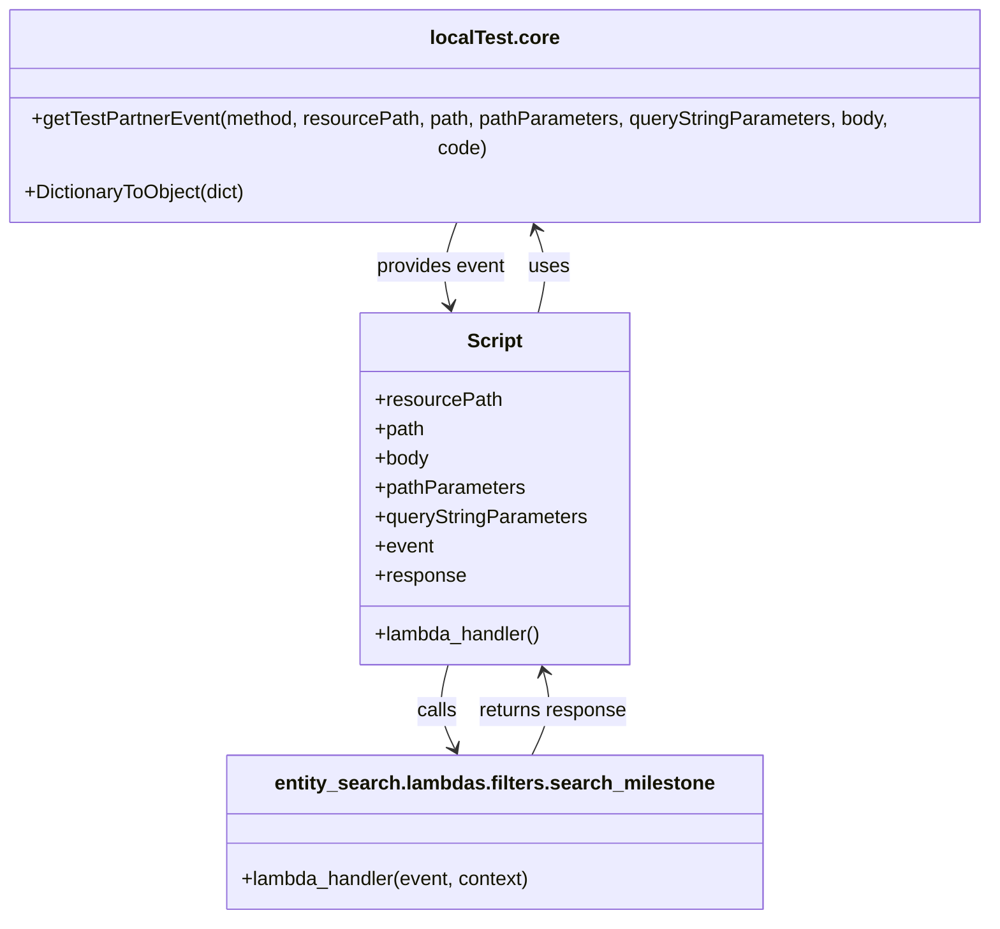

# Diagram: tools/ide_local_testing/localTest/test/entity/statusUpdate/getStatusUpdateViaLambda.py


> Auto-generated by Obscura crawlers

## Diagram 1

```mermaid
flowchart TD
    A[localTest.core.getTestPartnerEvent] --> B[searchMilestone (lambda_handler)]
    B --> C{searchStatusUpdateViaLambda context}
    C --> D[searchMilestone response]
    D --> E[print(response)]
    A -->|POST event payload| B
    subgraph EventPayload
        P1[resourcePath]
        P2[path]
        P3[body]
        P4[pathParameters]
    end
    A --> EventPayload
```

> SVG rendering failed for this diagram.

## Diagram 2



### SVG

<svg id="container" width="838.0078125" xmlns="http://www.w3.org/2000/svg" class="classDiagram" height="728" viewBox="0 0 838.0078125 728" role="graphics-document document" aria-roledescription="class"><style>#container{font-family:"trebuchet ms",verdana,arial,sans-serif;font-size:16px;fill:#333;}@keyframes edge-animation-frame{from{stroke-dashoffset:0;}}@keyframes dash{to{stroke-dashoffset:0;}}#container .edge-animation-slow{stroke-dasharray:9,5!important;stroke-dashoffset:900;animation:dash 50s linear infinite;stroke-linecap:round;}#container .edge-animation-fast{stroke-dasharray:9,5!important;stroke-dashoffset:900;animation:dash 20s linear infinite;stroke-linecap:round;}#container .error-icon{fill:#552222;}#container .error-text{fill:#552222;stroke:#552222;}#container .edge-thickness-normal{stroke-width:1px;}#container .edge-thickness-thick{stroke-width:3.5px;}#container .edge-pattern-solid{stroke-dasharray:0;}#container .edge-thickness-invisible{stroke-width:0;fill:none;}#container .edge-pattern-dashed{stroke-dasharray:3;}#container .edge-pattern-dotted{stroke-dasharray:2;}#container .marker{fill:#333333;stroke:#333333;}#container .marker.cross{stroke:#333333;}#container svg{font-family:"trebuchet ms",verdana,arial,sans-serif;font-size:16px;}#container p{margin:0;}#container g.classGroup text{fill:#9370DB;stroke:none;font-family:"trebuchet ms",verdana,arial,sans-serif;font-size:10px;}#container g.classGroup text .title{font-weight:bolder;}#container .nodeLabel,#container .edgeLabel{color:#131300;}#container .edgeLabel .label rect{fill:#ECECFF;}#container .label text{fill:#131300;}#container .labelBkg{background:#ECECFF;}#container .edgeLabel .label span{background:#ECECFF;}#container .classTitle{font-weight:bolder;}#container .node rect,#container .node circle,#container .node ellipse,#container .node polygon,#container .node path{fill:#ECECFF;stroke:#9370DB;stroke-width:1px;}#container .divider{stroke:#9370DB;stroke-width:1;}#container g.clickable{cursor:pointer;}#container g.classGroup rect{fill:#ECECFF;stroke:#9370DB;}#container g.classGroup line{stroke:#9370DB;stroke-width:1;}#container .classLabel .box{stroke:none;stroke-width:0;fill:#ECECFF;opacity:0.5;}#container .classLabel .label{fill:#9370DB;font-size:10px;}#container .relation{stroke:#333333;stroke-width:1;fill:none;}#container .dashed-line{stroke-dasharray:3;}#container .dotted-line{stroke-dasharray:1 2;}#container #compositionStart,#container .composition{fill:#333333!important;stroke:#333333!important;stroke-width:1;}#container #compositionEnd,#container .composition{fill:#333333!important;stroke:#333333!important;stroke-width:1;}#container #dependencyStart,#container .dependency{fill:#333333!important;stroke:#333333!important;stroke-width:1;}#container #dependencyStart,#container .dependency{fill:#333333!important;stroke:#333333!important;stroke-width:1;}#container #extensionStart,#container .extension{fill:transparent!important;stroke:#333333!important;stroke-width:1;}#container #extensionEnd,#container .extension{fill:transparent!important;stroke:#333333!important;stroke-width:1;}#container #aggregationStart,#container .aggregation{fill:transparent!important;stroke:#333333!important;stroke-width:1;}#container #aggregationEnd,#container .aggregation{fill:transparent!important;stroke:#333333!important;stroke-width:1;}#container #lollipopStart,#container .lollipop{fill:#ECECFF!important;stroke:#333333!important;stroke-width:1;}#container #lollipopEnd,#container .lollipop{fill:#ECECFF!important;stroke:#333333!important;stroke-width:1;}#container .edgeTerminals{font-size:11px;line-height:initial;}#container .classTitleText{text-anchor:middle;font-size:18px;fill:#333;}#container .label-icon{display:inline-block;height:1em;overflow:visible;vertical-align:-0.125em;}#container .node .label-icon path{fill:currentColor;stroke:revert;stroke-width:revert;}#container :root{--mermaid-font-family:"trebuchet ms",verdana,arial,sans-serif;}</style><g><defs><marker id="container_class-aggregationStart" class="marker aggregation class" refX="18" refY="7" markerWidth="190" markerHeight="240" orient="auto"><path d="M 18,7 L9,13 L1,7 L9,1 Z"></path></marker></defs><defs><marker id="container_class-aggregationEnd" class="marker aggregation class" refX="1" refY="7" markerWidth="20" markerHeight="28" orient="auto"><path d="M 18,7 L9,13 L1,7 L9,1 Z"></path></marker></defs><defs><marker id="container_class-extensionStart" class="marker extension class" refX="18" refY="7" markerWidth="190" markerHeight="240" orient="auto"><path d="M 1,7 L18,13 V 1 Z"></path></marker></defs><defs><marker id="container_class-extensionEnd" class="marker extension class" refX="1" refY="7" markerWidth="20" markerHeight="28" orient="auto"><path d="M 1,1 V 13 L18,7 Z"></path></marker></defs><defs><marker id="container_class-compositionStart" class="marker composition class" refX="18" refY="7" markerWidth="190" markerHeight="240" orient="auto"><path d="M 18,7 L9,13 L1,7 L9,1 Z"></path></marker></defs><defs><marker id="container_class-compositionEnd" class="marker composition class" refX="1" refY="7" markerWidth="20" markerHeight="28" orient="auto"><path d="M 18,7 L9,13 L1,7 L9,1 Z"></path></marker></defs><defs><marker id="container_class-dependencyStart" class="marker dependency class" refX="6" refY="7" markerWidth="190" markerHeight="240" orient="auto"><path d="M 5,7 L9,13 L1,7 L9,1 Z"></path></marker></defs><defs><marker id="container_class-dependencyEnd" class="marker dependency class" refX="13" refY="7" markerWidth="20" markerHeight="28" orient="auto"><path d="M 18,7 L9,13 L14,7 L9,1 Z"></path></marker></defs><defs><marker id="container_class-lollipopStart" class="marker lollipop class" refX="13" refY="7" markerWidth="190" markerHeight="240" orient="auto"><circle stroke="black" fill="transparent" cx="7" cy="7" r="6"></circle></marker></defs><defs><marker id="container_class-lollipopEnd" class="marker lollipop class" refX="1" refY="7" markerWidth="190" markerHeight="240" orient="auto"><circle stroke="black" fill="transparent" cx="7" cy="7" r="6"></circle></marker></defs><g class="root"><g class="clusters"></g><g class="edgePaths"><path d="M454.842,232L456.377,225.833C457.912,219.667,460.981,207.333,460.409,195.928C459.837,184.522,455.622,174.044,453.515,168.806L451.408,163.567" id="id_Script_localTest.core_1" class="edge-thickness-normal edge-pattern-solid relation" style=";;;" data-edge="true" data-et="edge" data-id="id_Script_localTest.core_1" data-points="W3sieCI6NDU0Ljg0MjMwNDA0MDA1NTI0LCJ5IjoyMzJ9LHsieCI6NDY0LjA1MDc4MTI1LCJ5IjoxOTV9LHsieCI6NDQ5LjE2OTIyNDMzMDM1NzE3LCJ5IjoxNTh9XQ==" marker-end="url(#container_class-dependencyEnd)"></path><path d="M380.027,520L378.358,526.167C376.688,532.333,373.35,544.667,374.262,556.102C375.174,567.537,380.337,578.075,382.918,583.343L385.499,588.612" id="id_Script_entity_search.lambdas.filters.search_milestone_2" class="edge-thickness-normal edge-pattern-solid relation" style=";;;" data-edge="true" data-et="edge" data-id="id_Script_entity_search.lambdas.filters.search_milestone_2" data-points="W3sieCI6MzgwLjAyNjY5NjMwNTI0ODYsInkiOjUyMH0seyJ4IjozNzAuMDExNzE4NzUsInkiOjU1N30seyJ4IjozODguMTM4ODI4MTI1LCJ5Ijo1OTR9XQ==" marker-end="url(#container_class-dependencyEnd)"></path><path d="M388.839,158L386.358,164.167C383.878,170.333,378.918,182.667,377.731,194.03C376.544,205.393,379.13,215.785,380.423,220.981L381.716,226.178" id="id_localTest.core_Script_3" class="edge-thickness-normal edge-pattern-solid relation" style=";;;" data-edge="true" data-et="edge" data-id="id_localTest.core_Script_3" data-points="W3sieCI6Mzg4LjgzODU4ODE2OTY0MjgzLCJ5IjoxNTh9LHsieCI6MzczLjk1NzAzMTI1LCJ5IjoxOTV9LHsieCI6MzgzLjE2NTUwODQ1OTk0NDc2LCJ5IjoyMzJ9XQ==" marker-end="url(#container_class-dependencyEnd)"></path><path d="M449.869,594L452.89,587.833C455.911,581.667,461.954,569.333,463.567,557.965C465.18,546.597,462.365,536.194,460.957,530.993L459.549,525.792" id="id_entity_search.lambdas.filters.search_milestone_Script_4" class="edge-thickness-normal edge-pattern-solid relation" style=";;;" data-edge="true" data-et="edge" data-id="id_entity_search.lambdas.filters.search_milestone_Script_4" data-points="W3sieCI6NDQ5Ljg2ODk4NDM3NSwieSI6NTk0fSx7IngiOjQ2Ny45OTYwOTM3NSwieSI6NTU3fSx7IngiOjQ1Ny45ODExMTYxOTQ3NTE0LCJ5Ijo1MjB9XQ==" marker-end="url(#container_class-dependencyEnd)"></path></g><g class="edgeLabels"><g class="edgeLabel" transform="translate(463.72392, 194.18732)"><g class="label" data-id="id_Script_localTest.core_1" transform="translate(-16.4921875, -12)"><foreignObject width="32.984375" height="24"><div xmlns="http://www.w3.org/1999/xhtml" class="labelBkg" style="display: table-cell; white-space: nowrap; line-height: 1.5; max-width: 200px; text-align: center;"><span class="edgeLabel"><p>uses</p></span></div></foreignObject></g></g><g class="edgeLabel" transform="translate(370.64315, 558.28884)"><g class="label" data-id="id_Script_entity_search.lambdas.filters.search_milestone_2" transform="translate(-16.4453125, -12)"><foreignObject width="32.890625" height="24"><div xmlns="http://www.w3.org/1999/xhtml" class="labelBkg" style="display: table-cell; white-space: nowrap; line-height: 1.5; max-width: 200px; text-align: center;"><span class="edgeLabel"><p>calls</p></span></div></foreignObject></g></g><g class="edgeLabel" transform="translate(374.2839, 194.18732)"><g class="label" data-id="id_localTest.core_Script_3" transform="translate(-53.6015625, -12)"><foreignObject width="107.203125" height="24"><div xmlns="http://www.w3.org/1999/xhtml" class="labelBkg" style="display: table-cell; white-space: nowrap; line-height: 1.5; max-width: 200px; text-align: center;"><span class="edgeLabel"><p>provides event</p></span></div></foreignObject></g></g><g class="edgeLabel" transform="translate(467.36467, 558.28884)"><g class="label" data-id="id_entity_search.lambdas.filters.search_milestone_Script_4" transform="translate(-61.5390625, -12)"><foreignObject width="123.078125" height="24"><div xmlns="http://www.w3.org/1999/xhtml" class="labelBkg" style="display: table-cell; white-space: nowrap; line-height: 1.5; max-width: 200px; text-align: center;"><span class="edgeLabel"><p>returns response</p></span></div></foreignObject></g></g></g><g class="nodes"><g class="node default" id="classId-localTest.core-0" transform="translate(419.00390625, 83)"><g class="basic label-container"><path d="M-411.00390625 -75 L411.00390625 -75 L411.00390625 75 L-411.00390625 75" stroke="none" stroke-width="0" fill="#ECECFF" style=""></path><path d="M-411.00390625 -75 C-111.09899460998571 -75, 188.80591703002858 -75, 411.00390625 -75 M-411.00390625 -75 C-170.41714094360793 -75, 70.16962436278413 -75, 411.00390625 -75 M411.00390625 -75 C411.00390625 -25.893897676804023, 411.00390625 23.212204646391953, 411.00390625 75 M411.00390625 -75 C411.00390625 -31.957218694671354, 411.00390625 11.085562610657291, 411.00390625 75 M411.00390625 75 C179.61994505649736 75, -51.764016137005285 75, -411.00390625 75 M411.00390625 75 C136.23825297478936 75, -138.52740030042128 75, -411.00390625 75 M-411.00390625 75 C-411.00390625 24.36745667625707, -411.00390625 -26.26508664748586, -411.00390625 -75 M-411.00390625 75 C-411.00390625 25.130978233544432, -411.00390625 -24.738043532911135, -411.00390625 -75" stroke="#9370DB" stroke-width="1.3" fill="none" stroke-dasharray="0 0" style=""></path></g><g class="annotation-group text" transform="translate(0, -51)"></g><g class="label-group text" transform="translate(-50.3203125, -51)"><g class="label" style="font-weight: bolder" transform="translate(0,-12)"><foreignObject width="100.640625" height="24"><div xmlns="http://www.w3.org/1999/xhtml" style="display: table-cell; white-space: nowrap; line-height: 1.5; max-width: 149px; text-align: center;"><span class="nodeLabel markdown-node-label" style=""><p>localTest.core</p></span></div></foreignObject></g></g><g class="members-group text" transform="translate(-399.00390625, -3)"></g><g class="methods-group text" transform="translate(-399.00390625, 27)"><g class="label" style="" transform="translate(0,-12)"><foreignObject width="747.6875" height="24"><div xmlns="http://www.w3.org/1999/xhtml" style="display: table-cell; white-space: nowrap; line-height: 1.5; max-width: 805px; text-align: center;"><span class="nodeLabel markdown-node-label" style=""><p>+getTestPartnerEvent(method, resourcePath, path, pathParameters, queryStringParameters, body, code)</p></span></div></foreignObject></g><g class="label" style="" transform="translate(0,12)"><foreignObject width="184.03125" height="24"><div xmlns="http://www.w3.org/1999/xhtml" style="display: table-cell; white-space: nowrap; line-height: 1.5; max-width: 241px; text-align: center;"><span class="nodeLabel markdown-node-label" style=""><p>+DictionaryToObject(dict)</p></span></div></foreignObject></g></g><g class="divider" style=""><path d="M-411.00390625 -27 C-126.11246071237309 -27, 158.77898482525381 -27, 411.00390625 -27 M-411.00390625 -27 C-203.99831030597812 -27, 3.0072856380437543 -27, 411.00390625 -27" stroke="#9370DB" stroke-width="1.3" fill="none" stroke-dasharray="0 0" style=""></path></g><g class="divider" style=""><path d="M-411.00390625 -3 C-190.3753255240836 -3, 30.253255201832815 -3, 411.00390625 -3 M-411.00390625 -3 C-171.1779736067555 -3, 68.647959036489 -3, 411.00390625 -3" stroke="#9370DB" stroke-width="1.3" fill="none" stroke-dasharray="0 0" style=""></path></g></g><g class="node default" id="classId-entity_search.lambdas.filters.search_milestone-1" transform="translate(419.00390625, 657)"><g class="basic label-container"><path d="M-218.265625 -63 L218.265625 -63 L218.265625 63 L-218.265625 63" stroke="none" stroke-width="0" fill="#ECECFF" style=""></path><path d="M-218.265625 -63 C-64.46394947506957 -63, 89.33772604986086 -63, 218.265625 -63 M-218.265625 -63 C-90.8542332570355 -63, 36.557158485928994 -63, 218.265625 -63 M218.265625 -63 C218.265625 -30.466628013322513, 218.265625 2.066743973354974, 218.265625 63 M218.265625 -63 C218.265625 -19.788923365436034, 218.265625 23.422153269127932, 218.265625 63 M218.265625 63 C56.44631134466573 63, -105.37300231066854 63, -218.265625 63 M218.265625 63 C99.78760470682153 63, -18.69041558635695 63, -218.265625 63 M-218.265625 63 C-218.265625 28.672287143877234, -218.265625 -5.655425712245531, -218.265625 -63 M-218.265625 63 C-218.265625 28.573001838222197, -218.265625 -5.853996323555606, -218.265625 -63" stroke="#9370DB" stroke-width="1.3" fill="none" stroke-dasharray="0 0" style=""></path></g><g class="annotation-group text" transform="translate(0, -39)"></g><g class="label-group text" transform="translate(-172.34375, -39)"><g class="label" style="font-weight: bolder" transform="translate(0,-12)"><foreignObject width="344.6875" height="24"><div xmlns="http://www.w3.org/1999/xhtml" style="display: table-cell; white-space: nowrap; line-height: 1.5; max-width: 390px; text-align: center;"><span class="nodeLabel markdown-node-label" style=""><p>entity_search.lambdas.filters.search_milestone</p></span></div></foreignObject></g></g><g class="members-group text" transform="translate(-206.265625, 9)"></g><g class="methods-group text" transform="translate(-206.265625, 39)"><g class="label" style="" transform="translate(0,-12)"><foreignObject width="240.1875" height="24"><div xmlns="http://www.w3.org/1999/xhtml" style="display: table-cell; white-space: nowrap; line-height: 1.5; max-width: 298px; text-align: center;"><span class="nodeLabel markdown-node-label" style=""><p>+lambda_handler(event, context)</p></span></div></foreignObject></g></g><g class="divider" style=""><path d="M-218.265625 -15 C-117.0899536880408 -15, -15.914282376081587 -15, 218.265625 -15 M-218.265625 -15 C-112.38666826415837 -15, -6.507711528316747 -15, 218.265625 -15" stroke="#9370DB" stroke-width="1.3" fill="none" stroke-dasharray="0 0" style=""></path></g><g class="divider" style=""><path d="M-218.265625 9 C-45.358074913137074 9, 127.54947517372585 9, 218.265625 9 M-218.265625 9 C-82.53551858576736 9, 53.194587828465274 9, 218.265625 9" stroke="#9370DB" stroke-width="1.3" fill="none" stroke-dasharray="0 0" style=""></path></g></g><g class="node default" id="classId-Script-2" transform="translate(419.00390625, 376)"><g class="basic label-container"><path d="M-109.90234375 -144 L109.90234375 -144 L109.90234375 144 L-109.90234375 144" stroke="none" stroke-width="0" fill="#ECECFF" style=""></path><path d="M-109.90234375 -144 C-59.02531853871709 -144, -8.148293327434175 -144, 109.90234375 -144 M-109.90234375 -144 C-54.98298775588562 -144, -0.06363176177123364 -144, 109.90234375 -144 M109.90234375 -144 C109.90234375 -56.85287347464667, 109.90234375 30.294253050706658, 109.90234375 144 M109.90234375 -144 C109.90234375 -72.467644029559, 109.90234375 -0.935288059117994, 109.90234375 144 M109.90234375 144 C41.57552955359294 144, -26.751284642814113 144, -109.90234375 144 M109.90234375 144 C23.439782551116153 144, -63.022778647767694 144, -109.90234375 144 M-109.90234375 144 C-109.90234375 83.25444772023657, -109.90234375 22.50889544047314, -109.90234375 -144 M-109.90234375 144 C-109.90234375 79.08031105937432, -109.90234375 14.160622118748648, -109.90234375 -144" stroke="#9370DB" stroke-width="1.3" fill="none" stroke-dasharray="0 0" style=""></path></g><g class="annotation-group text" transform="translate(0, -120)"></g><g class="label-group text" transform="translate(-21.7421875, -120)"><g class="label" style="font-weight: bolder" transform="translate(0,-12)"><foreignObject width="43.484375" height="24"><div xmlns="http://www.w3.org/1999/xhtml" style="display: table-cell; white-space: nowrap; line-height: 1.5; max-width: 93px; text-align: center;"><span class="nodeLabel markdown-node-label" style=""><p>Script</p></span></div></foreignObject></g></g><g class="members-group text" transform="translate(-97.90234375, -72)"><g class="label" style="" transform="translate(0,-12)"><foreignObject width="102.546875" height="24"><div xmlns="http://www.w3.org/1999/xhtml" style="display: table-cell; white-space: nowrap; line-height: 1.5; max-width: 160px; text-align: center;"><span class="nodeLabel markdown-node-label" style=""><p>+resourcePath</p></span></div></foreignObject></g><g class="label" style="" transform="translate(0,12)"><foreignObject width="41.1875" height="24"><div xmlns="http://www.w3.org/1999/xhtml" style="display: table-cell; white-space: nowrap; line-height: 1.5; max-width: 99px; text-align: center;"><span class="nodeLabel markdown-node-label" style=""><p>+path</p></span></div></foreignObject></g><g class="label" style="" transform="translate(0,36)"><foreignObject width="44.28125" height="24"><div xmlns="http://www.w3.org/1999/xhtml" style="display: table-cell; white-space: nowrap; line-height: 1.5; max-width: 102px; text-align: center;"><span class="nodeLabel markdown-node-label" style=""><p>+body</p></span></div></foreignObject></g><g class="label" style="" transform="translate(0,60)"><foreignObject width="122.734375" height="24"><div xmlns="http://www.w3.org/1999/xhtml" style="display: table-cell; white-space: nowrap; line-height: 1.5; max-width: 180px; text-align: center;"><span class="nodeLabel markdown-node-label" style=""><p>+pathParameters</p></span></div></foreignObject></g><g class="label" style="" transform="translate(0,84)"><foreignObject width="174.0625" height="24"><div xmlns="http://www.w3.org/1999/xhtml" style="display: table-cell; white-space: nowrap; line-height: 1.5; max-width: 231px; text-align: center;"><span class="nodeLabel markdown-node-label" style=""><p>+queryStringParameters</p></span></div></foreignObject></g><g class="label" style="" transform="translate(0,108)"><foreignObject width="48.328125" height="24"><div xmlns="http://www.w3.org/1999/xhtml" style="display: table-cell; white-space: nowrap; line-height: 1.5; max-width: 106px; text-align: center;"><span class="nodeLabel markdown-node-label" style=""><p>+event</p></span></div></foreignObject></g><g class="label" style="" transform="translate(0,132)"><foreignObject width="74.296875" height="24"><div xmlns="http://www.w3.org/1999/xhtml" style="display: table-cell; white-space: nowrap; line-height: 1.5; max-width: 132px; text-align: center;"><span class="nodeLabel markdown-node-label" style=""><p>+response</p></span></div></foreignObject></g></g><g class="methods-group text" transform="translate(-97.90234375, 120)"><g class="label" style="" transform="translate(0,-12)"><foreignObject width="138.015625" height="24"><div xmlns="http://www.w3.org/1999/xhtml" style="display: table-cell; white-space: nowrap; line-height: 1.5; max-width: 195px; text-align: center;"><span class="nodeLabel markdown-node-label" style=""><p>+lambda_handler()</p></span></div></foreignObject></g></g><g class="divider" style=""><path d="M-109.90234375 -96 C-42.94097290757607 -96, 24.020397934847864 -96, 109.90234375 -96 M-109.90234375 -96 C-43.82589372947035 -96, 22.250556291059297 -96, 109.90234375 -96" stroke="#9370DB" stroke-width="1.3" fill="none" stroke-dasharray="0 0" style=""></path></g><g class="divider" style=""><path d="M-109.90234375 96 C-48.0025295876298 96, 13.897284574740397 96, 109.90234375 96 M-109.90234375 96 C-55.75246393454284 96, -1.6025841190856767 96, 109.90234375 96" stroke="#9370DB" stroke-width="1.3" fill="none" stroke-dasharray="0 0" style=""></path></g></g></g></g></g></svg>
