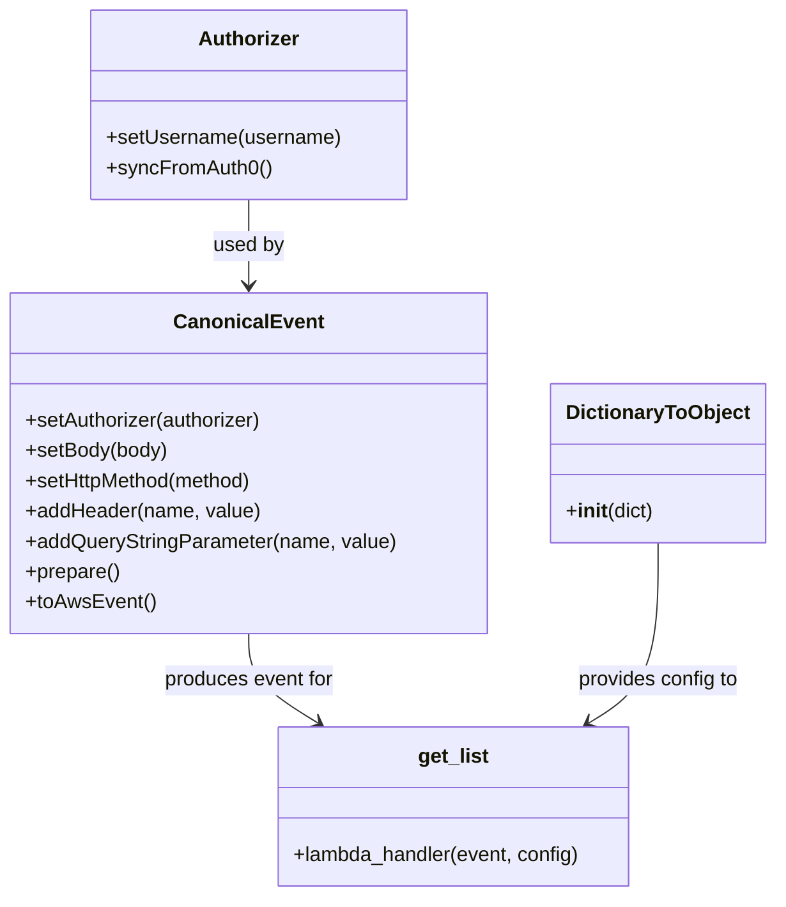

# Diagram: tools/ide_local_testing/localTest/test/entitySearch/getListViaLambda.py


> Auto-generated by Obscura crawlers

## Diagram 1



### SVG

<svg id="container" width="603.7109375" xmlns="http://www.w3.org/2000/svg" class="classDiagram" height="710" viewBox="0 0 603.7109375 710" role="graphics-document document" aria-roledescription="class"><style>#container{font-family:"trebuchet ms",verdana,arial,sans-serif;font-size:16px;fill:#333;}@keyframes edge-animation-frame{from{stroke-dashoffset:0;}}@keyframes dash{to{stroke-dashoffset:0;}}#container .edge-animation-slow{stroke-dasharray:9,5!important;stroke-dashoffset:900;animation:dash 50s linear infinite;stroke-linecap:round;}#container .edge-animation-fast{stroke-dasharray:9,5!important;stroke-dashoffset:900;animation:dash 20s linear infinite;stroke-linecap:round;}#container .error-icon{fill:#552222;}#container .error-text{fill:#552222;stroke:#552222;}#container .edge-thickness-normal{stroke-width:1px;}#container .edge-thickness-thick{stroke-width:3.5px;}#container .edge-pattern-solid{stroke-dasharray:0;}#container .edge-thickness-invisible{stroke-width:0;fill:none;}#container .edge-pattern-dashed{stroke-dasharray:3;}#container .edge-pattern-dotted{stroke-dasharray:2;}#container .marker{fill:#333333;stroke:#333333;}#container .marker.cross{stroke:#333333;}#container svg{font-family:"trebuchet ms",verdana,arial,sans-serif;font-size:16px;}#container p{margin:0;}#container g.classGroup text{fill:#9370DB;stroke:none;font-family:"trebuchet ms",verdana,arial,sans-serif;font-size:10px;}#container g.classGroup text .title{font-weight:bolder;}#container .nodeLabel,#container .edgeLabel{color:#131300;}#container .edgeLabel .label rect{fill:#ECECFF;}#container .label text{fill:#131300;}#container .labelBkg{background:#ECECFF;}#container .edgeLabel .label span{background:#ECECFF;}#container .classTitle{font-weight:bolder;}#container .node rect,#container .node circle,#container .node ellipse,#container .node polygon,#container .node path{fill:#ECECFF;stroke:#9370DB;stroke-width:1px;}#container .divider{stroke:#9370DB;stroke-width:1;}#container g.clickable{cursor:pointer;}#container g.classGroup rect{fill:#ECECFF;stroke:#9370DB;}#container g.classGroup line{stroke:#9370DB;stroke-width:1;}#container .classLabel .box{stroke:none;stroke-width:0;fill:#ECECFF;opacity:0.5;}#container .classLabel .label{fill:#9370DB;font-size:10px;}#container .relation{stroke:#333333;stroke-width:1;fill:none;}#container .dashed-line{stroke-dasharray:3;}#container .dotted-line{stroke-dasharray:1 2;}#container #compositionStart,#container .composition{fill:#333333!important;stroke:#333333!important;stroke-width:1;}#container #compositionEnd,#container .composition{fill:#333333!important;stroke:#333333!important;stroke-width:1;}#container #dependencyStart,#container .dependency{fill:#333333!important;stroke:#333333!important;stroke-width:1;}#container #dependencyStart,#container .dependency{fill:#333333!important;stroke:#333333!important;stroke-width:1;}#container #extensionStart,#container .extension{fill:transparent!important;stroke:#333333!important;stroke-width:1;}#container #extensionEnd,#container .extension{fill:transparent!important;stroke:#333333!important;stroke-width:1;}#container #aggregationStart,#container .aggregation{fill:transparent!important;stroke:#333333!important;stroke-width:1;}#container #aggregationEnd,#container .aggregation{fill:transparent!important;stroke:#333333!important;stroke-width:1;}#container #lollipopStart,#container .lollipop{fill:#ECECFF!important;stroke:#333333!important;stroke-width:1;}#container #lollipopEnd,#container .lollipop{fill:#ECECFF!important;stroke:#333333!important;stroke-width:1;}#container .edgeTerminals{font-size:11px;line-height:initial;}#container .classTitleText{text-anchor:middle;font-size:18px;fill:#333;}#container .label-icon{display:inline-block;height:1em;overflow:visible;vertical-align:-0.125em;}#container .node .label-icon path{fill:currentColor;stroke:revert;stroke-width:revert;}#container :root{--mermaid-font-family:"trebuchet ms",verdana,arial,sans-serif;}</style><g><defs><marker id="container_class-aggregationStart" class="marker aggregation class" refX="18" refY="7" markerWidth="190" markerHeight="240" orient="auto"><path d="M 18,7 L9,13 L1,7 L9,1 Z"></path></marker></defs><defs><marker id="container_class-aggregationEnd" class="marker aggregation class" refX="1" refY="7" markerWidth="20" markerHeight="28" orient="auto"><path d="M 18,7 L9,13 L1,7 L9,1 Z"></path></marker></defs><defs><marker id="container_class-extensionStart" class="marker extension class" refX="18" refY="7" markerWidth="190" markerHeight="240" orient="auto"><path d="M 1,7 L18,13 V 1 Z"></path></marker></defs><defs><marker id="container_class-extensionEnd" class="marker extension class" refX="1" refY="7" markerWidth="20" markerHeight="28" orient="auto"><path d="M 1,1 V 13 L18,7 Z"></path></marker></defs><defs><marker id="container_class-compositionStart" class="marker composition class" refX="18" refY="7" markerWidth="190" markerHeight="240" orient="auto"><path d="M 18,7 L9,13 L1,7 L9,1 Z"></path></marker></defs><defs><marker id="container_class-compositionEnd" class="marker composition class" refX="1" refY="7" markerWidth="20" markerHeight="28" orient="auto"><path d="M 18,7 L9,13 L1,7 L9,1 Z"></path></marker></defs><defs><marker id="container_class-dependencyStart" class="marker dependency class" refX="6" refY="7" markerWidth="190" markerHeight="240" orient="auto"><path d="M 5,7 L9,13 L1,7 L9,1 Z"></path></marker></defs><defs><marker id="container_class-dependencyEnd" class="marker dependency class" refX="13" refY="7" markerWidth="20" markerHeight="28" orient="auto"><path d="M 18,7 L9,13 L14,7 L9,1 Z"></path></marker></defs><defs><marker id="container_class-lollipopStart" class="marker lollipop class" refX="13" refY="7" markerWidth="190" markerHeight="240" orient="auto"><circle stroke="black" fill="transparent" cx="7" cy="7" r="6"></circle></marker></defs><defs><marker id="container_class-lollipopEnd" class="marker lollipop class" refX="1" refY="7" markerWidth="190" markerHeight="240" orient="auto"><circle stroke="black" fill="transparent" cx="7" cy="7" r="6"></circle></marker></defs><g class="root"><g class="clusters"></g><g class="edgePaths"><path d="M194.652,158L194.652,164.167C194.652,170.333,194.652,182.667,194.652,194C194.652,205.333,194.652,215.667,194.652,220.833L194.652,226" id="id_Authorizer_CanonicalEvent_1" class="edge-thickness-normal edge-pattern-solid relation" style=";;;" data-edge="true" data-et="edge" data-id="id_Authorizer_CanonicalEvent_1" data-points="W3sieCI6MTk0LjY1MjM0Mzc1LCJ5IjoxNTh9LHsieCI6MTk0LjY1MjM0Mzc1LCJ5IjoxOTV9LHsieCI6MTk0LjY1MjM0Mzc1LCJ5IjoyMzJ9XQ==" marker-end="url(#container_class-dependencyEnd)"></path><path d="M194.652,502L194.652,508.167C194.652,514.333,194.652,526.667,203.637,538.469C212.621,550.271,230.589,561.541,239.574,567.177L248.558,572.812" id="id_CanonicalEvent_get_list_2" class="edge-thickness-normal edge-pattern-solid relation" style=";;;" data-edge="true" data-et="edge" data-id="id_CanonicalEvent_get_list_2" data-points="W3sieCI6MTk0LjY1MjM0Mzc1LCJ5Ijo1MDJ9LHsieCI6MTk0LjY1MjM0Mzc1LCJ5Ijo1Mzl9LHsieCI6MjUzLjY0MDYwNTQ2ODc0OTk4LCJ5Ijo1NzZ9XQ==" marker-end="url(#container_class-dependencyEnd)"></path><path d="M513.508,430L513.508,448.167C513.508,466.333,513.508,502.667,504.524,526.469C495.539,550.271,477.571,561.541,468.587,567.177L459.602,572.812" id="id_DictionaryToObject_get_list_3" class="edge-thickness-normal edge-pattern-solid relation" style=";;;" data-edge="true" data-et="edge" data-id="id_DictionaryToObject_get_list_3" data-points="W3sieCI6NTEzLjUwNzgxMjUsInkiOjQzMH0seyJ4Ijo1MTMuNTA3ODEyNSwieSI6NTM5fSx7IngiOjQ1NC41MTk1NTA3ODEyNSwieSI6NTc2fV0=" marker-end="url(#container_class-dependencyEnd)"></path></g><g class="edgeLabels"><g class="edgeLabel" transform="translate(194.65234375, 195)"><g class="label" data-id="id_Authorizer_CanonicalEvent_1" transform="translate(-28.3125, -12)"><foreignObject width="56.625" height="24"><div xmlns="http://www.w3.org/1999/xhtml" class="labelBkg" style="display: table-cell; white-space: nowrap; line-height: 1.5; max-width: 200px; text-align: center;"><span class="edgeLabel"><p>used by</p></span></div></foreignObject></g></g><g class="edgeLabel" transform="translate(194.65234375, 539)"><g class="label" data-id="id_CanonicalEvent_get_list_2" transform="translate(-68.2421875, -12)"><foreignObject width="136.484375" height="24"><div xmlns="http://www.w3.org/1999/xhtml" class="labelBkg" style="display: table-cell; white-space: nowrap; line-height: 1.5; max-width: 200px; text-align: center;"><span class="edgeLabel"><p>produces event for</p></span></div></foreignObject></g></g><g class="edgeLabel" transform="translate(513.5078125, 539)"><g class="label" data-id="id_DictionaryToObject_get_list_3" transform="translate(-64.78125, -12)"><foreignObject width="129.5625" height="24"><div xmlns="http://www.w3.org/1999/xhtml" class="labelBkg" style="display: table-cell; white-space: nowrap; line-height: 1.5; max-width: 200px; text-align: center;"><span class="edgeLabel"><p>provides config to</p></span></div></foreignObject></g></g></g><g class="nodes"><g class="node default" id="classId-Authorizer-0" transform="translate(194.65234375, 83)"><g class="basic label-container"><path d="M-124.13671875 -75 L124.13671875 -75 L124.13671875 75 L-124.13671875 75" stroke="none" stroke-width="0" fill="#ECECFF" style=""></path><path d="M-124.13671875 -75 C-68.42181313148164 -75, -12.706907512963284 -75, 124.13671875 -75 M-124.13671875 -75 C-48.52399934545109 -75, 27.088720059097824 -75, 124.13671875 -75 M124.13671875 -75 C124.13671875 -41.377684259875544, 124.13671875 -7.755368519751087, 124.13671875 75 M124.13671875 -75 C124.13671875 -35.20707023161012, 124.13671875 4.585859536779765, 124.13671875 75 M124.13671875 75 C31.54027492302272 75, -61.05616890395456 75, -124.13671875 75 M124.13671875 75 C41.92051582765933 75, -40.29568709468134 75, -124.13671875 75 M-124.13671875 75 C-124.13671875 16.1802445139607, -124.13671875 -42.6395109720786, -124.13671875 -75 M-124.13671875 75 C-124.13671875 18.572559989201828, -124.13671875 -37.854880021596344, -124.13671875 -75" stroke="#9370DB" stroke-width="1.3" fill="none" stroke-dasharray="0 0" style=""></path></g><g class="annotation-group text" transform="translate(0, -51)"></g><g class="label-group text" transform="translate(-38.3671875, -51)"><g class="label" style="font-weight: bolder" transform="translate(0,-12)"><foreignObject width="76.734375" height="24"><div xmlns="http://www.w3.org/1999/xhtml" style="display: table-cell; white-space: nowrap; line-height: 1.5; max-width: 126px; text-align: center;"><span class="nodeLabel markdown-node-label" style=""><p>Authorizer</p></span></div></foreignObject></g></g><g class="members-group text" transform="translate(-112.13671875, -3)"></g><g class="methods-group text" transform="translate(-112.13671875, 27)"><g class="label" style="" transform="translate(0,-12)"><foreignObject width="185.90625" height="24"><div xmlns="http://www.w3.org/1999/xhtml" style="display: table-cell; white-space: nowrap; line-height: 1.5; max-width: 243px; text-align: center;"><span class="nodeLabel markdown-node-label" style=""><p>+setUsername(username)</p></span></div></foreignObject></g><g class="label" style="" transform="translate(0,12)"><foreignObject width="129.0625" height="24"><div xmlns="http://www.w3.org/1999/xhtml" style="display: table-cell; white-space: nowrap; line-height: 1.5; max-width: 186px; text-align: center;"><span class="nodeLabel markdown-node-label" style=""><p>+syncFromAuth0()</p></span></div></foreignObject></g></g><g class="divider" style=""><path d="M-124.13671875 -27 C-36.3794328876686 -27, 51.3778529746628 -27, 124.13671875 -27 M-124.13671875 -27 C-44.90625610369152 -27, 34.32420654261696 -27, 124.13671875 -27" stroke="#9370DB" stroke-width="1.3" fill="none" stroke-dasharray="0 0" style=""></path></g><g class="divider" style=""><path d="M-124.13671875 -3 C-55.19164715411458 -3, 13.753424441770846 -3, 124.13671875 -3 M-124.13671875 -3 C-25.345186822918365 -3, 73.44634510416327 -3, 124.13671875 -3" stroke="#9370DB" stroke-width="1.3" fill="none" stroke-dasharray="0 0" style=""></path></g></g><g class="node default" id="classId-CanonicalEvent-1" transform="translate(194.65234375, 367)"><g class="basic label-container"><path d="M-186.65234375 -135 L186.65234375 -135 L186.65234375 135 L-186.65234375 135" stroke="none" stroke-width="0" fill="#ECECFF" style=""></path><path d="M-186.65234375 -135 C-38.022507049634584 -135, 110.60732965073083 -135, 186.65234375 -135 M-186.65234375 -135 C-59.398240396479196 -135, 67.85586295704161 -135, 186.65234375 -135 M186.65234375 -135 C186.65234375 -80.15317608586042, 186.65234375 -25.306352171720846, 186.65234375 135 M186.65234375 -135 C186.65234375 -80.42982672294639, 186.65234375 -25.85965344589279, 186.65234375 135 M186.65234375 135 C45.96132882594608 135, -94.72968609810783 135, -186.65234375 135 M186.65234375 135 C55.4801716328644 135, -75.6920004842712 135, -186.65234375 135 M-186.65234375 135 C-186.65234375 54.117710450542035, -186.65234375 -26.76457909891593, -186.65234375 -135 M-186.65234375 135 C-186.65234375 73.37989660523553, -186.65234375 11.75979321047106, -186.65234375 -135" stroke="#9370DB" stroke-width="1.3" fill="none" stroke-dasharray="0 0" style=""></path></g><g class="annotation-group text" transform="translate(0, -111)"></g><g class="label-group text" transform="translate(-55.7109375, -111)"><g class="label" style="font-weight: bolder" transform="translate(0,-12)"><foreignObject width="111.421875" height="24"><div xmlns="http://www.w3.org/1999/xhtml" style="display: table-cell; white-space: nowrap; line-height: 1.5; max-width: 161px; text-align: center;"><span class="nodeLabel markdown-node-label" style=""><p>CanonicalEvent</p></span></div></foreignObject></g></g><g class="members-group text" transform="translate(-174.65234375, -63)"></g><g class="methods-group text" transform="translate(-174.65234375, -33)"><g class="label" style="" transform="translate(0,-12)"><foreignObject width="190.75" height="24"><div xmlns="http://www.w3.org/1999/xhtml" style="display: table-cell; white-space: nowrap; line-height: 1.5; max-width: 248px; text-align: center;"><span class="nodeLabel markdown-node-label" style=""><p>+setAuthorizer(authorizer)</p></span></div></foreignObject></g><g class="label" style="" transform="translate(0,12)"><foreignObject width="113.125" height="24"><div xmlns="http://www.w3.org/1999/xhtml" style="display: table-cell; white-space: nowrap; line-height: 1.5; max-width: 170px; text-align: center;"><span class="nodeLabel markdown-node-label" style=""><p>+setBody(body)</p></span></div></foreignObject></g><g class="label" style="" transform="translate(0,36)"><foreignObject width="184" height="24"><div xmlns="http://www.w3.org/1999/xhtml" style="display: table-cell; white-space: nowrap; line-height: 1.5; max-width: 241px; text-align: center;"><span class="nodeLabel markdown-node-label" style=""><p>+setHttpMethod(method)</p></span></div></foreignObject></g><g class="label" style="" transform="translate(0,60)"><foreignObject width="185.875" height="24"><div xmlns="http://www.w3.org/1999/xhtml" style="display: table-cell; white-space: nowrap; line-height: 1.5; max-width: 243px; text-align: center;"><span class="nodeLabel markdown-node-label" style=""><p>+addHeader(name, value)</p></span></div></foreignObject></g><g class="label" style="" transform="translate(0,84)"><foreignObject width="293.59375" height="24"><div xmlns="http://www.w3.org/1999/xhtml" style="display: table-cell; white-space: nowrap; line-height: 1.5; max-width: 351px; text-align: center;"><span class="nodeLabel markdown-node-label" style=""><p>+addQueryStringParameter(name, value)</p></span></div></foreignObject></g><g class="label" style="" transform="translate(0,108)"><foreignObject width="74.75" height="24"><div xmlns="http://www.w3.org/1999/xhtml" style="display: table-cell; white-space: nowrap; line-height: 1.5; max-width: 132px; text-align: center;"><span class="nodeLabel markdown-node-label" style=""><p>+prepare()</p></span></div></foreignObject></g><g class="label" style="" transform="translate(0,132)"><foreignObject width="101.1875" height="24"><div xmlns="http://www.w3.org/1999/xhtml" style="display: table-cell; white-space: nowrap; line-height: 1.5; max-width: 159px; text-align: center;"><span class="nodeLabel markdown-node-label" style=""><p>+toAwsEvent()</p></span></div></foreignObject></g></g><g class="divider" style=""><path d="M-186.65234375 -87 C-63.781797302237905 -87, 59.08874914552419 -87, 186.65234375 -87 M-186.65234375 -87 C-98.63010325559767 -87, -10.60786276119535 -87, 186.65234375 -87" stroke="#9370DB" stroke-width="1.3" fill="none" stroke-dasharray="0 0" style=""></path></g><g class="divider" style=""><path d="M-186.65234375 -63 C-45.478909093586935 -63, 95.69452556282613 -63, 186.65234375 -63 M-186.65234375 -63 C-101.74668856877906 -63, -16.841033387558127 -63, 186.65234375 -63" stroke="#9370DB" stroke-width="1.3" fill="none" stroke-dasharray="0 0" style=""></path></g></g><g class="node default" id="classId-DictionaryToObject-2" transform="translate(513.5078125, 367)"><g class="basic label-container"><path d="M-82.203125 -63 L82.203125 -63 L82.203125 63 L-82.203125 63" stroke="none" stroke-width="0" fill="#ECECFF" style=""></path><path d="M-82.203125 -63 C-35.028632878460456 -63, 12.145859243079087 -63, 82.203125 -63 M-82.203125 -63 C-36.12783257587046 -63, 9.947459848259086 -63, 82.203125 -63 M82.203125 -63 C82.203125 -22.619988693842565, 82.203125 17.76002261231487, 82.203125 63 M82.203125 -63 C82.203125 -22.937904805456938, 82.203125 17.124190389086124, 82.203125 63 M82.203125 63 C45.00398921904771 63, 7.804853438095421 63, -82.203125 63 M82.203125 63 C43.41394220916205 63, 4.624759418324103 63, -82.203125 63 M-82.203125 63 C-82.203125 26.525086445140133, -82.203125 -9.949827109719735, -82.203125 -63 M-82.203125 63 C-82.203125 35.88051260332952, -82.203125 8.761025206659035, -82.203125 -63" stroke="#9370DB" stroke-width="1.3" fill="none" stroke-dasharray="0 0" style=""></path></g><g class="annotation-group text" transform="translate(0, -39)"></g><g class="label-group text" transform="translate(-70.109375, -39)"><g class="label" style="font-weight: bolder" transform="translate(0,-12)"><foreignObject width="140.21875" height="24"><div xmlns="http://www.w3.org/1999/xhtml" style="display: table-cell; white-space: nowrap; line-height: 1.5; max-width: 188px; text-align: center;"><span class="nodeLabel markdown-node-label" style=""><p>DictionaryToObject</p></span></div></foreignObject></g></g><g class="members-group text" transform="translate(-70.203125, 9)"></g><g class="methods-group text" transform="translate(-70.203125, 39)"><g class="label" style="" transform="translate(0,-12)"><foreignObject width="70.296875" height="24"><div xmlns="http://www.w3.org/1999/xhtml" style="display: table-cell; white-space: nowrap; line-height: 1.5; max-width: 159px; text-align: center;"><span class="nodeLabel markdown-node-label" style=""><p>+<strong>init</strong>(dict)</p></span></div></foreignObject></g></g><g class="divider" style=""><path d="M-82.203125 -15 C-34.63926427607715 -15, 12.924596447845701 -15, 82.203125 -15 M-82.203125 -15 C-25.12741658681484 -15, 31.948291826370323 -15, 82.203125 -15" stroke="#9370DB" stroke-width="1.3" fill="none" stroke-dasharray="0 0" style=""></path></g><g class="divider" style=""><path d="M-82.203125 9 C-45.34123036841125 9, -8.479335736822506 9, 82.203125 9 M-82.203125 9 C-28.609076379546536 9, 24.984972240906927 9, 82.203125 9" stroke="#9370DB" stroke-width="1.3" fill="none" stroke-dasharray="0 0" style=""></path></g></g><g class="node default" id="classId-get_list-3" transform="translate(354.080078125, 639)"><g class="basic label-container"><path d="M-140.734375 -63 L140.734375 -63 L140.734375 63 L-140.734375 63" stroke="none" stroke-width="0" fill="#ECECFF" style=""></path><path d="M-140.734375 -63 C-44.29327049647223 -63, 52.147834007055536 -63, 140.734375 -63 M-140.734375 -63 C-55.38325716319021 -63, 29.967860673619583 -63, 140.734375 -63 M140.734375 -63 C140.734375 -21.159015961503954, 140.734375 20.681968076992092, 140.734375 63 M140.734375 -63 C140.734375 -25.275789546543727, 140.734375 12.448420906912546, 140.734375 63 M140.734375 63 C57.73581321473428 63, -25.262748570531443 63, -140.734375 63 M140.734375 63 C28.638851023465847 63, -83.4566729530683 63, -140.734375 63 M-140.734375 63 C-140.734375 30.87378665790777, -140.734375 -1.2524266841844565, -140.734375 -63 M-140.734375 63 C-140.734375 25.404941764389626, -140.734375 -12.190116471220747, -140.734375 -63" stroke="#9370DB" stroke-width="1.3" fill="none" stroke-dasharray="0 0" style=""></path></g><g class="annotation-group text" transform="translate(0, -39)"></g><g class="label-group text" transform="translate(-27.40625, -39)"><g class="label" style="font-weight: bolder" transform="translate(0,-12)"><foreignObject width="54.8125" height="24"><div xmlns="http://www.w3.org/1999/xhtml" style="display: table-cell; white-space: nowrap; line-height: 1.5; max-width: 103px; text-align: center;"><span class="nodeLabel markdown-node-label" style=""><p>get_list</p></span></div></foreignObject></g></g><g class="members-group text" transform="translate(-128.734375, 9)"></g><g class="methods-group text" transform="translate(-128.734375, 39)"><g class="label" style="" transform="translate(0,-12)"><foreignObject width="230.0625" height="24"><div xmlns="http://www.w3.org/1999/xhtml" style="display: table-cell; white-space: nowrap; line-height: 1.5; max-width: 287px; text-align: center;"><span class="nodeLabel markdown-node-label" style=""><p>+lambda_handler(event, config)</p></span></div></foreignObject></g></g><g class="divider" style=""><path d="M-140.734375 -15 C-66.1388928712865 -15, 8.456589257426998 -15, 140.734375 -15 M-140.734375 -15 C-41.816135627070736 -15, 57.10210374585853 -15, 140.734375 -15" stroke="#9370DB" stroke-width="1.3" fill="none" stroke-dasharray="0 0" style=""></path></g><g class="divider" style=""><path d="M-140.734375 9 C-74.0124681282635 9, -7.290561256527013 9, 140.734375 9 M-140.734375 9 C-76.42123528616449 9, -12.108095572328978 9, 140.734375 9" stroke="#9370DB" stroke-width="1.3" fill="none" stroke-dasharray="0 0" style=""></path></g></g></g></g></g></svg>

## Diagram 2

```mermaid
flowchart TD
    Start[Start script] --> A[Create Authorizer and setUsername]
    A --> B[Authorizer.syncFromAuth0()]
    B --> C[Create CanonicalEvent]
    C --> D[CanonicalEvent.setAuthorizer(authorizer)]
    D --> E[Set body, method, headers, query params]
    E --> F[CanonicalEvent.prepare() and toAwsEvent()]
    F --> G[Call get_list.lambda_handler(event, DictionaryToObject(...))]
    G --> H[Print lambda result]
    H --> End[End]
```

> SVG rendering failed for this diagram.
