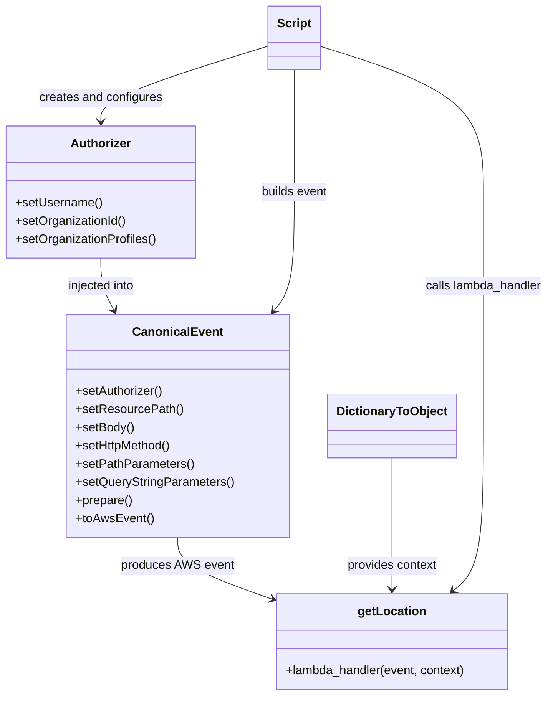
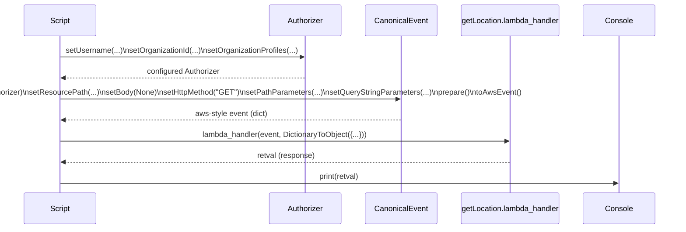

# Diagram: tools/ide_local_testing/localTest/test/location/getDereferencedLocation.py

> Auto-generated by Obscura crawlers

## Diagram 1

### SVG

<svg id="container" width="713.884765625" xmlns="http://www.w3.org/2000/svg" class="classDiagram" height="916" viewBox="0 0 713.884765625 916" role="graphics-document document" aria-roledescription="class"><g><defs><marker id="container_class-aggregationStart" class="marker aggregation class" refX="18" refY="7" markerWidth="190" markerHeight="240" orient="auto"><path d="M 18,7 L9,13 L1,7 L9,1 Z"></path></marker></defs><defs><marker id="container_class-aggregationEnd" class="marker aggregation class" refX="1" refY="7" markerWidth="20" markerHeight="28" orient="auto"><path d="M 18,7 L9,13 L1,7 L9,1 Z"></path></marker></defs><defs><marker id="container_class-extensionStart" class="marker extension class" refX="18" refY="7" markerWidth="190" markerHeight="240" orient="auto"><path d="M 1,7 L18,13 V 1 Z"></path></marker></defs><defs><marker id="container_class-extensionEnd" class="marker extension class" refX="1" refY="7" markerWidth="20" markerHeight="28" orient="auto"><path d="M 1,1 V 13 L18,7 Z"></path></marker></defs><defs><marker id="container_class-compositionStart" class="marker composition class" refX="18" refY="7" markerWidth="190" markerHeight="240" orient="auto"><path d="M 18,7 L9,13 L1,7 L9,1 Z"></path></marker></defs><defs><marker id="container_class-compositionEnd" class="marker composition class" refX="1" refY="7" markerWidth="20" markerHeight="28" orient="auto"><path d="M 18,7 L9,13 L1,7 L9,1 Z"></path></marker></defs><defs><marker id="container_class-dependencyStart" class="marker dependency class" refX="6" refY="7" markerWidth="190" markerHeight="240" orient="auto"><path d="M 5,7 L9,13 L1,7 L9,1 Z"></path></marker></defs><defs><marker id="container_class-dependencyEnd" class="marker dependency class" refX="13" refY="7" markerWidth="20" markerHeight="28" orient="auto"><path d="M 18,7 L9,13 L14,7 L9,1 Z"></path></marker></defs><defs><marker id="container_class-lollipopStart" class="marker lollipop class" refX="13" refY="7" markerWidth="190" markerHeight="240" orient="auto"><circle stroke="black" fill="transparent" cx="7" cy="7" r="6"></circle></marker></defs><defs><marker id="container_class-lollipopEnd" class="marker lollipop class" refX="1" refY="7" markerWidth="190" markerHeight="240" orient="auto"><circle stroke="black" fill="transparent" cx="7" cy="7" r="6"></circle></marker></defs><g class="root"><g class="clusters"></g><g class="edgePaths"><path d="M132.395,340L132.395,346.167C132.395,352.333,132.395,364.667,135.331,376.126C138.267,387.584,144.14,398.169,147.076,403.461L150.012,408.753" id="id_Authorizer_CanonicalEvent_1" class="edge-thickness-normal edge-pattern-solid relation" style=";;;" data-edge="true" data-et="edge" data-id="id_Authorizer_CanonicalEvent_1" data-points="W3sieCI6MTMyLjM5NDUzMTI1LCJ5IjozNDB9LHsieCI6MTMyLjM5NDUzMTI1LCJ5IjozNzd9LHsieCI6MTUyLjkyMzA3NDQ3MzUwNTQ0LCJ5Ijo0MTR9XQ==" marker-end="url(#container_class-dependencyEnd)"></path><path d="M234.482,708L234.482,714.167C234.482,720.333,234.482,732.667,253.92,745.878C273.357,759.09,312.232,773.18,331.67,780.225L351.107,787.27" id="id_CanonicalEvent_getLocation_2" class="edge-thickness-normal edge-pattern-solid relation" style=";;;" data-edge="true" data-et="edge" data-id="id_CanonicalEvent_getLocation_2" data-points="W3sieCI6MjM0LjQ4MjQyMTg3NSwieSI6NzA4fSx7IngiOjIzNC40ODI0MjE4NzUsInkiOjc0NX0seyJ4IjozNTYuNzQ4MDQ2ODc1LCJ5Ijo3ODkuMzE0ODE5MjcxOTkxfV0=" marker-end="url(#container_class-dependencyEnd)"></path><path d="M510.385,603L510.385,626.667C510.385,650.333,510.385,697.667,510.385,726.5C510.385,755.333,510.385,765.667,510.385,770.833L510.385,776" id="id_DictionaryToObject_getLocation_3" class="edge-thickness-normal edge-pattern-solid relation" style=";;;" data-edge="true" data-et="edge" data-id="id_DictionaryToObject_getLocation_3" data-points="W3sieCI6NTEwLjM4NDc2NTYyNSwieSI6NjAzfSx7IngiOjUxMC4zODQ3NjU2MjUsInkiOjc0NX0seyJ4Ijo1MTAuMzg0NzY1NjI1LCJ5Ijo3ODJ9XQ==" marker-end="url(#container_class-dependencyEnd)"></path><path d="M348.051,60.688L312.108,72.074C276.165,83.459,204.28,106.229,168.337,122.781C132.395,139.333,132.395,149.667,132.395,154.833L132.395,160" id="id_Script_Authorizer_4" class="edge-thickness-normal edge-pattern-solid relation" style=";;;" data-edge="true" data-et="edge" data-id="id_Script_Authorizer_4" data-points="W3sieCI6MzQ4LjA1MDc4MTI1LCJ5Ijo2MC42ODgyNDk4NTEyMDQ0Nn0seyJ4IjoxMzIuMzk0NTMxMjUsInkiOjEyOX0seyJ4IjoxMzIuMzk0NTMxMjUsInkiOjE2Nn1d" marker-end="url(#container_class-dependencyEnd)"></path><path d="M381.793,92L381.793,98.167C381.793,104.333,381.793,116.667,381.793,143.5C381.793,170.333,381.793,211.667,381.793,253C381.793,294.333,381.793,335.667,377.481,361.719C373.169,387.772,364.545,398.544,360.233,403.93L355.921,409.316" id="id_Script_CanonicalEvent_5" class="edge-thickness-normal edge-pattern-solid relation" style=";;;" data-edge="true" data-et="edge" data-id="id_Script_CanonicalEvent_5" data-points="W3sieCI6MzgxLjc5Mjk2ODc1LCJ5Ijo5Mn0seyJ4IjozODEuNzkyOTY4NzUsInkiOjEyOX0seyJ4IjozODEuNzkyOTY4NzUsInkiOjI1M30seyJ4IjozODEuNzkyOTY4NzUsInkiOjM3N30seyJ4IjozNTIuMTcwNzM5MjE1MzUzMjUsInkiOjQxNH1d" marker-end="url(#container_class-dependencyEnd)"></path><path d="M415.535,60.849L450.862,72.208C486.188,83.566,556.841,106.283,592.168,138.308C627.494,170.333,627.494,211.667,627.494,253C627.494,294.333,627.494,335.667,627.494,387C627.494,438.333,627.494,499.667,627.494,561C627.494,622.333,627.494,683.667,621.033,719.851C614.572,756.035,601.649,767.069,595.188,772.586L588.727,778.104" id="id_Script_getLocation_6" class="edge-thickness-normal edge-pattern-solid relation" style=";;;" data-edge="true" data-et="edge" data-id="id_Script_getLocation_6" data-points="W3sieCI6NDE1LjUzNTE1NjI1LCJ5Ijo2MC44NDkwODQ2NTA5MTEzN30seyJ4Ijo2MjcuNDk0MTQwNjI1LCJ5IjoxMjl9LHsieCI6NjI3LjQ5NDE0MDYyNSwieSI6MjUzfSx7IngiOjYyNy40OTQxNDA2MjUsInkiOjM3N30seyJ4Ijo2MjcuNDk0MTQwNjI1LCJ5Ijo1NjF9LHsieCI6NjI3LjQ5NDE0MDYyNSwieSI6NzQ1fSx7IngiOjU4NC4xNjM2NzE4NzUsInkiOjc4Mn1d" marker-end="url(#container_class-dependencyEnd)"></path></g><g class="edgeLabels"><g class="edgeLabel" transform="translate(132.39453125, 377)"><g class="label" data-id="id_Authorizer_CanonicalEvent_1" transform="translate(-45.7890625, -12)"><foreignObject width="91.578125" height="24">

injected into

</foreignObject></g></g><g class="edgeLabel" transform="translate(234.482421875, 745)"><g class="label" data-id="id_CanonicalEvent_getLocation_2" transform="translate(-73.359375, -12)"><foreignObject width="146.71875" height="24">

produces AWS event

</foreignObject></g></g><g class="edgeLabel" transform="translate(510.384765625, 745)"><g class="label" data-id="id_DictionaryToObject_getLocation_3" transform="translate(-60.28125, -12)"><foreignObject width="120.5625" height="24">

provides context

</foreignObject></g></g><g class="edgeLabel" transform="translate(132.39453125, 129)"><g class="label" data-id="id_Script_Authorizer_4" transform="translate(-81.5390625, -12)"><foreignObject width="163.078125" height="24">

creates and configures

</foreignObject></g></g><g class="edgeLabel" transform="translate(381.79296875, 253)"><g class="label" data-id="id_Script_CanonicalEvent_5" transform="translate(-44.78125, -12)"><foreignObject width="89.5625" height="24">

builds event

</foreignObject></g></g><g class="edgeLabel" transform="translate(627.494140625, 377)"><g class="label" data-id="id_Script_getLocation_6" transform="translate(-78.390625, -12)"><foreignObject width="156.78125" height="24">

calls lambda_handler

</foreignObject></g></g></g><g class="nodes"><g class="node default" id="classId-Authorizer-0" transform="translate(132.39453125, 253)"><g class="basic label-container"><path d="M-124.39453125 -87 L124.39453125 -87 L124.39453125 87 L-124.39453125 87" stroke="none" stroke-width="0" fill="#ECECFF" style=""></path><path d="M-124.39453125 -87 C-66.47479933774733 -87, -8.55506742549467 -87, 124.39453125 -87 M-124.39453125 -87 C-36.5877945512416 -87, 51.2189421475168 -87, 124.39453125 -87 M124.39453125 -87 C124.39453125 -42.19026552019791, 124.39453125 2.619468959604177, 124.39453125 87 M124.39453125 -87 C124.39453125 -44.45950666595801, 124.39453125 -1.9190133319160196, 124.39453125 87 M124.39453125 87 C68.4361446797912 87, 12.477758109582382 87, -124.39453125 87 M124.39453125 87 C51.00052057882374 87, -22.393490092352522 87, -124.39453125 87 M-124.39453125 87 C-124.39453125 50.5531821644718, -124.39453125 14.106364328943599, -124.39453125 -87 M-124.39453125 87 C-124.39453125 25.95149633378651, -124.39453125 -35.09700733242698, -124.39453125 -87" stroke="#9370DB" stroke-width="1.3" fill="none" stroke-dasharray="0 0" style=""></path></g><g class="annotation-group text" transform="translate(0, -63)"></g><g class="label-group text" transform="translate(-38.3671875, -63)"><g class="label" style="font-weight: bolder" transform="translate(0,-12)"><foreignObject width="76.734375" height="24">

Authorizer

</foreignObject></g></g><g class="members-group text" transform="translate(-112.39453125, -15)"></g><g class="methods-group text" transform="translate(-112.39453125, 15)"><g class="label" style="" transform="translate(0,-12)"><foreignObject width="113.71875" height="24">

+setUsername()

</foreignObject></g><g class="label" style="" transform="translate(0,12)"><foreignObject width="146.703125" height="24">

+setOrganizationId()

</foreignObject></g><g class="label" style="" transform="translate(0,36)"><foreignObject width="186.421875" height="24">

+setOrganizationProfiles()

</foreignObject></g></g><g class="divider" style=""><path d="M-124.39453125 -39 C-53.64777640832608 -39, 17.09897843334784 -39, 124.39453125 -39 M-124.39453125 -39 C-56.57858567666423 -39, 11.237359896671535 -39, 124.39453125 -39" stroke="#9370DB" stroke-width="1.3" fill="none" stroke-dasharray="0 0" style=""></path></g><g class="divider" style=""><path d="M-124.39453125 -15 C-29.53564880390111 -15, 65.32323364219778 -15, 124.39453125 -15 M-124.39453125 -15 C-31.8272223819893 -15, 60.7400864860214 -15, 124.39453125 -15" stroke="#9370DB" stroke-width="1.3" fill="none" stroke-dasharray="0 0" style=""></path></g></g><g class="node default" id="classId-CanonicalEvent-1" transform="translate(234.482421875, 561)"><g class="basic label-container"><path d="M-143.79296875 -147 L143.79296875 -147 L143.79296875 147 L-143.79296875 147" stroke="none" stroke-width="0" fill="#ECECFF" style=""></path><path d="M-143.79296875 -147 C-63.55533813588241 -147, 16.682292478235183 -147, 143.79296875 -147 M-143.79296875 -147 C-66.82530564676232 -147, 10.142357456475366 -147, 143.79296875 -147 M143.79296875 -147 C143.79296875 -46.00529013284478, 143.79296875 54.989419734310445, 143.79296875 147 M143.79296875 -147 C143.79296875 -31.944073305626105, 143.79296875 83.11185338874779, 143.79296875 147 M143.79296875 147 C69.84942583391975 147, -4.094117082160494 147, -143.79296875 147 M143.79296875 147 C33.37331575225612 147, -77.04633724548776 147, -143.79296875 147 M-143.79296875 147 C-143.79296875 73.81265105986773, -143.79296875 0.6253021197354656, -143.79296875 -147 M-143.79296875 147 C-143.79296875 60.356535121285745, -143.79296875 -26.28692975742851, -143.79296875 -147" stroke="#9370DB" stroke-width="1.3" fill="none" stroke-dasharray="0 0" style=""></path></g><g class="annotation-group text" transform="translate(0, -123)"></g><g class="label-group text" transform="translate(-55.7109375, -123)"><g class="label" style="font-weight: bolder" transform="translate(0,-12)"><foreignObject width="111.421875" height="24">

CanonicalEvent

</foreignObject></g></g><g class="members-group text" transform="translate(-131.79296875, -75)"></g><g class="methods-group text" transform="translate(-131.79296875, -45)"><g class="label" style="" transform="translate(0,-12)"><foreignObject width="115.765625" height="24">

+setAuthorizer()

</foreignObject></g><g class="label" style="" transform="translate(0,12)"><foreignObject width="138.625" height="24">

+setResourcePath()

</foreignObject></g><g class="label" style="" transform="translate(0,36)"><foreignObject width="76.84375" height="24">

+setBody()

</foreignObject></g><g class="label" style="" transform="translate(0,60)"><foreignObject width="127.5" height="24">

+setHttpMethod()

</foreignObject></g><g class="label" style="" transform="translate(0,84)"><foreignObject width="154.140625" height="24">

+setPathParameters()

</foreignObject></g><g class="label" style="" transform="translate(0,108)"><foreignObject width="207.875" height="24">

+setQueryStringParameters()

</foreignObject></g><g class="label" style="" transform="translate(0,132)"><foreignObject width="74.75" height="24">

+prepare()

</foreignObject></g><g class="label" style="" transform="translate(0,156)"><foreignObject width="101.1875" height="24">

+toAwsEvent()

</foreignObject></g></g><g class="divider" style=""><path d="M-143.79296875 -99 C-55.67398777294903 -99, 32.444993204101934 -99, 143.79296875 -99 M-143.79296875 -99 C-60.200323240109 -99, 23.392322269782 -99, 143.79296875 -99" stroke="#9370DB" stroke-width="1.3" fill="none" stroke-dasharray="0 0" style=""></path></g><g class="divider" style=""><path d="M-143.79296875 -75 C-33.6494522445097 -75, 76.4940642609806 -75, 143.79296875 -75 M-143.79296875 -75 C-39.30442089873618 -75, 65.18412695252763 -75, 143.79296875 -75" stroke="#9370DB" stroke-width="1.3" fill="none" stroke-dasharray="0 0" style=""></path></g></g><g class="node default" id="classId-DictionaryToObject-2" transform="translate(510.384765625, 561)"><g class="basic label-container"><path d="M-82.109375 -42 L82.109375 -42 L82.109375 42 L-82.109375 42" stroke="none" stroke-width="0" fill="#ECECFF" style=""></path><path d="M-82.109375 -42 C-33.194056853394294 -42, 15.721261293211413 -42, 82.109375 -42 M-82.109375 -42 C-36.073303383369854 -42, 9.962768233260292 -42, 82.109375 -42 M82.109375 -42 C82.109375 -12.540316987069136, 82.109375 16.919366025861727, 82.109375 42 M82.109375 -42 C82.109375 -22.30911096587993, 82.109375 -2.6182219317598623, 82.109375 42 M82.109375 42 C30.53954951918444 42, -21.03027596163112 42, -82.109375 42 M82.109375 42 C22.964406307841614 42, -36.18056238431677 42, -82.109375 42 M-82.109375 42 C-82.109375 20.89744722203703, -82.109375 -0.2051055559259396, -82.109375 -42 M-82.109375 42 C-82.109375 9.069711398921953, -82.109375 -23.860577202156094, -82.109375 -42" stroke="#9370DB" stroke-width="1.3" fill="none" stroke-dasharray="0 0" style=""></path></g><g class="annotation-group text" transform="translate(0, -18)"></g><g class="label-group text" transform="translate(-70.109375, -18)"><g class="label" style="font-weight: bolder" transform="translate(0,-12)"><foreignObject width="140.21875" height="24">

DictionaryToObject

</foreignObject></g></g><g class="members-group text" transform="translate(-70.109375, 30)"></g><g class="methods-group text" transform="translate(-70.109375, 60)"></g><g class="divider" style=""><path d="M-82.109375 6 C-46.97181176047392 6, -11.834248520947838 6, 82.109375 6 M-82.109375 6 C-37.02056878737532 6, 8.068237425249364 6, 82.109375 6" stroke="#9370DB" stroke-width="1.3" fill="none" stroke-dasharray="0 0" style=""></path></g><g class="divider" style=""><path d="M-82.109375 24 C-22.51878052285953 24, 37.07181395428094 24, 82.109375 24 M-82.109375 24 C-39.21931976963379 24, 3.6707354607324163 24, 82.109375 24" stroke="#9370DB" stroke-width="1.3" fill="none" stroke-dasharray="0 0" style=""></path></g></g><g class="node default" id="classId-getLocation-3" transform="translate(510.384765625, 845)"><g class="basic label-container"><path d="M-153.63671875 -63 L153.63671875 -63 L153.63671875 63 L-153.63671875 63" stroke="none" stroke-width="0" fill="#ECECFF" style=""></path><path d="M-153.63671875 -63 C-73.69760837456614 -63, 6.241502000867712 -63, 153.63671875 -63 M-153.63671875 -63 C-83.0982557296496 -63, -12.559792709299188 -63, 153.63671875 -63 M153.63671875 -63 C153.63671875 -36.21367879994145, 153.63671875 -9.427357599882889, 153.63671875 63 M153.63671875 -63 C153.63671875 -25.8763929627872, 153.63671875 11.2472140744256, 153.63671875 63 M153.63671875 63 C65.31447366231639 63, -23.007771425367224 63, -153.63671875 63 M153.63671875 63 C47.1447770849002 63, -59.3471645801996 63, -153.63671875 63 M-153.63671875 63 C-153.63671875 17.56675330316913, -153.63671875 -27.86649339366174, -153.63671875 -63 M-153.63671875 63 C-153.63671875 22.94838692075207, -153.63671875 -17.103226158495858, -153.63671875 -63" stroke="#9370DB" stroke-width="1.3" fill="none" stroke-dasharray="0 0" style=""></path></g><g class="annotation-group text" transform="translate(0, -39)"></g><g class="label-group text" transform="translate(-43.0859375, -39)"><g class="label" style="font-weight: bolder" transform="translate(0,-12)"><foreignObject width="86.171875" height="24">

getLocation

</foreignObject></g></g><g class="members-group text" transform="translate(-141.63671875, 9)"></g><g class="methods-group text" transform="translate(-141.63671875, 39)"><g class="label" style="" transform="translate(0,-12)"><foreignObject width="240.1875" height="24">

+lambda_handler(event, context)

</foreignObject></g></g><g class="divider" style=""><path d="M-153.63671875 -15 C-46.84283872063014 -15, 59.95104130873972 -15, 153.63671875 -15 M-153.63671875 -15 C-43.16025310516659 -15, 67.31621253966682 -15, 153.63671875 -15" stroke="#9370DB" stroke-width="1.3" fill="none" stroke-dasharray="0 0" style=""></path></g><g class="divider" style=""><path d="M-153.63671875 9 C-84.01364832909255 9, -14.390577908185094 9, 153.63671875 9 M-153.63671875 9 C-58.78557717580607 9, 36.06556439838786 9, 153.63671875 9" stroke="#9370DB" stroke-width="1.3" fill="none" stroke-dasharray="0 0" style=""></path></g></g><g class="node default" id="classId-Script-4" transform="translate(381.79296875, 50)"><g class="basic label-container"><path d="M-33.7421875 -42 L33.7421875 -42 L33.7421875 42 L-33.7421875 42" stroke="none" stroke-width="0" fill="#ECECFF" style=""></path><path d="M-33.7421875 -42 C-13.661945531033325 -42, 6.41829643793335 -42, 33.7421875 -42 M-33.7421875 -42 C-7.672170263468189 -42, 18.397846973063622 -42, 33.7421875 -42 M33.7421875 -42 C33.7421875 -15.68744995672878, 33.7421875 10.625100086542439, 33.7421875 42 M33.7421875 -42 C33.7421875 -9.656536362318988, 33.7421875 22.686927275362024, 33.7421875 42 M33.7421875 42 C17.29340363822639 42, 0.844619776452781 42, -33.7421875 42 M33.7421875 42 C18.152632911571214 42, 2.5630783231424275 42, -33.7421875 42 M-33.7421875 42 C-33.7421875 18.390177793176132, -33.7421875 -5.219644413647735, -33.7421875 -42 M-33.7421875 42 C-33.7421875 13.26953664364186, -33.7421875 -15.46092671271628, -33.7421875 -42" stroke="#9370DB" stroke-width="1.3" fill="none" stroke-dasharray="0 0" style=""></path></g><g class="annotation-group text" transform="translate(0, -18)"></g><g class="label-group text" transform="translate(-21.7421875, -18)"><g class="label" style="font-weight: bolder" transform="translate(0,-12)"><foreignObject width="43.484375" height="24">

Script

</foreignObject></g></g><g class="members-group text" transform="translate(-21.7421875, 30)"></g><g class="methods-group text" transform="translate(-21.7421875, 60)"></g><g class="divider" style=""><path d="M-33.7421875 6 C-15.860155726915735 6, 2.0218760461685292 6, 33.7421875 6 M-33.7421875 6 C-18.072513371513438 6, -2.4028392430268717 6, 33.7421875 6" stroke="#9370DB" stroke-width="1.3" fill="none" stroke-dasharray="0 0" style=""></path></g><g class="divider" style=""><path d="M-33.7421875 24 C-9.637717619990596 24, 14.466752260018808 24, 33.7421875 24 M-33.7421875 24 C-10.657107165916035 24, 12.42797316816793 24, 33.7421875 24" stroke="#9370DB" stroke-width="1.3" fill="none" stroke-dasharray="0 0" style=""></path></g></g></g></g></g></svg>

## Diagram 2

### SVG

<svg id="container" width="1492" xmlns="http://www.w3.org/2000/svg" height="507" viewBox="-50 -10 1492 507" role="graphics-document document" aria-roledescription="sequence"><g><rect x="1242" y="421" fill="#eaeaea" stroke="#666" width="150" height="65" name="Console" rx="3" ry="3" class="actor actor-bottom"></rect><text x="1317" y="453.5" dominant-baseline="central" alignment-baseline="central" class="actor actor-box" style="text-anchor: middle; font-size: 16px; font-weight: 400;"><tspan x="1317" dy="0">Console</tspan></text></g><g><rect x="963" y="421" fill="#eaeaea" stroke="#666" width="229" height="65" name="Lambda" rx="3" ry="3" class="actor actor-bottom"></rect><text x="1077.5" y="453.5" dominant-baseline="central" alignment-baseline="central" class="actor actor-box" style="text-anchor: middle; font-size: 16px; font-weight: 400;"><tspan x="1077.5" dy="0">getLocation.lambda_handler</tspan></text></g><g><rect x="763" y="421" fill="#eaeaea" stroke="#666" width="150" height="65" name="EventBuilder" rx="3" ry="3" class="actor actor-bottom"></rect><text x="838" y="453.5" dominant-baseline="central" alignment-baseline="central" class="actor actor-box" style="text-anchor: middle; font-size: 16px; font-weight: 400;"><tspan x="838" dy="0">CanonicalEvent</tspan></text></g><g><rect x="563" y="421" fill="#eaeaea" stroke="#666" width="150" height="65" name="Authorizer" rx="3" ry="3" class="actor actor-bottom"></rect><text x="638" y="453.5" dominant-baseline="central" alignment-baseline="central" class="actor actor-box" style="text-anchor: middle; font-size: 16px; font-weight: 400;"><tspan x="638" dy="0">Authorizer</tspan></text></g><g><rect x="0" y="421" fill="#eaeaea" stroke="#666" width="150" height="65" name="Script" rx="3" ry="3" class="actor actor-bottom"></rect><text x="75" y="453.5" dominant-baseline="central" alignment-baseline="central" class="actor actor-box" style="text-anchor: middle; font-size: 16px; font-weight: 400;"><tspan x="75" dy="0">Script</tspan></text></g><g><line id="actor4" x1="1317" y1="65" x2="1317" y2="421" class="actor-line 200" stroke-width="0.5px" stroke="#999" name="Console"></line><g id="root-4"><rect x="1242" y="0" fill="#eaeaea" stroke="#666" width="150" height="65" name="Console" rx="3" ry="3" class="actor actor-top"></rect><text x="1317" y="32.5" dominant-baseline="central" alignment-baseline="central" class="actor actor-box" style="text-anchor: middle; font-size: 16px; font-weight: 400;"><tspan x="1317" dy="0">Console</tspan></text></g></g><g><line id="actor3" x1="1077.5" y1="65" x2="1077.5" y2="421" class="actor-line 200" stroke-width="0.5px" stroke="#999" name="Lambda"></line><g id="root-3"><rect x="963" y="0" fill="#eaeaea" stroke="#666" width="229" height="65" name="Lambda" rx="3" ry="3" class="actor actor-top"></rect><text x="1077.5" y="32.5" dominant-baseline="central" alignment-baseline="central" class="actor actor-box" style="text-anchor: middle; font-size: 16px; font-weight: 400;"><tspan x="1077.5" dy="0">getLocation.lambda_handler</tspan></text></g></g><g><line id="actor2" x1="838" y1="65" x2="838" y2="421" class="actor-line 200" stroke-width="0.5px" stroke="#999" name="EventBuilder"></line><g id="root-2"><rect x="763" y="0" fill="#eaeaea" stroke="#666" width="150" height="65" name="EventBuilder" rx="3" ry="3" class="actor actor-top"></rect><text x="838" y="32.5" dominant-baseline="central" alignment-baseline="central" class="actor actor-box" style="text-anchor: middle; font-size: 16px; font-weight: 400;"><tspan x="838" dy="0">CanonicalEvent</tspan></text></g></g><g><line id="actor1" x1="638" y1="65" x2="638" y2="421" class="actor-line 200" stroke-width="0.5px" stroke="#999" name="Authorizer"></line><g id="root-1"><rect x="563" y="0" fill="#eaeaea" stroke="#666" width="150" height="65" name="Authorizer" rx="3" ry="3" class="actor actor-top"></rect><text x="638" y="32.5" dominant-baseline="central" alignment-baseline="central" class="actor actor-box" style="text-anchor: middle; font-size: 16px; font-weight: 400;"><tspan x="638" dy="0">Authorizer</tspan></text></g></g><g><line id="actor0" x1="75" y1="65" x2="75" y2="421" class="actor-line 200" stroke-width="0.5px" stroke="#999" name="Script"></line><g id="root-0"><rect x="0" y="0" fill="#eaeaea" stroke="#666" width="150" height="65" name="Script" rx="3" ry="3" class="actor actor-top"></rect><text x="75" y="32.5" dominant-baseline="central" alignment-baseline="central" class="actor actor-box" style="text-anchor: middle; font-size: 16px; font-weight: 400;"><tspan x="75" dy="0">Script</tspan></text></g></g><g></g><defs><symbol id="computer" width="24" height="24"><path transform="scale(.5)" d="M2 2v13h20v-13h-20zm18 11h-16v-9h16v9zm-10.228 6l.466-1h3.524l.467 1h-4.457zm14.228 3h-24l2-6h2.104l-1.33 4h18.45l-1.297-4h2.073l2 6zm-5-10h-14v-7h14v7z"></path></symbol></defs><defs><symbol id="database" fill-rule="evenodd" clip-rule="evenodd"><path transform="scale(.5)" d="M12.258.001l.256.004.255.005.253.008.251.01.249.012.247.015.246.016.242.019.241.02.239.023.236.024.233.027.231.028.229.031.225.032.223.034.22.036.217.038.214.04.211.041.208.043.205.045.201.046.198.048.194.05.191.051.187.053.183.054.18.056.175.057.172.059.168.06.163.061.16.063.155.064.15.066.074.033.073.033.071.034.07.034.069.035.068.035.067.035.066.035.064.036.064.036.062.036.06.036.06.037.058.037.058.037.055.038.055.038.053.038.052.038.051.039.05.039.048.039.047.039.045.04.044.04.043.04.041.04.04.041.039.041.037.041.036.041.034.041.033.042.032.042.03.042.029.042.027.042.026.043.024.043.023.043.021.043.02.043.018.044.017.043.015.044.013.044.012.044.011.045.009.044.007.045.006.045.004.045.002.045.001.045v17l-.001.045-.002.045-.004.045-.006.045-.007.045-.009.044-.011.045-.012.044-.013.044-.015.044-.017.043-.018.044-.02.043-.021.043-.023.043-.024.043-.026.043-.027.042-.029.042-.03.042-.032.042-.033.042-.034.041-.036.041-.037.041-.039.041-.04.041-.041.04-.043.04-.044.04-.045.04-.047.039-.048.039-.05.039-.051.039-.052.038-.053.038-.055.038-.055.038-.058.037-.058.037-.06.037-.06.036-.062.036-.064.036-.064.036-.066.035-.067.035-.068.035-.069.035-.07.034-.071.034-.073.033-.074.033-.15.066-.155.064-.16.063-.163.061-.168.06-.172.059-.175.057-.18.056-.183.054-.187.053-.191.051-.194.05-.198.048-.201.046-.205.045-.208.043-.211.041-.214.04-.217.038-.22.036-.223.034-.225.032-.229.031-.231.028-.233.027-.236.024-.239.023-.241.02-.242.019-.246.016-.247.015-.249.012-.251.01-.253.008-.255.005-.256.004-.258.001-.258-.001-.256-.004-.255-.005-.253-.008-.251-.01-.249-.012-.247-.015-.245-.016-.243-.019-.241-.02-.238-.023-.236-.024-.234-.027-.231-.028-.228-.031-.226-.032-.223-.034-.22-.036-.217-.038-.214-.04-.211-.041-.208-.043-.204-.045-.201-.046-.198-.048-.195-.05-.19-.051-.187-.053-.184-.054-.179-.056-.176-.057-.172-.059-.167-.06-.164-.061-.159-.063-.155-.064-.151-.066-.074-.033-.072-.033-.072-.034-.07-.034-.069-.035-.068-.035-.067-.035-.066-.035-.064-.036-.063-.036-.062-.036-.061-.036-.06-.037-.058-.037-.057-.037-.056-.038-.055-.038-.053-.038-.052-.038-.051-.039-.049-.039-.049-.039-.046-.039-.046-.04-.044-.04-.043-.04-.041-.04-.04-.041-.039-.041-.037-.041-.036-.041-.034-.041-.033-.042-.032-.042-.03-.042-.029-.042-.027-.042-.026-.043-.024-.043-.023-.043-.021-.043-.02-.043-.018-.044-.017-.043-.015-.044-.013-.044-.012-.044-.011-.045-.009-.044-.007-.045-.006-.045-.004-.045-.002-.045-.001-.045v-17l.001-.045.002-.045.004-.045.006-.045.007-.045.009-.044.011-.045.012-.044.013-.044.015-.044.017-.043.018-.044.02-.043.021-.043.023-.043.024-.043.026-.043.027-.042.029-.042.03-.042.032-.042.033-.042.034-.041.036-.041.037-.041.039-.041.04-.041.041-.04.043-.04.044-.04.046-.04.046-.039.049-.039.049-.039.051-.039.052-.038.053-.038.055-.038.056-.038.057-.037.058-.037.06-.037.061-.036.062-.036.063-.036.064-.036.066-.035.067-.035.068-.035.069-.035.07-.034.072-.034.072-.033.074-.033.151-.066.155-.064.159-.063.164-.061.167-.06.172-.059.176-.057.179-.056.184-.054.187-.053.19-.051.195-.05.198-.048.201-.046.204-.045.208-.043.211-.041.214-.04.217-.038.22-.036.223-.034.226-.032.228-.031.231-.028.234-.027.236-.024.238-.023.241-.02.243-.019.245-.016.247-.015.249-.012.251-.01.253-.008.255-.005.256-.004.258-.001.258.001zm-9.258 20.499v.01l.001.021.003.021.004.022.005.021.006.022.007.022.009.023.01.022.011.023.012.023.013.023.015.023.016.024.017.023.018.024.019.024.021.024.022.025.023.024.024.025.052.049.056.05.061.051.066.051.07.051.075.051.079.052.084.052.088.052.092.052.097.052.102.051.105.052.11.052.114.051.119.051.123.051.127.05.131.05.135.05.139.048.144.049.147.047.152.047.155.047.16.045.163.045.167.043.171.043.176.041.178.041.183.039.187.039.19.037.194.035.197.035.202.033.204.031.209.03.212.029.216.027.219.025.222.024.226.021.23.02.233.018.236.016.24.015.243.012.246.01.249.008.253.005.256.004.259.001.26-.001.257-.004.254-.005.25-.008.247-.011.244-.012.241-.014.237-.016.233-.018.231-.021.226-.021.224-.024.22-.026.216-.027.212-.028.21-.031.205-.031.202-.034.198-.034.194-.036.191-.037.187-.039.183-.04.179-.04.175-.042.172-.043.168-.044.163-.045.16-.046.155-.046.152-.047.148-.048.143-.049.139-.049.136-.05.131-.05.126-.05.123-.051.118-.052.114-.051.11-.052.106-.052.101-.052.096-.052.092-.052.088-.053.083-.051.079-.052.074-.052.07-.051.065-.051.06-.051.056-.05.051-.05.023-.024.023-.025.021-.024.02-.024.019-.024.018-.024.017-.024.015-.023.014-.024.013-.023.012-.023.01-.023.01-.022.008-.022.006-.022.006-.022.004-.022.004-.021.001-.021.001-.021v-4.127l-.077.055-.08.053-.083.054-.085.053-.087.052-.09.052-.093.051-.095.05-.097.05-.1.049-.102.049-.105.048-.106.047-.109.047-.111.046-.114.045-.115.045-.118.044-.12.043-.122.042-.124.042-.126.041-.128.04-.13.04-.132.038-.134.038-.135.037-.138.037-.139.035-.142.035-.143.034-.144.033-.147.032-.148.031-.15.03-.151.03-.153.029-.154.027-.156.027-.158.026-.159.025-.161.024-.162.023-.163.022-.165.021-.166.02-.167.019-.169.018-.169.017-.171.016-.173.015-.173.014-.175.013-.175.012-.177.011-.178.01-.179.008-.179.008-.181.006-.182.005-.182.004-.184.003-.184.002h-.37l-.184-.002-.184-.003-.182-.004-.182-.005-.181-.006-.179-.008-.179-.008-.178-.01-.176-.011-.176-.012-.175-.013-.173-.014-.172-.015-.171-.016-.17-.017-.169-.018-.167-.019-.166-.02-.165-.021-.163-.022-.162-.023-.161-.024-.159-.025-.157-.026-.156-.027-.155-.027-.153-.029-.151-.03-.15-.03-.148-.031-.146-.032-.145-.033-.143-.034-.141-.035-.14-.035-.137-.037-.136-.037-.134-.038-.132-.038-.13-.04-.128-.04-.126-.041-.124-.042-.122-.042-.12-.044-.117-.043-.116-.045-.113-.045-.112-.046-.109-.047-.106-.047-.105-.048-.102-.049-.1-.049-.097-.05-.095-.05-.093-.052-.09-.051-.087-.052-.085-.053-.083-.054-.08-.054-.077-.054v4.127zm0-5.654v.011l.001.021.003.021.004.021.005.022.006.022.007.022.009.022.01.022.011.023.012.023.013.023.015.024.016.023.017.024.018.024.019.024.021.024.022.024.023.025.024.024.052.05.056.05.061.05.066.051.07.051.075.052.079.051.084.052.088.052.092.052.097.052.102.052.105.052.11.051.114.051.119.052.123.05.127.051.131.05.135.049.139.049.144.048.147.048.152.047.155.046.16.045.163.045.167.044.171.042.176.042.178.04.183.04.187.038.19.037.194.036.197.034.202.033.204.032.209.03.212.028.216.027.219.025.222.024.226.022.23.02.233.018.236.016.24.014.243.012.246.01.249.008.253.006.256.003.259.001.26-.001.257-.003.254-.006.25-.008.247-.01.244-.012.241-.015.237-.016.233-.018.231-.02.226-.022.224-.024.22-.025.216-.027.212-.029.21-.03.205-.032.202-.033.198-.035.194-.036.191-.037.187-.039.183-.039.179-.041.175-.042.172-.043.168-.044.163-.045.16-.045.155-.047.152-.047.148-.048.143-.048.139-.05.136-.049.131-.05.126-.051.123-.051.118-.051.114-.052.11-.052.106-.052.101-.052.096-.052.092-.052.088-.052.083-.052.079-.052.074-.051.07-.052.065-.051.06-.05.056-.051.051-.049.023-.025.023-.024.021-.025.02-.024.019-.024.018-.024.017-.024.015-.023.014-.023.013-.024.012-.022.01-.023.01-.023.008-.022.006-.022.006-.022.004-.021.004-.022.001-.021.001-.021v-4.139l-.077.054-.08.054-.083.054-.085.052-.087.053-.09.051-.093.051-.095.051-.097.05-.1.049-.102.049-.105.048-.106.047-.109.047-.111.046-.114.045-.115.044-.118.044-.12.044-.122.042-.124.042-.126.041-.128.04-.13.039-.132.039-.134.038-.135.037-.138.036-.139.036-.142.035-.143.033-.144.033-.147.033-.148.031-.15.03-.151.03-.153.028-.154.028-.156.027-.158.026-.159.025-.161.024-.162.023-.163.022-.165.021-.166.02-.167.019-.169.018-.169.017-.171.016-.173.015-.173.014-.175.013-.175.012-.177.011-.178.009-.179.009-.179.007-.181.007-.182.005-.182.004-.184.003-.184.002h-.37l-.184-.002-.184-.003-.182-.004-.182-.005-.181-.007-.179-.007-.179-.009-.178-.009-.176-.011-.176-.012-.175-.013-.173-.014-.172-.015-.171-.016-.17-.017-.169-.018-.167-.019-.166-.02-.165-.021-.163-.022-.162-.023-.161-.024-.159-.025-.157-.026-.156-.027-.155-.028-.153-.028-.151-.03-.15-.03-.148-.031-.146-.033-.145-.033-.143-.033-.141-.035-.14-.036-.137-.036-.136-.037-.134-.038-.132-.039-.13-.039-.128-.04-.126-.041-.124-.042-.122-.043-.12-.043-.117-.044-.116-.044-.113-.046-.112-.046-.109-.046-.106-.047-.105-.048-.102-.049-.1-.049-.097-.05-.095-.051-.093-.051-.09-.051-.087-.053-.085-.052-.083-.054-.08-.054-.077-.054v4.139zm0-5.666v.011l.001.02.003.022.004.021.005.022.006.021.007.022.009.023.01.022.011.023.012.023.013.023.015.023.016.024.017.024.018.023.019.024.021.025.022.024.023.024.024.025.052.05.056.05.061.05.066.051.07.051.075.052.079.051.084.052.088.052.092.052.097.052.102.052.105.051.11.052.114.051.119.051.123.051.127.05.131.05.135.05.139.049.144.048.147.048.152.047.155.046.16.045.163.045.167.043.171.043.176.042.178.04.183.04.187.038.19.037.194.036.197.034.202.033.204.032.209.03.212.028.216.027.219.025.222.024.226.021.23.02.233.018.236.017.24.014.243.012.246.01.249.008.253.006.256.003.259.001.26-.001.257-.003.254-.006.25-.008.247-.01.244-.013.241-.014.237-.016.233-.018.231-.02.226-.022.224-.024.22-.025.216-.027.212-.029.21-.03.205-.032.202-.033.198-.035.194-.036.191-.037.187-.039.183-.039.179-.041.175-.042.172-.043.168-.044.163-.045.16-.045.155-.047.152-.047.148-.048.143-.049.139-.049.136-.049.131-.051.126-.05.123-.051.118-.052.114-.051.11-.052.106-.052.101-.052.096-.052.092-.052.088-.052.083-.052.079-.052.074-.052.07-.051.065-.051.06-.051.056-.05.051-.049.023-.025.023-.025.021-.024.02-.024.019-.024.018-.024.017-.024.015-.023.014-.024.013-.023.012-.023.01-.022.01-.023.008-.022.006-.022.006-.022.004-.022.004-.021.001-.021.001-.021v-4.153l-.077.054-.08.054-.083.053-.085.053-.087.053-.09.051-.093.051-.095.051-.097.05-.1.049-.102.048-.105.048-.106.048-.109.046-.111.046-.114.046-.115.044-.118.044-.12.043-.122.043-.124.042-.126.041-.128.04-.13.039-.132.039-.134.038-.135.037-.138.036-.139.036-.142.034-.143.034-.144.033-.147.032-.148.032-.15.03-.151.03-.153.028-.154.028-.156.027-.158.026-.159.024-.161.024-.162.023-.163.023-.165.021-.166.02-.167.019-.169.018-.169.017-.171.016-.173.015-.173.014-.175.013-.175.012-.177.01-.178.01-.179.009-.179.007-.181.006-.182.006-.182.004-.184.003-.184.001-.185.001-.185-.001-.184-.001-.184-.003-.182-.004-.182-.006-.181-.006-.179-.007-.179-.009-.178-.01-.176-.01-.176-.012-.175-.013-.173-.014-.172-.015-.171-.016-.17-.017-.169-.018-.167-.019-.166-.02-.165-.021-.163-.023-.162-.023-.161-.024-.159-.024-.157-.026-.156-.027-.155-.028-.153-.028-.151-.03-.15-.03-.148-.032-.146-.032-.145-.033-.143-.034-.141-.034-.14-.036-.137-.036-.136-.037-.134-.038-.132-.039-.13-.039-.128-.041-.126-.041-.124-.041-.122-.043-.12-.043-.117-.044-.116-.044-.113-.046-.112-.046-.109-.046-.106-.048-.105-.048-.102-.048-.1-.05-.097-.049-.095-.051-.093-.051-.09-.052-.087-.052-.085-.053-.083-.053-.08-.054-.077-.054v4.153zm8.74-8.179l-.257.004-.254.005-.25.008-.247.011-.244.012-.241.014-.237.016-.233.018-.231.021-.226.022-.224.023-.22.026-.216.027-.212.028-.21.031-.205.032-.202.033-.198.034-.194.036-.191.038-.187.038-.183.04-.179.041-.175.042-.172.043-.168.043-.163.045-.16.046-.155.046-.152.048-.148.048-.143.048-.139.049-.136.05-.131.05-.126.051-.123.051-.118.051-.114.052-.11.052-.106.052-.101.052-.096.052-.092.052-.088.052-.083.052-.079.052-.074.051-.07.052-.065.051-.06.05-.056.05-.051.05-.023.025-.023.024-.021.024-.02.025-.019.024-.018.024-.017.023-.015.024-.014.023-.013.023-.012.023-.01.023-.01.022-.008.022-.006.023-.006.021-.004.022-.004.021-.001.021-.001.021.001.021.001.021.004.021.004.022.006.021.006.023.008.022.01.022.01.023.012.023.013.023.014.023.015.024.017.023.018.024.019.024.02.025.021.024.023.024.023.025.051.05.056.05.06.05.065.051.07.052.074.051.079.052.083.052.088.052.092.052.096.052.101.052.106.052.11.052.114.052.118.051.123.051.126.051.131.05.136.05.139.049.143.048.148.048.152.048.155.046.16.046.163.045.168.043.172.043.175.042.179.041.183.04.187.038.191.038.194.036.198.034.202.033.205.032.21.031.212.028.216.027.22.026.224.023.226.022.231.021.233.018.237.016.241.014.244.012.247.011.25.008.254.005.257.004.26.001.26-.001.257-.004.254-.005.25-.008.247-.011.244-.012.241-.014.237-.016.233-.018.231-.021.226-.022.224-.023.22-.026.216-.027.212-.028.21-.031.205-.032.202-.033.198-.034.194-.036.191-.038.187-.038.183-.04.179-.041.175-.042.172-.043.168-.043.163-.045.16-.046.155-.046.152-.048.148-.048.143-.048.139-.049.136-.05.131-.05.126-.051.123-.051.118-.051.114-.052.11-.052.106-.052.101-.052.096-.052.092-.052.088-.052.083-.052.079-.052.074-.051.07-.052.065-.051.06-.05.056-.05.051-.05.023-.025.023-.024.021-.024.02-.025.019-.024.018-.024.017-.023.015-.024.014-.023.013-.023.012-.023.01-.023.01-.022.008-.022.006-.023.006-.021.004-.022.004-.021.001-.021.001-.021-.001-.021-.001-.021-.004-.021-.004-.022-.006-.021-.006-.023-.008-.022-.01-.022-.01-.023-.012-.023-.013-.023-.014-.023-.015-.024-.017-.023-.018-.024-.019-.024-.02-.025-.021-.024-.023-.024-.023-.025-.051-.05-.056-.05-.06-.05-.065-.051-.07-.052-.074-.051-.079-.052-.083-.052-.088-.052-.092-.052-.096-.052-.101-.052-.106-.052-.11-.052-.114-.052-.118-.051-.123-.051-.126-.051-.131-.05-.136-.05-.139-.049-.143-.048-.148-.048-.152-.048-.155-.046-.16-.046-.163-.045-.168-.043-.172-.043-.175-.042-.179-.041-.183-.04-.187-.038-.191-.038-.194-.036-.198-.034-.202-.033-.205-.032-.21-.031-.212-.028-.216-.027-.22-.026-.224-.023-.226-.022-.231-.021-.233-.018-.237-.016-.241-.014-.244-.012-.247-.011-.25-.008-.254-.005-.257-.004-.26-.001-.26.001z"></path></symbol></defs><defs><symbol id="clock" width="24" height="24"><path transform="scale(.5)" d="M12 2c5.514 0 10 4.486 10 10s-4.486 10-10 10-10-4.486-10-10 4.486-10 10-10zm0-2c-6.627 0-12 5.373-12 12s5.373 12 12 12 12-5.373 12-12-5.373-12-12-12zm5.848 12.459c.202.038.202.333.001.372-1.907.361-6.045 1.111-6.547 1.111-.719 0-1.301-.582-1.301-1.301 0-.512.77-5.447 1.125-7.445.034-.192.312-.181.343.014l.985 6.238 5.394 1.011z"></path></symbol></defs><defs><marker id="arrowhead" refX="7.9" refY="5" markerUnits="userSpaceOnUse" markerWidth="12" markerHeight="12" orient="auto-start-reverse"><path d="M -1 0 L 10 5 L 0 10 z"></path></marker></defs><defs><marker id="crosshead" markerWidth="15" markerHeight="8" orient="auto" refX="4" refY="4.5"><path fill="none" stroke="#000000" stroke-width="1pt" d="M 1,2 L 6,7 M 6,2 L 1,7" style="stroke-dasharray: 0, 0;"></path></marker></defs><defs><marker id="filled-head" refX="15.5" refY="7" markerWidth="20" markerHeight="28" orient="auto"><path d="M 18,7 L9,13 L14,7 L9,1 Z"></path></marker></defs><defs><marker id="sequencenumber" refX="15" refY="15" markerWidth="60" markerHeight="40" orient="auto"><circle cx="15" cy="15" r="6"></circle></marker></defs><text x="355" y="80" text-anchor="middle" dominant-baseline="middle" alignment-baseline="middle" class="messageText" dy="1em" style="font-size: 16px; font-weight: 400;">setUsername(...)\nsetOrganizationId(...)\nsetOrganizationProfiles(...)</text><line x1="76" y1="113" x2="634" y2="113" class="messageLine0" stroke-width="2" stroke="none" marker-end="url(#arrowhead)" style="fill: none;"></line><text x="358" y="128" text-anchor="middle" dominant-baseline="middle" alignment-baseline="middle" class="messageText" dy="1em" style="font-size: 16px; font-weight: 400;">configured Authorizer</text><line x1="637" y1="161" x2="79" y2="161" class="messageLine1" stroke-width="2" stroke="none" marker-end="url(#arrowhead)" style="stroke-dasharray: 3, 3; fill: none;"></line><text x="455" y="176" text-anchor="middle" dominant-baseline="middle" alignment-baseline="middle" class="messageText" dy="1em" style="font-size: 16px; font-weight: 400;">setAuthorizer(authorizer)\nsetResourcePath(...)\nsetBody(None)\nsetHttpMethod("GET")\nsetPathParameters(...)\nsetQueryStringParameters(...)\nprepare()\ntoAwsEvent()</text><line x1="76" y1="209" x2="834" y2="209" class="messageLine0" stroke-width="2" stroke="none" marker-end="url(#arrowhead)" style="fill: none;"></line><text x="458" y="224" text-anchor="middle" dominant-baseline="middle" alignment-baseline="middle" class="messageText" dy="1em" style="font-size: 16px; font-weight: 400;">aws-style event (dict)</text><line x1="837" y1="257" x2="79" y2="257" class="messageLine1" stroke-width="2" stroke="none" marker-end="url(#arrowhead)" style="stroke-dasharray: 3, 3; fill: none;"></line><text x="575" y="272" text-anchor="middle" dominant-baseline="middle" alignment-baseline="middle" class="messageText" dy="1em" style="font-size: 16px; font-weight: 400;">lambda_handler(event, DictionaryToObject({...}))</text><line x1="76" y1="305" x2="1073.5" y2="305" class="messageLine0" stroke-width="2" stroke="none" marker-end="url(#arrowhead)" style="fill: none;"></line><text x="578" y="320" text-anchor="middle" dominant-baseline="middle" alignment-baseline="middle" class="messageText" dy="1em" style="font-size: 16px; font-weight: 400;">retval (response)</text><line x1="1076.5" y1="353" x2="79" y2="353" class="messageLine1" stroke-width="2" stroke="none" marker-end="url(#arrowhead)" style="stroke-dasharray: 3, 3; fill: none;"></line><text x="695" y="368" text-anchor="middle" dominant-baseline="middle" alignment-baseline="middle" class="messageText" dy="1em" style="font-size: 16px; font-weight: 400;">print(retval)</text><line x1="76" y1="401" x2="1313" y2="401" class="messageLine0" stroke-width="2" stroke="none" marker-end="url(#arrowhead)" style="fill: none;"></line></svg>
