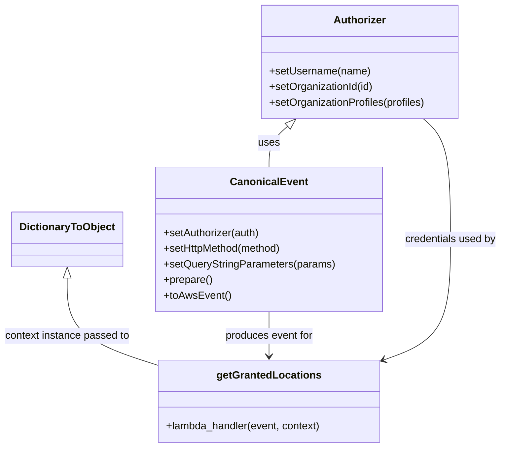
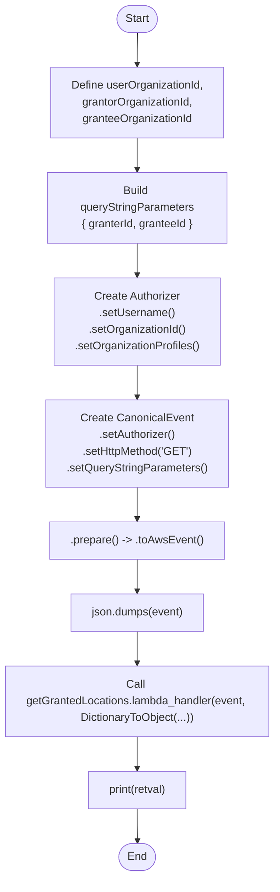

# Diagram: tools/ide_local_testing/localTest/test/location/getLocationGrants.py

> Auto-generated by Obscura crawlers

## Diagram 1

### SVG

<svg id="container" width="762.5625" xmlns="http://www.w3.org/2000/svg" class="classDiagram" height="686" viewBox="0 0 762.5625 686" role="graphics-document document" aria-roledescription="class"><g><defs><marker id="container_class-aggregationStart" class="marker aggregation class" refX="18" refY="7" markerWidth="190" markerHeight="240" orient="auto"><path d="M 18,7 L9,13 L1,7 L9,1 Z"></path></marker></defs><defs><marker id="container_class-aggregationEnd" class="marker aggregation class" refX="1" refY="7" markerWidth="20" markerHeight="28" orient="auto"><path d="M 18,7 L9,13 L1,7 L9,1 Z"></path></marker></defs><defs><marker id="container_class-extensionStart" class="marker extension class" refX="18" refY="7" markerWidth="190" markerHeight="240" orient="auto"><path d="M 1,7 L18,13 V 1 Z"></path></marker></defs><defs><marker id="container_class-extensionEnd" class="marker extension class" refX="1" refY="7" markerWidth="20" markerHeight="28" orient="auto"><path d="M 1,1 V 13 L18,7 Z"></path></marker></defs><defs><marker id="container_class-compositionStart" class="marker composition class" refX="18" refY="7" markerWidth="190" markerHeight="240" orient="auto"><path d="M 18,7 L9,13 L1,7 L9,1 Z"></path></marker></defs><defs><marker id="container_class-compositionEnd" class="marker composition class" refX="1" refY="7" markerWidth="20" markerHeight="28" orient="auto"><path d="M 18,7 L9,13 L1,7 L9,1 Z"></path></marker></defs><defs><marker id="container_class-dependencyStart" class="marker dependency class" refX="6" refY="7" markerWidth="190" markerHeight="240" orient="auto"><path d="M 5,7 L9,13 L1,7 L9,1 Z"></path></marker></defs><defs><marker id="container_class-dependencyEnd" class="marker dependency class" refX="13" refY="7" markerWidth="20" markerHeight="28" orient="auto"><path d="M 18,7 L9,13 L14,7 L9,1 Z"></path></marker></defs><defs><marker id="container_class-lollipopStart" class="marker lollipop class" refX="13" refY="7" markerWidth="190" markerHeight="240" orient="auto"><circle stroke="black" fill="transparent" cx="7" cy="7" r="6"></circle></marker></defs><defs><marker id="container_class-lollipopEnd" class="marker lollipop class" refX="1" refY="7" markerWidth="190" markerHeight="240" orient="auto"><circle stroke="black" fill="transparent" cx="7" cy="7" r="6"></circle></marker></defs><g class="root"><g class="clusters"></g><g class="edgePaths"><path d="M435.789,193.521L431.056,197.767C426.324,202.014,416.859,210.507,412.127,220.92C407.395,231.333,407.395,243.667,407.395,249.833L407.395,256" id="id_Authorizer_CanonicalEvent_1" class="edge-thickness-normal edge-pattern-solid relation" style=";;;" data-edge="true" data-et="edge" data-id="id_Authorizer_CanonicalEvent_1" data-points="W3sieCI6NDQ4LjYyNzMxNTM5ODE4NTUsInkiOjE4Mn0seyJ4Ijo0MDcuMzk0NTMxMjUsInkiOjIxOX0seyJ4Ijo0MDcuMzk0NTMxMjUsInkiOjI1Nn1d" marker-start="url(#container_class-extensionStart)"></path><path d="M104.711,426.25L104.711,441.042C104.711,455.833,104.711,485.417,126.793,507.504C148.875,529.591,193.039,544.182,215.121,551.477L237.203,558.773" id="id_DictionaryToObject_getGrantedLocations_2" class="edge-thickness-normal edge-pattern-solid relation" style=";;;" data-edge="true" data-et="edge" data-id="id_DictionaryToObject_getGrantedLocations_2" data-points="W3sieCI6MTA0LjcxMDkzNzUsInkiOjQwOX0seyJ4IjoxMDQuNzEwOTM3NSwieSI6NTE1fSx7IngiOjIzNy4yMDMxMjUsInkiOjU1OC43NzI1MDM3NzQ4MjY4fV0=" marker-start="url(#container_class-extensionStart)"></path><path d="M407.395,478L407.395,484.167C407.395,490.333,407.395,502.667,407.395,514C407.395,525.333,407.395,535.667,407.395,540.833L407.395,546" id="id_CanonicalEvent_getGrantedLocations_3" class="edge-thickness-normal edge-pattern-solid relation" style=";;;" data-edge="true" data-et="edge" data-id="id_CanonicalEvent_getGrantedLocations_3" data-points="W3sieCI6NDA3LjM5NDUzMTI1LCJ5Ijo0Nzh9LHsieCI6NDA3LjM5NDUzMTI1LCJ5Ijo1MTV9LHsieCI6NDA3LjM5NDUzMTI1LCJ5Ijo1NTJ9XQ==" marker-end="url(#container_class-dependencyEnd)"></path><path d="M642.533,182L649.405,188.167C656.277,194.333,670.021,206.667,676.893,237.5C683.766,268.333,683.766,317.667,683.766,367C683.766,416.333,683.766,465.667,667.009,496.396C650.253,527.126,616.741,539.252,599.984,545.315L583.228,551.378" id="id_Authorizer_getGrantedLocations_4" class="edge-thickness-normal edge-pattern-solid relation" style=";;;" data-edge="true" data-et="edge" data-id="id_Authorizer_getGrantedLocations_4" data-points="W3sieCI6NjQyLjUzMjg0MDg1MTgxNDUsInkiOjE4Mn0seyJ4Ijo2ODMuNzY1NjI1LCJ5IjoyMTl9LHsieCI6NjgzLjc2NTYyNSwieSI6MzY3fSx7IngiOjY4My43NjU2MjUsInkiOjUxNX0seyJ4Ijo1NzcuNTg1OTM3NSwieSI6NTUzLjQxOTI0NDk1NzY2ODR9XQ==" marker-end="url(#container_class-dependencyEnd)"></path></g><g class="edgeLabels"><g class="edgeLabel" transform="translate(407.39453125, 219)"><g class="label" data-id="id_Authorizer_CanonicalEvent_1" transform="translate(-16.4921875, -12)"><foreignObject width="32.984375" height="24">

uses

</foreignObject></g></g><g class="edgeLabel" transform="translate(104.7109375, 515)"><g class="label" data-id="id_DictionaryToObject_getGrantedLocations_2" transform="translate(-96.7109375, -12)"><foreignObject width="193.421875" height="24">

context instance passed to

</foreignObject></g></g><g class="edgeLabel" transform="translate(407.39453125, 515)"><g class="label" data-id="id_CanonicalEvent_getGrantedLocations_3" transform="translate(-68.2421875, -12)"><foreignObject width="136.484375" height="24">

produces event for

</foreignObject></g></g><g class="edgeLabel" transform="translate(683.765625, 367)"><g class="label" data-id="id_Authorizer_getGrantedLocations_4" transform="translate(-70.796875, -12)"><foreignObject width="141.59375" height="24">

credentials used by

</foreignObject></g></g></g><g class="nodes"><g class="node default" id="classId-Authorizer-0" transform="translate(545.580078125, 95)"><g class="basic label-container"><path d="M-151.66796875 -87 L151.66796875 -87 L151.66796875 87 L-151.66796875 87" stroke="none" stroke-width="0" fill="#ECECFF" style=""></path><path d="M-151.66796875 -87 C-48.39734198902859 -87, 54.87328477194282 -87, 151.66796875 -87 M-151.66796875 -87 C-64.18141016146899 -87, 23.305148427062022 -87, 151.66796875 -87 M151.66796875 -87 C151.66796875 -17.429953696841125, 151.66796875 52.14009260631775, 151.66796875 87 M151.66796875 -87 C151.66796875 -20.38702787510691, 151.66796875 46.22594424978618, 151.66796875 87 M151.66796875 87 C86.9360589436157 87, 22.20414913723141 87, -151.66796875 87 M151.66796875 87 C83.15766588792432 87, 14.647363025848648 87, -151.66796875 87 M-151.66796875 87 C-151.66796875 28.16266177081043, -151.66796875 -30.67467645837914, -151.66796875 -87 M-151.66796875 87 C-151.66796875 51.737448372413674, -151.66796875 16.474896744827348, -151.66796875 -87" stroke="#9370DB" stroke-width="1.3" fill="none" stroke-dasharray="0 0" style=""></path></g><g class="annotation-group text" transform="translate(0, -63)"></g><g class="label-group text" transform="translate(-38.3671875, -63)"><g class="label" style="font-weight: bolder" transform="translate(0,-12)"><foreignObject width="76.734375" height="24">

Authorizer

</foreignObject></g></g><g class="members-group text" transform="translate(-139.66796875, -15)"></g><g class="methods-group text" transform="translate(-139.66796875, 15)"><g class="label" style="" transform="translate(0,-12)"><foreignObject width="154.234375" height="24">

+setUsername(name)

</foreignObject></g><g class="label" style="" transform="translate(0,12)"><foreignObject width="160.78125" height="24">

+setOrganizationId(id)

</foreignObject></g><g class="label" style="" transform="translate(0,36)"><foreignObject width="240.96875" height="24">

+setOrganizationProfiles(profiles)

</foreignObject></g></g><g class="divider" style=""><path d="M-151.66796875 -39 C-30.63701604432785 -39, 90.3939366613443 -39, 151.66796875 -39 M-151.66796875 -39 C-78.88697811977578 -39, -6.105987489551552 -39, 151.66796875 -39" stroke="#9370DB" stroke-width="1.3" fill="none" stroke-dasharray="0 0" style=""></path></g><g class="divider" style=""><path d="M-151.66796875 -15 C-54.67227001647187 -15, 42.32342871705626 -15, 151.66796875 -15 M-151.66796875 -15 C-44.156898357727954 -15, 63.35417203454409 -15, 151.66796875 -15" stroke="#9370DB" stroke-width="1.3" fill="none" stroke-dasharray="0 0" style=""></path></g></g><g class="node default" id="classId-CanonicalEvent-1" transform="translate(407.39453125, 367)"><g class="basic label-container"><path d="M-170.57421875 -111 L170.57421875 -111 L170.57421875 111 L-170.57421875 111" stroke="none" stroke-width="0" fill="#ECECFF" style=""></path><path d="M-170.57421875 -111 C-67.63074223832069 -111, 35.312734273358615 -111, 170.57421875 -111 M-170.57421875 -111 C-55.80647143983694 -111, 58.96127587032612 -111, 170.57421875 -111 M170.57421875 -111 C170.57421875 -51.107361355334106, 170.57421875 8.785277289331788, 170.57421875 111 M170.57421875 -111 C170.57421875 -61.59062102643427, 170.57421875 -12.18124205286854, 170.57421875 111 M170.57421875 111 C99.49234570759931 111, 28.410472665198625 111, -170.57421875 111 M170.57421875 111 C64.86610790786034 111, -40.84200293427932 111, -170.57421875 111 M-170.57421875 111 C-170.57421875 35.84469581441245, -170.57421875 -39.31060837117511, -170.57421875 -111 M-170.57421875 111 C-170.57421875 44.567675829149834, -170.57421875 -21.86464834170033, -170.57421875 -111" stroke="#9370DB" stroke-width="1.3" fill="none" stroke-dasharray="0 0" style=""></path></g><g class="annotation-group text" transform="translate(0, -87)"></g><g class="label-group text" transform="translate(-55.7109375, -87)"><g class="label" style="font-weight: bolder" transform="translate(0,-12)"><foreignObject width="111.421875" height="24">

CanonicalEvent

</foreignObject></g></g><g class="members-group text" transform="translate(-158.57421875, -39)"></g><g class="methods-group text" transform="translate(-158.57421875, -9)"><g class="label" style="" transform="translate(0,-12)"><foreignObject width="148.9375" height="24">

+setAuthorizer(auth)

</foreignObject></g><g class="label" style="" transform="translate(0,12)"><foreignObject width="184" height="24">

+setHttpMethod(method)

</foreignObject></g><g class="label" style="" transform="translate(0,36)"><foreignObject width="261.4375" height="24">

+setQueryStringParameters(params)

</foreignObject></g><g class="label" style="" transform="translate(0,60)"><foreignObject width="74.75" height="24">

+prepare()

</foreignObject></g><g class="label" style="" transform="translate(0,84)"><foreignObject width="101.1875" height="24">

+toAwsEvent()

</foreignObject></g></g><g class="divider" style=""><path d="M-170.57421875 -63 C-56.88511419950062 -63, 56.80399035099876 -63, 170.57421875 -63 M-170.57421875 -63 C-85.37196650661234 -63, -0.16971426322467664 -63, 170.57421875 -63" stroke="#9370DB" stroke-width="1.3" fill="none" stroke-dasharray="0 0" style=""></path></g><g class="divider" style=""><path d="M-170.57421875 -39 C-69.07239914949437 -39, 32.429420451011254 -39, 170.57421875 -39 M-170.57421875 -39 C-79.05950763809746 -39, 12.455203473805085 -39, 170.57421875 -39" stroke="#9370DB" stroke-width="1.3" fill="none" stroke-dasharray="0 0" style=""></path></g></g><g class="node default" id="classId-DictionaryToObject-2" transform="translate(104.7109375, 367)"><g class="basic label-container"><path d="M-82.109375 -42 L82.109375 -42 L82.109375 42 L-82.109375 42" stroke="none" stroke-width="0" fill="#ECECFF" style=""></path><path d="M-82.109375 -42 C-22.641213457031036 -42, 36.82694808593793 -42, 82.109375 -42 M-82.109375 -42 C-41.4173828260067 -42, -0.7253906520134024 -42, 82.109375 -42 M82.109375 -42 C82.109375 -21.391451686163148, 82.109375 -0.7829033723262953, 82.109375 42 M82.109375 -42 C82.109375 -20.600311421194018, 82.109375 0.7993771576119642, 82.109375 42 M82.109375 42 C28.845914432939495 42, -24.41754613412101 42, -82.109375 42 M82.109375 42 C41.600141631658126 42, 1.0909082633162512 42, -82.109375 42 M-82.109375 42 C-82.109375 18.533449837956695, -82.109375 -4.93310032408661, -82.109375 -42 M-82.109375 42 C-82.109375 24.52228695396579, -82.109375 7.044573907931579, -82.109375 -42" stroke="#9370DB" stroke-width="1.3" fill="none" stroke-dasharray="0 0" style=""></path></g><g class="annotation-group text" transform="translate(0, -18)"></g><g class="label-group text" transform="translate(-70.109375, -18)"><g class="label" style="font-weight: bolder" transform="translate(0,-12)"><foreignObject width="140.21875" height="24">

DictionaryToObject

</foreignObject></g></g><g class="members-group text" transform="translate(-70.109375, 30)"></g><g class="methods-group text" transform="translate(-70.109375, 60)"></g><g class="divider" style=""><path d="M-82.109375 6 C-34.69310383472817 6, 12.72316733054366 6, 82.109375 6 M-82.109375 6 C-30.76634056481032 6, 20.57669387037936 6, 82.109375 6" stroke="#9370DB" stroke-width="1.3" fill="none" stroke-dasharray="0 0" style=""></path></g><g class="divider" style=""><path d="M-82.109375 24 C-23.96930272227126 24, 34.17076955545748 24, 82.109375 24 M-82.109375 24 C-37.256720536026386 24, 7.595933927947229 24, 82.109375 24" stroke="#9370DB" stroke-width="1.3" fill="none" stroke-dasharray="0 0" style=""></path></g></g><g class="node default" id="classId-getGrantedLocations-3" transform="translate(407.39453125, 615)"><g class="basic label-container"><path d="M-170.19140625 -63 L170.19140625 -63 L170.19140625 63 L-170.19140625 63" stroke="none" stroke-width="0" fill="#ECECFF" style=""></path><path d="M-170.19140625 -63 C-42.53542100494789 -63, 85.12056424010422 -63, 170.19140625 -63 M-170.19140625 -63 C-82.13683965183787 -63, 5.917726946324251 -63, 170.19140625 -63 M170.19140625 -63 C170.19140625 -28.97056923803156, 170.19140625 5.0588615239368835, 170.19140625 63 M170.19140625 -63 C170.19140625 -31.91900149503142, 170.19140625 -0.8380029900628401, 170.19140625 63 M170.19140625 63 C73.67808681129104 63, -22.835232627417923 63, -170.19140625 63 M170.19140625 63 C35.82450157963265 63, -98.5424030907347 63, -170.19140625 63 M-170.19140625 63 C-170.19140625 32.15028899826392, -170.19140625 1.3005779965278421, -170.19140625 -63 M-170.19140625 63 C-170.19140625 35.58030702907485, -170.19140625 8.160614058149704, -170.19140625 -63" stroke="#9370DB" stroke-width="1.3" fill="none" stroke-dasharray="0 0" style=""></path></g><g class="annotation-group text" transform="translate(0, -39)"></g><g class="label-group text" transform="translate(-76.1953125, -39)"><g class="label" style="font-weight: bolder" transform="translate(0,-12)"><foreignObject width="152.390625" height="24">

getGrantedLocations

</foreignObject></g></g><g class="members-group text" transform="translate(-158.19140625, 9)"></g><g class="methods-group text" transform="translate(-158.19140625, 39)"><g class="label" style="" transform="translate(0,-12)"><foreignObject width="240.1875" height="24">

+lambda_handler(event, context)

</foreignObject></g></g><g class="divider" style=""><path d="M-170.19140625 -15 C-73.50472251800285 -15, 23.1819612139943 -15, 170.19140625 -15 M-170.19140625 -15 C-52.40111641152869 -15, 65.38917342694262 -15, 170.19140625 -15" stroke="#9370DB" stroke-width="1.3" fill="none" stroke-dasharray="0 0" style=""></path></g><g class="divider" style=""><path d="M-170.19140625 9 C-43.91153075843134 9, 82.36834473313732 9, 170.19140625 9 M-170.19140625 9 C-36.594468741196124 9, 97.00246876760775 9, 170.19140625 9" stroke="#9370DB" stroke-width="1.3" fill="none" stroke-dasharray="0 0" style=""></path></g></g></g></g></g></svg>

## Diagram 2

### SVG

<svg id="container" width="712.171875" xmlns="http://www.w3.org/2000/svg" class="flowchart" height="1144" viewBox="0 0 712.171875 1144" role="graphics-document document" aria-roledescription="flowchart-v2"><g><marker id="container_flowchart-v2-pointEnd" class="marker flowchart-v2" viewBox="0 0 10 10" refX="5" refY="5" markerUnits="userSpaceOnUse" markerWidth="8" markerHeight="8" orient="auto"><path d="M 0 0 L 10 5 L 0 10 z" class="arrowMarkerPath" style="stroke-width: 1; stroke-dasharray: 1, 0;"></path></marker><marker id="container_flowchart-v2-pointStart" class="marker flowchart-v2" viewBox="0 0 10 10" refX="4.5" refY="5" markerUnits="userSpaceOnUse" markerWidth="8" markerHeight="8" orient="auto"><path d="M 0 5 L 10 10 L 10 0 z" class="arrowMarkerPath" style="stroke-width: 1; stroke-dasharray: 1, 0;"></path></marker><marker id="container_flowchart-v2-circleEnd" class="marker flowchart-v2" viewBox="0 0 10 10" refX="11" refY="5" markerUnits="userSpaceOnUse" markerWidth="11" markerHeight="11" orient="auto"><circle cx="5" cy="5" r="5" class="arrowMarkerPath" style="stroke-width: 1; stroke-dasharray: 1, 0;"></circle></marker><marker id="container_flowchart-v2-circleStart" class="marker flowchart-v2" viewBox="0 0 10 10" refX="-1" refY="5" markerUnits="userSpaceOnUse" markerWidth="11" markerHeight="11" orient="auto"><circle cx="5" cy="5" r="5" class="arrowMarkerPath" style="stroke-width: 1; stroke-dasharray: 1, 0;"></circle></marker><marker id="container_flowchart-v2-crossEnd" class="marker cross flowchart-v2" viewBox="0 0 11 11" refX="12" refY="5.2" markerUnits="userSpaceOnUse" markerWidth="11" markerHeight="11" orient="auto"><path d="M 1,1 l 9,9 M 10,1 l -9,9" class="arrowMarkerPath" style="stroke-width: 2; stroke-dasharray: 1, 0;"></path></marker><marker id="container_flowchart-v2-crossStart" class="marker cross flowchart-v2" viewBox="0 0 11 11" refX="-1" refY="5.2" markerUnits="userSpaceOnUse" markerWidth="11" markerHeight="11" orient="auto"><path d="M 1,1 l 9,9 M 10,1 l -9,9" class="arrowMarkerPath" style="stroke-width: 2; stroke-dasharray: 1, 0;"></path></marker><g class="root"><g class="clusters"></g><g class="edgePaths"><path d="M356.586,47.5L356.503,51.583C356.419,55.667,356.253,63.833,356.169,71.417C356.086,79,356.086,86,356.086,89.5L356.086,93" id="L_Start_DefineIDs_0" class="edge-thickness-normal edge-pattern-solid edge-thickness-normal edge-pattern-solid flowchart-link" style=";" data-edge="true" data-et="edge" data-id="L_Start_DefineIDs_0" data-points="W3sieCI6MzU2LjU4NTkzNzUsInkiOjQ3LjQ5OTk5OTk5OTk5OTkxNX0seyJ4IjozNTYuMDg1OTM3NSwieSI6NzJ9LHsieCI6MzU2LjA4NTkzNzUsInkiOjk3fV0=" marker-end="url(#container_flowchart-v2-pointEnd)"></path><path d="M356.086,175L356.086,179.167C356.086,183.333,356.086,191.667,356.086,199.333C356.086,207,356.086,214,356.086,217.5L356.086,221" id="L_DefineIDs_BuildQuery_0" class="edge-thickness-normal edge-pattern-solid edge-thickness-normal edge-pattern-solid flowchart-link" style=";" data-edge="true" data-et="edge" data-id="L_DefineIDs_BuildQuery_0" data-points="W3sieCI6MzU2LjA4NTkzNzUsInkiOjE3NX0seyJ4IjozNTYuMDg1OTM3NSwieSI6MjAwfSx7IngiOjM1Ni4wODU5Mzc1LCJ5IjoyMjV9XQ==" marker-end="url(#container_flowchart-v2-pointEnd)"></path><path d="M356.086,327L356.086,331.167C356.086,335.333,356.086,343.667,356.086,351.333C356.086,359,356.086,366,356.086,369.5L356.086,373" id="L_BuildQuery_SetupAuth_0" class="edge-thickness-normal edge-pattern-solid edge-thickness-normal edge-pattern-solid flowchart-link" style=";" data-edge="true" data-et="edge" data-id="L_BuildQuery_SetupAuth_0" data-points="W3sieCI6MzU2LjA4NTkzNzUsInkiOjMyN30seyJ4IjozNTYuMDg1OTM3NSwieSI6MzUyfSx7IngiOjM1Ni4wODU5Mzc1LCJ5IjozNzd9XQ==" marker-end="url(#container_flowchart-v2-pointEnd)"></path><path d="M356.086,455L356.086,459.167C356.086,463.333,356.086,471.667,356.086,479.333C356.086,487,356.086,494,356.086,497.5L356.086,501" id="L_SetupAuth_CreateEvent_0" class="edge-thickness-normal edge-pattern-solid edge-thickness-normal edge-pattern-solid flowchart-link" style=";" data-edge="true" data-et="edge" data-id="L_SetupAuth_CreateEvent_0" data-points="W3sieCI6MzU2LjA4NTkzNzUsInkiOjQ1NX0seyJ4IjozNTYuMDg1OTM3NSwieSI6NDgwfSx7IngiOjM1Ni4wODU5Mzc1LCJ5Ijo1MDV9XQ==" marker-end="url(#container_flowchart-v2-pointEnd)"></path><path d="M356.086,583L356.086,587.167C356.086,591.333,356.086,599.667,356.086,607.333C356.086,615,356.086,622,356.086,625.5L356.086,629" id="L_CreateEvent_PrepareEvent_0" class="edge-thickness-normal edge-pattern-solid edge-thickness-normal edge-pattern-solid flowchart-link" style=";" data-edge="true" data-et="edge" data-id="L_CreateEvent_PrepareEvent_0" data-points="W3sieCI6MzU2LjA4NTkzNzUsInkiOjU4M30seyJ4IjozNTYuMDg1OTM3NSwieSI6NjA4fSx7IngiOjM1Ni4wODU5Mzc1LCJ5Ijo2MzN9XQ==" marker-end="url(#container_flowchart-v2-pointEnd)"></path><path d="M356.086,687L356.086,691.167C356.086,695.333,356.086,703.667,356.086,711.333C356.086,719,356.086,726,356.086,729.5L356.086,733" id="L_PrepareEvent_JsonDump_0" class="edge-thickness-normal edge-pattern-solid edge-thickness-normal edge-pattern-solid flowchart-link" style=";" data-edge="true" data-et="edge" data-id="L_PrepareEvent_JsonDump_0" data-points="W3sieCI6MzU2LjA4NTkzNzUsInkiOjY4N30seyJ4IjozNTYuMDg1OTM3NSwieSI6NzEyfSx7IngiOjM1Ni4wODU5Mzc1LCJ5Ijo3Mzd9XQ==" marker-end="url(#container_flowchart-v2-pointEnd)"></path><path d="M356.086,791L356.086,795.167C356.086,799.333,356.086,807.667,356.086,815.333C356.086,823,356.086,830,356.086,833.5L356.086,837" id="L_JsonDump_CallLambda_0" class="edge-thickness-normal edge-pattern-solid edge-thickness-normal edge-pattern-solid flowchart-link" style=";" data-edge="true" data-et="edge" data-id="L_JsonDump_CallLambda_0" data-points="W3sieCI6MzU2LjA4NTkzNzUsInkiOjc5MX0seyJ4IjozNTYuMDg1OTM3NSwieSI6ODE2fSx7IngiOjM1Ni4wODU5Mzc1LCJ5Ijo4NDF9XQ==" marker-end="url(#container_flowchart-v2-pointEnd)"></path><path d="M356.086,943L356.086,947.167C356.086,951.333,356.086,959.667,356.086,967.333C356.086,975,356.086,982,356.086,985.5L356.086,989" id="L_CallLambda_PrintRet_0" class="edge-thickness-normal edge-pattern-solid edge-thickness-normal edge-pattern-solid flowchart-link" style=";" data-edge="true" data-et="edge" data-id="L_CallLambda_PrintRet_0" data-points="W3sieCI6MzU2LjA4NTkzNzUsInkiOjk0M30seyJ4IjozNTYuMDg1OTM3NSwieSI6OTY4fSx7IngiOjM1Ni4wODU5Mzc1LCJ5Ijo5OTN9XQ==" marker-end="url(#container_flowchart-v2-pointEnd)"></path><path d="M356.086,1047L356.086,1051.167C356.086,1055.333,356.086,1063.667,356.156,1071.417C356.226,1079.167,356.367,1086.334,356.437,1089.917L356.508,1093.501" id="L_PrintRet_End_0" class="edge-thickness-normal edge-pattern-solid edge-thickness-normal edge-pattern-solid flowchart-link" style=";" data-edge="true" data-et="edge" data-id="L_PrintRet_End_0" data-points="W3sieCI6MzU2LjA4NTkzNzUsInkiOjEwNDd9LHsieCI6MzU2LjA4NTkzNzUsInkiOjEwNzJ9LHsieCI6MzU2LjU4NTkzNzUsInkiOjEwOTcuNX1d" marker-end="url(#container_flowchart-v2-pointEnd)"></path></g><g class="edgeLabels"><g class="edgeLabel"><g class="label" data-id="L_Start_DefineIDs_0" transform="translate(0, 0)"><foreignObject width="0" height="0">

</foreignObject></g></g><g class="edgeLabel"><g class="label" data-id="L_DefineIDs_BuildQuery_0" transform="translate(0, 0)"><foreignObject width="0" height="0">

</foreignObject></g></g><g class="edgeLabel"><g class="label" data-id="L_BuildQuery_SetupAuth_0" transform="translate(0, 0)"><foreignObject width="0" height="0">

</foreignObject></g></g><g class="edgeLabel"><g class="label" data-id="L_SetupAuth_CreateEvent_0" transform="translate(0, 0)"><foreignObject width="0" height="0">

</foreignObject></g></g><g class="edgeLabel"><g class="label" data-id="L_CreateEvent_PrepareEvent_0" transform="translate(0, 0)"><foreignObject width="0" height="0">

</foreignObject></g></g><g class="edgeLabel"><g class="label" data-id="L_PrepareEvent_JsonDump_0" transform="translate(0, 0)"><foreignObject width="0" height="0">

</foreignObject></g></g><g class="edgeLabel"><g class="label" data-id="L_JsonDump_CallLambda_0" transform="translate(0, 0)"><foreignObject width="0" height="0">

</foreignObject></g></g><g class="edgeLabel"><g class="label" data-id="L_CallLambda_PrintRet_0" transform="translate(0, 0)"><foreignObject width="0" height="0">

</foreignObject></g></g><g class="edgeLabel"><g class="label" data-id="L_PrintRet_End_0" transform="translate(0, 0)"><foreignObject width="0" height="0">

</foreignObject></g></g></g><g class="nodes"><g class="node default" id="flowchart-Start-0" transform="translate(356.0859375, 27.5)"><g class="basic label-container outer-path"><path d="M-10.3984375 -19.5 C-3.2049586668092527 -19.5, 3.9885201663814946 -19.5, 10.3984375 -19.5 C10.3984375 -19.5, 10.3984375 -19.5, 10.398437499999998 -19.5 C10.87326332391646 -19.4847732600194, 11.34808914783292 -19.469546520038797, 11.6478067896239 -19.45993515863156 C12.126229382040018 -19.413782306528525, 12.604651974456138 -19.36762945442549, 12.892042152847864 -19.3399052695533 C13.243171893767983 -19.283137336093144, 13.594301634688101 -19.22636940263299, 14.126030759676757 -19.140403561325776 C14.417227443039518 -19.073939818584172, 14.708424126402281 -19.007476075842565, 15.34470188623539 -18.862249829261074 C15.710366834507798 -18.753722392028305, 16.076031782780206 -18.645194954795535, 16.543047751460602 -18.50658706670804 C16.780465416474733 -18.419215171318, 17.017883081488865 -18.331843275927962, 17.716144095147794 -18.074876768247425 C18.164429675698713 -17.876434039656804, 18.61271525624963 -17.677991311066187, 18.85917041279238 -17.568892924097174 C19.189416687239614 -17.396603654250885, 19.51966296168685 -17.2243143844046, 19.967429764076783 -16.990714730406097 C20.28600379982555 -16.797593277786355, 20.604577835574318 -16.604471825166613, 21.036368073605697 -16.342718045390892 C21.385477529977766 -16.099194401330532, 21.734586986349832 -15.855670757270168, 22.061592844578712 -15.627565626425154 C22.43301025551914 -15.331370125032564, 22.804427666459567 -15.035174623639971, 23.03889120850187 -14.848196188198123 C23.24977710583464 -14.656675195975586, 23.460663003167408 -14.465154203753048, 23.964247236767985 -14.007812326905688 C24.307652280112436 -13.653218425574146, 24.651057323456882 -13.298624524242605, 24.833858442968648 -13.10986736009568 C25.103945506635114 -12.792607726723762, 25.37403257030158 -12.475348093351844, 25.644151408126582 -12.158051136245305 C25.880413660444667 -11.841481242073044, 26.116675912762755 -11.524911347900783, 26.391796464640635 -11.156274872382312 C26.542419055383753 -10.924878125172038, 26.693041646126872 -10.693481377961763, 27.073721378604247 -10.108655082055241 C27.300755989638013 -9.7055321404175, 27.52779060067178 -9.302409198779758, 27.6871239742735 -9.019496659696287 C27.8150688768926 -8.753816331825362, 27.943013779511702 -8.488136003954438, 28.22948364880834 -7.893275190886684 C28.405508433402815 -7.4584905697306425, 28.58153321799729 -7.023705948574602, 28.698571729970325 -6.734618561215508 C28.835622171919713 -6.321844466086491, 28.972672613869097 -5.909070370957473, 29.09246063421488 -5.548287939305138 C29.205567317670535 -5.116963134542026, 29.31867400112619 -4.685638329778914, 29.40953178754556 -4.339158212148133 C29.493452332101956 -3.9082439524644172, 29.57737287665835 -3.4773296927807014, 29.648482276581777 -3.1121979531509023 C29.706015781777523 -2.6659794481283448, 29.76354928697327 -2.219760943105787, 29.808330202509367 -1.872449005199798 C29.828341088753177 -1.5607632994558078, 29.848351974996987 -1.2490775937118177, 29.888418715913414 -0.6250057626472757 C29.888418715913414 -0.3408308195945124, 29.888418715913414 -0.056655876541749084, 29.888418715913414 0.625005762647271 C29.872102445018783 0.8791448520879526, 29.855786174124155 1.133283941528634, 29.808330202509367 1.8724490051997846 C29.754663412269768 2.288678032591712, 29.700996622030164 2.704907059983639, 29.648482276581777 3.1121979531508885 C29.56828997611001 3.523968467424724, 29.488097675638237 3.9357389816985586, 29.40953178754556 4.339158212148129 C29.293279631023587 4.782478068969767, 29.177027474501614 5.2257979257914045, 29.092460634214884 5.548287939305125 C28.965290078994197 5.931305389753479, 28.83811952377351 6.314322840201832, 28.69857172997033 6.734618561215495 C28.563361619502206 7.06859014818141, 28.428151509034084 7.402561735147325, 28.229483648808344 7.893275190886679 C28.02605982377524 8.315689116140511, 27.822635998742133 8.738103041394343, 27.687123974273504 9.019496659696284 C27.481238233592244 9.385067640467806, 27.275352492910983 9.75063862123933, 27.07372137860425 10.108655082055236 C26.898925932986295 10.377187825673667, 26.72413048736834 10.645720569292097, 26.39179646464064 11.156274872382301 C26.211162261518364 11.398308248451718, 26.030528058396083 11.640341624521133, 25.644151408126582 12.158051136245302 C25.458208789552387 12.376469916457278, 25.27226617097819 12.594888696669257, 24.83385844296866 13.10986736009567 C24.526632039654025 13.42710384527484, 24.219405636339392 13.744340330454008, 23.96424723676799 14.007812326905684 C23.75437428534035 14.198413388458263, 23.54450133391271 14.389014450010842, 23.038891208501887 14.848196188198111 C22.754106875351024 15.075304115456545, 22.469322542200164 15.302412042714979, 22.061592844578715 15.627565626425152 C21.812611068290796 15.801244535316226, 21.563629292002876 15.974923444207299, 21.036368073605708 16.34271804539089 C20.674473655460563 16.56210056839814, 20.31257923731542 16.78148309140539, 19.967429764076787 16.990714730406093 C19.5860825073655 17.189663349967798, 19.20473525065421 17.3886119695295, 18.859170412792388 17.56889292409717 C18.402905568948334 17.770867835851227, 17.946640725104277 17.972842747605284, 17.716144095147804 18.07487676824742 C17.391015208680994 18.194527203925688, 17.065886322214183 18.314177639603955, 16.543047751460616 18.506587066708033 C16.101130668221113 18.637745737343412, 15.65921358498161 18.768904407978795, 15.344701886235413 18.86224982926107 C15.08917030818387 18.92057324445195, 14.833638730132328 18.97889665964283, 14.126030759676766 19.140403561325773 C13.733811489698779 19.20381453118995, 13.341592219720793 19.26722550105412, 12.892042152847878 19.3399052695533 C12.403930479342902 19.38699281565615, 11.915818805837926 19.434080361759, 11.6478067896239 19.45993515863156 C11.344469513465171 19.469662594667778, 11.041132237306442 19.479390030704, 10.398437500000004 19.5 C10.398437500000004 19.5, 10.398437500000002 19.5, 10.3984375 19.5 C5.71846520751985 19.5, 1.0384929150397006 19.5, -10.398437499999996 19.5 C-10.664069574638319 19.491481696387815, -10.92970164927664 19.482963392775634, -11.647806789623893 19.45993515863156 C-12.034420930475665 19.422638957435122, -12.421035071327438 19.385342756238682, -12.892042152847871 19.3399052695533 C-13.218705534995046 19.287092867240105, -13.54536891714222 19.234280464926915, -14.126030759676759 19.140403561325773 C-14.451068745793258 19.066215762065767, -14.776106731909756 18.99202796280576, -15.344701886235388 18.862249829261074 C-15.67786214678514 18.763369612723803, -16.01102240733489 18.664489396186532, -16.54304775146059 18.506587066708043 C-16.87372913894097 18.384893259330028, -17.20441052642135 18.263199451952012, -17.716144095147797 18.074876768247425 C-17.97745462990351 17.959202346012674, -18.23876516465922 17.84352792377792, -18.85917041279238 17.568892924097174 C-19.25709538423241 17.361295721380017, -19.655020355672445 17.153698518662864, -19.96742976407678 16.990714730406097 C-20.358473340486675 16.753661816359287, -20.749516916896575 16.516608902312473, -21.036368073605686 16.3427180453909 C-21.361712197860147 16.115772068231134, -21.687056322114607 15.88882609107137, -22.061592844578712 15.627565626425156 C-22.37994346126082 15.373689481286872, -22.698294077942926 15.11981333614859, -23.03889120850187 14.848196188198125 C-23.24662044327244 14.65954199339386, -23.454349678043013 14.470887798589596, -23.964247236767974 14.007812326905697 C-24.21251305718109 13.751457484326226, -24.46077887759421 13.495102641746755, -24.833858442968655 13.109867360095677 C-25.139954930731562 12.750309008185798, -25.44605141849447 12.390750656275921, -25.64415140812658 12.158051136245307 C-25.927781937218164 11.778012066535348, -26.21141246630975 11.397972996825388, -26.391796464640635 11.156274872382316 C-26.539205047451215 10.92981570443839, -26.6866136302618 10.703356536494463, -27.073721378604244 10.108655082055249 C-27.269390172356058 9.761225325135019, -27.465058966107875 9.413795568214788, -27.6871239742735 9.019496659696289 C-27.843406707753925 8.694972219709376, -27.99968944123435 8.370447779722461, -28.22948364880834 7.893275190886686 C-28.35411760799603 7.585426902059421, -28.478751567183718 7.277578613232156, -28.698571729970325 6.73461856121551 C-28.83943642868968 6.31035653241463, -28.980301127409035 5.886094503613751, -29.09246063421488 5.5482879393051325 C-29.198283471128864 5.14473959824448, -29.304106308042844 4.741191257183827, -29.409531787545557 4.339158212148136 C-29.463210520554583 4.0635292631510405, -29.516889253563605 3.787900314153945, -29.648482276581777 3.112197953150904 C-29.71232545629283 2.6170428585737824, -29.776168636003884 2.121887763996661, -29.808330202509364 1.872449005199809 C-29.835746588951526 1.445416656254314, -29.86316297539369 1.018384307308819, -29.888418715913414 0.6250057626472781 C-29.888418715913414 0.2378578559556333, -29.888418715913414 -0.14929005073601154, -29.888418715913414 -0.6250057626472687 C-29.863050060609126 -1.0201430462215701, -29.837681405304835 -1.4152803297958716, -29.808330202509367 -1.8724490051997822 C-29.759914059817667 -2.2479550470678316, -29.711497917125968 -2.6234610889358807, -29.648482276581777 -3.112197953150895 C-29.58115650636729 -3.4579015538957174, -29.5138307361528 -3.8036051546405396, -29.40953178754556 -4.339158212148126 C-29.31392490948621 -4.70374867447149, -29.21831803142686 -5.0683391367948545, -29.092460634214884 -5.548287939305123 C-28.994098284505313 -5.844539664718209, -28.895735934795745 -6.140791390131295, -28.698571729970332 -6.734618561215485 C-28.55725256169153 -7.08367963908437, -28.415933393412732 -7.432740716953255, -28.229483648808344 -7.893275190886676 C-28.110676246054496 -8.139981304776231, -27.991868843300647 -8.386687418665787, -27.687123974273504 -9.019496659696282 C-27.504956324516552 -9.342953768314555, -27.3227886747596 -9.666410876932828, -27.073721378604247 -10.108655082055243 C-26.93166349652625 -10.326894136809589, -26.78960561444826 -10.545133191563934, -26.39179646464064 -11.156274872382308 C-26.22064196107657 -11.385606314662123, -26.049487457512498 -11.614937756941936, -25.644151408126586 -12.158051136245302 C-25.459225083267334 -12.375276120030954, -25.274298758408083 -12.592501103816607, -24.833858442968662 -13.10986736009567 C-24.562702697347138 -13.38985792975063, -24.291546951725618 -13.669848499405589, -23.964247236767996 -14.007812326905677 C-23.71565221598812 -14.233579747314145, -23.46705719520824 -14.459347167722614, -23.038891208501887 -14.848196188198107 C-22.70422122946086 -15.11508659054116, -22.369551250419832 -15.381976992884212, -22.06159284457872 -15.627565626425149 C-21.83692997316306 -15.784280720025757, -21.612267101747403 -15.940995813626364, -21.03636807360571 -16.342718045390885 C-20.719905214539352 -16.5345596902991, -20.403442355472993 -16.726401335207314, -19.96742976407679 -16.99071473040609 C-19.745052800410754 -17.106728649911418, -19.522675836744718 -17.222742569416745, -18.859170412792388 -17.56889292409717 C-18.491606051595106 -17.73160276338983, -18.124041690397828 -17.89431260268249, -17.716144095147804 -18.07487676824742 C-17.379152191561914 -18.198892903886037, -17.042160287976028 -18.322909039524653, -16.54304775146062 -18.506587066708033 C-16.10217892976609 -18.6374346188193, -15.661310108071559 -18.76828217093057, -15.344701886235413 -18.862249829261067 C-14.888482764856688 -18.96637886660777, -14.432263643477965 -19.07050790395447, -14.126030759676768 -19.140403561325773 C-13.656920080676656 -19.216245737898863, -13.187809401676544 -19.292087914471953, -12.89204215284788 -19.3399052695533 C-12.566421702527276 -19.37131748277984, -12.240801252206673 -19.402729696006382, -11.647806789623903 -19.45993515863156 C-11.31223463204471 -19.470696304573544, -10.976662474465517 -19.481457450515528, -10.398437500000005 -19.5 C-10.398437500000004 -19.5, -10.398437500000002 -19.5, -10.3984375 -19.5" stroke="none" stroke-width="0" fill="#ECECFF" style=""></path><path d="M-10.3984375 -19.5 C-3.830387194275903 -19.5, 2.737663111448194 -19.5, 10.3984375 -19.5 M-10.3984375 -19.5 C-4.552148890461643 -19.5, 1.294139719076714 -19.5, 10.3984375 -19.5 M10.3984375 -19.5 C10.3984375 -19.5, 10.398437499999998 -19.5, 10.398437499999998 -19.5 M10.3984375 -19.5 C10.3984375 -19.5, 10.398437499999998 -19.5, 10.398437499999998 -19.5 M10.398437499999998 -19.5 C10.745731559501095 -19.488862955478677, 11.093025619002193 -19.477725910957357, 11.6478067896239 -19.45993515863156 M10.398437499999998 -19.5 C10.778050453008936 -19.487826551468793, 11.157663406017875 -19.475653102937585, 11.6478067896239 -19.45993515863156 M11.6478067896239 -19.45993515863156 C12.063149052368356 -19.419867590066755, 12.478491315112812 -19.37980002150195, 12.892042152847864 -19.3399052695533 M11.6478067896239 -19.45993515863156 C11.903271586350337 -19.435290776932728, 12.158736383076775 -19.410646395233897, 12.892042152847864 -19.3399052695533 M12.892042152847864 -19.3399052695533 C13.206725194690469 -19.289029755751624, 13.521408236533071 -19.23815424194995, 14.126030759676757 -19.140403561325776 M12.892042152847864 -19.3399052695533 C13.217219104545352 -19.287333181787773, 13.54239605624284 -19.234761094022247, 14.126030759676757 -19.140403561325776 M14.126030759676757 -19.140403561325776 C14.559215511089192 -19.041531968610567, 14.992400262501626 -18.94266037589536, 15.34470188623539 -18.862249829261074 M14.126030759676757 -19.140403561325776 C14.565018715860269 -19.04020742499102, 15.004006672043781 -18.940011288656265, 15.34470188623539 -18.862249829261074 M15.34470188623539 -18.862249829261074 C15.707697826833849 -18.754514539496025, 16.07069376743231 -18.64677924973098, 16.543047751460602 -18.50658706670804 M15.34470188623539 -18.862249829261074 C15.613908148997801 -18.7823508235657, 15.883114411760213 -18.702451817870326, 16.543047751460602 -18.50658706670804 M16.543047751460602 -18.50658706670804 C16.871003100546243 -18.385896466658508, 17.198958449631885 -18.26520586660898, 17.716144095147794 -18.074876768247425 M16.543047751460602 -18.50658706670804 C16.921880141072528 -18.36717324544263, 17.300712530684454 -18.22775942417722, 17.716144095147794 -18.074876768247425 M17.716144095147794 -18.074876768247425 C18.043353190285405 -17.930031008142947, 18.370562285423013 -17.785185248038466, 18.85917041279238 -17.568892924097174 M17.716144095147794 -18.074876768247425 C18.09255100450083 -17.908252595191083, 18.468957913853867 -17.741628422134742, 18.85917041279238 -17.568892924097174 M18.85917041279238 -17.568892924097174 C19.24717856976195 -17.366469317137238, 19.635186726731515 -17.1640457101773, 19.967429764076783 -16.990714730406097 M18.85917041279238 -17.568892924097174 C19.298419084342235 -17.339737173501817, 19.737667755892087 -17.110581422906463, 19.967429764076783 -16.990714730406097 M19.967429764076783 -16.990714730406097 C20.2352217219128 -16.828377671845676, 20.503013679748822 -16.666040613285258, 21.036368073605697 -16.342718045390892 M19.967429764076783 -16.990714730406097 C20.370098992685584 -16.746614277676393, 20.77276822129439 -16.502513824946686, 21.036368073605697 -16.342718045390892 M21.036368073605697 -16.342718045390892 C21.398482560667198 -16.090122654900288, 21.760597047728695 -15.837527264409685, 22.061592844578712 -15.627565626425154 M21.036368073605697 -16.342718045390892 C21.28919261316654 -16.16635859119117, 21.542017152727382 -15.989999136991448, 22.061592844578712 -15.627565626425154 M22.061592844578712 -15.627565626425154 C22.393927990246283 -15.36253719156491, 22.72626313591385 -15.097508756704665, 23.03889120850187 -14.848196188198123 M22.061592844578712 -15.627565626425154 C22.373088823276735 -15.379155872669601, 22.684584801974758 -15.130746118914047, 23.03889120850187 -14.848196188198123 M23.03889120850187 -14.848196188198123 C23.2789018035045 -14.630224916149093, 23.518912398507126 -14.412253644100062, 23.964247236767985 -14.007812326905688 M23.03889120850187 -14.848196188198123 C23.307898707602455 -14.603890695063368, 23.57690620670304 -14.359585201928613, 23.964247236767985 -14.007812326905688 M23.964247236767985 -14.007812326905688 C24.270046723239115 -13.692049250519485, 24.575846209710246 -13.376286174133284, 24.833858442968648 -13.10986736009568 M23.964247236767985 -14.007812326905688 C24.297635476483514 -13.663561597715878, 24.631023716199046 -13.319310868526067, 24.833858442968648 -13.10986736009568 M24.833858442968648 -13.10986736009568 C25.116370107399103 -12.778013083686568, 25.398881771829558 -12.446158807277456, 25.644151408126582 -12.158051136245305 M24.833858442968648 -13.10986736009568 C25.13314185183597 -12.758312038331733, 25.432425260703287 -12.406756716567786, 25.644151408126582 -12.158051136245305 M25.644151408126582 -12.158051136245305 C25.92917434857328 -11.776146362170778, 26.214197289019978 -11.394241588096248, 26.391796464640635 -11.156274872382312 M25.644151408126582 -12.158051136245305 C25.842833959516316 -11.891834617735851, 26.04151651090605 -11.625618099226399, 26.391796464640635 -11.156274872382312 M26.391796464640635 -11.156274872382312 C26.568075246894637 -10.885463325359256, 26.744354029148642 -10.614651778336201, 27.073721378604247 -10.108655082055241 M26.391796464640635 -11.156274872382312 C26.581143194968238 -10.86538744788281, 26.77048992529584 -10.57450002338331, 27.073721378604247 -10.108655082055241 M27.073721378604247 -10.108655082055241 C27.215084583088203 -9.857650397917306, 27.356447787572158 -9.60664571377937, 27.6871239742735 -9.019496659696287 M27.073721378604247 -10.108655082055241 C27.300083053689956 -9.70672700633543, 27.52644472877566 -9.304798930615622, 27.6871239742735 -9.019496659696287 M27.6871239742735 -9.019496659696287 C27.819265636742614 -8.745101670200535, 27.951407299211727 -8.470706680704783, 28.22948364880834 -7.893275190886684 M27.6871239742735 -9.019496659696287 C27.819454003515773 -8.744710522565665, 27.951784032758045 -8.469924385435043, 28.22948364880834 -7.893275190886684 M28.22948364880834 -7.893275190886684 C28.33922767813619 -7.622205316690431, 28.44897170746404 -7.351135442494179, 28.698571729970325 -6.734618561215508 M28.22948364880834 -7.893275190886684 C28.356735627740385 -7.578960342674895, 28.483987606672425 -7.264645494463106, 28.698571729970325 -6.734618561215508 M28.698571729970325 -6.734618561215508 C28.815530076155703 -6.382358657286963, 28.93248842234108 -6.030098753358417, 29.09246063421488 -5.548287939305138 M28.698571729970325 -6.734618561215508 C28.801602197522758 -6.424307208623292, 28.90463266507519 -6.113995856031076, 29.09246063421488 -5.548287939305138 M29.09246063421488 -5.548287939305138 C29.199385530168293 -5.140536969491728, 29.306310426121705 -4.732785999678318, 29.40953178754556 -4.339158212148133 M29.09246063421488 -5.548287939305138 C29.219112077587898 -5.06531109464104, 29.345763520960915 -4.582334249976942, 29.40953178754556 -4.339158212148133 M29.40953178754556 -4.339158212148133 C29.490390867889715 -3.9239639241535884, 29.571249948233866 -3.5087696361590437, 29.648482276581777 -3.1121979531509023 M29.40953178754556 -4.339158212148133 C29.493659369297387 -3.907180860223205, 29.577786951049212 -3.475203508298277, 29.648482276581777 -3.1121979531509023 M29.648482276581777 -3.1121979531509023 C29.698050038718023 -2.7277601782839396, 29.747617800854268 -2.343322403416977, 29.808330202509367 -1.872449005199798 M29.648482276581777 -3.1121979531509023 C29.7081457793682 -2.6494596074306638, 29.76780928215462 -2.1867212617104252, 29.808330202509367 -1.872449005199798 M29.808330202509367 -1.872449005199798 C29.83019355620849 -1.5319096235545002, 29.85205690990761 -1.1913702419092025, 29.888418715913414 -0.6250057626472757 M29.808330202509367 -1.872449005199798 C29.835089580252482 -1.455650097069802, 29.8618489579956 -1.0388511889398062, 29.888418715913414 -0.6250057626472757 M29.888418715913414 -0.6250057626472757 C29.888418715913414 -0.13042740133130876, 29.888418715913414 0.3641509599846582, 29.888418715913414 0.625005762647271 M29.888418715913414 -0.6250057626472757 C29.888418715913414 -0.34328940273699354, 29.888418715913414 -0.06157304282671139, 29.888418715913414 0.625005762647271 M29.888418715913414 0.625005762647271 C29.862459783632563 1.029337086594539, 29.836500851351712 1.4336684105418072, 29.808330202509367 1.8724490051997846 M29.888418715913414 0.625005762647271 C29.864357337159657 0.9997811587323947, 29.8402959584059 1.3745565548175183, 29.808330202509367 1.8724490051997846 M29.808330202509367 1.8724490051997846 C29.74529433863818 2.3613427175454587, 29.68225847476699 2.8502364298911327, 29.648482276581777 3.1121979531508885 M29.808330202509367 1.8724490051997846 C29.745583748268952 2.359098113599562, 29.682837294028538 2.84574722199934, 29.648482276581777 3.1121979531508885 M29.648482276581777 3.1121979531508885 C29.58703421815231 3.427720746134459, 29.52558615972284 3.74324353911803, 29.40953178754556 4.339158212148129 M29.648482276581777 3.1121979531508885 C29.59751955549332 3.3738807549652003, 29.546556834404864 3.6355635567795117, 29.40953178754556 4.339158212148129 M29.40953178754556 4.339158212148129 C29.33524199794506 4.622457377293314, 29.260952208344563 4.905756542438498, 29.092460634214884 5.548287939305125 M29.40953178754556 4.339158212148129 C29.302643019871645 4.746771409173724, 29.195754252197727 5.1543846061993195, 29.092460634214884 5.548287939305125 M29.092460634214884 5.548287939305125 C28.973829322305743 5.905586549442754, 28.855198010396602 6.262885159580383, 28.69857172997033 6.734618561215495 M29.092460634214884 5.548287939305125 C28.937539653143773 6.014885250985037, 28.782618672072662 6.481482562664948, 28.69857172997033 6.734618561215495 M28.69857172997033 6.734618561215495 C28.51756781186937 7.181701738397551, 28.336563893768414 7.628784915579608, 28.229483648808344 7.893275190886679 M28.69857172997033 6.734618561215495 C28.53117658206954 7.148087812895456, 28.363781434168754 7.561557064575418, 28.229483648808344 7.893275190886679 M28.229483648808344 7.893275190886679 C28.065020083001272 8.234787304241642, 27.900556517194204 8.576299417596607, 27.687123974273504 9.019496659696284 M28.229483648808344 7.893275190886679 C28.03531949113209 8.296461218748863, 27.841155333455838 8.699647246611049, 27.687123974273504 9.019496659696284 M27.687123974273504 9.019496659696284 C27.481172280260186 9.385184747287374, 27.275220586246867 9.750872834878464, 27.07372137860425 10.108655082055236 M27.687123974273504 9.019496659696284 C27.457184582208697 9.427777334195614, 27.227245190143886 9.836058008694947, 27.07372137860425 10.108655082055236 M27.07372137860425 10.108655082055236 C26.819379690521906 10.499392215255913, 26.565038002439557 10.89012934845659, 26.39179646464064 11.156274872382301 M27.07372137860425 10.108655082055236 C26.80825457286706 10.516483383486136, 26.54278776712987 10.924311684917038, 26.39179646464064 11.156274872382301 M26.39179646464064 11.156274872382301 C26.148454806312767 11.482330525660522, 25.905113147984896 11.808386178938742, 25.644151408126582 12.158051136245302 M26.39179646464064 11.156274872382301 C26.183818846595678 11.434945933411772, 25.975841228550713 11.71361699444124, 25.644151408126582 12.158051136245302 M25.644151408126582 12.158051136245302 C25.480181551266526 12.350659460262289, 25.316211694406473 12.543267784279276, 24.83385844296866 13.10986736009567 M25.644151408126582 12.158051136245302 C25.467574174469625 12.365468802427992, 25.29099694081267 12.572886468610681, 24.83385844296866 13.10986736009567 M24.83385844296866 13.10986736009567 C24.55022942101452 13.402737611639088, 24.266600399060383 13.695607863182504, 23.96424723676799 14.007812326905684 M24.83385844296866 13.10986736009567 C24.57520373261441 13.37694958448309, 24.31654902226016 13.644031808870508, 23.96424723676799 14.007812326905684 M23.96424723676799 14.007812326905684 C23.613490942550055 14.326359912811425, 23.26273464833212 14.644907498717165, 23.038891208501887 14.848196188198111 M23.96424723676799 14.007812326905684 C23.68131710662322 14.264761985182139, 23.39838697647845 14.521711643458591, 23.038891208501887 14.848196188198111 M23.038891208501887 14.848196188198111 C22.724271863928994 15.099096743122619, 22.409652519356097 15.349997298047127, 22.061592844578715 15.627565626425152 M23.038891208501887 14.848196188198111 C22.685193149335785 15.130260978082433, 22.33149509016968 15.412325767966756, 22.061592844578715 15.627565626425152 M22.061592844578715 15.627565626425152 C21.821413263820098 15.795104504755887, 21.58123368306148 15.96264338308662, 21.036368073605708 16.34271804539089 M22.061592844578715 15.627565626425152 C21.697707365672578 15.881396384161576, 21.333821886766444 16.135227141898, 21.036368073605708 16.34271804539089 M21.036368073605708 16.34271804539089 C20.763226646940687 16.508297983392417, 20.490085220275667 16.673877921393945, 19.967429764076787 16.990714730406093 M21.036368073605708 16.34271804539089 C20.776524193392333 16.500236932588372, 20.51668031317896 16.657755819785855, 19.967429764076787 16.990714730406093 M19.967429764076787 16.990714730406093 C19.585155548995345 17.19014694355576, 19.202881333913904 17.389579156705427, 18.859170412792388 17.56889292409717 M19.967429764076787 16.990714730406093 C19.67181701136772 17.144935714145408, 19.376204258658657 17.299156697884722, 18.859170412792388 17.56889292409717 M18.859170412792388 17.56889292409717 C18.525605597945354 17.716552172781284, 18.19204078309832 17.8642114214654, 17.716144095147804 18.07487676824742 M18.859170412792388 17.56889292409717 C18.482503154215987 17.73563234603171, 18.105835895639586 17.90237176796625, 17.716144095147804 18.07487676824742 M17.716144095147804 18.07487676824742 C17.465674906193158 18.167051745094533, 17.21520571723851 18.259226721941644, 16.543047751460616 18.506587066708033 M17.716144095147804 18.07487676824742 C17.289413366684457 18.231917620977544, 16.86268263822111 18.388958473707667, 16.543047751460616 18.506587066708033 M16.543047751460616 18.506587066708033 C16.17531532504965 18.615728120599915, 15.807582898638683 18.724869174491793, 15.344701886235413 18.86224982926107 M16.543047751460616 18.506587066708033 C16.064517109685525 18.648612449328287, 15.585986467910434 18.790637831948537, 15.344701886235413 18.86224982926107 M15.344701886235413 18.86224982926107 C14.867504916723629 18.97116692355089, 14.390307947211843 19.08008401784071, 14.126030759676766 19.140403561325773 M15.344701886235413 18.86224982926107 C14.927298912214605 18.957519334272362, 14.509895938193797 19.05278883928365, 14.126030759676766 19.140403561325773 M14.126030759676766 19.140403561325773 C13.74645170557829 19.201770959112885, 13.366872651479811 19.2631383569, 12.892042152847878 19.3399052695533 M14.126030759676766 19.140403561325773 C13.708477877809651 19.207910273095088, 13.290924995942538 19.275416984864403, 12.892042152847878 19.3399052695533 M12.892042152847878 19.3399052695533 C12.559377501295153 19.371997028400813, 12.226712849742427 19.404088787248327, 11.6478067896239 19.45993515863156 M12.892042152847878 19.3399052695533 C12.451789733253282 19.382375890990588, 12.011537313658685 19.42484651242788, 11.6478067896239 19.45993515863156 M11.6478067896239 19.45993515863156 C11.21461773433855 19.473826688483214, 10.781428679053198 19.48771821833487, 10.398437500000004 19.5 M11.6478067896239 19.45993515863156 C11.239978508481686 19.473013417818198, 10.832150227339474 19.486091677004833, 10.398437500000004 19.5 M10.398437500000004 19.5 C10.398437500000002 19.5, 10.3984375 19.5, 10.3984375 19.5 M10.398437500000004 19.5 C10.398437500000002 19.5, 10.398437500000002 19.5, 10.3984375 19.5 M10.3984375 19.5 C5.47917925508596 19.5, 0.5599210101719194 19.5, -10.398437499999996 19.5 M10.3984375 19.5 C4.7488882205964575 19.5, -0.9006610588070849 19.5, -10.398437499999996 19.5 M-10.398437499999996 19.5 C-10.860851360200108 19.48517128753736, -11.323265220400222 19.47034257507472, -11.647806789623893 19.45993515863156 M-10.398437499999996 19.5 C-10.77708490343405 19.48785751476433, -11.155732306868103 19.47571502952866, -11.647806789623893 19.45993515863156 M-11.647806789623893 19.45993515863156 C-11.96686816382049 19.429155691590257, -12.285929538017085 19.398376224548954, -12.892042152847871 19.3399052695533 M-11.647806789623893 19.45993515863156 C-12.031081592843996 19.422961099320307, -12.414356396064102 19.385987040009056, -12.892042152847871 19.3399052695533 M-12.892042152847871 19.3399052695533 C-13.36246918032132 19.263850275967474, -13.832896207794766 19.187795282381654, -14.126030759676759 19.140403561325773 M-12.892042152847871 19.3399052695533 C-13.327588142250244 19.269489571696315, -13.763134131652617 19.199073873839335, -14.126030759676759 19.140403561325773 M-14.126030759676759 19.140403561325773 C-14.428489054226707 19.071369429319574, -14.730947348776654 19.002335297313373, -15.344701886235388 18.862249829261074 M-14.126030759676759 19.140403561325773 C-14.422531541101682 19.072729192813956, -14.719032322526605 19.005054824302135, -15.344701886235388 18.862249829261074 M-15.344701886235388 18.862249829261074 C-15.677678523527359 18.763424111142854, -16.01065516081933 18.664598393024633, -16.54304775146059 18.506587066708043 M-15.344701886235388 18.862249829261074 C-15.645568693264433 18.772954140216953, -15.946435500293479 18.68365845117283, -16.54304775146059 18.506587066708043 M-16.54304775146059 18.506587066708043 C-16.965670810106577 18.351057874441594, -17.388293868752562 18.19552868217514, -17.716144095147797 18.074876768247425 M-16.54304775146059 18.506587066708043 C-16.852282844565313 18.39278569390764, -17.161517937670038 18.278984321107238, -17.716144095147797 18.074876768247425 M-17.716144095147797 18.074876768247425 C-18.106579834069056 17.902042448491674, -18.497015572990318 17.729208128735923, -18.85917041279238 17.568892924097174 M-17.716144095147797 18.074876768247425 C-18.011203825416445 17.94426257829341, -18.306263555685096 17.813648388339395, -18.85917041279238 17.568892924097174 M-18.85917041279238 17.568892924097174 C-19.12927487017278 17.42797960169198, -19.399379327553177 17.28706627928679, -19.96742976407678 16.990714730406097 M-18.85917041279238 17.568892924097174 C-19.094219672192462 17.446267876024386, -19.329268931592544 17.3236428279516, -19.96742976407678 16.990714730406097 M-19.96742976407678 16.990714730406097 C-20.33126753669985 16.770154134493907, -20.69510530932292 16.54959353858172, -21.036368073605686 16.3427180453909 M-19.96742976407678 16.990714730406097 C-20.23533849571868 16.828306882878316, -20.50324722736058 16.66589903535053, -21.036368073605686 16.3427180453909 M-21.036368073605686 16.3427180453909 C-21.401733449670665 16.087854975460186, -21.767098825735644 15.832991905529472, -22.061592844578712 15.627565626425156 M-21.036368073605686 16.3427180453909 C-21.28398597734261 16.169990514950314, -21.531603881079533 15.997262984509726, -22.061592844578712 15.627565626425156 M-22.061592844578712 15.627565626425156 C-22.293237097972042 15.442835498656443, -22.524881351365373 15.258105370887728, -23.03889120850187 14.848196188198125 M-22.061592844578712 15.627565626425156 C-22.434227670330205 15.330399269117507, -22.806862496081703 15.033232911809858, -23.03889120850187 14.848196188198125 M-23.03889120850187 14.848196188198125 C-23.312920688155295 14.599329865199605, -23.58695016780872 14.350463542201085, -23.964247236767974 14.007812326905697 M-23.03889120850187 14.848196188198125 C-23.226654724777266 14.677674330667216, -23.414418241052662 14.507152473136307, -23.964247236767974 14.007812326905697 M-23.964247236767974 14.007812326905697 C-24.30295093207563 13.65807295341, -24.641654627383282 13.308333579914304, -24.833858442968655 13.109867360095677 M-23.964247236767974 14.007812326905697 C-24.192546213325 13.772074889916007, -24.420845189882026 13.53633745292632, -24.833858442968655 13.109867360095677 M-24.833858442968655 13.109867360095677 C-25.029635330774987 12.879896687657858, -25.225412218581322 12.649926015220041, -25.64415140812658 12.158051136245307 M-24.833858442968655 13.109867360095677 C-25.107145699879773 12.788848597642433, -25.38043295679089 12.467829835189187, -25.64415140812658 12.158051136245307 M-25.64415140812658 12.158051136245307 C-25.84356516333655 11.890854871230777, -26.04297891854652 11.623658606216246, -26.391796464640635 11.156274872382316 M-25.64415140812658 12.158051136245307 C-25.885589076226807 11.834546656415053, -26.127026744327036 11.511042176584802, -26.391796464640635 11.156274872382316 M-26.391796464640635 11.156274872382316 C-26.618582299707377 10.807870929196206, -26.84536813477412 10.459466986010096, -27.073721378604244 10.108655082055249 M-26.391796464640635 11.156274872382316 C-26.66158601852767 10.741805668972843, -26.93137557241471 10.32733646556337, -27.073721378604244 10.108655082055249 M-27.073721378604244 10.108655082055249 C-27.244225747689573 9.805907309304677, -27.4147301167749 9.503159536554104, -27.6871239742735 9.019496659696289 M-27.073721378604244 10.108655082055249 C-27.215228448837284 9.857394949711829, -27.35673551907032 9.606134817368408, -27.6871239742735 9.019496659696289 M-27.6871239742735 9.019496659696289 C-27.85970225102336 8.661134175441624, -28.032280527773217 8.30277169118696, -28.22948364880834 7.893275190886686 M-27.6871239742735 9.019496659696289 C-27.873252350873397 8.63299710317733, -28.059380727473297 8.246497546658368, -28.22948364880834 7.893275190886686 M-28.22948364880834 7.893275190886686 C-28.392693347446592 7.490144079805349, -28.55590304608484 7.087012968724012, -28.698571729970325 6.73461856121551 M-28.22948364880834 7.893275190886686 C-28.376280753802103 7.530683503423143, -28.523077858795865 7.1680918159596, -28.698571729970325 6.73461856121551 M-28.698571729970325 6.73461856121551 C-28.85302564290182 6.269427984354921, -29.007479555833314 5.804237407494333, -29.09246063421488 5.5482879393051325 M-28.698571729970325 6.73461856121551 C-28.799244929757084 6.431406923553887, -28.899918129543845 6.128195285892263, -29.09246063421488 5.5482879393051325 M-29.09246063421488 5.5482879393051325 C-29.172133124519917 5.244462203496309, -29.25180561482495 4.940636467687485, -29.409531787545557 4.339158212148136 M-29.09246063421488 5.5482879393051325 C-29.188804356928426 5.180887568964834, -29.285148079641967 4.813487198624535, -29.409531787545557 4.339158212148136 M-29.409531787545557 4.339158212148136 C-29.48201869972268 3.9669532382329327, -29.554505611899803 3.5947482643177295, -29.648482276581777 3.112197953150904 M-29.409531787545557 4.339158212148136 C-29.46704502912193 4.043839872081375, -29.524558270698304 3.748521532014615, -29.648482276581777 3.112197953150904 M-29.648482276581777 3.112197953150904 C-29.701884862172637 2.698018044841486, -29.7552874477635 2.2838381365320677, -29.808330202509364 1.872449005199809 M-29.648482276581777 3.112197953150904 C-29.7050247345773 2.6736658145088725, -29.761567192572823 2.2351336758668414, -29.808330202509364 1.872449005199809 M-29.808330202509364 1.872449005199809 C-29.83131179538549 1.5144921457462934, -29.854293388261613 1.1565352862927778, -29.888418715913414 0.6250057626472781 M-29.808330202509364 1.872449005199809 C-29.832090208012485 1.5023677407574443, -29.855850213515605 1.1322864763150795, -29.888418715913414 0.6250057626472781 M-29.888418715913414 0.6250057626472781 C-29.888418715913414 0.23329287071561405, -29.888418715913414 -0.15842002121605003, -29.888418715913414 -0.6250057626472687 M-29.888418715913414 0.6250057626472781 C-29.888418715913414 0.17780405102024005, -29.888418715913414 -0.26939766060679804, -29.888418715913414 -0.6250057626472687 M-29.888418715913414 -0.6250057626472687 C-29.87153952704864 -0.8879127538521596, -29.854660338183866 -1.1508197450570505, -29.808330202509367 -1.8724490051997822 M-29.888418715913414 -0.6250057626472687 C-29.86323084057789 -1.0173272522850705, -29.83804296524237 -1.4096487419228723, -29.808330202509367 -1.8724490051997822 M-29.808330202509367 -1.8724490051997822 C-29.749206736948953 -2.3309989288375292, -29.690083271388538 -2.7895488524752765, -29.648482276581777 -3.112197953150895 M-29.808330202509367 -1.8724490051997822 C-29.755321147735692 -2.283576766202543, -29.70231209296202 -2.694704527205303, -29.648482276581777 -3.112197953150895 M-29.648482276581777 -3.112197953150895 C-29.587085762731764 -3.4274560756129113, -29.525689248881754 -3.7427141980749274, -29.40953178754556 -4.339158212148126 M-29.648482276581777 -3.112197953150895 C-29.57110430740922 -3.5095174710123844, -29.49372633823667 -3.906836988873874, -29.40953178754556 -4.339158212148126 M-29.40953178754556 -4.339158212148126 C-29.30710236971824 -4.729765975514206, -29.204672951890917 -5.120373738880286, -29.092460634214884 -5.548287939305123 M-29.40953178754556 -4.339158212148126 C-29.323354715944625 -4.667788735541595, -29.237177644343685 -4.996419258935062, -29.092460634214884 -5.548287939305123 M-29.092460634214884 -5.548287939305123 C-28.957181214624917 -5.955727997261659, -28.821901795034954 -6.3631680552181935, -28.698571729970332 -6.734618561215485 M-29.092460634214884 -5.548287939305123 C-28.983457955615958 -5.8765866400267734, -28.87445527701703 -6.204885340748424, -28.698571729970332 -6.734618561215485 M-28.698571729970332 -6.734618561215485 C-28.57168679883715 -7.048026794267703, -28.44480186770397 -7.361435027319921, -28.229483648808344 -7.893275190886676 M-28.698571729970332 -6.734618561215485 C-28.583803440152927 -7.018098455958414, -28.469035150335518 -7.301578350701344, -28.229483648808344 -7.893275190886676 M-28.229483648808344 -7.893275190886676 C-28.073690626451196 -8.216782735247968, -27.917897604094048 -8.540290279609257, -27.687123974273504 -9.019496659696282 M-28.229483648808344 -7.893275190886676 C-28.05053841112623 -8.264858805748313, -27.871593173444115 -8.636442420609947, -27.687123974273504 -9.019496659696282 M-27.687123974273504 -9.019496659696282 C-27.522077872689227 -9.31255272578922, -27.357031771104946 -9.60560879188216, -27.073721378604247 -10.108655082055243 M-27.687123974273504 -9.019496659696282 C-27.49778602092032 -9.355685368421637, -27.308448067567134 -9.691874077146995, -27.073721378604247 -10.108655082055243 M-27.073721378604247 -10.108655082055243 C-26.91333546817418 -10.355050910123097, -26.752949557744113 -10.601446738190951, -26.39179646464064 -11.156274872382308 M-27.073721378604247 -10.108655082055243 C-26.919036346777578 -10.346292829688025, -26.76435131495091 -10.583930577320807, -26.39179646464064 -11.156274872382308 M-26.39179646464064 -11.156274872382308 C-26.115992278635268 -11.525827355351268, -25.840188092629894 -11.89537983832023, -25.644151408126586 -12.158051136245302 M-26.39179646464064 -11.156274872382308 C-26.23140279243299 -11.371187780976419, -26.071009120225344 -11.58610068957053, -25.644151408126586 -12.158051136245302 M-25.644151408126586 -12.158051136245302 C-25.330676645492122 -12.526276429655042, -25.017201882857663 -12.894501723064781, -24.833858442968662 -13.10986736009567 M-25.644151408126586 -12.158051136245302 C-25.458737503542043 -12.375848858920355, -25.2733235989575 -12.593646581595406, -24.833858442968662 -13.10986736009567 M-24.833858442968662 -13.10986736009567 C-24.51821919082243 -13.435790802401199, -24.202579938676198 -13.761714244706727, -23.964247236767996 -14.007812326905677 M-24.833858442968662 -13.10986736009567 C-24.487893715089513 -13.467104345863296, -24.141928987210363 -13.824341331630922, -23.964247236767996 -14.007812326905677 M-23.964247236767996 -14.007812326905677 C-23.680872205308024 -14.265166032785151, -23.397497173848052 -14.522519738664625, -23.038891208501887 -14.848196188198107 M-23.964247236767996 -14.007812326905677 C-23.678929428447773 -14.266930411326573, -23.393611620127547 -14.526048495747471, -23.038891208501887 -14.848196188198107 M-23.038891208501887 -14.848196188198107 C-22.817469476105853 -15.024774127504186, -22.59604774370982 -15.201352066810264, -22.06159284457872 -15.627565626425149 M-23.038891208501887 -14.848196188198107 C-22.658658345014246 -15.151421778408059, -22.278425481526604 -15.454647368618012, -22.06159284457872 -15.627565626425149 M-22.06159284457872 -15.627565626425149 C-21.654524413138713 -15.911518942489312, -21.24745598169871 -16.195472258553476, -21.03636807360571 -16.342718045390885 M-22.06159284457872 -15.627565626425149 C-21.652897385916745 -15.912653886246485, -21.24420192725477 -16.19774214606782, -21.03636807360571 -16.342718045390885 M-21.03636807360571 -16.342718045390885 C-20.79850463785688 -16.486912257982535, -20.560641202108048 -16.63110647057418, -19.96742976407679 -16.99071473040609 M-21.03636807360571 -16.342718045390885 C-20.75081271366249 -16.515823382698027, -20.46525735371927 -16.68892872000517, -19.96742976407679 -16.99071473040609 M-19.96742976407679 -16.99071473040609 C-19.651214139394487 -17.155684219257072, -19.334998514712183 -17.320653708108058, -18.859170412792388 -17.56889292409717 M-19.96742976407679 -16.99071473040609 C-19.71968909537447 -17.119960878582617, -19.471948426672153 -17.249207026759148, -18.859170412792388 -17.56889292409717 M-18.859170412792388 -17.56889292409717 C-18.600750295492936 -17.683287844265223, -18.34233017819349 -17.797682764433276, -17.716144095147804 -18.07487676824742 M-18.859170412792388 -17.56889292409717 C-18.45963926990463 -17.745753509383317, -18.06010812701687 -17.922614094669466, -17.716144095147804 -18.07487676824742 M-17.716144095147804 -18.07487676824742 C-17.253066636192333 -18.24529355378414, -16.78998917723686 -18.41571033932086, -16.54304775146062 -18.506587066708033 M-17.716144095147804 -18.07487676824742 C-17.423093689988843 -18.182722026274167, -17.130043284829885 -18.290567284300916, -16.54304775146062 -18.506587066708033 M-16.54304775146062 -18.506587066708033 C-16.21997313130458 -18.60247391811706, -15.89689851114854 -18.698360769526083, -15.344701886235413 -18.862249829261067 M-16.54304775146062 -18.506587066708033 C-16.209873406791793 -18.605471463337917, -15.876699062122963 -18.7043558599678, -15.344701886235413 -18.862249829261067 M-15.344701886235413 -18.862249829261067 C-15.088732385878654 -18.920673197360404, -14.832762885521895 -18.97909656545974, -14.126030759676768 -19.140403561325773 M-15.344701886235413 -18.862249829261067 C-15.018592893700403 -18.93668207874713, -14.692483901165392 -19.01111432823319, -14.126030759676768 -19.140403561325773 M-14.126030759676768 -19.140403561325773 C-13.688007972382826 -19.21121968865801, -13.249985185088883 -19.282035815990245, -12.89204215284788 -19.3399052695533 M-14.126030759676768 -19.140403561325773 C-13.745662203792207 -19.201898599638984, -13.365293647907647 -19.26339363795219, -12.89204215284788 -19.3399052695533 M-12.89204215284788 -19.3399052695533 C-12.397916717076235 -19.38757295606941, -11.90379128130459 -19.435240642585516, -11.647806789623903 -19.45993515863156 M-12.89204215284788 -19.3399052695533 C-12.517300835622189 -19.37605611373369, -12.1425595183965 -19.41220695791408, -11.647806789623903 -19.45993515863156 M-11.647806789623903 -19.45993515863156 C-11.267384909756744 -19.47213454787263, -10.886963029889584 -19.4843339371137, -10.398437500000005 -19.5 M-11.647806789623903 -19.45993515863156 C-11.222545585744006 -19.473572457719268, -10.797284381864111 -19.48720975680698, -10.398437500000005 -19.5 M-10.398437500000005 -19.5 C-10.398437500000004 -19.5, -10.398437500000004 -19.5, -10.3984375 -19.5 M-10.398437500000005 -19.5 C-10.398437500000004 -19.5, -10.398437500000002 -19.5, -10.3984375 -19.5" stroke="#9370DB" stroke-width="1.3" fill="none" stroke-dasharray="0 0" style=""></path></g><g class="label" style="" transform="translate(-17.5234375, -12)"><rect></rect><foreignObject width="35.046875" height="24">

Start

</foreignObject></g></g><g class="node default" id="flowchart-DefineIDs-1" transform="translate(356.0859375, 136)"><rect class="basic label-container" style="" x="-278.7265625" y="-39" width="557.453125" height="78"></rect><g class="label" style="" transform="translate(-248.7265625, -24)"><rect></rect><foreignObject width="497.453125" height="48">

Define userOrganizationId,\ngrantorOrganizationId,\ngranteeOrganizationId

</foreignObject></g></g><g class="node default" id="flowchart-BuildQuery-3" transform="translate(356.0859375, 276)"><rect class="basic label-container" style="" x="-130" y="-51" width="260" height="102"></rect><g class="label" style="" transform="translate(-100, -36)"><rect></rect><foreignObject width="200" height="72">

Build queryStringParameters\n{ granterId, granteeId }

</foreignObject></g></g><g class="node default" id="flowchart-SetupAuth-5" transform="translate(356.0859375, 416)"><rect class="basic label-container" style="" x="-311.1484375" y="-39" width="622.296875" height="78"></rect><g class="label" style="" transform="translate(-281.1484375, -24)"><rect></rect><foreignObject width="562.296875" height="48">

Create Authorizer\n.setUsername()\n.setOrganizationId()\n.setOrganizationProfiles()

</foreignObject></g></g><g class="node default" id="flowchart-CreateEvent-7" transform="translate(356.0859375, 544)"><rect class="basic label-container" style="" x="-348.0859375" y="-39" width="696.171875" height="78"></rect><g class="label" style="" transform="translate(-318.0859375, -24)"><rect></rect><foreignObject width="636.171875" height="48">

Create CanonicalEvent\n.setAuthorizer()\n.setHttpMethod('GET')\n.setQueryStringParameters()

</foreignObject></g></g><g class="node default" id="flowchart-PrepareEvent-9" transform="translate(356.0859375, 660)"><rect class="basic label-container" style="" x="-125.0859375" y="-27" width="250.171875" height="54"></rect><g class="label" style="" transform="translate(-95.0859375, -12)"><rect></rect><foreignObject width="190.171875" height="24">

.prepare() -&gt; .toAwsEvent()

</foreignObject></g></g><g class="node default" id="flowchart-JsonDump-11" transform="translate(356.0859375, 764)"><rect class="basic label-container" style="" x="-97.3125" y="-27" width="194.625" height="54"></rect><g class="label" style="" transform="translate(-67.3125, -12)"><rect></rect><foreignObject width="134.625" height="24">

json.dumps(event)

</foreignObject></g></g><g class="node default" id="flowchart-CallLambda-13" transform="translate(356.0859375, 892)"><rect class="basic label-container" style="" x="-193.453125" y="-51" width="386.90625" height="102"></rect><g class="label" style="" transform="translate(-163.453125, -36)"><rect></rect><foreignObject width="326.90625" height="72">

Call getGrantedLocations.lambda_handler(event, DictionaryToObject(...))

</foreignObject></g></g><g class="node default" id="flowchart-PrintRet-15" transform="translate(356.0859375, 1020)"><rect class="basic label-container" style="" x="-73.34375" y="-27" width="146.6875" height="54"></rect><g class="label" style="" transform="translate(-43.34375, -12)"><rect></rect><foreignObject width="86.6875" height="24">

print(retval)

</foreignObject></g></g><g class="node default" id="flowchart-End-17" transform="translate(356.0859375, 1116.5)"><g class="basic label-container outer-path"><path d="M-6.5546875 -19.5 C-3.845986232154365 -19.5, -1.13728496430873 -19.5, 6.5546875 -19.5 C6.5546875 -19.5, 6.5546875 -19.5, 6.554687499999999 -19.5 C6.840091646351763 -19.490847644531968, 7.125495792703527 -19.48169528906394, 7.8040567896239 -19.45993515863156 C8.106642397405915 -19.430745088961263, 8.409228005187932 -19.401555019290967, 9.048292152847864 -19.3399052695533 C9.505665060157932 -19.265960764879278, 9.963037967468003 -19.192016260205257, 10.282280759676757 -19.140403561325776 C10.619126601878673 -19.063520695967735, 10.95597244408059 -18.98663783060969, 11.50095188623539 -18.862249829261074 C11.802717428781367 -18.772687400233085, 12.104482971327343 -18.683124971205096, 12.699297751460602 -18.50658706670804 C13.021236116479 -18.388110772415647, 13.343174481497398 -18.26963447812325, 13.872394095147794 -18.074876768247425 C14.197522980766498 -17.930951855189743, 14.522651866385203 -17.787026942132062, 15.015420412792382 -17.568892924097174 C15.34052670847743 -17.399285177878806, 15.665633004162476 -17.229677431660438, 16.123679764076783 -16.990714730406097 C16.5072722311945 -16.758178722599784, 16.890864698312214 -16.52564271479347, 17.192618073605697 -16.342718045390892 C17.56054004994576 -16.086071601781722, 17.92846202628583 -15.829425158172548, 18.217842844578712 -15.627565626425154 C18.518087172169192 -15.388128765008855, 18.818331499759672 -15.148691903592557, 19.19514120850187 -14.848196188198123 C19.46349644171897 -14.604483065680741, 19.73185167493607 -14.360769943163357, 20.120497236767985 -14.007812326905688 C20.452238686670366 -13.665262043401913, 20.783980136572744 -13.322711759898139, 20.990108442968648 -13.10986736009568 C21.17150119355129 -12.896793113721406, 21.352893944133932 -12.683718867347132, 21.800401408126582 -12.158051136245305 C22.070547782971136 -11.796079604794642, 22.340694157815694 -11.434108073343976, 22.548046464640635 -11.156274872382312 C22.79337296076524 -10.779387494946725, 23.038699456889848 -10.402500117511137, 23.229971378604247 -10.108655082055241 C23.399728901658907 -9.807233410058481, 23.56948642471357 -9.505811738061722, 23.8433739742735 -9.019496659696287 C23.9825960133091 -8.730399116764438, 24.121818052344697 -8.44130157383259, 24.38573364880834 -7.893275190886684 C24.50017073088444 -7.610613385668246, 24.614607812960543 -7.327951580449807, 24.854821729970325 -6.734618561215508 C24.994920752911376 -6.312662625865013, 25.135019775852427 -5.8907066905145165, 25.24871063421488 -5.548287939305138 C25.312445853187157 -5.305237926345215, 25.376181072159433 -5.062187913385291, 25.56578178754556 -4.339158212148133 C25.655787455050934 -3.876998132212601, 25.745793122556307 -3.4148380522770685, 25.804732276581777 -3.1121979531509023 C25.855887430957495 -2.715448677540668, 25.90704258533321 -2.3186994019304334, 25.964580202509367 -1.872449005199798 C25.981207784106314 -1.6134610002850593, 25.99783536570326 -1.3544729953703207, 26.044668715913414 -0.6250057626472757 C26.044668715913414 -0.1885088005860876, 26.044668715913414 0.2479881614751005, 26.044668715913414 0.625005762647271 C26.02126416782128 0.9895504909934467, 25.997859619729148 1.3540952193396225, 25.964580202509367 1.8724490051997846 C25.917177499217193 2.24009501121136, 25.869774795925018 2.607741017222936, 25.804732276581777 3.1121979531508885 C25.745997383125452 3.4137892174249864, 25.68726248966913 3.715380481699084, 25.56578178754556 4.339158212148129 C25.448775809960086 4.785352715393015, 25.331769832374608 5.2315472186379015, 25.248710634214884 5.548287939305125 C25.11427651518196 5.9531820866642065, 24.979842396149035 6.358076234023288, 24.85482172997033 6.734618561215495 C24.69429699613264 7.131117757329188, 24.53377226229495 7.527616953442882, 24.385733648808344 7.893275190886679 C24.233742956702546 8.208887115124204, 24.08175226459675 8.524499039361729, 23.843373974273504 9.019496659696284 C23.702667693689552 9.269334908929007, 23.561961413105596 9.519173158161733, 23.22997137860425 10.108655082055236 C23.071638507316848 10.351896890681752, 22.91330563602945 10.595138699308267, 22.54804646464064 11.156274872382301 C22.35070785441871 11.420690632162456, 22.15336924419678 11.685106391942613, 21.800401408126582 12.158051136245302 C21.594386107331157 12.400048431162311, 21.388370806535733 12.642045726079319, 20.99010844296866 13.10986736009567 C20.65587335175234 13.454992532987847, 20.32163826053602 13.800117705880021, 20.12049723676799 14.007812326905684 C19.780679952569898 14.316425393341747, 19.440862668371803 14.625038459777812, 19.195141208501887 14.848196188198111 C18.836020233566856 15.134585609098304, 18.476899258631825 15.420975029998496, 18.217842844578715 15.627565626425152 C18.007339891287078 15.77440337411542, 17.796836937995437 15.921241121805688, 17.192618073605708 16.34271804539089 C16.789585689484316 16.587038645126462, 16.38655330536292 16.83135924486204, 16.123679764076787 16.990714730406093 C15.738258998182461 17.19178849709938, 15.352838232288134 17.39286226379267, 15.015420412792386 17.56889292409717 C14.749415712012174 17.68664531438348, 14.483411011231965 17.80439770466979, 13.872394095147804 18.07487676824742 C13.546827304453549 18.19468835672933, 13.221260513759296 18.314499945211235, 12.699297751460616 18.506587066708033 C12.336278080247206 18.614329399595036, 11.973258409033797 18.72207173248204, 11.500951886235413 18.86224982926107 C11.181594592784295 18.935141047490188, 10.862237299333179 19.008032265719304, 10.282280759676766 19.140403561325773 C9.804316685879138 19.217677086110623, 9.32635261208151 19.294950610895473, 9.048292152847878 19.3399052695533 C8.77817158457651 19.365963475906923, 8.50805101630514 19.392021682260552, 7.804056789623901 19.45993515863156 C7.4203981283439004 19.472238345152526, 7.036739467063899 19.484541531673493, 6.5546875000000036 19.5 C6.554687500000002 19.5, 6.554687500000001 19.5, 6.5546875 19.5 C1.9416198632566442 19.5, -2.6714477734867117 19.5, -6.5546874999999964 19.5 C-6.901239416551036 19.488886754558592, -7.247791333102075 19.477773509117185, -7.8040567896238935 19.45993515863156 C-8.057056609200066 19.435528570313846, -8.310056428776237 19.411121981996132, -9.048292152847871 19.3399052695533 C-9.371292028531402 19.287685154554232, -9.694291904214934 19.235465039555166, -10.282280759676759 19.140403561325773 C-10.711077802665178 19.042533434425874, -11.139874845653596 18.944663307525975, -11.500951886235388 18.862249829261074 C-11.926846655609532 18.735846497278093, -12.352741424983677 18.60944316529511, -12.699297751460593 18.506587066708043 C-13.077244456032957 18.367499185724373, -13.455191160605322 18.228411304740707, -13.872394095147797 18.074876768247425 C-14.261275630764628 17.90273044819074, -14.650157166381456 17.73058412813406, -15.01542041279238 17.568892924097174 C-15.423571328385577 17.35596085286534, -15.831722243978772 17.14302878163351, -16.12367976407678 16.990714730406097 C-16.338014495984254 16.86078375635309, -16.552349227891728 16.730852782300087, -17.192618073605686 16.3427180453909 C-17.460126725660952 16.156115589980054, -17.72763537771622 15.969513134569208, -18.217842844578712 15.627565626425156 C-18.48560101862227 15.414035607969675, -18.75335919266583 15.200505589514194, -19.19514120850187 14.848196188198125 C-19.52862792335336 14.545332377344959, -19.86211463820485 14.242468566491794, -20.120497236767974 14.007812326905697 C-20.329054456630843 13.792459874531092, -20.537611676493714 13.577107422156487, -20.990108442968655 13.109867360095677 C-21.247859885770616 12.807097848907913, -21.50561132857258 12.50432833772015, -21.80040140812658 12.158051136245307 C-22.06329984025256 11.805791187736364, -22.326198272378548 11.453531239227424, -22.548046464640635 11.156274872382316 C-22.803341813810796 10.764072659656895, -23.058637162980958 10.371870446931476, -23.229971378604244 10.108655082055249 C-23.40844255098885 9.7917614433205, -23.586913723373456 9.47486780458575, -23.8433739742735 9.019496659696289 C-24.0467141146655 8.597256507390277, -24.250054255057503 8.175016355084265, -24.38573364880834 7.893275190886686 C-24.546832385239373 7.495358197269851, -24.70793112167041 7.097441203653014, -24.854821729970325 6.73461856121551 C-24.938874024320924 6.481466442545951, -25.022926318671523 6.2283143238763925, -25.24871063421488 5.5482879393051325 C-25.366379806696763 5.099564386489758, -25.48404897917865 4.650840833674384, -25.565781787545557 4.339158212148136 C-25.657963680159746 3.8658236762241933, -25.75014557277393 3.392489140300251, -25.804732276581777 3.112197953150904 C-25.837112806229904 2.861060959458846, -25.869493335878033 2.609923965766788, -25.964580202509364 1.872449005199809 C-25.990722586210758 1.4652602772982606, -26.016864969912156 1.058071549396712, -26.044668715913414 0.6250057626472781 C-26.044668715913414 0.19002306984708534, -26.044668715913414 -0.24495962295310747, -26.044668715913414 -0.6250057626472687 C-26.02134330573005 -0.9883178541854164, -25.99801789554668 -1.351629945723564, -25.964580202509367 -1.8724490051997822 C-25.93191521585557 -2.1257921912554005, -25.89925022920178 -2.3791353773110187, -25.804732276581777 -3.112197953150895 C-25.74713060410919 -3.4079703671798427, -25.689528931636602 -3.7037427812087906, -25.56578178754556 -4.339158212148126 C-25.45395091111723 -4.765617811777792, -25.342120034688897 -5.1920774114074595, -25.248710634214884 -5.548287939305123 C-25.122501903829804 -5.9284085265946045, -24.996293173444723 -6.308529113884085, -24.854821729970332 -6.734618561215485 C-24.740728834448745 -7.016430218989875, -24.626635938927162 -7.298241876764266, -24.385733648808344 -7.893275190886676 C-24.26548822492003 -8.142967386430671, -24.145242801031717 -8.392659581974664, -23.843373974273504 -9.019496659696282 C-23.707501843358244 -9.260751386681509, -23.57162971244298 -9.502006113666734, -23.229971378604247 -10.108655082055243 C-23.052370124611382 -10.381498300802578, -22.874768870618517 -10.654341519549913, -22.54804646464064 -11.156274872382308 C-22.326247934655715 -11.453464696300346, -22.104449404670792 -11.750654520218381, -21.800401408126586 -12.158051136245302 C-21.531361963145084 -12.47408017709867, -21.262322518163582 -12.79010921795204, -20.990108442968662 -13.10986736009567 C-20.70149367209849 -13.407885806732489, -20.41287890122832 -13.705904253369308, -20.120497236767996 -14.007812326905677 C-19.846092624266987 -14.257019335630902, -19.57168801176598 -14.506226344356126, -19.195141208501887 -14.848196188198107 C-18.935780508211028 -15.055029444801974, -18.67641980792017 -15.261862701405839, -18.21784284457872 -15.627565626425149 C-18.012018235952688 -15.771139963398964, -17.80619362732666 -15.91471430037278, -17.19261807360571 -16.342718045390885 C-16.940427079274013 -16.495597708193547, -16.688236084942314 -16.64847737099621, -16.12367976407679 -16.99071473040609 C-15.752106524650266 -17.18456425141089, -15.380533285223741 -17.37841377241569, -15.01542041279239 -17.56889292409717 C-14.739976415498012 -17.69082381094352, -14.464532418203635 -17.812754697789867, -13.872394095147806 -18.07487676824742 C-13.62880406166795 -18.164520152289594, -13.385214028188091 -18.254163536331767, -12.699297751460618 -18.506587066708033 C-12.239646642587106 -18.643009103063786, -11.779995533713596 -18.779431139419536, -11.500951886235413 -18.862249829261067 C-11.169558006577505 -18.93788831974582, -10.838164126919596 -19.013526810230573, -10.282280759676768 -19.140403561325773 C-9.897344567324785 -19.202637059680484, -9.512408374972804 -19.2648705580352, -9.04829215284788 -19.3399052695533 C-8.688257442432421 -19.374637385061988, -8.328222732016965 -19.409369500570676, -7.804056789623903 -19.45993515863156 C-7.361460944105077 -19.474128345936798, -6.918865098586251 -19.488321533242033, -6.554687500000006 -19.5 C-6.5546875000000036 -19.5, -6.554687500000002 -19.5, -6.5546875 -19.5" stroke="none" stroke-width="0" fill="#ECECFF" style=""></path><path d="M-6.5546875 -19.5 C-3.1295757534843096 -19.5, 0.2955359930313808 -19.5, 6.5546875 -19.5 M-6.5546875 -19.5 C-2.2840592409448197 -19.5, 1.9865690181103606 -19.5, 6.5546875 -19.5 M6.5546875 -19.5 C6.5546875 -19.5, 6.5546875 -19.5, 6.554687499999999 -19.5 M6.5546875 -19.5 C6.5546875 -19.5, 6.554687499999999 -19.5, 6.554687499999999 -19.5 M6.554687499999999 -19.5 C7.007598838135757 -19.485476014924426, 7.460510176271515 -19.470952029848853, 7.8040567896239 -19.45993515863156 M6.554687499999999 -19.5 C7.043634270831745 -19.48432042873658, 7.532581041663493 -19.46864085747316, 7.8040567896239 -19.45993515863156 M7.8040567896239 -19.45993515863156 C8.242057140036007 -19.417681791599794, 8.680057490448114 -19.375428424568028, 9.048292152847864 -19.3399052695533 M7.8040567896239 -19.45993515863156 C8.064379246802009 -19.434822164271147, 8.32470170398012 -19.409709169910734, 9.048292152847864 -19.3399052695533 M9.048292152847864 -19.3399052695533 C9.42892398122368 -19.278367667385414, 9.809555809599495 -19.216830065217525, 10.282280759676757 -19.140403561325776 M9.048292152847864 -19.3399052695533 C9.486118999189122 -19.26912082043475, 9.92394584553038 -19.1983363713162, 10.282280759676757 -19.140403561325776 M10.282280759676757 -19.140403561325776 C10.73990592088673 -19.03595360456286, 11.197531082096706 -18.931503647799943, 11.50095188623539 -18.862249829261074 M10.282280759676757 -19.140403561325776 C10.756986411621293 -19.032055094013312, 11.23169206356583 -18.923706626700852, 11.50095188623539 -18.862249829261074 M11.50095188623539 -18.862249829261074 C11.92486958757517 -18.73643328069285, 12.348787288914949 -18.610616732124626, 12.699297751460602 -18.50658706670804 M11.50095188623539 -18.862249829261074 C11.814674700306636 -18.769138544809383, 12.12839751437788 -18.676027260357696, 12.699297751460602 -18.50658706670804 M12.699297751460602 -18.50658706670804 C13.024136025240018 -18.38704357918513, 13.348974299019435 -18.267500091662217, 13.872394095147794 -18.074876768247425 M12.699297751460602 -18.50658706670804 C13.077093594497159 -18.367554704164096, 13.454889437533717 -18.228522341620153, 13.872394095147794 -18.074876768247425 M13.872394095147794 -18.074876768247425 C14.229059335331003 -17.916991646516756, 14.585724575514215 -17.759106524786088, 15.015420412792382 -17.568892924097174 M13.872394095147794 -18.074876768247425 C14.207760596533385 -17.926419966377825, 14.543127097918976 -17.777963164508222, 15.015420412792382 -17.568892924097174 M15.015420412792382 -17.568892924097174 C15.371654309754401 -17.38304592823079, 15.727888206716422 -17.197198932364405, 16.123679764076783 -16.990714730406097 M15.015420412792382 -17.568892924097174 C15.432723449854358 -17.351186196957293, 15.850026486916335 -17.133479469817413, 16.123679764076783 -16.990714730406097 M16.123679764076783 -16.990714730406097 C16.4566415787639 -16.788871321641953, 16.789603393451017 -16.587027912877808, 17.192618073605697 -16.342718045390892 M16.123679764076783 -16.990714730406097 C16.521213675492735 -16.74972733713717, 16.918747586908687 -16.508739943868246, 17.192618073605697 -16.342718045390892 M17.192618073605697 -16.342718045390892 C17.4924007924542 -16.133602598106915, 17.79218351130271 -15.924487150822939, 18.217842844578712 -15.627565626425154 M17.192618073605697 -16.342718045390892 C17.4009512976581 -16.19739380689185, 17.609284521710503 -16.05206956839281, 18.217842844578712 -15.627565626425154 M18.217842844578712 -15.627565626425154 C18.48357266237958 -15.415653168096393, 18.749302480180447 -15.203740709767631, 19.19514120850187 -14.848196188198123 M18.217842844578712 -15.627565626425154 C18.437620678275312 -15.452298652585894, 18.65739851197191 -15.277031678746633, 19.19514120850187 -14.848196188198123 M19.19514120850187 -14.848196188198123 C19.45945284042763 -14.608155357385707, 19.72376447235339 -14.36811452657329, 20.120497236767985 -14.007812326905688 M19.19514120850187 -14.848196188198123 C19.45718496113182 -14.610214985357365, 19.719228713761773 -14.372233782516606, 20.120497236767985 -14.007812326905688 M20.120497236767985 -14.007812326905688 C20.438846266109973 -13.679090817168696, 20.757195295451957 -13.350369307431706, 20.990108442968648 -13.10986736009568 M20.120497236767985 -14.007812326905688 C20.398538632076146 -13.720711758626921, 20.676580027384304 -13.433611190348156, 20.990108442968648 -13.10986736009568 M20.990108442968648 -13.10986736009568 C21.28064159118932 -12.768590592391224, 21.57117473940999 -12.427313824686767, 21.800401408126582 -12.158051136245305 M20.990108442968648 -13.10986736009568 C21.15588062499489 -12.915141922383283, 21.321652807021135 -12.720416484670883, 21.800401408126582 -12.158051136245305 M21.800401408126582 -12.158051136245305 C21.950210543278434 -11.9573205430348, 22.100019678430282 -11.756589949824296, 22.548046464640635 -11.156274872382312 M21.800401408126582 -12.158051136245305 C22.080248244451514 -11.783081870141157, 22.360095080776446 -11.40811260403701, 22.548046464640635 -11.156274872382312 M22.548046464640635 -11.156274872382312 C22.707961143733602 -10.910602982191579, 22.867875822826566 -10.664931092000847, 23.229971378604247 -10.108655082055241 M22.548046464640635 -11.156274872382312 C22.764344602753507 -10.823982848058305, 22.98064274086638 -10.491690823734299, 23.229971378604247 -10.108655082055241 M23.229971378604247 -10.108655082055241 C23.395586834012324 -9.814588070594825, 23.561202289420397 -9.52052105913441, 23.8433739742735 -9.019496659696287 M23.229971378604247 -10.108655082055241 C23.36775432057455 -9.864007516551185, 23.505537262544856 -9.61935995104713, 23.8433739742735 -9.019496659696287 M23.8433739742735 -9.019496659696287 C23.99304996144369 -8.708691269784307, 24.142725948613876 -8.397885879872328, 24.38573364880834 -7.893275190886684 M23.8433739742735 -9.019496659696287 C24.050703802749872 -8.58897183471743, 24.258033631226244 -8.158447009738573, 24.38573364880834 -7.893275190886684 M24.38573364880834 -7.893275190886684 C24.48694422492137 -7.643283111114129, 24.588154801034403 -7.393291031341574, 24.854821729970325 -6.734618561215508 M24.38573364880834 -7.893275190886684 C24.521364604277135 -7.558264108632628, 24.65699555974593 -7.223253026378572, 24.854821729970325 -6.734618561215508 M24.854821729970325 -6.734618561215508 C25.003264532327215 -6.2875324916652255, 25.1517073346841 -5.840446422114943, 25.24871063421488 -5.548287939305138 M24.854821729970325 -6.734618561215508 C24.96303241288094 -6.4087052253196894, 25.071243095791548 -6.082791889423871, 25.24871063421488 -5.548287939305138 M25.24871063421488 -5.548287939305138 C25.321158139318925 -5.2720142033960835, 25.39360564442297 -4.995740467487029, 25.56578178754556 -4.339158212148133 M25.24871063421488 -5.548287939305138 C25.3154028534625 -5.2939616027233, 25.382095072710122 -5.039635266141462, 25.56578178754556 -4.339158212148133 M25.56578178754556 -4.339158212148133 C25.659471652496045 -3.858080556987365, 25.75316151744653 -3.3770029018265966, 25.804732276581777 -3.1121979531509023 M25.56578178754556 -4.339158212148133 C25.644962948003933 -3.932579688138583, 25.724144108462305 -3.5260011641290325, 25.804732276581777 -3.1121979531509023 M25.804732276581777 -3.1121979531509023 C25.850987823266877 -2.7534490672521033, 25.89724336995198 -2.3947001813533038, 25.964580202509367 -1.872449005199798 M25.804732276581777 -3.1121979531509023 C25.8372414942682 -2.8600628804461703, 25.86975071195462 -2.6079278077414383, 25.964580202509367 -1.872449005199798 M25.964580202509367 -1.872449005199798 C25.980792767542166 -1.6199252182670016, 25.997005332574965 -1.3674014313342053, 26.044668715913414 -0.6250057626472757 M25.964580202509367 -1.872449005199798 C25.98525383111316 -1.550440552243099, 26.005927459716947 -1.2284320992864002, 26.044668715913414 -0.6250057626472757 M26.044668715913414 -0.6250057626472757 C26.044668715913414 -0.18777295402178534, 26.044668715913414 0.249459854603705, 26.044668715913414 0.625005762647271 M26.044668715913414 -0.6250057626472757 C26.044668715913414 -0.3223830747587523, 26.044668715913414 -0.019760386870228852, 26.044668715913414 0.625005762647271 M26.044668715913414 0.625005762647271 C26.027984932921488 0.8848691496537742, 26.01130114992956 1.1447325366602772, 25.964580202509367 1.8724490051997846 M26.044668715913414 0.625005762647271 C26.021210748283448 0.9903825434146851, 25.997752780653478 1.3557593241820993, 25.964580202509367 1.8724490051997846 M25.964580202509367 1.8724490051997846 C25.91950651855904 2.2220315971128803, 25.87443283460871 2.5716141890259756, 25.804732276581777 3.1121979531508885 M25.964580202509367 1.8724490051997846 C25.92835835475024 2.1533785036066906, 25.892136506991115 2.434308002013596, 25.804732276581777 3.1121979531508885 M25.804732276581777 3.1121979531508885 C25.74834125042866 3.401753954199556, 25.69195022427554 3.691309955248224, 25.56578178754556 4.339158212148129 M25.804732276581777 3.1121979531508885 C25.741933035704378 3.4346587824320842, 25.679133794826974 3.7571196117132803, 25.56578178754556 4.339158212148129 M25.56578178754556 4.339158212148129 C25.469864530874467 4.704932282637011, 25.373947274203374 5.070706353125893, 25.248710634214884 5.548287939305125 M25.56578178754556 4.339158212148129 C25.493594472459932 4.614439730749893, 25.421407157374304 4.889721249351657, 25.248710634214884 5.548287939305125 M25.248710634214884 5.548287939305125 C25.094999190089315 6.01124231841861, 24.941287745963745 6.474196697532095, 24.85482172997033 6.734618561215495 M25.248710634214884 5.548287939305125 C25.09336401535809 6.016167204179339, 24.938017396501298 6.484046469053553, 24.85482172997033 6.734618561215495 M24.85482172997033 6.734618561215495 C24.68585885226174 7.151960135830718, 24.516895974553155 7.569301710445942, 24.385733648808344 7.893275190886679 M24.85482172997033 6.734618561215495 C24.70242715636961 7.1110361043579156, 24.55003258276889 7.487453647500336, 24.385733648808344 7.893275190886679 M24.385733648808344 7.893275190886679 C24.182553657160494 8.315182790898833, 23.97937366551264 8.737090390910987, 23.843373974273504 9.019496659696284 M24.385733648808344 7.893275190886679 C24.203581109983784 8.271518835195852, 24.021428571159223 8.649762479505025, 23.843373974273504 9.019496659696284 M23.843373974273504 9.019496659696284 C23.691459819051772 9.289235625268756, 23.53954566383004 9.558974590841228, 23.22997137860425 10.108655082055236 M23.843373974273504 9.019496659696284 C23.640657909619428 9.37943955971704, 23.437941844965348 9.739382459737797, 23.22997137860425 10.108655082055236 M23.22997137860425 10.108655082055236 C22.988982173558032 10.478879215668687, 22.747992968511817 10.849103349282139, 22.54804646464064 11.156274872382301 M23.22997137860425 10.108655082055236 C22.97228952038228 10.50452361355165, 22.714607662160304 10.900392145048063, 22.54804646464064 11.156274872382301 M22.54804646464064 11.156274872382301 C22.345207691904367 11.428060348856564, 22.142368919168096 11.699845825330824, 21.800401408126582 12.158051136245302 M22.54804646464064 11.156274872382301 C22.37880371027164 11.383044744904653, 22.209560955902642 11.609814617427006, 21.800401408126582 12.158051136245302 M21.800401408126582 12.158051136245302 C21.53929954970091 12.464756236268723, 21.278197691275242 12.771461336292145, 20.99010844296866 13.10986736009567 M21.800401408126582 12.158051136245302 C21.56928117761809 12.429538110114244, 21.338160947109603 12.701025083983186, 20.99010844296866 13.10986736009567 M20.99010844296866 13.10986736009567 C20.66543523304426 13.445119105508882, 20.340762023119865 13.780370850922095, 20.12049723676799 14.007812326905684 M20.99010844296866 13.10986736009567 C20.786679605819266 13.31992433627056, 20.583250768669874 13.529981312445448, 20.12049723676799 14.007812326905684 M20.12049723676799 14.007812326905684 C19.902551715937268 14.205744682401662, 19.684606195106543 14.403677037897639, 19.195141208501887 14.848196188198111 M20.12049723676799 14.007812326905684 C19.839472684780972 14.2630313895181, 19.55844813279396 14.518250452130514, 19.195141208501887 14.848196188198111 M19.195141208501887 14.848196188198111 C18.814502235275928 15.151745640117337, 18.433863262049968 15.455295092036561, 18.217842844578715 15.627565626425152 M19.195141208501887 14.848196188198111 C18.822308819630173 15.14552009683676, 18.449476430758455 15.44284400547541, 18.217842844578715 15.627565626425152 M18.217842844578715 15.627565626425152 C17.973525191585907 15.797991044812198, 17.729207538593098 15.968416463199244, 17.192618073605708 16.34271804539089 M18.217842844578715 15.627565626425152 C17.911961885699288 15.840934941966145, 17.606080926819864 16.054304257507138, 17.192618073605708 16.34271804539089 M17.192618073605708 16.34271804539089 C16.974700232691006 16.47482112118076, 16.756782391776305 16.606924196970635, 16.123679764076787 16.990714730406093 M17.192618073605708 16.34271804539089 C16.90574339680829 16.516623160328212, 16.618868720010873 16.690528275265535, 16.123679764076787 16.990714730406093 M16.123679764076787 16.990714730406093 C15.741954205905927 17.189860709596942, 15.360228647735068 17.389006688787788, 15.015420412792386 17.56889292409717 M16.123679764076787 16.990714730406093 C15.800653017430037 17.159237577223198, 15.477626270783286 17.3277604240403, 15.015420412792386 17.56889292409717 M15.015420412792386 17.56889292409717 C14.625256623536533 17.741606859803145, 14.23509283428068 17.914320795509123, 13.872394095147804 18.07487676824742 M15.015420412792386 17.56889292409717 C14.63064148665207 17.739223140638188, 14.245862560511753 17.909553357179202, 13.872394095147804 18.07487676824742 M13.872394095147804 18.07487676824742 C13.451598134573558 18.229733571533963, 13.030802173999312 18.384590374820505, 12.699297751460616 18.506587066708033 M13.872394095147804 18.07487676824742 C13.624220195101884 18.166207057558704, 13.376046295055964 18.257537346869984, 12.699297751460616 18.506587066708033 M12.699297751460616 18.506587066708033 C12.254842074979793 18.63849917849209, 11.810386398498968 18.770411290276147, 11.500951886235413 18.86224982926107 M12.699297751460616 18.506587066708033 C12.22713019696239 18.64672391842504, 11.754962642464164 18.786860770142045, 11.500951886235413 18.86224982926107 M11.500951886235413 18.86224982926107 C11.164609742474795 18.939017728736825, 10.828267598714175 19.01578562821258, 10.282280759676766 19.140403561325773 M11.500951886235413 18.86224982926107 C11.186053947623684 18.934123228848108, 10.871156009011955 19.005996628435145, 10.282280759676766 19.140403561325773 M10.282280759676766 19.140403561325773 C9.931134171892886 19.19717421845621, 9.579987584109007 19.25394487558665, 9.048292152847878 19.3399052695533 M10.282280759676766 19.140403561325773 C9.80700734754345 19.217242080799128, 9.331733935410135 19.294080600272487, 9.048292152847878 19.3399052695533 M9.048292152847878 19.3399052695533 C8.772604289753886 19.366500546142813, 8.496916426659896 19.393095822732324, 7.804056789623901 19.45993515863156 M9.048292152847878 19.3399052695533 C8.609419431187616 19.382242793190194, 8.170546709527354 19.42458031682709, 7.804056789623901 19.45993515863156 M7.804056789623901 19.45993515863156 C7.551562151244806 19.46803217023338, 7.299067512865711 19.476129181835194, 6.5546875000000036 19.5 M7.804056789623901 19.45993515863156 C7.518140522138392 19.469103936827565, 7.232224254652884 19.47827271502357, 6.5546875000000036 19.5 M6.5546875000000036 19.5 C6.554687500000003 19.5, 6.554687500000001 19.5, 6.5546875 19.5 M6.5546875000000036 19.5 C6.554687500000003 19.5, 6.554687500000001 19.5, 6.5546875 19.5 M6.5546875 19.5 C1.4382079439807427 19.5, -3.6782716120385146 19.5, -6.5546874999999964 19.5 M6.5546875 19.5 C2.430428950714295 19.5, -1.6938295985714102 19.5, -6.5546874999999964 19.5 M-6.5546874999999964 19.5 C-6.931667692147178 19.48791097898527, -7.308647884294359 19.475821957970542, -7.8040567896238935 19.45993515863156 M-6.5546874999999964 19.5 C-6.899864875397988 19.48893083341799, -7.24504225079598 19.477861666835977, -7.8040567896238935 19.45993515863156 M-7.8040567896238935 19.45993515863156 C-8.232798872856545 19.4185749254999, -8.661540956089198 19.37721469236824, -9.048292152847871 19.3399052695533 M-7.8040567896238935 19.45993515863156 C-8.077656807551229 19.433541293954274, -8.351256825478563 19.407147429276986, -9.048292152847871 19.3399052695533 M-9.048292152847871 19.3399052695533 C-9.537982036232684 19.260736006809406, -10.027671919617498 19.18156674406551, -10.282280759676759 19.140403561325773 M-9.048292152847871 19.3399052695533 C-9.378169951392053 19.28657318532521, -9.708047749936235 19.23324110109712, -10.282280759676759 19.140403561325773 M-10.282280759676759 19.140403561325773 C-10.53665978096946 19.08234320969396, -10.791038802262161 19.02428285806215, -11.500951886235388 18.862249829261074 M-10.282280759676759 19.140403561325773 C-10.74933032014588 19.03380254693191, -11.216379880615 18.927201532538046, -11.500951886235388 18.862249829261074 M-11.500951886235388 18.862249829261074 C-11.751917274804176 18.787764619278065, -12.002882663372967 18.713279409295055, -12.699297751460593 18.506587066708043 M-11.500951886235388 18.862249829261074 C-11.759631111188824 18.785475193129855, -12.018310336142259 18.708700556998636, -12.699297751460593 18.506587066708043 M-12.699297751460593 18.506587066708043 C-13.105799879065557 18.356990526084942, -13.512302006670522 18.207393985461838, -13.872394095147797 18.074876768247425 M-12.699297751460593 18.506587066708043 C-12.973367229572556 18.405726965292356, -13.24743670768452 18.304866863876672, -13.872394095147797 18.074876768247425 M-13.872394095147797 18.074876768247425 C-14.285828706487283 17.891861529909434, -14.699263317826768 17.708846291571447, -15.01542041279238 17.568892924097174 M-13.872394095147797 18.074876768247425 C-14.303688356457254 17.883955592655422, -14.73498261776671 17.69303441706342, -15.01542041279238 17.568892924097174 M-15.01542041279238 17.568892924097174 C-15.421434668171385 17.35707554713049, -15.827448923550389 17.145258170163807, -16.12367976407678 16.990714730406097 M-15.01542041279238 17.568892924097174 C-15.352550778448876 17.393012228276486, -15.689681144105371 17.2171315324558, -16.12367976407678 16.990714730406097 M-16.12367976407678 16.990714730406097 C-16.48065966206443 16.774311418399247, -16.83763956005208 16.557908106392393, -17.192618073605686 16.3427180453909 M-16.12367976407678 16.990714730406097 C-16.489266732541395 16.76909376169535, -16.854853701006007 16.5474727929846, -17.192618073605686 16.3427180453909 M-17.192618073605686 16.3427180453909 C-17.5170363661004 16.116417888388124, -17.84145465859511 15.890117731385349, -18.217842844578712 15.627565626425156 M-17.192618073605686 16.3427180453909 C-17.490497615005143 16.134930172308156, -17.788377156404604 15.92714229922541, -18.217842844578712 15.627565626425156 M-18.217842844578712 15.627565626425156 C-18.53877962075123 15.371627087913863, -18.85971639692375 15.11568854940257, -19.19514120850187 14.848196188198125 M-18.217842844578712 15.627565626425156 C-18.4156761510436 15.469798829084791, -18.613509457508485 15.312032031744426, -19.19514120850187 14.848196188198125 M-19.19514120850187 14.848196188198125 C-19.46561382097893 14.60256011785963, -19.73608643345599 14.356924047521135, -20.120497236767974 14.007812326905697 M-19.19514120850187 14.848196188198125 C-19.470375366990677 14.598235807755367, -19.745609525479484 14.348275427312608, -20.120497236767974 14.007812326905697 M-20.120497236767974 14.007812326905697 C-20.325157984359414 13.796483302057664, -20.529818731950858 13.585154277209632, -20.990108442968655 13.109867360095677 M-20.120497236767974 14.007812326905697 C-20.396281327392092 13.723042611041365, -20.672065418016214 13.438272895177034, -20.990108442968655 13.109867360095677 M-20.990108442968655 13.109867360095677 C-21.23820722344413 12.818436415328648, -21.486306003919612 12.527005470561619, -21.80040140812658 12.158051136245307 M-20.990108442968655 13.109867360095677 C-21.219805654614888 12.840051945154409, -21.449502866261117 12.57023653021314, -21.80040140812658 12.158051136245307 M-21.80040140812658 12.158051136245307 C-22.06111290013919 11.808721488253942, -22.3218243921518 11.459391840262578, -22.548046464640635 11.156274872382316 M-21.80040140812658 12.158051136245307 C-22.053558523683712 11.818843664486431, -22.306715639240842 11.479636192727554, -22.548046464640635 11.156274872382316 M-22.548046464640635 11.156274872382316 C-22.690177259739063 10.937923803648697, -22.83230805483749 10.71957273491508, -23.229971378604244 10.108655082055249 M-22.548046464640635 11.156274872382316 C-22.77283892954489 10.810933281060628, -22.99763139444914 10.46559168973894, -23.229971378604244 10.108655082055249 M-23.229971378604244 10.108655082055249 C-23.463105381548026 9.694702052450868, -23.696239384491808 9.28074902284649, -23.8433739742735 9.019496659696289 M-23.229971378604244 10.108655082055249 C-23.451292139262595 9.71567766034915, -23.672612899920942 9.322700238643053, -23.8433739742735 9.019496659696289 M-23.8433739742735 9.019496659696289 C-23.965422407536042 8.766060476608487, -24.087470840798588 8.512624293520688, -24.38573364880834 7.893275190886686 M-23.8433739742735 9.019496659696289 C-24.040297682396304 8.610580366286925, -24.237221390519103 8.201664072877561, -24.38573364880834 7.893275190886686 M-24.38573364880834 7.893275190886686 C-24.571817328924688 7.433644903316099, -24.75790100904104 6.974014615745513, -24.854821729970325 6.73461856121551 M-24.38573364880834 7.893275190886686 C-24.554691701121072 7.475945535092521, -24.723649753433804 7.058615879298355, -24.854821729970325 6.73461856121551 M-24.854821729970325 6.73461856121551 C-25.006537656116144 6.277674364314421, -25.158253582261963 5.820730167413331, -25.24871063421488 5.5482879393051325 M-24.854821729970325 6.73461856121551 C-25.004471958544272 6.28389591627669, -25.15412218711822 5.833173271337872, -25.24871063421488 5.5482879393051325 M-25.24871063421488 5.5482879393051325 C-25.359146213633416 5.127149211899373, -25.46958179305195 4.706010484493613, -25.565781787545557 4.339158212148136 M-25.24871063421488 5.5482879393051325 C-25.34915446375825 5.165252084625162, -25.449598293301623 4.78221622994519, -25.565781787545557 4.339158212148136 M-25.565781787545557 4.339158212148136 C-25.629095992043673 4.014053153512176, -25.69241019654179 3.688948094876217, -25.804732276581777 3.112197953150904 M-25.565781787545557 4.339158212148136 C-25.635162401990247 3.9829034205727174, -25.704543016434936 3.6266486289972995, -25.804732276581777 3.112197953150904 M-25.804732276581777 3.112197953150904 C-25.863259144463544 2.658275123297223, -25.921786012345308 2.2043522934435416, -25.964580202509364 1.872449005199809 M-25.804732276581777 3.112197953150904 C-25.84697878704091 2.7845423605469692, -25.88922529750004 2.4568867679430344, -25.964580202509364 1.872449005199809 M-25.964580202509364 1.872449005199809 C-25.983982068517555 1.5702492812178366, -26.00338393452575 1.2680495572358643, -26.044668715913414 0.6250057626472781 M-25.964580202509364 1.872449005199809 C-25.99562057184785 1.3889701974177213, -26.026660941186336 0.9054913896356336, -26.044668715913414 0.6250057626472781 M-26.044668715913414 0.6250057626472781 C-26.044668715913414 0.370436101715102, -26.044668715913414 0.11586644078292585, -26.044668715913414 -0.6250057626472687 M-26.044668715913414 0.6250057626472781 C-26.044668715913414 0.19005460156203874, -26.044668715913414 -0.24489655952320066, -26.044668715913414 -0.6250057626472687 M-26.044668715913414 -0.6250057626472687 C-26.023596336927138 -0.9532250746766706, -26.002523957940866 -1.2814443867060725, -25.964580202509367 -1.8724490051997822 M-26.044668715913414 -0.6250057626472687 C-26.01607509073113 -1.070374555220192, -25.987481465548843 -1.5157433477931153, -25.964580202509367 -1.8724490051997822 M-25.964580202509367 -1.8724490051997822 C-25.905984286633867 -2.326907357657794, -25.847388370758367 -2.781365710115806, -25.804732276581777 -3.112197953150895 M-25.964580202509367 -1.8724490051997822 C-25.911185031118098 -2.28657141044127, -25.857789859726825 -2.700693815682758, -25.804732276581777 -3.112197953150895 M-25.804732276581777 -3.112197953150895 C-25.741403421778838 -3.4373782380057927, -25.678074566975898 -3.7625585228606897, -25.56578178754556 -4.339158212148126 M-25.804732276581777 -3.112197953150895 C-25.742492934158705 -3.43178382220369, -25.680253591735635 -3.7513696912564845, -25.56578178754556 -4.339158212148126 M-25.56578178754556 -4.339158212148126 C-25.44599299454897 -4.7959647966354275, -25.326204201552375 -5.25277138112273, -25.248710634214884 -5.548287939305123 M-25.56578178754556 -4.339158212148126 C-25.45050641043787 -4.778753185724226, -25.335231033330178 -5.2183481593003265, -25.248710634214884 -5.548287939305123 M-25.248710634214884 -5.548287939305123 C-25.1633939243447 -5.805248276062417, -25.078077214474515 -6.062208612819711, -24.854821729970332 -6.734618561215485 M-25.248710634214884 -5.548287939305123 C-25.11121627650194 -5.962399037985609, -24.973721918788993 -6.376510136666094, -24.854821729970332 -6.734618561215485 M-24.854821729970332 -6.734618561215485 C-24.669181008079455 -7.193154733405143, -24.48354028618858 -7.651690905594801, -24.385733648808344 -7.893275190886676 M-24.854821729970332 -6.734618561215485 C-24.689391970612878 -7.143233265195211, -24.523962211255427 -7.551847969174937, -24.385733648808344 -7.893275190886676 M-24.385733648808344 -7.893275190886676 C-24.215491856265675 -8.246785915692355, -24.045250063723007 -8.600296640498035, -23.843373974273504 -9.019496659696282 M-24.385733648808344 -7.893275190886676 C-24.26120970388634 -8.151851826902815, -24.136685758964333 -8.410428462918953, -23.843373974273504 -9.019496659696282 M-23.843373974273504 -9.019496659696282 C-23.61976828011359 -9.416531212209016, -23.396162585953675 -9.81356576472175, -23.229971378604247 -10.108655082055243 M-23.843373974273504 -9.019496659696282 C-23.638782274539345 -9.382769939730373, -23.434190574805186 -9.746043219764463, -23.229971378604247 -10.108655082055243 M-23.229971378604247 -10.108655082055243 C-23.07385987291345 -10.348484276605193, -22.917748367222654 -10.588313471155143, -22.54804646464064 -11.156274872382308 M-23.229971378604247 -10.108655082055243 C-23.017459843533633 -10.435129867261058, -22.804948308463015 -10.761604652466872, -22.54804646464064 -11.156274872382308 M-22.54804646464064 -11.156274872382308 C-22.285542947693273 -11.508005670529421, -22.023039430745904 -11.859736468676534, -21.800401408126586 -12.158051136245302 M-22.54804646464064 -11.156274872382308 C-22.33118727961987 -11.446846424031964, -22.114328094599095 -11.737417975681621, -21.800401408126586 -12.158051136245302 M-21.800401408126586 -12.158051136245302 C-21.555677491710245 -12.445517773653261, -21.310953575293908 -12.73298441106122, -20.990108442968662 -13.10986736009567 M-21.800401408126586 -12.158051136245302 C-21.548154424630134 -12.454354796320207, -21.29590744113368 -12.750658456395112, -20.990108442968662 -13.10986736009567 M-20.990108442968662 -13.10986736009567 C-20.65804791953504 -13.452747113216873, -20.32598739610142 -13.795626866338075, -20.120497236767996 -14.007812326905677 M-20.990108442968662 -13.10986736009567 C-20.64975321217673 -13.461312079572469, -20.309397981384794 -13.81275679904927, -20.120497236767996 -14.007812326905677 M-20.120497236767996 -14.007812326905677 C-19.897824126261945 -14.21003815425962, -19.67515101575589 -14.412263981613563, -19.195141208501887 -14.848196188198107 M-20.120497236767996 -14.007812326905677 C-19.88077318533069 -14.22552336767021, -19.641049133893382 -14.443234408434742, -19.195141208501887 -14.848196188198107 M-19.195141208501887 -14.848196188198107 C-18.86026097014267 -15.115254266752183, -18.52538073178345 -15.382312345306257, -18.21784284457872 -15.627565626425149 M-19.195141208501887 -14.848196188198107 C-18.944417251623015 -15.048141871764308, -18.693693294744143 -15.24808755533051, -18.21784284457872 -15.627565626425149 M-18.21784284457872 -15.627565626425149 C-17.938122687641116 -15.82268629901439, -17.658402530703512 -16.01780697160363, -17.19261807360571 -16.342718045390885 M-18.21784284457872 -15.627565626425149 C-17.941245529421497 -15.820507939774036, -17.66464821426428 -16.013450253122922, -17.19261807360571 -16.342718045390885 M-17.19261807360571 -16.342718045390885 C-16.793217151279464 -16.584837231645405, -16.393816228953217 -16.826956417899922, -16.12367976407679 -16.99071473040609 M-17.19261807360571 -16.342718045390885 C-16.88618581506051 -16.52847908131682, -16.57975355651531 -16.71424011724276, -16.12367976407679 -16.99071473040609 M-16.12367976407679 -16.99071473040609 C-15.773495563918113 -17.173405603325186, -15.423311363759435 -17.356096476244286, -15.01542041279239 -17.56889292409717 M-16.12367976407679 -16.99071473040609 C-15.789931036815439 -17.164831227642075, -15.456182309554087 -17.33894772487806, -15.01542041279239 -17.56889292409717 M-15.01542041279239 -17.56889292409717 C-14.752390904104637 -17.685328285100088, -14.489361395416882 -17.801763646103, -13.872394095147806 -18.07487676824742 M-15.01542041279239 -17.56889292409717 C-14.657928579709438 -17.727143953984548, -14.300436746626486 -17.885394983871926, -13.872394095147806 -18.07487676824742 M-13.872394095147806 -18.07487676824742 C-13.548200187013789 -18.194183123256373, -13.224006278879772 -18.31348947826533, -12.699297751460618 -18.506587066708033 M-13.872394095147806 -18.07487676824742 C-13.524638845469221 -18.20285391474343, -13.176883595790637 -18.330831061239437, -12.699297751460618 -18.506587066708033 M-12.699297751460618 -18.506587066708033 C-12.26254623302476 -18.636212624824292, -11.825794714588902 -18.765838182940552, -11.500951886235413 -18.862249829261067 M-12.699297751460618 -18.506587066708033 C-12.248685937706696 -18.64032628772052, -11.798074123952775 -18.774065508733006, -11.500951886235413 -18.862249829261067 M-11.500951886235413 -18.862249829261067 C-11.022084045551518 -18.97154828899247, -10.54321620486762 -19.08084674872387, -10.282280759676768 -19.140403561325773 M-11.500951886235413 -18.862249829261067 C-11.138178037036415 -18.945050593020134, -10.775404187837417 -19.027851356779205, -10.282280759676768 -19.140403561325773 M-10.282280759676768 -19.140403561325773 C-9.923359976648003 -19.19843109005362, -9.564439193619238 -19.25645861878147, -9.04829215284788 -19.3399052695533 M-10.282280759676768 -19.140403561325773 C-9.8188913254868 -19.215320771406873, -9.355501891296832 -19.290237981487977, -9.04829215284788 -19.3399052695533 M-9.04829215284788 -19.3399052695533 C-8.572729334329908 -19.38578224270776, -8.097166515811937 -19.43165921586222, -7.804056789623903 -19.45993515863156 M-9.04829215284788 -19.3399052695533 C-8.787123811126648 -19.365099865378262, -8.525955469405414 -19.390294461203222, -7.804056789623903 -19.45993515863156 M-7.804056789623903 -19.45993515863156 C-7.366666341676378 -19.473961418968376, -6.929275893728853 -19.487987679305192, -6.554687500000006 -19.5 M-7.804056789623903 -19.45993515863156 C-7.323530924684748 -19.475344687833303, -6.843005059745594 -19.490754217035043, -6.554687500000006 -19.5 M-6.554687500000006 -19.5 C-6.554687500000004 -19.5, -6.554687500000003 -19.5, -6.5546875 -19.5 M-6.554687500000006 -19.5 C-6.554687500000004 -19.5, -6.554687500000003 -19.5, -6.5546875 -19.5" stroke="#9370DB" stroke-width="1.3" fill="none" stroke-dasharray="0 0" style=""></path></g><g class="label" style="" transform="translate(-13.6796875, -12)"><rect></rect><foreignObject width="27.359375" height="24">

End

</foreignObject></g></g></g></g></g></svg>
