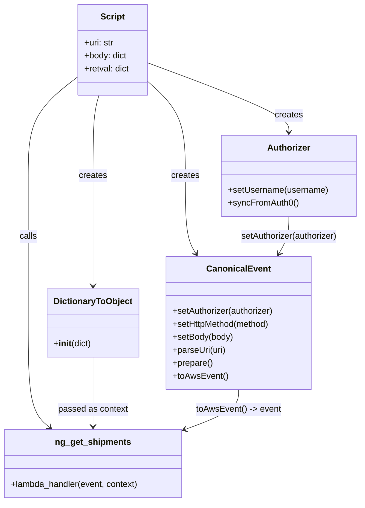

# Diagram: tools/ide_local_testing/localTest/test/ngShipment/getBatchNgShipments.py


> Auto-generated by Obscura crawlers

## Diagram 1



### SVG

<svg id="container" width="666.083984375" xmlns="http://www.w3.org/2000/svg" class="classDiagram" height="928" viewBox="0 0 666.083984375 928" role="graphics-document document" aria-roledescription="class"><style>#container{font-family:"trebuchet ms",verdana,arial,sans-serif;font-size:16px;fill:#333;}@keyframes edge-animation-frame{from{stroke-dashoffset:0;}}@keyframes dash{to{stroke-dashoffset:0;}}#container .edge-animation-slow{stroke-dasharray:9,5!important;stroke-dashoffset:900;animation:dash 50s linear infinite;stroke-linecap:round;}#container .edge-animation-fast{stroke-dasharray:9,5!important;stroke-dashoffset:900;animation:dash 20s linear infinite;stroke-linecap:round;}#container .error-icon{fill:#552222;}#container .error-text{fill:#552222;stroke:#552222;}#container .edge-thickness-normal{stroke-width:1px;}#container .edge-thickness-thick{stroke-width:3.5px;}#container .edge-pattern-solid{stroke-dasharray:0;}#container .edge-thickness-invisible{stroke-width:0;fill:none;}#container .edge-pattern-dashed{stroke-dasharray:3;}#container .edge-pattern-dotted{stroke-dasharray:2;}#container .marker{fill:#333333;stroke:#333333;}#container .marker.cross{stroke:#333333;}#container svg{font-family:"trebuchet ms",verdana,arial,sans-serif;font-size:16px;}#container p{margin:0;}#container g.classGroup text{fill:#9370DB;stroke:none;font-family:"trebuchet ms",verdana,arial,sans-serif;font-size:10px;}#container g.classGroup text .title{font-weight:bolder;}#container .nodeLabel,#container .edgeLabel{color:#131300;}#container .edgeLabel .label rect{fill:#ECECFF;}#container .label text{fill:#131300;}#container .labelBkg{background:#ECECFF;}#container .edgeLabel .label span{background:#ECECFF;}#container .classTitle{font-weight:bolder;}#container .node rect,#container .node circle,#container .node ellipse,#container .node polygon,#container .node path{fill:#ECECFF;stroke:#9370DB;stroke-width:1px;}#container .divider{stroke:#9370DB;stroke-width:1;}#container g.clickable{cursor:pointer;}#container g.classGroup rect{fill:#ECECFF;stroke:#9370DB;}#container g.classGroup line{stroke:#9370DB;stroke-width:1;}#container .classLabel .box{stroke:none;stroke-width:0;fill:#ECECFF;opacity:0.5;}#container .classLabel .label{fill:#9370DB;font-size:10px;}#container .relation{stroke:#333333;stroke-width:1;fill:none;}#container .dashed-line{stroke-dasharray:3;}#container .dotted-line{stroke-dasharray:1 2;}#container #compositionStart,#container .composition{fill:#333333!important;stroke:#333333!important;stroke-width:1;}#container #compositionEnd,#container .composition{fill:#333333!important;stroke:#333333!important;stroke-width:1;}#container #dependencyStart,#container .dependency{fill:#333333!important;stroke:#333333!important;stroke-width:1;}#container #dependencyStart,#container .dependency{fill:#333333!important;stroke:#333333!important;stroke-width:1;}#container #extensionStart,#container .extension{fill:transparent!important;stroke:#333333!important;stroke-width:1;}#container #extensionEnd,#container .extension{fill:transparent!important;stroke:#333333!important;stroke-width:1;}#container #aggregationStart,#container .aggregation{fill:transparent!important;stroke:#333333!important;stroke-width:1;}#container #aggregationEnd,#container .aggregation{fill:transparent!important;stroke:#333333!important;stroke-width:1;}#container #lollipopStart,#container .lollipop{fill:#ECECFF!important;stroke:#333333!important;stroke-width:1;}#container #lollipopEnd,#container .lollipop{fill:#ECECFF!important;stroke:#333333!important;stroke-width:1;}#container .edgeTerminals{font-size:11px;line-height:initial;}#container .classTitleText{text-anchor:middle;font-size:18px;fill:#333;}#container .label-icon{display:inline-block;height:1em;overflow:visible;vertical-align:-0.125em;}#container .node .label-icon path{fill:currentColor;stroke:revert;stroke-width:revert;}#container :root{--mermaid-font-family:"trebuchet ms",verdana,arial,sans-serif;}</style><g><defs><marker id="container_class-aggregationStart" class="marker aggregation class" refX="18" refY="7" markerWidth="190" markerHeight="240" orient="auto"><path d="M 18,7 L9,13 L1,7 L9,1 Z"></path></marker></defs><defs><marker id="container_class-aggregationEnd" class="marker aggregation class" refX="1" refY="7" markerWidth="20" markerHeight="28" orient="auto"><path d="M 18,7 L9,13 L1,7 L9,1 Z"></path></marker></defs><defs><marker id="container_class-extensionStart" class="marker extension class" refX="18" refY="7" markerWidth="190" markerHeight="240" orient="auto"><path d="M 1,7 L18,13 V 1 Z"></path></marker></defs><defs><marker id="container_class-extensionEnd" class="marker extension class" refX="1" refY="7" markerWidth="20" markerHeight="28" orient="auto"><path d="M 1,1 V 13 L18,7 Z"></path></marker></defs><defs><marker id="container_class-compositionStart" class="marker composition class" refX="18" refY="7" markerWidth="190" markerHeight="240" orient="auto"><path d="M 18,7 L9,13 L1,7 L9,1 Z"></path></marker></defs><defs><marker id="container_class-compositionEnd" class="marker composition class" refX="1" refY="7" markerWidth="20" markerHeight="28" orient="auto"><path d="M 18,7 L9,13 L1,7 L9,1 Z"></path></marker></defs><defs><marker id="container_class-dependencyStart" class="marker dependency class" refX="6" refY="7" markerWidth="190" markerHeight="240" orient="auto"><path d="M 5,7 L9,13 L1,7 L9,1 Z"></path></marker></defs><defs><marker id="container_class-dependencyEnd" class="marker dependency class" refX="13" refY="7" markerWidth="20" markerHeight="28" orient="auto"><path d="M 18,7 L9,13 L14,7 L9,1 Z"></path></marker></defs><defs><marker id="container_class-lollipopStart" class="marker lollipop class" refX="13" refY="7" markerWidth="190" markerHeight="240" orient="auto"><circle stroke="black" fill="transparent" cx="7" cy="7" r="6"></circle></marker></defs><defs><marker id="container_class-lollipopEnd" class="marker lollipop class" refX="1" refY="7" markerWidth="190" markerHeight="240" orient="auto"><circle stroke="black" fill="transparent" cx="7" cy="7" r="6"></circle></marker></defs><g class="root"><g class="clusters"></g><g class="edgePaths"><path d="M275.254,116.364L318.369,132.47C361.485,148.576,447.716,180.788,490.832,202.061C533.947,223.333,533.947,233.667,533.947,238.833L533.947,244" id="id_Script_Authorizer_1" class="edge-thickness-normal edge-pattern-solid relation" style=";;;" data-edge="true" data-et="edge" data-id="id_Script_Authorizer_1" data-points="W3sieCI6Mjc1LjI1MzkwNjI1LCJ5IjoxMTYuMzY0MTU5MzA1Mzc1NX0seyJ4Ijo1MzMuOTQ3MjY1NjI1LCJ5IjoyMTN9LHsieCI6NTMzLjk0NzI2NTYyNSwieSI6MjUwfV0=" marker-end="url(#container_class-dependencyEnd)"></path><path d="M275.254,151.02L286.67,161.35C298.085,171.68,320.917,192.34,332.332,221.337C343.748,250.333,343.748,287.667,343.748,325C343.748,362.333,343.748,399.667,346.987,423.646C350.226,447.626,356.704,458.251,359.943,463.564L363.182,468.877" id="id_Script_CanonicalEvent_2" class="edge-thickness-normal edge-pattern-solid relation" style=";;;" data-edge="true" data-et="edge" data-id="id_Script_CanonicalEvent_2" data-points="W3sieCI6Mjc1LjI1MzkwNjI1LCJ5IjoxNTEuMDE5ODIwOTI1MTcxMjV9LHsieCI6MzQzLjc0ODA0Njg3NSwieSI6MjEzfSx7IngiOjM0My43NDgwNDY4NzUsInkiOjMyNX0seyJ4IjozNDMuNzQ4MDQ2ODc1LCJ5Ijo0Mzd9LHsieCI6MzY2LjMwNTMxMDA1ODU5Mzc2LCJ5Ijo0NzR9XQ==" marker-end="url(#container_class-dependencyEnd)"></path><path d="M184.92,176L183.077,182.167C181.233,188.333,177.546,200.667,175.703,225.5C173.859,250.333,173.859,287.667,173.859,325C173.859,362.333,173.859,399.667,173.859,433.5C173.859,467.333,173.859,497.667,173.859,512.833L173.859,528" id="id_Script_DictionaryToObject_3" class="edge-thickness-normal edge-pattern-solid relation" style=";;;" data-edge="true" data-et="edge" data-id="id_Script_DictionaryToObject_3" data-points="W3sieCI6MTg0LjkyMDE5NjI4MDk5MTc1LCJ5IjoxNzZ9LHsieCI6MTczLjg1OTM3NSwieSI6MjEzfSx7IngiOjE3My44NTkzNzUsInkiOjMyNX0seyJ4IjoxNzMuODU5Mzc1LCJ5Ijo0Mzd9LHsieCI6MTczLjg1OTM3NSwieSI6NTM0fV0=" marker-end="url(#container_class-dependencyEnd)"></path><path d="M144.809,143.455L130.117,155.046C115.424,166.637,86.04,189.818,71.348,220.076C56.656,250.333,56.656,287.667,56.656,325C56.656,362.333,56.656,399.667,56.656,445C56.656,490.333,56.656,543.667,56.656,597C56.656,650.333,56.656,703.667,63.123,735.851C69.59,768.035,82.523,779.07,88.99,784.588L95.457,790.106" id="id_Script_ng_get_shipments_4" class="edge-thickness-normal edge-pattern-solid relation" style=";;;" data-edge="true" data-et="edge" data-id="id_Script_ng_get_shipments_4" data-points="W3sieCI6MTQ0LjgwODU5Mzc1LCJ5IjoxNDMuNDU1MjAwNjkyNzQ2NTN9LHsieCI6NTYuNjU2MjUsInkiOjIxM30seyJ4Ijo1Ni42NTYyNSwieSI6MzI1fSx7IngiOjU2LjY1NjI1LCJ5Ijo0Mzd9LHsieCI6NTYuNjU2MjUsInkiOjU5N30seyJ4Ijo1Ni42NTYyNSwieSI6NzU3fSx7IngiOjEwMC4wMjE0MDYyNSwieSI6Nzk0fV0=" marker-end="url(#container_class-dependencyEnd)"></path><path d="M533.947,400L533.947,406.167C533.947,412.333,533.947,424.667,530.877,436.135C527.807,447.603,521.668,458.205,518.598,463.506L515.528,468.808" id="id_Authorizer_CanonicalEvent_5" class="edge-thickness-normal edge-pattern-solid relation" style=";;;" data-edge="true" data-et="edge" data-id="id_Authorizer_CanonicalEvent_5" data-points="W3sieCI6NTMzLjk0NzI2NTYyNSwieSI6NDAwfSx7IngiOjUzMy45NDcyNjU2MjUsInkiOjQzN30seyJ4Ijo1MTIuNTIwOTU5NDcyNjU2MywieSI6NDc0fV0=" marker-end="url(#container_class-dependencyEnd)"></path><path d="M173.859,660L173.859,676.167C173.859,692.333,173.859,724.667,173.859,746C173.859,767.333,173.859,777.667,173.859,782.833L173.859,788" id="id_DictionaryToObject_ng_get_shipments_6" class="edge-thickness-normal edge-pattern-solid relation" style=";;;" data-edge="true" data-et="edge" data-id="id_DictionaryToObject_ng_get_shipments_6" data-points="W3sieCI6MTczLjg1OTM3NSwieSI6NjYwfSx7IngiOjE3My44NTkzNzUsInkiOjc1N30seyJ4IjoxNzMuODU5Mzc1LCJ5Ijo3OTR9XQ==" marker-end="url(#container_class-dependencyEnd)"></path><path d="M441.293,720L441.293,726.167C441.293,732.333,441.293,744.667,425.301,756.813C409.308,768.96,377.323,780.92,361.331,786.9L345.339,792.88" id="id_CanonicalEvent_ng_get_shipments_7" class="edge-thickness-normal edge-pattern-solid relation" style=";;;" data-edge="true" data-et="edge" data-id="id_CanonicalEvent_ng_get_shipments_7" data-points="W3sieCI6NDQxLjI5Mjk2ODc1LCJ5Ijo3MjB9LHsieCI6NDQxLjI5Mjk2ODc1LCJ5Ijo3NTd9LHsieCI6MzM5LjcxODc1LCJ5Ijo3OTQuOTgxMDk5Mjc5OTAzfV0=" marker-end="url(#container_class-dependencyEnd)"></path></g><g class="edgeLabels"><g class="edgeLabel" transform="translate(533.947265625, 213)"><g class="label" data-id="id_Script_Authorizer_1" transform="translate(-26.171875, -12)"><foreignObject width="52.34375" height="24"><div xmlns="http://www.w3.org/1999/xhtml" class="labelBkg" style="display: table-cell; white-space: nowrap; line-height: 1.5; max-width: 200px; text-align: center;"><span class="edgeLabel"><p>creates</p></span></div></foreignObject></g></g><g class="edgeLabel" transform="translate(343.748046875, 325)"><g class="label" data-id="id_Script_CanonicalEvent_2" transform="translate(-26.171875, -12)"><foreignObject width="52.34375" height="24"><div xmlns="http://www.w3.org/1999/xhtml" class="labelBkg" style="display: table-cell; white-space: nowrap; line-height: 1.5; max-width: 200px; text-align: center;"><span class="edgeLabel"><p>creates</p></span></div></foreignObject></g></g><g class="edgeLabel" transform="translate(173.859375, 325)"><g class="label" data-id="id_Script_DictionaryToObject_3" transform="translate(-26.171875, -12)"><foreignObject width="52.34375" height="24"><div xmlns="http://www.w3.org/1999/xhtml" class="labelBkg" style="display: table-cell; white-space: nowrap; line-height: 1.5; max-width: 200px; text-align: center;"><span class="edgeLabel"><p>creates</p></span></div></foreignObject></g></g><g class="edgeLabel" transform="translate(56.65625, 437)"><g class="label" data-id="id_Script_ng_get_shipments_4" transform="translate(-16.4453125, -12)"><foreignObject width="32.890625" height="24"><div xmlns="http://www.w3.org/1999/xhtml" class="labelBkg" style="display: table-cell; white-space: nowrap; line-height: 1.5; max-width: 200px; text-align: center;"><span class="edgeLabel"><p>calls</p></span></div></foreignObject></g></g><g class="edgeLabel" transform="translate(533.947265625, 437)"><g class="label" data-id="id_Authorizer_CanonicalEvent_5" transform="translate(-91.3828125, -12)"><foreignObject width="182.765625" height="24"><div xmlns="http://www.w3.org/1999/xhtml" class="labelBkg" style="display: table-cell; white-space: nowrap; line-height: 1.5; max-width: 200px; text-align: center;"><span class="edgeLabel"><p>setAuthorizer(authorizer)</p></span></div></foreignObject></g></g><g class="edgeLabel" transform="translate(173.859375, 757)"><g class="label" data-id="id_DictionaryToObject_ng_get_shipments_6" transform="translate(-64.578125, -12)"><foreignObject width="129.15625" height="24"><div xmlns="http://www.w3.org/1999/xhtml" class="labelBkg" style="display: table-cell; white-space: nowrap; line-height: 1.5; max-width: 200px; text-align: center;"><span class="edgeLabel"><p>passed as context</p></span></div></foreignObject></g></g><g class="edgeLabel" transform="translate(441.29296875, 757)"><g class="label" data-id="id_CanonicalEvent_ng_get_shipments_7" transform="translate(-78.2734375, -12)"><foreignObject width="156.546875" height="24"><div xmlns="http://www.w3.org/1999/xhtml" class="labelBkg" style="display: table-cell; white-space: nowrap; line-height: 1.5; max-width: 200px; text-align: center;"><span class="edgeLabel"><p>toAwsEvent() -&gt; event</p></span></div></foreignObject></g></g></g><g class="nodes"><g class="node default" id="classId-Script-0" transform="translate(210.03125, 92)"><g class="basic label-container"><path d="M-65.22265625 -84 L65.22265625 -84 L65.22265625 84 L-65.22265625 84" stroke="none" stroke-width="0" fill="#ECECFF" style=""></path><path d="M-65.22265625 -84 C-35.45523348810124 -84, -5.6878107262024855 -84, 65.22265625 -84 M-65.22265625 -84 C-15.743557820348535 -84, 33.73554060930293 -84, 65.22265625 -84 M65.22265625 -84 C65.22265625 -17.791809156751967, 65.22265625 48.41638168649607, 65.22265625 84 M65.22265625 -84 C65.22265625 -37.08494360421032, 65.22265625 9.830112791579353, 65.22265625 84 M65.22265625 84 C25.921969086846083 84, -13.378718076307834 84, -65.22265625 84 M65.22265625 84 C32.23961934641855 84, -0.7434175571628998 84, -65.22265625 84 M-65.22265625 84 C-65.22265625 30.21146072521846, -65.22265625 -23.577078549563083, -65.22265625 -84 M-65.22265625 84 C-65.22265625 36.895819924958786, -65.22265625 -10.208360150082427, -65.22265625 -84" stroke="#9370DB" stroke-width="1.3" fill="none" stroke-dasharray="0 0" style=""></path></g><g class="annotation-group text" transform="translate(0, -60)"></g><g class="label-group text" transform="translate(-21.7421875, -60)"><g class="label" style="font-weight: bolder" transform="translate(0,-12)"><foreignObject width="43.484375" height="24"><div xmlns="http://www.w3.org/1999/xhtml" style="display: table-cell; white-space: nowrap; line-height: 1.5; max-width: 93px; text-align: center;"><span class="nodeLabel markdown-node-label" style=""><p>Script</p></span></div></foreignObject></g></g><g class="members-group text" transform="translate(-53.22265625, -12)"><g class="label" style="" transform="translate(0,-12)"><foreignObject width="55.5" height="24"><div xmlns="http://www.w3.org/1999/xhtml" style="display: table-cell; white-space: nowrap; line-height: 1.5; max-width: 114px; text-align: center;"><span class="nodeLabel markdown-node-label" style=""><p>+uri: str</p></span></div></foreignObject></g><g class="label" style="" transform="translate(0,12)"><foreignObject width="79.921875" height="24"><div xmlns="http://www.w3.org/1999/xhtml" style="display: table-cell; white-space: nowrap; line-height: 1.5; max-width: 138px; text-align: center;"><span class="nodeLabel markdown-node-label" style=""><p>+body: dict</p></span></div></foreignObject></g><g class="label" style="" transform="translate(0,36)"><foreignObject width="84.703125" height="24"><div xmlns="http://www.w3.org/1999/xhtml" style="display: table-cell; white-space: nowrap; line-height: 1.5; max-width: 142px; text-align: center;"><span class="nodeLabel markdown-node-label" style=""><p>+retval: dict</p></span></div></foreignObject></g></g><g class="methods-group text" transform="translate(-53.22265625, 84)"></g><g class="divider" style=""><path d="M-65.22265625 -36 C-30.87170969825494 -36, 3.4792368534901215 -36, 65.22265625 -36 M-65.22265625 -36 C-20.621468582897656 -36, 23.97971908420469 -36, 65.22265625 -36" stroke="#9370DB" stroke-width="1.3" fill="none" stroke-dasharray="0 0" style=""></path></g><g class="divider" style=""><path d="M-65.22265625 60 C-29.758466098229107 60, 5.705724053541786 60, 65.22265625 60 M-65.22265625 60 C-38.08003824070324 60, -10.937420231406477 60, 65.22265625 60" stroke="#9370DB" stroke-width="1.3" fill="none" stroke-dasharray="0 0" style=""></path></g></g><g class="node default" id="classId-Authorizer-1" transform="translate(533.947265625, 325)"><g class="basic label-container"><path d="M-124.13671875 -75 L124.13671875 -75 L124.13671875 75 L-124.13671875 75" stroke="none" stroke-width="0" fill="#ECECFF" style=""></path><path d="M-124.13671875 -75 C-50.98333245582327 -75, 22.170053838353454 -75, 124.13671875 -75 M-124.13671875 -75 C-37.876339466239116 -75, 48.38403981752177 -75, 124.13671875 -75 M124.13671875 -75 C124.13671875 -34.373734724179094, 124.13671875 6.2525305516418115, 124.13671875 75 M124.13671875 -75 C124.13671875 -19.664344734966846, 124.13671875 35.67131053006631, 124.13671875 75 M124.13671875 75 C35.220163478040874 75, -53.69639179391825 75, -124.13671875 75 M124.13671875 75 C49.740302262233726 75, -24.656114225532548 75, -124.13671875 75 M-124.13671875 75 C-124.13671875 44.692448301667746, -124.13671875 14.384896603335491, -124.13671875 -75 M-124.13671875 75 C-124.13671875 36.354333750113966, -124.13671875 -2.291332499772068, -124.13671875 -75" stroke="#9370DB" stroke-width="1.3" fill="none" stroke-dasharray="0 0" style=""></path></g><g class="annotation-group text" transform="translate(0, -51)"></g><g class="label-group text" transform="translate(-38.3671875, -51)"><g class="label" style="font-weight: bolder" transform="translate(0,-12)"><foreignObject width="76.734375" height="24"><div xmlns="http://www.w3.org/1999/xhtml" style="display: table-cell; white-space: nowrap; line-height: 1.5; max-width: 126px; text-align: center;"><span class="nodeLabel markdown-node-label" style=""><p>Authorizer</p></span></div></foreignObject></g></g><g class="members-group text" transform="translate(-112.13671875, -3)"></g><g class="methods-group text" transform="translate(-112.13671875, 27)"><g class="label" style="" transform="translate(0,-12)"><foreignObject width="185.90625" height="24"><div xmlns="http://www.w3.org/1999/xhtml" style="display: table-cell; white-space: nowrap; line-height: 1.5; max-width: 243px; text-align: center;"><span class="nodeLabel markdown-node-label" style=""><p>+setUsername(username)</p></span></div></foreignObject></g><g class="label" style="" transform="translate(0,12)"><foreignObject width="129.0625" height="24"><div xmlns="http://www.w3.org/1999/xhtml" style="display: table-cell; white-space: nowrap; line-height: 1.5; max-width: 186px; text-align: center;"><span class="nodeLabel markdown-node-label" style=""><p>+syncFromAuth0()</p></span></div></foreignObject></g></g><g class="divider" style=""><path d="M-124.13671875 -27 C-25.510768900101255 -27, 73.11518094979749 -27, 124.13671875 -27 M-124.13671875 -27 C-56.44778274672905 -27, 11.241153256541907 -27, 124.13671875 -27" stroke="#9370DB" stroke-width="1.3" fill="none" stroke-dasharray="0 0" style=""></path></g><g class="divider" style=""><path d="M-124.13671875 -3 C-45.44583427092299 -3, 33.24505020815403 -3, 124.13671875 -3 M-124.13671875 -3 C-37.56524628912419 -3, 49.00622617175162 -3, 124.13671875 -3" stroke="#9370DB" stroke-width="1.3" fill="none" stroke-dasharray="0 0" style=""></path></g></g><g class="node default" id="classId-CanonicalEvent-2" transform="translate(441.29296875, 597)"><g class="basic label-container"><path d="M-135.23046875 -123 L135.23046875 -123 L135.23046875 123 L-135.23046875 123" stroke="none" stroke-width="0" fill="#ECECFF" style=""></path><path d="M-135.23046875 -123 C-54.6527789474619 -123, 25.924910855076206 -123, 135.23046875 -123 M-135.23046875 -123 C-60.22309138523079 -123, 14.784285979538424 -123, 135.23046875 -123 M135.23046875 -123 C135.23046875 -71.25770769735061, 135.23046875 -19.515415394701208, 135.23046875 123 M135.23046875 -123 C135.23046875 -54.1739086299969, 135.23046875 14.652182740006197, 135.23046875 123 M135.23046875 123 C60.19425494475853 123, -14.841958860482947 123, -135.23046875 123 M135.23046875 123 C43.00137841787891 123, -49.22771191424218 123, -135.23046875 123 M-135.23046875 123 C-135.23046875 50.01513055548227, -135.23046875 -22.969738889035455, -135.23046875 -123 M-135.23046875 123 C-135.23046875 64.20849018149997, -135.23046875 5.416980362999951, -135.23046875 -123" stroke="#9370DB" stroke-width="1.3" fill="none" stroke-dasharray="0 0" style=""></path></g><g class="annotation-group text" transform="translate(0, -99)"></g><g class="label-group text" transform="translate(-55.7109375, -99)"><g class="label" style="font-weight: bolder" transform="translate(0,-12)"><foreignObject width="111.421875" height="24"><div xmlns="http://www.w3.org/1999/xhtml" style="display: table-cell; white-space: nowrap; line-height: 1.5; max-width: 161px; text-align: center;"><span class="nodeLabel markdown-node-label" style=""><p>CanonicalEvent</p></span></div></foreignObject></g></g><g class="members-group text" transform="translate(-123.23046875, -51)"></g><g class="methods-group text" transform="translate(-123.23046875, -21)"><g class="label" style="" transform="translate(0,-12)"><foreignObject width="190.75" height="24"><div xmlns="http://www.w3.org/1999/xhtml" style="display: table-cell; white-space: nowrap; line-height: 1.5; max-width: 248px; text-align: center;"><span class="nodeLabel markdown-node-label" style=""><p>+setAuthorizer(authorizer)</p></span></div></foreignObject></g><g class="label" style="" transform="translate(0,12)"><foreignObject width="184" height="24"><div xmlns="http://www.w3.org/1999/xhtml" style="display: table-cell; white-space: nowrap; line-height: 1.5; max-width: 241px; text-align: center;"><span class="nodeLabel markdown-node-label" style=""><p>+setHttpMethod(method)</p></span></div></foreignObject></g><g class="label" style="" transform="translate(0,36)"><foreignObject width="113.125" height="24"><div xmlns="http://www.w3.org/1999/xhtml" style="display: table-cell; white-space: nowrap; line-height: 1.5; max-width: 170px; text-align: center;"><span class="nodeLabel markdown-node-label" style=""><p>+setBody(body)</p></span></div></foreignObject></g><g class="label" style="" transform="translate(0,60)"><foreignObject width="99.8125" height="24"><div xmlns="http://www.w3.org/1999/xhtml" style="display: table-cell; white-space: nowrap; line-height: 1.5; max-width: 157px; text-align: center;"><span class="nodeLabel markdown-node-label" style=""><p>+parseUri(uri)</p></span></div></foreignObject></g><g class="label" style="" transform="translate(0,84)"><foreignObject width="74.75" height="24"><div xmlns="http://www.w3.org/1999/xhtml" style="display: table-cell; white-space: nowrap; line-height: 1.5; max-width: 132px; text-align: center;"><span class="nodeLabel markdown-node-label" style=""><p>+prepare()</p></span></div></foreignObject></g><g class="label" style="" transform="translate(0,108)"><foreignObject width="101.1875" height="24"><div xmlns="http://www.w3.org/1999/xhtml" style="display: table-cell; white-space: nowrap; line-height: 1.5; max-width: 159px; text-align: center;"><span class="nodeLabel markdown-node-label" style=""><p>+toAwsEvent()</p></span></div></foreignObject></g></g><g class="divider" style=""><path d="M-135.23046875 -75 C-41.20907204442965 -75, 52.81232466114071 -75, 135.23046875 -75 M-135.23046875 -75 C-80.18385773562298 -75, -25.13724672124596 -75, 135.23046875 -75" stroke="#9370DB" stroke-width="1.3" fill="none" stroke-dasharray="0 0" style=""></path></g><g class="divider" style=""><path d="M-135.23046875 -51 C-36.27271403111703 -51, 62.685040687765934 -51, 135.23046875 -51 M-135.23046875 -51 C-53.46202998221969 -51, 28.30640878556062 -51, 135.23046875 -51" stroke="#9370DB" stroke-width="1.3" fill="none" stroke-dasharray="0 0" style=""></path></g></g><g class="node default" id="classId-DictionaryToObject-3" transform="translate(173.859375, 597)"><g class="basic label-container"><path d="M-82.203125 -63 L82.203125 -63 L82.203125 63 L-82.203125 63" stroke="none" stroke-width="0" fill="#ECECFF" style=""></path><path d="M-82.203125 -63 C-40.136117411071815 -63, 1.9308901778563694 -63, 82.203125 -63 M-82.203125 -63 C-17.538974169516223 -63, 47.125176660967554 -63, 82.203125 -63 M82.203125 -63 C82.203125 -32.32940581752848, 82.203125 -1.6588116350569564, 82.203125 63 M82.203125 -63 C82.203125 -22.586031552918776, 82.203125 17.82793689416245, 82.203125 63 M82.203125 63 C33.22050774155398 63, -15.762109516892039 63, -82.203125 63 M82.203125 63 C27.552908416061356 63, -27.097308167877287 63, -82.203125 63 M-82.203125 63 C-82.203125 27.1615044065801, -82.203125 -8.6769911868398, -82.203125 -63 M-82.203125 63 C-82.203125 25.09021642345808, -82.203125 -12.819567153083838, -82.203125 -63" stroke="#9370DB" stroke-width="1.3" fill="none" stroke-dasharray="0 0" style=""></path></g><g class="annotation-group text" transform="translate(0, -39)"></g><g class="label-group text" transform="translate(-70.109375, -39)"><g class="label" style="font-weight: bolder" transform="translate(0,-12)"><foreignObject width="140.21875" height="24"><div xmlns="http://www.w3.org/1999/xhtml" style="display: table-cell; white-space: nowrap; line-height: 1.5; max-width: 188px; text-align: center;"><span class="nodeLabel markdown-node-label" style=""><p>DictionaryToObject</p></span></div></foreignObject></g></g><g class="members-group text" transform="translate(-70.203125, 9)"></g><g class="methods-group text" transform="translate(-70.203125, 39)"><g class="label" style="" transform="translate(0,-12)"><foreignObject width="70.296875" height="24"><div xmlns="http://www.w3.org/1999/xhtml" style="display: table-cell; white-space: nowrap; line-height: 1.5; max-width: 159px; text-align: center;"><span class="nodeLabel markdown-node-label" style=""><p>+<strong>init</strong>(dict)</p></span></div></foreignObject></g></g><g class="divider" style=""><path d="M-82.203125 -15 C-38.920985651990605 -15, 4.361153696018789 -15, 82.203125 -15 M-82.203125 -15 C-37.0617474824478 -15, 8.079630035104401 -15, 82.203125 -15" stroke="#9370DB" stroke-width="1.3" fill="none" stroke-dasharray="0 0" style=""></path></g><g class="divider" style=""><path d="M-82.203125 9 C-31.620704333320482 9, 18.961716333359036 9, 82.203125 9 M-82.203125 9 C-19.76947374061426 9, 42.66417751877148 9, 82.203125 9" stroke="#9370DB" stroke-width="1.3" fill="none" stroke-dasharray="0 0" style=""></path></g></g><g class="node default" id="classId-ng_get_shipments-4" transform="translate(173.859375, 857)"><g class="basic label-container"><path d="M-165.859375 -63 L165.859375 -63 L165.859375 63 L-165.859375 63" stroke="none" stroke-width="0" fill="#ECECFF" style=""></path><path d="M-165.859375 -63 C-58.02667039754111 -63, 49.80603420491778 -63, 165.859375 -63 M-165.859375 -63 C-94.37218071574402 -63, -22.884986431488045 -63, 165.859375 -63 M165.859375 -63 C165.859375 -24.799143585244273, 165.859375 13.401712829511453, 165.859375 63 M165.859375 -63 C165.859375 -19.767821555399507, 165.859375 23.464356889200985, 165.859375 63 M165.859375 63 C63.885381672408556 63, -38.08861165518289 63, -165.859375 63 M165.859375 63 C63.7361158816576 63, -38.38714323668481 63, -165.859375 63 M-165.859375 63 C-165.859375 29.067001932361336, -165.859375 -4.865996135277328, -165.859375 -63 M-165.859375 63 C-165.859375 13.782767214320081, -165.859375 -35.43446557135984, -165.859375 -63" stroke="#9370DB" stroke-width="1.3" fill="none" stroke-dasharray="0 0" style=""></path></g><g class="annotation-group text" transform="translate(0, -39)"></g><g class="label-group text" transform="translate(-67.53125, -39)"><g class="label" style="font-weight: bolder" transform="translate(0,-12)"><foreignObject width="135.0625" height="24"><div xmlns="http://www.w3.org/1999/xhtml" style="display: table-cell; white-space: nowrap; line-height: 1.5; max-width: 183px; text-align: center;"><span class="nodeLabel markdown-node-label" style=""><p>ng_get_shipments</p></span></div></foreignObject></g></g><g class="members-group text" transform="translate(-153.859375, 9)"></g><g class="methods-group text" transform="translate(-153.859375, 39)"><g class="label" style="" transform="translate(0,-12)"><foreignObject width="240.1875" height="24"><div xmlns="http://www.w3.org/1999/xhtml" style="display: table-cell; white-space: nowrap; line-height: 1.5; max-width: 298px; text-align: center;"><span class="nodeLabel markdown-node-label" style=""><p>+lambda_handler(event, context)</p></span></div></foreignObject></g></g><g class="divider" style=""><path d="M-165.859375 -15 C-69.83408435599972 -15, 26.191206288000558 -15, 165.859375 -15 M-165.859375 -15 C-66.7311480048944 -15, 32.39707899021121 -15, 165.859375 -15" stroke="#9370DB" stroke-width="1.3" fill="none" stroke-dasharray="0 0" style=""></path></g><g class="divider" style=""><path d="M-165.859375 9 C-79.63113399054888 9, 6.59710701890225 9, 165.859375 9 M-165.859375 9 C-49.214605077848276 9, 67.43016484430345 9, 165.859375 9" stroke="#9370DB" stroke-width="1.3" fill="none" stroke-dasharray="0 0" style=""></path></g></g></g></g></g></svg>

## Diagram 2

```mermaid
flowchart TD
    A[Start: script executes] --> B[Create Authorizer\n.setUsername(...)\n.syncFromAuth0()]
    B --> C[Create CanonicalEvent\n.setAuthorizer(...)\n.setHttpMethod(POST)\n.setBody(body)\n.parseUri(uri)\n.prepare()\n.toAwsEvent()]
    A --> D[Create DictionaryToObject\n(function metadata)]
    C --> E[Call ng_get_shipments.lambda_handler(event, context)]
    D --> E
    E --> F{retval and retval.body?}
    F -- yes --> G[Parse JSON body\npretty print]
    F -- no --> H[prettyRetval = ""]
    G --> I[print(prettyRetval)]
    H --> I
    I --> Z[End]
```

> SVG rendering failed for this diagram.
