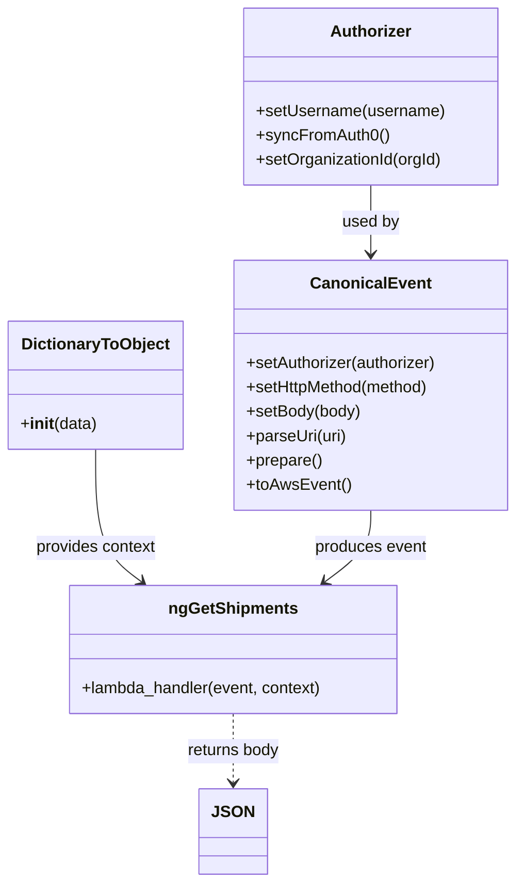

# Diagram: tools/ide_local_testing/localTest/test/ngShipment/ngShipmentsSearchByRouteId.py


> Auto-generated by Obscura crawlers

## Diagram 1



### SVG

<svg id="container" width="506.0078125" xmlns="http://www.w3.org/2000/svg" class="classDiagram" height="868" viewBox="0 0 506.0078125 868" role="graphics-document document" aria-roledescription="class"><style>#container{font-family:"trebuchet ms",verdana,arial,sans-serif;font-size:16px;fill:#333;}@keyframes edge-animation-frame{from{stroke-dashoffset:0;}}@keyframes dash{to{stroke-dashoffset:0;}}#container .edge-animation-slow{stroke-dasharray:9,5!important;stroke-dashoffset:900;animation:dash 50s linear infinite;stroke-linecap:round;}#container .edge-animation-fast{stroke-dasharray:9,5!important;stroke-dashoffset:900;animation:dash 20s linear infinite;stroke-linecap:round;}#container .error-icon{fill:#552222;}#container .error-text{fill:#552222;stroke:#552222;}#container .edge-thickness-normal{stroke-width:1px;}#container .edge-thickness-thick{stroke-width:3.5px;}#container .edge-pattern-solid{stroke-dasharray:0;}#container .edge-thickness-invisible{stroke-width:0;fill:none;}#container .edge-pattern-dashed{stroke-dasharray:3;}#container .edge-pattern-dotted{stroke-dasharray:2;}#container .marker{fill:#333333;stroke:#333333;}#container .marker.cross{stroke:#333333;}#container svg{font-family:"trebuchet ms",verdana,arial,sans-serif;font-size:16px;}#container p{margin:0;}#container g.classGroup text{fill:#9370DB;stroke:none;font-family:"trebuchet ms",verdana,arial,sans-serif;font-size:10px;}#container g.classGroup text .title{font-weight:bolder;}#container .nodeLabel,#container .edgeLabel{color:#131300;}#container .edgeLabel .label rect{fill:#ECECFF;}#container .label text{fill:#131300;}#container .labelBkg{background:#ECECFF;}#container .edgeLabel .label span{background:#ECECFF;}#container .classTitle{font-weight:bolder;}#container .node rect,#container .node circle,#container .node ellipse,#container .node polygon,#container .node path{fill:#ECECFF;stroke:#9370DB;stroke-width:1px;}#container .divider{stroke:#9370DB;stroke-width:1;}#container g.clickable{cursor:pointer;}#container g.classGroup rect{fill:#ECECFF;stroke:#9370DB;}#container g.classGroup line{stroke:#9370DB;stroke-width:1;}#container .classLabel .box{stroke:none;stroke-width:0;fill:#ECECFF;opacity:0.5;}#container .classLabel .label{fill:#9370DB;font-size:10px;}#container .relation{stroke:#333333;stroke-width:1;fill:none;}#container .dashed-line{stroke-dasharray:3;}#container .dotted-line{stroke-dasharray:1 2;}#container #compositionStart,#container .composition{fill:#333333!important;stroke:#333333!important;stroke-width:1;}#container #compositionEnd,#container .composition{fill:#333333!important;stroke:#333333!important;stroke-width:1;}#container #dependencyStart,#container .dependency{fill:#333333!important;stroke:#333333!important;stroke-width:1;}#container #dependencyStart,#container .dependency{fill:#333333!important;stroke:#333333!important;stroke-width:1;}#container #extensionStart,#container .extension{fill:transparent!important;stroke:#333333!important;stroke-width:1;}#container #extensionEnd,#container .extension{fill:transparent!important;stroke:#333333!important;stroke-width:1;}#container #aggregationStart,#container .aggregation{fill:transparent!important;stroke:#333333!important;stroke-width:1;}#container #aggregationEnd,#container .aggregation{fill:transparent!important;stroke:#333333!important;stroke-width:1;}#container #lollipopStart,#container .lollipop{fill:#ECECFF!important;stroke:#333333!important;stroke-width:1;}#container #lollipopEnd,#container .lollipop{fill:#ECECFF!important;stroke:#333333!important;stroke-width:1;}#container .edgeTerminals{font-size:11px;line-height:initial;}#container .classTitleText{text-anchor:middle;font-size:18px;fill:#333;}#container .label-icon{display:inline-block;height:1em;overflow:visible;vertical-align:-0.125em;}#container .node .label-icon path{fill:currentColor;stroke:revert;stroke-width:revert;}#container :root{--mermaid-font-family:"trebuchet ms",verdana,arial,sans-serif;}</style><g><defs><marker id="container_class-aggregationStart" class="marker aggregation class" refX="18" refY="7" markerWidth="190" markerHeight="240" orient="auto"><path d="M 18,7 L9,13 L1,7 L9,1 Z"></path></marker></defs><defs><marker id="container_class-aggregationEnd" class="marker aggregation class" refX="1" refY="7" markerWidth="20" markerHeight="28" orient="auto"><path d="M 18,7 L9,13 L1,7 L9,1 Z"></path></marker></defs><defs><marker id="container_class-extensionStart" class="marker extension class" refX="18" refY="7" markerWidth="190" markerHeight="240" orient="auto"><path d="M 1,7 L18,13 V 1 Z"></path></marker></defs><defs><marker id="container_class-extensionEnd" class="marker extension class" refX="1" refY="7" markerWidth="20" markerHeight="28" orient="auto"><path d="M 1,1 V 13 L18,7 Z"></path></marker></defs><defs><marker id="container_class-compositionStart" class="marker composition class" refX="18" refY="7" markerWidth="190" markerHeight="240" orient="auto"><path d="M 18,7 L9,13 L1,7 L9,1 Z"></path></marker></defs><defs><marker id="container_class-compositionEnd" class="marker composition class" refX="1" refY="7" markerWidth="20" markerHeight="28" orient="auto"><path d="M 18,7 L9,13 L1,7 L9,1 Z"></path></marker></defs><defs><marker id="container_class-dependencyStart" class="marker dependency class" refX="6" refY="7" markerWidth="190" markerHeight="240" orient="auto"><path d="M 5,7 L9,13 L1,7 L9,1 Z"></path></marker></defs><defs><marker id="container_class-dependencyEnd" class="marker dependency class" refX="13" refY="7" markerWidth="20" markerHeight="28" orient="auto"><path d="M 18,7 L9,13 L14,7 L9,1 Z"></path></marker></defs><defs><marker id="container_class-lollipopStart" class="marker lollipop class" refX="13" refY="7" markerWidth="190" markerHeight="240" orient="auto"><circle stroke="black" fill="transparent" cx="7" cy="7" r="6"></circle></marker></defs><defs><marker id="container_class-lollipopEnd" class="marker lollipop class" refX="1" refY="7" markerWidth="190" markerHeight="240" orient="auto"><circle stroke="black" fill="transparent" cx="7" cy="7" r="6"></circle></marker></defs><g class="root"><g class="clusters"></g><g class="edgePaths"><path d="M362.777,182L362.777,188.167C362.777,194.333,362.777,206.667,362.777,218C362.777,229.333,362.777,239.667,362.777,244.833L362.777,250" id="id_Authorizer_CanonicalEvent_1" class="edge-thickness-normal edge-pattern-solid relation" style=";;;" data-edge="true" data-et="edge" data-id="id_Authorizer_CanonicalEvent_1" data-points="W3sieCI6MzYyLjc3NzM0Mzc1LCJ5IjoxODJ9LHsieCI6MzYyLjc3NzM0Mzc1LCJ5IjoyMTl9LHsieCI6MzYyLjc3NzM0Mzc1LCJ5IjoyNTZ9XQ==" marker-end="url(#container_class-dependencyEnd)"></path><path d="M92.773,442L92.773,458.167C92.773,474.333,92.773,506.667,100.295,528.405C107.817,550.143,122.86,561.286,130.381,566.857L137.903,572.429" id="id_DictionaryToObject_ngGetShipments_2" class="edge-thickness-normal edge-pattern-solid relation" style=";;;" data-edge="true" data-et="edge" data-id="id_DictionaryToObject_ngGetShipments_2" data-points="W3sieCI6OTIuNzczNDM3NSwieSI6NDQyfSx7IngiOjkyLjc3MzQzNzUsInkiOjUzOX0seyJ4IjoxNDIuNzI0MTYwMTU2MjQ5OTgsInkiOjU3Nn1d" marker-end="url(#container_class-dependencyEnd)"></path><path d="M362.777,502L362.777,508.167C362.777,514.333,362.777,526.667,355.256,538.405C347.734,550.143,332.691,561.286,325.17,566.857L317.648,572.429" id="id_CanonicalEvent_ngGetShipments_3" class="edge-thickness-normal edge-pattern-solid relation" style=";;;" data-edge="true" data-et="edge" data-id="id_CanonicalEvent_ngGetShipments_3" data-points="W3sieCI6MzYyLjc3NzM0Mzc1LCJ5Ijo1MDJ9LHsieCI6MzYyLjc3NzM0Mzc1LCJ5Ijo1Mzl9LHsieCI6MzEyLjgyNjYyMTA5Mzc1LCJ5Ijo1NzZ9XQ==" marker-end="url(#container_class-dependencyEnd)"></path><path d="M227.775,702L227.775,708.167C227.775,714.333,227.775,726.667,227.775,738C227.775,749.333,227.775,759.667,227.775,764.833L227.775,770" id="id_ngGetShipments_JSON_4" class="edge-thickness-normal edge-pattern-dashed relation" style=";;;" data-edge="true" data-et="edge" data-id="id_ngGetShipments_JSON_4" data-points="W3sieCI6MjI3Ljc3NTM5MDYyNSwieSI6NzAyfSx7IngiOjIyNy43NzUzOTA2MjUsInkiOjczOX0seyJ4IjoyMjcuNzc1MzkwNjI1LCJ5Ijo3NzZ9XQ==" marker-end="url(#container_class-dependencyEnd)"></path></g><g class="edgeLabels"><g class="edgeLabel" transform="translate(362.77734375, 219)"><g class="label" data-id="id_Authorizer_CanonicalEvent_1" transform="translate(-28.3125, -12)"><foreignObject width="56.625" height="24"><div xmlns="http://www.w3.org/1999/xhtml" class="labelBkg" style="display: table-cell; white-space: nowrap; line-height: 1.5; max-width: 200px; text-align: center;"><span class="edgeLabel"><p>used by</p></span></div></foreignObject></g></g><g class="edgeLabel" transform="translate(92.7734375, 539)"><g class="label" data-id="id_DictionaryToObject_ngGetShipments_2" transform="translate(-60.28125, -12)"><foreignObject width="120.5625" height="24"><div xmlns="http://www.w3.org/1999/xhtml" class="labelBkg" style="display: table-cell; white-space: nowrap; line-height: 1.5; max-width: 200px; text-align: center;"><span class="edgeLabel"><p>provides context</p></span></div></foreignObject></g></g><g class="edgeLabel" transform="translate(362.77734375, 539)"><g class="label" data-id="id_CanonicalEvent_ngGetShipments_3" transform="translate(-55.765625, -12)"><foreignObject width="111.53125" height="24"><div xmlns="http://www.w3.org/1999/xhtml" class="labelBkg" style="display: table-cell; white-space: nowrap; line-height: 1.5; max-width: 200px; text-align: center;"><span class="edgeLabel"><p>produces event</p></span></div></foreignObject></g></g><g class="edgeLabel" transform="translate(227.775390625, 739)"><g class="label" data-id="id_ngGetShipments_JSON_4" transform="translate(-46.53125, -12)"><foreignObject width="93.0625" height="24"><div xmlns="http://www.w3.org/1999/xhtml" class="labelBkg" style="display: table-cell; white-space: nowrap; line-height: 1.5; max-width: 200px; text-align: center;"><span class="edgeLabel"><p>returns body</p></span></div></foreignObject></g></g></g><g class="nodes"><g class="node default" id="classId-ngGetShipments-0" transform="translate(227.775390625, 639)"><g class="basic label-container"><path d="M-162.421875 -63 L162.421875 -63 L162.421875 63 L-162.421875 63" stroke="none" stroke-width="0" fill="#ECECFF" style=""></path><path d="M-162.421875 -63 C-58.69756244679377 -63, 45.026750106412464 -63, 162.421875 -63 M-162.421875 -63 C-53.130462793108705 -63, 56.16094941378259 -63, 162.421875 -63 M162.421875 -63 C162.421875 -32.272583377969, 162.421875 -1.5451667559379914, 162.421875 63 M162.421875 -63 C162.421875 -30.726547570305875, 162.421875 1.546904859388249, 162.421875 63 M162.421875 63 C33.928848647105724 63, -94.56417770578855 63, -162.421875 63 M162.421875 63 C74.27332401214889 63, -13.875226975702219 63, -162.421875 63 M-162.421875 63 C-162.421875 24.02401569947117, -162.421875 -14.951968601057658, -162.421875 -63 M-162.421875 63 C-162.421875 22.232431293590004, -162.421875 -18.535137412819992, -162.421875 -63" stroke="#9370DB" stroke-width="1.3" fill="none" stroke-dasharray="0 0" style=""></path></g><g class="annotation-group text" transform="translate(0, -39)"></g><g class="label-group text" transform="translate(-60.65625, -39)"><g class="label" style="font-weight: bolder" transform="translate(0,-12)"><foreignObject width="121.3125" height="24"><div xmlns="http://www.w3.org/1999/xhtml" style="display: table-cell; white-space: nowrap; line-height: 1.5; max-width: 169px; text-align: center;"><span class="nodeLabel markdown-node-label" style=""><p>ngGetShipments</p></span></div></foreignObject></g></g><g class="members-group text" transform="translate(-150.421875, 9)"></g><g class="methods-group text" transform="translate(-150.421875, 39)"><g class="label" style="" transform="translate(0,-12)"><foreignObject width="240.1875" height="24"><div xmlns="http://www.w3.org/1999/xhtml" style="display: table-cell; white-space: nowrap; line-height: 1.5; max-width: 298px; text-align: center;"><span class="nodeLabel markdown-node-label" style=""><p>+lambda_handler(event, context)</p></span></div></foreignObject></g></g><g class="divider" style=""><path d="M-162.421875 -15 C-74.85565704152145 -15, 12.710560916957093 -15, 162.421875 -15 M-162.421875 -15 C-45.38779382796122 -15, 71.64628734407756 -15, 162.421875 -15" stroke="#9370DB" stroke-width="1.3" fill="none" stroke-dasharray="0 0" style=""></path></g><g class="divider" style=""><path d="M-162.421875 9 C-40.96724225160264 9, 80.48739049679472 9, 162.421875 9 M-162.421875 9 C-44.51134399570553 9, 73.39918700858894 9, 162.421875 9" stroke="#9370DB" stroke-width="1.3" fill="none" stroke-dasharray="0 0" style=""></path></g></g><g class="node default" id="classId-DictionaryToObject-1" transform="translate(92.7734375, 379)"><g class="basic label-container"><path d="M-84.7734375 -63 L84.7734375 -63 L84.7734375 63 L-84.7734375 63" stroke="none" stroke-width="0" fill="#ECECFF" style=""></path><path d="M-84.7734375 -63 C-21.900612465969317 -63, 40.972212568061366 -63, 84.7734375 -63 M-84.7734375 -63 C-45.14065234142788 -63, -5.507867182855762 -63, 84.7734375 -63 M84.7734375 -63 C84.7734375 -14.947478744640456, 84.7734375 33.10504251071909, 84.7734375 63 M84.7734375 -63 C84.7734375 -26.185834881147684, 84.7734375 10.628330237704631, 84.7734375 63 M84.7734375 63 C41.230687661468814 63, -2.312062177062373 63, -84.7734375 63 M84.7734375 63 C36.469712740958435 63, -11.83401201808313 63, -84.7734375 63 M-84.7734375 63 C-84.7734375 31.56775451374253, -84.7734375 0.13550902748505678, -84.7734375 -63 M-84.7734375 63 C-84.7734375 17.67314526784621, -84.7734375 -27.653709464307582, -84.7734375 -63" stroke="#9370DB" stroke-width="1.3" fill="none" stroke-dasharray="0 0" style=""></path></g><g class="annotation-group text" transform="translate(0, -39)"></g><g class="label-group text" transform="translate(-70.109375, -39)"><g class="label" style="font-weight: bolder" transform="translate(0,-12)"><foreignObject width="140.21875" height="24"><div xmlns="http://www.w3.org/1999/xhtml" style="display: table-cell; white-space: nowrap; line-height: 1.5; max-width: 188px; text-align: center;"><span class="nodeLabel markdown-node-label" style=""><p>DictionaryToObject</p></span></div></foreignObject></g></g><g class="members-group text" transform="translate(-72.7734375, 9)"></g><g class="methods-group text" transform="translate(-72.7734375, 39)"><g class="label" style="" transform="translate(0,-12)"><foreignObject width="75.4375" height="24"><div xmlns="http://www.w3.org/1999/xhtml" style="display: table-cell; white-space: nowrap; line-height: 1.5; max-width: 164px; text-align: center;"><span class="nodeLabel markdown-node-label" style=""><p>+<strong>init</strong>(data)</p></span></div></foreignObject></g></g><g class="divider" style=""><path d="M-84.7734375 -15 C-46.298835267561714 -15, -7.824233035123427 -15, 84.7734375 -15 M-84.7734375 -15 C-39.738713294365525 -15, 5.296010911268951 -15, 84.7734375 -15" stroke="#9370DB" stroke-width="1.3" fill="none" stroke-dasharray="0 0" style=""></path></g><g class="divider" style=""><path d="M-84.7734375 9 C-42.068954859557884 9, 0.6355277808842317 9, 84.7734375 9 M-84.7734375 9 C-16.95766229907673 9, 50.85811290184654 9, 84.7734375 9" stroke="#9370DB" stroke-width="1.3" fill="none" stroke-dasharray="0 0" style=""></path></g></g><g class="node default" id="classId-CanonicalEvent-2" transform="translate(362.77734375, 379)"><g class="basic label-container"><path d="M-135.23046875 -123 L135.23046875 -123 L135.23046875 123 L-135.23046875 123" stroke="none" stroke-width="0" fill="#ECECFF" style=""></path><path d="M-135.23046875 -123 C-71.55274610690736 -123, -7.875023463814728 -123, 135.23046875 -123 M-135.23046875 -123 C-64.5029188631989 -123, 6.2246310236022 -123, 135.23046875 -123 M135.23046875 -123 C135.23046875 -61.29736259324171, 135.23046875 0.40527481351658423, 135.23046875 123 M135.23046875 -123 C135.23046875 -33.44524366918088, 135.23046875 56.109512661638234, 135.23046875 123 M135.23046875 123 C37.98204690502331 123, -59.26637493995338 123, -135.23046875 123 M135.23046875 123 C27.079295697720525 123, -81.07187735455895 123, -135.23046875 123 M-135.23046875 123 C-135.23046875 52.333078630019884, -135.23046875 -18.333842739960232, -135.23046875 -123 M-135.23046875 123 C-135.23046875 31.554387591006062, -135.23046875 -59.891224817987876, -135.23046875 -123" stroke="#9370DB" stroke-width="1.3" fill="none" stroke-dasharray="0 0" style=""></path></g><g class="annotation-group text" transform="translate(0, -99)"></g><g class="label-group text" transform="translate(-55.7109375, -99)"><g class="label" style="font-weight: bolder" transform="translate(0,-12)"><foreignObject width="111.421875" height="24"><div xmlns="http://www.w3.org/1999/xhtml" style="display: table-cell; white-space: nowrap; line-height: 1.5; max-width: 161px; text-align: center;"><span class="nodeLabel markdown-node-label" style=""><p>CanonicalEvent</p></span></div></foreignObject></g></g><g class="members-group text" transform="translate(-123.23046875, -51)"></g><g class="methods-group text" transform="translate(-123.23046875, -21)"><g class="label" style="" transform="translate(0,-12)"><foreignObject width="190.75" height="24"><div xmlns="http://www.w3.org/1999/xhtml" style="display: table-cell; white-space: nowrap; line-height: 1.5; max-width: 248px; text-align: center;"><span class="nodeLabel markdown-node-label" style=""><p>+setAuthorizer(authorizer)</p></span></div></foreignObject></g><g class="label" style="" transform="translate(0,12)"><foreignObject width="184" height="24"><div xmlns="http://www.w3.org/1999/xhtml" style="display: table-cell; white-space: nowrap; line-height: 1.5; max-width: 241px; text-align: center;"><span class="nodeLabel markdown-node-label" style=""><p>+setHttpMethod(method)</p></span></div></foreignObject></g><g class="label" style="" transform="translate(0,36)"><foreignObject width="113.125" height="24"><div xmlns="http://www.w3.org/1999/xhtml" style="display: table-cell; white-space: nowrap; line-height: 1.5; max-width: 170px; text-align: center;"><span class="nodeLabel markdown-node-label" style=""><p>+setBody(body)</p></span></div></foreignObject></g><g class="label" style="" transform="translate(0,60)"><foreignObject width="99.8125" height="24"><div xmlns="http://www.w3.org/1999/xhtml" style="display: table-cell; white-space: nowrap; line-height: 1.5; max-width: 157px; text-align: center;"><span class="nodeLabel markdown-node-label" style=""><p>+parseUri(uri)</p></span></div></foreignObject></g><g class="label" style="" transform="translate(0,84)"><foreignObject width="74.75" height="24"><div xmlns="http://www.w3.org/1999/xhtml" style="display: table-cell; white-space: nowrap; line-height: 1.5; max-width: 132px; text-align: center;"><span class="nodeLabel markdown-node-label" style=""><p>+prepare()</p></span></div></foreignObject></g><g class="label" style="" transform="translate(0,108)"><foreignObject width="101.1875" height="24"><div xmlns="http://www.w3.org/1999/xhtml" style="display: table-cell; white-space: nowrap; line-height: 1.5; max-width: 159px; text-align: center;"><span class="nodeLabel markdown-node-label" style=""><p>+toAwsEvent()</p></span></div></foreignObject></g></g><g class="divider" style=""><path d="M-135.23046875 -75 C-56.346955527941645 -75, 22.53655769411671 -75, 135.23046875 -75 M-135.23046875 -75 C-30.73895708270632 -75, 73.75255458458736 -75, 135.23046875 -75" stroke="#9370DB" stroke-width="1.3" fill="none" stroke-dasharray="0 0" style=""></path></g><g class="divider" style=""><path d="M-135.23046875 -51 C-38.936756775588975 -51, 57.35695519882205 -51, 135.23046875 -51 M-135.23046875 -51 C-74.30818044718193 -51, -13.38589214436385 -51, 135.23046875 -51" stroke="#9370DB" stroke-width="1.3" fill="none" stroke-dasharray="0 0" style=""></path></g></g><g class="node default" id="classId-Authorizer-3" transform="translate(362.77734375, 95)"><g class="basic label-container"><path d="M-124.13671875 -87 L124.13671875 -87 L124.13671875 87 L-124.13671875 87" stroke="none" stroke-width="0" fill="#ECECFF" style=""></path><path d="M-124.13671875 -87 C-71.34330901457632 -87, -18.54989927915264 -87, 124.13671875 -87 M-124.13671875 -87 C-30.63119815114497 -87, 62.87432244771006 -87, 124.13671875 -87 M124.13671875 -87 C124.13671875 -32.99008424644749, 124.13671875 21.019831507105025, 124.13671875 87 M124.13671875 -87 C124.13671875 -49.820019713557876, 124.13671875 -12.640039427115752, 124.13671875 87 M124.13671875 87 C46.16301508973574 87, -31.810688570528526 87, -124.13671875 87 M124.13671875 87 C42.527326200852414 87, -39.08206634829517 87, -124.13671875 87 M-124.13671875 87 C-124.13671875 43.511727134784024, -124.13671875 0.023454269568048858, -124.13671875 -87 M-124.13671875 87 C-124.13671875 28.398601542529292, -124.13671875 -30.202796914941416, -124.13671875 -87" stroke="#9370DB" stroke-width="1.3" fill="none" stroke-dasharray="0 0" style=""></path></g><g class="annotation-group text" transform="translate(0, -63)"></g><g class="label-group text" transform="translate(-38.3671875, -63)"><g class="label" style="font-weight: bolder" transform="translate(0,-12)"><foreignObject width="76.734375" height="24"><div xmlns="http://www.w3.org/1999/xhtml" style="display: table-cell; white-space: nowrap; line-height: 1.5; max-width: 126px; text-align: center;"><span class="nodeLabel markdown-node-label" style=""><p>Authorizer</p></span></div></foreignObject></g></g><g class="members-group text" transform="translate(-112.13671875, -15)"></g><g class="methods-group text" transform="translate(-112.13671875, 15)"><g class="label" style="" transform="translate(0,-12)"><foreignObject width="185.90625" height="24"><div xmlns="http://www.w3.org/1999/xhtml" style="display: table-cell; white-space: nowrap; line-height: 1.5; max-width: 243px; text-align: center;"><span class="nodeLabel markdown-node-label" style=""><p>+setUsername(username)</p></span></div></foreignObject></g><g class="label" style="" transform="translate(0,12)"><foreignObject width="129.0625" height="24"><div xmlns="http://www.w3.org/1999/xhtml" style="display: table-cell; white-space: nowrap; line-height: 1.5; max-width: 186px; text-align: center;"><span class="nodeLabel markdown-node-label" style=""><p>+syncFromAuth0()</p></span></div></foreignObject></g><g class="label" style="" transform="translate(0,36)"><foreignObject width="184.578125" height="24"><div xmlns="http://www.w3.org/1999/xhtml" style="display: table-cell; white-space: nowrap; line-height: 1.5; max-width: 242px; text-align: center;"><span class="nodeLabel markdown-node-label" style=""><p>+setOrganizationId(orgId)</p></span></div></foreignObject></g></g><g class="divider" style=""><path d="M-124.13671875 -39 C-33.443153351438355 -39, 57.25041204712329 -39, 124.13671875 -39 M-124.13671875 -39 C-32.13644754193463 -39, 59.86382366613074 -39, 124.13671875 -39" stroke="#9370DB" stroke-width="1.3" fill="none" stroke-dasharray="0 0" style=""></path></g><g class="divider" style=""><path d="M-124.13671875 -15 C-58.41596815767042 -15, 7.30478243465916 -15, 124.13671875 -15 M-124.13671875 -15 C-52.19087254273364 -15, 19.754973664532713 -15, 124.13671875 -15" stroke="#9370DB" stroke-width="1.3" fill="none" stroke-dasharray="0 0" style=""></path></g></g><g class="node default" id="classId-JSON-4" transform="translate(227.775390625, 818)"><g class="basic label-container"><path d="M-29.9453125 -42 L29.9453125 -42 L29.9453125 42 L-29.9453125 42" stroke="none" stroke-width="0" fill="#ECECFF" style=""></path><path d="M-29.9453125 -42 C-12.829020369678744 -42, 4.287271760642511 -42, 29.9453125 -42 M-29.9453125 -42 C-15.027062504160885 -42, -0.10881250832176903 -42, 29.9453125 -42 M29.9453125 -42 C29.9453125 -24.619258880456275, 29.9453125 -7.238517760912551, 29.9453125 42 M29.9453125 -42 C29.9453125 -20.55657760715728, 29.9453125 0.8868447856854402, 29.9453125 42 M29.9453125 42 C12.592779396742959 42, -4.759753706514083 42, -29.9453125 42 M29.9453125 42 C8.166095224019742 42, -13.613122051960517 42, -29.9453125 42 M-29.9453125 42 C-29.9453125 21.854623639487446, -29.9453125 1.7092472789748925, -29.9453125 -42 M-29.9453125 42 C-29.9453125 24.173683223281934, -29.9453125 6.347366446563868, -29.9453125 -42" stroke="#9370DB" stroke-width="1.3" fill="none" stroke-dasharray="0 0" style=""></path></g><g class="annotation-group text" transform="translate(0, -18)"></g><g class="label-group text" transform="translate(-17.9453125, -18)"><g class="label" style="font-weight: bolder" transform="translate(0,-12)"><foreignObject width="35.890625" height="24"><div xmlns="http://www.w3.org/1999/xhtml" style="display: table-cell; white-space: nowrap; line-height: 1.5; max-width: 86px; text-align: center;"><span class="nodeLabel markdown-node-label" style=""><p>JSON</p></span></div></foreignObject></g></g><g class="members-group text" transform="translate(-17.9453125, 30)"></g><g class="methods-group text" transform="translate(-17.9453125, 60)"></g><g class="divider" style=""><path d="M-29.9453125 6 C-10.430733323178888 6, 9.083845853642224 6, 29.9453125 6 M-29.9453125 6 C-11.999614362725033 6, 5.946083774549933 6, 29.9453125 6" stroke="#9370DB" stroke-width="1.3" fill="none" stroke-dasharray="0 0" style=""></path></g><g class="divider" style=""><path d="M-29.9453125 24 C-10.098727761217233 24, 9.747856977565533 24, 29.9453125 24 M-29.9453125 24 C-9.985805386225238 24, 9.973701727549525 24, 29.9453125 24" stroke="#9370DB" stroke-width="1.3" fill="none" stroke-dasharray="0 0" style=""></path></g></g></g></g></g></svg>

## Diagram 2

```mermaid
flowchart TD
    Start([Start])
    A[Create Authorizer] --> B[setUsername("shipper-org-admin@yopmail.com")]
    B --> C[syncFromAuth0()]
    C --> D[setOrganizationId(18)]
    D --> E[Create CanonicalEvent]
    E --> F[setAuthorizer(authorizer)]
    F --> G[setHttpMethod("GET")]
    G --> H[setBody(None)]
    H --> I[parseUri(uri)]
    I --> J[prepare()]
    J --> K[toAwsEvent()]
    K --> L[DictionaryToObject({"function_name":"ngGetShipments"})]
    L --> M[ngGetShipments.lambda_handler(event, context)]
    M --> N{retval and retval.body?}
    N -->|yes| O[parse JSON body -> prettyRetval]
    N -->|no| P[prettyRetval = ""]
    O --> Q[print(prettyRetval)]
    P --> Q
    Q --> End([End])
```

> SVG rendering failed for this diagram.
