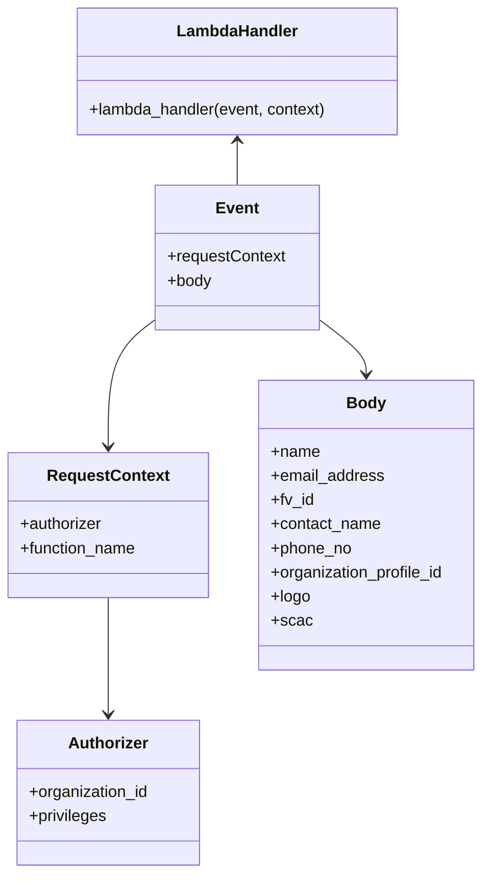

# Diagram: tools/ide_local_testing/localTest/test/organization/createOrganization.py


> Auto-generated by Obscura crawlers

## Diagram 1

```mermaid
flowchart TD
    A[Start script] --> B[Import modules]
    B --> C[Construct event dict]
    C --> D[Call lambda_handler(event, context)]
    D --> E[Print response]
    E --> F[End]
```

> SVG rendering failed for this diagram.

## Diagram 2



### SVG

<svg id="container" width="483.796875" xmlns="http://www.w3.org/2000/svg" class="classDiagram" height="868" viewBox="0 0 483.796875 868" role="graphics-document document" aria-roledescription="class"><style>#container{font-family:"trebuchet ms",verdana,arial,sans-serif;font-size:16px;fill:#333;}@keyframes edge-animation-frame{from{stroke-dashoffset:0;}}@keyframes dash{to{stroke-dashoffset:0;}}#container .edge-animation-slow{stroke-dasharray:9,5!important;stroke-dashoffset:900;animation:dash 50s linear infinite;stroke-linecap:round;}#container .edge-animation-fast{stroke-dasharray:9,5!important;stroke-dashoffset:900;animation:dash 20s linear infinite;stroke-linecap:round;}#container .error-icon{fill:#552222;}#container .error-text{fill:#552222;stroke:#552222;}#container .edge-thickness-normal{stroke-width:1px;}#container .edge-thickness-thick{stroke-width:3.5px;}#container .edge-pattern-solid{stroke-dasharray:0;}#container .edge-thickness-invisible{stroke-width:0;fill:none;}#container .edge-pattern-dashed{stroke-dasharray:3;}#container .edge-pattern-dotted{stroke-dasharray:2;}#container .marker{fill:#333333;stroke:#333333;}#container .marker.cross{stroke:#333333;}#container svg{font-family:"trebuchet ms",verdana,arial,sans-serif;font-size:16px;}#container p{margin:0;}#container g.classGroup text{fill:#9370DB;stroke:none;font-family:"trebuchet ms",verdana,arial,sans-serif;font-size:10px;}#container g.classGroup text .title{font-weight:bolder;}#container .nodeLabel,#container .edgeLabel{color:#131300;}#container .edgeLabel .label rect{fill:#ECECFF;}#container .label text{fill:#131300;}#container .labelBkg{background:#ECECFF;}#container .edgeLabel .label span{background:#ECECFF;}#container .classTitle{font-weight:bolder;}#container .node rect,#container .node circle,#container .node ellipse,#container .node polygon,#container .node path{fill:#ECECFF;stroke:#9370DB;stroke-width:1px;}#container .divider{stroke:#9370DB;stroke-width:1;}#container g.clickable{cursor:pointer;}#container g.classGroup rect{fill:#ECECFF;stroke:#9370DB;}#container g.classGroup line{stroke:#9370DB;stroke-width:1;}#container .classLabel .box{stroke:none;stroke-width:0;fill:#ECECFF;opacity:0.5;}#container .classLabel .label{fill:#9370DB;font-size:10px;}#container .relation{stroke:#333333;stroke-width:1;fill:none;}#container .dashed-line{stroke-dasharray:3;}#container .dotted-line{stroke-dasharray:1 2;}#container #compositionStart,#container .composition{fill:#333333!important;stroke:#333333!important;stroke-width:1;}#container #compositionEnd,#container .composition{fill:#333333!important;stroke:#333333!important;stroke-width:1;}#container #dependencyStart,#container .dependency{fill:#333333!important;stroke:#333333!important;stroke-width:1;}#container #dependencyStart,#container .dependency{fill:#333333!important;stroke:#333333!important;stroke-width:1;}#container #extensionStart,#container .extension{fill:transparent!important;stroke:#333333!important;stroke-width:1;}#container #extensionEnd,#container .extension{fill:transparent!important;stroke:#333333!important;stroke-width:1;}#container #aggregationStart,#container .aggregation{fill:transparent!important;stroke:#333333!important;stroke-width:1;}#container #aggregationEnd,#container .aggregation{fill:transparent!important;stroke:#333333!important;stroke-width:1;}#container #lollipopStart,#container .lollipop{fill:#ECECFF!important;stroke:#333333!important;stroke-width:1;}#container #lollipopEnd,#container .lollipop{fill:#ECECFF!important;stroke:#333333!important;stroke-width:1;}#container .edgeTerminals{font-size:11px;line-height:initial;}#container .classTitleText{text-anchor:middle;font-size:18px;fill:#333;}#container .label-icon{display:inline-block;height:1em;overflow:visible;vertical-align:-0.125em;}#container .node .label-icon path{fill:currentColor;stroke:revert;stroke-width:revert;}#container :root{--mermaid-font-family:"trebuchet ms",verdana,arial,sans-serif;}</style><g><defs><marker id="container_class-aggregationStart" class="marker aggregation class" refX="18" refY="7" markerWidth="190" markerHeight="240" orient="auto"><path d="M 18,7 L9,13 L1,7 L9,1 Z"></path></marker></defs><defs><marker id="container_class-aggregationEnd" class="marker aggregation class" refX="1" refY="7" markerWidth="20" markerHeight="28" orient="auto"><path d="M 18,7 L9,13 L1,7 L9,1 Z"></path></marker></defs><defs><marker id="container_class-extensionStart" class="marker extension class" refX="18" refY="7" markerWidth="190" markerHeight="240" orient="auto"><path d="M 1,7 L18,13 V 1 Z"></path></marker></defs><defs><marker id="container_class-extensionEnd" class="marker extension class" refX="1" refY="7" markerWidth="20" markerHeight="28" orient="auto"><path d="M 1,1 V 13 L18,7 Z"></path></marker></defs><defs><marker id="container_class-compositionStart" class="marker composition class" refX="18" refY="7" markerWidth="190" markerHeight="240" orient="auto"><path d="M 18,7 L9,13 L1,7 L9,1 Z"></path></marker></defs><defs><marker id="container_class-compositionEnd" class="marker composition class" refX="1" refY="7" markerWidth="20" markerHeight="28" orient="auto"><path d="M 18,7 L9,13 L1,7 L9,1 Z"></path></marker></defs><defs><marker id="container_class-dependencyStart" class="marker dependency class" refX="6" refY="7" markerWidth="190" markerHeight="240" orient="auto"><path d="M 5,7 L9,13 L1,7 L9,1 Z"></path></marker></defs><defs><marker id="container_class-dependencyEnd" class="marker dependency class" refX="13" refY="7" markerWidth="20" markerHeight="28" orient="auto"><path d="M 18,7 L9,13 L14,7 L9,1 Z"></path></marker></defs><defs><marker id="container_class-lollipopStart" class="marker lollipop class" refX="13" refY="7" markerWidth="190" markerHeight="240" orient="auto"><circle stroke="black" fill="transparent" cx="7" cy="7" r="6"></circle></marker></defs><defs><marker id="container_class-lollipopEnd" class="marker lollipop class" refX="1" refY="7" markerWidth="190" markerHeight="240" orient="auto"><circle stroke="black" fill="transparent" cx="7" cy="7" r="6"></circle></marker></defs><g class="root"><g class="clusters"></g><g class="edgePaths"><path d="M155.926,316.874L147.891,322.895C139.855,328.916,123.785,340.958,115.75,362.146C107.715,383.333,107.715,413.667,107.715,428.833L107.715,444" id="id_Event_RequestContext_1" class="edge-thickness-normal edge-pattern-solid relation" style=";;;" data-edge="true" data-et="edge" data-id="id_Event_RequestContext_1" data-points="W3sieCI6MTU1LjkyNTc4MTI1LCJ5IjozMTYuODc0MTY2MzkwMDU0MDN9LHsieCI6MTA3LjcxNDg0Mzc1LCJ5IjozNTN9LHsieCI6MTA3LjcxNDg0Mzc1LCJ5Ijo0NTB9XQ==" marker-end="url(#container_class-dependencyEnd)"></path><path d="M318.402,316.874L326.438,322.895C334.473,328.916,350.543,340.958,358.578,350.146C366.613,359.333,366.613,365.667,366.613,368.833L366.613,372" id="id_Event_Body_2" class="edge-thickness-normal edge-pattern-solid relation" style=";;;" data-edge="true" data-et="edge" data-id="id_Event_Body_2" data-points="W3sieCI6MzE4LjQwMjM0Mzc1LCJ5IjozMTYuODc0MTY2MzkwMDU0MDN9LHsieCI6MzY2LjYxMzI4MTI1LCJ5IjozNTN9LHsieCI6MzY2LjYxMzI4MTI1LCJ5IjozNzh9XQ==" marker-end="url(#container_class-dependencyEnd)"></path><path d="M107.715,594L107.715,610.167C107.715,626.333,107.715,658.667,107.715,678C107.715,697.333,107.715,703.667,107.715,706.833L107.715,710" id="id_RequestContext_Authorizer_3" class="edge-thickness-normal edge-pattern-solid relation" style=";;;" data-edge="true" data-et="edge" data-id="id_RequestContext_Authorizer_3" data-points="W3sieCI6MTA3LjcxNDg0Mzc1LCJ5Ijo1OTR9LHsieCI6MTA3LjcxNDg0Mzc1LCJ5Ijo2OTF9LHsieCI6MTA3LjcxNDg0Mzc1LCJ5Ijo3MTZ9XQ==" marker-end="url(#container_class-dependencyEnd)"></path><path d="M237.164,140L237.164,143.167C237.164,146.333,237.164,152.667,237.164,160C237.164,167.333,237.164,175.667,237.164,179.833L237.164,184" id="id_LambdaHandler_Event_4" class="edge-thickness-normal edge-pattern-solid relation" style=";;;" data-edge="true" data-et="edge" data-id="id_LambdaHandler_Event_4" data-points="W3sieCI6MjM3LjE2NDA2MjUsInkiOjEzNH0seyJ4IjoyMzcuMTY0MDYyNSwieSI6MTU5fSx7IngiOjIzNy4xNjQwNjI1LCJ5IjoxODR9XQ==" marker-start="url(#container_class-dependencyStart)"></path></g><g class="edgeLabels"><g class="edgeLabel"><g class="label" data-id="id_Event_RequestContext_1" transform="translate(0, 0)"><foreignObject width="0" height="0"><div xmlns="http://www.w3.org/1999/xhtml" class="labelBkg" style="display: table-cell; white-space: nowrap; line-height: 1.5; max-width: 200px; text-align: center;"><span class="edgeLabel"></span></div></foreignObject></g></g><g class="edgeLabel"><g class="label" data-id="id_Event_Body_2" transform="translate(0, 0)"><foreignObject width="0" height="0"><div xmlns="http://www.w3.org/1999/xhtml" class="labelBkg" style="display: table-cell; white-space: nowrap; line-height: 1.5; max-width: 200px; text-align: center;"><span class="edgeLabel"></span></div></foreignObject></g></g><g class="edgeLabel"><g class="label" data-id="id_RequestContext_Authorizer_3" transform="translate(0, 0)"><foreignObject width="0" height="0"><div xmlns="http://www.w3.org/1999/xhtml" class="labelBkg" style="display: table-cell; white-space: nowrap; line-height: 1.5; max-width: 200px; text-align: center;"><span class="edgeLabel"></span></div></foreignObject></g></g><g class="edgeLabel"><g class="label" data-id="id_LambdaHandler_Event_4" transform="translate(0, 0)"><foreignObject width="0" height="0"><div xmlns="http://www.w3.org/1999/xhtml" class="labelBkg" style="display: table-cell; white-space: nowrap; line-height: 1.5; max-width: 200px; text-align: center;"><span class="edgeLabel"></span></div></foreignObject></g></g></g><g class="nodes"><g class="node default" id="classId-Event-0" transform="translate(237.1640625, 256)"><g class="basic label-container"><path d="M-81.23828125 -72 L81.23828125 -72 L81.23828125 72 L-81.23828125 72" stroke="none" stroke-width="0" fill="#ECECFF" style=""></path><path d="M-81.23828125 -72 C-24.41315596686686 -72, 32.41196931626628 -72, 81.23828125 -72 M-81.23828125 -72 C-39.40191152507703 -72, 2.4344581998459347 -72, 81.23828125 -72 M81.23828125 -72 C81.23828125 -31.822941021447562, 81.23828125 8.354117957104876, 81.23828125 72 M81.23828125 -72 C81.23828125 -29.204814969377985, 81.23828125 13.59037006124403, 81.23828125 72 M81.23828125 72 C23.467415567103785 72, -34.30345011579243 72, -81.23828125 72 M81.23828125 72 C22.780033143022123 72, -35.67821496395575 72, -81.23828125 72 M-81.23828125 72 C-81.23828125 23.578312679076276, -81.23828125 -24.843374641847447, -81.23828125 -72 M-81.23828125 72 C-81.23828125 40.7009407222732, -81.23828125 9.401881444546412, -81.23828125 -72" stroke="#9370DB" stroke-width="1.3" fill="none" stroke-dasharray="0 0" style=""></path></g><g class="annotation-group text" transform="translate(0, -48)"></g><g class="label-group text" transform="translate(-20.2109375, -48)"><g class="label" style="font-weight: bolder" transform="translate(0,-12)"><foreignObject width="40.421875" height="24"><div xmlns="http://www.w3.org/1999/xhtml" style="display: table-cell; white-space: nowrap; line-height: 1.5; max-width: 90px; text-align: center;"><span class="nodeLabel markdown-node-label" style=""><p>Event</p></span></div></foreignObject></g></g><g class="members-group text" transform="translate(-69.23828125, 0)"><g class="label" style="" transform="translate(0,-12)"><foreignObject width="118.265625" height="24"><div xmlns="http://www.w3.org/1999/xhtml" style="display: table-cell; white-space: nowrap; line-height: 1.5; max-width: 176px; text-align: center;"><span class="nodeLabel markdown-node-label" style=""><p>+requestContext</p></span></div></foreignObject></g><g class="label" style="" transform="translate(0,12)"><foreignObject width="44.28125" height="24"><div xmlns="http://www.w3.org/1999/xhtml" style="display: table-cell; white-space: nowrap; line-height: 1.5; max-width: 102px; text-align: center;"><span class="nodeLabel markdown-node-label" style=""><p>+body</p></span></div></foreignObject></g></g><g class="methods-group text" transform="translate(-69.23828125, 72)"></g><g class="divider" style=""><path d="M-81.23828125 -24 C-18.63877356743543 -24, 43.96073411512914 -24, 81.23828125 -24 M-81.23828125 -24 C-32.11651480456471 -24, 17.005251640870583 -24, 81.23828125 -24" stroke="#9370DB" stroke-width="1.3" fill="none" stroke-dasharray="0 0" style=""></path></g><g class="divider" style=""><path d="M-81.23828125 48 C-46.80440214437525 48, -12.370523038750505 48, 81.23828125 48 M-81.23828125 48 C-46.99387755107926 48, -12.749473852158516 48, 81.23828125 48" stroke="#9370DB" stroke-width="1.3" fill="none" stroke-dasharray="0 0" style=""></path></g></g><g class="node default" id="classId-RequestContext-1" transform="translate(107.71484375, 522)"><g class="basic label-container"><path d="M-99.71484375 -72 L99.71484375 -72 L99.71484375 72 L-99.71484375 72" stroke="none" stroke-width="0" fill="#ECECFF" style=""></path><path d="M-99.71484375 -72 C-34.65071171315148 -72, 30.41342032369704 -72, 99.71484375 -72 M-99.71484375 -72 C-32.38116484944349 -72, 34.95251405111301 -72, 99.71484375 -72 M99.71484375 -72 C99.71484375 -41.9784939944562, 99.71484375 -11.956987988912402, 99.71484375 72 M99.71484375 -72 C99.71484375 -17.40165200252686, 99.71484375 37.19669599494628, 99.71484375 72 M99.71484375 72 C20.841379272861175 72, -58.03208520427765 72, -99.71484375 72 M99.71484375 72 C41.45212219546807 72, -16.810599359063858 72, -99.71484375 72 M-99.71484375 72 C-99.71484375 37.172330716921614, -99.71484375 2.3446614338432283, -99.71484375 -72 M-99.71484375 72 C-99.71484375 26.4278648556256, -99.71484375 -19.1442702887488, -99.71484375 -72" stroke="#9370DB" stroke-width="1.3" fill="none" stroke-dasharray="0 0" style=""></path></g><g class="annotation-group text" transform="translate(0, -48)"></g><g class="label-group text" transform="translate(-58.1484375, -48)"><g class="label" style="font-weight: bolder" transform="translate(0,-12)"><foreignObject width="116.296875" height="24"><div xmlns="http://www.w3.org/1999/xhtml" style="display: table-cell; white-space: nowrap; line-height: 1.5; max-width: 164px; text-align: center;"><span class="nodeLabel markdown-node-label" style=""><p>RequestContext</p></span></div></foreignObject></g></g><g class="members-group text" transform="translate(-87.71484375, 0)"><g class="label" style="" transform="translate(0,-12)"><foreignObject width="82.734375" height="24"><div xmlns="http://www.w3.org/1999/xhtml" style="display: table-cell; white-space: nowrap; line-height: 1.5; max-width: 141px; text-align: center;"><span class="nodeLabel markdown-node-label" style=""><p>+authorizer</p></span></div></foreignObject></g><g class="label" style="" transform="translate(0,12)"><foreignObject width="117.28125" height="24"><div xmlns="http://www.w3.org/1999/xhtml" style="display: table-cell; white-space: nowrap; line-height: 1.5; max-width: 175px; text-align: center;"><span class="nodeLabel markdown-node-label" style=""><p>+function_name</p></span></div></foreignObject></g></g><g class="methods-group text" transform="translate(-87.71484375, 72)"></g><g class="divider" style=""><path d="M-99.71484375 -24 C-39.45879904801962 -24, 20.797245653960758 -24, 99.71484375 -24 M-99.71484375 -24 C-36.070784989488935 -24, 27.57327377102213 -24, 99.71484375 -24" stroke="#9370DB" stroke-width="1.3" fill="none" stroke-dasharray="0 0" style=""></path></g><g class="divider" style=""><path d="M-99.71484375 48 C-49.7497266156915 48, 0.21539051861699932 48, 99.71484375 48 M-99.71484375 48 C-40.426306160359495 48, 18.86223142928101 48, 99.71484375 48" stroke="#9370DB" stroke-width="1.3" fill="none" stroke-dasharray="0 0" style=""></path></g></g><g class="node default" id="classId-Authorizer-2" transform="translate(107.71484375, 788)"><g class="basic label-container"><path d="M-91.55859375 -72 L91.55859375 -72 L91.55859375 72 L-91.55859375 72" stroke="none" stroke-width="0" fill="#ECECFF" style=""></path><path d="M-91.55859375 -72 C-37.39791630833209 -72, 16.762761133335815 -72, 91.55859375 -72 M-91.55859375 -72 C-26.37824011146097 -72, 38.80211352707806 -72, 91.55859375 -72 M91.55859375 -72 C91.55859375 -26.423680900084207, 91.55859375 19.152638199831586, 91.55859375 72 M91.55859375 -72 C91.55859375 -16.31258223589363, 91.55859375 39.37483552821274, 91.55859375 72 M91.55859375 72 C24.44613135674207 72, -42.66633103651586 72, -91.55859375 72 M91.55859375 72 C22.263612977530357 72, -47.031367794939285 72, -91.55859375 72 M-91.55859375 72 C-91.55859375 20.999624750193888, -91.55859375 -30.000750499612224, -91.55859375 -72 M-91.55859375 72 C-91.55859375 36.520455474379055, -91.55859375 1.0409109487581105, -91.55859375 -72" stroke="#9370DB" stroke-width="1.3" fill="none" stroke-dasharray="0 0" style=""></path></g><g class="annotation-group text" transform="translate(0, -48)"></g><g class="label-group text" transform="translate(-38.3671875, -48)"><g class="label" style="font-weight: bolder" transform="translate(0,-12)"><foreignObject width="76.734375" height="24"><div xmlns="http://www.w3.org/1999/xhtml" style="display: table-cell; white-space: nowrap; line-height: 1.5; max-width: 126px; text-align: center;"><span class="nodeLabel markdown-node-label" style=""><p>Authorizer</p></span></div></foreignObject></g></g><g class="members-group text" transform="translate(-79.55859375, 0)"><g class="label" style="" transform="translate(0,-12)"><foreignObject width="120.75" height="24"><div xmlns="http://www.w3.org/1999/xhtml" style="display: table-cell; white-space: nowrap; line-height: 1.5; max-width: 178px; text-align: center;"><span class="nodeLabel markdown-node-label" style=""><p>+organization_id</p></span></div></foreignObject></g><g class="label" style="" transform="translate(0,12)"><foreignObject width="78.15625" height="24"><div xmlns="http://www.w3.org/1999/xhtml" style="display: table-cell; white-space: nowrap; line-height: 1.5; max-width: 136px; text-align: center;"><span class="nodeLabel markdown-node-label" style=""><p>+privileges</p></span></div></foreignObject></g></g><g class="methods-group text" transform="translate(-79.55859375, 72)"></g><g class="divider" style=""><path d="M-91.55859375 -24 C-48.79240522135239 -24, -6.026216692704779 -24, 91.55859375 -24 M-91.55859375 -24 C-35.31392186344734 -24, 20.93075002310532 -24, 91.55859375 -24" stroke="#9370DB" stroke-width="1.3" fill="none" stroke-dasharray="0 0" style=""></path></g><g class="divider" style=""><path d="M-91.55859375 48 C-29.435850883731128 48, 32.686891982537745 48, 91.55859375 48 M-91.55859375 48 C-47.61491184924632 48, -3.6712299484926376 48, 91.55859375 48" stroke="#9370DB" stroke-width="1.3" fill="none" stroke-dasharray="0 0" style=""></path></g></g><g class="node default" id="classId-Body-3" transform="translate(366.61328125, 522)"><g class="basic label-container"><path d="M-109.18359375 -144 L109.18359375 -144 L109.18359375 144 L-109.18359375 144" stroke="none" stroke-width="0" fill="#ECECFF" style=""></path><path d="M-109.18359375 -144 C-39.87358897981501 -144, 29.436415790369978 -144, 109.18359375 -144 M-109.18359375 -144 C-48.20549589610843 -144, 12.772601957783138 -144, 109.18359375 -144 M109.18359375 -144 C109.18359375 -60.97804843235312, 109.18359375 22.04390313529376, 109.18359375 144 M109.18359375 -144 C109.18359375 -31.662046870592064, 109.18359375 80.67590625881587, 109.18359375 144 M109.18359375 144 C24.381892858265317 144, -60.419808033469366 144, -109.18359375 144 M109.18359375 144 C39.57394164209127 144, -30.03571046581746 144, -109.18359375 144 M-109.18359375 144 C-109.18359375 32.73110958692675, -109.18359375 -78.5377808261465, -109.18359375 -144 M-109.18359375 144 C-109.18359375 64.86253558851206, -109.18359375 -14.27492882297588, -109.18359375 -144" stroke="#9370DB" stroke-width="1.3" fill="none" stroke-dasharray="0 0" style=""></path></g><g class="annotation-group text" transform="translate(0, -120)"></g><g class="label-group text" transform="translate(-18.5546875, -120)"><g class="label" style="font-weight: bolder" transform="translate(0,-12)"><foreignObject width="37.109375" height="24"><div xmlns="http://www.w3.org/1999/xhtml" style="display: table-cell; white-space: nowrap; line-height: 1.5; max-width: 87px; text-align: center;"><span class="nodeLabel markdown-node-label" style=""><p>Body</p></span></div></foreignObject></g></g><g class="members-group text" transform="translate(-97.18359375, -72)"><g class="label" style="" transform="translate(0,-12)"><foreignObject width="48.5" height="24"><div xmlns="http://www.w3.org/1999/xhtml" style="display: table-cell; white-space: nowrap; line-height: 1.5; max-width: 106px; text-align: center;"><span class="nodeLabel markdown-node-label" style=""><p>+name</p></span></div></foreignObject></g><g class="label" style="" transform="translate(0,12)"><foreignObject width="113.375" height="24"><div xmlns="http://www.w3.org/1999/xhtml" style="display: table-cell; white-space: nowrap; line-height: 1.5; max-width: 171px; text-align: center;"><span class="nodeLabel markdown-node-label" style=""><p>+email_address</p></span></div></foreignObject></g><g class="label" style="" transform="translate(0,36)"><foreignObject width="42.90625" height="24"><div xmlns="http://www.w3.org/1999/xhtml" style="display: table-cell; white-space: nowrap; line-height: 1.5; max-width: 100px; text-align: center;"><span class="nodeLabel markdown-node-label" style=""><p>+fv_id</p></span></div></foreignObject></g><g class="label" style="" transform="translate(0,60)"><foreignObject width="110.65625" height="24"><div xmlns="http://www.w3.org/1999/xhtml" style="display: table-cell; white-space: nowrap; line-height: 1.5; max-width: 168px; text-align: center;"><span class="nodeLabel markdown-node-label" style=""><p>+contact_name</p></span></div></foreignObject></g><g class="label" style="" transform="translate(0,84)"><foreignObject width="81.03125" height="24"><div xmlns="http://www.w3.org/1999/xhtml" style="display: table-cell; white-space: nowrap; line-height: 1.5; max-width: 138px; text-align: center;"><span class="nodeLabel markdown-node-label" style=""><p>+phone_no</p></span></div></foreignObject></g><g class="label" style="" transform="translate(0,108)"><foreignObject width="175.8125" height="24"><div xmlns="http://www.w3.org/1999/xhtml" style="display: table-cell; white-space: nowrap; line-height: 1.5; max-width: 233px; text-align: center;"><span class="nodeLabel markdown-node-label" style=""><p>+organization_profile_id</p></span></div></foreignObject></g><g class="label" style="" transform="translate(0,132)"><foreignObject width="39.359375" height="24"><div xmlns="http://www.w3.org/1999/xhtml" style="display: table-cell; white-space: nowrap; line-height: 1.5; max-width: 97px; text-align: center;"><span class="nodeLabel markdown-node-label" style=""><p>+logo</p></span></div></foreignObject></g><g class="label" style="" transform="translate(0,156)"><foreignObject width="39.296875" height="24"><div xmlns="http://www.w3.org/1999/xhtml" style="display: table-cell; white-space: nowrap; line-height: 1.5; max-width: 97px; text-align: center;"><span class="nodeLabel markdown-node-label" style=""><p>+scac</p></span></div></foreignObject></g></g><g class="methods-group text" transform="translate(-97.18359375, 144)"></g><g class="divider" style=""><path d="M-109.18359375 -96 C-61.39681128010688 -96, -13.610028810213763 -96, 109.18359375 -96 M-109.18359375 -96 C-25.68315909308579 -96, 57.81727556382842 -96, 109.18359375 -96" stroke="#9370DB" stroke-width="1.3" fill="none" stroke-dasharray="0 0" style=""></path></g><g class="divider" style=""><path d="M-109.18359375 120 C-50.44157287945683 120, 8.300447991086344 120, 109.18359375 120 M-109.18359375 120 C-51.351778459786836 120, 6.480036830426329 120, 109.18359375 120" stroke="#9370DB" stroke-width="1.3" fill="none" stroke-dasharray="0 0" style=""></path></g></g><g class="node default" id="classId-LambdaHandler-4" transform="translate(237.1640625, 71)"><g class="basic label-container"><path d="M-161.203125 -63 L161.203125 -63 L161.203125 63 L-161.203125 63" stroke="none" stroke-width="0" fill="#ECECFF" style=""></path><path d="M-161.203125 -63 C-47.81307361469325 -63, 65.5769777706135 -63, 161.203125 -63 M-161.203125 -63 C-66.48074339790868 -63, 28.241638204182635 -63, 161.203125 -63 M161.203125 -63 C161.203125 -28.23734175376545, 161.203125 6.525316492469102, 161.203125 63 M161.203125 -63 C161.203125 -14.9119854360491, 161.203125 33.1760291279018, 161.203125 63 M161.203125 63 C46.24899802543602 63, -68.70512894912795 63, -161.203125 63 M161.203125 63 C34.347352858600956 63, -92.50841928279809 63, -161.203125 63 M-161.203125 63 C-161.203125 14.344906849564836, -161.203125 -34.31018630087033, -161.203125 -63 M-161.203125 63 C-161.203125 21.142069940024676, -161.203125 -20.715860119950648, -161.203125 -63" stroke="#9370DB" stroke-width="1.3" fill="none" stroke-dasharray="0 0" style=""></path></g><g class="annotation-group text" transform="translate(0, -39)"></g><g class="label-group text" transform="translate(-58.21875, -39)"><g class="label" style="font-weight: bolder" transform="translate(0,-12)"><foreignObject width="116.4375" height="24"><div xmlns="http://www.w3.org/1999/xhtml" style="display: table-cell; white-space: nowrap; line-height: 1.5; max-width: 167px; text-align: center;"><span class="nodeLabel markdown-node-label" style=""><p>LambdaHandler</p></span></div></foreignObject></g></g><g class="members-group text" transform="translate(-149.203125, 9)"></g><g class="methods-group text" transform="translate(-149.203125, 39)"><g class="label" style="" transform="translate(0,-12)"><foreignObject width="240.1875" height="24"><div xmlns="http://www.w3.org/1999/xhtml" style="display: table-cell; white-space: nowrap; line-height: 1.5; max-width: 298px; text-align: center;"><span class="nodeLabel markdown-node-label" style=""><p>+lambda_handler(event, context)</p></span></div></foreignObject></g></g><g class="divider" style=""><path d="M-161.203125 -15 C-86.20337033974826 -15, -11.203615679496522 -15, 161.203125 -15 M-161.203125 -15 C-54.666420962982215 -15, 51.87028307403557 -15, 161.203125 -15" stroke="#9370DB" stroke-width="1.3" fill="none" stroke-dasharray="0 0" style=""></path></g><g class="divider" style=""><path d="M-161.203125 9 C-44.17536318315874 9, 72.85239863368253 9, 161.203125 9 M-161.203125 9 C-93.01362593612318 9, -24.824126872246353 9, 161.203125 9" stroke="#9370DB" stroke-width="1.3" fill="none" stroke-dasharray="0 0" style=""></path></g></g></g></g></g></svg>
