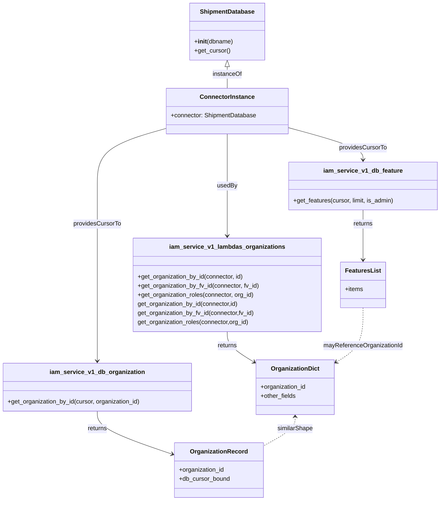

# Diagram: tools/ide_local_testing/localTest/test/organization/getOrganization.py

> Auto-generated by Obscura crawlers

## Mermaid

### SVG

<svg id="container" width="1152.14453125" xmlns="http://www.w3.org/2000/svg" class="classDiagram" height="1316" viewBox="0 0 1152.14453125 1316" role="graphics-document document" aria-roledescription="class"><g><defs><marker id="container_class-aggregationStart" class="marker aggregation class" refX="18" refY="7" markerWidth="190" markerHeight="240" orient="auto"><path d="M 18,7 L9,13 L1,7 L9,1 Z"></path></marker></defs><defs><marker id="container_class-aggregationEnd" class="marker aggregation class" refX="1" refY="7" markerWidth="20" markerHeight="28" orient="auto"><path d="M 18,7 L9,13 L1,7 L9,1 Z"></path></marker></defs><defs><marker id="container_class-extensionStart" class="marker extension class" refX="18" refY="7" markerWidth="190" markerHeight="240" orient="auto"><path d="M 1,7 L18,13 V 1 Z"></path></marker></defs><defs><marker id="container_class-extensionEnd" class="marker extension class" refX="1" refY="7" markerWidth="20" markerHeight="28" orient="auto"><path d="M 1,1 V 13 L18,7 Z"></path></marker></defs><defs><marker id="container_class-compositionStart" class="marker composition class" refX="18" refY="7" markerWidth="190" markerHeight="240" orient="auto"><path d="M 18,7 L9,13 L1,7 L9,1 Z"></path></marker></defs><defs><marker id="container_class-compositionEnd" class="marker composition class" refX="1" refY="7" markerWidth="20" markerHeight="28" orient="auto"><path d="M 18,7 L9,13 L1,7 L9,1 Z"></path></marker></defs><defs><marker id="container_class-dependencyStart" class="marker dependency class" refX="6" refY="7" markerWidth="190" markerHeight="240" orient="auto"><path d="M 5,7 L9,13 L1,7 L9,1 Z"></path></marker></defs><defs><marker id="container_class-dependencyEnd" class="marker dependency class" refX="13" refY="7" markerWidth="20" markerHeight="28" orient="auto"><path d="M 18,7 L9,13 L14,7 L9,1 Z"></path></marker></defs><defs><marker id="container_class-lollipopStart" class="marker lollipop class" refX="13" refY="7" markerWidth="190" markerHeight="240" orient="auto"><circle stroke="black" fill="transparent" cx="7" cy="7" r="6"></circle></marker></defs><defs><marker id="container_class-lollipopEnd" class="marker lollipop class" refX="1" refY="7" markerWidth="190" markerHeight="240" orient="auto"><circle stroke="black" fill="transparent" cx="7" cy="7" r="6"></circle></marker></defs><g class="root"><g class="clusters"></g><g class="edgePaths"><path d="M595.352,175.25L595.352,178.542C595.352,181.833,595.352,188.417,595.352,197.875C595.352,207.333,595.352,219.667,595.352,225.833L595.352,232" id="id_ShipmentDatabase_ConnectorInstance_1" class="edge-thickness-normal edge-pattern-solid relation" style=";;;" data-edge="true" data-et="edge" data-id="id_ShipmentDatabase_ConnectorInstance_1" data-points="W3sieCI6NTk1LjM1MTU2MjUsInkiOjE1OH0seyJ4Ijo1OTUuMzUxNTYyNSwieSI6MTk1fSx7IngiOjU5NS4zNTE1NjI1LCJ5IjoyMzJ9XQ==" marker-start="url(#container_class-extensionStart)"></path><path d="M595.352,352L595.352,358.167C595.352,364.333,595.352,376.667,595.352,399.5C595.352,422.333,595.352,455.667,595.352,489C595.352,522.333,595.352,555.667,595.352,577.5C595.352,599.333,595.352,609.667,595.352,614.833L595.352,620" id="id_ConnectorInstance_iam_service_v1_lambdas_organizations_2" class="edge-thickness-normal edge-pattern-solid relation" style=";;;" data-edge="true" data-et="edge" data-id="id_ConnectorInstance_iam_service_v1_lambdas_organizations_2" data-points="W3sieCI6NTk1LjM1MTU2MjUsInkiOjM1Mn0seyJ4Ijo1OTUuMzUxNTYyNSwieSI6Mzg5fSx7IngiOjU5NS4zNTE1NjI1LCJ5Ijo0ODl9LHsieCI6NTk1LjM1MTU2MjUsInkiOjU4OX0seyJ4Ijo1OTUuMzUxNTYyNSwieSI6NjI2fV0=" marker-end="url(#container_class-dependencyEnd)"></path><path d="M436.152,337.4L405.996,346C375.84,354.6,315.527,371.8,285.371,397.067C255.215,422.333,255.215,455.667,255.215,489C255.215,522.333,255.215,555.667,255.215,599C255.215,642.333,255.215,695.667,255.215,749C255.215,802.333,255.215,855.667,255.215,889C255.215,922.333,255.215,935.667,255.215,942.333L255.215,949" id="id_ConnectorInstance_iam_service_v1_db_organization_3" class="edge-thickness-normal edge-pattern-solid relation" style=";;;" data-edge="true" data-et="edge" data-id="id_ConnectorInstance_iam_service_v1_db_organization_3" data-points="W3sieCI6NDM2LjE1MjM0Mzc1LCJ5IjozMzcuNDAwMzQ0NTMwNTc3MDZ9LHsieCI6MjU1LjIxNDg0Mzc1LCJ5IjozODl9LHsieCI6MjU1LjIxNDg0Mzc1LCJ5Ijo0ODl9LHsieCI6MjU1LjIxNDg0Mzc1LCJ5Ijo1ODl9LHsieCI6MjU1LjIxNDg0Mzc1LCJ5Ijo3NDl9LHsieCI6MjU1LjIxNDg0Mzc1LCJ5Ijo5MDl9LHsieCI6MjU1LjIxNDg0Mzc1LCJ5Ijo5NTV9XQ==" marker-end="url(#container_class-dependencyEnd)"></path><path d="M754.551,335.697L786.917,344.581C819.283,353.465,884.014,371.232,916.38,385.283C948.746,399.333,948.746,409.667,948.746,414.833L948.746,420" id="id_ConnectorInstance_iam_service_v1_db_feature_4" class="edge-thickness-normal edge-pattern-solid relation" style=";;;" data-edge="true" data-et="edge" data-id="id_ConnectorInstance_iam_service_v1_db_feature_4" data-points="W3sieCI6NzU0LjU1MDc4MTI1LCJ5IjozMzUuNjk3MTIyNzcxMzM2fSx7IngiOjk0OC43NDYwOTM3NSwieSI6Mzg5fSx7IngiOjk0OC43NDYwOTM3NSwieSI6NDI2fV0=" marker-end="url(#container_class-dependencyEnd)"></path><path d="M595.352,872L595.352,878.167C595.352,884.333,595.352,896.667,606.798,909.894C618.244,923.122,641.136,937.243,652.582,944.304L664.028,951.365" id="id_iam_service_v1_lambdas_organizations_OrganizationDict_5" class="edge-thickness-normal edge-pattern-solid relation" style=";;;" data-edge="true" data-et="edge" data-id="id_iam_service_v1_lambdas_organizations_OrganizationDict_5" data-points="W3sieCI6NTk1LjM1MTU2MjUsInkiOjg3Mn0seyJ4Ijo1OTUuMzUxNTYyNSwieSI6OTA5fSx7IngiOjY2OS4xMzQ3NjU2MjUsInkiOjk1NC41MTQ5NjA5MjU4NDJ9XQ==" marker-end="url(#container_class-dependencyEnd)"></path><path d="M255.215,1081L255.215,1088.667C255.215,1096.333,255.215,1111.667,287.843,1130.561C320.472,1149.455,385.729,1171.91,418.358,1183.137L450.987,1194.365" id="id_iam_service_v1_db_organization_OrganizationRecord_6" class="edge-thickness-normal edge-pattern-solid relation" style=";;;" data-edge="true" data-et="edge" data-id="id_iam_service_v1_db_organization_OrganizationRecord_6" data-points="W3sieCI6MjU1LjIxNDg0Mzc1LCJ5IjoxMDgxfSx7IngiOjI1NS4yMTQ4NDM3NSwieSI6MTEyN30seyJ4Ijo0NTYuNjYwMTU2MjUsInkiOjExOTYuMzE3MDgwMzg5MTgyOH1d" marker-end="url(#container_class-dependencyEnd)"></path><path d="M948.746,552L948.746,558.167C948.746,564.333,948.746,576.667,948.746,598.5C948.746,620.333,948.746,651.667,948.746,667.333L948.746,683" id="id_iam_service_v1_db_feature_FeaturesList_7" class="edge-thickness-normal edge-pattern-solid relation" style=";;;" data-edge="true" data-et="edge" data-id="id_iam_service_v1_db_feature_FeaturesList_7" data-points="W3sieCI6OTQ4Ljc0NjA5Mzc1LCJ5Ijo1NTJ9LHsieCI6OTQ4Ljc0NjA5Mzc1LCJ5Ijo1ODl9LHsieCI6OTQ4Ljc0NjA5Mzc1LCJ5Ijo2ODl9XQ==" marker-end="url(#container_class-dependencyEnd)"></path><path d="M772.049,1096L772.049,1101.167C772.049,1106.333,772.049,1116.667,757.925,1129.528C743.802,1142.39,715.555,1157.779,701.432,1165.474L687.309,1173.169" id="id_OrganizationDict_OrganizationRecord_8" class="edge-thickness-normal edge-pattern-dashed relation" style=";;;" data-edge="true" data-et="edge" data-id="id_OrganizationDict_OrganizationRecord_8" data-points="W3sieCI6NzcyLjA0ODgyODEyNSwieSI6MTA5MH0seyJ4Ijo3NzIuMDQ4ODI4MTI1LCJ5IjoxMTI3fSx7IngiOjY4Ny4zMDg1OTM3NSwieSI6MTE3My4xNjg1NDkxOTgwMTI0fV0=" marker-start="url(#container_class-dependencyStart)"></path><path d="M948.746,809L948.746,825.667C948.746,842.333,948.746,875.667,937.3,899.394C925.854,923.122,902.962,937.243,891.516,944.304L880.069,951.365" id="id_FeaturesList_OrganizationDict_9" class="edge-thickness-normal edge-pattern-dashed relation" style=";;;" data-edge="true" data-et="edge" data-id="id_FeaturesList_OrganizationDict_9" data-points="W3sieCI6OTQ4Ljc0NjA5Mzc1LCJ5Ijo4MDl9LHsieCI6OTQ4Ljc0NjA5Mzc1LCJ5Ijo5MDl9LHsieCI6ODc0Ljk2Mjg5MDYyNSwieSI6OTU0LjUxNDk2MDkyNTg0Mn1d" marker-end="url(#container_class-dependencyEnd)"></path></g><g class="edgeLabels"><g class="edgeLabel" transform="translate(595.3515625, 195)"><g class="label" data-id="id_ShipmentDatabase_ConnectorInstance_1" transform="translate(-38.796875, -12)"><foreignObject width="77.59375" height="24">

instanceOf

</foreignObject></g></g><g class="edgeLabel" transform="translate(595.3515625, 489)"><g class="label" data-id="id_ConnectorInstance_iam_service_v1_lambdas_organizations_2" transform="translate(-26.34375, -12)"><foreignObject width="52.6875" height="24">

usedBy

</foreignObject></g></g><g class="edgeLabel" transform="translate(255.21484375, 589)"><g class="label" data-id="id_ConnectorInstance_iam_service_v1_db_organization_3" transform="translate(-63.1484375, -12)"><foreignObject width="126.296875" height="24">

providesCursorTo

</foreignObject></g></g><g class="edgeLabel" transform="translate(948.74609375, 389)"><g class="label" data-id="id_ConnectorInstance_iam_service_v1_db_feature_4" transform="translate(-63.1484375, -12)"><foreignObject width="126.296875" height="24">

providesCursorTo

</foreignObject></g></g><g class="edgeLabel" transform="translate(595.3515625, 909)"><g class="label" data-id="id_iam_service_v1_lambdas_organizations_OrganizationDict_5" transform="translate(-26.265625, -12)"><foreignObject width="52.53125" height="24">

returns

</foreignObject></g></g><g class="edgeLabel" transform="translate(255.21484375, 1127)"><g class="label" data-id="id_iam_service_v1_db_organization_OrganizationRecord_6" transform="translate(-26.265625, -12)"><foreignObject width="52.53125" height="24">

returns

</foreignObject></g></g><g class="edgeLabel" transform="translate(948.74609375, 589)"><g class="label" data-id="id_iam_service_v1_db_feature_FeaturesList_7" transform="translate(-26.265625, -12)"><foreignObject width="52.53125" height="24">

returns

</foreignObject></g></g><g class="edgeLabel" transform="translate(772.048828125, 1127)"><g class="label" data-id="id_OrganizationDict_OrganizationRecord_8" transform="translate(-47.3671875, -12)"><foreignObject width="94.734375" height="24">

similarShape

</foreignObject></g></g><g class="edgeLabel" transform="translate(948.74609375, 909)"><g class="label" data-id="id_FeaturesList_OrganizationDict_9" transform="translate(-104.171875, -12)"><foreignObject width="208.34375" height="24">

mayReferenceOrganizationId

</foreignObject></g></g></g><g class="nodes"><g class="node default" id="classId-ShipmentDatabase-0" transform="translate(595.3515625, 83)"><g class="basic label-container"><path d="M-97.82421875 -75 L97.82421875 -75 L97.82421875 75 L-97.82421875 75" stroke="none" stroke-width="0" fill="#ECECFF" style=""></path><path d="M-97.82421875 -75 C-41.299875464477715 -75, 15.22446782104457 -75, 97.82421875 -75 M-97.82421875 -75 C-51.88159878960474 -75, -5.938978829209475 -75, 97.82421875 -75 M97.82421875 -75 C97.82421875 -32.21748981850504, 97.82421875 10.565020362989927, 97.82421875 75 M97.82421875 -75 C97.82421875 -44.71413370976704, 97.82421875 -14.42826741953408, 97.82421875 75 M97.82421875 75 C43.785988727083414 75, -10.252241295833173 75, -97.82421875 75 M97.82421875 75 C25.556813807798406 75, -46.71059113440319 75, -97.82421875 75 M-97.82421875 75 C-97.82421875 16.8956600712881, -97.82421875 -41.2086798574238, -97.82421875 -75 M-97.82421875 75 C-97.82421875 35.09068233039271, -97.82421875 -4.81863533921458, -97.82421875 -75" stroke="#9370DB" stroke-width="1.3" fill="none" stroke-dasharray="0 0" style=""></path></g><g class="annotation-group text" transform="translate(0, -51)"></g><g class="label-group text" transform="translate(-69.2734375, -51)"><g class="label" style="font-weight: bolder" transform="translate(0,-12)"><foreignObject width="138.546875" height="24">

ShipmentDatabase

</foreignObject></g></g><g class="members-group text" transform="translate(-85.82421875, -3)"></g><g class="methods-group text" transform="translate(-85.82421875, 27)"><g class="label" style="" transform="translate(0,-12)"><foreignObject width="102.375" height="24">

+<strong>init</strong>(dbname)

</foreignObject></g><g class="label" style="" transform="translate(0,12)"><foreignObject width="94.640625" height="24">

+get_cursor()

</foreignObject></g></g><g class="divider" style=""><path d="M-97.82421875 -27 C-50.101389527734746 -27, -2.3785603054694917 -27, 97.82421875 -27 M-97.82421875 -27 C-36.80873811954546 -27, 24.20674251090908 -27, 97.82421875 -27" stroke="#9370DB" stroke-width="1.3" fill="none" stroke-dasharray="0 0" style=""></path></g><g class="divider" style=""><path d="M-97.82421875 -3 C-37.71758152203958 -3, 22.38905570592084 -3, 97.82421875 -3 M-97.82421875 -3 C-21.815510631194456 -3, 54.19319748761109 -3, 97.82421875 -3" stroke="#9370DB" stroke-width="1.3" fill="none" stroke-dasharray="0 0" style=""></path></g></g><g class="node default" id="classId-ConnectorInstance-1" transform="translate(595.3515625, 292)"><g class="basic label-container"><path d="M-159.19921875 -60 L159.19921875 -60 L159.19921875 60 L-159.19921875 60" stroke="none" stroke-width="0" fill="#ECECFF" style=""></path><path d="M-159.19921875 -60 C-87.96154890280886 -60, -16.723879055617715 -60, 159.19921875 -60 M-159.19921875 -60 C-44.792442298064515 -60, 69.61433415387097 -60, 159.19921875 -60 M159.19921875 -60 C159.19921875 -19.448050593858454, 159.19921875 21.10389881228309, 159.19921875 60 M159.19921875 -60 C159.19921875 -16.092601144726977, 159.19921875 27.814797710546046, 159.19921875 60 M159.19921875 60 C49.033467080470416 60, -61.13228458905917 60, -159.19921875 60 M159.19921875 60 C86.48275957542694 60, 13.76630040085388 60, -159.19921875 60 M-159.19921875 60 C-159.19921875 31.175684861247564, -159.19921875 2.3513697224951287, -159.19921875 -60 M-159.19921875 60 C-159.19921875 14.012028499163279, -159.19921875 -31.975943001673443, -159.19921875 -60" stroke="#9370DB" stroke-width="1.3" fill="none" stroke-dasharray="0 0" style=""></path></g><g class="annotation-group text" transform="translate(0, -36)"></g><g class="label-group text" transform="translate(-68.3203125, -36)"><g class="label" style="font-weight: bolder" transform="translate(0,-12)"><foreignObject width="136.640625" height="24">

ConnectorInstance

</foreignObject></g></g><g class="members-group text" transform="translate(-147.19921875, 12)"><g class="label" style="" transform="translate(0,-12)"><foreignObject width="226.078125" height="24">

+connector: ShipmentDatabase

</foreignObject></g></g><g class="methods-group text" transform="translate(-147.19921875, 60)"></g><g class="divider" style=""><path d="M-159.19921875 -12 C-69.41312019406524 -12, 20.372978361869514 -12, 159.19921875 -12 M-159.19921875 -12 C-40.12402744880603 -12, 78.95116385238794 -12, 159.19921875 -12" stroke="#9370DB" stroke-width="1.3" fill="none" stroke-dasharray="0 0" style=""></path></g><g class="divider" style=""><path d="M-159.19921875 36 C-88.24026227655504 36, -17.281305803110087 36, 159.19921875 36 M-159.19921875 36 C-46.2753360052935 36, 66.648546739413 36, 159.19921875 36" stroke="#9370DB" stroke-width="1.3" fill="none" stroke-dasharray="0 0" style=""></path></g></g><g class="node default" id="classId-iam_service_v1_db_organization-2" transform="translate(255.21484375, 1018)"><g class="basic label-container"><path d="M-247.21484375 -63 L247.21484375 -63 L247.21484375 63 L-247.21484375 63" stroke="none" stroke-width="0" fill="#ECECFF" style=""></path><path d="M-247.21484375 -63 C-132.79442397290583 -63, -18.374004195811665 -63, 247.21484375 -63 M-247.21484375 -63 C-139.16975007394547 -63, -31.12465639789096 -63, 247.21484375 -63 M247.21484375 -63 C247.21484375 -32.90186775057036, 247.21484375 -2.8037355011407143, 247.21484375 63 M247.21484375 -63 C247.21484375 -33.213595394452824, 247.21484375 -3.427190788905648, 247.21484375 63 M247.21484375 63 C69.18211905939086 63, -108.85060563121829 63, -247.21484375 63 M247.21484375 63 C110.27192623020932 63, -26.670991289581366 63, -247.21484375 63 M-247.21484375 63 C-247.21484375 37.78731142872874, -247.21484375 12.574622857457491, -247.21484375 -63 M-247.21484375 63 C-247.21484375 33.5028347774187, -247.21484375 4.005669554837404, -247.21484375 -63" stroke="#9370DB" stroke-width="1.3" fill="none" stroke-dasharray="0 0" style=""></path></g><g class="annotation-group text" transform="translate(0, -39)"></g><g class="label-group text" transform="translate(-118.3203125, -39)"><g class="label" style="font-weight: bolder" transform="translate(0,-12)"><foreignObject width="236.640625" height="24">

iam_service_v1_db_organization

</foreignObject></g></g><g class="members-group text" transform="translate(-235.21484375, 9)"></g><g class="methods-group text" transform="translate(-235.21484375, 39)"><g class="label" style="" transform="translate(0,-12)"><foreignObject width="352.109375" height="24">

+get_organization_by_id(cursor, organization_id)

</foreignObject></g></g><g class="divider" style=""><path d="M-247.21484375 -15 C-54.196452105761125 -15, 138.82193953847775 -15, 247.21484375 -15 M-247.21484375 -15 C-60.209335333262004 -15, 126.79617308347599 -15, 247.21484375 -15" stroke="#9370DB" stroke-width="1.3" fill="none" stroke-dasharray="0 0" style=""></path></g><g class="divider" style=""><path d="M-247.21484375 9 C-68.4592947416096 9, 110.2962542667808 9, 247.21484375 9 M-247.21484375 9 C-65.57046322270901 9, 116.07391730458198 9, 247.21484375 9" stroke="#9370DB" stroke-width="1.3" fill="none" stroke-dasharray="0 0" style=""></path></g></g><g class="node default" id="classId-iam_service_v1_db_feature-3" transform="translate(948.74609375, 489)"><g class="basic label-container"><path d="M-195.3984375 -63 L195.3984375 -63 L195.3984375 63 L-195.3984375 63" stroke="none" stroke-width="0" fill="#ECECFF" style=""></path><path d="M-195.3984375 -63 C-68.83855099448809 -63, 57.721335511023824 -63, 195.3984375 -63 M-195.3984375 -63 C-41.5741064900985 -63, 112.250224519803 -63, 195.3984375 -63 M195.3984375 -63 C195.3984375 -29.69416595808599, 195.3984375 3.6116680838280217, 195.3984375 63 M195.3984375 -63 C195.3984375 -23.038254902172724, 195.3984375 16.92349019565455, 195.3984375 63 M195.3984375 63 C108.51720487173675 63, 21.635972243473503 63, -195.3984375 63 M195.3984375 63 C93.75015832075586 63, -7.898120858488284 63, -195.3984375 63 M-195.3984375 63 C-195.3984375 17.12887154515372, -195.3984375 -28.742256909692557, -195.3984375 -63 M-195.3984375 63 C-195.3984375 27.002354756061095, -195.3984375 -8.99529048787781, -195.3984375 -63" stroke="#9370DB" stroke-width="1.3" fill="none" stroke-dasharray="0 0" style=""></path></g><g class="annotation-group text" transform="translate(0, -39)"></g><g class="label-group text" transform="translate(-99.03125, -39)"><g class="label" style="font-weight: bolder" transform="translate(0,-12)"><foreignObject width="198.0625" height="24">

iam_service_v1_db_feature

</foreignObject></g></g><g class="members-group text" transform="translate(-183.3984375, 9)"></g><g class="methods-group text" transform="translate(-183.3984375, 39)"><g class="label" style="" transform="translate(0,-12)"><foreignObject width="267.765625" height="24">

+get_features(cursor, limit, is_admin)

</foreignObject></g></g><g class="divider" style=""><path d="M-195.3984375 -15 C-51.28078249981516 -15, 92.83687250036968 -15, 195.3984375 -15 M-195.3984375 -15 C-49.25767329309252 -15, 96.88309091381495 -15, 195.3984375 -15" stroke="#9370DB" stroke-width="1.3" fill="none" stroke-dasharray="0 0" style=""></path></g><g class="divider" style=""><path d="M-195.3984375 9 C-112.11864908771865 9, -28.838860675437303 9, 195.3984375 9 M-195.3984375 9 C-113.59333248398488 9, -31.78822746796976 9, 195.3984375 9" stroke="#9370DB" stroke-width="1.3" fill="none" stroke-dasharray="0 0" style=""></path></g></g><g class="node default" id="classId-iam_service_v1_lambdas_organizations-4" transform="translate(595.3515625, 749)"><g class="basic label-container"><path d="M-245.14453125 -123 L245.14453125 -123 L245.14453125 123 L-245.14453125 123" stroke="none" stroke-width="0" fill="#ECECFF" style=""></path><path d="M-245.14453125 -123 C-109.23283152807045 -123, 26.678868193859103 -123, 245.14453125 -123 M-245.14453125 -123 C-97.1034919953876 -123, 50.9375472592248 -123, 245.14453125 -123 M245.14453125 -123 C245.14453125 -25.8629734166648, 245.14453125 71.2740531666704, 245.14453125 123 M245.14453125 -123 C245.14453125 -53.667620527141665, 245.14453125 15.66475894571667, 245.14453125 123 M245.14453125 123 C110.577459172662 123, -23.989612904675994 123, -245.14453125 123 M245.14453125 123 C110.91189292795059 123, -23.32074539409882 123, -245.14453125 123 M-245.14453125 123 C-245.14453125 64.55154155033978, -245.14453125 6.103083100679569, -245.14453125 -123 M-245.14453125 123 C-245.14453125 57.302410942478545, -245.14453125 -8.39517811504291, -245.14453125 -123" stroke="#9370DB" stroke-width="1.3" fill="none" stroke-dasharray="0 0" style=""></path></g><g class="annotation-group text" transform="translate(0, -99)"></g><g class="label-group text" transform="translate(-143.9140625, -99)"><g class="label" style="font-weight: bolder" transform="translate(0,-12)"><foreignObject width="287.828125" height="24">

iam_service_v1_lambdas_organizations

</foreignObject></g></g><g class="members-group text" transform="translate(-233.14453125, -51)"></g><g class="methods-group text" transform="translate(-233.14453125, -21)"><g class="label" style="" transform="translate(0,-12)"><foreignObject width="280.546875" height="24">

+get_organization_by_id(connector, id)

</foreignObject></g><g class="label" style="" transform="translate(0,12)"><foreignObject width="322.375" height="24">

+get_organization_by_fv_id(connector, fv_id)

</foreignObject></g><g class="label" style="" transform="translate(0,36)"><foreignObject width="309.140625" height="24">

+get_organization_roles(connector, org_id)

</foreignObject></g><g class="label" style="" transform="translate(0,60)"><foreignObject width="268.328125" height="24">

get_organization_by_id(connector,id)

</foreignObject></g><g class="label" style="" transform="translate(0,84)"><foreignObject width="309.921875" height="24">

get_organization_by_fv_id(connector,fv_id)

</foreignObject></g><g class="label" style="" transform="translate(0,108)"><foreignObject width="296.765625" height="24">

get_organization_roles(connector,org_id)

</foreignObject></g></g><g class="divider" style=""><path d="M-245.14453125 -75 C-117.05317262058654 -75, 11.038186008826926 -75, 245.14453125 -75 M-245.14453125 -75 C-120.97940884123085 -75, 3.1857135675383006 -75, 245.14453125 -75" stroke="#9370DB" stroke-width="1.3" fill="none" stroke-dasharray="0 0" style=""></path></g><g class="divider" style=""><path d="M-245.14453125 -51 C-120.4556362587435 -51, 4.233258732513008 -51, 245.14453125 -51 M-245.14453125 -51 C-129.75785581563133 -51, -14.371180381262633 -51, 245.14453125 -51" stroke="#9370DB" stroke-width="1.3" fill="none" stroke-dasharray="0 0" style=""></path></g></g><g class="node default" id="classId-OrganizationDict-5" transform="translate(772.048828125, 1018)"><g class="basic label-container"><path d="M-102.9140625 -72 L102.9140625 -72 L102.9140625 72 L-102.9140625 72" stroke="none" stroke-width="0" fill="#ECECFF" style=""></path><path d="M-102.9140625 -72 C-27.52325787899494 -72, 47.86754674201012 -72, 102.9140625 -72 M-102.9140625 -72 C-43.88311864400157 -72, 15.14782521199686 -72, 102.9140625 -72 M102.9140625 -72 C102.9140625 -42.78486485203487, 102.9140625 -13.56972970406975, 102.9140625 72 M102.9140625 -72 C102.9140625 -18.740255167074878, 102.9140625 34.519489665850244, 102.9140625 72 M102.9140625 72 C57.80925392108045 72, 12.704445342160895 72, -102.9140625 72 M102.9140625 72 C27.787264100505993 72, -47.33953429898801 72, -102.9140625 72 M-102.9140625 72 C-102.9140625 30.41483421903854, -102.9140625 -11.170331561922922, -102.9140625 -72 M-102.9140625 72 C-102.9140625 31.28680170622077, -102.9140625 -9.426396587558457, -102.9140625 -72" stroke="#9370DB" stroke-width="1.3" fill="none" stroke-dasharray="0 0" style=""></path></g><g class="annotation-group text" transform="translate(0, -48)"></g><g class="label-group text" transform="translate(-61.078125, -48)"><g class="label" style="font-weight: bolder" transform="translate(0,-12)"><foreignObject width="122.15625" height="24">

OrganizationDict

</foreignObject></g></g><g class="members-group text" transform="translate(-90.9140625, 0)"><g class="label" style="" transform="translate(0,-12)"><foreignObject width="120.75" height="24">

+organization_id

</foreignObject></g><g class="label" style="" transform="translate(0,12)"><foreignObject width="93.671875" height="24">

+other_fields

</foreignObject></g></g><g class="methods-group text" transform="translate(-90.9140625, 72)"></g><g class="divider" style=""><path d="M-102.9140625 -24 C-61.08337048427812 -24, -19.25267846855624 -24, 102.9140625 -24 M-102.9140625 -24 C-54.72514233561229 -24, -6.53622217122458 -24, 102.9140625 -24" stroke="#9370DB" stroke-width="1.3" fill="none" stroke-dasharray="0 0" style=""></path></g><g class="divider" style=""><path d="M-102.9140625 48 C-20.880204843824018 48, 61.153652812351964 48, 102.9140625 48 M-102.9140625 48 C-55.62632995966841 48, -8.338597419336821 48, 102.9140625 48" stroke="#9370DB" stroke-width="1.3" fill="none" stroke-dasharray="0 0" style=""></path></g></g><g class="node default" id="classId-OrganizationRecord-6" transform="translate(571.984375, 1236)"><g class="basic label-container"><path d="M-115.32421875 -72 L115.32421875 -72 L115.32421875 72 L-115.32421875 72" stroke="none" stroke-width="0" fill="#ECECFF" style=""></path><path d="M-115.32421875 -72 C-35.21321178167456 -72, 44.89779518665088 -72, 115.32421875 -72 M-115.32421875 -72 C-40.564877536379015 -72, 34.19446367724197 -72, 115.32421875 -72 M115.32421875 -72 C115.32421875 -24.193241029916884, 115.32421875 23.613517940166233, 115.32421875 72 M115.32421875 -72 C115.32421875 -16.21574657169564, 115.32421875 39.56850685660872, 115.32421875 72 M115.32421875 72 C30.080648629714787 72, -55.162921490570426 72, -115.32421875 72 M115.32421875 72 C32.55791202303631 72, -50.20839470392738 72, -115.32421875 72 M-115.32421875 72 C-115.32421875 33.649552384541295, -115.32421875 -4.700895230917411, -115.32421875 -72 M-115.32421875 72 C-115.32421875 26.326385325920086, -115.32421875 -19.34722934815983, -115.32421875 -72" stroke="#9370DB" stroke-width="1.3" fill="none" stroke-dasharray="0 0" style=""></path></g><g class="annotation-group text" transform="translate(0, -48)"></g><g class="label-group text" transform="translate(-72.0390625, -48)"><g class="label" style="font-weight: bolder" transform="translate(0,-12)"><foreignObject width="144.078125" height="24">

OrganizationRecord

</foreignObject></g></g><g class="members-group text" transform="translate(-103.32421875, 0)"><g class="label" style="" transform="translate(0,-12)"><foreignObject width="120.75" height="24">

+organization_id

</foreignObject></g><g class="label" style="" transform="translate(0,12)"><foreignObject width="134.609375" height="24">

+db_cursor_bound

</foreignObject></g></g><g class="methods-group text" transform="translate(-103.32421875, 72)"></g><g class="divider" style=""><path d="M-115.32421875 -24 C-41.08184275441603 -24, 33.16053324116794 -24, 115.32421875 -24 M-115.32421875 -24 C-55.27496550409859 -24, 4.774287741802823 -24, 115.32421875 -24" stroke="#9370DB" stroke-width="1.3" fill="none" stroke-dasharray="0 0" style=""></path></g><g class="divider" style=""><path d="M-115.32421875 48 C-31.347391540520448 48, 52.629435668959104 48, 115.32421875 48 M-115.32421875 48 C-50.2017232393148 48, 14.920772271370396 48, 115.32421875 48" stroke="#9370DB" stroke-width="1.3" fill="none" stroke-dasharray="0 0" style=""></path></g></g><g class="node default" id="classId-FeaturesList-7" transform="translate(948.74609375, 749)"><g class="basic label-container"><path d="M-58.25 -60 L58.25 -60 L58.25 60 L-58.25 60" stroke="none" stroke-width="0" fill="#ECECFF" style=""></path><path d="M-58.25 -60 C-26.257746068324916 -60, 5.734507863350167 -60, 58.25 -60 M-58.25 -60 C-33.28869884557463 -60, -8.327397691149251 -60, 58.25 -60 M58.25 -60 C58.25 -21.109674406016197, 58.25 17.780651187967607, 58.25 60 M58.25 -60 C58.25 -27.55890120284605, 58.25 4.882197594307897, 58.25 60 M58.25 60 C25.667635796229938 60, -6.9147284075401245 60, -58.25 60 M58.25 60 C21.788992992722555 60, -14.67201401455489 60, -58.25 60 M-58.25 60 C-58.25 20.272826902727388, -58.25 -19.454346194545224, -58.25 -60 M-58.25 60 C-58.25 32.652756168043226, -58.25 5.3055123360864584, -58.25 -60" stroke="#9370DB" stroke-width="1.3" fill="none" stroke-dasharray="0 0" style=""></path></g><g class="annotation-group text" transform="translate(0, -36)"></g><g class="label-group text" transform="translate(-44.5625, -36)"><g class="label" style="font-weight: bolder" transform="translate(0,-12)"><foreignObject width="89.125" height="24">

FeaturesList

</foreignObject></g></g><g class="members-group text" transform="translate(-46.25, 12)"><g class="label" style="" transform="translate(0,-12)"><foreignObject width="47.9375" height="24">

+items

</foreignObject></g></g><g class="methods-group text" transform="translate(-46.25, 60)"></g><g class="divider" style=""><path d="M-58.25 -12 C-34.69224601581951 -12, -11.134492031639013 -12, 58.25 -12 M-58.25 -12 C-19.786319463878762 -12, 18.677361072242476 -12, 58.25 -12" stroke="#9370DB" stroke-width="1.3" fill="none" stroke-dasharray="0 0" style=""></path></g><g class="divider" style=""><path d="M-58.25 36 C-24.33815941674503 36, 9.573681166509942 36, 58.25 36 M-58.25 36 C-22.009769598772493 36, 14.230460802455013 36, 58.25 36" stroke="#9370DB" stroke-width="1.3" fill="none" stroke-dasharray="0 0" style=""></path></g></g></g></g></g></svg>
